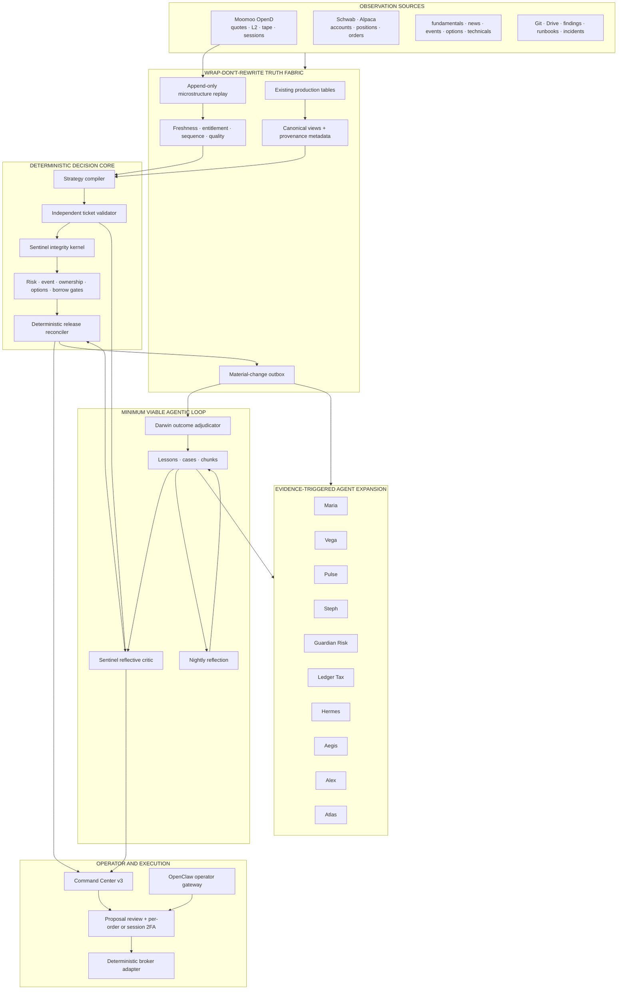

25. **The current dashboard remains available until the new dashboard proves parity and rollback.**
26. **Every broker action is capability-resolved at runtime; a UI label never implies unsupported native functionality.**
27. **Automatic broker failover is permitted only among fallback accounts already authorized in the session envelope.**
28. **Cancel-all must preserve protection by default; flatten must prioritize verified flatness over optimistic price improvement.**
29. **Quick-add actions cannot increase exposure beyond the signed share, notional, concentration, or loss envelope.**
30. **A read-only architectural reviewer may challenge the design but may not edit, commit, merge, deploy, or alter guardrails.**
31. **An unattended implementation run stops on uncertainty, records the checkpoint, synchronizes evidence, and notifies the operator.**

---

# 4. MINIMUM VIABLE LOOP — THE FIRST AGENTIC PRODUCT

The Minimum Viable Loop, or MVL, is the first required proof.

It contains only:

```text
Sentinel
Knowledge Base
Darwin
Nightly Reflection
```

One immune cell. One memory. One scorekeeper. One dream cycle.

Atlas-grade generalized orchestration is deferred until the MVL works end to end.

## 4.1 MVL components

### Sentinel

Two internal layers:

1. **Sentinel Integrity Kernel**  
   Deterministic invariants, synchronous, mandatory.

2. **Sentinel Reflective Critic**  
   Retrieval-grounded local/OAuth/premium criticism, asynchronous according to release class.

Sentinel can verdict and quarantine. It cannot edit a ticket or grant proposal authority.

### Knowledge Base

Initial stores:

```text
kb_lessons
kb_cases
kb_chunks
```

Initial retrieval facade:

```text
kb.search
kb.get_lesson
kb.get_case
kb.find_contradictions
```

### Darwin

Darwin joins artifacts to outcomes and scores:

- ticket quality;
- Sentinel detections;
- false alarms;
- abstentions;
- operator dispositions;
- eventual market outcomes;
- operational cost and latency.

Darwin cannot promote a rule.

### Nightly Reflection

One bounded nightly run reads new cases and exceptions, then writes:

- candidate lessons;
- candidate hypotheses;
- unresolved contradictions;
- stale lessons;
- suggested experiments.

It does not change production behavior.

## 4.2 MVL minimal schema

Do not begin with fourteen runtime tables.

MVL requires:

```text
agent_runs
agent_artifacts
agent_tool_calls
agent_reviews
agent_scores
kb_lessons
kb_cases
kb_chunks
```

Expansion tables are added only when a concrete runtime need appears.

## 4.3 MVL proof

The MVL is accepted only after all of the following:

```text
100 reviewed Watch artifacts
>= 20 known-bad regression fixtures
retrieval recorded on >= 95% of eligible Sentinel reviews
0 deterministic failures released
Sentinel false-positive rate measured
Darwin scoring complete for >= 95% of artifacts
nightly reflection creates candidate lessons
Iris or operator can ratify/reject lessons
no production config mutation
no broker call
```

## 4.4 MVL non-goals

The MVL does not require:

- a general multi-agent scheduler;
- all named agents as processes;
- Moomoo;
- premium models;
- autonomous code changes;
- a message broker;
- a new database;
- a rewrite of existing pipelines.

---

# 5. WRAP-DON'T-REWRITE DATA ARCHITECTURE

The phrase “canonical truth plane” does not authorize a re-platforming project.

## 5.1 General rule

Existing tables remain sources of record where they already work.

Agentic integration arrives through:

- provenance columns;
- compatibility views;
- normalized read models;
- materialized snapshots;
- append-only outbox events;
- source hashes;
- temporal validity;
- adapters.

No existing consumer must migrate before Sentinel, the KB, or Darwin can go live.

## 5.2 Observation envelope

Every new or wrapped observation should expose:

```yaml
source_system:
source_record_id:
symbol_or_entity:
observed_at:
provider_at:
received_at:
normalized_at:
source_version:
source_hash:
quality_state:
freshness_state:
entitlement_state:
sequence_id:
payload_ref:
```

These fields may be implemented as:

- columns on new tables;
- wrapper views for existing tables;
- metadata side tables when modifying a mature table is risky.

## 5.3 New tables only for new concerns

New first-class storage is justified for:

- agent runs and artifacts;
- machine-readable lessons and cases;
- Moomoo subscription and data-quality state;
- high-frequency replay manifests;
- microstructure feature snapshots;
- scalp state and outcomes;
- hypothesis preregistration.

## 5.4 Compatibility views

Examples:

```text
v_canonical_quote
v_canonical_position
v_canonical_event
v_canonical_technical_state
v_canonical_watch_ticket
v_canonical_microstructure
v_agent_case_context
```

Views expose a stable contract while underlying sources evolve.

## 5.5 Event outbox

Material changes are written to a durable outbox:

```text
market_fact_changed
ticket_compiled
ticket_validation_failed
ticket_released
ticket_quarantined
review_completed
position_changed
event_changed
microstructure_regime_changed
case_closed
lesson_ratified
hypothesis_registered
```

Agents consume outbox events; they do not poll arbitrary tables without ownership.

---

# 6. REFERENCE ARCHITECTURE



---

# 7. ISOLATED PRODUCT-UPGRADE LAB

No production product is upgraded in place.

## 7.1 Environment rings

```text
PROD
  Current pinned services and packages.
  Live channels and accounts.
  Production Bitwarden collection.
  No experimental upgrades.

SHADOW
  Candidate runtime on the same box with separate home, ports, users and state.
  Read-only production facts or replay.
  No live broker credentials.
  Test channels only.
  Writes only to lab/staging schemas.

LAB
  Unit, contract, replay and destructive tests.
  Synthetic or copied data.
  No production network authority.
```

## 7.2 Filesystem and identity

Recommended layout:

```text
/opt/trade-ai/runtime/openclaw/<version>/
/opt/trade-ai/runtime/hermes/<version>/
/opt/trade-ai/venvs/openai-sdk/<version>/
/opt/trade-ai/venvs/moomoo-sdk/<version>/

/var/lib/trade-ai-prod/
/var/lib/trade-ai-shadow/
/var/lib/trade-ai-lab/

/run/trade-ai-prod/secrets/
/run/trade-ai-shadow/secrets/
/run/trade-ai-lab/secrets/
```

Dedicated service identities:

```text
tradeai-prod
tradeai-shadow
tradeai-lab
```

No candidate process shares a mutable home directory with production.

## 7.3 Database isolation

```text
trade_ai_prod application role
trade_ai_shadow_ro read-only role
trade_ai_lab schema or cloned database
```

Shadow may read production through canonical views. It may not write production tables.

## 7.4 Channel isolation

- Production OpenClaw retains production Telegram/WhatsApp channels.
- Shadow OpenClaw uses a separate test bot, disabled outbound delivery, or an operator-only private channel.
- Candidate agents cannot post into production channels until promotion.
- No candidate receives production Gmail/Calendar/Drive write scopes unless its exact function requires a test tenant.

## 7.5 Secret isolation

- `trade-ai-lab` Bitwarden collection contains test-only provider keys and simulation credentials.
- No live Schwab, Alpaca, or future Moomoo trade credential is mounted in shadow or lab.
- Production BWS machine token is never copied to a candidate environment.
- Candidate OpenD testing uses data-only credentials or recorded replay.

## 7.6 Upgrade pipeline

```text
DISCOVER
  → create version record
  → download package and record hash/provenance
  → build isolated candidate
  → static compatibility checks
  → unit tests
  → API and schema contract tests
  → replay tests
  → shadow traffic
  → security review
  → performance comparison
  → canary
  → operator promotion
  → atomic switch
  → post-promotion observation
  → retain rollback
```

No `pip install -U`, `npm update`, or `hermes update` is run against production first.

## 7.7 Atomic promotion

Use versioned directories plus a controlled pointer:

```text
/opt/trade-ai/runtime/hermes/current
/opt/trade-ai/runtime/openclaw/current
```

Promotion changes the pointer and restarts the service.

Rollback restores the previous pointer and service definition.

Database migrations use expand/contract:

1. additive schema;
2. dual-read or compatibility view;
3. candidate validation;
4. production cutover;
5. delayed cleanup.

## 7.8 Candidate registry

```sql
CREATE TABLE runtime_candidates (
  product TEXT NOT NULL,
  installed_version TEXT,
  candidate_version TEXT NOT NULL,
  package_hash TEXT NOT NULL,
  source_uri_ref TEXT,
  environment TEXT NOT NULL,
  compatibility_state TEXT NOT NULL,
  security_state TEXT NOT NULL,
  replay_state TEXT NOT NULL,
  shadow_state TEXT NOT NULL,
  approved_by TEXT,
  approved_at TIMESTAMPTZ,
  promoted_at TIMESTAMPTZ,
  rollback_version TEXT,
  notes JSONB,
  PRIMARY KEY (product, candidate_version, environment)
);
```

## 7.9 Current public candidate snapshot

This is a discovery snapshot, not permission to upgrade.

| Product | Current production evidence | Public candidate on 2026-07-22 | Architecture ruling |
|---|---|---|---|
| OpenAI Python SDK | repo pin reported as `2.30.0` | `2.46.0` | Test in isolated venv; prefer Responses API for new direct integrations |
| OpenAI Agents SDK | not a production prerequisite | `0.18.3` | Laboratory evaluation only; do not create a third orchestrator without ADR |
| Hermes Agent | last documented global install `0.16.0` | `0.19.0` | Candidate venv with Python 3.13; Hermes 0.19 requires Python >=3.11,<3.14 |
| OpenClaw | live version must be verified; later evidence reported 2026.6.11 | stable `2026.7.1-2` | Side-by-side home, port and test channel; stable only |
| Moomoo OpenD | not yet canonical production service | `10.9.6908` documented 2026-07-15 | Data-only candidate; replay first; one live session owner |
| Local Ollama models | live inventory required | no automatic replacement | Benchmark current models before any change |
| Embedding model | conflicting docs | decide after retrieval audit | Dual-index migration, never blind re-embed |

## 7.10 Product-specific upgrade logic

### OpenAI Python SDK

Candidate tests:

- import and startup;
- Responses API;
- existing Chat Completions paths;
- structured output;
- streaming events;
- retry and timeout behavior;
- usage accounting;
- request IDs;
- OAuth-proxy independence;
- model registry compatibility;
- cost guards;
- Python runtime.

The SDK upgrade does not automatically change models.

### OpenAI Agents SDK

Use only in a laboratory comparison.

Evaluate whether it provides measurable benefit for:

- tracing;
- sandbox separation;
- checkpoints;
- handoffs;
- eval integration.

OpenClaw and Hermes already provide orchestration capabilities. Adding the Agents SDK to production without a consolidation ADR would duplicate state and tools.

### Hermes

Hermes candidate runs with:

```text
HERMES_HOME=/var/lib/trade-ai-shadow/hermes
Python 3.13 venv
read-only canonical views
staging-only tools
no production profiles
no auto-graft
no config promotion
```

Required tests:

- profile import;
- memory isolation;
- tool allowlist;
- MCP;
- scheduled runs;
- model routes;
- checkpoint/resume;
- staging writes;
- denial of production writes;
- cost accounting;
- output schema.

### OpenClaw

Candidate runs with:

```text
OPENCLAW_HOME=/var/lib/trade-ai-shadow/openclaw
separate workspace
separate gateway port
test Telegram bot or outbound disabled
read-only Trade AI MCP
```

Required tests:

- channel isolation;
- OAuth routes;
- MCP permissions;
- scheduled-run status;
- run cancellation;
- session resume;
- agent workspace loading;
- tool-result handling;
- prompt injection boundaries;
- no production secret inheritance.

### Moomoo SDK and OpenD

The Python SDK can be tested side-by-side against recorded replay or a mock OpenD.

Because OpenD session ownership may be exclusive:

- do not launch two production-authenticated OpenD instances;
- test a new OpenD binary against replay or a separate data-only identity;
- schedule a controlled data-only canary when binary compatibility must be proven;
- keep the prior binary and config for immediate rollback.

---

# 8. AGENT ROSTER AND ACTIVATION POLICY

## 8.1 Canonical roster

| Stable ID | Display name | Role | Activation |
|---|---|---|---|
| `sentinel` | Sentinel | Decision integrity and ticket contradiction review | MVL |
| `darwin` | Darwin | Outcome join, scoring, calibration evidence | MVL |
| `iris` | Iris | Knowledge curation and lesson lifecycle | MVL support |
| `reflection` | Nightly Reflection | Case-to-lesson/hypothesis generation | MVL |
| `argus` | Argus | Population-wide integrity scan | Phase 2 |
| `maria` | Maria | Fundamental and catalyst research | Existing capability; durable later |
| `vega` | Vega | Technical structure and setup lifecycle | After technical artifacts stabilize |
| `pulse` | Pulse | Moomoo microstructure interpretation | After Moomoo feature plane |
| `steph` | Steph | Portfolio and account allocation | Existing capability; durable later |
| `risk_agent` | Guardian Risk | Portfolio and ticket risk critic | Existing ID retained |
| `tax_agent` | Ledger Tax | Tax, wash sale, account constraints | Existing ID retained |
| `hermes` | Hermes | Hypothesis discovery and experiment design | After KB and Darwin |
| `aegis` | Aegis | Incident and reliability investigation | After case pipeline |
| `alex` | Alex | CIO synthesis for unresolved trade-offs | After lower layers are reliable |
| `concierge` | Concierge | OpenClaw operator interface | After governed tools |
| `atlas` | Atlas | General durable-workflow orchestrator | Deferred until MVL evidence |

## 8.2 Agent contract

```yaml
agent_id:
agent_version:
objective:
allowed_job_types:
allowed_tools:
denied_tools:
retrieval_policy:
artifact_schema:
review_policy:
budget:
deadline:
stop_conditions:
score_policy:
deployment_state:
```

## 8.3 Agent lifecycle

```text
DESIGNED
SHADOW
OPERATIONAL
RESTRICTED
RETOOL
RETIRED
```

No agent becomes `OPERATIONAL` without:

- tool permission review;
- artifact schema;
- regression fixtures;
- scoring method;
- owner;
- rollback/disable control.

---

# 9. SENTINEL RELEASE CLASSES AND SLA

The integrity layer must not wedge the operator surface.

## 9.1 Sentinel architecture

```text
SENTINEL INTEGRITY KERNEL
  deterministic invariants
  synchronous
  mandatory
  no model dependency

SENTINEL REFLECTIVE CRITIC
  KB retrieval
  local/OAuth/premium model review
  asynchronous
  release-class policy
```

## 9.2 SLA and failure semantics

| Release class | Page publication | Reflective-review deadline | Failure behavior |
|---|---|---:|---|
| Research display | Publish after deterministic pass | target 5 min | Fail open for display, visibly `MODEL REVIEW UNAVAILABLE`; never proposal-eligible from this state |
| Watch candidate | Publish state and evidence after deterministic pass | target 5 min | Keep `REVIEW_PENDING`; mechanics follow deterministic gate |
| Proposal-eligible entry | Publish card immediately, block proposal | hard 6 min default | Timeout becomes `REVIEW_REQUIRED_TIMEOUT`; no silent fallback and no hung request |
| High-risk/exception | Publish as review-required | operator-controlled | Requires configured review policy; premium only after cost confirmation |
| Held-position risk review | Deterministic position-management truth publishes | asynchronous | Agent unavailability cannot block protective truth |
| Protective stop/fire/kill path | No Sentinel dependency | none | Deterministic path only |

Deadlines are configuration defaults and must be measured against actual local-model latency before promotion.

## 9.3 Sentinel kernel invariants

Examples:

```text
current price coherent with entry
entry mode coherent with trigger
stop direction valid
target direction valid
R:R independently recomputes
blocked state has no current mechanics
no-trade preferred has no constructive mechanics
missed entry has no actionable mechanics
legacy packet is visibly unverified
held symbol does not use starter-entry ticket as primary
header, selected family and action policy agree
ticket, input and validation hashes match
required facts are current
watch level is not mislabeled as entry
previous plan is not current plan
```

## 9.4 Reflective critique

Sentinel retrieves:

- applicable ratified lessons;
- disputed lessons;
- analogous cases;
- prior tickets;
- compiler/validator incidents;
- setup outcomes;
- current source-quality notices.

It returns:

```yaml
verdict: PASS|CAUTION|REJECT|QUARANTINE|INSUFFICIENT_EVIDENCE
contradictions: []
missing_evidence: []
stale_evidence: []
forced_trade_risk: []
lesson_refs: []
case_refs: []
questions: []
```

It cannot alter the ticket.

---

# 10. KNOWLEDGE BRAIN

## 10.1 Lessons

```sql
CREATE TABLE kb_lessons (
  lesson_id UUID PRIMARY KEY,
  statement TEXT NOT NULL,
  scope JSONB NOT NULL,
  status TEXT NOT NULL,
  confidence NUMERIC,
  effective_from TIMESTAMPTZ,
  effective_until TIMESTAMPTZ,
  evidence_refs JSONB NOT NULL DEFAULT '[]',
  counterevidence_refs JSONB NOT NULL DEFAULT '[]',
  supersedes JSONB NOT NULL DEFAULT '[]',
  superseded_by UUID,
  source_type TEXT NOT NULL,
  source_snapshot JSONB,
  ratified_by TEXT,
  ratified_at TIMESTAMPTZ,
  embedding_model TEXT,
  embedding_version TEXT,
  embedding VECTOR,
  created_at TIMESTAMPTZ NOT NULL DEFAULT NOW(),
  updated_at TIMESTAMPTZ NOT NULL DEFAULT NOW()
);
```
