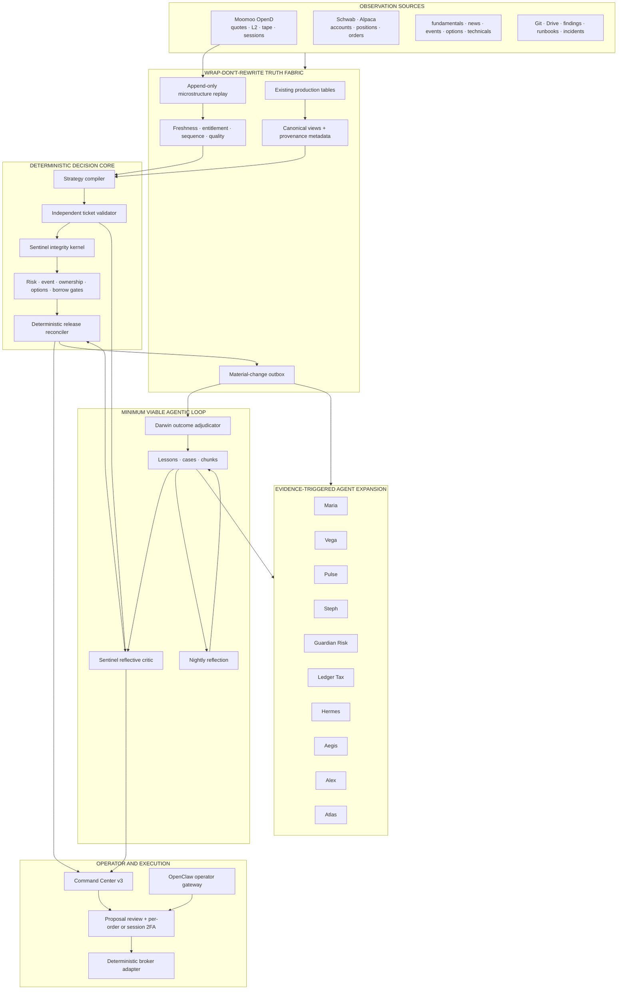

25. **The current dashboard remains available until the new dashboard proves parity and rollback.**
26. **Every broker action is capability-resolved at runtime; a UI label never implies unsupported native functionality.**
27. **Automatic broker failover is permitted only among fallback accounts already authorized in the session envelope.**
28. **Cancel-all must preserve protection by default; flatten must prioritize verified flatness over optimistic price improvement.**
29. **Quick-add actions cannot increase exposure beyond the signed share, notional, concentration, or loss envelope.**
30. **A read-only architectural reviewer may challenge the design but may not edit, commit, merge, deploy, or alter guardrails.**
31. **An unattended implementation run stops on uncertainty, records the checkpoint, synchronizes evidence, and notifies the operator.**

---

# 4. MINIMUM VIABLE LOOP — THE FIRST AGENTIC PRODUCT

The Minimum Viable Loop, or MVL, is the first required proof.

It contains only:

```text
Sentinel
Knowledge Base
Darwin
Nightly Reflection
```

One immune cell. One memory. One scorekeeper. One dream cycle.

Atlas-grade generalized orchestration is deferred until the MVL works end to end.

## 4.1 MVL components

### Sentinel

Two internal layers:

1. **Sentinel Integrity Kernel**  
   Deterministic invariants, synchronous, mandatory.

2. **Sentinel Reflective Critic**  
   Retrieval-grounded local/OAuth/premium criticism, asynchronous according to release class.

Sentinel can verdict and quarantine. It cannot edit a ticket or grant proposal authority.

### Knowledge Base

Initial stores:

```text
kb_lessons
kb_cases
kb_chunks
```

Initial retrieval facade:

```text
kb.search
kb.get_lesson
kb.get_case
kb.find_contradictions
```

### Darwin

Darwin joins artifacts to outcomes and scores:

- ticket quality;
- Sentinel detections;
- false alarms;
- abstentions;
- operator dispositions;
- eventual market outcomes;
- operational cost and latency.

Darwin cannot promote a rule.

### Nightly Reflection

One bounded nightly run reads new cases and exceptions, then writes:

- candidate lessons;
- candidate hypotheses;
- unresolved contradictions;
- stale lessons;
- suggested experiments.

It does not change production behavior.

## 4.2 MVL minimal schema

Do not begin with fourteen runtime tables.

MVL requires:

```text
agent_runs
agent_artifacts
agent_tool_calls
agent_reviews
agent_scores
kb_lessons
kb_cases
kb_chunks
```

Expansion tables are added only when a concrete runtime need appears.

## 4.3 MVL proof

The MVL is accepted only after all of the following:

```text
100 reviewed Watch artifacts
>= 20 known-bad regression fixtures
retrieval recorded on >= 95% of eligible Sentinel reviews
0 deterministic failures released
Sentinel false-positive rate measured
Darwin scoring complete for >= 95% of artifacts
nightly reflection creates candidate lessons
Iris or operator can ratify/reject lessons
no production config mutation
no broker call
```

## 4.4 MVL non-goals

The MVL does not require:

- a general multi-agent scheduler;
- all named agents as processes;
- Moomoo;
- premium models;
- autonomous code changes;
- a message broker;
- a new database;
- a rewrite of existing pipelines.

---

# 5. WRAP-DON'T-REWRITE DATA ARCHITECTURE

The phrase “canonical truth plane” does not authorize a re-platforming project.

## 5.1 General rule

Existing tables remain sources of record where they already work.

Agentic integration arrives through:

- provenance columns;
- compatibility views;
- normalized read models;
- materialized snapshots;
- append-only outbox events;
- source hashes;
- temporal validity;
- adapters.

No existing consumer must migrate before Sentinel, the KB, or Darwin can go live.

## 5.2 Observation envelope

Every new or wrapped observation should expose:

```yaml
source_system:
source_record_id:
symbol_or_entity:
observed_at:
provider_at:
received_at:
normalized_at:
source_version:
source_hash:
quality_state:
freshness_state:
entitlement_state:
sequence_id:
payload_ref:
```

These fields may be implemented as:

- columns on new tables;
- wrapper views for existing tables;
- metadata side tables when modifying a mature table is risky.

## 5.3 New tables only for new concerns

New first-class storage is justified for:

- agent runs and artifacts;
- machine-readable lessons and cases;
- Moomoo subscription and data-quality state;
- high-frequency replay manifests;
- microstructure feature snapshots;
- scalp state and outcomes;
- hypothesis preregistration.

## 5.4 Compatibility views

Examples:

```text
v_canonical_quote
v_canonical_position
v_canonical_event
v_canonical_technical_state
v_canonical_watch_ticket
v_canonical_microstructure
v_agent_case_context
```

Views expose a stable contract while underlying sources evolve.

## 5.5 Event outbox

Material changes are written to a durable outbox:

```text
market_fact_changed
ticket_compiled
ticket_validation_failed
ticket_released
ticket_quarantined
review_completed
position_changed
event_changed
microstructure_regime_changed
case_closed
lesson_ratified
hypothesis_registered
```

Agents consume outbox events; they do not poll arbitrary tables without ownership.

---

# 6. REFERENCE ARCHITECTURE



---

# 7. ISOLATED PRODUCT-UPGRADE LAB

No production product is upgraded in place.

## 7.1 Environment rings

```text
PROD
  Current pinned services and packages.
  Live channels and accounts.
  Production Bitwarden collection.
  No experimental upgrades.

SHADOW
  Candidate runtime on the same box with separate home, ports, users and state.
  Read-only production facts or replay.
  No live broker credentials.
  Test channels only.
  Writes only to lab/staging schemas.

LAB
  Unit, contract, replay and destructive tests.
  Synthetic or copied data.
  No production network authority.
```

## 7.2 Filesystem and identity

Recommended layout:

```text
/opt/trade-ai/runtime/openclaw/<version>/
/opt/trade-ai/runtime/hermes/<version>/
/opt/trade-ai/venvs/openai-sdk/<version>/
/opt/trade-ai/venvs/moomoo-sdk/<version>/

/var/lib/trade-ai-prod/
/var/lib/trade-ai-shadow/
/var/lib/trade-ai-lab/

/run/trade-ai-prod/secrets/
/run/trade-ai-shadow/secrets/
/run/trade-ai-lab/secrets/
```

Dedicated service identities:

```text
tradeai-prod
tradeai-shadow
tradeai-lab
```

No candidate process shares a mutable home directory with production.

## 7.3 Database isolation

```text
trade_ai_prod application role
trade_ai_shadow_ro read-only role
trade_ai_lab schema or cloned database
```

Shadow may read production through canonical views. It may not write production tables.

## 7.4 Channel isolation

- Production OpenClaw retains production Telegram/WhatsApp channels.
- Shadow OpenClaw uses a separate test bot, disabled outbound delivery, or an operator-only private channel.
- Candidate agents cannot post into production channels until promotion.
- No candidate receives production Gmail/Calendar/Drive write scopes unless its exact function requires a test tenant.

## 7.5 Secret isolation

- `trade-ai-lab` Bitwarden collection contains test-only provider keys and simulation credentials.
