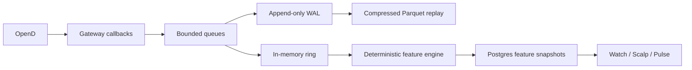

held symbol does not use starter-entry ticket as primary
header, selected family and action policy agree
ticket, input and validation hashes match
required facts are current
watch level is not mislabeled as entry
previous plan is not current plan
```

## 9.4 Reflective critique

Sentinel retrieves:

- applicable ratified lessons;
- disputed lessons;
- analogous cases;
- prior tickets;
- compiler/validator incidents;
- setup outcomes;
- current source-quality notices.

It returns:

```yaml
verdict: PASS|CAUTION|REJECT|QUARANTINE|INSUFFICIENT_EVIDENCE
contradictions: []
missing_evidence: []
stale_evidence: []
forced_trade_risk: []
lesson_refs: []
case_refs: []
questions: []
```

It cannot alter the ticket.

---

# 10. KNOWLEDGE BRAIN

## 10.1 Lessons

```sql
CREATE TABLE kb_lessons (
  lesson_id UUID PRIMARY KEY,
  statement TEXT NOT NULL,
  scope JSONB NOT NULL,
  status TEXT NOT NULL,
  confidence NUMERIC,
  effective_from TIMESTAMPTZ,
  effective_until TIMESTAMPTZ,
  evidence_refs JSONB NOT NULL DEFAULT '[]',
  counterevidence_refs JSONB NOT NULL DEFAULT '[]',
  supersedes JSONB NOT NULL DEFAULT '[]',
  superseded_by UUID,
  source_type TEXT NOT NULL,
  source_snapshot JSONB,
  ratified_by TEXT,
  ratified_at TIMESTAMPTZ,
  embedding_model TEXT,
  embedding_version TEXT,
  embedding VECTOR,
  created_at TIMESTAMPTZ NOT NULL DEFAULT NOW(),
  updated_at TIMESTAMPTZ NOT NULL DEFAULT NOW()
);
```

Statuses:

```text
CANDIDATE
RATIFIED
DISPUTED
DEPRECATED
SUPERSEDED
REJECTED
```

## 10.2 Cases

A case captures the point-in-time reality of:

- a trade;
- a rejected ticket;
- a stale-data incident;
- a broker discrepancy;
- a Watch contradiction;
- an agent failure;
- an outage;
- a Moomoo sequence gap;
- a scalp fire;
- a successful abstention.

```yaml
case_id:
case_type:
opened_at:
closed_at:
entities:
facts_snapshot:
artifact_refs:
operator_disposition:
execution_refs:
outcome:
mfe:
mae:
costs:
slippage:
retrospective:
lesson_candidates:
source_sha:
```

## 10.3 Chunks

Chunks retain:

- document identity;
- source SHA;
- line/section locator;
- time validity;
- access classification;
- embedding model/version;
- deprecation state.

## 10.4 Retrieval

Retrieval is hybrid:

1. exact identifiers;
2. structured scope;
3. temporal validity;
4. BM25/keyword;
5. semantic similarity;
6. evidence quality;
7. recency;
8. contradiction search.

An agent receives supporting and conflicting knowledge.

## 10.5 Memory-poisoning controls

- Agent-generated lessons begin as `CANDIDATE`.
- A lesson cannot cite itself.
- High-impact lessons require human ratification.
- Every retrieval result exposes provenance.
- Deprecated lessons remain auditable but are excluded by default.
- Prompt-injected documents cannot promote themselves.
- Secret-bearing text is excluded from indexing.
- External content remains `UNTRUSTED_SOURCE` until normalized.

## 10.6 Embedding migration

Before selecting an embedding model:

- verify live Ollama inventory;
- verify current stored dimensions;
- build a retrieval benchmark;
- create a parallel index;
- compare recall, precision, latency and storage;
- promote the index pointer;
- retain the prior index until observation completes.

---

# 11. DARWIN OUTCOME ADJUDICATION

Darwin scores artifacts, not personalities.

## 11.1 Sentinel metrics

- true contradictions;
- false alarms;
- harmful tickets blocked;
- valid tickets delayed;
- citation precision;
- abstention quality;
- review latency;
- review cost.

## 11.2 Decision metrics

- ticket validity;
- state consistency;
- MFE/MAE;
- realized or simulated outcome;
- opportunity cost of abstention;
- data-quality failures;
- operator overrides;
- execution slippage;
- risk-limit adherence.

## 11.3 Scoring independence

- Sentinel cannot score Sentinel.
- The compiler cannot validate the compiler.
- Hermes cannot adjudicate Hermes hypotheses.
- Darwin calculations are versioned and deterministic.
- Human review is required for metric-definition changes.

---

# 12. NIGHTLY REFLECTION AND HERMES SCIENTIFIC LOOP

## 12.1 Nightly reflection

One bounded run per night:

```text
new cases
+ new exceptions
+ agent errors
+ false positives
+ missed opportunities
+ source drift
+ Moomoo quality incidents
+ scalp fires and outcomes
→ candidate lessons
→ candidate hypotheses
→ unresolved questions
```

No production mutation.

## 12.2 Hermes charter

Hermes specializes in:

- anomaly discovery;
- hypothesis generation;
- counterfactual questions;
- experiment design;
- cohort definition;
- feature/threshold proposals;
- research synthesis.

Hermes may not:

- approve tickets;
- write production config;
- write broker state;
- alter risk gates;
- promote its own hypothesis;
- auto-graft behavior into the deterministic core.

## 12.3 Preregistered hypothesis

```yaml
hypothesis_id:
statement:
mechanism:
affected_population:
expected_direction:
expected_effect_size:
primary_metric:
secondary_metrics:
baseline:
train_window:
validation_window:
oos_window:
minimum_sample:
transaction_costs:
latency_assumption:
rejection_criteria:
expiry:
supporting_evidence:
counterevidence:
author_agent:
frozen_at:
source_sha:
```

No result is calculated before `frozen_at`.

## 12.4 Evaluation

Use:

- point-in-time replay;
- walk-forward;
- shadow cohorts;
- holdout windows;
- regime slices;
- transaction costs;
- fill assumptions;
- multiple-testing controls;
- missing-data disclosure.

## 12.5 Promotion

```text
REJECT
REVISE
CONTINUE_SHADOW
APPROVE_CONFIG_PROPOSAL
APPROVE_CODE_PR
DEPRECATE_PRIOR_RULE
```

Promotion is human/oversight gated.

---

# 13. MODEL AND PROVIDER ARCHITECTURE

## 13.1 Roles

| Layer | Role |
|---|---|
| Deterministic code | facts, formulas, freshness, eligibility, risk, release |
| Local Ollama | cheap first critic and classification |
| Grok OAuth | independent external challenge |
| ChatGPT/Codex OAuth | independent structural and evidence critique |
| Paid expert | operator-triggered escalation |
| Deterministic reconciler | preserves disagreement and controls release |

## 13.2 Independence

Each result records:

```text
provider_family
provider
route
auth_type
model
prompt_version
ticket_id
input_hash
validation_hash
response_hash
token_usage
cost
latency
```

A local lane that falls back to cloud is recorded as cloud and does not count as local independence.

## 13.3 Model registry

```yaml
model_id:
provider_family:
provider:
route:
auth_type:
capabilities:
context_window:
structured_output:
tool_use:
reasoning:
vision:
price:
latency_class:
enabled:
fallbacks:
last_capability_probe:
probe_artifact:
```

## 13.4 OpenAI direct API

New direct OpenAI integrations use the Responses API unless a documented compatibility need requires another endpoint.

Pinned model snapshots and application evals are required for repeatable production behavior.

## 13.5 OpenAI Agents SDK

The Agents SDK is a candidate harness, not the controlling runtime.

A laboratory ADR compares:

- OpenClaw native workflows;
- Hermes workflows;
- a small Agents SDK implementation.

The comparison measures:

- durable state;
- sandbox isolation;
- tracing;
- checkpoints;
- tool governance;
- operational complexity;
- cost;
- failure recovery.

Only one production control plane may own a run.

---

# 14. OPENCLAW OPERATING MODEL

OpenClaw is the reflective-agent runtime and operator gateway.

It may own:

- schedules and triggers for reflective work;
- run status;
- model routing;
- governed tool invocation;
- checkpoints;
- cancellation;
- operator commands;
- review requests;
- cost display;
- notifications.

It does not own:

- market truth;
- position truth;
- broker truth;
- risk truth;
- execution;
- approval;
- 2FA;
- configuration promotion.

## 14.1 Cron and systemd

Cron/systemd remain valid trigger and service mechanisms.

The distinction is:

```text
cron → one-shot script → output
```

versus:

```text
cron/event
  → durable agent run
  → retrieval
  → plan
  → governed tools
  → checkpoints
  → artifact
  → review
  → score
```

## 14.2 Operator commands

Examples:

```text
agent status <run>
agent cancel <run>
agent replay <run>
kb search <query>
kb case <id>
watch explain <symbol>
watch validate <symbol>
watch review <symbol>
moomoo status
moomoo quota
scalp status
scalp kill
model candidates
runtime rollback <product>
```

Commands create governed requests; they do not bypass policy.

---

# 15. MOOMOO MARKET-INTELLIGENCE PLANE

## 15.1 Initial scope

Moomoo OpenD is first a read-only provider for:

- real-time quotes;
- market depth available under entitlement;
- time and sales;
- real-time bars;
- extended-hours observations;
- sequence and provider timestamps;
- optional broker queue where entitled.

No live trade adapter is part of the initial implementation.

## 15.2 Service topology

```text
moomoo-opend.service
moomoo-gateway.service
moomoo-subscription-manager.service
moomoo-feature-engine.service
moomoo-replay-writer.service
moomoo-health-monitor.service
```

One gateway owns all subscriptions.

Other services consume normalized internal data, not OpenD directly.

## 15.3 Secrets and OpenD configuration

At service start:

1. dedicated service requests approved data-only secrets from Bitwarden render pipeline;
2. config and key material are written to `/run/trade-ai-prod/moomoo/`;
3. files are owned by the Moomoo service identity and mode `0600`;
4. OpenD starts;
5. the tmpfs content disappears on reboot.

No future live trade password is stored. A future live-trade phase requires an operator-present session unlock ceremony.

## 15.4 Subscription priority

```text
P0  held positions, live proposals, operator-selected symbols
P1  top verified Watch candidates and active alerts
P2  visible Watch cards and high-velocity movers
P3  rotating research universe
```

The manager:

- dynamically subscribes and unsubscribes;
- prevents duplicate ownership;
- records quota and entitlement state;
- preserves priority after reconnect;
- records deferred symbols;
- publishes coverage truth.

## 15.5 Feed tiers

Candidate symbol:

```text
QUOTE
K_1M
```

Armed or P0 symbol, subject to entitlement:

```text
QUOTE
ORDER_BOOK
TICKER
K_1M
BROKER optional
```

## 15.6 Raw event path



A broker such as Redis, NATS, or Redpanda is introduced only after a benchmark proves that the existing bounded queue and WAL cannot meet recovery or fan-out requirements.

## 15.7 PostgreSQL control tables

```text
md_subscription_state
md_entitlement_state
md_data_quality
md_feature_snapshot
md_replay_manifest
md_sequence_gap
md_session_state
```

Raw high-frequency events live outside the main OLTP store.

## 15.8 Deterministic features

- spread and spread percentile;
- top-of-book size;
- depth by level;
- order-book imbalance;
- weighted mid;
- microprice;
- depth slope;
- replenishment;
- cancellation bursts;
- tape velocity;
- aggressor balance;
- trade-size distribution;
- sweeps;
- absorption;
- VWAP;
- RVOL windows;
- ROC windows;
- LULD distance where available;
- sequence gaps;
- stale-book state;
- session and extended-hours liquidity.

## 15.9 Time integrity

Persist:

```text
exchange timestamp when available
provider/OpenD timestamp
gateway receive timestamp
feature timestamp
local monotonic sequence
session
reconnect epoch
```

Require chrony/NTP health.

## 15.10 Pulse

Pulse receives feature windows and replay excerpts.

Pulse may classify:

```text
LIQUIDITY_SUPPORTIVE
LIQUIDITY_THIN
BUY_PRESSURE
SELL_PRESSURE
ABSORPTION
SWEEP_RISK
SPREAD_UNSAFE
TAPE_CONFLICT
DATA_UNAVAILABLE
```

Pulse cannot:

- consume every tick through an LLM;
- create candidates from nothing;
- set size;
- mark a ticket verified;
- place an order;
- override risk or freshness.

---

# 16. MOMENTUM SCALP MODULE — GOVERNED DESIGN

The Momentum Scalp Module is a separate event-driven subsystem that consumes the daily decision universe.

All thresholds below are unvalidated defaults until shadow evidence exists.

## 16.1 Scope

```text
daily candidate and decision layer
        ↓
Moomoo real-time truth and deterministic features
        ↓
scalp eligibility and fire engine
        ↓
shadow outcome or simulation ticket
        ↓
approved live-canary stage with one session-scoped 2FA ceremony
```

Moomoo data does not create an arbitrary universe.

## 16.2 Candidate gate

Initial candidate:

- current daily tier or verified Watch candidate;
- long bias for v1;
- no deterministic event block;
- no blacklist;
- current data.

A WAIT candidate may upgrade only when:

- a new verified catalyst arrives after the daily run;
- RVOL and microstructure gates pass;
- the upgrade is logged separately for outcome scoring.

A deterministic NO-GO is never armed.

## 16.3 Tradability gate

Defaults pending validation:

- price band configured;
- spread below configured threshold;
- not halted or at a limit state;
- sufficient displayed depth relative to simulated size;
- current quote and session;
- entitlement supports the required feature set.

L1 fallback is a different strategy profile and is never silently treated as L2.

## 16.4 Momentum context

Candidate default features:

| Feature | Initial default |
|---|---:|
| price vs VWAP | at or above |
| 5-minute RVOL | >= 3.0 |
| 5-minute ROC | >= +0.8% |
| top-five-level imbalance | >= 0.60 |
| 60-second aggressor buy ratio | >= 0.58 |
| LULD distance | >= 2.0% where available |
| spread | <= 20 bps |

These are experiment seeds, not claimed edge.

## 16.5 State machine

```text
CANDIDATE
  → ARMED
  → FIRED
  → SHADOW_RECORDED
  → outcome scored

SIMULATION extension:
FIRED
  → SIM_STAGED
  → SIM_WORKING
  → SIM_FILLED
  → SIM_MANAGING
  → SIM_EXITING
  → SIM_FLAT

APPROVED LIVE-CANARY extension:
SESSION_2FA_PENDING
  → SESSION_AUTHORIZED
  → CANDIDATE
  → ARMED
  → FIRED
  → LIVE_STAGED
  → SESSION_POLICY_CHECK
  → WORKING
  → FILLED
  → PROTECTED
  → MANAGING
  → EXITING
  → FLAT

The one-time `SESSION_2FA_PENDING → SESSION_AUTHORIZED` transition occurs before automated live trading begins.

Every subsequent live order transition requires a successful deterministic session-policy check and hash match. No per-order 2FA occurs while the session remains valid.

## 16.6 Fire condition

Seed logic:

- break of recent five-minute high;
- tape aggression confirms;
- order-book state confirms;
- current RVOL is accelerating;
- no event, session, spread, LULD, quota, or data-quality block.

Rate limits are configured and scored.

## 16.7 Stay-in and exit thesis

Seed evidence:

- price relative to VWAP;
- flow inversion;
- structure low;
- elapsed time;
- LULD proximity;
- catalyst reversal;
- session close rule.

In shadow and simulation, every hypothetical exit is scored.

## 16.8 Execution and protective design

Live graduation requires broker-resident protection.

Client-only stops are prohibited for live scalp positions.

Required before a live entry can be authorized:

- complete immutable order envelope;
- account eligibility;
- position size;
- risk per share and total risk;
- protective stop;
- target/scale plan;
- time-in-force;
- idempotency key;
- active session authorization and hash binding;
- adapter capability proof;
- broker reconciliation proof;
- session risk-budget availability.

Where supported, submit a broker-native bracket or equivalent.

Where broker-native or equivalent independently survivable protection is unavailable, live scalp trading remains disabled for that account even when the session is authorized.

## 16.9 Smart-limit chase

Shadow, simulation, and an authorized live-canary session may use the same bounded deterministic repricing algorithm:

- limit only for entry;
- reference-price cap;
- maximum chase basis points;
- order TTL;
- cancel on spread blowout;
- cancel on flow reversal;
- partial-fill handling;
- complete audit trail.

No adaptive chase threshold is promoted without shadow and simulation evidence.

## 16.10 Account policy

The implementation begins in shadow and simulation.

The approved live canary uses only the account explicitly named in the signed session envelope. The initial live account should be the smallest approved taxable-account canary unless the architecture owner selects another eligible account.

Each live account requires:

- account-specific policy;
- adapter capability;
- sizing and loss limits;
- PDT/day-trade status;
- tax review;
- broker-native protection;
- inclusion in the session authorization envelope;
- architecture-owner live-arm approval.

## 16.11 Kill switch

```text
SESSION_REVOKED_FOR_NEW_ENTRIES
ENTRY_DISABLED
PROTECTION_PRESERVED
OPEN_SESSION_POSITIONS_MANAGED_TO_FLAT
SESSION_AUTHORIZED_EXITS_AUTOMATIC
BROKER_RESIDENT_STOPS_REMAIN_ACTIVE
OPERATOR_ALERTED
```

## 16.12 Validation ladder

```text
M0  data-only capture
M1  feature replay
M2  shadow fires, zero orders
M3  >= 60 scored fires and threshold evaluation
M4  simulation orders for >= 2 weeks
M5  failure injection and protection proof
M6  operator graduation review
M7  smallest live canary under one session-scoped 2FA authorization
```

M7 is architecture-owner approved by v3.1. Activation still requires every readiness and acceptance gate in P11.

## 16.13 Unresolved risks

- retail latency and adverse selection;
- data entitlements;
- client/server outage;
- PDT restrictions;
- halt behavior;
- extended-hours liquidity;
- broker-native protective capability;
- fill-model realism;
- home-server power and network resilience.

Before live graduation require:

- UPS;
- monitored network;
- defined recovery path;
- broker-native protection;
- account-rule verification;
- explicit negative-expectancy stop rule.

