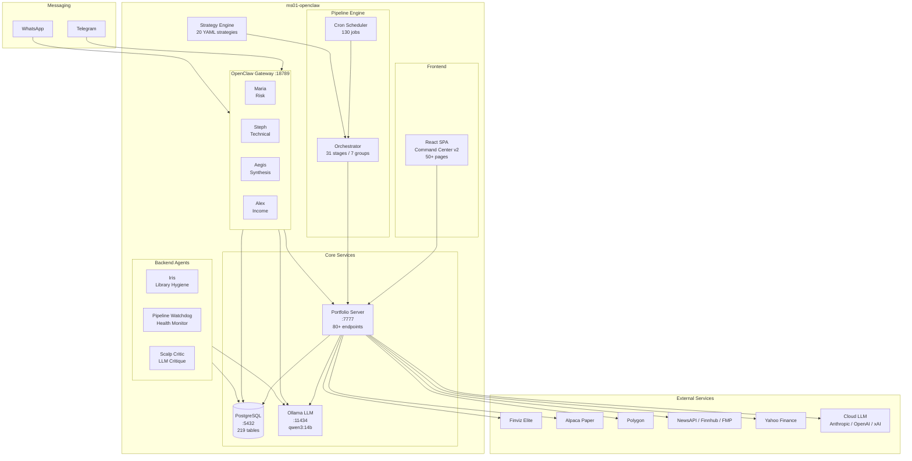
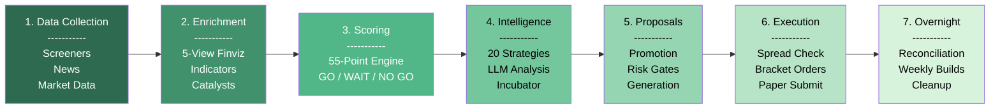

# Trade AI v12 -- Architecture Overview

## 1. What Is Trade AI v12?

Trade AI v12 is an automated trading intelligence platform running on a dedicated Linux server (`ms01-openclaw`). It manages a ~$1.19M portfolio in **paper trading mode only**, combining quantitative screening, multi-strategy classification, LLM-powered analysis, and conversational AI agents to generate, evaluate, and execute trade proposals.

The system is fully self-hosted with the exception of cloud LLM fallbacks and market data APIs.

---

## 2. Core Components

| Component | Port | Technology | Role |
|-----------|------|------------|------|
| Portfolio Server | 7777 | Python (Flask) | Central API hub, 80+ endpoints |
| PostgreSQL | 5432 | PostgreSQL 15 | 219 tables, all persistent state |
| Ollama LLM | 11434 | qwen3:14b on Intel Arc B50 | Local LLM inference (primary) |
| OpenClaw Gateway | 18789 | Python | 4 conversational agents (Maria, Steph, Aegis, Alex) |
| React SPA | -- | React (Command Center v2) | 50+ pages, operator dashboard |
| Cron Scheduler | -- | crontab | 130 scheduled jobs |

### LLM Routing

Requests are routed through a cascade to minimize cost and latency:

```
local (qwen3:14b) --> grok (xAI) --> claude (Anthropic) --> openai (OpenAI)
```

Configuration is centralized in `scripts/local_llm_config.py`.

---

## 3. Strategy Engine

Trade AI uses **20 strategies** loaded dynamically from `config/strategies/*.yaml`. There are no hardcoded strategy lists anywhere in the codebase. Each YAML file defines entry criteria, risk parameters, indicator requirements, and scoring weights. The multi-strategy classifier evaluates every candidate against all active strategies.

---

## 4. Pipeline

The orchestration pipeline has **31 stages organized into 7 groups**, running on a scheduled cadence from pre-market through overnight:

| # | Group | Stages | Schedule |
|---|-------|--------|----------|
| 1 | Data Collection | Finviz screeners, news ingestion, market data | 5:45--7:00 AM |
| 2 | Enrichment | Finviz 5-view enrichment, indicator engine, catalyst classification | 7:00--8:00 AM |
| 3 | Scoring | 55-point scoring engine, GO/WAIT/NO GO decisions | 8:00--8:15 AM |
| 4 | Intelligence | Multi-strategy classification, LLM analysis, incubator refresh | 8:15--8:30 AM |
| 5 | Proposals | Incubator promotion, proposal generation, risk checks | 8:30--9:00 AM |
| 6 | Execution | Spread/price validation, bracket order creation, paper submission | 9:00 AM+ (orchestrator runs) |
| 7 | Overnight | Portfolio reconciliation, weekly builds, cleanup | 8:00 PM+ |

---

## 5. Scale

- **292** Python scripts
- **130** cron jobs
- **80+** API endpoints
- **219** database tables
- **20** strategies (YAML-driven)
- **50+** frontend pages
- **7** agents (4 conversational + 3 backend)

---

## 6. Architecture Diagram



---

## 7. Pipeline Chevron Diagram



---

## 8. Data Flow Summary

```
Finviz Elite --> Screener --> DB (trade_ai_scans)
                                |
                                v
                         Enrichment (60+ fields)
                                |
                                v
                         Scoring Engine (55 pts)
                                |
                                v
                    Multi-Strategy Classifier (20 strategies)
                                |
                                v
                         Incubator Universe
                                |
                                v
                      Proposal Promoter (gates)
                                |
                                v
                     Execution Check (spread/risk)
                                |
                                v
                      Alpaca Paper Trading API
```

All state is persisted in PostgreSQL. JSON caches (`data/` directory) serve as fast-read layers for the frontend and agents.
