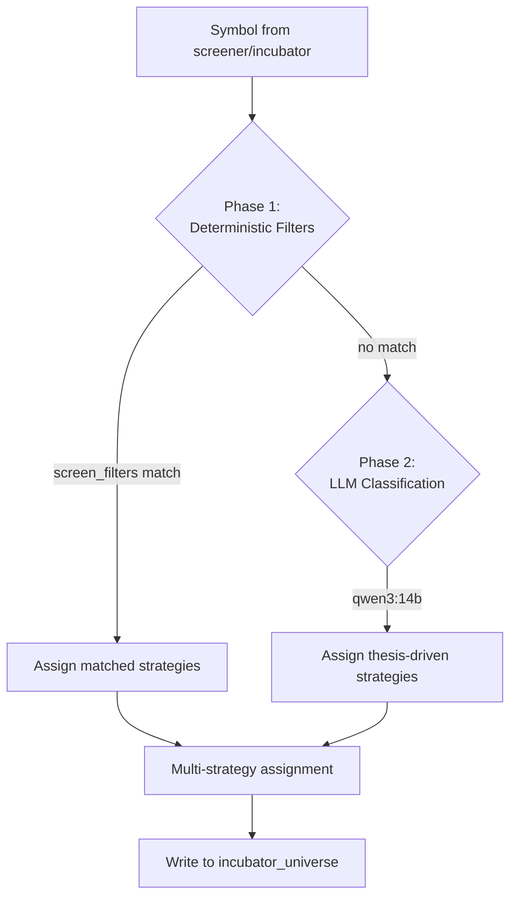
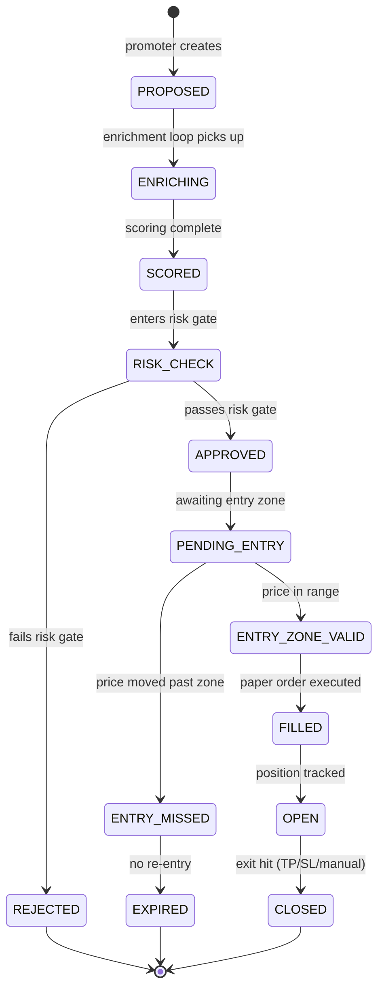

# Trade AI v12 -- Master System Documentation

**Owner:** John W. Whiting  
**Server:** ms01-openclaw (Linux)  
**Last updated:** 2026-05-08  
**Status:** Paper trading validation (6-month window before live)

Trade AI v12 is an automated trading intelligence and portfolio management platform. It combines Finviz Elite screeners, a 31-stage data pipeline, 20 dynamically loaded strategies, LLM-assisted classification, and a 4-agent conversational layer to surface, score, incubate, and paper-trade equity setups against a ~$1.19M portfolio (taxable + IRA).

---

## Table of Contents

1. [Runtime Topology](#runtime-topology)
2. [Database](#database)
3. [Pipeline Architecture](#pipeline-architecture)
4. [Screener System](#screener-system)
5. [Strategy System](#strategy-system)
6. [Incubator Pipeline](#incubator-pipeline)
7. [Proposal Lifecycle](#proposal-lifecycle)
8. [Agent Layer](#agent-layer)
9. [LLM Configuration](#llm-configuration)
10. [API Layer](#api-layer)
11. [Frontend](#frontend)
12. [Notification Channels](#notification-channels)
13. [Cron Schedule](#cron-schedule)
14. [Safety Rules](#safety-rules)
15. [Key File Locations](#key-file-locations)
16. [Known Constraints](#known-constraints)
17. [Glossary](#glossary)

---

## Runtime Topology

| Service | Port | Process / Notes |
|---------|------|-----------------|
| Portfolio server | 7777 | `scripts/portfolio_server.py` -- HTTP API + React frontend |
| PostgreSQL 15 | 5432 | Database `trade_ai`, user `trade_ai` |
| Ollama LLM | 11434 | Model `qwen3:14b`, Intel Arc B50 GPU (Vulkan) |
| OpenClaw gateway | 18789 | Conversational agent routing |
| Scalp WebSocket | 7778 / 7779 | Real-time scalp feed |
| Frontend (Vite) | served via 7777 | React SPA at `/v2/`, 50+ pages |

**Project root:** `/home/johnclaw/trade-ai-v12-rebuild/trade-ai-v12-rebuild`

---

## Database

- **Engine:** PostgreSQL 15
- **Table count:** 219
- **Connection:** port 5432, database `trade_ai`, user `trade_ai`

### Key Tables

| Table | Purpose |
|-------|---------|
| `trade_ai_scans` | Screener scan results with scores |
| `paper_trade_proposals` | Proposals promoted from incubator |
| `incubator_universe` | Active incubator symbols + strategy assignments |
| `paper_trades` | Executed paper trades |
| `watchlist_agent_results` | Agent-generated watchlist analysis |
| `intelligence_entities` | Entity extraction from news/filings |
| `news_articles` | Ingested news corpus |
| `indicator_confluence_cache` | Pre-computed technical indicator values |
| `pipeline_runs` | Pipeline execution log |
| `strategy_signals` | Strategy-level signal history |

---

## Pipeline Architecture

The pipeline runs 31 stages organized into 7 groups. Each group has a designated time window and dependency chain.

```mermaid
flowchart LR
    subgraph G1["GROUP 1: DATA COLLECTION\n6-7 AM M-F"]
        A1[finviz_screener_runner]
        A2[social_ingest]
        A3[news_ingestion]
        A4[fred_data_ingest]
        A5[sec_data_ingest]
    end

    subgraph G2["GROUP 2: ENRICHMENT\n7-8 AM M-F"]
        B1[finviz_enrichment]
        B2[catalyst_enrichment]
        B3[symbol_enrichment]
        B4[rag_indexer]
    end

    subgraph G3["GROUP 3: SCORING\n8-9 AM M-F"]
        C1[trade_ai_orchestrator]
        C2[indicator_engine]
        C3[premarket_watcher]
        C4[agent_router]
    end

    subgraph G4["GROUP 4: INTELLIGENCE\ncontinuous"]
        D1[process_watchlist_agent_jobs]
        D2[agent_watchlist_engine]
        D3[cio_decision_engine]
        D4[pipeline_watchdog]
    end

    subgraph G5["GROUP 5: PROPOSAL PIPELINE"]
        E1[weekly_incubator_builder]
        E2[daily_incubator_refresh]
        E3[incubator_rolloff_engine]
        E4[incubator_proposal_promoter]
        E5[proposal_enrichment_loop]
        E6[proposal_lifecycle]
    end

    subgraph G6["GROUP 6: EXECUTION\nmarket hours"]
        F1[risk_gate]
        F2[paper_proposals_ui]
        F3[alpaca_paper]
        F4[broker_reconciliation]
        F5[execution_quality]
    end

    subgraph G7["GROUP 7: OVERNIGHT\n8 PM - 6 AM"]
        H1[overnight_batch]
        H2[agent_outcome_scorer]
        H3[strategy_weekly_review]
        H4[overnight_batch_embeddings]
    end

    G1 --> G2 --> G3 --> G4
    G4 --> G5 --> G6
    G6 --> G7
    G7 -->|next day| G1
```



### Group Details

**GROUP 1 -- DATA COLLECTION (6-7 AM M-F)**

| Stage | Description |
|-------|-------------|
| `finviz_screener_runner` | Runs 2 Finviz Elite screeners at 4 time windows |
| `social_ingest` | Social media sentiment ingestion |
| `news_ingestion` | Multi-source news feed pull |
| `fred_data_ingest` | Federal Reserve economic data |
| `sec_data_ingest` | SEC filings ingestion |

**GROUP 2 -- ENRICHMENT (7-8 AM M-F)**

| Stage | Description |
|-------|-------------|
| `finviz_enrichment` | 60+ fields per symbol from Finviz |
| `catalyst_enrichment` | 7 sources: Finnhub, NewsAPI, Polygon, FMP, AlphaVantage, Finviz, Yahoo |
| `symbol_enrichment` | Fundamental + structural data |
| `rag_indexer` | Embedding generation for RAG retrieval |

**GROUP 3 -- SCORING (8-9 AM M-F)**

| Stage | Description |
|-------|-------------|
| `trade_ai_orchestrator` | 23-stage pipeline, 55-point scoring system |
| `indicator_engine` | 17 technical indicators |
| `premarket_watcher` | Pre-market gap and volume detection |
| `agent_router` | Routes symbols to appropriate agent analysis |

**GROUP 4 -- INTELLIGENCE (continuous)**

| Stage | Description |
|-------|-------------|
| `process_watchlist_agent_jobs` | Async agent job processor |
| `agent_watchlist_engine` | Agent-driven watchlist updates |
| `cio_decision_engine` | Chief Investment Officer logic |
| `pipeline_watchdog` | Monitors all 31 stages for failures |

**GROUP 5 -- PROPOSAL PIPELINE**

| Stage | Description |
|-------|-------------|
| `weekly_incubator_builder` | Multi-strategy classifier across 20 strategies |
| `daily_incubator_refresh` | Score/RVOL/catalyst freshness updates |
| `incubator_rolloff_engine` | Removes decayed or disqualified symbols |
| `incubator_proposal_promoter` | Promotes qualifying symbols to proposals |
| `proposal_enrichment_loop` | Continuous proposal data refresh |
| `proposal_lifecycle` | State machine transitions |

**GROUP 6 -- EXECUTION (market hours)**

| Stage | Description |
|-------|-------------|
| `risk_gate` | Pre-trade risk validation |
| `paper_proposals_ui` | UI-driven approval flow |
| `alpaca_paper` | Alpaca paper broker integration |
| `broker_reconciliation` | Verifies fills match expectations |
| `execution_quality` | Post-fill quality analysis |

**GROUP 7 -- OVERNIGHT (8 PM - 6 AM)**

| Stage | Description |
|-------|-------------|
| `overnight_batch` | Nightly data consolidation |
| `agent_outcome_scorer` | Grades past agent recommendations |
| `strategy_weekly_review` | Per-strategy performance review |
| `overnight_batch_embeddings` | Embedding refresh for RAG |

---

## Screener System

- **Source:** Finviz Elite (requires active subscription + cookie)
- **Config:** `assets/screeners.yaml`

### Active Screeners

| Screener | RVOL | Gap | Price | Float |
|----------|------|-----|-------|-------|
| `prime_setups` | >5x | >10% | $2-$20 | <50M |
| `watchlist_setups` | >3x | >5% | $1-$30 | <100M |

### Run Windows

| Window | Time |
|--------|------|
| 1 | 04:00 AM |
| 2 | 07:00 AM |
| 3 | 09:00 AM |
| 4 | 10:00 AM |

---

## Strategy System

All 20 strategies are loaded dynamically from `config/strategies/*.yaml` at runtime. There are no hardcoded strategy lists anywhere in the codebase.

### Strategy Classification Flow



**Phase 1 -- Deterministic filter matching:** Uses `screen_filters` from YAML + enrichment data (60+ Finviz fields + indicator cache).

**Phase 2 -- LLM-assisted classification:** Uses `qwen3:14b` for thesis-driven and sector-specific strategies where deterministic data is insufficient.

### Strategies by Timeframe

| Timeframe | Strategies |
|-----------|------------|
| INTRADAY | `gap_and_go`, `momentum_scalp` |
| SHORT_SWING | `earnings_catalyst`, `swing_breakout`, `swing_trade`, `speculative_growth`, `tax_loss_harvest` |
| MEDIUM_SWING | `recovery_watch`, `sector_rotation` |
| POSITION | 8 strategies (income, dividend, growth, etc.) |
| CASH | `cash_or_stable` |

A single symbol can match multiple strategies simultaneously via the multi-strategy classifier.

---

## Incubator Pipeline

The incubator is the holding area between raw screener hits and actionable proposals.

### Stage Flow

1. **`weekly_incubator_builder`** (Sunday 7 PM) -- Pulls qualified tickers from `trade_ai_scans` (score >= 30, RVOL >= 3, catalyst verified). Classifies each against all 20 strategies.

2. **`daily_incubator_refresh`** (daily) -- Updates scores, RVOL, and catalyst freshness. Calls `catalyst_enrichment` for symbols with stale data.

3. **`incubator_rolloff_engine`** -- Removes symbols that no longer meet criteria.

4. **`incubator_proposal_promoter`** (8:20 AM + 6:10 PM M-F) -- Promotes qualifying symbols to `paper_trade_proposals`.

### Promotion Criteria

A symbol is promoted when **any** of these conditions are met:

| Condition | Requirements |
|-----------|--------------|
| High-conviction | `status=ACTIVE`, `score >= 38`, `catalyst_verified = true`, `days_active >= 1` |
| Score override | `status=ACTIVE`, `score >= 45`, `days_active >= 1` |

---

## Proposal Lifecycle



The frontend displays an 8-stage "pipeline chevron" visual indicator showing each proposal's current position in the lifecycle.

---

## Agent Layer

### Conversational Agents (OpenClaw, port 18789)

| Agent | Role |
|-------|------|
| **Maria** | Risk assessment, position sizing, portfolio impact analysis |
| **Steph** | Technical analysis, entry/exit timing, wealth advisory |
| **Aegis** | Nightly synthesis, morning briefs, overnight surveillance |
| **Alex** | Income strategy, Roth conversion planning, SSDI/IRMAA impact |

### Backend Orchestration Agents

| Agent | Role |
|-------|------|
| **Iris** | Library hygiene, content quality, stale data detection |
| **Pipeline watchdog** | Monitors 31 pipeline stages for failures/delays |
| **Scalp critic** | LLM critique of screener candidates |

---

## LLM Configuration

All LLM config is sourced from `.env` -- zero hardcoded values.

- **Config hub:** `scripts/local_llm_config.py`
- **Primary model:** `qwen3:14b` via Ollama (localhost:11434)
- **Hardware:** Intel Arc B50 GPU, Vulkan backend

### Routing Fallback Chain

```
local (qwen3:14b) --> grok (xAI) --> claude (Anthropic) --> openai
```

A daily budget limit is tracked. On budget exhaustion the system auto-falls back to the next provider in the chain.

---

## API Layer

- **Endpoint count:** 80+
- **Base path:** `/api/v2/*`
- **Server:** `scripts/portfolio_server.py` on port 7777
- **Handler:** `scripts/api_v2.py` (11,000+ lines)

### Key Endpoint Groups

| Group | Examples |
|-------|---------|
| Portfolio | Holdings, P&L, allocation, rebalance signals |
| Watchlist | Agent watchlist results, add/remove symbols |
| Proposals | Proposal CRUD, lifecycle transitions, approval |
| Intelligence | Entity graph, catalyst timeline, news feed |
| Strategy | Strategy performance, signal history, YAML config |
| Agents | Agent job submission, result retrieval |
| Risk | Risk gate status, exposure checks |
| Journal | Trade journal entries, annotations |
| Research | RAG search, symbol deep-dive |

---

## Frontend

- **Framework:** React SPA, built with Vite
- **Route:** served at `/v2/` via portfolio server (port 7777)
- **Pages:** 50+
- **Key views:** dashboard, watchlist, proposals pipeline, incubator, strategy grid, agent chat, risk monitor, trade journal

---

## Notification Channels

| Channel | Integration | Config |
|---------|-------------|--------|
| Telegram (primary) | Bot API | `TELEGRAM_BOT_TOKEN`, `TELEGRAM_CHAT_ID` |
| WhatsApp | Twilio API | Twilio credentials in `.env` |
| Email | SMTP | SMTP config in `.env` |
| Slack | Webhook | Webhook URL in `.env` |

All channels are toggled via `ENABLE_*` flags in `.env`.

---

## Cron Schedule

130+ cron entries manage the full pipeline. Key schedules:

| Time | Job |
|------|-----|
| 04:00 AM | Orchestrator run 1 (screener window 1) |
| 05:45 AM | Indicator cache refresh |
| 06:30 AM | News ingestion |
| 07:00 AM | Enrichment pipeline + orchestrator run 2 |
| 08:20 AM | Incubator proposal promoter (morning) |
| 09:00 AM | Orchestrator run 3 |
| 10:00 AM | Orchestrator run 4 |
| 06:10 PM | Incubator proposal promoter (evening) |
| 07:00 PM (Sun) | Weekly incubator builder |
| 08:00 PM | Overnight batch |
| 10:00 PM (Sun) | LLM incubator classification |

---

## Safety Rules

These rules are non-negotiable. No automation or agent may override them.

| # | Rule |
|---|------|
| 1 | `LIVE_TRADING_ENABLED=false` -- never change |
| 2 | `ALPACA_MODE=paper` -- never change |
| 3 | No risk gate threshold changes without explicit owner approval |
| 4 | No auto-approval of proposals -- human-in-the-loop required |
| 5 | No holdings modification by automation |
| 6 | Holdings value must remain > $1M (assertion checks enforce this) |

The system is in a 6-month paper validation period. Live trading will not be enabled until the validation window closes and results are reviewed.

---

## Key File Locations

| Path | Purpose |
|------|---------|
| `.env` | All secrets, API keys, feature flags |
| `config/strategies/*.yaml` | 20 strategy definitions (loaded dynamically) |
| `assets/screeners.yaml` | Finviz screener URLs + run windows |
| `data/portfolios/state/holdings.json` | Portfolio state (current holdings) |
| `data/state/ticker_enrichment_cache.json` | Enrichment cache (1,139 symbols) |
| `scripts/api_v2.py` | All 80+ API endpoints |
| `scripts/portfolio_server.py` | HTTP server entry point |
| `scripts/local_llm_config.py` | LLM configuration hub |

---

## Known Constraints

| Constraint | Impact |
|------------|--------|
| LLM classification speed | ~4.5 min per symbol on Intel Arc B50; scheduled overnight to avoid blocking daytime pipeline |
| Finviz cookie expiry | Periodic manual browser refresh required to re-authenticate |
| yfinance rate limits | `indicator_cache_refresh` throttled to ~2-3s per symbol |
| LLM-only strategies | 14 position/income strategies require LLM classification (IV rank, dividend growth years, unrealized losses not available in enrichment cache) |

---

## Glossary

| Term | Definition |
|------|------------|
| GO | Screener decision: symbol qualifies for trading |
| WAIT | Screener decision: monitor but do not trade |
| RVOL | Relative volume vs. 20-day average |
| ATR | Average true range (14-period) |
| R:R | Risk-to-reward ratio |
| ENTRY_MISSED | Price moved beyond the defined entry zone |
| ENTRY_ZONE_VALID | Price is still within tradeable entry range |
| Pipeline chevron | Visual 8-stage progress indicator for proposals in the frontend |
