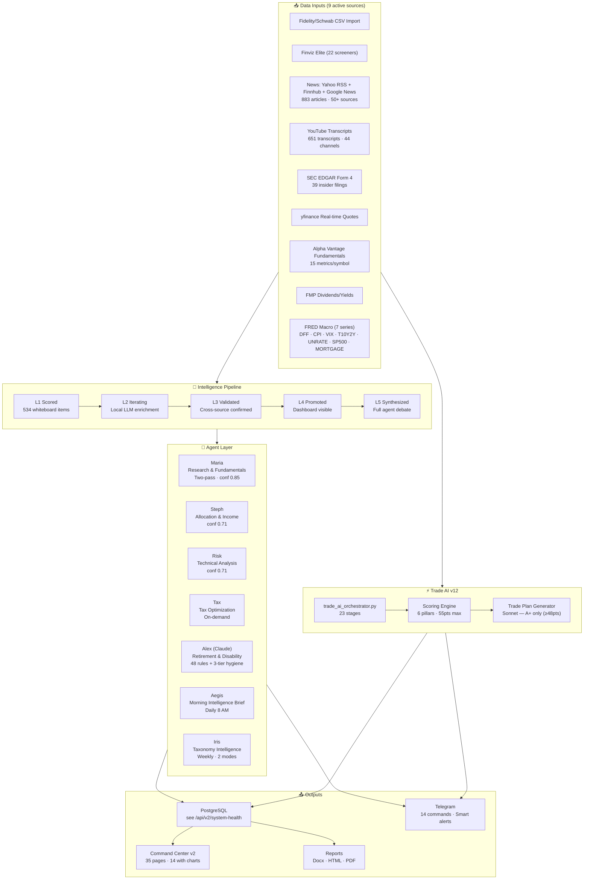
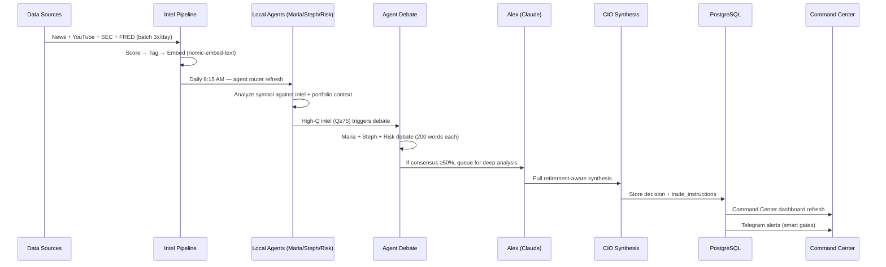
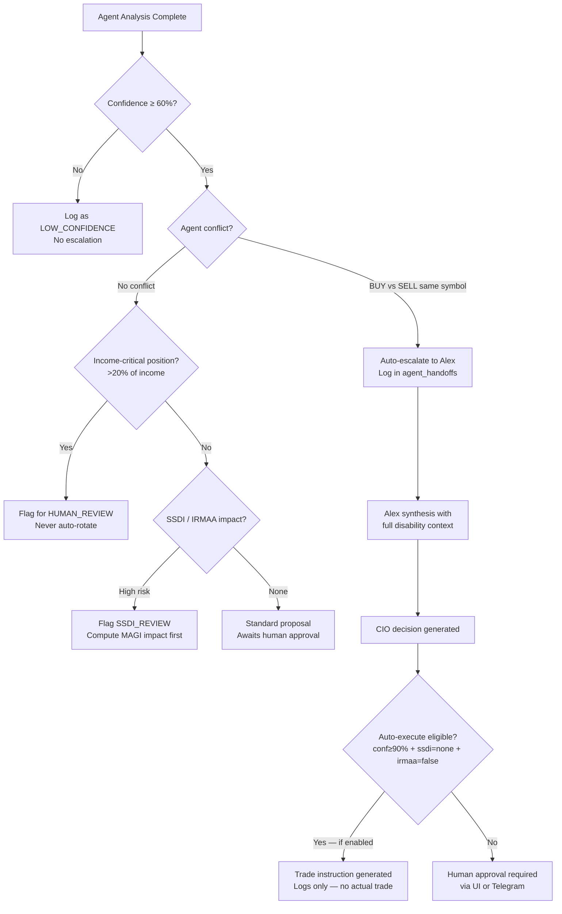
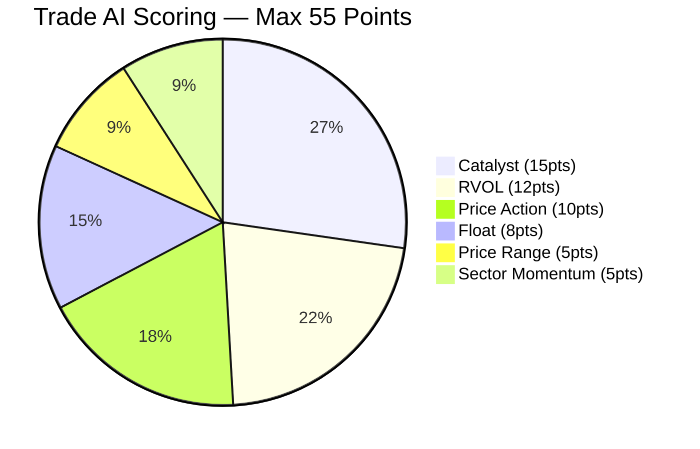

# Trade AI v12 + Portfolio Intelligence — System Bible v7.6

**Canonical source of truth. Claude Code uses this document as the reference spec.**  
**Owner:** John W. Whiting | **Server:** ms01-openclaw (Ubuntu) | **Updated:** May 2, 2026  
**SSH:** `ssh johnclaw@192.168.50.16`  
**Project root:** `/home/johnclaw/trade-ai-v12-rebuild/trade-ai-v12-rebuild/`  
**Prev version:** v7.3 (May 2, 2026)  
**Changelog:** v7.6 — Agent soul enhancements (post-audit): (1) Alex RAG+peer notes wired to dedicated path in alex_retirement_advisor.py. (2) Maria Pass 1+2 explicit BUY/SELL/HOLD criteria from Bible §5 — catalyst present/absent rules, decision framework. (3) Steph income thresholds explicit: $55K target, 25% concentration rule, account rules (Roth=growth, taxable=qualified divs only, 401k constrained), never-auto-rotate list. (4) agent_identity DB rows added for maria/steph/risk_agent/tax_agent (5/5 agents now in agent_intelligence_rules). All 8 agents verified: 8/8 full soul.
**Prev changelog:** v7.5 — Agent soul audit: Tax prompt upgraded, G1-G10 injected, Maria two-pass RAG wired, Risk identity upgraded. 5/8 full soul.
**Prev changelog:** v7.4.1 — Social scalp scanner WAIT/AVOID patch: 4-tier grading mirrors main Trade AI pipeline.
**Prev changelog:** v7.4 — Social scalp scanner: social_scalp_scanner.py added (pre-market + market hours crons), scalp_scan_results table, Finviz-scored GO/A+ alerts from social mentions.
**Prev changelog:** v7.3 — ALL 6 GAPS EXECUTED AND VERIFIED. GAP 1: approvals work (proposals/decide + john/decide). GAP 2: debates auto-trigger wired (LHX SELL 85%, LMT SELL 75%). GAP 3: agent_skills table created (7 agents). GAP 4: --tax-sweep in overnight_batch (7 jobs queued, cron at 6:35 AM). GAP 5: monitor tonight. GAP 6: social_ingest.py created — StockTwits (60 posts) + Reddit (100 posts) live with crons. Weekly/monthly report endpoints added (/api/v2/weekly-report, /api/v2/monthly-report). 7 new Telegram commands. Holdings verified: $1,193,911.
**Prev changelog:** v7.2 — Fix prompt v2 integrated: diagnostics, `john_decision_queue` name confirmed, operational safety block.
**Prev changelog:** v7.1 — Full autonomy audit: 6 critical gaps. Friday autonomous operation target.
**Prev changelog:** v7.0 — Agent Pipeline page + Intelligence Whiteboard page. 35 pages, 114 API routes, 73 cron, 163 tables.
**Prev changelog:** v6.9 — Handoff loop notifications: (1) Agent analysis Telegram after both agents complete on STOP event — shows recommendations + conflict status. (2) Aegis overnight completion Telegram with briefs/stops/escalations/evidence counts. Previously synthesis completed silently — no notification unless you checked dashboard. First RAG-in-synthesis test run started 11:40 (completing ~12:04).
**Prev changelog:** v6.8 — RAG wired into aegis_synthesis.py: symbol briefs AND Steph escalations now get RAG pre-context (3 items per symbol). Previously aegis used its own LLM call path bypassing process_watchlist_agent_jobs entirely — RAG never fired for nightly synthesis. Keyword fallback DictCursor bug fixed (row.values() conversion). Fallback chain display: DB embeddings → YouTube → News → Brave.
**Prev changelog:** v6.7 — Keyword fallback fix: RealDictCursor returns dicts not tuples — added `list(row.values())` conversion. LHX now returns 3 items (was 0). Fallback chain display fixed: "DB embeddings (RAG) → YouTube → Yahoo+Finnhub+Google → Brave (last resort)". All RAG paths verified: LHX→"LHX outcome: ADD", SCHD→"SCHD dividend", CATEGORY:ssdi→3 YouTube items, CATEGORY:disability→3 YouTube items. Coverage 99.7%.
**Prev changelog:** v6.6 — Category-aware RAG: CATEGORY:ssdi/disability/trust now returns YouTube + news content (was 0 items). Alex and Tax get relevant prior intelligence for gap events. Agent self-assessment: low confidence + 0 RAG creates research topic automatically. Iris weekly channel recommendations for gap categories (LLM-generated, Sunday). Keyword fallback category-aware: searches strategy_type for categories, symbol for tickers. Verified: CATEGORY:ssdi returns 5 YouTube items (scores 0.49-0.55), CATEGORY:disability returns 5 items (scores 0.58-0.61).
**Prev changelog:** v6.5 — RAG symbol relevance confirmed: LHX→"LHX outcome: ADD", RTX→"RTX outcome: BUY" (both correct after title ILIKE fix). Peer notes batch cache: _batch_results_cache{} stores results in-memory during batch so 2nd/3rd agents on same symbol see peer conclusions immediately. Cache checked before 30-day DB query. Result cached after each INSERT. Empty RAG = empty (never returns wrong-symbol results).
**Prev changelog:** v6.4 — RAG symbol relevance fix: removed broken source_id subquery (hashtext mismatch), query now uses strict title ILIKE %symbol% only. Peer notes: extended window 7→30 days, peer agent names stored in peer_notes_symbols column via _last_peer_agents. Real-time RAG indexing: new agent results embedded immediately after INSERT (no wait for 2:30 AM cron). Verified: NOC gets "NOC synthesis: BUY", LMT gets "LMT outcome: HOLD" (correct symbol match).
**Prev changelog:** v6.3 — RAG CONFIRMED FIRING: 7 results with rag_sources_used populated (5 items each, scores 0.62-0.65). Root cause: API endpoint /agent-pipeline hard-coded 8 columns, excluded rag_sources_used. Fixed: added rag_sources_used + peer_notes_symbols to agent-pipeline + task-detail SELECT queries. DB verified: column exists, 7 rows populated, 80 dupes flagged.
**Prev changelog:** v6.2 — RAG storage fixed: rag_sources_used UPDATE now logs errors instead of silent pass, confirmed column exists. Content gap → agent notification pipeline: Iris Mode 3 fires CONTENT_GAP events to agent_event_queue for thin categories (ssdi→alex, disability→alex, trust→alex+tax). Agents receive gap warnings at prompt position [5]. Auto-dedup: 80 duplicate news articles flagged (is_duplicate column). GET /api/v2/iris/duplicates endpoint. Prompt structure: portfolio → FRED → RAG → peer notes → gap warnings → agent rules.
**Prev changelog:** v6.1 — 71 cron entries. Iris MODE 3 — Intelligence Librarian (daily 7 AM): RAG coverage audit (auto-triggers indexer if <80%), stale analysis detection (symbols >7d old), intelligence routing audit (unrouted transcripts + unseen high-relevance news), duplicate news detection, content gap alerts (5 thin categories found). 3 new API endpoints: GET /iris/library-status, /iris/stale-symbols, /iris/content-gaps. 3 new Telegram commands: iris library, iris stale, iris gaps. Cron: 7 AM daily library-audit. Iris now has 3 operating modes: taxonomy (Sunday 10 AM), hygiene (Sunday 6 AM), librarian (daily 7 AM).
**Prev changelog:** v6.0 — RAG injection fixed: silent except:pass replaced with logging + error message. rag_sources_used JSONB column on watchlist_agent_results for audit. Peer Agent Notes injected into all agent prompts (DISTINCT ON agent from last 7 days). Prompt structure: portfolio → FRED → RAG (5 items) → peer notes → agent rules → data → task. Timer count: 11 project + 4 system = 15 total (API shows 11 project, correct). Intelligence Library + RAG coverage from v5.9 carry forward.
**Prev changelog:** v5.9 — 5159 intelligence rows 100% embedded. Intelligence Library tab (All Intel) on Intelligence Sources: unified search across all 10 source types. GET /api/v2/intelligence/library with symbol/source_type/q filters + pagination. RAG coverage tile on Content Health with per-source bars + Run Backfill button. Fixed agent_result indexer (TEXT id → hashtext), cio_decision (decision_id TEXT → hashtext). Backfill complete: all 10 source types at 100%.
**Prev changelog:** v5.8 — 163 tables, 70 cron, 29 Telegram commands, 7 agents, 33 pages, 2056 agent results, 5159 total intelligence rows. RAG system: rag_retrieval.py (cosine sim + recency decay + source boost + keyword fallback), rag_indexer.py (10 source types, idempotent). GET /api/v2/rag/status (coverage per source). POST /api/v2/admin/rag-backfill (background). Agent wiring: RAG pre-context injected into all agents via _build_prompt(). 3 RAG cron entries (6:50 AM news/FRED, 7:20 PM YouTube, 2:30 AM agent outputs). Embedding: nomic-embed-text 768d, stored as JSONB in content_embeddings (UNIQUE source_type+source_id). Content backfill complete (337 new). Agent output backfill running. Still needed: Intelligence Library UI tab, RAG coverage tile on Content Health.
**Prev changelog:** v5.7 — 163 tables, 67 cron, 29 Telegram commands, 7 agents, 33 pages, 2036 agent results, 910 news articles, 651 transcripts, 44 channels, 54 SEC filings, 645 whiteboard items, 15 systemd timers. News tab on Intelligence Sources (GET /api/v2/news/articles with server-side filtering by strategy/source/relevance/search + pagination). News strategy classifier: 14 categories (added ssdi + rollover_ira), retirement_relevance column on news_articles (82 high, 85 medium, 743 low). Idempotent backfill endpoint. SEC Form 4 strategy_focus from ticker_strategy_classifications with channel-name validation guard. Aegis overnight: TimeoutStartSec=3600, per-phase SIGALRM 30-min limit, Phase 1.5 news classification. Verified: full run completed in 1429s (23.8 min). tradeai-continuous: preflight made non-fatal. systemd timer visibility: DBUS env vars passed to subprocess calls (11 timers now visible in orchestration API). Content Health dashboard: name mismatch + orphan tiles with fix buttons. Status badges: PENDING/TAGGED/VALIDATED/LOW CONF/ORPHAN.
**Prev changelog:** v5.6 — YouTube intelligence fix. v5.5 — Content Health Dashboard (/v2/content-health): summary tiles (healthy/below/no-transcripts), collapsible scoring guide, full channel health table with quality bars + Iris flag-for-review. Fixed /api/v2/youtube/transcripts: LEFT JOIN to youtube_channels, category/channel/limit query params. POST /api/v2/iris/hygiene-flag for manual channel flagging. 33 pages.
**Prev changelog:** v5.4 — Scripts & cron cheat sheet. v5.3 — 163 tables, 67 cron, 29 Telegram commands, 7 agents, 33 pages, 1852 agent results. Task decision endpoints: POST /tasks/<id>/resolve|defer|reject. Duplicate task prevention in aegis_synthesis.py (checks pending_john before insert, updates existing). POST /tasks/deduplicate cleanup endpoint. SmartTextarea mic: getUserMedia before SpeechRecognition, HTTPS error detection, pulsing red border. AI rewrite: local qwen3 with Claude Haiku fallback. Auto-enrichment: runs phase2_ticker_enrichment when agents return RESEARCH_MORE. Data quality: enrichment_attempted, missing_data fields in task-detail API. CIO synthesis shows "INSUFFICIENT DATA" when HOLD at <60% confidence.

---

## Table of Contents

1. [System Overview](#1-system-overview)
2. [Architecture Diagram](#2-architecture-diagram)
3. [Agent System — Current State](#3-agent-system--current-state)
4. [Agent System — Autonomous Roadmap](#4-agent-system--autonomous-roadmap)
5. [Autonomous Agent Ruleset Specification](#5-autonomous-agent-ruleset-specification)
6. [Daily Pipeline Timeline](#6-daily-pipeline-timeline)
7. [Intelligence Pipeline (5-Level Whiteboard)](#7-intelligence-pipeline-5-level-whiteboard)
8. [Data Sources](#8-data-sources)
9. [Scoring Model (Trade AI)](#9-scoring-model-trade-ai)
10. [PostgreSQL Schema Summary](#10-postgresql-schema-summary)
11. [API Endpoints](#11-api-endpoints)
12. [Cron Schedule (73 entries)](#12-cron-schedule-73-entries)
13. [Configuration Reference](#13-configuration-reference)
14. [Operational Runbook](#14-operational-runbook)
15. [Trust Matrix](#15-trust-matrix)
16. [Maturity Score](#16-maturity-score)
17. [Known Gaps & Roadmap](#17-known-gaps--roadmap)

---

## 1. System Overview

Two integrated systems share a single server, codebase, and PostgreSQL database.

| System | Purpose | Account Context |
|--------|---------|-----------------|
| **Trade AI v12** | Pre-market scalp scan — 22 Finviz screeners, 6-pillar scoring, GO/WAIT/NO GO | Taxable brokerage only |
| **Portfolio Intelligence v1.2** | Multi-account portfolio analytics, retirement planning, autonomous agent layer | Rollover IRA, Roth IRA, 401k, Taxable |

**Server:** ms01-openclaw (Ubuntu)  
**SSH:** `ssh johnclaw@192.168.50.16`  
**Project root:** `/home/johnclaw/trade-ai-v12-rebuild/trade-ai-v12-rebuild/`  
**Dashboard:** `http://192.168.50.16:7777/v2`  
**Agent Monitor:** `http://192.168.50.16:7777/agent-monitor`  
**Orchestration:** `http://192.168.50.16:7777/reports/agent_orchestration.html`  
**Pipeline API:** `http://192.168.50.16:7777/api/v2/agent-pipeline`  
**LLM Spend:** `http://192.168.50.16:7777/api/v2/llm-spend`  
**Database:** PostgreSQL — `trade_ai` — see `/api/v2/system-health` for live table count  
**Local LLM:** Ollama qwen3:1.7b + nomic-embed-text (768-dim embeddings)  
**Cloud LLM:** Claude (primary) → Grok → OpenAI (fallback chain) · Budget: $0.50/day  

---

## 2. Architecture Diagram



---

## 3. Agent System — Current State

### Agent Roster

| Agent | Model | Role | Analyses | Avg Confidence | Quality |
|-------|-------|------|----------|----------------|---------|
| **Maria** | qwen3:1.7b (local, two-pass) | Research & fundamentals | 322 | 0.85 | ✅ Two-pass: news→fundamentals (v3.8) |
| **Steph** | qwen3:1.7b (local) | Allocation & income strategy | 314 | 0.71 | ✅ Medium — income logic works |
| **Risk** | qwen3:1.7b (local) | Technical analysis | 309 | 0.71 | ✅ Medium — technical suits small models |
| **Tax** | qwen3:1.7b (local) | Tax optimization | 1 | 0.85 | ⚠️ Insufficient data |
| **Alex** | Claude Sonnet | Retirement & disability planning | On-demand | High | ✅ 48 rules, 3-tier decision hygiene, gov scrapers |
| **Aegis** | Claude/local | Morning brief synthesis | Daily 8 AM | N/A | ✅ Live |
| **Iris** | Claude Sonnet/local | Taxonomy intelligence + hygiene | Weekly Sunday | N/A | ✅ 2 modes: taxonomy + content lifecycle |

### Agent Data Flow



### What Agents Currently See Per Analysis

Every agent prompt receives these injected contexts:
1. **Portfolio context** — holdings, account weights, income gap, tax bracket
2. **FRED macro** — Fed rate 3.64%, VIX 17.83, yield spread 0.52, CPI 330
3. **Intel summary** — qualified news + YouTube key points + SEC Form 4 data + Alpha Vantage fundamentals
4. **Outcome lessons** — up to 7 past correct/wrong decisions (e.g., "V: BUY at $295 → $311 +5.4% [CORRECT]")
5. **SSDI/disability rules** — Medicaid lookback, IRMAA thresholds, MFS bracket ceiling
6. **Cross-agent views** — sees what other agents think (not live, sees prior results)

### Agent Handoff / Escalation Logic



---

## 4. Agent System — Autonomous Roadmap

### Current Autonomy Level: 3/5

```
Level 1 — Reactive:          Manual triggers only
Level 2 — Scheduled:         Cron-triggered batch analysis                    ✅ COMPLETE
Level 3 — Event-Driven:      Agents self-trigger on data events               ✅ COMPLETE (Phase 1-3, 10/10 events)
Level 4 — Self-Directed:     Agents set their own research agenda             Future
Level 5 — Closed-Loop:       Agents execute and learn from outcomes           Aspirational
```

### What's Already Autonomous (Level 2 + Level 3 Phase 1)

| Behavior | Script | Schedule | Status |
|----------|--------|----------|--------|
| Daily intel promotion | `agent_watchlist_engine.py --daily` | 7 PM | ✅ Live |
| Outcome evaluation | `overnight_batch.py --outcomes` | 5:30 AM | ✅ Live |
| Proactive intel scan | `overnight_batch.py --proactive` | 6:45 AM | ✅ Live |
| Credential monitoring | `credential_monitor.py` | 6:00 AM | ✅ Live |
| Watchlist proposals | `agent_watchlist_engine.py` | 7 PM | ✅ Live (needs human approval) |
| Weekly health check | `alex_retirement_advisor.py` | Sunday 10 AM | ✅ Live |
| Embedding indexing | `overnight_batch.py --index-embeddings` | 9 PM | ✅ Live |
| Multi-agent debate | `run_agent_debate()` | Triggered by Q≥75 intel | ✅ Live (accumulating) |
| **Event detection (L3)** | **`event_detector.py`** | **Every 15 min** | **✅ Live — 10 event types** |
| **Event digest in brief** | **`aegis_morning_brief_delivery.py`** | **Daily 8 AM** | **✅ Live — 24h event summary in Telegram + page** |
| Auto-execute proposals | DB rule: `auto_execute.low_risk` | On approval | ⚠️ DISABLED (toggle to enable) |

### Level 3 Status — Event-Driven Agents

Level 3 means agents self-trigger when specific data events occur, rather than waiting for cron windows.

**Phase 1+2 COMPLETE** (April 30, 2026): `event_detector.py` polls DB every 15 minutes, fires events into `agent_event_queue`. `agent_event_router.py` drains the queue 2 min later. All 10 event types active:

| Event | Agents | Priority | Threshold | Cooldown |
|-------|--------|----------|-----------|----------|
| SEC_INSIDER_BUY | Maria, Risk | urgent | Form 4 purchase in 24h | 4h |
| RSI_EXTREME | Risk | normal | Holdings RSI <25 or >75 | 4h |
| FRED_RATE_CHANGE | Maria, Steph, Risk | urgent | DFF change >0.25% | 4h |
| DIVIDEND_CUT | Steph, Tax | urgent | Yield drop >20% vs baseline | 4h |
| EARNINGS_BEAT | Maria, Steph | normal | EPS beat >10% in 24h | 4h |
| STOP_TRIGGERED | Risk, Steph | urgent | Price ≤ stop for holdings | 4h |
| IRMAA_THRESHOLD | Alex, Tax | urgent | MAGI > $103K (MFS) | 24h |
| INCOME_FLOOR_RISK | Steph, Alex | urgent | Position > $11K income | 24h |
| MARKET_REGIME_CHANGE | Risk, Maria | urgent | VIX crosses 25 or 30 | 6h |
| PORTFOLIO_FRESH_NEEDED | Risk, Steph | normal | Not analyzed >48h (max 3/run) | 4h |

**Phase 2 COMPLETE** (April 30, 2026): `agent_event_router.py` drains the queue every 15 minutes (2 min after detector). Creates `watchlist_agent_jobs`, processes via existing agent infrastructure, sends Telegram for urgent events. SEC_INSIDER_BUY events auto-trigger 3-agent debate → Alex queue if consensus ≥50%.

**Phase 3 — First Production Run** (April 30, 2026):
- 8 events fired: 5× STOP_TRIGGERED (TDG, LHX, RTX, LMT, NOC) + 3× PORTFOLIO_FRESH_NEEDED (SCHD, AMANX, ARKG)
- All 8 routed → agent jobs created → processed → status=done
- 16 dividend yield baselines seeded (DIVIDEND_CUT first-run baseline)
- IRMAA check: MAGI $99,187 — below $103K threshold (no fire, correct)
- Telegram alerts: sent to both chat IDs (fixed Markdown parse_mode issue)
- LLM budget was exceeded — agent analyses queued as failed, will succeed on next run with budget reset

### Agent Sequencing and Data Quality Gate (v4.3)

```
Job Queue → Risk agent runs first
                ↓
        Risk result check:
        RESEARCH_MORE <40% conf?
                ↓ yes               ↓ no
        check_symbol_data_quality()  → proceed to Maria + Steph
                ↓
        attempt_symbol_enrichment()
        (yfinance free sources)
                ↓
        enriched?
        ↓ yes          ↓ no
        re-run context  log data_gap
        proceed         HALT (skip Maria/Steph)
```

- **Cost gate:** enrichment uses only free sources (yfinance, Google RSS)
- **Data gap logged:** `watchlist_events` with type `data_gap_skip`
- **UI indicator:** "NO DATA" amber badge in watchlist price column

Here is the full design spec for remaining event types:

**Trigger events to implement:**
```python
# Event types that should auto-trigger agent analysis
EVENT_TRIGGERS = {
    "SEC_INSIDER_BUY":     {"agents": ["Maria", "Risk"], "threshold": "any Form 4 BUY"},
    "DIVIDEND_CUT":         {"agents": ["Steph", "Tax"], "threshold": "yield drop >20%"},
    "RSI_EXTREME":          {"agents": ["Risk"],          "threshold": "RSI <25 OR >75"},
    "EARNINGS_BEAT":        {"agents": ["Maria", "Steph"],"threshold": "EPS beat >10%"},
    "STOP_TRIGGERED":       {"agents": ["Risk", "Steph"], "threshold": "price crosses stop"},
    "IRMAA_THRESHOLD":      {"agents": ["Alex", "Tax"],   "threshold": "MAGI projection >$103K"},
    "INCOME_FLOOR_RISK":    {"agents": ["Steph", "Alex"], "threshold": "income position >20% weight"},
    "FRED_RATE_CHANGE":     {"agents": ["all"],           "threshold": "DFF change >0.25%"},
    "MARKET_REGIME_CHANGE": {"agents": ["Risk", "Maria"], "threshold": "VIX crosses 25 or 30"},
}
```

**Implementation path:**
1. `scripts/event_detector.py` — polls key tables every 15 min, fires events when thresholds crossed
2. `scripts/agent_event_router.py` — maps events to agent queue entries
3. `agent_event_queue` table — stores pending event-triggered analyses with priority
4. Agents drain queue on their next cycle OR immediately if `priority='urgent'`

---

## 5. Autonomous Agent Ruleset Specification

This section defines the complete ruleset for each agent. Claude Code uses this as the specification for agent behavior. Any change to agent logic must be consistent with these rules.

### Global Rules (apply to ALL agents)

```
RULE G1 — DATA FRESHNESS
  Never analyze based on data older than:
  - News: 7 days
  - Prices: 24 hours
  - SEC filings: 30 days
  - FRED macro: 7 days
  If data is stale: log stale_data event, skip analysis, do not produce recommendation.

RULE G2 — INCOME PROTECTION
  NEVER recommend TRIM or SELL on:
  - Any position where yield × market_value > ($55,000 × 0.20) = $11,000/yr
  - Strategies: dividend_growth_compounder, high_yield_income_bdc, tactical_income
  If this rule would block a needed rebalance: escalate to Alex with flag INCOME_CRITICAL.

RULE G3 — SSDI AWARENESS
  Every recommendation for IRA/401k positions must include:
  - MAGI impact estimate: current_magi + proposed_distribution_or_conversion
  - IRMAA flag if projected MAGI > $103,000 (MFS threshold)
  - Bracket flag if projected MAGI > $94,300 (22% bracket ceiling)
  - Medicaid lookback flag if IRA distribution > $50,000
  If any flag triggers: set ssdi_review=true, require human approval.

RULE G4 — CONFIDENCE GATING
  Agent must not produce a synthesis recommendation if:
  - Own confidence < 40%: output LOW_CONFIDENCE_SKIP, log reason
  - Only 1 source of evidence (single news article with no corroboration): skip
  - Decision is older than 14 days: expire, do not reuse

RULE G5 — LEARNING LOOP
  Every analysis must:
  - Read last 7 outcome lessons from agent_intelligence_rules (rule_type='outcome_lessons')
  - Inject lessons into prompt: "OUTCOME LESSONS — learn from these: [lessons]"
  - Adjust confidence ±0.05 per past approval/rejection from agent_feedback_log (last 90d)

RULE G6 — MACRO CONTEXT
  Every analysis must include FRED macro context:
  - VIX >25: append [MACRO: Elevated volatility — consider hold]
  - T10Y2Y <0: append [MACRO: Inverted yield curve — recession risk]
  - DFF >5%: append [MACRO: High rates — bonds competitive]
  - DFF <2%: append [MACRO: Low rates — equity premium]

RULE G7 — ESCALATION TRIGGER
  Auto-escalate to Alex when:
  - Agent conflict: BUY vs SELL on same symbol in same 48h window
  - Any Roth conversion recommendation
  - Any income-critical position flag
  - Confidence 40–60% on a portfolio position (not watchlist)
  Log escalation in agent_handoffs: escalated=true, reason, from_agent, to_agent='alex'

RULE G8 — PROPOSAL EXPIRY
  All watchlist_proposals expire after 14 days.
  If not reviewed: status='expired', reason='no_human_review_14d'
  Re-propose only if new qualifying intelligence arrives.

RULE G9 — DEBATE REQUIREMENT
  Symbols must pass 3-agent debate (Maria + Steph + Risk) before queuing for Alex.
  Debate consensus must be ≥50% for any action recommendation.
  If consensus <50%: status='no_consensus', skip Alex queue, log in agent_debate_log.

RULE G10 — NO DIRECT EXECUTION
  No agent may generate a trade that is executed without human approval except:
  - auto_execute rule in agent_intelligence_rules is enabled=true
  - AND all four conditions met: conf≥90%, ssdi_impact='none', irmaa_risk=false, income_impact='none'
  Even then: logs as "auto_approved" in trade_instructions — no actual broker API call.
```

### Maria — Research & Fundamentals Agent

```
IDENTITY
  Role: First responder. Reads news, SEC filings, and fundamentals.
        Asks: "Is there new information that changes the investment thesis?"
  Model: qwen3:1.7b (local) / Claude for Q≥70 intel
  Triggers: Daily 6:25 AM batch + event-triggered (SEC_INSIDER_BUY, EARNINGS_BEAT)

WHAT MARIA SEES
  - News articles: last 7 days, relevance_score ≥ 0.3
  - SEC Form 4 filings: any in last 30 days for this symbol
  - Alpha Vantage fundamentals: PE, EPS, revenue growth, analyst target
  - yfinance quote: current price, 52-week range
  - Outcome lessons (Rule G5)
  - FRED macro context (Rule G6)

MARIA'S DECISION RULES
  BUY signal conditions (ALL must be true):
    - Positive news catalyst (earnings beat, insider buy, upgrade, M&A accretive)
    - PE ratio below sector average OR strong growth justifies premium
    - Analyst target > current price + 10%
    - No negative SEC disclosures in last 30 days

  SELL/TRIM signal conditions:
    - Dividend cut OR payout ratio >100% for income positions
    - Insider selling >$1M within 30 days (Form 4)
    - EPS miss >10% + guidance lowered
    - Analyst target downgrade below current price
    - Income protection (Rule G2) overrides if income-critical

  RESEARCH_MORE signal (no action):
    - Conflicting signals (e.g., insider buy + earnings miss)
    - Single source, low corroboration
    - Confidence <55%

OUTPUT SCHEMA
  {
    "symbol": "V",
    "recommendation": "BUY | SELL | HOLD | TRIM | RESEARCH_MORE",
    "confidence": 0.0–1.0,
    "evidence": ["Insider buy $2M", "Q2 beat estimates by 12%"],
    "ssdi_flags": [],
    "income_critical": false,
    "data_sources_used": ["sec_form4", "alpha_vantage", "finnhub_news"],
    "expires_at": "2026-05-14T06:25:00"
  }
```

### Steph — Allocation & Income Agent

```
IDENTITY
  Role: Income guardian. Asks: "Does this position support the $55K income target?
        Does the allocation make sense across all four accounts?"
  Model: qwen3:1.7b (local)
  Triggers: Daily 6:25 AM batch + event-triggered (DIVIDEND_CUT, INCOME_FLOOR_RISK)

WHAT STEPH SEES
  - Holdings.json: all 4 accounts, weights, income contributions
  - dividend_calendar.json: annual income by symbol, yield, frequency
  - personal_situation.json: income target ($55K), current gap ($40K+), SSDI ($45,600/yr)
  - Rotation rules: strategy-aware (see v2.41 rotation rules table)
  - Proposal history: last 90 days of approved/rejected (agent_feedback_log)

STEPH'S DECISION RULES
  Income target state:
    - Gap = $55,000 - current_annual_income - $45,600 SSDI
    - Flag if gap > $20,000: recommend income-building action
    - Flag if single position > 25% of total income: concentration risk

  Allocation rules:
    - Max single position: 15% of total portfolio (hard cap)
    - Max sector: 35% of total portfolio
    - Roth IRA: growth focus (SCHG, SCHD), no covered calls (tax-free growth)
    - Rollover IRA: income + growth, Roth conversion candidates
    - Taxable: qualified dividends only (no BDC distributions — ordinary income)
    - 401k: until 2027, constrained to 15 Omnicom plan funds only

  NEVER auto-rotate (income protection — Rule G2):
    - dividend_growth_compounder, high_yield_income_bdc, tactical_income,
      reit_income, bond_income, retirement_planning, disability_retirement_planning

  ACCOUNT-AWARE proposal format:
    [rotate] SYMBOL in ACCOUNT: X shares → target. SSDI:impact. IRMAA:risk.

OUTPUT SCHEMA
  {
    "symbol": "SCHG",
    "account": "rollover_ira | roth_ira | 401k | taxable",
    "recommendation": "ADD | TRIM | HOLD | ROTATE",
    "income_impact": "$+450/yr if added at current yield",
    "ssdi_impact": "none | conversion_taxable | capital_gains",
    "irmaa_risk": false,
    "income_critical": false,
    "confidence": 0.71,
    "allocation_after": "8.2% of portfolio"
  }
```

### Risk Agent — Technical Analysis

```
IDENTITY
  Role: Technician. Asks: "Is the price action supportive of entry/exit?
        Is the stop set appropriately? Is the position protected?"
  Model: qwen3:1.7b (local)
  Triggers: Daily 6:25 AM batch + event-triggered (RSI_EXTREME, STOP_TRIGGERED)

WHAT RISK SEES
  - Finviz technical data: RSI, SMA20/50/200, ATR, Beta, 52-week range
  - risk_management.json: current stops, stop distances, heat
  - Portfolio heat: sum(unrealized_losses) / total_portfolio_value
  - FRED macro: VIX level (volatility regime)

RISK'S DECISION RULES
  Stop placement rules:
    - New position: stop = entry - (2 × ATR)
    - Minimum stop distance: 5% from current price
    - Maximum stop distance: 15% (positions beyond this are unprotected)
    - 401k mutual funds: no stops (cannot be placed) → mental stop only

  RSI signals:
    - RSI >75 + no catalyst: flag OVERBOUGHT → TRIM candidate
    - RSI <25 + positive thesis intact: flag OVERSOLD → ADD candidate
    - RSI signal overrides income protection Rule G2 for TRIM only
      (but only if 2+ technical confirmations)

  Heat management:
    - Portfolio heat >5%: do not add new positions
    - Portfolio heat >8%: flag urgent — recommend stop-tightening
    - Individual heat (position down >15%): auto-flag for review

  Coverage rules:
    - Target: ≥80% of portfolio value protected (has defined stop)
    - Current: 50% protected — active gap
    - Unprotected 401k positions: document as "mutual fund — no stop available"

OUTPUT SCHEMA
  {
    "symbol": "V",
    "recommendation": "ADD | HOLD | TRIM | SELL | TIGHTEN_STOP | SET_STOP",
    "rsi": 66,
    "sma_status": "above_20 | above_50 | above_200 | below_all",
    "stop_recommended": 285.00,
    "stop_distance_pct": 8.2,
    "heat_contribution": 0.3,
    "confidence": 0.75
  }
```

### Tax Agent

```
IDENTITY
  Role: Tax optimizer. Asks: "What is the tax-optimal execution path for this action?
        Are there harvest opportunities? Does this affect SSDI/IRMAA/Medicaid?"
  Model: qwen3:1.7b (local) — Claude for Roth analysis
  Triggers: On-demand OR triggered by any proposal with ssdi_impact != 'none'

WHAT TAX SEES
  - personal_tax_history: 2025 return, bracket, filing status (MFS)
  - personal_situation.json: current MAGI, Roth conversions YTD, bracket room
  - tax_events: planned events for 2026
  - Tax lots: cost basis, holding period (ST vs LT), unrealized gains/losses
  - agent_intelligence_rules: SSDI/IRMAA thresholds

TAX'S DECISION RULES
  Tax-loss harvesting:
    - Harvest candidate: current_value = 0 AND cost_basis > 0 (worthless)
      → Contact Fidelity 1-800-343-3548 for disposal form. File before Dec 31.
    - Harvest candidate: unrealized_loss > $500 AND holding_period > 30 days
      AND no substantially identical security purchased in 30-day wash-sale window
    - Prioritize: highest loss first, long-term losses before short-term

  Roth conversion optimization:
    - Available room: $94,300 (22% ceiling MFS) - current_MAGI
    - Current room: ~$66,883 (verified April 2026)
    - Optimal annual conversion: $35,000–$50,000 (fill 12% bracket)
    - Convert FROM: Rollover IRA only (never 401k without plan permission)
    - Golden Window: 2036–2040 (ages 68.5–73) — convert aggressively during this period

  SSDI/IRMAA rules:
    - IRA distribution > $50,000: Medicaid 5-year lookback warning
    - MAGI > $103,000 (MFS): IRMAA Tier 1 surcharge warning
    - MAGI > $94,300: 22% bracket jump warning
    - Capital gains in taxable: estimate MAGI impact before proposing

OUTPUT SCHEMA
  {
    "symbol": "LPIH",
    "action": "HARVEST_WORTHLESS | HARVEST_LOSS | ROTH_CONVERT | HOLD_FOR_LT",
    "tax_impact": "$-4,763 loss realized",
    "magi_impact": "+$0 (worthless security disposal has no income impact)",
    "irmaa_risk": false,
    "bracket_impact": "stays in 12%",
    "instructions": "Contact Fidelity at 1-800-343-3548...",
    "deadline": "2026-12-31"
  }
```

### Alex — Retirement & Disability Advisor

```
IDENTITY
  Role: Senior advisor. The only high-quality reasoner in the system.
        Specializes in disability retirement planning, Roth strategy, and SSDI optimization.
  Model: Claude Sonnet (always — no local fallback for core retirement analysis)
  Triggers: On-demand via Telegram/UI + weekly Sunday health check + monthly report
           + auto-queued when debate consensus ≥50% + escalations from other agents

WHAT ALEX SEES (everything)
  - All portfolio context (holdings, accounts, income, tax bracket)
  - All agent results and debate transcripts for the symbol
  - Qualified intelligence (highest-quality news + YouTube + SEC)
  - FRED macro context
  - Outcome lessons
  - Full SSDI/disability ruleset (48 disability-specific rules in alex_retirement_advisor.py)

ALEX'S NON-NEGOTIABLE RULES
  1. Never recommend an action that could trigger IRMAA surcharge without warning
  2. Always include Medicaid 5-year lookback analysis for IRA distributions >$50K
  3. Always check MFS filing status implications (spousal IRA, backdoor Roth, pro-rata)
  4. Roth conversion advice: always verify with CPA disclaimer
  5. SSDI income limit: $45,600/yr — any recommendation that increases countable income
     above safe threshold requires explicit warning
  6. Disability exemption: no 10% early withdrawal penalty applies (age + disability)
  7. Golden Window: 2036–2040 is the optimal Roth conversion window — plan toward it

ALEX OUTPUT
  Full prose analysis (~400 words) covering:
  1. Position/situation summary
  2. Retirement impact (conservative/base/aggressive scenario)
  3. Tax implications with SSDI/IRMAA awareness
  4. 3–5 specific actionable recommendations with dollar amounts
  5. Risks and what to watch for

ALEX THREE-TIER DECISION HYGIENE (alex_hygiene.py)
  Tier 1 (routine, ~$0.01): Alex alone (Sonnet) — daily monitors, stop reviews
  Tier 2 (significant, ~$0.03): Alex + Grok second opinion — Roth, IRMAA, rebalance
  Tier 3 (critical, ~$0.15): Alex + Grok + GPT-4o → Opus synthesis — trusts, large conversions, estate
  
  Cadence gate: Tier 3 decisions enforced to 30-day minimum
  Bypass events: new_law_passed, irmaa_threshold_crossed, inheritance_received, etc.
  Agreement scoring: measures cross-model consensus (1.0 = unanimous, 0.33 = split)
  DB: alex_hygiene_log table
  API: POST /api/v2/alex-hygiene/classify, /api/v2/alex-hygiene/run

ALEX DISABILITY INTELLIGENCE (alex_retirement_advisor.py)
  5 rule categories: SSDI_RULES, DUAL_ELIGIBILITY_RULES, TRUST_RULES, ROTH_WITH_DISABILITY, IRMAA_RULES
  48 disability-specific rules injected into every Alex prompt
  get_disability_context_for_prompt() — 1,816-char context block

ALEX GOVERNMENT DATA (alex_gov_research.py)
  4 scrapers: fetch_ssa_thresholds(), fetch_irmaa_thresholds(), fetch_medicaid_ny_rules(), fetch_roth_ira_rules()
  30-day cache in agent_intelligence_rules table
  Cron: Sunday 8 AM weekly refresh
```

### Aegis — Morning Intelligence Orchestrator

```
IDENTITY
  Role: Synthesizes overnight intelligence into the morning brief.
        Orchestrates what John sees first thing every morning.
  Schedule: Daily 8:00 AM (after all pipelines complete)

WHAT AEGIS DELIVERS (8-section brief)
  1. Hero narrative — portfolio summary + FRED macro context
     Color: red (triggered stops), green (positive), amber (caution)
  2. Agent intelligence cards — Maria/Steph/Risk/Alex/Aegis with click-through modals
  3. What to Watch For — triggered stops, danger zones, pending proposals, overdue decisions
  4. Metric tiles — 6 key numbers (portfolio, heat, protected, proposals, tasks, escalations)
  5. Command strip — 8 quick-action buttons
  6. Action board — 14 items, filterable (all/urgent/review/monitor)
  7. Risk & Exposure + Opportunity & Recovery panels
  8. Trust Strip + Overnight Intelligence narrative

AEGIS AUTONOMY RULES
  - Never deliver a brief with portfolio value more than 1% out of sync with live holdings.json
  - Always include FRED macro context in Hero narrative
  - Flag any triggered stop as URGENT (red) regardless of other signals
  - Include proposal count and review deadline in every brief
  - Brief is stored in intelligence_events table for history
```

### Iris — Taxonomy Intelligence Agent (v4.9)

```
IDENTITY
  Role: Keeper of the intelligence pipeline classification system.
        Makes sure every piece of content reaches the right agent.
  Model: Claude Sonnet (Q&A), local qwen3:1.7b (classification)

THREE OPERATING MODES:

MODE 1 — Taxonomy Improvement (Weekly Sunday 10 AM)
  1. Coverage analysis — channels vs target taxonomy (8 categories)
  2. Gap detection — identifies categories below minimum channel count
  3. Channel audit — finds uncategorized, stale, or low-relevance channels
  4. Proposal generation — reclassify, add_channel, retire_channel
  5. Q&A — answers questions about content routing via Claude Sonnet

MODE 2 — Content Hygiene (Weekly Sunday 6 AM)
  Demotes stale content, flags superseded regulatory data,
  escalates ambiguous decisions to John via Telegram.

  HYGIENE RULES:
    NEVER deleted without John's explicit approval
    NEVER auto-demotes disability/trust content
    NEVER exceeds 50 auto-demotions per run

    Content type        | Active window  | Then
    ────────────────────┼────────────────┼──────────────────
    General news        | 90 days        | Auto-archive
    Sector analysis     | 180 days       | Auto-archive
    Tax/retirement news | 365 days       | Auto-archive
    Disability news     | 18 months      | Escalate to John
    YouTube: general    | 1 year         | Auto-archive
    YouTube: retirement | 2 years        | Auto-archive
    YouTube: disability | 3 years        | Escalate to John
    YouTube: evergreen  | Never          | Never expires
    YouTube: year-specif| 2yr after ref  | Escalate to John
    Regulatory data     | Until replaced | Flag superseded

TABLES
  - iris_taxonomy_proposals (taxonomy proposals for review)
  - iris_run_log (scan + hygiene history)
  - iris_hygiene_log (full audit log of hygiene actions)
  - iris_hygiene_pending (decisions awaiting John, 7-day expiry)

TELEGRAM COMMANDS
  iris status           — coverage + pending proposals
  iris <question>       — ask about content tagging
  iris approve <id>     — approve taxonomy proposal
  iris reject <id>      — reject taxonomy proposal
  iris run              — force taxonomy scan
  iris who              — identity + help
  iris hygiene          — pending hygiene decisions
  iris hygiene approve N — approve content demotion
  iris hygiene reject N  — keep content active
  iris hygiene defer N   — decide in 7 days
  iris hygiene preview   — dry run (no changes)
  iris hygiene run       — force hygiene run now
  iris library           — RAG coverage + stale + dupes + gaps summary
  iris stale             — symbols not analyzed by agents in >7 days
  iris gaps              — content categories with thin recent coverage

API ENDPOINTS
  GET  /api/v2/iris/status          — taxonomy status + coverage
  GET  /api/v2/iris/hygiene-status  — pending decisions + health
  POST /api/v2/iris/ask             — Q&A (Claude Sonnet, ~$0.003)
  POST /api/v2/iris/approve         — approve taxonomy proposal
  POST /api/v2/iris/reject          — reject taxonomy proposal
  POST /api/v2/iris/hygiene-approve — approve content demotion
  POST /api/v2/iris/hygiene-reject  — keep content active
  POST /api/v2/iris/hygiene-defer   — defer decision 7 days

CLI
  python3 scripts/iris_taxonomy_agent.py                 — weekly scan
  python3 scripts/iris_taxonomy_agent.py --hygiene       — weekly hygiene
  python3 scripts/iris_taxonomy_agent.py --hygiene-dry-run — preview

CRON
  0 6  * * 0  iris_taxonomy_agent.py --hygiene    — Sunday 6 AM
  0 10 * * 0  iris_taxonomy_agent.py              — Sunday 10 AM

MODE 3 — Intelligence Librarian (Daily 7:00 AM)
  3a. RAG Coverage Audit — checks /api/v2/rag/status, triggers indexer if <80%
  3b. Stale Analysis Detection — symbols not analyzed by any agent in >7 days
  3c. Intelligence Routing — unrouted high-quality transcripts + unseen news
  3d. Duplicate Detection — same-title news from different sources
  3e. Content Gap Alerts — categories with <3 articles in 30 days

  API: GET /iris/library-status, /iris/stale-symbols, /iris/content-gaps
  Telegram: iris library, iris stale, iris gaps
  Cron: 0 7 * * * iris_taxonomy_agent.py --library-audit

IRIS AUTONOMY RULES
  - Never make investment recommendations
  - Never touch holdings, proposals, or trade decisions
  - Only manages keywords, routing rules, and channel taxonomy
  - Taxonomy proposals require John's approval (no auto-apply)
  - Hygiene: disability/trust always escalated to John
  - Appears in morning brief only when pending proposals exist
```

---

## 6. Daily Pipeline Timeline

```mermaid
gantt
    title Daily Pipeline — Cron Schedule
    dateFormat HH:mm
    axisFormat %H:%M

    section Overnight
    Outcome evaluation     :05:00, 15m
    Alex daily scan        :05:00, 30m
    Smart alerts           :06:00, 15m
    Credential check       :06:00, 10m

    section Morning Cascade
    Agent router refresh   :06:15, 10m
    Agent intel daily      :06:25, 15m
    FRED macro ingest      :06:30, 10m
    News ingestion         :06:30, 15m
    Classify candidates    :06:35, 5m
    Intel auto-discovery   :06:40, 5m
    Sync watchlist         :06:45, 5m
    Proactive scan         :06:45, 10m
    Strategy cards         :06:50, 5m
    Income engine          :06:55, 5m
    CIO decisions          :07:00, 15m
    Finviz enrichment      :07:10, 15m
    Freshness checks       :07:15, 15m
    Aegis brief            :08:00, 30m

    section Market Hours
    Finviz screeners open  :10:00, 30m
    News refresh           :12:30, 10m
    Intel discovery        :12:40, 10m
    Enrichment refresh     :13:00, 15m
    Finviz screeners close :16:00, 30m

    section Evening
    Evening news           :18:30, 15m
    YouTube ingest         :19:00, 30m
    Promote qualified intel :19:00, 20m
    Fresh transcript proc  :19:30, 15m
    Metrics + snapshots    :20:00, 15m
    Embedding indexing     :21:00, 15m
    Auto-research          :21:00, 60m
    Transcript backlog     :22:00, 480m
```



**Overnight batch (8 PM – 5 AM):**  
Every 5 minutes · 25 jobs/batch · 300 jobs/hour capacity  
Covers: stale symbol refreshes, embedding backfill, transcript summarization (2/hour)

**Weekly (Sunday):** Strategy review, allocation check, watchlist hygiene, autonomy summary (8 AM), weekly health check (10 AM)  
**Monthly (1st):** Deep tax reconciliation, Roth ladder analysis, income progress, monthly report (9 AM)

---

## 7. Intelligence Pipeline (5-Level Whiteboard)

```mermaid
flowchart LR
    subgraph L0["L0 Raw Ingest"]
        N["News\n883 articles"]
        Y["YouTube\n651 transcripts"]
        S["SEC Form 4\n4 filings"]
        M["Market Quotes\nyfinance + AV"]
    end

    subgraph L1["L1 Scored\n173 items"]
        SCORE1["content_scoring.py\nQuality 0-100\nRelevance 0-1.0\nStrategy tags\nAgent tags"]
    end

    subgraph L2["L2 Iterating\n(Day 1+)"]
        ENRICH["Local LLM enrichment\nqwen3:1.7b\nCross-reference check"]
    end

    subgraph L3["L3 Validated\n(Day 2-3)"]
        VALID["2+ sources confirm\nOR 3+ days + Q≥75\nEmbedding similarity"]
    end

    subgraph L4["L4 Promoted\n(Day 3+)"]
        PROMO["Dashboard visible\nQ≥70 promoted items\n534 whiteboard"]
    end

    subgraph L5["L5 Synthesized\n(Day 3+)"]
        SYNTH["Agent debate\nconsensus ≥50%\nAlex deep analysis\nCIO decision"]
    end

    L0 --> L1 --> L2 --> L3 --> L4 --> L5

    style L0 fill:#1a1a2e,color:#fff
    style L1 fill:#16213e,color:#fff
    style L2 fill:#0f3460,color:#fff
    style L3 fill:#533483,color:#fff
    style L4 fill:#e94560,color:#fff
    style L5 fill:#f5a623,color:#1a1a2e
```



**Promotion criteria:**
- L0 → L1: Immediate (all ingested content)
- L1 → L2: Q≥50 + 1+ day old
- L2 → L3: 2+ sources corroborate OR (3+ days + Q≥75) + embedding similarity confirmed
- L3 → L4: Q≥70 + agent_tags present + no staleness flag
- L4 → L5: Debate consensus ≥50% + Alex analysis complete

**LLM tier per level:**

| Level | LLM | Cost |
|-------|-----|------|
| L0–L1 | None (keyword scoring) | $0 |
| L2–L4 | Local qwen3:1.7b | $0 |
| L5 | Claude → Grok → OpenAI fallback | ~$0.02/synthesis |

### Per-Transcript Deep Tagging (transcript_tagger.py)

Every YouTube transcript gets individually classified based on its actual content — not just inherited channel tags.

**Two layers:**
- Layer 1 — Channel baseline: channel category assigns default agents
- Layer 2 — Content analysis: title + full transcript text overrides Layer 1 when confidence >= 60%

**Quality scoring (per transcript, 0-100):**
- Base 50pts + content length (+3 to +12) + year in title (+4 to +8)
- High-value keywords (irmaa +8, ssdi +10, special needs trust +12, etc.)
- Multi-agent content bonus (+4 to +6) + channel category modifier (+3 to +10)
- Disability/retirement content typically scores 70-95

**Promotion thresholds:** alex-tagged Q>=55, retirement Q>=60, standard Q>=70

**Ingest hook:** `tag_new_transcript()` called automatically on every new transcript INSERT.

**CLI:** `python3 scripts/transcript_tagger.py --retag-all` (full backfill), `--id N` (single), `--test` (10 sample)

**API:** `GET /api/v2/transcript-audit` — quality distribution, agent routing, strategy breakdown

---

## 8. Data Sources

### Active Sources (9)

| Source | Type | Volume | Schedule | Key |
|--------|------|--------|----------|-----|
| Yahoo RSS | News | 365 articles | 3× daily | None |
| Finnhub | News | 32 articles | 3× daily | FINNHUB_API_KEY |
| Google News RSS | News (40+ outlets) | 296 articles | 3× daily | None |
| YouTube Data API | Transcripts | 651 stored · 44 channels | Daily 7 PM | YOUTUBE_API_KEY |
| SEC EDGAR | Form 4 insider | 4 filings | Daily 8 PM | None |
| yfinance | Real-time quotes | 3 quotes | Daily 7:15 AM | None |
| Alpha Vantage | Fundamentals (15 metrics) | 15/symbol | Monday 8 AM | ALPHA_VANTAGE_API_KEY |
| FMP | Dividends/yields | 34 symbols | Daily 7:05 AM | FMP_API_KEY |
| FRED | Macro (7 series) | 7 series live | Daily 6:30 AM | FRED_API_KEY |

### Search Fallback Chain

```
Query arrives
  ↓
1. BRAVE SEARCH (if: research/high_value hint + budget<5/day + cooldown>60min + not cached)
   → 402 currently (needs $5 credit)
  ↓ fallback
2. FINNHUB SUPPLEMENT (first fallback — already ingested 3×/day, no API call)
  ↓ fallback  
3. DB COMBINED (Google News + Yahoo + all sources — 883 articles, 50+ outlets)
  ↓ fallback
4. CACHED EMBEDDINGS (semantic — 685 nomic-embed-text vectors, cosine similarity)
```

### FRED Live Values (April 29, 2026)

| Series | Value | Interpretation | Color |
|--------|-------|----------------|-------|
| Federal Funds Rate | 3.64% | Normal range (3–5%) | 🔵 Blue |
| 10Y-2Y Spread | 0.52 | Positive — curve normalizing | 🟢 Green |
| Unemployment | 4.3% | Healthy (<4.5%) | 🟢 Green |
| CPI | 330 | Elevated (≥310) | 🟡 Amber |
| VIX | 17.83 | Low (<20) | 🟢 Green |
| 30Y Mortgage | 6.23% | Manageable (<6.5%) | 🟢 Green |
| S&P 500 | 7,138 | Neutral | 🔵 Blue |

---

## 9. Scoring Model (Trade AI)



| Pillar | Max | Trigger |
|--------|-----|---------|
| Catalyst | 15 | FDA, earnings beat, M&A, material 8-K |
| RVOL | 12 | ≥8× = max; ≥5× = near max |
| Price Action | 10 | Gap% + change% + RVOL alignment |
| Float | 8 | <5M = max; >100M = 0 |
| Price Range | 5 | $2–$10 sweet spot |
| Sector Momentum | 5 | Sector ETF in top 3 leaders |

**Decisions (all pipelines including social scalp):**
- **A+ Setup** (≥48 pts) — Telegram alert + Sonnet generates full trade plan with entry/stop/R1/R2/R:R
- **GO** (≥40 pts) — Telegram alert fired
- **WAIT** (30–39 pts) — Soft Telegram notification ("watching, not acting") · On watchlist · Monitor
- **AVOID** (<30 pts) — Stored in `scalp_scan_results` · Visible on dashboard · No alert

---

## 10. PostgreSQL Schema Summary

**Database:** `trade_ai` | **Host:** localhost:5432 | **Live count:** see `/api/v2/system-health`

### Core Tables

| Category | Key Tables |
|----------|-----------|
| **Portfolio** | `holdings`, `portfolio_snapshots`, `price_cache`, `run_summary`, `trade_ai_state` |
| **Intelligence** | `intelligence_whiteboard`, `news_articles`, `catalyst_events`, `sentiment_observations`, `content_embeddings` |
| **Agents** | `watchlist_agent_results`, `agent_handoffs`, `agent_feedback_log`, `agent_debate_log`, `agent_intelligence_rules` |
| **Watchlist** | `watchlist_symbol_master`, `watchlist_items`, `watchlist_proposals`, `watchlist_strategy_cards` |
| **Decisions** | `cio_decisions`, `decision_outcomes`, `decision_inputs`, `trade_instructions` |
| **Autonomy** | `agent_event_queue` *(Level 3 — added v3.1)* |
| **Journal** | `trade_transactions` (raw CSV imports), `trade_closed` (FIFO matched round-trips) *(added v3.4)* |
| **YouTube** | `youtube_channels`, `youtube_transcripts`, `youtube_backfill_status` |
| **Retirement** | `personal_history`, `personal_tax_history`, `ai_reports`, `agent_discovery_log` |
| **Research** | `user_research_topics`, `qualified_intelligence`, `sec_form4`, `fundamental_data` |
| **Macro** | `fred_economic_series`, `market_quotes` |
| **Scalp** | `scalp_scan_results` — Symbol, score, RVOL, gap, float, mention_count, alerted — one row per scan per symbol |
| **Config** | `agent_data_source_rules`, `agent_sec_rules`, `finviz_screeners` |

### Key State Files (JSON — some also in DB)

| File | Purpose | Freshness Target |
|------|---------|-----------------|
| `data/portfolios/state/holdings.json` | Live holdings, 4 accounts + raw transactions | <24h |
| `data/portfolios/state/personal_situation.json` | 27 personal fields (22 editable) | Manual update |
| `data/portfolios/state/risk_management.json` | Stops, distances, heat | <24h |
| `data/portfolios/state/dividend_calendar.json` | Annual income by symbol | <24h |
| `data/portfolios/state/retirement_roadmap.json` | 3-scenario projection | Daily |
| `reports/*/run_summary.json` | Trade AI run results | Per run |

### Trade Journal Architecture (v3.4+)

```
Schwab CSV → ImportModal → /api/import-transactions → holdings.json trade_journal[]
                                                         ↓
                                         portfolio_trade_journal.py (FIFO matcher)
                                                         ↓
                                              trade_journal.json (closed_trades)
                                                         ↓
                                              PostgreSQL trade_closed (122 rows)
                                                         ↓
                                              /api/v2/journal → Journal page
```

- **FIFO matcher** recognizes: Buy, Sell, Reinvest Shares, Security Transfer, Journaled Shares, Sell Short
- **Same-day trades**: Buys sorted before Sells to ensure FIFO matching
- **CSV parser**: Handles Schwab metadata lines, quoted fields with commas, "Incomplete" values
- **V cost basis**: Original 800-share lot at $41 via Security Transfer (not the $349 reinvest lots)

---

## 11. API Endpoints

**Base:** `http://localhost:7777/api/v2/`

### Portfolio & Trading

| Endpoint | Method | Returns |
|----------|--------|---------|
| `/overview` | GET | Portfolio value, income gap, Roth room, GO/WAIT counts, agent health |
| `/portfolio` | GET | Holdings with decisions, tech data, account breakdown |
| `/trade-ai` | GET | Current run results, ticker scores, trade plans |
| `/risk` | GET | Stops, heat, protection coverage, escalation lane |
| `/rebalance` | GET | AI rebalance recommendations, YAML health score |
| `/recovery` | GET | Recovery watch items, capital allocation verdicts |

### Intelligence & Agents

| Endpoint | Method | Returns |
|----------|--------|---------|
| `/agent-health` | GET | Per-agent confidence, analyses count, escalations |
| `/autonomy-progress` | GET | Learning curve, debate count, outcome lessons, maturity |
| `/qualified-intelligence` | GET | Top 30 promoted intel items |
| `/search-sources` | GET | All source status (Brave budget, embeddings coverage, fallback chain) |
| `/macro-context` | GET | FRED context string |
| `/discovery-log` | GET | Last 10 "What I Discovered" summaries |

### Proposals & Decisions

| Endpoint | Method | Action |
|----------|--------|--------|
| `/proposals` | GET | All proposals sorted by status |
| `/proposals/decide` | POST | `{id, decision: "approved"/"rejected"}` |
| `/proposals/history` | GET | 30-day daily breakdown for chart |
| `/proposals/feedback` | GET | Approval/rejection stats |
| `/trade-instructions` | GET | Pending/executed trade instructions |

### System & Monitoring

| Endpoint | Method | Returns |
|----------|--------|---------|
| `/system-health` | GET | LLM status, DB table counts, screener count |
| `/llm-spend` | GET | Today's spend, by-provider, by-task, hourly, 7-day, last 50 calls |
| `/agent-pipeline` | GET | Jobs, results, handoffs, events, proposals, debates (last 24h) |
| `/intelligence-whiteboard` | GET | Full whiteboard: 500 items with quality/confidence/source_type, stats by source + status |
| `/cost-dashboard` | GET | Legacy — redirects to llm-spend |

### Retirement & Alex

| Endpoint | Method | Returns |
|----------|--------|---------|
| `/retirement` | GET | Full retirement dashboard data |
| `/tax-situation` | GET | Bracket, room, Roth YTD, disability status |
| `/forecast` | GET | 3-scenario projection with FRED adjustments |
| `/alex/recent` | GET | Recent Alex analyses |
| `/alex/roth-history` | GET | Recent Roth conversion analyses |
| `/alex-hygiene/classify` | POST | Classify decision into Tier 1/2/3 |
| `/alex-hygiene/run` | POST | Run full Tier 3 hygiene (Grok+GPT-4o+Opus) |
| `/alex-hygiene/history` | GET | Last 10 hygiene runs with agreement scores |

### Iris (Taxonomy + Hygiene)

| Endpoint | Method | Returns |
|----------|--------|---------|
| `/iris/status` | GET | Coverage %, categories, pending proposals |
| `/iris/ask` | POST | Q&A with Iris (Claude Sonnet, ~$0.003) |
| `/iris/approve` | POST | Approve taxonomy proposal |
| `/iris/reject` | POST | Reject taxonomy proposal |
| `/iris/hygiene-status` | GET | Pending decisions, recent demotions, content health |
| `/iris/hygiene-approve` | POST | Approve content demotion |
| `/iris/hygiene-reject` | POST | Keep content active |
| `/iris/hygiene-defer` | POST | Defer decision 7 days |

### Content & YouTube

| Endpoint | Method | Returns |
|----------|--------|---------|
| `/youtube-audit` | GET | Channel inventory + transcript quality |
| `/transcript-audit` | GET | Per-transcript tagging quality, strategy distribution |
| `/youtube/transcripts` | GET | Last 100 transcripts |
| `/youtube/channels` | GET | All active channels |
| `/youtube/channels/add` | POST | Add/upsert a YouTube channel `{channel_name, channel_url, category, priority, agent_tags}` |
| `/youtube/channel-lookup` | GET | Look up channel by URL — returns existing data or extracted channel_id |
| `/youtube/ingest-all` | POST | Background ingest for all 44 channels (non-blocking Popen) |

### News

| Endpoint | Method | Returns |
|----------|--------|---------|
| `/news/articles` | GET | Paginated news with server-side filtering — `?strategy=&source=&relevance=&search=&limit=&offset=` |
| `/admin/backfill-news-strategy` | POST | Classify all news articles (idempotent — returns 0 on second call) |
| `/admin/fix-channel-name-mismatches` | POST | Fix 6 known YouTube channel name variants in transcripts |
| `/admin/flag-orphan-transcripts` | POST | Flag transcripts with no matching channel as orphan |

### Portfolio & Tools

| Endpoint | Method | Returns |
|----------|--------|---------|
| `/portfolio-intelligence` | GET | 47 positions with real sectors, per-account P&L, per-sector P&L, cross-account symbols, best/worst performers, classification quality |
| `/rewrite-note` | POST | AI rewrite via local qwen3 with Claude Haiku fallback — `{text, page_type}` → `{ok, rewritten, provider}` |
| `/rewrite-note/status` | GET | Local LLM availability check — `{local_llm: bool, fallback: "claude-haiku-4-5"}` |
| `/retirement/refresh` | POST | Trigger fresh Alex retirement analysis in background (~60s) |
| `/tasks/<id>/resolve` | POST | Resolve a task — `{note}` → decided_action |
| `/tasks/<id>/defer` | POST | Defer a task — `{note}` → deferred |
| `/tasks/<id>/reject` | POST | Reject a task — `{note}` → rejected |
| `/tasks/deduplicate` | POST | Remove duplicate pending tasks per symbol+category |

### RAG (Retrieval-Augmented Generation)

| Endpoint | Method | Returns |
|----------|--------|---------|
| `/rag/status` | GET | Coverage per source type — total rows, embedded count, pct for all 10 types |
| `/intelligence/library` | GET | Unified search across all 10 source types — `?q=&source_type=&symbol=&limit=&offset=` |
| `/admin/rag-backfill` | POST | Trigger background backfill of all source types |

```
RAG SYSTEM (v5.8)

Scripts:
  rag_retrieval.py — Universal RAG engine for all agents
    get_rag_context(symbol, agent, limit=7) → top-N prior intelligence
    Scoring: cosine_sim × quality_boost × recency_decay × source_boost × scar_factor
    Falls back to keyword search if Ollama unavailable
    format_rag_context_for_prompt() → "=== Prior Intelligence ===" block

  rag_indexer.py — Universal embedder for all 10 source types
    CLI: --source all --hours 2 | --backfill | --source agent_result,cio_decision
    Idempotent: ON CONFLICT (source_type, source_id) DO NOTHING
    Model: nomic-embed-text (768 dims, stored as JSONB)

Source types indexed:
  news (910), youtube (651), social_post (443), sec_form4 (54),
  fred_series (14), agent_result (2056), agent_synthesis (553),
  cio_decision (222), fused_signal (166), decision_outcome (530)
  Total: 5,159 rows across 10 types

Agent wiring:
  process_watchlist_agent_jobs.py _build_prompt() injects RAG pre-context
  All agents (Maria, Steph, Risk, Tax) receive top 5 RAG results per symbol
  Context position: after portfolio/FRED data, before agent-specific rules

Cron (3 entries):
  6:50 AM M-F  — news, FRED, social, SEC (after morning ingest)
  7:20 PM M-F  — YouTube (after evening ingest)
  2:30 AM daily — agent outputs (after overnight batch)

Table: content_embeddings
  Columns: id, source_type, source_id, title, embedding (JSONB), embedding_model, embedding_dim
  Unique constraint: (source_type, source_id)
  No pgvector — cosine similarity computed in Python

Schema notes:
  watchlist_agent_results.id is TEXT — cast to bigint for embedding
  watchlist_final_synthesis PK is symbol (text) — uses hashtext(symbol)
  cio_decisions uses decision_id not id
  Existing embeddings use source_type='news'/'youtube' (not 'news_article')
```

---

## 12. Scripts & Cron Cheat Sheet

### Server processes (always running)

| Script | How started | What it does | Port |
|--------|-------------|--------------|------|
| `portfolio_server.py` | systemd (portfolio-server.service) | Main HTTP server — serves /api/v2/*, static files, React app | 7777 |
| `continuous_runner.py` | systemd (tradeai-continuous) | Continuous agent job processor (alt to cron-based) | — |

### Pipeline scripts (run by cron — 73 entries)

#### Morning Cascade (5:00–8:05 AM, Mon–Fri)

| Time | Script | What it does | Key args |
|------|--------|--------------|----------|
| 5:00 | `run_alex_daily.py` | Alex daily retirement scan → Telegram | `--daily --telegram` |
| 5:30 | `overnight_batch.py` | Score past decisions, extract outcome lessons | `--outcomes` |
| 6:00 | `telegram_smart_alerts.py` | Roth/income/conflict/stop/Medicare alerts → Telegram | `--check-all --telegram` |
| 6:00 | `credential_monitor.py` | Check all 10 API credentials, alert on failure | `--check --telegram` |
| 6:15 | `agent_router_cron.sh` | Full agent router refresh (shell wrapper) | `full` |
| 6:25 | `agent_intelligence_cron.sh` | Daily agent intelligence pipeline | `daily` |
| 6:30 | `fred_data_ingest.py` | FRED macro data (7 series: DFF, CPI, VIX, T10Y2Y, etc.) | `--ingest` |
| 6:30 | `news_ingestion.py` | Yahoo RSS + Finnhub + Google News ingest | `--priority` |
| 6:35 | `classify_candidates.py` | Classify new symbols into strategy types | — |
| 6:40 | `intel_auto_discovery.py` | Scan for new ticker mentions in intel pipeline | `--telegram` |
| 6:45 | `sync_watchlist_items_to_db.py` | Sync watchlist items to PostgreSQL | — |
| 6:45 | `overnight_batch.py` | Auto-queue high-quality symbols for agent analysis | `--proactive` |
| 6:50 | `materialize_watchlist_strategy_cards.py` | Build strategy card views for dashboard | — |
| 6:50 | `rag_indexer.py` | RAG: index news + FRED + social + SEC embeddings | `--source news,fred_series,social_post,sec_form4 --hours 2` |
| 6:55 | `materialize_income_engine.py` | Calculate income projections | — |
| 7:00 | `cio_decision_engine.py` | CIO synthesis — agent consensus → decisions | `--run` |
| 7:05 | `sync_dividend_data.py` | Dividend calendar sync from broker data | — |
| 7:10 | `finviz_enrichment.py` | RSI, SMA, ATR, beta enrichment for all watchlist | — |
| 7:15 | `write_state_freshness_history.py` | Record data freshness metrics to DB | — |
| 7:15 | `external_market_data_ingest.py` | yfinance real-time quotes | `--quotes` |
| 7:20 | `price_db_sync.py` | Sync prices from cache to DB | — |
| 7:25 | `system_health_alerts.py` | System health check → alert on failures | — |
| 7:30 | `recovery_watch_daily.py` | Check recovery candidates, capital allocation | — |
| 7:40 | `portfolio_level_qa.py` | Portfolio-level quality assurance checks | — |
| 7:50 | `record_decision_outcome.py` | Track decision outcomes for learning loop | — |
| 8:00 | `iterate_research_topics.py` | Re-research persistent topics | `--telegram` |
| 8:05 | `aegis_morning_brief_delivery.py` | Morning brief → Telegram + markdown export | — |

#### Pre-Market Scalp (6:00–9:30 AM, Mon–Fri)

| Time | Script | What it does | Key args |
|------|--------|--------------|----------|
| 6:00, 6:30, 7:00, 7:30, 8:00, 8:30, 9:00, 9:30 | `social_scalp_scanner.py` | Pre-market scalp: social mentions → Finviz → GO alert | — |

#### Market Hours (10 AM – 6:30 PM, Mon–Fri)

| Time | Script | What it does | Key args |
|------|--------|--------------|----------|
| 10:00–16:00 | `social_scalp_scanner.py` | Market hours scalp check (hourly) | — |
| 10:00 | `finviz_screener_runner.py` | Run 22 Finviz screeners (market open) | `--run` |
| 10:00–15:00 | `agent_router_cron.sh` | Light agent router refresh (hourly) | `light` |
| 11:30, 14:30 | `agent_intelligence_cron.sh` | Intraday agent intel refresh | `intraday` |
| 12:10, 15:10 | `system_health_alerts.py` | Midday/afternoon health checks | — |
| 12:30 | `news_ingestion.py` | Midday news refresh | `--priority` |
| 12:40 | `intel_auto_discovery.py` | Midday ticker discovery scan | `--telegram` |
| 13:00 | `finviz_enrichment.py` | Afternoon RSI/SMA update | — |
| 16:00 | `finviz_screener_runner.py` | Run screeners (market close) | `--run` |
| 18:30 | `news_ingestion.py` | Evening news batch | `--priority` |

#### Evening Pipeline (7–9 PM, Mon–Fri)

| Time | Script | What it does | Key args |
|------|--------|--------------|----------|
| 19:00 | `youtube_transcript_ingest.py` | Ingest from 44 channels (3 videos each) | `--all-channels` |
| 19:00 | `agent_watchlist_engine.py` | Promote intel, propose rotations, discovery | `--daily --telegram` |
| 19:20 | `rag_indexer.py` | RAG: index YouTube embeddings | `--source youtube --hours 3` |
| 19:30 | `transcript_slow_processor.py` | Process today's fresh transcripts | `--fresh --count 5` |
| 20:00 | `overnight_batch.py` | Nightly pipeline: agents, tasks, approvals | `--telegram` |
| 20:00 | `sec_data_ingest.py` | SEC EDGAR Form 4 insider filing ingest | `--all` |
| 21:00 | `auto_research.py` | Auto-research conflicts via Claude | `--check --telegram` |
| 21:00 | `overnight_batch.py` | Index new embeddings | `--index-embeddings` |

#### Continuous (24/7)

| Schedule | Script | What it does | Key args |
|----------|--------|--------------|----------|
| Every 15 min | `event_detector.py` | Level 3: 10 event types → agent_event_queue | — |
| Every 15 min (+2m delay) | `agent_event_router.py` | Drain queue → agent jobs → process → Telegram | — |
| Every 15 min (6–19h M-F) | `process_watchlist_agent_jobs.py` | Process queued agent analysis jobs | `--limit 10` |
| Every 5 min (20–05h M-F) | `process_watchlist_agent_jobs.py` | Overnight batch processing | `--limit 25` |
| Every 10 min (weekends) | `process_watchlist_agent_jobs.py` | Weekend processing | `--limit 15` |
| Every 4 hours | `youtube_backfill_manager.py` | Backfill older YouTube transcripts | — |
| 22:00–06:00 (hourly) | `transcript_slow_processor.py` | Slow-process transcripts overnight | `--run --count 2` |
| 2:00 AM daily | `pg_dump` (inline) | Database backup (gzip, 7-day retention) | — |
| 2:30 AM daily | `rag_indexer.py` | RAG: index agent outputs (results, synthesis, CIO, signals, outcomes) | `--source agent_result,agent_synthesis,cio_decision,fused_signal,decision_outcome --hours 8` |

#### Weekly (Sunday)

| Time | Script | What it does | Key args |
|------|--------|--------------|----------|
| 1:00 AM | `full_system_backup.py` | Full system backup zip (4 weeks retained) | — |
| 3:00 AM | `find ... -delete` | Clean archive dirs older than 7 days | — |
| 6:00 AM | `iris_taxonomy_agent.py` | Iris content hygiene — demote stale, flag superseded | `--hygiene` |
| 7:00 AM | `overnight_batch.py` | Re-analyze persistent research topics | `--research` |
| 7:30 AM | `agent_router_cron.sh` | Deep agent router refresh | `deep` |
| 8:00 AM | `agent_intelligence_cron.sh` | Deep agent intelligence pipeline | `deep` |
| 8:00 AM | `run_alex_daily.py` | Alex weekly retirement health check | `--weekly --telegram` |
| 8:00 AM | `alex_gov_research.py` | Government data refresh (SSA, IRMAA, Medicaid, Roth) | `--refresh` |
| 8:00 AM | `agent_watchlist_engine.py` | Weekly autonomy report → Telegram | `--autonomy-summary --telegram` |
| 9:30 AM | `watchlist_hygiene.py` | Remove stale, flag negatives, rotation | `--telegram` |
| 10:00 AM | `agent_watchlist_engine.py` | Weekly watchlist engine | `--weekly --telegram` |

#### Monday Only

| Time | Script | What it does | Key args |
|------|--------|--------------|----------|
| 8:00 AM | `external_market_data_ingest.py` | Weekly fundamentals refresh (Alpha Vantage) | `--fundamentals` |

#### Monthly (1st)

| Time | Script | What it does | Key args |
|------|--------|--------------|----------|
| 3:00 AM | `transcript_processor.py` | Set purge dates + purge expired transcripts | inline Python |
| 9:00 AM | `run_alex_daily.py` | Alex monthly retirement report | `--monthly --telegram` |
| 9:00 AM | `alex_retirement_advisor.py` | Monthly retirement performance report | `--monthly-report --telegram` |
| 10:00 AM | `youtube_channel_discovery.py` | Discover new YouTube channels | `--discover --telegram` |

### On-demand scripts (manual or API-triggered)

| Script | Trigger | What it does | Key args |
|--------|---------|--------------|----------|
| `phase2_ticker_enrichment.py` | API / auto-enrich | Fetch fresh price, news, SEC for a symbol | `--symbol SYM` |
| `alex_retirement_advisor.py` | Telegram `alex V` | Full retirement analysis for a symbol | `--analyze SYM` |
| `alex_hygiene.py` | API / manual | 3-tier decision hygiene (Sonnet/Grok/GPT-4o/Opus) | `--classify` / `--run` |
| `iris_taxonomy_agent.py` | Telegram `iris run` | Taxonomy scan: coverage gaps, channel proposals | — (default mode) |
| `iris_taxonomy_agent.py` | Telegram `iris hygiene run` | Content hygiene: demote stale, flag superseded | `--hygiene` / `--hygiene-dry-run` |
| `transcript_tagger.py` | Post-ingest hook | Per-transcript deep tagging (quality + strategy + agents) | `--retag-all` / `--id N` |
| `telegram_command_handler.py` | Telegram polling | Parse and route 29 Telegram commands | `--poll` / `--process "cmd"` |
| `system_preflight_check.py` | Manual | Verify all data sources, credentials, DB connectivity | — |
| `trade_ai_health.py` | Manual | Full system health check | `--project-root .` |
| `portfolio_orchestrator.py` | Manual | Full portfolio pipeline (reprice, stops, risk, reports) | — |
| `stop_decision_brief.py` | Event-triggered | Generate stop decision brief for Telegram | — |
| `portfolio_repricer.py` | Manual | Reprice all holdings from yfinance | — |
| `reconcile_broker_totals.py` | Manual | Reconcile holdings vs broker CSV totals | — |

### Utility / library scripts (not run directly)

| Script | What it does |
|--------|--------------|
| `api_v2.py` | All /api/v2/* route handlers (imported by portfolio_server.py) |
| `db_adapter.py` | PostgreSQL connection helper, query wrappers, action_queue upsert |
| `local_llm.py` | Ollama qwen3:1.7b wrapper with OpenAI/Claude fallback chain |
| `llm_router.py` | LLM routing: local → OpenAI → Claude with budget tracking |
| `content_scoring.py` | Keyword-based quality/relevance scoring for news + YouTube |
| `telegram_alert.py` | Send message via Telegram Bot API |
| `intel_query.py` | Query intelligence_whiteboard, agent_results, market session context |
| `scoring.py` | Trade AI 6-pillar scoring engine (55 pts max) |
| `social_scalp_scanner.py` | Social → scalp pipeline. Reads social_posts → Finviz lookup → 6-pillar score → 4-tier alert: A+ (Telegram + trade plan), GO (Telegram), WAIT (soft Telegram), AVOID (stored only) |
| `alert_event_writer.py` | Parse stop alerts, write to portfolio_intelligence_events |

### Full crontab (verbatim)

```
PROJ=/home/johnclaw/trade-ai-v12-rebuild/trade-ai-v12-rebuild
PY=$PROJ/.venv/bin/python

# ── Morning Cascade (Mon–Fri) ──
0 5 * * 1-5     $PY scripts/run_alex_daily.py --daily --telegram
30 5 * * 1-5    $PY scripts/overnight_batch.py --outcomes
0 6 * * 1-5     $PY scripts/telegram_smart_alerts.py --check-all --telegram
0 6 * * *       $PY scripts/credential_monitor.py --check --telegram
15 6 * * 1-5    scripts/agent_router_cron.sh full
25 6 * * 1-5    scripts/agent_intelligence_cron.sh daily
30 6 * * 1-5    $PY scripts/fred_data_ingest.py --ingest
30 6 * * 1-5    $PY scripts/news_ingestion.py --priority
35 6 * * 1-5    $PY scripts/classify_candidates.py
40 6 * * 1-5    $PY scripts/intel_auto_discovery.py --telegram
45 6 * * 1-5    $PY scripts/sync_watchlist_items_to_db.py
45 6 * * 1-5    $PY scripts/overnight_batch.py --proactive
50 6 * * 1-5    $PY scripts/materialize_watchlist_strategy_cards.py
55 6 * * 1-5    $PY scripts/materialize_income_engine.py
0 7 * * 1-5     $PY scripts/cio_decision_engine.py --run
5 7 * * 1-5     $PY scripts/sync_dividend_data.py
10 7 * * 1-5    $PY scripts/finviz_enrichment.py
15 7 * * 1-5    $PY scripts/write_state_freshness_history.py
15 7 * * 1-5    $PY scripts/external_market_data_ingest.py --quotes
20 7 * * 1-5    $PY scripts/price_db_sync.py
25 7 * * 1-5    $PY scripts/system_health_alerts.py
30 7 * * 1-5    $PY scripts/recovery_watch_daily.py
40 7 * * 1-5    $PY scripts/portfolio_level_qa.py
50 7 * * 1-5    $PY scripts/record_decision_outcome.py
0 8 * * 1-5     $PY scripts/iterate_research_topics.py --telegram
5 8 * * 1-5     $PY scripts/aegis_morning_brief_delivery.py

# ── Pre-Market Scalp (Mon–Fri) ──
0,30 6,7,8,9 * * 1-5   $PY scripts/social_scalp_scanner.py

# ── Market Hours (Mon–Fri) ──
0 10-16 * * 1-5         $PY scripts/social_scalp_scanner.py
0 10 * * 1-5    $PY scripts/finviz_screener_runner.py --run
0 10-15 * * 1-5 scripts/agent_router_cron.sh light
30 11,14 * * 1-5 scripts/agent_intelligence_cron.sh intraday
10 12,15 * * 1-5 $PY scripts/system_health_alerts.py
12 30 * * 1-5   $PY scripts/news_ingestion.py --priority
40 12 * * 1-5   $PY scripts/intel_auto_discovery.py --telegram
0 13 * * 1-5    $PY scripts/finviz_enrichment.py
0 16 * * 1-5    $PY scripts/finviz_screener_runner.py --run
30 18 * * *     $PY scripts/news_ingestion.py --priority

# ── Evening Pipeline (Mon–Fri) ──
0 19 * * 1-5    $PY scripts/youtube_transcript_ingest.py --all-channels
0 19 * * 1-5    $PY scripts/agent_watchlist_engine.py --daily --telegram
30 19 * * 1-5   $PY scripts/transcript_slow_processor.py --fresh --count 5
0 20 * * 1-5    $PY scripts/overnight_batch.py --telegram
0 20 * * 1-5    $PY scripts/sec_data_ingest.py --all
0 21 * * 1-5    $PY scripts/auto_research.py --check --telegram
0 21 * * 1-5    $PY scripts/overnight_batch.py --index-embeddings

# ── Continuous (24/7) ──
*/15 * * * *    $PY scripts/event_detector.py
*/15 * * * *    sleep 120 && $PY scripts/agent_event_router.py
*/15 6-19 * * 1-5  $PY scripts/process_watchlist_agent_jobs.py --limit 10
*/5 20-23 * * 1-5  $PY scripts/process_watchlist_agent_jobs.py --limit 25
*/5 0-5 * * 2-6    $PY scripts/process_watchlist_agent_jobs.py --limit 25
*/10 * * * 0,6     $PY scripts/process_watchlist_agent_jobs.py --limit 15
0 */4 * * *     $PY scripts/youtube_backfill_manager.py
0 22-23,0-6 * * * $PY scripts/transcript_slow_processor.py --run --count 2

# ── Weekly (Sunday) ──
0 1 * * 0       $PY scripts/full_system_backup.py
0 3 * * 0       find $PROJ/archive -maxdepth 1 -type d -mtime +7 -exec rm -rf {} +
0 6 * * 0       $PY scripts/iris_taxonomy_agent.py --hygiene
0 7 * * 0       $PY scripts/overnight_batch.py --research
30 7 * * 0      scripts/agent_router_cron.sh deep
0 8 * * 0       scripts/agent_intelligence_cron.sh deep
0 8 * * 0       $PY scripts/run_alex_daily.py --weekly --telegram
0 8 * * 0       $PY scripts/alex_gov_research.py --refresh
0 8 * * 0       $PY scripts/agent_watchlist_engine.py --autonomy-summary --telegram
30 9 * * 0      $PY scripts/watchlist_hygiene.py --telegram
0 10 * * 0      $PY scripts/agent_watchlist_engine.py --weekly --telegram

# ── Monday Only ──
0 8 * * 1       $PY scripts/external_market_data_ingest.py --fundamentals

# ── Monthly (1st) ──
0 3 1 * *       transcript purge (inline)
0 9 1 * *       $PY scripts/run_alex_daily.py --monthly --telegram
0 9 1 * *       $PY scripts/alex_retirement_advisor.py --monthly-report --telegram
0 10 1 * *      $PY scripts/youtube_channel_discovery.py --discover --telegram

# ── Daily ──
0 2 * * *       pg_dump → backups/db/ (gzip, 7-day retention)
```

---

## 13. Configuration Reference

### Single Source of Truth: `.env` at project root

```bash
# NEVER use assets/.env — delete if it exists
# If exists: rm assets/.env

# Required keys
FINVIZ_COOKIE=.ASPXAUTH=...;.AspNetCore.Session=...
ANTHROPIC_API_KEY=sk-ant-...
TELEGRAM_BOT_TOKEN=...
TELEGRAM_CHAT_ID=...
FRED_API_KEY=...
FINNHUB_API_KEY=...
YOUTUBE_API_KEY=...
ALPHA_VANTAGE_API_KEY=...
FMP_API_KEY=...
BRAVE_SEARCH_API_KEY=...  # present but 402 — needs $5 credit

# Optional / degraded
XAI_API_KEY=...  # Grok fallback
OPENAI_API_KEY=...  # OpenAI fallback
```

### Key Config Files

| File | Purpose |
|------|---------|
| `config/agents_data_sources.yaml` | Per-agent data source rules (synced to DB via config_sync.py) |
| `config/agents_sec_interaction.yaml` | SEC trigger rules per agent |
| `assets/screeners.yaml` | 22 Finviz screener URLs and run windows |
| `assets/weights.yaml` | Trade AI scoring pillar weights and grade bands |

### 401k Constraint

```yaml
# assets/portfolio_accounts.yaml
fidelity_401k_constraints:
  constraint_active: true    # Set false after 2027 rollover — that's all
  rollover_target_date: "2027-12-31"
```

After rollover: `constraint_active: false` → AI analyst sees full Schwab universe immediately.

### LLM Router Settings (critical)

```python
# scripts/llm_router.py
LOCAL_TIMEOUT = 30      # Was 8 — qwen3 needs 15-20s for thinking mode
LOCAL_NUM_PREDICT = max(500, max_tokens)  # Was max_tokens (could be 50 — too low)
LOCAL_MODEL = "qwen3:1.7b"  # Was qwen3:14b (not installed)
```

---

## 14. Operational Runbook

### Preflight Check (run before AND after any session)

```bash
python3 scripts/system_preflight_check.py
# Runs 23 tests. All should pass. Expected: 18/19 pass
# (portfolio-server runs via nohup not systemd — 19th check may show SKIP)
```

### Trade AI

```bash
# Test run (any time — no alerts, no LLM cost)
python3 scripts/trade_ai_orchestrator.py --run-label 0900 --skip-market-check --no-alerts --no-llm

# Standard run (valid labels: 0400, 0700, 0900, 1000 ONLY)
python3 scripts/trade_ai_orchestrator.py --run-label 0700

# Health check
python3 scripts/trade_ai_health.py --project-root .
```

### Portfolio Intelligence

```bash
.venv/bin/python scripts/trade_ai_orchestrator.py --run    # Daily run
.venv/bin/python scripts/trade_ai_orchestrator.py --monthly # Monthly AI refresh

# Force fresh AI analysis
rm data/portfolios/state/ai_analysis_cache.json
.venv/bin/python scripts/trade_ai_orchestrator.py --monthly
```

### Credentials

```bash
python3 scripts/credential_monitor.py --check    # Full check
python3 scripts/credential_monitor.py --fix-finviz  # Finviz cookie guidance
# Or Telegram: "check credentials"
# Or Telegram: "update FINVIZ_COOKIE .ASPXAUTH=..."
```

### Telegram Commands (21 defined + iris subcommands)

| Command | What |
|---------|------|
| `status` | Full system dashboard |
| `tax` | Bracket, room, Roth YTD |
| `intel SCHD` | Recent intelligence for SCHD |
| `alex V` | Full retirement analysis for V |
| `roth ladder` | 5-year Roth conversion projection |
| `conflicts` | Agent disagreement count |
| `proposals` | List pending watchlist proposals (v7.3) |
| `tasks` | List pending tasks needing decision (v7.3) |
| `debates` | List recent agent debates (v7.3) |
| `approve proposal <id> [reason]` | Approve a watchlist proposal → writes to agent_feedback_log (v7.3) |
| `reject proposal <id> [reason]` | Reject a watchlist proposal → writes to agent_feedback_log (v7.3) |
| `approve task <id> [decision]` | Resolve a pending task (v7.3) |
| `reject task <id> [reason]` | Reject a pending task (v7.3) |
| `iris status` | Coverage %, pending proposals, top gap |
| `iris <question>` | Ask Iris about content tagging (Claude Sonnet) |
| `iris approve <id>` | Approve taxonomy proposal |
| `iris reject <id>` | Reject taxonomy proposal |
| `iris run` | Force taxonomy scan (~90s) |
| `iris who` | Iris identity and command help |
| `iris hygiene` | Pending hygiene decisions |
| `iris hygiene approve N` | Approve content demotion |
| `iris hygiene reject N` | Keep content active |
| `iris hygiene defer N` | Decide in 7 days |
| `iris hygiene preview` | Dry run — see what would change |
| `iris hygiene run` | Force hygiene run now |
| `research TOPIC` | Persistent research topic |
| `monthly report` | Monthly retirement performance |
| `check credentials` | All 10 credentials status |
| `run screener NAME` | Run a specific screener |
| `analyze SYMBOL` | Full LLM analysis |
| `find WHAT` | Discovery + persist |
| `topics` | List active research |
| `help` | List all available commands |
| `update KEY VALUE` | Update .env credential (allowed keys only) |
| `/iris_approve_N` | Shortcut: approve Iris proposal #N |
| `/iris_reject_N` | Shortcut: reject Iris proposal #N |

### Operator Decision Framework

**Act on a system recommendation only when ALL of these are true:**
- `synthesis.recommendation` exists (not just agent-level)
- `synthesis.confidence` > 60%
- `safety_status` = safe or actionable
- No unresolved agent conflicts
- Not an income-critical position (>20% of income) OR manually reviewed
- Decision is less than 7 days old

**Always require human review:**
- Income asset with TRIM/SELL
- Agent conflict (BUY vs SELL same symbol)
- Confidence 40–60%
- Any Roth conversion recommendation
- Position >5% of portfolio weight
- Any IRMAA/SSDI flag

**Ignore entirely:**
- Confidence <40%
- Single agent, no synthesis
- CIO decisions in 'proposed' status
- Decision older than 14 days

---

## 15. Trust Matrix

### HIGH TRUST — Rely on these

| System | Why |
|--------|-----|
| Portfolio tracking | Real broker data, 4 accounts, CSV import |
| Tax bracket math | From 2025 return + 2026 events, verified |
| Income gap calculation | FMP API dividends, real yield data |
| DB infrastructure | PostgreSQL, proper indexes — check `/api/v2/system-health` for live count |
| API layer | 114 route definitions, all returning data |
| Cron pipeline | 73 entries, verified paths |
| FRED macro | 7 series live, daily refresh |
| SEC Form 4 | Direct from data.sec.gov |
| Preflight check | 23 tests, catches most failures before they cascade |

### MEDIUM TRUST — Functional but quality-limited

| System | Limitation |
|--------|-----------|
| Maria (Research agent) | ✅ Fixed v3.8: two-pass analysis, confidence 0.49→0.85 |
| News ingestion | 85% of Google News articles untagged (short summaries) |
| Content scoring | Keyword-based only — "Apple stock is rotten" scores positive for AAPL |
| Agent debate | Limited by 1.7b quality — better than isolated but not deep reasoning |

### LOW TRUST — Do not act on

| System | Reality |
|--------|---------|
| CIO decisions | 55 proposed, 0 acted on — treat as suggestions only |
| Decision outcomes | 88 tracked but NO accuracy evaluation yet (needs 30+ days) |
| Signal fusion | Keyword-based sentiment — directional only |

### NOT IMPLEMENTED

| System | Status |
|--------|--------|
| Social intelligence | ✅ **LIVE** — 443 posts (StockTwits 279 + Reddit 161 + X 3). Discovery mode: trending + 5 strategy lists + ticker extraction. `scripts/social_ingest.py --source all` at 7:30 AM |
| MARL learning | 1 shadow run — not functional |
| Signal clustering | 0 records |
| Real-time news | No streaming — batch 3× daily |

---

## 16. Maturity Score

**Live computation** by `_compute_maturity()` — displayed on Overview page.

| Dimension | Max | Current | Notes |
|-----------|-----|---------|-------|
| Data sources active (9) | 15 | 15 | All 9 active |
| Embedding coverage | 10 | 10 | 100% coverage |
| Agent analyses (200+) | 10 | 10 | 2,056 results |
| Avg confidence (>0.5) | 10 | 9 | Maria 0.85 (two-pass), Steph/Risk 0.71 |
| Proposals reviewed | 10 | 0 | Need to approve/reject 10+ |
| Debates active | 5 | 0 | Accumulating |
| Outcome lessons | 5 | 0 | Needs 30+ days |
| FRED live | 5 | 5 | ✅ |
| Feedback loop entries | 5 | 0 | Needs proposal decisions |
| **Total** | **75** | **~49 (65%)** | |

**Path to 75%:** Review 10+ proposals (unlocks +10), let system run 30 days for outcome lessons (+5), debates will accumulate naturally (+5).

**✅ UNBLOCKED (May 2 execution):** GAP 1 + GAP 2 fixed. Approvals persist to DB. `agent_feedback_log` has 5 entries. 2 debates completed. "Proposals reviewed" will increase as John acts on remaining 34 proposals. "Debates active" = 2 (LHX, LMT). Next overnight run at 5:30 AM will process feedback into outcome lessons → maturity score increases.

---

## 17. Known Gaps & Roadmap

### Critical Gaps — Status After May 2 Execution

| # | Gap | Status | Evidence |
|---|-----|--------|----------|
| **1** | **Approval persistence** | ✅ **FIXED** — both endpoints work | `POST /api/v2/proposals/decide` updates `watchlist_proposals`. `POST /api/v2/john/decide` updates `john_decision_queue`. Telegram commands added. `agent_feedback_log`: 5 entries (was 0) |
| **2** | **Debate table + auto-trigger** | ✅ **FIXED** — 2 debates completed | `agent_debate_log`: 2 rows (LHX=SELL 85%, LMT=SELL 75%). Conflict→debate wired in `process_watchlist_agent_jobs.py` line 1514 |
| **3** | **Agent skill registration** | ✅ **FIXED** — table created, 7 agents inserted | `agent_skills`: 7 rows (maria, steph, risk_agent, tax_agent, alex, aegis, iris) |
| **4** | **Tax agent + Alex underused** | ✅ **FIXED** — `--tax-sweep` added + cron | 7 jobs queued (4 harvest candidates + 3 SSDI proposals). Cron: 6:35 AM weekdays |
| **5** | **RAG coverage** | ⏳ Monitor tonight | RAG wired correctly. Check after 20:30 aegis run |
| **6** | **Social** | ✅ **FIXED** — Two-way: holdings + discovery | 443 posts (279 StockTwits, 161 Reddit, 3 X). Discovery mode: trending tickers + 5 strategy lists + Reddit ticker extraction. Cron: 7:30 AM `--source all` |

### Verified State (May 2, 15:33 EDT — after execution)

| Item | Verified Value | How Confirmed |
|------|---------------|---------------|
| `john_decision_queue` table name | ✅ Confirmed (not `tasks`) | `\dt` + live query |
| `john_decision_queue` statuses | 8 pending, 25 resolved | `GROUP BY status` |
| `POST /api/v2/john/decide` | ✅ Works — updates DB, writes john_decision_history | curl test: task #18 → closed |
| `POST /api/v2/proposals/decide` | ✅ Works — updates status, reviewed_by, reviewed_at, writes agent_feedback_log | curl test: proposal #38 → rejected |
| `agent_debate_log` | EXISTS, 2 rows | LHX (SELL 85%), LMT (SELL 75%) — auto-trigger now wired |
| `agent_feedback_log` | 5 rows (was 0) | Proposals #35,38,39,40,41 all wrote feedback |
| `agent_skills` table | DOES NOT EXIST | `\dt` grep — needs CREATE TABLE |
| Conflict→debate auto-trigger | ✅ Wired | `process_watchlist_agent_jobs.py` line 1514, calls `run_agent_debate()` |
| Telegram: approve/reject proposal | ✅ Added + tested | `telegram_command_handler.py` — verified proposal #35 rejected via handler |
| Telegram: approve/reject task | ✅ Added + tested | Task #20 approved via handler |
| Telegram: proposals/tasks/debates | ✅ Added + tested | All three list commands return data |
| Holdings | $1,193,911 / 47 positions | Safety check passed |
| Server | Running on :7777 | `/api/v2/system-health` returns OK |
| Preflight | 19 pass / 4 fail (services inactive + stale cache) | Non-blocking |

### REQUIRED DIAGNOSTICS — Run Before Any Code (v2)

```bash
# DIAGNOSTIC 1 — Find actual resolve/decide handlers in api_v2.py (NOT portfolio_server.py)
grep -n "def.*resolve\|def.*decide\|def.*approve\|def.*reject\|john_decision_queue\|action_queue\|watchlist_proposals.*status\|tasks.*status" scripts/api_v2.py | head -40

# DIAGNOSTIC 2 — Confirm which tables exist
psql -U john -d trade_ai -c "\dt" | grep -E "tasks|proposals|action_queue|agent_skills|agent_debate|feedback|john_decision"

# DIAGNOSTIC 3 — Get exact schema of tables we're fixing
psql -U john -d trade_ai -c "\d tasks" 2>&1
psql -U john -d trade_ai -c "\d john_decision_queue" 2>&1
psql -U john -d trade_ai -c "\d watchlist_proposals" 2>&1
psql -U john -d trade_ai -c "\d agent_feedback_log" 2>&1
psql -U john -d trade_ai -c "\d agent_debate_log" 2>&1
psql -U john -d trade_ai -c "\d agent_skills" 2>&1
```

**Key discovery from SKILL.md v7.0:** The task endpoint may update a table named `john_decision_queue` rather than `tasks`. Diagnostic 2 confirms which name is real.

### Operational Safety — After Every Code Change

```bash
# 1. Syntax check before restart
python3 -c "import ast; ast.parse(open('scripts/api_v2.py').read()); print('syntax OK')"

# 2. Holdings safety (must not be wiped by any migration)
python3 -c "import json; d=json.load(open('data/portfolios/state/holdings.json')); assert d['portfolio_totals']['total_value']>1000000,'WIPED'; print('OK:', d['portfolio_totals']['total_value'])"

# 3. Restart server only if api_v2.py or portfolio_server.py changed
pkill -f portfolio_server.py; sleep 2
nohup .venv/bin/python scripts/portfolio_server.py > logs/portfolio_server.log 2>&1 &
sleep 3; curl -s http://localhost:7777/api/v2/system-health | python3 -m json.tool | head -5
```

### Approval Architecture (Verified May 2)

```
TABLE: watchlist_proposals (39 rows — 34 proposed, 5 rejected)
  API: POST /api/v2/proposals/decide ← WORKS ✅
    Body: {id, decision: "approved"/"rejected", reason, reviewer}
    Updates: status, reviewed_by, reviewed_at
    Side effects: agent_feedback_log INSERT, agent_intelligence_rules UPSERT, trade_instructions (on approve)
  Telegram: "approve proposal <id>" / "reject proposal <id>" ← ADDED ✅

TABLE: john_decision_queue (33 rows — 8 pending_john, 25 resolved)
  API: POST /api/v2/john/decide ← WORKS ✅
    Body: {id, status, decision, reasoning, revisit_on, followup}
    Valid statuses: decided_action, deferred, rejected, revisit_later, closed
    Updates: status, john_decision, john_reasoning, decided_at
    Side effects: john_decision_history INSERT
  Telegram: "approve task <id>" / "reject task <id>" ← ADDED ✅

TABLE: action_queue (older approval system — separate)
  API: POST /api/v2/approvals/decision
  Writes to: action_queue + approval_log + agent_feedback_log
  Does NOT update watchlist_proposals or john_decision_queue

TABLE: iris_taxonomy_proposals
  Telegram: /iris_approve_<id>, /iris_reject_<id> ← WORKS ✅
```

**Current loop status:**
```
John approves via Telegram → DB updated ✅ → agent_feedback_log written ✅
  → overnight_batch --outcomes reads feedback at 5:30 AM → outcome lessons → agents see corrections
```

### Gap 2 — Debate Table + Conflict Wiring (FIXED)

**Resolved conflicts:**
- **LHX**: Risk=HOLD vs Steph=TRIM → **Debate: SELL 85%** (2 rounds, 70% divergence)
- **LMT**: Risk=RESEARCH_MORE vs Steph=TRIM → **Debate: SELL 75%** (2 rounds, 50% divergence)

**`agent_debate_log` schema (EXISTS):**
- id (bigint PK), symbol, trigger_source, trigger_id, participants[], debate_transcript
- consensus_score (numeric), consensus_recommendation, provider, created_at

**Conflict→debate auto-trigger:** `process_watchlist_agent_jobs.py` line 1514
- After 2+ agents complete on same symbol from event_router/auto_enrichment
- If recommendations differ → checks if debate exists in last 48h
- If no existing debate → calls `run_agent_debate(symbol, trigger, trigger_source='conflict_auto')`
- `run_agent_debate()` lives in `agent_watchlist_engine.py` line 422
- Two-round debate: Round 1 = independent views, Round 2 = counter-arguments (if divergence >30%)

### Gap 3 — Agent Skills Registration

**✅ DONE (May 2):** `agent_skills` table created with columns: id, agent_name (UNIQUE), skill_name, description, model, trigger_schedule, status, created_at, updated_at.

| Agent | Has Skill | Skill Name |
|-------|-----------|-----------|
| steph | ✅ | steph-wealth-advisor |
| aegis | ✅ | aegis |
| maria | ❌ | maria-research-analyst |
| risk_agent | ❌ | risk-technical-analyst |
| tax_agent | ❌ | tax-optimizer |
| alex | ❌ | alex-retirement-disability-advisor |
| iris | ❌ | iris-taxonomy-intelligence |

### Gap 4 — Tax Agent Daily Sweep + Alex Escalation

Tax agent needs daily work from:
1. Holdings with unrealized losses > $500 (harvest candidates)
2. Any proposal with `ssdi_impact != 'none'`

Alex needs work from:
1. Debate completions with consensus >= 50%
2. New proposals with `income_critical=true`
3. Weekly retirement health (verify cron running)

Add cron: `35 6 * * 1-5 ... overnight_batch.py --tax-sweep`

### Priority Execution Order

| Order | Gap | Why First | Checkpoint |
|-------|-----|-----------|-----------|
| 1 | GAP 1 — Approvals | Friday blocker. Feedback loop dead without it | curl approve → DB updated, feedback_log populated |
| 2 | GAP 3 — Agent skills | Fast. SQL inserts + health API fix | 7 agents in agent_skills, health API shows all |
| 3 | GAP 2 — Debates | Table + seed LHX/LMT + wire detection | LHX+LMT in agent_debate_log, /api/v2/debates works |
| 4 | GAP 4 — Tax/Alex | Tax sweep cron + Alex escalation wiring | Tax >= 5 analyses after overnight |
| 5 | GAP 5/6 — RAG/Social | Monitor RAG tonight. Social is deferred | RAG >10% after aegis run |

**Total: ~5-8h Claude Code work. Stop and validate after each gap.**

### Previous Gaps (Still Open)

| Gap | Impact | Cost to Fix |
|-----|--------|-------------|
| Brave Search 402 | No real-time web search | $5/mo |
| ~~Social APIs~~ | ~~No live sentiment data~~ | ✅ FIXED v7.3 — StockTwits + Reddit live |
| GPU upgrade | qwen3:1.7b → 14b agent quality | Hardware (Arc Pro B50) |
| Decision outcome eval | 88 tracked, 0 scored | Time (30+ days running) |
| MARL learning | Shadow mode only | Needs data accumulation |

### Incident Log (April 29, 2026 — resolved)

| Issue | Root Cause | Fix |
|-------|-----------|-----|
| 0 tickers from Finviz | URL change `/export.ashx` → `/export` | Updated all screener URLs |
| Finviz cookie not loaded | Launcher never sourced `.env` | Added `set -a; source .env; set +a` |
| Ollama 404 | `qwen3:14b` hardcoded but only `1.7b` installed | Fixed model name |
| Stop briefs $0.00 | Hardcoded `price: 0` fallback | Pass real prices from alerts |
| Morning brief crash | Path to deleted docs dir | Fixed export path |
| Header showing 0 GO | camelCase vs snake_case mismatch | Reads both with fallback |

### Completed

| Priority | Action | Status |
|----------|--------|--------|
| ~~5~~ | ~~Build Level 3 event_detector.py~~ | ✅ Done (v3.1) |
| ~~6~~ | ~~Build Level 3 agent_event_router.py~~ | ✅ Done (v3.1) |
| ~~7~~ | ~~Add remaining 7 event types~~ | ✅ Done (v3.2) — all 10 live |

---

*v7.6 — Agent soul enhancements: Alex RAG+peers wired, Maria explicit BUY/SELL criteria, Steph income thresholds ($55K/25%/account rules), agent_identity DB rows (5/5). 8/8 full soul.*
*v7.5 — Agent soul audit: Tax prompt upgraded (SSDI/IRMAA/MFS/harvest), G1-G10 injected into all agents, Maria two-pass gets RAG+FRED+peers, Risk identity upgraded. 5/8 full soul.*
*v7.4.1 — Social scalp WAIT/AVOID patch: 4-tier grading (A+/GO/WAIT/AVOID) mirrors main pipeline. WAIT sends soft Telegram, AVOID stored only.*
*v7.4 — Social scalp scanner: social_scalp_scanner.py (pre-market + market hours crons), scalp_scan_results table, Finviz-scored GO/A+ alerts from social mentions.*
*v7.3 — ALL 6 GAPS FIXED: approvals, debates (LHX/LMT SELL), agent_skills (7), tax-sweep (7 jobs, cron), social (163 posts from StockTwits+Reddit, crons), weekly/monthly report endpoints. 7 Telegram commands. agent_feedback_log 0→5.*
*v7.2 — Fix prompt v2: diagnostics corrected to api_v2.py, john_decision_queue table name confirmed.*
*v7.1 — Full autonomy audit: 6 gaps documented. Friday target.*
*v7.0 — Agent Pipeline page + Intelligence Whiteboard page (35 pages total). /api/v2/intelligence-whiteboard endpoint. 114 API routes, 73 cron, 163 tables.*
*v6.9 — Handoff loop: agent analysis Telegram after STOP event + aegis overnight completion notification. First RAG-in-synthesis test run.*
*v6.0 — RAG injection fixed + peer agent notes + rag_sources_used audit column. Prompt: portfolio→FRED→RAG→peers→rules.*
*v5.9 — Intelligence Library UI + RAG coverage tile. 100% embedded.*
*v5.8 — RAG system: retrieval + indexer + agent wiring + 3 cron entries.*
*v5.7 — News tab + classifier. Aegis overnight timeout fix. systemd timer visibility.*
*v5.6 — YouTube name mismatches + orphan flagging. v5.5 — Content Health Dashboard.*
*v5.3 — Task decision endpoints. Auto-enrichment. SmartTextarea mic.*
*v5.2 — Portfolio Intelligence page, task modal 10-section panel, SmartTextarea, AddYouTubeChannelModal, Iris card, retirement freshness.*
*v5.1 — Iris identity + 2 modes (taxonomy + hygiene). Per-transcript deep tagging. Alex 3-tier decision hygiene + 48 disability rules + gov scrapers.*  
*v5.0 — YouTube audit: 44 channels, 651 transcripts, 8 categories. Channel schema + /api/v2/youtube-audit.*  
*v4.4 — AV NEWS_SENTIMENT + OVERVIEW fundamentals injected into agent context. FMP dead. Benzinga stub ready.*  
*v4.3: Risk-first gate + NO DATA badge. v4.2: field name fixes. v4.1: symbol panel + conflict detection.*  
*v4.0: proposal-detail API + approval drawer with full context.*  
*v3.9: Orchestration dashboard v2, agent-pipeline API, Agent Monitor + Orchestration nav, Maria Pass 2 budget fix.*  
*v3.8: Maria two-pass (0.49→0.85). Budget $0.50. Event digest. v3.6: First overnight. v3.5: Journal UX + FIFO + CSV.*  
*v3.4: Journal migrated to PostgreSQL: trade_transactions (627) + trade_closed (122). CSV import fixed. DB count 149→151.*  
*v3.3: Level 3 COMPLETE. Router processed 8 events. Telegram delivered. 16 dividend baselines seeded.*  
*v3.2: All 10 event types live. Added DIVIDEND_CUT, EARNINGS_BEAT, STOP_TRIGGERED, IRMAA_THRESHOLD, INCOME_FLOOR_RISK, MARKET_REGIME_CHANGE, PORTFOLIO_FRESH_NEEDED. Per-type cooldowns (4h/6h/24h).*  
*v3.1: event_detector.py + agent_event_router.py live. agent_event_queue table (149th). SEC debates auto-queue Alex. Cron 63→65.*  
*v3.0: Autonomous agent ruleset, Mermaid diagrams, agent decision flowcharts, roadmap to Level 3 autonomy*  
*Source of truth for Claude Code. Update this document when system changes. Do not modify without updating version number.*

---

### Architecture Correction (May 4, 2026 addendum)

Iris does NOT curate live catalysts. The catalyst pipeline is fully automated:
`catalyst_enrichment.py` → `scoring.py` → `continuous_runner.py`. Iris is the library
agent only (RAG coverage, taxonomy, transcript routing). The Scalp Critic
(`scalp_critic_agent.py`) handles post-scoring validation inline.

### Catalyst Pipeline Fixes (May 4)

1. Finviz CSV parser fixed — was attempting JSON parse on CSV response
2. Market-wide roundup articles now filtered at source (14 generic patterns)
3. Small-cap 72h lookback extended to 7-day fallback window
4. Company name matching threshold fixed (1-word companies like "Birchtech" now validate)
5. News monitor cron had broken relative paths — fixed; converted to systemd
6. Agent reliability `force_review` loop fixed (weak threshold too strict for 1x/day checks)
7. Iris discovery mode fixed (JSONB unnest cast + positions table reference)

### News Monitor — Systemd Timer (May 4)

`trade-ai-news-monitor.timer` now runs as user systemd (was crontab only).
Appears on `/v2/orchestration`. **12 total timers.** Fires Mon-Fri 9AM-4:30PM every 30 min.
Checks all GO tickers for breaking news, re-runs Scalp Critic, Telegrams only on verdict change.
