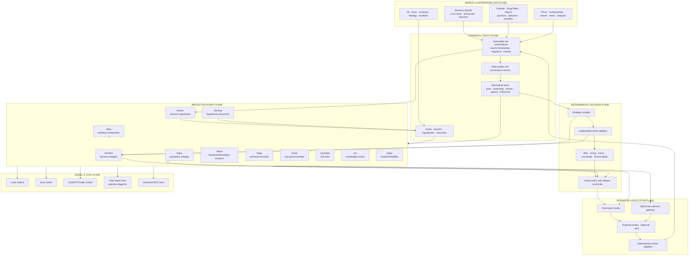
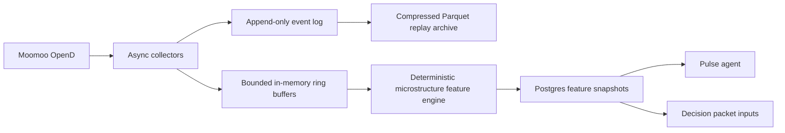

# AGENTIC FINANCIAL SYSTEM & COGNITIVE ARCHITECTURE v2.0
## Trade AI v12 · OpenClaw · Hermes · Moomoo OpenD · Governed Multi-Model Intelligence

**Status:** ARCHITECTURE AND IMPLEMENTATION BLUEPRINT — advisory system design; no execution authorization  
**Date:** 2026-07-22  
**Supersedes:** `AGENTIC_MATURITY_ARCHITECTURE_v1_0.md`  
**Primary objective:** Convert Trade AI from a large collection of deterministic jobs and episodic model calls into a durable, memory-grounded, continuously evaluated agentic financial operating system—without allowing learning or models to bypass deterministic truth, risk policy, operator approval, or per-order 2FA.

---

## 0. Executive Decision

Trade AI already has substantial deterministic infrastructure, broad market and portfolio data, an outcome-scoring layer, Hermes research machinery, OpenClaw operator channels, local models, free OAuth model lanes, and recent deterministic ticket-validation work.

It is **not yet a mature agentic financial system**.

The principal weakness is not the number of cron jobs. Cron and systemd are reliable schedulers and should remain. The weakness is that many “agents” are still one-shot prompt calls or named roles without:

- durable objectives;
- persistent run state;
- retrieval of prior lessons and analogous cases;
- governed multi-step tool use;
- explicit budgets and stop conditions;
- independent validation;
- scored artifacts;
- closed-loop outcome learning;
- universal pre-publication integrity review.

The Watchlist failure—publishing a distant resistance level as a current entry—was not primarily a charting problem. It exposed a missing **reflective immune system**. The system compiled a ticket, but no universal agentic reviewer examined the entire ticket and asked whether its numbers, semantics, current price, action state, and presentation described one coherent trade.

This architecture establishes two connected loops:

```text
FAST REFLECTIVE LOOP
facts → candidate → deterministic validation → retrieval-grounded critique
      → deterministic release/quarantine → operator display

SLOW LEARNING LOOP
outcome → case → lesson → hypothesis → preregistered evaluation
        → adjudication → reversible config promotion → new outcomes
```

The deterministic execution and safety core remains intentionally non-agentic. The reflective and learning layers become agentic.

---

## 1. Honest Maturity Assessment

### 1.1 Separate engineering maturity from agentic maturity

A mature scheduler, database, risk gate, or broker adapter is valuable, but it does not by itself make the system agentic. Conversely, an autonomous model loop is not mature if it lacks truth controls and outcome evidence.

| Capability | Current assessment | Evidence-based interpretation | Target |
|---|---:|---|---:|
| Deterministic execution and safety | 8.5/10 | Strong versioned gates, approval, 2FA, broker fences; should remain deterministic | 9.0 |
| Scheduled automation and operations | 7.2/10 | Extensive cron/systemd pipelines, monitoring, recovery; fragmented ownership remains | 8.5 |
| Data breadth and provenance | 6.8/10 | Broad facts, holdings, events, technicals; cross-source freshness and microstructure incomplete | 8.5 |
| Decision compilation | 6.0/10 | Rich packet and family logic; recent defects proved semantic fragility | 8.0 |
| Decision integrity and release gating | 5.5/10 | Universal release-gate work recently landed; operational population proof still required | 8.5 |
| Durable agent runtime | 3.0/10 | Routing and handoffs exist; many agents are prompt calls, not persistent workers | 8.0 |
| Machine-readable institutional memory | 3.2/10 | Many documents and tables, but lessons/cases are not one governed retrieval system | 8.0 |
| Outcome learning | 4.5/10 | Agent recommendations are scored against closed trades; feedback is narrow and coarse | 7.5 |
| Hypothesis-to-promotion flywheel | 3.8/10 | Hermes calibration and staging exist; preregistration and universal adjudication are incomplete | 8.0 |
| Model orchestration | 5.0/10 | Local, Grok OAuth, ChatGPT OAuth, and premium scaffolding exist; contracts are inconsistent | 8.0 |
| Market microstructure intelligence | 2.0/10 | No canonical Level 2/tape plane in Trade AI; Moomoo is planned | 8.0 |
| Operator agent experience | 4.5/10 | OpenClaw channels and skills exist; durable workflow inspection and cancellation are limited | 8.0 |

**Current overall agentic-financial-system maturity: approximately 4.3/10.**

This is not a statement that the whole platform is only 4.3/10. It means the platform is strong at deterministic automation but materially below institutional maturity in agentic reasoning, memory, reflection, and learning.

### 1.2 Current architecture classification

```text
L0  Deterministic truth, risk, execution and protective logic
L1  Scripted automation and scheduled jobs
L2  Statistical feedback and human-promoted calibration
L3  Durable agents with jobs, tools, artifacts and scores
L4  Retrieval-grounded multi-agent reasoning with case memory
L5  Constitutional self-optimization with preregistered evidence and promotion
```

Approximate current distribution:

```text
55% L0/L1
27% L2
15% partial L3
 3% partial L4
 0% L5 as a complete continuous system
```

Twelve-month architectural target:

```text
40% L0/L1 — deterministic core and routine automation
25% L2    — calibration and statistical feedback
25% L3    — durable, scored agents
 8% L4    — retrieval-grounded reasoning
 2% L5    — tightly governed hypothesis/promotion loops
```

L5 remains intentionally small. A financial system should not maximize autonomy; it should maximize evidence-bound improvement.

---

## 2. Constitutional Laws

These rules are architectural invariants.

1. **The deterministic core never learns in place.** It runs versioned code and versioned configuration.
2. **Learning proposes; evaluation tests; adjudication promotes; deployment versions; outcomes judge.**
3. **No LLM is a source of arithmetic truth, broker truth, position truth, market-data truth, risk eligibility, or execution authority.**
4. **No LLM runs in a latency-critical market-data, protective-stop, fire, broker-write, or kill-switch path.**
5. **Every agent retrieves before reasoning.** An agent that did not consult applicable lessons and analogous cases is marked `MEMORY_NOT_CONSULTED`.
6. **Every agent output is an immutable artifact and is scored.**
7. **Every material prediction is frozen before its outcome window begins.**
8. **Every promoted behavioral change is reversible in one operation.**
9. **No agent writes directly to production policy.** Agents may write only to staging, proposal, case, lesson-candidate, hypothesis, and review surfaces.
10. **No model or group of models may override a deterministic failure.**
11. **Abstention is a valid high-quality output.** `INSUFFICIENT_EVIDENCE`, `NO_ACTIONABLE_TICKET`, and `HUMAN_REVIEW_REQUIRED` are not failures.
12. **Cron/systemd may trigger agents; cron scripts are not automatically agents.**
13. **A personality name is not an agent.** An agent requires durable state, tools, budgets, stop conditions, artifacts, validation, and scoring.
14. **No agent survives on vibes.** Agents without measurable utility are retooled, merged, or retired.

---

## 3. What Qualifies as a Production Agent

A production Trade AI agent is:

```text
Agent =
    objective
  + durable run state
  + retrieved lessons and cases
  + governed tool permissions
  + planning policy
  + bounded observe–reason–act loop
  + budget and deadline
  + explicit stop conditions
  + versioned output schema
  + independent review
  + outcome scoring
```

It is not:

```text
Agent = personality name + long prompt + single model call + unscored prose
```

### 3.1 Required runtime states

```text
QUEUED
RETRIEVING
PLANNING
ACTING
WAITING_FOR_DATA
WAITING_FOR_AGENT
WAITING_FOR_OPERATOR
REVIEWING
COMPLETE
PARTIAL
FAILED
CANCELLED
BUDGET_EXHAUSTED
DEADLINE_EXCEEDED
HUMAN_REVIEW_REQUIRED
QUARANTINED
```

### 3.2 Required run contract

```yaml
run_id:
agent_id:
agent_version:
job_type:
objective:
trigger_event:
source_sha:
input_snapshot_id:
input_hash:
retrieved_lesson_ids: []
retrieved_case_ids: []
retrieval_query:
retrieval_conflicts: []
plan:
current_step:
state:
tool_permissions: []
budget:
  max_wall_seconds:
  max_tool_calls:
  max_local_calls:
  max_oauth_calls:
  max_paid_cost_usd:
deadline:
artifacts: []
review_state:
score_state:
stop_reason:
created_at:
completed_at:
```

---

## 4. Reference Architecture



### 4.1 Authority hierarchy

1. Exchange/broker/provider observation
2. Canonical normalized facts with provenance
3. Deterministic validation and policy
4. Agent review and challenge
5. Human adjudication
6. Operator approval and per-order 2FA
7. Broker adapter

Agents can challenge layers 2–4. They cannot skip the hierarchy.

---

## 5. Named Agent Roster

The existing names Maria, Steph, Iris, Aegis, Alex, Hermes, Risk, and Tax should be retained where operators already recognize them, but their contracts must be corrected. New names fill missing institutional roles.

| Agent | Institutional role | Primary responsibility | May write | Must never do |
|---|---|---|---|---|
| **Atlas** | Workflow Orchestrator | Creates runs, retrieves context, delegates, monitors deadlines, reconciles workflow state | Agent-run tables, staging queues | Decide trades, alter risk policy, call brokers |
| **Sentinel** | Watch Decision Integrity Agent | Reviews every candidate ticket before publication; detects semantic and factual contradictions | Reviews, quarantine records, exceptions | Modify ticket, override deterministic validator |
| **Argus** | Population Integrity Agent | Scans the entire Watch/portfolio population for cross-card contradictions and drift | Exception queue, incident candidates | Rewrite packets automatically |
| **Maria** | Fundamental & Catalyst Research Agent | Company quality, catalyst validity, evidence coverage, counter-thesis | Research artifacts, candidate lessons | Produce entry mechanics or execution authority |
| **Vega** | Technical Structure Agent | Multi-timeframe patterns, levels, regime conflicts, setup lifecycle | Technical review artifacts | Invent OHLCV-derived facts or confirm unclosed bars |
| **Pulse** | Market Microstructure Agent | Moomoo Level 2/tape interpretation from deterministic microstructure features | Microstructure reviews, alerts | Read raw book with an LLM at tick speed; route orders |
| **Steph** | Portfolio & Account Allocation Agent | Account fit, allocation, income role, overlap, cash and tax-location context | Allocation proposals | Submit rebalance or alter account truth |
| **Guardian** | Risk Critic | Portfolio heat, concentration, event, stop, liquidity and scenario risk | Risk objections, review artifacts | Override central risk gate |
| **Ledger** | Tax & Account Constraint Agent | Wash sales, account restrictions, tax consequences, lot evidence | Tax review artifacts | Execute tax trades or fabricate basis |
| **Iris** | Knowledge Curator | Ratifies, merges, disputes, deprecates and indexes lessons/cases | KB curation state | Rewrite source evidence |
| **Hermes** | Hypothesis & Discovery Engine | Finds anomalies, proposes preregistered hypotheses, designs evaluations | Hypothesis staging only | Directly change production config or approve tickets |
| **Darwin** | Outcome Adjudicator | Joins predictions to outcomes, scores strategies/agents, evaluates calibration | Outcome and score ledgers | Promote config by itself |
| **Aegis** | Incident & Reliability Investigator | Investigates failures, creates case files, proposes runbook and code remediations | Incident cases, remediation proposals | Apply unrestricted code fixes or touch broker paths |
| **Alex** | CIO Synthesis Agent | Presents portfolio-level synthesis and unresolved trade-offs to the operator | Synthesis artifacts | Override deterministic or operator gates |
| **Concierge** | Operator Interface Agent | Natural-language command surface through OpenClaw | Read operations; approved staging actions | Become an execution or policy authority |

### 5.1 Deployment rule

Do not deploy all names as independent processes immediately.

Initial active set:

```text
Atlas
Sentinel
Argus
Iris
Hermes
Darwin
Aegis
Concierge
```

Maria, Vega, Pulse, Steph, Guardian, Ledger, and Alex may initially operate as specialist capabilities invoked by Atlas. They become separate durable agents only when their workload, scoring, and tool permissions justify independent runs.

---

## 6. The Fast Reflective Decision Workflow

This workflow prevents nonsense from reaching the operator.

### 6.1 Trigger

A run begins when any material fact changes:

- quote or material price move;
- closed bar;
- technical-state change;
- Moomoo order-book/tape regime change;
- fundamentals;
- earnings or event;
- ownership;
- option chain;
- risk policy;
- operator refresh;
- existing ticket becomes stale.

### 6.2 Deterministic construction

1. Canonical facts are assembled.
2. Provenance and freshness are validated.
3. Strategy candidates are compiled by family.
4. An independent validator recomputes entry, stop, target, risk per share, reward per share, R:R, distance from current price, entry-mode coherence, and event/ownership/borrow/options constraints.
5. A deterministic failure immediately blocks release.

### 6.3 Retrieval before critique

Sentinel retrieves:

- ratified lessons applicable to the symbol, family, market regime, and defect class;
- disputed or contrary lessons;
- analogous historical cases;
- recent incidents involving the same compiler or validator versions;
- previous tickets for the symbol;
- outcomes of similar setups.

The run records the exact lesson and case IDs used.

### 6.4 Sentinel critique

Sentinel receives the immutable facts, candidate ticket, and deterministic validation report.

It asks:

- Does the ticket describe one coherent strategy?
- Is the “entry” actually an entry, trigger, watch level, or prior plan?
- Is the plan actionable at the current price?
- Are current mechanics mixed with previous mechanics?
- Does the operator state agree with the selected family?
- Are blocked or no-trade cards exposing mechanics?
- Is the trigger attainable within the proposed holding period?
- Are data-quality caveats visible?
- Is the system forcing a trade?
- Is there a relevant prior lesson or failed case?

Sentinel may produce:

```text
PASS
CAUTION
REJECT
QUARANTINE
INSUFFICIENT_EVIDENCE
```

It cannot edit the ticket.

### 6.5 Model-review policy

- Deterministic failure: no model call needed.
- Low-risk research display: deterministic pass plus optional local critique.
- Proposal-eligible ticket: deterministic pass plus configured independent review.
- High-risk or ambiguous ticket: local, OAuth, and optional paid expert escalation.
- Paid review is always operator-triggered with a cost preview.

### 6.6 Release reconciliation

Possible release states:

```text
VERIFIED_RESEARCH_ONLY
VERIFIED_PROPOSAL_ELIGIBLE
REVIEW_REQUIRED
REVIEW_SPLIT
DETERMINISTIC_FAIL
STALE_AFTER_REVIEW
QUARANTINED
NO_ACTIONABLE_TICKET
```

Only the deterministic reconciler can set `proposal_allowed=true`.

### 6.7 Population scan

Argus scans all cards after publication and on a schedule for:

- `BLOCKED + current mechanics`;
- `NO_TRADE_PREFERRED + current mechanics`;
- `DETERMINISTIC_FAIL + target`;
- header/tile/action-policy disagreement;
- stale component counted current;
- held symbol using starter-entry ticket;
- entry far from current price;
- trigger/entry-mode mismatch;
- R:R mismatch;
- option-family roll-up mismatch;
- missing verification;
- visible UTC mixed with ET;
- overdue review not reflected in summary counts.

Argus opens exceptions; it never silently repairs production packets.

---

## 7. The Slow Learning Workflow

### 7.1 Outcome becomes a case

Every material event produces an immutable `kb_case` containing the decision-time facts, ticket, lessons retrieved, reviews, operator disposition, outcome, MFE/MAE, costs, slippage, and retrospective. Cases include failures that never became trades. Blocking a bad ticket is a measurable positive outcome.

### 7.2 Nightly reflection

The nightly reflection job reads new cases, anomalies, agent errors, missed opportunities, source drift, calibration changes, incidents, Moomoo observations, and strategy outcomes. It produces candidate lessons and candidate hypotheses—not production changes.

### 7.3 Knowledge curation

Iris deduplicates candidates, finds supporting and contradictory evidence, assigns scope and temporal validity, merges or supersedes old lessons, routes high-impact lessons for human ratification, and monitors retrieval usage.

### 7.4 Hypothesis generation

Hermes writes a preregistered hypothesis:

```yaml
hypothesis_id:
statement:
affected_population:
mechanism:
expected_direction:
expected_effect_size:
primary_metric:
secondary_metrics:
baseline:
train_window:
validation_window:
oos_window:
minimum_sample:
cost_assumptions:
rejection_criteria:
expiry:
supporting_evidence:
counterevidence:
author_agent:
created_at:
source_sha:
```

No result is computed before registration is frozen.

### 7.5 Evaluation and promotion

Use deterministic replay, point-in-time reconstruction, walk-forward, shadow cohorts, holdouts, regime/sector slices, transaction costs, multiple-testing controls, and missing-data disclosure.

Darwin scores the hypothesis and its author. Human/oversight adjudication selects `REJECT`, `REVISE`, `CONTINUE_SHADOW`, `APPROVE_CONFIG_PROPOSAL`, or `DEPRECATE_PRIOR_RULE`. Approved changes become versioned PRs with tests, rollback instructions, deployment evidence, and a post-promotion observation window.

---

## 8. Unified Knowledge Architecture

### 8.1 `kb_lessons`

```yaml
lesson_id:
statement:
scope:
  subsystem:
  strategy:
  instrument:
  broker:
  market:
effective_from:
effective_until:
status: CANDIDATE|RATIFIED|DISPUTED|DEPRECATED|SUPERSEDED|REJECTED
confidence:
evidence_refs: []
counterevidence_refs: []
supersedes: []
superseded_by:
source: HUMAN|AGENT|POSTMORTEM|OUTCOME
source_snapshot:
ratified_by:
ratified_at:
embedding_model:
embedding_version:
created_at:
updated_at:
```

### 8.2 `kb_cases`

Complete point-in-time case files for trades, rejected tickets, incidents, stale-data failures, broker discrepancies, model disagreements, Moomoo microstructure events, outages, and successful abstentions.

### 8.3 `kb_chunks`

Searchable source chunks with document/file/table identity, source SHA or row version, temporal validity, access classification, embedding, retrieval score, and deprecation state.

### 8.4 Retrieval policy

Use hybrid retrieval: structured filters, exact identifiers, temporal validity, keyword/BM25, semantic similarity, evidence quality, recency, and contradiction search. Vector similarity alone must never define institutional memory.

### 8.5 Embedding-model governance

Current documents conflict on the active embedding model: one design mentions `nomic-embed-text`, while the current agent roster says `qwen3-embedding:8b` is active.

Before building the KB:

1. verify the live embedding model;
2. choose one canonical model and version;
3. persist embedding provenance on every row;
4. build a dual-index migration if changing models;
5. compare retrieval quality before retiring the prior index.

---

## 9. Durable Agent Runtime

### 9.1 Database schema

```text
agent_definitions
agent_capabilities
agent_runs
agent_steps
agent_tool_calls
agent_observations
agent_artifacts
agent_reviews
agent_scores
agent_checkpoints
agent_handoffs
agent_budgets
agent_exceptions
agent_model_calls
```

### 9.2 Agent definition

```yaml
agent_id:
display_name:
role:
version:
owner:
objective_template:
allowed_job_types: []
allowed_tools: []
denied_tools: []
retrieval_policy:
model_policy:
budget_policy:
review_policy:
score_policy:
enabled:
deployment_state: DESIGNED|SHADOW|OPERATIONAL|RETIRED
```

### 9.3 OpenClaw role

OpenClaw becomes the **reflective-agent runtime and operator gateway**. It owns reflective workflow creation, model routing, tool invocation, checkpointing, cancellation, operator commands, status delivery, staging confirmations, and cost visibility.

It does not own broker truth, market-data truth, risk truth, production policy, execution authorization, config promotion, or 2FA.

Cron/systemd remains the reliable trigger layer. OpenClaw owns the durable reflective workflow after the trigger.

### 9.4 Checkpoints

Checkpoint after retrieval, plan creation, each external tool/model call, before staging writes, before waiting on agents/operators, and at final artifact creation. Restarts resume from the latest valid checkpoint.

---

## 10. Model and Provider Architecture

### 10.1 Roles

| Layer | Authority | Use |
|---|---|---|
| Deterministic code | Hard authority | Arithmetic, validation, freshness, policy, risk, release gates |
| Local Ollama | Cheap critic | Contradiction detection, summarization, classification, first review |
| Grok OAuth | Independent external critic | Alternative interpretation and catalyst/news challenge |
| ChatGPT/Codex OAuth | Independent external critic | Structural coherence, evidence review, code/ticket criticism |
| Paid expert model | Operator-triggered escalation | High-value ambiguity, incident review, complex strategy review |
| Reconciler | Deterministic | Preserves disagreement; never averages away hard failures |

### 10.2 Independence and binding

If a “local” lane falls back to OpenAI or Anthropic, it is no longer local and must not count as an independent local vote. Every model result binds to agent run, artifact, ticket, input hash, validation hash, prompt version, provider family, model, and response hash.

### 10.3 Model registry

Remove hard-coded model assumptions from business code.

```yaml
provider:
route:
auth_type:
model:
capabilities:
context_window:
structured_output:
tool_use:
reasoning:
price:
latency_class:
provider_family:
enabled:
fallbacks: []
last_capability_probe:
```

A model is usable only after a capability probe. A newer model name must not be deployed merely because it appears in release notes.

### 10.4 OpenAI Agents SDK decision

The OpenAI Python SDK is useful as a provider client. The OpenAI Agents SDK is **not a prerequisite** for this architecture. Adding another orchestration framework on top of OpenClaw and Hermes would create duplicate run state, tools, and tracing. Evaluate it only in an isolated laboratory profile if its tracing, handoff, or Responses API support materially outperforms the native runtime contract.

---

## 11. Current Version and Prerequisite Audit

All runtime versions must be verified on `ms01-openclaw`. Repository pins and documentation are evidence, not live proof.

### 11.1 OpenAI Python SDK

**Repository pin:** `openai==2.30.0`  
**Current published version at this architecture date:** `2.46.0`  
**Assessment:** Supported but behind.

The free ChatGPT/Codex OAuth lane uses an HTTP-compatible local proxy and does not depend directly on the Python OpenAI package. Direct metered API and Python consumers do depend on it.

Recommendation:

1. Create an isolated compatibility venv/branch.
2. Upgrade to `openai==2.46.0`.
3. Test Responses API, Chat Completions compatibility, structured output, streaming, retries, usage accounting, proxy clients, and Python 3.14.
4. Pin only after all consumers pass.
5. Prefer Responses API for new direct OpenAI integrations.
6. Do not change OAuth routes merely because the SDK changed.

### 11.2 Hermes

**Last documented installed version:** `0.16.0`  
**Current published version:** `0.19.0`  
**Assessment:** Likely behind; live verification required.

Upgrade through a cloned venv and copied profiles. Snapshot `~/.hermes`, global profiles, SOULs, tools, skills, permissions, and staging contracts. Test 0.19.0 in isolation; cut over atomically; retain one-step rollback. Hermes remains research/hypothesis/challenger, not execution authority.

### 11.3 OpenClaw

Documentation is stale and contradictory:

- an older Drive document reports `2026.4.14`;
- a later repository incident record reports recovery/upgrade to `2026.6.11`;
- the current stable npm line is `2026.7.1-2`;
- `2026.7.2-beta` is prerelease.

Assessment: likely one stable train behind; verify live.

Confirm `openclaw --version`, verify Node compatibility, snapshot configuration/skills/agents/channels/daemon, test stable `2026.7.1-2` in a copied workspace, validate Telegram/OAuth/MCP/cron status/agent sessions/cancellation/permissions, then upgrade atomically. Do not use beta merely to obtain newer model defaults.

### 11.4 Local models and stale roster documentation

Current policy says:

```text
gemma3:12b primary
gemma3:4b fallback
gemma3:27b overnight
qwen3-embedding:8b embeddings
qwen3:14b chat disabled
```

Many roster rows still incorrectly name `qwen3:14b` as active. Verify `ollama list`, regenerate the roster from live configuration, remove stale model names, test local-only mode with cloud fallback disabled, and persist actual model identity on every artifact.

### 11.5 PostgreSQL and pgvector

Verify PostgreSQL, the `vector` extension, index dimensions/type, backup/restore, migration rollback, hybrid retrieval performance, and access separation. No KB implementation may assume pgvector merely because a design says it exists.

### 11.6 Version inventory

Extend the system-version checker to include:

```text
OpenAI Python SDK
OpenClaw installed/latest stable
Hermes installed/latest
Moomoo SDK
Moomoo OpenD
Node
Ollama
local models
embedding model
pgvector
MCP server
agent schema
prompt registry
```

Expose `CURRENT`, `BEHIND`, `COMPATIBILITY_TESTING`, `BLOCKED`, and `UNKNOWN`.

---

## 12. Moomoo Market Intelligence Plane

Moomoo OpenD enters first as a **read-only market-intelligence source**. It does not become execution authority in the initial architecture.

### 12.1 Capabilities to consume

Subject to permissions and subscription quotas:

- real-time quote;
- multi-level order book;
- tick-by-tick/time and sales;
- real-time timeframe data;
- real-time candles;
- extended-hours US data;
- available broker queue data;
- provider/server timestamps;
- sequence numbers.

For US markets, do not promise detailed per-order identities. Represent available Level 2 and normal book levels honestly according to entitlement/API capability.

### 12.2 Components

```text
moomoo-opend.service
moomoo-subscription-manager
moomoo-quote-collector
moomoo-orderbook-collector
moomoo-ticker-collector
moomoo-session-calendar
moomoo-sequence-monitor
moomoo-feature-engine
moomoo-replay-writer
moomoo-health-monitor
```

### 12.3 Subscription manager

Quota priority:

```text
P0  positions, active proposals, operator-selected scalp names
P1  top-ranked READY/WAIT candidates, alerts near trigger
P2  current Watch page and high-velocity movers
P3  rotating research universe
```

The manager subscribes/unsubscribes dynamically, records entitlement failures, accounts for sessions, avoids duplicates, releases unused quota, preserves priority on reconnect, and displays quota/deferred symbols. Do not subscribe all 5,000+ symbols.

### 12.4 Data path



Do not write every book update into main OLTP tables. Use bounded async queues, append-only logs, compressed replay, and Postgres for metadata/features/decisions. Introduce a message broker only after measured throughput justifies it.

### 12.5 Deterministic microstructure features

Compute without LLMs:

- spread and spread percentile;
- top-of-book size;
- depth by level;
- order-book imbalance;
- weighted mid and microprice;
- depth slope;
- replenishment and cancellation bursts;
- tape velocity;
- uptick/downtick balance;
- trade-size distribution;
- sweeps and absorption;
- bid/ask pressure;
- extended-hours liquidity;
- sequence gaps;
- stale-book state.

Pulse receives summarized features and replay windows—not every tick.

### 12.6 Time and integrity

Require NTP/chrony health; exchange/provider/OpenD/local timestamps; sequence tracking; reconnect markers; cached-first-push markers; crossed-book handling; session-specific staleness; entitlement/quota state; and replay determinism.

### 12.7 Pulse outputs

```text
LIQUIDITY_SUPPORTIVE
LIQUIDITY_THIN
BUY_PRESSURE
SELL_PRESSURE
ABSORPTION
SWEEP_RISK
SPREAD_UNSAFE
TAPE_CONFLICT
DATA_UNAVAILABLE
```

These are evidence dimensions, not trade commands. Pulse cannot submit orders, set size, override stale facts, mark tickets verified, or bypass release gates.

---

## 13. MCP and Tool Governance

### 13.1 Tool classes

```text
READ_TRUTH
READ_HISTORY
READ_KB
READ_MARKET_REPLAY
CREATE_AGENT_RUN
WRITE_STAGING
WRITE_REVIEW
WRITE_CASE
WRITE_LESSON_CANDIDATE
WRITE_HYPOTHESIS
REQUEST_OPERATOR_ACTION
```

Denied by default:

```text
BROKER_WRITE
PRODUCTION_CONFIG_WRITE
SECRET_READ
UNBOUNDED_SHELL
ARBITRARY_SQL_WRITE
APPROVAL_MUTATION
2FA_REQUEST
```

Every tool call includes run ID, agent ID, capability, scope, resource, expiry, idempotency key, reason, and source SHA.

Expose governed MCP tools for repository/deployment status, read-only database facts, run inspection, KB search, exception queues, staging proposals, tests, and preview deployments. Do not expose unrestricted SSH as the core architecture.

---

## 14. Agent Performance Ledger

Score by job, not one generic hit rate.

- **Sentinel:** true contradictions, false alarms, harmful tickets blocked, valid tickets delayed, citation accuracy, abstention, latency.
- **Argus:** defects found, false-positive exceptions, recurrence, detection time, coverage.
- **Maria:** catalyst accuracy, evidence coverage, thesis calibration, stale-source use, counter-thesis quality.
- **Vega:** pattern precision, no-lookahead compliance, trigger accuracy, false confirmation.
- **Pulse:** microstructure calibration, stale/sequence detection, false sweep/absorption alerts, fill usefulness, latency.
- **Hermes:** preregistered hypothesis success, effect calibration, novelty, duplication, economic value after costs, research cost.
- **Iris:** retrieval precision, duplicate reduction, stale-lesson detection, contradiction resolution, downstream use.
- **Darwin:** outcome completeness, scoring correctness, calibration stability, false promotion.
- **Aegis:** root-cause accuracy, containment time, recurrence, runbook correctness, false escalation.

Quarterly disposition:

```text
KEEP
PROMOTE
RETOOL
MERGE
SHADOW
RETIRE
```

---

## 15. Implementation Program

### A0 — Freeze and baseline

Verify Git/deployed SHA, crons/systemd, OpenAI/Hermes/OpenClaw/Node/Ollama/embedding/pgvector versions, agent inventory, prompts, tools, outputs, scores, and safety gates.

### A1 — Decision-integrity completion

Universal validator, Sentinel, Argus, no mechanics without verified ticket, population migration, live acceptance matrix, scheduler gated until proof.

### A2 — Durable agent runtime

Runtime schema, Atlas, checkpoints, budgets, cancellation, tool permissions, run UI, OpenClaw integration.

### A3 — Knowledge brain

`kb_lessons`, `kb_cases`, `kb_chunks`, hybrid retrieval, Iris curation, seed findings/incidents/handoffs/outcomes.

### M0 — Moomoo foundation

Verify entitlements/quotas, isolated OpenD, read-only collectors, health/sequence checks, replay capture, no decision use.

### M1 — Microstructure features

Deterministic book/tape features, replay validation, Pulse shadow mode, source comparison, quality/latency scorecard.

### M2 — Decision integration

Microstructure snapshot as a decision input, material-change invalidation, no direct action authority, empirical calibration.

### A4 — Reflection and cases

Nightly reflection, case generation, lesson candidates, incident loop, outcome-linked review.

### A5 — Hermes hypothesis flywheel

Preregistration, backtest/shadow evaluation, Darwin scoring, human adjudication, versioned config PRs, rollback and post-promotion monitoring.

### A6 — MCP/operator surface

Governed tools, Concierge commands, status/cancel/replay/explain/retrieve, premium confirmation, no unrestricted production shell.

### A7 — Forward evidence

20+ trading-session observation, scorecards, Moomoo integrity report, false positives, promotion/retirement decisions.

---

## 16. Acceptance Gates

Agentic system:

```text
DURABLE AGENT RUNS: VERIFIED
RETRIEVAL BEFORE REASONING: >=95%
AGENT TOOL CALLS AUDITED: 100%
AGENT OUTPUTS SCORED: >=95%
UNSCORED PRODUCTION AGENTS: 0
CHECKPOINT/RESUME: VERIFIED
CANCELLATION: VERIFIED
MODEL OVERRIDES DETERMINISTIC FAILURE: 0
DIRECT AGENT PRODUCTION-CONFIG WRITES: 0
BROKER CALLS FROM REFLECTIVE AGENTS: 0
```

Decision integrity:

```text
MECHANICS WITHOUT VERIFIED TICKET: 0
HEADER/TILE/ACTION CONTRADICTIONS: 0
BLOCKED CARDS WITH CURRENT MECHANICS: 0
NO-TRADE-PREFERRED CARDS WITH CURRENT MECHANICS: 0
STALE REQUIRED INPUT COUNTED CURRENT: 0
```

Knowledge/learning:

```text
LESSONS WITH PROVENANCE: 100%
RATIFIED LESSONS WITH COUNTEREVIDENCE SEARCH: 100%
TEMPORALLY VALID RETRIEVAL: 100%
UNVERSIONED EMBEDDINGS: 0
PROMOTED CHANGES WITH PREREGISTRATION: 100%
PROMOTED CHANGES WITH OOS/SHADOW EVIDENCE: 100%
PROMOTED CHANGES WITH ONE-STEP ROLLBACK: 100%
```

Moomoo:

```text
OPEND HEALTH: VERIFIED
ENTITLEMENTS DISPLAYED: VERIFIED
SUBSCRIPTION QUOTA GOVERNED: VERIFIED
SEQUENCE GAP DETECTION: VERIFIED
RECONNECT REPLAY: VERIFIED
RAW/FEATURE TIMESTAMP PROVENANCE: VERIFIED
LLM IN TICK PATH: NO
MOOMOO EXECUTION AUTHORITY: NO
```

---

## 17. Anti-Patterns

Do not build:

- agents debating until one sounds convincing;
- vector search without temporal/provenance filters;
- self-modifying production thresholds;
- LLM arithmetic treated as truth;
- an agent scoring or validating its own artifact;
- duplicate orchestration frameworks without an ADR;
- full-universe Level 2 subscriptions;
- raw L2 events in the main transactional database;
- “local” review with silent cloud fallback;
- consensus from correlated routes;
- paid review without cost preview;
- permanent agents with no utility score;
- OpenClaw as broker or policy authority;
- Hermes as final trade decision-maker;
- autonomous config promotion;
- autonomous live execution.

---

## 18. Required Live Verification Commands

Run on `ms01-openclaw` and preserve output in the architecture audit:

```bash
cd /home/johnclaw/trade-ai-v12-rebuild/trade-ai-v12-rebuild

git rev-parse HEAD
git status --short

.venv/bin/python - <<'PY'
import openai
print("openai", openai.__version__)
PY

~/.local/bin/hermes --version || true
~/.local/share/hermes-agent-venv/bin/pip show hermes-agent || true

openclaw --version
node --version
npm --version
ollama list

psql -Atc "SELECT extname, extversion FROM pg_extension WHERE extname='vector';"

systemctl --user status openclaw-gateway --no-pager || true
systemctl status moomoo-opend --no-pager || true
```

Do not perform upgrades in this verification step.

---

## 19. Architecture Decisions

- **ADR-001:** Deterministic core remains sovereign — accepted.
- **ADR-002:** OpenClaw is reflective runtime/operator gateway — accepted, pending durable run state.
- **ADR-003:** Hermes is hypothesis/discovery, not execution — accepted.
- **ADR-004:** Learning is system-level, not online model self-modification — accepted.
- **ADR-005:** Moomoo enters read-only first — accepted.
- **ADR-006:** PostgreSQL is control store; microstructure uses append-only replay — accepted pending benchmark.
- **ADR-007:** OpenAI Agents SDK is optional, not prerequisite — accepted pending isolated evaluation.
- **ADR-008:** No current mechanics without independent deterministic validation — non-negotiable.

---

## 20. End-State Workflow

```text
Moomoo / brokers / fundamentals / events / news
                    │
                    ▼
         canonical observations + provenance
                    │
                    ▼
       deterministic features and strategy candidates
                    │
                    ▼
       independent validator and risk/policy checks
                    │
                    ▼
  Sentinel retrieves lessons/cases and challenges the ticket
                    │
        ┌───────────┼───────────┐
        ▼           ▼           ▼
      local      OAuth pair   paid expert
      critic     if required  if operator requests
        └───────────┼───────────┘
                    ▼
           deterministic reconciler
                    │
       ┌────────────┴────────────┐
       ▼                         ▼
    RELEASE                    QUARANTINE
       │                         │
       ▼                         ▼
 Command Center              Argus exception
 and OpenClaw                + Aegis incident
       │
       ▼
 operator proposal review → approval → 2FA → broker adapter
       │
       ▼
 outcome, costs, MFE/MAE, operational result
       │
       ▼
 Darwin scoring → case → Iris lesson curation
       │
       ▼
 Hermes preregistered hypothesis → evaluation → adjudication
       │
       ▼
 versioned config/code PR → tests → operator promotion → rollback-ready deploy
```

---

## 21. Final Architectural Position

Trade AI should not aspire to be an autonomous trading bot.

It should become an **agentic financial operating system** with:

- deterministic truth;
- deterministic risk and execution;
- reflective multi-agent critique;
- institutional memory;
- market microstructure awareness;
- preregistered learning;
- scored agents;
- reversible improvement;
- explicit human authority.

> **Machines observe broadly, deterministic systems establish truth, agents challenge and learn, evidence earns promotion, and humans retain financial authority.**

---

## Appendix A — Evidence Base Reviewed

This architecture was derived from the following observed sources and must be refreshed when those sources change:

### Repository evidence

- current observed `main` during review: `e7978e13814f8acf3cc2a6ee96e43e086fb6de83`;
- universal Watch release gate and operator-presentation work;
- deterministic ticket oversight and premium-review registry;
- `requirements.txt` dependency pins;
- `scripts/llm_lane.py` OAuth/local routing;
- `config/llm_process_registry.json` process policies;
- `scripts/agent_router.py` deterministic routing;
- `scripts/agent_collab.py` current prompt-call collaboration model;
- `scripts/agent_outcome_scorer.py` current outcome feedback loop;
- `scripts/check_system_versions.sh` version inventory;
- `docs/AGENT_ROSTER.md` and its internal model-policy drift.

### Documentation evidence

- `AGENTIC_MATURITY_ARCHITECTURE_v1_0.md`;
- `AGENT_AND_HERMES_WORKFLOWS.md`;
- `HERMES_AGENT_CONTRACTS_AND_PERMISSIONS.md`;
- `HERMES_MULTI_AGENT_COORDINATION_ARCHITECTURE.md`;
- `HERMES_DATABASE_FIRST_INTEGRATION_ARCHITECTURE.md`;
- `HERMES_ADAPTIVE_THRESHOLD_LEARNING.md`;
- `HERMES_GLOBAL_INSTALL_MIGRATION_20260606.md`;
- `project_openclaw.md`;
- `AGENT_ROSTER.md`;
- agent source exports and outcome-scoring documentation.

### External current-version evidence

- OpenAI Python package release history;
- Hermes Agent PyPI release history;
- OpenClaw npm stable/beta channels;
- Moomoo OpenD API v10.9 quote subscription, order-book, tick-by-tick, broker-queue, permissions, frequency, and quota documentation.

### Known documentation conflicts to resolve

1. OpenClaw version: older Drive documentation versus later repository upgrade records.
2. Hermes version: last documented global install versus current PyPI release.
3. Local chat model: current policy versus stale qwen3:14b roster rows.
4. Embedding model: `nomic-embed-text` assertion versus `qwen3-embedding:8b` policy.
5. “Agents” terminology: existing prompt-call implementation versus desired durable agent runtime.
6. Hermes autonomy: prior auto-graft behavior versus this architecture’s adjudicated-promotion constitution.

---

## Appendix B — First Architecture Review Deliverables

Before implementation begins, produce these read-only reports:

1. `AGENTIC_RUNTIME_BASELINE_<DATE>.md`
2. `MODEL_AND_VERSION_COMPATIBILITY_MATRIX_<DATE>.md`
3. `AGENT_TOOL_PERMISSION_MATRIX_<DATE>.md`
4. `KNOWLEDGE_CORPUS_AND_EMBEDDING_AUDIT_<DATE>.md`
5. `MOOMOO_ENTITLEMENT_QUOTA_AND_LATENCY_AUDIT_<DATE>.md`
6. `WATCH_DECISION_INTEGRITY_POPULATION_AUDIT_<DATE>.md`
7. `AGENT_SCORECARD_BASELINE_<DATE>.md`
8. `OPENCLAW_HERMES_UPGRADE_ROLLBACK_PLAN_<DATE>.md`

No package upgrade, Moomoo integration, or agent promotion should begin until the relevant report is reviewed.
