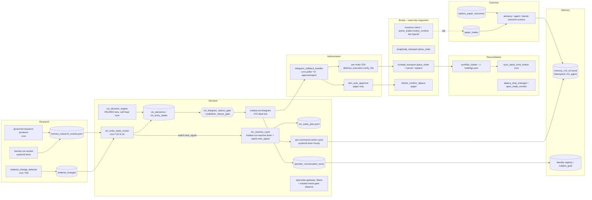

# Agent and Service Map — traced from code and the served host

Status:      PROPOSED (dated snapshot; re-measure, do not re-date)
Owner:       platform
as_of:       2026-09-25T09:20:00-04:00
Measured at: base 1c60ecb42 (origin/main) / served 1c60ecb42-main-exact-phase2-20260925-091436

Scope: every component on the research → decision → authorization → broker →
reconciliation → outcome → memory path, with its entry point, schedule, stores and the
registry that owns it. This file **links** rosters; it does not replace them
(see [`ARCHITECTURE_INDEX.md`](ARCHITECTURE_INDEX.md)).

## 1. Verification classes

| Class | Meaning | Evidence required |
|---|---|---|
| `VERIFIED_IN_SERVED_RUNTIME` | Seen running or writing on ms01 at the measured time | process `cwd`, live unit, cron line, or a store write with its timestamp |
| `VERIFIED_IN_CODE` | Entry point and behaviour found at the base SHA; not observed running now | `file:line` |
| `DOCUMENTED_ONLY` | Described in docs; no code path found | doc path |
| `UNKNOWN` | Could not be established read-only | what was tried |

Broker components were inspected **read-only** (file:line only). AGENTS.md §0 rule 2 is
still in force at this SHA: nothing here was called, tested against, or modified.

## 2. Decision loop

## 3. Components

`Owner` is the lane owner in `config/lane_registry.json` where one exists.
`Authority` uses the catalog/registry wording.

### Research

| Component | Entry point | Schedule / unit | Inputs → outputs (stores) | Owner / authority | Registry | Status + evidence |
|---|---|---|---|---|---|---|
| Hermes CIO worker | `scripts/hermes_cio_worker.py` | `tradeai-hermes-cio-worker.timer` (15 min, off-peak drop-in) | research requests → `data/cio/hermes_research_results.jsonl` | hermes / READ_ONLY_ADVISORY, paid LLM | lane referencing `tradeai-hermes-cio-worker` | SERVED_RUNTIME — results file written 2026-09-25 09:00:59 |
| Material-change detector | `scripts/material_change_detector.py --apply` | cron `*/30` | quotes, watchlist, holdings → `material_changes` | cio | lane `material-change-detector-stage1` | SERVED_RUNTIME — latest `observed_at` 2026-09-25 07:16 |
| Material-change notifier + digest | `scripts/notify_material_change.py` | cron `7-59/15`, `15 16 * * *` | `material_changes` → Telegram | cio | lanes `material-change-notifier-stage2`, `material-change-digest` | SERVED_RUNTIME — last `notified_at` 2026-09-24 16:15 (digest) |
| Governed research producer | `scripts/run_governed_research_producer.py` | cron | → research ledger | research | lane `governed-research-producer` | VERIFIED_IN_CODE (cron line present) |

### Decision

| Component | Entry point | Schedule / unit | Inputs → outputs | Owner / authority | Registry | Status + evidence |
|---|---|---|---|---|---|---|
| CIO entry-state runner | `scripts/cio_entry_state_runner.py --apply` | cron `*/10 9-16 * * 1-5` | plans, quotes → `cio_entry_states`, `cio_decisions` (`action_class='entry'`), Telegram, `watch.new_signal` | cio / advisory | lane `cio-entry-state` | SERVED_RUNTIME — `cio_entry_states` max 2026-09-25 09:20 |
| CIO decision engine | `scripts/cio_decision_engine.py --run` | **no cron** (lane PAUSED, reason UNKNOWN); runs via health-agent self-heal | classifications + rule evals → `cio_decisions` | cio | lane `cio-decision-engine` | VERIFIED_IN_CODE; schedule UNKNOWN (irregular) |
| CIO reactive cycle | `scripts/cio_reactive_cycle.py` | `tradeai-cio-reactive.timer`; consumes `watch.new_signal` bus events | bus events → `data/cio/cio_wake_jobs.jsonl` | cio | lane `cio-reactive-cycle` | SERVED_RUNTIME — wake jobs file 2026-09-25 09:20 |
| AEC command-center cycle | `scripts/aec_command_center_cycle.py --apply` | `tradeai-aec-command-center-cycle.timer` hourly + `m2-production.conf` drop-in | spines → agent bus, **prod memory** | platform / advisory | lane `tradeai-aec-command-center-cycle` | SERVED_RUNTIME — prod memory 25 facts, 12 receipts, latest 2026-09-25 09:00 |
| CIO desk bot | `scripts/cio_telegram_bot.py --loop` | `tradeai-cio-telegram.service` | operator Telegram → replies, `operator_conversation_turns` | cio / READ_ONLY_ADVISORY | `config/expected_services.json` | SERVED_RUNTIME — cwd = served release; last turn 2026-09-25 08:11 |
| Maria (OpenClaw) | `~/.local/lib/openclaw/dist/index.js gateway` | `openclaw-gateway.service` (drop-in override) | Telegram chat → replies; `tradeai-maria-gate` plugin (observe) | OpenClaw agent `maria` | `~/.openclaw/openclaw.json` (host) | SERVED_RUNTIME (process); **not in repo registries** |
| CIO stance gate | `scripts/lib/cio_telegram_stance_gate.py`, `scripts/lib/publisher_stance_gate.py` | library (called by publishers) | CIO row → allow / hold / rewrite; `cio_telegram_stance_holds.jsonl` | cio | — | VERIFIED_IN_CODE |
| Persistent agents (alex, iris, darwin, …) | `tradeai-agent-runtime@<agent>.timer` | systemd template | per-agent contracts | per catalog (alex: SHADOW, all broker/order authority DENIED) | `config/agent_maturity_catalog.json`, `config/expected_services.json` | SERVED_RUNTIME (timers declared ON by `check_expected_services.py`: 60/60 on) |

### Authorization

| Component | Entry point | Schedule / unit | Behaviour | Status + evidence |
|---|---|---|---|---|
| Engineering grant ledger | `bin/guard`, `scripts/guard_request_approval.py` | on demand | scoped grants (git-push, release-write, db-write, cron, service, …); `secret`/`gate` never grantable | VERIFIED_IN_CODE + used 2026-09-24/25 (grant receipts) |
| Proposal approve/reject | `scripts/telegram_callback_handler.py` | cron `*/2` via `run_telegram_callback_poller_current.sh` | operator button → proposal state; raw Telegram replies (allowlisted) | VERIFIED_IN_CODE (cron present) |
| Per-order 2FA | `scripts/defense_execution.py:222` `verify_2fa`; `scripts/api_v2.py:16655` | on demand | per-order code before broker write; `execution_state.py:166` sets `per_order_2fa_required` | VERIFIED_IN_CODE; **not exercised** (rule) |
| ATM auto-approver | `scripts/atm_auto_approver.py` | cron | paper accounts only | VERIFIED_IN_CODE |

### Broker (inspection only)

| Mutation entry point | File:line | Status |
|---|---|---|
| Schwab place / cancel / replace | `scripts/schwab_transport.py:101`, `:437`, `:525` | VERIFIED_IN_CODE |
| SnapTrade place | `scripts/brokers/snaptrade_transport.py:31` | VERIFIED_IN_CODE |
| Moomoo place (lab) | `scripts/moomoo/client.py:420`; runtime `active_trader.motion_runtime` | process SERVED_RUNTIME (`tradeai-active-trader-motion.service`, cwd `trade-ai-deployments/active-trader/306f8179…`, **not CURRENT**) |
| Alpaca paper submit | `scripts/broker_confirm_alpaca.py:70`, interface `scripts/broker_adapter.py:40` | VERIFIED_IN_CODE |
| Write-policy check | `scripts/validate_schwab_write_policy.py --source-only` | CI step in `aif-financial-senses-integration-ci.yml` |

### Reconciliation, outcome, memory

| Component | Entry point / store | Status + evidence |
|---|---|---|
| Holdings | `scripts/portfolio_loader.py` → `portfolios/state/holdings.json` (DSA `holdings_accounts`) | SERVED_RUNTIME — file 2026-09-25 09:15 |
| Basis sync | `scripts/sync_basis_from_broker.py` (cron) | VERIFIED_IN_CODE |
| Stop / trade monitors | `alpaca_stop_manager.py` (cron), `paper_trade_monitor.py` (cron), `open_trade_monitor.py` | VERIFIED_IN_CODE |
| Paper trades | `paper_trades` table | SERVED_RUNTIME — max `updated_at` 2026-09-24 16:45 |
| Options paper outcomes | `options_paper_outcomes` | SERVED_RUNTIME — 1 row |
| Outcome scorers | `advisory_outcome_scorer.py`, `agent_outcome_scorer.py`, `darwin_outcome_scorer.py` | VERIFIED_IN_CODE (timers declared ON) |
| Cognitive memory (prod) | `memory_r10_m2` via `scripts/lib/cio_memory_integration.py` as `m2_agent`; runbook `docs/ops/COGNITIVE_MEMORY_PRODUCTION_RUNBOOK.md` | SERVED_RUNTIME — 25 facts / 12 receipts |
| Identity | `operator_conversation_turns.subject_guid`, identity registry, `watch_*` `subject_guid` columns | VERIFIED_IN_CODE; migrations applied 2026-09-24 |

### Operator surfaces

| Component | Entry point | Status + evidence |
|---|---|---|
| API server | `portfolio-server.service` → `scripts/portfolio_server.py` + `scripts/api_v2.py handle()` (:47145), port 7777 | SERVED_RUNTIME — cwd served release; `/api/v3/agent-maturity` answered 2026-09-25 13:19Z |
| Command Center v3 | `apps/command-center-v3/src/App.tsx` (52 routes) | VERIFIED_IN_CODE (build in release) |

## 4. Drift between registries and the host (read-only, 2026-09-25)

1. `portfolio-server.service` and `cio-governed-bridge.service` run but are **absent from
   `config/expected_services.json`**, so the OFF-detector would not notice if they were disabled.
2. `openclaw-gateway`, `heartbeat-receiver`, `tradeai-lab-postgres`, `power-watch` run but have
   **no file under `config/systemd/`** (116 files there, 101 unit files); `tradeai-ops-agent` runs from
   `~/.openclaw/skills/tradeai-health-inspect/scripts` (outside the repo release).
3. `tradeai-active-trader-motion` runs from a pinned deployment (`306f8179…`), not CURRENT. This
   may be deliberate, but no registry records the pin.
4. Promote restarts only `TRADEAI_CURRENT_BOUND_UNITS` (default `tradeai-health-agent`,
   `cio-governed-bridge`; `scripts/cio_phase2_exact_main_deploy.sh:644`). The CIO desk bot
   needs a manual restart after desk-code deploys.
5. `openclaw-gateway.service`'s base `ExecStart` points at `/usr/lib/node_modules/openclaw`, but a
   drop-in overrides it to `~/.local/lib/openclaw`, and the unit description names an old version.
6. `config/lane_registry.json` covers **scheduled** jobs only. Long-running services have no
   owner/authority field in any registry; ownership is split between `expected_services.json`
   and `config/systemd/`.
7. There's **no GUI route registry and no HTTP route registry**. Routes exist only in
   `App.tsx` and in `api_v2.handle()` / `portfolio_server.py` prefix branches.
8. `config/agent_maturity_catalog.json` (alex) still carries the static strings
   "11/12 gates passing". The served `/api/v3/agent-maturity` payload does **not** contain them
   (verified 13:19Z), but `scripts/lib/cio_agent_handoff_queue.py:115` and
   `scripts/lib/advisory/promotion_gate.py:100` read the catalog. The repair is in workstream B.
9. `apps/command-center-v3/src/pages/AgentsHub.tsx:26` hardcodes `RUNTIME_MODEL='gemma3:12b'`.
   It's reachable as the "Legacy analytics" view of `/v3/agents`
   (`AgentRuntimeHub.tsx:581`).

10. `dividend_calendar.json` (producer `scripts/portfolio_dividend_calendar.py:238`, run by the
    `portfolio_orchestrator` cron line; served by `scripts/api_v2.py:8105/8206`; shown in
    `DividendsPanel.tsx:250`) is in **neither** a DSA domain/projection **nor**
    `operator_surface_stores.json`. Its freshness thresholds are hardcoded in
    `scripts/health_agent.py:798` and `scripts/check_data_product_freshness.py:130`.
    The API payload is an untyped dict (`api_v2.py:8194`), with a hand-written TS type.
11. Grant enforcement is weaker than the grant ledger implies:
    - `bin/guard` hooks are wired only through `.cursor/hooks.json`, which points at another
      worktree (`tradeai-wt-cursor-guardrails`). Claude Code has no repo hooks.
    - Under Cursor, `cio_phase2_exact_main_deploy.sh promote` classifies as none, and
      `gh pr merge` is unclassified.
    - Force-push is blocked by user-level `~/.claude/settings.json` and GitHub
      `allow_force_pushes:false`, not by `bin/guard`.

## 5. Unknowns

- `cio_decision_engine`'s real run cadence (lane reason UNKNOWN; health-agent self-heal).
- Whether the moomoo lab pin in (3) is intentional.
- Any service on a second host: no multi-host registry exists, and leases are host-local.
