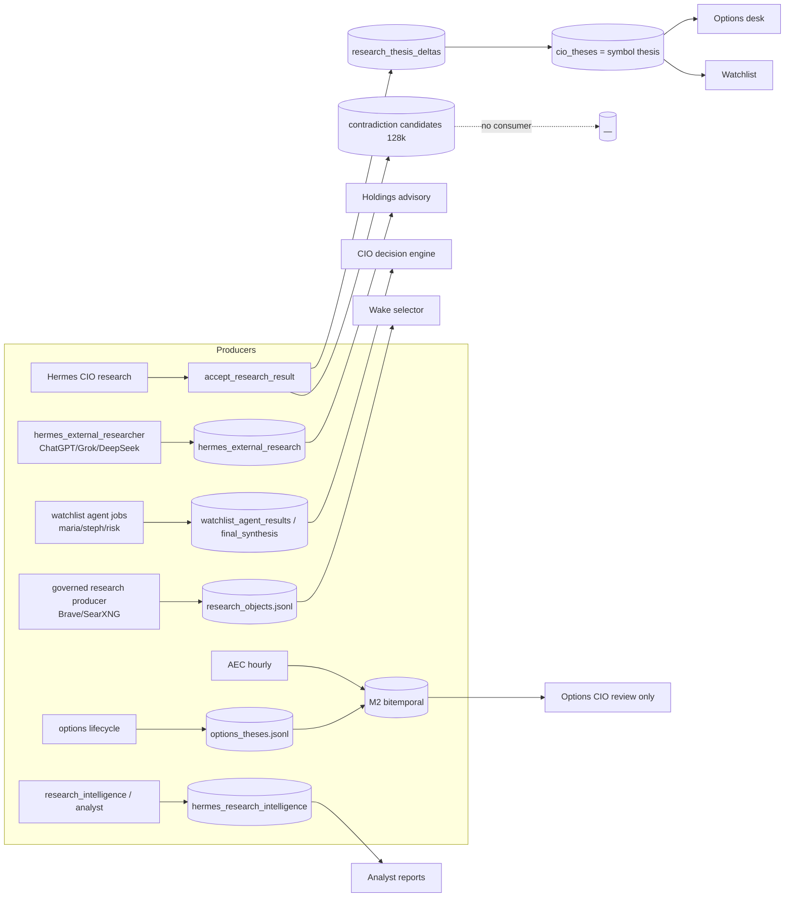
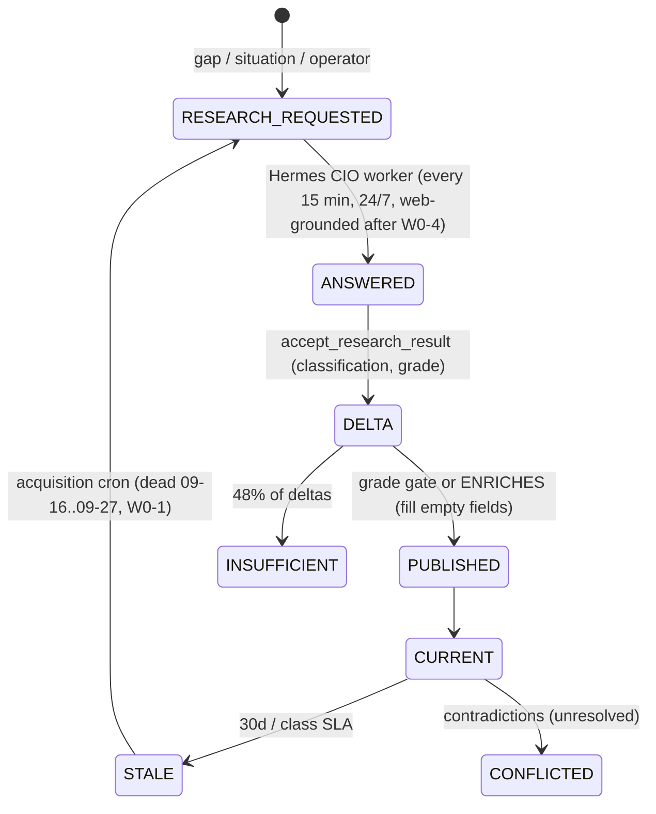
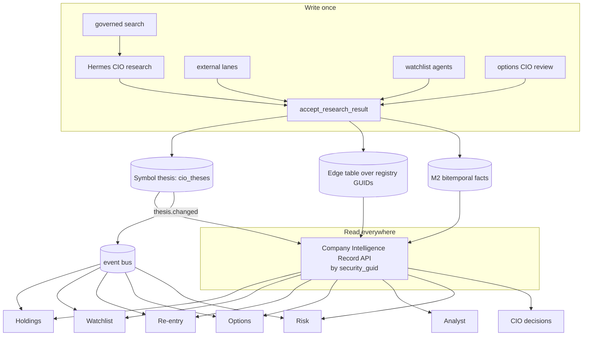

# Platform Intelligence Due Diligence: Memory, Research, Agents, Workers (As-Is / To-Be)

```
Status:      ACTIVE
as_of:       2026-09-27 (America/New_York)
Measured at: served release eb09dcf10 (CURRENT), dev tree 6bb71d258; host ms01-openclaw
Method:      three independent read-only exploration passes, plus targeted measurement:
             - read-only SQL through the app's db_adapter, and the M2 agent DSN with the tenant set
             - py-spy on a COPY of the live CIO stores; no production process was touched
             - file counts; crontab and systemd listings
             Wave 0 fixes were made afterwards as separate PRs (Section 13).
Authority:   READ_ONLY_ADVISORY. MBI_BEHAVIOR = 0 was not touched.
Extended by: cognitive_transformation_20260927/ (2026-09-27, PROPOSED) — memory enforcement, Global Intelligence Record,
             retrieval-first, supervision, governance; its 09_MATURITY_GAP_AND_ROADMAP.md supersedes §12
             waves 1–5 as the active plan once approved; §12 remains the baseline.
Supersedes:  nothing. Read with TRADE_AI_AS_IS_2026-09-14.md, TRADE_AI_FUTURE_STATE_2026-09-14.md,
             CIO_AS_IS_2026-09-20-1445.md, IDENTITY_AND_MEMORY_ADVISORY_2026-08-27.md, AGENT_SERVICE_MAP_2026-09-25.md
Requested:   operator 2026-09-27: principal-architect review of memory, research persistence, agents,
             workers, knowledge graph, cross-silo reuse, 24/7 research, model routing and duplication
```

## 1. Executive summary

**The platform has built far more intelligence than it uses.**
- **Stores:** about 30 memory and research stores exist. Nearly all are append-only and nearly all are written every hour.
- **Research:** 58,041 external research rows, 37,254 Hermes intelligence rows, 50,526 research insights, 5,634 thesis deltas and 572 living symbol theses.
- **Unused:**
  - A research finding made in one workflow reaches, at most, the options desk and the watchlist.
  - The CIO decision engine, holdings advisory, analyst reports, portfolio review and the agent runtime each read their own raw stores, or generate the research again.
  - Memory changed **0 of 22,392** wake decisions: `MEMORY_BEHAVIOR_INFLUENCE=0` everywhere, by design.

**The golden rule is not met today.** Research is recreated, not referenced. The cause is three missing joins, not missing construction:
1. **No single subject key.** One company exists under a ticker slug, a `ticker_guid` (UUIDv5 of the symbol), the registry `security_guid`/`issuer_guid`, and `HELD:<tkr>`. Stores only join through the ticker string.
2. **No single write path.** At least seven subsystems produce thesis, bull/bear or risk content. Only one of them (Hermes CIO research → `accept_research_result`) updates the living symbol thesis.
3. **No single read path.** There is no company-intelligence read API, so each surface built its own query.

**24/7 research was broken in three places this week.** All three are fixed in Wave 0 (§13), pending deploy:
- The CIO wake dispatcher was killed at its 15-minute timeout **73 times on 09-26 (436 in total)**. 1,557 wakes were stuck in `DISPATCHED`, and each cycle spent about 9 minutes failing to release them.
- Symbol-thesis acquisition exited 78 **every day since 09-16**. The operator's "agents clear" archived a flag that the wrapper wrongly required.
- About 4,647 web pages (Brave/SearXNG) never reached a thesis, while Hermes CIO research answered from house data only.

**Maturity, on the house 1–5 scale, per domain:**

| Domain | Score | Why |
|---|---|---|
| Memory (storage) | 3.5 | Bitemporal M2, append-only hash-chained stores, identity registry. Real and durable. |
| Memory (use) | 1.5 | Fenced from decisions (MBI=0). M2 has 1 reader. Lessons: 0 promoted. |
| Cross-silo reuse | 1.5 | Symbol thesis reused by options and watchlist only. 7+ parallel producers. |
| Knowledge graph | 2.0 | GUIDs and edges exist (registry, catalyst graph, ticker graph), but no graph store and no decision-time traversal. |
| Agents | 2.0 | 3 disagreeing registries. 5 of 13 runtime agents are no-ops. File-based handoff. |
| Workers | 2.0 | 467 cron jobs, 90 timers, 13 services. 5 queue and 5 lock styles. 188 unlocked jobs. |
| Continuous research | 2.5 | Monitors run 24/7 (news, catalysts, material change, governed search). Now web-grounded. |
| Model routing / cost | 2.5 | Governed caps and a ledger, about $18/30d paid. But no central chooser, and the bridge cannot use OAuth or off-peak. |

**Top risks:**
1. Decisions are made on research the memory layer already contradicts: 125k contradiction candidates, none of them resolved.
2. Silent failure modes:
   - an exit-code gate that meant the opposite of its intent;
   - a swallowed `ValueError` loop that ran every cycle;
   - a compatibility shim that returns `""` on refusal, used by 22 importers.
3. Plaintext Postgres DSNs are in `~/.config/tradeai/agent-operator.env`, which cron jobs source.

**Top opportunities (all wiring, no new stores):**
1. A **Company Intelligence Record** read API over existing stores, keyed by `security_guid`.
2. Route every research producer through `accept_research_result`.
3. A `thesis.changed` fan-out to holdings, watchlist, re-entry, options and risk.
4. One lane chooser in the consumption gate and the bridge.

## 2. Memory audit

### 2.1 Store inventory (measured 2026-09-27)
Paths: `P/` = `/home/johnclaw/trade-ai-releases/persistent-state/data`. `data/cio` in both the repo and CURRENT is a symlink to `P/cio`.

| # | Store | Holds | Writers → readers | Size / freshness | Versioning | Staleness / conflicts |
|---|---|---|---|---|---|---|
| 1 | **M2 bitemporal Postgres** `memory_r10_m2.memory_fact_version` (+ `provenance_edge`), FORCE RLS, tenant `tradeai:tenant:primary` | Cognitive facts | AEC hourly (`thesis`), options projector every 15 min (`options_*`) → **only** `options_cio_review._prior_decisions` | **234 versions / 130 current**: thesis 123/62, options_thesis 96/53, options_followup 8, options_cio_decision 5, options_thesis_outcome 2. **3 edges.** Since 2026-09-24 | True bitemporal (valid × tx), SUPERSEDES edges | Supersede policy v2; **no staleness mechanism** |
| 2 | **Symbol / desk thesis** `CIOThesisStore` → `P/cio/cio_theses.jsonl` + projection | Stance, summary, evidence, gaps, invalidation, catalysts | `research_thesis_delta` → `symbol_thesis_review` → `symbol_thesis_publish`; acquisition cron → ~50 readers | 1,913 events; **572 current** | Append-only + projection (no hash chain) | Coverage CURRENT/THIN/STALE/CONFLICTED (30d). **Stance vocabulary dirty**: `watch` 326, blank 212, `WATCH` 12 |
| 3 | `research_thesis_deltas.jsonl` | ResearchThesisDelta@v1 | Hermes worker callback | 5,634 rows; **48% INSUFFICIENT_DATA** | Append-only | — |
| 4 | Hermes CIO research requests / results / projection | Structured Q&A per research_id | `hermes_cio_worker` → 17 modules | 8,600 requests, 735 results, 45 MB projection | Append + projection; fingerprint dedupe | Fingerprint TTL reuse |
| 5 | Options thesis `P/cio/options_theses.jsonl` | OptionsThesisRecord by strategy GUID | Options engine / lifecycle → CIO review, M2 projector | 64+ rows | Append-only, **hash-chained** | Pins symbol thesis version |
| 6 | Identity registry `P/runtime/identity_registry.json` | issuer → security → listing → alias (UUIDv5) | `mint_identity_registry` (weekdays 05:50) → 36 modules | 10,773 entities (5,196 CONFIRMED); **events: 0** | Overwrite + supersedes chain | — |
| 7 | Catalyst graph `catalyst_graph_latest.json` | 12,584 SecurityEvent nodes, 21,901 traces | Weekdays 06:10 → **health/integrity checks only** | 68% typed OTHER | Derived overwrite | **Built, no decision consumer** |
| 8 | Ticker research graph `ticker_research_graph.jsonl` | 11,912 artifacts, 120 profiles | Hermes loop, free-first, curation | 12,032 rows | Append + content hash | Keyed on `ticker_guid`, **not** the registry `security_guid` |
| 9 | Intelligence fabric (delta receipts, lifecycle) | change → entity → materiality → gap | free-first timer | 5.9 MB | Append | Materiality gate |
| 10 | Contradictions: `evidence_contradictions.jsonl` / `research_contradiction_candidates.jsonl` | Conflicting evidence pairs | curation / every research accept → dormant-lane consumer (log only) | 92 / **127,954 rows (118 MB)** | Append | **Nothing resolves them.** Re-derived O(n²) on every accept (31 s). Fixed in W0-8. |
| 11 | AIF agent memory `aif_memory.jsonl` | 1,330 memories (research refs, case summaries) | Admission → wake context | **374,079 retrievals (169 MB)** | Append + decay | **memory_changed_decision 0.0** |
| 12 | Lessons (6 stores) | Candidates, KB lessons, DB lesson tables | outcome_to_lesson, advisory KB | 586 candidates: **0 promoted**; KB 3,034 rows / 245 MB | Append | Operator promotion never happened |
| 13 | Instrument beliefs `cio_instrument_records.jsonl` | Calibrated beliefs from outcomes | Belief writer 18:50 | 282 records | Append | Keyed `HELD:<tkr>` (a 4th namespace) |
| 14 | Persistent wake `~/trade-ai-state/persistent_wake/` | Wakes, commitments, outcomes, views | Hourly wake | wakes 1,173, commitments 2,052 | Append | Stale per-release copy under CURRENT |
| 15 | Research objects `research_objects.jsonl` | Brave/SearXNG pages | Governed producer hourly → wake selector | 4,647 rows, **all IDENTIFIED** | Append + content hash | Reused by CIO research after W0-4 |
| 16 | Postgres research tables | `hermes_external_research` 58,041 · `hermes_research_intelligence` 37,254 · `research_insights` 50,526 · `watchlist_agent_results` 2,984 · `watchlist_final_synthesis` 895 · `trade_thesis_reviews` 1,912 (147 symbols) · `catalyst_events` 126,750 · `cio_decisions` 71,847 (64,332 `routine`) | per producer | — | Mostly upsert | No cross-table reconciliation |
| 17 | CIO wake jobs `cio_wake_jobs.jsonl` | Wake lifecycle | Dispatcher / detectors | 72,667 events, 65 MB | **Hash-chained** | 1,557 stuck DISPATCHED (W0-2) |

### 2.2 Persistence matrix

| Survives → | Session | Agent restart | Worker restart | Release flip | Host reboot |
|---|---|---|---|---|---|
| `P/cio/*` JSONL (theses, research, wakes, ledgers) | yes | yes | yes | **yes** (symlinked) | yes |
| M2 Postgres | yes | yes | yes | yes | yes |
| Persistent wake (`~/trade-ai-state`) | yes | yes | yes | yes (outside tree) | yes |
| Per-release `data/persistent_wake`, `data/hermes` | yes | yes | yes | **no** (per-release copies) | yes |
| Agent working context (prompt, scratch) | **no** | **no** | **no** | no | no |
| Desk bot conversation state | partial (Telegram) | **no** without restart | — | only on restart | — |

### 2.3 Current memory architecture



### 2.4 Memory lifecycle (a symbol thesis)



### 2.5 Gaps
- **M2** is written but has 1 reader. Nothing else reads the facts it holds.
- **Staleness** is only computed for symbol theses (30d SLA). Every other store has none.
- **Conflicts** are detected (128k candidates) but never adjudicated, and no surface shows them.
- **Identity:** 4 key namespaces. The catalyst and ticker graphs don't share the registry key.

## 3. Cross-silo intelligence (the V / Visa test)

V is `security_guid d1871bc6…`, `issuer_guid 8dfc96ee…`, CUSIP 92826C839, CONFIRMED.

| Store | V rows | Key |
|---|---|---|
| cio_theses | 24 events (`symbol_v` v1→v24) | ticker slug |
| research_thesis_deltas | 47 | symbol |
| ticker_research_graph | 697 | symbol / ticker_guid |
| options_theses | 1 (pins `symbol_v@v24`) | issuer_guid |
| aif_memory | 31 | security_guid |
| catalyst_graph | 247 | security_guid |
| instrument beliefs | `HELD:V` | holding key |

| Surface | Reads the living symbol thesis? | What it actually uses |
|---|---|---|
| Options desk | **Yes** | `options_thesis.py` pins it |
| Watchlist | **Yes** (fail-soft) | `watch_intelligence.symbol_thesis_attach`, plus its own `watchlist_final_synthesis` |
| Holdings advisory | **No** | Raw `hermes_external_research` (`advisory_desk.py:1402`) |
| CIO decision engine | **No** | `watchlist_final_synthesis` (`cio_decision_engine.py`) |
| Analyst / research intel | **No** | Own bull/bear from Hermes text |
| Portfolio review | **No** | `cio_decisions`, `decision_outcomes`; `portfolio_ai_analyst` does its own analysis |
| Risk / agent runtime | **No** | 0 references to thesis, AIF or M2 |
| Re-entry | Via refs only | `agent_decision_payload` carries the thesis version |

**Verdict: research exists 7 times, not once.** It is produced separately by:
1. the symbol thesis chain;
2. `hermes_external_research`;
3. `watchlist_final_synthesis` (CIO dual consensus);
4. `watchlist_agent_results`;
5. `hermes_research_intelligence` plus the narrative bull/bear;
6. `portfolio_ai_analyst`;
7. the AEC → M2 `thesis` fact.

Catalysts are tracked in four places.

## 4. Agent audit

There are three registries that disagree:
- `config/agents.{yaml,json}`;
- `scripts/agent_runtime/agents/definitions.py` (Wave-3, about 15 agents);
- the OpenClaw personas in `~/.openclaw/agents/*` (14).

The mesh in `config/aec_agent_mesh.json` uses yet other IDs (`cio_agent` vs `alex`). IDs drift: `maria`/`maria_research`, `aegis`/`aegis_core`, `tax_agent`/`ledger`.

| Agent | Purpose | Memory read → write | Survives a stop | Resume / handoff |
|---|---|---|---|---|
| Alex (CIO) | Advisory synthesis, operator conversation | 13–17 data domains, Hermes, wakes → action ledger, wake jobs, handoff queue, `cio_decisions` | JSONL in `P/cio`, lab PG | Idempotent wake IDs, defer-revisit; Hermes challenge queue |
| CIO wake / persistent wake | Hourly and 5-min subject wakes | Subject memory → wakes, commitments, views | `~/trade-ai-state` | uuid5 wake ID. **Dispatcher hang fixed in W0-2.** |
| Hermes CIO research worker | Claims research, runs backend | Queue → results → thesis delta | JSONL store | Retryable errors; no lease TTL |
| Hermes external lanes | Discovery / escalation | → `hermes_external_research` | DB | Per-lane timeout. **Breaker fixed in W0-3.** |
| Maria / Steph / risk_agent / tax_agent / Morgan | Research, allocation, risk, tax, wealth | `watchlist_agent_jobs` | DB rows | Watchlist reaper (20 min). **Maria, risk, vega, aegis, tax are DESIGNED no-ops** in Wave-3. |
| Aegis | Surveillance, options ensemble | → briefs, ensemble jobs | DB | None of its own. 81% of ensemble jobs `expired` (3,779 / 4,665). |
| Iris, Darwin, Sentinel, Argus, Vigil | Taxonomy, scoring, review, staleness | Lab PG | Lab PG | Leases. Vigil has no timer. |
| Advisory desk | Per-row opinion, outcome scorer | → KB, shadow receipts | DB / JSONL | Deterministic scorer |
| Health agents (4 overlapping) | Scoring, remediation | → health JSON | JSON | process_reaper */3 |

**When an agent stops:**
- **Remembered:** everything written to JSONL or DB.
- **Forgotten:** its working context.
- **Resume:** only the CIO wake and the Wave-3 runtime can resume by design (idempotent IDs, leases).
- **Inherit:** other agents inherit work only through files: the handoff queue, the event bus (15 types), and the AEC topic bus.

## 5. Worker audit

**Inventory:**
- 1,059 crontab lines, of which 467 are active jobs. 451 run the dev tree, and 188 have no lock.
- 90 user timers, 113 services, 13 resident services.
- The lane registry declares 147 lanes; 517 more are recorded as accepted debt in its undeclared baseline.

| Domain | Assignment | Lock | Idempotency | Heartbeat | Recovery |
|---|---|---|---|---|---|
| Holdings | Inserts into `watchlist_agent_jobs`; batch scans | safe_flock / flock | Skip-if-pending | No | Watchlist reaper |
| Watchlist | PG `watchlist_agent_jobs` (queued → processing) | fcntl + shell | Retry tags | No | 20-min time reaper |
| Re-entry | Batch scan, no queue | **None** | None | No | None; **cron + timer both run it** |
| Options | PG `inference_ensemble_jobs` (SKIP LOCKED) | `/usr/bin/flock` + timeout | Atomic claim | **Yes** | **81% expire unprocessed** |
| Research | Hermes store `claim_next`; lane YAML | Mixed | Fingerprint | 3 Hermes heartbeats | Backlog drain |
| CIO wake | JSONL wake jobs | `flock -E 99 -o` + 15-min timeout | uuid5 | cycle JSON | Lease recovery (**was broken**, W0-2) |

**The common framework is missing.** Five claim mechanisms: PG row status, PG SKIP LOCKED, JSONL `claim_next`, fcntl JSONL queues, and Wave-3 leases. Five lock styles.

**Proposed worker contract (every worker):**
1. **One claim primitive:** a lease with owner, boot-id and TTL.
2. **One lock helper:** `safe_flock.sh`.
3. **A heartbeat file:** `data/runtime/heartbeats/<lane>.json`.
4. **A lane-registry row:** with output signal and cadence.
5. **A reaper:** a lease-expiry sweep that moves work to `RETRY_PENDING`, then `EXPIRED`, with a reason.
6. **Standard status vocabulary:** `queued`, `claimed`, `running`, `done`, `failed`, `expired`.
7. **An idempotency key per unit of work.**

**Double-scheduled jobs** (cron + systemd): `recovery_watch_daily` (07:30), `aegis_surveillance` (08:00), and `iris_taxonomy_agent`. The iris timer runs a *full* taxonomy pass daily at 07:00, while its cron runs `--gaps`.

## 6. Research persistence: company-level memory (V today)

| Required | V today | Where |
|---|---|---|
| Bull thesis | Yes: summary + evidence_for (v24) | cio_theses |
| Bear thesis | Partial: counter_evidence; bear-case answers since 09-26 | cio_theses (bear case → counter-evidence) |
| Earnings history | Events yes (catalyst graph); no per-quarter result record | catalyst_events / graph |
| Competitive advantages | Only as free text in the summary | — |
| Risks | invalidation_conditions (filled only since the 09-26 ENRICHES rule) | cio_theses |
| Catalysts | `catalysts` field (since 09-26), plus 4 other catalyst stores | cio_theses + graph |
| Analyst opinions | Not stored per company; scattered in research text | — |
| Internal findings | 47 deltas, 697 ticker-graph artifacts, 31 AIF memories | several |
| Position history | Broker / holdings tables | holdings |
| Prior decisions | `cio_decisions` (mostly `routine` rule-engine rows); options decisions in M2 | DB / M2 |

**Verdict:** the parts exist, spread across 7 stores and 4 keys. A future agent evaluating V inherits only what its own surface happens to query.

## 7. Knowledge graph

**Entity types present:**
- issuer, security, listing, ticker alias;
- SecurityEvent (12 bound types);
- option contract, strategy and position GUIDs;
- sector, industry, theme, catalyst GUIDs (on ticker-graph rows);
- memory identity; communication and narrative subjects.

**Relations present:**
- ticker graph LINEAR 9,673 / LATERAL 2,239;
- CatalystTrace;
- registry supersedes;
- M2 SUPERSEDES (3 edges);
- thesis evidence ids;
- `rec_rotation_links`.

**Not modelled:** analysts, trades and positions as nodes, competitors, regulators.

**Storage:** there is no graph store. Edges live in GUID arrays in JSONL plus two relational tables.

**Traversal:** the fabric and graph-impact modules. The catalyst graph is traversed only by health checks.

**To-be design: one Postgres edge table over registry GUIDs; no new graph database.**

```mermaid
erDiagram
  ENTITY ||--o{ EDGE : from
  ENTITY ||--o{ EDGE : to
  ENTITY {
    uuid guid "registry security/issuer/event/thesis/analyst guid"
    text kind "ISSUER|SECURITY|EVENT|THESIS|ANALYST|THEME|INDUSTRY|POSITION|DECISION"
  }
  EDGE {
    uuid from_guid
    uuid to_guid
    text relation "COMPETES_WITH|HAS_RISK|HAS_BULL|HAS_BEAR|HOLDS|AUTHORED|AFFECTED_BY|SUPERSEDES"
    tstzrange valid_period
    text source_ref "research_id / event_hash"
  }
```

Build it by projecting from the existing stores:
- the registry (entities);
- the catalyst graph (AFFECTED_BY);
- cio_theses (HAS_BULL / HAS_BEAR / HAS_RISK);
- the ticker graph (LATERAL → COMPETES_WITH candidates);
- holdings (HOLDS);
- M2 (SUPERSEDES).

This is the same pattern as the options M2 projector.

## 8. 24/7 research framework

**Monitors running now:**

| Area | Monitor | Cadence / volume |
|---|---|---|
| News | Benzinga / Yahoo / Google RSS | 11,967 articles in 7 days |
| Catalysts | news → catalyst | 1,703 in 7 days |
| Earnings | enrich | daily |
| SEC | **Form 4 only** | 13F = 0, XBRL = 0, **no 8-K or 10-Q** |
| Market data | finviz proactive | 4×/day |
| Material change | 3 overlapping detectors | — |
| Governed search | Brave → SearXNG | hourly |
| Hermes CIO research | every 15 min, 24/7 | off-peak deferral off since 09-26 |
| Hermes external | lanes | — |

**Chain breaks found:**
1. Brave/SearXNG pages never reached a thesis. **Fixed in W0-4.**
2. Thesis acquisition dead since 09-16. **Fixed in W0-1.**
3. Wake dispatcher hung. **Fixed in W0-2.**
4. No 8-K, 10-Q, regulatory or macro feed.
5. When a thesis weakens, only the CIO product and re-entry book refresh. Holdings, risk and watchlist reviews do not.

**Target flow:**

```mermaid
flowchart LR
  MON[Monitors: news, SEC 8-K/10-Q, earnings, catalysts, macro, governed search] --> MAT[material-change detector (one)]
  MAT --> REQ[research request (subject = security_guid)]
  REQ --> HW[Hermes CIO worker: web context + house memory]
  HW --> ESC{weak?} -->|yes| EXT[ChatGPT, then Grok, then DeepSeek]
  HW --> ARR[accept_research_result]
  EXT --> ARR
  ARR --> CIR[(Company Intelligence Record: thesis, bull, bear, risks, catalysts, decisions)]
  CIR -->|thesis.changed| FAN[holdings review, watchlist, re-entry, options, risk, alerts]
```

## 9. Model routing and cost

**Measured, last 30 days:**

| Lane | Calls | Paid cost | Failures |
|---|---|---|---|
| Bridge Flash (`fast`) | 42,191 | $14.19 | 541 |
| `deepseek-flash` | 2,179 | $4.02 | 186 |
| `pro` | 63 | $0.03 | — |
| Grok | 23,623 | free | 805 |
| ChatGPT | 2,288 | free | 460 |

Top paid processes: `advisory_desk_opinion` $7.24, `hermes_external_research` $3.18, `hermes_cloud_json` $1.59, Maria narrative $1.37, `cio_plan_enrichment` $1.37. Claude had 0 calls.

**As-is:** there is no central chooser. Each caller hard-codes its lane.
- 35 of 69 processes are DeepSeek-only.
- The :8766 bridge, which carries the paid CIO and advisory traffic, is DeepSeek-only and never deferred to off-peak.
- The ensembles always call DeepSeek in addition to the free lanes.
- `llm_router.DAILY_BUDGET_LIMIT` (1.50) disagrees with the global cap (2.00).
- The `local_llm` shim (22 importers) calls under unregistered `local_llm_compat`, is refused, and returns `""` silently.
- `oauth_lane_keepalive` is about 12% of free-lane calls.

**Target hierarchy.** It is implemented once, in `llm_consumption.gate_and_generate` and the bridge.

| Priority | Lane | When |
|---|---|---|
| 1 | OAuth (ChatGPT, Grok) | When the lane breaker is closed |
| 2 | DeepSeek Flash | Off-peak or deferred when not urgent. Peak only for operator or urgent work. |
| 3 | DeepSeek Pro / premium | Only by process policy, with a cap |
| 4 | Emergency (Claude) | Registered process, operator-armed |

| Workflow | Current | Recommended | Cost impact | Quality impact |
|---|---|---|---|---|
| Advisory desk opinion (per row) | Bridge Flash | OAuth first, Flash fallback | −$7/mo | Neutral: ensemble-checked |
| CIO synthesis / escalation | Bridge Pro | Keep Pro, add off-peak deferral for non-urgent | Small | Neutral |
| Hermes CIO research | Bridge Flash + web (W0-4) | Keep, with web | ≈ 0 (SearXNG free) | **Higher**: cited sources |
| Hermes external | chatgpt / grok / deepseek | Breaker (W0-3), then ladder | Fewer wasted calls | Neutral |
| Watchlist agent narratives ×3 | Flash each | One shared evidence pack, one synthesis | −$1.5/wk | Consistent |
| Options ensemble | grok + chatgpt + deepseek every job | OAuth pair first, DeepSeek only on disagreement | −$0.5/wk | Neutral |

## 10. Duplication analysis

| # | Duplication | Root cause | Impact | Fix |
|---|---|---|---|---|
| 1 | 7 producers of thesis-like research; 61 symbols in ≥4 stores in 7 days (BAX 346 rows, V 167) | Each producer added its own store | Conflicting answers per surface; wasted calls | Write through `accept_research_result`; read through the CIR (Wave 1–2) |
| 2 | ChatGPT retry storm: 3,021 of 3,374 rows `CODEX_HEADLESS_UNAVAILABLE` | Breaker ignored `unavailable`; failures excluded from dedupe | Junk rows, wasted time | **W0-3 merged** |
| 3 | Same question to 2–3 lanes, no reconciliation | Ensemble without a judge | ~2× free load | Reconcile or single-lane with escalation |
| 4 | Proposal reviewed by 3 agents × 2 request types | Per-agent fan-out | ~$1.5/wk; inconsistent | Shared evidence pack |
| 5 | 7+ thesis stores (CIO, options, change cards, trade reviews, watchlist cards, mint dry-runs) | Each subsystem owns a thesis | Differing "view on X" | One thesis per `security_guid`, with scoped views |
| 6 | 6 lesson stores, 0 promoted | Separate learning efforts | Lessons don't compound | One lesson store with an operator promotion queue |
| 7 | Material-change detection ×3 | Separate campaigns | Overlapping triggers | Keep one (the DB detector); retire the others |
| 8 | 8+ spend ledgers; two different caps | Each fix added a guard | Harder reconciliation | `llm_consumption_log` is canonical; others become views |
| 9 | Governed producer re-fetches the same pages (AUUD 180 pages in 72 h) | No per-URL dedupe window | Noise | Per-URL/day dedupe; reuse via W0-4 |
| 10 | Double-scheduled jobs (recovery watch, aegis surveillance, iris) | Cron and systemd both installed | 2× runs | **W0-7**, cron grant pending |
| 11 | Contradiction re-derivation O(n²) per accept | Full recompute | 31 s per accept | **W0-8** |

## 11. Future-state architecture

**Principles:**
- one subject key: registry `security_guid`, with `issuer_guid` for company-level;
- research written once, through one path;
- read everywhere, through one API;
- memory informs decisions only through a measured, operator-armed switch (MBI stays 0 until armed);
- every worker follows the worker contract;
- one lane chooser.



**Company Intelligence Record (CIR), composed not stored.** `get_company_intelligence(security_guid)` returns:
- the current thesis (stance, summary, bull, bear);
- risks and invalidation;
- dated catalysts (catalyst graph);
- earnings history;
- prior decisions and their outcomes;
- open contradictions;
- analyst opinions;
- position state;
- freshness per field.

Every surface reads it, and surfaces stop querying the raw research tables.

## 12. Gap analysis and roadmap

| Domain | Current | Desired | Gap | Priority | Effort |
|---|---|---|---|---|---|
| Identity | 4 key namespaces | `security_guid` everywhere | Re-key the ticker graph and beliefs; add `security_guid` to every row | P1 | M |
| Read path | Each surface queries raw stores | CIR API | Build the CIR; migrate 6 surfaces | P1 | L |
| Write path | 1 of 7 producers updates the thesis | All producers through `accept_research_result` | Adapters for watchlist agents, external lanes, analyst | P1 | M |
| Fan-out | Thesis change → CIO product only | `thesis.changed` → all surfaces | Event consumers | P1 | M |
| Contradictions | 128k unresolved | Surfaced and adjudicated | Assessor + card | P2 | M |
| Knowledge graph | GUID arrays in JSONL | Edge table | Projector | P2 | M |
| Filings | Form 4 only | 8-K, 10-Q, macro | New ingest | P2 | M |
| Routing | Per-caller lanes | One chooser; bridge gets OAuth and off-peak | Router in gate and bridge | P1 | M |
| Workers | 5 frameworks | Worker contract | Shared lease, heartbeat, reaper; migrate | P2 | L |
| Agents | 3 registries | One registry | Consolidate; retire 5 no-op timers | P2 | S |
| Lessons | 0 promoted | Operator promotion queue | Queue + card | P3 | S |
| Memory influence | MBI=0 | Measured and armed | Shadow measure → operator decision | P3 | S (decision) |

**Waves:**
- **Wave 0 (done, §13):** broken links fixed.
- **Wave 1:** subject key and CIR read API, with the stance-vocabulary audit.
- **Wave 2:** single write path (adapters), `thesis.changed` fan-out, and 8-K / macro feeds.
- **Wave 3:** lane chooser in the gate and bridge.
- **Wave 4:** worker contract migration, agent registry consolidation.
- **Wave 5:** contradiction adjudication, lesson promotion, operator decision on memory influence.

## 13. Wave 0: immediate fixes made (2026-09-27)

| # | Fix | PR | State | Measured effect |
|---|---|---|---|---|
| W0-2 | Wake dispatcher hang: stale `DISPATCHED` wakes dead-lettered (they can't be released); no per-wake rescan; head hash read from the file tail | #1280 | **merged** cb6e76c12 | On a copy: the one-time cleanup of 1,558 wakes went from 547 s to 0.9 s; steady state 0.7 s (it was ~9 min per 5-min cycle) |
| W0-1 | Symbol-thesis acquisition runs after an operator clear. A missing flag with no tripwire still fails closed. | #1282 | **merged** 820d55d75 | Live dry run: `containment_state=cleared`, exit 0 |
| W0-3 | Lane breaker trips on `unavailable` (Codex headless), not only 401/403 | #1283 | **merged** 65e039be9 | Replay since 09-26: 21 of 82 wasted ChatGPT calls skipped |
| W0-4 | Every Hermes CIO research request is web-grounded; governed-producer pages reused first | #1284 | **merged** 9b76b4c6b | Real S3 re-entry request (IBIO) gets 2 sources; AUUD reuses 4 producer pages |
| W0-8 | Contradiction candidates derived incrementally | #1285 | **merged** 48e05a6fe | 31 s → 0.02 s per accept, ids identical (171/171) |
| W0-7 | Retire duplicate crons (recovery watch, aegis surveillance) and the dead flash-market cron | host | diff prepared; cron grant pending | — |

**Moved out of Wave 0, with reasons:**
- **W0-5, ensemble reaper:** no rows are stuck in `running`. The real finding is that 81% of ensemble jobs expire unprocessed (Wave 4).
- **W0-6, `local_llm_compat`:** registering it switches paid calls back on for 22 importers. That's an operator spend decision.
- **W0-9, stance vocabulary:** 114 readers with mixed case conventions. Normalizing needs a consumer audit first (Wave 1).

**Operator-only, reported and not changed:**
- rotate the plaintext DSNs in `~/.config/tradeai/agent-operator.env`;
- the MBI flip;
- retire the 5 no-op Wave-3 timers;
- disable `tradeai-iris-taxonomy.timer` (it duplicates the cron with different arguments);
- `local_llm_compat`: revive or retire.

## Appendix A: how measured
- **Postgres:** read-only SELECTs through `db_adapter` (app role). M2 through `M2_AGENT_DSN` in a read-only session with `app.tenant_id='tradeai:tenant:primary'`. The app role sees 0 rows because of FORCE RLS.
- **Wake dispatcher:**
  - log `persistent-state/logs/cio_wake_dispatcher.log` (464 timeout lines);
  - `py-spy record -d 180` of `poll_and_dispatch` on a copy of `P/cio` (1.3 GB, excluding research_call_accounting) in an isolated worktree with no `.env` and a bogus DB host;
  - 3,599 samples: 95.4% in `recover_expired_leases → release → get_wake_job → list_events`.
- **Status census:** `CIOWakeJobStore.list_wakes()` gave COMPLETED 11,389, EXPIRED 2,959, **DISPATCHED 1,557**, CANCELLED 178, IN_FLIGHT 20, PENDING 17.
- **Acquisition:** `logs/symbol_thesis_acquisition.log` (exit=78 daily), plus `~/.local/state/tradeai/archive/AGENT_JOBS_P0_CONTAINED.TRIPWIRE.md` (archived 2026-09-15).
- **Contradictions:** timed `find_contradiction_candidates` on 5,634 deltas: 30.9 s.
- **Crontab and systemd:** `crontab -l` (1,059 lines, 467 active), `systemctl --user list-timers --all` (90).
- **Research-store overlap:** row counts per table and 7-day distinct symbols (see §2.1, §10).
