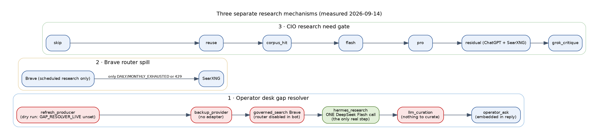
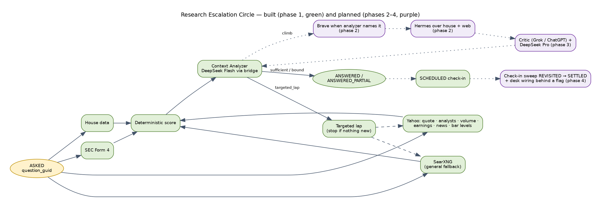

# Research escalation — who researches what, and when one step hands off to the next

**Status:** measured on 2026-09-14, on main `32897e80a`, by reading the code, the flags each process actually has, the live receipts and the Brave budget ledger, and by a dry run of the resolver. It describes what IS wired, not what was designed.

**Updated:** 2026-09-14 23:44 EDT — section 6 records what shipped after the measurement (PRs #1012, #1014, #1019, #1020, #1021; live `341bce2c1`). Sections 1–5 remain the midday measurement.

**Operator question that prompted this (2026-09-14):**
> "When does the agent say Brave's answers weren't enough, so we put it out to the LLM, or vice versa? Web searches are not enough, so we go to Brave? Hermes did not get enough, so we go to Brave?"



## The short answer

- **There is no quality-based escalation anywhere.**
  - No step judges another step's answer as "not enough" and hands off.
  - Hermes never escalates to Brave, and Brave never escalates to an AI model.
- **What exists is three separate mechanisms.** Each has its own trigger and its own stop rule:
  1. **The operator desk gap resolver.** It walks a fixed per-domain list and stops at the first step that returns the outcome code `answered`.
  2. **The Brave router spill.** It moves a web search from Brave to SearXNG only when Brave's quota is exhausted or rate-limited, never because Brave's results were thin.
  3. **The CIO research need gate.** It climbs `skip → reuse → corpus_hit → flash → pro → residual → grok_critique` for scheduled research. This is a separate path from the operator desk.
- **For an operator question on 2026-09-14, the only step that did real work was Hermes.**
  - Hermes is ONE DeepSeek Flash call over the house evidence packet. It does no web search.
  - Brave is live, but only for scheduled research lanes. The CIO bot process does not have the switch on.

## 1. Operator desk questions — `gap_resolver.resolve()`

**When it runs.** The desk (`cio_operator_desk_loop.handle_operator_desk_question`) finds blocking gaps in the house evidence:
- a research ask with no promoted research on the subject;
- a re-entry ask with no desk row.

For each gap it walks that domain's `on_gap` list from `config/data_source_authority.json`.

**Stop rules** (`scripts/lib/gap_resolver.py::resolve`):

| Outcome a step returns | What the resolver does next |
|---|---|
| `answered` | **stops**; the desk answers from it |
| `partial` (search hits, curated text) | keeps walking; the evidence is carried forward to later steps |
| `queued` (Hermes, operator ask) | remembers the ETA, keeps walking the cheaper remaining steps; `operator_ask` is always last |
| `no_answer`, `error`, `retired_skipped` | keeps walking |
| `budget_denied` | that step's daily attempts are spent (counted from the receipts ledger); keeps walking |

**Limits on the walk:**
- A `paid` step needs `GAP_RESOLVER_PAID_AUTHORIZED`. Without it the free-first rail denies the step.
- Every attempt writes one row to `data/cio/gap_resolution_receipts.jsonl`.

**"Not enough" in this path means only the outcome code.**
- No step scores whether Brave's hits or Hermes' answer were sufficient.
- `llm_curation` only rewrites evidence already gathered: "never invents".

### The chains (registry, 2026-09-14)

| Domain | Steps, in order |
|---|---|
| research_thesis | refresh_producer → backup_provider → governed_search (Brave) → hermes_research → llm_curation → operator_ask |
| analyst_opinion | refresh_producer → backup_provider (yfinance on demand) → governed_search → llm_curation → operator_ask |
| catalyst_news | refresh_producer → backup_provider → governed_search → llm_curation → operator_ask |
| symbol_identity | refresh_producer → backup_provider → governed_search → … → operator_ask |
| earnings_date | refresh_producer → governed_search → llm_curation → operator_ask |
| web_search | governed_search → operator_ask |
| quote_price, technicals, holdings, sector, regime | refresh_producer → backup_provider → operator_ask (nothing to search for) |

### What each step actually does today

| Step | Switch it needs | State in the CIO bot process | Real effect today |
|---|---|---|---|
| refresh_producer | `GAP_RESOLVER_LIVE=1` | unset | **dry run** — "would run <writer>" |
| backup_provider | `GAP_RESOLVER_LIVE=1` + an adapter | unset; research/news have no adapter | **nothing** — "no_adapter" |
| governed_search (Brave → SearXNG spill) | `BRAVE_ROUTER_ENABLED` (+ `BRAVE_ROUTER_LIVE`) | unset | **skipped** — "router_disabled" |
| hermes_research | none (enqueues regardless of `GAP_RESOLVER_LIVE`) | — | **real**: one Hermes request → one DeepSeek Flash call over house evidence; ~4 min to result |
| llm_curation | `GAP_RESOLVER_LIVE=1` + evidence to curate | unset; nothing gathered | **nothing** |
| operator_ask | live + a send function | not live; desk passes none | **no message**; the question is embedded in the desk reply; 1 per day |

**After Hermes lands.** Since PR #1006, `try_fulfill_pending_replies` joins the Hermes result to the operator's pending question by id and sends a follow-up. First delivery: HPE, 2026-09-14 10:36 ET. Nothing in this path escalates from Hermes to anything else. The Hermes critic verdict (VALID / INVALID) does not trigger a further step.

### Due-diligence test, 2026-09-14

**Real receipts: the operator's HPE question at 09:12 ET.** research_thesis, in order:
- refresh `dry_run` · backup `no_adapter` · Brave `router_disabled` · hermes `queued` · curation `no_evidence_to_curate` · operator_ask `queued (embedded)`.
- Hermes completed at 09:16. The answer reached the operator automatically at 10:36, once #1006 was deployed.

**Dry run** (`scripts` on main, all switches unset, Hermes enqueue faked, temp receipts):

| Gap | Outcome | Where it stopped |
|---|---|---|
| research_thesis HPE | queued | hermes_research (ETA 1800 s) |
| analyst_opinion SPCX | no_coverage | all steps no_answer; operator_ask budget_denied (1/1 today) |
| catalyst_news ELMT | no_coverage | backup "yahoo/brave/searxng: no_adapter"; Brave router_disabled |
| web_search | no_coverage | Brave router_disabled |

**Tests:** `test_gap_resolver_20260913`, `test_gap_resolution_monitor_20260913`, `test_brave_router*`, `test_searxng_engine_pool`: 88 passed, 2 xfailed. The walk logic is correct as coded; what limits it is which switches are on.

> **Evidence hygiene note.** The first attempt at this dry run passed the receipts path under the wrong keyword and appended 6 labelled rows to the live ledger (`gap_id=dd-research_thesis`, 2026-09-14T16:12:48Z). They count once against today's per-step budgets. They are left in place because the ledger is append-only.

## 2. Brave, and when a web search moves to SearXNG — `scripts/lib/brave_router.py`

**Who calls Brave.** From the budget ledger `data/runtime/search_budget.json`:
- **September:** `governed_research_producer` 113 calls, `web_research` 75.
- **August:** also `aegis_social_sentiment` and `aegis_transcript_discovery`.
- **Schedule:** the governed research producer runs hourly at :45 with `BRAVE_ROUTER_LIVE` set on its crontab line.
- **The operator desk never calls Brave.**

**Limits.** Operator-owned local cost policy, not a Brave plan ceiling:
- 120 calls a day and 1,500 a month;
- per-caller daily caps: default 25, catalyst_intelligence 10, portfolio_news 10, topic_ingestion 5, web_news_fetcher 5.
- **2026-09-14:** 25 used, 30 refused with `CALLER_DAILY_CAP`.

**When Brave hands off to SearXNG.**
- Only when the refusal reason is `DAILY_EXHAUSTED`, `MONTHLY_EXHAUSTED` or `HTTP_429`.
- `CALLER_DAILY_CAP` is deliberately **not** a spill reason (operator decision, 2026-09-13): a caller over its own cap gets nothing.
- Zero or poor results are **not** a spill reason either.
- Tavily is declared in the registry but has no client, so it is never called.

## 3. Scheduled CIO research — the research need gate

`ResearchNeedDecision@v2` climbs `skip → reuse → corpus_hit → flash → pro → residual → grok_critique`:
- `residual` is the ChatGPT/OpenAI rung, run by `scripts/lib/cio_residual_web.py`, which also reads SearXNG directly.
- Each rung runs only when the gate routes a subject to it. The gate decides from coverage and freshness of the corpus, not from a score of the previous rung's answer.
- This path serves plans and wakes, not the operator desk.

The model lanes follow the separate LLM escalation policy (`AGENTS.md`, "LLM lane escalation"):
1. free OAuth: Grok, then ChatGPT;
2. DeepSeek Flash, the one paid lane allowed automatically;
3. notify and stop;
4. any further paid lane only on an explicit operator re-run.

## 4. What the operator expected vs what exists

| Expectation | Today |
|---|---|
| "If Hermes did not get enough, go to Brave" | Not wired. Hermes' result is delivered as-is; its "Still unknown" and "Limits" lines say what it could not find. |
| "If Brave's answers weren't enough, go to the LLM" | Not wired as a quality test. For the desk, Brave is off; `llm_curation` would only summarise Brave hits (partial) if both were on. |
| "If web searches are not enough, go to Brave" | Reversed. Brave is the first web step; SearXNG is only the quota/rate-limit spill. |
| Research on "push for more" | "Do more research on X" is classified `research` and triggers the chain above. There is no separate "dig deeper" intent. |

## 5. Operator directive and the target design — the Research Escalation Circle (approved, not yet built)

Operator, 2026-09-14: *"We need to utilize everything — SearXNG, Brave, Hermes, DeepSeek, everything — and it
should be an escalation ladder or escalation circle with some intelligence around it. Also Yahoo Finance and all
the other channels."* This is the build target. Nothing below is live until its phase ships and is verified.

**The circle — one question, laps until the answer is sufficient or the bounds are reached:**

```
            ┌─────────────────────────────────────────────────────────────────────────┐
  question  │ LAP n                                                                   │
  (subject  │ 1. HOUSE      Trade-AI stores (dossier, desk, research, thesis, memory)    │
   GUID,    │ 2. PROVIDERS  free, in parallel: Yahoo Finance (yfinance), Finviz, SEC     │
   needs)   │               EDGAR, FRED, Alpaca/Schwab market data, catalyst & news      │
            │ 3. WEB-FREE   SearXNG (self-hosted)                                        │
            │ 4. WEB-PAID   Brave — only if SearXNG evidence is insufficient             │
            │ 5. SYNTHESIS  Hermes: DeepSeek Flash over house + provider + web evidence  │
            │ 6. CRITIC     free lane (Grok, then ChatGPT OAuth): sufficient? contradicted?│
            │               names the missing facts                                     │
            │ 7. JUDGMENT   DeepSeek Pro — only when the critic finds contradiction or   │
            │               a material open question on a held/decision-relevant name    │
            └───────────────┬─────────────────────────────────────────────────────────┘
                            │ sufficiency test fails AND critic named specific missing facts
                            └──► LAP n+1: targeted queries for exactly those facts (steps 2–6)
  stop: sufficient · lap limit (2) · budget · time limit → answer with what is known, say what is not,
        ask the operator only for what no channel can supply
```

**The intelligence — "enough" becomes a measured decision, not an outcome code:**

| Evidence | Sufficient when |
|---|---|
| Price / levels / volume | a fresh value (inside the domain's stale window) from the store or a provider, cross-checked against a second source within tolerance |
| Analysts / earnings / fundamentals | a dated value from Yahoo or the house store; stale values are labelled and trigger a provider refresh |
| News / catalysts | ≥ 2 independent sources dated inside the window, relevant to the subject GUID (not just the ticker string) |
| Research question | every operator sub-question has an answer citing evidence ids; critic verdict VALID; no unresolved contradiction |

- Each step records **what it added** (new facts, new sources, contradictions); a step that adds nothing is not repeated.
- Cost order is fixed: free before metered before paid; Brave and DeepSeek Pro are entered only when the free
  evidence fails the test, and every entry is receipted with the reason.
- Bounds per question: 2 laps, Brave ≤ 3 queries, DeepSeek Pro ≤ 1 call, wall clock ≤ the ETA the operator is told;
  global caps stay the registry's (`providers.brave.budget`, LLM daily spend cap).
- Every line of the answer carries its pill: 🟢 Trade-AI data · 🔵 Looked up outside Trade-AI (named source) ·
  🟣 AI model (which model, which role).
- The answer joins back to the pending question by id (PR #1006) with an ETA stated up front; progress messages only
  when a lap completes, never per step.

**Operator requirements added 2026-09-14 (second message) — the circle is a full-lifecycle product:**

> *"We need something that's analyzing the context coming back from that circle — DeepSeek or whatever —
> something that's scoring on maturity, so it decides whether to go to the next item in the circle or whether it
> suffices. It can't be dumb, just look at everything. It should automatically queue check-ins — a week, two weeks.
> We're tracking everything via the GUIDs. Make sure this is a full life cycle product."*

1. **The Context Analyzer (the brain of every lap).** After each lap an analyzer reads *everything the lap brought
   back* against the question and returns a structured verdict — not a keyword test:
   - `sufficiency_score` 0–100 per operator sub-question and overall, against a written rubric (coverage of every
     sub-question, freshness vs the domain's stale window, source independence and count, agreement between sources,
     citation of evidence ids, and the maturity of the house view — thesis state, research age, specialist reviews);
   - `maturity_level` for the answer (e.g. M0 facts only → M1 sourced facts → M2 cross-checked → M3 synthesised with
     critic agreement → M4 decision-ready with falsifiers and a check-in date);
   - `decision`: `sufficient` | `climb` (which next channel and why) | `targeted_lap` (the exact missing facts and
     queries) | `ask_operator` (what no channel can supply) | `stop_bound`;
   - `contradictions`, `missing_facts`, `next_best_channel`, `cost_to_climb`.
   Model: DeepSeek Flash under the analyzer prompt with numbers only from evidence (the G0 grounding rule); a free
   lane (Grok/ChatGPT) cross-checks the verdict on decision-relevant names; the analyzer never invents facts and its
   verdict is receipted and shown as 🟣 with its score.
2. **Automatic check-ins.** Every completed answer schedules its own follow-up, chosen by the analyzer from the
   evidence: a dated catalyst (earnings, FDA, a filing) → check-in the day after; a thesis with a falsifier → at the
   falsifier's horizon; otherwise 7 days (fast-moving: scalp/momentum names, open research gaps) or 14 days (quality
   holdings). Each check-in re-runs a lap on the same question GUID, compares what changed ("what_changed /
   what_did_not_change"), and messages the operator only on a material change or when the question is still open.
   Implemented on the existing commitment/checkpoint store (`outcome_checkpoints`) with a concrete `due_at`,
   settled by the hourly commitment sweep (architect gap #1, operator-approved).
3. **GUIDs through the whole life cycle.** One `question_guid` per operator ask; every lap, channel call, evidence
   item, analyzer verdict, answer, check-in and outcome carries it plus the subject GUIDs from the identity spine
   (`security_identity` / `identity_registry`). The lifecycle for one question is therefore queryable end to end:
   `asked → laps[n] → verdicts[n] → answer(M-level) → check-ins[k] → outcome (confirmed / invalidated / expired)`,
   and the outcome feeds back as memory for the next question on the same subject GUID.
4. **Lifecycle states (all reported, none silent):** `ASKED → GATHERING(lap n) → ANALYZED → ANSWERED(M-level) →
   SCHEDULED(check-in due_at) → REVISITED(k) → SETTLED(confirmed | invalidated | superseded | expired)`; a question
   stopped by a bound is `ANSWERED_PARTIAL` with the missing facts named, never a silent drop.

**Phases (each one PR, tested, dry-run on real questions, then armed):**
1. Cost-class arming (`GAP_RESOLVER_LIVE_CLASSES`) and FREE steps live for the desk: refresh producers,
   Yahoo/Finviz/EDGAR/FRED backups, SearXNG as its own vector; the sufficiency module with the table above.
2. Brave for the desk behind the sufficiency test (desk caller cap in the Brave cost policy); web hits flow into the
   Hermes evidence packet.
3. The Context Analyzer (score, maturity, decision) and the critic cross-check; DeepSeek Pro judgment under the
   rules above; the lap loop with targeted re-queries.
4. Life cycle: `question_guid` everywhere, lifecycle states, automatic check-ins on `outcome_checkpoints` settled by
   the hourly sweep, outcomes fed back as subject memory; "push for more" ("dig deeper", "research X", "what else")
   starts a lap on the existing question GUID; monitors for questions stopped on a bound and check-ins past due.

## 6. Update 2026-09-14 evening — what shipped after this measurement

| PR | Merged (ET) | What it changed in research | State |
|---|---|---|---|
| #1012 | 13:31 | **Research Escalation Circle phase 1**: `scripts/lib/research_circle.py`, runner `scripts/run_research_circle.py`, `docs/RESEARCH_CIRCLE.md`. One `question_guid` (uuid5) per ask; append-only lifecycle ledger `ASKED → GATHERING → ANALYZED → ANSWERED / ANSWERED_PARTIAL → SCHEDULED`; free channels (house; Yahoo quote, analysts, volume, earnings, news, levels computed from daily bars, completed-session volume streak; SEC Form 4; SearXNG news with general fallback); deterministic sufficiency score; Context Analyzer on DeepSeek Flash through the bridge (verdict rejected when it cites unknown evidence ids; may not call an empty lap sufficient); targeted second lap from the analyzer's missing facts, stopping without a model call when nothing new is found; check-ins on the day after a dated catalyst, else the analyzer's horizon, else 7 or 14 days | **dry run by default; not wired into the desk** |
| #1014 | 14:35 | **Research heartbeat**: the CIO Hermes queue is monitored (`cio-hermes-queue` lane), its projection is locked, lost requests are restored from the ledger, retryable failures are replayed once, third-party labels no longer trip the execution-language guard, and the health score reads research | live; 12 lost requests restored, 1 replayed at 14:52 |
| #1019 | 17:16 | **Bridge liveness**: every research, desk and advisory model call goes through a bridge with a 150 s wall-clock deadline, 4 in-flight slots, `GET /health` and a watchdog — after DeepSeek held calls ~906 s and the single-threaded bridge blocked all research from 15:15 | live |
| #1020 | 19:14 | scheduled paid research (usefulness scorer, due-diligence questions, holdings research moved 08:00 → 09:05) runs only in the operator window and never at DeepSeek peak; operator asks are never gated | live |
| #1021 | 20:08 | research model calls bill to their own processes: `research_circle_analyzer` (manual, $0.10/40 calls), `cio_hermes_research` ($0.40/200), `hermes_cloud_json`, `hermes_usefulness_score` (600/day), `hermes_golden_judge` | live; first traffic check 09-15 10:03 ET |

**Dry-run results of phase 1 (nothing written):**

- **HPE** "entry, support/resistance, analysts, how long volume above normal": lap 1 gathered 24 items, score
  62, verdict `targeted_lap` M1, next channel Brave. The analyzer caught three things: the volume premise was
  false (0.83× normal), two sources disagreed on the earnings date, and multi-day volume history was
  missing. Lap 2 gathered 31 items → `ANSWERED_PARTIAL`, check-in in 3 days.
- **ELMT** "why up / news": one lap → `sufficient` M2, check-in in 7 days.

**What the phase-1 build taught (traps):** undated items were being stamped "today", which inflates
freshness — `stated_date()` now reads the line or returns None; the contradiction cap must apply after the
bonuses; levels must be computed from bars, never searched for; a lap with no new evidence must stop
without a model call; SearXNG `news` often returns 0 for specific queries, so fall back to `general`.



## Where to look

- **Code:** `scripts/lib/gap_resolver.py`, `scripts/lib/brave_router.py`, `scripts/lib/cio_operator_desk_loop.py`, `scripts/lib/cio_hermes_research.py`, `scripts/lib/hermes_bridge_backend.py`, `scripts/lib/cio_residual_web.py`.
- **Registry:** `config/data_source_authority.json` — `domains[*].on_gap`, `providers.brave.budget`, `domains.web_search.backup` / `spill_on`.
- **Receipts:** `data/cio/gap_resolution_receipts.jsonl`, `data/runtime/search_budget.json`, `data/runtime/brave_router_health.json`.
- **Related docs:** `docs/GAP_RESOLUTION.md`, `docs/OPERATOR_REPLY_ROUTING.md`, `docs/architecture/DOCUMENT_MENTIONS_AND_LLM_ESCALATION.md`.
