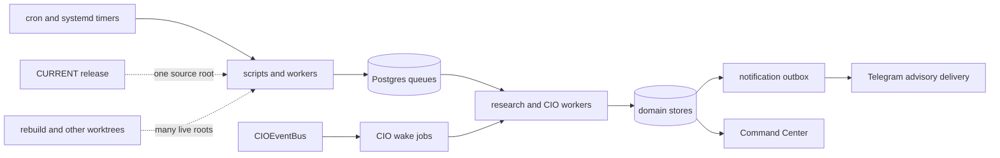
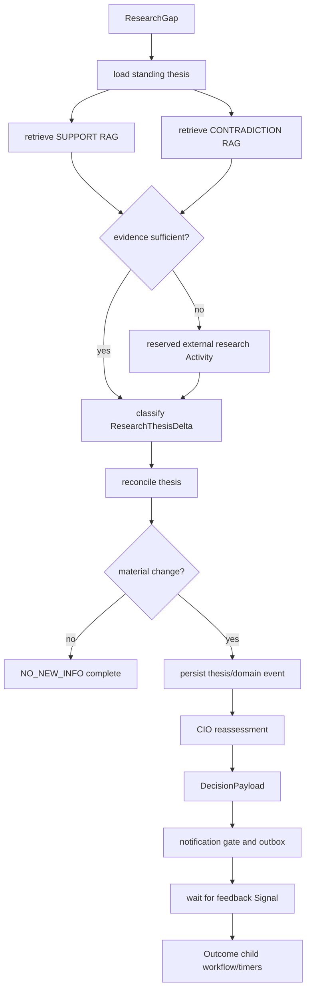
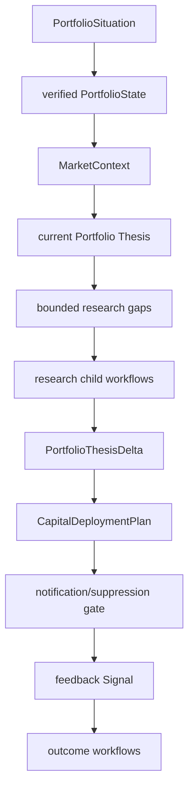
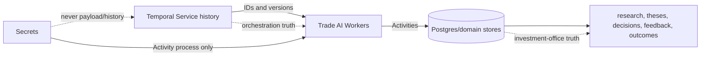
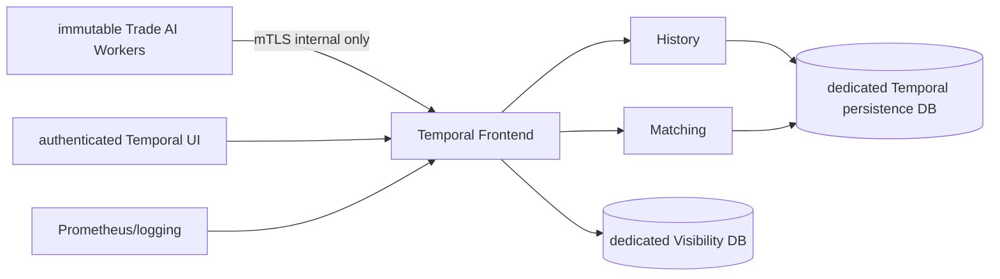
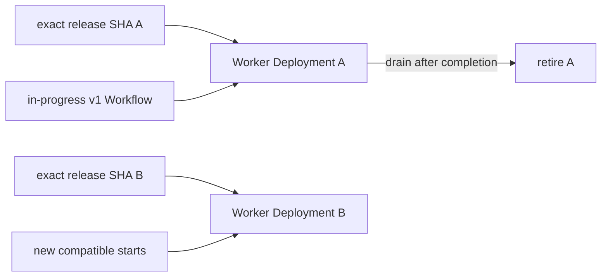
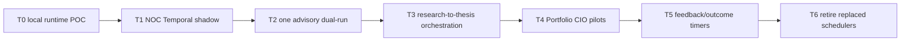

# Temporal Due Diligence and Trade AI Workflow Architecture

**Date:** 2026-08-23

**Authority:** `READ_ONLY_ADVISORY`

**Memory influence:** `MEMORY_BEHAVIOR_INFLUENCE=0`

**Branch:** `feat/temporal-due-diligence-poc` from `origin/main@9dfe437f6e161cb2b6c9ed2c983e23b9fa9de1b7`

**Current decision:** **`TEMPORAL_POC_ONLY`**

**Conditional target if all POC gates pass:** selected durable advisory workflows on Temporal Cloud
**Production installation authorized:** **NO**

## Executive Decision

[RECOMMENDATION] Do not install or adopt Temporal in production yet. Continue to
an actual localhost SDK/Service POC, then a shadow NOC dual-run. Temporal is a
credible fit for three long-running processes: research-to-thesis-to-CIO,
operator `NEED_DATA`, and outcome maturation. Portfolio CIO review is a later
candidate. Simple cron, canonical business state, notification outbox audit,
and every execution/safety path remain outside Temporal.

The weighted architecture comparison is `45.76/100` for CURRENT,
`71.50/100` for the post-#472 design without Temporal, and `85.46/100` for that
design with selected Temporal workflows. This shows architectural potential,
not production proof. The service-choice score is `62.32` self-hosted,
`81.86` Cloud, and `82.20` no Temporal. No Temporal narrowly wins today because
the runtime POC, workload cost, history growth, and operational benefits remain
unmeasured. If those gates pass, Cloud is preferred to self-hosting.

[VERIFIED-LIVE] `origin/main` is `9dfe437f`; live CURRENT is
`5e91225a1186659de3cfd65096e037e774506e7f`. PRs #461-#472 are open and the
autonomous-loop closeout status is `HOLD`. No Temporal package, CLI, Service,
production Worker, cron migration, systemd migration, database migration, or
network listener was installed or changed.

## Current Trade AI Orchestration

Trade AI is a single-operator investment-office system. Deterministic data and
policy code produce read-only research, theses, CIO decisions, notifications,
feedback records, outcomes, and learning candidates. Financial execution and
protection are separate sovereign controls.

[VERIFIED-SOURCE] Mainline orchestration is split across cron/systemd, PostgreSQL
queues, append-only/file-backed ledgers, and the CIO event/wake path:

- `scripts/lib/cio_event_bus.py:338` implements `CIOEventBus`.
- `scripts/lib/cio_wake_jobs.py:195` implements durable wake-job state and
  idempotent enqueue at line 282.
- `scripts/lib/cio_full_cycle.py:342` composes a CIO cycle.
- `scripts/lib/cio_action_ledger.py:146` stores operator workflow actions.
- `scripts/lib/cio_notification_outbox.py:302` retains final notification
  delivery/audit state and idempotency.
- `scripts/lib/cio_agent_handoff_queue.py` supplies lease, retry, and handoff
  state.
- `scripts/lib/cio_capital_plan.py:1324` composes the advisory capital plan.

[VERIFIED-SOURCE] The post-#472 stack adds `ResearchThesisDelta@v1`, stateful
prompt context, automatic thesis reconciliation, event research, DecisionPayload
coverage, feedback, outcomes, call accounting, notification identity, and
source-pin truth. These are domain capabilities Temporal must reuse, not replace.
Evidence: `docs/ops/AUTONOMOUS_ADVISORY_LOOP_CLOSURE_RESULT_2026-08-23.md`
at PR #472 head `16616604635e8177930fc5bfbc7793247dba923a`.

## Current Failure Modes

The detailed classification is in
`docs/_evidence/temporal/TEMPORAL_FAILURE_MODE_MATRIX.json`.

| Failure | Temporal effect | Mechanism and limitation |
|---|---|---|
| Cron or unit runs the wrong tree | REDUCE | Immutable release Workers plus Worker Versioning make Workflow/Worker compatibility explicit; Temporal cannot stop an operator launching a Worker from a dirty tree. |
| Process retains stale modules after CURRENT changes | REDUCE | Versioned Worker deployments drain old work while new starts route to compatible code; release pin enforcement is still required. |
| Partial research completes but mint/reassessment does not | SOLVE/REDUCE | One Workflow records the next durable stage and resumes after Worker loss; Activity idempotency remains a Trade AI responsibility. |
| Thesis changes with no CIO consumer | REDUCE | A single Workflow or Signal path makes the causal edge visible; canonical event meaning must not be duplicated. |
| Restart begins the lifecycle from the beginning | SOLVE | Workflow replay resumes orchestration state instead of re-running every completed step. |
| Duplicate enqueue or retry | REDUCE | Workflow IDs and Activity keys dedupe starts; at-least-once Activities still require business uniqueness and journals. |
| Provider succeeds before Worker/DB acknowledgement | REDUCE, not automatic | A pre-call reservation/request journal must return the stored provider result on retry. Temporal alone cannot guarantee exactly-once external calls. |
| `COST_CAP_EXCEEDED` retries | SOLVE when configured | Declare budget/config/policy errors non-retryable; reopen only through an explicit external event after policy changes. |
| Telegram unavailable | REDUCE | Durable retry is useful, but the existing outbox should remain the final delivery/audit boundary. |
| Price, broker, position, stop, or 2FA failure | NOT_HELP / MAKE_WORSE | These remain outside Temporal; adding a control-plane dependency would enlarge the financial safety failure domain. |
| Dual-root platform debt | NOT_HELP by itself | Temporal helps only after all Workers launch from immutable exact-release artifacts. |

## Why Temporal Is Being Considered

The strongest residual problems are not missing domain schemas. They are
multi-stage continuation, long waits, causal traceability, timer durability,
retry ownership, and code-version compatibility across seconds-to-quarter
lifecycles. Those are Temporal's intended strengths. Cron remains adequate for
short repeatable jobs, but it does not retain a first-class history that says
which research gap led to which delta, thesis, decision, feedback wait, and
outcome timer.

## What Temporal Actually Provides

[DOC] Temporal's Service coordinates durable Workflow execution; separately
deployed Workers execute application code and Activities. Workflows replay from
Event History, while Activities own side effects. See the current
[production deployment documentation](https://docs.temporal.io/production-deployment)
and [Python core application guidance](https://docs.temporal.io/develop/python/core-application).

Relevant capabilities are durable timers, Workflow and Activity retry state,
Signals, Updates, Queries, Schedules, Child Workflows, cancellation,
heartbeats, Search Attributes, Visibility, Continue-As-New, and Worker
Versioning. Temporal currently recommends Worker Versioning for new production
Worker deployments; see [Worker deployments](https://docs.temporal.io/production-deployment/worker-deployments).

## What Temporal Does Not Provide

Temporal does not make Activity side effects exactly once, validate investment
evidence, own financial truth, repair dirty source roots, replace provider cost
governance, or grant financial authority. Activity execution is at least once;
idempotency remains mandatory. It also does not supply self-host RBAC or audit
logging out of the box, according to Temporal's
[production checklist](https://docs.temporal.io/self-hosted-guide/production-checklist).

## Temporal Fit Score

Weights total 100 and every dimension uses 0-5, higher-is-better scoring. The
22 dimensions include durability, idempotency, causal traceability, retries,
crash continuation, timers, events, state clarity, versioning, observability,
cost/security/latency/resource use, developer and operational complexity,
migration/vendor/maintenance risk, and failure-domain expansion.

| Architecture | Weighted score |
|---|---:|
| Actual CURRENT | 45.76 |
| CURRENT + #461-#472, no Temporal | 71.50 |
| CURRENT + #461-#472, selected Temporal workflows | 85.46 |
| Increment over post-#472 | +13.96 |

The full weights, scores, and rationales are in
`TEMPORAL_DUE_DILIGENCE_SCORECARD.json`. The with-Temporal score assumes Cloud,
client-side payload encryption, immutable release Workers, Worker Versioning,
bounded history, and correct Activity idempotency. None is production-proven.

## Workflows To Migrate

1. **AutonomousResearchToCIOWorkflow**: first candidate; long-running,
   multi-stage, provider-costed, and causally material.
2. **OperatorNeedDataWorkflow**: durable operator request, RAG-first dedupe,
   research completion, thesis reassessment, and operator response.
3. **DecisionOutcomeWorkflow**: frozen prediction and 1d/5d/20d/quarter timers.
4. **PortfolioCIOReviewWorkflow**: only after the first three demonstrate value;
   useful for bounded child-workflow fan-out/fan-in across material gaps.

## Workflows To Keep Out

Broker execution, order and stop lifecycles, live risk enforcement, execution
reconciliation authority, broker/account/price/position truth, 2FA, and low-
latency market loops are permanently out. Temporal failure must never delay stop
protection or broker reconciliation.

Keep one-shot cache refresh, stateless ingestion, routine database maintenance,
Drive documentation sync, and simple health polling on cron/systemd/native
schedulers unless measured incidents show a durable multi-stage need.

## Workflow / Activity Architecture

Activities are `load_portfolio_state`, `load_current_thesis`, separate support
and contradiction RAG retrieval, `acquire_external_research`,
`persist_research`, `classify_delta`, `reconcile_symbol_thesis`,
`persist_thesis`, `emit_decision_payload`, `evaluate_notification`,
`enqueue_notification`, `collect_operator_feedback`, `collect_outcome`, and
`write_lesson_candidate`. Workflow code performs no direct HTTP, DB, file,
shell, LLM, unseeded random, or wall-clock side effect.

Signals are appropriate for operator feedback, cancellation, and externally
observed material events directed to an existing Workflow. Updates are for
validated synchronous requests such as supplying a sanctioned research artifact
when the caller needs acceptance/rejection. Queries expose stage and lineage.
Schedules should start weekly/quarterly reviews and staleness/outcome workflows;
they should not translate every shell cron line.

## Data Ownership

Temporal owns orchestration history, durable timers, retry state, and causality.
Trade AI stores remain canonical for portfolio state, theses, evidence, RAG,
policy, feedback, outcomes, and learning candidates. Workflow payloads carry
IDs, versions, hashes, and bounded status only. Raw research and full RAG blobs
must never enter Event History.

## Idempotency

Every side-effecting Activity requires a stable business key and a unique
domain constraint or journal entry:

| Activity | Key |
|---|---|
| Research request | `research_gap_id + provider + normalized_context_hash` |
| Provider call | reserved `provider_call_id` written before network I/O |
| Research row | `research_id` |
| Delta | `delta_id` / evidence hash |
| Thesis | `symbol + prior_version + evidence_hash` |
| Decision | `decision_id` |
| Notification | stable `notification_identity` |
| Feedback | `feedback_id` |
| Outcome | `decision_id + governed_horizon` |

For a provider without idempotency, the reservation journal state machine is
`RESERVED -> SENT -> RESPONSE_RECEIVED -> SETTLED`. Retry first reads the
journal. An ambiguous `SENT` timeout does not blindly issue a second paid call;
it resolves provider request status or moves to operator review.

## Retries

One orchestration retry policy must replace nested Temporal x provider x queue
retry multiplication. Proposed provider Activity defaults: initial interval 5s,
coefficient 2, maximum interval 30s, maximum attempts 3, 120s start-to-close,
20s heartbeat. HTTP 408/429/5xx and temporary network faults are retryable within
the existing circuit breaker. `COST_CONFIGURATION_INVALID`,
`COST_CAP_EXCEEDED`, `POLICY_NOT_ALLOWED`, malformed governed output, and hard
security rejections are non-retryable. Configuration change requires an
explicit Signal or new Workflow start.

## Cost Governance

The existing reservation ledger remains authoritative. A Workflow cannot call
the provider before a cost reservation succeeds. Temporal retry attempt counts,
provider client retries, reservations, request IDs, and final settlement must be
linked. Cloud cost is also unresolved: the current published Essentials minimum
is the greater of USD 100/month or 5% of consumption spend, with Actions and
storage metered separately; see [Cloud pricing](https://docs.temporal.io/cloud/pricing).
No workload-specific monthly cost is claimed until actual Actions/history sizes
are measured.

## Security

Workers for this program may read portfolio/market/research state, use RAG,
perform governed cloud research, persist advisory artifacts, decide advisory
notification, deliver already-authorized advisory Telegram, collect feedback,
and measure outcomes. Static guards must reject imports/calls to broker, order,
stop, execution-risk, credential, or 2FA modules.

No API key, DB password, broker credential, Telegram token, password, private
key, or 2FA value may enter Workflow arguments, Memo, Search Attributes, or
Event History. Activities access secrets through existing process secret
management. Cloud requires namespace authentication, least privilege, audit
export, client-side Payload Codec encryption, and key rotation. See
[Cloud security](https://docs.temporal.io/cloud/security) and
[data encryption](https://docs.temporal.io/production-deployment/data-encryption).

## Self-Hosted Architecture

The production option would use internal-only bindings, mTLS, authenticated
clients/UI, a non-noop Authorizer/ClaimMapper, isolated persistence and
Visibility databases, encrypted backup/restore tests, metrics/logs/alerts,
retention, and sequential server/schema upgrades. Temporal persistence must not
reuse `trade_ai` tables. A separate PostgreSQL instance gives the best blast-
radius isolation; a separate database on the current server is cheaper but
shares CPU, disk, connections, maintenance, and failure.

Self-host is rejected for initial adoption. Temporal explicitly assigns the
operator scaling, availability, security, upgrades, monitoring, and cost duties;
self-host RBAC/audit are not supplied out of the box. That burden conflicts with
the measured dual-root, worker, database, and service-integrity debt.

## Temporal Cloud Architecture

Workers remain local on immutable exact-release artifacts and connect outbound
to one authenticated Cloud Namespace. Canonical Trade AI data and Activity
execution stay local. Workflow payloads/history, task metadata, Schedules,
Memo, Search Attributes, and Visibility metadata leave the server; sensitive
payload fields require client-side encryption. Cloud manages Service
persistence, replication, upgrades, availability, and Visibility.

## Cloud vs Self-Host Decision

| Option | Score | Decision |
|---|---:|---|
| Self-hosted | 62.32 | Reject as initial topology |
| Temporal Cloud | 81.86 | Conditional choice if runtime POC/adoption gates pass |
| No Temporal | 82.20 | Current production choice |

The 0.34-point no-Temporal lead is within model sensitivity, but it is enough to
block adoption while actual runtime value and Cloud cost are unmeasured.

## Server Resource Assessment

[VERIFIED-LIVE] The full read-only host capture is in
`TEMPORAL_SELFHOST_RESOURCE_ESTIMATE.json`. The current host already carries a
20-thread/14-core i9-12900H, 61 GiB RAM (53 GiB available during capture),
8 GiB swap, and a 468 GiB filesystem with 118 GiB free at 74% utilization.
Docker 29.6.1 and PostgreSQL listeners on localhost are present. Ollama was
still serving/stopping `gemma3:12b` on GPU. The host also carries a large
Python/systemd/PostgreSQL workload and 217 source-root drift findings. Docker
availability alone is not capacity proof. A production
self-host topology needs measured peak CPU, memory, disk latency/IOPS,
PostgreSQL connections, backup space, and failure-domain capacity; any missing
metric remains `UNMEASURED` rather than zero.

Sizing placeholder for a non-HA POC is not a production recommendation. A true
production self-host design would require separately budgeted Frontend, History,
Matching, Worker, persistence, Visibility, UI, and monitoring capacity plus
headroom during upgrades and recovery.

## Postgres Topology

Canonical `trade_ai` domain databases remain unchanged. For self-hosting, prefer
a dedicated PostgreSQL instance for Temporal persistence and Visibility. If a
same-server POC uses PostgreSQL, use separate databases/users, explicit
connection caps, separate backup labels, and no cross-schema privileges. Never
put Temporal tables in canonical Trade AI schemas.

## Visibility

Search Attributes may include `symbol`, portfolio class, situation type,
`research_gap_id`, `thesis_id`, `thesis_version`, `decision_id`, materiality,
workflow schema, `source_sha`, and authority. Do not store research prose or
secrets. Command Center may show stage, failure, retry state, source SHA, and an
engineering deep link; it must not embed Temporal UI or expose workflow noise on
normal investment cards.

## Worker Topology

Start with three queues, not dozens:

- `tradeai-research`: RAG and external research Activities.
- `tradeai-cio`: thesis reconciliation, CIO reassessment, DecisionPayload and
  notification decisions.
- `tradeai-learning`: feedback wait/composition and outcome measurement.

Final Telegram delivery can remain an outbox worker. Each Worker records exact
release SHA, deployment version, contract versions, concurrency, DB pool limit,
provider limit, and health. Concurrency is bounded by existing cost/provider
governance rather than CPU alone.

## Worker Versioning

Map Trade AI release SHA, Worker Deployment Version, Workflow schema, Activity
contract version, and domain schema version. A Workflow started under A must
remain assigned to compatible Workers until a deliberate migration. No Worker
may launch from dirty rebuild or mutable overlay. Actual v1-to-v2 behavior is a
required runtime POC gate and is currently `UNMEASURED`.

## Current/Rebuild Impact

Temporal reduces ambiguity only after worker-launch governance is fixed. The
live inventory found 493 Trade AI cron entries and 161 user units in the tree
audit, with 217 combined drift findings; only a small fraction resolve to
CURRENT. Temporal does not authorize the previously withheld cutover. Worker
services must use immutable exact-main releases, stamp `source_sha`, and refuse
dirty/rebuild paths.

## Failure-Injection Results

[POC] The fixture-backed Activity harness injected failure after a deterministic
provider response and after thesis domain write. Resume produced one provider
call, two total thesis versions (`v1 -> v2`), one decision write, and zero
financial writes. Identical replay yielded `NO_NEW_INFO`, no thesis version,
and no decision. Seven POC tests and ten existing DecisionPayload regression
tests passed together (`17 passed in 0.28s`).

This proves the Trade AI idempotency design can support at-least-once Activity
retries. It does **not** prove Temporal Service restart, actual Workflow replay,
Worker SIGKILL, Temporal persistence recovery, Worker Versioning, or latency.
The SDK and CLI are not installed, no Service started, and those fields remain
`BLOCKED`/`UNMEASURED` in `TEMPORAL_NOC_POC_RESULT.json`.

## NOC POC Results

| Gate | Result |
|---|---|
| Source/fixture Workflow architecture | PASS |
| Standing thesis/RAG support/RAG contradiction/delta/reconcile/DecisionPayload | PASS |
| Provider ambiguous-boundary duplicate calls | 0 duplicates |
| Domain-write ambiguous-boundary thesis churn | 0 duplicates |
| Identical replay | `NO_NEW_INFO`; no write |
| Paid provider calls | 0 |
| Financial writes | 0 |
| Actual Temporal SDK Workflow | BLOCKED: SDK absent |
| Service restart/history replay | UNMEASURED |
| Worker v1 -> v2 | UNMEASURED |
| Temporal latency/history growth | UNMEASURED |

## Payload and History Growth

Pass IDs and bounded summaries. Per-activity inputs/outputs should normally stay
below 32 KiB, with a hard application rejection well below Temporal platform
limits. Continue-As-New is required for long-lived feedback/outcome coordinators
before history approaches service warnings. Temporal documents a maximum of
51,200 events and 50 MB Event History; see
[Workflow execution limits](https://docs.temporal.io/workflow-execution/limits).
Actual events/workflow/day and 30d/90d/1y history bytes remain `UNMEASURED` until
the runtime POC.

Use one Workflow per research gap/decision lifecycle and one outcome child
Workflow per decision when bounded. A permanent symbol Workflow risks unbounded
history and version complexity. Use Schedules to start periodic review
Workflows, not a never-ending global Workflow.

## Migration Phases

- **T0:** install nothing in production; run official CLI dev server localhost,
  actual SDK tests, restart/replay, history/latency, v1/v2, and provider-journal
  tests. Entry: architecture approval. Rollback: stop disposable server.
- **T1:** NOC `OLD_WRITE / TEMPORAL_SHADOW`. Compare stage receipts; Temporal
  cannot write authoritative state.
- **T2:** one selected advisory workflow shadow dual-run. Stable comparison
  identity prevents duplicate provider/DB/notification effects.
- **T3:** `TEMPORAL_WRITE / OLD_DISABLED` for research-to-thesis only after all
  correctness and cost gates; retain canonical stores/outbox.
- **T4:** add Portfolio CIO only after bounded child fan-out and history proof.
- **T5:** add NEED_DATA and outcome timers with retention/Continue-As-New proof.
- **T6:** retire only replaced cron/job starts after natural-run evidence.

Every phase requires exact reviewed SHA, green CI, rollback, no financial imports,
`MEMORY_BEHAVIOR_INFLUENCE=0`, and no concurrent authoritative writers.

## Rollback

Disable new Workflow starts, preserve Event History, pause or terminate in-flight
Workflows under a documented policy, restore the old scheduler from an immutable
release, and continue using unchanged canonical domain records. Rollback must
not delete research, theses, decisions, feedback, or outcomes. The old and new
paths may compare receipts in shadow, but only one may own authoritative writes.

## Operational Burden

Self-host monthly work includes upgrades, schema changes, database backup/restore,
certificate renewal, authorization/audit maintenance, metrics, disk capacity,
security patching, incident response, and Worker upgrades. That is not justified
for this one-user system today. Cloud removes Service operation but retains
Worker operations, namespace credentials, payload encryption/key lifecycle,
network dependency, usage monitoring, and Workflow compatibility.

The adoption gate must compare measured hours spent on current cron/job incidents
against Cloud cost and Worker maintenance. No savings claim is made without that
measurement.

## Expected Benefits

- Durable continuation across Worker failure and restart.
- First-class causal history across research, thesis, decision, feedback, and
  outcomes.
- Durable long timers without bespoke stale-job repair.
- Explicit retry/non-retryable semantics and visible attempts.
- Safe in-flight code compatibility through Worker Versioning.
- Better operator diagnostics without making orchestration the business database.

## Expected Costs

- Minimum Cloud spend plus Actions/storage/network usage.
- SDK and Workflow-version learning curve.
- Activity idempotency journals and unique constraints.
- Payload encryption and key lifecycle.
- Worker deployment, monitoring, testing, and incident response.
- Migration/dual-run complexity and a new network failure domain.

## Risks

The largest risks are duplicate paid provider calls, retry multiplication,
history bloat, accidental storage of secrets/research blobs, EventBus/Temporal
cycles, mutable Worker roots, Cloud dependency, and pressure to move financial
controls into the new platform. Static guards and phased ownership transitions
are mandatory.

## Open Questions

1. What are actual Actions and history bytes per research, NEED_DATA, outcome,
   and portfolio review Workflow?
2. Can provider status be resolved after an ambiguous timeout, or must the case
   fail to operator review?
3. Does Python 3.14.4 pass the selected SDK's full compatibility matrix on this
   host?
4. What is the measured Cloud monthly cost at material-symbol cadence?
5. What retention period, likely 30 or 90 days, is enough for incident review?
6. Can Worker Versioning integrate cleanly with exact-main releases and rollback?
7. Does the post-#472 architecture close enough durability gaps to keep no
   Temporal as the lower-complexity choice?

## Go / No-Go Gates

GO to shadow only after an actual Temporal runtime proves crash continuation,
server restart, history replay, Worker v1/v2 compatibility, no duplicate provider
calls or DB writes, bounded history/payloads, acceptable latency/cost, Cloud
encryption/security, immutable Worker releases, and no financial-path imports.

NO-GO if duplicate paid calls remain possible, canonical truth moves into Event
History, Temporal becomes necessary for protection/execution, Workers can launch
from dirty roots, Cloud metadata exposure is unacceptable, or measured cost and
operational effort exceed incident savings.

## Final Recommendation

**`TEMPORAL_POC_ONLY`**.

Proceed with T0 actual localhost runtime due diligence on a separate isolated
environment. Do not install production Temporal, migrate cron/systemd, change
CURRENT, or alter domain authority. If and only if all T0-T2 gates pass, the
preferred target is Temporal Cloud for selected advisory/research/learning
workflows. Self-hosted Temporal and broad advisory control-plane adoption are
rejected at this stage.

## Evidence Index

- `docs/_evidence/temporal/TRADE_AI_CURRENT_ORCHESTRATION_INVENTORY.json`
- `docs/_evidence/temporal/TEMPORAL_CANDIDATE_WORKFLOW_MAP.json`
- `docs/_evidence/temporal/TEMPORAL_FAILURE_MODE_MATRIX.json`
- `docs/_evidence/temporal/TEMPORAL_SELFHOST_RESOURCE_ESTIMATE.json`
- `docs/_evidence/temporal/TEMPORAL_CLOUD_VS_SELFHOST_SCORECARD.json`
- `docs/_evidence/temporal/TEMPORAL_NOC_POC_RESULT.json`
- `docs/_evidence/temporal/TEMPORAL_MIGRATION_MAP.json`
- `docs/_evidence/temporal/TEMPORAL_SECURITY_CHECKLIST.json`
- `docs/_evidence/temporal/TEMPORAL_DUE_DILIGENCE_SCORECARD.json`

Official versions reviewed on 2026-08-23: Temporal Server `v1.31.2` and Python
SDK `1.31.0`, from their official GitHub release records. Documentation pages
were accessed on 2026-08-23. This review does not claim those versions are
installed locally.
