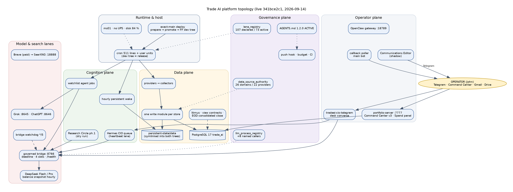
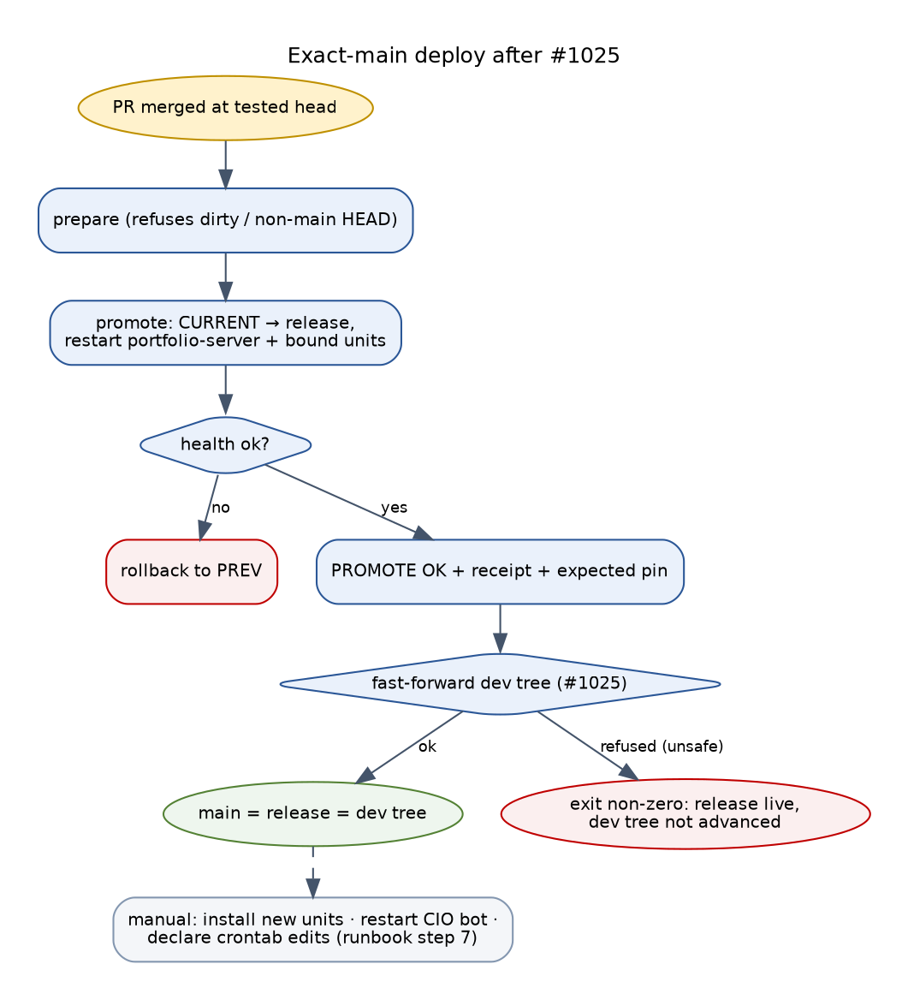
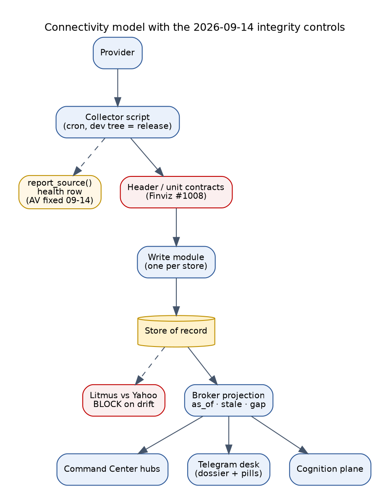
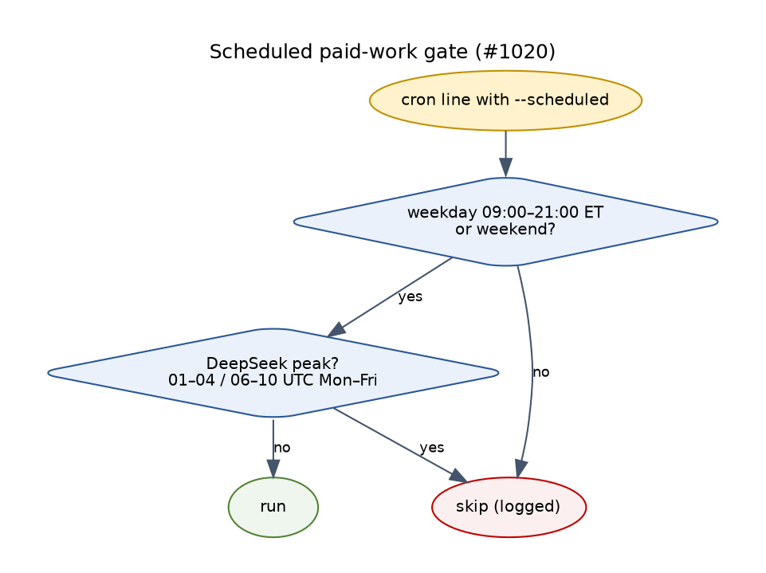
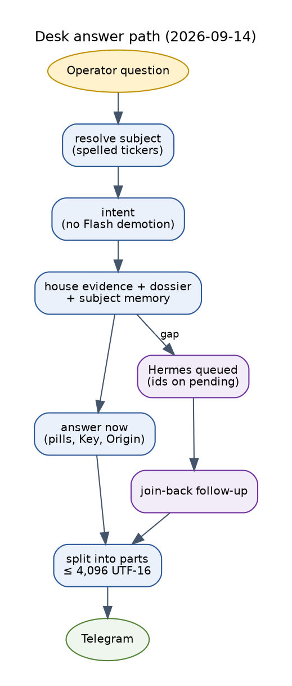

# Trade AI Platform — AS-IS: Deployed & Tested Environment

```
Status:        ACTIVE
Updated:       2026-09-14 23:44 EDT — every section marked "Update 2026-09-14" restates the state after the day's
               29 merged and deployed PRs (#997–#1025). Unmarked numbers remain the 00:10 measurement below.
Live now:      341bce2c1 (PR #1025): origin/main = release CURRENT = dev tree; dev tree git status empty.
as_of:         2026-09-14 00:10 America/New_York (04:10Z) — original measurement
Measured at:   served release a8a62217e (PR #1001) from 2026-09-13 23:50 to 2026-09-14 00:06 EDT;
               PR #1002 (CIO synthesis prompt budget) merged and promoted afterwards at 00:07 EDT as c594d8600.
               Where #1002 changes a number, both values are shown.
Host:          ms01-openclaw (Minisforum MS-01, i9-12900H, 64 GB RAM, Intel Arc Pro B50)
Method:        three independent read-only measurement passes (platform census, cognition pipeline,
               work history); DB sessions default_transaction_read_only=on; no writes, restarts, sends,
               or model calls; get_cio_snapshot not called; broker execution subsystem not examined.
Authority:     READ_ONLY_ADVISORY. MBI_BEHAVIOR = 0 was not touched.
Supersedes:    CIO_AS_IS_2026-09-11-2013 (CIO pipeline only), CIO_AS_IS_2026-09-10-2215
See also:      TRADE_AI_FUTURE_STATE_2026-09-14.md · TRADE_AI_WORKLOG_2026-09-14.md (every change today) ·
               AGENTS.md §0, §2, §7A, §9, §10, §12, §13.4, §15, §17 (Policy-Version 1.2.0 ACTIVE)
               docs/SOURCE_OF_TRUTH.md (rendered registry)
```

This document extends the two CIO pipeline audits of 09-10 and 09-11 to the whole
platform: every lane, integration, data domain, service, monitor, model lane, operator
surface and control. It keeps their discipline. **A number here was observed on the live
host unless it is labelled otherwise.** A capability that exists in code but has not been
seen working is not counted as working.

---

## How to read this document

### Runtime status

```
█ LIVE        observed working at runtime, unattended, on the served release
▓ PARTIAL     runs, but its effect is materially narrower than its name implies
░ UNWIRED     code exists and is correct; nothing calls it, or it has had no traffic
✗ DARK        no producer, no consumer, or has never executed
◇ BLOCKED     mechanism proven; cannot be exercised without an operator decision
⊘ REFUSED     deliberately not built — an authority rail forbids it
```

### Maturity levels (same scale as the 09-10 audit)

```
L0  exists                   the node exists but has not reached L1
L1  provenance + liveness    runs on schedule and stamps the exact served SHA
L2  grounded                 reads real prior state about THIS subject before acting
L3  judgment                 a model is asked, validated, and the answer could be wrong
L4  loop closed              the outcome is scored and changes a later question
L5  unattended + self-report holds without supervision and reports its own decay
```

For platform domains that are not cognition (data, delivery, operations) the same scale is
applied by analogy: **L2** means the domain uses real prior state and has one writer and a
freshness contract; **L4** means failures are detected and routed to a fix; **L5** means it
detects, repairs within bounds, verifies and reports without a human.

### Evidence labels

`OBSERVED` — run on the host and quoted. `INFERRED` — from code, config or reasoning over
observed rows. `BLOCKED` — cannot be determined read-only, or no traffic has exercised it.

---

## 1. Executive summary

**Verdict: the platform is broad, largely live at L1, and unusually well governed on paper.
Its weakest points are the edges where one subsystem must prove that another really did
its job.** Many producers report success without producing; several monitors disagree with
the ledgers they watch; the cognition loop is grounded for one subject; and the host itself
has a failing power supply with no UPS.

| Domain | Capability built | Observed acceptance | Trend (48 h) | Headline evidence |
|---|---|---|---|---|
| Host & resilience | ▓ | **L1, fragile** | ↘ | 5 unclean shutdowns since 08-21; no UPS; `fancontrol.service` failed; disk 84% |
| Deployment & release | █ | **L2** | ↗ | exact-SHA prepare/promote; main = release = dev tree (`c594d8600`); 17 promotes in 28 hourly slots |
| Data plane & source of truth | █ | **L2** | ↗↗ | 26 domains, 22 providers, one writer per store, 0 gate findings; served-copy split healed |
| Integrations & providers | ▓ | **L1–L2** | ↗ | 4 providers retired; health rows contradict live state for moomoo, fred, alpha_vantage, yahoo |
| Scheduled lanes | ▓ | **L1** | → | 90 declared (58 active), 0 undeclared; 2 real long-dead lanes; 2 missing timers |
| Services | █ | **L2** | ↗ | 65/65 expected on; 14 core services; long-running services predate the latest code |
| Monitoring & integrity | ▓ | **L4 detect / L0 repair** | ↗ | 30 integrity findings (1 P0); health agent 76 degraded, 8 critical; monitors report, nothing repairs |
| LLM governance & spend | ▓ | **L2** | ↗ | 59 registered processes; $0.41 of $0.50 global daily cap; 94% of spend in one process |
| Watchlist agent jobs | ▓ | **L1, not reaching the model** | → | 17/17 jobs on 09-13 rejected before any model call; COST_CAP was the larger failure class |
| CIO cognition pipeline | ▓ | **L1 at 15/18 steps; L3 partial on 1 subject; L4 0** | ↗ | memory on 36/108 wakes, judgment 14, critique 11 — all one subject; 0 of 414 commitments settled |
| Operator experience (Telegram desk) | ▓ | **L2 partial** | ↗↗ | replies on; Command Center first; Sources line; subject briefs; memory recall shipped but not yet used |
| Notification & delivery | ▓ | **L1** | → | 97.9% of 7-day outbound bypasses the gateway; `cio-delivery` delivered 0 since 08-29 |
| Security & authority | █ rails / ▓ hygiene | **L2** | → | behaviour rail unconditional; push budget hook; only 1 required CI check, 0 reviews, public repo |

**Readiness standing (AGENTS.md §15 five proofs):** 0 fully observed, 2 partial (M1 Research,
M5 Persistence), 3 not observed or not met (M2 Advice, M3 Feedback, M4 Consistency).
**Campaign M2: NOT ACCEPTED. MVL: NOT ACCEPTED.**

**The three things that matter most right now:**

1. **Producers that claim success without output.** 22 pipelines report success into
   tables that do not exist; `social_ingest` succeeded 24 times without adding a row;
   `cio-delivery` delivers zero every five minutes. "Exit 0" is still being trusted in places.
2. **The cognition loop is one subject deep and cannot close.** Grounding, judgment and
   critique all run on a single subject; every commitment carries the same boilerplate
   falsifier; outcome observations have an empty `realized_state` on 3,351 of 3,351 rows.
3. **The physical host.** A failing DC supply with shrinking intervals between hard cuts,
   no UPS, no funded off-box backup of persistent state, and a failed fan controller.

### 1.1 Update 2026-09-14 — what the day's work changed in this summary

| Domain | Change since 00:10 | Status now | Evidence |
|---|---|---|---|
| Deployment & release | `promote` fast-forwards the dev tree or fails loudly (#1025); dev tree lag closed; unit install and bot restart still manual | **L2 → L3** (runtime reach partly automated) | first live run 23:06: "dev tree fast-forwarded to 341bce2c1" |
| Data plane | repricer canonical mark; Alpaca prev_close fix; Finviz header contracts and explicit units; litmus vs Yahoo, view-contract and EOD consolidated-close timers (#1008) | **L2**, plausibility now proven against an independent source | repricer dry run corrected 9 of 25 holdings; litmus BLOCKs market_quotes-derived closes |
| Integrations | Alpha Vantage health recorder fixed; Google credential re-authenticated; DeepSeek prices verified and balance reconciled hourly (#1020); bridge `GET /health` exists (#1019) | **L2** for Google, AV, DeepSeek | mcporter token refresh Result=success 23:4x |
| Scheduled lanes | 107 declared (73 ACTIVE), 0 undeclared; paid scheduled work gated to the operator window (#1020) | L1 → **L2** (declaration + time policy) | `check_lane_registry.py` clean |
| Monitoring | research heartbeat lane `cio-hermes-queue` feeds the health score (#1014); bridge watchdog */5 (#1019); `REPLY_NOT_DELIVERED` and `RESEARCH_LANDED_UNSENT` answer-quality rules | detect **L4**; bounded repair for the bridge and the Hermes queue (**L3**) | 12 lost research requests restored, 1 replayed live |
| LLM governance & spend | caps count actual spend; one $2.00/day cap; real spend by provider/model/process; spend texts; shared label split into 8 callers (#1015, #1021) | **L3** | real $4.73/week vs projection $214.61 |
| Operator experience | dictated tickers; dossier with spelled-out pills; Hermes join-back; long answers in parts; rich alerts (#1005–#1007, #1016, #1018) | **L2 → L3** | HPE follow-up delivered 10:36; AXTI answer 2 parts |
| Notification & delivery | Communications Editor in shadow; one 07:30 brief; chat routing map; GO alerts delivered; repeat-alert ledger identity (#1009, #1011, #1013) | L1 → **L2** | ARMP/ELMT GO delivered 13:15 |
| Security & authority | AGENTS.md 1.2.0 ACTIVE (#1024) | rails L2 unchanged; SOP controls now binding | Effective-Date 2026-09-14 |
| Host & resilience | bridge MemoryMax 768M; no hardware change (DC supply, UPS still open) | **L1, fragile** (unchanged) | — |

Of the three things that matter most: (1) success-without-output is unchanged except for the Hermes
queue and the bridge; (2) cognition is unchanged (not re-measured); (3) the host is unchanged.

---

## 2. Platform topology

```
                                   OPERATOR  (John)
            Telegram (CIO bot + alerts) · Command Center :7777 · Gmail · Google Drive
                  │                          │                         ▲
                  ▼                          ▼                         │ reports, docs
 ┌──────────────────────────────────────────────────────────────────────────────────────────────┐
 │ HOST ms01  (Ubuntu · i9-12900H · 64 GB · Arc B50 · NVMe 468 G, 84% used · no UPS ▓)        │
 │                                                                                              │
 │  ┌────────────── OPERATOR PLANE ───────────────┐   ┌──────────── GOVERNANCE PLANE ─────────┐ │
 │  │ portfolio-server :7777  (pinned SHA dir)    │   │ AGENTS.md (§0 rails, §17 operator-only)│ │
 │  │ Command Center v3 (≈45 routes, 30+ hubs)    │   │ data_source_authority.json (26 / 22)   │ │
 │  │ api_v2.py  66,199 lines · 1,666 routes refs │   │ lane_registry.json (90 lanes)          │ │
 │  │ tradeai-cio-telegram (desk converse)        │   │ llm_process_registry.json (59)         │ │
 │  │ OpenClaw gateway :18789 (Telegram/WhatsApp) │   │ expected_services.json (65)            │ │
 │  └──────────────────────┬──────────────────────┘   │ push hook · 2-push budget · CI gates   │ │
 │                         │                          └────────────────────────────────────────┘ │
 │  ┌──────────────────────▼─────────────── COGNITION PLANE ─────────────────────────────────┐ │
 │  │ persistent wake (hourly) → memory → research → L3 judgment/critique → commitment      │ │
 │  │ → operator product → notification → outcome checkpoint → lesson   (see §9)            │ │
 │  │ watchlist agent jobs (Maria · Steph · Risk · Tax · Aegis · Alex) · CIO synthesis      │ │
 │  │ 17 agent-runtime@ timers (SHADOW, prepare-only) · Hermes research fleet               │ │
 │  └──────────────────────┬─────────────────────────────────────────────────────────────────┘ │
 │                         │                                                                  │
 │  ┌──────────────────────▼─────────────── DATA PLANE ──────────────────────────────────────┐ │
 │  │ providers → single write modules → stores of record → broker projections → consumers  │ │
 │  │ PostgreSQL 17 :5432  trade_ai 24 GB   ·  lab PG17 :5433                               │ │
 │  │ persistent-state/data  (7 dirs, one physical path, split=0)                            │ │
 │  │ trade-ai-state/persistent_wake  (live wake store)                                     │ │
 │  └──────────────────────┬─────────────────────────────────────────────────────────────────┘ │
 │                         │                                                                  │
 │  ┌──────────────────────▼─────────────── MODEL & SEARCH LANES ────────────────────────────┐ │
 │  │ governed bridge :8766 → DeepSeek Flash/Pro (metered)                                  │ │
 │  │ Grok OAuth :8645 · ChatGPT OAuth :8646 (free) · Ollama :11434 (8 local models)        │ │
 │  │ Brave (paid, budget ledger) → SearXNG :18888 (self-hosted spill)                      │ │
 │  └────────────────────────────────────────────────────────────────────────────────────────┘ │
 │                                                                                              │
 │  EXECUTION: 411 cron lines + 45 units run from the DEV tree;                                │
 │             34 cron lines + 30 units run from the RELEASE (CURRENT or pinned SHA)            │
 │  SECRETS:   Bitwarden SM → tmpfs /run/user/1000/tradeai/env (111 keys, mode 600)           │
 └──────────────────────────────────────────────────────────────────────────────────────────────┘
                  │
                  ▼  external
  Brokers: Schwab (live, OAuth auto-reauth) · Alpaca (paper + live read) · Moomoo OpenD (read)
           Fidelity (manual, closed) · SnapTrade (failing)
  Market data: Yahoo · yfinance · Finviz · SEC EDGAR · FRED · Alpha Vantage · StockTwits · Reddit
               · Google News · YouTube   Retired: Finnhub · Polygon · FMP · NewsAPI
```

The same topology as a flow (Update 2026-09-14: bridge health and watchdog, Communications Editor,
spend reporting and the deploy fast-forward are shown):



---

## 3. Deployment and runtime

### 3.1 Current state

| Item | Value | Status | Evidence |
|---|---|---|---|
| origin/main | **Update 2026-09-14: `341bce2c1` (PR #1025).** At measurement `c594d8600` (PR #1002), was `a8a62217e` | █ | git rev-parse, OBSERVED 23:52 |
| Served release | **Update: `341bce2c1-main-exact-phase2-20260914-230556`** (22 releases promoted on 09-14). At measurement `c594d8600-main-exact-phase2-20260914-000703` | █ | deploy receipt `PROMOTE OK`, OBSERVED |
| Dev tree (runs cron) | **Update: `341bce2c1`, fast-forwarded by `promote` itself (#1025); `git status` empty (#1023).** At measurement `c594d8600`, fast-forwarded by hand | █ | OBSERVED 23:52 |
| portfolio-server health | `/api/health` → 200 `{"ok": true}` | █ | OBSERVED |
| Served-copy split | 7 directories LINKED, split 0 | █ | hourly monitor + dry run, OBSERVED |
| Protected live files | SearXNG settings (md5 `4e76203b`), `hermes_score_weights.yaml` skip-worktree | █ | OBSERVED |
| Release directories | 56, 108 G | ▓ | OBSERVED |
| Deploy tooling | `cio_phase2_exact_main_deploy.sh prepare → promote → rollback`, refuses a dirty or non-main HEAD | █ | INFERRED from script |

### 3.2 Maturity: **L2** (exact-SHA, reversible, health-checked)

### 3.3 Gaps and risks

| # | Gap | Impact | Evidence |
|---|---|---|---|
| D1 | **Two execution trees.** Deploy promotes the release but did not advance the dev tree that runs 411 cron lines; the dev tree fell 16–18 commits behind twice (09-06, 09-13). **Update 2026-09-14: closed for the fast-forward.** `promote` now fast-forwards `CANONICAL_SOURCE` after `PROMOTE OK` and exits non-zero if it cannot (#1025); the one proven-safe blocker (files untracked by the target behind the persistent-state symlinks) is handled with hashed live copies. First live run 23:06. Still two trees. | Merged fixes silently did not run | #1025 tests; deploy log |
| D2 | **Deploy does not install new systemd user units** (the answer-quality timer declared in #998 never started) and does not restart long-running services it changed (the Telegram bot needed a manual restart after three promotes). **Update 2026-09-14: still open.** Today's timers (litmus, view contracts, EOD close, lessons-reflect 19:40, shadow-seed 19:45) and the bridge restarts were done by hand from dry-run-first scripts; runbook step 7 lists them. | Features ship "live" without running | session record; runbook |
| D3 | **Long-running processes predate the served code:** governed bridge, OAuth proxies, ops agent and active-trader motion have run since 09-12 17:02. The lane monitor fires `process_predates_pin`. **Update 2026-09-14:** the bridge was restarted onto #1019 (17:17), with MemoryMax 768M (18:18) and onto the label-split map (20:10); the CIO bot was restarted on the release after desk deploys. OAuth proxies, ops agent and motion still predate. | Stale code serving | bridge `/health` uptime |
| D4 | **Promote cadence prevents same-epoch acceptance:** 17 distinct SHAs in 28 hourly wake slots on 09-13. The acceptance standard requires ≥3 contiguous cycles on one SHA with all proofs together. | Maturity cannot be proven | OBSERVED wake store |
| D5 | **`promote` without `prepare` silently re-promotes a stale release and still prints PROMOTE OK.** | Wrong code with a green light | memory, known gotcha |
| D6 | 108 G of release directories on a disk at 84%. | Disk-full outage | OBSERVED |

**Deploy flow after 2026-09-14 (#1025):**



---

## 4. Integrations and connections

### 4.1 Provider matrix

Registry status is what `config/data_source_authority.json` declares. Effective health is
what the decaying `data_source_health` read model reports right now. Maturity is this
document's assessment.

| Provider | Kind | Registry status | Effective health (OBSERVED) | Maturity | Finding |
|---|---|---|---|---|---|
| Schwab | broker SDK/OAuth | active | OAuth token not degraded; auto-reauth; refresh expires 09-20 | **L2** | positions last synced 06-05 per `broker_accounts` (holdings refreshed via loader) — check the sync path |
| Alpaca | broker SDK/HTTP | active | quotes store fresh; taxable read synced 09-11 | **L2** | live accounts read-only, execution not built |
| Moomoo OpenD | broker SDK | **service_down** | **contradicted:** OpenD active, receipt `ok: true`, quote round-trip ok | **L1** | registry is wrong; read sync re-enabled 09-13, first run Mon 09:00 |
| Fidelity | manual | no_api_manual | closed 07-16, rolled to Schwab IRA | L1 (by design) | — |
| SnapTrade | aggregator | (under fidelity) | **failing:** "no account mapping" since ≥09-11 | **L0** | dead integration, still scheduled |
| Yahoo / yfinance | HTTP/SDK | active | analyst store fresh 09-13; **`yahoo_finance` health row decayed since 08-24** | **L1** | fetch script does not report health |
| Finviz | HTTP (cookie+token) | active | healthy 09-11 (weekday), column map fixed by header name | **L2** | positional parser remains in `portfolio_technical.py` |
| SEC EDGAR | HTTP | active | healthy 09-13 22:03 | **L2** | — |
| FRED | HTTP | active | **row "never reported"** while `fred_economic_series` fresh 09-13 | **L1** | health recorder not wired; 2 writers (unconsolidated) |
| Alpha Vantage | HTTP | active | **row "never reported"** while `fundamental_data` fetched 09-07 | **L1** | health recorder not wired |
| StockTwits / Reddit | HTTP | active | social rows healthy 09-11; **P0: `social_mentions` not growing** despite 24 successful runs | **L0** | success without output |
| Google News | HTTP | active | news_catalyst healthy 09-11 | **L1** | — |
| YouTube | HTTP | (ingest) | **HTTP 429**, 23 failures, last 09-13 22:03 | **L1** | quota |
| Brave | HTTP, paid | active_paid | healthy; per-caller cap `CALLER_DAILY_CAP` denies research producer daily | **L2** | spill to SearXNG on caller cap not configured |
| SearXNG | self-hosted | active | container up, `/healthz` 200; lane monitor says `engine_pool_impaired` | **L2** | — |
| Tavily | HTTP | configured_unused | no client exists | L0 | declared but unbuilt |
| DeepSeek (Flash/Pro) | metered model | active_metered | 546 ok calls/24 h; bridge GET health not available (POST-only) | **L2** | key source not determinable read-only; lane monitor reports zero calls |
| Grok OAuth | free model | active | 736 ok / 8 timeouts in 24 h | **L2** | lane monitor reports zero calls |
| ChatGPT OAuth | free model | active | 68 ok / 0 failed | **L2** | lane monitor reports 15% errors |
| Ollama (local) | local model | active | `/api/tags` 200, 8 models | **L1** | local models refused for judgment by policy |
| Telegram | messaging | — | CIO bot active; alerts IMMEDIATE route proven on phone | **L2** | two operator accounts; one chat id unreachable |
| Gmail / Drive (gog) | Google | — | drive doc sync 0 failed; **`mcporter-token-refresh` failing** (gcloud auth empty) | **L1** | operator re-auth needed |
| Bitwarden SM | secrets | — | render every 4 h, 111 keys | **L2** | retired-provider keys still rendered |
| Finnhub · Polygon · FMP · NewsAPI | retired | retired 09-13 | Finnhub still attempted up to 09-13 16:03 (9,554 failures) | ⊘ | health agent still scores Finnhub critical |

**Update 2026-09-14 — provider changes after the measurement:**

| Provider | Change | Effect |
|---|---|---|
| Alpha Vantage | cron now falls back to `.env` for DB settings; holdings-first symbol selection; quota notices recorded (#1008) | health row no longer silently `unknown`; one symbol per week bug fixed |
| Yahoo / yfinance | independent litmus reference for stored closes (Tue–Sat 07:45); EOD consolidated closes Mon–Fri 17:15 replace IEX closes more than 1 % off (#1008) | price integrity checked daily against an independent source |
| Finviz | exports parsed by header with required-header contracts and explicit units; view-contract gate Mon–Fri 06:05 (#1008) | column shift and 1,000× unit errors refused |
| Alpaca | `prev_close` from `dailyBar` when `prevDailyBar` is two sessions back (#1008) | false day changes removed |
| Schwab | fractional-position price derived as market value ÷ quantity in the read-only sync (broker transport untouched, AGENTS rail 2) | XLI/NOC/SCHG closes correct |
| DeepSeek | prices verified from api-docs.deepseek.com (peak 01–04 and 06–10 UTC Mon–Fri at double; flash off-peak $0.003 / $0.15 / $0.60 per 1M); hourly free balance snapshot; bridge deadline and `/health` (#1019, #1020) | logged spend reconciled against the balance |
| Brave / SearXNG | unchanged (caller-cap denial still does not spill) | — |
| Telegram | long bodies split at 4,096 UTF-16 units; rich layouts with link previews and buttons; Communications Editor at the chokepoint (shadow) (#1009, #1016, #1018) | desk answers no longer refused silently |
| Gmail / Drive (gog) | Google credential re-authenticated by the operator 23:4x; mcporter token refresh succeeds (failing since at least 09-01) | R18 closed |



### 4.2 Connectivity model as built

```
 provider ──► collector script ──► write module (one per store) ──► store of record
                 │                                                      │
                 └─► report_source() health row  ◄── often missing      ▼
                                                              broker projection (as_of, stale, gap)
                                                                        │
                                          Command Center hubs ◄─────────┼────► Telegram desk
                                                                        │
                                                                   cognition plane
```

### 4.3 Integration maturity: **L1–L2**

The data path is well structured. **The health path is not:** the collector writes data
but, for Yahoo, FRED and Alpha Vantage, never writes its health row, so the monitor that
exists to catch stale sources reports false staleness while real ones (SnapTrade, social)
fail quietly.

---

## 5. Data domains of record

All 26 domains carry an operator approval record. The authority gate reports
`domains=26 providers=22 findings=0` and writer counts equal their ceilings.

| # | Domain | Store | Writers (was) | Observed freshness | Maturity | Note |
|---|---|---|---|---|---|---|
| 1 | quote_price | market_quotes | 1 (3) | 09-13 02:10, closed-market window | **L2** | — |
| 2 | symbol_identity | symbol_profiles | 1 (8) | **09-11 12:40, 59 h** | **L1** | stopped writing; blocks agent jobs (§10) |
| 3 | analyst_opinion | yahoo_analyst_targets_history | 1 | 09-13 06:50 | **L2** | coverage lapses by symbol (e.g. V 17 days) |
| 4 | catalyst_news | news_articles | 1 (16) | 09-13 22:03, 6,275/24 h | **L2** | relevance_score has mixed scales |
| 5 | technicals | ticker_prices | 1 (4) | 09-13 | **L2** | — |
| 6 | sector_momentum | sector_rs_daily | 1 | 09-11 (weekend) | **L1** | rotation ladder values unmeasured |
| 7 | industry_momentum | JSON | — | 09-13 23:50 | **L1** | written on a Sunday despite weekday cadence — possible second writer |
| 8 | market_regime | market_regime_snapshots | 1 | 09-11 16:05 | **L1** | — |
| 9 | earnings_date | symbol_profiles | shared | 09-11 | **L1** | — |
| 10 | holdings_accounts | holdings.json | — | 09-13 08:00 | **L2** | account states labelled LIVE/STALE/SERVICE_DOWN |
| 11 | options_iv | options_iv_history | 1 | 09-11, unscheduled | **L0** | 4 h window, no schedule; ~1,145 rows |
| 12 | research_thesis | hermes_research_intelligence | 1 (32) | 09-13 23:36 | **L2** | 84 open gaps up to 504 h, no attempt |
| 13 | watch_directives | watch_directives | 1 (18) | 09-13 23:45 | **L2** | CHECK constraint lacks `proposed` |
| 14 | watch_discovery | watch_candidate_events | none | **07-16** | ✗ | dead feed, desk still surfaced |
| 15 | web_search | search_budget.json | 1 | 09-13 23:45 | **L2** | — |
| 16 | private_company | private_company_proxies | operator | 07-06, 1 row | L0 | no real source |
| 17 | dividends | ticker_dividend_data | 1 | 09-11 | **L1** | — |
| 18 | macro | fred_economic_series | **2** (unconsolidated) | 09-13 06:15 | **L1** | health row never written |
| 19 | fundamentals | fundamental_data | 1 | 09-07 (weekly) | **L1** | health row never written |
| 20 | agent_opinion | watchlist_agent_results | 1 | 09-12 20:00, 0/24 h | **L1** | see §10 |
| 21 | agent_debate | agent_debate_log | 2 | 05-05 | ✗ | dead feed |
| 22 | ai_reports | ai_reports | 4 | 08-02 | ✗ | dead feed |
| 23 | redeploy_analytics | cache JSON | api_v2 | 52 days old at last measure | ✗ | dead feed |
| 24 | inverse_stoplights | JSON | 1 | not measured | — | — |
| 25 | data_gaps | data_gap_registry | 1 | **newest 05-24, 0 open** | **░** | desk reconnected in #998; no gap written since |
| 26 | operator_conversation | operator_conversation_turns | 1 | 09-13 21:59, 211 rows | **L2** | tagger creates false subjects (§11) |

**Data plane maturity: L2.** The One Source of Truth work gave the platform something most
systems never get: a registry that a gate enforces, one writer per store, and grants on
every source. What remains is **freshness and plausibility**: the plausibility monitor
fails 7 of 11 columns and its timer has never fired; `symbol_profiles` stopped writing;
four dead feeds still appear in the product.

**Update 2026-09-14:** the price domains gained write-path fixes and three drift controls (#1008): the
repricer never writes a position value as a close and refuses a close more than 50 % from the live
quote; Alpaca `prev_close` is correct before the first bar; Finviz exports are parsed by header with
unit contracts; a daily litmus against Yahoo BLOCKs a source when more than 2 % of its closes are
off by more than 10 %; EOD consolidated closes replace IEX-derived closes more than 1 % off Yahoo
(disagreements over 50 % held for quarantine review). The corrupt 09-04/09-11 rows are **not yet
quarantined** (operator-approved, still open). `symbol_profiles` staleness and the dead feeds were not
re-measured.

---

## 6. Scheduled lanes

### 6.1 Totals (OBSERVED)

| Metric | Value |
|---|---|
| Declared lanes | **Update 2026-09-14: 107 declared, 73 ACTIVE, 0 undeclared** (`check_lane_registry.py`, 23:52). At measurement 90 — ACTIVE 58 · PAUSED 13 · NEVER_SCHEDULED 12 · RETIRED 7 |
| Scheduler kinds | systemd 55 · cron 23 · none 11 · event 1 |
| Undeclared jobs beyond baseline | **0** |
| Inherited-debt baseline | 531 cron lines not yet declared as lanes |
| Live crontab | **Update: 511 non-comment lines** after the day's installs (morning brief 07:30, GO alerts, spend texts, bridge watchdog, balance snapshot, operator-window wrappers). At measurement 451 active lines (411 dev tree, 34 release, 6 other) calling 360 distinct scripts |
| systemd user timers | 81, including 17 agent-runtime instances |
| Verdicts | LIVE 39 · EXPECTED_SILENT 32 · SILENT 8 · SLOW 3 · ORPHANED 2 · UNVERIFIABLE 6 |

### 6.2 Lanes by domain

| Domain | Active lanes | LIVE | Findings |
|---|---|---|---|
| Market data & signals | 6 | 4 | 2 ORPHANED are registry match drift (renamed scripts), not dead |
| News, catalysts, identity | 5 | 3 | identity sweep SLOW; mentions prune unverifiable |
| Research / Hermes | 5 active + 4 retired/paused | 2 | 3 lanes declare no output signal |
| Watchlist agents | 1 active + 8 paused | 0 | worker itself is undeclared (baseline); containment flag active since 08-20 |
| CIO cognition / wake | 15 active | 13 | **cio-defer-revisit dead since 08-19**; due-diligence questions silent 21 h |
| Notifications | 3 | 1 | **cio-delivery dead since 08-29**; material-change notifier silent 21 h (weekend) |
| Broker / portfolio | 8 active | 3 | **weekly and monthly cadence timers not loaded** (last 08-31, 08-01) |
| Health, monitoring, governance | 12 active | 12 | plausibility timer never fired |
| Backups & hygiene | 3 active | 1 | 2 lanes declare no output signal |

### 6.3 Real failures (not weekend artifacts)

| Lane | Last output | Age | Diagnosis |
|---|---|---|---|
| cio-defer-revisit | 2026-08-19 | 625 h | runs hourly; ledger does not grow; writes its receipt into the **previous** release directory |
| cio-delivery | 2026-08-29 | 369 h | worker runs every 5 min with `delivered_count=0` |
| portfolio-weekly-cadence | 2026-08-31 | 339 h | timer absent from systemd; not in expected services |
| portfolio-monthly-cadence | 2026-08-01 | 1,048 h | timer absent from systemd |
| data-plausibility (timer) | never | — | only a manual run on 09-13 |

### 6.4 Lane maturity: **L1**

Declaration is complete (0 undeclared), which is real progress. But the evaluator uses the
**UTC** weekday, so weekday lanes look SILENT on Sunday evening in New York; 6 active lanes
cannot be verified because they declare no output; and 531 inherited cron lines are still
outside the registry.

**Update 2026-09-14 — lanes added or changed today:**

| Lane | Schedule | PR |
|---|---|---|
| `morning-brief-0730` (08:05 sender and 20:00 duplicate retired) | 07:30 weekdays | #1009 |
| `screener-go-alerts` | */15 09:00–16:59 weekdays | #1009 |
| source litmus · Finviz view contracts · EOD consolidated close | Tue–Sat 07:45 · Mon–Fri 06:05 · Mon–Fri 17:15 | #1008 |
| `cio-hermes-queue` (research heartbeat) | 15 min | #1014 |
| spend texts daily / weekly / monthly | 07:05 · Mon 07:10 · 1st 07:15 | #1015 |
| four `research_scheduler` cron lanes declared | holdings, priority hourly, watchlist 20:30, incubator Sun | #1017 |
| `cio-bridge-watchdog` | */5 | #1019 |
| `research-scheduler-holdings` moved 08:00 → 09:05; usefulness scorer and due-diligence questions gated to the operator window; `governed-agent-flash-market` 09–19 weekdays; `deepseek-balance-snapshot` hourly :50 | — | #1020 |
| advisory lessons reflect 21:40 → 19:40; shadow seed 21:45 → 19:45; advisory cache worker 09–19 ET | — | #1020 |



---

## 7. Services, monitoring and integrity

### 7.1 Services — **L2**

- `check_expected_services`: **65 of 65 declared units and flags on** (hourly).
- Core services active: portfolio-server, CIO Telegram bot, health agent, Moomoo OpenD,
  governed bridge, Grok and ChatGPT proxies, OpenClaw gateway, ops agent, lab Postgres,
  active-trader motion, heartbeat receiver, power-watch.
- Not declared in expected services: portfolio-server, governed bridge, both OAuth
  proxies, OpenClaw gateway, heartbeat receiver, power-watch, weekly/monthly cadence timers.
- Failed units: `mcporter-token-refresh` (user), **`fancontrol.service` (system)**.

### 7.2 Monitors — **L4 detect, L0 repair**

| Monitor | Cadence | Current result |
|---|---|---|
| Data source health | hourly | 18 checked, 4 off (3 false "unknown", YouTube 429) |
| Served copy split | hourly | 7 linked, 0 split |
| Expected services | hourly | 65/65 |
| Operator answer quality | 30 min | 7 findings, all from replies before the 09-13 fixes; **unit exits FAILURE whenever findings exist** |
| Gap resolution | 30 min | 84 OPEN_NO_ATTEMPT research gaps up to 504 h; **alert suppressed as "unchanged"** |
| Data plausibility | daily (never fired) | 7 of 11 columns implausible |
| Research lane health | 30 min | 11 lanes firing; **contradicts the LLM consumption ledger** |
| Integrity sweep | report-only CLI | **30 findings: 1 P0, 25 P1, 4 P2** |
| Health agent | ~5 min daemon | **score 76, degraded, 8 critical, 5 warnings** |
| Backups | hourly enforcer + 02:30 cadence | ok |
| **Research heartbeat** `cio-hermes-queue` (Update 2026-09-14, #1014) | 15 min | fires on failure rate, no completions, stalled queue, lost requests; heals by restoring lost and replaying retryable requests inside `claim_next`; folds into the health score |
| **Bridge watchdog** (Update, #1019) | 5 min | probes `/health`: OK / BUSY_UPSTREAM / CIRCUIT_OPEN / WEDGED; restarts after 2 unanswered probes (30 min cooldown); never restarts for provider problems |
| **Source litmus** and **Finviz view contracts** (Update, #1008) | Tue–Sat 07:45 · Mon–Fri 06:05 | BLOCK on drift against Yahoo; header / unit / price contracts per saved view |
| **Answer quality — new rules** (Update, #1006, #1018) | 30 min | `RESEARCH_LANDED_UNSENT` (research completed, pending still open > 10 min); `REPLY_NOT_DELIVERED` (agent turn without a Telegram message id) |

**Integrity sweep detail.** P0: `social_ingest` succeeded 24 times in 7 days while
`social_mentions` never grew. P1 ×22: pipelines report success into tables that do not
exist — `symbol_enrichment` (1,130 runs), `proposal_enrichment_loop` (453 runs), the FRED
and SEC ingests, RAG indexer, orchestrator, indicator engine, risk gate, agent outcome
scorer and others. P1: two unscheduled producers, one commented-out cron. P2: 309 files
load secrets from inside the repo tree; 173 unbounded dedup guards.

**Health agent criticals** (reported, not investigated where they touch execution): one
open position without a stop; audit ledger chain break and a coverage gap on
`submit_requested`; one open execution escalation; three proposals stuck in
APPROVED_FOR_PAPER_TEST; six pipeline failures in 24 h (orchestrator exit 2); agent-job
containment flag present; retired Finnhub still scored. Warnings include **17 Postgres
idle-in-transaction kills in three hours**.

### 7.3 Assessment

The platform now has more detectors than it has ever had, and most of them work. **None of
them closes a finding.** Three of them are actively misleading: the lane-health collector
disagrees with the consumption ledger, the gap-resolution alert suppresses a growing
backlog as "unchanged", and the answer-quality unit reports a systemd failure every time it
correctly finds something — which trains people to ignore it.

**Update 2026-09-14:** two detectors now repair within bounds and verify — the Hermes queue heals
itself (restore, replay, reap under a projection lock) and the bridge watchdog restarts a wedged
bridge but never a provider-side stall. The escalation handler's retries run again (they had exited
127 on 36,365 attempts since 08-07). The other monitors still only report; the finding ledger does
not exist yet.

---

## 8. LLM governance and spend

### 8.1 Registry — **L2**

| Item | Value |
|---|---|
| Registered processes | 59 in the file, 61 in the DB table at measurement. **Update: +8** named callers split from `advisory_desk_opinion` (#1021): `cio_operator_reply` (manual), `cio_plan_enrichment`, `cio_prompt_judge`, `research_circle_analyzer` (manual), `hermes_cloud_json`, `hermes_usefulness_score` (600 calls/day), `cio_hermes_research`, `hermes_golden_judge` |
| Lane policies | either 26 · deepseek_only 16 · grok_only 7 · ensemble 6 · both_preferred 4 |
| Global daily cap | **Update 2026-09-14: $2.00/day of actual spend**, one host file `~/.config/tradeai/llm_global_daily_usd_cap.env` loaded last by every unit (`99-llm-global-cap.conf`); the forgotten $7.00 backfill override and the server's $1.50 archived with a tripwire README; ratified in AGENTS §12 (#1015, #1017). At measurement `LLM_GLOBAL_DAILY_USD_CAP=0.50` (env, server drop-in, bridge) |
| Sum of per-process daily caps | $15.40 — far above the global cap, so the global cap is the real control |
| Failure policy | `VISIBLE_FAILURE_NO_SILENT_FALLBACK` |
| Key caps changed 09-13/14 | Maria/Risk/Steph narrative input 4,000 → 8,000; CIO synthesis cron 16,000 → 32,000 with a per-agent prompt budget (#1002) |
| Grounding | Rule G0 "use only supplied facts" + post-answer number check, enforce by default (#999) |

### 8.2 Last 24 hours (OBSERVED)

| Metric | Value |
|---|---|
| Calls / succeeded | 1,358 / 1,350 |
| Spend | **$0.4085 — 82% of the global cap, on a Sunday** |
| By lane | Grok 744 ($0) · DeepSeek fast 469 ($0.3825) · DeepSeek Flash 77 ($0.026) · ChatGPT 68 ($0) |
| Concentration | `advisory_desk_opinion` = **94% of spend** |
| Failures | 8 Grok proxy read timeouts |
| Reservations | 546 settled; projected $4.77 vs actual $0.41 |

### 8.3 Gaps

- **One process consumes almost the whole budget** on a non-trading day; on a busy weekday
  the global cap will starve everything else, which is exactly what `COST_CAP_EXCEEDED`
  did to agent jobs from 09-07 to 09-12 (197 failures).
- Reservation projections run 12× actual, so admission control is far more conservative
  than real cost.
- The lane-health monitor reports zero DeepSeek and Grok calls while the ledger shows 1,282.

### 8.4 Update 2026-09-14 — spend truth, the operator window and attribution

| Item | Measured / changed | PR |
|---|---|---|
| Real spend, week to 09-14 | **$4.73** ($0.72/day) from provider tokens × price schedule; the cap ledger counted $5.50; the worst-case projection for advisory opinions alone was **$214.61** — a $0.50 cap refused research on phantom money | #1015 |
| Week of 09-07 | $5.45 real, 38 % on DeepSeek peak, 60 % outside the operator window — mostly a one-time usefulness backfill (≈ 31,000 old rows, 09-06 → 09-09); normal running ≈ $0.49/day | #1020 |
| Price check | recomputing the week from token counts at DeepSeek's published prices gives $5.42 against $5.45 logged | #1020 |
| Reservations | calibrated to the p90 of settled cost × 1.5 (never above worst case) | #1015 |
| Reporting | `GET /api/v2/consumption/spend`; Command Center Spend panel; Telegram texts daily 07:05, weekly Mon 07:10, monthly 1st 07:15 (outside-window and balance lines) | #1015, #1020 |
| Attribution | the shared id carried 88 % of spend; now eight callers bill to their own ids and caps; operator replies logged as ad hoc | #1021 |
| Scheduled work | only in the operator window and never at DeepSeek peak; manual runs never gated; `TRADEAI_ALLOW_SCHEDULED_PEAK=1` overrides one run | #1020 |
| Bridge | 150 s wall-clock deadline; 4 in-flight slots; 503 `BRIDGE_BUSY`; `/health`; watchdog (DeepSeek held calls ~906 s on 09-14 15:15–17:17) | #1019 |
| Label split on real traffic | not yet observed (no daytime traffic since the 20:10 bridge restart) — check scheduled 09-15 10:03 ET | — |

---

## 9. CIO cognition pipeline

Re-measured on the served release against the 09-10 and 09-11 audits. Window "since 09-12"
= 108 hourly wakes.

### 9.1 Pipeline as it runs today

```
 0 EVENT INTAKE        █ L1 L5   news 22:03 · catalysts 18:45 · research_discovery dead 125 h
        ║
 1 IDENTITY            █ L1 L2   10,409 entities · 209,503 mentions · false subjects on reply text ▓
        ║
 2 MATERIALITY         █ L1 L2   256 material changes · $0 · deterministic
        ║
 3 WAKE OPEN           █ L1 L5   108/108 SETTLED · exact SHA + epoch id · 6 subjects only ▓
        ║
 4 MEMORY LOAD         ▓ L2(1)   facts on 36/108 wakes — all one subject · 168 h cliff removed (decay 336 h)
        ║
 5 RESEARCH GAP        █ L1 L5   675 objects (156/24 h) · producer healthy · 84 gaps unattended ▓
        ║
 6 JUDGMENT            ▓ L3(1)   llm on 14/108 · requested == returned · digests · cache hits
        ║
 7 CRITIQUE            ▓ L3(1)   11 critiques · other provider · 11/11 accept · 0 field changes
        ║
 8 SYNTHESIS           ▓ L1      template RECOMMEND 190/190 beside L3 ABSTAIN 11/11 · CIO synthesis stalled 28 h
        ║
 9 COMMITMENT          ▓ L1      414 rows · falsifier on 94/94 but identical boilerplate · 0 settled
        ║
10 OPERATOR PRODUCT    ▓ L1      desk house-facts contract shipped (§11)
        ║
11 NOTIFICATION        ▓ L1      Command Center link on 2.1% of 7-day outbound
        ║
12a LEGACY SEND        ▓ L1      97.9% of 7-day outbound not gateway-owned
12b GATEWAY            ◇ L1      19 SETTLED ever (16 organic, ops canary only) · none in 21 h
        ║
13 DELIVERY RECEIPT    ▓ L1      RESERVED backlog 232 (+107)
        ║
14 OPERATOR INBOUND    ▓ L1 L2   41 operator messages/7 d · only turn 115 (09-11) ever reaches a wake
        ║
15 OUTCOME CHECKPOINT  ✗ L0      3,768 checkpoints · realized_state null on 3,351/3,351 observations
        ║
16 SCORING → LESSON    ✗ L0      414 provisional lessons · 3 outcome-derived · Sentinel/Darwin stalled 2.6 days
        ║
17 REVIEW / SELF-REPAIR █ report / ✗ repair
        ╎
        ╰╌╌ learning loop (outcome → lesson → memory → next question): ✗ nothing traverses it
```

### 9.2 Step table with deltas

| # | Step | 09-10 | 09-14 | L | Delta | Deciding measurement |
|---|---|---|---|---|---|---|
| 0 | Event intake | █ | █ | L1 L5 | → | news 22:03; research_discovery 125 h dead |
| 1 | Identity | █ | █▓ | L1 L2 | ↗ counts / new defect | reply text tagged `P`, `S` CONFIRMED; `WENT`, `POP`, `ABOVE` as subjects |
| 2 | Materiality | █ | █ | L1 L2 | → | 256 rows |
| 3 | Wake open | █ | █ | L1 L5 | ↗ | 108/108 settled, epoch id on every row; narrow selection |
| 4 | Memory load | ▓ 0/9 | ▓ | L2 (1 subject) | **↗** | 36/108; `filtered_wrong_subject 892` |
| 5 | Research | █ | █ | L1 L5 | ↗ | 675 objects; producer ok 15/15 |
| 6 | Judgment | ✗ 0/51 | ▓ | **L3 (1 subject)** | **↗↗** | 14/108 with DeepSeek Flash, digests |
| 7 | Critique | ░ | ▓ | **L3 (1 subject)** | **↗↗** | 11 critiques, never disagreed |
| 8 | Synthesis | ▓ | ▓ | L1 | → / ↘ | template unchanged; watchlist synthesis stalled |
| 9 | Commitment | ▓ | ▓ | L1 | cosmetic ↗ | boilerplate falsifier on 94/94 |
| 10 | Operator product | ▓ | ▓ | L1 | ↗ | desk fixes (§11) |
| 11 | Notification | ▓ | ▓ | L1 | → | CC link 2.1% |
| 12a | Legacy send | ▓ 86.9% | ▓ 97.9% | L1 | ↘ | owner-null rows now counted |
| 12b | Gateway | ◇ 3 staged | ◇ 16 organic | L1 | ↗ | ops canary only |
| 13 | Delivery receipt | ▓ | ▓ | L1 | ↘ | RESERVED 232 |
| 14 | Inbound | ▓ | ▓ | L1 L2 | intake ↗ / effect → | turn 115 replayed only |
| 15 | Outcome | ✗ | ✗ | L0 | → | 0/414 settled |
| 16 | Lesson | ✗ | ✗ | L0 | marginal | 3 outcome-derived |
| 17 | Self-repair | █ report | █ report / ✗ repair | L1 L5 report | → | more detectors, 0 repairs |

**Roll-up:** L1 at 15 of 18 steps (was 13). L2 at 7 (was 6). **L3 at 2, partial, one subject
(was 0).** L4 at 0. L5 as reporting only.

### 9.3 Readiness proofs (AGENTS.md §15)

| Proof | Standing | Why |
|---|---|---|
| M1 Research | **PARTIAL** | producer self-raises and completes; "changed_question" repeats on identical input; no field diff shown |
| M2 Advice | **NOT OBSERVED** | 11/11 critiques accept with no field changes |
| M3 Feedback | **NOT OBSERVED** | 41 operator messages in 7 days; none reached a wake; only a 09-11 turn is replayed |
| M4 Consistency | **NOT MET** | false "cash unavailable" reply; pending close stated "2 h" at 9.4 h; desk replies absent from the communication ledger |
| M5 Persistence | **PARTIAL** | a 3-day-old operator turn is still loaded unattended; no decision difference shown |

**Campaign M2: NOT ACCEPTED.** The 09-11 blocker (one cycle per SHA) is gone — four epochs
reached ≥3 contiguous cycles. New blockers: no new operator turn reaches a wake; judgment
and gateway delivery never happen on the same SHA; promote cadence. **MVL: NOT ACCEPTED** —
Sentinel (140 reviews) and Darwin (223 scorecards) have not produced since 09-11 13:16Z and
no scheduled producer was found.

---

## 10. Watchlist agent jobs (Maria · Steph · Risk · Tax · Aegis · Alex)

### 10.1 Funnel, last 7 days (OBSERVED)

| Day | Completed | Failed | Deferred | Superseded | Expired |
|---|---|---|---|---|---|
| 09-07 | 0 | 113 | 14 | 59 | 5 |
| 09-08 | 2 | 108 | 31 | 81 | 16 |
| 09-09 | 1 | 93 | 32 | 116 | 2 |
| 09-10 | 0 | 73 | 25 | 39 | 1 |
| 09-11 | 16 | 74 | 7 | 29 | 0 |
| 09-12 | 12 | 82 | 0 | 0 | 9 |
| 09-13 | 0 | **17** | 0 | 0 | 0 |

Failure classes 09-07..09-12: **COST_CAP_EXCEEDED 197**, INPUT_LIMIT_EXCEEDED 101, CIRCUIT_OPEN 17.

### 10.2 Why nothing reaches the model now

1. **Symbol gate.** All 17 jobs on 09-13 were rejected before any model call: WLY, PCLA and
   MCFT are absent from `symbol_profiles`, which last wrote on 09-11 12:40.
2. **Topic slugs routed to a security-only worker.** `TOPIC:ai_network_layer` is rejected as
   "not a security" (30 rejects on 09-13, 60 on 09-12).
3. **Cost cap.** The larger historical failure class; 94% of the daily budget goes to one
   advisory process.

The input-cap raise (4,000 → 8,000) and the G0 number check are deployed and correct but
**have never executed**: zero model calls since they shipped; the worker runs 10:00–20:59 ET.

### 10.3 CIO synthesis

The last completion was **09-12 20:15 EDT**. WMT logged "Pending synthesis detected,
running…" 48 times with no completion and no error. The per-agent prompt budget and 32,000
cap (#1002) were merged and deployed at 00:07 EDT; the next worker window will show whether
synthesis resumes. Silent failure remains: no per-attempt error is logged.

### 10.4 Maturity: **L1** — the worker runs; the work does not happen.

**Update 2026-09-14:** not re-measured. The synthesis prompt budget and 32,000 cap (#1002) and the
8,000 input caps are live; the global cap is now $2.00 of actual spend with calibrated reservations
(#1015), which removes the phantom-money refusals that produced most `COST_CAP_EXCEEDED` failures.
The `symbol_profiles` gate and topic-slug routing are unchanged.

---

## 11. Operator experience — Telegram desk

### 11.1 Path and maturity

| Stage | Status | Evidence |
|---|---|---|
| Intake (poller, bot) | █ | CIO bot on the latest release; replies enabled since 09-13 10:17 |
| Intent and subject resolution | ▓ | registry-first resolver, SpaceX → SPCX; 38% of operator messages bound to a subject |
| House facts first | ▓ | evidence contract; subject brief (price, 30-day move, levels, analysts with age, research, "what this means") |
| Reply provenance | ▓ | Sources line and "went outside" disclosure on every post-fix reply (1 of 1 observed) |
| Model use | ▓ | DeepSeek summary accepted only if every number is in the brief; intent classification labelled |
| Pending questions | ▓ | honest closing messages; **Hermes research that arrived 14 min later was never joined back to the pending question** |
| Gap queue | ░ | reconnected (#998); no gap written yet; resolver resolves only on proof |
| Reply ledgering | ✗ | desk replies and pending closes do not appear in `communication_events` |
| Chat memory recall by GUID | ░ | shipped (#1001); 0 turns since; **tagger false subjects would poison it** |
| Answer-quality monitor | █ | 30-minute audit; 7 findings, all from pre-fix replies |

### 11.2 Update 2026-09-14 — the desk after today's fixes

| Stage | Change | PR | Proof |
|---|---|---|---|
| Subject resolution | dictated tickers (`a x t i`, `A.X.T.I`) bind when the book or registry holds them; Flash may not demote a re-entry/levels ask | #1005 | real AXTI question dry run: full re-entry card |
| House facts | freeform context carries price and levels for named stocks; subject dossier covers every stored section | #1005 | — |
| Provenance | every line carries a spelled-out pill: `🟢 Trade-AI data` · `🔵 Looked up outside Trade-AI` · `🟣 AI model (DeepSeek)`; a Key line on every reply; Origin line | #1005, #1007 | operator: "This is much better" |
| Pending questions | Hermes research joined back to the pending by `plan_id`/`research_id`; research-only asks answered immediately with house facts; failed runs close at once | #1006 | HPE follow-up delivered 10:36 |
| Delivery | bodies over 4,096 UTF-16 units sent as ordered parts; phone rendering; `reply NOT delivered` logged | #1016 | AXTI answer re-sent in 2 parts |
| Alerts | rich GO, ENTRY ALERT and material-change layouts with links, buttons and chart preview | #1018 | ARMP renders 797 units |
| Monitoring | `RESEARCH_LANDED_UNSENT`, `REPLY_NOT_DELIVERED` | #1006, #1018 | — |
| Still open | reply ledgering in `communication_events`; tagger reading agent text; one release-behind bot after a promote without restart | — | — |



### 11.3 Maturity: **L2 partial** at measurement (up from "replies off / hermetic only" on 09-11); **Update 2026-09-14: L3** for answer content and delivery, reply ledgering still L0

The operator now gets a real answer with its sources. The remaining defects are in the
seams: research that lands after a question is not delivered, replies are not ledgered, and
identity tagging on the bot's own text will feed wrong memories.

---

## 12. Security and authority posture

| Control | State | Maturity |
|---|---|---|
| Behaviour rail `MBI_BEHAVIOR = 0` | unconditional raise at `cio_instrument_record.py:390`; refuses size, shares, order, stop, limit, target weight | █ ⊘ by design |
| `MEMORY_BEHAVIOR_INFLUENCE=0` | set on the CIO bot | █ |
| Broker execution | separate, operator-controlled, per-order 2FA; not examined | ⊘ out of scope |
| Operator-only decisions (§17) | new cron/systemd, new data source or writer, spend caps, deletion, branch protection, broker/credentials | █ documented; grants recorded in registries |
| **AGENTS.md policy** (Update 2026-09-14) | **Policy-Version 1.2.0 ACTIVE**, Effective-Date 2026-09-14: multi-agent SOP controls, guarded push/deploy approval workflow, `delivery_owner` rule, reply and data-gap rules, MAJOR §7A/§17 data-source ownership change, $2.00 cap, today's SOPs; approval bound to PR #1022 head `ad5c533b2` (#1024) | █ |
| Push gate | pre-push hook: authorization + two-push budget + secrets tree scan | █ |
| Required CI | **only `cio-hardening`**, strict; **0 required reviews**; admins not enforced; repository PUBLIC | ▓ |
| Secrets | Bitwarden → tmpfs (600); **309 files read secrets from the repo tree**; retired-provider keys still rendered; memory notes keys in git history | ▓ |
| Network | UFW default drop; 0.0.0.0 binds on 7777, 7776, 18789; Ollama on all interfaces (filtered) | ▓ |
| Backups | local encrypted backups ok; **no funded off-box copy of persistent state** | ▓ |
| Physical | **failing DC supply, no UPS, fan controller failed** | ✗ |

**Maturity: L2 for authority rails, L1 for hygiene and resilience.**

---

## 13. Consolidated maturity scorecard

Capability = what is built. Acceptance = what has been observed working unattended.

| Domain | Capability | Acceptance | Target (see Future State) |
|---|---|---|---|
| Host & resilience | L1 | L1 | L4 |
| Deployment & release | L3 | L2 | L4 |
| Data plane & source of truth | L3 | L2 | L5 |
| Integrations & health | L2 | L1 | L4 |
| Scheduled lanes | L2 | L1 | L4 |
| Services | L2 | L2 | L4 |
| Monitoring & integrity | L4 (detect) | L1 (repair L0) | L5 |
| LLM governance & spend | L3 | L2 | L4 |
| Watchlist agent jobs | L3 | L1 | L4 |
| CIO cognition | L3 (built to judgment) | L1–L3 on 1 subject | L5 |
| Operator experience | L3 | L2 partial | L4 |
| Notification & delivery | L2 | L1 | L4 |
| Security & authority | L3 rails / L1 hygiene | L2 / L1 | L4 |

---

## 14. Gaps and risks register

Likelihood and impact are rated H/M/L. Owner: **O** operator decision, **E** engineering.

| ID | Risk / gap | L | I | Owner | Evidence |
|---|---|---|---|---|---|
| R1 | **Host power failure**: 5 unclean shutdowns, shrinking intervals, no UPS; fancontrol failed | H | H | O | boot list, memory |
| R2 | **No off-box backup of persistent state** (unfunded) | M | H | O | §17/§18 |
| R3 | **Success without output**: 22 pipelines + social ingest + cio-delivery report success with nothing produced | H | H | E | integrity sweep, lanes |
| R4 | **Agent jobs never reach the model** (stale `symbol_profiles`, topic slugs, cost cap) | H | H | E+O | §10 |
| R5 | **One process takes 94% of the LLM budget**; global cap starves agents on busy days | H | M | O | §8 |
| R6 | **Cognition one subject deep**; critique never disagrees; boilerplate falsifiers; outcomes never realised | H | H | E | §9 |
| R7 | **Identity tagger reads bot text as tickers** → wrong chat memories via #1001 | H | M | E | §11 |
| R8 | **Two execution trees** + deploy that does not install units, restart changed services, or advance the dev tree | H | H | E | §3 |
| R9 | **Promote cadence blocks same-epoch acceptance** (17 SHAs / 28 slots) | H | M | O+E | §3 |
| R10 | **Monitors that mislead**: lane health vs ledger, suppressed gap alert, answer-quality FAILURE on findings | H | M | E | §7 |
| R11 | **Registry drift**: moomoo `service_down`; 3 health recorders not wired; 2 lane match strings stale | H | L | E | §4, §6 |
| R12 | **Missing timers**: portfolio weekly/monthly cadence; plausibility timer never fired | M | M | E | §6 |
| R13 | **Delivery not owned by the gateway** (97.9% legacy); RESERVED backlog 232 | M | M | E | §9 |
| R14 | **Health agent criticals**: position without a stop; audit ledger chain break | M | H | O | §7 |
| R15 | **Repository posture**: 1 required check, 0 reviews, public repo, secrets read from tree | M | H | O | §12 |
| R16 | **Disk 84%**, 108 G of releases; 17 idle-in-transaction kills in 3 h | M | M | E | §3, §7 |
| R17 | **Dead feeds still surfaced** (watch discovery, debate, AI reports, redeploy) | H | L | O | §5 |
| R18 | **Google credential expired** (Drive/Calendar tooling) | H | L | O | §4 |
| R19 | **Research gaps unattended** (84 up to 504 h); gap resolver dry-run only | H | M | O | §5, §7 |
| R20 | **Sentinel/Darwin stalled** since 09-11; MVL cannot progress | H | M | E | §9 |

**Update 2026-09-14 — risk status after the day's work:**

| ID | Status | Why |
|---|---|---|
| R3 success without output | ▓ narrowed | Hermes queue and bridge now detect, heal and alert; the 22 pipelines, social ingest and cio-delivery unchanged |
| R5 one process 94 % of budget | ▓ mitigated | spend attributed to 8 named callers with caps; cap is actual spend $2.00; real week $4.73 |
| R8 two execution trees | ▓ narrowed | promote fast-forwards the dev tree (#1025); units and bot restarts still manual |
| R10 misleading monitors | ▓ narrowed | answer-quality rules for undelivered replies and landed-unsent research; lane-health vs ledger unchanged |
| R11 registry drift | ▓ narrowed | Alpha Vantage health recorder fixed; lanes 107 declared, 0 undeclared |
| R13 delivery not gateway-owned | ▓ narrowed | Communications Editor at the chokepoint (shadow); repeat-alert identity fixed; GO alerts delivered |
| R18 Google credential expired | █ **closed** | operator re-authenticated 23:4x; token refresh succeeds |
| New R21 | **bridge wedge by a held provider call** — closed by #1019 (deadline, threads, /health, watchdog) | — |
| New R22 | **corrupt/mis-unit prices in the store of record** — write-path fixed and litmus-controlled (#1008); historical rows not yet quarantined | O decision taken, E open |

---

## 15. Recommendations for advancement

Ordered by dependency. Taking them out of order makes the system worse, not faster.

### Horizon 0 — this week (stabilise and stop false success)

1. **Replace the DC supply and add a UPS** (O). Everything else assumes the host stays up.
2. **Make "success" mean output.** Turn the integrity sweep's `declared_output_missing` and
   `declared_output_not_produced` into run failures; fix or retire the 22 pipelines, social
   ingest and cio-delivery (E).
3. **Restore agent-job reachability.** Find why `symbol_profiles` stopped writing on 09-11;
   stop auto-queuing unprofiled symbols; route `TOPIC:` directives to the research worker (E).
   Then read the next 10:00 ET window for INPUT_LIMIT, COST_CAP and number-grounding reports.
4. **Rebalance the LLM budget** (O): cap `advisory_desk_opinion` so agent jobs and synthesis
   have headroom under the $0.50 global cap, or raise the global cap deliberately.
5. **Fix the misleading monitors** (E): lane-health collector keys, gap alert escalation by
   age, answer-quality exit code distinct from unit failure.
6. **Fix registry drift** (E): moomoo status, health recorders for Yahoo/FRED/Alpha Vantage,
   lane match strings, load the missing weekly/monthly timers, fire the plausibility timer.
7. **Stop the identity tagger from reading agent-authored text** before chat memory gets
   traffic (E).
8. **Re-authenticate Google** (`gcloud auth login --no-launch-browser`) (O).

### Horizon 1 — 2 to 4 weeks (one tree, one delivery path, honest seams)

9. **Single execution tree.** Run cron and units from the release, or make deploy advance
   the dev tree, install declared units and restart services whose code changed (E).
10. **Release windows.** Batch promotes into windows that leave ≥3 contiguous hourly slots
    on one SHA, so acceptance can be observed (O+E).
11. **Gateway-owned delivery.** Route desk replies, pending closes and alerts through
    `publish_communication`; clear the RESERVED backlog; add Command Center links (E).
12. **Join late research to pending questions** (plan id → pending id) (E).
13. **Declare the 531 inherited cron lines** as lanes with output signals, or retire them (E).
14. **Retire dead feeds and dead tables** from the product (O).
15. **Repository posture**: add required checks and one review; move secrets out of the tree;
    stop rendering retired keys; rotate keys known to be in history (O).

### Horizon 2 — 1 to 3 months (grounded cognition to a closed loop)

16. **Broaden memory grounding beyond one subject** (diagnose `filtered_wrong_subject`) (E).
17. **Make critique able to disagree**: seed known-bad fixtures and require a field change
    or an explicit no-change reason (E).
18. **Real falsifiers**: subject-specific, measurable conditions; populate `realized_state`;
    settle one commitment end to end — the start of L4 (E).
19. **Wire new operator turns into the next wake** to observe M3 (E).
20. **Restart Sentinel and Darwin** on a schedule with counters (E).
21. **Arm the gap resolver live** for the free vectors first (O).

Each horizon's exit is an **observed** result, not a merge. See the Future State document
for exit criteria, target architecture and the full roadmap.

**Update 2026-09-14 — progress against these recommendations:** #4 budget rebalance → done differently
(actual-spend cap $2.00, attribution split, operator window); #5 misleading monitors → partly (answer
quality, heartbeat, watchdog); #6 registry drift → partly (Alpha Vantage, lanes); #8 Google re-auth →
done; #9 single execution tree → dev-tree fast-forward automated (#1025), unit install and restarts
still manual; #11 gateway delivery → Communications Editor in shadow; #12 late research joined to
pending questions → done (#1006). All others unchanged.

---

## 16. What changed in the last 48 hours (to 00:10) — and on 2026-09-14

**Update 2026-09-14:** 23 more PRs (#1003–#1025) merged and deployed during the day; the full list
with merge times, live commits, triggers and evidence is `TRADE_AI_WORKLOG_2026-09-14.md`.
Headlines: dictated tickers, dossier pills and research join-back on the desk; price, unit and source
integrity with drift controls; Communications Editor, one morning brief, routing and delivered GO
alerts; Research Escalation Circle phase 1; research heartbeat; long replies in parts and rich
alerts; model-bridge wedge fix and watchdog; real spend, $2.00 actual-spend cap, operator window,
balance reconciliation and label split; AGENTS.md 1.2.0 ACTIVE; clean git; deploy that fast-forwards
the dev tree.

Before 00:10:

- **25 PRs merged and deployed (#977–#1001), plus #1002 at 00:07 EDT 09-14.**
- CIO wake dispatcher unblocked (14.1 min → 0.23 s); health boundary implemented and
  enforcing; evidence freshness measured in market time.
- Finviz column shift: 130,155 inverted analyst ratings quarantined; header-name parsing;
  plausibility monitor.
- **One Source of Truth**: registry with grants, gate, served-copy split healed, 4 providers
  retired, one writer per store, health decay, gap resolver, operator-facing alerts.
- **Telegram desk rebuilt**: replies on, Command Center first, Sources line, subject briefs,
  honest pending closes, chat memory recall.
- **Agent governance**: narrative caps 8,000; rule G0 and number check; proof-based gap
  resolution; CIO synthesis prompt budget and 32,000 cap.
- **Operations**: Moomoo found open and read sync re-enabled; answer-quality timer
  installed; six new monitors; expected services 65/65.

---

## Appendix A — Evidence sources

- Platform census fact base (read-only): deployment state, lane registry evaluation, provider
  health dry run, data-domain freshness SQL, services, monitors, integrity sweep, health
  agent status, LLM consumption SQL, CI and branch protection, security posture.
- Cognition pipeline fact base (read-only): wake store (`trade-ai-state/persistent_wake/state`),
  commitments, views, receipts, research objects, agent job tables and logs, communication
  events and deliveries, operator conversation turns, outcome checkpoints and observations,
  lessons, Sentinel and Darwin stores.
- Work history: GitHub PRs #975–#1002, git log, session transcripts, crontab diff, deploy
  receipts, memory notes.
- Prior baselines: `CIO_AS_IS_2026-09-10-2215`, `CIO_AS_IS_2026-09-11-2013`.

## Appendix B — Measurement caveats

- Capture ran on Sunday night in New York while UTC was already Monday. Weekday lanes that
  appear SILENT only for that reason are called out as artifacts.
- Several deployed fixes (#998–#1002) have not yet had production traffic; they are marked
  ░ or BLOCKED rather than counted as working.
- The broker execution subsystem was deliberately not examined.
