# Trade AI Platform — AS-IS Lifecycles: the complete end-to-end picture

> **Identity note, 2026-09-15 (rev 3).** This document is the measured record of 2026-09-14. Everything that shipped after it — PRs #1026–#1036 and the chief-architect remediation — is recorded in `docs/architecture/TRADE_AI_WORKLOG_2026-09-15.md`, which also states the live commit at the end of 2026-09-15. Read any "live at" line below as historical.

```
Status:        ACTIVE
Version:       2 (replaces the v1 snapshot TRADE_AI_AS_IS_2026-09-14.md as the primary As-Is; v1 stays as the inventory)
Updated:       2026-09-14 23:44 EDT — chapters marked "Update 2026-09-14" restate the lifecycle after the day's
               merged and deployed work (PRs #1005–#1025; live 341bce2c1). Every other number is the
               00:00–00:45 measurement below and is not re-measured.
as_of:         2026-09-14 00:00–00:45 America/New_York (04:00Z–04:45Z) — original measurement
Served:        c594d8600-main-exact-phase2-20260914-000703 (PR #1002), promoted 00:07 EDT; docs PR #1003 promoted 00:34 EDT.
               origin/main = release = dev tree at measurement.
Host:          ms01-openclaw (Minisforum MS-01, i9-12900H, 64 GB, Arc Pro B50)
Method:        six independent read-only measurement passes, one per lifecycle family, run in parallel:
                 A data & sources · B questions & research · C watchlist, proposals & learning
                 D CIO cognition iterations · E communications · F engineering, runtime & operations
               psql with default_transaction_read_only=on; JSONL readers; journalctl; crontab -l; systemctl cat;
               source reads with file:line. No writes, restarts, sends, pushes, deploys, LLM or paid calls.
               get_cio_snapshot not called. Broker execution subsystem not examined (AGENTS.md §0).
Authority:     READ_ONLY_ADVISORY. MBI_BEHAVIOR = 0 untouched.
Companions:    docs/architecture/lifecycles/LIFECYCLE_FACTBASE_{A..F}_2026-09-14.md — the six measured fact bases
               (every number below is traceable to one of them, with the query or file:line).
               TRADE_AI_FUTURE_STATE_LIFECYCLES_2026-09-14.md — the target lifecycles, contract and roadmap.
               TRADE_AI_AS_IS_2026-09-14.md (v1) — platform inventory: topology, providers, domains, services.
               TRADE_AI_WORKLOG_2026-09-14.md — every change made on 2026-09-14, with times and evidence.
```

The first As-Is was a **snapshot**: what exists and how mature each domain is at one moment.
This document is the **complete picture**: for every lifecycle on the platform it follows a
thing from the moment it is born to the moment it ends — or shows exactly where it stops —
and then asks what happens on the *next* cycle. It records the states a thing passes
through, what moves it, who acts, which questions get raised and whether anyone answers
them, how often each loop turns, what changes between turns, and where the loop breaks.

**A number here was observed on the live host unless it is labelled INFERRED or BLOCKED.**

---

## How to read this document

### The anatomy every lifecycle chapter follows

| Part | Question it answers |
|---|---|
| **(a) Purpose · actors · stores** | Why does this lifecycle exist, who moves it, where does its state live? |
| **(b) State machine** | Every state, with the exact value stored; what triggers each transition; which states are terminal; counts in each state now |
| **(c) End-to-end flow** | The spine from birth to end, with lateral reads, lateral writes and feedback edges |
| **(d) Iterations** | How often each loop turns, whether it closes, and **what actually changes between one cycle and the next** |
| **(e) Questions** | Every question the stage raises, who answers it, how it closes, and where it is dropped |
| **(f) Live measurements** | Counts by state, throughput, cycle times, failure/exit rates, items stuck beyond 2× cadence |
| **(g) Failure paths** | Where it breaks today, ranked |
| **(h) Maturity per stage** | L0–L5 per stage, not one grade for the whole lifecycle |
| **(i) Target & exit** | The target lifecycle in one line, and the observed exit condition that would prove it |

### Symbols

```
Runtime status   █ LIVE   ▓ PARTIAL   ░ UNWIRED   ✗ DARK   ◇ BLOCKED / MANUAL   ⊘ REFUSED or out of scope
Flow edges       ══▶ spine   ──▶ lateral read   ◀── lateral write   ╌╌▶ feedback that fires
                 ✗✗▶ severed (exists in spec or code, carries nothing)   ⟳ replay (loops without new information)
Evidence         OBSERVED (default) · INFERRED · BLOCKED
```

The lifecycle flow diagrams in this document use the same symbols as drawn shapes and lines:

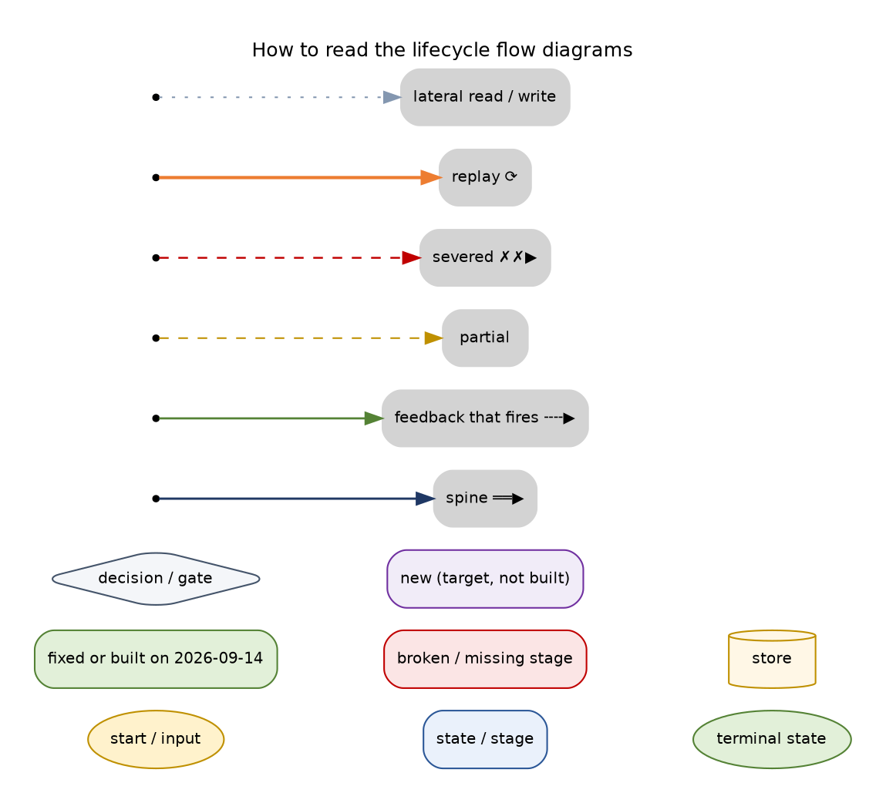
```dot
digraph legend_flows {
  graph [rankdir=LR, fontname="Helvetica", fontsize=12, label="How to read the lifecycle flow diagrams", labelloc=t, nodesep=0.2, ranksep=0.9, pad=0.3];
  node [style="rounded,filled", fontname="Helvetica", fontsize=9.5];
  edge [fontname="Helvetica", fontsize=9];
  s1 [label="start / input", shape=oval, fillcolor="#FFF2CC", color="#BF9000"]; s2 [label="state / stage", shape=box, fillcolor="#EAF1FB", color="#2B5797"];
  s3 [label="terminal state", shape=oval, fillcolor="#E2F0D9", color="#548235"]; s4 [label="fixed or built on 2026-09-14", shape=box, fillcolor="#E2F0D9", color="#548235"];
  s5 [label="broken / missing stage", shape=box, fillcolor="#FBE5E5", color="#C00000"]; s6 [label="store", shape=cylinder, fillcolor="#FFF7E6", color="#BF9000"];
  s7 [label="decision / gate", shape=diamond, fillcolor="#F4F6F9", color="#44546A"]; s8 [label="new (target, not built)", shape=box, fillcolor="#F1ECF8", color="#7030A0"];
  e1a [label="", shape=point]; e1b [label="spine ══▶", shape=plaintext];
  e2a [label="", shape=point]; e2b [label="feedback that fires ╌╌▶", shape=plaintext];
  e3a [label="", shape=point]; e3b [label="partial", shape=plaintext];
  e4a [label="", shape=point]; e4b [label="severed ✗✗▶", shape=plaintext];
  e5a [label="", shape=point]; e5b [label="replay ⟳", shape=plaintext];
  e6a [label="", shape=point]; e6b [label="lateral read / write", shape=plaintext];
  e1a -> e1b [color="#1F3864", penwidth=1.4]; e2a -> e2b [color="#548235", penwidth=1.3]; e3a -> e3b [color="#BF9000", style=dashed];
  e4a -> e4b [color="#C00000", style=dashed, penwidth=1.2]; e5a -> e5b [color="#ED7D31", style=bold]; e6a -> e6b [color="#8497B0", style=dotted];
  s1 -> s2 -> s3 [style=invis]; s4 -> s5 -> s6 [style=invis]; s7 -> s8 [style=invis];
}
```

### Maturity scale (per stage)

```
L0  exists              the stage exists in code or schema; not reached L1 at runtime
L1  runs + provenance   runs on schedule, stamps what ran; output not yet trusted
L2  grounded            reads real prior state about THIS subject; one writer; freshness contract
L3  judged / validated  output checked (model, critic, gate) and could be wrong
L4  loop closed         the outcome is scored and changes a later cycle's input
L5  unattended          holds without supervision, repairs within bounds, reports its own decay
```

A lifecycle is only as mature as its **terminal stage and its feedback edge**. A lifecycle
whose intake is L3 and whose closure is L0 is an L0 loop with a good front door.

---

## 1. Executive summary

### 1.1 Verdict

**Trade AI is 26 lifecycles that start reliably and rarely finish.** Intake, detection and
production stages run unattended at L1–L3 across every family. Terminal stages — settle,
close, resolve, expire, retire, restore, ratify — or the feedback edge after them is L0 in 22 of the 26 lifecycles. Of **57
feedback edges** measured (the edges by which one cycle's outcome is supposed to change the
next cycle's input), **11 fire, 10 fire partially or replay the same input, and 36 carry
nothing.** Only **four** of the eleven are machine loops that change a later cycle; the rest
are alerts, digests or a human in a session.

The platform therefore **iterates without learning**. It re-runs, re-raises, re-stamps and
re-asks — ADBE's 09-11 question replayed in 40 consecutive hourly wakes; a stale WMT verdict
re-stamped "actionable" 92 times; the same six corrupt prices refused every 30 minutes and
forgotten; 8,979 automatic repairs in 7 days with a 0.6 % success rate; the same reflection
proposal six nights running — while the stores that would record a closed loop stay empty:
0 of 420 commitments settled, 0 of 872 due-diligence questions closed, 0 of 97 research gaps
resolved, 0 gap-resolver receipts ever, 0 incidents, 0 of 7,847 alert events resolved.

### 1.2 The lifecycle scoreboard

| Family | Lifecycles | Best stage (typical) | Terminal stage | Feedback edges (fire / partial / none) | Headline |
|---|---|---|---|---|---|
| **A** Data & sources | 4 | collect L2 · decay view L3 · notify L4 | quarantine L0 · gap resolve L0 · key retire L0 | 2 / 2 / 6 | Corrupt closes in the store of record, detected every 30 min, never quarantined |
| **B** Questions & research | 4 | DDQ curation L2–L3 · desk evidence L2 | question close L0 · pending fulfil L0 | 2 / 1 / 6 | 0 of 872 questions closed; 26 Hermes jobs orphaned; SpaceX researched as BOOK |
| **C** Watchlist · proposals · learning | 4 | re-entry desk L2 · outcome scoring L1–L2 | job retry L0 · review close L0 · lesson evaluation L0 | 1 / 1 / 6 | 2.9 % of agent jobs complete; 84 % of proposals expire; lessons self-ratified, never scored |
| **D** CIO cognition | 5 | wake open/close L1 L5 · record-consult carry L2 | commitment settle L0 · promotion L0 · acceptance L0 | 1 / 3 / 8 | One subject, three judgments, replayed; nothing measured changed in four days |
| **E** Communications | 4 | inbound checkpoint L2 · gateway send L2 | settlement L1 (regressed) · ack/escalate L0 | 1 / 0 / 4 | 2.5 % of outbound gateway-owned; replies not ledgered; a new operator turn never reaches a wake |
| **F** Engineering · runtime · ops | 5 | local acceptance L3 · promote L3 · detect L4 | unit install L0 · incident close L0 · restore drill L0 | 4 / 3 / 6 | A deploy does not reach what runs; 0.6 % of repairs work; no restore ever tested |
| **Total** | **26** | | | **11 / 10 / 36** | |

### 1.3 The ten breaks that matter most, across all lifecycles

| # | Break | Lifecycle | Why it matters |
|---|---|---|---|
| 1 | **Corrupt prices live in `ticker_prices` and nothing quarantines them.** `portfolio_repricer` wrote NOC 120.25 (prior 518.78), RTX 97.89, SCHG 8.07, XLI 7.62, BND 55.07 on 09-11 (and the same defect on 09-04). The material-change detector refuses them every 30 min as uncorroborated and writes nothing back. | A1, A4 | Technicals, RSI, re-entry levels, detector baselines and the only three outcome-derived lessons (SCHD −22 %/−30 %) read poisoned closes |
| 2 | **Deploy does not reach runtime.** Promote restarts 2 of ~24 services, installs no units, does not advance the dev tree that runs ~411 cron lines. 15 merges ran stale for 8–40 h; 8 services run pre-promote code now (CIO bot one release behind; bridge and OAuth proxies predate all 28 releases). | F1 | Merged fixes do not execute; every "fixed" claim needs a runtime check |
| 3 | **The question → answer join is missing everywhere.** Desk pendings carry no plan/research id; DDQ answers are never written back (0/872); `changed_question` text is never persisted; Hermes completions notify nobody (0/553). | B1, B2, B3, D1 | Research is done and then lost; the operator is told "could not answer" 9 h after the answer existed |
| 4 | **The cognition loop replays instead of iterating.** The operator-turn branch never receipts its selecting research object, so ADBE is reselected and turn 115 replayed 40×; memory holds one fact for one subject; the critic has never disagreed; 190/190 governed falsifiers are boilerplate; the settlement sweep is unscheduled. | D1, D2 | L4 is unreachable by construction, not by lack of time |
| 5 | **Agent jobs are shed, not done.** 1,057 jobs in 7 d → 31 completed. Gate rejection is permanent; failed/deferred jobs never retry; the global LLM cap (not the per-process caps) refuses them while watch processes spent $0.035 all week. | C1, C4, F2 | Half the watch universe can never receive an agent opinion |
| 6 | **Findings never close.** 11+ detectors, 11 vocabularies, no shared finding id; `alert_incidents` 0 rows; 7,845 active alert events, 0 resolved; auto-remediation 8,979 attempts / 56 ok; circuits hand off to nobody; escalations expire unreviewed. | F4, E3 | Detection is L4; closure is L0 — the platform knows and does not act |
| 7 | **Delivery cannot be proven.** Gateway owns 2.5 % of outbound; the owner stamp regressed on 09-10 (193 SUPPRESSED rows read UNSETTLED forever); RESERVED never expires (156 of 232 are inbound stubs); CIO deliveries, desk replies and pending closes are outside the ledger. | E1, E2 | M4 consistency cannot be observed |
| 8 | **Spend control is policy, not control.** The $0.50 global cap was exceeded on 4 of 7 days; refusals are recorded in no table; `advisory_desk_opinion` took 87.6 % of 7-day spend; provider console $60.94 vs ledger $0.87. | F2, C4 | The budget starves the work it was meant to protect and still overspends |
| 9 | **Acceptance is structurally unreachable.** 33 epochs over 78 hourly slots, 0 accepted; 17 promotes on 09-13; L3 is refused 01–13Z, so the only long quiet windows cannot satisfy the L3 clause; power cuts drop slots with no backfill. | D5 | Maturity can never be *observed*, only claimed |
| 10 | **Recovery is untested and the host is fragile.** 0 restore drills; monthly verify FAIL suppressed into a digest; secrets never rotate and retired keys still render; 4 hard power cuts; inotify exhausted 20,723 times in 7 d; disk 84 %. | F5 | One more cut or a disk-full event can erase the only copy of learning state |

### 1.4 What iterates, and what changes between iterations

| Loop | Turns | What changes between turns | Verdict |
|---|---|---|---|
| Hourly wake (D1) | 3 wakes × 78 slots | For ADBE: the claim text alternates between 2 strings; the same turn 115, the same memory fact, the same judgment | ⟳ replay |
| Research-object consumption (D1/B2) | hourly | Each consumed object suppresses its own reselection | █ real feedback (RO path only) |
| Instrument-record defer (D4) | per dispatch | A disposition deferring research 45 h is honoured without replay | █ real feedback (skip effect) |
| Outcome scorer → calibration → agent prompt (C3) | weekly → every call | Calibration block text changes | █ fires, but reports implausible 95–100 % accuracy |
| DDQ usefulness → lane rank (B2) | per run | Lane order | █ narrow |
| Pending-synthesis sweep (C1) | every 15 min | WMT `updated_at` and `actionable` re-stamped on an 83-day-old verdict | ⟳ replay with integrity damage |
| Revalidation requeue (C2) | daily | CANF APPROVED_FOR_PAPER_TEST ↔ PENDING, 26 flips | ⟳ thrash |
| Corroboration refusal (A4) | every 30 min | Nothing — same 6 symbols refused and forgotten | ⟳ replay |
| Identity sweep (A3) | every 30 min | ~1,160–1,390 unresolved symbols per table re-read, ~0 stamped | ⟳ replay |
| Research target build (B2) | hourly | Same alphabetical head of the list (10 of 13 subjects start with "A") | ⟳ starvation |
| Health-agent remediation (F4) | ~5 min | 2,428 attempts on 09-13, 1 success | ⟳ replay |
| Situation detector (D4) | ~2 min | 8.8 re-raises per situation, never acknowledged | ⟳ replay |
| Nightly reflection (D3) | nightly | Same single proposal for ≥6 nights; cases scored are horizon expiries | ⟳ plateau |
| Epoch acceptance (D5) | per promote | Contiguity counter reset every ~1.4 h on 09-13 | ✗ never evaluated |

### 1.5 Update 2026-09-14 — which lifecycles the day's work moved

| Lifecycle | Stage that changed | Before (00:45) | After (live 341bce2c1) | PR |
|---|---|---|---|---|
| A1 Data point | write-time validity; drift control | repricer wrote position values as closes; Finviz read by position; no independent check | canonical mark with a 50 % refusal; header contracts and units; litmus vs Yahoo, view contracts, EOD consolidated closes on timers | #1008 |
| A2 Provider | liveness for Alpha Vantage; credential | AV health `unknown` since 05-09; Google token failing | AV reports through `.env` fallback; token refresh green | #1008, host |
| B1 Operator question | resolve · evidence · fulfil · send | dictated tickers unresolved; pending never joined to Hermes; long answers refused silently | spelled tickers bind; dossier with spelled-out pills; join-back by plan/research id; answers in parts; undelivered replies flagged | #1005–#1007, #1016, #1018 |
| B2/B3 Research | Hermes queue closure; bridge | 62 % failing; 32 lost; auto-fix exited 127; bridge wedged by held calls | lock + restore + replay + reap; health score reads the lane; bridge deadline, threads, `/health`, watchdog | #1014, #1019 |
| B2 System question | escalation design | no quality-based escalation | Research Escalation Circle phase 1 (dry run): question GUID, laps, analyzer, check-ins | #1012 |
| C4 / F2 Budget, LLM call | admission basis; attribution; timing | $0.50 nominal cap exceeded 4/7 days; projections 10–90× actual; 88 % under one shared id | caps count actual spend ($2.00/day); calibrated reservations; eight named callers; scheduled work only in the operator window; balance reconciliation | #1015, #1020, #1021 |
| E1 Outbound | formatting · routing · identity · GO alerts | duplicate briefs; raw Markdown; wrong chats; GO alerts suppressed; repeat alerts collided | Communications Editor (shadow); one 07:30 brief; routing map; GO alerts delivered; body-hash identity; rich layouts | #1009, #1011, #1013, #1018 |
| E4 Email / Drive | Google auth | token refresh failed | green | host |
| F1 Change | dev-tree fast-forward | manual; a deploy could report success with the dev tree behind | promote fast-forwards or exits non-zero (first live run 23:06) | #1025 |
| F3 Lane / service | declaration | 90 lanes; 531 baseline | 107 declared, 73 active, 0 undeclared; new timers declared | #1008–#1020 |
| F4 Finding | bounded repair | 0.6 % remediation success | Hermes queue heals itself; bridge watchdog restarts a wedged bridge (never a provider stall); escalation retries execute | #1014, #1019 |
| Governance | policy | AGENTS 1.2.0 PROPOSED | **1.2.0 ACTIVE** (Effective-Date 2026-09-14) | #1024 |

**Feedback edges (X1) after the day:** edge #18 Hermes completion → pending reply moves from None to
**Fires** (first delivery HPE 10:36); edge #45 promote → dev-tree FF moves from Partial (manual) to
**Fires** for the fast-forward (install/restart still manual); edge #46 finding → remediation → verify
gains two bounded, verified repair classes (Hermes queue, bridge); edge #53 reconcile residual becomes
Partial for DeepSeek; two new edges fire — **litmus BLOCK → price-source integrity** (daily) and **GO
criteria → operator alert**. Totals become **14 fire · 9 partial · 34 none of 59 edges** (see X1).
Nothing in families C and D (other than budget) was changed or re-measured.

---

## 2. The platform lifecycle, end to end

Every family below is one arc of a single platform loop. This diagram shows the whole loop
and marks, for each hand-off, whether it carries anything today.

```
                         ┌───────────────────────────── OPERATOR ─────────────────────────────┐
                         │  asks (B1)                    reads (E1)            decides (§17)   │
                         └────┬──────────────────────────────▲────────────────────────┬───────┘
                              │ E2 inbound                   │ E1 outbound              │ F1 change
                              ▼                              │ 2.5 % gateway-owned      ▼
 PROVIDERS ══A2══▶ COLLECTOR ══A1══▶ STORE OF RECORD ══A1══▶ PROJECTION (as_of·stale·gap) ══▶ hubs · desk · agents
   22 providers     health ledger ▓   one writer █            envelope █ (177 direct reads bypass)
   4 retired,       unseeded ✗        plausibility ✗          gap_hook ✗✗▶ resolver (0 receipts)
   keys live ✗                        quarantine ✗✗▶ (corrupt closes live)
        │                                    │
        │                                    ▼
        │                         IDENTITY A3: mention ══▶ subject_guid  (CONFIRMED 48 %, UNRESOLVED re-scanned ⟳)
        │                                    │
        │                                    ▼
        │                         MATERIAL CHANGE A4: detect ══▶ notify (p50 15 min █) ══▶ DDQ questions ▓
        │                                    │                 corroboration refusal ✗✗▶ quarantine
        │                                    ▼
        │            ┌────────── QUESTIONS B2 ───────────┐          ┌──── WATCH C1 ────┐
        │            │ targets (alphabetical ⟳)          │          │ intake → gate     │
        │            │ research objects (21 % consumed)  │          │ → agent job 2.9 % │
        │            │ DDQ ASKED/ROUTED (0 closed)       │          │ → synthesis ⟳WMT  │
        │            │ situations → plans (67 % cancel)  │          │ → proposal C2     │
        │            └───────────────┬───────────────────┘          │   84 % expire     │
        │                            ▼                              │   ⊘ APPROVAL      │
        │            HERMES B3: job → claim → synth → critique      │     BOUNDARY      │
        │              79 % fail · 26 orphaned · notify 0/553       └────────┬──────────┘
        │                            │                                       │
        │                            ▼                                       ▼
        │   ┌──────────────────── COGNITION D1 (hourly wake) ────────────────────────────┐
        │   │ select ══▶ load memory (1 subject) ══▶ decide ══▶ L3 judge (01–13Z refused) │
        │   │   ══▶ critique (0 disagree) ══▶ view ══▶ commitment (boilerplate falsifier) │
        │   │ carry-forward: receipts ╌╌▶ selector █ · turn 115 ⟳ · memory write ✗        │
        │   └─────────────────────────────────┬────────────────────────────────────────────┘
        │                                     ▼
        │   OUTCOME D2: commitment ✗✗▶ sweep (unscheduled) · checkpoint (due_at null 3,102) · 5 resolved / 886
        │                                     ▼
        │   LESSON D2/C3: 414 PROVISIONAL · 0 ratified by evidence · KB 1,610 auto-ratified, hit null ✗
        │                                     ▼
        │   MEMORY ✗✗▶ NEXT QUESTION  ─── the learning arc: nothing traverses it end to end today ───
        │
        └──── maintained by ENGINEERING F1–F5: change → CI → merge → promote (≠ runtime) → verify → findings (never close)
                                        LLM calls F2 (cap exceeded 4/7 d) · lanes F3 · host F5 (no UPS, no restore drill)
```

**Reading the loop.** The data arc (A) produces trustworthy-looking values with one hole
(plausibility). The question arc (B) raises many questions and joins almost no answers back.
The cognition arc (D) runs every hour and replays. The outcome arc (D2/C3) has no scheduled
settler. The communication arc (E) delivers but cannot prove it, and the operator's replies do
not re-enter cognition. The engineering arc (F) ships fast but does not reach runtime on its
own, and its detectors never close what they find.

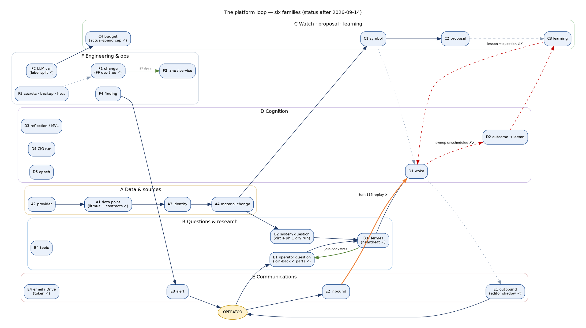
```dot-wide
digraph platform_loop {
  graph [rankdir=LR, fontname="Helvetica", fontsize=12, label="The platform loop — six families (status after 2026-09-14)", labelloc=t, nodesep=0.3, ranksep=0.55, pad=0.3, newrank=true];
  node [style="rounded,filled", fontname="Helvetica", fontsize=9, shape=box, color="#2B5797", fillcolor="#EAF1FB"];
  edge [fontname="Helvetica", fontsize=8];
  op [label="OPERATOR", shape=oval, fillcolor="#FFF2CC", color="#BF9000"];
  subgraph cluster_A { label="A Data & sources"; style=rounded; color="#E8D3A5"; a1 [label="A1 data point\n(litmus + contracts ✓)"]; a2 [label="A2 provider"]; a3 [label="A3 identity"]; a4 [label="A4 material change"]; }
  subgraph cluster_B { label="B Questions & research"; style=rounded; color="#9DC3E6"; b1 [label="B1 operator question\n(join-back ✓ parts ✓)"]; b2 [label="B2 system question\n(circle ph.1 dry run)"]; b3 [label="B3 Hermes\n(heartbeat ✓)"]; b4 [label="B4 topic"]; }
  subgraph cluster_C { label="C Watch · proposal · learning"; style=rounded; color="#B9D7B9"; c1 [label="C1 symbol"]; c2 [label="C2 proposal"]; c3 [label="C3 learning"]; c4 [label="C4 budget\n(actual-spend cap ✓)"]; }
  subgraph cluster_D { label="D Cognition"; style=rounded; color="#CDBFE3"; d1 [label="D1 wake"]; d2 [label="D2 outcome → lesson"]; d3 [label="D3 reflection / MVL"]; d4 [label="D4 CIO run"]; d5 [label="D5 epoch"]; }
  subgraph cluster_E { label="E Communications"; style=rounded; color="#E3BDBD"; e1 [label="E1 outbound\n(editor shadow ✓)"]; e2 [label="E2 inbound"]; e3 [label="E3 alert"]; e4 [label="E4 email / Drive\n(token ✓)"]; }
  subgraph cluster_F { label="F Engineering & ops"; style=rounded; color="#C9D3DF"; f1 [label="F1 change\n(FF dev tree ✓)"]; f2 [label="F2 LLM call\n(label split ✓)"]; f3 [label="F3 lane / service"]; f4 [label="F4 finding"]; f5 [label="F5 secrets · backup · host"]; }
  a2 -> a1 [color="#1F3864"]; a1 -> a3 [color="#1F3864"]; a3 -> a4 [color="#1F3864"]; a4 -> b2 [color="#1F3864"]; b2 -> b3 [color="#1F3864"];
  op -> b1 [color="#1F3864"]; b1 -> b3 [color="#1F3864"]; b3 -> b1 [label="join-back fires", color="#548235", penwidth=1.4];
  a4 -> c1 [color="#1F3864"]; c1 -> c2 [color="#1F3864"]; c2 -> c3 [color="#8497B0", style=dashed]; b3 -> d1 [color="#1F3864"]; c1 -> d1 [color="#8497B0", style=dotted];
  d1 -> d2 [color="#C00000", style=dashed, label="sweep unscheduled ✗✗"]; d2 -> c3 [color="#C00000", style=dashed]; c3 -> d1 [color="#C00000", style=dashed, label="lesson → question ✗✗"];
  d1 -> e1 [color="#8497B0", style=dotted]; e1 -> op [color="#1F3864"]; op -> e2 [color="#1F3864"]; e2 -> d1 [color="#ED7D31", style=bold, label="turn 115 replay ⟳"];
  f4 -> e3 [color="#1F3864"]; e3 -> op [color="#1F3864"]; f1 -> f3 [color="#548235", label="FF fires"]; f2 -> c4 [color="#1F3864"]; f5 -> f1 [color="#8497B0", style=dotted];
}
```

---

## 3. Lifecycle index

Closure is the share of things that reached a *terminal* state by the lifecycle's own
mechanism. "Stuck" means non-terminal for longer than twice the loop cadence.

| ID | Lifecycle | Spine (birth → end) | Terminal states reached today | Closure / throughput | Cycle time | Stuck > 2× cadence | Iteration pathology | Weakest stage |
|---|---|---|---|---|---|---|---|---|
| A1 | Market/reference data point | collect → report → write → validate → project → decay → gap → resolve → refresh | none for gaps; quarantine last 08-27 | research gaps 0/97; resolver receipts 0; registry 0 rows since 05-24 | registry (May) p50 9.97 h | 84 gaps OPEN_NO_ATTEMPT 504 h; corrupt closes 3 d | detector refusal ⟳ every 30 min | quarantine · resolve · refresh L0 |
| A2 | Data source (provider) | propose → grant → render → gate → active → degraded → retired → keys archived | retired in registry (4) | retirement reaches registry and code, not ledger/config/secrets | same-day grant; keys 1 d+ | 4 retired keys rendered; finnhub row erroring | none (no loop) | degraded→registry · key retire L0 |
| A3 | Identity (mention → subject_guid) | mention → tag → registry → stamp → role → upgrade/supersede | CONFIRMED (5,014 entities) | unresolved 5,373 frozen; 0 supersedes since 08-27 | ≤30 min for resolvable (INFERRED) | 27 inbound quarantined since 09-08 | re-scan ~1.3 k/table/run, ~0 stamped ⟳ | escalation L0 |
| A4 | Material change | detect → corroborate → persist → notify → question → feed → wake | notified 248; questioned 223 | notify p50 15 min; 2 aged out; latest DDQ 0 questions | detection lag p50 3–13 h, p90 69 h | PSQL, EIX outside 72 h window | refusal evidence dropped ⟳ | corroboration feedback L0 |
| B1 | Operator question (desk) | poll → tag → route → intent → evidence → gap → Hermes → defer → curate → send → persist → fulfil → recall | answered; pending expired 1 | 8/39 msgs with a reply turn; 1/8 sourced; pending fulfilled 0/1 | reply p50 6.2 s; pending closed at 9.38 h vs 2 h | 0 open now | fulfil re-checks house data only ⟳ | fulfil L0 · reply ledgering L0 |
| B2 | System-raised question | target → research object → consume → changed_question; DDQ ASKED → ROUTED; situation → plan → Hermes | ROUTED (sink); plan cancelled 1,308 | DDQ closed 0/872; RO consumed 21 %; plans accepted 3 | DDQ answer p50 2.7 h (never joined) | 317 DDQ ASKED up to 7 d | alphabetical targets ⟳; 39 % research on non-securities | answer→close L0 · question→target L0 |
| B3 | Hermes research | plan → job → claim → synth → critique → memory → notify; HRI staged → promoted → archived | completed 556; failed 653 | 7 d completion 15 %; thesis changed 0/27; notified 0/553 | queue p90 13 min; bridge p50 15 s | 26 queued orphans (oldest 08-31) | promotion 150+/day → 5/day | notify/join L0 · expiry L0 |
| B4 | Topic research | ingest → curate → route → worker / Hermes topic → RAG | curated approved 76.5 % | TOPIC jobs completed since 06-22: 0 | — | 1 RI queue row running since 08-01 | curation feedback stale 12 d | topic analysis L0 |
| C1 | Symbol / watchlist item | intake → enrich → enqueue → gate → agent → maturity → synthesis → safety → directive / re-entry / bridge → removal | removed (weekly); jobs completed | jobs 2.9 % complete (7 d); 7.1 % of new symbols get a result | add → first result p50 10.5 d, p90 33 d | 1,387 pending synthesis (768 > 14 d) | WMT re-stamped actionable 92× ⟳ | safety integrity L0 · retry L0 |
| C2 | Proposal (to approval boundary) | promoter → create → enrich/readiness → agent review → approval gate ⊘ | EXPIRED 84 %; REJECTED 12.5 % | approved 0.8 %; reviews pending 6,336 | create → approve p50 5 min | 11 AFPT unsubmitted up to 11 d | CANF 26 flips ⟳ | promoter L0 · review L0 effective |
| C3 | Review & learning | trade review → outcome scoring → calibration → lessons → return to prompts | lessons ratified (auto) / retired (auto) | KB hit null 1,520/1,520; 0 human ratifications | outcome 30/60/90 d | multi-tier reviewer dark since 08-30 | wire_advisory_lessons re-stamps 178 rows / 6 h ⟳ | lesson evaluation L0 |
| C4 | Agent-job budget admission | registry cap → global cap → reservation → call | settled | watch spend $0.035 / 7 d vs 650 cap refusals (all-time) | — | — | refused job retried into the same cap ⟳ | per-lane reservation L0 |
| D1 | Hourly persistent wake | select → claim → load → decide → judge → critique → view → commit → carry | SETTLED 230/234 | 3 distinct judgments; 1 grounded subject | slot → settled median 1.8 s | 0 wakes; 17 slots lost to power cuts | ADBE turn 115 ×40 ⟳ | next-slot carry L1 |
| D2 | Commitment → checkpoint → outcome → lesson | commit → freeze → due → sweep/resolve → observe → lesson → ratify | checkpoint RESOLVED 163; NOT_PRICE_RESOLVABLE 86 | commitments settled 0/420; resolve 5/886 (7 d); lessons ratified 0/414 | checkpoints: batch 08-31 | 3,102 checkpoints due_at null; 6 PENDING_DATA 18 d | resolver `due 0` every hour | settlement L0 · ratify L0 |
| D3 | Reflection & MVL agents | nightly reflection → proposal → promotion; Sentinel/Darwin; runtime dispatch; Iris curator | — | promotions 0; runtime dispatch 0; Iris pending 5,047 | nightly / weekday 09:15 | same proposal ≥6 nights | constant 3 agents reviewed daily ⟳ | promotion / ratify L0 |
| D4 | CIO run · wake jobs · defer · situations | event → wake job → consult → run (health → evidence → synthesis) → decision → defer revisit | COMPLETED 1,718; BLOCKED 579 | wake jobs expire 3.6× completions (7 d) | run p50 23.8 s | 87 DISPATCHED/IN_FLIGHT up to 8 d; 88 runs non-terminal up to 34 d | situation re-raise 8.8× ⟳; decisions constant 3,720/day | dispatch reaping L0 · defer L1 idle |
| D5 | Epoch acceptance | prepare → promote → slots accumulate → clauses → accepted / superseded | SUPERSEDED 32/33 | accepted 0 | mean 2.4 slots / epoch | — | contiguity reset per promote | acceptance evaluation L0 |
| E1 | Outbound message | produce → classify → dedupe → reserve → send → provider accept → settle → CC link → digest | SUPPRESSED 564; LEGACY_DELIVERED 176; SENT 32 | gateway SETTLED 19 (2.5 % of 7 d) | gateway send→settled p50 1.03 s | RESERVED 232, oldest 216 h | parse-mode 400 on every CIO send | settlement L1 (regressed) |
| E2 | Inbound operator reply | update → claim → normalize → tag → persist → receipt → checkpoint → wake intake → effect | checkpoint committed; agent turn written | intake ok; wake intake of new turns 0; receipts with wake_id 0/94 | — | 27 quarantined since 09-08 | turn 115 replay ⟳ | wake intake L0 · effect L0 |
| E3 | Platform-monitor alert | detect → fingerprint → alert/suppress → (ack) → (escalate) → clear | ALERTED; CLEARED ✅ | alert_events resolved 0/7,847 | — | persistent findings silent after first alert | set-equality dedupe: once, then silence | ack · escalate · remind L0 |
| E4 | Email / Drive publication | trigger → gog → Drive delete+create / Gmail send → log | synced; sent | Drive 162 runs, 1 failure (7 d); Gmail digest none since 09-11 | hourly | Google token refresh failing | file id changes on each sync (INFERRED) | Google auth L1 |
| F1 | Change (request → runtime) | request → worktree → code → gates → push → PR → CI → merge → prepare → promote → FF → install → restart → verify → record | MERGED+PROMOTED 39/42 | median open→merge 14.4 min | dev-tree lag p90 867 min, max 39.7 h | 8 services on old code; 7 units never installed | 23.5 % local gate failures (bookkeeping) | unit install · service restart L0 |
| F2 | LLM call | registry → admission → reservation → lane → call → validate → log → reconcile → cap change | settled 37,971; released 158 | refusals recorded 0; cap held 3/7 d | — | reserved > 1 h: 0 | job refused → retried into same cap ⟳ | refusal record L0 · reconcile loop open |
| F3 | Scheduled lane & service | propose → declare → install → evaluate → drift → pause/retire → baseline shrink | RETIRED 7; PAUSED 13 | SILENT 8 · ORPHANED 2 · UNVERIFIABLE 6; baseline 531 | evaluate every 30 min | cio-defer-revisit 625 h; cio-delivery 369 h | findings re-reported, not triaged | install L0 |
| F4 | Finding / incident | detect → alert → auto-remediate → triage → fix → verify → close | expired escalations 21; resolved hermes findings | incidents 0; remediation 56/8,979 ok | — | 13 escalations up to 17 d; 191 open validation findings from 06-02 | same 4 remediation types loop thousands of times ⟳ | close L0 |
| F5 | Secrets · backup · host | render → consume → rotate → retire; backup → off-site → verify → restore drill; power → boot → limits | rendered; backed up | rotations 0 (non-Schwab); restore drills 0 | render 4 h; backup daily | 4 retired keys; verify FAIL unrouted | inotify exhaustion daily | rotate · retire · restore L0 |

---

# FAMILY A — DATA AND SOURCE LIFECYCLES

Fact base: `lifecycles/LIFECYCLE_FACTBASE_A_DATA_2026-09-14.md`. Measured Sunday night: weekday
producers are expected to be quiet since Friday 09-11, and weekend staleness is called out
separately rather than counted as a break.

## A1 · The market / reference data point

### (a) Purpose, actors, stores

- **Purpose:** every value a hub, desk, agent or reply shows comes from one declared store,
  written by one module, carrying `as_of`, age and stale/gap state. When it is stale or
  missing, a budgeted chain of vectors goes and finds it.
- **Actors:**

| Stage | Actor | Trigger |
|---|---|---|
| Collect | ~30 cron producers (`external_market_data_ingest.py --quotes` `*/15 9-16` wkdy, `pro_analyst_fetch.py` 06:10, `news_ingestion.py` 00:30/12:30, `fred_data_ingest.py` 06:15, `sector_rs_daily.py` 17:20, regime 06:30/06:35/16:05) | cron, dev tree |
| Liveness | `scripts/lib/data_source_report.py::report_source` (in the producer process) | per run |
| Write | `scripts/lib/writers/*_writer.py` (one per store) | producer call |
| Validate | `data_plausibility_monitor.py --alert` (timer 06:20); `quarantine_price_spikes.py`, `quarantine_fabricated_analyst_ratings.py` (manual only) | timer / operator |
| Project | `scripts/lib/data_broker/*` (37 modules) → `BrokerReadEnvelope@v1` | page load / API |
| Decay | `data_source_health_view.effective_status`; `check_data_source_health.py --alert` (`*:27`) | hourly |
| Gap detect | envelope `gap.kind`; `gap_hook.enqueue_gap`; `cio_intelligence_fabric` → `research_gaps.jsonl`; desk `_register_gaps` → `data_gap_registry`; `check_gap_resolution.py --alert` (`*:07,37`) | projection / 15-min scan / desk / timer |
| Resolve | `gap_resolver.resolve` (desk only); `data_gap_resolver.py` cron `0 10-16 * * 1-5`, 18:00 pre-overnight, Sun 08:00 weekly audit | desk / cron |
| Consume | 30+ Command Center hubs (177 direct store reads remain), Telegram desk, agents | reads |

- **Stores:** 20 DB tables + 6 files across 26 authority domains; persistent state under
  `trade-ai-releases/persistent-state/data` (both trees symlink `data/cio`, `data/runtime`).

### (b) State machines (exact values)

| Machine | States (value → meaning) | Terminal | Counts now |
|---|---|---|---|
| Provider health row `data_source_health.status` | `unknown` (default) · `healthy` (`report_source ok`) · `error` (+`degraded`, `failure_count+1`); read-side **effective** `healthy/error/unknown` with decay on a weekday clock and closed-market window | none — a retired provider's row is never retired | healthy 10 · error 4 (finnhub, polygon, research_discovery, youtube_api) · unknown 4; effective off 4 of 18 |
| Envelope | `stale` false/true · `gap.kind` absent / `no_producer` / `no_coverage` · `declared_behaviour` from the registry | — | live: `agent_opinion` stale false 28.4 h; `agent_debate_log` stale true, 3,161 h, `no_producer` |
| Plausibility result | `OK` · `VIOLATION` (`BLOCK`/`WARN`) · `COLUMN_ABSENT` · `CHECK_FAILED` | no transition to quarantine ("never writes to the tables it checks") | manual run 09-13: 7 of 11 BLOCK columns violated |
| Price quarantine | `CANDIDATE` → `CONTRADICTED` → archived to `ticker_prices_quarantine` + deleted | quarantined | 92 rows, all 08-27 12:49; none since |
| Gap — projection queue (`gap_queue.jsonl`) | `enqueued` → `attempted` / `OPEN_NO_ATTEMPT` | — | **file absent; 0 callers** |
| Gap — resolver attempt | per vector `answered` · `partial` · `queued` · `no_answer` · `budget_denied` · `retired_skipped` · `error`; resolution `answered/partial/queued/no_coverage` | answered / no_coverage | **0 receipts ever**; `GAP_RESOLVER_LIVE` set nowhere |
| Gap — research gap (`research_gaps.jsonl`) | `OPEN` · `FREE_FIRST_PENDING` · `RESOLVED_FREE` · `LLM_ELIGIBLE_NOT_AUTHORIZED` · `RESOLVED_LLM` · `NO_LONGER_RELEVANT` | RESOLVED_*, NO_LONGER_RELEVANT | OPEN 85 · LLM_ELIGIBLE_NOT_AUTHORIZED 12 · **resolved 0** |
| Gap — DB registry (`data_gap_registry`) | `open` → `enriching` → `resolved` (only on verified job result since 09-13) · `enriching → open` (reopen) · `open → abandoned` (>7 d) | resolved, abandoned | resolved 73 (all May, pre-fix "resolved when queued"); **0 rows since 05-24, including after the #998 reconnect** |

### (c) End-to-end flow

```
 PROVIDER ──cron──▶ COLLECTOR ── report_source ──▶ data_source_health (UPDATE-only; alpaca/schwab/yfinance/searxng: no row ✗)
                        │                                   └─ hourly decay view ──▶ check_data_source_health ──▶ Telegram on change █
                        ▼
                 WRITER (1 per store, gate findings 0 █; no value validation ✗)
                        ▼
                 STORE OF RECORD ◀── DELETE+archive ── quarantine_price_spikes ✗✗ (unscheduled; last 08-27)
                        ├── 06:20 plausibility monitor (timer never fired ✗; 12 contracts, 1/26 domains) ✗✗▶ quarantine
                        ├── material-change corroboration: "uncorroborated NOC/RTX/SCHG/XLI/BND/SCHD" every 30 min ✗✗▶ quarantine
                        ▼
                 PROJECTION (envelope as_of·age·stale·gap) ── gap_hook.enqueue_gap ✗✗▶ gap_queue (0 callers)
                        ▼
                 CONSUMERS (hubs · desk · agents · material scan)
                        ├── desk blocking gap ──▶ gap_resolver.resolve ✗✗ (0 receipts) ──▶ data_gap_registry ✗✗ (0 rows)
                        └── cio_material_scan ──▶ research_gaps OPEN 85 ── free-first ✗ (SEARXNG evidence not accepted)
                 check_gap_resolution (:07/:37) ──▶ OPEN_NO_ATTEMPT 84 ──▶ alert once, then "unchanged" ✗
                 data_gap_resolver cron ──▶ "Found 0 open gaps" (idles on an empty store)
                 REFRESH ╌╌▶ back to COLLECTOR only by cron cadence — no gap has ever re-run a producer
```

### (d) Iterations

| Loop | Cadence | Closes? | What changes between cycles |
|---|---|---|---|
| Collector → store | 15 min – weekly | yes, for 20 of 26 domains | new rows (market_quotes ~1.1–1.3 M/weekday) |
| Health report → decay → alert | per run → hourly | partial | alert only on a changed fingerprint (unchanged since 21:27); finnhub failing for 49 days |
| Plausibility → quarantine | daily | **no** | nothing — timer never fired, no link |
| Corroboration refusal → quarantine | 30 min | **no** | nothing — identical 6 symbols every run ⟳ |
| Envelope stale → resolver → refresh | page load | **no** | nothing — zero callers |
| Desk gap → resolver → answer / operator_ask | per message | **no evidence** | 0 receipts |
| Research gap → free-first → resolved | 15 min | **no** | re-raised `all_stale` by the scan that cannot fix it ⟳ |
| Registry → resolver → verify → resolved | hourly weekdays | idle | empty store |
| Weekly audit → abandon stale | Sun 08:00 | runs | nothing to abandon |

### (e) Questions

| Stage | Question | Raised by | Answered by | Dropped where |
|---|---|---|---|---|
| Collect | "Did this source succeed?" | producer | `report_source` | unseeded providers (UPDATE hits 0 rows silently); missing DB env (exception swallowed, `data_source_report.py:65-70`) |
| Health | "Is this source fresh?" | hourly audit | decay view | retired providers still asked; deleted `cron_freshness_watcher.py` still "runs" every 5 min |
| Write | "Is this value plausible?" | **nobody at write time** | — | **dropped at write** |
| Validate | "Is this jump a split or corruption?" | `quarantine_price_spikes.py` | operator | not scheduled; the detector answers it every 30 min and discards the answer |
| Project | "How old is this?" | envelope | registry window | 177 hub direct reads never ask |
| Gap | "Can a cheaper vector answer this?" / "Do you have a source?" (`operator_ask`) | resolver | chain / operator | never asked (0 receipts) |
| Research gap | "Is material evidence missing for X?" | fabric | free-first | asked, never closed; 12 wait on a paid grant with no request path |

### (f) Live measurements

- Throughput (rows/day, 09-07..09-11 weekdays): market_quotes 1.14–1.31 M · ticker_prices 4.9–8.6 k · news_articles 1.1–1.7 k (6,275 on Sun 09-13) · hermes_research_intelligence 147–239.
- **Off-schedule writes (INFERRED undeclared writer):** 13,707 market_quotes and 954 symbol_profiles rows between 00:00 and 00:25 Monday, outside every declared cadence.
- Coverage: health row for the primary provider of 7/26 domains · plausibility contract 1/26 · envelope 20/26 · on_gap chain 25/26 · **gap loop closed 0/26**.
- Cycle times: registry (May) detected → resolved p50 9.97 h, p90 32.3 h; research gaps unmeasurable (no terminal row; oldest 504.6 h).
- Stuck: 84 research gaps OPEN (17× the audit cadence); 12 LLM_ELIGIBLE_NOT_AUTHORIZED; dead feeds `watch_candidate_events` 07-16, `agent_debate_log` 05-05, `ai_reports` 08-02; corrupt 09-11 closes unquarantined for 3 days.
- Rates: health off 22 %; plausibility BLOCK violated 64 %; corroboration refusals 6/187 per run (3 %), identical every run; gap closure 0/97.

### (g) Failure paths

1. **Store-of-record corruption through the single writer.** One writer is true; the writer does not check values. `portfolio_repricer` wrote 4 impossible closes (plus BND −23 %) on 09-11 and 6 on 09-04. INFERRED impact: detector baselines for those symbols stay inflated for the 90-day window.
2. **The health ledger lies by omission.** UPDATE-only reporting plus unseeded keys: `alpaca`, the primary for quotes and technicals, has no row.
3. **Gap machinery shipped but never armed** — no hook caller, no drain lane, no `GAP_RESOLVER_LIVE`.
4. **Research gaps cannot close on SearXNG evidence** (`cio_intelligence_fabric.py:1117`).
5. **The plausibility timer is enabled but has never triggered** (next 06:21 today).
6. **Liveness hooks for fred / yahoo_finance / alpha_vantage merged 09-13 16:34**, after that day's runs: `unknown` there means "not yet run"; first proof 09-14 06:10–08:00.
7. **Dead monitor still scheduled:** `cron_freshness_watcher.py` (file deleted) every 5 min.

### Update 2026-09-14 — A1 after PR #1008

- **Write path:** `close_price_for_holding` uses the canonical mark, else value ÷ shares, and refuses a
  close more than 50 % from the latest live quote (dry run corrected NOC 123.2 → 531.26, XLI 7.49 → 169.36,
  SCHG 8.05 → 35.10; SRNE refused). Alpaca `prev_close` uses `dailyBar.c` when the bar predates today ET.
- **Contracts:** Finviz exports read with `csv.DictReader` against a required-header contract per saved
  view (drift raises), with explicit units (market cap in millions, average volume in thousands);
  five consumers made unit-aware.
- **Drift controls (timers):** `source_litmus_vs_yahoo.py` Tue–Sat 07:45 BLOCKs a source when more than 2 %
  of its closes are off by more than 10 % (session 09-11: finviz 37/40 within 1 %; market_quotes 88/118 with
  6 > 10 % → BLOCK; repricer 20/20; 558 weekend-dated closes warned); `check_finviz_view_contracts.py`
  Mon–Fri 06:05; `eod_consolidated_close_sync.py` Mon–Fri 17:15 replaces IEX-derived closes more than 1 %
  off Yahoo's consolidated close (09-11 dry run: 743 of 4,601 to replace, 14 held back > 50 %).
- **Still open:** the corrupt 09-04/09-11 rows are not quarantined (operator-approved); gap resolver not
  armed; `enqueue_gap` still has no caller.
- **Maturity change:** plausibility L1 → **L3** for prices and Finviz units (checked against an
  independent source and refused at write); quarantine, gap resolve and refresh stay **L0**.

### (h) Maturity per stage

| Collect | Liveness | Decay view | Single writer | Plausibility | Quarantine | Projection | Gap detect | Gap resolve | Refresh |
|---|---|---|---|---|---|---|---|---|---|
| L2 | L1 | L3 | L2 | L1 | **L0** | L3 | L2 | **L0** | **L0** |

### (i) Target and exit

**Target:** write-time plausibility → refusal/quarantine → gap → free-first resolver with receipts → producer refresh → verified envelope.
**Exit (observed):** `ticker_prices_quarantine` row within 24 h of a detector refusal and the refusal list empty next run · `gap_resolution_receipts.jsonl` exists with ≥1 `answered` · `research_gaps` RESOLVED_FREE > 0 · `data_source_health` row count ≥ active providers with alpaca/schwab/yfinance `healthy` on a weekday · plausibility `LastTriggerUSec` non-empty · hub `DIRECT_READ` baseline 177 → 0.

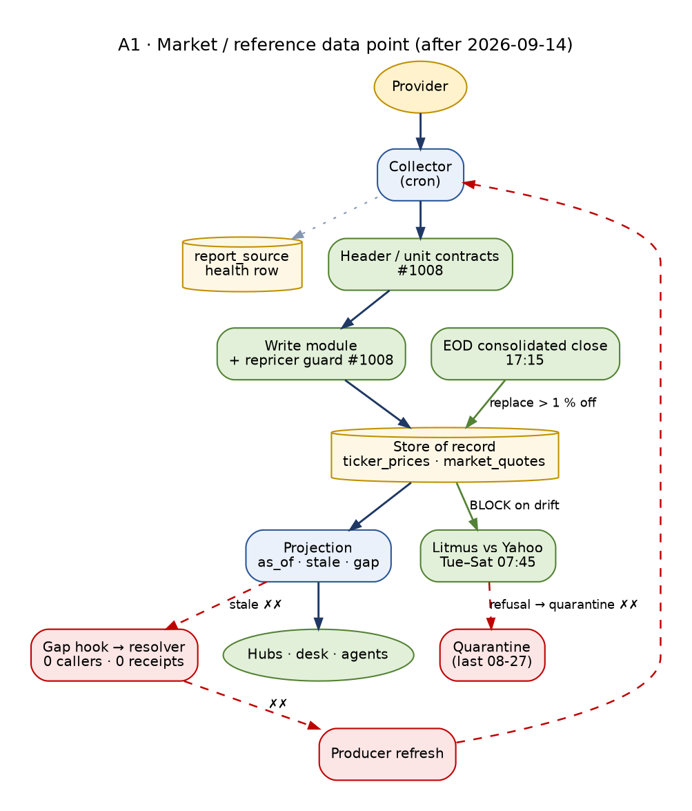
```dot
digraph lc_a1 {
  graph [rankdir=TB, fontname="Helvetica", fontsize=12, label="A1 · Market / reference data point (after 2026-09-14)", labelloc=t, nodesep=0.25, ranksep=0.32, pad=0.3];
  node [style="rounded,filled", fontname="Helvetica", fontsize=9.5];
  edge [fontname="Helvetica", fontsize=8.5, arrowsize=0.7];
  prov [label="Provider", shape=oval, fillcolor="#FFF2CC", color="#BF9000"];
  coll [label="Collector\n(cron)", shape=box, fillcolor="#EAF1FB", color="#2B5797"];
  health [label="report_source\nhealth row", shape=cylinder, fillcolor="#FFF7E6", color="#BF9000"];
  contract [label="Header / unit contracts\n#1008", shape=box, fillcolor="#E2F0D9", color="#548235"];
  writer [label="Write module\n+ repricer guard #1008", shape=box, fillcolor="#E2F0D9", color="#548235"];
  store [label="Store of record\nticker_prices · market_quotes", shape=cylinder, fillcolor="#FFF7E6", color="#BF9000"];
  litmus [label="Litmus vs Yahoo\nTue–Sat 07:45", shape=box, fillcolor="#E2F0D9", color="#548235"];
  eod [label="EOD consolidated close\n17:15", shape=box, fillcolor="#E2F0D9", color="#548235"];
  proj [label="Projection\nas_of · stale · gap", shape=box, fillcolor="#EAF1FB", color="#2B5797"];
  cons [label="Hubs · desk · agents", shape=oval, fillcolor="#E2F0D9", color="#548235"];
  quar [label="Quarantine\n(last 08-27)", shape=box, fillcolor="#FBE5E5", color="#C00000"];
  gap [label="Gap hook → resolver\n0 callers · 0 receipts", shape=box, fillcolor="#FBE5E5", color="#C00000"];
  refresh [label="Producer refresh", shape=box, fillcolor="#FBE5E5", color="#C00000"];
  prov -> coll [color="#1F3864", penwidth=1.4];
  coll -> contract [color="#1F3864", penwidth=1.4];
  contract -> writer [color="#1F3864", penwidth=1.4];
  writer -> store [color="#1F3864", penwidth=1.4];
  store -> proj [color="#1F3864", penwidth=1.4];
  proj -> cons [color="#1F3864", penwidth=1.4];
  coll -> health [color="#8497B0", style=dotted];
  store -> litmus [label="BLOCK on drift", color="#548235", penwidth=1.3];
  eod -> store [label="replace > 1 % off", color="#548235", penwidth=1.3];
  litmus -> quar [label="refusal → quarantine ✗✗", color="#C00000", style=dashed, penwidth=1.2];
  proj -> gap [label="stale ✗✗", color="#C00000", style=dashed, penwidth=1.2];
  gap -> refresh [label="✗✗", color="#C00000", style=dashed, penwidth=1.2];
  refresh -> coll [color="#C00000", style=dashed, penwidth=1.2];
}
```

---

## A2 · A data source (provider)

### (a) Purpose, actors, stores

- **Purpose:** a provider may be called only after the operator grants it, and must stop being called — and stop being keyed — when retired.
- **Actors:** agent (proposes a registry row in a PR) · operator (grants / retires) · `render_source_of_truth.py` (renders AGENTS §7A and `docs/SOURCE_OF_TRUTH.md`) · `check_data_source_authority.py` (CI/acceptance gate) · `retired_providers.py` (runtime refusal) · `check_data_source_health.py` · `tradeai-sm-render.service` (Bitwarden SM → tmpfs env).
- **Stores:** `config/data_source_authority.json`, `..._baseline.json`, `archive/ARCHIVE_MANIFEST.json`, `data_source_health`, `/run/user/1000/tradeai/env` + manifest, Bitwarden SM.

### (b) State machine — `providers[].status`

| State | Value | Enter by | Count now |
|---|---|---|---|
| proposed | (a PR diff, not a value) | agent PR | 0 open |
| active | `active` · `active_metered` · `active_paid` | operator `approval{approved_by, approved_on, reference, scope}` | 13 + deepseek + brave |
| configured_unused | `configured_unused` | operator | tavily |
| degraded | registry `service_down`; ledger `error/unknown` | registry edit / decay | moomoo `service_down` **while live OpenD answers ok** |
| manual | `no_api_manual` | operator | fidelity |
| retired | `retired` + `approval{retired_by, retired_on, reference}` | operator | finnhub, polygon, fmp, newsapi (09-13) |
| archived code | `ARCHIVE_MANIFEST.json` item | retirement PR | present; **no key/secret field** |
| archived keys | **no such state exists** | — | 4 retired keys still rendered |

Gate checks: `RETIRED_CALL_SITE` · `UNDECLARED_PROVIDER` · `UNAPPROVED_SOURCE` · `WRITER_MISSING` · `WRITER_UNDECLARED` · `PROJECTION_MISSING` · `WRITER_COUNT_ROSE` · `DIRECT_READ_ROSE`. Now: `domains=26 providers=22 findings=0`.

### (c) Flow

```
 agent PR ──▶ operator grant ──▶ render_source_of_truth ──▶ AGENTS §7A / SOURCE_OF_TRUTH.md (never hand-edited) █
     ▼
 check_data_source_authority (CI) ── scans scripts/ only ✗✗▶ config/*.json|yaml (fmp/finnhub/polygon still named there)
     ▼
 ACTIVE ──▶ call sites ──report_source──▶ health ledger ──decay──▶ hourly audit ──alert╌╌▶ operator
     │ failure/decay ──▶ DEGRADED ✗✗▶ registry status never updated from the ledger (moomoo drift)
     ▼ operator decision
 RETIRED ──▶ retired_providers refuses in chains █ ──▶ code archived █
         ✗✗▶ health row not retired (finnhub error, 9,554 failures, last 09-13 16:03)
         ✗✗▶ SM keys not removed → FINNHUB/FMP/NEWSAPI/POLYGON rendered into tmpfs
```

### (d) Iterations · (e) Questions

| Loop / question | Closes? | Dropped |
|---|---|---|
| CI gate on every PR — "is this call site declared and granted?" | **yes** (build time) | config files not scanned |
| Runtime health → registry status — "is this provider actually up?" | **no** (status typed by hand) | unseeded providers never asked; moomoo drift persists |
| Retirement → secret removal — "should this key still exist?" | **no** | **nobody asks** |
| "Is this provider retired?" (chains at runtime) | yes (`retired_skipped`) | ledger and secrets never asked |

### (f) Measurements

Providers 22: active 13 · metered 1 · paid 1 · configured_unused 1 · service_down 1 · manual 1 · retired 4. Registry history: 12 commits, all 09-13. Retirement 09-13: proposal → grant → archive same day; ledger row and keys still live 1 day+. Retired names in `config/`: ≥3 (`agent_discovery_config.json:43`, `agents_data_sources.yaml:9,39`). Health rows for retired providers: 4 (2 still counted in the audit's checked total).

### (g) Failure paths

1. **Retired secrets remain live** in SM and tmpfs — highest consequence given the public repository and the standing note that keys exist in git history (INFERRED risk).
2. Registry status and runtime status disagree (moomoo) with no reconciler.
3. The gate's scan scope excludes config files.
4. A finnhub failure at 09-13 16:03 postdates the retirement commit; the caller was not identified (BLOCKED; INFERRED pre-promote call site).

### (h) Maturity

Proposal + grant **L3** · registry/rendering **L3** · gate **L3** (build time) · active health L1–L2 · degraded → registry **L0** · retirement (code) L2 · retirement (ledger, config, secrets) **L0**.

### (i) Target and exit

**Target:** retirement is one gated checklist — registry, code, config, health row, SM secret, manifest `keys_removed[]`; registry status reconciled from live health.
**Exit:** env manifest has no `FINNHUB_API_KEY / FMP_API_KEY / NEWSAPI_KEY / POLYGON_API_KEY`; no retired provider in `error/unknown`; gate fires `RETIRED_CALL_SITE` on config until fixed; moomoo registry status equals the live probe.

**Update 2026-09-14:** Alpha Vantage liveness fixed — cron lanes that call `report_source` now fall back
to `.env` for DB settings instead of silently swallowing the connection error (#1008); the Google
credential behind Drive tooling was re-authenticated by the operator (token refresh green). Retired
keys, config scan scope and moomoo drift are unchanged.

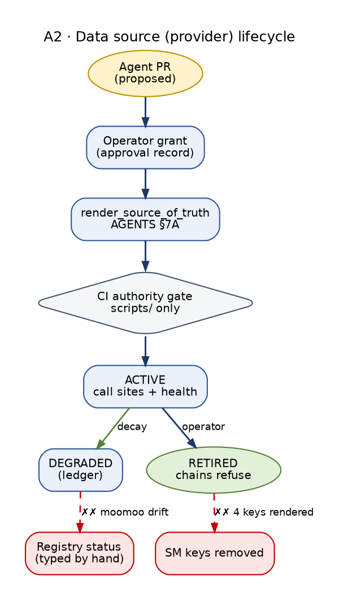
```dot
digraph lc_a2 {
  graph [rankdir=TB, fontname="Helvetica", fontsize=12, label="A2 · Data source (provider) lifecycle", labelloc=t, nodesep=0.25, ranksep=0.32, pad=0.3];
  node [style="rounded,filled", fontname="Helvetica", fontsize=9.5];
  edge [fontname="Helvetica", fontsize=8.5, arrowsize=0.7];
  pr [label="Agent PR\n(proposed)", shape=oval, fillcolor="#FFF2CC", color="#BF9000"];
  grant [label="Operator grant\n(approval record)", shape=box, fillcolor="#EAF1FB", color="#2B5797"];
  render [label="render_source_of_truth\nAGENTS §7A", shape=box, fillcolor="#EAF1FB", color="#2B5797"];
  gate [label="CI authority gate\nscripts/ only", shape=diamond, fillcolor="#F4F6F9", color="#44546A"];
  active [label="ACTIVE\ncall sites + health", shape=box, fillcolor="#EAF1FB", color="#2B5797"];
  degraded [label="DEGRADED\n(ledger)", shape=box, fillcolor="#EAF1FB", color="#2B5797"];
  regstat [label="Registry status\n(typed by hand)", shape=box, fillcolor="#FBE5E5", color="#C00000"];
  retired [label="RETIRED\nchains refuse", shape=oval, fillcolor="#E2F0D9", color="#548235"];
  keys [label="SM keys removed", shape=box, fillcolor="#FBE5E5", color="#C00000"];
  pr -> grant [color="#1F3864", penwidth=1.4];
  grant -> render [color="#1F3864", penwidth=1.4];
  render -> gate [color="#1F3864", penwidth=1.4];
  gate -> active [color="#1F3864", penwidth=1.4];
  active -> degraded [label="decay", color="#548235", penwidth=1.3];
  degraded -> regstat [label="✗✗ moomoo drift", color="#C00000", style=dashed, penwidth=1.2];
  active -> retired [label="operator", color="#1F3864", penwidth=1.4];
  retired -> keys [label="✗✗ 4 keys rendered", color="#C00000", style=dashed, penwidth=1.2];
}
```

---

## A3 · Identity (mention → subject_guid)

### (a) Purpose, actors, stores

- **Purpose:** every document, question and change that names a company resolves to one durable `subject_guid`, so "everything we know about X" joins across the corpus; upgrades keep history traversable.
- **Actors:** `inbound_identity_tagger.py` (Telegram turns; regex + registry, no model) · `backfill_subject_identity.py --all --apply` (`*/30`, 5 corpus tables) · `backfill_document_mentions.py` (`25 *`) · `prune_document_mentions.py` (04:40) · `mint_identity_registry.py` (05:50 wkdy) · `sweep_schwab_instruments.py` (CUSIP evidence, one-shot 08-27) · `identity_resolution_advisor.py` (opt-in) · `cio_narrative_subjects.py`.
- **Stores:** `persistent-state/data/runtime/identity_registry.json` (IdentityRegistry@v1, 9.5 MB); identity columns on `catalyst_events`, `hermes_external_research`, `research_insights`, `news_articles`, `hermes_research_intelligence`; `document_mentions`; `operator_conversation_turns`; `narrative_subjects`; `communication_inbound_quarantine`.

### (b) State machines

| Machine | States | Rules | Counts |
|---|---|---|---|
| Entity | rank `CONFIRMED`=3 > `CANDIDATE`=2 > `UNRESOLVED_WITH_REASON`=1 | `register()` only upgrades; a rank increase with a new guid sets `superseded_by` and deactivates the prior; CONFIRMED requires CUSIP/ISIN/FIGI | 10,409: UNRESOLVED 5,373 (51.6 %) · CONFIRMED 5,014 · CANDIDATE 22; superseded 5,002 — **all on 08-27** |
| Corpus row | NULL → `CONFIRMED` / `CANDIDATE` / `UNRESOLVED_WITH_REASON` / `UNRESOLVABLE` | UPDATE only where `subject_guid IS NULL AND status <> CONFIRMED`; registry unreadable stops the run | CONFIRMED share: catalyst 83 % · hermes_ext 94 % · research_insights 53 % · news 78 % · HRI 51 % |
| Mention | role `subject/mentioned/unresolved`; `role_source` `deterministic/model/operator` | multi-mention docs undecided are not written | 214 k+ rows; `role_source` model 0, operator 0 |
| Reply-inferred identity | always `CANDIDATE` | even when the parent is CONFIRMED | — |

### (c) Flow

```
 Telegram message ──▶ tagger (cashtag/bare regex, stopwords; ticker aliases only — no company-name index ✗)
      ├──▶ operator_conversation_turns (211; 70 identity NULL)     persist failure ──▶ quarantine (27 since 09-08) ✗✗▶ replay
 corpus writers ──▶ rows with symbol, subject_guid NULL
      ├─ */30 backfill ──▶ registry lookup ── resolved → stamp █ / unresolved → re-read next run ⟳ (≈1.2–1.4 k/table, ≈0 stamped)
      ├─ :25 mentions ──▶ subject/mentioned/unresolved ── multi-mention undecided (1.4–2.2 k/run) ✗✗▶ model/operator decider
      └─ 04:40 prune orphans (last run 5,465)
 05:50 mint ──▶ registry (+27, +8 entities) ── CANDIDATE→CONFIRMED needs CUSIP ✗✗▶ no recurring instrument sweep since 08-27
 subject_guid ──▶ material_changes · research_objects · wake selection · desk memory recall
```

### (d) Iterations

| Loop | Cadence | Closes? | What changes |
|---|---|---|---|
| Row sweep | 30 min (301 runs logged) | CONFIRMED rows close; unresolved never | latest run resolved 0–3; unresolved 1,164 / 185 / 34 / 1,276 / 1,392 re-read ⟳ |
| Registry mint | weekdays | adds entities | status mix frozen since 08-27 |
| CANDIDATE → CONFIRMED | none scheduled | **no** | 22 CANDIDATE unchanged |
| Mention role decision | hourly | **no** (multi-mention) | — |
| Inbound quarantine → replay | none | **no** | 27 stuck |

### (e) Questions

| Question | Answered by | Dropped where |
|---|---|---|
| "Which ticker is this?" (inbound) | registry alias | company names ("Visa") → `unresolved_mentions`, no follow-up job |
| "Which company was the operator replying about?" | parent turn | CANDIDATE, never promoted |
| "Which company is this row about?" (corpus) | registry | UNRESOLVED re-asked every 30 min, never escalated |
| "Is X the subject or just mentioned?" | deterministic rule | multi-mention undecided; no model/operator answer |
| "Is this the same issuer (CUSIP)?" | Schwab instruments / e-confirm | no recurring sweep |

### (f) Measurements

Corpus tagged in 7 d: catalyst 3,134 · hermes_ext 1,246 · research_insights 4,237 · news 16,302 · HRI 1,237. Mentions CONFIRMED subjects: hermes_ext 47,370 · news 21,842 · research_insights 10,356 · catalyst 9,713 · sec_form4 3,632. Operator turns: CONFIRMED 119, NULL 69. Narrative subjects: CONFIRMED security 814, theme 192. Mention → CONFIRMED cycle time: BLOCKED.

### (g) Failure paths

1. No company-name index: natural-language questions stay unresolved. 2. Unresolved re-scan burns cycles with no escalation. 3. The CUSIP upgrade path is not recurring, so CANDIDATE and UNRESOLVED are frozen. 4. Multi-mention role undecided for ~35–55 % of new docs per run. 5. 27 inbound messages quarantined with no replay — lost to identity and memory. 6. 69 operator turns with NULL status (tag not computed). 7. **Downstream consequence (B2):** tagger false subjects `ABOVE` and `AGAIN` pass into the research budget.

### (h) Maturity

Tagging **L3** · registry resolution L2 · supersede chain L2 · mention roles L1 · escalation of unresolved **L0** · inbound quarantine L1.

### (i) Target and exit

**Target:** recurring CUSIP sweep; sweep back-off with `last_attempted_at` and top-N escalation; deterministic name index; labelled model role decider; quarantine replay.
**Exit:** CONFIRMED count and `superseded_at` max advance past 08-27 · unresolved per run falls · a "Visa" turn stamps a CANDIDATE issuer · `role_source=model` > 0 · 27 quarantine rows `resolved=true`.

**Update 2026-09-14:** unchanged in the identity spine. On the desk side, dictated tickers (`a x t i`,
`A.X.T.I`) now resolve when the book or registry holds them (#1005) — a resolver change, not a tagger
change; tagger precision on agent-authored text is still open.

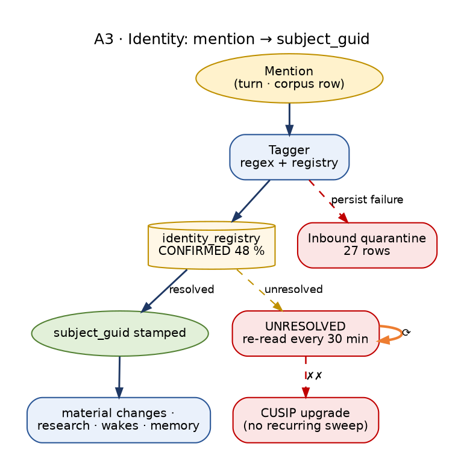
```dot
digraph lc_a3 {
  graph [rankdir=TB, fontname="Helvetica", fontsize=12, label="A3 · Identity: mention → subject_guid", labelloc=t, nodesep=0.25, ranksep=0.32, pad=0.3];
  node [style="rounded,filled", fontname="Helvetica", fontsize=9.5];
  edge [fontname="Helvetica", fontsize=8.5, arrowsize=0.7];
  msg [label="Mention\n(turn · corpus row)", shape=oval, fillcolor="#FFF2CC", color="#BF9000"];
  tag [label="Tagger\nregex + registry", shape=box, fillcolor="#EAF1FB", color="#2B5797"];
  reg [label="identity_registry\nCONFIRMED 48 %", shape=cylinder, fillcolor="#FFF7E6", color="#BF9000"];
  stamp [label="subject_guid stamped", shape=oval, fillcolor="#E2F0D9", color="#548235"];
  unres [label="UNRESOLVED\nre-read every 30 min", shape=box, fillcolor="#FBE5E5", color="#C00000"];
  cusip [label="CUSIP upgrade\n(no recurring sweep)", shape=box, fillcolor="#FBE5E5", color="#C00000"];
  quar [label="Inbound quarantine\n27 rows", shape=box, fillcolor="#FBE5E5", color="#C00000"];
  down [label="material changes ·\nresearch · wakes · memory", shape=box, fillcolor="#EAF1FB", color="#2B5797"];
  msg -> tag [color="#1F3864", penwidth=1.4];
  tag -> reg [color="#1F3864", penwidth=1.4];
  reg -> stamp [label="resolved", color="#1F3864", penwidth=1.4];
  stamp -> down [color="#1F3864", penwidth=1.4];
  reg -> unres [label="unresolved", color="#BF9000", style=dashed];
  unres -> unres [label="⟳", color="#ED7D31", style=bold];
  unres -> cusip [label="✗✗", color="#C00000", style=dashed, penwidth=1.2];
  tag -> quar [label="persist failure", color="#C00000", style=dashed, penwidth=1.2];
}
```

---

## A4 · Material change

### (a) Purpose, actors, stores

- **Purpose:** notice when a tracked name stops behaving like itself, tell the operator once, turn it into questions and research, and wake the CIO on it.
- **Actors:** `material_change_detector.py --apply` (`*/30`, no model) · `notify_material_change.py --apply` (`7-59/15`, gateway CANARY) · `due_diligence_questions.py --apply --route` (`*/20`) · campaign `wake_selection_feed.py` (`:55`) · `run_governed_research_producer.py` (`:45`) · `run_persistent_wake.py` (`:00`).
- **Stores:** `material_changes`, `narrative_subjects`, `material_change_detector_health.json`, `CURRENT/data/persistent_wake/selection_feed/*` (release-scoped), `research_targets/objects.jsonl`, `due_diligence_questions`.

### (b) State machine

| State | Column / value | Enter by | Count |
|---|---|---|---|
| candidate | in memory: `fired` (move/ADM ≥ 3.0 over a 90-d baseline; catalyst ≥ 2.0; news ≥ 3× own average; sector ≥ 3 names) | detector | — |
| not evaluable | counter (< 20 observations) | detector | 4 |
| uncorroborated | counter + detail (independent source disagrees ×2 or absent) | detector | **6 per run, not persisted** |
| detected | row, `notified_at NULL` (`change_guid` UUIDv5 unique) | `persist()` | 256 rows |
| pending notice | `notified_at IS NULL AND observed_at > now()-72h` | — | — |
| notified | `notified_at`, `notify_outcome='SENT'` | send accepted | 248 |
| refused corrupt | `UNCORROBORATED_CORRUPT_SOURCE` | historic 09-06 path | 6 |
| **aged out** | `notified_at NULL` and older than 72 h — **no label** | clock | 2 (PSQL, EIX) |
| questioned | `questioned_at` | DDQ run | 223 |
| fed to wake | row in selection feed (48 h) | feed script | 15 rows/48 h |

### (c) Flow

```
 ticker_prices / watchlist change_pct ─┐   news / catalysts (identity-stamped) ─┐
                                        ▼                                         ▼
          detector */30 (universe 198) ── ADM K=3 ── corroborate ──uncorroborated──✗✗▶ dropped
                  ▼
          material_changes (subject_guid 244/256) ──▶ narrative_subjects
                  ▼ 7-59/15
          notify ── pending 72 h ── route_check ── gateway CANARY ── SENT (p50 15 min) █ · aged > 72 h ✗✗▶ silent
                  ▼ */20
          due_diligence_questions ── dossier? ── "no dossier" → 0 questions ✗ (no request to build a dossier)
                  ▼ :55
          selection feed (in the RELEASE dir; FEED_META names the previous release ✗)
                  ├── :45 targets (sort -u, --limit 5 → alphabetical ⟳) ──▶ research producer
                  └── :00 wake ──▶ SETTLED (→ D1)
```

### (d) Iterations · (e) Questions

| Loop | Closes? | Question at that stage | Dropped |
|---|---|---|---|
| Detect (30 min) | yes (`ALL_ALREADY_PRESENT` on repeats) | "Is this name moving unlike itself?" | — |
| Corroborate | **no feedback** | "Is the move real?" | refusal evidence discarded; no data-quality ticket |
| Notify (15 min) | yes for fresh rows; no for late detections | "Will the router deliver it?" / "Did the operator see it?" | aged-out rows vanish; SENT ≠ seen, no read receipt |
| Question (20 min) | partial (223/256) | "What should we find out?" | "no dossier" → no question, no dossier request |
| Feed → research → wake | runs hourly | "Which subject should the CIO think about?" | whether a material change ever selected a wake: BLOCKED here (see D1: 34 wakes `material_change`) |

### (f) Measurements

Created per day 09-06..09-13: 16 · 35 · 49 · 53 · 25 · 63 · 10 · 5; newest 09-13 02:30 (weekend). Notify latency p50/p90: catalyst 15 / 656 min · news 15 / 15 · price 15 / 31 · sector 15 / 45. Detection lag p50/p90: catalyst 6.5 / 15.3 h · news 3.0 / 11.8 h · price 13.0 / **69.3 h** · sector 12.5 / 25.0 h. Exit/failure: refused corrupt 2.3 % · aged out 0.8 % · never questioned 12.9 %. Governed research `produced 15` every hour from the same targets (INFERRED duplicate research objects).

### (g) Failure paths

1. Corrupt source prices detected, refused, forgotten. 2. 72 h window + late detection loses changes silently. 3. Stage 3 stops at "no dossier". 4. Selection feed lives in the release directory — same class as the 09-13 served-copy split. 5. Research producer not idempotent on unchanged targets.

### (h) Maturity

Detect **L3** · corroboration feedback **L0** · notify **L4** for fresh changes / L1 for aged rows · question L2 · feed/wake consumer L2.

### (i) Target and exit

**Target:** refusal → data-quality event → quarantine; `AGED_OUT` label + alert; "no dossier" → research gap / Hermes job; feed under persistent-state; research dedupe by (target, evidence watermark).
**Exit:** quarantine row within 24 h of first refusal · 0 unlabelled rows older than 72 h · a research row for CTXR/TLS/HTOO/MREO/IPDN within 1 h of "no dossier" · `readlink -f CURRENT/data/persistent_wake` → persistent-state · `produced 0` when targets are unchanged.

**Update 2026-09-14:** the material-change notice now sends a rich layout (links to the Command Center,
Finviz and Yahoo, buttons, chart preview) through the gateway canary with `render_rich`, keeping the
plain text for the router check (#1018). Corroboration feedback and aged-out labelling are unchanged.

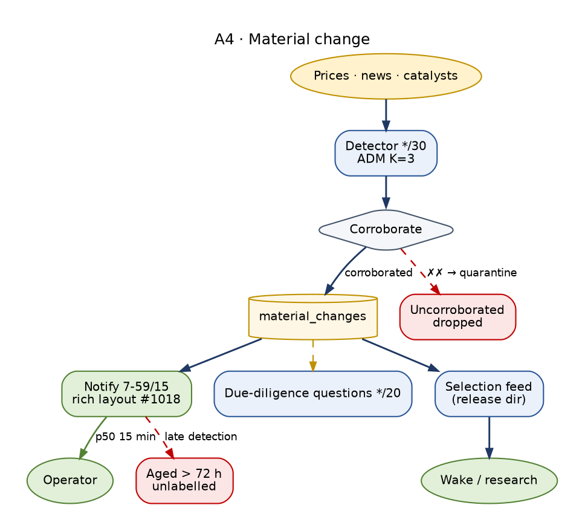
```dot
digraph lc_a4 {
  graph [rankdir=TB, fontname="Helvetica", fontsize=12, label="A4 · Material change", labelloc=t, nodesep=0.25, ranksep=0.32, pad=0.3];
  node [style="rounded,filled", fontname="Helvetica", fontsize=9.5];
  edge [fontname="Helvetica", fontsize=8.5, arrowsize=0.7];
  src [label="Prices · news · catalysts", shape=oval, fillcolor="#FFF2CC", color="#BF9000"];
  det [label="Detector */30\nADM K=3", shape=box, fillcolor="#EAF1FB", color="#2B5797"];
  corr [label="Corroborate", shape=diamond, fillcolor="#F4F6F9", color="#44546A"];
  mc [label="material_changes", shape=cylinder, fillcolor="#FFF7E6", color="#BF9000"];
  notify [label="Notify 7-59/15\nrich layout #1018", shape=box, fillcolor="#E2F0D9", color="#548235"];
  op [label="Operator", shape=oval, fillcolor="#E2F0D9", color="#548235"];
  ddq [label="Due-diligence questions */20", shape=box, fillcolor="#EAF1FB", color="#2B5797"];
  feed [label="Selection feed\n(release dir)", shape=box, fillcolor="#EAF1FB", color="#2B5797"];
  wake [label="Wake / research", shape=oval, fillcolor="#E2F0D9", color="#548235"];
  drop [label="Uncorroborated\ndropped", shape=box, fillcolor="#FBE5E5", color="#C00000"];
  aged [label="Aged > 72 h\nunlabelled", shape=box, fillcolor="#FBE5E5", color="#C00000"];
  src -> det [color="#1F3864", penwidth=1.4];
  det -> corr [color="#1F3864", penwidth=1.4];
  corr -> mc [label="corroborated", color="#1F3864", penwidth=1.4];
  mc -> notify [color="#1F3864", penwidth=1.4];
  notify -> op [label="p50 15 min", color="#548235", penwidth=1.3];
  mc -> ddq [color="#BF9000", style=dashed];
  mc -> feed [color="#1F3864", penwidth=1.4];
  feed -> wake [color="#1F3864", penwidth=1.4];
  corr -> drop [label="✗✗ → quarantine", color="#C00000", style=dashed, penwidth=1.2];
  notify -> aged [label="late detection", color="#C00000", style=dashed, penwidth=1.2];
}
```

---

# FAMILY B — QUESTION AND RESEARCH LIFECYCLES

Fact base: `lifecycles/LIFECYCLE_FACTBASE_B_QUESTIONS_2026-09-14.md`.

## B1 · The operator question (Telegram desk)

### (a) Purpose, actors, stores

- **Purpose:** answer the operator from house data first; when facts are missing, fetch them through declared vectors, then reply, defer with a pending row, or say "no coverage"; close every pending row; remember the exchange per subject.
- **Actors:** operator (2 allowlisted chats) · `tradeai-cio-telegram` → `cio_telegram_bot.py --loop` (25 s long-poll; fulfil pass every 3rd poll) · `cio_telegram_converse.py` · `cio_converse_core.py` · `cio_operator_desk_loop.py` (`handle_operator_desk_question :3114`) · `operator_subject_resolver.py` · `gap_resolver.py` · `reply_provenance.py` · Hermes CIO queue · `check_operator_answer_quality.py` (~30 min). A **second** poller (`run_telegram_callback_poller.py`, other bot token) owns `/caps`, `/cap`, `/approve`, `/deny`.
- **Stores:** `operator_conversation_turns` · `inbound_operator_questions` (dead since 09-06) · `cio_events.jsonl` (`operator.message`) · `cio_operator_pending_replies.jsonl` · `cio_operator_gap_requests.jsonl` · `data_gap_registry` · `gap_resolution_receipts.jsonl` (**absent**) · `hermes_research_requests/results.jsonl` + projection · `cio_plans.jsonl` · `aif_memory.jsonl` · `operator_answer_quality_last_run.json`.

### (b) State machines

**Desk result `kind`** — `slash`/`ack` · `attention` · `reentry_facts` · `decision_thread` · `unanswerable` (market need with no resolved symbol) · `answered` · `no_coverage` (every vector denied) — all terminal — plus **`deferred`** and **`answered + freeform_soft_queue`**, which open a pending row.

**Pending reply** (append-only; latest row per `pending_id` wins):

```
 (none) ──deferred / soft queue──▶ open
 open ──evidence.complete on re-check──▶ fulfilled            (terminal)
 open ──!answerable OR age ≥ limit──────▶ expired              (terminal)   limit = 2 h, or ETA + 1 h grace
 open ──send error──▶ open (failed++, retried next pass)
 trigger: bot loop every 3rd poll (~75 s idle); only the 8 newest open rows
```

**Intent** — `source` heuristic (regex first) refined by DeepSeek Flash (intent only; "numbers never come from this step"); `intent` ∈ attention · meta_system · reentry · cash · portfolio · risk · research · analyst_view · freeform · unclear; stamped `answerable` / `unanswerable_reason`.

**Gap vector chain** (per-day cap / ETA the desk quotes): refresh_producer 6 / 120 s · backup_provider 12 / 30 s · governed_search 10 / 20 s · hermes_research 4 / 1,800 s · llm_curation 6 / 60 s · operator_ask 1 / 7,200 s; side-effecting vectors dry-run unless armed.

**Turn** — `role` operator/agent · `identity_status` CONFIRMED / UNRESOLVED_WITH_REASON / CANDIDATE / NULL · `matched_via` ticker / company_name / ticker_alias / reply_context.

### (c) End-to-end flow

```
 OPERATOR ══▶ 1 POLL (bot PID started 23:21 → one release behind after the 00:07 promote)
          ══▶ 2 TAG + PERSIST operator half ── 188 rows / 39 msgs (69 NULL identity) ✗✗▶ communication_events (free text not ledgered)
          ══▶ 3 ROUTE (slash · ack · attention · reentry · decision thread — terminal)
          ══▶ 4 INTENT + SUBJECT ── 25 % of messages bound to a subject (7 d); SpaceX 09-13: symbols=[]
          ══▶ 5 EVIDENCE (operator_evidence_contract: holdings · snapshot · re-entry desk · prices · research · analysts)
                 │ complete ═══════════════════════════════════════════════╗
                 │ blocking gaps                                            ║
          ══▶ 6 GAP REGISTER + RESOLVE ── registry 0 rows (7 d) · receipts file absent ✗
                 ├ answered ══════════════════════════════════════════════╣
                 ├ denied ──▶ "no coverage" (terminal)                     ║
                 └ queued ══▶ 7 HERMES ENQUEUE ── symbols[:4] or ["BOOK"] ✗ subject LOST
                           ══▶ 8 DEFER "I'll reply here" ── pending row has NO plan_id / research_id ✗
                                                                          ║
          ══▶ 9 CURATE (subject brief · subject memory · validated Flash wording) ◀╝
          ══▶ 10 PROVENANCE + SEND ── Sources line on 1 of 8 agent replies ✗✗▶ communication_events OUTBOUND
          ══▶ 11 AGENT TURN PERSIST ── 23 rows / 8 msgs; reply p50 6.2 s; tagger reads agent text (P, S, WENT, POP, ABOVE) ✗
          ══▶ 12 FULFIL ── re-runs house evidence only ✗✗▶ hermes_research_results (never read) ✗✗▶ gap_requests.plan_id
                 fulfilled 0 · expired 1 (SpaceX at 9.38 h, text "within 2h")
          ══▶ 13 LATER QUESTION: subject memory recall (#1001) ── BLOCKED, no traffic since promote
          ══▶ 14 ANSWER-QUALITY AUDIT ── 7 findings ╌╌✗ no repair edge; unit exits FAILURE whenever findings exist
```

### (d) Iterations

| Loop | Cadence | Closes? | What changes between turns |
|---|---|---|---|
| Poll | 25 s | yes | 11,452 idle polls since 09-06; 3 errors |
| Pending re-check | ~75 s, newest 8 | **no** for research-blocked pendings | nothing — the same house-evidence query with `symbols=[]` for 9 h 9 min ⟳ |
| Pending expiry | same pass | fires, late, wrong reason | pre-09-13 code used a bare `continue` (INFERRED) |
| Gap → registry → resolver cron | weekdays hourly | **no** | empty store |
| Subject memory recall | per later question | BLOCKED | no traffic |
| Answer-quality audit | 30 min | report only | findings identical run to run |
| Operator turn → wake (M3) | hourly | **no** | only turn 115 (09-11) ever reached a wake |

### (e) Questions

| Question | Raised by | Answered by | Closed by | Dropped where |
|---|---|---|---|---|
| "What does the operator want, about which instrument?" | desk | heuristic + Flash + resolver | intent | 31 of 39 operator messages have no persisted reply turn (send vs capture cannot be separated read-only; converse was off 09-10) |
| "Can this ever be answered?" | `is_answerable` | deterministic | `unanswerable` reply | — |
| "Are the facts in house?" | evidence contract | `gather_tradeai_evidence` | answered | FALSE_EMPTY_CLAIM: cash existed, reply said unavailable |
| "Which vector can fetch the missing fact?" | gap resolver | chain | receipt | **0 receipts ever** |
| "What is the outlook for SpaceX?" | desk → Hermes | Hermes worker | `HERMES_LOOP_COMPLETED` | **re-keyed to BOOK at enqueue** — answers a different question |
| "Has the data landed yet?" | fulfil loop | house evidence | fulfilled / expired | **Hermes result never consulted** — closed "could not answer" 9 h after research completed |
| "What did we discuss before?" | desk | `SUBJECT_MEMORY_SQL` | memory block | poisoned by agent-text tagger false positives (INFERRED risk) |
| "Was the answer sourced and honest?" | AQ audit | deterministic | report | no remediation consumer |

### (f) Live measurements

| Metric | Value |
|---|---|
| Turns all-time | 211 — operator 188 rows / 39 messages; agent 23 rows / 8 messages |
| Distinct operator messages by day | 09-06 7 · 09-07 3 · 09-08 3 · 09-10 10 · 09-11 12 · 09-13 13 |
| Non-slash messages with an agent reply turn (8 d) | **8 / 39 (20.5 %)** |
| Bound to a subject | 7 d 25 %; 09-13 38 % |
| Question → reply latency | p50 6.2 s · p90 14.6 s (n = 8) |
| Replies with a Sources line | **1 / 8** |
| Pending ledger | 1 pending all-time: open → expired at 9.38 h; fulfilled 0 |
| Resolver receipts | 0 (file absent) |
| AQ findings | 7: NO_SOURCES_LINE 4 · FALSE_EMPTY_CLAIM 1 · BOOK_DUMP_FOR_NAMED_SYMBOL 1 · MODEL_UNLABELLED 1 |
| Desk replies in `communication_events` OUTBOUND | 0 |

**SpaceX, end to end (UTC, four ledgers):**

```
16:32:33  PLAN_CREATED plan_700fcdb8d259 S0_OPERATOR_CONVERSE
16:32:33  hermes request res_2bf4b0362b4e queued symbol=BOOK operator_forced=True
16:32:36  pending opr_5bc20393b457 open intent=research symbols=[]  ·  gap_requests {plan_id, symbols: []}
16:45:26  CLAIMED (12.9 min queue wait)
16:45:39  COMPLETED  INSUFFICIENT_DATA · WATCH · conf 0.2 · deepseek-flash
16:46:20  HERMES_LOOP_COMPLETED  critique PARTIAL  memory accepted (symbols ['BOOK'])
   …  9 h 9 min of re-checks against house evidence with symbols=[] …
01:55:43  pending expired 9.38 h — "the required Trade-AI data did not arrive within 2h" — close not ledgered
```

### (g) Failure paths

1. Subject lost at Hermes enqueue (`symbols[:4] or ["BOOK"]`, `:2724`). 2. Pending ↔ research join missing (no plan_id on the pending; nothing reads the gap-request ledger). 3. Close reason was templated (fixed wording shipped 09-13 in #1000; not yet exercised). 4. Reply capture is best-effort and silent (only 8 agent turns for 39 messages). 5. Replies bypass the communication ledger. 6. Tagger runs on agent text → false CONFIRMED subjects feed memory recall. 7. The long-running bot keeps stale code across promotes. 8. The AQ audit reports but never repairs. 9. Two Telegram consumers on two tokens split the command surface.

### Update 2026-09-14 — B1 after PRs #1005, #1006, #1007, #1016, #1018

| Stage | Change | Proof |
|---|---|---|
| Intent / subject | spelled tickers bind (book or registry only); Flash may not demote `reentry_ready` / `reentry_levels`; freeform context carries `price_for_symbols` / `levels_for_symbols` | real 08:23 AXTI question dry run → full re-entry card |
| Evidence / curate | `subject_dossier.py` covers every stored section for a named stock; each line starts with a spelled-out pill (`🟢 Trade-AI data` · `🔵 Looked up outside Trade-AI` · `🟣 AI model (DeepSeek)`); Key line; Origin line on every reply | 345 desk tests; operator: "This is much better" |
| Hermes enqueue / defer | the operator's own question sent to Hermes (≤ 220-character pieces); `research_id` stamped on the gap request; research-only asks answered immediately with house facts plus a queued line (`CIO_OPERATOR_RESEARCH_ANSWER_NOW`) | — |
| Fulfil | join `pending_id → plan_id + research_id → projection → result`; follow-up quotes the question with Hermes' answer, findings, open questions and limits; failed runs close at once | HPE: research 09:16, delivered 10:36 automatically after deploy; fulfilled=1 at 3,635 chars |
| Send | bodies over 4,096 UTF-16 units sent as ordered parts; phone rendering (Part i of N, plain footer, provenance in an expandable quote); HTML with plain fallback | AXTI 4,571-char answer → 2 parts |
| AQ audit | `RESEARCH_LANDED_UNSENT`, `REPLY_NOT_DELIVERED` rules | 23:22Z alert: 3 findings, all pre-fix turns |
| Still open | reply ledgering as OUTBOUND events; tagger on agent text; subject memory recall unexercised in traffic | — |

**Maturity change:** Intent/subject L2 → **L3** · Curate L2–L3 → **L3** · Send L1 → **L2** · **Fulfil L0 → L3** (joined by key, delivered, monitored) · AQ audit report L5 / repair still L0.

### (h) Maturity per stage

| Poll | Tag/persist | Route | Intent/subject | Evidence | Gap resolve | Hermes enqueue | Defer | Curate | Send | Agent turn | Fulfil | Recall | AQ audit |
|---|---|---|---|---|---|---|---|---|---|---|---|---|---|
| L1 | L1–L2 | L1 | L2 | L2 | L1 code / **L0** runtime | L1 | L1 | L2–L3 | L1 | L1 | **L0** | L0 (BLOCKED) | report L5 / repair L0 |

### (i) Target and exit

**Target:** `plan_id + research_id + subject_guid` stamped on the pending row → on `HERMES_LOOP_COMPLETED(plan_id)` curate from the result and follow up → otherwise honest close at ETA + grace; every send is an OUTBOUND event, then an agent turn, then subject memory, then the next wake.
**Exit:** every non-slash message has one sourced reply turn (today 20.5 % / 12.5 %) · research-blocked pendings fulfilled from the Hermes result (0/1) · resolver receipts for every blocking gap (0) · desk replies ledgered (0) · a new turn changes the next wake (not met).

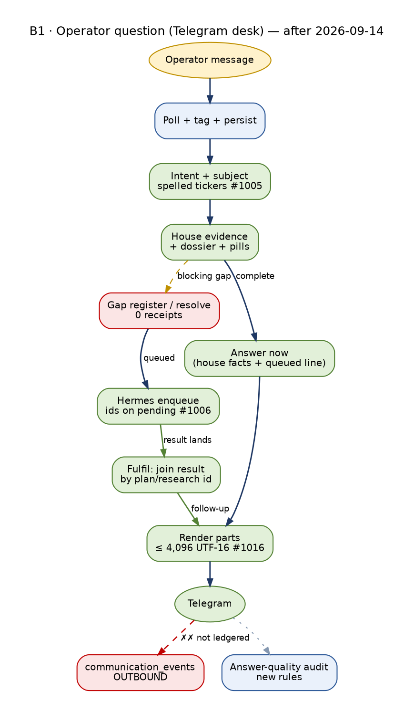
```dot
digraph lc_b1 {
  graph [rankdir=TB, fontname="Helvetica", fontsize=12, label="B1 · Operator question (Telegram desk) — after 2026-09-14", labelloc=t, nodesep=0.25, ranksep=0.32, pad=0.3];
  node [style="rounded,filled", fontname="Helvetica", fontsize=9.5];
  edge [fontname="Helvetica", fontsize=8.5, arrowsize=0.7];
  q [label="Operator message", shape=oval, fillcolor="#FFF2CC", color="#BF9000"];
  poll [label="Poll + tag + persist", shape=box, fillcolor="#EAF1FB", color="#2B5797"];
  intent [label="Intent + subject\nspelled tickers #1005", shape=box, fillcolor="#E2F0D9", color="#548235"];
  ev [label="House evidence\n+ dossier + pills", shape=box, fillcolor="#E2F0D9", color="#548235"];
  gap [label="Gap register / resolve\n0 receipts", shape=box, fillcolor="#FBE5E5", color="#C00000"];
  hq [label="Hermes enqueue\nids on pending #1006", shape=box, fillcolor="#E2F0D9", color="#548235"];
  now [label="Answer now\n(house facts + queued line)", shape=box, fillcolor="#E2F0D9", color="#548235"];
  render [label="Render parts\n≤ 4,096 UTF-16 #1016", shape=box, fillcolor="#E2F0D9", color="#548235"];
  send [label="Telegram", shape=oval, fillcolor="#E2F0D9", color="#548235"];
  fulfil [label="Fulfil: join result\nby plan/research id", shape=box, fillcolor="#E2F0D9", color="#548235"];
  ledger [label="communication_events\nOUTBOUND", shape=box, fillcolor="#FBE5E5", color="#C00000"];
  aq [label="Answer-quality audit\nnew rules", shape=box, fillcolor="#EAF1FB", color="#2B5797"];
  q -> poll [color="#1F3864", penwidth=1.4];
  poll -> intent [color="#1F3864", penwidth=1.4];
  intent -> ev [color="#1F3864", penwidth=1.4];
  ev -> now [label="complete", color="#1F3864", penwidth=1.4];
  now -> render [color="#1F3864", penwidth=1.4];
  render -> send [color="#1F3864", penwidth=1.4];
  ev -> gap [label="blocking gap", color="#BF9000", style=dashed];
  gap -> hq [label="queued", color="#1F3864", penwidth=1.4];
  hq -> fulfil [label="result lands", color="#548235", penwidth=1.3];
  fulfil -> render [label="follow-up", color="#548235", penwidth=1.3];
  send -> ledger [label="✗✗ not ledgered", color="#C00000", style=dashed, penwidth=1.2];
  send -> aq [color="#8497B0", style=dotted];
}
```

---

## B2 · System-raised questions

Three producers of questions the platform asks itself: **2A** wake research (`changed_question`), **2B** due-diligence questions, **2C** situation → plan → Hermes default questions.

### (a) Actors and stores

- **2A:** cron `:45` builds `research_targets.jsonl` with `jq | sort -u` from the selection feed, then `run_governed_research_producer.py --limit 5 --execute` (Brave via the governed router); cron `:00` wake runs `research_consumption.consume_dossier`. Stores `research_targets/objects.jsonl`, `state/wakes.jsonl`, `state/receipts.jsonl`, `agent_views.jsonl`, `search_budget.json`.
- **2B:** cron `*/20` `due_diligence_questions.py --apply --route` (Flash first, then OAuth lanes) → `hermes_external_researcher.py --lane <ranked>`. Stores `material_changes` → `due_diligence_questions` → `hermes_external_research`.
- **2C:** `cio_situation_detector` (via `cio_reactive_cycle.py`) → `cio_plans.jsonl` (event-sourced) → `hermes_research_loop.emit_research_for_plan`.

### (b) State machines

| Machine | States | Terminal | Counts |
|---|---|---|---|
| Research object `lifecycle_state` | `IDENTIFIED` only | none | 675/675 IDENTIFIED |
| Wake receipt `effect_kind` | changed_question · none · changed_commitment · changed_view | SETTLED | 177 / 3 / 1 / 1 |
| `next_research_question` | set to `"What changed after: <title>"` only when the title contains EARNINGS / GUIDANCE / DOWNGRADE / UPGRADE / FDA / MERGER / INVESTIGATION | — | **0 persisted values** in 193 agent_views + 11 views |
| DDQ `status` | `ASKED` (default) → `ROUTED` on a successful lane subprocess; EXPIRED / SUPERSEDED / RETIRED named in a comment, **never written** | none (ROUTED is a sink) | ASKED 317 (09-06..09-09) · ROUTED 555; `answer_ids` 0/872; `supersedes_guid` 0 |
| Plan (`cio_plans`) | draft → proposed → accepted / cancelled | cancelled / accepted | last status: cancelled 1,308 · proposed 337 · draft 320 · accepted **3**; 469/470 created `shadow=True` |

### (c) Flow

```
 material_changes ──▶ selection feed (release dir) ══ :45 jq | sort -u ══▶ targets (11 now: ABOVE, ALLE, APPF, EXPE, GRMN … PFSI, PYPL, WMT)
                                                   --limit 5 → first five ALPHABETICAL ⟳ starvation
 2A-1 PRODUCER ──▶ Brave (caller cap 25/day; CALLER_DAILY_CAP is not a spill reason ✗✗▶ SearXNG)
       ◀── research_objects 675 (39 % on ABOVE / AGAIN — UNRESOLVED non-securities)
 2A-2 WAKE consume ── keyword gate → "What changed after" ✗✗▶ question text persisted: 0
       ╎ next wake reads the selection feed again, not the changed question ✗ (no question → target edge)

 material_changes ══▶ 2B-1 DDQ CURATE (cited, grounded against dossier) ── "no dossier" since 09-13 02:40
                  ══▶ 2B-2 ROUTE (2 per run, NEWEST first) ──▶ hermes_external_research ◀── ROUTED
                  ══▶ 2B-3 ANSWER → QUESTION ✗✗▶ answer_ids 0/872 · no ANSWERED/EXPIRED state
                        ╌╌▶ usefulness score (avg 0.59) re-ranks LANES only █

 holdings / re-entry / cash ══▶ 2C-1 SITUATION (S3 reentry_NEAR 370/470) ══▶ 2C-2 should_enqueue → Hermes (161/470) → B3
                            ══▶ 2C-3 PLAN STATUS ── revisit_at set ✗✗▶ tradeai-cio-defer-revisit (dead since 08-19)
```

### (d) Iterations

| Loop | Cadence | Closes? | What changes |
|---|---|---|---|
| Target build → produce | hourly, 5 targets | runs, fixed alphabetical head | 13 subjects in 7 d, 10 start with "A"; ABOVE 144, ADBE 123, AES 123, AGAIN 120 objects |
| Produce → consume | hourly | each object consumed at most once | 143/675 consumed; p50 4.25 h, p90 46 h |
| Consume → changed question → next target | — | **no** | the question is not persisted and targets are rebuilt from material changes only |
| DDQ curate → route | 20 min | drains 2 per run | last 400 runs: routed 269, failed 130; questions > 0 in 79 |
| DDQ answer → close | — | **no** | answer_ids 0 |
| DDQ answer → lane rank | per run | **yes (lane level)** | lane order |
| Situation → plan → Hermes → evidence | reactive | partial | 161/470 plans enqueue; accepted 3 all-time |

### (e) Questions and their fate

| Question | n (7 d) | Answered | Closed | Dropped |
|---|---|---|---|---|
| "What changed after <headline>?" | 177 receipts | no answer path | never | text not persisted; "changed" repeats on identical inputs |
| Research need on a material subject | 5 targets/h | Brave → research object | never (IDENTIFIED forever) | 532 never consumed; 264 on non-securities |
| DDQ with `why_now` / `what_would_settle_it` | 872 all-time | 502 in `hermes_external_research` (p50 2.7 h, p90 97 h) | **0** | 317 unrouted up to 7 d; the settle condition is never evaluated |
| S6/S1/S5 template ("Is <sym> drift price- or flow-driven?") | 161 plan requests | 27 completed | plan updated | 26 orphaned (B3) |
| S3/S7/S0 default ("What research would change the advisory?") | 105 S3 | as above | — | S0 falls back to BOOK |

### (f) Measurements

Research objects by day 09-10..09-13: 105 · 264 · 150 · 156; producer 03:45Z `produced=15 failed=0`. Brave used 25 / 22 / 25 / 15 (09-11..14) vs caller cap 25; denials 22 (09-11), 68 (09-13); monthly 178/1,500. DDQ created 09-06..09-13: 30 · 125 · 176 · 204 · 96 · 187 · 35 · 19; routed 4 · 82 · 8 · 7 · 124 · 130 · 52 · 144. DDQ oldest open 7.0 days; INFERRED drain ETA at 2 per 20 min ≈ 53 h. Answer usefulness: 0.0–0.3 40 · 0.4–0.5 97 · 0.6–0.7 203 · 0.8–1.0 153. Plans 7 d: 470 (S3 410, S6 29, S5 15, S7 14).

### (g) Failure paths

1. Alphabetical starvation (`sort -u` + `--limit 5`): PFSI, PYPL, WMT never researched. 2. Tagger false subjects in `material_changes` pass into the research budget — the producer requires a `subject_guid`, not CONFIRMED identity. 3. Caller-cap denial does not spill to SearXNG. 4. "changed_question" is a keyword-gated label with no persisted text and no edge back to targets. 5. DDQ routing is LIFO with limit 2 and no expiry. 6. DDQ answers are never joined back; the join relies on exact question-text match (502/555). 7. Plans are shadow, 67 % cancelled, `revisit_at` has no live consumer.

### (h) Maturity

2A target build L1 · produce L1 (health file L5) · consume L1 · question → next target **L0** · DDQ curate L2–L3 · route L1 · answer → close **L0** · lane ranking L4 (narrow) · situation detect L1–L2 · Hermes enqueue L1 · plan revisit **L0**.

### (i) Target and exit

**Target:** confirmed subject → persisted question (text, why_now, settle condition, subject_guid) → routed by priority and age → answer joined to `question_guid` → settle test → ANSWERED / SUPERSEDED / EXPIRED → changed `next_research_question` persisted → next target.
**Exit:** ≥ 90 % of research spend on CONFIRMED securities (≈ 61 %) · no target starved > 24 h (not met) · every question terminal within TTL (0/872) · a `next_research_question` diff between consecutive wakes (M1, not observed).

**Update 2026-09-14 — the Research Escalation Circle, phase 1 (#1010 measured, #1012 built, dry run by
default, not wired into the desk).** Measured first: no quality-based escalation existed anywhere;
for operator questions Brave was off and Hermes was the only step that ran; Brave spilled to SearXNG
only on quota or 429. Phase 1 adds one `question_guid` per ask and an append-only lifecycle ledger
`ASKED → GATHERING → ANALYZED → ANSWERED / ANSWERED_PARTIAL → SCHEDULED`; free channels (house, Yahoo:
quote, analysts, volume, earnings, news, levels computed from bars; SEC Form 4; SearXNG with general
fallback); a deterministic sufficiency score (stale and contradiction capped, undated never stamped
today); a Context Analyzer on DeepSeek Flash through the bridge whose verdict is rejected when it cites
unknown evidence ids; a targeted second lap that stops without a model call when nothing new is found;
automatic check-ins (day after a dated catalyst, else the analyzer's horizon, else 7 or 14 days).
Dry runs: HPE 2 laps → ANSWERED_PARTIAL, check-in in 3 days (the analyzer caught a false volume premise
0.83×, an earnings-date disagreement and missing volume history); ELMT 1 lap → sufficient M2, check-in 7
days. The existing DDQ and research-object lifecycles below are unchanged.

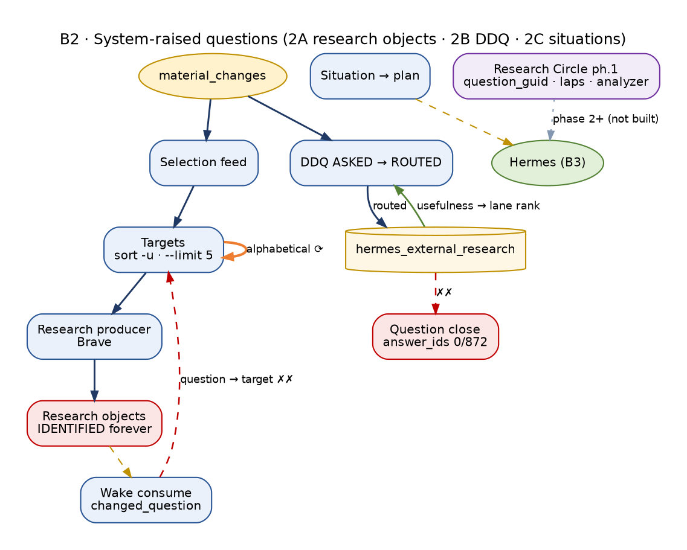
```dot
digraph lc_b2 {
  graph [rankdir=TB, fontname="Helvetica", fontsize=12, label="B2 · System-raised questions (2A research objects · 2B DDQ · 2C situations)", labelloc=t, nodesep=0.25, ranksep=0.32, pad=0.3];
  node [style="rounded,filled", fontname="Helvetica", fontsize=9.5];
  edge [fontname="Helvetica", fontsize=8.5, arrowsize=0.7];
  mc [label="material_changes", shape=oval, fillcolor="#FFF2CC", color="#BF9000"];
  feed [label="Selection feed", shape=box, fillcolor="#EAF1FB", color="#2B5797"];
  targets [label="Targets\nsort -u · --limit 5", shape=box, fillcolor="#EAF1FB", color="#2B5797"];
  prod [label="Research producer\nBrave", shape=box, fillcolor="#EAF1FB", color="#2B5797"];
  ro [label="Research objects\nIDENTIFIED forever", shape=box, fillcolor="#FBE5E5", color="#C00000"];
  consume [label="Wake consume\nchanged_question", shape=box, fillcolor="#EAF1FB", color="#2B5797"];
  ddq [label="DDQ ASKED → ROUTED", shape=box, fillcolor="#EAF1FB", color="#2B5797"];
  ext [label="hermes_external_research", shape=cylinder, fillcolor="#FFF7E6", color="#BF9000"];
  close [label="Question close\nanswer_ids 0/872", shape=box, fillcolor="#FBE5E5", color="#C00000"];
  sit [label="Situation → plan", shape=box, fillcolor="#EAF1FB", color="#2B5797"];
  hermes [label="Hermes (B3)", shape=oval, fillcolor="#E2F0D9", color="#548235"];
  circle [label="Research Circle ph.1\nquestion_guid · laps · analyzer", shape=box, fillcolor="#F1ECF8", color="#7030A0"];
  mc -> feed [color="#1F3864", penwidth=1.4];
  feed -> targets [color="#1F3864", penwidth=1.4];
  targets -> targets [label="alphabetical ⟳", color="#ED7D31", style=bold];
  targets -> prod [color="#1F3864", penwidth=1.4];
  prod -> ro [color="#1F3864", penwidth=1.4];
  ro -> consume [color="#BF9000", style=dashed];
  consume -> targets [label="question → target ✗✗", color="#C00000", style=dashed, penwidth=1.2];
  mc -> ddq [color="#1F3864", penwidth=1.4];
  ddq -> ext [label="routed", color="#1F3864", penwidth=1.4];
  ext -> close [label="✗✗", color="#C00000", style=dashed, penwidth=1.2];
  ext -> ddq [label="usefulness → lane rank", color="#548235", penwidth=1.3];
  sit -> hermes [color="#BF9000", style=dashed];
  circle -> hermes [label="phase 2+ (not built)", color="#8497B0", style=dotted];
}
```

---

## B3 · Hermes research

Two Hermes lifecycles that do not share state: **3A** the CIO Hermes queue (JSONL, plan-driven) and **3B** the research fleet writing `hermes_research_intelligence` (HRI).

### (a) Actors and stores

- **3A:** `cio_hermes_research.py` · `hermes_research_queue.py` · `hermes_worker.py` · `hermes_research_loop.on_hermes_completed`; worker `tradeai-hermes-cio-worker` (timer `*:0/15` + path unit on the request ledger; `--drain --max 2 --backend live`) through the governed bridge :8766. Stores: request ledger (21 MB, 6,808 events) · results (556) · **projection JSON (30 MB, 1,209 ids)** · `aif_memory.jsonl` · `cio_plans.jsonl`.
- **3B:** Grok stop_curation, options bridge, topic monitor bridge, ticker_research_agent, deep_research_local, catalyst_momentum_engine, youtube_discovery, StopHealthMonitor, protection advisor, librarian; `hermes_coordinator.py` (`*/15`, `auto_promote` cap 10/tick with a learned confidence gate, audited). Stores: HRI 34,516 · `hermes_promotion_audit` · `hermes_memory_events` 11,501 · `hermes_external_research` 50,148 · `watchlist_research_cards` 3,138.

### (b) State machines

**3A request** — `IN_FLIGHT {queued, running, started}` · `TERMINAL {completed, failed, cancelled, superseded}`; enqueue decisions `created · duplicate_in_flight · priority_bumped · reused_fresh_result · blocked_non_retryable`.

```
 enqueue ──▶ queued (REQUESTED + ENQUEUE; projection by_research_id)
   ├ fingerprint in flight ──▶ duplicate_in_flight / priority_bumped (no new row)
   ├ fresh completed ──▶ reused_fresh_result
   ├ prior exec-language / cost-cap failure ──▶ blocked_non_retryable
 queued ──claim_next (PROJECTION ONLY)──▶ running ──bridge ok + validate──▶ completed ──▶ LOOP_COMPLETED (critique, memory, reassessment, notify)
 running ──429 COST_CAP / 503 CIRCUIT / 500 / disconnect / execution-language refusal / truncation──▶ failed
 running ──reap_stale_running──▶ REAPED (4 all-time)
```

Latest status per research id: failed 653 · completed 556 · **queued 26**. Loop completion: critique VALID 452 / PARTIAL 89; memory accepted 477; `material_changed` False 533; **`notified` False 553/553**. Result classification: CONFIRMS 168 · INSUFFICIENT_DATA 34 · STRENGTHENS 16 · NO_NEW_INFO 14 · none 324.

**3B HRI `status`** — archived 29,603 · rejected 2,480 (dead since 07-09) · promoted 2,074 (since 08-30; **`research_expires_at` NULL on all**) · staged 359 (since 09-06; NULL on all). Transitions: insert → staged (agents, catalyst, youtube, protection) or insert → promoted directly (Grok, options, topic, deep research, StopHealth) → staged → promoted (coordinator) → archived (librarian).

### (c) Flow

```
 situation detector ──PLAN_CREATED──┐     desk (forced) ──S0 plan, symbols→BOOK──┐
                                    ▼                                          ▼
 1 PLAN (470/7 d, shadow; 161 enqueue) ══▶ 2 JOB enqueue (fingerprint dedup, fail policy)
        ◀── request ledger REQUESTED/ENQUEUE  ◀── projection (UNLOCKED load→modify→save of 30 MB) ✗✗ 26 queued MISSING
 ══▶ 3 CLAIM (projection only; queue wait p90 13 min) ══▶ 4 SEARCH/SYNTH (bridge → Flash; p50 15.2 s, p90 34.7 s)
        7 d fail 137/176: execution language 58 · COST_CAP 48 · disconnect 11 · CIRCUIT 11 · provider 7
 ══▶ 5 CRITIQUE (VALID / PARTIAL; never INVALID) ══▶ 6 MEMORY (CANDIDATE, expires +30 d)
 ══▶ 7 PLAN MERGE + NOTIFY ── notified 0/553 ✗✗▶ operator ✗✗▶ pending reply (B1)

 ═══ 3B ═══ fleet ══▶ HRI insert (1,166 / 7 d; trigger_source, lane_used, budget_decision NULL on all ✗)
   ══▶ STAGED 359 ══ coordinator (promotions 150+/day → 23 · 38 · 5 on 09-12..14) ══▶ PROMOTED 2,074 (no expiry ✗)
   ──▶ desk subject research · RAG · hubs · research cards (newest 09-12 20:00, stalled)
   ══▶ ARCHIVED (librarian, policy-driven) ✗✗▶ expiry → re-research
```

### (d) Iterations

| Loop | Cadence | Closes? | Evidence |
|---|---|---|---|
| Worker drain | 15 min + on ledger change | new jobs only, **never the 26 orphans** | runs finish in ~0.4 s; oldest queued 08-31 |
| Stale-running reaper | per claim | yes | 4 |
| Fail-policy replay block | per enqueue | yes (prevents re-spend; also kills the question permanently) | — |
| Fingerprint reuse | per enqueue | yes | 26 duplicates in 7 d |
| Research → memory → next wake | hourly | partial | memory admitted as CANDIDATE; wake memory load single-subject |
| Research → operator notify | on completion | **no** | 0/553 |
| Staged → promoted | 15 min | slowing | audit 177 (09-10) → 5 (09-14); cause not isolated (INFERRED guard or gate) |
| Expiry → re-research | — | **no** | no expiry set |

### (e) Questions

| Question | Origin | Fate |
|---|---|---|
| Templated S-type ("What catalysts land for NOC in 10 sessions?") | plan | 15 % answered in 7 d; 26 orphaned; 27/27 answers INSUFFICIENT_DATA / CONFIRMS / NO_NEW_INFO → no thesis change |
| Operator outlook (SpaceX) | desk | re-keyed to BOOK; INSUFFICIENT_DATA at +13 min; never joined to the pending |
| "Is this output safe?" (execution-language scan) | worker | 58 refusals — advisory phrasing fails the whole job instead of being redacted, then blocked from retry |
| ticker_thesis_challenge (246 staged) | fleet | waiting on the promote gate, p50 age 58 h |

### (f) Measurements

7 d: created 176 · completed 27 (15.3 %) · failed 137 (77.8 %) · queued 12. By day created → completed/failed: 09-07 2/20 · 09-08 3/29 · 09-09 2/26 · 09-10 3/23 · 09-11 6/18 · 09-12 5/9 · 09-13 6/13. Results by symbol: BOOK 11, DFSC 7, AUUD 4. HRI rows with a subject_guid 51 %. Staged backlog: thesis challenge 246 (p50 58 h) · momentum 50 (116 h) · youtube 40 (106 h) · protection 23 (62 h). External lanes 7 d: chatgpt sent 960 · grok 444 · deepseek errors 119 (to 09-09).

### (g) Failure paths

1. **Projection lost update:** 26 orphans, no ledger → projection reconcile. 2. Execution-language refusal is the #1 failure and permanently blocks the question. 3. COST_CAP 48 and CIRCUIT_OPEN 11: budget binds before value. 4. Subject substitution to BOOK (11 of 27 results). 5. Completion never notifies or joins pendings. 6. HRI provenance fields empty. 7. No expiry on live rows. 8. Promotion throughput collapsed 09-12..14.

### Update 2026-09-14 — B3 after PRs #1006, #1014, #1019

- **Measured on 09-14 before the fix:** 136 of 219 requests failed in 7 days (62 %), 13 of 18 in 24 h; 63
  execution-language refusals (some quoting third-party labels such as "Strong Sell"); 40 cost-cap; 22
  circuit-open / disconnect filed as non-retryable; 8 provider errors; 32 enqueued requests missing from
  the 30 MB unlocked projection (7 on 09-14); every escalation `retry_cmd` exited 127 (36,365 times since
  08-07); the health score read neither the queue nor the lane.
- **Now:** lane `cio-hermes-queue` (15 min) fires on failure rate, no completions, stalled queue, lost
  requests, unclassified failures; `claim_next` runs reap → replay retryable failures (once, after the
  15-min breaker; never cost cap or execution language) → restore lost requests (< 48 h, from the
  ledger) before every claim; a reentrant cross-process `flock` guards every projection writer;
  circuit/disconnect/502/503 are retryable provider errors; third-party labels are masked before the
  execution-language guard and a refused draft is rewritten once, still guarded; the health agent
  folds firing research lanes into intelligence quality; the escalation handler resolves the venv path.
  Live at 14:52: 12 lost requests restored, 1 replayed (SCHD), lost 0 / stalled 0, no rc=127.
- **Bridge (15:15–17:17):** DeepSeek held the bridge's non-streaming calls ~906 s each; the
  single-threaded bridge blocked every Hermes job. #1019 adds a 150 s wall-clock deadline, a threaded
  server with 4 in-flight slots (503 `BRIDGE_BUSY` is retryable), `GET /health` and a 5-minute watchdog.
  DeepSeek recovered at 17:21; CIO Hermes completed 5 jobs 17:29–17:47.
- **Join / notify:** completions now reach the operator's pending question (#1006, edge #18 fires).
- **Maturity change:** claim L1 → **L3** (self-reconciling under a lock) · notify/join L0 → **L3** for
  operator-forced research · failure handling gains bounded repair (**L3**). Orphans present at 00:45
  (26) were restorable only within 48 h; older ones remain for reconciliation.

### (h) Maturity

Plan L1 · enqueue L1 · claim L1 (orphan defect) · search/synthesis L2 · critique L3 partial · memory accept L1 · notify/join **L0** · staged → promoted L1–L2 · expiry/re-research **L0** · archive L1.

### (i) Target and exit

**Target:** plan(question, subject_guid) → ledger is the source of truth and the projection is rebuilt under a lock → claim → search with SearXNG spill on caller cap → synthesis that redacts rather than rejects → critique able to say INVALID → memory CANDIDATE → ACCEPTED on corroboration → HRI promoted with `expires_at` → consumers join by plan_id → expiry → re-research.
**Exit:** 0 queued jobs older than 2× cadence (26) · 7-day completion ≥ 70 % (15 %) · every operator-forced completion joined to its pending in one pass (0/1) · `research_expires_at` on 100 % of promoted (0 %) · ≥ 1 completion changes a thesis or next question (0/27).

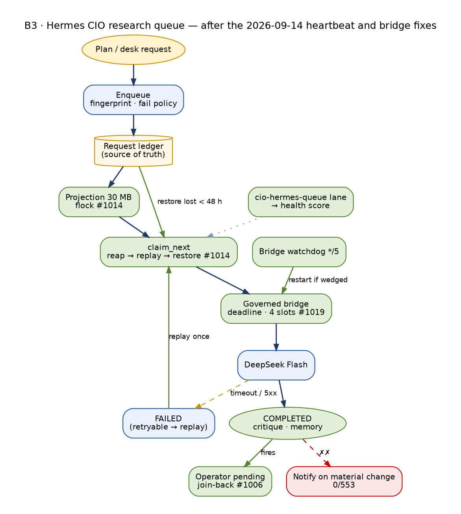
```dot
digraph lc_b3 {
  graph [rankdir=TB, fontname="Helvetica", fontsize=12, label="B3 · Hermes CIO research queue — after the 2026-09-14 heartbeat and bridge fixes", labelloc=t, nodesep=0.25, ranksep=0.32, pad=0.3];
  node [style="rounded,filled", fontname="Helvetica", fontsize=9.5];
  edge [fontname="Helvetica", fontsize=8.5, arrowsize=0.7];
  plan [label="Plan / desk request", shape=oval, fillcolor="#FFF2CC", color="#BF9000"];
  enq [label="Enqueue\nfingerprint · fail policy", shape=box, fillcolor="#EAF1FB", color="#2B5797"];
  ledger [label="Request ledger\n(source of truth)", shape=cylinder, fillcolor="#FFF7E6", color="#BF9000"];
  proj [label="Projection 30 MB\nflock #1014", shape=box, fillcolor="#E2F0D9", color="#548235"];
  claim [label="claim_next\nreap → replay → restore #1014", shape=box, fillcolor="#E2F0D9", color="#548235"];
  bridge [label="Governed bridge\ndeadline · 4 slots #1019", shape=box, fillcolor="#E2F0D9", color="#548235"];
  ds [label="DeepSeek Flash", shape=box, fillcolor="#EAF1FB", color="#2B5797"];
  done [label="COMPLETED\ncritique · memory", shape=oval, fillcolor="#E2F0D9", color="#548235"];
  failed [label="FAILED\n(retryable → replay)", shape=box, fillcolor="#EAF1FB", color="#2B5797"];
  pending [label="Operator pending\njoin-back #1006", shape=box, fillcolor="#E2F0D9", color="#548235"];
  lane [label="cio-hermes-queue lane\n→ health score", shape=box, fillcolor="#E2F0D9", color="#548235"];
  watchdog [label="Bridge watchdog */5", shape=box, fillcolor="#E2F0D9", color="#548235"];
  notify [label="Notify on material change\n0/553", shape=box, fillcolor="#FBE5E5", color="#C00000"];
  plan -> enq [color="#1F3864", penwidth=1.4];
  enq -> ledger [color="#1F3864", penwidth=1.4];
  ledger -> proj [color="#1F3864", penwidth=1.4];
  proj -> claim [color="#1F3864", penwidth=1.4];
  claim -> bridge [color="#1F3864", penwidth=1.4];
  bridge -> ds [color="#1F3864", penwidth=1.4];
  ds -> done [color="#1F3864", penwidth=1.4];
  ds -> failed [label="timeout / 5xx", color="#BF9000", style=dashed];
  failed -> claim [label="replay once", color="#548235", penwidth=1.3];
  ledger -> claim [label="restore lost < 48 h", color="#548235", penwidth=1.3];
  done -> pending [label="fires", color="#548235", penwidth=1.3];
  lane -> claim [color="#8497B0", style=dotted];
  watchdog -> bridge [label="restart if wedged", color="#548235", penwidth=1.3];
  done -> notify [label="✗✗", color="#C00000", style=dashed, penwidth=1.2];
}
```

---

## B4 · Topic / thematic research

### (a) Actors and stores

`topic_ingestion.py` (20:45 weekdays, 02:45 daily; YouTube, Google News RSS, Yahoo, Brave news cap 5, DuckDuckGo) · `topic_curator.py` (09:30, 13:30, 18:30 ensemble; free Grok → ChatGPT → local) · `agent_event_router.py` (`*/30`) · `process_watchlist_agent_jobs.py` · `hermes_topic_monitor_bridge.py` (07:30) · `hermes_research_agenda.py` · `research_insight_extractor.py` · `iterate_research_topics.py` · `research_intelligence_queue.py`. Stores: `topic_monitor` (420), `news_articles.rag_status`, `topic_curation_feedback` (771), `agent_event_queue`, `watchlist_agent_jobs`, HRI `topic_research`, `research_insights` (47,896), `user_research_topics` (61), `ri_research_queue` (419).

### (b) State machines

`topic_monitor.enabled` (399 on / 21 off) · `news_articles.rag_status` pending → approved / low_quality / blocked (ensemble rescue low_quality → approved; 76.5 % approved) · `agent_event_queue.status` pending → done (**193/193 `done` regardless of job outcome**) · `TOPIC:*` agent jobs queued → failed / deferred / superseded / expired (**0 completed since 06-22**) · HRI topic rows inserted `promoted` (118 in 7 d, **symbol NULL 118/118**) · `ri_research_queue` done 323 / failed 95 / **running 1 since 08-01** · `user_research_topics` last researched 08-03.

### (c) Flow and the code path that guarantees failure

```
 topic_monitor ──▶ T1 INGEST (366 articles last run) ══▶ T2 CURATE (~200 rated/run; 295 tracebacks, SSL drops)
      ◀── topic_curation_feedback ✗ newest 09-02
 T2 ──INSERT agent_event_queue(symbol = "TOPIC:<id>")──▶ T3 ROUTER (only guard: `if not symbol`; marks event done)
      ──▶ watchlist_agent_jobs(symbol="TOPIC:…") × alex/aegis/maria/steph ══▶ T4 SECURITY WORKER
      ──▶ symbol gate: "research-directive / topic slug — not a security" ✗✗▶ failed
 topic_monitor ══▶ T5 HERMES TOPIC BRIDGE (07:30) ──▶ HRI topic_research, symbol NULL ──▶ RAG only ✗ subject joins
```

`topic_curator.py:500-505` encodes the topic in the `symbol` column (the queue has no subject-kind column) → `agent_event_router.py:94-135` copies it into a security job for each agent → `process_watchlist_agent_jobs.py:2750` rejects it. No topic-capable consumer is registered for `TOPIC_INTELLIGENCE`.

### (d)–(f) Iterations, questions, measurements

| Loop / question | Closes? | Measurement |
|---|---|---|
| "What's new on topic X?" ingest → curate | runs, flaky | last_searched per day 09-07..13: 92 · 62 · 72 · 65 · 78 · 8 · 21 |
| "Is this article relevant?" curate → feedback → query refinement | **no since 09-02** | feedback 12 d stale |
| "Agents, analyse topic X" curate → router → worker | **no** | events 54 · 24 · 34 · 48 · 23 · 10 per day; TOPIC jobs 09-13 failed 8 |
| "Hermes, research topic X" | partial | 118 promoted, subject-less; bridge "0 enqueued of 0 eligible" |
| User topics iterate / RI queue drain | **no** | 08-03 / zombie since 08-01 |

### (g)–(i) Failure paths, maturity, target

Failure paths: TOPIC slug to the security worker; curator dies on DB SSL drops; Hermes topic research subject-less; user topics and RI queue abandoned; Brave caller cap 5/day with no spill.
Maturity: ingest L1 · curate L2 · route L1 (wrong target) · topic analysis **L0** · Hermes topic L1 · feedback **L0** · user topics / RI queue **L0**.
**Target:** topic event with `subject_kind=TOPIC` → router table event_type → worker → Hermes topic lane → HRI with topic_id and linked subject GUIDs → desk thematic answers and wake selection for linked holdings → curation feedback → query refinement.
**Exit:** 0 `TOPIC:` rows per day in `watchlist_agent_jobs` (8 on 09-13) · feedback written daily (12 d stale) · ≥ 50 % of topic HRI rows with linked GUIDs (0 %) · curator run without traceback (not met).

**Update 2026-09-14:** unchanged (not re-measured).

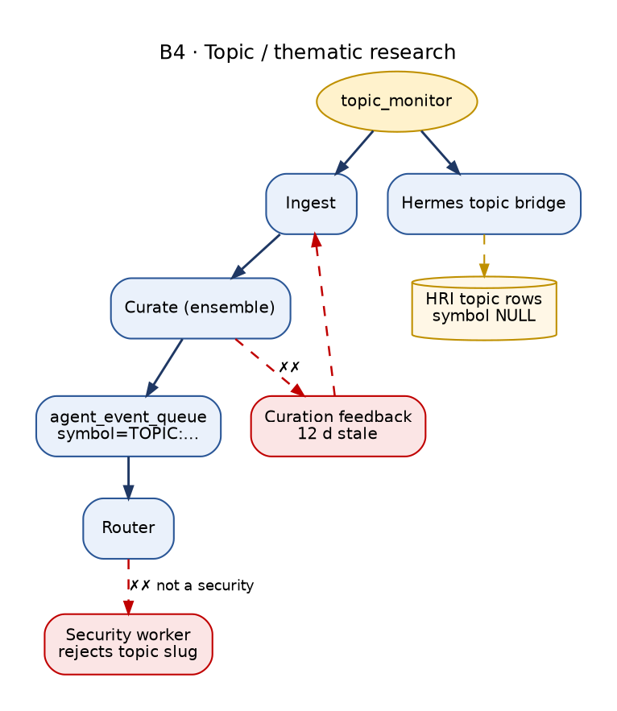
```dot
digraph lc_b4 {
  graph [rankdir=TB, fontname="Helvetica", fontsize=12, label="B4 · Topic / thematic research", labelloc=t, nodesep=0.25, ranksep=0.32, pad=0.3];
  node [style="rounded,filled", fontname="Helvetica", fontsize=9.5];
  edge [fontname="Helvetica", fontsize=8.5, arrowsize=0.7];
  tm [label="topic_monitor", shape=oval, fillcolor="#FFF2CC", color="#BF9000"];
  ing [label="Ingest", shape=box, fillcolor="#EAF1FB", color="#2B5797"];
  cur [label="Curate (ensemble)", shape=box, fillcolor="#EAF1FB", color="#2B5797"];
  q [label="agent_event_queue\nsymbol=TOPIC:…", shape=box, fillcolor="#EAF1FB", color="#2B5797"];
  router [label="Router", shape=box, fillcolor="#EAF1FB", color="#2B5797"];
  worker [label="Security worker\nrejects topic slug", shape=box, fillcolor="#FBE5E5", color="#C00000"];
  hbridge [label="Hermes topic bridge", shape=box, fillcolor="#EAF1FB", color="#2B5797"];
  hri [label="HRI topic rows\nsymbol NULL", shape=cylinder, fillcolor="#FFF7E6", color="#BF9000"];
  fb [label="Curation feedback\n12 d stale", shape=box, fillcolor="#FBE5E5", color="#C00000"];
  tm -> ing [color="#1F3864", penwidth=1.4];
  ing -> cur [color="#1F3864", penwidth=1.4];
  cur -> q [color="#1F3864", penwidth=1.4];
  q -> router [color="#1F3864", penwidth=1.4];
  router -> worker [label="✗✗ not a security", color="#C00000", style=dashed, penwidth=1.2];
  tm -> hbridge [color="#1F3864", penwidth=1.4];
  hbridge -> hri [color="#BF9000", style=dashed];
  cur -> fb [label="✗✗", color="#C00000", style=dashed, penwidth=1.2];
  fb -> ing [color="#C00000", style=dashed, penwidth=1.2];
}
```

---

# FAMILY C — WATCHLIST, PROPOSAL AND LEARNING LIFECYCLES

Fact base: `lifecycles/LIFECYCLE_FACTBASE_C_WATCHLIST_2026-09-14.md`. The prior 56 hours were a
weekend; weekday-only producers last ran Friday 09-11. The execution side of proposals is
outside this document (⊘ AGENTS.md §0/§1).

## C1 · Symbol / watchlist item

### (a) Purpose, actors, stores

- **Purpose:** turn "a ticker someone or something noticed" into a researched, synthesized, gated view (HOLD / ADD / TRIM / AVOID), a watch directive, a re-entry plan and a strategy card — then either graduate it to a proposal (C2) or retire it.
- **Actors:** intake writers (intel auto-discovery, agent discovery, Finviz screener, pullback MACD, proposal bridge, Hermes directive discovery, directive promotion, small-cap rotation, social scalp scanner, operator via api_v2, holdings sync) · identity gate `hermes_discovery/symbol_validation.py` · enrichment (`watchlist_enrichment_sweep.py`, strategy cards, Hermes scorer and scope governor) · seven job enqueuers · worker `process_watchlist_agent_jobs.py` via `run_watchlist_agent_jobs_offpeak.sh` · synthesis `run_synthesis` + `synthesis_safety.py` · directives service/writer/gate/hygiene · re-entry desk · decision scheduler · removal (`watchlist_hygiene.py`, `incubator_rolloff_engine.py`).
- **Stores:** `watchlist_items` · `symbol_profiles` · `watchlist_strategy_cards` · `watchlist_escalation_policies` · `watchlist_agent_jobs` · `watchlist_agent_results` · `watchlist_analysis_maturity` · `watchlist_final_synthesis` · `watchlist_synthesis_safety_history` · `watchlist_research_cards` · `decision_inputs` · `watch_directives` · `watch_directive_hits` · `watch_decision_refresh_jobs` · `reentry_decision_desk_latest.json`.

### (b) State machines (exact values)

**`watchlist_items.status`** (no CHECK; default `active`): removed 7,620 · researched 5,970 · active 142 (13,732 rows over 11,783 symbols).

| From → To | Trigger | Module |
|---|---|---|
| ∅ → active | any intake writer | many |
| active → queued → active | operator Refresh; LLM failure | `api_v2.py:9327`; worker `:2824` |
| queued/active → researched | any agent job completes | worker `:2999` |
| active → removed | weekly hygiene (low-confidence discovery, all agents SELL/AVOID, no analysis 30+ d, unsafe synthesis) | `watchlist_hygiene.py:180` — **`WHERE status='active'` only** |
| removed → active | directive promotion | `directive_promotion.py:211` |
| researched → ∅ | **no exit** — 5,970 rows never pruned (INFERRED) | — |

**Identity gate** (in order): empty → topic slug → shape → portfolio-held (accept) → `symbol_profiles` row (accept) → otherwise reject. Fail-closed, also on DB error, with the same message.

**`watchlist_agent_jobs.status`** (all-time): completed 45,475 · failed 20,200 · expired 7,239 · cancelled 2,085 · deferred 1,886 · superseded 1,224 · queued/pending/processing **0**.

| From → To | Trigger | Where |
|---|---|---|
| ∅ → queued | `governed_enqueue` (or raw INSERT fallback) | `agent_job_enqueue_governance.py:165`; worker `:3152` |
| ∅ → not inserted `DEFERRED_BACKPRESSURE` | tail under pressure | governance `:115-128` |
| queued → deferred "[STALE backlog — not paid]" | age > 36 h (tail) / > 168 h (T0/T1) | governance `:335-344` |
| queued → superseded | same semantic key queued | governance `:349-360` |
| queued → expired "[off-hours tail deprioritized]" | off-hours, age > 2 h | worker `:2667` |
| queued → failed "[invalid_symbol]" | symbol gate | worker `:2748-2762` |
| processing → failed | risk data-gap enrichment failed; LLM empty / COST_CAP / INPUT_LIMIT / CIRCUIT_OPEN | worker `:2797`, `:2823` |
| processing → completed | parsed + G0 number grounding + result insert | worker `:2838-2984` |
| processing → queued | reaper (> 20 min) | worker `:2645-2649` |

**Terminal:** completed, failed, expired, deferred, superseded, cancelled. **No retry exists for failed or deferred.**

**`watchlist_analysis_maturity`** (CHECK): `analysis_stage` raw_data_only · strategy_card_ready · routed · specialist_review_partial · specialist_review_complete · full_chain_complete · final_synthesis_complete · needs_iteration · failed; `final_synthesis_status` pending · queued · processing · completed · failed · tail_dormant. `_apply_escalation_policy` resets the stage to `routed` on **every job claim** before recompute. Now: final_synthesis_complete 1,055 · specialist_review_partial 575 (552 > 14 d) · failed 459 · routed 353 (all > 30 d) · specialist_review_complete **1 (WMT)**.

**`watchlist_final_synthesis`**: `decision_safety` safe / unsafe / blocked / pending; `decision_quality_status` has ten values but **all 1,145 rows are `pending`** — the real verdict lives on the maturity row.

**`watch_directives.status`** CHECK ∈ active · paused · archived · needs_review · expired; the writer and gate also emit **`proposed`**, which the CHECK rejects (89 violations, last 08-23). Now: active 542 · archived 281 · expired 213 · paused 6.

**`watch_decision_refresh_jobs.state`**: SKIPPED_CURRENT 40,904 · COMPLETE 14,197 · SKIPPED_LOCKED 6,176 · FAILED 2,391 · QUEUED 80.

**Re-entry desk:** deterministic, `llm_in_path=false`; 106 symbols, 27 actionable (40 ≤ RSI < 70, within 3 %, stale 96 h, wash 30 d); rows carry entry/stop/target/rr but no per-row state.

### (c) End-to-end flow

```
 INTAKE (74 new rows / 7 d; 85 % AI discovery) ══▶ 0 watchlist_items (updated_at re-touched en masse — not liveness ▓)
 ══▶ 1 ENRICH + STRATEGY CARD (weekday */30; "enriched 180/180") ◀── strategy cards 5,788 (newest Fri 17:56)
 ══▶ 2 ENQUEUE (7 producers; governed dedupe/backpressure)
        auto-queue: active ∧ symbol NOT IN any job, LIMIT 5 — no profile check ✗✗▶ B1 permanent exclusion
        7 d: social_scalp 358 → 287 superseded · proposal_queue 299 → 271 failed · auto_queue 213 → 182 failed · holdings 82 → 82 failed
        worker cron */15 10-20 ET, --limit 8, containment flag armed since 08-20 and overridden per process
 ══▶ 3 IDENTITY GATE (fail-closed) ◀── symbol_profiles 2,980 (weekly rebuild CRASHED 09-13; 954 rows at 00:15 by an unidentified writer)
        rejections 7 d: 184 · 49 % of active/researched symbols unprofiled · no path to build the missing profile ✗
 ══▶ 4 SPECIALIST CALL (Maria / Steph / Risk / Tax) ── governed_flash_call: containment → circuit → input limit → run caps → GLOBAL cap
        ◀── results 917 (newest 09-12 20:00; 0 in the last 28 h) · provenance 867/867 · number_grounding 0/867 (unexercised)
 ══▶ 5 MATURITY LADDER (required {steph, risk}) ── nothing re-queues missing agents ✗
 ══▶ 6 CIO SYNTHESIS (2 results/agent, 40,000 chars; grok · chatgpt · flash; conservative verdict wins)
        no results → return silently at :2131-2134 ✗
 ══▶ 7 SAFETY GATE ── runs anyway on the 06-23 synthesis → sets safe + actionable + updated_at=now() ⟳ (WMT 92×)
 ══▶ 8a DIRECTIVES (service crashed 09-11: SSL + lock timeout; 403 active not serviced > 72 h)
     8b RE-ENTRY DESK █ (deterministic, fresh price)
     8c PROPOSAL BRIDGE → C2 (1,947 proposals / 30 d)
 ══▶ 9 REMOVAL (Sun 09:30: "489 removed") ── researched never removed ✗

 FEEDBACK: hygiene "all agents AVOID" ╌╌▶ removal █ · synthesis_retry when every lane fails ▓
           gate reject ✗✗▶ profile build · failed/deferred ✗✗▶ re-queue · realized_outcome (win 102 / loss 25) ✗✗▶ agent prompt
```

### (d) Iterations

| Loop | Cadence | Closes? | What changes |
|---|---|---|---|
| Worker drain | */15 10:00–20:59 ET | runs; mostly "No queued jobs" | nothing to do — work was shed upstream |
| Orphan reaper | every run | yes | 0 processing |
| Queue governance | every run | yes — sheds rather than does | superseded 324, deferred 109 in 7 d |
| Auto-queue new symbols | every run, 5 | **no** | a rejected symbol is excluded forever |
| Pending-synthesis sweep | every run | **no** | WMT `updated_at` / `actionable` re-stamped, 92 log lines ⟳ |
| synthesis_retry | on all-lane failure | partial | 0 all-lane failures since 08-30 |
| Enrichment | */30 weekdays | yes | 180/180 |
| Directive servicing | */30 weekdays | **broken** | DB errors mid-run |
| Directive TTL + hygiene | weekly | yes | 55 expired |
| Profile rebuild | Sun 19:00 + weekday top-300 | **broke 09-13** | SSL traceback |

### (e) Questions

| Stage | Question | Answered by | Dropped where |
|---|---|---|---|
| Intake | "Worth watching?" | the writer's own heuristic | no second opinion |
| Gate | "Is this a real security?" | table lookup | **reject is final**; nobody asks "then build the profile" |
| Agent | "What does Maria / Steph / Risk / Tax conclude?" | Flash, gemma3:4b, Grok | 560 failed in 7 d, never retried |
| Data gate | "Is the data good enough to spend a call?" | risk RESEARCH_MORE + quality < 60 | a skip marks the job failed |
| Maturity | "Have all required agents spoken?" | array compare | nothing re-queues them (1,387 pending) |
| Synthesis | "What should we do?" | three lanes | missing-results path returns silently |
| Safety | "Is it safe to act on?" | rules | runs on stale synthesis |
| Directive | "Is the theme still live?" | directives service | crashes; 403 unserviced |
| Re-entry | "Is it at a re-entry level now?" | deterministic desk | no persisted per-row decision |
| Removal | "Still relevant?" | weekly hygiene | `researched` rows never asked |

### (f) Live measurements

- **7-day job throughput** (created 09-07..09-13, n = 1,057): completed 31 (**2.9 %**) · failed 560 (53.0 %) · superseded 324 (30.7 %) · deferred 109 (10.3 %) · expired 33 (3.1 %).
- Failed by origin: proposal queue 271 · auto-queue 182 · holdings enqueue 82 · health remediation 11 · event router 8 · tax sweep 5. Failed by class: identity gate 184; LLM path COST_CAP 197 · INPUT_LIMIT 105 · CIRCUIT_OPEN 17.
- By agent: maria 14 done / 154 failed / 289 superseded / 71 deferred · risk 9 / 197 · steph 7 / 153 · tax 0 / 42.
- Worker log by UTC day (COST / INPUT / CIRCUIT / GATE / ok / fail / pending-synth): 09-07 22/11/0/15/0/33/0 · 09-09 45/11/12/25/0/68/9 · 09-11 31/32/0/0/0/63/10 · 09-12 22/16/0/60/22/38/15 · 09-13 0/4/0/30/6/4/44.
- **Cycle times:** job → completed p50 6.5 h, p90 25.2 h · job → failed p50 2.3 h · symbol add → first agent result (60-day cohort, n = 1,469): **7.1 % ever get one**, p50 **10.5 d**, p90 33 d · add → synthesis p50 106 h, p90 812 h; 958 of 1,055 completed syntheses no longer have a backing result row (results retained since 08-14 only).
- **Stuck:** maturity `routed` 353 (all > 30 d) · partial 552 > 14 d · failed 459 (oldest 08-08) · 403 directives unserviced > 72 h · oldest open item: maturity row from 06-21, still `routed/pending`.

### (g) Failure paths

1. Gate → permanent exclusion (167 failures in 7 d took this path). 2. TOPIC slugs routed to the security worker (B4). 3. **Global cost-cap starvation** — `COST_CAP_EXCEEDED: global cap` 503 and `daily request cap` 147 all-time, 0 per-process hits (C4). 4. Input limit (cap raised to 8,000 on 09-13, unexercised). 5. Circuit breaker (8 errors → 15 min). 6. Data-gap skip marks failed. 7. Holdings enqueue 82/82 failed. 8. **Synthesis with no results re-stamps a stale verdict as actionable** — an integrity defect, not a stall. 9. Directive service DB errors. 10. Directive `proposed` violates CHECK. 11. Profile rebuild crash. 12. `updated_at` is not liveness — any freshness monitor on these columns is fooled.

### (h) Maturity per stage

| Intake | Enrich | Enqueue | Gate | Agents | Maturity | Synthesis | Safety | Directives | Re-entry | Removal |
|---|---|---|---|---|---|---|---|---|---|---|
| L1 | L1 | L1 | L1 | L1 (→ L2 on paper) | L1 | L1 | L1 / integrity **L0** | L1 | **L2** | L1 |

### (i) Target and exit

**Target:** intake → gate → (unprofiled → profile job → re-gate, bounded) → enrich → enqueue required agents under a per-lane budget reservation → class-aware retry (COST/CIRCUIT defer to the next window; INPUT trims; GATE builds a profile) → maturity re-queues missing agents to a ceiling, then `tail_dormant` → synthesis only when results are newer than the prior synthesis, else `stale_analysis` → safety only on a synthesis written in this run → outcome scored at 30/60/90 d → calibration and lessons in the next prompt → removal keyed on last real verdict age for `researched` as well as `active`.
**Exit:** every job ends completed, dormant-after-N or operator-closed · no symbol permanently excluded by a transient gate failure · WMT-style re-stamps = 0.

**Update 2026-09-14:** not re-measured. Budget-side changes that affect this lifecycle: caps now count
actual spend under a $2.00/day global cap with calibrated reservations (#1015), removing the
phantom-money `COST_CAP_EXCEEDED: global cap` refusals; the synthesis prompt budget and 32,000 cap are
live (#1002). Gate exclusion, retry, integrity re-stamping and topic routing are unchanged.

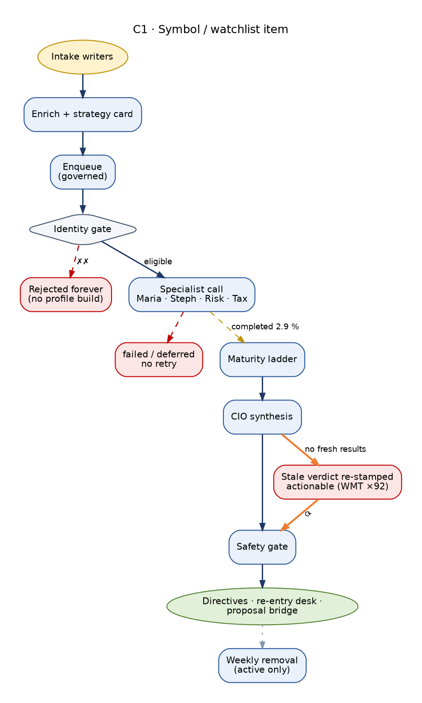
```dot
digraph lc_c1 {
  graph [rankdir=TB, fontname="Helvetica", fontsize=12, label="C1 · Symbol / watchlist item", labelloc=t, nodesep=0.25, ranksep=0.32, pad=0.3];
  node [style="rounded,filled", fontname="Helvetica", fontsize=9.5];
  edge [fontname="Helvetica", fontsize=8.5, arrowsize=0.7];
  intake [label="Intake writers", shape=oval, fillcolor="#FFF2CC", color="#BF9000"];
  enrich [label="Enrich + strategy card", shape=box, fillcolor="#EAF1FB", color="#2B5797"];
  enq [label="Enqueue\n(governed)", shape=box, fillcolor="#EAF1FB", color="#2B5797"];
  gate [label="Identity gate", shape=diamond, fillcolor="#F4F6F9", color="#44546A"];
  excl [label="Rejected forever\n(no profile build)", shape=box, fillcolor="#FBE5E5", color="#C00000"];
  agent [label="Specialist call\nMaria · Steph · Risk · Tax", shape=box, fillcolor="#EAF1FB", color="#2B5797"];
  fail [label="failed / deferred\nno retry", shape=box, fillcolor="#FBE5E5", color="#C00000"];
  mat [label="Maturity ladder", shape=box, fillcolor="#EAF1FB", color="#2B5797"];
  syn [label="CIO synthesis", shape=box, fillcolor="#EAF1FB", color="#2B5797"];
  safety [label="Safety gate", shape=box, fillcolor="#EAF1FB", color="#2B5797"];
  restamp [label="Stale verdict re-stamped\nactionable (WMT ×92)", shape=box, fillcolor="#FBE5E5", color="#C00000"];
  dir [label="Directives · re-entry desk ·\nproposal bridge", shape=oval, fillcolor="#E2F0D9", color="#548235"];
  rm [label="Weekly removal\n(active only)", shape=box, fillcolor="#EAF1FB", color="#2B5797"];
  intake -> enrich [color="#1F3864", penwidth=1.4];
  enrich -> enq [color="#1F3864", penwidth=1.4];
  enq -> gate [color="#1F3864", penwidth=1.4];
  gate -> agent [label="eligible", color="#1F3864", penwidth=1.4];
  gate -> excl [label="✗✗", color="#C00000", style=dashed, penwidth=1.2];
  agent -> mat [label="completed 2.9 %", color="#BF9000", style=dashed];
  agent -> fail [color="#C00000", style=dashed, penwidth=1.2];
  mat -> syn [color="#1F3864", penwidth=1.4];
  syn -> safety [color="#1F3864", penwidth=1.4];
  safety -> dir [color="#1F3864", penwidth=1.4];
  syn -> restamp [label="no fresh results", color="#ED7D31", style=bold];
  restamp -> safety [label="⟳", color="#ED7D31", style=bold];
  dir -> rm [color="#8497B0", style=dotted];
}
```

---

## C2 · Proposal (up to the approval boundary)

### (a) Purpose, actors, stores

- **Purpose:** convert a researched setup into a sized, plan-bearing, reviewed proposal that an approval gate accepts, rejects or lets expire.
- **Actors:** producers (`watchlist_proposal_bridge.py` */30 10-15 · `pullback_macd_screener.py` · `auto_proposal_generator.py` · `incubator_proposal_promoter.py` hourly · `catalyst_momentum_engine.py`) · enrichment/readiness (`proposal_enrichment_loop.py` */10, technicals, readiness, entry planner 17:45) · review (`queue_proposal_agent_reviews.py` → watchlist jobs → `sync_proposal_reviews_from_watchlist`) · lifecycle/expiry (`proposal_lifecycle.py`, `cleanup_stale_proposals.py`, stale sweeper 08:15/08:25/16:10, revalidation */30) · approval gate `atm_auto_approver.py` (*/15) and the operator.
- **Stores:** `paper_trade_proposals` (trigger → `proposal_status_events`), `proposal_agent_reviews`, `proposal_execution_readiness`, `proposal_lifecycle_events`, `incubator_universe`, `incubator_events`, `proposal_promotions`.

### (b) State machine

`status` (no CHECK; default PENDING), all-time: EXPIRED 7,240 · REJECTED 1,946 · RISK_BLOCKED 262 · APPROVED 62 · APPROVED_FOR_PAPER_TEST 11 · PENDING 3 · CANCELLED 1. A second, orthogonal `lifecycle_status` (ACTIVE · ENTRY_ZONE_VALID · ENTRY_MISSED · EXPIRED · EXPIRED_MAX_WINDOW) **disagrees**: 2,693 EXPIRED proposals still read ACTIVE. `proposal_agent_reviews.status` pending / reviewed (agent names case-duplicated).

Observed transitions, 30 d:

| From → To | n | Writer |
|---|---|---|
| ∅ → PENDING | 3,251 | producers |
| PENDING → EXPIRED | 2,732 | lifecycle, cleanup, sweeper, quote-age review |
| PENDING → REJECTED | 402 | auto-approver, operator |
| PENDING → APPROVED_FOR_PAPER_TEST | 298 | paper-submit side ⊘ |
| APPROVED_FOR_PAPER_TEST → PENDING | **266** | cleanup "Requeued: execution revalidation" |
| PENDING → RISK_BLOCKED | 82 | risk gate |
| APPROVED_FOR_PAPER_TEST → APPROVED | 15 | cleanup "paper trade completed" |
| AFPT → REJECTED / EXPIRED | 5 / 2 | cleanup |

Terminal: EXPIRED, REJECTED, RISK_BLOCKED, CANCELLED. Boundary: APPROVED_FOR_PAPER_TEST, APPROVED — anything past them is ⊘.

### (c) Flow

```
 P0 INCUBATOR PROMOTER (hourly) ──▶ proposal_promotions 0 ever ✗ (last 40 runs "Promoted: 0")
      blocks: no_authoritative_trade_plan · invalid_strategy_id 'swing_trade'/'recovery_watch' not in YAML · quote 2,714 h stale
 P1 CREATE (bridge 1,947 · pullback_macd 1,137 in 30 d) ── signal_decision / critic_verdict NULL on 1,600/1,600 (14 d) ✗
 ══▶ P2 ENRICH + READINESS (17,205 rows; spread_pct plausibility OFF) ──▶ lifecycle_status
 ══▶ P3 AGENT REVIEW ── review row updated ONLY when its job completes ✗✗▶ 6,336 pending > 2 d (oldest 05-07)
 ══▶ P4 APPROVAL GATE ── median create → approve 5 min (shorter than one 15-min worker cycle: review cannot come first)
        → AFPT 298 · REJECTED 402 · RISK_BLOCKED 82 · EXPIRED 2,732 (84 %)
 ⊘ BOUNDARY (paper submit, broker orders, fills, stops — operator-controlled, 2FA)
      visible return edges only: AFPT → PENDING 266 ╌╌▶ P4 (thrash) · AFPT → APPROVED 15 ╌╌▶ C3
```

### (d)–(e) Iterations and questions

| Loop / question | Closes? | Evidence |
|---|---|---|
| "Does this candidate have a plan, fresh quote, known strategy?" (P0) | **no** — every candidate blocked; strategy YAML drift has no owner | 0 promotions |
| "Is this ready to propose?" (P1) | heuristics only | critic question never asked |
| "Is the entry still valid?" (P2) | yes | `lifecycle_status` diverges from `status` |
| "Do Maria / Steph / Risk agree?" (P3) | **no** | 854 pending vs 4 reviewed in 7 d; review jobs 30 d: failed 886 · deferred 539 · superseded 191 · completed 400 |
| "Approve?" (P4) | yes, without P3 | 5 min median |
| "Has anything material changed since approval?" (return) | **thrash** | CANF #9120 flipped 26 times; 266 requeues vs 15 completions |
| Stale sweep | yes | the dominant exit |

### (f) Measurements

Created 30 d 3,251 → EXPIRED 84.1 % · REJECTED 12.5 % · RISK_BLOCKED 2.5 % · APPROVED + AFPT **0.8 %** · PENDING 3. Create → approve p50 5.2 min; create → reject p50 0.14 h; expiry clock BLOCKED (no `expired_at`). **Stuck at the boundary:** 11 × APPROVED_FOR_PAPER_TEST, `execution_status='not_submitted'`, approved 09-03..09-11 (the health agent reports 3); `updated_at` on all 11 is 09-14 00:15 because an enrichment touch masks staleness. Pending reviews by agent: steph 2,221 · risk 2,032 · maria 1,976 · scalp_critic 107.

### (g)–(i) Failure paths, maturity, target

Failure paths: promoter blocked 100 %; reviews never close; approval before review; revalidation thrash with an undercounting health check; critic fields unpopulated; two liveness columns.
Maturity: promoter **L0** (output) · create L1 · enrich/readiness L1 · agent review L1 on paper / **L0** in effect · approval gate L1.
**Target:** P4 is unreachable until P3 holds a closed review per required agent (reviewed, or `review_unavailable` with a reason); revalidation has a hard cap that escalates to the operator; promoter strategy ids validated at intake; one liveness column.
**Exit:** 0 proposals approved with an open required review · 0 AFPT ↔ PENDING flips above the cap · `proposal_promotions` > 0 · health count of AFPT equals the table.

**Update 2026-09-14:** unchanged (not re-measured). The execution side stays out of scope (⊘).

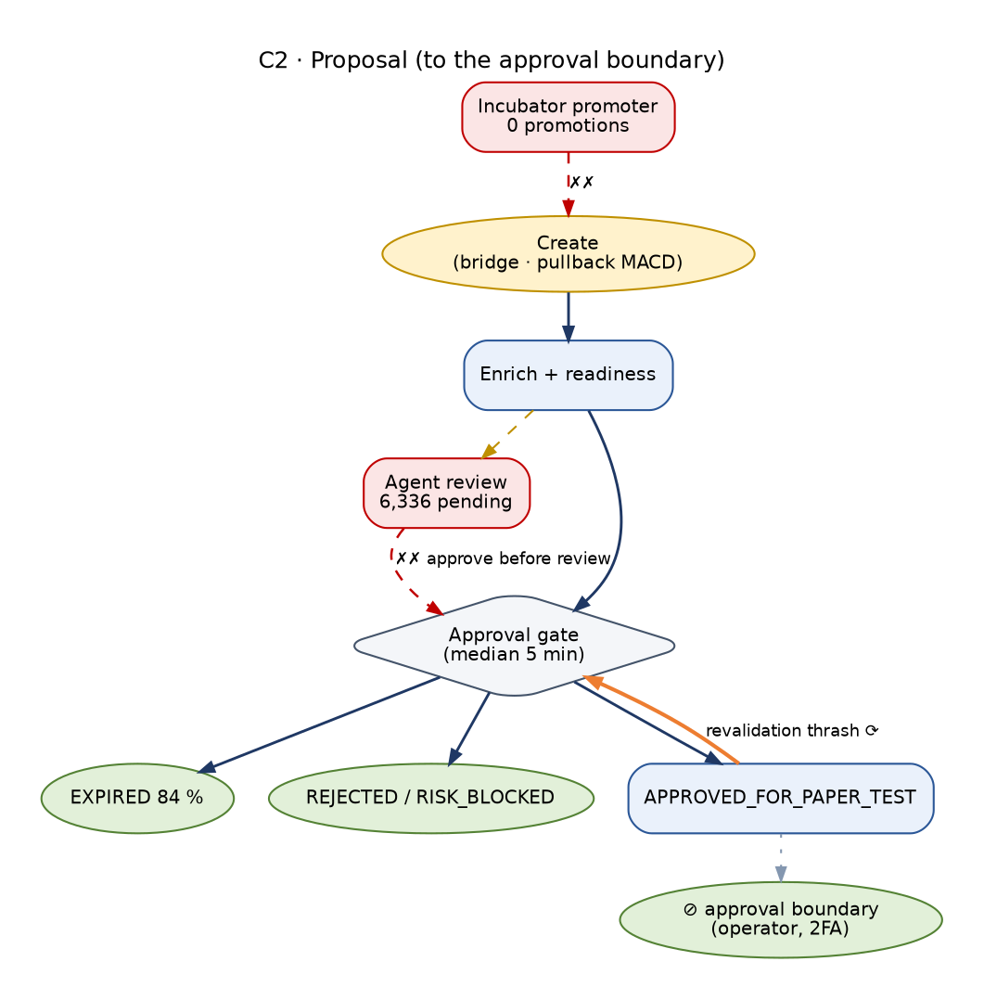
```dot
digraph lc_c2 {
  graph [rankdir=TB, fontname="Helvetica", fontsize=12, label="C2 · Proposal (to the approval boundary)", labelloc=t, nodesep=0.25, ranksep=0.32, pad=0.3];
  node [style="rounded,filled", fontname="Helvetica", fontsize=9.5];
  edge [fontname="Helvetica", fontsize=8.5, arrowsize=0.7];
  prom [label="Incubator promoter\n0 promotions", shape=box, fillcolor="#FBE5E5", color="#C00000"];
  create [label="Create\n(bridge · pullback MACD)", shape=oval, fillcolor="#FFF2CC", color="#BF9000"];
  enrich [label="Enrich + readiness", shape=box, fillcolor="#EAF1FB", color="#2B5797"];
  review [label="Agent review\n6,336 pending", shape=box, fillcolor="#FBE5E5", color="#C00000"];
  gate [label="Approval gate\n(median 5 min)", shape=diamond, fillcolor="#F4F6F9", color="#44546A"];
  exp [label="EXPIRED 84 %", shape=oval, fillcolor="#E2F0D9", color="#548235"];
  rej [label="REJECTED / RISK_BLOCKED", shape=oval, fillcolor="#E2F0D9", color="#548235"];
  afpt [label="APPROVED_FOR_PAPER_TEST", shape=box, fillcolor="#EAF1FB", color="#2B5797"];
  bound [label="⊘ approval boundary\n(operator, 2FA)", shape=oval, fillcolor="#E2F0D9", color="#548235"];
  prom -> create [label="✗✗", color="#C00000", style=dashed, penwidth=1.2];
  create -> enrich [color="#1F3864", penwidth=1.4];
  enrich -> gate [color="#1F3864", penwidth=1.4];
  enrich -> review [color="#BF9000", style=dashed];
  review -> gate [label="✗✗ approve before review", color="#C00000", style=dashed, penwidth=1.2];
  gate -> exp [color="#1F3864", penwidth=1.4];
  gate -> rej [color="#1F3864", penwidth=1.4];
  gate -> afpt [color="#1F3864", penwidth=1.4];
  afpt -> gate [label="revalidation thrash ⟳", color="#ED7D31", style=bold];
  afpt -> bound [color="#8497B0", style=dotted];
}
```

---

## C3 · Review and learning (advisory side)

### (a) Actors and stores

| Actor | Schedule | Store | Newest / 7 d |
|---|---|---|---|
| `journal_review_builder.py` | 18:30 wkdy | `journal_trade_reviews` 231 | 09-11 · 5 |
| `multi_tier_trade_reviewer.py` | 22:30 wkdy / Sun / 1st | `paper_trade_multi_reviews` 128 | **08-30** · 0 (empty_response 58; monthly "credit balance too low") |
| `trade_close_llm_analyzer.py` | 20:00 wkdy / Sun | `trade_llm_reviews` 2,184 | 09-10 · 36 |
| thesis reviews / outcomes | — | 970 / 94 | 09-11 · 117 / **08-10** · 0 |
| `wire_advisory_lessons.py` | 6 h | `trade_lesson_memory` 188 → `strategy_lesson_rollup` 767 | "wired 178" every run |
| `advisory_lessons.py` reflect / ratify-safe / auto-retire | 21:40 | `advisory_kb_lessons.jsonl` 1,686; applications 1,520 | ratified 09-14 01:40Z; applications **08-27** |
| `advisory_outcome_scorer.py` | 18:30 | advisory outcomes 30/60/90 d | 09-13 |
| `agent_outcome_scorer.py --apply` | Sun 11:00 | `agent_recommendation_outcomes` 7,006, `agent_calibration` 298 | 09-13; declared output `agent_outcome_scores` **does not exist** |
| `agent_outcome_linker.py` | 11:00 wkdy | links 89,237 | 09-11 · 7,500 |
| `agent_calibration_engine.py` | Sun 12:00 | events 33,106 | "2000 events" every run (INFERRED truncation); run log 0 rows |
| `record_decision_outcome.py` | 07:50 wkdy | `decision_outcomes` 1,391 | 09-10 · 11 |
| Stop curation / stop health / protection advisor / gain guardian | weekday | HRI stop_curation 6,750 · stop_health 768 · protection_advisory 1,872 · guardian stdout only | 09-11; last Grok sweep advised 0, failed 10 |

### (b) State machines

- **KB lesson:** `candidate` → `ratified` (by `iris_auto_safe` or `iris_bootstrap`, or `ratify --by`) → `retired`. Now candidate 17 · ratified 1,610 · retired 76. Ratified by `iris_auto_safe` 1,510 · `iris_bootstrap` 176 · **human 0**.
- **Application row** `{lesson_id, symbol, hit, cited}`: `hit` **null on 1,520/1,520**; hit_rate median 0.0.
- **HRI stop/protection:** staged → promoted | archived — `reviewed` and `rejected` never used (archived 8,564 · promoted 803 · staged 23).
- **`trade_lesson_memory`:** no status; 178 of 188 rows rewritten every 6 h.

### (c) Flow

```
 ⊘ closed trades ──▶ R1 TRADE REVIEW ── journal █ · LLM trade reviews █ · multi-tier ✗ (empty / credit) · thesis outcomes ✗ (08-10)
 ══▶ R2 OUTCOME SCORING (weekly) ── recommendation outcomes 7,006 █ · links █ · decision_outcomes ▓ · realized_outcome win 102 / loss 25
        synthesis verdicts never scored (WFS decision_quality_status pending 100 %) ✗
 ══▶ R3 CALIBRATION ── steph 95–96 % "STABLE", tax 100 % (≤ 8 samples) → implausible, unvalidated
 ══▶ R4 LESSONS ── reflect █ → ratify-safe (auto) → auto-retire on hit_rate computed from null hits (INFERRED) ⟳
 ══▶ R5 RETURN TO PROMPTS
        watchlist agent prompt ◀── calibration block █ (read every call) · RAG content_embeddings (trade_review 57, newest 08-16)
        advisory desk prompt ◀── KB retrieve_lessons_for_row (applications stopped 08-27) ✗
        trade_lesson_memory ✗✗▶ no reader in watch/proposal agents (readers: api_v2, reports, rollup only)
 PROTECTION SIDE: grok stop review █ · stop health █ · protection advisor ▓ (Grok COST_CAP + 502; ChatGPT POLICY_NOT_ALLOWED) · gain guardian ▓ (no store)
        exit_advisory_outcomes 0 ✗ — no scorer for guardian or exit advice
```

### (d)–(e) Iterations and questions

| Loop | Closes? | Question it should answer | Dropped |
|---|---|---|---|
| Nightly lesson reflection | produces; scoring half open | "What should we do differently?" | never asks "did the lesson help?" (hit null) |
| Auto-ratify | **self-approving** | "Is this lesson true?" | 0 human, 0 evidence |
| Auto-retire | on null evidence (INFERRED) | "Did it stop working?" | — |
| wire_advisory_lessons | churn, not accumulation ⟳ | — | — |
| Outcome scorer → calibration → prompt | **the only closed edge** | "How reliable is each agent?" | accuracy never validated externally; 2,000-event truncation |
| Trade review → lesson | **broken since 08-30** | "Was the thesis right, and why?" | empty responses, provider credit |
| Thesis outcome | dark since 08-10 | "Did the thesis resolve?" | — |
| Stop curation → operator | promotes 10 % | "Is this stop right?" | no outcome scoring for exit/guardian advice |

### (f) Measurements

7-day learning throughput: journal reviews 5 · LLM trade reviews 36 · multi-tier 0 · thesis reviews 117 · thesis outcomes 0 · recommendation outcomes 258 · calibration rows 20 · KB ratified 9 · KB applications 0 · stop curation 352 · protection advisories 18. Stuck beyond 2× cadence: multi-tier reviews 15 d · KB applications 18 d · thesis outcomes 35 d · calibration run log never written.

### (g)–(i) Failure paths, maturity, target

Failure paths: provider credit exhausted and empty responses; self-ratification without hit recording; declared table missing so the integrity sweep counts a live producer as broken; calibration truncation with no run provenance; Grok lane blocked by cap and 502, ChatGPT refused; gain guardian has no durable store.
Maturity: journal L1 · multi-tier **L0** · outcome scoring L1 (L2 deterministic) · calibration L1 (feeds prompts, L3 unvalidated) · lesson generation L1 / evaluation **L0** · return to prompts: calibration L1, KB → desk **L0** since 08-27, `trade_lesson_memory` → agents **L0** · stop curation L1 · protection L1 local / L0 Grok · guardian L1 compute / **L0** store and scoring.
**Target:** outcome at 30/60/90 d → lesson candidate carrying its outcome ids → ratification needs a measured hit rate over ≥ N applications or a human → retrieval into the specific agent prompt that made the call → next outcome compared with and without the lesson; auto-retire only on non-null evidence; every advisory producer writes a durable row a scorer reads.
**Exit:** application `hit` non-null > 0 · ≥ 1 human or evidence-based ratification · multi-tier reviewer writing again · `exit_advisory_outcomes` > 0 · calibration validated against an external sample.

**Update 2026-09-14:** unchanged (not re-measured). The advisory lessons-reflect timer moved 21:40 → 19:40
to stay inside the operator window (#1020).

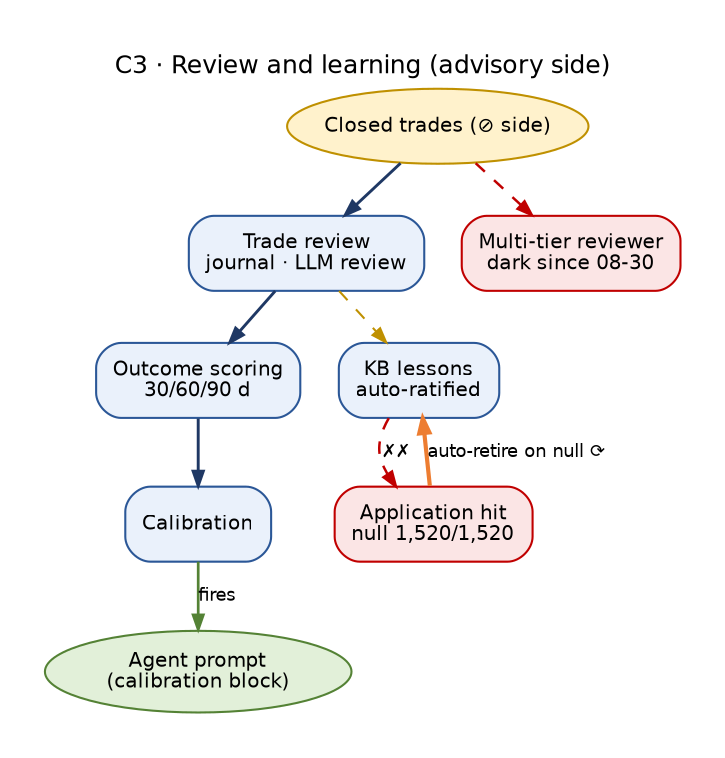
```dot
digraph lc_c3 {
  graph [rankdir=TB, fontname="Helvetica", fontsize=12, label="C3 · Review and learning (advisory side)", labelloc=t, nodesep=0.25, ranksep=0.32, pad=0.3];
  node [style="rounded,filled", fontname="Helvetica", fontsize=9.5];
  edge [fontname="Helvetica", fontsize=8.5, arrowsize=0.7];
  trades [label="Closed trades (⊘ side)", shape=oval, fillcolor="#FFF2CC", color="#BF9000"];
  rev [label="Trade review\njournal · LLM review", shape=box, fillcolor="#EAF1FB", color="#2B5797"];
  multi [label="Multi-tier reviewer\ndark since 08-30", shape=box, fillcolor="#FBE5E5", color="#C00000"];
  score [label="Outcome scoring\n30/60/90 d", shape=box, fillcolor="#EAF1FB", color="#2B5797"];
  calib [label="Calibration", shape=box, fillcolor="#EAF1FB", color="#2B5797"];
  prompt [label="Agent prompt\n(calibration block)", shape=oval, fillcolor="#E2F0D9", color="#548235"];
  lessons [label="KB lessons\nauto-ratified", shape=box, fillcolor="#EAF1FB", color="#2B5797"];
  hit [label="Application hit\nnull 1,520/1,520", shape=box, fillcolor="#FBE5E5", color="#C00000"];
  trades -> rev [color="#1F3864", penwidth=1.4];
  trades -> multi [color="#C00000", style=dashed, penwidth=1.2];
  rev -> score [color="#1F3864", penwidth=1.4];
  score -> calib [color="#1F3864", penwidth=1.4];
  calib -> prompt [label="fires", color="#548235", penwidth=1.3];
  rev -> lessons [color="#BF9000", style=dashed];
  lessons -> hit [label="✗✗", color="#C00000", style=dashed, penwidth=1.2];
  hit -> lessons [label="auto-retire on null ⟳", color="#ED7D31", style=bold];
}
```

---

## C4 · Agent-job budget admission

### (a)–(b) Actors, registry, failure classes

Process registry (dev tree @ c594d8600): `watchlist_maria_flash_narrative` in 8,000 / out 800 / $2.00 · `risk` 8,000 / 800 / $1.00 · `steph` 8,000 / 1,600 / $1.00 · `agent_debate_flash` **4,000** / 1,000 / $1.50 · `flash_extract` 2,000 / 400 / $0.75 · `watchlist_cio_synthesis_cron` **32,000** / 4,000 / $0.50 (raised from 16,000 by #1002; served value BLOCKED) · `guardian_risk_critique` 32,000 / 8,192 / $0.20. Worker guards: `MAX_CALLS_PER_PROCESS` 40, `MAX_CALLS_PER_RUN_TOTAL` 40, `MAX_PROJECTED_USD_PER_RUN` 0.50, circuit 8 errors / 900 s. The wrapper sets `LLM_GLOBAL_DAILY_USD_CAP=2.00` only when the resolver reports `origin=soak`, and skips DeepSeek peak windows.

Order of checks in `governed_flash_call`:

```
 containment guard → CIRCUIT_OPEN → PROCESS_NOT_REGISTERED → INPUT_LIMIT_EXCEEDED (chars/4 > max_in)
   → per-run caps (0 hits observed) → provider reservation: COST_CAP_EXCEEDED global cap (503) | daily request cap (147)
   → call → NETWORK_ERROR / empty / refusal
 every class → success=False → job status 'failed', no retry; the class exists only in log text, not a job column
```

### (c)–(f) Flow, iterations, questions, measurements

| Measure (7 d, `llm_consumption_log`) | Calls | USD | Fails |
|---|---|---|---|
| watchlist_maria_flash_narrative | 68 | 0.0226 | 1 |
| watchlist_cio_synthesis_cron | 9 | 0.0127 | 0 |
| watchlist_steph_flash_narrative | **1** | 0 | 0 |
| watchlist_entry_planner | 43 | 0 | 0 |
| holding_protection_advisor | 37 | 0 | 16 (502 :8645) |
| advisory_desk_synthesis | 21 | 0.0099 | 0 |

Watch-lane spend for the week ≈ **$0.035** against category caps summing to **$11.75/day**. The question "why did this job fail?" is answered "COST_CAP" — but the cap that bound was the **global** pool consumed elsewhere (F2: `advisory_desk_opinion` 87.6 % of 7-day spend). The loop "refused → retry next slot" retries into the same exhausted pool every 15 minutes.

### Update 2026-09-14 — C4 after PRs #1015, #1020, #1021

- **The cap measures actual spend.** The measurement that drove the change: real spend for the week to
  09-14 was **$4.73** (provider tokens × price schedule), the cap-reservation ledger counted $5.50, and
  the worst-case projection for advisory opinions alone was **$214.61** — so a $0.50 global cap refused
  work on money that was never spent. The live cap was a forgotten $7.00 backfill override from 09-06;
  the portfolio server carried $1.50.
- **Now:** one durable host file sets `LLM_GLOBAL_DAILY_USD_CAP=2.00` for every unit; the overrides are
  archived with a tripwire; reservations use the p90 of the process's settled cost × 1.5 (never above
  worst case); spend is reported by provider, model and process, scheduled vs ad hoc, peak vs off-peak.
- **Attribution:** the eight callers that shared `advisory_desk_opinion` bill to their own processes with
  their own caps (#1021); agent jobs therefore no longer lose a shared pool to unattributed traffic.
- **Timing:** scheduled paid work runs only in the operator window and never at DeepSeek peak (#1020);
  operator-requested work is never gated.
- **Still open:** priority classes with floors; refusal class and retry-after stored on the job.
- **Maturity change:** global admission L1 → **L3** (bounded by actual spend, attributed); refusal record
  and per-lane floor stay **L0**.

### (g)–(i) Failure paths, maturity, target

Failure paths: no per-lane reservation or floor; refusal class not stored on the job; raising per-process input caps cannot fix a global-pool refusal; registry vs DB table (`llm_process_config`) — which one runtime reads is BLOCKED.
Maturity: per-process caps L2 · global admission L1 (refuses the wrong work) · refusal record **L0** · per-lane floor **L0**.
**Target:** budget by priority class with floors (operator questions > held positions > agent jobs > synthesis > background opinion); refusal class and retry-after stored on the job; a refused job defers to the next window instead of failing.
**Exit:** 0 `COST_CAP_EXCEEDED: global cap` on agent jobs for 3 weekdays while total spend ≤ the global cap.

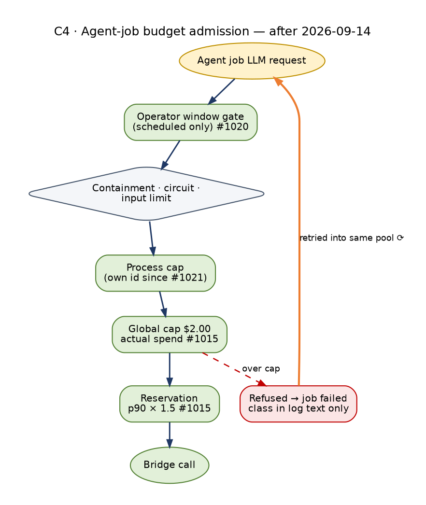
```dot
digraph lc_c4 {
  graph [rankdir=TB, fontname="Helvetica", fontsize=12, label="C4 · Agent-job budget admission — after 2026-09-14", labelloc=t, nodesep=0.25, ranksep=0.32, pad=0.3];
  node [style="rounded,filled", fontname="Helvetica", fontsize=9.5];
  edge [fontname="Helvetica", fontsize=8.5, arrowsize=0.7];
  req [label="Agent job LLM request", shape=oval, fillcolor="#FFF2CC", color="#BF9000"];
  contain [label="Containment · circuit ·\ninput limit", shape=diamond, fillcolor="#F4F6F9", color="#44546A"];
  proc [label="Process cap\n(own id since #1021)", shape=box, fillcolor="#E2F0D9", color="#548235"];
  global [label="Global cap $2.00\nactual spend #1015", shape=box, fillcolor="#E2F0D9", color="#548235"];
  resv [label="Reservation\np90 × 1.5 #1015", shape=box, fillcolor="#E2F0D9", color="#548235"];
  window [label="Operator window gate\n(scheduled only) #1020", shape=box, fillcolor="#E2F0D9", color="#548235"];
  call [label="Bridge call", shape=oval, fillcolor="#E2F0D9", color="#548235"];
  refuse [label="Refused → job failed\nclass in log text only", shape=box, fillcolor="#FBE5E5", color="#C00000"];
  req -> window [color="#1F3864", penwidth=1.4];
  window -> contain [color="#1F3864", penwidth=1.4];
  contain -> proc [color="#1F3864", penwidth=1.4];
  proc -> global [color="#1F3864", penwidth=1.4];
  global -> resv [color="#1F3864", penwidth=1.4];
  resv -> call [color="#1F3864", penwidth=1.4];
  global -> refuse [label="over cap", color="#C00000", style=dashed, penwidth=1.2];
  refuse -> req [label="retried into same pool ⟳", color="#ED7D31", style=bold];
}
```

---

# FAMILY D — CIO COGNITION ITERATION LIFECYCLES

Fact base: `lifecycles/LIFECYCLE_FACTBASE_D_COGNITION_2026-09-14.md`. Stores: wake state
`trade-ai-state/persistent_wake/state/` (not `CURRENT/data/persistent_wake/state`, stale since
09-10); research `trade-ai-state/persistent_wake/research_objects.jsonl`; CIO ledgers
`trade-ai-releases/persistent-state/data/cio/`. The newest wake at measurement was epoch
a8a62217e (04:00Z); the first c594d8600 slot is 05:00Z.

## D1 · The hourly persistent wake (WakeRecord@v2)

### (a) Purpose, actors, stores

- **Purpose:** each hour pick ≤ 3 subjects with unconsumed research or a recent material change; load memory, prior operator turns and comms; decide; commit; receipt; optionally judge, critique and form a view; optionally mint a governed commitment. Advisory only (`MBI_BEHAVIOR = 0`).
- **Actors (crontab):** `:45` governed research producer (`--limit 5 --execute`) · `:55` campaign `wake_selection_feed.py --hours 48` (DB export into `CURRENT/data/persistent_wake/selection_feed/`) · `:00` `run_persistent_wake.py --agent-id cio` (`PERSISTENT_WAKE_ENABLED=1`, phase-8 canary env). In process: `wake_subject_selector.select_subjects` → `WakeEngine.run` (`persistent_agent_wake.py:542`) → `MemoryLoader` → `default_decide` (`:1322`) → `_maybe_judge` (`:1074`; L3 judgment pipeline + independent critic + view synthesis) → `_maybe_cortex_shadow_after_wake` (governed commitment).
- **Stores:** wakes.jsonl 234 · commitments.jsonl 420 · receipts.jsonl 182 · views.jsonl 11 · agent_views.jsonl 193 · l3_judgment_cache.jsonl 7 · research_objects.jsonl 675 · aif_memory.jsonl 970 · DB `operator_conversation_turns`, consumption receipts.

### (b) State machines

**Wake** (`lifecycle_state`; `mint_wake_id` = uuid5(agent + reason + slot + subject); an existing terminal row for the same id returns without new rows):

```
 [none] ──claim──▶ CLAIMED ──load memory──▶ LOADED
                                  ├─ malformed ──▶ MEMORY_MALFORMED (terminal)     3
                                  ├─ unavailable ─▶ MEMORY_UNAVAILABLE (terminal)  0
                                  ├─ stale+refuse ─▶ STALE (terminal)              1
                                  ▼
                            decide (default_decide)
                  act=False ──▶ SETTLED (effect none)                              0 in store
                  act=True  ──commitment OPEN + receipts──▶ ACTED ──▶ SETTLED     230
 restart recovery: CLAIMED/LOADED ⇒ ABANDONED (0) ; ACTED + commitments ⇒ SETTLED
```

**Decision precedence:** operator turn present → OPERATOR_QUESTION / changed_question ▸ memory facts → MEMORY_SALIENCE / changed_commitment ▸ selection → SELECTION_OBSERVATION / changed_question ▸ else act = False.

**Distinct values (n = 234):**

| Field | Values |
|---|---|
| decision reason | organic_from_selection 176 · organic_from_operator_turn 40 · organic_from_memory 14 · null 4 |
| effect_kind | changed_question 216 · changed_commitment 14 · null 4 |
| selection.source | unconsumed_research 200 · material_change 34 |
| policy tokens | feature_flag_on 234 · l3_skipped_ungrounded 104 · stale_memory_retained_with_decay 54 · l3_refused:offpeak_deferred 28 · l3_judged 19 · l3_view_persisted 16 · stale_memory_degraded_to_empty 6 · l3_refused:budget_cap 4 · refuse_malformed_memory 3 · refuse_stale_memory 1 · l3_refused:schema_invalid 1 |
| prior_operator_turn_ids | [] 194 · **['115'] 40** |
| memory_fact_ids | [] 179 · ['mem_490759…'] 55 |
| parent_kind | **null 234** — no wake ever cites a prior wake |

**L3 gate:** facts empty → `l3_skipped_ungrounded` 104 · pipeline refusal → `offpeak_deferred` 28 (fires only 01–13Z) / `budget_cap` 4 / `schema_invalid` 1 · ok → `l3_judged` 19 → critic accept + synthesis → `l3_view_persisted` 16. The judged question is a template: "Does the prior position on this subject still hold given unconsumed_research <id>?"

**Governed commitment** (GovernedCommitment@v1): minted FROZEN at birth, `due_at = +7 d`, confidence 0.6; terminal vocabulary CONFIRMED / REFUTED / EXPIRED / INSUFFICIENT_EVIDENCE exists and is unreached. **Receipts:** SETTLED 182/182; 347 wake → receipt references resolve to 182 ids (uuid5 dedupe; max reuse 54 for `memory_fact mem_490759`, 40 + 40 for `operator_turn 115`). **Research object:** IDENTIFIED 675/675 — never transitions; consumption lives only in receipts.

### (c) End-to-end flow with carry-forward

```
 :45 producer ◀── research_targets (11 symbols incl. false subject "ABOVE") ──▶ ResearchObject@v1 IDENTIFIED (15/run)
 :55 selection feed ── DB export ──▶ release dir (material_changes 15 · receipts 101 = DB comms receipts, not the wake's own)
 :00 select_subjects(limit 3) ── priority a: RO without a non-none receipt · b: MaterialChange ≤ 24 h
        ⟳ ADBE RO 008dab9a never receipted → reselected 18×
   CLAIMED ══▶ LOADED ── MemoryLoader: filtered_wrong_subject 892 · unmatched 52 · ambiguous 26 · half-life 336 h → returned 1 (ADBE) / 0 others
        ── prior_operator_turns(subject) → only ADBE has a row (turn 115)
   DECIDE ── turn? → OPERATOR_QUESTION  (the operator-turn branch receipts the TURN, never the selecting RO — :1337)
   JUDGE ── facts == [] → skipped (all non-ADBE) · 01–13Z → offpeak · cache (7 keys) → Flash author → Grok critic (accept 11/11)
        critic 'revise' → revised next question ✗✗▶ never fired
   SETTLED ── cortex shadow → agent_views class T RECOMMEND 193 · GovernedCommitment FROZEN 190 (falsifier boilerplate 190/190)
   outbound hand-off ── None by default ✗✗▶ 0 comms rows cite a wake
   NEXT SLOT carries: receipts → selector ╌╌▶ (fires for RO path; NOT for operator path ⟳)
                      turn 115 → decision ╌╌▶ (fires, forever the same ⟳)
                      commitments ✗✗▶ (no reader) · views / critic ✗✗▶ (no reader) · wake → memory ✗✗▶ (no writer)
                      L3 cache ╌╌▶ identical judgment when evidence_revision is unchanged ⟳
   sweep_commitment_outcomes ✗✗▶ unscheduled
```

### (d) Iterations — what changes from slot to slot

**Throughput:** 09-10 54 · 09-11 69 · 09-12 24 (power cuts) · 09-13 72 · 09-14 15 (to 04Z); always exactly 3 wakes per slot; slot → produced median 1.8 s, max 3.6 s. **Subjects:** 13 all-time; top five hold 200/234 (ADBE 65, AES 53, ADBT 43, "ABOVE" 24, ALLE 15); 5 research subjects never woken.

| Subject | Wakes | Distinct selecting ROs | Distinct claims | Memory | L3 | What changed across the last 8 slots | Feedback edge |
|---|---|---|---|---|---|---|---|
| ADBE | 65 | 13 (one RO selected 27, 18, 9…) | 50 | 1 fact on 54 wakes (age ~495 h) | judged 19 · offpeak 28 · budget 4 | 21Z→22Z nothing · 23Z claim text · 00Z claim reverts · 01Z L3 offpeak · 02Z/03Z/04Z **nothing** | turn → decision fires on **the same turn** ⟳; selector receipt does **not** fire; critique never |
| AES | 53 | 53 (1 each) | 48 | 0 | skipped 39 | new RO each slot; claim alternates between 2 templates | selector feedback fires; no memory, no L3, reason 53/53 organic_from_selection |
| ADBT | 43 | 43 | 34 | 0 | skipped 30 | claim rotates among 4 phrasings of "evidence consists only of quote pages" | selector fires; the desk records 43× that it has no evidence |

**Day to day:** ADBE judgment stance INSUFFICIENT on 09-11, 09-12, 09-13 and 09-14 (confidence 0.55–0.72); fresh author calls 5, 1, 1, 0. **Across four days nothing measured changed for any subject except which research-object id and which of two to four claim phrasings was used.**

| Carried state | Read by N + 1? | Effect |
|---|---|---|
| receipts (research_object) | yes | suppresses reselection for 143 ROs; bypassed by the operator-turn branch |
| prior_operator_turn_ids | yes | 40/40 ADBE wakes carry ['115']; no second operator turn exists for any wake subject |
| memory facts | yes | one fact, one subject; no wake output is admitted to memory (INFERRED; memory digest unchanged since 08-23) |
| commitments | **no** | parent_kind null 234/234 |
| L3 cache | yes | cache hit 12 of 19 judged |
| views / critic verdict | **no** | — |
| missed slots | recorded `missed_skipped` (215 log lines) | never backfilled |

### (e) Questions

- The **wake question** is a template; only the RO id varies.
- **`next_research_question`** does not exist on WakeRecord, CommitmentRecord or AgentView rows; the critic could revise it; revise count **0**.
- **Operator questions reaching wakes:** exactly one (turn 115, "ADBE — what did Q3 actually show on user growth?", 09-11). It is not answered in the wake store (every judgment INSUFFICIENT, citing only an 08-23 memory fact) and is re-asked 40×. About 29 genuine operator messages in 7 d; 0 new ones reached any wake — their subjects (SCHD, WMT, V) are not selected by the research/material selector.
- **Parallel question store:** `cio_instrument_records.jsonl` (193 rows, 53 subjects) holds `next_research_question` on 24 rows, 17 distinct strings; only HELD:SCHD ever changed its question (three versions 08-30, then re-stamped identically 09-02, 09-05, 09-08, 09-12). `wake_turn_effects.jsonl`: `turn_changed_decision=true` only on 09-07 and 09-08; false on all 412 rows since 09-09.

### (f) Live measurements

| Measure | Value |
|---|---|
| Wakes / SETTLED | 234 / 230 |
| Slots covered / missing (09-10 06Z → 09-14 04Z) | 78 / 17 — all inside power-cut boot gaps |
| Wakes with memory > 0 | 55 (all ADBE) |
| L3 judged / views persisted / distinct judgments | 19 / 16 (→ 11 ids) / **3** |
| Research objects produced / consumed / never selected | 675 / 143 / 529; unconsumed age p50 40.7 h, max 77.7 h |
| Commitments OPEN / FROZEN / settled | 230 / 190 / **0** |
| Governed commitments past due | 0 (first due 09-17 16:00Z) |
| Oldest open commitment | OPEN since 09-10 06:00Z — CommitmentRecord@v2 has no due_at and never closes |

### (g) Failure paths

1. **The operator-turn branch starves consumption** (`:1337`): the selecting RO is not receipted, so the subject is reselected and the turn replayed ⟳. 2. **Memory grounding is single-subject** and no wake writes memory, so grounding cannot grow from the loop itself. 3. **L3 off-peak deferral** blocks 01–13Z; the cache replays identical judgments; the critic has never disagreed. 4. **Governed falsifier always boilerplate**, including the 5 minted from judged wakes (the judgment-path fix at `run_persistent_wake.py:237` did not take effect on any stored row). 5. **Settlement sweep unscheduled.** 6. **Research targets include tagger false positives** ("ABOVE"), consuming Brave budget and wake slots. 7. **Power cuts drop slots**; promotes every ~1.4 h reset the epoch. 8. **Selection feed in the release dir** — a promote between :55 and :00 leaves the feed pointing at the prior release (INFERRED risk). 9. **Nothing reads prior commitments** — no notion of "my last position on this subject".

### (h) Maturity per stage

| Selection | Wake open/close | Memory load | Research consumption | L3 judgment | Critique | Views | Commitment | Next-slot carry |
|---|---|---|---|---|---|---|---|---|
| L1 L5 (replay defect) | L1 L5 | L2 (1 subject) | L1–L2 | L3 partial | L3 partial | L1 (T) / L3 partial (A) | L1 | L1 |

### (i) Target and exit

**Target:** receipt the selecting RO on every branch → a fresh subject each slot unless a new change or turn arrives → memory admitted from settled judgments → L3 on grounded subjects at any hour (budget, not clock) → a critic that can revise `next_research_question` → governed commitment with the author's falsifier → sweep settles at due → lesson → memory → next question.
**Exit counters:** M1 a `next_research_question` or claim diff for one subject across 2 slots caused by a new RO · M2 ≥ 1 critic `revise` with `field_changes[next_research_question]` · M3 a turn id ≠ 115 in `prior_operator_turn_ids` with a decision diff · M5 a commitment settled ≥ 7 d later by a scheduled sweep.

**Update 2026-09-14:** not re-measured. Model calls behind judgment and critique now pass through a bridge
that cannot be wedged by a held provider call (#1019). The replay, single-subject memory and settlement
defects are unchanged.

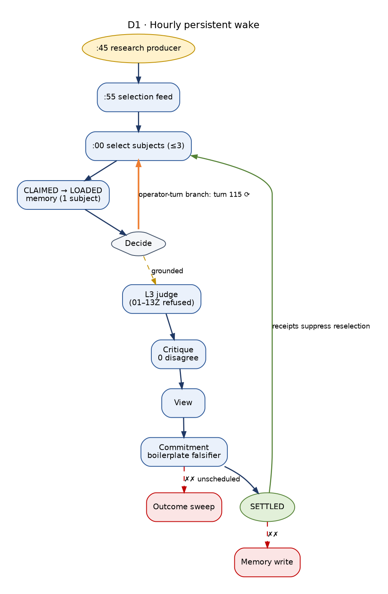
```dot
digraph lc_d1 {
  graph [rankdir=TB, fontname="Helvetica", fontsize=12, label="D1 · Hourly persistent wake", labelloc=t, nodesep=0.25, ranksep=0.32, pad=0.3];
  node [style="rounded,filled", fontname="Helvetica", fontsize=9.5];
  edge [fontname="Helvetica", fontsize=8.5, arrowsize=0.7];
  prod [label=":45 research producer", shape=oval, fillcolor="#FFF2CC", color="#BF9000"];
  feed [label=":55 selection feed", shape=box, fillcolor="#EAF1FB", color="#2B5797"];
  sel [label=":00 select subjects (≤3)", shape=box, fillcolor="#EAF1FB", color="#2B5797"];
  claim [label="CLAIMED → LOADED\nmemory (1 subject)", shape=box, fillcolor="#EAF1FB", color="#2B5797"];
  decide [label="Decide", shape=diamond, fillcolor="#F4F6F9", color="#44546A"];
  judge [label="L3 judge\n(01–13Z refused)", shape=box, fillcolor="#EAF1FB", color="#2B5797"];
  crit [label="Critique\n0 disagree", shape=box, fillcolor="#EAF1FB", color="#2B5797"];
  view [label="View", shape=box, fillcolor="#EAF1FB", color="#2B5797"];
  commit [label="Commitment\nboilerplate falsifier", shape=box, fillcolor="#EAF1FB", color="#2B5797"];
  settled [label="SETTLED", shape=oval, fillcolor="#E2F0D9", color="#548235"];
  memory [label="Memory write", shape=box, fillcolor="#FBE5E5", color="#C00000"];
  sweep [label="Outcome sweep", shape=box, fillcolor="#FBE5E5", color="#C00000"];
  prod -> feed [color="#1F3864", penwidth=1.4];
  feed -> sel [color="#1F3864", penwidth=1.4];
  sel -> claim [color="#1F3864", penwidth=1.4];
  claim -> decide [color="#1F3864", penwidth=1.4];
  decide -> judge [label="grounded", color="#BF9000", style=dashed];
  judge -> crit [color="#1F3864", penwidth=1.4];
  crit -> view [color="#1F3864", penwidth=1.4];
  view -> commit [color="#1F3864", penwidth=1.4];
  commit -> settled [color="#1F3864", penwidth=1.4];
  settled -> sel [label="receipts suppress reselection", color="#548235", penwidth=1.3];
  decide -> sel [label="operator-turn branch: turn 115 ⟳", color="#ED7D31", style=bold];
  settled -> memory [label="✗✗", color="#C00000", style=dashed, penwidth=1.2];
  commit -> sweep [label="✗✗ unscheduled", color="#C00000", style=dashed, penwidth=1.2];
}
```

---

## D2 · Commitment → checkpoint → outcome → lesson

### (a) Purpose, actors, stores

- **Purpose:** compare what was decided with what happened, emit lessons whose provenance says whether they came from outcomes, and feed lessons into later questions.
- **Two disjoint commitment families:**
  - **A. Wake commitments** (CommitmentRecord@v2 OPEN; GovernedCommitment@v1 FROZEN). Settler `sweep_commitment_outcomes.py` → `commitment_outcome_sweep.py` → `commitment_outcomes.jsonl` + lesson candidates. **Unscheduled.**
  - **B. CIO decision checkpoints** (OutcomeCheckpoint@v1 from `cio_run_worker` / `material_scan`). Settlers: cron `20 * * * *` `resolve_due_checkpoints.py --apply`; timer 17:10 `process_due_checkpoints.py --source-available --persist`; cron 06:40 `build_lesson_candidates.py --apply`; `cio_lesson_bind.py` (only `plan_binding=bound`); `advisory_lessons` reflect 21:40 (separate KB lane, C3).

### (b) State machines

**Checkpoint** (append-only versions; 3,769 rows / 3,362 ids):

```
 SCHEDULED ──due_at passed & both prices──▶ RESOLVED                                  (11 ids)
     │      ──due_at passed & a price missing──▶ OUTCOME_PENDING_DATA ──prices──▶ RESOLVED   (152 ids)
     │                                                └─ --apply-pending-data (env-gated) expire
     │      ──no price-resolvable subject──▶ NOT_PRICE_RESOLVABLE (terminal)           (86 ids)
     └── due_at = null ──▶ no transition possible                                      (3,102 ids) ✗
 latest per id: SCHEDULED 3,107 · RESOLVED 163 · NOT_PRICE_RESOLVABLE 86 · OUTCOME_PENDING_DATA 6
```

Fields: `entity_type` UNRESOLVED 3,538 rows · `plan_binding` unbound 2,806 · null 963 · **bound 0** · `horizon` event-relative 3,101 · 1_session 562 · 5_sessions 101.

**Outcome observation** (3,351): `realized_state = {"linked": true}` on 3,189 — a link marker, not an outcome — and a price-change dict on 162. About 200 written per day as re-observations of the same resolved decisions (INFERRED).

**Governed commitment outcome:** FROZEN → CONFIRMED / REFUTED / EXPIRED, or INSUFFICIENT_EVIDENCE (`claim_not_falsifiable`); CONFIRMED/REFUTED → lesson PROPOSED. **0 rows ever.**

**Lesson candidate** (LessonCandidate@v2, 414): PROVISIONAL 414/414; designed PROVISIONAL → SUPPORTED (≥ 5 independent samples) / CONTRADICTED — never happened. Provenance: null 337 · RESEARCH_DERIVED 74 · OUTCOME_DERIVED 3 (all SCHD TRIM; moves +0.31 %, −22.9 %, −30.5 % — consistent with the suspect SCHD price series, INFERRED).

### (c) Flow

```
 cio_run_worker / material_scan ──▶ OutcomeCheckpoint SCHEDULED (95 on 09-14, 446 on 09-13; due_at null on 3,102)
 :20 resolve_due_checkpoints --apply ──▶ "due 0" every run ── PENDING triage: 6 obtainable, applied False (env gate) ✗✗▶
 17:10 due-checkpoints ──▶ outcome_observations (+~200/day, {linked: true})
 06:40 build_lesson_candidates ──▶ lesson_candidates PROVISIONAL (3 OUTCOME_DERIVED on suspect SCHD prices)
 cio_lesson_bind (bound only) ✗✗▶ bound = 0
 lesson ratify ✗✗▶ no ratifier — agent_runtime denies "lesson.ratify" to every agent (definitions.py:89,118,149)
 lesson → question ╌╌▶ cio_rehydrate note_source="lesson" on HELD:SCHD — turn_changed_decision false since 09-09
 wake commitments (family A) ── sweep ✗✗▶ unscheduled
```

### (d)–(e) Iterations and questions

- Checkpoint creation is bursty: 09-07 159 · 09-08 170 · 09-09 6 · 09-10 2 · 09-11 7 · 09-12 2 · 09-13 446 · 09-14 95. Resolutions: 08-27 6 · **08-31 152 (one batch)** · 09-09 2 · 09-10 1 · 09-13 2. **7 days: 5 resolved vs 886 created.**
- Lesson → later question: only HELD:SCHD shows a lesson note in a question path, and its question has not changed since 08-30. **No lesson changed a later question in 14 days.**
- Lessons carry statements ("TRIM on SCHD did not hold…"); none is stored as a question. No read-only counter shows a lesson altering `next_research_question` (BLOCKED).

### (f) Measurements

Median commitment → settlement: **not computable (0 settled)**; checkpoints resolved median ≈ 3 days (batch). Stuck: 3,102 null-due SCHEDULED; 6 PENDING_DATA since 08-26 (> 18 days vs hourly cadence). Resolve rate 7 d 0.56 %. Lessons ratified 0/414.

### (g)–(i) Failure paths, maturity, target

Failure paths: null-due checkpoints with no terminal path; the pending-data gate holds 6 obtainable rows carrying a suspect price; wake-commitment sweep unscheduled with non-falsifiable claims; `plan_binding=bound` 0; no agent may ratify and no operator ratify surface was found (BLOCKED); observations duplicate without outcome content.
Maturity: checkpoint register L1 · resolve L1 (5/week) · observation L1 (non-informative) · lesson generation L1 · lesson ratification **L0** · lesson → question **L0** · wake-commitment settlement **L0**.
**Target:** concrete `due_at` or an event trigger that closes; sweep scheduled hourly after :00; the first CONFIRMED/REFUTED on a judged-wake falsifier; one OUTCOME_DERIVED lesson SUPPORTED with ≥ 5 independent samples on clean prices; lesson text in a later wake's question.
**Exit:** `commitment_outcomes.jsonl` rows > 0 · `lesson_provenance=OUTCOME_DERIVED` with `supporting_outcome_ids ≥ 5` · null-due SCHEDULED → 0.

**Update 2026-09-14:** unchanged; the commitment sweep cron was **approved by the operator** (09-14 ~09:05)
but is not yet installed. The price fixes (#1008) matter here: the only three OUTCOME_DERIVED lessons were
computed on the suspect SCHD series.

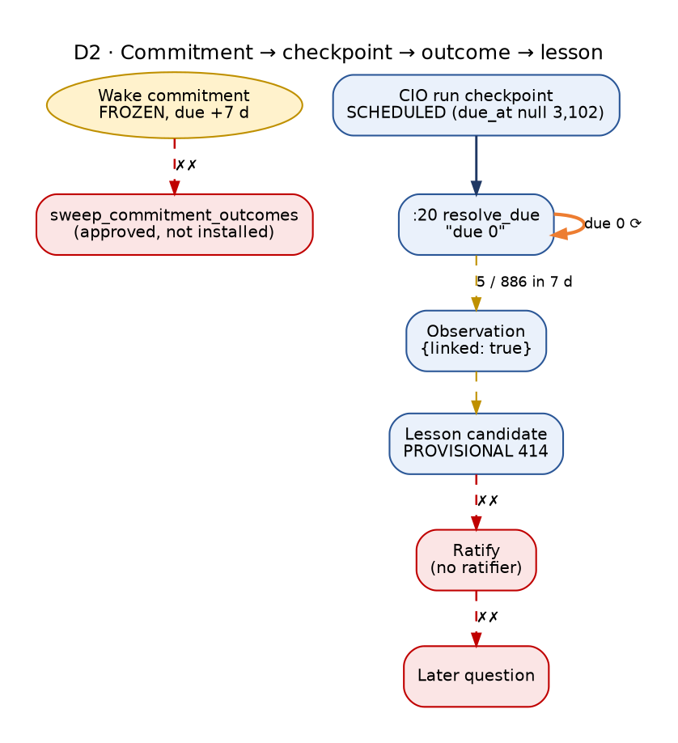
```dot
digraph lc_d2 {
  graph [rankdir=TB, fontname="Helvetica", fontsize=12, label="D2 · Commitment → checkpoint → outcome → lesson", labelloc=t, nodesep=0.25, ranksep=0.32, pad=0.3];
  node [style="rounded,filled", fontname="Helvetica", fontsize=9.5];
  edge [fontname="Helvetica", fontsize=8.5, arrowsize=0.7];
  wake [label="Wake commitment\nFROZEN, due +7 d", shape=oval, fillcolor="#FFF2CC", color="#BF9000"];
  sweep [label="sweep_commitment_outcomes\n(approved, not installed)", shape=box, fillcolor="#FBE5E5", color="#C00000"];
  run [label="CIO run checkpoint\nSCHEDULED (due_at null 3,102)", shape=box, fillcolor="#EAF1FB", color="#2B5797"];
  resolve [label=":20 resolve_due\n\"due 0\"", shape=box, fillcolor="#EAF1FB", color="#2B5797"];
  obs [label="Observation\n{linked: true}", shape=box, fillcolor="#EAF1FB", color="#2B5797"];
  lesson [label="Lesson candidate\nPROVISIONAL 414", shape=box, fillcolor="#EAF1FB", color="#2B5797"];
  ratify [label="Ratify\n(no ratifier)", shape=box, fillcolor="#FBE5E5", color="#C00000"];
  question [label="Later question", shape=box, fillcolor="#FBE5E5", color="#C00000"];
  wake -> sweep [label="✗✗", color="#C00000", style=dashed, penwidth=1.2];
  run -> resolve [color="#1F3864", penwidth=1.4];
  resolve -> obs [label="5 / 886 in 7 d", color="#BF9000", style=dashed];
  obs -> lesson [color="#BF9000", style=dashed];
  lesson -> ratify [label="✗✗", color="#C00000", style=dashed, penwidth=1.2];
  ratify -> question [label="✗✗", color="#C00000", style=dashed, penwidth=1.2];
  resolve -> resolve [label="due 0 ⟳", color="#ED7D31", style=bold];
}
```

---

## D3 · Reflection and MVL agents (Sentinel, Darwin, Iris, runtime)

### (a) Actors and stores

| Actor | Schedule | Store |
|---|---|---|
| `tradeai-cio-nightly-reflection` | 21:50 ET | `cio_reflection_candidates.jsonl` (33 nightly rows) |
| `tradeai-advisory-shadow-session` | **Mon–Fri 09:15** | `sentinel_reviews.jsonl` 140 · `darwin_scorecards.jsonl` 223 |
| `tradeai-agent-runtime@{sentinel,darwin,iris,…}` | ~5 min | SHADOW, prepare-only |
| Iris taxonomy + `iris_proposal_curator.py --apply` | 07:00 / 07:20 | taxonomy proposals |
| `tradeai-advisory-lessons-reflect` | 21:40 | advisory KB lessons (C3) |

### (b) State machines

- **Nightly reflection:** one summary row per night `{cases_seen, scored, proposals[], auto_promotions, joined_cases[]}`; outcome status EXPIRED 1,808 · null 470; Darwin score 60 on 1,806; proposal state CANDIDATE (kind `unresolved_contradiction`) — no transition to ACCEPTED/PROMOTED in data.
- **Sentinel review:** PASS 131 · FAIL 4 · null 5; terminal per row, no re-review.
- **Darwin scorecard:** `overall` in [0, 1]; recent rows 1.0 for guardian / ledger / steph; no promote/demote state.
- **Runtime dispatch** (bounded dispatcher v1): COMPLETED / FAILED / REFUSED_* / CIRCUIT_OPEN / CANCELLED — observed `total 0` on every sentinel/darwin/iris run sampled 09-11 → 09-14.
- **Iris curator:** pending → APPLIED reclassify / EXPIRED stale > 14 d / left for human review. 09-13: 0 applied, 181 expired, 3,406 retire_channel + 454 add_channel left for human review; **pending 5,047**.
- **Ratify / reject:** `lesson.ratify`, `kb.ratify`, `hypothesis.promote`, `config.promote` are denied tools for runtime agents. Human paths observed: 1 reject + 1 ack via signed action link, constant since 09-07.

### (c) Flow

```
 cio_production_cases ──▶ 21:50 reflection ──▶ join outcome (EXPIRED) + Darwin v1 score ──▶ proposal CANDIDATE ×1 (same nightly)
        proposal ✗✗▶ promotion (0; no ratifier)
 Mon–Fri 09:15 shadow session ──▶ guardian/ledger/steph ──▶ sentinel_reviews (3/day) · darwin_scorecards (3/day)
        Darwin score ✗✗▶ any routing or threshold consumer (none found; INFERRED)
 */5 agent-runtime@{sentinel,darwin,iris} ──▶ dispatch total 0 ✗✗▶
 07:20 Iris curator ──▶ 5,047 pending; 3,860 "left for human review" ✗✗▶ no human queue drained
```

### (d)–(f) Iterations, questions, measurements

| Night (Z) | 09-07 | 09-08 | 09-09 | 09-10 | 09-11 | 09-12 | 09-13 | 09-14 |
|---|---|---|---|---|---|---|---|---|
| cases_seen | 1,808 | 1,822 | 1,927 | 2,020 | 2,151 | 2,268 | 2,275 | 2,278 |
| scored | 1,250 | 1,368 | 1,471 | 1,580 | 1,697 | 1,805 | 1,807 | 1,808 |

Growth collapsed after 09-12 (+7, +3). The proposal set has been identical for ≥ 6 nights. Sentinel/Darwin wrote 3 rows every weekday since 08-14; the 09-10 session exited FAILURE but still wrote rows. **Correction to v1:** Sentinel and Darwin are **not stalled** — the "stall since 09-11 13:16Z" is the weekend; the real finding is **constancy** (same three agents, PASS, 1.0). The one question reflection raises ("disposition without an outcome window" on a probe decision) has been unanswered for ≥ 6 nights. Counters: proposals 1 · promotions 0 · scored/seen 79 % · scored with a real market outcome 0 · Sentinel 30-d FAIL rate 2.9 % (false-positive rate BLOCKED) · runtime dispatch last 3 days 0 · Iris pending 5,047.

### (g)–(i) Failure paths, maturity, target

Failure paths: reflection scores horizon expiries because outcomes never resolve (D2 breaks upstream); no ratifier by design and no human queue drained; the runtime has zero dispatch, so "circulation" is a fixed shadow script; status and data disagree on 09-10; Iris taxonomy failed on boot 09-12.
Maturity: nightly reflection L1 L5 (runs) / **L0** (effect) · Sentinel L1 · Darwin L1 · runtime dispatch **L0** · Iris curator L1 (applies expiries only) · ratify **L0** (⊘ by design for agents).
**Target (MVL counters):** Sentinel reviews beyond the three fixed agents including Watch artifacts, with a measured false-positive rate; Darwin scorecards read by a routing or threshold consumer (shadow); runtime dispatch > 0 COMPLETED; ≥ 1 new reflection proposal per week, each with an operator ratify/reject receipt.

**Update 2026-09-14:** unchanged. The advisory shadow-seed timer moved 21:45 → 19:45 (#1020).

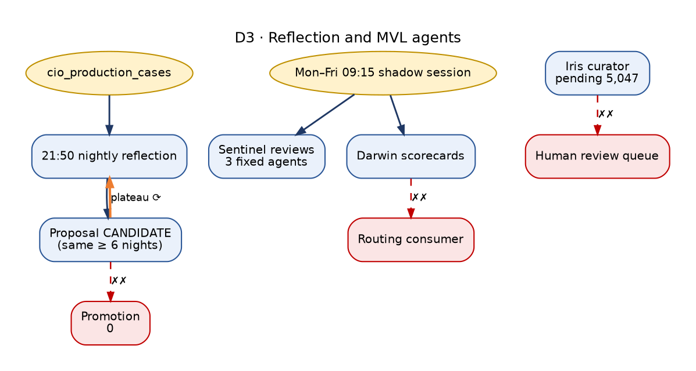
```dot
digraph lc_d3 {
  graph [rankdir=TB, fontname="Helvetica", fontsize=12, label="D3 · Reflection and MVL agents", labelloc=t, nodesep=0.25, ranksep=0.32, pad=0.3];
  node [style="rounded,filled", fontname="Helvetica", fontsize=9.5];
  edge [fontname="Helvetica", fontsize=8.5, arrowsize=0.7];
  cases [label="cio_production_cases", shape=oval, fillcolor="#FFF2CC", color="#BF9000"];
  refl [label="21:50 nightly reflection", shape=box, fillcolor="#EAF1FB", color="#2B5797"];
  prop [label="Proposal CANDIDATE\n(same ≥ 6 nights)", shape=box, fillcolor="#EAF1FB", color="#2B5797"];
  promo [label="Promotion\n0", shape=box, fillcolor="#FBE5E5", color="#C00000"];
  shadow [label="Mon–Fri 09:15 shadow session", shape=oval, fillcolor="#FFF2CC", color="#BF9000"];
  sent [label="Sentinel reviews\n3 fixed agents", shape=box, fillcolor="#EAF1FB", color="#2B5797"];
  darwin [label="Darwin scorecards", shape=box, fillcolor="#EAF1FB", color="#2B5797"];
  consumer [label="Routing consumer", shape=box, fillcolor="#FBE5E5", color="#C00000"];
  iris [label="Iris curator\npending 5,047", shape=box, fillcolor="#EAF1FB", color="#2B5797"];
  human [label="Human review queue", shape=box, fillcolor="#FBE5E5", color="#C00000"];
  cases -> refl [color="#1F3864", penwidth=1.4];
  refl -> prop [color="#1F3864", penwidth=1.4];
  prop -> promo [label="✗✗", color="#C00000", style=dashed, penwidth=1.2];
  prop -> refl [label="plateau ⟳", color="#ED7D31", style=bold];
  shadow -> sent [color="#1F3864", penwidth=1.4];
  shadow -> darwin [color="#1F3864", penwidth=1.4];
  darwin -> consumer [label="✗✗", color="#C00000", style=dashed, penwidth=1.2];
  iris -> human [label="✗✗", color="#C00000", style=dashed, penwidth=1.2];
}
```

---

## D4 · CIO run lifecycle (reactive cycle · wake jobs · defer · situations)

### (a) Actors and stores

| Actor | Schedule | Stores |
|---|---|---|
| `tradeai-cio-reactive` → `cio_reactive_cycle.py --once` | ~2 min | — |
| `cio_wake_dispatch_entrypoint.py` | `*/5` (flock, 15 m timeout) | `cio_wake_jobs.jsonl` (event-sourced), `cio_wake_dispatches.jsonl`, `cio_runs.jsonl` (hash-chained), `wake_record_consult.json`, `wake_research_persist.json`, `wake_turn_effects.jsonl` |
| `cio_situation_detector` | reactive | `cio_events.jsonl` `situation.raised` |
| `tradeai-cio-defer-revisit` | hourly :09 | `cio_defer_lineage.jsonl` |
| Health boundary | `cio_health_snapshot_feed.json` (`enforce: true` since 09-13, max age 120 min) | READY / DEGRADED / BLOCKED / UNKNOWN |

DB `cio_decisions` (31,173 rows): the cron `cio_decision_engine.py --run` has been **disabled since 08-08**, yet ~3,720 rows/day keep arriving; the writer was not identified read-only (BLOCKED).

### (b) State machines

**CIO run** (11,558 events all-time):

```
 CIO_RUN_CREATED ─▶ QUEUED ─▶ HEALTH_CHECK ─(54)─▶ BLOCKED
                                  │ 2,261
                                  ▼
                            EVIDENCE_BUILD ─▶ CIO_SYNTHESIS ─(1,718)─▶ COMPLETED
                                                    └─(525)─▶ BLOCKED  (EVIDENCE_GAP stale_required:portfolio 525; missing_required 52)
 terminal per run: COMPLETED 1,718 · BLOCKED 579 · non-terminal 88 (oldest CREATED 08-10 20:38Z)
```

**Wake job stream** (window 08-30 → 09-14, 3,602 streams): ENQUEUED → CLAIMED → DISPATCHED → IN_FLIGHT → COMPLETED 1,576 · EXPIRED 1,807 (`BACKLOG_EXPIRED:trigger=EVENT_BUS` 1,506 · GOAL_DUE 295 · SCHEDULE_DUE 5 · OPERATOR_MESSAGE 1) · CANCELLED 6 · still ENQUEUED 126 · **stuck DISPATCHED 68 / IN_FLIGHT 19, oldest 09-06 04:39Z**. Policy: `MAX_BACKLOG_AGE_HOURS` 24; windows SCHEDULE_DUE 4 h, HEALTH 2 h, ACTION_FOLLOWUP 8 h, HANDOFF 12 h, HERMES_CHALLENGE 6 h; decisions DISPATCH / EXPIRE / CANCEL_AS_SUPERSEDED / ALREADY_SATISFIED.

**Health boundary:** BLOCKED > UNKNOWN > DEGRADED; the enforce flip on 09-13 changed 0 outcomes at flip time; `CIO_RUN_HEALTH_CHECKED` payloads carry no advisory state (per-run "why DEGRADED" unrecoverable).

**Defer lineage:** reopened 84 · deferred 1 · quarantined 1; action HOLD_CASH 86/86; **newest write 08-18**; revisit runs hourly with `due 0`.

**Situation:** `situation.raised` only (no cleared type); `shadow: true`; `semantic_event_key` empty on 2,019/2,019; `acknowledged` null on 5,309/5,309. Tail counts: S3_REENTRY_CANDIDATE 1,487 · S1_POSITION_LIFECYCLE 244 · S6 118 · S5 67 · S2_STOP_GAP 54 · S7 49.

### (c) Flow

```
 thesis_mint (1,063) · plan_enrichment (2,251) · situation_detector (2,019) · operator.message (21) ──▶ cio_events (no ack, no semantic key)
 ══▶ CIO_WAKE_ENQUEUED (alex / steph / morgan / goal) ── backlog policy ──▶ EXPIRED 80 % (7 d) ✗✗▶
 ══▶ 20 %: wake_record_consult ── instrument record next_eligible_at ╌╌▶ skip (5/5 changed this run: EXIT defer 45 h) █
 ══▶ RUN: HEALTH_CHECK ◀── health feed (enforce) ══▶ EVIDENCE_BUILD ◀── domain freshness (portfolio stale ⇒ BLOCKED 525)
 ══▶ CIO_SYNTHESIS ─▶ COMPLETED ──▶ OutcomeCheckpoint SCHEDULED (due_at null) → D2
                                ──▶ cio_decisions 'proposed' (RESEARCH_MORE 18,930 · ADD_ON_PULLBACK 4,304 · HUMAN_REVIEW 2,521 in 7 d)
 wake_research_persist ── last hit 09-05 ✗✗▶ · wake_turn_effects ── changed false since 09-09 ✗✗▶ · defer revisit ── due 0
```

### (d) Iterations

| Day | 09-04 | 09-05 | 09-06 | 09-07 | 09-08 | 09-09..11 | 09-12 | 09-13 | 09-14 |
|---|---|---|---|---|---|---|---|---|---|
| runs created / completed / blocked | 199/181/18 | 183/78/105 | 156/79/74 | 159/57/63 | 62/17/0 | **no runs** | 38/0/**38** | 207/174/33 | 40/40/0 |

The blocked burst 09-12 23Z → 09-13 01Z was all `stale_required:portfolio` and cleared after the post-reboot portfolio refresh (INFERRED). Run duration p50 23.8 s, p90 49.8 s. `cio_decisions` ≈ 3,720/day for 8 days, status never leaves `proposed` — a constant generator, not an iteration (INFERRED). The record-consult carry-forward is real (a disposition honoured without replay) but it is a *skip*; research persistence has not carried new knowledge since 09-05.

### (e) Questions

`next_research_question` on instrument records: 24/193 non-null, 17 distinct, 1 subject ever changed (D1e). Operator messages enter as `operator.message` events (21 in tail); wake jobs triggered by OPERATOR_MESSAGE: 1, expired. Situations ask "is this re-entry / stop gap / concentration actionable?" 8.8 times each and are never acknowledged.

### (f) Measurements

7-d wake jobs: EXPIRED 1,446 · COMPLETED 396 · ENQUEUED 126 · DISPATCHED 64 · IN_FLIGHT 17 · CANCELLED 5 (completion 21 %). Stuck: 213 non-terminal streams; 87 dispatched/in-flight up to 8 days; 88 non-terminal runs up to 34 days. Runs completed 7 d: 474 of ≥ 592 created, plus a 3-day outage with 0 runs. Situations 7 d: 477 events over 54 distinct (type, symbols).

### (g)–(i) Failure paths, maturity, target

Failure paths: EVENT_BUS backlog expires 80 % of wake jobs; dispatcher never reaps DISPATCHED/IN_FLIGHT; single-domain dependency (portfolio staleness blocks synthesis); situation re-raise without dedupe or ack; health state not ledgered per run; defer lifecycle dormant; decision engine "disabled" while rows keep arriving; runs register checkpoints that can never resolve.
Maturity: reactive intake L1 L5 · wake-job dispatch L1 (21 %) · health boundary L1 · evidence gate L1–L2 · synthesis L1 · decisions L1 (constant) · defer revisit L1 (idle) · situation detector L1 · record-consult carry-forward **L2**.
**Exit:** expiry < 20 % · 0 streams non-terminal > 2 h · advisory state written on `CIO_RUN_HEALTH_CHECKED` · `semantic_event_key` populated with ≤ 1 re-raise/day per key · `wake_research_persist.persisted > 0` weekly · `turn_changed_decision=true` on a real turn newer than 09-08 (M3).

**Update 2026-09-14:** unchanged (not re-measured). "CIO Run Complete" check-ins with no advisory action are
no longer sent (#1009).

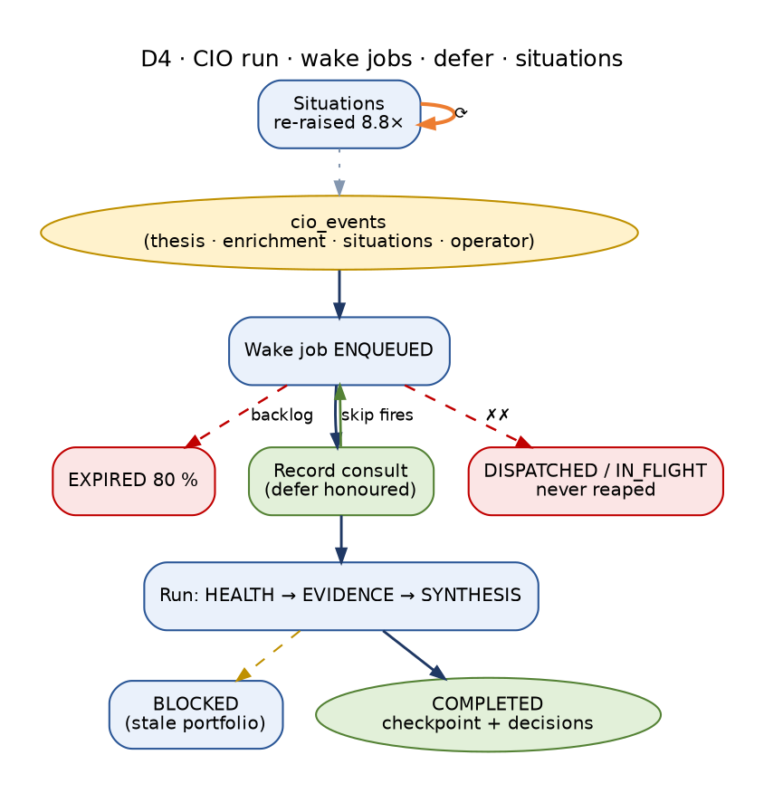
```dot
digraph lc_d4 {
  graph [rankdir=TB, fontname="Helvetica", fontsize=12, label="D4 · CIO run · wake jobs · defer · situations", labelloc=t, nodesep=0.25, ranksep=0.32, pad=0.3];
  node [style="rounded,filled", fontname="Helvetica", fontsize=9.5];
  edge [fontname="Helvetica", fontsize=8.5, arrowsize=0.7];
  events [label="cio_events\n(thesis · enrichment · situations · operator)", shape=oval, fillcolor="#FFF2CC", color="#BF9000"];
  wj [label="Wake job ENQUEUED", shape=box, fillcolor="#EAF1FB", color="#2B5797"];
  expired [label="EXPIRED 80 %", shape=box, fillcolor="#FBE5E5", color="#C00000"];
  consult [label="Record consult\n(defer honoured)", shape=box, fillcolor="#E2F0D9", color="#548235"];
  run [label="Run: HEALTH → EVIDENCE → SYNTHESIS", shape=box, fillcolor="#EAF1FB", color="#2B5797"];
  blocked [label="BLOCKED\n(stale portfolio)", shape=box, fillcolor="#EAF1FB", color="#2B5797"];
  done [label="COMPLETED\ncheckpoint + decisions", shape=oval, fillcolor="#E2F0D9", color="#548235"];
  stuck [label="DISPATCHED / IN_FLIGHT\nnever reaped", shape=box, fillcolor="#FBE5E5", color="#C00000"];
  sit [label="Situations\nre-raised 8.8×", shape=box, fillcolor="#EAF1FB", color="#2B5797"];
  events -> wj [color="#1F3864", penwidth=1.4];
  wj -> expired [label="backlog", color="#C00000", style=dashed, penwidth=1.2];
  wj -> consult [color="#1F3864", penwidth=1.4];
  consult -> run [color="#1F3864", penwidth=1.4];
  consult -> wj [label="skip fires", color="#548235", penwidth=1.3];
  run -> done [color="#1F3864", penwidth=1.4];
  run -> blocked [color="#BF9000", style=dashed];
  wj -> stuck [label="✗✗", color="#C00000", style=dashed, penwidth=1.2];
  sit -> sit [label="⟳", color="#ED7D31", style=bold];
  sit -> events [color="#8497B0", style=dotted];
}
```

---

## D5 · Epoch acceptance (SHA promote → wakes → contiguous cycles → acceptance → next promote)

### (a)–(b) Actors and state machine

Deploy rail `prepare → promote` rotates `CURRENT`; each wake stamps `source_sha` and `provenance.epoch_id`. The collector `m2-canary-20260907/ops/m2_canary_soak_collector.py` requires `scheduled_wakes ≥ 3` + selector disposition + no integrity failure (optional gateway delivery / research consumption). Operator criteria (09-11): ≥ 3 contiguous organic cycles on one epoch + a new inbound cognitive effect + gateway SETTLED on the same SHA + a durable L3 view.

```
 PREPARED ─promote─▶ SERVED(epoch e) ─first :00 slot─▶ ACCUMULATING(n)
     ├─ n ≥ 3 contiguous & all clauses ─▶ ACCEPTED          (never observed)
     ├─ next promote before clauses ─▶ SUPERSEDED            (32 of 33 epochs; the 33rd, c594d8600, had 0 wakes)
     └─ power cut (missed_skipped) ─▶ contiguity broken      (09-11 23Z · 09-12 04–11Z · 14–21Z)
```

### (c)–(d) Flow and iterations

```
 PR merge ─▶ prepare ─▶ promote ─▶ :55 feed re-created in the new release dir ─▶ :00 wakes stamp epoch ─▶ contiguous slots per SHA
   ─▶ clauses: scheduled ≥ 3 ✓ sometimes · new inbound effect ✗ (turn 115 replay) · gateway SETTLED same SHA ✗ · L3 view ◇ (off-peak)
   ╌╌▶ next PR ─▶ promote (median gap on 09-13 ≈ 1.4 h) ✗✗▶ resets n
```

Runs of identical SHA: 09-10 06→21Z (pre-stamp) 16 · 09-11 06→13Z efffaca13 **8** · 09-13 06→13Z e3250e9ec **8** · 09-13 17→19Z 07c903b0a 3 · 09-13 00..05Z six SHAs, 1 slot each · 09-14 00..04Z five SHAs, 1 slot each. Of 33 stamped epochs, **7 reached ≥ 3 contiguous slots and 2 reached ≥ 8** — both in overnight ET windows with no merges, which are exactly the hours when L3 is refused.

### (e)–(f) Questions and measurements

"Does epoch e pass?" is recomputed by people or agents after the fact; no scheduled collector receipt exists in the wake state (BLOCKED for a live counter). Epochs 33 over 78 slots (mean 2.4; 26 of 33 < 3 slots) · release directories 17 on 09-13, 9 on 09-12 · 17 missed slots, all in power-cut gaps.

### (g)–(i) Failure paths, maturity, target

Failure paths: promote cadence faster than 3 slots; power cuts without backfill; selection feed tied to the release dir; traffic-dependent clauses have no organic producer aligned to the epoch; L3 blocked 01–13Z so quiet windows cannot satisfy the L3 clause.
Maturity: promote/stamp L1 L5 · contiguity L1 · acceptance evaluation **L0** (not scheduled) · epoch freeze discipline **L0**.
**Target:** a declared promote freeze of ≥ 3 slots inside 14–00Z on a weekday, with ≥ 1 new operator turn on a wake subject and ≥ 1 gateway SETTLED.
**Exit:** the collector writes a receipt `clauses 6/6` for that SHA (campaign M2 ACCEPTED).

**Update 2026-09-14:** 22 releases were promoted on 09-14, so epoch contiguity could not accumulate during
the day; the overnight windows remain the only long same-SHA runs. Acceptance collector still unscheduled.

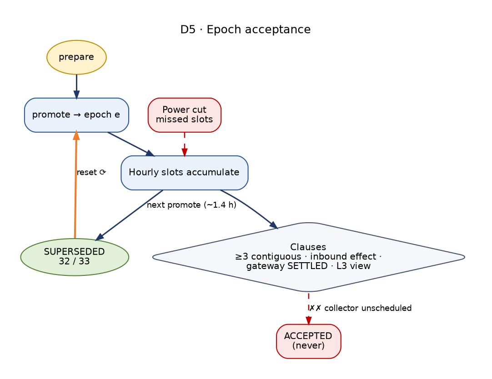
```dot
digraph lc_d5 {
  graph [rankdir=TB, fontname="Helvetica", fontsize=12, label="D5 · Epoch acceptance", labelloc=t, nodesep=0.25, ranksep=0.32, pad=0.3];
  node [style="rounded,filled", fontname="Helvetica", fontsize=9.5];
  edge [fontname="Helvetica", fontsize=8.5, arrowsize=0.7];
  prep [label="prepare", shape=oval, fillcolor="#FFF2CC", color="#BF9000"];
  promote [label="promote → epoch e", shape=box, fillcolor="#EAF1FB", color="#2B5797"];
  slots [label="Hourly slots accumulate", shape=box, fillcolor="#EAF1FB", color="#2B5797"];
  clauses [label="Clauses\n≥3 contiguous · inbound effect ·\ngateway SETTLED · L3 view", shape=diamond, fillcolor="#F4F6F9", color="#44546A"];
  accepted [label="ACCEPTED\n(never)", shape=box, fillcolor="#FBE5E5", color="#C00000"];
  superseded [label="SUPERSEDED\n32 / 33", shape=oval, fillcolor="#E2F0D9", color="#548235"];
  cut [label="Power cut\nmissed slots", shape=box, fillcolor="#FBE5E5", color="#C00000"];
  prep -> promote [color="#1F3864", penwidth=1.4];
  promote -> slots [color="#1F3864", penwidth=1.4];
  slots -> clauses [color="#1F3864", penwidth=1.4];
  clauses -> accepted [label="✗✗ collector unscheduled", color="#C00000", style=dashed, penwidth=1.2];
  slots -> superseded [label="next promote (~1.4 h)", color="#1F3864", penwidth=1.4];
  superseded -> promote [label="reset ⟳", color="#ED7D31", style=bold];
  cut -> slots [color="#C00000", style=dashed, penwidth=1.2];
}
```

---

# FAMILY E — COMMUNICATION LIFECYCLES

Fact base: `lifecycles/LIFECYCLE_FACTBASE_E_COMMS_2026-09-14.md`. The communication ledger
starts 2026-09-05, so "all-time" there means nine days. No Telegram API call was made.

## E1 · Outbound message

### (a) Purpose, actors, stores

- **Purpose:** get a producer's finding to the operator exactly once, on the right channel, with a Command Center link; prove it arrived (provider message id); roll up what was held back into a digest.
- **Producers (7 d):** `telegram_alert.send_telegram` 674 (nearly every legacy caller — sentinels, SIEM, health agent, Hermes, trade_ai_live, P1 digest) · `send_watchpool_maturity_alerts` 40 · `notify_material_change` 17 · `agent:cio` 16 · 11 single-row producers. **Outside the ledger:** CIO product deliveries (`cio_delivery_worker`), desk replies and pending closes, ops agent `--telegram`, OpenClaw gateway :18789, 15 flagged direct-API producers (buttons, custom chats, DOCX).
- **Policy/code:** `operator_alert_policy.yaml` (P0_INTERRUPT / P1_DIGEST / P2_DASHBOARD_ONLY / P3_LOG_ONLY; `telegram_normalization.runtime_mode: "OFF"`) · `telegram_alert_router.py` · `telegram_alert.py` · `comms/{client,delivery,event,mode,channel_adapters}.py` · CIO `cio_notification_policy.py`.
- **Stores:** `communication_events` 1,013 · `communication_deliveries` 1,012 · `communication_outbox` 1,011 (all `recorded`, attempt 0 — a record, not a queue) · `telegram_outbox` 6,663 (legacy archive) · `alert_events` 7,847 · normalization tables `alert_occurrences / notification_events / deliveries / digest_queue / incidents` **0 rows** · CIO `operator_notification_outbox.jsonl` 524 events · `cio_notification_state.jsonl` 138 · `cio_notification_metrics.jsonl` 3,824 · `cio_delivery_receipts.jsonl` **1 row (08-29)** · Tier D broker files 88 MB.

### (b) State machines

**ChannelDelivery@v1.status** (`delivery.py:19-70`):

```
 RESERVED → SENDING | SENT | FAILED | SUPPRESSED | EXPIRED | CANCELLED | UNKNOWN | LEGACY_DELIVERED
 SENDING  → SENT | FAILED | CANCELLED | UNKNOWN          SENT → DELIVERED | ACKNOWLEDGED | BOUNCED | FAILED | UNKNOWN
 DELIVERED → ACKNOWLEDGED | UNKNOWN                     FAILED → RESERVED | SENDING | UNKNOWN (retry may re-open)
 terminal: SENT DELIVERED ACKNOWLEDGED FAILED BOUNCED SUPPRESSED EXPIRED CANCELLED LEGACY_DELIVERED
```

| Status | All-time | 7 d | Last |
|---|---|---|---|
| SUPPRESSED | 564 | 557 | 09-13 21:00 |
| RESERVED | 232 | 193 | 09-13 21:59 (inbound) |
| LEGACY_DELIVERED | 176 | 117 | 09-13 22:22 |
| SENT | 32 | 24 | 09-13 02:37 |
| FAILED | 8 | 8 | 09-10 00:40 |

Never observed: SENDING, DELIVERED, ACKNOWLEDGED, BOUNCED, **EXPIRED**, CANCELLED, UNKNOWN. **Nothing expires RESERVED.**

**CommunicationEvent@v2.provider_settlement_state:** UNSETTLED (default) → SETTLED (SENT/DELIVERED/ACK **and** a provider message id) · FAILED · UNKNOWN_LEGACY (LEGACY_DELIVERED). SUPPRESSED maps to **no state** unless an owner kwarg forces an update.

| Delivery × settlement × owner (all-time) | n |
|---|---|
| SUPPRESSED · UNKNOWN_LEGACY · legacy | 371 (contradiction: suppressed, yet "legacy-delivered-unknown") |
| **SUPPRESSED · UNSETTLED · null** | **193** |
| RESERVED · UNKNOWN_LEGACY · legacy (inbound stubs) | 184 |
| LEGACY_DELIVERED · UNKNOWN_LEGACY · legacy / null | 132 / 43 |
| RESERVED · UNSETTLED · null | 44 |
| SENT · SETTLED · gateway | **19** |
| SENT · UNKNOWN_LEGACY · legacy (09-05 smokes) | 13 |

**Mode machines:** normalization runtime OFF / SHADOW / ACTIVE (config OFF) · gateway mode OFF / SHADOW / CANARY / ACTIVE, env `COMMS_GATEWAY_MODE`, default OFF; CANARY only on the portfolio-server drop-in and the `notify_material_change` cron line (`CANARY_CLASSES=ops`); the callback poller and CIO bot environments carry none.

**CIO notification outbox:** PENDING → CLAIMED → DELIVERING → DELIVERED | RETRY_SCHEDULED → … | DEAD_LETTERED | EXPIRED | CANCELLED; `MAX_RETRY_ATTEMPTS=3`. Observed ENQUEUED 175 · CLAIMED 174 · **CONFIRMED 174** (with external message id). **CIO notification decision:** SUPPRESSED 133 / DIGEST 5; reasons `not_production_advisory_eligible` 121 · `unchanged_replay` 12; `operator_disposition` empty 138/138.

### (c) End-to-end flow

```
 PRODUCERS (36 notification cron lines · timers · daemons)
     │ send_telegram(msg, class)        │ publish_communication() (20 producers never settle)   │ CIO outbox       │ direct API (15)
     ▼                                  ▼                                                        ▼                  │
 telegram_alert.send_telegram ── wrap_send_hook ──▶ advisory broker ingest (Tier D SHADOW, egress not executed)       │
     _comms_gateway_owns(class)?  NO ≈ 97.5 %                 YES (material change only)                            │
     ▼                                                        ▼                                                     │
 LEGACY: classify → should_send → dedupe → rate limit     GATEWAY: publish → RESERVED → send → SENT + pmid → SETTLED │
     │ suppress ─▶ telegram_outbox reports_archive (277/7 d)      (median 1.03 s, owner=gateway)                   │
     │ send ─▶ Telegram ─▶ telegram_outbox ok (62/7 d)                                                            │
     ▼                                                                                                              │
 _best_effort_comms_publish → event + RESERVED stub → settle(LEGACY_DELIVERED | SUPPRESSED)                         │
     ✗✗▶ delivery_owner not stamped since 09-10 (237 rows null) · ✗✗▶ SUPPRESSED leaves UNSETTLED (193) · pmid never captured
 cio_delivery_worker (*/5; 1,803 runs = 0 delivered; 15 real deliveries since 09-07) ─▶ Telegram (400 parse_mode → plain resend)
     ─▶ outbox CONFIRMED ✗✗▶ communication_events (none) ✗✗▶ cio_delivery_receipts.jsonl (the file the lane watches)
 ╌╌▶ p1_digest_sender (0 */4) reads reports_archive > watermark → one digest message (the only working roll-up) █
 Command Center link: column on 16/758 (2.1 %); "/v3/" in body on 60/758 (7.9 %)
```

### (d) Iterations

| Loop | Mechanism | Closes? | Evidence |
|---|---|---|---|
| Router dedupe | in-process cache + durable key (health 240 m, intel 360 m, stop 390 m, default 60 m) | per process + durable key | router `:361-386` |
| Hourly rate limit | `_hourly_counts` | **ineffective for cron producers** — counter resets each process (INFERRED) | router `:472-486` |
| Suppression → digest | reports_archive → P1 digest every 4 h | **yes** | watermark 6758; 2–13 messages per roll-up |
| CIO unchanged suppression | per scanner wake | yes — 2,837 of 2,865 candidates suppressed in 7 d; 0 immediate; 28 digest | metrics |
| CIO outbox retry → dead letter | 3 attempts | never exercised | 0 released / dead-lettered |
| Delivery retry FAILED → RESERVED | allowed | **never exercised** | 8 FAILED (agent:cio 09-08..09-10) never re-opened |
| RESERVED expiry | status exists | **no expirer** | oldest 216 h |
| Parse-mode retry | 400 → plain resend | yes, but doubles provider calls | journal |

### (e) Questions a message asks

| Message | Question | Answer path | Closure | Dropped |
|---|---|---|---|---|
| Sentinel alert | implicit "act?"; "tell me if still listed" | free-text reply | ✅ when the fingerprint clears | no acknowledge primitive; reply not joined (`reply_to_event_id` 0/1,013) |
| Material change notice | "look?" | reply → turn (the notice is captured as an agent turn) | none | `questioned_at` set by the producer, not by an answer (INFERRED) |
| Proposal alert (buttons) | approve / reject / rebuild | callback → `trade_approvals` | consumed / superseded / expired | legacy direct API; `trade_approvals` last 08-28; 19 pending since 07-21 never expired |
| Guard approval | `/approve <CODE>` / `/deny <CODE>` | poller → `guard_remote_approval` | APPROVED / DENIED_* / EXPIRED / SUPERSEDED | requests file absent → 0 requests ever minted on this host |
| LLM cap | `/caps`, `/cap <id> <req> [$]` | poller, allowlisted chat | immediate write | before 09-13 every `/cap` raised NameError |
| CIO product | "consider X" | reply → desk | none | `operator_disposition` never recorded |
| Desk pending | "researching, will reply" | fulfil loop | fulfilled / expired | expired at 9.38 h stamped "2h" (B1) |

### (f) Live measurements

Outbound 855 all-time / 758 7 d / 26 24 h; per day 09-05 60 · 09-06 38 · **09-07 208** · 09-08 160 · 09-09 124 · 09-10 96 · 09-11 133 · 09-12 11 · 09-13 26. **Suppression 73.5 %** (all from the legacy router). Delivered 7 d: LEGACY_DELIVERED 117 (unverified), SENT 24 (gateway SETTLED 19), FAILED 8. **Ownership:** gateway 2.5 % · legacy 65.2 % · owner-null 32.3 %. Send → settled: gateway p50 1.03 s (material change), 1.66 s (agent:cio). RESERVED by age: < 1 h 0 · 1–24 h 10 · 1–7 d 183 · > 7 d 39; inbound 156 (median 129 h), outbound 76 (watchpool 40, smokes 16, singletons 20). Reconciliation: `telegram_outbox` sent 62 vs ledger LEGACY_DELIVERED 117 in 7 d (≈ 2× disagreement, INFERRED not all legacy callers archive). `getUpdates 409 Conflict` by day: 09-05 25 · **09-09 66** · 09-10 8 · 09-11 6 · 09-13 2.

### (g) Failure paths

1. **Owner-stamp regression** (since 09-10; commits 6b612ffea / 28902a51f "durable event settlement"): the legacy settle passes the owner only inside `provider_coordinates`, and `_persist_event_settlement_pg` skips the update (cause INFERRED from code). 2. **Inbound stubs counted as backlog**; 20 direct producers reserve and never settle. 3. **CIO deliveries invisible to the ledger** — lane `cio-delivery` is false-SILENT because it watches a file the worker stopped writing (correction to v1: it did deliver). 4. Desk replies unledgered. 5. No provider message id on the legacy path — `send_telegram` returns *accepted*, not delivered. 6. Watchpool alerts reserved and never settled. 7. Normalization runtime OFF; incident and digest tables empty. 8. 15 direct-API producers bypass everything. 9. 8 agent:cio FAILED never retried. 10. Two consumers on the main bot token.

### Update 2026-09-14 — E1 after PRs #1009, #1011, #1013, #1016, #1018

| Finding (5 Telegram exports reviewed 09-14) | Evidence | Now |
|---|---|---|
| Duplicate morning briefs | 50 identical in 16 days, most at ~20:00 ET (cron and timer both ran `aegis_overnight`; 08:00 and 08:05 senders repeated) | one brief 07:30 ET weekdays; dedupe key = ET session date; 20:00 and 08:05 senders retired (crontab installed 11:03, backup kept) |
| Literal Markdown | 299 messages with raw asterisks (Markdown refused, resent as plain text) | Communications Editor converts to escaped HTML (live mode); rich layouts for GO / entry / material change |
| CIO Desk noise | 86 of 95 were content-free "CIO Run Complete" | no check-in when a run produced no advisory action |
| Wrong chat | health/holdings/stop alerts reached Proposal Decisions | `chat_ids()` = DM only; `proposal_chat_ids()` = group; `allowed_chat_ids()` = both for inbound |
| No GO alerts since 07-13 | GO rows every week; social scanner required a tag no row carried; screener GO list archived in a digest | `scalp_go_criteria` (price 1–25, float ≤ 20M, RVOL ≥ 5, |gap| ≥ 5 %, volume ≥ 1M, score ≥ 40, verified catalyst); `screener_go_alerts.py` */15 9–16; router bypass (#1011); ARMP and ELMT delivered 13:15 |
| Repeated alerts collided | ledger identity lacked a body hash: 638 events for 638 openings; 14,163 illegal settles in `claude_escalation.log` | `observation_version` = body hash + UTC minute (#1013) |
| Long desk answers refused | 4,571-char AXTI answer, Telegram 400 | ordered parts ≤ 4,096 UTF-16 units; delivered only if every part is (#1016) |

**Communications Editor** (`scripts/lib/comms_editor.py` at `telegram_transport.deliver_text`): mode off / shadow
/ live from `COMMS_EDITOR_MODE` or `~/.config/tradeai/comms_editor_mode`; **shadow since 09-14 12:02** (original
sent unchanged, receipt written); live adds HTML, a message GUID and subject GUIDs, a 20-hour duplicate
fingerprint per chat, CIO agreement against the latest `cio_decisions`, holds `OPERATOR_PRODUCT_INVALID`,
Tailscale Command Center links plus Finviz and Yahoo, and source pills; an editor failure always sends
the original. Live is approved after one trading day of shadow receipts.

**Maturity change:** classification L1 → **L2** (routing map, noise removed) · producing L2 → **L3** for GO,
entry and material-change alerts (criteria, rich layout, delivered) · settlement unchanged L1 (owner
stamp regression and inbound stubs not fixed) · formatting chokepoint ░ → **L2** (shadow).

### (h) Maturity per stage

Producing L2 · classification L1 · dedupe/rate limit L1 · reservation L1 · legacy send L2 · gateway send L1 → L2 · provider acceptance L1 · **settlement L1 (regressed)** · CC link L1 · digest roll-up L2 · lifecycle monitoring L1 (wrong file).

### (i) Target and exit

**Target:** one path — `publish_communication` → persisted policy decision → RESERVED → gateway send → SENT with pmid → SETTLED; no delivery stub for inbound; SUPPRESSED/DIGESTED terminal with reason and `digest_event_id`; an expirer for RESERVED; every CIO product, desk reply and pending close an OUTBOUND event; CC URL always stamped.
**Exit:** gateway ≥ 95 % of outbound for 7 days · RESERVED ≤ 1 h old · owner-null rows 0 · CIO deliveries present in `communication_events` · `cio-delivery` lane keyed on DELIVERY_CONFIRMED.

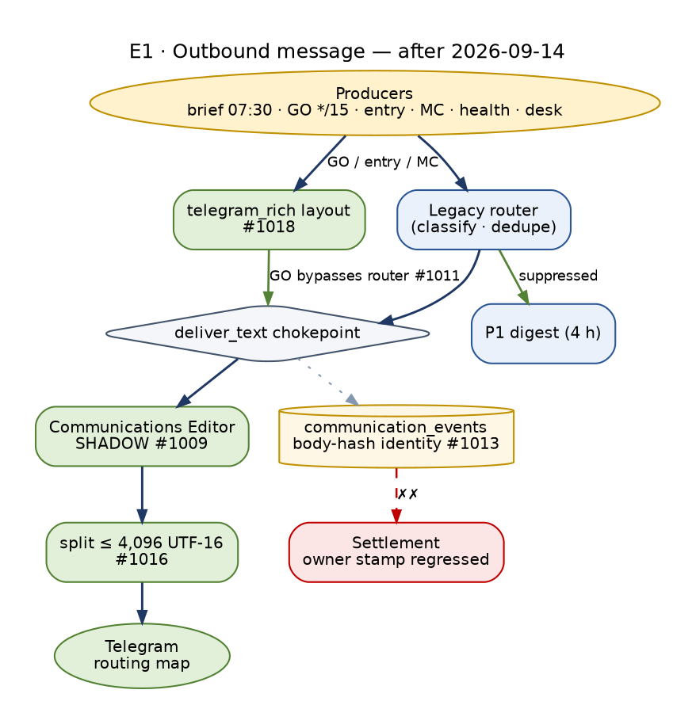
```dot
digraph lc_e1 {
  graph [rankdir=TB, fontname="Helvetica", fontsize=12, label="E1 · Outbound message — after 2026-09-14", labelloc=t, nodesep=0.25, ranksep=0.32, pad=0.3];
  node [style="rounded,filled", fontname="Helvetica", fontsize=9.5];
  edge [fontname="Helvetica", fontsize=8.5, arrowsize=0.7];
  prod [label="Producers\nbrief 07:30 · GO */15 · entry · MC · health · desk", shape=oval, fillcolor="#FFF2CC", color="#BF9000"];
  rich [label="telegram_rich layout\n#1018", shape=box, fillcolor="#E2F0D9", color="#548235"];
  router [label="Legacy router\n(classify · dedupe)", shape=box, fillcolor="#EAF1FB", color="#2B5797"];
  chk [label="deliver_text chokepoint", shape=diamond, fillcolor="#F4F6F9", color="#44546A"];
  editor [label="Communications Editor\nSHADOW #1009", shape=box, fillcolor="#E2F0D9", color="#548235"];
  parts [label="split ≤ 4,096 UTF-16\n#1016", shape=box, fillcolor="#E2F0D9", color="#548235"];
  tg [label="Telegram\nrouting map", shape=oval, fillcolor="#E2F0D9", color="#548235"];
  ledger [label="communication_events\nbody-hash identity #1013", shape=cylinder, fillcolor="#FFF7E6", color="#BF9000"];
  settle [label="Settlement\nowner stamp regressed", shape=box, fillcolor="#FBE5E5", color="#C00000"];
  digest [label="P1 digest (4 h)", shape=box, fillcolor="#EAF1FB", color="#2B5797"];
  prod -> rich [label="GO / entry / MC", color="#1F3864", penwidth=1.4];
  rich -> chk [label="GO bypasses router #1011", color="#548235", penwidth=1.3];
  prod -> router [color="#1F3864", penwidth=1.4];
  router -> chk [color="#1F3864", penwidth=1.4];
  router -> digest [label="suppressed", color="#548235", penwidth=1.3];
  chk -> editor [color="#1F3864", penwidth=1.4];
  editor -> parts [color="#1F3864", penwidth=1.4];
  parts -> tg [color="#1F3864", penwidth=1.4];
  chk -> ledger [color="#8497B0", style=dotted];
  ledger -> settle [label="✗✗", color="#C00000", style=dashed, penwidth=1.2];
}
```

---

## E2 · Inbound operator reply

### (a) Purpose, actors, stores

- **Purpose:** capture every operator message or tap durably and exactly once, tag its subject, hand it to the CIO agent with a receipt, answer it, and let it change the next wake.
- **Actors:** **main bot** `run_telegram_callback_poller.py --daemon` (CURRENT cwd; `ATOMIC_INBOUND_ENABLED=1`, `CIO_REPLY_ENABLED=1`, `CIO_TELEGRAM_CONVERSE=1`; watchdog `*/5` recycles on stale cwd) handling messages, callbacks, `/caps`, `/cap`, `/approve`, `/deny` · **CIO bot** `tradeai-cio-telegram` → `cio_telegram_bot.py --loop` (**cwd a8a62217e, previous release**; allowlist of 3 chat ids, one reported unreachable) · `telegram_command_handler.py --poll` cron **disabled since 08-26** (409 conflicts).
- **Code:** `atomic_inbound.py` (claim → normalize → tag → persist turn → receipt → commit checkpoint LAST) · `comms/inbound.py` · `inbound_identity_tagger.py` · `cio_telegram_converse.py` · `wake_comms_history.py`.
- **Stores:** `communication_events` INBOUND 158 · `communication_inbound_checkpoint` (1 row; committed 09-13 21:59:45) · `communication_inbound_quarantine` 27 · `communication_agent_consumption_receipts` 94 · `operator_conversation_turns` 211 · `inbound_operator_questions` 5 (dead since 09-06) · `cio_operator_pending_replies.jsonl` 2 · wakes.jsonl 234 · `wake_turn_effects.jsonl` 2,085.

### (b) State machines

- **AtomicInbound@v1 outcome:** `processed` · `already_processed` · `refused` · `error`; a non-ok step short-circuits **before** the checkpoint; a persist failure quarantines the callback. Last 200 k poller log lines: processed 109, already_processed 0, refused 0.
- **Quarantine:** `resolved` bool + note; 27 rows, all `inbound_persist_failed`, all 09-08.
- **Consumption receipt:** purpose `operator_turn_intake` 89 (+5 others); policy blank 52 · `read_only_advisory` 37 · tombstoned 5; `result` blank on all; **`wake_id` NULL 94/94**.
- **Turn:** role operator/agent · authority READ_ONLY_ADVISORY · identity CONFIRMED 138 / UNRESOLVED 3 / CANDIDATE 1 / NULL 70.
- **Wake intake:** `prior_operator_turn_ids[]`, `prior_comm_event_ids[]` per wake.

### (c) End-to-end flow

```
 OPERATOR (2 accounts) ── message / tap ──▶ Telegram
   main token ──▶ callback poller (CURRENT) ── second consumer on the same token → 409 ✗✗▶
   CIO token  ──▶ cio_telegram_bot (STALE release) ── converse
 process_update_atomically
   claim ──▶ checkpoint █ · normalize ──▶ communication_events INBOUND
        └ auto-reserve ▶ delivery RESERVED ✗✗ never settled (156 stubs)
        └ bot_id "" ✗✗ · provider_message_id NULL ✗✗ · reply_to_event_id NULL ✗✗
   tag (identity spine, no model) ──▶ persist turn ──▶ receipt (wake_id NULL 0/94 ✗✗) ──▶ commit checkpoint (LAST)
   persist failure ──▶ quarantine (27) ✗✗▶ replay
 desk answer ──▶ Telegram (400 → plain resend) ──▶ agent turn (23) ✗✗▶ communication_events OUTBOUND
 HOURLY WAKE ── wake_comms_history ──▶ prior_operator_turn_ids = [115] on 40/234 wakes · 0 newer turns ✗✗
 cio-wake-turn-effects ──▶ synthetic turns {intent: defer|None}; subjects HELD:SCHD 528 · HELD:DF 163 · HELD:TEST 162 (7 d)
      turn_changed_decision True 362/853 — counterfactual only (MEMORY_BEHAVIOR_INFLUENCE=0) ✗✗▶ real operator turn effect
```

### (d)–(e) Iterations and questions

- **Replay / idempotency:** the checkpoint gates replays (0 already-processed seen).
- **Pending-reply loop:** wall-clock expiry not joined to the research plan (B1).
- **Memory replay loop:** turn 115 re-loaded into scheduled wakes for about three days — **the loop replays, it does not ingest.**
- **Supervision:** the poller has a watchdog and stale-cwd recycling; the CIO bot has no equivalent after a promote.
- **Loop closure:** of ~29 genuine operator messages in 7 d, 0 appear in `prior_operator_turn_ids`.
- **Questions:** operator question → desk answer or pending; approval questions via callbacks (`trade_approvals` idle since 08-28) and guard codes (0 minted); no `GRANT-` id producer exists — the grant concept is guard codes plus `/caps`.

### (f) Live measurements

Inbound events 158 all-time / 141 7 d / 10 24 h: `telegram_command` 78 + 2 · `callback_query` 78; per day 09-05 3 · 09-06 14 · 09-07 13 · **09-08 84** · 09-09 2 · 09-10 23 · 09-11 9 · 09-12 0 · 09-13 10; bot_id empty on all. Turns 211: operator 188 rows / 39 ids (7 d 181 / 32); agent 23 / 8. **Fixture-shaped chat 9ea9c185:** 150 `role=operator` rows for 3 message ids (1, 2, 42), average text 15–23 characters, re-inserted on 09-07, 09-08, 09-11 and 09-13 (last 20:44:51, during an acceptance-run window) and never present in the inbound ledger → **genuine operator messages ≈ 36 all-time, ≈ 29 in 7 d** (correction to v1's 41; test leakage INFERRED). Intake receipts 7 d: 89 of 141 inbound events (63 %); receipts with a wake: 0.

### (g) Failure paths

1. Stale CIO bot after promote. 2. Double consumer on the main token (lost or delayed updates, INFERRED). 3. Inbound identity gaps — replies cannot be joined to the alert they answer. 4. Receipts without `wake_id`; the wake reads only turn 115. 5. Test-fixture rows in production turns inflate engagement. 6. `inbound_operator_questions` dead; legacy `feed_telegram_update` still importable. 7. Quarantine with no resolver cadence. 8. One unreachable allowlisted chat.

### (h) Maturity

Poll/receive main bot **L2** · CIO bot L1 · atomic intake / checkpoint **L2** · event identity L1 · turn persistence L1 (contaminated) · consumption receipt L1 · desk answer L2 · **reply ledgering L0** · pending fulfilment L1 · **wake intake of new turns L0** · **cognitive effect L0** · approvals via Telegram L1.

### (i) Target and exit

**Target:** update → event (bot_id, pmid, reply_to_event_id) → turn → receipt carrying the `wake_id` of the next wake → that wake's `prior_operator_turn_ids` contains the turn → a with/without decision diff for that turn → reply ledgered OUTBOUND with `causation_id` → pending closure joined to plan completion.
**Exit:** receipts with `wake_id` > 0 · a turn ≠ 115 in a wake · fixture rows 0 · bot_id non-empty on inbound · CIO bot restarted within one promote.

**Update 2026-09-14:** the desk side of inbound changed (B1); the intake lifecycle below it is unchanged.
The CIO bot was restarted on the release after each desk deploy by hand (runbook step 7).

```dot
digraph lc_e2 {
  graph [rankdir=TB, fontname="Helvetica", fontsize=12, label="E2 · Inbound operator reply", labelloc=t, nodesep=0.25, ranksep=0.32, pad=0.3];
  node [style="rounded,filled", fontname="Helvetica", fontsize=9.5];
  edge [fontname="Helvetica", fontsize=8.5, arrowsize=0.7];
  upd [label="Telegram update", shape=oval, fillcolor="#FFF2CC", color="#BF9000"];
  claim [label="Claim + checkpoint", shape=box, fillcolor="#EAF1FB", color="#2B5797"];
  event [label="INBOUND event\nbot_id ''", shape=box, fillcolor="#EAF1FB", color="#2B5797"];
  tag [label="Tag + persist turn", shape=box, fillcolor="#EAF1FB", color="#2B5797"];
  receipt [label="Consumption receipt\nwake_id NULL 0/94", shape=box, fillcolor="#FBE5E5", color="#C00000"];
  wake [label="Next wake intake", shape=box, fillcolor="#FBE5E5", color="#C00000"];
  desk [label="Desk answer (B1)", shape=oval, fillcolor="#E2F0D9", color="#548235"];
  quar [label="Quarantine 27", shape=box, fillcolor="#FBE5E5", color="#C00000"];
  upd -> claim [color="#1F3864", penwidth=1.4];
  claim -> event [color="#1F3864", penwidth=1.4];
  event -> tag [color="#1F3864", penwidth=1.4];
  tag -> desk [color="#1F3864", penwidth=1.4];
  tag -> receipt [color="#BF9000", style=dashed];
  receipt -> wake [label="✗✗", color="#C00000", style=dashed, penwidth=1.2];
  wake -> wake [label="turn 115 ⟳", color="#ED7D31", style=bold];
  tag -> quar [label="persist failure", color="#C00000", style=dashed, penwidth=1.2];
}
```

---

## E3 · Platform-monitor alert

### (a) Actors and stores

Detectors (systemd timers, dev-tree cwd, `--alert`): `check_data_source_health.py` (hourly) · `check_gap_resolution.py` (~30 min) · `check_operator_answer_quality.py` (~30 min) · `check_expected_services.py` · data plausibility. Also SIEM `*/15`, health agent, ops agent, freshness monitors, nightly integrity sweep. State files `~/.local/state/tradeai/*_last_alert.json` (last fingerprint only), `alert_events`, `telegram_outbox`, `communication_events`, per-run receipts.

### (b) State machine

```
 DETECT ─▶ findings set F
   ├─ F == previous fingerprint ─▶ SUPPRESSED_UNCHANGED ("unchanged since the last run") — no ledger row, no reminder, no age escalation
   ├─ F ≠ previous ─▶ body: sentinel tag + newly listed + "Recovered:" + "Next run… Action…"
   │                 ─▶ send_telegram(operator_alert) → legacy router (E1)
   │                     ├─ accepted=True ─▶ write fingerprint ─▶ ALERTED   (accepted ≠ delivered: OFF mode returns accepted even when suppressed)
   │                     └─ exception ─▶ fingerprint not written ─▶ implicit retry next run
   └─ F == ∅ and previous ≠ ∅ ─▶ "✅ Recovered" ─▶ CLEARED
 alert_events.lifecycle_state: active 7,845 · acknowledged 2 · resolved_at 0
```

### (c)–(e) Flow, iterations, questions

```
 timer ─▶ check_*.py ─reads─▶ registries, receipts, turns, holdings ─▶ fingerprint == state file?
     yes ─▶ journal only ✗✗▶ no escalation, no acknowledge
     no  ─▶ send_telegram ─▶ accepted ─▶ write fingerprint ─▶ Telegram ─▶ operator may reply ✗✗▶ not joined to the alert
     next change ╌╌▶ new body with "Recovered:" / ✅
 alert_events (SIEM / Hermes / research / ATM scrapers): 3,357 in 7 d · telegram_sent_at 0 · resolved 0
```

Dedupe is **set equality of the fingerprint**: a finding that persists for days is announced once. Current state: data_source_health checked 18, off 4, unchanged · gap_resolution findings 84, unchanged · answer_quality findings 7, unchanged. The body asks "if it is still listed afterwards, tell me"; there is no acknowledge button or command, and a reply does not touch the fingerprint or `alert_events`. Closure happens only by the detector (✅), never by the operator.

### (f)–(i) Measurements, failure paths, maturity, target

Sentinel-tagged outbound 7 d: PLATFORM_AVAILABILITY 4 · DATA_INTEGRITY 2 · OPERATIONAL 2. Acknowledged 0 in 7 d · resolved 0 · escalations 0 (no mechanism) · mean time to ✅ BLOCKED (state keeps no history).
Failure paths: accepted ≠ delivered can freeze a suppressed alert as "sent" (INFERRED); persistent findings silent after one message; `alert_events` write-only; lane staleness keyed on wrong artifacts; monitors run from the dev tree while producers run from CURRENT.
Maturity: detect L2 · fingerprint L2 · body L2 · dedupe L2 · **escalation L0** · **acknowledgement L0** · resolution ✅ L2 (detector-driven) · **reminder L0** · history L1.
**Target:** finding → incident row (first_seen, last_seen, ack, resolve) → reminder at age thresholds → acknowledge via reply or button joined by `reply_to_event_id` → ✅ closes the incident and records time to resolve.
**Exit:** `alert_incidents` > 0 with ack and resolve timestamps · a reminder observed on a finding older than its threshold · fingerprint written only on *delivered*.

**Update 2026-09-14:** the data-source-health alert was rewritten for the operator — what each source feeds,
what is wrong, next run, action, escalation, engineer detail last (#997); the answer-quality monitor gained
`RESEARCH_LANDED_UNSENT` and `REPLY_NOT_DELIVERED`; the research lane and bridge watchdog alert on state
change. Acknowledgement, reminders and incident rows are unchanged.

```dot
digraph lc_e3 {
  graph [rankdir=TB, fontname="Helvetica", fontsize=12, label="E3 · Platform-monitor alert", labelloc=t, nodesep=0.25, ranksep=0.32, pad=0.3];
  node [style="rounded,filled", fontname="Helvetica", fontsize=9.5];
  edge [fontname="Helvetica", fontsize=8.5, arrowsize=0.7];
  det [label="Detector timer\n(health · gaps · answer quality · lanes)", shape=oval, fillcolor="#FFF2CC", color="#BF9000"];
  fp [label="Fingerprint ==\nprevious?", shape=diamond, fillcolor="#F4F6F9", color="#44546A"];
  silent [label="Suppressed unchanged\n(no reminder)", shape=box, fillcolor="#FBE5E5", color="#C00000"];
  body [label="Operator-readable body\n#997", shape=box, fillcolor="#E2F0D9", color="#548235"];
  send [label="send_telegram\naccepted ≠ delivered", shape=box, fillcolor="#EAF1FB", color="#2B5797"];
  op [label="Operator", shape=oval, fillcolor="#E2F0D9", color="#548235"];
  ack [label="Acknowledge", shape=box, fillcolor="#FBE5E5", color="#C00000"];
  clear [label="✅ Recovered", shape=oval, fillcolor="#E2F0D9", color="#548235"];
  det -> fp [color="#1F3864", penwidth=1.4];
  fp -> silent [label="same", color="#C00000", style=dashed, penwidth=1.2];
  fp -> body [label="changed", color="#1F3864", penwidth=1.4];
  body -> send [color="#1F3864", penwidth=1.4];
  send -> op [color="#1F3864", penwidth=1.4];
  op -> ack [label="✗✗ no primitive", color="#C00000", style=dashed, penwidth=1.2];
  det -> clear [label="findings clear", color="#548235", penwidth=1.3];
}
```

---

## E4 · Email and Drive publication

| Flow | Trigger | States / measurements | Breaks | L |
|---|---|---|---|---|
| Docs → Drive | cron `5 * * * *` `sync-docs-to-drive.sh` (gog) | per file unchanged / SYNCED (delete + create) / failed; 7 d: 162 runs, 1 with a failure; latest 25 uploaded / 2,513 unchanged / 0 failed | delete + create gives a new Drive file id on each change, so shared links break (INFERRED) | L2 |
| Claude memory → Drive | 03:10 `sync-memory-to-drive.sh` | log present | — | L2 |
| Encrypted .env / data → Drive | 02:30 cadence `secrets_backup_env` | ok per cadence | — | L2 |
| Gmail daily digest | 07:15 orchestrator → `email_notifier.py` (gog) | one per weekday 09-02..09-11; **none on 09-12** (host down until 17:02); `notification_log` silent since 09-11 07:46 | not in `communication_events`; no delivery receipt beyond `sent` | L1 |
| Google token | `mcporter-token-refresh.timer` (gcloud) | **failed** 09-13 23:56 (gcloud auth empty); failing on every run since at least 09-01. **Update 2026-09-14: operator re-authenticated at 23:4x; refresh Result=success** | — | L1 → **L2** |

**Target:** Drive update-in-place so file ids and links persist; email sends as OUTBOUND events with a receipt; credential health monitored. **Exit:** same Drive file id across two syncs of a changed doc · a digest per weekday present in the communication ledger · token refresh unit green.

```dot
digraph lc_e4 {
  graph [rankdir=TB, fontname="Helvetica", fontsize=12, label="E4 · Email and Drive publication", labelloc=t, nodesep=0.25, ranksep=0.32, pad=0.3];
  node [style="rounded,filled", fontname="Helvetica", fontsize=9.5];
  edge [fontname="Helvetica", fontsize=8.5, arrowsize=0.7];
  docs [label="repo docs/", shape=oval, fillcolor="#FFF2CC", color="#BF9000"];
  sync [label="sync-docs-to-drive :05\n(delete + create)", shape=box, fillcolor="#EAF1FB", color="#2B5797"];
  drive [label="Drive Trade_AI_Docs_v2\nnew file id per change", shape=box, fillcolor="#EAF1FB", color="#2B5797"];
  digest [label="07:15 Gmail digest", shape=oval, fillcolor="#FFF2CC", color="#BF9000"];
  gmail [label="Gmail send\n(not ledgered)", shape=box, fillcolor="#EAF1FB", color="#2B5797"];
  token [label="mcporter token refresh\ngreen since 09-14", shape=box, fillcolor="#E2F0D9", color="#548235"];
  op [label="Operator", shape=oval, fillcolor="#E2F0D9", color="#548235"];
  docs -> sync [color="#1F3864", penwidth=1.4];
  sync -> drive [color="#1F3864", penwidth=1.4];
  drive -> op [label="links break on change", color="#BF9000", style=dashed];
  digest -> gmail [color="#1F3864", penwidth=1.4];
  gmail -> op [color="#1F3864", penwidth=1.4];
  token -> drive [color="#8497B0", style=dotted];
}
```

---

# FAMILY F — ENGINEERING, RUNTIME AND OPERATIONS LIFECYCLES

Fact base: `lifecycles/LIFECYCLE_FACTBASE_F_ENGINEERING_2026-09-14.md`. Deploy, acceptance and
push paths were read, never run. Raw data: `eng_prs.json`, `eng_runs_all.json`,
`eng_lane_report_now.json` (scratchpad).

## F1 · Change (request → code → gates → PR → CI → merge → deploy → runtime → record)

### (a) Purpose, actors, stores

- **Purpose:** move an operator request into the code and services that actually execute on ms01, with evidence at each hop.
- **Actors:** operator (request, grants, push overrides, deploy approval) · agent sessions (author, gates, push, merge, prepare, promote, fast-forward) · GitHub Actions · systemd and cron (consume the result).
- **Stores:** 454 registered git worktrees · per-worktree `tradeai-push-budget.json` · `~/.cursor/approvals/grants.json` · GitHub PRs/runs · `trade-ai-releases/portfolio-server/<sha>-main-exact-phase2-<ts>/` · `CURRENT` symlink · drop-in `20-exact-sha-release.conf` · `~/.local/state/cio-phase2-exact-main/{state.env, deploy_receipt.json}` · dev-tree reflog · memory notes · `docs/`.

### (b) State machine

There is **no single change record**: state is spread over eight stores and no id joins them; `deploy_receipt.json` has `"source_pr": null`.

| # | State | Where | Performed by | Terminal / gap |
|---|---|---|---|---|
| S0 | REQUESTED | chat transcript | operator | none durable |
| S1 | WORKTREE_OPEN | `.git/worktrees/<name>` | agent | never pruned (454, prunable 0) |
| S2–S3 | CODE + TESTS + REGISTERED | branch; `run_cio_hardening_ci.py` (378 test refs) or coverage baseline | agent | gate `check_test_coverage --fail-on-new` |
| S4 | LOCAL_GATES `targeted_green · regression_green · release_equivalent_green · authority_green` | stdout of `ai_local_acceptance.sh` | script | `CIO GATES FAILED` or `ready_to_request_sync: true` — **not persisted** |
| S5 | PUSH `AUTHORIZED / OVERRIDE / UNAUTHORIZED / BUDGET_EXCEEDED` | `tradeai_push_budget.py:78-99`; state per worktree | pre-push hook | allow / block |
| S6–S7 | PR_OPEN · CI `success / failure / in progress` | GitHub | Actions | only `cio-hardening` required (strict, 0 reviews, admins not enforced) |
| S8 | MERGED | GitHub | agent | — |
| S9 | PREPARED | release dir + `state.env NEW_RELEASE` | agent → script | — |
| S10 | PROMOTED `{ok, mode: promote, health: ok, rolled_back: false}` | `deploy_receipt.json` (single file, overwritten) | script: daemon-reload, restart portfolio-server + health agent only | health failure → rollback to previous release |
| S11 | DEV_TREE_FF | reflog `merge origin/main: Fast-forward` | **manual** | the deploy never does it |
| S12 | UNITS_INSTALLED | `~/.config/systemd/user` vs `config/systemd/user` | **manual** | the deploy never does it |
| S13 | SERVICES_RESTARTED | `ActiveEnterTimestamp` | **manual** | bot, bridge, proxies |
| S14 | VERIFIED | monitors + session narrative | hourly timers + agent | — |
| S15 | RECORDED | memory notes, docs PR | agent | — |

Terminal in practice: MERGED + PROMOTED 39 of 42 · OPEN-stale 1 (#963 since 09-11) · CLOSED 1 (#974).

### (c) End-to-end flow

```
 operator chat ──▶ S0 REQUEST ◇ L0 (no change id) ══▶ S1 WORKTREE ◇ (454, 0 pruned) ══▶ S2–S3 CODE + TESTS + REGISTER ▓ L2
 ══▶ S4 LOCAL ACCEPTANCE █ L3 (diff-scoped: hook self-test → policy → release-equivalent 17 → lane registry → CIO gates)
        ╌╌▶ fail → edit → re-run (closes locally; recorded nowhere; 51 runs, 12 failed)
 ══▶ S5 PRE-PUSH █ L3 (auth → budget 2 → secrets scan; TRADEAI_SKIP_SECRETS_SCAN bypass exists) ✗✗▶ override approval not logged
 ══▶ S6–S7 PR + CI (18 workflows, 11 ran; required: cio-hardening) ╌╌▶ red → push again (spends budget)
 ══▶ S8 MERGE ◇ (median 14.4 min after open)
 ══▶ S9 PREPARE ══▶ S10 PROMOTE █ L3 (health-gated rollback; restarts 2 services)
 ══▶ S11 DEV TREE FF ◇ ▓ L1 ✗✗▶ not in the deploy (lag p90 867 min, max 39.7 h)
 ══▶ S12 UNIT INSTALL ◇ ✗ L0 ✗✗▶ 7 repo units never installed; 20 installed units differ
 ══▶ S13 OTHER RESTARTS ◇ ✗ L0 ✗✗▶ bridge/proxies/ops agent on boot-time code; bot one release behind
 ══▶ S14 VERIFY █ ▓ L4 (expected services · split · lane health) ╌╌▶ finding → new request
 ══▶ S15 RECORD ◇ L1 (memory, docs)
```

### (d) Iterations

| Loop | Measured | Closes? |
|---|---|---|
| Local acceptance fail → fix → re-run | 51 runs 09-12 19:38 → 09-14 00:18 (≈ 1 per 34 min); 12 failed | yes, locally; unrecorded |
| CI red → re-push | 12 of 77 required-check runs failed | yes; spends push budget |
| Push budget → override | 2 branches reached 3 pushes; historical max 16 on one branch (09-10) | override not durably logged |
| Merge → prepare → promote | 28 releases in 3.2 days; **17 on 09-13** | yes; only the last receipt survives |
| Promote → dev-tree FF | manual | failed for 15 merges (09-11 17:51 → 09-13 01:20); since 09-13 09:34 every merge FF'd within 0.8–5.8 min by hand |
| Verify → finding → PR | #1000 → #1001 → #1002 within 1.5 h | yes (human) |

### (e) Decision points

| Decision | Who | Recorded | Lost where |
|---|---|---|---|
| In scope / operator-only (§17)? | operator | chat | AGENTS §17 is a list, not a ledger |
| Authorize push | operator env or `bin/guard grant` | `grants.json` | **`{}`** — env authorization leaves only a counter |
| Third push (override) | operator | budget file | resets on branch change; history overwritten |
| Skip secrets scan | anyone with a shell | — | not logged |
| Merge with 0 reviews | agent | GitHub | required reviews 0 |
| Approve production deploy | operator | chat | receipt has no approver and `source_pr: null` |
| Install a unit / cron entry | operator | crontab comment | not tied to the PR that declared it (answer-quality timer: declared in #998, installed by hand) |

### (f) Live measurements

- **PRs 09-11 → 09-14 00:19:** 42 created (#962–#1003) · 39 merged · open → merge median **14.4 min**, p90 44.3, max 61.1 · 61,476 lines added (largest #998 +10,531).
- **CI** (471 runs since 09-12; 09-13 alone 302): required `cio-production-hardening-ci` 77 runs, median 7.1 min, p90 12.4, **12 failures (15.6 %)** — causes include an operator-turn integrity assertion, `psycopg2` missing in CI, a whole-site truth claim, a dual-import identity error; 7 not parseable (BLOCKED).
- **Local acceptance:** 35 full passes · 4 policy/docs-only · **12 CIO GATES FAILED (23.5 %)** — test not registered, docs index drift ×2, alarm without firing test ×2, SOP digest mismatch, archive manifest non-empty; nearly all bookkeeping (INFERRED from assertion text).
- **Deploys:** releases per day 09-11 1 · 09-12 9 · 09-13 **17** · 09-14 1; `portfolio-server` starts since 09-12 17:00: 27; deploy receipts retained **1**; release directories 56 (**108 G**; 28 legacy names outside the prune glob); root filesystem 84 %.
- **Dev-tree drift:** lag median 2.3 min · p90 866.7 min · max 2,382.7 min.
- **Unit drift:** of 89 repo unit entries — SAME 62 · **DIFF 20** · **NOT_INSTALLED 7**; weekly and monthly cadence timers `disabled`.
- **Stale code now:** `tradeai-cio-telegram` started 23:21 (a8a62217e, one release behind); `cio-governed-bridge`, Grok and ChatGPT proxies, ops agent, heartbeat receiver, active-trader motion, OpenClaw gateway started 09-12 17:02 (**predate all 28 promotes**). The lane-health monitor agrees (`process_predates_pin`).

### (g) Failure paths

1. **Deploy ≠ runtime** — three manual steps (S11–S13) carry the change into what runs, and each failed in this window. 2. **No change identity** end to end. 3. **Decisions not durable** (push, deploy, unit install). 4. Gate cost is bookkeeping, plus CI environment gaps. 5. Secrets-scan bypass flag; public repo; 0 required reviews. 6. Worktree sprawl (454). 7. Release retention blind to legacy directories.

### Update 2026-09-14 — F1 after the day (29 PRs) and PR #1025

- **Throughput on 09-14:** 22 releases promoted between 00:07 and 23:06; every merge used
  `--match-head-commit` at the tested head; local acceptance before every push.
- **Dev-tree fast-forward is now part of `promote`** (#1025): after `PROMOTE OK` it fetches in
  `CANONICAL_SOURCE` and runs `ff_dev_tree`, which returns 0 only when HEAD is at or past the promoted
  commit. It auto-handles one proven-safe case (files the target no longer tracks, behind a symlinked
  parent, live copy present: hash, `git rm --cached`, retry, re-hash) and otherwise exits non-zero while
  the release stays live. First live run 23:06: "dev tree fast-forwarded to 341bce2c1".
- **What forced it:** at 21:51 a deploy wrapper's `git merge --ff-only && git log` swallowed a refused
  fast-forward (`set -e` ignores `&&` lists) after #1023 untracked three symlinked data files; the deploy
  said success with the dev tree behind. Fixed by hand (hashes unchanged), then in the repo.
- **Git hygiene:** three files served from persistent state untracked and `archive/weekly/` ignored
  (#1023): dev tree `git status` empty.
- **Gate failures seen today (bookkeeping and environment):** docs index drift after merges; SOP digest
  rebinds; a worktree without `.venv` running ruff with system Python; a date-dependent test that broke
  `cio-hardening` on main at UTC midnight.
- **Still manual:** new user units, CIO bot restart, crontab edits (runbook step 7).
- **Maturity change:** Dev-tree FF L1 → **L4** (automated, verified, fails loudly); unit install and other
  restarts stay **L0**.

### (h) Maturity per stage

| Request | Worktree | Code/tests | Local acceptance | Pre-push | PR/CI | Merge | Prepare/promote | Dev-tree FF | Unit install | Other restarts | Verify | Record |
|---|---|---|---|---|---|---|---|---|---|---|---|---|
| L0 | L1 | L2 | L3 | L3 | L3 | L1 | L3 | L1 | **L0** | **L0** | L4 | L1 |

### (i) Target and exit

**Target:** one `change_id` from request → PR → CI → release → append-only promote receipt (with `source_pr` and approver) → dev tree = release SHA (or the dev tree removed as an execution root) → units diffed and installed → every unit whose code root changed restarted → post-promote verification receipt → docs merged.
**Exit:** main = release = dev tree (**met** at 00:30) · all running units on the current release (not met: 8) · repo units = installed units (not met: 20 differ, 7 missing) · deploy history durable (1 receipt) · decisions auditable (not met).

```dot
digraph lc_f1 {
  graph [rankdir=TB, fontname="Helvetica", fontsize=12, label="F1 · Change: request → runtime (after #1025)", labelloc=t, nodesep=0.25, ranksep=0.32, pad=0.3];
  node [style="rounded,filled", fontname="Helvetica", fontsize=9.5];
  edge [fontname="Helvetica", fontsize=8.5, arrowsize=0.7];
  req [label="Operator request", shape=oval, fillcolor="#FFF2CC", color="#BF9000"];
  wt [label="Worktree", shape=box, fillcolor="#EAF1FB", color="#2B5797"];
  code [label="Code + tests + register", shape=box, fillcolor="#EAF1FB", color="#2B5797"];
  acc [label="Local acceptance", shape=diamond, fillcolor="#F4F6F9", color="#44546A"];
  push [label="Pre-push hook\nauth · budget · secrets", shape=diamond, fillcolor="#F4F6F9", color="#44546A"];
  ci [label="PR + CI", shape=diamond, fillcolor="#F4F6F9", color="#44546A"];
  merge [label="Merge at tested head", shape=box, fillcolor="#EAF1FB", color="#2B5797"];
  prom [label="prepare → promote\nhealth-gated", shape=box, fillcolor="#EAF1FB", color="#2B5797"];
  ff [label="Dev tree FF\n#1025", shape=box, fillcolor="#E2F0D9", color="#548235"];
  units [label="Install new units", shape=box, fillcolor="#FBE5E5", color="#C00000"];
  restart [label="Restart changed services", shape=box, fillcolor="#FBE5E5", color="#C00000"];
  verify [label="Verify (natural schedule)", shape=oval, fillcolor="#E2F0D9", color="#548235"];
  req -> wt [color="#1F3864", penwidth=1.4];
  wt -> code [color="#1F3864", penwidth=1.4];
  code -> acc [color="#1F3864", penwidth=1.4];
  acc -> code [label="fail → fix", color="#548235", penwidth=1.3];
  acc -> push [color="#1F3864", penwidth=1.4];
  push -> ci [color="#1F3864", penwidth=1.4];
  ci -> code [label="red → push again", color="#548235", penwidth=1.3];
  ci -> merge [color="#1F3864", penwidth=1.4];
  merge -> prom [color="#1F3864", penwidth=1.4];
  prom -> ff [color="#548235", penwidth=1.3];
  ff -> verify [color="#1F3864", penwidth=1.4];
  prom -> units [label="✗✗ manual", color="#C00000", style=dashed, penwidth=1.2];
  prom -> restart [label="✗✗ manual", color="#C00000", style=dashed, penwidth=1.2];
}
```

---

## F2 · LLM call

### (a) Purpose, actors, stores

- **Purpose:** every model call is declared, admitted under caps, reserved, routed to a lane, validated, logged and reconciled against provider spend.
- **Actors:** ~84 calling lanes · `llm_consumption.py` (admission, reservation, log) · `cio-governed-bridge.service` :8766 (DeepSeek) · Grok :8645 · ChatGPT :8646 · Ollama :11434 · `provider-cost-reconcile` timer · operator `/caps`, `/cap` on Telegram → `llm_cap_admin.set_caps`.
- **Stores:** `config/llm_process_registry.json` (59) · `llm_process_config` (61) · `llm_cost_reservations` · `llm_consumption_log` · `provider_cost/latest_reconciliation.json` · env `LLM_GLOBAL_DAILY_USD_CAP` · `llm_lane_floors.json` (empty).

### (b) State machine

```
 check_cost_cap (process $ · global $ · daily request soft cap · max_input_tokens)
   ── refuse ──▶ RuntimeError "COST_CAP_EXCEEDED: process cap | global cap | daily request cap"
                 or "INPUT_LIMIT_EXCEEDED"   → NO reservation row, NO consumption row (caller log text only)
   ── admit ──▶ 'reserved' ──call──▶ 'settled' (actual_usd) · not made / aborted ──▶ 'released'
 all-time: settled 37,971 · released 158 · reserved > 1 h: 0
 call outcome errors (7 d): Grok read timeout 16 · 502 Bad Gateway 16 · MISMATCHED_RETURNED_MODEL 12 · AUTH_MISSING 1 · NETWORK 1 · TIMEOUT 1
```

### (c) Flow

```
 registry (59) ──_seed_registry on ensure_schema──▶ llm_process_config (41 rows refreshed 00:30; registry value wins when set)
 caller ══▶ 1 ADMISSION ✗✗▶ refusals in no table ══▶ 2 RESERVATION (projected 7-day $302 vs actual $5.45)
 ══▶ 3 LANE SELECT (grok · chatgpt free; fast / flash / pro via bridge; ollama) ══▶ 4 CALL ══▶ 5 VALIDATE (model id + G0 grounding, unproven live)
 ══▶ 6 LOG + SETTLE ══▶ 7 RECONCILE 06:40 (console $60.94 vs attributed $0.87; residual $49.77 unattributable)
 ══▶ 8 LANE-HEALTH MONITOR ✗✗▶ says grok/deepseek zero_non_error while the ledger shows hundreds ok
 ◇ 9 CAP CHANGE (/cap) ──▶ DB update + registry JSON written in the running tree, uncommitted, no audit row ╌╌▶ reseed overwrites
```

### (d)–(e) Iterations and decisions

| Loop / decision | Closes? | Evidence |
|---|---|---|
| Registry → DB reseed | yes, one-way | 41 rows 00:30 |
| Cap exceeded → job fails → next slot | **no** — retries into the same cap | COST_CAP 22–45/day 09-07..09-12 |
| Input limit → cap raise via PR | yes | INPUT_LIMIT fell to 2 on 09-13 |
| Daily reconcile → residual explained | **no** | $49.77 unattributable |
| Reservation projected → actual | settles; projection 10–90× actual | global-cap admission over-refuses (INFERRED) |
| Register a new process | registry PR | 2 DB-only processes (`steph_allocation_planning`, `watch_news_intelligence_flash`); `unregistered` process id carries paid calls |
| Raise a paid cap (operator decision) | PR or `/cap` | `/cap` has no audit and an uncommitted file write |
| Global cap value ($0.50, ratified 09-01) | policy | exceeded on 4 of 7 days |

### (f) Live measurements (ET days)

| Day | Calls | Fail | Spend $ | Reservations projected → actual $ |
|---|---|---|---|---|
| 09-06 | 10,315 | 8 | 1.2451 | 106.41 → 1.26 |
| 09-07 | 6,569 | 0 | **1.2657** | 130.36 → **16.29** |
| 09-08 | 7,935 | 2 | **1.2734** | 133.55 → **7.67** |
| 09-09 | 5,040 | 9 | **1.0675** | 70.31 → 4.08 |
| 09-10 | 493 | 5 | 0.3475 | 5.91 → 2.06 |
| 09-11 | 1,077 | 20 | **0.7402** | 6.56 → 1.42 |
| 09-12 | 1,351 | 3 | 0.3429 | 2.66 → 0.34 |
| 09-13 | 1,358 | 8 | 0.4085 | 4.77 → 0.41 |

7-day spend **$5.45**; the $0.50 cap exceeded on **4 of 7** days; reservation actuals disagreed with the ledger by up to 13× on 09-07..09-11 and converged from 09-12. **Top processes 7 d:** `advisory_desk_opinion` 20,749 calls, **$4.77 (87.6 %)** · `hermes_external_research` 444, $0.558 · `aegis_steph_review` (Grok) 862 · `topic_ingestion` 381 · `topic_curator` 280 · `holding_protection_advisor` 37 (16 fail, 43 %). Automated 23,434 vs manual 23. Refusals appear only in logs (cumulative since 09-06: aegis overnight 6,120 · aegis synthesis 5,405 · entry planner 1,804 · OAuth keepalive 446 · governed flash 414 · topic curator 240). DB caps sum to $15.48 against a $0.50 global cap.

### Update 2026-09-14 — F2 after PRs #1015, #1019, #1020, #1021

| Change | Detail |
|---|---|
| Real spend | `scripts/lib/llm_spend.py` + `GET /api/v2/consumption/spend?period=…`: provider tokens × price schedule by provider, model and process; scheduled vs ad hoc; peak vs off-peak; scheduled work on peak; counted-by-caps; Brave requests. Command Center Spend panel. Telegram texts daily 07:05, weekly Mon 07:10, monthly 1st 07:15 |
| Cap | **$2.00/day of actual spend**, one host file for every unit; $7.00 and $1.50 overrides archived with a tripwire |
| Reservations | calibrated to p90 of settled cost × 1.5 (never above worst case); test cap-race ids renamed so they no longer count as production spend ($1.20 on 09-09) |
| DeepSeek prices | verified 09-14 from api-docs.deepseek.com: peak 01–04 and 06–10 UTC Mon–Fri at twice off-peak; deepseek-flash off-peak $0.003 cache hit / $0.15 cache miss / $0.60 output per 1M tokens; the Pro policy binds to deepseek-flash. Week of 09-07 recomputed $5.42 vs $5.45 logged |
| Balance | `deepseek_balance_snapshot.py` hourly (free `GET /user/balance`), reconciled against logged DeepSeek cost in the daily text |
| Operator window | scheduled paid work only weekdays 09:00–21:00 ET or weekends and never at DeepSeek peak (`should_scheduled_skip`, `run_with_deepseek_offpeak.sh --scheduled`); manual runs never gated |
| Attribution | eight callers named: `cio_operator_reply` (manual), `cio_plan_enrichment`, `cio_prompt_judge`, `research_circle_analyzer` (manual), `hermes_cloud_json`, `hermes_usefulness_score` (600/day), `cio_hermes_research`, `hermes_golden_judge`; `advisory_desk_opinion` keeps only advisory opinions and unknown task types |
| Bridge liveness | 150 s wall-clock upstream deadline (streamed read), `ThreadingHTTPServer` with 4 in-flight slots (503 `BRIDGE_BUSY`), `GET /health`, watchdog */5; MemoryMax 768M |
| Not yet observed | calls under the eight new ids (no daytime traffic since the 20:10 bridge restart; check 09-15 10:03 ET) |

**Maturity change:** admission L3 (unchanged; refusals still unrecorded) · reconcile L3 → **L4** for DeepSeek
(balance vs ledger daily) · lane select L2 → **L3** (bridge cannot wedge) · attribution L1 → **L3** · cap
change L2 (host file, ratified in AGENTS §12).

### (g)–(i) Failure paths, maturity, target

Failure paths: refusal invisible to the ledger; the global cap is policy, not control (per-process caps sum to 31× it); projection distortion; cap decisions can be lost; registry bypass; monitor contradicts ledger; $49.77 reconciliation gap; model-identity drift still paid (INFERRED).
Maturity: registry → DB L2 · admission L3 (refusals unrecorded) · reservation L2 · lane select L2 · call L1 · validation L3 (unproven live) · log L1 · reconcile L3 (loop open) · lane-health monitor L2 (contradicts) · cap change L2 (no audit).
**Target:** every admission decision (admit or refuse, with class) is one row; reservation actual equals ledger; the global cap is enforced in the shared transport; cap changes append to an audit ledger and land as a commit; reconcile residual < 10 %.
**Exit:** refusal rows = log refusals (0 today) · spend ≤ cap every day (3/7) · reservation = ledger (met since 09-12) · registry ids = DB ids (2 extra) · residual small ($49.77).

```dot
digraph lc_f2 {
  graph [rankdir=TB, fontname="Helvetica", fontsize=12, label="F2 · LLM call — after 2026-09-14", labelloc=t, nodesep=0.25, ranksep=0.32, pad=0.3];
  node [style="rounded,filled", fontname="Helvetica", fontsize=9.5];
  edge [fontname="Helvetica", fontsize=8.5, arrowsize=0.7];
  caller [label="Caller\n(names task_type #1021)", shape=oval, fillcolor="#FFF2CC", color="#BF9000"];
  window [label="Operator window gate\n(scheduled) #1020", shape=box, fillcolor="#E2F0D9", color="#548235"];
  admit [label="Admission\nprocess · global $2 actual", shape=box, fillcolor="#E2F0D9", color="#548235"];
  resv [label="Reservation\ncalibrated", shape=box, fillcolor="#E2F0D9", color="#548235"];
  bridge [label="Bridge\ndeadline · slots · /health", shape=box, fillcolor="#E2F0D9", color="#548235"];
  lane [label="Lane\nGrok · ChatGPT · DeepSeek", shape=box, fillcolor="#EAF1FB", color="#2B5797"];
  log [label="llm_consumption_log", shape=cylinder, fillcolor="#FFF7E6", color="#BF9000"];
  spend [label="llm_spend report\npanel · Telegram texts", shape=box, fillcolor="#E2F0D9", color="#548235"];
  bal [label="DeepSeek balance\nhourly reconcile", shape=box, fillcolor="#E2F0D9", color="#548235"];
  refuse [label="Refusal\n(log text only)", shape=box, fillcolor="#FBE5E5", color="#C00000"];
  caller -> window [color="#1F3864", penwidth=1.4];
  window -> admit [color="#1F3864", penwidth=1.4];
  admit -> resv [color="#1F3864", penwidth=1.4];
  resv -> bridge [color="#1F3864", penwidth=1.4];
  bridge -> lane [color="#1F3864", penwidth=1.4];
  lane -> log [color="#1F3864", penwidth=1.4];
  log -> spend [color="#548235", penwidth=1.3];
  bal -> spend [color="#548235", penwidth=1.3];
  admit -> refuse [label="✗✗ not recorded", color="#C00000", style=dashed, penwidth=1.2];
}
```

---

## F3 · Scheduled lane and service

### (a) Purpose, actors, stores

- **Purpose:** every scheduled job is declared before install, proves it ran by a durable output, and is paused or retired with a reason; every expected unit is on.
- **Actors:** operator (install is operator-only, AGENTS §9.3/§17) · agents propose · `check_lane_registry.py` (CI, acceptance, monitor) · research-lane-health timer (30 min) · `check_expected_services.py` (hourly :12) · cron (451 active lines) · systemd user (81 timers).
- **Stores:** `config/lane_registry.json` (LaneRegistry@v1, 90 lanes, **531 `undeclared_baseline`**) · crontab · `~/.config/systemd/user` (201 unit files) · `config/systemd/user` (89) · `config/expected_services.json` (63 units + 2 flags) · `research_lane_health.json` · `expected_services_last_run.json`.

### (b) State machines

- **Declared lane state:** `ACTIVE` · `PAUSED` (needs `review_by`) · `NEVER_SCHEDULED` · `RETIRED`; non-ACTIVE needs `state_reason` and `state_since`; ACTIVE needs `expected_cadence_hours`.
- **Evaluated verdict:** `LIVE` · `SLOW` · `SILENT` · `EXPECTED_SILENT` · `ORPHANED` (match string absent) · `UNVERIFIABLE` (no output signal) · `UNDECLARED`; findings = SILENT, UNDECLARED, ORPHANED; weekday judged in **UTC** (`lane_registry.py:424-434`).
- **Service (derived):** declared → installed → enabled → active → failed → detected → restarted (manual or `Restart=on-failure`).

### (c) Flow

```
 operator approval (chat) ──▶ 1 PROPOSE/APPROVE ◇ L0 ✗✗▶ approval not linked to the row
 ══▶ 2 DECLARE row + output_signal █ L2 (file_mtime 71 · none 9 · db_max 6 · json_key 4)
 ══▶ 3 INSTALL ◇ ✗ L0 ✗✗▶ deploy never installs; 7 repo units absent; weekly/monthly cadence timers disabled
 ══▶ 4 EVALUATE every 30 min █ L4 → LIVE 39 · EXPECTED_SILENT 32 · SILENT 8 · SLOW 3 · ORPHANED 2 · UNVERIFIABLE 6
 ══▶ 5 DRIFT ▓ L2 (2 ORPHANED are renamed scripts) ══▶ 6 PAUSE/RETIRE ◇ L2 ══▶ 7 BASELINE SHRINK ◇ L1 (531; no shrink this window)
 SERVICE: expected_services (hourly) █ L4 → 65/65 on → IMMEDIATE alert on change
          run/fail ▓ L2 ✗✗▶ 20,723 "Failed to add inotify watch" journal lines in 7 d · restart ◇ L1
```

### (d)–(f) Iterations, decisions, measurements

| Loop / decision | Closes? | Evidence |
|---|---|---|
| Evaluate lanes (30 min) | detects; triage manual | — |
| SILENT → investigate → registry PR | partial | `cio-defer-revisit` SILENT 625 h and `cio-delivery` 369 h in findings since ≥ 09-10 |
| ORPHANED → fix match | **open** | indicator-cache-refresh, rotation-autopilot |
| PAUSED review_by → review | 0 overdue | — |
| Expected services → alert → restart | closed 09-13 (bot revived) | covers 63 of 201 unit files |
| Weekly/monthly cadence timers disabled | **approval lost** | still ACTIVE in the registry, verdict SILENT/SLOW, not in expected services |

SILENT lanes: cio-delivery · cio-defer-revisit · portfolio-weekly-cadence · holdings-agent-enqueue · portfolio-repricer · material-change notifier · due-diligence-questions · moomoo-live-read-sync (3–4 of 8 are weekend/UTC artifacts). SLOW: portfolio-daily-cadence · portfolio-monthly-cadence (1,048 h) · p1-digest-delivery. UNVERIFIABLE: document-mentions-prune · db-retention · hermes-top20-external-intel · hermes-usefulness-backfill · hermes-librarian-retention · disk-hygiene-enforcer. inotify failures per day 09-07..09-13: 3,629 · 759 · **9,050** · 154 · 1,736 · 3,052 · 2,343 (top sources agent-runtime producer, cio-reactive, cio-delivery, autonomy watchdog; `max_user_watches=65536` unchanged). Timer never triggered: `tradeai-data-plausibility.timer`.

### Update 2026-09-14 — F3

- **Registry:** 107 declared lanes, 73 ACTIVE, 0 undeclared (`check_lane_registry.py`, 23:52); crontab 511
  non-comment lines. Added or changed today: morning brief 07:30 (two senders RETIRED), screener GO alerts,
  source litmus, Finviz view contracts, EOD consolidated close, `cio-hermes-queue`, spend texts ×3, four
  research_scheduler lanes, `cio-bridge-watchdog`, `deepseek-balance-snapshot`, holdings 08:00 → 09:05,
  scorer and due-diligence questions gated to the operator window, flash market 09–19, lessons-reflect
  19:40, shadow-seed 19:45, advisory cache worker 09–19 ET (host drop-in).
- **Install:** every one of these was installed by hand from a dry-run-first script with a crontab backup;
  install is still not a deploy stage.
- **Rule reinforced:** a crontab edit needs its lane registry row in the same change (the cap change made
  four research_scheduler lines undeclared → #1017).

### (g)–(i) Failure paths, maturity, target

Failure paths: install is not a stage anyone runs; verdict truth issues (UTC weekday, match drift, no output signal, 531 never-evaluated baseline lines); "runs but produces nothing" invisible to the scheduler; inotify exhaustion with no detector or owner (it killed the Hermes worker path unit on 09-12); expected services covers 31 % of unit files (bridge and proxies undeclared).
Maturity: propose L0 · declare L2 · **install L0** · evaluate L4 · drift L2 · pause/retire L2 · baseline shrink L1 · service detect L4 · service run L2 · restart L1.
**Target:** registry row → installed from git by the deploy → first natural-schedule output observed → LIVE recorded as the install receipt; evaluator uses the declared timezone; every unit file expected or retired.
**Exit:** real SILENT + ORPHANED = 0 (≥ 4) · UNVERIFIABLE = 0 (6) · baseline shrinking (531) · expected ⊇ running critical units (not met) · inotify failures = 0 (not met).

```dot
digraph lc_f3 {
  graph [rankdir=TB, fontname="Helvetica", fontsize=12, label="F3 · Scheduled lane and service", labelloc=t, nodesep=0.25, ranksep=0.32, pad=0.3];
  node [style="rounded,filled", fontname="Helvetica", fontsize=9.5];
  edge [fontname="Helvetica", fontsize=8.5, arrowsize=0.7];
  prop [label="Operator approval\n(chat)", shape=oval, fillcolor="#FFF2CC", color="#BF9000"];
  declare [label="Declare row + output signal\n107 declared", shape=box, fillcolor="#E2F0D9", color="#548235"];
  install [label="Install\n(manual, dry-run first)", shape=box, fillcolor="#FBE5E5", color="#C00000"];
  eval [label="Evaluate every 30 min", shape=box, fillcolor="#EAF1FB", color="#2B5797"];
  drift [label="Drift / SILENT", shape=box, fillcolor="#EAF1FB", color="#2B5797"];
  retire [label="Pause / retire", shape=oval, fillcolor="#E2F0D9", color="#548235"];
  svc [label="expected_services hourly", shape=box, fillcolor="#EAF1FB", color="#2B5797"];
  prop -> declare [color="#1F3864", penwidth=1.4];
  declare -> install [color="#1F3864", penwidth=1.4];
  install -> eval [color="#1F3864", penwidth=1.4];
  eval -> drift [color="#1F3864", penwidth=1.4];
  drift -> retire [label="manual triage", color="#BF9000", style=dashed];
  svc -> eval [color="#8497B0", style=dotted];
  drift -> drift [label="re-reported ⟳", color="#ED7D31", style=bold];
}
```

---

## F4 · Finding / incident

### (a) Purpose, actors, stores

- **Purpose:** a defect detected by any instrument becomes an owned finding, is alerted or suppressed on purpose, is fixed, verified on the natural schedule, and closed.
- **Detectors (11+):** integrity sweep (report-only CLI) · health agent daemon (~5 min) + remediation · health inspector layer 1 `--apply` · ops agent `--apply --telegram` · research lane health · data source health · answer quality · gap resolution (dry-run) · data plausibility (never fired) · expected services · served copy split · Hermes validation · escalation queue producers.
- **Stores — none shared:** integrity stdout JSON · `health_agent_status.json` · `health_agent_remediation.jsonl` (20,745 lines) · remediation state · inspector remediations · six `*_last_run.json` · `alert_incidents` (**0 rows**) · `alert_events` · `escalation_queue` · `hermes_validation_findings` · `pipeline_runs` · `health_manual_remediation_audit` · `data_gap_registry`.

### (b) State machines by store

| Store | States and counts | Terminal reached |
|---|---|---|
| `alert_incidents` | full lifecycle schema (acknowledged_at, resolved_at, suppressed_count) — **empty** | — |
| `alert_events.lifecycle_state` | active 7,845 · acknowledged 2 · resolved 0 | none |
| `escalation_queue.status` | pending 13 (oldest 08-28) · expired 21 | expired — by clock, not by fix |
| `hermes_validation_findings.status` | resolved 28,636 · dismissed 2,657 · **open 191** (urgent 14, oldest 06-02) | resolved / dismissed |
| `pipeline_runs.status` (7 d) | success 3,333 · failed 224 · running 2 | — |
| health agent finding | critical 11 · warning 11 · info 11; action monitor 11 · auto_retry 7 · review 6 · operator 4 · code_fix 3 · refresh 2 | none (recomputed each cycle) |
| health remediation | `ok` true/false · `CONTAINED` · "INEFFECTIVE — EFFECT_NOT_OBSERVED; not re-running" · "ineffective 3× within 60 m — needs operator/code review" | circuit open (no closure) |
| gap resolution | OPEN_NO_ATTEMPT · VECTOR_FAILING · RETIRED_RAN | none (dry-run) |
| integrity sweep | P0 / P1 / P2 per run | none |

### (c) Flow

```
 11 DETECTORS ══▶ 1 DETECT █ L1–L4 (each its own vocabulary; no shared finding id)
 ══▶ 2 ALERT / SUPPRESS ▓ L3 (IMMEDIATE for [PLATFORM_AVAILABILITY]/[DATA_INTEGRITY]; others P1 digest) ✗✗▶ alert_incidents 0
 ══▶ 3 AUTO-REMEDIATE ▓ L3 (allowlisted commands; ineffective-streak circuit) — 7 d: 8,979 attempts, 56 ok
        ╌╌▶ circuit "not re-running; needs operator/code review" → nobody
 ══▶ 4 TRIAGE ◇ L1 ✗✗▶ escalation_queue 13 pending up to 17 d · manual remediation audit last 08-31
 ══▶ 5 FIX PR ◇ █ L3 (F1; 28 PRs in window) ══▶ 6 VERIFY ▓ L3 (natural schedule)
 ══▶ 7 CLOSE ✗ L0 ✗✗▶ no store records closure; findings vanish when the detector stops seeing them
```

### (d) Iterations

| Loop | Closes? | Evidence |
|---|---|---|
| Health agent detect → remediate → rescore | **no** | 0.6 % success; the same 4 types loop thousands of times; `rescored_after_remediation: false` |
| Ineffective 3× → circuit | stops retries; hands off to nobody | — |
| Inspector L1 apply | yes for curated low-risk producers | 3/3 ok |
| Ops agent | never exits `band: critical` (649 cycles) | no action lines |
| Finding → PR → clean monitor | yes for campaign items | 21 issues resolved 09-12/13 |
| Escalation → expire | clock | 21 expired unreviewed |

### (e) Decision points

| Question | Who must answer | Lost |
|---|---|---|
| Page now? | router policy by type (#990) | 7,845 events stay `active` |
| Circuit open: fix code or accept? | operator / code | `stops_stale` (streak 3), `portfolio_repricer_stale` (3), `social_data_stale` (**9**) wait with no owner |
| Retired provider still scored critical | operator | finnhub still critical after 09-13 |
| Containment flag `AGENT_JOBS_P0_CONTAINED` (since 08-20) | operator | health agent re-runs the job and gets CONTAINED every cycle |
| Arm gap resolver live | operator | 84 gaps age with no attempt |
| Open position without a stop | operator (execution) | ⊘ not investigated by rule |

### (f) Live measurements

| Detector | Open now | Oldest | Trend |
|---|---|---|---|
| Health agent (04:28Z) | **11 critical**, 11 warning, 11 info; score **70** (76 at 23:53) | yahoo_finance 504 h | pipeline_freshness 100 → 60 in 35 min |
| Integrity sweep (03:54Z) | 30: P0 1 · P1 25 (declared_output_missing 22) · P2 4 | 99 d stale producer | no history store |
| Lane registry | SILENT 8 · ORPHANED 2 · SLOW 3 · UNVERIFIABLE 6 | 1,048 h | — |
| Data source health | 4 of 18 off | 504 h | — |
| Gap resolution | 84 OPEN_NO_ATTEMPT; receipts 0 | 504.6 h | dry-run |
| Plausibility | 7 of 11 blocking | — | timer never fired |
| Answer quality | 7 | — | ages out |
| `escalation_queue` | 13 pending | 17 d | — |
| `hermes_validation_findings` | 191 open (unsupported_thesis 124 · stale quote blocking protection review 38 · urgent gain/stop findings 14) | 05-31 | — |
| `alert_events` | 7,845 active (data_staleness 4,031 · strategic 1,486 · system_health 673) | 08-30 | 0 resolved ever |
| `pipeline_runs` 7 d | failed 224 / 3,559 (6.3 %): orchestrator 83 · Finviz runner 72 · RAG indexer 44 · news 25 | — | — |

Auto-remediation by day (attempts / ok): 09-07 1,205 / 11 · 09-08 1,249 / 11 · 09-09 1,082 / 6 · 09-10 1,052 / 12 · 09-11 1,190 / 8 · 09-12 773 / 7 · **09-13 2,428 / 1** → 7 d **8,979 / 56 (0.62 %)**. Top failing types: approved_paper_test_stuck 3,334 · hermes_scope_governor_stale 2,322 · pipeline_failures 2,063 · data_source_stale 1,227. `last_success` older than 14 days for 10 types; `stops_stale` never succeeded. Postgres idle-in-transaction kills (2-min timeout): 09-07 **167** · 09-08 **178** · 09-09 75 · 09-10 78 · 09-11 68 · 09-13 **148**; offender not named in the log.

### Update 2026-09-14 — F4

Two bounded repair classes now close their own findings and verify: the **Hermes queue** (reap, replay
retryable failures once, restore lost requests from the ledger — 12 restored and 1 replayed at 14:52, lost
and stalled back to 0) and the **governed bridge** (watchdog classifies OK / BUSY_UPSTREAM / CIRCUIT_OPEN /
WEDGED, restarts only a wedged bridge after 2 unanswered probes with a 30-minute cooldown, alerts on every
state change, never restarts for a provider-side problem). The escalation handler's retries execute again
after 36,365 exits with rc=127. The finding ledger, owners and closure state are unchanged.

### (g)–(i) Failure paths, maturity, target

Failure paths: no finding identity or closure state across detectors; auto-remediation loops without effect or owner; escalations expire instead of being reviewed; detectors that exist but do not run; retired-provider noise; idle-transaction kills only a warning.
Maturity: detect L4 · alert/suppress L3 · auto-remediate L2 (0.6 % effective, does not learn) · triage L1 · fix PR L3 · verify L3 · **close L0**.
**Target:** one finding ledger (id, detector, subject, severity, first_seen, last_seen, owner, state `open → acknowledged → fixing → verifying → closed | accepted`) fed by every detector; a circuit-open remediation becomes an owned finding; closure requires a clean natural-schedule observation.
**Exit:** every detector writes the ledger · every open critical has an owner · remediation success > 50 % or the type disabled · escalations reviewed before expiry · `alert_incidents` populated.

```dot
digraph lc_f4 {
  graph [rankdir=TB, fontname="Helvetica", fontsize=12, label="F4 · Finding / incident — after 2026-09-14", labelloc=t, nodesep=0.25, ranksep=0.32, pad=0.3];
  node [style="rounded,filled", fontname="Helvetica", fontsize=9.5];
  edge [fontname="Helvetica", fontsize=8.5, arrowsize=0.7];
  det [label="11+ detectors", shape=oval, fillcolor="#FFF2CC", color="#BF9000"];
  alert [label="Alert / suppress", shape=box, fillcolor="#EAF1FB", color="#2B5797"];
  auto [label="Health-agent remediation\n0.6 % success", shape=box, fillcolor="#EAF1FB", color="#2B5797"];
  heal [label="Hermes queue self-heal\n#1014", shape=box, fillcolor="#E2F0D9", color="#548235"];
  wd [label="Bridge watchdog\n#1019", shape=box, fillcolor="#E2F0D9", color="#548235"];
  circuit [label="Circuit open\nhands off to nobody", shape=box, fillcolor="#FBE5E5", color="#C00000"];
  triage [label="Triage / escalation\nexpire unreviewed", shape=box, fillcolor="#FBE5E5", color="#C00000"];
  fix [label="Fix PR", shape=box, fillcolor="#EAF1FB", color="#2B5797"];
  close [label="Close\n(no ledger)", shape=box, fillcolor="#FBE5E5", color="#C00000"];
  det -> alert [color="#1F3864", penwidth=1.4];
  alert -> auto [color="#1F3864", penwidth=1.4];
  auto -> auto [label="⟳", color="#ED7D31", style=bold];
  auto -> circuit [color="#BF9000", style=dashed];
  circuit -> triage [label="✗✗", color="#C00000", style=dashed, penwidth=1.2];
  det -> heal [label="queue lane", color="#548235", penwidth=1.3];
  det -> wd [label="/health", color="#548235", penwidth=1.3];
  triage -> fix [color="#BF9000", style=dashed];
  fix -> close [label="✗✗", color="#C00000", style=dashed, penwidth=1.2];
}
```

---

## F5 · Secrets, backup and host

### (a)–(b) Actors and state machines

- **Secrets:** Bitwarden SM (`trade-ai-prod`, 126 keys) → `tradeai-sm-render` (`render_env.py --now`, every 4 h and on restart) → tmpfs env (117 shell keys) + manifest → consumers. Rotation code `rotate.py`, `rotation_daemon.py`, `rotation_probes.py`. State `sm_render_state.json {last_ok_at, last_error_at, n_keys}`.
  `SM ──render──▶ tmpfs ──▶ consumers` · `rotate ░ (not scheduled; no state file)` · `retire ✗ (FINNHUB/FMP/NEWSAPI/POLYGON still rendered)`.
- **Backup:** `tradeai-portfolio-backup-cadence` 02:30 (portfolio, secrets env, memory, ops state; weekly-gated secrets data, DB off-site, apps) · backup enforcer hourly (keeps 1 local dump) · `backup_verify.py` monthly · Drive docs hourly · memory 03:10 · disk hygiene 04:15 · DB retention Sun 03:00. Step status `ok` / `GATED_SKIP_FRESH` / `EXCLUDED_NOT_RUN`; verify `[+] OK` / `[!] WARN` / `[X] FAIL`.
- **Host:** `journalctl --list-boots` · `power-watch.service` 1 Hz CSV with `# BOOT_MARKER` / `# CLEAN_EXIT` (a marker without a preceding clean exit = hard cut) · EXT4 orphan cleanup · Postgres log.

### (c) Flow

```
 SECRETS  SM ══▶ 1 RENDER █ L4 (last 00:07:48; 3 exit-1 failures across boots; 67 inotify failures on this unit)
          ══▶ 2 CONSUME █ (plus dev .env; 309 files read secrets from the tree) ══▶ 3 ROTATE ░ L0 ══▶ 4 RETIRE ✗ L0
 BACKUP   Postgres 24 GB ══▶ 1 DAILY 02:30 █ L4 (3.3 GB dump on the SAME disk) ══▶ 2 WEEKLY OFF-SITE ▓ L3 (stamped 09-12)
          ══▶ 3 RETENTION █ L3 ══▶ 4 VERIFY monthly ▓ L2 ✗✗▶ 09-01 FAIL "No .sql backup files found" suppressed into a digest
          ══▶ 5 RESTORE DRILL ✗ L0 (report_backup_readiness.py:86 scores it 0, "Not yet implemented")
          persistent-state off-box: unfunded (operator decision)
 HOST     DC supply ══▶ 1 POWER EVENT ◇ L1 ✗✗▶ no UPS; no alert on a marker without a clean exit
          ══▶ 2 BOOT + RECOVERY ▓ L2 (Persistent=true catch-up; boot-order fix #985 unproven until next boot)
          ══▶ 3 RESOURCE LIMITS ✗ L1 (inotify exhausted daily · disk 84 % · fancontrol failed)
```

### (d)–(e) Iterations and decisions

| Loop | Cadence | Closes? |
|---|---|---|
| Render | 4 h + on demand | yes |
| Rotation | intended daily 05:30 | **never runs** |
| Daily backup | 02:30 | yes |
| Off-site | weekly, stamp-gated | ran 09-12; next ≥ 09-18 (INFERRED) |
| Verify | monthly | FAIL suppressed; no follow-up |
| Restore drill | none | — |
| Power event → report | manual | manual |

Operator decisions pending: which keys to rotate and when (memory still says "ROTATE KEYS"); retire the retired providers' keys; fund an off-box copy of persistent state; replace the DC supply and buy a UPS (open since 09-11); raise the inotify limit (needs sudo).

### (f) Measurements

SM 126 / rendered 117 / skipped 9; last error 09-12 21:02Z. Rotation daemon: not in crontab or units; state file absent. Daily backup 09-13: ok, portfolio step 19.7 min. Weekly off-site stamps 09-12 07:43–07:46. Verify: 08-01 9 OK / 1 FAIL · 09-01 7 OK / 2 WARN / 1 FAIL. **Restore drills 0.** Ops backups: one 2.1 G directory from 07-30. Boots since 06-24: 8; hard cuts 08-21 12:08 · 09-10 13:22 · 09-11 18:52 · 09-11 23:36; 09-12 09:55 an operator shutdown logged as `CLEAN_EXIT` while the next boot ran an EXT4 orphan cleanup (**evidence conflict**). Disk 468 G, 84 % used; releases 108 G; worktrees 454. inotify `max_user_watches` 65,536; 20,723 failures in 7 d.

### (g)–(i) Failure paths, maturity, target

Failure paths: no runtime secret rotation and retired keys still rendered (public repo; keys noted in git history); backup proven written, never proven restorable, and the daily dump sits on the disk it protects; host power is the top single point of failure with no automated hard-cut alert; resource exhaustion hits the secret render itself.
Maturity: render L4 · consume L3 · **rotate L0** · **retire L0** · daily backup L4 · off-site L3 · retention L3 · verify L2 · **restore drill L0** · power detect L1 · boot recovery L2 · resource limits L1.
**Exit:** rotation daemon scheduled with state and receipts · retired keys removed from render · quarterly restore-drill receipt · persistent state off-box · verify FAIL routed IMMEDIATE · hard cut auto-detected and alerted · inotify failures 0 · next boot shows secret consumers starting after render.

**Update 2026-09-14:** unchanged, except the bridge unit's MemoryMax raised to 768M (host drop-in 18:18,
repo unit #1022) after 40,579 memory-limit hits in its first threaded hour. DC supply, UPS, rotation,
retired keys and restore drills remain open.

```dot
digraph lc_f5 {
  graph [rankdir=TB, fontname="Helvetica", fontsize=12, label="F5 · Secrets, backup and host", labelloc=t, nodesep=0.25, ranksep=0.32, pad=0.3];
  node [style="rounded,filled", fontname="Helvetica", fontsize=9.5];
  edge [fontname="Helvetica", fontsize=8.5, arrowsize=0.7];
  sm [label="Bitwarden SM", shape=oval, fillcolor="#FFF2CC", color="#BF9000"];
  render [label="Render → tmpfs (4 h)", shape=box, fillcolor="#E2F0D9", color="#548235"];
  consume [label="Consumers", shape=oval, fillcolor="#E2F0D9", color="#548235"];
  rotate [label="Rotate", shape=box, fillcolor="#FBE5E5", color="#C00000"];
  retire [label="Retire keys", shape=box, fillcolor="#FBE5E5", color="#C00000"];
  pg [label="Postgres 24 GB", shape=oval, fillcolor="#FFF2CC", color="#BF9000"];
  daily [label="Daily backup 02:30\nsame disk", shape=box, fillcolor="#EAF1FB", color="#2B5797"];
  offsite [label="Weekly off-site", shape=box, fillcolor="#EAF1FB", color="#2B5797"];
  verify [label="Monthly verify\nFAIL suppressed", shape=box, fillcolor="#EAF1FB", color="#2B5797"];
  drill [label="Restore drill\n0 ever", shape=box, fillcolor="#FBE5E5", color="#C00000"];
  power [label="DC supply · no UPS", shape=box, fillcolor="#FBE5E5", color="#C00000"];
  sm -> render [color="#1F3864", penwidth=1.4];
  render -> consume [color="#1F3864", penwidth=1.4];
  render -> rotate [label="✗✗", color="#C00000", style=dashed, penwidth=1.2];
  render -> retire [label="✗✗", color="#C00000", style=dashed, penwidth=1.2];
  pg -> daily [color="#1F3864", penwidth=1.4];
  daily -> offsite [color="#1F3864", penwidth=1.4];
  offsite -> verify [color="#BF9000", style=dashed];
  verify -> drill [label="✗✗", color="#C00000", style=dashed, penwidth=1.2];
  power -> pg [label="hard cuts", color="#C00000", style=dashed, penwidth=1.2];
}
```

---

# CROSS-LIFECYCLE ANALYSIS

## X1 · Feedback-edge ledger — does anything iterate?

A feedback edge is the hand-off by which one cycle's outcome changes a later cycle's input.
**Fires** = carried changing information in the measurement window. **Partial** = fires with a
defect (replay, thrash, manual, marginal volume). **None** = exists in spec or code, carries
nothing.

| # | Edge (from → to) | Lifecycle | Verdict | Evidence |
|---|---|---|---|---|
| 1 | collector → health ledger | A1 | Partial | UPDATE-only; alpaca/schwab/yfinance/searxng unseen |
| 2 | health decay → alert → operator | A1 | **Fires** | hourly audit; alerts on change |
| 3 | plausibility → quarantine | A1 | None | timer never fired; no link |
| 4 | corroboration refusal → quarantine | A1/A4 | None | same 6 symbols every 30 min |
| 5 | envelope stale → gap hook → resolver | A1 | None | 0 callers |
| 8 | provider degraded → registry status | A2 | None | moomoo drift |
| 9 | retirement → key removal | A2 | None | 4 keys rendered |
| 10 | unresolved identity → escalation / CUSIP upgrade | A3 | None | 0 supersedes since 08-27 |
| 11 | material change → operator notice | A4 | **Fires** | p50 15 min |
| 12 | material change → due-diligence questions | A4 | Partial | 223/256; latest run 0 ("no dossier") |
| 6 | desk gap → resolver → receipt | B1 | None | 0 receipts |
| 7 | research gap → free-first → resolved | B2 | None | 0/97 |
| 13 | DDQ answer → question close | B2 | None | 0/872 |
| 14 | DDQ usefulness → lane rank | B2 | **Fires** (machine) | lane order changes |
| 15 | research object consumed → reselection suppressed | B2/D1 | **Fires** (machine) | 143 ROs, RO path only |
| 16 | changed_question → next research target | B2/D1 | None | question text never persisted |
| 18 | Hermes completion → pending reply | B1/B3 | None | SpaceX expired 9 h after the answer |
| 19 | Hermes completion → operator notify | B3 | None | 0/553 |
| 20 | Hermes completion → memory | B3 | Partial | CANDIDATE; wake loads one subject |
| 31 | outcome scorer → calibration → agent prompt | C3 | **Fires** (machine) | read every call; accuracy unvalidated |
| 32 | lesson application hit → retire | C3 | None | hit null 1,520/1,520 |
| 33 | trade review → lesson | C3 | None | dark since 08-30 |
| 34 | gate reject → build profile | C1 | None | permanent exclusion |
| 35 | failed/deferred job → re-queue | C1 | None | no writer |
| 36 | synthesis missing results → stale mark | C1 | None | re-stamps actionable instead |
| 37 | proposal review job → review close | C2 | None | 6,336 pending |
| 38 | revalidation → escalate | C2 | Partial (thrash) | CANF 26 flips |
| 17 | operator turn → wake decision | D1/E2 | Partial (replay) | turn 115 × 40 |
| 21 | wake / judgment → memory | D1 | None | no writer |
| 22 | critic → question revision | D1 | None | 0 revise |
| 23 | commitment → outcome sweep | D2 | None | unscheduled |
| 24 | checkpoint → outcome | D2 | Partial (marginal) | 5 / 886 in 7 d |
| 25 | outcome → lesson | D2 | Partial (marginal) | 3 OUTCOME_DERIVED on suspect prices |
| 26 | lesson → question | D2 | None | no change in 14 d |
| 27 | reflection → promotion | D3 | None | 0; same proposal ×6 |
| 28 | Darwin score → routing | D3 | None | no consumer |
| 29 | instrument-record defer → wake skip | D4 | **Fires** (machine) | 5/5 decisions changed |
| 30 | research persist → instrument record | D4 | None | 0 since 09-05 |
| 51 | epoch → acceptance collector | D5 | None | not scheduled |
| 39 | delivery FAILED → retry | E1 | None | 8 never re-opened |
| 40 | RESERVED → expire | E1 | None | no expirer |
| 41 | suppression → digest | E1 | **Fires** | P1 digest every 4 h |
| 42 | persistent finding → reminder / escalate | E3 | None | set-equality dedupe |
| 43 | operator reply → alert join | E2/E3 | None | `reply_to_event_id` 0/1,013 |
| 44 | lane evaluation → triage | F3 | Partial (manual) | SILENT 625 h unclosed |
| 45 | promote → dev-tree FF / unit install / restart | F1 | Partial (manual) | 15 merges stale up to 40 h |
| 46 | finding → auto-remediation → verify | F4 | Partial | 56 / 8,979 |
| 47 | remediation circuit open → owner | F4 | None | hands off to nobody |
| 48 | escalation → review | F4 | None | 21 expired |
| 49 | backup → restore drill | F5 | None | 0 drills |
| 50 | secret → rotation | F5 | None | daemon unscheduled |
| 52 | LLM refusal → recorded decision | F2 | None | 0 rows |
| 53 | reconcile residual → explained | F2 | None | $49.77 |
| 54 | expected services → alert → restart | F3 | **Fires** | bot revived 09-13 |
| 55 | served-copy split monitor → healed state | F3 | **Fires** | 7 linked, 0 split |
| 56 | local acceptance fail → fix → re-run | F1 | **Fires** (human) | 51 runs |
| 57 | verify finding → new PR | F1 | **Fires** (human) | #1000 → #1001 → #1002 |

**Totals at measurement: 11 fire · 10 partial · 36 none (57).** Only four are machine loops that change a
later cycle's input (#14 lane rank, #15 reselection suppression, #29 record defer, #31
calibration). The rest are alerts, a digest, monitors, or a human in a session.

**Update 2026-09-14 — edges changed by the day's work:**

| # | Edge | Was | Now | Evidence |
|---|---|---|---|---|
| 18 | Hermes completion → pending reply | None | **Fires** (machine) | #1006; HPE delivered 10:36 |
| 45 | promote → dev-tree FF / unit install / restart | Partial (manual) | **Fires** for the fast-forward; install/restart still manual | #1025; first live run 23:06 |
| 46 | finding → auto-remediation → verify | Partial (56 / 8,979) | Partial, plus two bounded repair classes that verify (Hermes queue, bridge) | #1014, #1019 |
| 52 | LLM refusal → recorded decision | None | None (unchanged) | — |
| 53 | reconcile residual → explained | None | **Partial** for DeepSeek (hourly balance vs logged cost) | #1020 |
| 58 (new) | source litmus BLOCK → price-source integrity | — | **Fires** daily (Tue–Sat 07:45) | #1008 |
| 59 (new) | GO criteria met → operator alert | — | **Fires** (*/15 market hours; delivered, not suppressed) | #1009, #1011 |

**Totals after 2026-09-14: 14 fire · 9 partial · 34 none, of 59 edges.** Machine loops that change a later
cycle's input: six (adds #18 join-back and #45 fast-forward).

## X2 · Join map — where lifecycles should meet, and do not

| Join key (should carry) | From | To | Today |
|---|---|---|---|
| `plan_id` / `research_id` | desk pending (B1) | Hermes result (B3) | ✗ not on the pending row |
| `question_guid` → `answer_ids` | DDQ (B2) | `hermes_external_research` | ✗ text match only; never written back |
| `subject_guid` | tagger (A3) | research targets (B2) | ▓ carried, but UNRESOLVED subjects accepted |
| `wake_id` | consumption receipt (E2) | wake (D1) | ✗ 0/94 |
| `reply_to_event_id` / `causation_id` | inbound (E2) | outbound alert (E1/E3) | ✗ 0/1,013 |
| `provider_message_id` | legacy send (E1) | settlement | ✗ never captured |
| selecting `research_object_id` | operator-turn branch (D1) | receipt | ✗ not receipted → replay |
| `commitment_id` → `outcome_id` | wake (D1) | sweep (D2) | ✗ sweep unscheduled |
| `checkpoint.due_at` | CIO run (D4) | resolver (D2) | ✗ null on 3,102 |
| `lesson_id` → prompt | lessons (C3/D2) | agent / wake prompt | ✗ except the calibration block |
| `topic_id` / `subject_kind` | topic curator (B4) | router (B4) | ✗ encoded in `symbol` |
| `change_id` / `source_pr` | request (F1) | deploy receipt, runtime restart | ✗ `source_pr: null` |
| `finding_id` | 11 detectors (F4) | incident, fix PR, closure | ✗ no shared id |
| `reservation_id` / refusal class | admission (F2) | agent job (C1/C4) | ✗ class in log text only |

## X3 · Question ledger — every question the platform asks

| Question class | Raised by | Volume | Answered | Closed (terminal) | Where it dies |
|---|---|---|---|---|---|
| Operator question | operator (B1) | ≈ 29 genuine / 7 d | reply turn on 20.5 % (8 d) | pending: 0 fulfilled / 1 expired | research never joined; replies unledgered |
| "Which vector can fill this gap?" | desk / fabric (A1, B1) | 97 research gaps + desk gaps | 0 receipts | 0 | resolver never armed |
| Due-diligence question | material change (B2) | 872 all-time | 502 external answers | **0** | no answer → question write-back |
| "What changed after <headline>?" | wake consumption (B2/D1) | 177 receipts | none | never | text not persisted |
| Situation template | situation detector (B2/B3) | 161 Hermes requests / 7 d | 27 completed | plan updated; 67 % cancelled | 26 orphans; 79 % fail |
| Wake L3 question ("does the prior position still hold?") | wake (D1) | 19 judged | 3 distinct judgments | never (INSUFFICIENT every day) | same evidence, cache replays |
| "Is this a real security?" | identity gate (C1) | 184 rejects / 7 d | table lookup | reject final | no profile build |
| "What does each agent conclude?" | agent job (C1) | 1,057 / 7 d | 31 | completed 2.9 % | global cap, gate, no retry |
| "Do the specialists agree on this proposal?" | review queue (C2) | 854 / 7 d | 4 | 4 | approval proceeds without it |
| "Was the thesis right?" | trade review (C3) | daily | 0 since 08-30 | — | provider credit / empty responses |
| "Did the lesson help?" | lesson application (C3) | 1,520 | hit null | — | never scored |
| "Act on this alert?" | sentinel (E3) | 8 tagged / 7 d | free-text reply | ✅ by detector only | no acknowledge, no join |
| "Approve / reject?" | proposal buttons, guard codes (E1) | callbacks idle since 08-28; 0 guard requests | — | — | — |
| "Should this unit / cron / cap / push be allowed?" | agent → operator (F1/F2/F3) | per change | in chat | not recorded | decision ledger absent |
| "Does epoch e pass?" | people after the fact (D5) | per promote | ad hoc | never ACCEPTED | collector not scheduled |

**Questions closed by the platform's own mechanism with an answer attached: effectively 0 %.**

## X4 · Iteration pathology catalogue

| Pathology | Definition | Instances |
|---|---|---|
| **Replay** ⟳ | the loop turns on unchanged input and produces the same output | ADBE turn 115 × 40 wakes · L3 cache identical judgment · corroboration refusal of the same 6 symbols every 30 min · identity re-scan ~1.3 k symbols per table per run stamping ~0 · health-agent remediation 2,428 attempts / 1 ok on 09-13 · situation re-raise 8.8× · `wire_advisory_lessons` re-stamping 178 rows / 6 h · `cio_decisions` constant 3,720/day · governed research `produced 15` from unchanged targets |
| **Integrity replay** | replay that also rewrites freshness or verdict fields | WMT stale synthesis re-stamped `actionable` + `updated_at` 92× · enrichment touch re-stamping `updated_at` on 11 stuck AFPT proposals |
| **Thrash** | oscillates between two states without escalating | CANF AFPT ↔ PENDING 26 flips · 266 requeues vs 15 completions |
| **Starvation** | a fixed ordering or pool excludes work permanently | alphabetical research targets (PFSI, PYPL, WMT never researched) · DDQ LIFO routing (317 ASKED up to 7 d) · global LLM cap starving agent jobs · gate rejection excluding a symbol forever |
| **Plateau** | the loop runs and its output stops changing | nightly reflection: same proposal ≥ 6 nights, cases +7, +3 · Sentinel/Darwin reviewing the same 3 agents at PASS / 1.0 · HELD:SCHD question unchanged since 08-30 |
| **Shedding** | work is marked terminal without being done | agent jobs superseded 30.7 % / deferred 10.3 % · wake jobs `BACKLOG_EXPIRED` 80 % · escalations expire unreviewed · 84 % of proposals expire |
| **Silent sink** | a non-terminal state with no exit | research objects IDENTIFIED 675/675 · DDQ ROUTED · watchlist `researched` 5,970 · RESERVED deliveries · checkpoints with null due_at 3,102 · 26 orphaned Hermes jobs · alert_events active 7,845 |
| **Reset** | a counter the loop needs is reset before it can reach its threshold | epoch contiguity reset by promotes every ~1.4 h · push-budget history reset on branch change · single overwritten deploy receipt |

## X5 · Maturity heat map (generic stages)

| Lifecycle | Intake | Transform | Judge / validate | Deliver / act | Close | Feedback |
|---|---|---|---|---|---|---|
| A1 Data point | L2 | L2 | L1 | L3 | **L0** | **L0** |
| A2 Provider | L3 | L3 | L3 | L1 | **L0** | **L0** |
| A3 Identity | L3 | L2 | L1 | L2 | L2 | **L0** |
| A4 Material change | L3 | L3 | L3 | L4 | L2 | **L0** |
| B1 Operator question | L1 | L2 | L2 | L1 | **L0** | **L0** |
| B2 System question | L1 | L1 | L2 | L1 | **L0** | L0 (lane rank L4) |
| B3 Hermes | L1 | L2 | L3 partial | **L0** | L1 | **L0** |
| B4 Topic | L1 | L2 | L2 | **L0** | **L0** | **L0** |
| C1 Symbol | L1 | L1 | L1 | L2 (re-entry) | L1 | **L0** |
| C2 Proposal | L1 | L1 | **L0** (review) | L1 | L1 (expiry) | **L0** (thrash) |
| C3 Learning | L1 | L1 | L1 | **L0** | L1 (auto) | L1 (calibration) |
| C4 Job budget | L2 | L1 | — | L1 | — | **L0** |
| D1 Wake | L1 | L2 | L3 partial | L1 | L1 | L1 |
| D2 Outcome | L1 | L1 | — | — | **L0** | **L0** |
| D3 Reflection / MVL | L1 | L1 | L1 | — | **L0** | **L0** |
| D4 CIO run | L1 | L1 | L1 | L1 | L1 | L2 |
| D5 Epoch | L1 | L1 | — | — | **L0** | **L0** |
| E1 Outbound | L2 | L1 | — | L2 | L1 | L2 (digest) |
| E2 Inbound | L2 | L1 | — | L2 | L1 | **L0** |
| E3 Platform alert | L2 | L2 | — | L2 | L2 (✅) | **L0** |
| E4 Email / Drive | L2 | L2 | — | L2 | L1 | — |
| F1 Change | **L0** | L2 | L3 | L3 promote / **L0** runtime | L1 | L4 (human) |
| F2 LLM call | L2 | L2 | L3 | L1 | L2 | **L0** |
| F3 Lane / service | **L0** | L2 | L4 | **L0** (install) | L2 | L1 |
| F4 Finding | L4 | L2 | L3 | L3 | **L0** | **L0** |
| F5 Secrets / backup / host | L4 | L3 | L2 | L3 | **L0** | **L0** |

**Pattern:** maturity falls from left to right on almost every row. The platform is
engineered to begin things and to detect things; it is not yet engineered to finish them.

## X6 · Corrections to the v1 As-Is snapshot

| v1 statement | Corrected by measurement | Lifecycle |
|---|---|---|
| Sentinel/Darwin "stalled since 09-11 13:16Z" | **Not stalled.** Weekday 09:15 timer; last run Friday, next Monday. The finding is constancy (same 3 agents, PASS, 1.0). | D3 |
| `cio-delivery` "delivered 0 since 08-29" | **It delivers** (15 since 09-07; 174 CONFIRMED in the outbox). The lane watches a file the worker stopped writing. The real break: CIO deliveries never reach `communication_events`. | E1, F3 |
| "RESERVED backlog 232" is an outbound backlog | 156 are inbound stubs that nothing settles; 76 are outbound (40 watchpool, 16 smokes, 20 singletons). | E1 |
| `realized_state` null on 3,351/3,351 observations | Not null: `{"linked": true}` on 3,189 — a link marker, not an outcome. Same conclusion, different defect. | D2 |
| 41 operator messages in 7 days | ≈ 29 genuine; 150 fixture-shaped rows in one chat inflate the count. | E2 |
| COST_CAP on agent jobs fixable by raising process caps | The binding cap is the **global** pool (503 global vs 0 per-process hits); watch processes spent $0.035 in 7 d. | C4, F2 |
| One process = 94 % of spend (24 h) | 7-day view: `advisory_desk_opinion` 87.6 % of $5.45, and the $0.50 global cap was **exceeded on 4 of 7 days** — it is not enforced. | F2 |
| 3 proposals stuck at APPROVED_FOR_PAPER_TEST | 11 (health agent undercounts; `updated_at` masked by enrichment). | C2 |
| L3 judgment on 1 subject (14 wakes) | 19 judged wakes but only **3 distinct judgments**, cache-replayed. | D1 |
| Gap resolver "dry-run only" | Never ran at all: 0 receipts, 0 callers of `enqueue_gap`, desk path never hit with the flag. | A1, B1 |
| CIO bot "on the latest release" | True at v1 time; **one release behind** after the 00:07 promote (no restart). | E2, F1 |
| "5 unclean shutdowns" | 4 hard cuts plus one operator shutdown whose clean-exit log conflicts with a boot-time EXT4 orphan cleanup. | F5 |
| Health agent score 76 | 70 at 04:28Z with 11 criticals (pipeline_freshness 100 → 60 in 35 min). | F4 |
| — (not in v1) | 26 orphaned Hermes jobs; alphabetical target starvation; 39 % of research on non-securities; WMT integrity replay; permanent gate exclusion; no restore drill; secrets never rotate; decisions not durable; owner-stamp regression 09-10. | B3, B2, C1, F5, F1, E1 |
| **Update 2026-09-14:** "the $0.50 global cap was exceeded on 4 of 7 days" | The cap counted reservations, not spend; real spend was $4.73 for the week and the live cap was a forgotten $7.00 override. The problem was a phantom measure, not overspend. | C4, F2 |
| **Update:** "`advisory_desk_opinion` took 87.6 % of spend" | That id was shared by at least eight callers (operator replies, plan enrichment, prompt judge, research circle, cloud JSON, usefulness scorer, Hermes research, golden judge); now split. | F2 |
| **Update:** "research queue: 26 orphans" | 32 lost requests measured by the heartbeat work (7 on 09-14); 12 restorable within 48 h were restored. | B3 |

## X7 · Risk register (lifecycle view)

Likelihood / impact H·M·L. Owner: **O** operator decision, **E** engineering.

| ID | Risk | Lifecycles | L | I | Owner |
|---|---|---|---|---|---|
| R1 | **Corrupt closes in the store of record** feed technicals, re-entry levels, detector baselines and outcome lessons | A1, A4, C1, D2 | H | H | O (quarantine) + E (repricer, write-time contract) |
| R2 | **Host power failure** — no UPS, collapsing interval between hard cuts | F5, D5 | H | H | O |
| R3 | **Unrestorable state** — 0 restore drills, dump on the same disk, persistent state not off-box | F5 | M | H | O |
| R4 | **Deploy does not reach runtime** — merged fixes do not execute | F1, F3 | H | H | E |
| R5 | **Answers never reach their questions** — research spend without effect | B1, B2, B3 | H | H | E |
| R6 | **Cognition cannot learn by construction** — replay, single-subject memory, boilerplate falsifiers, no sweep | D1, D2, D3 | H | H | E (+O for sweep schedule) |
| R7 | **Watch universe starved** — 2.9 % job completion, permanent exclusion, global-cap starvation | C1, C4, F2 | H | H | O (budget) + E |
| R8 | **Integrity replay** — stale verdicts re-stamped actionable; `updated_at` untrustworthy as liveness | C1, C2 | H | M | E |
| R9 | **Findings never close** — detectors without ownership; ineffective remediation loops | F4, E3 | H | M | E |
| R10 | **Delivery unprovable** — owner regression, no expirer, replies outside the ledger | E1, E2 | H | M | E |
| R11 | **Spend control overspends and hides refusals** | F2, C4 | H | M | O + E |
| R12 | **Lessons self-ratified, never evaluated** | C3, D2 | H | M | O (ratify path) + E |
| R13 | **Acceptance structurally unreachable** — promote cadence, off-peak L3, no backfill | D5 | H | M | O + E |
| R14 | **Live secrets for retired providers; no rotation; public repository** | A2, F5 | M | H | O |
| R15 | **Tagger false subjects** consume research budget and poison GUID memory | A3, B2, B1 | H | M | E |
| R16 | **Hermes projection lost-update** — jobs silently never run | B3 | H | M | E |
| R17 | **Test-fixture rows in production turns** | E2 | M | M | E + O (archive) |
| R18 | **Approval before specialist review; revalidation thrash** | C2 | M | M | O |
| R19 | **Decisions live in chat** — push overrides, deploy approvals, unit installs, cap raises | F1, F2, F3 | H | M | O |
| R20 | **Host resource faults** — inotify exhaustion, idle-transaction kills, disk 84 %, 454 worktrees | F3, F5 | H | M | O (sudo) + E |
| R21 | **Monitors that mislead** — lane health vs ledger, lane keyed on a dead file, accepted ≠ delivered | E1, E3, F2, F3 | H | L | E |
| R22 | **Two consumers on one Telegram token; stale CIO bot** | E2 | M | M | E |
| R23 | **Dead lifecycles still scheduled** — topic → agent route, RI queue, user topics, defer revisit, deleted freshness watcher | B4, D4, A1 | H | L | O (retire) |
| R24 | **Health-agent criticals touching execution** (position without a stop, audit chain) | ⊘ | M | H | O |

**Update 2026-09-14 — risk status:**

| ID | Status | Reason |
|---|---|---|
| R1 corrupt closes | ▓ narrowed | write path fixed and litmus-controlled (#1008); historical rows not quarantined |
| R4 deploy does not reach runtime | ▓ narrowed | dev tree fast-forwarded by promote (#1025); units and restarts manual |
| R5 answers never reach questions | ▓ narrowed | operator research joined back (#1006); DDQ and changed-question joins unchanged |
| R10 delivery unprovable | ▓ narrowed | editor shadow, repeat identity, parts, `REPLY_NOT_DELIVERED`; settlement unchanged |
| R11 spend control | █ largely closed | actual-spend cap, attribution, operator window, balance reconciliation; refusal rows still missing |
| R16 Hermes projection lost update | █ closed | flock on every projection writer; restore from ledger (#1014) |
| R19 decisions in chat | ▓ unchanged in mechanism; today's decisions recorded in the work log and AGENTS 1.2.0 activation record |
| R21 misleading monitors | ▓ narrowed | answer-quality rules; heartbeat lane feeds the health score |
| New R25 | **model bridge wedge by a held provider call** — █ closed (#1019) |
| New R26 | **long replies refused silently by Telegram** — █ closed (#1016) |

## X8 · Recommendations, ordered by what unblocks what

Taking these out of order makes the platform busier, not better. The Future State document
turns them into phases with exit counters.

**Tier 0 — make the truth and the runtime trustworthy (this week)**
1. Quarantine the corrupt 09-04/09-11 `ticker_prices` rows (archive + tripwire) and fix `portfolio_repricer`'s price source (**O decision pending**, then E). — A1, A4, D2
2. Deploy reaches runtime: fast-forward (or retire) the dev tree as part of promote, install declared units, restart every service whose code root changed, append-only receipts with `source_pr` and approver. Restart the CIO bot now. — F1, F3
3. Replace the DC supply and add a UPS; alert on a boot marker without a clean exit. (**O**) — F5
4. Stop integrity replays: synthesis without results must mark `stale_analysis`, and the safety gate runs only on a synthesis written in the same run. — C1
5. Fix the delivery owner stamp and map SUPPRESSED to a terminal settlement; stop reserving deliveries for inbound events; add a RESERVED expirer. — E1

**Tier 1 — make the plumbing close (1–3 weeks)**
6. One finding ledger for all detectors, with owner, age escalation, and closure only on a clean natural-schedule observation; a remediation circuit becomes an owned finding. — F4, E3
7. Record every LLM admission decision (admit/refuse + class) and store the refusal class and retry-after on the job; defer rather than fail. — F2, C4, C1
8. Budget by priority class with floors; cap `advisory_desk_opinion`; enforce the global cap in the shared transport. (**O**) — F2, C4
9. Hermes: rebuild the projection from the ledger under a lock and reconcile the 26 orphans; redact execution language instead of failing the job. — B3
10. Watch jobs: class-aware retry, profile-build on gate rejection, re-queue missing required agents to a ceiling; proposals cannot reach approval with an open required review. — C1, C2

**Tier 2 — make questions close (3–6 weeks)**
11. A question ledger: every question gets a `question_guid`, TTL and terminal state; DDQ answers write back `answer_ids`; `next_research_question` persisted; research targets chosen by priority and age, CONFIRMED subjects only. — B2, A3
12. Stamp `plan_id`/`research_id` on desk pendings and fulfil from `HERMES_LOOP_COMPLETED`; ledger every desk reply and close as OUTBOUND. — B1, E1
13. Arm the gap resolver for free vectors, wire `enqueue_gap`, accept SearXNG evidence (**O** for live flag). — A1
14. Route topics through a topic worker (`subject_kind`), not the security worker. — B4
15. Stamp `bot_id`, `provider_message_id`, `reply_to_event_id` on inbound; put `wake_id` on receipts; archive fixture rows. — E2

**Tier 3 — make cognition learn (6–10 weeks)**
16. Receipt the selecting research object on every wake branch; admit settled judgments to memory; L3 gated by budget, not clock. — D1
17. Critic able to `revise` with known-bad fixtures; author-written, subject-specific falsifiers; concrete `due_at` on checkpoints. — D1, D2
18. Schedule the commitment sweep (**O**: new cron), realize outcomes on clean prices, ratify lessons by evidence or by the operator, retrieve lessons into the prompt that made the original call. — D2, C3
19. Give reflection and Darwin a consumer and an operator ratify/reject path; widen Sentinel beyond three fixed agents. — D3

**Tier 4 — make it hold unattended (10+ weeks)**
20. Release windows with a scheduled acceptance collector per epoch (**O** for freeze policy); restore drills; secret rotation; bounded remediation catalogue that measures its own success. — D5, F5, F4

**Update 2026-09-14 — progress:** Tier 0 #2 deploy reaches runtime → dev-tree fast-forward done (#1025),
unit install and restarts open · Tier 1 #7 record admission decisions → open · #8 budget by priority →
actual-spend cap, attribution and operator window done, priority classes open · #9 Hermes ledger truth →
done (#1014) · Tier 2 #12 stamp plan/research ids on pendings and fulfil from the result → done (#1006),
OUTBOUND ledgering open · everything else open.

## X9 · Operator decisions this As-Is surfaces

| # | Decision | Recommendation | Lifecycle |
|---|---|---|---|
| 1 | Quarantine the corrupt `ticker_prices` rows and fix the repricer source | **Yes** — archive with tripwire, not delete | A1 |
| 2 | Replace DC supply; buy UPS | Yes, now | F5 |
| 3 | Fund an off-box encrypted copy of persistent state; schedule restore drills | Yes | F5 |
| 4 | LLM budget: cap `advisory_desk_opinion`, priority-class floors, enforce the global cap | Cap and floors first | F2, C4 |
| 5 | Schedule `sweep_commitment_outcomes.py` (new cron lane) | Yes, hourly after :00 | D2 |
| 6 | Arm `GAP_RESOLVER_LIVE` for free vectors | Yes | A1 |
| 7 | Promote freeze windows (≥ 3 slots inside 14–00Z on weekdays) | Yes | D5 |
| 8 | Archive fixture rows (chat 9ea9c185, subject HELD:TEST) and block tests from production tables | Yes | E2 |
| 9 | Remove retired providers' keys from SM; rotate keys known to be in git history | Yes | A2, F5 |
| 10 | Raise `fs.inotify.max_user_watches` (sudo) | Yes | F3, F5 |
| 11 | A human ratify/reject path for lessons and reflection proposals | Yes | C3, D3 |
| 12 | Remove the unreachable CIO chat id; identify the second consumer of the main token | Yes | E2 |
| 13 | Load or retire the weekly/monthly portfolio cadence timers | Decide per timer | F3 |
| 14 | Retire dead lifecycles (topic → security-agent route, RI queue, user topics, deleted freshness watcher) | Retire with tripwires | B4, A1 |
| 15 | Proposal policy: no approval with an open required review; revalidation cap escalates to you | Yes | C2 |
| 16 | Health-agent criticals that touch execution | Review promptly (⊘ out of agent scope) | — |

**Update 2026-09-14 — decisions taken:** #1 quarantine corrupt rows → approved (implementation open); #4 LLM
budget → decided differently (actual-spend $2.00 cap, attribution, operator window); #5 commitment sweep →
approved (not yet installed); #6 gap resolver live for free vectors → approved (not yet implemented);
Communications routing, one 07:30 brief, GO alerts on scalp criteria, editor shadow then live → approved
and shipped; data integrity package → approved and shipped; AGENTS.md 1.2.0 → approved and ACTIVE; Google
re-authentication → done; OpenClaw Gemma job → disabled. Remaining decisions open.

---

## Method, caveats and what could not be measured

- **Method:** six parallel read-only agents, one per family, each producing a fact base with queries and file:line citations; this document synthesizes them. No writes, restarts, sends, pushes, deploys, LLM or paid calls; no Telegram API calls; `get_cio_snapshot` not called; broker execution not examined.
- **Timing caveats:** captured Sunday night New York time (Monday UTC). Weekday producers last ran Friday 09-11; where staleness is only a weekend artifact it is labelled. Several fixes deployed 09-13/14 (#998–#1002: gap-queue writer, number grounding, closing wording, subject answers, memory recall, synthesis budget) had **no production traffic yet** and are counted as unproven. First proof windows: Monday 06:10–08:00 (health recorders), 06:21 (plausibility timer), 09:00 (Moomoo sync), 10:00 (agent jobs).
- **BLOCKED:** the writer of ~3,720 `cio_decisions` rows/day; the writer of 954 `symbol_profiles` and 13,707 `market_quotes` rows at 00:00–00:25; the served value of the synthesis cap and whether runtime reads the registry file or `llm_process_config`; causes of 7 CI failures; which tree `/cap` writes into; mention → CONFIRMED cycle time; Sentinel false-positive rate; mean time to ✅ for alerts; the gain guardian's durable store; DeepSeek key source; the unreachable chat id (a Telegram call would be required).
- **Label discipline:** every INFERRED statement is marked in the fact base; where two sources disagree (e.g. the 09-12 shutdown) both are shown.

## Appendix — fact base map

| Family | Fact base (repo: `docs/architecture/lifecycles/`) | Lifecycles |
|---|---|---|
| A | `LIFECYCLE_FACTBASE_A_DATA_2026-09-14.md` | data point · provider · identity · material change |
| B | `LIFECYCLE_FACTBASE_B_QUESTIONS_2026-09-14.md` | operator question · system question · Hermes · topic |
| C | `LIFECYCLE_FACTBASE_C_WATCHLIST_2026-09-14.md` | symbol · proposal · review & learning · budget |
| D | `LIFECYCLE_FACTBASE_D_COGNITION_2026-09-14.md` | wake · commitment → lesson · reflection/MVL · CIO run · epoch |
| E | `LIFECYCLE_FACTBASE_E_COMMS_2026-09-14.md` | outbound · inbound · platform alert · email/Drive |
| F | `LIFECYCLE_FACTBASE_F_ENGINEERING_2026-09-14.md` | change · LLM call · lane & service · finding · secrets/backup/host |
