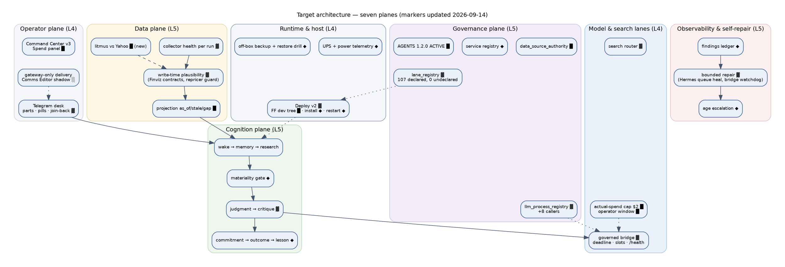
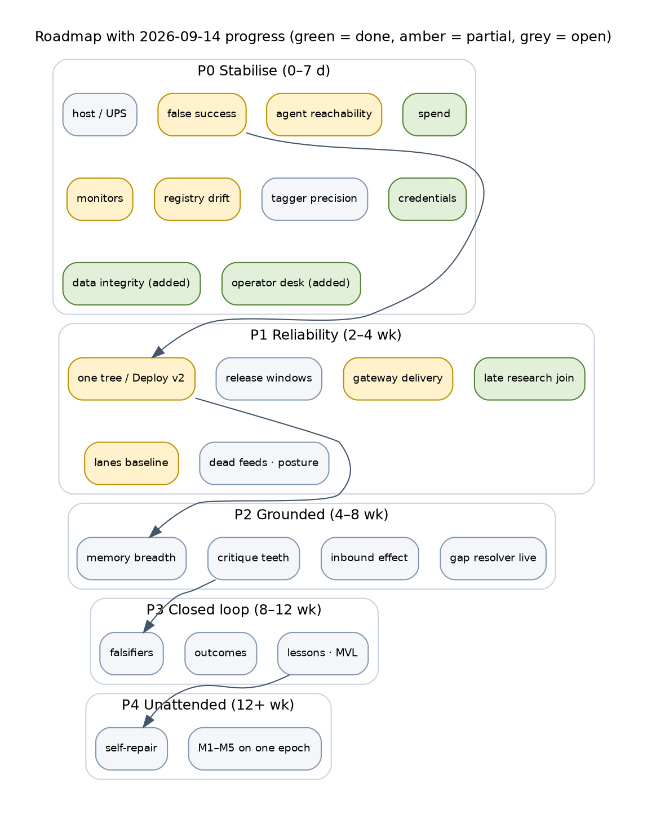

# Trade AI Platform — FUTURE STATE: Target Architecture & Build Recommendation

> **Identity note, 2026-09-15 (rev 3).** This document is the measured record of 2026-09-14. Everything that shipped after it — PRs #1026–#1036 and the chief-architect remediation — is recorded in `docs/architecture/TRADE_AI_WORKLOG_2026-09-15.md`, which also states the live commit at the end of 2026-09-15. Read any "live at" line below as historical.

```
Status:        ACTIVE
Updated:       2026-09-14 23:44 EDT — build markers, "Today" values, roadmap progress and operator decisions
               updated for the 29 PRs merged and deployed on 2026-09-13/14 (#997–#1025). Targets unchanged.
as_of:         2026-09-14 00:10 America/New_York (original specification)
Measured at:   target specification — NO number in this document is a measurement.
               Every observed number lives in TRADE_AI_AS_IS_2026-09-14.md.
Authority:     full-maturity target, bounded by the AGENTS.md §0/§2 authority rails.
               Maturity never widens authority.
Supersedes:    CIO_FUTURE_2026-09-11-2013, CIO_FUTURE_2026-09-10-2215 (CIO pipeline only)
See also:      TRADE_AI_AS_IS_2026-09-14.md · TRADE_AI_WORKLOG_2026-09-14.md · AGENTS.md §2, §7A, §9, §10, §12,
               §13.4, §15, §17, §18 (Policy-Version 1.2.0 ACTIVE since 2026-09-14)
```

The failure this programme keeps repeating is a future state quoted back as though it were
current. That is why this document and the As-Is live in separate files with different
Authority lines, and why every target below states **the observation that would prove it.**

---

## How to read this document

```
█ KEEP        already live today — carried forward unchanged
▓ WIDEN       exists, must be broadened to reach the target
░ WIRE        built and correct; needs a caller, traffic, or a schedule
◆ NEW         does not exist in any form today
★ PROVEN      the acceptance bar: observed unattended, on its own schedule, on one epoch
⊘ REFUSED     deliberately never built — an authority rail forbids it, forever
```

Maturity levels L0–L5 are the same as the As-Is document.

---

## 1. Vision

**At full maturity the platform raises its own questions, answers them from what it already
knows before it spends anything, asks a model only when a material question survives,
commits to a claim that states what would prove it wrong, tells the operator once and only
when something actually changed, finds out whether it was right, gets better, and repairs
its own plumbing within bounds — without ever touching a position.**

### Design principles

| # | Principle | What it rules out |
|---|---|---|
| P1 | **A mature desk thinks better; it does not act more.** `MBI_BEHAVIOR = 0` at every level. | Any path from cognition to size, order, stop or weight |
| P2 | **Output is the only proof of work.** A run that produced nothing failed, whatever its exit code. | "success" rows over missing tables; delivery workers that deliver zero |
| P3 | **One source of truth per fact, one writer per store, one read path per domain.** | Twin copies, unregistered writers, surfaces that disagree |
| P4 | **Free first, then metered, then paid — as an order of operations.** A paid call memory could have answered is a defect. | Budget spent on repeated opinions while agent work starves |
| P5 | **Every operator-facing number has a producer, an as-of and a source.** | Unlabelled model prose; "empty" claims about stores that hold data |
| P6 | **Grants are data.** Every source, writer, lane, service and spend cap carries an operator approval a program can read. | Silent new sources, crons, or caps |
| P7 | **Detect → decide → repair within bounds → verify → report.** A monitor that only reports is L4 at best. | Growing backlogs suppressed as "unchanged" |
| P8 | **Acceptance is observed on one epoch.** Hermetic tests and canaries are evidence of capability, not of maturity. | Scoreboards assembled from different SHAs |
| P9 | **The host is part of the system.** Power, disk, backup and restore are platform features. | A learning loop that dies with a DC brick |

---

## 2. Target architecture

```
 ┌───────────────────────────────────────────────────────────────────────────────────────────────┐
 │ OPERATOR PLANE                                                                                │
 │  Telegram desk (one account, threaded) · Command Center v3 · morning brief · email · Drive    │
 │  every field: producer · as_of · source · link   ⊘ absent never renders as a value            │
 │  ▲ gateway-only delivery (SETTLED receipts)            ▼ operator turns are EVENTS            │
 ├───────────────────────────────────────────────────────────────────────────────────────────────┤
 │ GOVERNANCE PLANE  ◆ one control plane, four registries, all gated in CI                       │
 │  data_source_authority (sources/writers/projections/grants) █                                 │
 │  lane_registry (every schedule has an output signal) ▓→★                                      │
 │  llm_process_registry (caps, lanes, budgets by priority class) ▓→★                            │
 │  service_registry = expected services + units installed by deploy ◆                          │
 │  grants ledger · release windows · required checks + review · push budget █                   │
 ├───────────────────────────────────────────────────────────────────────────────────────────────┤
 │ COGNITION PLANE                                                                                │
 │  wake ─► memory (decay-weighted, all subjects) ─► free-first research ─► MATERIAL? gate ◆     │
 │       ─► judgment (metered, requested==returned) ─► critique (other provider, can disagree)   │
 │       ─► commitment (falsifiable, frozen) ─► operator product ─► notification (on transition) │
 │       ─► outcome checkpoint (realized_state) ─► scoring ─► lesson ─► memory ╌╌▶ next wake ★   │
 │  agent workforce: Maria · Steph · Risk · Tax · Aegis · Alex · Hermes · Sentinel · Darwin      │
 │    one job router: securities ─► agent worker · topics ─► research worker ◆                  │
 ├───────────────────────────────────────────────────────────────────────────────────────────────┤
 │ DATA PLANE                                                                                     │
 │  provider ─► collector (reports health on every run ◆) ─► write module (1/store) █            │
 │   ─► store of record (plausibility contract at write ◆) ─► broker projection (as_of/stale/gap)│
 │   ─► consumers (hubs, desk, agents)   · identity spine keys everything (issuer→security) █    │
 ├───────────────────────────────────────────────────────────────────────────────────────────────┤
 │ OBSERVABILITY & SELF-REPAIR PLANE  ◆                                                          │
 │  monitors ─► findings ledger ─► bounded remediation catalogue ─► verify ─► report / escalate │
 │  alert severity rises with age · a finding cannot be suppressed while it grows                │
 ├───────────────────────────────────────────────────────────────────────────────────────────────┤
 │ MODEL & SEARCH LANES                                                                           │
 │  governed bridge (single egress for model calls) · free lanes (Grok/ChatGPT OAuth) ·          │
 │  metered (DeepSeek Flash/Pro) · local (Ollama: embeddings, extraction — ⊘ never judgment)    │
 │  search: cognition → RAG → structured stores → SearXNG → Brave (paid, budgeted)               │
 ├───────────────────────────────────────────────────────────────────────────────────────────────┤
 │ RUNTIME & HOST PLANE  ◆                                                                        │
 │  ONE execution tree (the release) · deploy = prepare → install units → promote → restart     │
 │  changed services → verify → advance pins · UPS + power telemetry · off-box encrypted backup │
 │  with tested restore · disk and release retention · Postgres connection hygiene              │
 └───────────────────────────────────────────────────────────────────────────────────────────────┘
       ⊘ BROKER EXECUTION — separate, operator-controlled, per-order 2FA. Out of scope at every level.
```



**Update 2026-09-14 — marker changes in this architecture:** Deploy v2 ▓ (dev-tree fast-forward █ via
#1025; unit install and changed-service restart still ◆); governed bridge ▓ (deadline, threads,
`/health`, watchdog via #1019); spend policy ▓ → actual-spend global cap █ and operator scheduled-work
window █ (#1015, #1020) with priority classes still ◆; write-time plausibility ▓ for Finviz exports and
the repricer (#1008); gateway-only delivery ░ (Communications Editor at the chokepoint in shadow,
#1009); lane_registry ▓ (107 declared, 0 undeclared); AGENTS rails and SOPs █ (1.2.0 ACTIVE).

### 2.1 Plane responsibilities and target maturity

| Plane | Owns | Target |
|---|---|---|
| Operator | what the operator sees and says; delivery receipts | L4 |
| Governance | registries, grants, gates, release windows, spend policy | L5 (self-checking) |
| Cognition | wake loop, agents, commitments, outcomes, lessons | L5 |
| Data | sources, writers, stores, projections, identity | L5 |
| Observability & repair | findings, bounded fixes, escalation | L5 |
| Model & search | lanes, budgets, caching, egress | L4 |
| Runtime & host | execution tree, deploy, services, power, backup, disk | L4 |

---

## 3. Integrations and connectivity model

### 3.1 Connectivity rules

1. **Single egress per class.** Model calls leave through the governed bridge; web search
   through the search router; broker reads through broker adapters; operator messages
   through the communication gateway. Nothing else opens an external connection.
2. **Collectors report health on every run** — success with a row count, failure with a
   reason — or the run is a failure (P2).
3. **Consumers read projections, never tables.** Every projection response carries
   `as_of · age · source · stale · gap`.
4. **Every source has a backup chain and a `no_coverage` rule** declared in the registry;
   the gap resolver walks it free-first.
5. **Identity first.** Every row that names a company carries a subject GUID from the
   identity spine; text is never tagged as a ticker without a registry match and a confidence
   floor, and agent-authored text is never tagged.

### 3.2 Target integration matrix

| Capability | Primary (target) | Backup chain | Health contract | Cost class | Target maturity |
|---|---|---|---|---|---|
| Quotes & bars | Alpaca | Schwab stream → yfinance → Finviz cache | per-run row count; market-time freshness | free | L4 |
| Positions & balances | Schwab (OAuth auto-reauth) | Alpaca read · Moomoo OpenD read · manual import | sync receipt per account; LIVE/STALE/SERVICE_DOWN labels | free | L4 |
| Option chains & IV | Schwab chains on a schedule ◆ | yfinance on demand | captured_at within window during market hours | free | L3 |
| Analyst opinion | Yahoo targets history | yfinance on demand | coverage age per symbol surfaced | free | L4 |
| Fundamentals | Alpha Vantage (weekly) | yfinance | health row per run ◆ | free tier | L3 |
| Macro | FRED | — | health row per run ◆; one writer ◆ | free | L3 |
| Filings & insider | SEC EDGAR | — | per-run | free | L4 |
| News & catalysts | Finviz news → Yahoo | Brave → SearXNG | relevance on one scale ◆ | free/paid | L4 |
| Social | StockTwits · Reddit | — | **output growth required** ◆ | free | L3 |
| Video transcripts | YouTube | — | quota-aware backoff ◆ | free quota | L2 |
| Web research | SearXNG (self-hosted) | Brave (paid, budgeted) | engine pool health; caller caps spill ◆ | free → paid | L4 |
| Private companies | ◆ decide: a real source or an explicit "no coverage" | — | — | O decision | L2 |
| Models — judgment | DeepSeek Flash (metered) | DeepSeek Pro on escalation | requested == returned; digests; cache | metered | L4 |
| Models — critique | Grok (free) | ChatGPT (free) | must be a different provider than the author | free | L4 |
| Models — extraction/embeddings | Ollama local | — | ⊘ never judgment | free | L3 |
| Messaging | Telegram via gateway | email digest | SETTLED receipts; one operator account | free | L4 |
| Documents | Google Drive + Gmail | local docs | credential health monitored ◆ | free | L3 |
| Secrets | Bitwarden SM → tmpfs | — | render freshness; unused keys not rendered ◆ | — | L4 |
| Backups | off-box encrypted ◆ | local | restore tested monthly ◆ | O decision | L4 |

---

## 4. Target maturity by domain

| Domain | Today (observed) | Target | Acceptance evidence that proves the target |
|---|---|---|---|
| Host & resilience | L1 | L4 | UPS installed; power telemetry alerts before shutdown; off-box backup restored successfully in a drill |
| Deployment & release | L2 | L4 | one execution tree; deploy installs units and restarts changed services; zero "promote without prepare"; ≥3 contiguous slots per release window |
| Data plane | L2 | L5 | every collector writes health per run; plausibility contract enforced at write; stale store triggers a bounded refresh that is verified |
| Integrations | L1–L2 | L4 | registry status equals live state for every provider for 30 days; failing integrations retired or fixed |
| Scheduled lanes | L1 | L4 | 0 inherited-baseline lines; every active lane declares an output signal; evaluator uses exchange time |
| Services | L2 | L4 | every long-running unit declared; none older than the served code |
| Monitoring & repair | L1 (repair L0) | L5 | findings ledger with ≥1 bounded repair class closing findings unattended and verified |
| LLM governance | L2 | L4 | budgets by priority class; no process >40% of spend; caching on repeated prompts; reservations within 2× actual |
| Agent jobs | L1 | L4 | ≥90% of queued security jobs reach a model; grounding reports on every result; demotion rate measured |
| CIO cognition | L1–L3 (1 subject) | L5 | M1–M5 proofs observed unattended on one epoch; outcome → lesson → changed question shown |
| Operator experience | L2 partial | L4 | every reply sourced and ledgered; late research delivered to its question; memory recall correct on a sampled audit |
| Notification & delivery | L1 | L4 | gateway owns ≥95% of outbound; RESERVED backlog ≤ 1 hour old; CC link on every advisory |
| Security & authority | L2 rails / L1 hygiene | L4 | required checks + one review; no secrets in tree; unused keys revoked; rails unchanged |

**Update 2026-09-14 — "Today" values after the day's work** (targets unchanged): Deployment L2 → **L3**
(dev tree fast-forwarded by promote; exit still needs unit install and restarts) · Data plane **L2** with
litmus and contracts (exit needs health per run everywhere and quarantine) · Integrations L1–L2 → **L2**
(AV health, Google credential, DeepSeek reconciliation) · Scheduled lanes L1 → **L2** (0 undeclared;
operator window; evaluator still UTC) · Monitoring L1 → **L2** (two bounded repairs: Hermes queue, bridge)
· LLM governance L2 → **L3** (actual-spend cap, attribution; priority classes still missing) · Operator
experience L2 partial → **L3** (sourced, delivered in parts, research joined back; ledgering missing) ·
Notification L1 → **L2** (editor in shadow, routing, repeat identity; gateway share not yet ≥ 95 %) ·
Security: rails L2, SOP controls binding under 1.2.0.

---

## 5. Key capabilities at full maturity

### 5.1 Data and truth
- ◆ **Health-per-run contract** for every collector; missing health = failed run.
- ◆ **Write-time plausibility contracts** (scale, sign, range, sentinel) that refuse bad rows
  and quarantine them reversibly.
- ▓ **Registry reconciliation**: the registry's provider status is derived from live health,
  not typed by hand.
- ◆ **Dead-feed retirement** with archive and tripwire, so dead desks leave the product.

### 5.2 Cognition
- ▓ **Decay-weighted memory for every subject**, with `influence_source_ids` showing what
  memory actually moved.
- ◆ **Materiality gate before any paid call**: free-first answered it → stop.
- ▓ **Judgment with digests and requested == returned**, cached where inputs repeat.
- ▓ **Critique that can disagree**, proven against known-bad fixtures, with a changed field or
  an explicit no-change reason.
- ◆ **Falsifiable commitments**: subject-specific measurable condition, horizon, checkpoint.
- ◆ **Outcome realisation**: `realized_state` populated; commitments settled on horizon.
- ◆ **Scored lessons retrieved into later questions**, shown with and without.
- ░ **Sentinel, Darwin and nightly reflection** on schedules with counters (MVL).

### 5.3 Agents
- ◆ **One job router**: securities to the agent worker, topics to research, unprofiled
  symbols to identity enrichment first.
- ░ **Rule G0 and number grounding** exercised on every result; demotion rate reported.
- ▓ **Synthesis that fails loudly**: per-attempt errors, a failed state after N tries.

### 5.4 Operator experience
- ▓ **Subject briefs** for every named company, Command Center link included.
- ◆ **Late research delivery**: research completion joins back to the waiting question.
- ░ **Chat memory recall** by subject GUID, protected by tagger precision.
- ◆ **Single operator identity** on Telegram, threaded replies, morning brief.

### 5.5 Observability and repair
- ◆ **Findings ledger** unifying integrity sweep, health agent, lane evaluation, data-source
  health, answer quality, plausibility and gap resolution.
- ◆ **Bounded remediation catalogue**: restart a declared unit, rerun a collector, refresh a
  projection, requeue a job, re-render secrets — each with verification and rollback.
- ◆ **Age-based escalation**: a growing backlog can never be "unchanged".

### 5.6 Runtime and host
- ◆ **Deploy v2**: prepare → install declared units → promote → restart services whose code
  changed → verify each → advance execution pins → receipt.
- ◆ **Release windows** that guarantee ≥3 contiguous hourly slots on one SHA.
- ◆ **Resilience kit**: UPS with graceful shutdown on low battery, power telemetry alerts,
  off-box encrypted backup with monthly restore drill, release-directory retention, disk
  alerts, Postgres idle-transaction hygiene.

---

## 6. Governance model

| Control | Target design |
|---|---|
| Authority rails | `MBI_BEHAVIOR = 0`, `MBI_COGNITION = 1`, `MEMORY_BEHAVIOR_INFLUENCE = 0` — unchanged at every level ⊘ |
| Operator grants | one grants ledger referenced by every registry row; grant id, scope, date, reference; CI finding when absent (extends today's `UNAPPROVED_SOURCE`) |
| Registries | data sources, lanes, LLM processes, services — each with a CI gate, a live reconciliation monitor, and a rendered human view |
| Spend policy | budgets by **priority class** (operator-requested > held positions > agent jobs > synthesis > background opinion), each with a floor; global cap enforced at the bridge; caching before scheduling |
| Change control | required checks: `cio-hardening`, authority gate, lane gate, secrets scan; one approving review; admins enforced |
| Release policy | release windows; no promote inside a proof window; rollback by pointer |
| Evidence standard | L1–L2 artifact that would not exist otherwise · L3 output varies with input · L4 lesson changed a later question · L5 all of it unattended |
| Documentation | AGENTS.md rules + rendered registry sections; As-Is/Future pair re-measured after each release window; Drive + GitHub copies postdate the SHA they describe |

---

## 7. Automation and operations

| Area | Today | Target automation |
|---|---|---|
| Deploy | manual fast-forward of dev tree; manual unit install; manual bot restart | Deploy v2 does all of it and writes one receipt |
| Monitoring | 10+ monitors, report-only, some misleading | findings ledger + age escalation + bounded repair |
| Data freshness | decay read model; health recorders missing | health per run; stale store triggers bounded refresh |
| Agent queue | auto-queue picks unprofiled symbols; topics mis-routed | router + identity-first enrichment + queue health SLOs |
| Gap resolution | dry-run; 84 gaps unattended | live for free vectors; paid vectors under budget class; ETA to the operator |
| Backups | local, encrypted | off-box, encrypted, restore-tested |
| Documentation | written per campaign | regenerated sections from registries; As-Is re-measured by a read-only agent after each release window |
| Incident | discovered by the operator | the desk reports its own decay before the operator notices (L5) |

---

## 8. Roadmap from As-Is to Future State

Each phase ends on an **observed** exit condition. A phase is not complete when its PRs
merge.

### Phase 0 — Stabilise (0–7 days)

| Workstream | Deliverable | Exit condition (observed) | Owner |
|---|---|---|---|
| Host | replace DC supply; UPS; fancontrol fixed | no unclean shutdown for 7 days; UPS telemetry visible | O |
| False success | integrity `declared_output_*` findings fail the run; fix/retire 22 pipelines, social ingest, cio-delivery, defer-revisit | integrity P0 = 0, P1 declared_output = 0 | E |
| Agent reachability | `symbol_profiles` writing; topic router; unprofiled-symbol guard | ≥1 weekday window with ≥90% of security jobs reaching a model | E |
| Spend | cap `advisory_desk_opinion`; floors for agent jobs and synthesis | no COST_CAP_EXCEEDED on agent jobs for 3 weekdays | O+E |
| Monitors | lane-health keys, gap alert escalation, answer-quality exit code | monitors agree with ledgers; no suppressed growing backlog | E |
| Registry drift | moomoo status, health recorders ×3, lane match strings, weekly/monthly timers, plausibility timer | data-source health off = only genuine failures; lanes ORPHANED = 0 | E |
| Tagger precision | agent text excluded; confidence floor | sampled audit: 0 false subjects in 50 turns | E |
| Credentials | Google re-auth | token refresh unit green | O |

**Update 2026-09-14 — Phase 0 progress:**

| Workstream | State | Evidence / what remains |
|---|---|---|
| Host | ◆ open | DC supply, UPS, fancontrol unchanged |
| False success | ▓ partial | Hermes queue self-heals and alerts (#1014); bridge wedge detected and bounded (#1019); the 22 pipelines, social ingest, cio-delivery unchanged |
| Agent reachability | ▓ partial | phantom cost-cap refusals removed by actual-spend caps (#1015); `symbol_profiles` and topic routing unchanged |
| Spend | █ done differently | $2.00/day actual-spend cap; attribution split into 8 callers (#1021); operator window (#1020); floors by priority class still ◆ |
| Monitors | ▓ partial | `REPLY_NOT_DELIVERED`, `RESEARCH_LANDED_UNSENT`, heartbeat lane; lane-health keys and gap-alert escalation unchanged |
| Registry drift | ▓ partial | Alpha Vantage health; four research_scheduler lanes declared; moomoo status and weekly/monthly timers unchanged |
| Tagger precision | ◆ open | — |
| Credentials | █ **done** | operator re-authenticated 2026-09-14 23:4x; token refresh green |
| **Data integrity (added)** | █ done | repricer, Alpaca prev_close, Finviz contracts and units, litmus, view contracts, EOD closes (#1008) |
| **Operator desk (added)** | █ done | dictated tickers, pills, join-back, parts, rich alerts (#1005–#1007, #1016, #1018) |

**Phase 1 progress:** one execution tree ▓ (#1025 fast-forward; install/restart ◆) · gateway-owned
delivery ░ (editor shadow; review then live, already approved) · late research joined to pending
questions █ (#1006) · release windows ◆ · lanes baseline ▓ · dead feeds ◆ · posture ◆.

### Phase 1 — Reliability and truth (2–4 weeks)

| Workstream | Deliverable | Exit condition |
|---|---|---|
| Runtime | one execution tree; Deploy v2 | 2 consecutive deploys with no manual step; no service older than served code |
| Release windows | window policy + enforcement | ≥3 contiguous slots on one SHA each week |
| Delivery | gateway-owned delivery for desk replies, closes, alerts; RESERVED cleanup | gateway ≥95% of outbound for 7 days; desk replies ledgered |
| Late research | plan id → pending id join | a real late answer delivered to its question |
| Lanes | declare or retire the 531 inherited lines | baseline = 0 |
| Data | health per run for every collector; write-time plausibility | plausibility off = 0 for 7 days |
| Dead feeds | retire watch discovery, debate, AI reports, redeploy cache (O) | no dead feed surfaced in the product |
| Posture | required checks + review; secrets out of tree; unused keys revoked | integrity `tree_relative_secret` = 0 |

### Phase 2 — Grounded cognition, L2 → L3 (4–8 weeks)

| Workstream | Deliverable | Exit condition |
|---|---|---|
| Memory | grounding across subjects | memory facts loaded on a majority of wakes across ≥10 subjects |
| Judgment | materiality gate; caching | paid calls only on material questions; cache hit rate reported |
| Critique | known-bad fixtures; disagreement path | ≥1 critique changes `next_research_question` (M2 observed) |
| Inbound | new operator turns reach the next wake | a reply changes the next wake, shown both ways (M3 observed) |
| Agents | grounding reports on every result | demotion rate measured weekly |
| Gap resolver | live free vectors | gaps closed with receipts and ETA to operator |

### Phase 3 — Closed loop, L4 (8–12 weeks)

| Workstream | Deliverable | Exit condition |
|---|---|---|
| Commitments | subject-specific falsifiers | 0 boilerplate falsifiers |
| Outcomes | `realized_state` populated; settlement producer | first commitments settled on horizon |
| Scoring → lessons | outcome-derived lessons retrieved into questions | a lesson changes a later question, shown with and without |
| MVL | Sentinel, Darwin, reflection scheduled with counters | MVL exit counters met (≥100 reviewed artifacts, ≥20 regression fixtures, ≥95% retrieval, measured false-positive rate, ratify and reject paths) |
| Consistency | one producer per operator number | M4 met: no unlabelled contradictions in a 7-day audit |

### Phase 4 — Unattended and self-repairing, L5 (12+ weeks)

| Workstream | Deliverable | Exit condition |
|---|---|---|
| Self-repair | bounded remediation catalogue | ≥3 finding classes closed unattended and verified |
| Self-report | desk reports its own decay | a decay reported before an operator or auditor finds it |
| Acceptance | M1–M5 on one epoch, unattended | all five observed in one release window with nobody replaying anything |

```
 NOW ──► P0 STABILISE ──► P1 RELIABILITY ──► P2 GROUNDED (L3) ──► P3 CLOSED LOOP (L4) ──► P4 UNATTENDED (L5)
        host · false success   one tree · gateway    memory · critique      falsifiers · outcomes     self-repair
        agent reachability     release windows       inbound effect         lessons · MVL             M1–M5 on one epoch
        spend · monitors       lanes · posture       gap resolver live      consistency (M4)
```



**Ordering rule.** Judgment without grounding produces fluent text about nothing; scoring
without falsifiers has nothing to score; self-repair without honest monitors repairs the
wrong things. Do not skip ahead.

---

## 9. Strategic recommendations

1. **Treat the host as production infrastructure now.** A UPS and an off-box backup are the
   cheapest maturity gains available; every other phase assumes they exist.
2. **Redefine success as output, platform-wide.** Make the integrity sweep's declared-output
   checks part of every run's exit status. This single change removes the largest class of
   silent failure found in this audit.
3. **Collapse to one execution tree and one deploy.** Most "fixed but not running" incidents
   trace to the dev tree, uninstalled units, and unrestarted services.
4. **Budget by priority, not by process.** The operator's questions and held positions
   should never be starved by a background opinion process; cache before you schedule.
5. **Make the gateway the only way out.** Delivery you cannot ledger is delivery you cannot
   prove, deduplicate, or measure.
6. **Freeze release windows for acceptance.** Maturity can only be observed on one epoch;
   today's promote cadence makes that impossible by construction.
7. **Fix identity precision before memory scales.** Chat memory by GUID is only as good as
   the tagger feeding it.
8. **Give critique teeth before adding more judgment.** A critic that has never disagreed is
   not yet evidence of anything.
9. **Write falsifiers the future can check.** Without them, outcomes cannot be scored and
   the learning loop cannot close.
10. **Turn detectors into a findings ledger with bounded repair.** The platform already
    detects most of its problems; it now needs to close them.
11. **Retire what is dead.** Dead feeds, dead tables, retired keys and dead integrations cost
    attention and create false signals.
12. **Tighten the repository.** Required checks plus one review, no secrets in the tree, and
    key rotation — the repository is public by policy, so the controls must carry the weight.
13. **Re-measure after every release window.** Keep the As-Is/Future pair current with a
    read-only measurement agent, published to GitHub and Drive with a SHA that postdates the
    work it describes.

---

## 10. Operator decisions required

| # | Decision | Recommended | Why it needs the operator |
|---|---|---|---|
| 1 | Replace DC supply; buy a UPS | Yes, now | hardware and spend |
| 2 | Fund off-box encrypted backup of persistent state (§18) | Yes | spend; data egress |
| 3 | LLM budget: cap `advisory_desk_opinion`, set priority-class floors, or raise the global cap | Cap and floors first | spend (§17) |
| 4 | Release windows (promote freeze periods) | Yes | changes the operating model |
| 5 | Arm the gap resolver live (free vectors first) | Yes | new automated spend path |
| 6 | Retire dead feeds and tables (watch discovery, debate, AI reports, redeploy cache, `inbound_operator_questions`, DB agent views/commitments) | Yes, archive with tripwires | deletion is operator-only |
| 7 | Brave caller-cap spill to SearXNG | Yes | source-chain change |
| 8 | Private-company data: build a source or declare no coverage | Declare no coverage until needed | new data source |
| 9 | Options chains on a schedule | Yes | new scheduled lane |
| 10 | Branch protection: more required checks, one review, enforce admins | Yes | §17 |
| 11 | Revoke retired-provider keys; rotate keys in history | Yes | credentials |
| 12 | Consolidate Telegram onto one account | Yes | operator devices |
| 13 | Health-agent criticals touching execution (position without a stop, audit ledger chain) | Review promptly | execution subsystem is operator-controlled |

**Update 2026-09-14 — decisions taken since this list was written:**

| # | Decision | Taken | Where it went |
|---|---|---|---|
| 3 | LLM budget | ✓ caps count **actual** spend; one $2.00/day global cap; $7 override retired; label split approved; scheduled paid work confined to the operator window | #1015, #1020, #1021 |
| 5 | Arm the gap resolver (free vectors) | ✓ approved 09-14 ~09:05 | not yet implemented |
| 1 (part) | Quarantine corrupt prices (archive + tripwire) | ✓ approved 09-14 ~09:05 | write path fixed (#1008); historical rows not yet quarantined |
| — | Data integrity: fractional Schwab price (consumer side), retention FK guard, schedule litmus and view contracts, consolidated EOD closes | ✓ "1. approve 2. yes 3. yes 4. yes or finviz or schwab" | #1008 |
| — | Communications: routing map, one 07:30 brief, GO alerts on scalp criteria incl. social, noise to digest, editor shadow then live | ✓ | #1009, #1011 |
| — | Commitment sweep hourly cron | ✓ approved 09-14 ~09:05 | not yet implemented |
| — | AGENTS.md 1.2.0 activation | ✓ `APPROVE_AGENTS_POLICY_1_2_0` | #1024 |
| 11 (part) | Google credential | ✓ re-authenticated by the operator | token refresh green |
| — | Disable the OpenClaw Gemma B50 job | ✓ | disabled, row kept |
| 1, 2, 4, 6–10, 12, 13 | remaining decisions | open | — |

---

## 11. Exit charter — what "done" means

| Intersection | Exit condition (all required, observed) |
|---|---|
| Output ∩ success | No run reports success without its declared output |
| Data ∩ truth | Registry status equals live state; one producer per operator-visible number |
| Memory ∩ judgment | Memory weighted by age informs judgment across subjects; influence shown |
| Judgment ∩ critique | Different providers; critique changes a field when it should |
| Commitment ∩ outcome | Falsifiable, frozen before the window, settled on horizon |
| Outcome ∩ lesson | A scored lesson changes a later question, shown with and without |
| Operator ∩ cognition | A new operator reply changes the next wake, shown both ways |
| Delivery ∩ proof | Gateway-owned, SETTLED receipts, Command Center links |
| Monitoring ∩ repair | Findings closed unattended within bounds and verified |
| Epoch ∩ acceptance | M1–M5 in one release window, unattended |
| Rails ∩ maturity | `MBI_BEHAVIOR = 0` unchanged; broker execution untouched |

**The count that matters is not a percentage.** Five proofs, each observed unattended on
one epoch. A truthful three of five beats a claimed five.

---

## 12. The one-sentence version

*(Unchanged by the 2026-09-14 update.)*

Keep the rails, make success mean output, run one tree, deliver through one gateway, budget
by priority, give critique teeth and commitments falsifiers, close the outcome loop, then
let the platform repair what it already knows how to detect — on a host that stays up.
