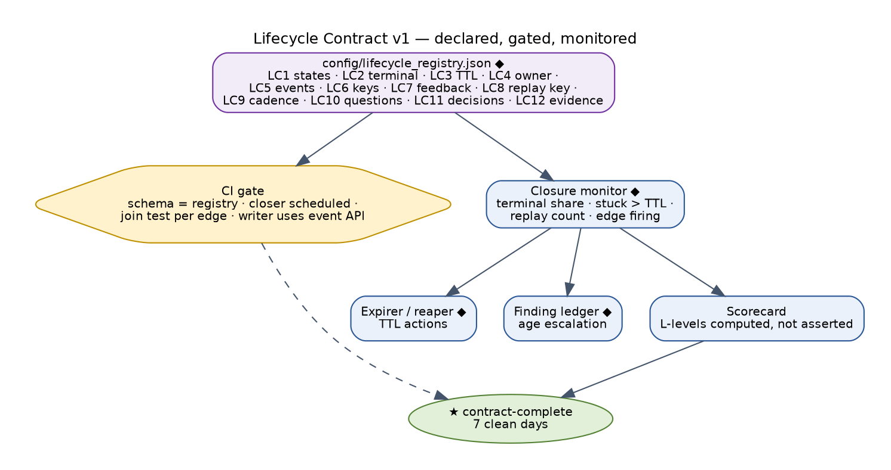
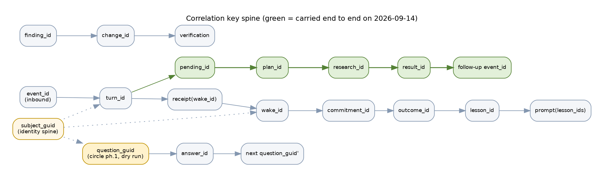
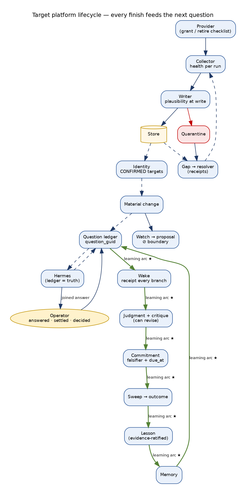
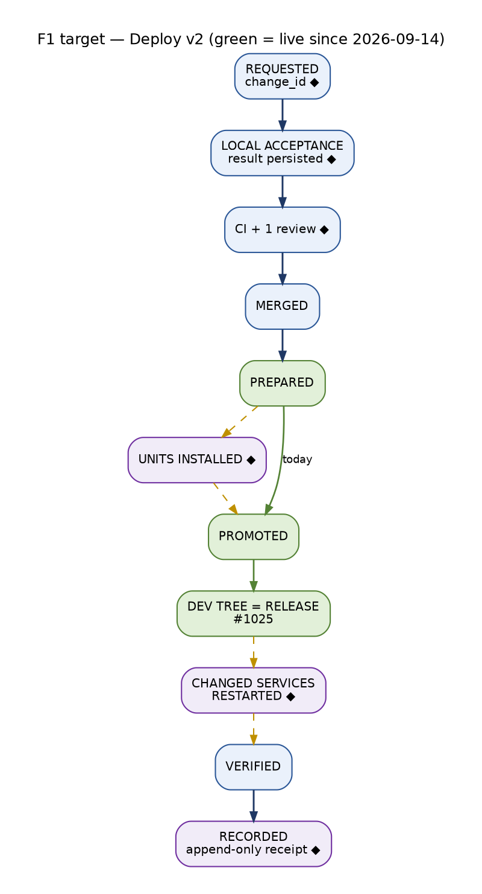
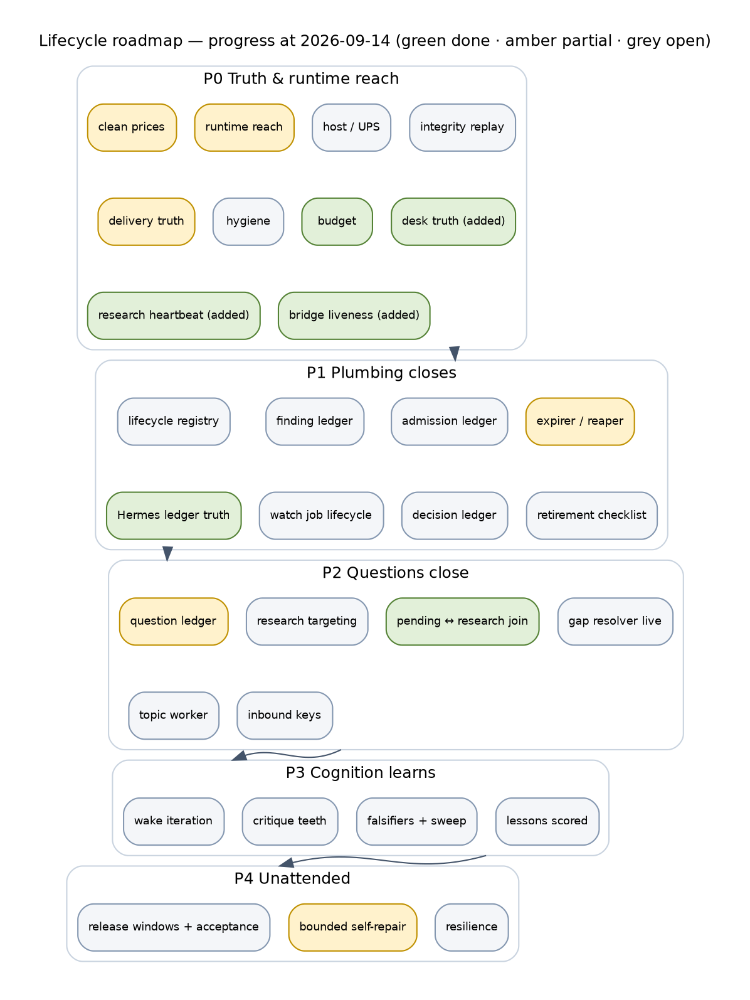

# Trade AI Platform — FUTURE STATE Lifecycles: target lifecycles, lifecycle contract and build roadmap

> **Identity note, 2026-09-15 (rev 3).** This document is the measured record of 2026-09-14. Everything that shipped after it — PRs #1026–#1036 and the chief-architect remediation — is recorded in `docs/architecture/TRADE_AI_WORKLOG_2026-09-15.md`, which also states the live commit at the end of 2026-09-15. Read any "live at" line below as historical.

```
Status:        ACTIVE
Version:       2 (extends TRADE_AI_FUTURE_STATE_2026-09-14.md v1 — target architecture and integrations —
               with the complete target lifecycle for everything the platform does)
Updated:       2026-09-14 23:44 EDT — "Today" values, build markers, phase progress and operator decisions updated for
               the 29 PRs merged and deployed on 2026-09-13/14 (live 341bce2c1). Targets and exit counters unchanged.
as_of:         2026-09-14 America/New_York (original specification)
Measured at:   target specification. The only numbers here that are measurements are the "Today" values,
               quoted from TRADE_AI_AS_IS_LIFECYCLES_2026-09-14.md and its six fact bases.
Authority:     full-maturity target, bounded by the AGENTS.md §0/§2 rails. Maturity never widens authority.
               MBI_BEHAVIOR = 0 at every level. Broker execution stays operator-controlled and out of scope.
See also:      TRADE_AI_AS_IS_LIFECYCLES_2026-09-14.md · TRADE_AI_FUTURE_STATE_2026-09-14.md (v1 planes,
               integration matrix) · docs/architecture/lifecycles/LIFECYCLE_FACTBASE_{A..F}_2026-09-14.md ·
               TRADE_AI_WORKLOG_2026-09-14.md (every change on 2026-09-14)
```

The As-Is found a platform that starts things well and finishes almost nothing: 26
lifecycles, 57 feedback edges, 11 that fire. This document specifies the finished version of
every one of those lifecycles — its states, its terminal states, how long anything may sit
in each state, who owns it, which key joins it to the next lifecycle, what must change
between one cycle and the next, how each question it raises gets closed — and the order in
which to build them so each phase can be **observed** complete.

---

## 0. How to read this document

```
Build markers   █ KEEP   ▓ WIDEN   ░ WIRE (built; needs a caller, schedule or traffic)   ◆ NEW   ★ PROVEN (acceptance bar)   ⊘ REFUSED forever
Maturity        L0 exists · L1 runs + provenance · L2 grounded · L3 judged/validated · L4 loop closed · L5 unattended + self-report
Lifecycle IDs   A1–A4 data · B1–B4 questions · C1–C4 watchlist/proposal/learning · D1–D5 cognition · E1–E4 comms · F1–F5 engineering
Owner           O operator decision · E engineering
```

Every target ends with **exit counters**: observations on the live host, on the natural
schedule, that prove the target. A merged PR is never an exit counter.

---

## 1. Vision

**At full maturity every lifecycle on the platform finishes, and every finish feeds the next
question.** A value is checked when it is written; a gap is filled or declared; a question
is answered, superseded or expired — never abandoned; a job is done, deferred with a reason,
or closed; a message is settled with proof; a commitment is scored against what happened; a
lesson changes a later question and shows that it did; a finding is owned until a clean
observation closes it; a change reaches the process that runs it. The platform thinks better
over time — and never acts on a position.

### 1.1 Principles

| # | Principle | Rules out |
|---|---|---|
| P1 | **A mature desk thinks better; it does not act more.** `MBI_BEHAVIOR = 0` at every level. | any path from cognition to size, order, stop or weight |
| P2 | **Output is the only proof of work.** | success rows over missing tables; workers that deliver zero |
| P3 | **One source of truth per fact, one writer per store, one read path per domain.** | twin copies, unregistered writers |
| P4 | **Free first, then metered, then paid — and budget by priority, not by process.** | a background opinion starving the operator's question |
| P5 | **Every operator-facing number has a producer, an as-of and a source.** | unlabelled prose, false "empty" claims |
| P6 | **Grants and decisions are data.** | approvals that exist only in chat |
| P7 | **Detect → decide → repair within bounds → verify → close → report.** | detectors that only report |
| P8 | **Acceptance is observed on one epoch.** | scoreboards assembled from different SHAs |
| P9 | **The host is part of the system.** | a learning loop that dies with a DC brick |
| P10 | ◆ **Every non-terminal state has a TTL and an owner.** | silent sinks (IDENTIFIED forever, ROUTED forever, RESERVED forever) |
| P11 | ◆ **Every terminal state writes a receipt that a later lifecycle reads.** | loops that end in a log line |
| P12 | ◆ **A loop must change its input or stop.** Replay is a finding, not a cycle. | ADBE × 40, WMT × 92, remediation × 8,979 |
| P13 | ◆ **Every question has an id, a settle condition and an end.** | 872 due-diligence questions with no close |
| P14 | ◆ **Every hop carries the key of the hop before it.** | answers that cannot find their questions |

---

## 2. The Lifecycle Contract v1 ◆

A normative contract every lifecycle must satisfy. It is declared per lifecycle in a
**Lifecycle Registry** (`config/lifecycle_registry.json`, rendered into docs like the data
source authority) and enforced by a CI gate and a runtime closure monitor.

| # | Clause | Declared in the registry as | Enforced by | Today (As-Is) |
|---|---|---|---|---|
| LC1 | **States are enumerated**, with exact stored values, and the store has a CHECK or enum | `states[]`, `store`, `column` | CI: schema/enum matches registry | several free-text status columns; `proposed` rejected by a CHECK |
| LC2 | **Terminal states are declared** and reachable by the lifecycle's own mechanism | `terminal[]`, `closer` | CI: closer is scheduled; runtime: terminal share > 0 | 22 of 26 lifecycles close or feed back at L0 |
| LC3 | **Every non-terminal state has a TTL** and a TTL action (expire, escalate, retry) | `ttl{state: duration, action}` | runtime expirer | RESERVED, IDENTIFIED, ROUTED, OPEN have none |
| LC4 | **Every open item has an owner** (a lane, an agent, or the operator) | `owner` per state | closure monitor | circuits hand off to nobody |
| LC5 | **Transitions are events**, append-only, with actor and cause | `events_store` | CI: writer uses the event API | several stores overwrite (deploy receipt, push budget) |
| LC6 | **Correlation keys are carried** from the predecessor lifecycle and passed to the successor | `keys_in[]`, `keys_out[]` | CI: join test per edge; runtime: join rate | 14 joins missing (As-Is X2) |
| LC7 | **Feedback edges are declared and measured** — each has a firing counter | `feedback[]{to, counter}` | closure monitor | 11 of 57 fire |
| LC8 | **Anti-replay:** a cycle whose input watermark is unchanged must not produce a new output; repeats are counted | `replay_key` | runtime replay guard | replay is the dominant iteration mode |
| LC9 | **Stuck detection:** any item non-terminal > 2× cadence is a finding with age escalation | `cadence` | closure monitor → finding ledger | measured by hand this audit |
| LC10 | **Questions raised are registered** in the question ledger with a settle condition | `questions[]` | CI + question ledger | only the desk pending ledger exists |
| LC11 | **Decisions required are registered** in the decision ledger (operator-only actions) | `decisions[]` | CI + decision ledger | decisions live in chat |
| LC12 | **Maturity evidence counters** per stage are declared, so L-levels are computed, not asserted | `evidence{stage: counter}` | scorecard job | levels assigned by auditors |

**Acceptance bar ★:** a lifecycle is *contract-complete* when LC1–LC12 are declared, the gate
is green, and for 7 consecutive days the closure monitor reports terminal share > 0, stuck
= 0 beyond TTL, and every declared feedback counter > 0.



---

## 3. Correlation key spine ◆

The As-Is showed lifecycles that each work partly and cannot find one another. The target is
one key per concept, minted once, carried everywhere downstream.

```
 change_id ───────────────────────────────────────────────────────────────────────────────▶ deploy receipt · runtime restart · finding closure
 event_id (inbound) ──▶ turn_id ──▶ receipt(wake_id) ──▶ wake_id ──▶ commitment_id ──▶ outcome_id ──▶ lesson_id ──▶ prompt(lesson_ids)
      │                     │                                   ▲
      │                     └──▶ pending_id ──▶ plan_id ──▶ research_id ──▶ result_id ──▶ follow-up event_id (causation = event_id)
      │
 subject_guid ═══════════ carried by every row that names a company (A3) ═══════════ joins everything about X
 question_guid ──▶ route_id ──▶ answer_id ──▶ settle(ANSWERED|SUPERSEDED|EXPIRED) ──▶ next_research_question(question_guid')
 finding_id ──▶ incident ──▶ remediation_attempt_id ──▶ change_id (fix) ──▶ verification_observation ──▶ closed
 reservation_id ──▶ admission_decision(class) ──▶ job_id ──▶ retry_after / result_id
 delivery_id ──▶ provider_message_id ──▶ settlement ──▶ reply_to_event_id (operator answer)
 epoch_id ──▶ slots ──▶ clause receipts ──▶ acceptance receipt
```

| Key | Minted by | Must be carried to | Today |
|---|---|---|---|
| `subject_guid` | identity spine (A3) | every corpus row, question, research target, wake, commitment, turn | ▓ carried; UNRESOLVED accepted as a target |
| `question_guid` | question ledger ◆ | route, answer, settle, next question | ✗ DDQ has a guid, answers never written back |
| `pending_id` → `plan_id` → `research_id` → `result_id` | desk (B1) / plan store / Hermes queue | pending row; fulfil loop; follow-up message | ✗ plan id only in a side ledger |
| `event_id` / `causation_id` / `reply_to_event_id` | communication gateway (E1/E2) | every outbound reply and close; alert acknowledgements | ✗ 0/1,013 |
| `wake_id` | wake engine (D1) | consumption receipt; commitment; view | ✗ receipts 0/94 |
| `commitment_id` → `outcome_id` → `lesson_id` | wake / sweep / lesson builder | lesson provenance; prompt that uses the lesson | ✗ sweep unscheduled |
| `finding_id` | finding ledger ◆ | incident, remediation, fix change, closure | ✗ no shared id |
| `change_id` | decision/change ledger ◆ | PR, CI, release, promote receipt, runtime restart | ✗ `source_pr: null` |
| `reservation_id` + refusal class | LLM admission (F2) | agent job, Hermes job | ✗ class in logs only |
| `epoch_id` | deploy (F1) | wakes, clause receipts, acceptance | ▓ stamped on wakes; no collector |

**Update 2026-09-14:** the `pending_id → plan_id → research_id → result_id` join is now carried on the desk
pending row and used by the fulfil loop (#1006) — the first key in this spine to be live end to end. The
Research Escalation Circle phase 1 mints a `question_guid` per operator ask in its own ledger (#1012, dry
run); the model bridge attributes calls to eight named process ids (#1021).



---

## 4. The target platform lifecycle, end to end

```
                         ┌──────────────────────────────── OPERATOR ─────────────────────────────────┐
                         │ asks (B1) → answered or honestly closed   reads (E1) settled   decides (ledger) │
                         └────┬───────────────────────────────▲───────────────────────────────┬───────┘
                              │ E2 event_id, bot_id, reply_to │ E1 gateway-only, pmid, CC link  │ F1 change_id
                              ▼                               │                                  ▼
 PROVIDER ══A2 grant/retire checklist══▶ COLLECTOR (health per run) ══▶ WRITER (plausibility at write ◆) ══▶ STORE
                                                   refused rows ══▶ QUARANTINE ◆ ══▶ gap ══▶ RESOLVER (free-first, receipts ★)
                                                                                                      ══▶ producer refresh ══▶ STORE
 STORE ══▶ PROJECTION (as_of·stale·gap) ══▶ hubs · desk · agents (no direct reads)
   ══▶ IDENTITY A3 (CONFIRMED-only targets; unresolved escalated; recurring CUSIP upgrade)
   ══▶ MATERIAL CHANGE A4 ══▶ notice ══▶ question_guid (B2) ══▶ research (priority × age) ══▶ answer joined ══▶ ANSWERED
                                                   └─ no dossier ══▶ research gap ══▶ Hermes job (B3, projection = ledger)
   ══▶ WATCH C1 ══▶ gate (profile-build on reject) ══▶ agents (class-aware retry, priority budget) ══▶ synthesis (fresh only)
         ══▶ safety (same-run only) ══▶ proposal C2 (review closed before approval) ══▶ ⊘ APPROVAL BOUNDARY
   ══▶ COGNITION D1 (hourly): select (receipt on every branch) ══▶ memory (all subjects, admitted from settled judgments)
         ══▶ judgment (budget-gated, any hour) ══▶ critique (can revise the question) ══▶ commitment (author falsifier, due_at)
   ══▶ OUTCOME D2: sweep (scheduled) ══▶ CONFIRMED / REFUTED / EXPIRED on clean prices ══▶ lesson (evidence-ratified)
   ══▶ LESSON ══▶ MEMORY ══▶ NEXT QUESTION (question_guid') ╌╌▶ back to B2 / D1     ★ the learning arc, observed end to end
 maintained by F: change_id → CI → merge → Deploy v2 (FF · install · restart · verify · receipt) → findings (owned, closed on clean observation)
                  LLM admission ledger (F2) · lanes installed by deploy (F3) · restore drills + rotation + UPS (F5)
```

---



## 5. Platform services that make lifecycles close ◆

These are new, shared services. Each lifecycle target below uses them rather than
re-inventing closure locally.

| Service | Responsibility | Consumers | Build marker |
|---|---|---|---|
| **Lifecycle Registry + gate** | declares LC1–LC12 per lifecycle; CI fails on undeclared states, unscheduled closers, missing keys | all 26 | ◆ |
| **Closure Monitor** | per lifecycle: terminal share, stuck beyond TTL, replay count, feedback-edge firing; writes findings with age escalation | all 26 → F4 | ◆ |
| **Expirer / Reaper** | applies declared TTL actions (EXPIRE, ESCALATE, RETRY) on a schedule | E1 RESERVED, B2 questions, B3 jobs, D4 wake jobs, C1 jobs, F4 escalations | ◆ |
| **Question Ledger** | `question_guid`, text, why_now, settle condition, subject, owner, TTL, answers, terminal | B1, B2, B3, B4, D1, D2 | ◆ |
| **Finding Ledger** | one id across 11+ detectors; open → acknowledged → fixing → verifying → closed / accepted; remediation attempts attached | F4, E3, A1, F3, C1 | ◆ (schema `alert_incidents` exists, 0 rows → ░) |
| **Decision Ledger** | operator decisions (push override, deploy approval, unit install, cap change, retirement, ratify) with scope and reference | F1, F2, F3, A2, C3, D3 | ◆ (guard ledger exists, empty → ░) |
| **Replay Guard** | input watermark per loop; unchanged watermark → skip and count | D1, C1, A3, A4, F4, D4, C3 | ◆ |
| **Join service (correlation)** | resolves `plan_id ↔ pending_id`, `answer ↔ question`, `reply ↔ alert`, `receipt ↔ wake` | B1, B2, E2, E3, D1 | ◆ |
| **Deploy v2** | prepare → install declared units → promote → FF/retire dev tree → restart changed services → verify → append-only receipt with `change_id` | F1, F3, E2 | ▓ (prepare/promote █) |
| **Priority budget scheduler** | budgets by class with floors; admission decisions recorded; refused work deferred with retry-after | F2, C4, C1, B3 | ◆ |
| **Acceptance collector** | per epoch clause receipts on schedule; freeze windows | D5 | ░ (collector exists, unscheduled) |
| **Resilience kit** | UPS telemetry, hard-cut alert, off-box encrypted backup, quarterly restore drill, rotation daemon, inotify/disk guards | F5 | ◆ / ░ |

---

## 6. Target lifecycles, family by family

For each lifecycle: **target state machine** (◆ new states in bold), **TTL and owner**, **keys in → out**,
**iteration rule** (what must change between cycles; what the replay guard skips), **question
closure**, **exit counters** (today → target), **target maturity** per stage.

### FAMILY A — Data and sources

#### A1 · Data point — target

```
 COLLECTED ──report_source (UPSERT, every run, row count)──▶ WRITTEN ──plausibility contract at write◆──┬──▶ ACCEPTED ──▶ PROJECTED (as_of·stale·gap)
                                                                                                         └──▶ **REFUSED◆** ──▶ **QUARANTINED◆** (archive + tripwire, reversible)
 PROJECTED ──age > stale_after──▶ STALE ──enqueue_gap (caller wired ░)──▶ GAP_OPEN
 GAP_OPEN ──resolver: refresh_producer → backup → governed_search (Brave → SearXNG spill) → hermes → llm → operator_ask──▶
          ANSWERED (receipt, store refreshed, envelope re-verified) | QUEUED (ETA) | **DECLARED_NO_COVERAGE◆** | **EXPIRED◆** (TTL)
 detector corroboration refusal ══▶ REFUSED (same path as write-time refusal)
```

| Item | Target |
|---|---|
| TTL / owner | GAP_OPEN 2× domain cadence → escalate to finding; QUEUED ETA + grace → operator_ask; owner = the domain's declared producer lane |
| Keys | `domain`, `store`, `row_key`, `gap_id`, `receipt_id`, `finding_id` |
| Iteration rule | a gap re-raised with the same `(store, row_key, as_of)` watermark is not a new gap; a refresh that returns the same as_of is `no_answer`, not `answered` |
| Question closure | "Is this value plausible?" answered at write; "Can a cheaper vector answer?" answered by a receipt per attempt; "Do you have a source?" asked once with an ETA |
| Exit counters | resolver receipts **0 → daily** · research gaps resolved **0/97 → ≥ 80 % within TTL** · quarantine latency after refusal **never → < 24 h** · plausibility coverage **1/26 → 26/26 numeric stores** · health rows for primary providers **7/26 → 26/26** · hub direct reads **177 → 0** |
| Update 2026-09-14 | plausibility at write ▓ for prices and Finviz units (repricer refusal, header/unit contracts); independent litmus █ (Tue–Sat 07:45); EOD consolidated closes █; quarantine of historical corrupt rows approved, not built; resolver ◆ |
| Target maturity | collect L3 · liveness L3 · plausibility **L4** · quarantine **L4** · gap resolve **L4** · refresh **L4** · the loop **L5** once unattended for 30 days |

#### A2 · Provider — target

```
 PROPOSED (PR) ──operator grant (decision ledger)──▶ ACTIVE ──live health diverges > 24 h──▶ **DRIFT◆** ──auto-drafted registry PR──▶ ACTIVE | DEGRADED
 ACTIVE | DEGRADED ──operator retire──▶ RETIRING◆ ──checklist: code archived · config refs 0 · health row retired · SM secret removed · manifest keys_removed[]──▶ RETIRED ★
```

Exit counters: retired keys rendered **4 → 0** · registry status = live probe **moomoo drift → all providers for 30 days** · gate scans `config/` **no → yes** · health rows for retired providers **4 → 0**. Target maturity: grant L3 · drift reconcile **L4** · retirement **L4**.

#### A3 · Identity — target

```
 MENTION ──tag (deterministic, name index◆, agent text excluded◆)──▶ CANDIDATE | CONFIRMED | UNRESOLVED_WITH_REASON
 UNRESOLVED ──back-off (last_attempted_at◆)──▶ **ESCALATED◆** (advisor or operator_ask, top-N per day) ──▶ CANDIDATE | **NOT_A_SECURITY◆** (terminal; excluded from research targets)
 CANDIDATE ──recurring CUSIP/instrument sweep◆──▶ CONFIRMED (supersede chain, audited)
 multi-mention ──labelled model decider (role_source=model)◆──▶ subject | mentioned
 quarantined inbound ──replay job◆──▶ tagged turn
```

Iteration rule: an unresolved symbol is not re-read until new evidence arrives or back-off expires. Exit counters: unresolved re-reads per run **~1.3 k/table → < 50** · `NOT_A_SECURITY` applied to ABOVE/AGAIN **no → yes** · supersedes after 08-27 **0 → recurring** · `role_source=model` **0 → > 0** · inbound quarantine resolved **0/27 → 27/27** · false subjects in a 50-turn sample **P, S, ABOVE… → 0**. Target maturity: tagging L3 · escalation **L3** · supersede **L4**.

#### A4 · Material change — target

```
 CANDIDATE ──corroborate──▶ DETECTED ──notify──▶ NOTIFIED ──DDQ──▶ QUESTIONED (question_guid) ──▶ research ──▶ answered
 CANDIDATE ──uncorroborated──▶ **DATA_QUALITY_EVENT◆** ══▶ A1 REFUSED/QUARANTINED
 DETECTED ──> 72 h unnotified──▶ **AGED_OUT◆** (labelled, counted, alerted)
 QUESTIONED ──no dossier──▶ **DOSSIER_REQUESTED◆** ══▶ research gap / Hermes job
```

Exit counters: refusals persisted **0 → 100 %** · unlabelled aged rows **2 → 0** · "no dossier" → research row within 1 h **no → yes** · selection feed under persistent-state **no → yes** · duplicate research objects on unchanged targets **15/h → 0**. Target maturity: detect L3 · corroboration feedback **L4** · notify L4 · question **L3** · wake consumer L3.

### FAMILY B — Questions and research

#### B1 · Operator question — target

```
 RECEIVED (event_id) ──▶ INTENT (subject_guid) ──▶ EVIDENCE ──complete──▶ ANSWERED (sourced; OUTBOUND event, causation=event_id) ★
                                           └─ gaps ──▶ RESOLVING (receipts) ──answered──▶ ANSWERED
                                                                 └─ queued ──▶ PENDING (pending_id + plan_id + research_id + question_guid stamped◆)
 PENDING ──HERMES_LOOP_COMPLETED(plan_id) or gap receipt answered◆──▶ FOLLOW_UP_SENT (curated from the result) ──▶ FULFILLED
 PENDING ──ETA + grace──▶ CLOSED_HONESTLY (states age, cause, what is missing, retry advice) ──late answer arrives──▶ **LATE_FOLLOW_UP◆**
 every ANSWERED / FULFILLED / CLOSED ══▶ agent turn (reply text never tagged) ══▶ subject memory ══▶ receipt(wake_id) ══▶ next wake
```

| Item | Target |
|---|---|
| TTL / owner | PENDING = quoted ETA + 1 h grace; owner = desk; a PENDING older than TTL is a finding |
| Iteration rule | the fulfil loop reads the **result store for the stamped plan_id**, not a re-gather with empty symbols; no re-check without a new result or receipt |
| Question closure | every operator question ends ANSWERED, FULFILLED, CLOSED_HONESTLY or LATE_FOLLOW_UP — each ledgered |
| Exit counters | reply turn per non-slash message **20.5 % → 100 %** · Sources line **1/8 → 100 %** · research-blocked pendings fulfilled from the result **0/1 → ≥ 90 %** · desk replies in the ledger **0 → 100 %** · subject bound **25 % → ≥ 80 %** of named-company questions · a new turn changes the next wake **never → observed (M3)** |
| Target maturity | intent L3 · evidence L3 · gap resolve **L4** · fulfil **L4** · recall **L3** · AQ audit with a repair edge **L4** |
| Update 2026-09-14 | PENDING stamped with `plan_id + research_id` █ and FOLLOW_UP_SENT from the Hermes result █ (#1006, first delivery HPE 10:36); answers in parts with delivered-only success █ (#1016); spelled-out pills and Origin line █ (#1005, #1007); `REPLY_NOT_DELIVERED` and `RESEARCH_LANDED_UNSENT` findings ▓ (report, no repair edge); OUTBOUND ledgering of replies ◆; `question_guid` ◆ on the desk (exists only in the circle ledger) |

#### B2 · System-raised question — target

```
 SIGNAL (material change · wake consumption · situation) ──▶ QUESTION_REGISTERED◆ (question_guid, text, why_now, settle_condition, subject_guid CONFIRMED)
   ──priority × age scheduler◆──▶ ROUTED (route_id, lane) ──▶ ANSWERED_CANDIDATE (answer_id written back◆)
   ──settle test (settle_condition evaluated)◆──▶ ANSWERED | **INSUFFICIENT◆** (re-route once, then EXPIRED) | SUPERSEDED (newer question_guid) | EXPIRED (TTL)
 ANSWERED ══▶ next_research_question persisted (diff vs previous) ══▶ research target ══▶ wake
 research object: IDENTIFIED ──consumed (receipt)──▶ **CONSUMED◆** ──TTL──▶ **STALE◆**
```

Iteration rule: targets ranked by priority and age with fairness (no fixed alphabetical head); an unchanged target and evidence watermark produces no new research object. Exit counters: DDQ closed **0/872 → ≥ 90 % terminal within TTL** · research spend on CONFIRMED securities **≈ 61 % → ≥ 95 %** · target starvation > 24 h **yes → 0** · `next_research_question` diff between consecutive wakes **never → weekly (M1)** · Brave caller-cap denial spills to SearXNG **no → yes** · plans with a live revisit consumer **0 → 100 %**. Target maturity: registration **L3** · routing L3 · answer→close **L4** · question→target **L4**.

#### B3 · Hermes research — target

```
 REQUESTED (plan_id, question_guid, subject_guid — never BOOK for a named subject◆) ──▶ QUEUED (ledger = source of truth; projection rebuilt under lock◆)
   ──▶ CLAIMED ──▶ RUNNING ──▶ COMPLETED ──critique (VALID | PARTIAL | INVALID◆)──▶ MEMORY_CANDIDATE ──corroboration──▶ **MEMORY_ACCEPTED◆**
   ──▶ JOINED◆ (pending / question / plan notified by key) ──▶ NOTIFIED (only on material change)
 RUNNING ──execution-language found──▶ **REDACTED◆** (continue) — not FAILED
 RUNNING ──COST_CAP / CIRCUIT──▶ **DEFERRED◆** (retry_after from the budget scheduler) — not FAILED + blocked forever
 QUEUED ──ledger/projection mismatch──▶ reconciled (reaper) · TTL 2× cadence → finding
 HRI: STAGED ──promote gate──▶ PROMOTED (expires_at always set◆) ──expiry──▶ **RE_RESEARCH◆** | ARCHIVED
```

Exit counters: orphaned queued jobs **26 → 0** · 7-day completion **15 % → ≥ 70 %** · execution-language job failures **58/7 d → 0 (redacted)** · completion joined to its pending **0/1 → 100 %** · `research_expires_at` on promoted **0 % → 100 %** · completions that change a thesis or question **0/27 → measured weekly, > 0** · HRI provenance fields **NULL 100 % → populated**. Target maturity: enqueue L3 · claim **L4** (self-reconciling) · synthesis L3 · critique **L3** (can say INVALID) · join/notify **L4** · expiry **L4**.

**Update 2026-09-14 (B3):** projection rebuilt under a lock and lost requests restored from the ledger █ (#1014,
12 restored live); retryable provider failures replayed once █; third-party labels masked before the
execution-language guard with one guarded rewrite ▓ (redaction proper still ◆); completion joined to its
pending █ (#1006); bridge cannot be wedged by a held call █ (#1019); DEFERRED with `retry_after` from a budget
scheduler ◆.

#### B4 · Topic research — target

```
 TOPIC_EVENT (subject_kind=TOPIC◆, topic_id) ──router table event_type → worker◆──▶ TOPIC_WORKER◆ (Hermes topic lane)
   ──▶ HRI topic row (topic_id + linked subject_guids from mentions◆) ──▶ consumers (desk thematic answers, wake selection for linked holdings)
   ──▶ curation feedback ──▶ query refinement ──▶ next ingest
```

Exit counters: `TOPIC:` rows in `watchlist_agent_jobs` **8/day → 0** · curation feedback **12 d stale → daily** · topic rows with linked GUIDs **0 % → ≥ 50 %** · curator runs without traceback **no → 7 consecutive days** · abandoned topic queues retired or revived **2 → 0 dormant**. Target maturity: route **L3** · topic analysis **L3** · feedback **L4**.

### FAMILY C — Watchlist, proposal, learning

#### C1 · Symbol / watchlist item — target

```
 INTAKE ──gate──▶ ELIGIBLE | **UNPROFILED◆** ──profile job (bounded 3)──▶ ELIGIBLE | NOT_A_SECURITY (terminal)
 ELIGIBLE ──enqueue required agents under the priority budget◆──▶ JOB QUEUED
 JOB: QUEUED ──▶ PROCESSING ──▶ COMPLETED
               └─ refusal class◆: COST/CIRCUIT ──▶ DEFERRED (retry_after) ──▶ QUEUED   · INPUT ──▶ trimmed retry · GATE ──▶ UNPROFILED path
               └─ attempts ≥ N ──▶ **DORMANT◆** (terminal, reason, owner review date)
 MATURITY ──missing required agents re-queued◆──▶ REVIEW_COMPLETE ──▶ SYNTHESIS (only if results newer than the prior synthesis◆)
 SYNTHESIS ──no fresh results──▶ **STALE_ANALYSIS◆** (never actionable) · written ──▶ SAFETY (same run only◆) ──▶ ACTIONABLE | UNSAFE
 ACTIONABLE ──▶ directive / re-entry / proposal · verdict scored at 30/60/90 d◆ ──▶ calibration + lesson ──▶ next agent prompt
 REMOVAL keyed on last real verdict age, for researched as well as active◆
```

Iteration rule: `updated_at` changes only on a state change; the pending-synthesis sweep skips items whose result watermark is unchanged. Exit counters: job completion **2.9 % → ≥ 80 %** of eligible security jobs · new symbols with an agent result **7.1 % (p50 10.5 d) → ≥ 90 % within 48 h** · integrity re-stamps **92/day → 0** · permanent gate exclusions **167/7 d → 0** · failed jobs without retry or dormant reason **560 → 0** · pending synthesis > 14 d **768 → 0** · directive service crash-free **no → 7 days** · `researched` rows pruned by policy **never → weekly**. Target maturity: gate **L3** · agents **L3** (grounding enforced) · retry **L4** · synthesis L3 · safety integrity **L4** · outcome loop **L4**.

#### C2 · Proposal — target (to the approval boundary)

```
 CREATED (critic_verdict required◆) ──▶ ENRICHED ──▶ REVIEW_OPEN ──every required agent reviewed or review_unavailable(reason)◆──▶ REVIEW_CLOSED
 REVIEW_CLOSED ──approval gate──▶ APPROVED_FOR_PAPER_TEST | REJECTED | RISK_BLOCKED | EXPIRED        (one liveness column◆)
 APPROVED_FOR_PAPER_TEST ──material change──▶ REVALIDATE (cap 2◆) ──cap reached──▶ **OPERATOR_ESCALATION◆** (decision ledger)
 ⊘ BOUNDARY — execution operator-controlled; unchanged
 INCUBATOR: CANDIDATE ──strategy id validated at intake◆ · plan · fresh quote──▶ PROMOTED (proposal_promotions)
```

Exit counters: approvals with an open required review **all → 0** · pending reviews > 2 d **6,336 → 0** · AFPT ↔ PENDING flips beyond cap **26 → 0** · `proposal_promotions` **0 → > 0** or the promoter retired · health count of AFPT = table **3 vs 11 → equal** · `status` vs `lifecycle_status` disagreements **2,693 → 0**. Target maturity: promoter L2 · review **L3** · approval gate L3 (policy is the operator's).

#### C3 · Review and learning — target

```
 OUTCOME (30/60/90 d, clean prices) ──▶ LESSON_CANDIDATE (outcome_ids) ──applications with hit recorded◆──▶
   SUPPORTED (hit rate over ≥ N applications, or operator ratify via decision ledger◆) | CONTRADICTED | RETIRED (non-null evidence only◆)
 SUPPORTED ──retrieved into the prompt of the agent that made the original call◆──▶ APPLIED (with/without comparison) ──▶ next OUTCOME
 every advisory producer (guardian, exit, protection) writes a durable row◆ ──▶ scorer
 calibration validated against a held-out sample◆ before it is shown to agents
```

Exit counters: application `hit` non-null **0/1,520 → 100 % of applications after horizon** · human or evidence ratifications **0 → all ratifications** · multi-tier reviewer **dark since 08-30 → running on a funded or free lane** · `exit_advisory_outcomes` **0 → > 0** · calibration claims validated **no → yes** · lessons reaching specialist prompts **calibration only → lessons + calibration**. Target maturity: outcome scoring L3 · lesson evaluation **L4** · return to prompts **L4**.

#### C4 · Agent-job budget admission — target

```
 REQUEST (process, priority class◆) ──admission (class floor · class cap · global cap enforced in transport◆)──▶ ADMITTED (reservation_id) | REFUSED (class, retry_after) — both recorded◆
 REFUSED ──retry_after──▶ re-admission in the next window (never 'failed')
```

Exit counters: `COST_CAP_EXCEEDED: global cap` on agent jobs **503 all-time → 0 for 3 weekdays** · admission decisions recorded **0 → 100 %** · agent-job class floor honoured **none → every day** · daily spend ≤ global cap **3/7 → 7/7**. Target maturity: admission **L4**.

**Update 2026-09-14 (C4):** the "Today" basis changed — the cap was counting reservations; real spend for the
week was $4.73 against a $214.61 worst-case projection. Now: global cap enforced on **actual** spend at
$2.00/day █ (#1015); calibrated reservations █; attribution to named processes █ (#1021); scheduled work
confined to the operator window █ (#1020). Priority classes with floors ◆; refusal rows ◆.

### FAMILY D — Cognition

#### D1 · Hourly wake — target

```
 SELECT (priority: new operator turn > new material change > unconsumed research; watermark-checked◆) ──▶ CLAIMED ──▶ LOADED (memory for every subject◆)
   ──▶ DECIDE ──receipt the selecting source on EVERY branch◆──▶ JUDGE (budget-gated, any hour◆; cache only when evidence_revision unchanged AND counted as replay)
   ──▶ CRITIQUE (accept | revise → field_changes[next_research_question]◆) ──▶ VIEW ──▶ COMMIT (author falsifier, due_at)
   ──▶ SETTLED ──settled judgment admitted to memory◆──▶ carry: receipts · commitments (read next slot◆) · views · question
 unchanged inputs for a subject ──▶ **SKIPPED_NO_NEW_INPUT◆** (counted; frees the slot)
 missed slot (power) ──▶ **BACKFILL◆** (bounded) or recorded as a finding
```

Exit counters (§15 proofs): M1 claim / question diff for a subject across 2 slots caused by new input **never → weekly** · M2 critic `revise` with field change **0 → ≥ 1/week** · M3 a new operator turn (≠ 115) in a wake with a decision diff **never → observed** · replays per subject per day **ADBE 8+ → 0** · subjects with memory **1 → ≥ 10** · distinct judgments / judged wakes **3/19 → equal to changed-evidence count** · wakes citing a prior wake or commitment **0/234 → > 50 %**. Target maturity: selection **L4** · memory **L3** · judgment L3 · critique **L4** · carry **L4** · the loop **L5**.

#### D2 · Commitment → outcome → lesson — target

```
 COMMITMENT (FROZEN, falsifier = subject-specific measurable condition◆, due_at) ──sweep hourly (scheduled◆)──▶
   CONFIRMED | REFUTED | EXPIRED | INSUFFICIENT_EVIDENCE (reason)
 CHECKPOINT (due_at concrete or event trigger that closes◆) ──▶ RESOLVED | NOT_PRICE_RESOLVABLE | **DATA_UNAVAILABLE◆** (terminal after TTL)
 OBSERVATION realized_state = measured outcome (never a link marker◆)
 CONFIRMED | REFUTED ──▶ LESSON PROPOSED ──evidence (≥ 5 independent) or operator ratify──▶ SUPPORTED ──▶ memory ──▶ D1 question
```

Exit counters: commitments settled **0/420 → every commitment past due within 1 h** · boilerplate falsifiers **190/190 → 0** · checkpoints with null due_at **3,102 → 0** · 7-day resolve rate **0.56 % → ≥ 95 % of due** · OUTCOME_DERIVED lessons SUPPORTED on clean prices **0 → ≥ 1** · lesson visibly changing a later question **never → observed (L4 proof)**. Target maturity: commitment **L3** · settlement **L4** · lesson ratification **L4** · lesson → question **L4**.

#### D3 · Reflection and MVL — target

```
 NIGHTLY REFLECTION (scores real outcomes, not expiries◆) ──▶ PROPOSAL (new, deduped) ──decision ledger: ratify | reject◆──▶ PROMOTED (shadow) | REJECTED
 SENTINEL (rotating agent sample + Watch artifacts◆) ──▶ REVIEW ──labelled sample◆──▶ false-positive rate
 DARWIN SCORECARD ──▶ consumer (routing / threshold, shadow◆)
 RUNTIME DISPATCH ──▶ COMPLETED > 0
 IRIS CURATOR ──human-review queue drained by the operator surface◆──▶ APPLIED | REJECTED
```

Exit counters (MVL): new proposals with a ratify/reject receipt **0 → ≥ 1/week** · agents reviewed by Sentinel **3 fixed → rotating, ≥ 100 artifacts** · Darwin consumer **none → 1** · runtime dispatch **0 → > 0 COMPLETED** · Iris pending **5,047 → < 500** · regression fixtures **BLOCKED → ≥ 20**. Target maturity: reflection **L4** · Sentinel L3 · Darwin **L3** · ratify **L3** (human in the loop, recorded).

#### D4 · CIO run, wake jobs, defer, situations — target

```
 EVENT (semantic_event_key◆, ack state◆) ──dedupe per key/day◆──▶ WAKE JOB ENQUEUED ──▶ CLAIMED ──▶ DISPATCHED ──▶ IN_FLIGHT ──▶ COMPLETED
                                                                                              └─ > 2× window ──▶ **REAPED◆** (retry once, then finding)
 RUN: HEALTH_CHECK (advisory_state recorded on the event◆) ──▶ EVIDENCE_BUILD (per-domain degrade, not single-domain block◆) ──▶ SYNTHESIS ──▶ COMPLETED | BLOCKED(reason)
 DEFER ──revisit_at──▶ REVISITED (consumer live◆) ──▶ CLOSED | RE_DEFERRED
 cio_decisions writer identified and registered◆ (or retired)
```

Exit counters: wake-job expiry **80 % → < 20 %** · streams non-terminal > 2 h **213 → 0** · situation re-raises per key per day **8.8 → ≤ 1** · acknowledged situations **0 → tracked** · runs blocked by a single stale domain **525 → degrade-with-label** · research persisted to records **0 since 09-05 → weekly** · unregistered decision writer **1 → 0**. Target maturity: dispatch **L4** · health boundary L3 · evidence gate L3 · defer **L3** · situations **L3**.

#### D5 · Epoch acceptance — target

```
 PREPARED ──promote inside a release window◆──▶ SERVED ──freeze ≥ 3 slots inside 14–00Z on a weekday◆──▶ ACCUMULATING
   ──collector on schedule writes clause receipts◆──▶ ACCEPTED (clauses 6/6) | FAILED(clauses) | SUPERSEDED (outside a window only)
```

Exit counters: epochs with a scheduled clause receipt **0 → every epoch** · accepted epochs **0/33 → ≥ 1 per release window** · promotes inside proof windows **17 on 09-13 → 0**. Target maturity: acceptance evaluation **L4** · freeze discipline **L3**.

### FAMILY E — Communications

#### E1 · Outbound — target

```
 PRODUCER ──publish_communication (only path◆; event_id, class, CC link)──▶ POLICY_DECIDED (persisted: IMMEDIATE | DIGEST | DASHBOARD | SUPPRESSED + reason)
   IMMEDIATE ──▶ RESERVED ──gateway send──▶ SENT (provider_message_id) ──▶ SETTLED ★
   DIGEST / SUPPRESSED ──▶ terminal with digest_event_id / reason (settlement = DIGESTED | SUPPRESSED◆)
   RESERVED ──TTL (minutes)──▶ EXPIRED◆ (finding)   FAILED ──retry ≤ 3──▶ RESERVED | DEAD_LETTERED (finding)
 inbound events never create delivery rows◆
```

Exit counters: gateway-owned outbound **2.5 % → ≥ 95 %** · owner-null rows **245/7 d → 0** · RESERVED older than 1 h **232 → 0** · CC link on advisory messages **2.1 % → 100 %** · CIO deliveries, desk replies, closes in the ledger **0 → 100 %** · FAILED retried or dead-lettered **8 → 100 %** · first-send parse failures **every CIO send → 0**. Target maturity: settlement **L4** · policy L3 · monitoring **L4**.

**Update 2026-09-14 (E1):** formatting and policy chokepoint at `deliver_text` ░ (Communications Editor in shadow
since 12:02; HTML, GUIDs, 20-hour dedupe, CIO agreement, Tailscale CC links, pills in live mode) (#1009); one
07:30 brief █; chat routing map █; GO alerts on scalp criteria delivered █ (#1009, #1011); repeated-alert
ledger identity █ (#1013); rich layouts with CC links and buttons for GO / entry / material change █ (#1018);
parse failures on desk answers removed by parts + HTML with plain fallback ▓ (#1016). Gateway ownership,
owner stamp, RESERVED expirer ◆.

#### E2 · Inbound — target

```
 UPDATE ──claim (checkpoint)──▶ EVENT (bot_id, provider_message_id, reply_to_event_id◆) ──▶ TURN (tagged; fixtures blocked◆)
   ──▶ RECEIPT ──next wake consumes──▶ RECEIPT.wake_id◆ ──▶ WAKE (prior_operator_turn_ids ∋ turn) ──▶ DECISION_DIFF recorded◆
 persist failure ──▶ QUARANTINE ──replay job◆──▶ TURN
 one consumer per bot token◆; bot restarted by Deploy v2◆
```

Exit counters: receipts with `wake_id` **0/94 → 100 % of eligible turns** · new turns reaching a wake **0 → every turn on a wake subject** · fixture rows **150 → 0** · `bot_id` populated **0 → 100 %** · 409 conflicts **2–66/day → 0** · quarantine resolved **0/27 → 100 %**. Target maturity: intake L3 · wake intake **L4** · cognitive effect **L4** (shown with/without).

#### E3 · Platform-monitor alert — target

```
 FINDING (finding_id◆) ──▶ OPEN ──alert (delivered, not accepted◆)──▶ ALERTED ──ack (button or reply joined by reply_to_event_id◆)──▶ ACKNOWLEDGED
 OPEN/ALERTED ──age thresholds◆──▶ REMINDED ──▶ ESCALATED (severity ramps while the finding grows◆)
 detector clean observation ──▶ RESOLVED (time to resolve recorded◆) ──▶ ✅ message
```

Exit counters: `alert_incidents` rows **0 → every finding** · reminders on persistent findings **none → at thresholds** · acknowledged **2 → tracked** · resolved alert events **0/7,847 → all cleared findings** · state written only on delivered **no → yes**. Target maturity: acknowledgement **L3** · escalation **L4** · resolution **L4**.

#### E4 · Email and Drive — target

Drive updates files in place (stable file ids and links); Gmail digests are OUTBOUND events with receipts; Google credential health is monitored and alerts before expiry. Exit counters: stable Drive file id across two syncs of a changed doc **no → yes** · weekday digest present in the ledger **no → 5/5** · token refresh unit green **failing → 30 days**. Target maturity **L3**.

### FAMILY F — Engineering, runtime and operations

#### F1 · Change — target

```
 REQUESTED (change_id◆, decision ledger) ──▶ BRANCH ──▶ LOCAL ACCEPTANCE (result persisted◆) ──▶ PUSH (authorization + override recorded◆)
   ──▶ PR (change_id in body) ──▶ CI (required checks + 1 review◆) ──▶ MERGED
   ──Deploy v2◆──▶ PREPARED ──▶ UNITS INSTALLED (diff repo vs installed = 0) ──▶ PROMOTED ──▶ DEV TREE = RELEASE (or dev tree retired as an execution root)
   ──▶ CHANGED SERVICES RESTARTED (every unit whose code root changed) ──▶ VERIFIED (natural-schedule observation) ──▶ RECORDED (docs merged)
 receipts append-only with change_id, source_pr, approver◆
```

Exit counters: services on pre-promote code **8 → 0 within one promote** · repo units differing / missing **20 / 7 → 0 / 0** · dev-tree lag p90 **867 min → 0 (enforced)** · deploy receipts retained **1 → all** · push overrides and deploy approvals with a ledger row **0 → 100 %** · worktrees older than 14 days pruned **0 → all merged** · bookkeeping gate failures **23.5 % → < 5 %** (generated registrations and digests). Target maturity: deploy **L4** · runtime reach **L4** · decisions **L3**.

**Update 2026-09-14 (F1):** DEV TREE = RELEASE █ — enforced by `promote` (#1025): dev-tree lag p90 **0 on every
deploy since 23:06**, and a refused fast-forward now fails the deploy loudly. UNITS INSTALLED ◆, CHANGED
SERVICES RESTARTED ◆, append-only receipts with `change_id` ◆ remain. Dev tree `git status` clean █ (#1023).



#### F2 · LLM call — target

```
 CALL REQUEST (process, class) ──admission decision row (ADMIT | REFUSE + class)◆──▶ RESERVED ──▶ CALLED ──▶ VALIDATED (model id, G0 grounding) ──▶ SETTLED (= ledger)
 CAP CHANGE ──decision ledger + commit◆──▶ registry ──▶ DB (reseed)
 DAILY RECONCILE ──residual > 10 %──▶ finding◆
```

Exit counters: refusal rows = log refusals **0 → equal** · spend ≤ global cap **3/7 → 7/7** · registry ids = DB ids **2 extra → 0** · reconcile residual **$49.77 → < 10 %** · lane-health monitor agrees with the ledger **contradicts → agrees**. Target maturity: admission **L4** · reconcile **L4** · cap change **L3**.

**Update 2026-09-14 (F2):** SETTLED = ledger ▓ with real spend by provider/model/process █ (#1015); DAILY RECONCILE
for DeepSeek against the account balance █ (#1020); cap change recorded in AGENTS §12 and one host file █;
admission decision rows ◆. The "$49.77 residual" was measured against a provider console that includes
spend outside this platform; the DeepSeek balance reconciliation is the platform-scoped check.

#### F3 · Lane and service — target

```
 PROPOSED ──decision ledger──▶ DECLARED (output_signal required◆) ──Deploy v2 installs◆──▶ INSTALLED ──first natural output──▶ LIVE (install receipt◆)
 LIVE ──SILENT beyond k× cadence──▶ finding (owned) ──▶ fixed | PAUSED(review_by) | RETIRED(tripwire)
 evaluator uses the declared timezone◆; every unit file expected or retired◆; baseline shrinks weekly◆
```

Exit counters: real SILENT + ORPHANED **≥ 4 → 0** · UNVERIFIABLE **6 → 0** · baseline **531 → 0** · expected services coverage **63 of 201 → all critical units** · inotify failures **20,723/7 d → 0**. Target maturity: install **L4** · evaluate L4 · retire **L4**.

**Update 2026-09-14 (F3):** DECLARED █ — 107 lanes, 73 ACTIVE, 0 undeclared, every change today declared with its
output signal; INSTALLED still by hand ◆; evaluator timezone ◆.

#### F4 · Finding / incident — target

```
 DETECTED (any detector → finding ledger, finding_id◆) ──▶ OPEN (owner, severity) ──▶ ACKNOWLEDGED ──▶ FIXING (remediation attempt | change_id)
   ──▶ VERIFYING (natural-schedule observation) ──▶ CLOSED | ACCEPTED (decision ledger)
 remediation: ATTEMPT ──effect observed──▶ SUCCEEDED | ──ineffective × 3──▶ CIRCUIT_OPEN ══▶ becomes an OPEN finding with an owner◆
 ESCALATION ──review before TTL◆──▶ DECIDED (never EXPIRED unreviewed)
```

Exit counters: detectors writing the ledger **0/11 → 11/11** · open criticals with an owner **0 → 100 %** · remediation success **0.62 % → > 50 %** or the type disabled · escalations expired unreviewed **21 → 0** · closed findings with verification observation **0 → 100 %** · mean time to close measured **no → yes**. Target maturity: triage L3 · auto-repair **L4** (bounded catalogue) · close **L4** · the loop **L5**.

**Update 2026-09-14 (F4):** two bounded, verified repair classes live █ — Hermes queue self-heal (#1014) and the
bridge watchdog (#1019), each restricted to what it can safely do (no replay of cost-cap or execution-language
failures; no restart for provider-side stalls). Finding ledger ◆.

#### F5 · Secrets, backup, host — target

```
 SECRETS: RENDERED ──rotation schedule◆──▶ ROTATED (receipt) · RETIRED provider ──▶ KEY_REMOVED◆
 BACKUP: WRITTEN (off-box encrypted◆) ──▶ VERIFIED (FAIL routes IMMEDIATE◆) ──▶ RESTORE_DRILLED quarterly◆ ★
 HOST: POWER (UPS telemetry◆) ──low battery──▶ GRACEFUL_SHUTDOWN ──boot──▶ RECOVERED (hard-cut alert◆) · LIMITS guarded (inotify, disk, idle txn attribution◆)
```

Exit counters: restore drills **0 → quarterly receipts** · persistent state off-box **no → yes** · retired keys rendered **4 → 0** · rotation receipts **0 → per schedule** · unclean shutdowns without an alert **4 → 0** · disk **84 % → < 70 %** · idle-transaction kills attributed **no → offender named**. Target maturity: rotate **L3** · restore **L4** · power **L3** · limits **L3**.

---

## 7. Target architecture — where the lifecycle services live

The seven planes of v1 stay. The lifecycle services (§5) sit in a cross-cutting **closure
fabric** that every plane writes to.

```
 ┌──────────────────────────────────────────────────────────────────────────────────────────────────────────────┐
 │ OPERATOR PLANE   Telegram desk (one consumer per token) · Command Center v3 · brief · email · Drive (stable ids) │
 │                  every reply/close/delivery = OUTBOUND event with causation · every tap/reply = INBOUND event  │
 ├──────────────────────────────────────────────────────────────────────────────────────────────────────────────┤
 │ GOVERNANCE PLANE registries: data_source_authority █ · lane_registry ▓ · llm_process_registry ▓ · service ◆      │
 │                  lifecycle_registry ◆ · DECISION LEDGER ◆ · grants · release windows · required checks + review │
 ├──────────────────────────────────────────────────────────────────────────────────────────────────────────────┤
 │ COGNITION PLANE  wake (receipt every branch) → memory (all subjects) → judgment (budget-gated) → critique (revise)│
 │                  → commitment (falsifier, due_at) → sweep → outcome → lesson (evidence-ratified) → next question │
 │                  agent workforce · Hermes (ledger = truth) · topic worker ◆ · reflection/Sentinel/Darwin with consumers │
 ├──────────────────────────────────────────────────────────────────────────────────────────────────────────────┤
 │ DATA PLANE       provider → collector (health per run) → writer (plausibility at write ◆) → store / quarantine ◆ │
 │                  → projection (as_of·stale·gap) → consumers · identity spine keys everything · resolver live ░  │
 ├──────────────────────────────────────────────────────────────────────────────────────────────────────────────┤
 │ MODEL & SEARCH   governed bridge (single egress) · priority budget scheduler ◆ · admission ledger ◆ ·           │
 │                  Brave → SearXNG spill on every denial class · local models never judge ⊘                      │
 ├──────────────────────────────────────────────────────────────────────────────────────────────────────────────┤
 │ RUNTIME & HOST   one execution tree · Deploy v2 ◆ (install · promote · restart changed · verify · receipt)       │
 │                  UPS + hard-cut alert ◆ · off-box backup + restore drills ◆ · rotation ░ · inotify/disk guards ◆│
 ╞══════════════════════════════════════════════════════════════════════════════════════════════════════════════╡
 │ CLOSURE FABRIC ◆  Lifecycle Registry · Closure Monitor · Expirer/Reaper · Replay Guard · Join service ·         │
 │ (cross-cutting)   Question Ledger · Finding Ledger · Acceptance Collector — every plane writes; the scorecard reads│
 └──────────────────────────────────────────────────────────────────────────────────────────────────────────────┘
        ⊘ BROKER EXECUTION — separate, operator-controlled, per-order 2FA. Out of scope at every level.
```

Connectivity rules carried from v1 (single egress per class; collectors report health every
run; consumers read projections, never tables; backup chain + `no_coverage` rule per source;
identity first) gain three lifecycle rules: **(1)** a hop that does not carry its predecessor's
key fails CI; **(2)** a store with a status column declares its lifecycle or is read-only;
**(3)** nothing may write `updated_at` without a state change.

---

## 8. Target maturity by lifecycle

"Weakest today" is the As-Is weakest stage. P2 and P4 are the phase exits in §9.

| ID | Lifecycle | Weakest today | After P2 | Target (P4) | Proof of target |
|---|---|---|---|---|---|
| A1 | Data point | quarantine / resolve / refresh L0 | L3 | **L5** | gaps closed unattended with receipts; quarantine < 24 h |
| A2 | Provider | retirement L0 | L3 | **L4** | retirement checklist enforced; drift auto-PR |
| A3 | Identity | escalation L0 | L3 | **L4** | unresolved converges; recurring CUSIP upgrades |
| A4 | Material change | corroboration feedback L0 | L4 | **L4** | refusals quarantined; aged-out labelled |
| B1 | Operator question | fulfil L0 | L4 | **L5** | every question closed with proof; late answers delivered |
| B2 | System question | close L0 | L3 | **L4** | ≥ 90 % terminal within TTL; question diffs weekly |
| B3 | Hermes | join / expiry L0 | L4 | **L4** | 0 orphans; ≥ 70 % completion; joins 100 % |
| B4 | Topic | analysis L0 | L3 | **L3** | topic worker live; feedback daily |
| C1 | Symbol | retry / integrity L0 | L3 | **L4** | ≥ 80 % completion; 0 re-stamps; outcomes in prompts |
| C2 | Proposal | review L0 | L3 | **L3** | review before approval; no thrash |
| C3 | Learning | evaluation L0 | L2 | **L4** | hits recorded; lessons change prompts with/without |
| C4 | Job budget | refusal record L0 | L4 | **L4** | 0 global-cap refusals on agent jobs |
| D1 | Wake | carry L1 | L3 | **L5** | M1, M2, M3 observed unattended |
| D2 | Outcome | settlement L0 | L2 | **L4** | commitments settled; lesson changes a question |
| D3 | Reflection / MVL | promotion L0 | L2 | **L4** | MVL exit counters |
| D4 | CIO run | dispatch reap L0 | L3 | **L4** | expiry < 20 %; 0 stuck |
| D5 | Epoch | acceptance L0 | L3 | **L5** | M1–M5 on one epoch, unattended |
| E1 | Outbound | settlement L1 | L4 | **L4** | ≥ 95 % gateway, SETTLED |
| E2 | Inbound | wake intake L0 | L3 | **L4** | turn changes next wake, shown both ways |
| E3 | Platform alert | ack / escalate L0 | L4 | **L4** | incidents with ack, reminders, MTTR |
| E4 | Email / Drive | auth L1 | L3 | **L3** | stable ids; digests ledgered |
| F1 | Change | install / restart L0 | L4 | **L4** | 0 stale services after promote |
| F2 | LLM call | refusal record L0 | L4 | **L4** | admission ledger; spend ≤ cap |
| F3 | Lane / service | install L0 | L4 | **L4** | install receipts; baseline 0 |
| F4 | Finding | close L0 | L4 | **L5** | findings closed unattended and verified |
| F5 | Secrets / backup / host | rotate / restore L0 | L3 | **L4** | restore drill receipts; UPS; rotation |

---

## 9. Roadmap — build in the order loops can close

Each phase ends on **observed** exit counters, not merges. The order is forced by
dependencies: a closure monitor needs a lifecycle registry; a question ledger needs identity
precision; outcomes need clean prices and falsifiers; lessons need outcomes; acceptance needs
all of it on one epoch.

```
 NOW ─▶ P0 TRUTH & RUNTIME REACH ─▶ P1 PLUMBING CLOSES ─▶ P2 QUESTIONS CLOSE ─▶ P3 COGNITION LEARNS ─▶ P4 UNATTENDED
        (0–7 days)                  (1–3 weeks)           (3–6 weeks)           (6–10 weeks)           (10+ weeks)
        clean prices · Deploy v2    finding ledger ·      question ledger ·     receipt every branch · acceptance per epoch ·
        UPS · integrity replays     delivery settlement · Hermes ledger truth · memory writes · critic self-repair catalogue ·
        stopped · owner stamp       admission ledger ·    pending join ·        revise · falsifiers ·  restore drills · rotation
                                    priority budget ·     resolver live ·       sweep · lessons scored · MVL · release windows
                                    expirers · lifecycle  topic worker ·        reflection ratify
                                    registry v1           inbound keys
```



### Phase 0 — Truth and runtime reach (0–7 days)

| Workstream | Lifecycles | Deliverable | Exit counter (observed) | Owner |
|---|---|---|---|---|
| Clean prices | A1, A4, D2 | quarantine 09-04/09-11 corrupt closes (archive + tripwire); fix repricer source; plausibility contract on `ticker_prices.close_price` and `market_quotes.price` | 0 uncorroborated refusals for BND/SCHG/NOC/RTX/XLI/SCHD over 5 trading days; plausibility timer fired | O decision → E |
| Runtime reach | F1, F3, E2 | Deploy v2 slice 1: install declared units, restart changed services (incl. CIO bot), FF dev tree, append-only receipts with `source_pr` | a promote leaves 0 services on older code; repo units = installed | E |
| Host | F5 | replace DC supply; UPS; hard-cut alert; raise inotify limit | 7 days without unclean shutdown; inotify failures 0 | O |
| Integrity replay | C1, C2 | stale_analysis instead of re-stamp; safety only on same-run synthesis; `updated_at` only on state change | WMT-style re-stamps 0 for 5 days | E |
| Delivery truth | E1 | owner kwarg fix + backfill; SUPPRESSED terminal; no inbound delivery stubs; RESERVED expirer | owner-null 0; RESERVED > 1 h 0 | E |
| Hygiene | E2, A3 | archive fixture rows; exclude agent text from tagging; mark ABOVE/AGAIN NOT_A_SECURITY | 0 fixture rows; 0 false subjects in a 50-turn sample | E + O |
| Budget | F2, C4 | cap `advisory_desk_opinion`; floors for agent jobs and synthesis | 0 global-cap refusals on agent jobs for 3 weekdays | O → E |

**Update 2026-09-14 — Phase 0 progress:**

| Workstream | State | What happened / what remains |
|---|---|---|
| Clean prices | ▓ | write path fixed (repricer, Alpaca prev_close, Finviz contracts/units) and litmus scheduled (#1008); **historical quarantine approved, not built** |
| Runtime reach | ▓ | dev-tree fast-forward automated (#1025); unit install and changed-service restart ◆ |
| Host | ◆ | unchanged |
| Integrity replay | ◆ | unchanged |
| Delivery truth | ▓ | repeated-alert identity (#1013), editor shadow (#1009); owner stamp, SUPPRESSED terminal, RESERVED expirer ◆ |
| Hygiene | ◆ | fixtures and tagger unchanged |
| Budget | █ (different design) | actual-spend $2.00 cap, calibrated reservations, 8 named callers, operator window (#1015, #1020, #1021); floors ◆ |
| **Added: operator desk truth** | █ | dictated tickers, dossier pills, join-back, parts, rich alerts (#1005–#1007, #1016, #1018) |
| **Added: research heartbeat** | █ | queue lane, lock, restore, replay, guard masking, health score, escalation retries (#1014) |
| **Added: bridge liveness** | █ | deadline, threads, `/health`, watchdog (#1019) |

**Phase 1 progress:** Hermes ledger truth █ (#1014) · expirer/reaper ▓ (Hermes queue reaper only) · finding
ledger ◆ · admission ledger ◆ · watch job lifecycle ◆ · decision ledger ◆ (today's decisions recorded in the
work log) · retirement checklist ◆. **Phase 2:** pending ↔ research join █ (#1006); question ledger ▓ (circle
ledger only, dry run); others ◆.

### Phase 1 — Plumbing closes (1–3 weeks)

| Workstream | Lifecycles | Deliverable | Exit counter | Owner |
|---|---|---|---|---|
| Lifecycle Registry v1 + gate | all | registry for the 26 lifecycles (LC1–LC6); CI gate | gate green; every status column declared | E |
| Finding ledger + closure monitor | F4, E3 | shared finding id for 11 detectors; owner; age escalation; circuit → finding; closure on clean observation | all detectors write; open criticals owned; `alert_incidents` populated | E |
| Admission ledger + priority budget | F2, C4, C1, B3 | admit/refuse rows; retry_after on jobs; class floors; global cap enforced in transport | refusal rows = log refusals; spend ≤ cap 7/7 | E + O |
| Expirer / reaper | E1, D4, B3, C1 | TTL actions for RESERVED, DISPATCHED/IN_FLIGHT, queued Hermes, deferred jobs | 0 items beyond TTL | E |
| Hermes ledger truth | B3 | projection rebuilt under lock; 26 orphans reconciled; redact-not-fail | orphans 0; 7-day completion ≥ 50 % | E |
| Watch job lifecycle | C1, C2 | class-aware retry; profile build on reject; re-queue missing agents; review-before-approval | completion ≥ 50 %; approvals with open review 0 | E + O (approval policy) |
| Decision ledger | F1, F2, F3, A2 | push override, deploy approval, unit install, cap change, retirement recorded | 100 % of operator-only actions have a row | E + O |
| Retirement checklist | A2, F5 | remove retired keys; gate scans config | 0 retired keys rendered | O → E |

### Phase 2 — Questions close (3–6 weeks)

| Workstream | Lifecycles | Deliverable | Exit counter | Owner |
|---|---|---|---|---|
| Question ledger | B2, B1, D1 | `question_guid`, settle condition, TTL, answers written back; DDQ migrated | ≥ 90 % terminal within TTL for 14 days | E |
| Research targeting | B2, A3 | priority × age with fairness; CONFIRMED subjects only; SearXNG spill on caller cap | research spend on CONFIRMED ≥ 95 %; starvation 0 | E |
| Pending ↔ research join | B1, B3, E1 | ids on the pending row; fulfil from the result; OUTBOUND ledgering of replies/closes | research-blocked pendings fulfilled ≥ 90 %; replies ledgered 100 % | E |
| Gap resolver live | A1 | `enqueue_gap` wired; `GAP_RESOLVER_LIVE` for free vectors; SearXNG evidence accepted | receipts daily; research gaps resolved ≥ 80 % | O → E |
| Topic worker | B4 | `subject_kind`; router table; linked GUIDs | TOPIC rows in security jobs 0; feedback daily | E |
| Inbound keys | E2, E3 | bot_id, pmid, reply_to_event_id; receipts carry wake_id; alert acknowledge by reply/button | receipts with wake_id 100 %; acknowledgements recorded | E |
| Identity convergence | A3 | back-off + escalation; recurring CUSIP sweep; name index; quarantine replay | unresolved re-reads < 50/run; supersedes recurring | E |

### Phase 3 — Cognition learns (6–10 weeks)

| Workstream | Lifecycles | Deliverable | Exit counter | Owner |
|---|---|---|---|---|
| Wake iteration | D1 | receipt every branch; replay guard; memory from settled judgments; L3 budget-gated any hour | M1 observed; replays 0; subjects with memory ≥ 10 | E |
| Critique with teeth | D1 | known-bad fixtures; revise path changes `next_research_question` | M2 observed (≥ 1 revise/week) | E |
| Falsifiers + settlement | D2 | author-written subject-specific falsifiers; concrete due_at; sweep scheduled hourly | first CONFIRMED/REFUTED on clean prices; commitments past due settled < 1 h | O (cron) → E |
| Lessons scored | C3, D2 | hits recorded; evidence or operator ratification; retrieval into the originating agent prompt | a lesson changes a later question, shown with and without (L4 proof) | E + O |
| Operator effect | E2, D1 | new turns reach the next wake; decision diff recorded | M3 observed | E |
| MVL | D3 | reflection on real outcomes; ratify/reject receipts; Sentinel rotation; Darwin consumer; runtime dispatch | MVL counters met | E + O |
| CIO run hygiene | D4 | semantic keys + ack; per-domain degrade; defer consumer; decision writer registered | expiry < 20 %; re-raise ≤ 1/day/key | E |

### Phase 4 — Unattended (10+ weeks)

| Workstream | Lifecycles | Deliverable | Exit counter | Owner |
|---|---|---|---|---|
| Release windows + acceptance | D5, F1 | freeze windows; scheduled collector; clause receipts | M1–M5 on one epoch, unattended (★ campaign accepted) | O + E |
| Bounded self-repair | F4 | remediation catalogue that measures effect; disables ineffective types | ≥ 3 finding classes closed unattended and verified; success > 50 % | E |
| Resilience | F5 | off-box backup; quarterly restore drill; rotation daemon; disk and worktree retention | restore drill receipt; rotation receipts; disk < 70 % | O + E |
| Self-report | all | closure monitor scorecard published after each release window; the desk reports its own decay | a decay reported before an operator or auditor finds it | E |

**Ordering rule.** Closing questions before identity precision closes them on the wrong
subjects. Scoring outcomes before prices are clean scores noise. Promoting lessons before
they are scored teaches the platform its own errors. Self-repair before findings are owned
repairs the wrong things. Do not skip ahead.

---

## 10. Governance model

| Control | Target design | Today |
|---|---|---|
| Authority rails | `MBI_BEHAVIOR = 0`, `MBI_COGNITION = 1`, `MEMORY_BEHAVIOR_INFLUENCE = 0` — unchanged at every level ⊘ | █ |
| Lifecycle registry | every store with a status column declares LC1–LC12; CI gate; rendered human view | ◆ |
| Decision ledger | every operator-only action (§17) recorded with scope, reference, approver, expiry; CI finding when an action lacks a row | guard ledger `{}` |
| Grants | data-source grants as today, plus lanes, services, spend caps, retirements referencing decision rows | ▓ sources only |
| Change identity | `change_id` from request to runtime restart; append-only deploy receipts | ✗ |
| Release policy | release windows; no promote inside a proof window; rollback by pointer; Deploy v2 | ✗ |
| Spend policy | budget by priority class with floors; global cap enforced in transport; admission ledger; caching before scheduling | policy only |
| Change control | required checks (hardening, authority gate, lane gate, lifecycle gate, secrets scan) + one approving review + admins enforced | 1 check, 0 reviews |
| Evidence standard | L1–L2 artifact exists · L3 output varies with input and can be wrong · L4 outcome changed a later input · L5 all of it unattended — computed from registry evidence counters | asserted by auditors |
| Documentation | As-Is lifecycle pair re-measured after each release window by read-only agents; published to GitHub and Drive with a SHA that postdates the work | this document |

---

## 11. Automation and operations

| Area | Today | Target automation |
|---|---|---|
| Closing things | humans notice sinks during audits | closure monitor + expirer act on declared TTLs |
| Replay | invisible; loops burn slots and budget | replay guard skips and counts; replay > 0 is a finding |
| Deploy | prepare/promote automated; FF, install, restarts manual | Deploy v2 does all of it and writes one receipt |
| Findings | 11 detectors, 0 incidents, 0.6 % repair success | finding ledger; bounded catalogue with measured effect; owners |
| Questions | 872 DDQs, 97 gaps, 1 pending ledger, all separate | one question ledger with settle conditions |
| Budget | global cap exceeded 4/7 days, refusals unrecorded | priority scheduler + admission ledger |
| Identity | re-scans every 30 min, no progress | back-off, escalation, recurring upgrade |
| Learning | lessons self-ratified, never scored | hits recorded; evidence ratification; with/without comparisons |
| Acceptance | computed by people after the fact | collector per epoch inside freeze windows |
| Resilience | local backup, no drill, no rotation, no UPS | off-box, drilled, rotated, power-aware |
| Documentation | written per campaign | lifecycle scorecard regenerated after each release window |

---

## 12. Lifecycle KPI scorecard

Computed by the closure monitor per lifecycle and rolled up per family. "Today" is the As-Is
measurement.

| KPI | Definition | Today (platform) | Target |
|---|---|---|---|
| **Feedback edges firing** | declared feedback edges with counter > 0 in 7 d | 11 / 57 (4 machine loops) | ≥ 50 / 57, all machine-observable |
| **Terminal share** | items reaching a declared terminal state ÷ items created (7 d) | examples: agent jobs completed 2.9 %; DDQ 0 %; commitments 0 %; Hermes 15 % | ≥ 90 % per lifecycle (counting honest EXPIRED/DORMANT as terminal) |
| **Answered share** | terminal items that carry an answer/outcome (not just expiry) | effectively 0 % for questions | ≥ 70 % |
| **Stuck beyond TTL** | non-terminal items older than TTL (or 2× cadence) | thousands (3,102 null-due checkpoints; 232 RESERVED; 213 wake streams; 26 Hermes orphans) | 0 |
| **Replay rate** | cycles on unchanged input watermark ÷ cycles | ADBE 40/65 wakes; remediation 99.4 %; corroboration 100 % | 0 (skipped and counted) |
| **Join rate** | successor rows carrying the predecessor key | 0 % on 9 of 14 joins | 100 % |
| **Cycle time p50 / p90** | birth → terminal | agent result p50 10.5 d; pending 9.38 h vs 2 h; DDQ never | declared per lifecycle SLO and met 95 % |
| **Decision coverage** | operator-only actions with a ledger row | 0 % | 100 % |
| **Runtime reach** | services on current code after a promote | 16 of 24 | 24 of 24 |
| **Acceptance** | epochs with clauses 6/6 | 0 / 33 | ≥ 1 per release window |
| **Closure maturity** | lifecycles whose close + feedback stages are ≥ L3 | 0 of 26 (no lifecycle has both its close and feedback stages at L3) | 26 of 26 at ≥ L3; 10 at L4+ |

**Update 2026-09-14 — KPIs the day moved:** feedback edges firing **11/57 → 14/59** (join-back, dev-tree FF,
litmus, GO alerts) · runtime reach for the dev tree **manual → enforced by promote** (services still manual)
· join rate: `pending → plan/research → result` **0 % → 100 %** for operator-forced research · replay: Hermes
lost-request loop closed by restore under a lock · closure maturity: **B1 operator question** now has its
close (fulfil) at L3 and its feedback (join-back) firing — the first lifecycle to meet both at ≥ L3.

---

## 13. Strategic recommendations

1. **Make "finished" a first-class concept.** Adopt the Lifecycle Contract and registry
   before adding capabilities; the platform's defect is not missing features but missing ends.
2. **Clean the prices before anything learns from them.** Outcome scoring, lessons and
   re-entry levels are only as honest as `ticker_prices`.
3. **Make deploy reach runtime.** Every other fix depends on the code that merged being the
   code that runs.
4. **One ledger each for questions, findings and decisions.** Three ledgers replace dozens of
   local, non-joinable status columns and chat approvals.
5. **Carry keys, not text.** Joins by question text, symbol strings or chat memory are why
   answers do not find their questions.
6. **Refuse replay.** A loop that sees no new input should skip and say so; replay hides the
   absence of learning behind activity.
7. **Budget by priority and record every refusal.** The operator's question and held
   positions must never lose to a background opinion, and a refused job must defer, not fail.
8. **Redact, don't reject.** Execution language in research output should be stripped and
   labelled; failing the job kills the question permanently.
9. **Give critique and reflection a consumer.** A critic that cannot revise and a reflection
   no one ratifies are theatre; wire both to a question or a decision.
10. **Write falsifiers the future can check, then schedule the check.** Without the sweep,
    the learning loop has no first step.
11. **Freeze to prove.** Release windows are the only way to observe maturity on one epoch.
12. **Treat the host as part of every lifecycle.** A UPS, a restore drill and key rotation
    are lifecycle closers for the platform itself.
13. **Re-measure after every release window.** Publish the lifecycle scorecard; a number that
    is not re-measured becomes a claim.

---

## 14. Operator decisions required

| # | Decision | Recommended | Phase | Why it needs the operator |
|---|---|---|---|---|
| 1 | Quarantine corrupt `ticker_prices` rows (archive + tripwire) and fix the repricer source | Yes | P0 | modifies the store of record; deletion/archival is operator-only |
| 2 | Replace DC supply; buy a UPS; raise the inotify limit | Yes, now | P0 | hardware, spend, sudo |
| 3 | LLM budget: cap `advisory_desk_opinion`, priority-class floors, enforce the global cap | Cap and floors first | P0 | spend (§17) |
| 4 | Archive fixture rows in production turns; block tests from production tables | Yes | P0 | modifies production data |
| 5 | Approve Deploy v2 installing and restarting units automatically | Yes | P0–P1 | new automated systemd changes |
| 6 | Proposal policy: no approval with an open required review; revalidation cap escalates to you | Yes | P1 | approval policy |
| 7 | Remove retired providers' keys; rotate keys in git history; schedule rotation | Yes | P1 | credentials |
| 8 | Adopt the decision ledger as the record for operator-only actions | Yes | P1 | changes how approvals are given |
| 9 | Arm `GAP_RESOLVER_LIVE` for free vectors | Yes | P2 | new automated action path |
| 10 | Schedule `sweep_commitment_outcomes.py` hourly | Yes | P3 | new cron lane |
| 11 | Human ratify/reject surface for lessons and reflection proposals | Yes | P3 | the operator becomes a step in the loop |
| 12 | Release windows (promote freeze periods) | Yes | P4 | changes the operating model |
| 13 | Fund off-box encrypted backup of persistent state; quarterly restore drills | Yes | P4 (start P0) | spend; data egress |
| 14 | Retire dead lifecycles (topic → security-agent route, RI queue, user topics, deleted freshness watcher, unused cadence timers) | Retire with tripwires | P1 | retirement is operator-only |
| 15 | Required checks + one review + admins enforced | Yes | P1 | branch protection (§17) |
| 16 | Health-agent criticals that touch execution | Review promptly | now | execution is operator-controlled ⊘ |

**Update 2026-09-14 — decisions taken:** #1 quarantine (approved; build open) · #3 LLM budget (decided: actual
spend $2.00/day, attribution split, operator window) · #5 Deploy v2 automatic actions (fast-forward shipped
after "add the fix to the repo"; unit install/restart not yet approved as automatic) · #9 gap resolver live for
free vectors (approved; build open) · #10 commitment sweep hourly (approved; install open) · AGENTS.md 1.2.0
(approved and ACTIVE) · Communications decisions (routing, 07:30 brief, GO criteria, editor shadow → live)
approved and shipped · data-integrity package approved and shipped. Others open.

---

## 15. Exit charter — what "done" means

| Intersection | Exit condition (all observed, unattended) |
|---|---|
| Lifecycle ∩ contract | 26 lifecycles contract-complete (LC1–LC12) with 7 clean days each |
| Data ∩ truth | plausibility at write; refusals quarantined < 24 h; gaps closed with receipts |
| Question ∩ answer | ≥ 90 % of questions terminal within TTL; answers joined by key |
| Research ∩ spend | ≥ 95 % of research spend on CONFIRMED subjects; 0 orphans; redaction not rejection |
| Watch ∩ completion | ≥ 80 % of eligible security jobs complete; 0 integrity re-stamps |
| Memory ∩ judgment | memory for ≥ 10 subjects; judgment varies with evidence; critic revises (M2) |
| Commitment ∩ outcome | falsifiable, due, settled within 1 h of due on clean prices |
| Outcome ∩ lesson | a scored lesson changes a later question, shown with and without |
| Operator ∩ cognition | a new operator turn changes the next wake, shown both ways (M3) |
| Delivery ∩ proof | ≥ 95 % gateway-owned; SETTLED with provider id; replies ledgered |
| Finding ∩ closure | every detector writes one ledger; findings closed on clean observation; repair success > 50 % |
| Change ∩ runtime | 0 services on old code after a promote; decisions recorded |
| Host ∩ recovery | UPS; restore drill passed; keys rotated |
| Epoch ∩ acceptance | M1–M5 in one release window, unattended |
| Rails ∩ maturity | `MBI_BEHAVIOR = 0` unchanged; broker execution untouched |

**The count that matters is not a percentage of features built. It is feedback edges firing,
questions closed with answers, and loops that change their own next input — observed on one
epoch, with nobody replaying anything.**

## 16. The one-sentence version

Clean the data, make deploys reach runtime, give every lifecycle an end and a key, close
questions with answers, refuse replay, budget by priority, then let cognition learn from
outcomes it can actually score — on a host that stays up, without ever touching a position.
