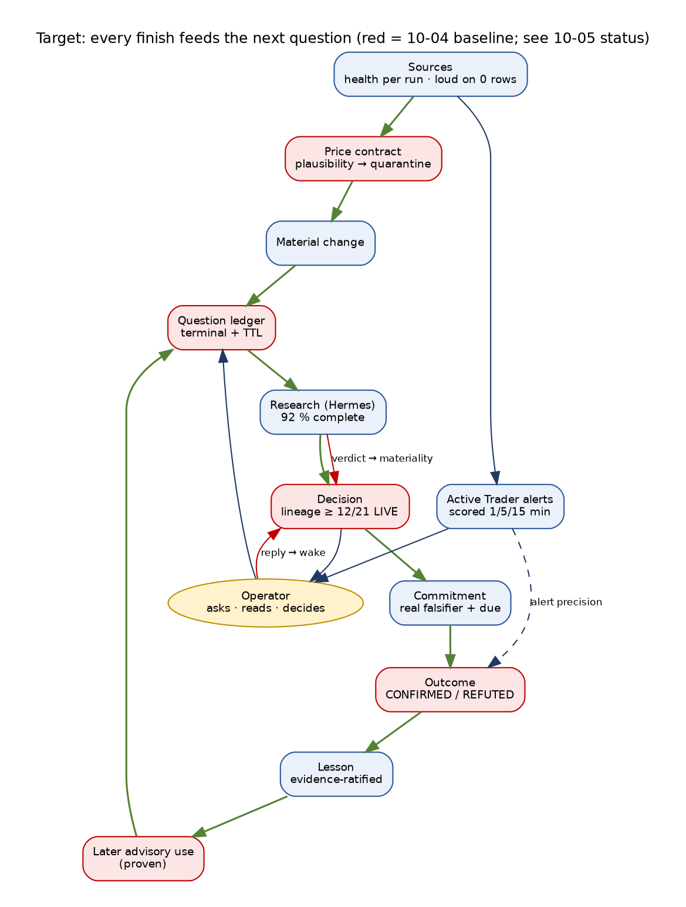

# Trade AI Platform — FUTURE STATE Lifecycles, 2026-10-04: targets, contract status and roadmap

```
Status:      ACTIVE
as_of:       2026-10-05T18:58:00Z (remediation status and remaining acceptance updated)
Measured at: baseline 4f932b88a; verified remediation 8da0bd92b19519f4815c2b20ced2f1dfbd1eae96
             See TRADE_AI_AS_IS_LIFECYCLES_2026-10-04.md for scoped observations and later CURRENT
Supersedes:  TRADE_AI_FUTURE_STATE_LIFECYCLES_2026-09-14.md for targets and roadmap.
             Vision (§1), principles P1–P14, the Lifecycle Contract LC1–LC12 and the correlation key spine
             are unchanged and remain defined in the 09-14 document; this document records their status
             and resets the targets from the 10-04 measurement.
```

## Options target and remaining proof — 2026-10-05

Target: all holdings, all active/researched watches, all reentry members and broad US optionable
stocks/ETFs have an explicit coverage disposition. The selected service is a 09:35 ET daily full
scan plus 15-minute held/watch/reentry/shortlist refresh during official exchange hours, full
strikes/both sides, 7–365 DTE. Four queues distinguish income, protection, entry alternatives and
new opportunities. Eight advisory expression families do not imply eight authorized execution
routes or a profitable recommendation.

Source implementation now provides the coverage/read model, persistent scan requests/checkpoints,
shared research reuse and actual package-payoff display. **Do not close this target yet:** expanded
scanning remains disabled until provider entitlement and measured throughput/storage/memory
support the selected service. The observed 5,541-symbol watchlist requires at least 369.4 fresh
chain requests/minute for that cadence. Any service reduction needs an explicit operator choice.

Close only after exact-SHA release verification, matching process pins, capacity approval and five
natural trading sessions with reconciled membership, achieved age targets, restart recovery,
shared evidence identity, nonduplicated research, and honest no-change/blocked dispositions.
Do not force changed recommendations, successful outcomes or lesson promotions to satisfy a
metric. [Capacity and release acceptance](../ops/OPTIONS_SCAN_CAPACITY_2026-10-05.md) is the scoped
contract; the earlier learning-remediation acceptance remains independently open where stated.

## 0. How to read this document

Values labelled 10-05 come from the [updated As-Is](TRADE_AI_AS_IS_LIFECYCLES_2026-10-04.md) and
[remediation receipts](../ops/VALIDATED_LEARNING_REMEDIATION.md). Other values retain the 10-04
baseline and were not remeasured. Family scores remain historical. Targets have observable exit
conditions; successful installation or a fixture does not close a learning target.
The authority boundary does not move:
**MBI_BEHAVIOR = 0 at every level** — a mature desk thinks better; it does not act more. Live
execution stays an operator action with per-order 2FA; automated entry (Active Trader Phase 2) is a
proposal gated by the facts in §7.

---

## 2026-10-05 delivery status

**Deployed:** exact-SHA CI promotion gate; topic interpreter/failure reporting; service exit and
release-contract evidence; shared research dispositions and lineage; scoped operator consumption;
retrieval usage stages; question reconciliation/fair selection; honest commitment/outcome guards;
conservative checkpoint migration; unratified lesson candidates and registry/runtime drift reporting.

**Observed naturally:** two research dispositions (`NO_CHANGE`, `BLOCKED`), partial/unresolved
question reconciliation, a legitimate session skip and same-SHA operator/research selection receipts.
**Still open:** permitted-session ingestion, sustained lifecycle coverage, warranted advisory
transitions/notifications, valid scored outcomes, operator-ratified lessons and later advisory use.
The 10,137 review-marked checkpoints still need review; none acquired an invented deadline.
No maturity increase, changed broker behavior or organic learning is claimed.

## 1. The target in one picture



---

## 2. Lifecycle Contract — status through scoped 2026-10-05 update

| # | Clause | 09-14 | Latest evidence (10-04 unless dated) | Next step |
|---|---|---|---|---|
| LC1 | States enumerated | several free-text | unchanged in most stores | registry + schema check for the 7 families |
| LC2 | Terminal states reachable | 22 of 26 at L0 | 10-05: 200 DDQs checked, 48 partial / 152 unresolved; question/gap reconciliation deployed | prove eligible terminal/expiry transitions across stores; proposal reviews remain separate |
| LC3 | TTL on every non-terminal state | none | 10-05: 10,137 checkpoints marked migration-review-required, zero derivable deadlines; DDQ expiry schema installed | review unknown horizons; expire only from recorded evidence; diagnose ticket/outbox ownership first |
| LC4 | Owner per open item | none | grants and approvals owned; incidents 0 acknowledged | acknowledge button + owner on incidents |
| LC5 | Transitions are events with actor | overwrites | proposal status events lack an actor (2,107 flips unattributed); deploy receipt overwritten | actor column; append-only deploy receipts |
| LC6 | Keys carried | 14 joins missing | 10-05: research/decision/retrieval/thesis/notification references and subject-scoped wake receipts deployed | measure complete joins; capital-plan/checkpoint and desk-reply gaps remain unproved |
| LC7 | Feedback edges counted | 11 of 57 fire | 10-05: natural disposition and question checks observed, no later lesson-use proof | count dispositions, evidence use and later advisory effects separately |
| LC8 | Anti-replay | replay dominant | 10-05: scoped consumption deployed; turn 115 appears as history, did not select the observed wake | consumed/answered turns never select fresh work; new evidence must carry an explicit causal link |
| LC9 | Stuck detection | by hand | partial (lane registry, Hermes heartbeat with blind spots) | stuck > TTL as findings |
| LC10 | Questions registered | desk only | 10-05: existing DDQ/gap owners reconcile originating identities; priority plus age fairness installed | extend coverage through existing owners, no duplicate question or thesis store |
| LC11 | Decisions registered | in chat | guard grants are data (Telegram button → grant) | decision ledger for §17 decisions |
| LC12 | Maturity computed | by auditors | lane-written score exists (2.89, 09-28); this audit still by hand | compute L-levels from counters |

## 3. Correlation key spine — status

| Key | Latest evidence (10-04 unless dated) | Target |
|---|---|---|
| `pending_id → plan_id → research_id → result_id` | **live end to end** | keep |
| `subject_guid` | carried; about 40 % in a particular subject-tagged receipt sample, not all messages | validate subject identity and measure errors on a declared sample |
| `question_guid` | 10-05: answer joins and explicit partial/unresolved states observed | answer/partial/expiry/unresolved joins with evidence across existing stores |
| `event_id / reply_to_event_id` | missing on inbound; 0/501 receipts → wake | stamped on every inbound and reply |
| `wake_id` | 10-05: subject-scoped consumption and selected-research receipts observed | complete genuine-turn and selected-research linkage, excluding approval callbacks |
| `commitment_id → outcome_id → lesson_id` | 10-05: 883 historical insufficiency outcomes retained; no ratified lesson | preserve outcome evidence and candidate/ratification/use joins; report every verdict honestly |
| `decision_id` on research provenance | 10-05: shared research-impact receipts carry decision/retrieval/thesis references | 100 % of reported use auditable; report missing joins as blocked/unknown |
| `change_id / source_pr` on deploy receipts | 10-05: exact candidate/workflow/run CI evidence embedded; per-release copy archived | retain release/grant/PR linkage; append-only global history remains open |
| `alert decision id` (Active Trader) | minted per decision; scored at 1/5/15 min | precision per kind/verdict reported weekly |

---

## 4. Target per family (exit counters)

### A · Data and sources — target L3 (today ~1.9)
| Exit counter | Today | Target |
|---|---|---|
| Implausible price writes quarantined within 24 h | 0 (no contract) | 100 %; 0 weekend-dated rows |
| Zero-row provider runs reported as failure | Finviz reports success on 0 rows | 100 % |
| Order-book domain declared + health row per feed | none | moomoo primary, Schwab comparison, both monitored |
| Schwab book rows on every regular session | 3 of 5 sessions | 5 of 5 |
| Gap resolver budget-denied share | 91 % | < 50 %; RESOLVED_FREE > 0 |
| Retired keys rendered | 4 | 0 (operator) |

### B · Questions and research — target L3 (today ~1.7)
| Exit counter | Today | Target |
|---|---|---|
| Validated research dispositions | 10-05: 8 reassessments, 6 BLOCKED / 2 NO_CHANGE | every completion has changed judgment, review required, no change with reason, or blocked with reason; notify only verified policy-eligible transitions |
| Evidence reported as used with decision identity | 10-05: receipt schema deployed; population coverage unmeasured | 100 % of reported use joined; separate available/retrieved/used/rejected/judgment-changing and traversed graph references |
| Topic ingestion freshness | 10-05: interpreter fixed; legitimate regular-session skip observed | successful permitted-session output and declared freshness; infrastructure failure distinct from skip |
| Question/gap lifecycle coverage | 10-05: 200 DDQ checks; schema/reconciliation deployed | all existing stores have evidence-backed answered, partial, expired or unresolved states; measure coverage |
| Historical Hermes orphans | 10-05: 20 absent from active projection; 0 eligible snapshot recoveries | establish ownership/lease/expiry before bounded idempotent recovery; retain history |

### C · Watchlist, proposals, learning — target L3 (today ~1.4)
| Exit counter | Today | Target |
|---|---|---|
| Approvals with an open review | 55 of 55 | 0 (review closes before approval) |
| Approve – pending flips per proposal | up to 149 | ≤ 3, with actor recorded |
| Watch-ticket progress | 10-05 15:24Z: 274 completions/24 h, 1,329 queued, 2 running with current heartbeats | age/lease/owner findings before recovery; do not retry a functioning queue blindly |
| Checkpoints without justified deadline | 10-05: 10,137 marked MIGRATION_REVIEW_REQUIRED; 0 deadlines derivable | derive only from recorded creation plus explicit parseable horizon; retain unknowns for review, never invent dates |
| Agents calibrated | 1 | ≥ 4, weekly |
| Strategies able to transition | gate unreachable for scalp and pullback | gates count the evidence actually produced |

### D · Cognition — target L3, first L4 (today ~1.5)
| Exit counter | Today | Target |
|---|---|---|
| Valid scoreable commitments/outcomes | 10-05: all 883 historical INSUFFICIENT_EVIDENCE preserved | observable claim + falsifier + horizon + source at mint; confirmed/refuted only from observed evidence, insufficient/unavailable remain valid |
| Consumed/answered operator turns selecting fresh work | 10-05: scoped suppression observed; historical turn still loaded | zero repeat selection; new turns eligible, approval callbacks excluded; later evidence carries a causal link |
| Lineage stages LIVE on a natural decision | ≤ 4 / 21 | ≥ 12 / 21 |
| Ratified lesson advisory use | 10-05: 633 archived, no ratification/promotion | review valid outcome candidates, retain operator ratification and shadow defaults; measure later advisory use separately from broker behavior |
| Registry/runtime disagreements | 10-05: Maria, Aegis, risk_agent, tax_agent surfaced | distinguish registered identity, intended capability, deployment state and observed activity; resolve drift without implied activation |
| Wake jobs ENQUEUED > 24 h | 193 > 4 h | 0 |

### E · Communications — target L3 (today ~2.0)
| Exit counter | Today | Target |
|---|---|---|
| Outbound rows per weekday | ~1,400–1,670 | < 200 (state-change sends only) |
| Incorrect subject tags in a declared receipt sample | 39.8 % in historical sample, not all messages | < 2 % on a comparable validated sample |
| Outbox confirmations without a real message id | 1,694 | 0 |
| Genuine operator replies reaching a wake | 0 since 09-25 | 100 % with `wake_id` |
| Incidents acknowledged / resolved | 0 / resolve-on-recovery only | owner + ack on every incident |

### F · Engineering and operations — target L3 (today ~2.3)
| Exit counter | Today | Target |
|---|---|---|
| Activation without completed successful exact-SHA CI | 10-05: fail-closed gate deployed; 8 successful workflows on verified release | zero; pending/missing/cancelled/unavailable also refuse; archive workflow/run evidence |
| PR runs missing a gate that later fails on main | alarm gates (fixed by #1435) | 0 |
| Unexplained API exits | 10-05: exit/signal/restart/cgroup OOM evidence installed; historical cause unproved | correlate each observed exit before considering memory-limit changes |
| Services violating their deployment contract | 10-05: four core pins matched; separate deployments retained | zero CURRENT-contract mismatches; separately declared deployments are valid |
| Restore drill / rotation | never | quarterly / scheduled (operator) |
| Open incidents unacknowledged | 108 | 0 older than 7 days |
| Worktrees | 793 | merged ones pruned weekly |

### G · Trading desks and Active Trader — target L3 alerts, gates unchanged (today ~1.9)
| Exit counter | Today | Target |
|---|---|---|
| Ignition engine rows on every trading day | 0 since 09-17 | every weekday, stale-writer alarm |
| Alert decisions journaled + heartbeat | none yet | every live pass; heartbeat < 6 min old in session |
| Scored alerts (1/5/15 min) | 0 | ≥ 60 scored TRIGGERED decisions before any Phase 2 proposal |
| TRIGGERED precision (+1R within 5 min) | — | reported weekly; thresholds tuned only by operator ratification |
| Leases admitted in a simulated session | 0 | 1 simulated session end to end |
| Protection alarm on sustained "Protected: NO" | muted | pages the operator |
| Schwab token expiry surprises | weekly hard expiry | expiry warning ≥ 24 h ahead |

---

## 5. Roadmap — remaining work after 10-05 remediation

### P0 · Operational evidence and remaining validation

1. **Shipped:** exact-SHA promotion refusal, topic interpreter/failure reporting, exit/OOM and
   deployment-contract evidence. Keep the gate enforced; no warn-mode rollout is needed.
2. Observe a successful permitted-session topic run and correlate real exits with status, signals,
   restart reason and cgroup counters before proposing memory-limit changes.
3. Re-measure credential deadlines, provider freshness, protection notifications and first-session
   trading results through their owners. Credential renewal/rotation, alert policy and execution
   investigation remain separately scoped operator actions.
4. Diagnose incident ownership and notification occurrence/delivery/recovery transitions. Tests
   cover duplicate/recovery semantics; sustained natural coverage remains unproved.
5. Preserve the measured healthy watch-ticket progress; investigate aged items by owner and lease.
   Any recovery must be bounded, idempotent and retain history.

### P1 · Research lineage and question closure

1. **Shipped:** shared research dispositions/lineage and existing question-owner reconciliation.
   Measure every completion against validated fresh subject-matched evidence and prior judgment.
2. Count changed judgment, review required, no change and blocked separately. Require before/after
   fields for transitions and policy-eligible notifications; `WEAKENS` alone cannot force either.
3. Audit retrieval stages and traversed graph references across surfaces using the same evidence
   identity; never trigger redundant paid research to manufacture reuse proof.
4. Expand natural answer/partial/expiry/unresolved coverage under existing priority/age budgets.
   Diagnose old Hermes, unanswered gaps, contradictions and research expiry before retries.
5. Revalidate the older price-quarantine, proposal-review/actor and outbox claims before changing
   them; they are not marked repaired by this tranche.

### P2 · Operator consumption and outcome governance

1. **Shipped:** actual-turn/subject consumption, answered-turn/callback exclusion and research
   selection receipts even when another branch wins. Verify new turns stay eligible and consumed
   turns cannot select fresh work; later evidence needs an explicit causal link.
2. **Shipped:** honest commitment eligibility and outcome evaluation. Keep observations separate
   from predictions; obtain real evidence at an explicit horizon, retaining insufficiency or
   unavailable-evidence results rather than manufacturing confirmed/refuted outcomes.
3. Review 10,137 `MIGRATION_REVIEW_REQUIRED` checkpoints. Derive a due date only where original
   creation plus an explicit parseable horizon supports it; preserve original records. The migration
   is complete, but the review backlog is not.
4. Produce reviewable lesson candidates from valid outcomes, retain operator ratification and
   shadow defaults, and measure later advisory use separately from broker behavior.
5. Surface registry/runtime drift by identity, intended capability, deployment and activity. Do not
   enable disabled agents to make an ACTIVE registry label true. Repin only against a declared
   CURRENT deployment contract.

### P3 · Sustained maturity proof

1. Measure outcome-to-later-advisory-use joins and lineage coverage across natural cycles before
   increasing L-levels. No automatic lesson promotion or memory-influence change is authorized.
2. Keep lifecycle and deployment history with explicit owners, timestamps and evidence; the global
   overwritten deploy receipt still needs archival discipline or a separately reviewed ledger.
3. Restore drills, secret rotation and trading/strategy threshold changes remain operator decisions.

### P4 · Separate operator-controlled work

Active Trader Phase 2/3, broker-arm settings, trading thresholds, scalp exemptions and credential
renewal remain outside this remediation. Recheck §7/§8 historical facts before a proposal. Any
execution-engineering investigation requires its own scoped grant. This roadmap grants no live
broker authority and changes no memory-influence setting.

---

## 6. KPI scorecard (weekly)

| KPI | Today | Target (P2) |
|---|---|---|
| Platform maturity (mean of families) | ~1.8 | ≥ 2.5 |
| Lifecycles with a closed learning loop (L4) | 0 | 1 |
| Feedback edges firing | mechanical only | learning edges ≥ 3 |
| Valid outcomes observed per week | 0 confirmed/refuted in verified historical set | report confirmed/refuted/insufficient/unavailable separately; never force a success quota |
| Research completions explicitly evaluated | 10-05 sample: dispositions recorded; full coverage unmeasured | 100 % with evidence validation and joined receipts; no quota for changed decisions |
| Outbound rows per weekday | ~1,500 | < 200 |
| Unexplained API exits per week | ~15 | 0 |
| Activation without completed successful exact-SHA CI | gate deployed 10-05 | 0 |
| Active Trader scored decisions | 0 | ≥ 60 |

## 7. Active Trader — original proposal gates (not revalidated in this remediation)

1. The ignition engine writes rows every trading day for 10 consecutive sessions.
2. ≥ 60 scored TRIGGERED decisions with a precision report the operator has reviewed.
3. momentum_scalp evidence path decided by the operator (it cannot reach 30 exact trades with paper submit off).
4. Broker facts verified from each broker (account type, settlement, PDT rules for small accounts, fees, order types, minimums).
5. A signed session envelope designed and reviewed; live session activation remains hard-off until the operator ratifies a change.
6. An execution-engineering grant naming the files; any live order only through the Stage 10 ceremony on fresh operator instruction.

## 8. Operator decisions from the 10-04 baseline (recheck current status)

| Decision | Blocking |
|---|---|
| Schwab re-login; Finviz cookie; Google re-auth | data and protection on 10-05 |
| `pilot_armed_until=2099-12-31` — keep or end | live-gate posture |
| Extend the comms exemption to scalp advisory alerts (A+ grades are held) | scalp advisories reaching Telegram |
| Thresholds: PF 1.25 vs 1.3; live gate 30 vs 100 trades | strategy and live gates |
| momentum_scalp evidence path under advisory-only delivery | strategy validation |
| Cron grants: alert-quality daily, counterfactual ledger | learning signal |
| Retire provider keys; restore drill; rotation | security |
| Paging on sustained "Protected: NO" | protection |

## 9. Exit charter

The platform is "mature" for this cycle when: every family is ≥ L3 on its exit counters for 7
consecutive days; one learning loop is proven at L4 (a measured outcome changed a later decision);
no commit lacking completed successful exact-SHA push/main CI is activated; and the Active Trader
alert record is scored and reviewed. Valid no-change decisions do not fail acceptance. None of this
changes the authority boundary.

## 10. The one-sentence version

Make lifecycle state and evidence use observable, evaluate research honestly, and demonstrate later
advisory use of valid outcomes without forcing changed decisions, invented deadlines or promoted
lessons. Keep exact-SHA activation checks and operator-controlled authority in force.
