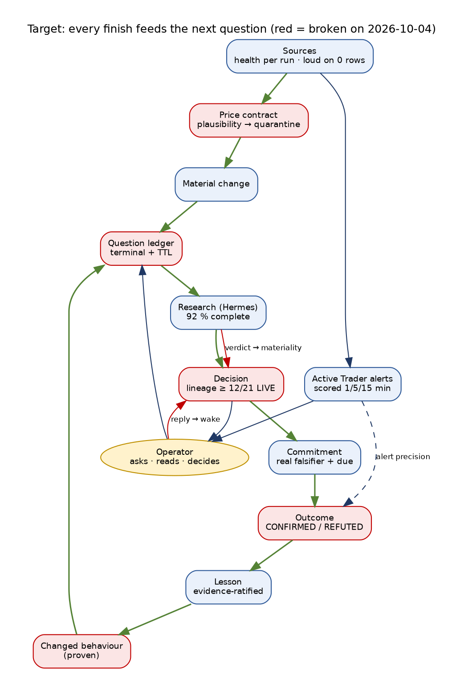
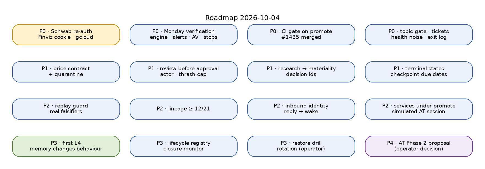

# Trade AI Platform — FUTURE STATE Lifecycles, 2026-10-04: targets, contract status and roadmap

```
Status:      ACTIVE
as_of:       2026-10-04T23:45:00-04:00
Measured at: 4f932b88a (targets are set against TRADE_AI_AS_IS_LIFECYCLES_2026-10-04.md)
Supersedes:  TRADE_AI_FUTURE_STATE_LIFECYCLES_2026-09-14.md for targets and roadmap.
             Vision (§1), principles P1–P14, the Lifecycle Contract LC1–LC12 and the correlation key spine
             are unchanged and remain defined in the 09-14 document; this document records their status
             and resets the targets from the 10-04 measurement.
```

## 0. How to read this document

"Today" values come from the 10-04 As-Is and its seven fact bases. Targets are counters, not
adjectives: each has an exit condition that a job can measure. The authority boundary does not move:
**MBI_BEHAVIOR = 0 at every level** — a mature desk thinks better; it does not act more. Live
execution stays an operator action with per-order 2FA; automated entry (Active Trader Phase 2) is a
proposal gated by the facts in §7.

---

## 1. The target in one picture



---

## 2. Lifecycle Contract — status on 2026-10-04

| # | Clause | 09-14 | 10-04 | Next step |
|---|---|---|---|---|
| LC1 | States enumerated | several free-text | unchanged in most stores | registry + schema check for the 7 families |
| LC2 | Terminal states reachable | 22 of 26 at L0 | checkpoints, Hermes jobs, pending replies now terminate; DDQ, research gaps, research objects, proposals reviews do not | terminal states for every question store (B), reviews (C) |
| LC3 | TTL on every non-terminal state | none | plan expiry fires; new checkpoints get due dates; 10,217 legacy checkpoints and 706 tickets have none | expirer for tickets, legacy checkpoints, outbox orphans |
| LC4 | Owner per open item | none | grants and approvals owned; incidents 0 acknowledged | acknowledge button + owner on incidents |
| LC5 | Transitions are events with actor | overwrites | proposal status events lack an actor (2,107 flips unattributed); deploy receipt overwritten | actor column; append-only deploy receipts |
| LC6 | Keys carried | 14 joins missing | pending → plan → research → result live; research – decision, reply – wake, capital plan – checkpoint missing | §3 |
| LC7 | Feedback edges counted | 11 of 57 fire | mechanical loops fire; learning loops do not | closure monitor counters |
| LC8 | Anti-replay | replay dominant | ADBE turn 115 replayed on a third of wakes | replay guard on wake selection |
| LC9 | Stuck detection | by hand | partial (lane registry, Hermes heartbeat with blind spots) | stuck > TTL as findings |
| LC10 | Questions registered | desk only | desk + circle ledger designed; circle phase 1 never ran | question ledger for DDQ/gaps/objects |
| LC11 | Decisions registered | in chat | guard grants are data (Telegram button → grant) | decision ledger for §17 decisions |
| LC12 | Maturity computed | by auditors | lane-written score exists (2.89, 09-28); this audit still by hand | compute L-levels from counters |

## 3. Correlation key spine — status

| Key | 10-04 | Target |
|---|---|---|
| `pending_id → plan_id → research_id → result_id` | **live end to end** | keep |
| `subject_guid` | carried; 40 % of tagged messages carry a non-company tag | tags accepted only when marked; chrome < 2 % |
| `question_guid` | DDQ has it; answers never written back | answer join + settle |
| `event_id / reply_to_event_id` | missing on inbound; 0/501 receipts → wake | stamped on every inbound and reply |
| `wake_id` | stamped on wakes; not on receipts | on every consumption receipt |
| `commitment_id → outcome_id → lesson_id` | sweep runs; 0 scored | first CONFIRMED/REFUTED outcome |
| `decision_id` on research provenance | 0 | stamped when a decision consumes research |
| `change_id / source_pr` on deploy receipts | null | append-only receipt with PR, grant id, CI run |
| `alert decision id` (Active Trader) | minted per decision; scored at 1/5/15 min | precision per kind/verdict reported weekly |

---

## 4. Target per family (exit counters)

### A · Data and sources — target L3 (today ~1.9)
| Exit counter | Today | Target |
|---|---|---|
| Implausible price writes quarantined within 24 h | 0 (no contract) | 100 %; 0 weekend-dated rows |
| Zero-row provider runs reported as failure | Finviz reports success on 0 rows | 100 % |
| Order-book domain declared + health row per feed | none | moomoo primary, Schwab comparison, both monitored |
| Schwab book rows on every regular session | 3 of 5 sessions | 5 of 5 |
| Gap resolver budget-denied share | 91 % | < 50 %; RESOLVED_FREE > 0 |
| Retired keys rendered | 4 | 0 (operator) |

### B · Questions and research — target L3 (today ~1.7)
| Exit counter | Today | Target |
|---|---|---|
| Research verdicts that change materiality | 0 of 180 | every WEAKENS/CONFLICTED evaluated; notified when material |
| Provenance items with a decision id | 0 | 100 % of "used" |
| Topic ingestion freshness | dead since 09-28 | < 36 h, with a lane |
| Question stores with terminal state + TTL | 0 of 4 | 4 of 4 |
| Orphaned Hermes jobs outside windows | 20 | 0 |

### C · Watchlist, proposals, learning — target L3 (today ~1.4)
| Exit counter | Today | Target |
|---|---|---|
| Approvals with an open review | 55 of 55 | 0 (review closes before approval) |
| Approve – pending flips per proposal | up to 149 | ≤ 3, with actor recorded |
| Decision tickets stuck RUNNING / queue stalled | 4 / since 09-30 | 0 / alarm on 24 h stall |
| Checkpoints without due date | 10,217 | 0 |
| Agents calibrated | 1 | ≥ 4, weekly |
| Strategies able to transition | gate unreachable for scalp and pullback | gates count the evidence actually produced |

### D · Cognition — target L3, first L4 (today ~1.5)
| Exit counter | Today | Target |
|---|---|---|
| Commitments scored CONFIRMED/REFUTED | 0 | first one, then weekly |
| Replayed operator turn share of wakes | 33 % (ADBE 115) | ≤ 1 wake/24 h per turn unless new input |
| Lineage stages LIVE on a natural decision | ≤ 4 / 21 | ≥ 12 / 21 |
| Memory influence (shadow → enforced) | 0 | first enforced lane with measured change (L4) |
| Registry vs runtime disagreements | 3 agents, 2 lanes | 0 |
| Wake jobs ENQUEUED > 24 h | 193 > 4 h | 0 |

### E · Communications — target L3 (today ~2.0)
| Exit counter | Today | Target |
|---|---|---|
| Outbound rows per weekday | ~1,400–1,670 | < 200 (state-change sends only) |
| Non-company subject tags | 39.8 % | < 2 % |
| Outbox confirmations without a real message id | 1,694 | 0 |
| Genuine operator replies reaching a wake | 0 since 09-25 | 100 % with `wake_id` |
| Incidents acknowledged / resolved | 0 / resolve-on-recovery only | owner + ack on every incident |

### F · Engineering and operations — target L3 (today ~2.3)
| Exit counter | Today | Target |
|---|---|---|
| Promotes of a SHA with red post-merge CI | 5 on 10-04 | 0 (promote refuses) |
| PR runs missing a gate that later fails on main | alarm gates (fixed by #1435) | 0 |
| Unexplained API exits | 65 since 09-28 | 0 unexplained (cause logged on every exit) |
| Services running outside the release | ops agent, motion, proxies | 0 or declared |
| Restore drill / rotation | never | quarterly / scheduled (operator) |
| Open incidents unacknowledged | 108 | 0 older than 7 days |
| Worktrees | 793 | merged ones pruned weekly |

### G · Trading desks and Active Trader — target L3 alerts, gates unchanged (today ~1.9)
| Exit counter | Today | Target |
|---|---|---|
| Ignition engine rows on every trading day | 0 since 09-17 | every weekday, stale-writer alarm |
| Alert decisions journaled + heartbeat | none yet | every live pass; heartbeat < 6 min old in session |
| Scored alerts (1/5/15 min) | 0 | ≥ 60 scored TRIGGERED decisions before any Phase 2 proposal |
| TRIGGERED precision (+1R within 5 min) | — | reported weekly; thresholds tuned only by operator ratification |
| Leases admitted in a simulated session | 0 | 1 simulated session end to end |
| Protection alarm on sustained "Protected: NO" | muted | pages the operator |
| Schwab token expiry surprises | weekly hard expiry | expiry warning ≥ 24 h ahead |

---

## 5. Roadmap — build in the order loops can close

### P0 · This week (2026-10-05 → 10-09)
1. **Operator:** re-authenticate Schwab before 10-05 12:06 ET; renew the Finviz cookie; `gcloud auth login`.
2. **Monday verification:** ignition rows and alert heartbeat by 09:35 ET; Alpha Vantage at 08:00; Fidelity stop sync at 10:05.
3. Merge PR #1435 (firing tests; PR runs select alarm gates); make promote refuse a SHA whose post-merge CI is red (warn mode first).
4. Fix the topic-ingestion gate interpreter and make it exit non-zero on its own failure.
5. Reap stuck decision tickets and alarm on a 24 h stall.
6. Health inspector sends on state change only.
7. Log the portfolio-server exit cause and RSS on every shutdown.

### P1 · Next two weeks
1. Price plausibility contract → automatic quarantine; refuse weekend-dated writes.
2. Approval requires a closed review; actor on proposal status events; thrash cap.
3. Research verdict → materiality → notify; decision ids on provenance.
4. Due dates for the 10,217 legacy checkpoints; terminal states for DDQ, research gaps, research objects.
5. Subject tags accepted only when marked; outbox confirms only with a real message id.
6. Declare the order-book data domain; fix the Schwab stream lock collision.
7. Active Trader: first scored week; weekly precision report; alert-quality cron (operator grant).

### P2 · Within a month
1. Replay guard on wake selection; age out answered operator turns.
2. Commitments from judged views with real falsifiers → first CONFIRMED/REFUTED outcome.
3. Lineage ≥ 12/21 LIVE; capital-plan and decision ids joined to checkpoints.
4. Inbound identity (`bot_id`, `reply_to_event_id`, `wake_id`); desk replies ledgered.
5. Bring the motion service and ops agent under promote; one simulated Active Trader session that admits a lease.
6. Incident acknowledge button and owners; lane timezone fix; un-suppress lane alerts.

### P3 · Quarter
1. First memory lane enforced with a measured behaviour change (first L4).
2. Lifecycle registry (LC1–LC12) declared for all families with a CI gate and closure monitor.
3. Restore drill and secret rotation (operator decisions).
4. Strategy gates aligned with how evidence is produced (operator decision).

### P4 · Only on explicit operator decision
- **Active Trader Phase 2** (automated entry/exit on L2 confirmation, fixed % of equity, canary
  envelope per account) — written proposal first, built only after the §7 gates are true.
- **Phase 3 (Schwab)** — design notes only.



---

## 6. KPI scorecard (weekly)

| KPI | Today | Target (P2) |
|---|---|---|
| Platform maturity (mean of families) | ~1.8 | ≥ 2.5 |
| Lifecycles with a closed learning loop (L4) | 0 | 1 |
| Feedback edges firing | mechanical only | learning edges ≥ 3 |
| Scored commitments per week | 0 | ≥ 10 |
| Research verdicts acted on | 0 % | 100 % evaluated |
| Outbound rows per weekday | ~1,500 | < 200 |
| Unexplained API exits per week | ~15 | 0 |
| Red post-merge CI promoted | 5 (10-04) | 0 |
| Active Trader scored decisions | 0 | ≥ 60 |

## 7. Active Trader — what must be true before Phase 2 is even proposed

1. The ignition engine writes rows every trading day for 10 consecutive sessions.
2. ≥ 60 scored TRIGGERED decisions with a precision report the operator has reviewed.
3. momentum_scalp evidence path decided by the operator (it cannot reach 30 exact trades with paper submit off).
4. Broker facts verified from each broker (account type, settlement, PDT rules for small accounts, fees, order types, minimums).
5. A signed session envelope designed and reviewed; live session activation remains hard-off until the operator ratifies a change.
6. An execution-engineering grant naming the files; any live order only through the Stage 10 ceremony on fresh operator instruction.

## 8. Operator decisions required

| Decision | Blocking |
|---|---|
| Schwab re-login; Finviz cookie; Google re-auth | data and protection on 10-05 |
| `pilot_armed_until=2099-12-31` — keep or end | live-gate posture |
| Extend the comms exemption to scalp advisory alerts (A+ grades are held) | scalp advisories reaching Telegram |
| Thresholds: PF 1.25 vs 1.3; live gate 30 vs 100 trades | strategy and live gates |
| momentum_scalp evidence path under advisory-only delivery | strategy validation |
| Cron grants: alert-quality daily, counterfactual ledger | learning signal |
| Retire provider keys; restore drill; rotation | security |
| Paging on sustained "Protected: NO" | protection |

## 9. Exit charter

The platform is "mature" for this cycle when: every family is ≥ L3 on its exit counters for 7
consecutive days; one learning loop is proven at L4 (a measured outcome changed a later decision);
no red commit is promoted; and the Active Trader alert record is scored and reviewed. None of this
changes the authority boundary.

## 10. The one-sentence version

Make every lifecycle finish (terminal states, TTLs, owners), make research and outcomes change the
next decision, keep red code and noise out of production — and earn any future automation with a
scored alert record, never by assumption.
