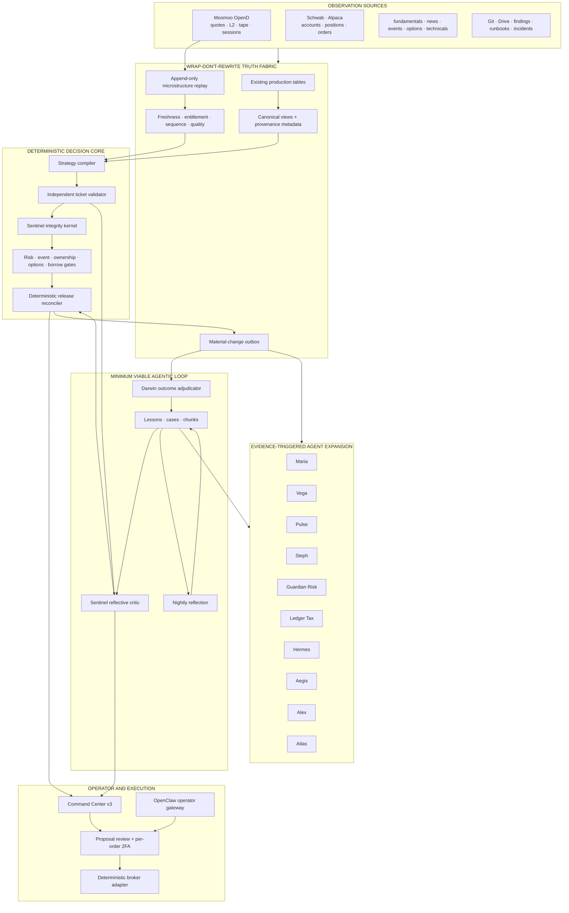
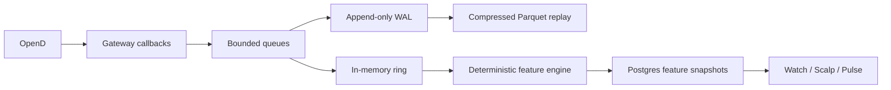

# TRADE AI MASTER AGENTIC FINANCIAL SYSTEM ARCHITECTURE v3.0
## Canonical Architecture for Trade AI v12, OpenClaw, Hermes, Moomoo OpenD, Watch Decision Integrity, and Momentum Scalp

**Status:** CANONICAL MASTER ARCHITECTURE — implementation blueprint; no execution authorization  
**Architecture owner:** Lead Architect  
**Date:** 2026-07-22  
**Target production host:** `ms01-openclaw`  
**Canonical repository path:** `/home/johnclaw/trade-ai-v12-rebuild/trade-ai-v12-rebuild` — verify before each implementation session  
**Primary database:** PostgreSQL `trade_ai` — live schema inventory, not a historical table count, is authoritative  
**Primary operator surface:** Command Center v3  
**Security posture:** deterministic safety core, explicit human authority, universal live-order 2FA, Bitwarden Secrets Manager only  
**Supersedes as controlling architecture:**

- `AGENTIC_MATURITY_ARCHITECTURE_v1_0.md`
- `AGENTIC_FINANCIAL_SYSTEM_ARCHITECTURE_v2_0.md`
- `MOOMOO_REFERENCE_ARCHITECTURE_v2_2.md`
- `MOMENTUM_SCALP_ARCHITECTURE_V1.3.md`

The superseded documents remain historical evidence. Their conflicting requirements are resolved in §1. No implementation may select a superseded rule when this document provides a controlling rule.

---

# 0. EXECUTIVE CHARTER

Trade AI is not being redesigned as an autonomous trading bot.

It is being designed as an **agentic financial operating system** in which:

1. market and account observations are acquired with provenance;
2. deterministic services establish facts, arithmetic, eligibility, and risk;
3. reflective agents retrieve institutional memory and challenge decisions;
4. a deterministic reconciler releases or quarantines artifacts;
5. humans retain financial authority;
6. every live order passes the existing per-order 2FA rail;
7. outcomes become cases, lessons, hypotheses, and scored improvements;
8. no learned change reaches production without evidence, adjudication, versioning, and rollback.

The architectural maxim is:

> **Machines observe broadly. Deterministic systems establish truth. Agents challenge and learn. Evidence earns promotion. Humans retain financial authority.**

## 0.1 Two loops, one constitution

```text
FAST REFLECTIVE LOOP
observations
  → normalized facts
  → candidate decision/ticket
  → independent deterministic validation
  → Sentinel integrity kernel
  → retrieval-grounded reflective critique
  → deterministic release or quarantine
  → operator presentation

SLOW LEARNING LOOP
artifact and outcome
  → immutable case
  → nightly reflection
  → candidate lesson or preregistered hypothesis
  → deterministic evaluation / shadow / walk-forward
  → Darwin adjudication evidence
  → human promotion decision
  → versioned config or code
  → reversible deployment
  → new outcomes
```

The fast loop prevents obvious nonsense today.  
The slow loop reduces recurrence and improves the system over time.

## 0.2 The core architectural decision

The execution and protection layers remain deliberately non-agentic.

The reflective and learning layers become agentic.

An LLM is never the authority for:

- price truth;
- position truth;
- account truth;
- order status;
- arithmetic;
- eligibility;
- stop enforcement;
- risk limits;
- broker routing;
- approval state;
- 2FA;
- live execution.

---

# 1. SUPERSESSION AND CONFLICT RESOLUTION

This section is controlling when prior documents disagree.

## 1.1 Credentials

**Bitwarden Secrets Manager is the only credential store.**

- Broker, provider, OAuth service, TOTP, RSA/private-key, and API credentials are stored in Bitwarden Secrets Manager.
- Production secret set: `trade-ai-prod`.
- Laboratory secret set: `trade-ai-lab`; it must not contain live broker credentials.
- Secrets are rendered at service start into a dedicated tmpfs path under `/run`.
- No broker credential, trade password, TOTP secret, or private key is stored in `.env`.
- No agent may read raw secrets.
- The only permanent secret material allowed on disk is the minimum Bitwarden machine-token material already approved by the secrets migration.
- `credential_slot` is a logical reference to a Bitwarden secret set, not a path and not a credential value.

Any older statement that places a Moomoo trade password or TOTP secret in `.env` is void.

## 1.2 Universal live-order 2FA

Every non-simulation order intent requires the existing per-order 2FA process, regardless of broker or direction.

This includes:

- entries;
- adds;
- reductions;
- discretionary exits;
- stop placement;
- stop replacement;
- target placement;
- order modification;
- order cancellation when the cancellation materially changes protection;
- future Moomoo live orders.

The only silent autonomous execution lane is the simulation account:

```text
tradeai_automated
```

Simulation must be visibly and structurally separated from live accounts.

### Composite order envelope

A single 2FA ceremony may authorize an immutable composite order envelope only when:

- every child order is displayed to the operator;
- every child order receives its own authorization record;
- the authorization hash binds account, symbol, side, quantity, price logic, time-in-force, stop, targets, expiry, and child relationships;
- the adapter cannot add or mutate a child after authorization;
- any later change creates a new order intent and requires new 2FA.

A broker-triggered protective child that was already authorized and resting at the broker does not create a new Trade AI order intent when it triggers.

## 1.3 Momentum scalp live auto-execute

The older momentum-scalp option for a live `auto_execute` rule is removed.

The permitted modes are:

```text
IGNORE
ELIGIBLE_WATCH
AUTO_STAGE_ON_FIRE
```

`AUTO_STAGE_ON_FIRE` may prepare a ticket and open the 2FA workflow. It may not submit a live order.

## 1.4 Exit-only kill switch

Exit-only mode means:

- no new entries;
- no adds;
- working entry orders cancelled where safe;
- broker-resident protective orders remain active;
- discretionary exits can be staged;
- live exit submissions still follow the universal 2FA rail;
- simulation exits may remain autonomous.

The phrase “exit without 2FA” in the momentum-scalp v1.3 document is superseded.

## 1.5 Moomoo authority

Moomoo enters in three separate capability stages:

```text
DATA_ONLY
SIMULATION_TRADE
LIVE_TRADE
```

The controlling initial state is `DATA_ONLY`.

No live Moomoo trade adapter, trade credential, or execution capability is assumed to exist.

## 1.6 Broker inventory and SnapTrade

The canonical broker plane currently names:

- Schwab;
- Alpaca;
- Moomoo, data-only initially.

The earlier v2.0 diagram mentioned SnapTrade without evidence in the reviewed repository context. SnapTrade is excluded from the canonical plane until a live inventory proves:

- an installed connector;
- an account registry entry;
- a source-of-truth contract;
- capability rows;
- tests;
- an owner.

## 1.7 Dashboard and paths

- Command Center v3 is the canonical operator surface.
- New scalp UI belongs under `/v3/scalp`, not a new legacy `/v2/scalp` product.
- APIs belong under the current v3 service boundary.
- Historical paths such as `/home/john/trade-ai-v12-rebuild/` are not assumed valid.
- Every implementation session begins by resolving the actual repository, service, and bundle paths.

## 1.8 Raw market-data storage

The momentum v1.3 proposal to write all ticks and order-book updates into PostgreSQL is superseded by the following rule:

> PostgreSQL is the control and feature store. High-frequency raw events use an append-only replay store. The main OLTP database does not ingest every book mutation.

PostgreSQL may retain sampled or bounded partitions only after a throughput benchmark proves the value.

## 1.9 Agent names and operator continuity

Existing stable IDs remain compatible:

```text
maria
steph
risk_agent
tax_agent
alex
aegis
iris
hermes
```

Institutional display roles may be added without breaking IDs:

```text
risk_agent → Guardian Risk
tax_agent  → Ledger Tax
```

New agent IDs are introduced only for missing functions.

---

# 2. HONEST MATURITY ASSESSMENT

The platform is stronger in deterministic engineering than in agentic operation.

| Capability | Current maturity | Target |
|---|---:|---:|
| Deterministic execution and safety | 8.5/10 | 9.0 |
| Scheduled automation and operations | 7.2/10 | 8.5 |
| Data breadth | 7.0/10 | 8.5 |
| Provenance and cross-source truth | 5.5/10 | 8.5 |
| Decision compilation | 6.0/10 | 8.0 |
| Universal decision integrity | 5.5/10 | 8.5 |
| Durable agent runtime | 3.0/10 | 8.0 |
| Machine-readable institutional memory | 3.2/10 | 8.0 |
| Outcome learning | 4.5/10 | 7.5 |
| Hypothesis-to-promotion science | 3.8/10 | 8.0 |
| Model orchestration and independence | 5.0/10 | 8.0 |
| Market microstructure intelligence | 2.0/10 | 8.0 |
| Operator agent experience | 4.5/10 | 8.0 |

**Current agentic-financial-system maturity: approximately 4.3/10.**

The deterministic core could remain technologically conservative forever. That is not a weakness. The underdeveloped capability is the circulation between evidence, memory, critique, evaluation, and promotion.

---

# 3. CONSTITUTIONAL LAWS

1. **The deterministic core never learns in place.**
2. **Learning proposes; evaluation tests; adjudication promotes; deployment versions; outcomes judge.**
3. **No LLM is a source of arithmetic, market, broker, account, position, eligibility, or execution truth.**
4. **No LLM runs in tick, fire, stop, broker-write, kill-switch, or protective paths.**
5. **Every reflective agent retrieves before reasoning.**
6. **Every agent artifact is immutable and scored.**
7. **Every material prediction is frozen before its outcome window.**
8. **Every promoted change has a one-step rollback.**
9. **Agents write only to staging, review, case, lesson-candidate, hypothesis, and exception surfaces.**
10. **No model or model ensemble can override a deterministic failure.**
11. **Abstention is a valid high-quality output.**
12. **Cron/systemd may trigger an agent; a cron job is not automatically an agent.**
13. **A personality name is not an agent.**
14. **An agent may not validate or score its own artifact.**
15. **No production agent survives without measurable utility.**
16. **No silent live order is representable in configuration.**
17. **Production secrets never enter an agent prompt, model context, replay file, or KB.**
18. **Research availability and financial authorization are separate concerns.**
19. **The operator surface may degrade; protective truth may not.**
20. **No architecture phase may require a rewrite of the existing data estate before delivering value.**

---

# 4. MINIMUM VIABLE LOOP — THE FIRST AGENTIC PRODUCT

The Minimum Viable Loop, or MVL, is the first required proof.

It contains only:

```text
Sentinel
Knowledge Base
Darwin
Nightly Reflection
```

One immune cell. One memory. One scorekeeper. One dream cycle.

Atlas-grade generalized orchestration is deferred until the MVL works end to end.

## 4.1 MVL components

### Sentinel

Two internal layers:

1. **Sentinel Integrity Kernel**  
   Deterministic invariants, synchronous, mandatory.

2. **Sentinel Reflective Critic**  
   Retrieval-grounded local/OAuth/premium criticism, asynchronous according to release class.

Sentinel can verdict and quarantine. It cannot edit a ticket or grant proposal authority.

### Knowledge Base

Initial stores:

```text
kb_lessons
kb_cases
kb_chunks
```

Initial retrieval facade:

```text
kb.search
kb.get_lesson
kb.get_case
kb.find_contradictions
```

### Darwin

Darwin joins artifacts to outcomes and scores:

- ticket quality;
- Sentinel detections;
- false alarms;
- abstentions;
- operator dispositions;
- eventual market outcomes;
- operational cost and latency.

Darwin cannot promote a rule.

### Nightly Reflection

One bounded nightly run reads new cases and exceptions, then writes:

- candidate lessons;
- candidate hypotheses;
- unresolved contradictions;
- stale lessons;
- suggested experiments.

It does not change production behavior.

## 4.2 MVL minimal schema

Do not begin with fourteen runtime tables.

MVL requires:

```text
agent_runs
agent_artifacts
agent_tool_calls
agent_reviews
agent_scores
kb_lessons
kb_cases
kb_chunks
```

Expansion tables are added only when a concrete runtime need appears.

## 4.3 MVL proof

The MVL is accepted only after all of the following:

```text
100 reviewed Watch artifacts
>= 20 known-bad regression fixtures
retrieval recorded on >= 95% of eligible Sentinel reviews
0 deterministic failures released
Sentinel false-positive rate measured
Darwin scoring complete for >= 95% of artifacts
nightly reflection creates candidate lessons
Iris or operator can ratify/reject lessons
no production config mutation
no broker call
```

## 4.4 MVL non-goals

The MVL does not require:

- a general multi-agent scheduler;
- all named agents as processes;
- Moomoo;
- premium models;
- autonomous code changes;
- a message broker;
- a new database;
- a rewrite of existing pipelines.

---

# 5. WRAP-DON'T-REWRITE DATA ARCHITECTURE

The phrase “canonical truth plane” does not authorize a re-platforming project.

## 5.1 General rule

Existing tables remain sources of record where they already work.

Agentic integration arrives through:

- provenance columns;
- compatibility views;
- normalized read models;
- materialized snapshots;
- append-only outbox events;
- source hashes;
- temporal validity;
- adapters.

No existing consumer must migrate before Sentinel, the KB, or Darwin can go live.

## 5.2 Observation envelope

Every new or wrapped observation should expose:

```yaml
source_system:
source_record_id:
symbol_or_entity:
observed_at:
provider_at:
received_at:
normalized_at:
source_version:
source_hash:
quality_state:
freshness_state:
entitlement_state:
sequence_id:
payload_ref:
```

These fields may be implemented as:

- columns on new tables;
- wrapper views for existing tables;
- metadata side tables when modifying a mature table is risky.

## 5.3 New tables only for new concerns

New first-class storage is justified for:

- agent runs and artifacts;
- machine-readable lessons and cases;
- Moomoo subscription and data-quality state;
- high-frequency replay manifests;
- microstructure feature snapshots;
- scalp state and outcomes;
- hypothesis preregistration.

## 5.4 Compatibility views

Examples:

```text
v_canonical_quote
v_canonical_position
v_canonical_event
v_canonical_technical_state
v_canonical_watch_ticket
v_canonical_microstructure
v_agent_case_context
```

Views expose a stable contract while underlying sources evolve.

## 5.5 Event outbox

Material changes are written to a durable outbox:

```text
market_fact_changed
ticket_compiled
ticket_validation_failed
ticket_released
ticket_quarantined
review_completed
position_changed
event_changed
microstructure_regime_changed
case_closed
lesson_ratified
hypothesis_registered
```

Agents consume outbox events; they do not poll arbitrary tables without ownership.

---

# 6. REFERENCE ARCHITECTURE



---

# 7. ISOLATED PRODUCT-UPGRADE LAB

No production product is upgraded in place.

## 7.1 Environment rings

```text
PROD
  Current pinned services and packages.
  Live channels and accounts.
  Production Bitwarden collection.
  No experimental upgrades.

SHADOW
  Candidate runtime on the same box with separate home, ports, users and state.
  Read-only production facts or replay.
  No live broker credentials.
  Test channels only.
  Writes only to lab/staging schemas.

LAB
  Unit, contract, replay and destructive tests.
  Synthetic or copied data.
  No production network authority.
```

## 7.2 Filesystem and identity

Recommended layout:

```text
/opt/trade-ai/runtime/openclaw/<version>/
/opt/trade-ai/runtime/hermes/<version>/
/opt/trade-ai/venvs/openai-sdk/<version>/
/opt/trade-ai/venvs/moomoo-sdk/<version>/

/var/lib/trade-ai-prod/
/var/lib/trade-ai-shadow/
/var/lib/trade-ai-lab/

/run/trade-ai-prod/secrets/
/run/trade-ai-shadow/secrets/
/run/trade-ai-lab/secrets/
```

Dedicated service identities:

```text
tradeai-prod
tradeai-shadow
tradeai-lab
```

No candidate process shares a mutable home directory with production.

## 7.3 Database isolation

```text
trade_ai_prod application role
trade_ai_shadow_ro read-only role
trade_ai_lab schema or cloned database
```

Shadow may read production through canonical views. It may not write production tables.

## 7.4 Channel isolation

- Production OpenClaw retains production Telegram/WhatsApp channels.
- Shadow OpenClaw uses a separate test bot, disabled outbound delivery, or an operator-only private channel.
- Candidate agents cannot post into production channels until promotion.
- No candidate receives production Gmail/Calendar/Drive write scopes unless its exact function requires a test tenant.

## 7.5 Secret isolation

- `trade-ai-lab` Bitwarden collection contains test-only provider keys and simulation credentials.
- No live Schwab, Alpaca, or future Moomoo trade credential is mounted in shadow or lab.
- Production BWS machine token is never copied to a candidate environment.
- Candidate OpenD testing uses data-only credentials or recorded replay.

## 7.6 Upgrade pipeline

```text
DISCOVER
  → create version record
  → download package and record hash/provenance
  → build isolated candidate
  → static compatibility checks
  → unit tests
  → API and schema contract tests
  → replay tests
  → shadow traffic
  → security review
  → performance comparison
  → canary
  → operator promotion
  → atomic switch
  → post-promotion observation
  → retain rollback
```

No `pip install -U`, `npm update`, or `hermes update` is run against production first.

## 7.7 Atomic promotion

Use versioned directories plus a controlled pointer:

```text
/opt/trade-ai/runtime/hermes/current
/opt/trade-ai/runtime/openclaw/current
```

Promotion changes the pointer and restarts the service.

Rollback restores the previous pointer and service definition.

Database migrations use expand/contract:

1. additive schema;
2. dual-read or compatibility view;
3. candidate validation;
4. production cutover;
5. delayed cleanup.

## 7.8 Candidate registry

```sql
CREATE TABLE runtime_candidates (
  product TEXT NOT NULL,
  installed_version TEXT,
  candidate_version TEXT NOT NULL,
  package_hash TEXT NOT NULL,
  source_uri_ref TEXT,
  environment TEXT NOT NULL,
  compatibility_state TEXT NOT NULL,
  security_state TEXT NOT NULL,
  replay_state TEXT NOT NULL,
  shadow_state TEXT NOT NULL,
  approved_by TEXT,
  approved_at TIMESTAMPTZ,
  promoted_at TIMESTAMPTZ,
  rollback_version TEXT,
  notes JSONB,
  PRIMARY KEY (product, candidate_version, environment)
);
```

## 7.9 Current public candidate snapshot

This is a discovery snapshot, not permission to upgrade.

| Product | Current production evidence | Public candidate on 2026-07-22 | Architecture ruling |
|---|---|---|---|
| OpenAI Python SDK | repo pin reported as `2.30.0` | `2.46.0` | Test in isolated venv; prefer Responses API for new direct integrations |
| OpenAI Agents SDK | not a production prerequisite | `0.18.3` | Laboratory evaluation only; do not create a third orchestrator without ADR |
| Hermes Agent | last documented global install `0.16.0` | `0.19.0` | Candidate venv with Python 3.13; Hermes 0.19 requires Python >=3.11,<3.14 |
| OpenClaw | live version must be verified; later evidence reported 2026.6.11 | stable `2026.7.1-2` | Side-by-side home, port and test channel; stable only |
| Moomoo OpenD | not yet canonical production service | `10.9.6908` documented 2026-07-15 | Data-only candidate; replay first; one live session owner |
| Local Ollama models | live inventory required | no automatic replacement | Benchmark current models before any change |
| Embedding model | conflicting docs | decide after retrieval audit | Dual-index migration, never blind re-embed |

## 7.10 Product-specific upgrade logic

### OpenAI Python SDK

Candidate tests:

- import and startup;
- Responses API;
- existing Chat Completions paths;
- structured output;
- streaming events;
- retry and timeout behavior;
- usage accounting;
- request IDs;
- OAuth-proxy independence;
- model registry compatibility;
- cost guards;
- Python runtime.

The SDK upgrade does not automatically change models.

### OpenAI Agents SDK

Use only in a laboratory comparison.

Evaluate whether it provides measurable benefit for:

- tracing;
- sandbox separation;
- checkpoints;
- handoffs;
- eval integration.

OpenClaw and Hermes already provide orchestration capabilities. Adding the Agents SDK to production without a consolidation ADR would duplicate state and tools.

### Hermes

Hermes candidate runs with:

```text
HERMES_HOME=/var/lib/trade-ai-shadow/hermes
Python 3.13 venv
read-only canonical views
staging-only tools
no production profiles
no auto-graft
no config promotion
```

Required tests:

- profile import;
- memory isolation;
- tool allowlist;
- MCP;
- scheduled runs;
- model routes;
- checkpoint/resume;
- staging writes;
- denial of production writes;
- cost accounting;
- output schema.

### OpenClaw

Candidate runs with:

```text
OPENCLAW_HOME=/var/lib/trade-ai-shadow/openclaw
separate workspace
separate gateway port
test Telegram bot or outbound disabled
read-only Trade AI MCP
```

Required tests:

- channel isolation;
- OAuth routes;
- MCP permissions;
- scheduled-run status;
- run cancellation;
- session resume;
- agent workspace loading;
- tool-result handling;
- prompt injection boundaries;
- no production secret inheritance.

### Moomoo SDK and OpenD

The Python SDK can be tested side-by-side against recorded replay or a mock OpenD.

Because OpenD session ownership may be exclusive:

- do not launch two production-authenticated OpenD instances;
- test a new OpenD binary against replay or a separate data-only identity;
- schedule a controlled data-only canary when binary compatibility must be proven;
- keep the prior binary and config for immediate rollback.

---

# 8. AGENT ROSTER AND ACTIVATION POLICY

## 8.1 Canonical roster

| Stable ID | Display name | Role | Activation |
|---|---|---|---|
| `sentinel` | Sentinel | Decision integrity and ticket contradiction review | MVL |
| `darwin` | Darwin | Outcome join, scoring, calibration evidence | MVL |
| `iris` | Iris | Knowledge curation and lesson lifecycle | MVL support |
| `reflection` | Nightly Reflection | Case-to-lesson/hypothesis generation | MVL |
| `argus` | Argus | Population-wide integrity scan | Phase 2 |
| `maria` | Maria | Fundamental and catalyst research | Existing capability; durable later |
| `vega` | Vega | Technical structure and setup lifecycle | After technical artifacts stabilize |
| `pulse` | Pulse | Moomoo microstructure interpretation | After Moomoo feature plane |
| `steph` | Steph | Portfolio and account allocation | Existing capability; durable later |
| `risk_agent` | Guardian Risk | Portfolio and ticket risk critic | Existing ID retained |
| `tax_agent` | Ledger Tax | Tax, wash sale, account constraints | Existing ID retained |
| `hermes` | Hermes | Hypothesis discovery and experiment design | After KB and Darwin |
| `aegis` | Aegis | Incident and reliability investigation | After case pipeline |
| `alex` | Alex | CIO synthesis for unresolved trade-offs | After lower layers are reliable |
| `concierge` | Concierge | OpenClaw operator interface | After governed tools |
| `atlas` | Atlas | General durable-workflow orchestrator | Deferred until MVL evidence |

## 8.2 Agent contract

```yaml
agent_id:
agent_version:
objective:
allowed_job_types:
allowed_tools:
denied_tools:
retrieval_policy:
artifact_schema:
review_policy:
budget:
deadline:
stop_conditions:
score_policy:
deployment_state:
```

## 8.3 Agent lifecycle

```text
DESIGNED
SHADOW
OPERATIONAL
RESTRICTED
RETOOL
RETIRED
```

No agent becomes `OPERATIONAL` without:

- tool permission review;
- artifact schema;
- regression fixtures;
- scoring method;
- owner;
- rollback/disable control.

---

# 9. SENTINEL RELEASE CLASSES AND SLA

The integrity layer must not wedge the operator surface.

## 9.1 Sentinel architecture

```text
SENTINEL INTEGRITY KERNEL
  deterministic invariants
  synchronous
  mandatory
  no model dependency

SENTINEL REFLECTIVE CRITIC
  KB retrieval
  local/OAuth/premium model review
  asynchronous
  release-class policy
```

## 9.2 SLA and failure semantics

| Release class | Page publication | Reflective-review deadline | Failure behavior |
|---|---|---:|---|
| Research display | Publish after deterministic pass | target 5 min | Fail open for display, visibly `MODEL REVIEW UNAVAILABLE`; never proposal-eligible from this state |
| Watch candidate | Publish state and evidence after deterministic pass | target 5 min | Keep `REVIEW_PENDING`; mechanics follow deterministic gate |
| Proposal-eligible entry | Publish card immediately, block proposal | hard 6 min default | Timeout becomes `REVIEW_REQUIRED_TIMEOUT`; no silent fallback and no hung request |
| High-risk/exception | Publish as review-required | operator-controlled | Requires configured review policy; premium only after cost confirmation |
| Held-position risk review | Deterministic position-management truth publishes | asynchronous | Agent unavailability cannot block protective truth |
| Protective stop/fire/kill path | No Sentinel dependency | none | Deterministic path only |

Deadlines are configuration defaults and must be measured against actual local-model latency before promotion.

## 9.3 Sentinel kernel invariants

Examples:

```text
current price coherent with entry
entry mode coherent with trigger
stop direction valid
target direction valid
R:R independently recomputes
blocked state has no current mechanics
no-trade preferred has no constructive mechanics
missed entry has no actionable mechanics
legacy packet is visibly unverified
held symbol does not use starter-entry ticket as primary
header, selected family and action policy agree
ticket, input and validation hashes match
required facts are current
watch level is not mislabeled as entry
previous plan is not current plan
```

## 9.4 Reflective critique

Sentinel retrieves:

- applicable ratified lessons;
- disputed lessons;
- analogous cases;
- prior tickets;
- compiler/validator incidents;
- setup outcomes;
- current source-quality notices.

It returns:

```yaml
verdict: PASS|CAUTION|REJECT|QUARANTINE|INSUFFICIENT_EVIDENCE
contradictions: []
missing_evidence: []
stale_evidence: []
forced_trade_risk: []
lesson_refs: []
case_refs: []
questions: []
```

It cannot alter the ticket.

---

# 10. KNOWLEDGE BRAIN

## 10.1 Lessons

```sql
CREATE TABLE kb_lessons (
  lesson_id UUID PRIMARY KEY,
  statement TEXT NOT NULL,
  scope JSONB NOT NULL,
  status TEXT NOT NULL,
  confidence NUMERIC,
  effective_from TIMESTAMPTZ,
  effective_until TIMESTAMPTZ,
  evidence_refs JSONB NOT NULL DEFAULT '[]',
  counterevidence_refs JSONB NOT NULL DEFAULT '[]',
  supersedes JSONB NOT NULL DEFAULT '[]',
  superseded_by UUID,
  source_type TEXT NOT NULL,
  source_snapshot JSONB,
  ratified_by TEXT,
  ratified_at TIMESTAMPTZ,
  embedding_model TEXT,
  embedding_version TEXT,
  embedding VECTOR,
  created_at TIMESTAMPTZ NOT NULL DEFAULT NOW(),
  updated_at TIMESTAMPTZ NOT NULL DEFAULT NOW()
);
```

Statuses:

```text
CANDIDATE
RATIFIED
DISPUTED
DEPRECATED
SUPERSEDED
REJECTED
```

## 10.2 Cases

A case captures the point-in-time reality of:

- a trade;
- a rejected ticket;
- a stale-data incident;
- a broker discrepancy;
- a Watch contradiction;
- an agent failure;
- an outage;
- a Moomoo sequence gap;
- a scalp fire;
- a successful abstention.

```yaml
case_id:
case_type:
opened_at:
closed_at:
entities:
facts_snapshot:
artifact_refs:
operator_disposition:
execution_refs:
outcome:
mfe:
mae:
costs:
slippage:
retrospective:
lesson_candidates:
source_sha:
```

## 10.3 Chunks

Chunks retain:

- document identity;
- source SHA;
- line/section locator;
- time validity;
- access classification;
- embedding model/version;
- deprecation state.

## 10.4 Retrieval

Retrieval is hybrid:

1. exact identifiers;
2. structured scope;
3. temporal validity;
4. BM25/keyword;
5. semantic similarity;
6. evidence quality;
7. recency;
8. contradiction search.

An agent receives supporting and conflicting knowledge.

## 10.5 Memory-poisoning controls

- Agent-generated lessons begin as `CANDIDATE`.
- A lesson cannot cite itself.
- High-impact lessons require human ratification.
- Every retrieval result exposes provenance.
- Deprecated lessons remain auditable but are excluded by default.
- Prompt-injected documents cannot promote themselves.
- Secret-bearing text is excluded from indexing.
- External content remains `UNTRUSTED_SOURCE` until normalized.

## 10.6 Embedding migration

Before selecting an embedding model:

- verify live Ollama inventory;
- verify current stored dimensions;
- build a retrieval benchmark;
- create a parallel index;
- compare recall, precision, latency and storage;
- promote the index pointer;
- retain the prior index until observation completes.

---

# 11. DARWIN OUTCOME ADJUDICATION

Darwin scores artifacts, not personalities.

## 11.1 Sentinel metrics

- true contradictions;
- false alarms;
- harmful tickets blocked;
- valid tickets delayed;
- citation precision;
- abstention quality;
- review latency;
- review cost.

## 11.2 Decision metrics

- ticket validity;
- state consistency;
- MFE/MAE;
- realized or simulated outcome;
- opportunity cost of abstention;
- data-quality failures;
- operator overrides;
- execution slippage;
- risk-limit adherence.

## 11.3 Scoring independence

- Sentinel cannot score Sentinel.
- The compiler cannot validate the compiler.
- Hermes cannot adjudicate Hermes hypotheses.
- Darwin calculations are versioned and deterministic.
- Human review is required for metric-definition changes.

---

# 12. NIGHTLY REFLECTION AND HERMES SCIENTIFIC LOOP

## 12.1 Nightly reflection

One bounded run per night:

```text
new cases
+ new exceptions
+ agent errors
+ false positives
+ missed opportunities
+ source drift
+ Moomoo quality incidents
+ scalp fires and outcomes
→ candidate lessons
→ candidate hypotheses
→ unresolved questions
```

No production mutation.

## 12.2 Hermes charter

Hermes specializes in:

- anomaly discovery;
- hypothesis generation;
- counterfactual questions;
- experiment design;
- cohort definition;
- feature/threshold proposals;
- research synthesis.

Hermes may not:

- approve tickets;
- write production config;
- write broker state;
- alter risk gates;
- promote its own hypothesis;
- auto-graft behavior into the deterministic core.

## 12.3 Preregistered hypothesis

```yaml
hypothesis_id:
statement:
mechanism:
affected_population:
expected_direction:
expected_effect_size:
primary_metric:
secondary_metrics:
baseline:
train_window:
validation_window:
oos_window:
minimum_sample:
transaction_costs:
latency_assumption:
rejection_criteria:
expiry:
supporting_evidence:
counterevidence:
author_agent:
frozen_at:
source_sha:
```

No result is calculated before `frozen_at`.

## 12.4 Evaluation

Use:

- point-in-time replay;
- walk-forward;
- shadow cohorts;
- holdout windows;
- regime slices;
- transaction costs;
- fill assumptions;
- multiple-testing controls;
- missing-data disclosure.

## 12.5 Promotion

```text
REJECT
REVISE
CONTINUE_SHADOW
APPROVE_CONFIG_PROPOSAL
APPROVE_CODE_PR
DEPRECATE_PRIOR_RULE
```

Promotion is human/oversight gated.

---

# 13. MODEL AND PROVIDER ARCHITECTURE

## 13.1 Roles

| Layer | Role |
|---|---|
| Deterministic code | facts, formulas, freshness, eligibility, risk, release |
| Local Ollama | cheap first critic and classification |
| Grok OAuth | independent external challenge |
| ChatGPT/Codex OAuth | independent structural and evidence critique |
| Paid expert | operator-triggered escalation |
| Deterministic reconciler | preserves disagreement and controls release |

## 13.2 Independence

Each result records:

```text
provider_family
provider
route
auth_type
model
prompt_version
ticket_id
input_hash
validation_hash
response_hash
token_usage
cost
latency
```

A local lane that falls back to cloud is recorded as cloud and does not count as local independence.

## 13.3 Model registry

```yaml
model_id:
provider_family:
provider:
route:
auth_type:
capabilities:
context_window:
structured_output:
tool_use:
reasoning:
vision:
price:
latency_class:
enabled:
fallbacks:
last_capability_probe:
probe_artifact:
```

## 13.4 OpenAI direct API

New direct OpenAI integrations use the Responses API unless a documented compatibility need requires another endpoint.

Pinned model snapshots and application evals are required for repeatable production behavior.

## 13.5 OpenAI Agents SDK

The Agents SDK is a candidate harness, not the controlling runtime.

A laboratory ADR compares:

- OpenClaw native workflows;
- Hermes workflows;
- a small Agents SDK implementation.

The comparison measures:

- durable state;
- sandbox isolation;
- tracing;
- checkpoints;
- tool governance;
- operational complexity;
- cost;
- failure recovery.

Only one production control plane may own a run.

---

# 14. OPENCLAW OPERATING MODEL

OpenClaw is the reflective-agent runtime and operator gateway.

It may own:

- schedules and triggers for reflective work;
- run status;
- model routing;
- governed tool invocation;
- checkpoints;
- cancellation;
- operator commands;
- review requests;
- cost display;
- notifications.

It does not own:

- market truth;
- position truth;
- broker truth;
- risk truth;
- execution;
- approval;
- 2FA;
- configuration promotion.

## 14.1 Cron and systemd

Cron/systemd remain valid trigger and service mechanisms.

The distinction is:

```text
cron → one-shot script → output
```

versus:

```text
cron/event
  → durable agent run
  → retrieval
  → plan
  → governed tools
  → checkpoints
  → artifact
  → review
  → score
```

## 14.2 Operator commands

Examples:

```text
agent status <run>
agent cancel <run>
agent replay <run>
kb search <query>
kb case <id>
watch explain <symbol>
watch validate <symbol>
watch review <symbol>
moomoo status
moomoo quota
scalp status
scalp kill
model candidates
runtime rollback <product>
```

Commands create governed requests; they do not bypass policy.

---

# 15. MOOMOO MARKET-INTELLIGENCE PLANE

## 15.1 Initial scope

Moomoo OpenD is first a read-only provider for:

- real-time quotes;
- market depth available under entitlement;
- time and sales;
- real-time bars;
- extended-hours observations;
- sequence and provider timestamps;
- optional broker queue where entitled.

No live trade adapter is part of the initial implementation.

## 15.2 Service topology

```text
moomoo-opend.service
moomoo-gateway.service
moomoo-subscription-manager.service
moomoo-feature-engine.service
moomoo-replay-writer.service
moomoo-health-monitor.service
```

One gateway owns all subscriptions.

Other services consume normalized internal data, not OpenD directly.

## 15.3 Secrets and OpenD configuration

At service start:

1. dedicated service requests approved data-only secrets from Bitwarden render pipeline;
2. config and key material are written to `/run/trade-ai-prod/moomoo/`;
3. files are owned by the Moomoo service identity and mode `0600`;
4. OpenD starts;
5. the tmpfs content disappears on reboot.

No future live trade password is stored. A future live-trade phase requires an operator-present session unlock ceremony.

## 15.4 Subscription priority

```text
P0  held positions, live proposals, operator-selected symbols
P1  top verified Watch candidates and active alerts
P2  visible Watch cards and high-velocity movers
P3  rotating research universe
```

The manager:

- dynamically subscribes and unsubscribes;
- prevents duplicate ownership;
- records quota and entitlement state;
- preserves priority after reconnect;
- records deferred symbols;
- publishes coverage truth.

## 15.5 Feed tiers

Candidate symbol:

```text
QUOTE
K_1M
```

Armed or P0 symbol, subject to entitlement:

```text
QUOTE
ORDER_BOOK
TICKER
K_1M
BROKER optional
```

## 15.6 Raw event path



A broker such as Redis, NATS, or Redpanda is introduced only after a benchmark proves that the existing bounded queue and WAL cannot meet recovery or fan-out requirements.

## 15.7 PostgreSQL control tables

```text
md_subscription_state
md_entitlement_state
md_data_quality
md_feature_snapshot
md_replay_manifest
md_sequence_gap
md_session_state
```

Raw high-frequency events live outside the main OLTP store.

## 15.8 Deterministic features

- spread and spread percentile;
- top-of-book size;
- depth by level;
- order-book imbalance;
- weighted mid;
- microprice;
- depth slope;
- replenishment;
- cancellation bursts;
- tape velocity;
- aggressor balance;
- trade-size distribution;
- sweeps;
- absorption;
- VWAP;
- RVOL windows;
- ROC windows;
- LULD distance where available;
- sequence gaps;
- stale-book state;
- session and extended-hours liquidity.

## 15.9 Time integrity

Persist:

```text
exchange timestamp when available
provider/OpenD timestamp
gateway receive timestamp
feature timestamp
local monotonic sequence
session
reconnect epoch
```

Require chrony/NTP health.

## 15.10 Pulse

Pulse receives feature windows and replay excerpts.

Pulse may classify:

```text
LIQUIDITY_SUPPORTIVE
LIQUIDITY_THIN
BUY_PRESSURE
SELL_PRESSURE
ABSORPTION
SWEEP_RISK
SPREAD_UNSAFE
TAPE_CONFLICT
DATA_UNAVAILABLE
```

Pulse cannot:

- consume every tick through an LLM;
- create candidates from nothing;
- set size;
- mark a ticket verified;
- place an order;
- override risk or freshness.

---

# 16. MOMENTUM SCALP MODULE — GOVERNED DESIGN

The Momentum Scalp Module is a separate event-driven subsystem that consumes the daily decision universe.

All thresholds below are unvalidated defaults until shadow evidence exists.

## 16.1 Scope

```text
daily candidate and decision layer
        ↓
Moomoo real-time truth and deterministic features
        ↓
scalp eligibility and fire engine
        ↓
shadow outcome or simulation ticket
        ↓
future live stage with 2FA
```

Moomoo data does not create an arbitrary universe.

## 16.2 Candidate gate

Initial candidate:

- current daily tier or verified Watch candidate;
- long bias for v1;
- no deterministic event block;
- no blacklist;
- current data.

A WAIT candidate may upgrade only when:

- a new verified catalyst arrives after the daily run;
- RVOL and microstructure gates pass;
- the upgrade is logged separately for outcome scoring.

A deterministic NO-GO is never armed.

## 16.3 Tradability gate

Defaults pending validation:

- price band configured;
- spread below configured threshold;
- not halted or at a limit state;
- sufficient displayed depth relative to simulated size;
- current quote and session;
- entitlement supports the required feature set.

L1 fallback is a different strategy profile and is never silently treated as L2.

## 16.4 Momentum context

Candidate default features:

| Feature | Initial default |
|---|---:|
| price vs VWAP | at or above |
| 5-minute RVOL | >= 3.0 |
| 5-minute ROC | >= +0.8% |
| top-five-level imbalance | >= 0.60 |
| 60-second aggressor buy ratio | >= 0.58 |
| LULD distance | >= 2.0% where available |
| spread | <= 20 bps |

These are experiment seeds, not claimed edge.

## 16.5 State machine

```text
CANDIDATE
  → ARMED
  → FIRED
  → SHADOW_RECORDED
  → outcome scored

SIMULATION extension:
FIRED
  → SIM_STAGED
  → SIM_WORKING
  → SIM_FILLED
  → SIM_MANAGING
  → SIM_EXITING
  → SIM_FLAT

FUTURE LIVE extension:
FIRED
  → LIVE_STAGED
  → WAITING_2FA
  → AUTHORIZED
  → WORKING
  → FILLED
  → PROTECTED
  → MANAGING
  → EXIT_STAGED
  → WAITING_2FA
  → EXITING
  → FLAT
```

A live state cannot skip `WAITING_2FA`.

## 16.6 Fire condition

Seed logic:

- break of recent five-minute high;
- tape aggression confirms;
- order-book state confirms;
- current RVOL is accelerating;
- no event, session, spread, LULD, quota, or data-quality block.

Rate limits are configured and scored.

## 16.7 Stay-in and exit thesis

Seed evidence:

- price relative to VWAP;
- flow inversion;
- structure low;
- elapsed time;
- LULD proximity;
- catalyst reversal;
- session close rule.

In shadow and simulation, every hypothetical exit is scored.

## 16.8 Execution and protective design

Live graduation requires broker-resident protection.

Client-only stops are prohibited for live scalp positions.

Required before a live entry can be authorized:

- complete immutable order envelope;
- account eligibility;
- position size;
- risk per share and total risk;
- protective stop;
- target/scale plan;
- time-in-force;
- idempotency key;
- 2FA binding;
- adapter capability proof.

Where supported, submit a broker-native bracket or equivalent.

Where not supported, live scalp trading remains disabled until a protective design is approved.

## 16.9 Smart-limit chase

Simulation may test a bounded repricing algorithm:

- limit only for entry;
- reference-price cap;
- maximum chase basis points;
- order TTL;
- cancel on spread blowout;
- cancel on flow reversal;
- partial-fill handling;
- complete audit trail.

No adaptive chase threshold is promoted without shadow and simulation evidence.

## 16.10 Account policy

The scalp module begins with:

```text
simulation account only
```

A future live module defaults to the approved taxable account policy.

Any additional live account requires:

- account-specific policy;
- account capability;
- sizing;
- PDT/day-trade status;
- tax review;
- per-order 2FA;
- operator approval.

## 16.11 Kill switch

```text
ENTRY_DISABLED
PROTECTION_PRESERVED
SIMULATION_EXITS_AUTONOMOUS
LIVE_DISCRETIONARY_EXITS_REQUIRE_2FA
BROKER_RESIDENT_STOPS_REMAIN_ACTIVE
OPERATOR_ALERTED
```

## 16.12 Validation ladder

```text
M0  data-only capture
M1  feature replay
M2  shadow fires, zero orders
M3  >= 60 scored fires and threshold evaluation
M4  simulation orders for >= 2 weeks
M5  failure injection and protection proof
M6  operator graduation review
M7  smallest live canary, only after separate authorization
```

No architectural document authorizes M7.

## 16.13 Unresolved risks

- retail latency and adverse selection;
- data entitlements;
- client/server outage;
- PDT restrictions;
- halt behavior;
- extended-hours liquidity;
- broker-native protective capability;
- fill-model realism;
- home-server power and network resilience.

Before live graduation require:

- UPS;
- monitored network;
- defined recovery path;
- broker-native protection;
- account-rule verification;
- explicit negative-expectancy stop rule.

If shadow expectancy is negative, lengthen the holding period or retire the module. Do not tighten thresholds to manufacture a backtest.

---

# 17. BROKER, ACCOUNT, AND ORDER AUTHORITY

## 17.1 Capability registry

```text
broker_accounts
broker_capabilities
routing_policies
execution_arm_state
order_authorizations
order_intents
adapter_health
```

## 17.2 Current capability posture

| Broker | Current controlling posture |
|---|---|
| Schwab | transport/pilot capability subject to existing gates and per-order 2FA |
| Alpaca simulation | enabled testing lane where configured |
| Alpaca live | capability must be proven; no assumption from scaffold |
| Moomoo | data-only; simulation later; live adapter absent |
| SnapTrade | excluded pending evidence |

## 17.3 Routing chain

```text
released ticket
  → account eligibility
  → adapter capability
  → account sizing
  → risk and concentration
  → immutable order intent
  → simulation auto-authorization OR live per-order 2FA
  → adapter
  → broker acknowledgment
  → order-state reconciliation
```

No routing policy can omit the live 2FA step.

## 17.4 Order intent

```yaml
order_intent_id:
ticket_id:
account_id:
broker:
symbol:
side:
quantity:
order_type:
limit_price:
stop_price:
targets:
time_in_force:
session:
children:
expires_at:
input_hash:
validation_hash:
risk_hash:
authorization_hash:
status:
```

## 17.5 Execution authority

Reflective agents have no `BROKER_WRITE` capability.

Only the deterministic execution service can call adapters after authorization.

---

# 18. DATA MODEL

## 18.1 Agentic MVL tables

```text
agent_runs
agent_artifacts
agent_tool_calls
agent_reviews
agent_scores
kb_lessons
kb_cases
kb_chunks
```

## 18.2 Deferred runtime tables

Add only after need:

```text
agent_steps
agent_checkpoints
agent_handoffs
agent_budgets
agent_exceptions
agent_model_calls
agent_definitions
agent_capabilities
```

## 18.3 Moomoo control tables

```text
md_subscription_state
md_entitlement_state
md_data_quality
md_feature_snapshot
md_replay_manifest
md_sequence_gap
md_session_state
```

## 18.4 Scalp tables

```text
scalp_candidates
scalp_fires
scalp_shadow_outcomes
scalp_sim_orders
scalp_sim_trades
scalp_live_order_intents
scalp_audit
scalp_config_versions
```

Do not merge simulation and live order rows without an explicit environment discriminator and hard database constraints.

## 18.5 Hypothesis tables

```text
hypotheses
hypothesis_evaluations
hypothesis_adjudications
promotion_proposals
promotion_observations
```

---

# 19. API AND MCP CONTRACTS

## 19.1 Read tools

```text
read_watch_ticket
read_ticket_validation
read_operator_presentation
read_position
read_account
read_event
read_microstructure_snapshot
read_market_replay
search_kb
read_case
read_agent_run
read_agent_score
```

## 19.2 Staging tools

```text
create_review
create_exception
create_case
create_lesson_candidate
create_hypothesis
request_ticket_rebuild
request_model_review
request_premium_estimate
stage_order_intent
```

## 19.3 Denied tools

```text
raw_secret_read
arbitrary_sql_write
production_config_write
unbounded_shell
broker_write
approval_mutation
2fa_generation
2fa_bypass
lesson_self_ratification
self_score
```

## 19.4 Tool-call envelope

```yaml
run_id:
agent_id:
capability:
resource:
scope:
reason:
idempotency_key:
expires_at:
source_sha:
input_hash:
```

---

# 20. OBSERVABILITY, SLOS, AND FAILURE SEMANTICS

## 20.1 Core SLOs

| Service | SLO |
|---|---|
| Deterministic ticket validation | 99.9% completion; measured latency |
| Operator presentation | no mechanics without verified ticket |
| Sentinel research review | target completion within 5 min |
| Proposal review | decision or explicit timeout within 6 min default |
| Moomoo gateway heartbeat | 5-second check, configurable |
| Feature freshness | session-specific |
| Sequence-gap detection | every detected gap recorded |
| Agent artifacts scored | >=95% |
| KB retrieval provenance | 100% |
| Live orders without authorization | 0 |

## 20.2 Fail-open and fail-closed

Fail open for display only:

- research card after deterministic pass;
- Sentinel reflective review unavailable;
- non-critical explanation service unavailable.

Fail closed:

- proposal eligibility;
- stale required input;
- validation hash mismatch;
- account uncertainty;
- adapter uncertainty;
- missing 2FA;
- Moomoo sequence or entitlement uncertainty for a strategy that requires L2;
- missing broker-native protection for live scalp.

## 20.3 No silent degradation

Every fallback is visible:

```text
L2 unavailable — L1 profile active
Sentinel unavailable — deterministic research only
OAuth lane unavailable — single lane
Moomoo stale — microstructure excluded
legacy packet — rebuild required
review timeout — proposal blocked
```

---

# 21. SECURITY AND THREAT MODEL

## 21.1 Threats

- prompt injection from news, documents, tool output, or chat;
- memory poisoning;
- malicious skill or MCP tool;
- model-route confusion;
- cloud fallback masquerading as local;
- secret exfiltration;
- stale or replayed authorization;
- agent intent drift;
- correlated model consensus;
- dependency supply-chain compromise;
- OpenD session hijack;
- replay-data tampering;
- order duplication;
- cross-environment credential leakage.

## 21.2 Controls

- allowlisted tools;
- typed schemas;
- content classification;
- secret redaction before model context;
- immutable hashes;
- capability tokens;
- environment separation;
- package hashes and provenance;
- model-route recording;
- single-use authorization;
- idempotency;
- read-only shadow roles;
- staging-only writes;
- lesson ratification;
- signed or checksummed replay manifests;
- no model-generated shell in production;
- no candidate package on production PATH before promotion.

## 21.3 Supply-chain controls

For every candidate package:

```text
package source
version
hash
signature/attestation where available
dependency lock
SBOM
license
known vulnerabilities
test artifact
promotion approval
```

---

# 22. UNIFIED IMPLEMENTATION SPINE

This replaces separate A-, K-, and M-phase numbering.

## P0 — Baseline and containment

Deliver:

1. `SYSTEM_RUNTIME_BASELINE_<DATE>.md`
2. `MODEL_VERSION_COMPATIBILITY_MATRIX_<DATE>.md`
3. `AGENT_TOOL_PERMISSION_MATRIX_<DATE>.md`
4. `KNOWLEDGE_CORPUS_EMBEDDING_AUDIT_<DATE>.md`
5. `MOOMOO_ENTITLEMENT_QUOTA_LATENCY_AUDIT_<DATE>.md`
6. `WATCH_DECISION_INTEGRITY_POPULATION_AUDIT_<DATE>.md`
7. `AGENT_SCORECARD_BASELINE_<DATE>.md`
8. `RUNTIME_UPGRADE_ROLLBACK_PLAN_<DATE>.md`

Also finish the Watch universal-gate acceptance matrix.

Exit gate:

```text
no current mechanics without verified ticket
scheduler state honest
population migrated or visibly unverified
```

## P1 — Upgrade laboratory

- create prod/shadow/lab identities;
- create candidate directories and service templates;
- create lab DB role/schema;
- create test Bitwarden collection;
- implement runtime candidate registry;
- build OpenAI, Hermes and OpenClaw candidate instances;
- no production cutover.

Exit gate:

```text
candidate isolation proven
production channels unreachable from lab
production broker secrets absent
atomic rollback tested
```

## P2 — Minimum Viable Loop schema

- MVL tables;
- KB API;
- initial seed extraction;
- Sentinel run artifacts;
- Darwin score contract;
- nightly reflection job.

Exit gate:

```text
one end-to-end known-bad Watch case
retrieval
review
quarantine
case
score
candidate lesson
```

## P3 — Sentinel and Argus production shadow

- Sentinel kernel on every Watch ticket;
- reflective review in shadow;
- Argus population scans;
- measure SLA and false positives;
- no proposal-policy dependency yet except deterministic gate.

Exit gate:

```text
100 artifacts
20 regression fixtures
measured false-positive rate
no page wedging
```

## P4 — MVL release policy

- research fail-open labeling;
- proposal fail-closed timeout;
- model-policy routing;
- local-only proof;
- OAuth hash binding;
- premium estimate and confirmation.

Exit gate:

```text
release classes proven
no model override of deterministic failure
```

## P5 — Moomoo data foundation

- entitlement and quota audit;
- OpenD data-only isolated service;
- gateway owner;
- subscription manager;
- sequence and timestamp controls;
- append-only replay;
- no decision consumption.

Exit gate:

```text
5 full RTH sessions captured
reconnect recovery proven
sequence gaps visible
quota accounting exact
```

## P6 — Moomoo deterministic features and Pulse shadow

- feature engine;
- feature snapshots;
- replay determinism;
- L1/L2 profile distinction;
- Pulse shadow artifacts;
- Watch display as non-authoritative evidence.

Exit gate:

```text
20 RTH sessions
feature parity replay/live
Pulse scored
no tick-path LLM
```

## P7 — Momentum scalp shadow

- candidate and fire engine;
- shadow-only state machine;
- zero orders;
- outcome scoring;
- >=60 fires;
- negative-result retirement rule.

Exit gate:

```text
expectancy and latency report
threshold stability
no lookahead
```

## P8 — Simulation execution

- simulation-only order intents;
- bounded chase;
- simulated protection;
- failure injection;
- UI `/v3/scalp`;
- no live broker credential.

Exit gate:

```text
2-week simulation
idempotency proven
restart recovery proven
```

## P9 — Durable runtime expansion

Only after MVL evidence:

- Atlas;
- generalized checkpoints;
- handoffs;
- multi-agent budgets;
- run cancellation UI;
- specialist-agent activation.

Exit gate:

```text
MVL utility justifies runtime generalization
```

## P10 — Hermes hypothesis flywheel

- preregistration;
- deterministic evaluation;
- Darwin score;
- adjudication UI;
- config/code proposal;
- rollback observation.

Exit gate:

```text
first hypothesis completes full loop without direct mutation
```

## P11 — Live Moomoo/scalp consideration

Separate architecture and operator authorization required.

Prerequisites include:

- broker-native protection;
- live Moomoo adapter;
- trade-unlock ceremony;
- universal 2FA;
- account/PDT review;
- UPS/network resilience;
- positive shadow and simulation evidence;
- smallest canary;
- explicit live-arm state.

This master document does not authorize P11 execution.

---

# 23. TEST STRATEGY

## 23.1 Contract tests

- canonical views;
- provenance envelope;
- ticket hash binding;
- Sentinel outputs;
- KB retrieval;
- model registry;
- order intent;
- 2FA binding;
- Moomoo entitlement and sequence state.

## 23.2 Replay tests

- known Watch failures;
- stale data;
- missed pullback;
- distant breakout;
- blocked event;
- held starter-plan suppression;
- local model unavailable;
- OAuth split;
- Moomoo disconnect;
- sequence gap;
- crossed book;
- scalp fire and reversal;
- restart during simulated chase.

## 23.3 Fault injection

- PostgreSQL unavailable;
- OpenD unavailable;
- model timeout;
- Bitwarden render failure;
- clock drift;
- network partition;
- duplicate event;
- stale authorization;
- package rollback;
- corrupted replay segment.

## 23.4 Evaluation fixtures

Every severe incident becomes a permanent regression case.

---

# 24. ACCEPTANCE GATES

## Agentic

```text
DURABLE MVL RUNS: VERIFIED
RETRIEVAL BEFORE REASONING: >=95%
AGENT TOOL CALLS AUDITED: 100%
AGENT OUTPUTS SCORED: >=95%
UNSCORED OPERATIONAL AGENTS: 0
CANCELLATION: VERIFIED
RESUME/CHECKPOINT: VERIFIED WHERE IMPLEMENTED
MODEL OVERRIDES DETERMINISTIC FAILURE: 0
DIRECT AGENT PRODUCTION WRITES: 0
```

## Decision integrity

```text
MECHANICS WITHOUT VERIFIED TICKET: 0
HEADER/TILE/POLICY CONTRADICTIONS: 0
BLOCKED WITH CURRENT MECHANICS: 0
NO-TRADE-PREFERRED WITH CURRENT MECHANICS: 0
MISSED ENTRY WITH CURRENT MECHANICS: 0
LEGACY PACKET WITHOUT WARNING: 0
```

## Knowledge

```text
LESSONS WITH PROVENANCE: 100%
RATIFIED LESSONS WITH COUNTEREVIDENCE SEARCH: 100%
UNVERSIONED EMBEDDINGS: 0
SECRET-BEARING CHUNKS: 0
```

## Learning

```text
PROMOTED CHANGES PREREGISTERED: 100%
PROMOTED CHANGES WITH OOS/SHADOW EVIDENCE: 100%
PROMOTED CHANGES WITH ROLLBACK: 100%
AGENT SELF-PROMOTIONS: 0
```

## Upgrade lab

```text
IN-PLACE FIRST UPGRADE: 0
PROD SECRETS IN LAB: 0
CANDIDATE ON PROD PATH BEFORE APPROVAL: 0
ROLLBACK TESTED: 100%
```

## Moomoo

```text
OPEND HEALTH: VERIFIED
ENTITLEMENTS DISPLAYED: VERIFIED
QUOTA GOVERNED: VERIFIED
SEQUENCE GAPS DETECTED: VERIFIED
REPLAY DETERMINISTIC: VERIFIED
LLM IN TICK PATH: NO
LIVE TRADE AUTHORITY IN DATA PHASE: NO
```

## Execution

```text
SILENT LIVE ORDERS: 0
LIVE ORDERS WITHOUT 2FA: 0
REFLECTIVE AGENT BROKER CALLS: 0
LIVE SCALP WITHOUT BROKER PROTECTION: 0
```

---

# 25. ARCHITECTURE DECISIONS

- **ADR-001:** Deterministic core remains sovereign — ACCEPTED.
- **ADR-002:** MVL precedes general runtime — ACCEPTED.
- **ADR-003:** Sentinel kernel synchronous; reflective review class-dependent — ACCEPTED.
- **ADR-004:** Research display may fail open visibly; proposal eligibility fails closed — ACCEPTED.
- **ADR-005:** Wrap existing tables; do not re-platform as prerequisite — ACCEPTED.
- **ADR-006:** PostgreSQL is control/feature store; raw microstructure uses replay storage — ACCEPTED.
- **ADR-007:** Moomoo enters data-only — ACCEPTED.
- **ADR-008:** Moomoo/scalp live execution is a future separately authorized phase — ACCEPTED.
- **ADR-009:** Bitwarden Secrets Manager only — ACCEPTED.
- **ADR-010:** Universal live-order 2FA; simulation is the sole silent lane — ACCEPTED.
- **ADR-011:** OpenClaw is operator/runtime gateway, not financial authority — ACCEPTED.
- **ADR-012:** Hermes is hypothesis/discovery, not execution or promotion authority — ACCEPTED.
- **ADR-013:** OpenAI Agents SDK is optional laboratory technology — ACCEPTED.
- **ADR-014:** Product upgrades are side-by-side candidates with atomic promotion — ACCEPTED.
- **ADR-015:** Client-only live scalp stops are prohibited — ACCEPTED.
- **ADR-016:** SnapTrade is excluded pending evidence — ACCEPTED.
- **ADR-017:** Existing agent IDs remain stable; institutional display roles may be aliases — ACCEPTED.

---

# 26. ANTI-PATTERNS

Do not build:

- agents debating until one sounds convincing;
- a general runtime before the MVL proves value;
- LLM arithmetic as truth;
- an agent validating or scoring itself;
- model consensus from correlated routes;
- vector-only institutional memory;
- self-promoting lessons;
- online mutation of production thresholds;
- hidden fallback from local to cloud;
- paid review without cost preview;
- OpenClaw as broker authority;
- Hermes as final decision-maker;
- unrestricted shell tools;
- raw secrets in prompts;
- raw Level 2 in the OLTP database;
- full-universe L2 subscriptions;
- live scalp with client-only stops;
- a live auto-execute rule;
- a candidate package installed over production;
- a second OpenD session fighting for ownership;
- a new orchestration framework without an ADR;
- a UI state that hides backend contradiction instead of logging it;
- an architecture phase that requires all existing consumers to migrate first.

---

# 27. REQUIRED LIVE BASELINE COMMANDS

Read-only verification only:

```bash
cd /home/johnclaw/trade-ai-v12-rebuild/trade-ai-v12-rebuild

git rev-parse HEAD
git status --short

.venv/bin/python - <<'PY'
import sys
print("python", sys.version)
try:
    import openai
    print("openai", openai.__version__)
except Exception as exc:
    print("openai unavailable", exc)
PY

~/.local/bin/hermes --version || true
~/.local/share/hermes-agent-venv/bin/python --version || true
~/.local/share/hermes-agent-venv/bin/pip show hermes-agent || true

openclaw --version || true
node --version
npm --version
ollama list

psql -Atc "SELECT version();"
psql -Atc "SELECT extname, extversion FROM pg_extension WHERE extname='vector';"

systemctl --user status openclaw-gateway --no-pager || true
systemctl status moomoo-opend --no-pager || true
systemctl status moomoo-gateway --no-pager || true
chronyc tracking || timedatectl status
```

Do not upgrade packages in the baseline session.

---

# 28. END-STATE WORKFLOWS

## 28.1 Watch decision

```text
facts
→ compiler
→ validator
→ Sentinel kernel
→ research card
→ reflective review by policy
→ reconciler
→ verified proposal or quarantine
→ operator
```

## 28.2 Moomoo evidence

```text
OpenD
→ gateway
→ sequence/freshness
→ WAL/replay
→ deterministic features
→ Pulse/Watch/scalp evidence
```

## 28.3 Live order

```text
verified released ticket
→ account/risk/capability
→ immutable order intent
→ operator sees exact envelope
→ per-order 2FA
→ deterministic adapter
→ broker acknowledgment
→ reconciliation
```

## 28.4 Learning

```text
artifact/outcome
→ case
→ Darwin score
→ nightly reflection
→ Iris lesson candidate
→ Hermes preregistered hypothesis
→ evaluation
→ human adjudication
→ versioned proposal
→ reversible promotion
```

---

# 29. FINAL POSITION

Trade AI becomes agentic by adding durable reflection, institutional memory, scored outcomes, and evidence-governed improvement.

It does not become agentic by allowing an LLM to improvise inside execution.

The canonical standard is:

> **The system may become more intelligent every day, but it may never become less governed.**

---

# APPENDIX A — SOURCE DOCUMENTS AND HASHES

| Source | SHA-256 |
|---|---|
| `AGENTIC_FINANCIAL_SYSTEM_ARCHITECTURE_v2_0(1).md` | `4d1b395eee0f992e958fb9593b0fff383d9e4ac225ae9e79b131975b4b1e6498` |
| `MOOMOO_REFERENCE_ARCHITECTURE_v2_2.md` | `735d51b2d0e5aa4d56a482e4eeebf42ee47b285a2c585772cfbe022a453d0f65` |
| `MOMENTUM_SCALP_ARCHITECTURE_V1.3.md` | `ee87bafc585d78947b1a4a30f512b88119500246d13d9689c1bef56e08e3a2f6` |

Architect feedback integrated:

1. explicit Minimum Viable Loop;
2. Sentinel SLA and fail-open/fail-closed semantics;
3. wrap-don't-rewrite data ruling;
4. unified roadmap and baseline reports;
5. side-by-side product-upgrade lab;
6. Moomoo data, microstructure, scalp, broker and safety integration;
7. SnapTrade exclusion pending evidence;
8. current credentials and 2FA constitution.

---

# APPENDIX B — VERSION DISCOVERY SNAPSHOT

As of 2026-07-22 public discovery:

```text
OpenAI Python SDK latest observed: 2.46.0
OpenAI Agents SDK latest observed: 0.18.3
Hermes Agent latest observed: 0.19.0
OpenClaw stable observed: 2026.7.1-2
OpenClaw beta observed: 2026.7.2-beta.3
Moomoo OpenD documentation observed: 10.9.6908
```

These values are discovery inputs. The live host inventory and compatibility artifacts control promotion.

---

# APPENDIX C — FIRST IMPLEMENTATION CLOSEOUT TEMPLATE

```text
BASELINE SHA:
DEPLOYED SHA:
PRODUCTION SERVICES CHANGED: NO|YES
PRODUCTION PACKAGES UPGRADED IN PLACE: NO

P0 REPORTS COMPLETE:
UPGRADE LAB CREATED:
PROD SECRETS PRESENT IN LAB: NO
ROLLBACK TESTED:

MVL
  Sentinel kernel:
  KB:
  Darwin:
  nightly reflection:
  end-to-end case:
  retrieval rate:
  scored artifact rate:

MOOMOO
  OpenD state:
  entitlement state:
  quota:
  replay:
  sequence gaps:
  decision use enabled: NO

SCALP
  mode: DESIGN|SHADOW|SIMULATION
  live adapter: NO
  live broker credential: NO
  orders submitted: 0

SAFETY
  order queued/submitted: NO
  approval changed: NO
  2FA requested: NO
  broker write attempted: NO
```
