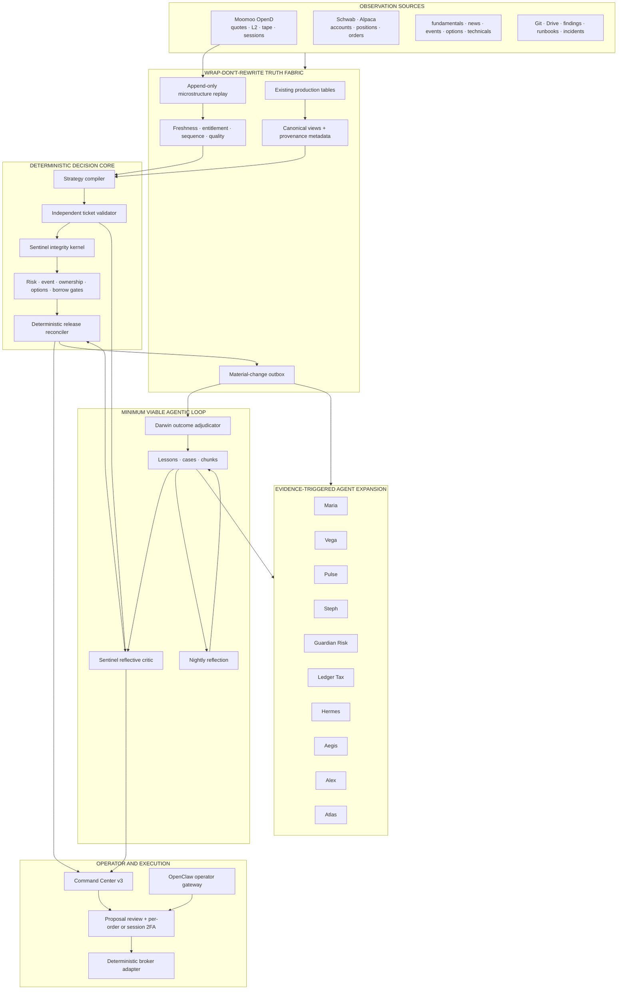
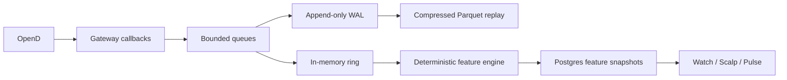

# TRADE AI MASTER AGENTIC FINANCIAL SYSTEM ARCHITECTURE v3.3
## Canonical Architecture for Trade AI v12, OpenClaw, Hermes, Moomoo OpenD, Watch Decision Integrity, and Momentum Scalp

**Status:** CANONICAL MASTER ARCHITECTURE — implementation blueprint; no execution authorization  
**Architecture owner:** Lead Architect  
**Date:** 2026-07-22  
**Target production host:** `ms01-openclaw`  
**Canonical repository path:** `/home/johnclaw/trade-ai-v12-rebuild/trade-ai-v12-rebuild` — verify before each implementation session  
**Primary database:** PostgreSQL `trade_ai` — live schema inventory, not a historical table count, is authoritative  
**Primary operator surfaces:** Command Center v3 (`/v3`) and quasi-parallel Active Trader Next (`/v3-next`) during migration  
**Security posture:** deterministic safety core, explicit human authority, per-order authorization by default, operator-approved session-scoped 2FA for live momentum scalp, Bitwarden Secrets Manager only  
**Supersedes as controlling architecture:**

- `AGENTIC_MATURITY_ARCHITECTURE_v1_0.md`
- `AGENTIC_FINANCIAL_SYSTEM_ARCHITECTURE_v2_0.md`
- `MOOMOO_REFERENCE_ARCHITECTURE_v2_2.md`
- `MOMENTUM_SCALP_ARCHITECTURE_V1.3.md`
- `TRADE_AI_MASTER_AGENTIC_FINANCIAL_SYSTEM_ARCHITECTURE_v3_0.md`
- `TRADE_AI_MASTER_AGENTIC_FINANCIAL_SYSTEM_ARCHITECTURE_v3_1.md`
- `TRADE_AI_MASTER_AGENTIC_FINANCIAL_SYSTEM_ARCHITECTURE_v3_2.md`

The superseded documents remain historical evidence. Their conflicting requirements are resolved in §1. No implementation may select a superseded rule when this document provides a controlling rule.

## v3.1 operator-approved amendment

The architecture owner has explicitly authorized:

1. an approved live-canary phase for Moomoo momentum scalping;
2. automatic live scalp entries, modifications, protective management, scale-outs, and exits while a bounded live scalp session is active;
3. one operator 2FA ceremony at the start of that session instead of per-order 2FA for each scalp order;
4. deterministic enforcement of the signed session authorization envelope;
5. immediate session revocation and kill-switch authority.

This amendment changes only the momentum-scalp authorization boundary. It does not authorize an LLM to execute, remove deterministic validation, remove risk limits, weaken broker reconciliation, expose credentials, or permit orders outside the signed session.

**Architecture guardrails may not be changed again without explicit architecture-owner approval recorded in a versioned architecture amendment.**

## v3.3 operator-approved multi-broker and autonomous-build amendment

The architecture owner additionally authorizes the design and staged implementation of:

1. API-enabled account discovery and trading across all eligible Alpaca, Moomoo, and Schwab accounts;
2. broker capability discovery and normalized broker-rejection handling;
3. pre-authorized primary and fallback broker accounts;
4. automatic failover only among accounts already bound into the signed session envelope;
5. operator notification and session-amendment workflow when an unapproved alternate account is required;
6. complete pre-trade, working-order, in-trade, and post-trade ticket views;
7. configurable quick-add controls, including 100, 200, 500, and 1,000-unit presets;
8. single-order cancel, protected cancel-all, flatten, and intelligent-sell actions;
9. broker-specific exit translation and fallback behavior;
10. a server-side feature-control modal for staged testing without changing the current live dashboard;
11. a read-only second-architect litmus review that cannot modify source, configuration, or architecture;
12. a resumable sequential Codex night-run controller that commits each green stage, pushes to GitHub, syncs artifacts to Google Drive, and emails the operator;
13. Bitwarden credential-requirement scaffolding and an operator completion to-do list.

This amendment preserves v3.2's session-scoped authorization boundary. A broker, account, quantity, symbol, strategy, or risk limit not already present in the signed session envelope cannot be introduced through automatic failover, a quick-add button, a flatten action, or a feature flag.

The unattended implementation workflow may build and test through non-live stages. It may not merge to the production branch, deploy to production, enable a live feature flag, request real 2FA, unlock live trading, or submit a real order without a separate operator start instruction for that exact stage.

## v3.2 operator-approved Active Trader amendment

The architecture owner additionally authorizes the design and staged implementation of:

1. a new Active Trader workspace on the Trade AI operator surface;
2. a quasi-parallel `/v3-next` dashboard that can be switched against the existing `/v3` dashboard without replacing it;
3. operator-configurable share quantities and account selection;
4. saveable session drafts and one session-scoped 2FA ceremony;
5. automatic live momentum-scalp execution after session activation;
6. Level 2 and time-and-sales-informed limit management;
7. deterministic in-trade management that distinguishes ordinary pullbacks, resilient continuation, supply/resistance, runner promotion, and exit conditions;
8. complete event-sourced journaling and learning feedback;
9. staged Codex implementation with explicit stop points and acceptance evidence.

This amendment does not authorize the implementation agent to reinterpret or weaken the v3.1 session envelope. The architecture owner remains the sole authority for changing financial guardrails.

---

# 0. EXECUTIVE CHARTER

Trade AI is not being redesigned as an autonomous trading bot.

It is being designed as an **agentic financial operating system** in which:

1. market and account observations are acquired with provenance;
2. deterministic services establish facts, arithmetic, eligibility, and risk;
3. reflective agents retrieve institutional memory and challenge decisions;
4. a deterministic reconciler releases or quarantines artifacts;
5. humans retain financial authority;
6. every live order is covered by either per-order 2FA or an active operator-signed momentum-scalp session authorization;
7. outcomes become cases, lessons, hypotheses, and scored improvements;
8. no learned change reaches production without evidence, adjudication, versioning, and rollback.

The architectural maxim is:

> **Machines observe broadly. Deterministic systems establish truth. Agents challenge and learn. Evidence earns promotion. Humans retain financial authority.**

## 0.1 Two loops, one constitution

```text
FAST REFLECTIVE LOOP
observations
  → normalized facts
  → candidate decision/ticket
  → independent deterministic validation
  → Sentinel integrity kernel
  → retrieval-grounded reflective critique
  → deterministic release or quarantine
  → operator presentation

SLOW LEARNING LOOP
artifact and outcome
  → immutable case
  → nightly reflection
  → candidate lesson or preregistered hypothesis
  → deterministic evaluation / shadow / walk-forward
  → Darwin adjudication evidence
  → human promotion decision
  → versioned config or code
  → reversible deployment
  → new outcomes
```

The fast loop prevents obvious nonsense today.  
The slow loop reduces recurrence and improves the system over time.

## 0.2 The core architectural decision

The execution and protection layers remain deliberately non-agentic.

The reflective and learning layers become agentic.

An LLM is never the authority for:

- price truth;
- position truth;
- account truth;
- order status;
- arithmetic;
- eligibility;
- stop enforcement;
- risk limits;
- broker routing;
- approval state;
- 2FA;
- live execution.

---

# 1. SUPERSESSION AND CONFLICT RESOLUTION

This section is controlling when prior documents disagree.

## 1.1 Credentials

**Bitwarden Secrets Manager is the only credential store.**

- Broker, provider, OAuth service, TOTP, RSA/private-key, and API credentials are stored in Bitwarden Secrets Manager.
- Production secret set: `trade-ai-prod`.
- Laboratory secret set: `trade-ai-lab`; it must not contain live broker credentials.
- Secrets are rendered at service start into a dedicated tmpfs path under `/run`.
- No broker credential, trade password, TOTP secret, or private key is stored in `.env`.
- No agent may read raw secrets.
- The only permanent secret material allowed on disk is the minimum Bitwarden machine-token material already approved by the secrets migration.
- `credential_slot` is a logical reference to a Bitwarden secret set, not a path and not a credential value.

Any older statement that places a Moomoo trade password or TOTP secret in `.env` is void.

## 1.2 Live authorization modes

Per-order 2FA remains the default for non-simulation trading.

The architecture owner has approved one explicit exception:

```text
MOMENTUM_SCALP_LIVE_SESSION
```

A live momentum-scalp session is activated by one operator 2FA ceremony. After activation, the deterministic scalp engine may automatically submit and manage live scalp orders that remain inside the signed session authorization envelope.

The session envelope must bind at minimum:

```yaml
session_authorization_id:
strategy: MOMENTUM_SCALP
broker:
account_ids: []
allowed_symbols: []
candidate_rule_version:
ticket_policy_version:
model_review_policy:
session_start:
session_entry_cutoff:
session_expiry:
max_trades:
max_concurrent_positions:
max_gross_notional:
max_notional_per_trade:
max_risk_per_trade:
max_daily_loss:
max_chase_bps:
max_order_ttl_seconds:
allowed_order_types: []
allowed_sessions: []
required_protection:
live_arm_token_hash:
operator_id:
2fa_verification_ref:
authorization_hash:
status:
```

The allowed symbol set may be:

- an explicit operator-approved list; or
- a deterministic dynamic universe rule whose version, filters, and maximum symbol count are included in the signed envelope.

One-time session 2FA authorizes, within those bounds:

- live entries;
- partial-fill management;
- bounded limit repricing;
- broker-native protective orders;
- authorized scale-outs;
- deterministic thesis exits;
- session-close exits;
- emergency exits;
- order cancellation or replacement required by the approved strategy.

It does not authorize:

- another strategy;
- another broker or account;
- a larger position or risk budget;
- a symbol outside the signed universe;
- an order after the entry cutoff;
- a changed strategy, candidate, risk, or chase-policy version;
- removal or weakening of required protection;
- an LLM-originated order;
- manual discretionary orders unrelated to the scalp engine.

Any material envelope change requires revocation and a new 2FA ceremony.

When the entry window expires:

- no new positions may be opened;
- already-open positions remain under the original authorization until flat;
- protective management and exits continue automatically;
- the session closes after all positions and working orders are reconciled.

All live scalp orders must carry `session_authorization_id` and `authorization_hash`. An order that cannot prove current authorization is rejected before the adapter.

### Composite per-order envelope

For non-scalp live trading, one 2FA ceremony may still authorize an immutable composite order envelope when every child is shown and hash-bound. Any later material change requires new authorization.

## 1.3 Momentum scalp live auto-execute

The permitted operating modes are:

```text
IGNORE
ELIGIBLE_WATCH
AUTO_STAGE_ON_FIRE
AUTO_EXECUTE_LIVE_SESSION
```

`AUTO_EXECUTE_LIVE_SESSION` is valid only while a signed `MOMENTUM_SCALP_LIVE_SESSION` is active.

The mode may automatically:

- select a candidate under the signed deterministic universe rule;
- arm and fire;
- compile and validate the ticket;
- submit the bounded live entry;
- install broker-native protection;
- manage the position;
- scale out;
- exit;
- reconcile the broker state.

No per-order 2FA is required inside the valid session envelope.

## 1.4 Exit-only kill switch

Exit-only mode means:

- the live scalp session is immediately closed to new entries;
- no adds are permitted;
- working entry orders are cancelled where safe;
- broker-resident protective orders remain active;
- existing session-authorized scalp positions continue deterministic protective management and may exit automatically;
- non-scalp discretionary live exits remain on their normal authorization policy;
- simulation exits may remain autonomous;
- the operator is alerted and the revocation is audited.

Session revocation never removes protection from an open position.

## 1.5 Moomoo authority

Moomoo enters in three separate capability stages:

```text
DATA_ONLY
SIMULATION_TRADE
LIVE_TRADE
```

The implementation sequence still begins with `DATA_ONLY`, then `SIMULATION_TRADE`.

`LIVE_TRADE` and the smallest momentum-scalp live canary are now architecture-owner approved, but may activate only after the P11 readiness gate proves the adapter, protection, account, authorization-session, reconciliation, and operational prerequisites.

Approval of the phase is not evidence that those prerequisites are already implemented.

## 1.6 Broker inventory and SnapTrade

The canonical broker plane currently names:

- Schwab;
- Alpaca;
- Moomoo, data-only initially.

The earlier v2.0 diagram mentioned SnapTrade without evidence in the reviewed repository context. SnapTrade is excluded from the canonical plane until a live inventory proves:

- an installed connector;
- an account registry entry;
- a source-of-truth contract;
- capability rows;
- tests;
- an owner.

## 1.7 Dashboard and paths

- Command Center v3 is the canonical operator surface.
- New scalp UI belongs under `/v3/scalp`, not a new legacy `/v2/scalp` product.
- APIs belong under the current v3 service boundary.
- Historical paths such as `/home/john/trade-ai-v12-rebuild/` are not assumed valid.
- Every implementation session begins by resolving the actual repository, service, and bundle paths.

## 1.8 Raw market-data storage

The momentum v1.3 proposal to write all ticks and order-book updates into PostgreSQL is superseded by the following rule:

> PostgreSQL is the control and feature store. High-frequency raw events use an append-only replay store. The main OLTP database does not ingest every book mutation.

PostgreSQL may retain sampled or bounded partitions only after a throughput benchmark proves the value.

## 1.9 Agent names and operator continuity

Existing stable IDs remain compatible:

```text
maria
steph
risk_agent
tax_agent
alex
aegis
iris
hermes
```

Institutional display roles may be added without breaking IDs:

```text
risk_agent → Guardian Risk
tax_agent  → Ledger Tax
```

New agent IDs are introduced only for missing functions.

---

# 2. HONEST MATURITY ASSESSMENT

The platform is stronger in deterministic engineering than in agentic operation.

| Capability | Current maturity | Target |
|---|---:|---:|
| Deterministic execution and safety | 8.5/10 | 9.0 |
| Scheduled automation and operations | 7.2/10 | 8.5 |
| Data breadth | 7.0/10 | 8.5 |
| Provenance and cross-source truth | 5.5/10 | 8.5 |
| Decision compilation | 6.0/10 | 8.0 |
| Universal decision integrity | 5.5/10 | 8.5 |
| Durable agent runtime | 3.0/10 | 8.0 |
| Machine-readable institutional memory | 3.2/10 | 8.0 |
| Outcome learning | 4.5/10 | 7.5 |
| Hypothesis-to-promotion science | 3.8/10 | 8.0 |
| Model orchestration and independence | 5.0/10 | 8.0 |
| Market microstructure intelligence | 2.0/10 | 8.0 |
| Operator agent experience | 4.5/10 | 8.0 |

**Current agentic-financial-system maturity: approximately 4.3/10.**

The deterministic core could remain technologically conservative forever. That is not a weakness. The underdeveloped capability is the circulation between evidence, memory, critique, evaluation, and promotion.

---

# 3. CONSTITUTIONAL LAWS

1. **The deterministic core never learns in place.**
2. **Learning proposes; evaluation tests; adjudication promotes; deployment versions; outcomes judge.**
3. **No LLM is a source of arithmetic, market, broker, account, position, eligibility, or execution truth.**
4. **No LLM runs in tick, fire, stop, broker-write, kill-switch, or protective paths.**
5. **Every reflective agent retrieves before reasoning.**
6. **Every agent artifact is immutable and scored.**
7. **Every material prediction is frozen before its outcome window.**
8. **Every promoted change has a one-step rollback.**
9. **Agents write only to staging, review, case, lesson-candidate, hypothesis, and exception surfaces.**
10. **No model or model ensemble can override a deterministic failure.**
11. **Abstention is a valid high-quality output.**
12. **Cron/systemd may trigger an agent; a cron job is not automatically an agent.**
13. **A personality name is not an agent.**
14. **An agent may not validate or score its own artifact.**
15. **No production agent survives without measurable utility.**
16. **No live order is representable without a valid per-order authorization or active signed session authorization.**
17. **Production secrets never enter an agent prompt, model context, replay file, or KB.**
18. **Research availability and financial authorization are separate concerns.**
19. **The operator surface may degrade; protective truth may not.**
20. **No architecture phase may require a rewrite of the existing data estate before delivering value.**
21. **Only the architecture owner may approve a financial guardrail change; every approval is versioned, attributable, and auditable.**
22. **Operator-entered account, quantity, and session intent is immutable after 2FA except through explicit revocation and reauthorization.**
23. **Level 2 is evidence, not truth by itself; book signals require persistence, tape confirmation, sequence integrity, and price-context agreement.**
24. **A winning scalp may become an intraday runner only through a deterministic state transition recorded in the session policy and journal.**
25. **The current dashboard remains available until the new dashboard proves parity and rollback.**
26. **Every broker action is capability-resolved at runtime; a UI label never implies unsupported native functionality.**
27. **Automatic broker failover is permitted only among fallback accounts already authorized in the session envelope.**
28. **Cancel-all must preserve protection by default; flatten must prioritize verified flatness over optimistic price improvement.**
29. **Quick-add actions cannot increase exposure beyond the signed share, notional, concentration, or loss envelope.**
30. **A read-only architectural reviewer may challenge the design but may not edit, commit, merge, deploy, or alter guardrails.**
31. **An unattended implementation run stops on uncertainty, records the checkpoint, synchronizes evidence, and notifies the operator.**

---

# 4. MINIMUM VIABLE LOOP — THE FIRST AGENTIC PRODUCT

The Minimum Viable Loop, or MVL, is the first required proof.

It contains only:

```text
Sentinel
Knowledge Base
Darwin
Nightly Reflection
```

One immune cell. One memory. One scorekeeper. One dream cycle.

Atlas-grade generalized orchestration is deferred until the MVL works end to end.

## 4.1 MVL components

### Sentinel

Two internal layers:

1. **Sentinel Integrity Kernel**  
   Deterministic invariants, synchronous, mandatory.

2. **Sentinel Reflective Critic**  
   Retrieval-grounded local/OAuth/premium criticism, asynchronous according to release class.

Sentinel can verdict and quarantine. It cannot edit a ticket or grant proposal authority.

### Knowledge Base

Initial stores:

```text
kb_lessons
kb_cases
kb_chunks
```

Initial retrieval facade:

```text
kb.search
kb.get_lesson
kb.get_case
kb.find_contradictions
```

### Darwin

Darwin joins artifacts to outcomes and scores:

- ticket quality;
- Sentinel detections;
- false alarms;
- abstentions;
- operator dispositions;
- eventual market outcomes;
- operational cost and latency.

Darwin cannot promote a rule.

### Nightly Reflection

One bounded nightly run reads new cases and exceptions, then writes:

- candidate lessons;
- candidate hypotheses;
- unresolved contradictions;
- stale lessons;
- suggested experiments.

It does not change production behavior.

## 4.2 MVL minimal schema

Do not begin with fourteen runtime tables.

MVL requires:

```text
agent_runs
agent_artifacts
agent_tool_calls
agent_reviews
agent_scores
kb_lessons
kb_cases
kb_chunks
```

Expansion tables are added only when a concrete runtime need appears.

## 4.3 MVL proof

The MVL is accepted only after all of the following:

```text
100 reviewed Watch artifacts
>= 20 known-bad regression fixtures
retrieval recorded on >= 95% of eligible Sentinel reviews
0 deterministic failures released
Sentinel false-positive rate measured
Darwin scoring complete for >= 95% of artifacts
nightly reflection creates candidate lessons
Iris or operator can ratify/reject lessons
no production config mutation
no broker call
```

## 4.4 MVL non-goals

The MVL does not require:

- a general multi-agent scheduler;
- all named agents as processes;
- Moomoo;
- premium models;
- autonomous code changes;
- a message broker;
- a new database;
- a rewrite of existing pipelines.

---

# 5. WRAP-DON'T-REWRITE DATA ARCHITECTURE

The phrase “canonical truth plane” does not authorize a re-platforming project.

## 5.1 General rule

Existing tables remain sources of record where they already work.

Agentic integration arrives through:

- provenance columns;
- compatibility views;
- normalized read models;
- materialized snapshots;
- append-only outbox events;
- source hashes;
- temporal validity;
- adapters.

No existing consumer must migrate before Sentinel, the KB, or Darwin can go live.

## 5.2 Observation envelope

Every new or wrapped observation should expose:

```yaml
source_system:
source_record_id:
symbol_or_entity:
observed_at:
provider_at:
received_at:
normalized_at:
source_version:
source_hash:
quality_state:
freshness_state:
entitlement_state:
sequence_id:
payload_ref:
```

These fields may be implemented as:

- columns on new tables;
- wrapper views for existing tables;
- metadata side tables when modifying a mature table is risky.

## 5.3 New tables only for new concerns

New first-class storage is justified for:

- agent runs and artifacts;
- machine-readable lessons and cases;
- Moomoo subscription and data-quality state;
- high-frequency replay manifests;
- microstructure feature snapshots;
- scalp state and outcomes;
- hypothesis preregistration.

## 5.4 Compatibility views

Examples:

```text
v_canonical_quote
v_canonical_position
v_canonical_event
v_canonical_technical_state
v_canonical_watch_ticket
v_canonical_microstructure
v_agent_case_context
```

Views expose a stable contract while underlying sources evolve.

## 5.5 Event outbox

Material changes are written to a durable outbox:

```text
market_fact_changed
ticket_compiled
ticket_validation_failed
ticket_released
ticket_quarantined
review_completed
position_changed
event_changed
microstructure_regime_changed
case_closed
lesson_ratified
hypothesis_registered
```

Agents consume outbox events; they do not poll arbitrary tables without ownership.

---

# 6. REFERENCE ARCHITECTURE



---

# 7. ISOLATED PRODUCT-UPGRADE LAB

No production product is upgraded in place.

## 7.1 Environment rings

```text
PROD
  Current pinned services and packages.
  Live channels and accounts.
  Production Bitwarden collection.
  No experimental upgrades.

SHADOW
  Candidate runtime on the same box with separate home, ports, users and state.
  Read-only production facts or replay.
  No live broker credentials.
  Test channels only.
  Writes only to lab/staging schemas.

LAB
  Unit, contract, replay and destructive tests.
  Synthetic or copied data.
  No production network authority.
```

## 7.2 Filesystem and identity

Recommended layout:

```text
/opt/trade-ai/runtime/openclaw/<version>/
/opt/trade-ai/runtime/hermes/<version>/
/opt/trade-ai/venvs/openai-sdk/<version>/
/opt/trade-ai/venvs/moomoo-sdk/<version>/

/var/lib/trade-ai-prod/
/var/lib/trade-ai-shadow/
/var/lib/trade-ai-lab/

/run/trade-ai-prod/secrets/
/run/trade-ai-shadow/secrets/
/run/trade-ai-lab/secrets/
```

Dedicated service identities:

```text
tradeai-prod
tradeai-shadow
tradeai-lab
```

No candidate process shares a mutable home directory with production.

## 7.3 Database isolation

```text
trade_ai_prod application role
trade_ai_shadow_ro read-only role
trade_ai_lab schema or cloned database
```

Shadow may read production through canonical views. It may not write production tables.

## 7.4 Channel isolation

- Production OpenClaw retains production Telegram/WhatsApp channels.
- Shadow OpenClaw uses a separate test bot, disabled outbound delivery, or an operator-only private channel.
- Candidate agents cannot post into production channels until promotion.
- No candidate receives production Gmail/Calendar/Drive write scopes unless its exact function requires a test tenant.

## 7.5 Secret isolation

- `trade-ai-lab` Bitwarden collection contains test-only provider keys and simulation credentials.
- No live Schwab, Alpaca, or future Moomoo trade credential is mounted in shadow or lab.
- Production BWS machine token is never copied to a candidate environment.
- Candidate OpenD testing uses data-only credentials or recorded replay.

## 7.6 Upgrade pipeline

```text
DISCOVER
  → create version record
  → download package and record hash/provenance
  → build isolated candidate
  → static compatibility checks
  → unit tests
  → API and schema contract tests
  → replay tests
  → shadow traffic
  → security review
  → performance comparison
  → canary
  → operator promotion
  → atomic switch
  → post-promotion observation
  → retain rollback
```

No `pip install -U`, `npm update`, or `hermes update` is run against production first.

## 7.7 Atomic promotion

Use versioned directories plus a controlled pointer:

```text
/opt/trade-ai/runtime/hermes/current
/opt/trade-ai/runtime/openclaw/current
```

Promotion changes the pointer and restarts the service.

Rollback restores the previous pointer and service definition.

Database migrations use expand/contract:

1. additive schema;
2. dual-read or compatibility view;
3. candidate validation;
4. production cutover;
5. delayed cleanup.

## 7.8 Candidate registry

```sql
CREATE TABLE runtime_candidates (
  product TEXT NOT NULL,
  installed_version TEXT,
  candidate_version TEXT NOT NULL,
  package_hash TEXT NOT NULL,
  source_uri_ref TEXT,
  environment TEXT NOT NULL,
  compatibility_state TEXT NOT NULL,
  security_state TEXT NOT NULL,
  replay_state TEXT NOT NULL,
  shadow_state TEXT NOT NULL,
  approved_by TEXT,
  approved_at TIMESTAMPTZ,
  promoted_at TIMESTAMPTZ,
  rollback_version TEXT,
  notes JSONB,
  PRIMARY KEY (product, candidate_version, environment)
);
```

## 7.9 Current public candidate snapshot

This is a discovery snapshot, not permission to upgrade.

| Product | Current production evidence | Public candidate on 2026-07-22 | Architecture ruling |
|---|---|---|---|
| OpenAI Python SDK | repo pin reported as `2.30.0` | `2.46.0` | Test in isolated venv; prefer Responses API for new direct integrations |
| OpenAI Agents SDK | not a production prerequisite | `0.18.3` | Laboratory evaluation only; do not create a third orchestrator without ADR |
| Hermes Agent | last documented global install `0.16.0` | `0.19.0` | Candidate venv with Python 3.13; Hermes 0.19 requires Python >=3.11,<3.14 |
| OpenClaw | live version must be verified; later evidence reported 2026.6.11 | stable `2026.7.1-2` | Side-by-side home, port and test channel; stable only |
| Moomoo OpenD | not yet canonical production service | `10.9.6908` documented 2026-07-15 | Data-only candidate; replay first; one live session owner |
| Local Ollama models | live inventory required | no automatic replacement | Benchmark current models before any change |
| Embedding model | conflicting docs | decide after retrieval audit | Dual-index migration, never blind re-embed |

## 7.10 Product-specific upgrade logic

### OpenAI Python SDK

Candidate tests:

- import and startup;
- Responses API;
- existing Chat Completions paths;
- structured output;
- streaming events;
- retry and timeout behavior;
- usage accounting;
- request IDs;
- OAuth-proxy independence;
- model registry compatibility;
- cost guards;
- Python runtime.

The SDK upgrade does not automatically change models.

### OpenAI Agents SDK

Use only in a laboratory comparison.

Evaluate whether it provides measurable benefit for:

- tracing;
- sandbox separation;
- checkpoints;
- handoffs;
- eval integration.

OpenClaw and Hermes already provide orchestration capabilities. Adding the Agents SDK to production without a consolidation ADR would duplicate state and tools.

### Hermes

Hermes candidate runs with:

```text
HERMES_HOME=/var/lib/trade-ai-shadow/hermes
Python 3.13 venv
read-only canonical views
staging-only tools
no production profiles
no auto-graft
no config promotion
```

Required tests:

- profile import;
- memory isolation;
- tool allowlist;
- MCP;
- scheduled runs;
- model routes;
- checkpoint/resume;
- staging writes;
- denial of production writes;
- cost accounting;
- output schema.

### OpenClaw

Candidate runs with:

```text
OPENCLAW_HOME=/var/lib/trade-ai-shadow/openclaw
separate workspace
separate gateway port
test Telegram bot or outbound disabled
read-only Trade AI MCP
```

Required tests:

- channel isolation;
- OAuth routes;
- MCP permissions;
- scheduled-run status;
- run cancellation;
- session resume;
- agent workspace loading;
- tool-result handling;
- prompt injection boundaries;
- no production secret inheritance.

### Moomoo SDK and OpenD

The Python SDK can be tested side-by-side against recorded replay or a mock OpenD.

Because OpenD session ownership may be exclusive:

- do not launch two production-authenticated OpenD instances;
- test a new OpenD binary against replay or a separate data-only identity;
- schedule a controlled data-only canary when binary compatibility must be proven;
- keep the prior binary and config for immediate rollback.

---

# 8. AGENT ROSTER AND ACTIVATION POLICY

## 8.1 Canonical roster

| Stable ID | Display name | Role | Activation |
|---|---|---|---|
| `sentinel` | Sentinel | Decision integrity and ticket contradiction review | MVL |
| `darwin` | Darwin | Outcome join, scoring, calibration evidence | MVL |
| `iris` | Iris | Knowledge curation and lesson lifecycle | MVL support |
| `reflection` | Nightly Reflection | Case-to-lesson/hypothesis generation | MVL |
| `argus` | Argus | Population-wide integrity scan | Phase 2 |
| `maria` | Maria | Fundamental and catalyst research | Existing capability; durable later |
| `vega` | Vega | Technical structure and setup lifecycle | After technical artifacts stabilize |
| `pulse` | Pulse | Moomoo microstructure interpretation | After Moomoo feature plane |
| `steph` | Steph | Portfolio and account allocation | Existing capability; durable later |
| `risk_agent` | Guardian Risk | Portfolio and ticket risk critic | Existing ID retained |
| `tax_agent` | Ledger Tax | Tax, wash sale, account constraints | Existing ID retained |
| `hermes` | Hermes | Hypothesis discovery and experiment design | After KB and Darwin |
| `aegis` | Aegis | Incident and reliability investigation | After case pipeline |
| `alex` | Alex | CIO synthesis for unresolved trade-offs | After lower layers are reliable |
| `concierge` | Concierge | OpenClaw operator interface | After governed tools |
| `atlas` | Atlas | General durable-workflow orchestrator | Deferred until MVL evidence |

## 8.2 Agent contract

```yaml
agent_id:
agent_version:
objective:
allowed_job_types:
allowed_tools:
denied_tools:
retrieval_policy:
artifact_schema:
review_policy:
budget:
deadline:
stop_conditions:
score_policy:
deployment_state:
```

## 8.3 Agent lifecycle

```text
DESIGNED
SHADOW
OPERATIONAL
RESTRICTED
RETOOL
RETIRED
```

No agent becomes `OPERATIONAL` without:

- tool permission review;
- artifact schema;
- regression fixtures;
- scoring method;
- owner;
- rollback/disable control.

---

# 9. SENTINEL RELEASE CLASSES AND SLA

The integrity layer must not wedge the operator surface.

## 9.1 Sentinel architecture

```text
SENTINEL INTEGRITY KERNEL
  deterministic invariants
  synchronous
  mandatory
  no model dependency

SENTINEL REFLECTIVE CRITIC
  KB retrieval
  local/OAuth/premium model review
  asynchronous
  release-class policy
```

## 9.2 SLA and failure semantics

| Release class | Page publication | Reflective-review deadline | Failure behavior |
|---|---|---:|---|
| Research display | Publish after deterministic pass | target 5 min | Fail open for display, visibly `MODEL REVIEW UNAVAILABLE`; never proposal-eligible from this state |
| Watch candidate | Publish state and evidence after deterministic pass | target 5 min | Keep `REVIEW_PENDING`; mechanics follow deterministic gate |
| Proposal-eligible entry | Publish card immediately, block proposal | hard 6 min default | Timeout becomes `REVIEW_REQUIRED_TIMEOUT`; no silent fallback and no hung request |
| High-risk/exception | Publish as review-required | operator-controlled | Requires configured review policy; premium only after cost confirmation |
| Held-position risk review | Deterministic position-management truth publishes | asynchronous | Agent unavailability cannot block protective truth |
| Protective stop/fire/kill path | No Sentinel dependency | none | Deterministic path only |

Deadlines are configuration defaults and must be measured against actual local-model latency before promotion.

## 9.3 Sentinel kernel invariants

Examples:

```text
current price coherent with entry
entry mode coherent with trigger
stop direction valid
target direction valid
R:R independently recomputes
blocked state has no current mechanics
no-trade preferred has no constructive mechanics
missed entry has no actionable mechanics
legacy packet is visibly unverified
held symbol does not use starter-entry ticket as primary
header, selected family and action policy agree
ticket, input and validation hashes match
required facts are current
watch level is not mislabeled as entry
previous plan is not current plan
```

## 9.4 Reflective critique

Sentinel retrieves:

- applicable ratified lessons;
- disputed lessons;
- analogous cases;
- prior tickets;
- compiler/validator incidents;
- setup outcomes;
- current source-quality notices.

It returns:

```yaml
verdict: PASS|CAUTION|REJECT|QUARANTINE|INSUFFICIENT_EVIDENCE
contradictions: []
missing_evidence: []
stale_evidence: []
forced_trade_risk: []
lesson_refs: []
case_refs: []
questions: []
```

It cannot alter the ticket.

---

# 10. KNOWLEDGE BRAIN

## 10.1 Lessons

```sql
CREATE TABLE kb_lessons (
  lesson_id UUID PRIMARY KEY,
  statement TEXT NOT NULL,
  scope JSONB NOT NULL,
  status TEXT NOT NULL,
  confidence NUMERIC,
  effective_from TIMESTAMPTZ,
  effective_until TIMESTAMPTZ,
  evidence_refs JSONB NOT NULL DEFAULT '[]',
  counterevidence_refs JSONB NOT NULL DEFAULT '[]',
  supersedes JSONB NOT NULL DEFAULT '[]',
  superseded_by UUID,
  source_type TEXT NOT NULL,
  source_snapshot JSONB,
  ratified_by TEXT,
  ratified_at TIMESTAMPTZ,
  embedding_model TEXT,
  embedding_version TEXT,
  embedding VECTOR,
  created_at TIMESTAMPTZ NOT NULL DEFAULT NOW(),
  updated_at TIMESTAMPTZ NOT NULL DEFAULT NOW()
);
```

Statuses:

```text
CANDIDATE
RATIFIED
DISPUTED
DEPRECATED
SUPERSEDED
REJECTED
```

## 10.2 Cases

A case captures the point-in-time reality of:

- a trade;
- a rejected ticket;
- a stale-data incident;
- a broker discrepancy;
- a Watch contradiction;
- an agent failure;
- an outage;
- a Moomoo sequence gap;
- a scalp fire;
- a successful abstention.

```yaml
case_id:
case_type:
opened_at:
closed_at:
entities:
facts_snapshot:
artifact_refs:
operator_disposition:
execution_refs:
outcome:
mfe:
mae:
costs:
slippage:
retrospective:
lesson_candidates:
source_sha:
```

## 10.3 Chunks

Chunks retain:

- document identity;
- source SHA;
- line/section locator;
- time validity;
- access classification;
- embedding model/version;
- deprecation state.

## 10.4 Retrieval

Retrieval is hybrid:

1. exact identifiers;
2. structured scope;
3. temporal validity;
4. BM25/keyword;
5. semantic similarity;
6. evidence quality;
7. recency;
8. contradiction search.

An agent receives supporting and conflicting knowledge.

## 10.5 Memory-poisoning controls

- Agent-generated lessons begin as `CANDIDATE`.
- A lesson cannot cite itself.
- High-impact lessons require human ratification.
- Every retrieval result exposes provenance.
- Deprecated lessons remain auditable but are excluded by default.
- Prompt-injected documents cannot promote themselves.
- Secret-bearing text is excluded from indexing.
- External content remains `UNTRUSTED_SOURCE` until normalized.

## 10.6 Embedding migration

Before selecting an embedding model:

- verify live Ollama inventory;
- verify current stored dimensions;
- build a retrieval benchmark;
- create a parallel index;
- compare recall, precision, latency and storage;
- promote the index pointer;
- retain the prior index until observation completes.

---

# 11. DARWIN OUTCOME ADJUDICATION

Darwin scores artifacts, not personalities.

## 11.1 Sentinel metrics

- true contradictions;
- false alarms;
- harmful tickets blocked;
- valid tickets delayed;
- citation precision;
- abstention quality;
- review latency;
- review cost.

## 11.2 Decision metrics

- ticket validity;
- state consistency;
- MFE/MAE;
- realized or simulated outcome;
- opportunity cost of abstention;
- data-quality failures;
- operator overrides;
- execution slippage;
- risk-limit adherence.

## 11.3 Scoring independence

- Sentinel cannot score Sentinel.
- The compiler cannot validate the compiler.
- Hermes cannot adjudicate Hermes hypotheses.
- Darwin calculations are versioned and deterministic.
- Human review is required for metric-definition changes.

---

# 12. NIGHTLY REFLECTION AND HERMES SCIENTIFIC LOOP

## 12.1 Nightly reflection

One bounded run per night:

```text
new cases
+ new exceptions
+ agent errors
+ false positives
+ missed opportunities
+ source drift
+ Moomoo quality incidents
+ scalp fires and outcomes
→ candidate lessons
→ candidate hypotheses
→ unresolved questions
```

No production mutation.

## 12.2 Hermes charter

Hermes specializes in:

- anomaly discovery;
- hypothesis generation;
- counterfactual questions;
- experiment design;
- cohort definition;
- feature/threshold proposals;
- research synthesis.

Hermes may not:

- approve tickets;
- write production config;
- write broker state;
- alter risk gates;
- promote its own hypothesis;
- auto-graft behavior into the deterministic core.

## 12.3 Preregistered hypothesis

```yaml
hypothesis_id:
statement:
mechanism:
affected_population:
expected_direction:
expected_effect_size:
primary_metric:
secondary_metrics:
baseline:
train_window:
validation_window:
oos_window:
minimum_sample:
transaction_costs:
latency_assumption:
rejection_criteria:
expiry:
supporting_evidence:
counterevidence:
author_agent:
frozen_at:
source_sha:
```

No result is calculated before `frozen_at`.

## 12.4 Evaluation

Use:

- point-in-time replay;
- walk-forward;
- shadow cohorts;
- holdout windows;
- regime slices;
- transaction costs;
- fill assumptions;
- multiple-testing controls;
- missing-data disclosure.

## 12.5 Promotion

```text
REJECT
REVISE
CONTINUE_SHADOW
APPROVE_CONFIG_PROPOSAL
APPROVE_CODE_PR
DEPRECATE_PRIOR_RULE
```

Promotion is human/oversight gated.

---

# 13. MODEL AND PROVIDER ARCHITECTURE

## 13.1 Roles

| Layer | Role |
|---|---|
| Deterministic code | facts, formulas, freshness, eligibility, risk, release |
| Local Ollama | cheap first critic and classification |
| Grok OAuth | independent external challenge |
| ChatGPT/Codex OAuth | independent structural and evidence critique |
| Paid expert | operator-triggered escalation |
| Deterministic reconciler | preserves disagreement and controls release |

## 13.2 Independence

Each result records:

```text
provider_family
provider
route
auth_type
model
prompt_version
ticket_id
input_hash
validation_hash
response_hash
token_usage
cost
latency
```

A local lane that falls back to cloud is recorded as cloud and does not count as local independence.

## 13.3 Model registry

```yaml
model_id:
provider_family:
provider:
route:
auth_type:
capabilities:
context_window:
structured_output:
tool_use:
reasoning:
vision:
price:
latency_class:
enabled:
fallbacks:
last_capability_probe:
probe_artifact:
```

## 13.4 OpenAI direct API

New direct OpenAI integrations use the Responses API unless a documented compatibility need requires another endpoint.

Pinned model snapshots and application evals are required for repeatable production behavior.

## 13.5 OpenAI Agents SDK

The Agents SDK is a candidate harness, not the controlling runtime.

A laboratory ADR compares:

- OpenClaw native workflows;
- Hermes workflows;
- a small Agents SDK implementation.

The comparison measures:

- durable state;
- sandbox isolation;
- tracing;
- checkpoints;
- tool governance;
- operational complexity;
- cost;
- failure recovery.

Only one production control plane may own a run.

---

# 14. OPENCLAW OPERATING MODEL

OpenClaw is the reflective-agent runtime and operator gateway.

It may own:

- schedules and triggers for reflective work;
- run status;
- model routing;
- governed tool invocation;
- checkpoints;
- cancellation;
- operator commands;
- review requests;
- cost display;
- notifications.

It does not own:

- market truth;
- position truth;
- broker truth;
- risk truth;
- execution;
- approval;
- 2FA;
- configuration promotion.

## 14.1 Cron and systemd

Cron/systemd remain valid trigger and service mechanisms.

The distinction is:

```text
cron → one-shot script → output
```

versus:

```text
cron/event
  → durable agent run
  → retrieval
  → plan
  → governed tools
  → checkpoints
  → artifact
  → review
  → score
```

## 14.2 Operator commands

Examples:

```text
agent status <run>
agent cancel <run>
agent replay <run>
kb search <query>
kb case <id>
watch explain <symbol>
watch validate <symbol>
watch review <symbol>
moomoo status
moomoo quota
scalp status
scalp kill
model candidates
runtime rollback <product>
```

Commands create governed requests; they do not bypass policy.

---

# 15. MOOMOO MARKET-INTELLIGENCE PLANE

## 15.1 Initial scope

Moomoo OpenD is first a read-only provider for:

- real-time quotes;
- market depth available under entitlement;
- time and sales;
- real-time bars;
- extended-hours observations;
- sequence and provider timestamps;
- optional broker queue where entitled.

No live trade adapter is part of the initial implementation.

## 15.2 Service topology

```text
moomoo-opend.service
moomoo-gateway.service
moomoo-subscription-manager.service
moomoo-feature-engine.service
moomoo-replay-writer.service
moomoo-health-monitor.service
```

One gateway owns all subscriptions.

Other services consume normalized internal data, not OpenD directly.

## 15.3 Secrets and OpenD configuration

At service start:

1. dedicated service requests approved data-only secrets from Bitwarden render pipeline;
2. config and key material are written to `/run/trade-ai-prod/moomoo/`;
3. files are owned by the Moomoo service identity and mode `0600`;
4. OpenD starts;
5. the tmpfs content disappears on reboot.

No future live trade password is stored. A future live-trade phase requires an operator-present session unlock ceremony.

## 15.4 Subscription priority

```text
P0  held positions, live proposals, operator-selected symbols
P1  top verified Watch candidates and active alerts
P2  visible Watch cards and high-velocity movers
P3  rotating research universe
```

The manager:

- dynamically subscribes and unsubscribes;
- prevents duplicate ownership;
- records quota and entitlement state;
- preserves priority after reconnect;
- records deferred symbols;
- publishes coverage truth.

## 15.5 Feed tiers

Candidate symbol:

```text
QUOTE
K_1M
```

Armed or P0 symbol, subject to entitlement:

```text
QUOTE
ORDER_BOOK
TICKER
K_1M
BROKER optional
```

## 15.6 Raw event path



A broker such as Redis, NATS, or Redpanda is introduced only after a benchmark proves that the existing bounded queue and WAL cannot meet recovery or fan-out requirements.

## 15.7 PostgreSQL control tables

```text
md_subscription_state
md_entitlement_state
md_data_quality
md_feature_snapshot
md_replay_manifest
md_sequence_gap
md_session_state
```

Raw high-frequency events live outside the main OLTP store.

## 15.8 Deterministic features

- spread and spread percentile;
- top-of-book size;
- depth by level;
- order-book imbalance;
- weighted mid;
- microprice;
- depth slope;
- replenishment;
- cancellation bursts;
- tape velocity;
- aggressor balance;
- trade-size distribution;
- sweeps;
- absorption;
- VWAP;
- RVOL windows;
- ROC windows;
- LULD distance where available;
- sequence gaps;
- stale-book state;
- session and extended-hours liquidity.

## 15.9 Time integrity

Persist:

```text
exchange timestamp when available
provider/OpenD timestamp
gateway receive timestamp
feature timestamp
local monotonic sequence
session
reconnect epoch
```

Require chrony/NTP health.

## 15.10 Pulse

Pulse receives feature windows and replay excerpts.

Pulse may classify:

```text
LIQUIDITY_SUPPORTIVE
LIQUIDITY_THIN
BUY_PRESSURE
SELL_PRESSURE
ABSORPTION
SWEEP_RISK
SPREAD_UNSAFE
TAPE_CONFLICT
DATA_UNAVAILABLE
```

Pulse cannot:

- consume every tick through an LLM;
- create candidates from nothing;
- set size;
- mark a ticket verified;
- place an order;
- override risk or freshness.

---

# 16. MOMENTUM SCALP MODULE — GOVERNED DESIGN

The Momentum Scalp Module is a separate event-driven subsystem that consumes the daily decision universe.

All thresholds below are unvalidated defaults until shadow evidence exists.

## 16.1 Scope

```text
daily candidate and decision layer
        ↓
Moomoo real-time truth and deterministic features
        ↓
scalp eligibility and fire engine
        ↓
shadow outcome or simulation ticket
        ↓
approved live-canary stage with one session-scoped 2FA ceremony
```

Moomoo data does not create an arbitrary universe.

## 16.2 Candidate gate

Initial candidate:

- current daily tier or verified Watch candidate;
- long bias for v1;
- no deterministic event block;
- no blacklist;
- current data.

A WAIT candidate may upgrade only when:

- a new verified catalyst arrives after the daily run;
- RVOL and microstructure gates pass;
- the upgrade is logged separately for outcome scoring.

A deterministic NO-GO is never armed.

## 16.3 Tradability gate

Defaults pending validation:

- price band configured;
- spread below configured threshold;
- not halted or at a limit state;
- sufficient displayed depth relative to simulated size;
- current quote and session;
- entitlement supports the required feature set.

L1 fallback is a different strategy profile and is never silently treated as L2.

## 16.4 Momentum context

Candidate default features:

| Feature | Initial default |
|---|---:|
| price vs VWAP | at or above |
| 5-minute RVOL | >= 3.0 |
| 5-minute ROC | >= +0.8% |
| top-five-level imbalance | >= 0.60 |
| 60-second aggressor buy ratio | >= 0.58 |
| LULD distance | >= 2.0% where available |
| spread | <= 20 bps |

These are experiment seeds, not claimed edge.

## 16.5 State machine

```text
CANDIDATE
  → ARMED
  → FIRED
  → SHADOW_RECORDED
  → outcome scored

SIMULATION extension:
FIRED
  → SIM_STAGED
  → SIM_WORKING
  → SIM_FILLED
  → SIM_MANAGING
  → SIM_EXITING
  → SIM_FLAT

APPROVED LIVE-CANARY extension:
SESSION_2FA_PENDING
  → SESSION_AUTHORIZED
  → CANDIDATE
  → ARMED
  → FIRED
  → LIVE_STAGED
  → SESSION_POLICY_CHECK
  → WORKING
  → FILLED
  → PROTECTED
  → MANAGING
  → EXITING
  → FLAT

The one-time `SESSION_2FA_PENDING → SESSION_AUTHORIZED` transition occurs before automated live trading begins.

Every subsequent live order transition requires a successful deterministic session-policy check and hash match. No per-order 2FA occurs while the session remains valid.

## 16.6 Fire condition

Seed logic:

- break of recent five-minute high;
- tape aggression confirms;
- order-book state confirms;
- current RVOL is accelerating;
- no event, session, spread, LULD, quota, or data-quality block.

Rate limits are configured and scored.

## 16.7 Stay-in and exit thesis

Seed evidence:

- price relative to VWAP;
- flow inversion;
- structure low;
- elapsed time;
- LULD proximity;
- catalyst reversal;
- session close rule.

In shadow and simulation, every hypothetical exit is scored.

## 16.8 Execution and protective design

Live graduation requires broker-resident protection.

Client-only stops are prohibited for live scalp positions.

Required before a live entry can be authorized:

- complete immutable order envelope;
- account eligibility;
- position size;
- risk per share and total risk;
- protective stop;
- target/scale plan;
- time-in-force;
- idempotency key;
- active session authorization and hash binding;
- adapter capability proof;
- broker reconciliation proof;
- session risk-budget availability.

Where supported, submit a broker-native bracket or equivalent.

Where broker-native or equivalent independently survivable protection is unavailable, live scalp trading remains disabled for that account even when the session is authorized.

## 16.9 Smart-limit chase

Shadow, simulation, and an authorized live-canary session may use the same bounded deterministic repricing algorithm:

- limit only for entry;
- reference-price cap;
- maximum chase basis points;
- order TTL;
- cancel on spread blowout;
- cancel on flow reversal;
- partial-fill handling;
- complete audit trail.

No adaptive chase threshold is promoted without shadow and simulation evidence.

## 16.10 Account policy

The implementation begins in shadow and simulation.

The approved live canary uses only the account explicitly named in the signed session envelope. The initial live account should be the smallest approved taxable-account canary unless the architecture owner selects another eligible account.

Each live account requires:

- account-specific policy;
- adapter capability;
- sizing and loss limits;
- PDT/day-trade status;
- tax review;
- broker-native protection;
- inclusion in the session authorization envelope;
- architecture-owner live-arm approval.

## 16.11 Kill switch

```text
SESSION_REVOKED_FOR_NEW_ENTRIES
ENTRY_DISABLED
PROTECTION_PRESERVED
OPEN_SESSION_POSITIONS_MANAGED_TO_FLAT
SESSION_AUTHORIZED_EXITS_AUTOMATIC
BROKER_RESIDENT_STOPS_REMAIN_ACTIVE
OPERATOR_ALERTED
```

## 16.12 Validation ladder

```text
M0  data-only capture
M1  feature replay
M2  shadow fires, zero orders
M3  >= 60 scored fires and threshold evaluation
M4  simulation orders for >= 2 weeks
M5  failure injection and protection proof
M6  operator graduation review
M7  smallest live canary under one session-scoped 2FA authorization
```

M7 is architecture-owner approved by v3.1. Activation still requires every readiness and acceptance gate in P11.

## 16.13 Unresolved risks

- retail latency and adverse selection;
- data entitlements;
- client/server outage;
- PDT restrictions;
- halt behavior;
- extended-hours liquidity;
- broker-native protective capability;
- fill-model realism;
- home-server power and network resilience.

Before live graduation require:

- UPS;
- monitored network;
- defined recovery path;
- broker-native protection;
- account-rule verification;
- explicit negative-expectancy stop rule.

If shadow expectancy is negative, lengthen the holding period or retire the module. Do not tighten thresholds to manufacture a backtest.

---

# 16A. ACTIVE TRADER WORKSTATION

## 16A.1 Product intent

The Active Trader workspace is the operator's real-time control surface for momentum names that enter the governed scalp universe.

It must answer, in one view:

- Why is this symbol in scope?
- Is the market data current and entitled?
- What is the tradable float and its source?
- How much volume and dollar volume has traded?
- Is participation expanding or decaying?
- What are the spread, book depth, order-flow imbalance, tape velocity, VWAP, high of day, support, resistance, and halt risk?
- Which accounts are eligible?
- How many shares are authorized per account?
- What is the total risk and gross exposure?
- Is the session saved, authorized, active, paused, or revoked?
- What is the engine doing now?
- Why is the engine holding, scaling, repricing, cancelling, or exiting?
- Where is the complete journal and replay?

The workspace is not merely a visual order-entry form. It is a projection of one server-side session, candidate, order, position, and journal state.

## 16A.2 Current-repository placement

The existing Command Center v3 already has:

- React Router under `/v3`;
- a Trading hub;
- a `Scalp` tab;
- scanner selection;
- broker orders and proposal surfaces;
- execution-quality data;
- API polling conventions.

The new workspace must not be inserted by rewriting the existing Trading hub in place.

Controlling deployment:

```text
/v3
  existing production Command Center
  remains unchanged except for an "Active Trader Next" link and status indicator

/v3-next
  separate Vite entry and bundle
  separate shell
  Active Trader-first layout
  additive APIs
  feature-flagged live controls
```

The two surfaces read the same server-side truth. They do not keep independent authorization or trading state in browser storage.

## 16A.3 Screen layout

```text
┌──────────────────────────────────────────────────────────────────────────────┐
│ SESSION STRIP                                                               │
│ mode · 2FA state · account set · loss budget · trades used · cutoff · kill │
├───────────────────────┬────────────────────────────────┬─────────────────────┤
│ PRIME QUEUE           │ SYMBOL WORKSPACE               │ SESSION / ORDER     │
│ ranked candidates     │ chart + VWAP + levels          │ shares / accounts   │
│ state + reason        │ Level 2 ladder                 │ allocation / risk   │
│ float / volume / RVOL │ time & sales                   │ save / 2FA / start  │
│ catalyst / halt       │ deterministic evidence        │ pause / revoke      │
├───────────────────────┴────────────────────────────────┴─────────────────────┤
│ OPEN POSITIONS AND TRADE MANAGEMENT                                         │
│ fills · P&L · MFE/MAE · resilience · resistance · mode · stop · next action│
├──────────────────────────────────────────────────────────────────────────────┤
│ EVENT JOURNAL / ENGINE EXPLANATION / REPLAY                                  │
└──────────────────────────────────────────────────────────────────────────────┘
```

## 16A.4 Prime queue

Candidate lifecycle:

```text
DISCOVERED
  → IN_SCOPE
  → PRIMING
  → PRIMED
  → ARMED
  → FIRED
  → WORKING
  → FILLED
  → MANAGING
  → FLAT

Side states:
BLOCKED
STALE
ENTITLEMENT_MISSING
QUOTA_DEFERRED
HALTED
SESSION_NOT_AUTHORIZED
RISK_BUDGET_EXHAUSTED
```

A symbol is `PRIMED` only after deterministic gates pass.

Displayed fields:

### Identity and capital structure

- symbol and company;
- exchange;
- current session;
- price;
- gap percent;
- market capitalization;
- issued shares;
- outstanding shares;
- tradable/float shares;
- float-source name;
- float-source timestamp;
- float-source confidence;
- days since listing;
- reverse-split or corporate-action flags.

Moomoo market snapshot may provide issued and outstanding shares, volume, turnover, turnover rate, and market value. The canonical float may also use Moomoo screening or existing Trade AI sources. Conflicts are displayed and resolved through source policy; they are never silently averaged.

### Participation

- current volume;
- pre-market volume;
- regular-session volume;
- dollar volume;
- 1-minute, 5-minute and session RVOL;
- turnover rate;
- tape prints per second;
- tape shares per second;
- block-trade indicators where supported;
- acceleration/deceleration;
- percentage of float traded.

### Price structure

- open;
- previous close;
- pre-market high/low;
- session high/low;
- VWAP;
- anchored VWAPs where configured;
- recent 1-minute and 5-minute swing levels;
- support zones;
- resistance zones;
- LULD distance/status;
- halt and resumption state;
- ATR and realized intraday volatility.

### Microstructure

- bid/ask;
- spread in cents and basis points;
- top-of-book size;
- depth by level;
- level-weighted book imbalance;
- multi-level order-flow imbalance;
- microprice;
- weighted mid;
- bid/ask replenishment;
- cancellation pressure;
- queue persistence;
- aggressor buy/sell ratio;
- sweep and absorption state;
- sequence-gap and staleness state.

### Catalyst and eligibility

- catalyst summary and source;
- catalyst timestamp;
- earnings/event block;
- Watch/Trade AI decision;
- Sentinel state;
- deterministic ticket state;
- borrow/short state where applicable;
- account eligibility;
- margin/day-trading rule state returned by each broker;
- reason in scope;
- reason not yet armed.

## 16A.5 Symbol workspace

The symbol workspace contains:

1. synchronized 1-second, 1-minute, and 5-minute views;
2. VWAP and configured anchored VWAP;
3. support, resistance, HOD, LOD, pre-market levels, and LULD markers;
4. normal aggregated Level 2 ladder;
5. time-and-sales feed;
6. feature history;
7. deterministic trade thesis;
8. current engine state;
9. last action and exact reason;
10. next possible action and conditions.

US Level 2 must not be presented as individual order identity when the entitlement provides only aggregated levels.

## 16A.6 Session and order configuration

The right-side form supports:

### Session fields

- session name;
- broker;
- allowed account checkboxes;
- candidate universe rule or explicit symbol list;
- session start;
- entry cutoff;
- session expiry;
- regular-hours, pre-market, after-hours permissions;
- maximum trades;
- maximum concurrent positions;
- maximum gross notional;
- maximum daily loss;
- maximum risk per trade;
- maximum chase basis points;
- maximum order lifetime;
- runner policy;
- overnight-conversion policy;
- kill-switch behavior.

### Quantity fields

Input modes:

```text
SHARES
DOLLAR_NOTIONAL
RISK_BASED
```

The operator may enter:

- total desired shares;
- per-account shares;
- per-account dollar limit;
- per-account risk limit;
- allocation weights.

Allocation modes:

```text
MANUAL_PER_ACCOUNT
EQUAL_SHARES
EQUAL_NOTIONAL
PROPORTIONAL_TO_BUYING_POWER
PROPORTIONAL_TO_OPERATOR_WEIGHT
```

The server computes and displays:

- total shares;
- estimated gross notional;
- risk per share;
- total risk;
- account buying power remaining;
- account concentration;
- expected number of child orders;
- estimated fees;
- day-trading/intraday-margin eligibility;
- any account-specific block.

The browser never decides account eligibility or final quantity.

## 16A.7 Account checkboxes

Each account row displays:

```text
[ ] account label
    broker
    environment
    account type
    buying power
    settled cash
    margin/intraday state
    open scalp exposure
    day trades or broker intraday-limit state
    maximum shares allowed
    requested shares
    eligibility reason
```

Selecting multiple accounts creates one parent trading decision with separate child order intents.

Each child has its own:

- account;
- quantity;
- idempotency key;
- broker order ID;
- fill state;
- protection state;
- journal stream;
- reconciliation state.

A failure in one account does not cause an unbounded retry or silently duplicate another account's order.

## 16A.8 Save, authorize, and activate workflow

```text
EDITING
  → SAVE SESSION DRAFT
  → VALIDATE SERVER-SIDE
  → SAVED
  → REVIEW AUTHORIZATION ENVELOPE
  → ONE-TIME SESSION 2FA
  → AUTHORIZED
  → ACTIVATE AUTO-TRADE
  → ACTIVE
```

### Save

`SAVE SESSION` persists an immutable draft version but does not unlock OpenD and does not trade.

Any later edit creates a new draft version.

### 2FA

The operator reviews the complete session envelope and completes one 2FA ceremony.

The authorization hash binds:

- accounts;
- quantities and allocation policy;
- symbol/universe policy;
- risk budgets;
- strategy and feature versions;
- allowed sessions;
- time bounds;
- order types;
- chase policy;
- protection policy;
- runner policy;
- model-review policy;
- live-arm token.

### Activate

`ACTIVATE AUTO-TRADE` activates the exact authorized version.

No activation is permitted when the saved draft hash differs from the authorized hash.

### Reconfigure

A material edit while active requires:

```text
PAUSE
  → REVOKE OR DRAIN
  → SAVE NEW VERSION
  → NEW 2FA
  → ACTIVATE
```

## 16A.9 Session strip

The session strip is always visible.

It displays:

- `DRAFT`, `SAVED`, `2FA_REQUIRED`, `AUTHORIZED`, `ACTIVE`, `PAUSED`, `ENTRY_CUTOFF`, `DRAINING`, `REVOKED`, or `CLOSED`;
- authorization ID and short hash;
- selected accounts;
- entry cutoff and expiry in ET;
- trades used/maximum;
- positions open/maximum;
- gross notional used/maximum;
- realized plus open P&L;
- daily loss used/maximum;
- Moomoo trade-lock state;
- gateway health;
- data freshness;
- kill switch.

A red `REVOKE / EXIT-ONLY` control remains accessible without scrolling.

## 16A.10 Browser and server authority

Browser state may contain only presentation preferences.

The authoritative session is server-side.

Refresh, browser closure, duplicate tabs, and switching between `/v3` and `/v3-next` must not create, renew, or lose authorization.

Concurrent browser actions use optimistic version checks.

---

# 16B. LEVEL 2 ENTRY AND ORDER MANAGEMENT

## 16B.1 Research basis and limitation

Queue imbalance and order-flow imbalance can contain short-horizon information, but they are not reliable as isolated static signals.

The engine therefore combines:

- multi-level order-flow imbalance;
- queue imbalance;
- depth;
- spread;
- microprice;
- replenishment/cancellation;
- tape aggression;
- price structure;
- volatility;
- persistence;
- data integrity.

The book may contain fleeting or deceptive liquidity. A displayed wall is evidence only after persistence and execution behavior support it.

## 16B.2 Core deterministic features

### Level-weighted book imbalance

```text
LWI = Σ(w_l × (bid_size_l - ask_size_l) / (bid_size_l + ask_size_l))
```

Weights decay by level.

### Microprice

```text
microprice =
  (ask_price × bid_size + bid_price × ask_size)
  / (bid_size + ask_size)
```

### Order-flow imbalance

Use changes in prices and sizes across book events, not only the current snapshot.

Store:

- top-level OFI;
- integrated multi-level OFI;
- 1-second, 5-second, 15-second, and 60-second OFI;
- normalized OFI by local depth.

### Resilient liquidity features

- bid replenishment after market sells;
- ask depletion after market buys;
- time required to restore depth;
- cancellation burst asymmetry;
- spread recovery;
- reclaim speed after adverse prints.

## 16B.3 Prime and fire logic

A symbol may arm only when:

- candidate and session policy permit;
- quote/book/tape are current;
- sequence continuity is healthy;
- spread is executable;
- minimum dollar volume and depth pass;
- current price structure is valid;
- catalyst/event gates pass;
- account and session risk remain available.

A fire must require a price event plus flow confirmation.

Example governed fire:

```text
price breaks or reclaims trigger
AND integrated OFI positive
AND tape aggression positive
AND microprice at/above mid by threshold
AND spread within limit
AND book/tape persistence exceeds minimum duration
AND no LULD, halt, stale-data, event, risk, or session block
```

## 16B.4 Entry-price modes

```text
PASSIVE_JOIN
IMPROVE_ONE_TICK
MIDPOINT_LIMIT
MARKETABLE_LIMIT
NO_ENTRY
```

No market entry is used in the initial live canary.

The selected mode depends on:

- urgency;
- spread;
- microprice;
- queue persistence;
- tape velocity;
- trigger distance;
- available depth;
- maximum authorized slippage.

## 16B.5 Central account rate governor

Moomoo's documented account limits include:

```text
place_order:  15 requests per 30 seconds per account
modify_order: 20 requests per 30 seconds per account
```

The older 750 ms fixed chase loop is prohibited because one order could exceed the modify limit.

One account-level token bucket governs:

- placements;
- modifications;
- cancellations;
- protection changes;
- emergency reserve.

Required policy:

- reserve capacity for cancel and protection actions;
- dynamically divide modification budget across working orders;
- throttle lower-priority entries before protection;
- never consume emergency reserve for ordinary price improvement;
- expose budget in the UI;
- fail closed before exceeding provider limits.

Initial safe policy:

```text
ordinary modify budget: <= 16 per 30 seconds/account
reserved emergency/protection budget: >= 4 per 30 seconds/account
single-order ordinary reprice floor: >= 1.9 seconds
multiple-order interval: dynamically slower
```

The final values are capability-probed and tested.

## 16B.6 Bounded smart-limit algorithm

Each order stores:

- arrival bid/ask/mid;
- arrival microprice;
- trigger price;
- reference price;
- maximum authorized price;
- maximum chase bps;
- TTL;
- rate-governor budget;
- current state.

Loop:

```text
if filled:
    stop entry management
elif quote/book/tape stale or sequence broken:
    cancel
elif session revoked or entry cutoff passed:
    cancel
elif spread exceeds cap:
    cancel or hold without repricing
elif flow reverses beyond configured persistence:
    cancel
elif next price breaches authorized cap:
    hold at cap or cancel
elif rate token unavailable:
    wait
else:
    calculate deterministic next limit
    submit one governed modification
```

The next limit may improve by one tick, move toward microprice, or become a marketable limit within the signed cap.

## 16B.7 Partial fills and account fan-out

Partial fills are first-class.

For every account:

- protect filled quantity immediately;
- reprice only the remaining quantity;
- never change total authorized quantity;
- cancel remainder when thesis fails;
- journal filled and unfilled opportunity separately.

When multiple accounts are selected:

- child orders are independently rate-governed;
- allocation drift is visible;
- no child order is duplicated to compensate for another account unless the envelope explicitly allows reallocation;
- aggregate risk is recomputed after every fill.

## 16B.8 OpenD unlock and Trade AI authorization

Moomoo documents that unlocking is an OpenD-wide state: if one connection unlocks trading, other connections can use trading interfaces.

Therefore:

- OpenD binds to localhost or an isolated network namespace;
- one Trade AI execution gateway owns the live trading connection;
- no research, agent, UI, or ad hoc script may connect to the live trade interface;
- session 2FA creates Trade AI authorization first;
- only then may the gateway unlock OpenD;
- every order still passes the internal session-policy check;
- session close or revocation locks OpenD after working orders and positions are safely handled;
- OpenD unlock is never treated as sufficient authorization.

---

# 16C. IN-TRADE RESILIENCE, RESISTANCE, AND RUNNER MANAGEMENT

## 16C.1 Objective

A profitable trade should not exit merely because it pauses.

It also should not convert a scalp into an unbounded hope trade.

The position manager must distinguish:

```text
NORMAL_PULLBACK
RESILIENT_CONTINUATION
SUPPLY_TEST
RESISTANCE_DOMINANT
THESIS_FAILURE
RUNNER_CANDIDATE
RUNNER_CONFIRMED
INTRADAY_TREND_HOLD
OVERNIGHT_CONVERSION_CANDIDATE
```

## 16C.2 Two independent scores

### Resilience Score — `RES`

Measures whether demand continues to defend the trade.

Initial components:

| Component | Weight |
|---|---:|
| Price above VWAP / relevant anchor | 12 |
| Higher-low or base structure | 12 |
| Pullback depth normalized by ATR/impulse | 10 |
| Reclaim speed after adverse excursion | 10 |
| Bid replenishment persistence | 10 |
| Integrated OFI | 12 |
| Tape aggression | 10 |
| Spread stability/recovery | 6 |
| Volume continuation | 8 |
| Distance from hard invalidation | 5 |
| Catalyst and market context intact | 5 |

### Resistance Score — `RRS`

Measures whether supply is likely to stop continuation.

Initial components:

| Component | Weight |
|---|---:|
| Proximity to verified HOD/resistance | 10 |
| Repeated rejection count | 12 |
| Ask replenishment/stacking persistence | 12 |
| Negative integrated OFI | 12 |
| Aggressor selling | 10 |
| Microprice below mid | 7 |
| Spread widening | 7 |
| Tape/volume deceleration | 8 |
| Failed breakout/reclaim | 12 |
| LULD/halt or event risk | 10 |

Weights are experiment seeds and live only after shadow/simulation evaluation.

## 16C.3 Score integrity

A book-only feature cannot dominate.

Requirements:

- minimum persistence;
- minimum event count;
- tape confirmation;
- no sequence gaps;
- session-specific thresholds;
- volatility normalization;
- large-tick/small-tick profile;
- float and liquidity profile;
- no stale feature reuse.

## 16C.4 Decision matrix

| RES | RRS | Deterministic interpretation | Default action |
|---:|---:|---|---|
| >=75 | <=35 | resilient continuation | hold; runner evaluation |
| >=70 | 36–60 | demand intact, supply present | partial scale or tighter structure stop |
| 50–69 | <=45 | ordinary pullback | hold if hard thesis intact |
| 50–69 | >60 | resistance gaining | reduce or exit by policy |
| <50 | any high-risk state | resilience failure | exit |
| any | >=80 | resistance dominant | exit/major reduction |
| any | data invalid | unknown | protective fallback |

## 16C.5 Hard exits

Hard exits remain deterministic and do not wait for a model:

- broker-native protective stop;
- catastrophic spread or liquidity failure;
- session daily-loss breach;
- LULD/halt risk rule;
- negative catalyst rule;
- data/gateway failure without safe broker protection;
- account or broker rejection that leaves protection uncertain;
- operator kill switch;
- session flat-by rule.

## 16C.6 Soft exits and resilient holds

A soft exit requires persistence and combined evidence.

Examples:

```text
RES drops below threshold for configured duration
RRS rises above threshold for configured duration
VWAP loss + negative OFI + tape selling
failed HOD reclaim + ask replenishment + volume decay
```

A temporary one-tick book flip is not an exit.

A resilient hold may survive:

- a pullback within a volatility-normalized band;
- temporary OBI normalization;
- spread widening that immediately recovers;
- a support test with bid replenishment;
- a low-volume consolidation above VWAP.

## 16C.7 Profit management

Initial policy families:

### Protect

Immediately after fill:

- place broker-native stop or approved equivalent;
- confirm protection;
- block additional entries when protection is uncertain.

### First profit decision

At the first configured R milestone:

```text
if RES high and RRS low:
    take a smaller partial or no partial per configured profile
    trail by structure, not automatically to a fragile breakeven
elif RES moderate or RRS moderate:
    take standard partial
elif RRS high:
    take larger partial or exit
```

### Runner promotion

`RUNNER_CANDIDATE` requires:

- trade is profitable by configured R;
- no hard exit;
- RES above threshold;
- RRS below threshold;
- price above VWAP/anchor;
- continuation or constructive base;
- volume/tape not materially decaying;
- sufficient time before session cutoff;
- session envelope allows runner management.

`RUNNER_CONFIRMED` requires persistence over a configured window.

### Intraday trend hold

An intraday runner may use:

- 1-minute or 5-minute structure trail;
- anchored VWAP;
- chandelier/ATR trail;
- last confirmed higher low;
- microstructure deterioration overlay.

The stop may only loosen when the signed runner policy explicitly allows a structure conversion and total authorized risk does not increase beyond the session envelope.

## 16C.8 Overnight conversion

Overnight conversion is not an accidental consequence of holding too long.

It requires:

- `overnight_conversion_allowed=true` in the signed session;
- a separate verified swing/position-management ticket;
- event and earnings eligibility;
- account eligibility;
- overnight gap-risk calculation;
- new stop and size policy;
- enough time before cutoff;
- explicit deterministic conversion artifact.

Without all conditions, the scalp must be flat by the session rule.

## 16C.9 Explainability

Every management action records:

```yaml
position_state:
resilience_score:
resistance_score:
hard_exit_flags: []
soft_exit_flags: []
runner_state:
selected_action:
alternative_actions: []
feature_snapshot_id:
market_replay_ref:
policy_version:
reason_codes: []
```

The UI displays concise operator language:

```text
HOLD — resilient pullback
Bid replenished at $X; OFI remains positive; price above VWAP.
Resistance at $Y is present but not dominant.

SCALE 25% — supply test
Third HOD rejection; ask replenishment persistent; RES 72 / RRS 63.

EXIT — resilience failed
VWAP lost for 20s; negative OFI; tape sellers 68%; no reclaim.
```

---

# 16D. JOURNAL, REPLAY, AND LEARNING FEEDBACK

## 16D.1 Event-sourced journal

Every candidate and trade produces an append-only event stream.

Required events:

```text
candidate_discovered
candidate_in_scope
priming_started
primed
armed
fire_detected
fire_suppressed
session_draft_saved
session_authorized
session_activated
order_intent_created
order_submitted
order_modified
order_partial_fill
order_filled
protection_submitted
protection_confirmed
position_state_changed
resilience_changed
resistance_changed
scale_submitted
scale_filled
exit_decided
exit_submitted
position_flat
session_paused
session_revoked
session_closed
reconciliation_completed
outcome_scored
lesson_candidate_created
hypothesis_created
```

## 16D.2 Snapshot policy

Store compact feature snapshots in PostgreSQL.

Store high-frequency raw market data in replay files.

Journal events reference:

- feature snapshot;
- replay segment;
- source timestamps;
- sequence range;
- policy versions;
- code SHA;
- authorization hash;
- account child order.

## 16D.3 Post-trade scoring

Capture:

- arrival price;
- fill price;
- slippage;
- spread capture;
- time to fill;
- number of modifications;
- rate-governor waits;
- partial-fill ratio;
- MFE and MAE;
- realized R;
- capture ratio;
- exit efficiency;
- runner promotion result;
- whether the chosen exit was early, timely, or late;
- counterfactual outcomes at +30s, +2m, +5m, +15m, close, and next session;
- account-by-account differences;
- gateway/data incidents.

## 16D.4 Learning

Darwin scores:

- prime quality;
- fire quality;
- entry execution;
- resilience classification;
- resistance classification;
- scale decision;
- runner promotion;
- exit decision;
- account allocation;
- operator overrides.

Nightly reflection produces candidates only.

Hermes may propose:

- threshold changes;
- feature weighting changes;
- separate profiles by float, tick size, time of day, or volatility;
- new exit or runner hypotheses.

No threshold self-updates in production.

## 16D.5 Operator journal

The journal page supports:

- replay the entire trade;
- scrub chart, book, tape, scores, orders, and actions on one timeline;
- compare engine action with counterfactual actions;
- add operator notes;
- mark data or thesis errors;
- promote an incident to Aegis;
- propose a lesson to Iris;
- inspect eventual Darwin score.

---

# 16E. QUASI-PARALLEL DASHBOARD DELIVERY

## 16E.1 Deployment topology

```text
apps/command-center-v3
  existing production app
  served at /v3
  frozen except additive switch/link/status changes

apps/command-center-v3-next
  new app
  served at /v3-next
  Active Trader workspace
  separate bundle and build marker
```

Shared backend truth:

```text
/api/v3/active-trader/*
/ws/v3/active-trader
```

Legacy APIs remain unchanged.

## 16E.2 Switch behavior

Both shells display:

```text
CLASSIC
ACTIVE TRADER NEXT
```

The switch is navigation, not a client-side replacement.

It must preserve:

- server-side session state;
- selected symbol;
- active account set;
- open positions;
- authorization;
- kill-switch state.

## 16E.3 Feature flags

```text
active_trader_next_visible
active_trader_next_read_only
active_trader_session_builder_enabled
active_trader_simulation_enabled
active_trader_live_canary_enabled
active_trader_multi_account_enabled
active_trader_runner_enabled
active_trader_overnight_conversion_enabled
```

Flags are server-side and audited.

The live flag cannot create authorization by itself.

## 16E.4 Rollout

```text
READ_ONLY_MIRROR
  new UI reads existing data

SHADOW_ENGINE
  new engine computes, old system remains authoritative

SIMULATION
  new UI and engine trade simulation

LIVE_CANARY
  one session, bounded accounts/symbols/risk

DUAL_OPERATION
  operator can switch old/new

PRIMARY
  new dashboard default after parity

LEGACY_RETIREMENT
  separate decision after observation
```

## 16E.5 Parity

Required cross-surface parity:

- quote and timestamp;
- candidate state;
- session state;
- account quantities;
- order state;
- position state;
- P&L;
- risk budget;
- authorization hash;
- kill-switch state;
- journal event count.

A parity mismatch is visible and blocks live activation from the new surface.

## 16E.6 No-break build rule

Initial Codex stages may not:

- delete or rename current routes;
- replace `TradingHub`;
- alter the current `/v3` basename;
- move current APIs;
- change existing broker behavior;
- enable live flags;
- change session guardrails;
- introduce a shared abstraction that forces the old app to migrate.

Reuse is allowed only through additive libraries or copied/adapted components until the new path proves parity.


# 16F. MULTI-BROKER ACCOUNT AND CAPABILITY FABRIC

## 16F.1 Scope

Active Trader discovers and governs every API-enabled Trade AI account for:

```text
ALPACA
MOOMOO
SCHWAB
```

“Available” means:

- present in the account registry;
- connector installed;
- authentication current;
- account readable;
- environment known;
- trading capability explicitly probed;
- account eligible for the requested symbol, session, order type, quantity, and strategy;
- included in the saved and authorized Active Trader session.

An account appearing in a broker portal does not make it automatically tradeable through Trade AI.

## 16F.2 Account discovery

Each adapter implements:

```yaml
discover_accounts:
read_account:
read_balances:
read_positions:
read_orders:
read_capabilities:
validate_symbol:
validate_order:
place_order:
replace_order:
cancel_order:
cancel_all:
close_position:
close_all_positions:
stream_order_events:
reconcile:
```

Unsupported methods return a typed `CAPABILITY_UNAVAILABLE`, not a fabricated success and not a generic `NotImplementedError` at the operator surface.

## 16F.3 Broker capability registry

Required capability dimensions:

```text
READ_ACCOUNT
READ_POSITION
READ_ORDER
STREAM_ORDER_EVENTS
PLACE_MARKET_RTH
PLACE_LIMIT_RTH
PLACE_LIMIT_EXTENDED
REPLACE_ORDER
CANCEL_ORDER
CANCEL_ALL_ACCOUNT
CANCEL_ALL_SYMBOL
NATIVE_CLOSE_POSITION
NATIVE_CLOSE_ALL
OPPOSITE_ORDER_CLOSE
BRACKET_ORDER
OTO_PROTECTION
TRAILING_STOP
FRACTIONAL_SHARES
SHORT_SELL
MULTI_ACCOUNT
LIVE_SESSION_UNLOCK
PRETRADE_ESTIMATE
SYMBOL_TRADABILITY
ELECTRONIC_ENTRY_ELIGIBILITY
```

Every capability row records:

```yaml
broker:
account_id:
environment:
capability:
state: SUPPORTED|UNSUPPORTED|UNKNOWN|DEGRADED|RESTRICTED
source: DOCUMENTATION|RUNTIME_PROBE|BROKER_RESPONSE|OPERATOR_OVERRIDE
verified_at:
expires_at:
adapter_version:
evidence_ref:
notes:
```

Runtime broker responses override stale documentation for the affected account and symbol.

## 16F.4 Controlling broker semantics

### Alpaca

The adapter may use native API operations where available for:

- cancel a single order;
- cancel all account orders;
- close a symbol position;
- close all positions;
- equity market, limit, stop, stop-limit, and trailing-stop orders;
- bracket/OTO protection where supported by the selected environment and session.

Every multi-status response is reconciled per child operation.

### Moomoo

Moomoo supports modify/cancel operations and a live-account cancel-all operation with documented account-level rate limits. Closing a position is implemented as an opposite-side order for the current position quantity when no dedicated native flatten primitive is available.

US 24-hour trading permits limit orders rather than assuming a market order.

### Schwab

The adapter must capability-probe place, replace, cancel, order-state, and session support against the current Trader API account.

No generic native “flatten” operation is assumed.

Flatten translates to:

```text
cancel relevant non-protective orders
→ refresh the position
→ create an opposite-side close order
→ use RTH market order only when account, symbol, session, and policy permit
→ otherwise use governed marketable-limit logic
→ reconcile to verified zero
```

Schwab may reject electronic opening transactions for some symbols or require broker assistance. Trade AI treats the returned rejection as authoritative for that symbol/account and does not repeatedly submit the same rejected opening order.

## 16F.5 Broker preflight

Before authorization, Active Trader performs non-order preflight where supported:

- account status;
- balances and buying power;
- symbol recognition;
- tradability flags;
- order-type and session capability;
- account restrictions;
- shortability when relevant;
- price increment;
- maximum quantity/notional where exposed.

A preflight pass is not a guarantee that a broker will accept the live order.

## 16F.6 Normalized rejection classifier

Every rejected or failed order receives:

```yaml
rejection_event_id:
broker:
account_id:
symbol:
order_intent_id:
raw_status:
raw_code:
raw_message:
normalized_code:
retryable:
requires_operator:
requires_broker_call:
affected_capability:
first_seen_at:
last_seen_at:
expires_at:
evidence_hash:
```

Normalized codes include:

```text
SECURITY_REQUIRES_BROKER_ASSISTANCE
ELECTRONIC_ENTRY_NOT_ALLOWED
LOW_PRICE_OR_MICROCAP_RESTRICTION
SECURITY_NOT_DAY_TRADE_ELIGIBLE
ACCOUNT_RESTRICTED
ACCOUNT_NOT_AUTHORIZED
INSUFFICIENT_BUYING_POWER
INSUFFICIENT_SHARES
ORDER_TYPE_NOT_SUPPORTED
SESSION_NOT_SUPPORTED
PRICE_INCREMENT_INVALID
PRICE_BAND_REJECTED
QUANTITY_LIMIT_REJECTED
POSITION_OR_ORDER_CONFLICT
RATE_LIMITED
MARKET_CLOSED
HALTED
STALE_ACCOUNT_STATE
AUTHENTICATION_EXPIRED
UNKNOWN_BROKER_REJECTION
```

Unknown rejections never enter an infinite retry loop.

## 16F.7 User notification

A material rejection generates:

- blocking modal in Active Trader;
- audible alert when the operator has enabled sound;
- journal event;
- Command Center notification;
- Telegram/push alert where configured;
- optional email for unresolved or broker-call-required restrictions.

The notification states:

```text
broker
account
symbol
requested quantity
raw broker message
normalized reason
whether any quantity filled
current protection state
authorized alternate accounts
required operator action
```

## 16F.8 Primary and fallback accounts

An account may be authorized as:

```text
PRIMARY
FALLBACK
DISABLED
```

A fallback account has:

- zero or explicit initial allocation;
- maximum fallback shares/notional;
- maximum fallback risk;
- permitted rejection classes;
- priority;
- broker and account identity;
- included session authorization hash.

Automatic fallback is allowed only when:

```text
source order is confirmed rejected or safely cancelled
AND source filled quantity is known
AND alternate account is already authorized
AND symbol is eligible there
AND fresh market and Level 2 conditions still pass
AND session risk remains available
AND aggregate quantity/risk remains inside the envelope
AND auto_failover policy is enabled
```

The engine never duplicates the rejected quantity without first proving the source account did not fill it.

## 16F.9 Alternate broker not already authorized

When no authorized fallback exists:

1. stop automated entry for that symbol;
2. preserve all other session activity;
3. notify the operator;
4. display eligible alternate accounts;
5. allow the operator to amend the session draft;
6. require a new session 2FA because the account set or quantity envelope changed;
7. reactivate only after the new hash is authorized.

The rejection screen may not silently add an account after 2FA.

---

# 16G. COMPLETE TICKET, POSITION, AND PROFIT/LOSS EXPERIENCE

## 16G.1 Pre-trade ticket

Before submission, the ticket displays:

```text
symbol
broker/account child allocations
side
shares and notional
current last/bid/ask
arrival spread
expected entry range
maximum authorized entry
estimated average entry
stop and protection type
targets and runner policy
risk per share
risk by account
aggregate risk
estimated fees
float and source
volume, RVOL, dollar volume and float turnover
catalyst
data-quality state
Level 2/tape state
session authorization ID and short hash
```

## 16G.2 Working-order ticket

While entering:

```text
requested shares
filled shares
remaining shares
average fill
current limit
next allowed limit
maximum cap
modifications used
rate tokens remaining
time in force
TTL remaining
book/tape reason
cancel eligibility
protection state for filled quantity
```

## 16G.3 In-trade ticket

Aggregate and per-account views display:

```text
current last/bid/ask/microprice
shares
average entry
cost basis
market value
unrealized P&L $
unrealized P&L %
unrealized P&L in R
realized P&L
total P&L
MFE
MAE
capture ratio
active stop
stop distance
profit-protection state
RES
RRS
runner state
current management mode
next resistance
next support
current working orders
estimated flatten value
estimated smart-sell value
```

P&L uses broker positions and order events reconciled with current marks. The UI identifies the mark source and timestamp.

## 16G.4 Post-trade ticket

After flat:

- realized P&L by account and aggregate;
- fees;
- slippage;
- execution-quality grade;
- MFE/MAE;
- exit efficiency;
- runner result;
- reason codes;
- replay link;
- journal completeness;
- broker/database reconciliation;
- Darwin score when available.

---

# 16H. QUICK ADD, CANCEL, FLATTEN, AND INTELLIGENT SELL

## 16H.1 Quick-add controls

Default quick-add presets:

```text
100
200
500
1000
```

The unit selector is explicit:

```text
SHARES
DOLLARS
```

Presets are operator-configurable.

A quick-add click opens a confirmation modal showing:

- selected increment;
- account distribution;
- projected total shares;
- projected average entry;
- projected notional;
- current and projected risk;
- current stop;
- projected maximum loss;
- remaining session limits;
- current RES/RRS;
- Level 2 entry mode;
- rejection/fallback policy.

The confirmed add uses the same validated smart-limit entry manager as the original entry.

## 16H.2 Add eligibility

An add is blocked when:

- session not active;
- symbol/account not authorized;
- increment exceeds account or session envelope;
- protection is uncertain;
- current price exceeds authorized add cap;
- RES/RRS policy does not permit adding;
- Level 2/tape state is stale or contradictory;
- broker/account restriction exists;
- daily loss, gross notional, concurrent position, or trade-count limit is exhausted.

No additional 2FA is required for an add that remains inside the signed session envelope.

## 16H.3 Cancel one

`CANCEL` applies to the selected working order only.

The adapter returns a terminal or pending cancellation state, and the position/order projection remains conservative until the broker confirms.

## 16H.4 Cancel-all controls

The default control is:

```text
CANCEL ALL ENTRIES
```

It cancels:

- unfilled entries;
- add orders;
- unfilled fallback attempts;

while preserving:

- broker-native stops;
- protective children;
- approved exit orders unless explicitly selected.

Additional scopes:

```text
CANCEL SYMBOL NON-PROTECTIVE
CANCEL SESSION NON-PROTECTIVE
CANCEL ACCOUNT ALL WORKING
```

`CANCEL ACCOUNT ALL WORKING` requires a stronger confirmation because native broker cancel-all operations may include unrelated or protective orders. If protection is cancelled, the system immediately re-protects or moves to flatten according to policy.

## 16H.5 Flatten

`FLATTEN` means:

> Cancel unsafe conflicting orders, close the complete current position for the selected symbol and accounts, and verify zero.

It prioritizes flatness over price optimization.

Broker translation:

```text
Alpaca:
  native close-position or close-all endpoint when capability verified
  reconcile every multi-status child

Moomoo:
  cancel conflicting working orders
  refresh position direction and quantity
  submit opposite-side close order
  use RTH market only when supported and policy permits
  use marketable limit during limit-only sessions
  reconcile zero

Schwab:
  cancel conflicting working orders
  refresh position
  submit opposite-side close order
  use RTH market only when supported and policy permits
  otherwise governed marketable-limit
  reconcile zero
```

If a broker rejects the close, the engine:

- preserves any existing protection;
- retries only through a separately authorized fallback close method;
- escalates visually and through notifications;
- never reports flat until the broker and local reconciliation agree.

## 16H.6 Intelligent sell

`SELL SMART` seeks better exit quality within a bounded deadline.

Modes:

```text
SELL_25_PERCENT
SELL_50_PERCENT
SELL_CUSTOM
SELL_ALL_SMART
```

It uses:

- bid/ask and spread;
- microprice;
- depth;
- OFI;
- tape aggression;
- replenishment;
- current RES/RRS;
- urgency;
- maximum exit duration;
- broker rate limits.

Exit ladder:

```text
PASSIVE OFFER or join
→ improve one tick
→ midpoint/inside-spread limit
→ marketable limit
→ RTH market order when authorized and supported
```

`SELL SMART` converts to flatten behavior immediately when:

- hard stop or kill switch;
- RRS critical;
- data becomes unsafe;
- exit deadline expires;
- session close rule;
- protection failure;
- operator selects FLATTEN.

## 16H.7 Action confirmations

The following require confirmation:

- quick add;
- cancel-all broader than symbol entries;
- flatten;
- smart sell custom quantity;
- broker failover when policy is prompt-only;
- session amendment.

The confirmation is not another 2FA when the action remains inside the active session envelope.

---

# 16I. FEATURE CONTROL AND TEST MODAL

## 16I.1 Purpose

Every new Active Trader capability is independently testable without altering the current `/v3` experience.

## 16I.2 Modes

```text
OFF
READ_ONLY
SHADOW
SIMULATION
LIVE_CANARY
```

## 16I.3 Feature controls

The modal governs:

```text
active_trader_next
broker_alpaca
broker_moomoo
broker_schwab
multi_account
broker_failover
session_builder
session_2fa
smart_entry
quick_add
cancel_one
cancel_all
flatten
smart_sell
resilience_resistance
runner
overnight_conversion
journal_replay
drive_sync
operator_email
```

Flags can be scoped by:

- environment;
- operator;
- broker;
- account;
- symbol;
- session;
- expiration.

## 16I.4 Authority

Feature flags:

- cannot create session authorization;
- cannot enlarge a signed envelope;
- cannot bypass broker capability;
- cannot enable live trading without the live-canary flag and a valid session;
- are stored server-side;
- are versioned and audited;
- have an immediate rollback value.

The UI modal displays old value, new value, scope, reason, expiry, and affected services before saving.

## 16I.5 Existing live system

Implementation rules:

- `/v3` remains available;
- current API behavior remains unchanged;
- current services are not replaced;
- new schemas are additive;
- live flags default off;
- new broker writes remain unreachable until the approved canary stage;
- production deployment is separate from code completion;
- every stage includes old-dashboard regression tests.

---

# 16J. READ-ONLY ARCHITECT LITMUS REVIEW

## 16J.1 Reviewer boundary

A second architect receives:

- architecture;
- staged implementation program;
- repository map;
- schema diff;
- capability matrix;
- test results;
- security model;
- closeout artifacts.

The reviewer has read-only repository, Drive, and artifact access.

The reviewer cannot:

- edit files;
- write comments that trigger automation;
- create commits or branches;
- merge;
- deploy;
- change flags;
- change architecture;
- request credentials;
- call brokers.

## 16J.2 Review questions

The litmus review assesses:

- determinism and authority;
- account and broker correctness;
- rejection/failover safety;
- session-bound quantity semantics;
- flatten/cancel protection;
- rate limits;
- idempotency;
- partial fills;
- P&L reconciliation;
- journal completeness;
- dashboard isolation;
- credential handling;
- unattended-run recoverability;
- test coverage;
- rollback.

## 16J.3 Output

```yaml
review_id:
architecture_version:
implementation_sha:
reviewer:
verdict: PASS|CONDITIONAL_PASS|FAIL
blocking_findings: []
nonblocking_findings: []
questions: []
evidence_refs: []
review_hash:
completed_at:
```

The reviewer writes one report artifact only.

A `FAIL` or unresolved blocking finding pauses the implementation program for architecture-owner review. It does not cause automated edits.

---

# 16K. AUTONOMOUS CODEX NIGHT-RUN, DOCUMENTATION, AND OPERATOR HANDOFF

## 16K.1 Purpose

The non-live implementation program is designed to run sequentially overnight with deterministic stop conditions.

It is not an autonomous production deployment.

## 16K.2 Branch policy

```text
branch: feat/active-trader-next
base: verified current main SHA
one commit per completed stage
push after each green stage
no automatic merge to main
create or update one draft PR
```

## 16K.3 Stage transaction

For each stage:

```text
load checkpoint
→ verify clean owned scope
→ read architecture and stage contract
→ plan
→ implement
→ test
→ create closeout
→ run read-only security checks
→ commit
→ push
→ sync stage artifacts to Drive
→ verify local/GitHub/Drive hashes
→ update checkpoint
→ continue only if green
```

On failure:

```text
stop
→ preserve worktree and logs
→ write failure closeout
→ commit diagnostic artifacts when safe
→ push checkpoint branch
→ sync available evidence to Drive
→ email operator
→ do not start next stage
```

## 16K.4 Checkpoint

```yaml
run_id:
architecture_version:
program_version:
base_sha:
branch:
current_stage:
state:
last_green_stage:
stage_commits: []
drive_artifacts: []
pending_operator_actions: []
test_summary:
failure:
updated_at:
```

## 16K.5 GitHub artifacts

Each stage produces:

```text
docs/implementation/active-trader/<run_id>/stage-XX-plan.md
docs/implementation/active-trader/<run_id>/stage-XX-closeout.md
docs/implementation/active-trader/<run_id>/stage-XX-tests.json
docs/implementation/active-trader/<run_id>/stage-XX-changes.txt
docs/implementation/active-trader/<run_id>/stage-XX-drive-manifest.json
```

The stage commit contains code and its own evidence.

## 16K.6 Google Drive synchronization

Canonical Drive destination:

```text
Trade_AI_Docs_v2/
  implementation/
    active-trader/
      <run_id>/
        stage-00/
        stage-01/
        ...
        final/
```

Requirements:

- idempotent create/update;
- Drive file ID manifest;
- SHA-256 verification;
- resumable upload for larger artifacts;
- no duplicate artifact names for retries;
- no source secret files;
- stage sync before advancing;
- final full-run sync.

Google Drive failure pauses the run when `drive_sync_required=true`.

## 16K.7 Final sync

At terminal completion:

1. enumerate all run commits;
2. enumerate all changed files;
3. generate final architecture-compliance report;
4. generate test and build report;
5. generate credential requirements;
6. generate operator to-do list;
7. generate rollback plan;
8. upload final artifacts to Drive;
9. verify Drive hashes;
10. update the draft PR;
11. send the completion email.

## 16K.8 Operator email

Use the Gmail API `messages.send` route with the minimum approved send scope.

Required configuration:

```text
OPERATOR_NOTIFICATION_EMAIL
GMAIL_NOTIFICATION_CREDENTIAL_SLOT
GMAIL_SEND_AS
ACTIVE_TRADER_DRIVE_FOLDER_ID
```

Email subjects:

```text
PASS: Trade AI Active Trader night run <run_id>
STOPPED: Trade AI Active Trader night run <run_id> at stage <n>
ACTION REQUIRED: Trade AI Active Trader credentials and operator tasks <run_id>
```

The email includes:

- run state;
- branch and draft PR;
- stage commits;
- Drive folder;
- green/failed stage;
- tests;
- live-system impact;
- operator TODO;
- credential TODO;
- architecture litmus verdict;
- next recommended action.

No broker credentials or secret values appear in email.

## 16K.9 Bitwarden credential scaffolding

The implementation program produces:

```text
config/credential_requirements/active_trader.yaml
docs/implementation/.../CREDENTIAL_REQUIREMENTS.md
docs/implementation/.../OPERATOR_TODO.md
```

For each requirement:

```yaml
secret_name:
project:
environment:
required_by_stage:
purpose:
format:
scope:
rotation:
operator_supplied:
placeholder_allowed:
service_identity:
verification_method:
```

Automatic behavior:

- create required placeholder secret records in `trade-ai-lab` when the lab Bitwarden machine account has write permission;
- use a sentinel value such as `UNSET__OPERATOR_REQUIRED`;
- code must reject sentinel values;
- never invent or derive a broker credential;
- never copy production secrets into lab;
- create production placeholder records only when the night-run envelope explicitly grants Bitwarden production-placeholder write authority;
- otherwise list exact production creation steps in the operator TODO.

Required likely credential families:

```text
MOOMOO_DATA_*
MOOMOO_TRADE_UNLOCK_*
ALPACA_* per enabled account/environment
SCHWAB_* OAuth application and token material
GOOGLE_DRIVE_SYNC_*
GMAIL_NOTIFICATION_*
OPERATOR_NOTIFICATION_EMAIL
```

The exact names are discovered against the existing secrets convention before creation.

## 16K.10 Unattended prerequisites

The night run does not begin unless preflight proves:

- GitHub branch push;
- Google Drive write and hash verification;
- Gmail send test to the configured operator;
- lab Bitwarden write;
- test database/migration rollback;
- no live broker credential mounted in the implementation environment;
- no production deploy credential;
- no live feature flag enabled;
- enough disk space;
- deadline and resource budget;
- checkpoint directory writable.

If the notification email cannot be proven, unattended mode does not start.

## 16K.11 Overnight boundaries

The unattended run may complete architecture-approved implementation and non-live tests.

It must stop before:

- production deployment;
- production migration activation;
- live feature enablement;
- real session 2FA;
- Moomoo live unlock;
- live order submission;
- merge to main.

Those actions use a later operator start prompt tied to the exact reviewed SHA.

# 17. BROKER, ACCOUNT, AND ORDER AUTHORITY

## 17.1 Capability registry

```text
broker_accounts
broker_capabilities
routing_policies
execution_arm_state
order_authorizations
order_intents
adapter_health
```

## 17.2 Current capability posture

| Broker | Current controlling posture |
|---|---|
| Schwab | transport/pilot capability subject to existing gates and the applicable per-order authorization policy |
| Alpaca simulation | enabled testing lane where configured |
| Alpaca live | capability must be proven; no assumption from scaffold |
| Moomoo | data-only first; simulation next; live scalp canary approved once adapter and P11 gates are complete |
| SnapTrade | excluded pending evidence |

## 17.3 Routing chain

```text
released ticket
  → account eligibility
  → adapter capability
  → account sizing
  → risk and concentration
  → immutable order intent
  → simulation authorization
       OR per-order live authorization
       OR active momentum-scalp session authorization
  → adapter
  → broker acknowledgment
  → order-state reconciliation
```

No routing policy can omit proof of the applicable authorization mode.

## 17.4 Order intent

```yaml
order_intent_id:
ticket_id:
account_id:
broker:
symbol:
side:
quantity:
order_type:
limit_price:
stop_price:
targets:
time_in_force:
session:
children:
expires_at:
input_hash:
validation_hash:
risk_hash:
authorization_mode:
session_authorization_id:
authorization_hash:
status:
```

## 17.5 Execution authority

Reflective agents have no `BROKER_WRITE` capability.

Only the deterministic execution service can call adapters after authorization.

---

# 18. DATA MODEL

## 18.1 Agentic MVL tables

```text
agent_runs
agent_artifacts
agent_tool_calls
agent_reviews
agent_scores
kb_lessons
kb_cases
kb_chunks
```

## 18.2 Deferred runtime tables

Add only after need:

```text
agent_steps
agent_checkpoints
agent_handoffs
agent_budgets
agent_exceptions
agent_model_calls
agent_definitions
agent_capabilities
```

## 18.3 Moomoo control tables

```text
md_subscription_state
md_entitlement_state
md_data_quality
md_feature_snapshot
md_replay_manifest
md_sequence_gap
md_session_state
```

## 18.4 Scalp tables

```text
scalp_candidates
scalp_fires
scalp_shadow_outcomes
scalp_sim_orders
scalp_sim_trades
scalp_live_order_intents
scalp_audit
scalp_config_versions
active_trader_session_drafts
active_trader_session_authorizations
active_trader_session_accounts
active_trader_order_intents
active_trader_position_states
active_trader_journal_events
active_trader_score_snapshots
active_trader_parity_checks
broker_account_capabilities
broker_rejection_events
active_trader_feature_flags
active_trader_notification_events
active_trader_drive_sync_manifest
active_trader_run_checkpoints
```

Do not merge simulation and live order rows without an explicit environment discriminator and hard database constraints.

## 18.5 Hypothesis tables

```text
hypotheses
hypothesis_evaluations
hypothesis_adjudications
promotion_proposals
promotion_observations
```

---

# 19. API AND MCP CONTRACTS

## 19.1 Read tools

```text
read_watch_ticket
read_ticket_validation
read_operator_presentation
read_position
read_account
read_event
read_microstructure_snapshot
read_market_replay
search_kb
read_case
read_agent_run
read_agent_score
```

## 19.2 Staging tools

```text
create_review
create_exception
create_case
create_lesson_candidate
create_hypothesis
request_ticket_rebuild
request_model_review
request_premium_estimate
stage_order_intent
save_active_trader_session
authorize_active_trader_session
activate_active_trader_session
pause_active_trader_session
revoke_active_trader_session
request_active_trader_kill_switch
```

## 19.3 Active Trader API

```text
GET    /api/v3/active-trader/session
POST   /api/v3/active-trader/session/draft
POST   /api/v3/active-trader/session/validate
POST   /api/v3/active-trader/session/2fa
POST   /api/v3/active-trader/session/activate
POST   /api/v3/active-trader/session/pause
POST   /api/v3/active-trader/session/revoke
POST   /api/v3/active-trader/session/kill
GET    /api/v3/active-trader/candidates
GET    /api/v3/active-trader/symbol/:symbol
GET    /api/v3/active-trader/accounts
GET    /api/v3/active-trader/orders
GET    /api/v3/active-trader/positions
GET    /api/v3/active-trader/journal
GET    /api/v3/active-trader/parity
WS     /ws/v3/active-trader
```

All mutating endpoints require:

- authenticated operator;
- optimistic session version;
- idempotency key;
- audit reason;
- CSRF/session protection;
- server-side authorization and policy checks.

## 19.4 Broker actions and feature control

```text
GET    /api/v3/active-trader/brokers
GET    /api/v3/active-trader/brokers/capabilities
GET    /api/v3/active-trader/rejections
POST   /api/v3/active-trader/order/:id/cancel
POST   /api/v3/active-trader/orders/cancel-all
POST   /api/v3/active-trader/position/add
POST   /api/v3/active-trader/position/sell-smart
POST   /api/v3/active-trader/position/flatten
GET    /api/v3/active-trader/features
POST   /api/v3/active-trader/features
GET    /api/v3/active-trader/run-state
```

Mutating order endpoints require an active session authorization and exact account/symbol scope.

The feature-control endpoint cannot enable production live trading without a separately verified live-canary state.

## 19.5 Denied tools

```text
raw_secret_read
arbitrary_sql_write
production_config_write
unbounded_shell
broker_write
approval_mutation
2fa_generation
2fa_bypass
lesson_self_ratification
self_score
```

## 19.6 Tool-call envelope

```yaml
run_id:
agent_id:
capability:
resource:
scope:
reason:
idempotency_key:
expires_at:
source_sha:
input_hash:
```

---

# 20. OBSERVABILITY, SLOS, AND FAILURE SEMANTICS

## 20.1 Core SLOs

| Service | SLO |
|---|---|
| Deterministic ticket validation | 99.9% completion; measured latency |
| Operator presentation | no mechanics without verified ticket |
| Sentinel research review | target completion within 5 min |
| Proposal review | decision or explicit timeout within 6 min default |
| Moomoo gateway heartbeat | 5-second check, configurable |
| Feature freshness | session-specific |
| Sequence-gap detection | every detected gap recorded |
| Agent artifacts scored | >=95% |
| KB retrieval provenance | 100% |
| Live orders without authorization | 0 |

## 20.2 Fail-open and fail-closed

Fail open for display only:

- research card after deterministic pass;
- Sentinel reflective review unavailable;
- non-critical explanation service unavailable.

Fail closed:

- proposal eligibility;
- stale required input;
- validation hash mismatch;
- account uncertainty;
- adapter uncertainty;
- missing 2FA;
- Moomoo sequence or entitlement uncertainty for a strategy that requires L2;
- missing broker-native protection for live scalp.

## 20.3 No silent degradation

Every fallback is visible:

```text
L2 unavailable — L1 profile active
Sentinel unavailable — deterministic research only
OAuth lane unavailable — single lane
Moomoo stale — microstructure excluded
legacy packet — rebuild required
review timeout — proposal blocked
```

---

# 21. SECURITY AND THREAT MODEL

## 21.1 Threats

- prompt injection from news, documents, tool output, or chat;
- memory poisoning;
- malicious skill or MCP tool;
- model-route confusion;
- cloud fallback masquerading as local;
- secret exfiltration;
- stale or replayed authorization;
- agent intent drift;
- correlated model consensus;
- dependency supply-chain compromise;
- OpenD session hijack;
- replay-data tampering;
- order duplication;
- cross-environment credential leakage.

## 21.2 Controls

- allowlisted tools;
- typed schemas;
- content classification;
- secret redaction before model context;
- immutable hashes;
- capability tokens;
- environment separation;
- package hashes and provenance;
- model-route recording;
- single-use authorization;
- idempotency;
- read-only shadow roles;
- staging-only writes;
- lesson ratification;
- signed or checksummed replay manifests;
- no model-generated shell in production;
- no candidate package on production PATH before promotion.

## 21.3 Supply-chain controls

For every candidate package:

```text
package source
version
hash
signature/attestation where available
dependency lock
SBOM
license
known vulnerabilities
test artifact
promotion approval
```

---

# 22. UNIFIED IMPLEMENTATION SPINE

This replaces separate A-, K-, and M-phase numbering.

## P0 — Baseline and containment

Deliver:

1. `SYSTEM_RUNTIME_BASELINE_<DATE>.md`
2. `MODEL_VERSION_COMPATIBILITY_MATRIX_<DATE>.md`
3. `AGENT_TOOL_PERMISSION_MATRIX_<DATE>.md`
4. `KNOWLEDGE_CORPUS_EMBEDDING_AUDIT_<DATE>.md`
5. `MOOMOO_ENTITLEMENT_QUOTA_LATENCY_AUDIT_<DATE>.md`
6. `WATCH_DECISION_INTEGRITY_POPULATION_AUDIT_<DATE>.md`
7. `AGENT_SCORECARD_BASELINE_<DATE>.md`
8. `RUNTIME_UPGRADE_ROLLBACK_PLAN_<DATE>.md`

Also finish the Watch universal-gate acceptance matrix.

Exit gate:

```text
no current mechanics without verified ticket
scheduler state honest
population migrated or visibly unverified
```

## P1 — Upgrade laboratory

- create prod/shadow/lab identities;
- create candidate directories and service templates;
- create lab DB role/schema;
- create test Bitwarden collection;
- implement runtime candidate registry;
- build OpenAI, Hermes and OpenClaw candidate instances;
- no production cutover.

Exit gate:

```text
candidate isolation proven
production channels unreachable from lab
production broker secrets absent
atomic rollback tested
```

## P2 — Minimum Viable Loop schema

- MVL tables;
- KB API;
- initial seed extraction;
- Sentinel run artifacts;
- Darwin score contract;
- nightly reflection job.

Exit gate:

```text
one end-to-end known-bad Watch case
retrieval
review
quarantine
case
score
candidate lesson
```

## P3 — Sentinel and Argus production shadow

- Sentinel kernel on every Watch ticket;
- reflective review in shadow;
- Argus population scans;
- measure SLA and false positives;
- no proposal-policy dependency yet except deterministic gate.

Exit gate:

```text
100 artifacts
20 regression fixtures
measured false-positive rate
no page wedging
```

## P4 — MVL release policy

- research fail-open labeling;
- proposal fail-closed timeout;
- model-policy routing;
- local-only proof;
- OAuth hash binding;
- premium estimate and confirmation.

Exit gate:

```text
release classes proven
no model override of deterministic failure
```

## P5 — Moomoo data foundation

- entitlement and quota audit;
- OpenD data-only isolated service;
- gateway owner;
- subscription manager;
- sequence and timestamp controls;
- append-only replay;
- no decision consumption.

Exit gate:

```text
5 full RTH sessions captured
reconnect recovery proven
sequence gaps visible
quota accounting exact
```

## P6 — Moomoo deterministic features and Pulse shadow

- feature engine;
- feature snapshots;
- replay determinism;
- L1/L2 profile distinction;
- Pulse shadow artifacts;
- Watch display as non-authoritative evidence.

Exit gate:

```text
20 RTH sessions
feature parity replay/live
Pulse scored
no tick-path LLM
```

## P7 — Broker capability, rejection, and notification fabric

- discover all API-enabled Alpaca, Moomoo, and Schwab accounts;
- capability registry;
- normalized rejection classifier;
- primary/fallback account policy;
- notification projection;
- no broker writes except mocks/replay.

Exit gate:

```text
all accounts inventoried
unsupported capabilities explicit
Schwab broker-assisted rejection fixture
fallback duplicate-fill protection proven
```

## P8 — Active Trader Next read-only workspace

- create separate `/v3-next` Vite app and bundle;
- add classic/next navigation;
- implement session strip, prime queue, symbol workspace, account panel, position panel, and journal panel;
- use additive `/api/v3/active-trader` read endpoints;
- WebSocket market/session projection;
- no session mutation;
- no orders.

Exit gate:

```text
old/new quote parity
candidate parity
data freshness visible
no old-route regression
switch and rollback verified
```

## P9 — Session builder, feature modal, and shadow scalp

- saveable session drafts;
- account checkboxes and per-account quantities;
- server-side allocation and risk validation;
- authorization-envelope preview;
- shadow-only prime/fire/entry/management engine;
- resilience and resistance scores;
- event-sourced journal;
- zero orders.

Exit gate:

```text
>=60 scored fires
account-allocation validation
resilience/resistance replay
no lookahead
zero broker writes
```

## P10 — Simulation multi-broker execution and Active Trader management

- one-time session 2FA against simulation policy;
- simulation order intents;
- centralized place/modify rate governor;
- bounded smart-limit entry;
- partial fills;
- simulated broker-native protection;
- scale-outs;
- runner transitions;
- exits;
- restart/reconciliation tests;
- dual dashboard parity.

Exit gate:

```text
>=2 weeks simulation
rate limits never exceeded
idempotency proven
protection confirmation proven
restart recovery proven
journal complete
```

## P11 — Journal, overnight controller, Drive, email, and credential scaffolding

- full event journal and replay;
- stage checkpoint controller;
- GitHub per-stage commits/push;
- Google Drive stage/final sync;
- Gmail completion/failure email;
- Bitwarden lab placeholders and operator TODO;
- read-only architect litmus review.

Exit gate:

```text
resume after interruption
Drive/GitHub hash parity
completion email delivered
operator TODO complete
reviewer made no writes
```

## P12 — Durable runtime expansion

Only after MVL evidence:

- Atlas;
- generalized checkpoints;
- handoffs;
- multi-agent budgets;
- run cancellation UI;
- specialist-agent activation.

Exit gate:

```text
MVL utility justifies runtime generalization
```

## P13 — Hermes hypothesis flywheel

- preregistration;
- deterministic evaluation;
- Darwin score;
- adjudication UI;
- config/code proposal;
- rollback observation.

Exit gate:

```text
first hypothesis completes full loop without direct mutation
```

## P14 — Approved Active Trader multi-broker live canary

The architecture owner approves implementation and activation of the smallest live Moomoo momentum-scalp canary through Active Trader Next after the readiness gate passes.

Required prerequisites:

- production-ready Moomoo live adapter;
- operator-present trade-unlock ceremony where required by Moomoo;
- one-time session-scoped 2FA implementation;
- signed and immutable session authorization envelope;
- server-side session-policy enforcement on every order;
- broker-native or equivalent independently survivable protection;
- current account and PDT/day-trade review;
- UPS, network monitoring, clock health, and reconnect recovery;
- positive shadow evidence;
- positive simulation evidence;
- fill and slippage model review;
- adapter idempotency;
- order and position reconciliation;
- hard daily loss, notional, trade-count, concurrent-position, and chase limits;
- operator-visible session draft, account allocations, live-arm and kill switch;
- old/new dashboard parity and rollback;
- account-level Moomoo request-rate governor;
- complete journal and replay references;
- resilience/resistance and runner policy versions;
- all enabled Alpaca, Moomoo, and Schwab account capabilities probed;
- broker-assisted rejection and alternate-account workflow tested;
- cancel, cancel-all, flatten, and smart-sell broker translations tested;
- quick-add envelope enforcement tested;
- feature-control rollback tested;
- read-only architecture litmus review PASS or operator-accepted conditional findings;
- smallest-symbol/universe and notional canary;
- automated post-session closeout.

Required canary sequence:

```text
1. operator reviews the complete session envelope
2. operator completes one 2FA ceremony
3. session enters AUTHORIZED
4. deterministic engine may auto-trade qualifying scalps within the envelope
5. every order is tagged and audited against the session hash
6. any envelope breach is rejected
7. entry cutoff disables new positions
8. open positions are protected and managed to flat
9. session closes and produces a reconciliation report
```

Architecture approval is granted. Production activation remains conditional on recorded proof that every prerequisite and acceptance gate is complete.

---

# 23. TEST STRATEGY

## 23.1 Contract tests

- canonical views;
- provenance envelope;
- ticket hash binding;
- Sentinel outputs;
- KB retrieval;
- model registry;
- order intent;
- per-order and session-authorization binding;
- Moomoo entitlement and sequence state.

## 23.2 Replay tests

- known Watch failures;
- stale data;
- missed pullback;
- distant breakout;
- blocked event;
- held starter-plan suppression;
- local model unavailable;
- OAuth split;
- Moomoo disconnect;
- sequence gap;
- crossed book;
- scalp fire and reversal;
- restart during simulated chase;
- stale authorized draft hash;
- duplicate browser activation;
- multi-account partial failure;
- place/modify rate-budget exhaustion;
- static book wall without tape confirmation;
- resilient pullback held correctly;
- resistance-dominant winner scaled/exited;
- runner promotion and demotion;
- entry cutoff with open position;
- `/v3` and `/v3-next` parity mismatch;
- journal/replay reconstruction;
- Schwab electronic-entry/broker-assistance rejection;
- authorized fallback broker succeeds after source rejection;
- unauthorized alternate broker requires new 2FA;
- source broker late fill after rejection/cancel ambiguity;
- multi-account partial fill and one-account rejection;
- quick-add 100/200/500/1000 shares and dollars;
- quick-add exceeds session envelope;
- cancel all preserves protective orders;
- native flatten partial multi-status;
- Moomoo opposite-side close;
- Schwab marketable-limit close fallback;
- smart-sell deadline escalates to flatten;
- feature modal toggles shadow only;
- reviewer write capability denied;
- interrupted night run resumes from checkpoint;
- Drive sync retry is idempotent;
- operator email contains no secrets;
- Bitwarden sentinel placeholder rejected by runtime.

## 23.3 Fault injection

- PostgreSQL unavailable;
- OpenD unavailable;
- model timeout;
- Bitwarden render failure;
- clock drift;
- network partition;
- duplicate event;
- stale authorization;
- package rollback;
- corrupted replay segment.

## 23.4 Evaluation fixtures

Every severe incident becomes a permanent regression case.

---

# 24. ACCEPTANCE GATES

## Agentic

```text
DURABLE MVL RUNS: VERIFIED
RETRIEVAL BEFORE REASONING: >=95%
AGENT TOOL CALLS AUDITED: 100%
AGENT OUTPUTS SCORED: >=95%
UNSCORED OPERATIONAL AGENTS: 0
CANCELLATION: VERIFIED
RESUME/CHECKPOINT: VERIFIED WHERE IMPLEMENTED
MODEL OVERRIDES DETERMINISTIC FAILURE: 0
DIRECT AGENT PRODUCTION WRITES: 0
```

## Decision integrity

```text
MECHANICS WITHOUT VERIFIED TICKET: 0
HEADER/TILE/POLICY CONTRADICTIONS: 0
BLOCKED WITH CURRENT MECHANICS: 0
NO-TRADE-PREFERRED WITH CURRENT MECHANICS: 0
MISSED ENTRY WITH CURRENT MECHANICS: 0
LEGACY PACKET WITHOUT WARNING: 0
```

## Knowledge

```text
LESSONS WITH PROVENANCE: 100%
RATIFIED LESSONS WITH COUNTEREVIDENCE SEARCH: 100%
UNVERSIONED EMBEDDINGS: 0
SECRET-BEARING CHUNKS: 0
```

## Learning

```text
PROMOTED CHANGES PREREGISTERED: 100%
PROMOTED CHANGES WITH OOS/SHADOW EVIDENCE: 100%
PROMOTED CHANGES WITH ROLLBACK: 100%
AGENT SELF-PROMOTIONS: 0
```

## Upgrade lab

```text
IN-PLACE FIRST UPGRADE: 0
PROD SECRETS IN LAB: 0
CANDIDATE ON PROD PATH BEFORE APPROVAL: 0
ROLLBACK TESTED: 100%
```

## Moomoo

```text
OPEND HEALTH: VERIFIED
ENTITLEMENTS DISPLAYED: VERIFIED
QUOTA GOVERNED: VERIFIED
SEQUENCE GAPS DETECTED: VERIFIED
REPLAY DETERMINISTIC: VERIFIED
LLM IN TICK PATH: NO
LIVE TRADE AUTHORITY IN DATA PHASE: NO
```

## Active Trader

```text
OLD DASHBOARD AVAILABLE: YES
NEW DASHBOARD AVAILABLE: YES
SWITCH VERIFIED: YES
SERVER-SIDE SESSION STATE: VERIFIED
ACCOUNT CHECKBOX VALIDATION: VERIFIED
PER-ACCOUNT QUANTITY VALIDATION: VERIFIED
DRAFT/AUTHORIZATION HASH MATCH: VERIFIED
ONE-TIME SESSION 2FA: VERIFIED
MOO MOO PLACE RATE LIMIT EXCEEDED: 0
MOO MOO MODIFY RATE LIMIT EXCEEDED: 0
BOOK-ONLY UNCONFIRMED ENTRY/EXIT ACTIONS: 0
JOURNAL EVENT COMPLETENESS: 100%
REPLAY REFERENCES PRESENT: 100%
PARITY MISMATCH DURING LIVE ACTIVATION: 0
BROKER CAPABILITIES UNKNOWN FOR ENABLED ACTION: 0
REJECTION EVENTS WITHOUT OPERATOR NOTIFICATION: 0
AUTOMATIC FAILOVER TO UNAUTHORIZED ACCOUNT: 0
QUICK ADD OUTSIDE AUTHORIZED ENVELOPE: 0
CANCEL ALL REMOVING PROTECTION WITHOUT REPLACEMENT/FLATTEN: 0
FLATTEN REPORTED COMPLETE BEFORE BROKER PARITY: 0
SMART SELL WITHOUT DEADLINE/FALLBACK: 0
FEATURE FLAGS CHANGING /V3 BEHAVIOR: 0
```

## Documentation and unattended implementation

```text
ONE GREEN STAGE PER COMMIT: VERIFIED
GITHUB PUSH AFTER EACH GREEN STAGE: VERIFIED
DRIVE SYNC AFTER EACH GREEN STAGE: VERIFIED
LOCAL/GITHUB/DRIVE HASH PARITY: VERIFIED
CHECKPOINT RESUME: VERIFIED
FAILURE STOP: VERIFIED
FINAL OPERATOR EMAIL: VERIFIED
OPERATOR TODO ATTACHED/LINKED: VERIFIED
BITWARDEN LAB PLACEHOLDERS CREATED OR EXPLICITLY WAIVED: VERIFIED
PRODUCTION SECRET VALUES CREATED BY CODEX: 0
READ-ONLY ARCHITECT WRITES: 0
AUTOMATIC MERGE TO MAIN: 0
AUTOMATIC PRODUCTION DEPLOY: 0
```

## Execution

```text
LIVE ORDERS OUTSIDE VALID PER-ORDER OR SESSION AUTHORIZATION: 0
SESSION-AUTHORIZED ORDERS WITHOUT MATCHING SESSION HASH: 0
ORDERS AFTER SESSION ENTRY CUTOFF: 0
SESSION LIMIT BREACHES REACHING ADAPTER: 0
REFLECTIVE AGENT BROKER CALLS: 0
LIVE SCALP WITHOUT BROKER PROTECTION: 0
```

---

# 25. ARCHITECTURE DECISIONS

- **ADR-001:** Deterministic core remains sovereign — ACCEPTED.
- **ADR-002:** MVL precedes general runtime — ACCEPTED.
- **ADR-003:** Sentinel kernel synchronous; reflective review class-dependent — ACCEPTED.
- **ADR-004:** Research display may fail open visibly; proposal eligibility fails closed — ACCEPTED.
- **ADR-005:** Wrap existing tables; do not re-platform as prerequisite — ACCEPTED.
- **ADR-006:** PostgreSQL is control/feature store; raw microstructure uses replay storage — ACCEPTED.
- **ADR-007:** Moomoo enters data-only — ACCEPTED.
- **ADR-008:** The smallest Moomoo momentum-scalp live canary is architecture-owner approved after P11 readiness proof — ACCEPTED.
- **ADR-009:** Bitwarden Secrets Manager only — ACCEPTED.
- **ADR-010:** Per-order 2FA is default; live momentum scalp may auto-trade under one bounded session-scoped 2FA authorization — ACCEPTED.
- **ADR-011:** OpenClaw is operator/runtime gateway, not financial authority — ACCEPTED.
- **ADR-012:** Hermes is hypothesis/discovery, not execution or promotion authority — ACCEPTED.
- **ADR-013:** OpenAI Agents SDK is optional laboratory technology — ACCEPTED.
- **ADR-014:** Product upgrades are side-by-side candidates with atomic promotion — ACCEPTED.
- **ADR-015:** Client-only live scalp stops are prohibited — ACCEPTED.
- **ADR-016:** SnapTrade is excluded pending evidence — ACCEPTED.
- **ADR-017:** Existing agent IDs remain stable; institutional display roles may be aliases — ACCEPTED.
- **ADR-018:** Active Trader Next is deployed quasi-parallel at `/v3-next`; `/v3` remains available until explicit retirement — ACCEPTED.
- **ADR-019:** Session drafts, account allocations, and quantities are server-side and hash-bound before 2FA — ACCEPTED.
- **ADR-020:** Moomoo order requests are governed by account-level token buckets with emergency reserve — ACCEPTED.
- **ADR-021:** Level 2 actions require persistence, tape confirmation, and sequence integrity — ACCEPTED.
- **ADR-022:** Resilience and resistance are separate deterministic scores; runner conversion is an explicit state transition — ACCEPTED.
- **ADR-023:** All Active Trader events feed the journal, replay, Darwin, and the governed learning loop — ACCEPTED.
- **ADR-024:** All API-enabled Alpaca, Moomoo, and Schwab accounts are discovered, but only eligible and session-authorized accounts may trade — ACCEPTED.
- **ADR-025:** Broker actions are translated through a runtime capability registry — ACCEPTED.
- **ADR-026:** Automatic broker failover requires a pre-authorized fallback account and confirmed source-order state — ACCEPTED.
- **ADR-027:** Cancel-all preserves protection by default; flatten verifies broker and local zero — ACCEPTED.
- **ADR-028:** Quick-add presets are configurable and use the original smart-limit manager — ACCEPTED.
- **ADR-029:** `/v3-next` includes a server-side feature-control modal; `/v3` remains unchanged during development — ACCEPTED.
- **ADR-030:** A second architect performs a read-only litmus review and cannot alter implementation — ACCEPTED.
- **ADR-031:** Non-live Codex implementation may run unattended with stage commits, Drive sync, checkpointing, and operator email — ACCEPTED.
- **ADR-032:** Credential scaffolding creates names and lab placeholders, never real secret values — ACCEPTED.

---

# 26. ANTI-PATTERNS

Do not build:

- agents debating until one sounds convincing;
- a general runtime before the MVL proves value;
- LLM arithmetic as truth;
- an agent validating or scoring itself;
- model consensus from correlated routes;
- vector-only institutional memory;
- self-promoting lessons;
- online mutation of production thresholds;
- hidden fallback from local to cloud;
- paid review without cost preview;
- OpenClaw as broker authority;
- Hermes as final decision-maker;
- unrestricted shell tools;
- raw secrets in prompts;
- raw Level 2 in the OLTP database;
- full-universe L2 subscriptions;
- live scalp with client-only stops;
- a live auto-execute rule that is not bound to a signed, bounded, active session authorization;
- a candidate package installed over production;
- a second OpenD session fighting for ownership;
- a new orchestration framework without an ADR;
- a UI state that hides backend contradiction instead of logging it;
- an architecture phase that requires all existing consumers to migrate first;
- a fixed sub-second Moomoo modify loop that violates account rate limits;
- using a static Level 2 wall as an entry or exit by itself;
- storing authorization only in browser state;
- changing selected accounts or quantities after 2FA;
- treating a profitable scalp as a swing without an explicit state transition;
- replacing `/v3` before `/v3-next` proves parity and rollback;
- assuming a broker supports flatten because another broker does;
- retrying a broker-assisted or electronic-entry rejection indefinitely;
- failing over to an account that was not present in the signed session;
- using cancel-all to remove protection silently;
- reporting flat before broker reconciliation;
- a one-click add without projected risk confirmation;
- allowing feature flags to mutate current `/v3` behavior;
- letting the litmus reviewer edit the architecture;
- an overnight run that continues after a failed stage;
- commits without matching Drive evidence;
- emailing credentials or secret values;
- fabricating credential values for Bitwarden.

---

# 27. REQUIRED LIVE BASELINE COMMANDS

Read-only verification only:

```bash
cd /home/johnclaw/trade-ai-v12-rebuild/trade-ai-v12-rebuild

git rev-parse HEAD
git status --short

.venv/bin/python - <<'PY'
import sys
print("python", sys.version)
try:
    import openai
    print("openai", openai.__version__)
except Exception as exc:
    print("openai unavailable", exc)
PY

~/.local/bin/hermes --version || true
~/.local/share/hermes-agent-venv/bin/python --version || true
~/.local/share/hermes-agent-venv/bin/pip show hermes-agent || true

openclaw --version || true
node --version
npm --version
ollama list

psql -Atc "SELECT version();"
psql -Atc "SELECT extname, extversion FROM pg_extension WHERE extname='vector';"

systemctl --user status openclaw-gateway --no-pager || true
systemctl status moomoo-opend --no-pager || true
systemctl status moomoo-gateway --no-pager || true
chronyc tracking || timedatectl status
```

Do not upgrade packages in the baseline session.

---

# 28. END-STATE WORKFLOWS

## 28.1 Watch decision

```text
facts
→ compiler
→ validator
→ Sentinel kernel
→ research card
→ reflective review by policy
→ reconciler
→ verified proposal or quarantine
→ operator
```

## 28.2 Moomoo evidence

```text
OpenD
→ gateway
→ sequence/freshness
→ WAL/replay
→ deterministic features
→ Pulse/Watch/scalp evidence
```

## 28.3 Live order

```text
verified released ticket
→ account/risk/capability
→ immutable order intent
→ per-order authorization
   OR active momentum-scalp session authorization
→ deterministic adapter
→ broker acknowledgment
→ reconciliation
```

## 28.4 Learning

```text
artifact/outcome
→ case
→ Darwin score
→ nightly reflection
→ Iris lesson candidate
→ Hermes preregistered hypothesis
→ evaluation
→ human adjudication
→ versioned proposal
→ reversible promotion
```

---

## 28.5 Active Trader session

```text
candidate enters scope
→ prime queue displays float, participation, catalyst, structure and microstructure
→ operator selects accounts and quantities
→ SAVE SESSION
→ server validates and freezes draft version
→ operator reviews complete envelope
→ one session 2FA
→ ACTIVATE AUTO-TRADE
→ deterministic engine primes/fires/executes within envelope
→ Level 2/tape-informed bounded order management
→ broker-native protection
→ resilience/resistance management
→ scale, runner, or exit state
→ account and broker reconciliation
→ journal and replay
→ Darwin scoring and governed learning
```

## 28.6 Broker rejection and fallback

```text
order intent
→ broker capability check
→ submit
→ broker accepts
   OR typed rejection
→ classify and notify
→ if pre-authorized fallback exists:
     prove source not filled
     revalidate market and risk
     submit fallback
→ otherwise:
     pause symbol
     operator amends session
     new 2FA
```

## 28.7 Operator actions

```text
QUICK ADD
→ confirmation
→ envelope and risk check
→ same smart-limit entry manager

CANCEL
→ selected order only

CANCEL ALL ENTRIES
→ remove unfilled entry/add orders
→ preserve protection

SELL SMART
→ price-seeking bounded exit
→ deterministic escalation

FLATTEN
→ cancel conflicts
→ broker-specific close
→ verify zero
```

## 28.8 Unattended implementation

```text
night-run preflight
→ stage plan
→ implementation
→ tests
→ closeout
→ commit and push
→ Drive sync and hash verification
→ checkpoint
→ next stage
→ final litmus review
→ final Drive sync
→ operator email and TODO
→ stop before production/live activation
```

# 29. FINAL POSITION

Trade AI becomes agentic by adding durable reflection, institutional memory, scored outcomes, and evidence-governed improvement.

It does not become agentic by allowing an LLM to improvise inside execution.

The Active Trader system may execute automatically during an operator-authorized session, but every action remains deterministic, bounded, rate-governed, protected, reconciled, and journaled.

The canonical standard is:

> **The system may become more intelligent every day, but it may never become less governed.**

---

# APPENDIX A — SOURCE DOCUMENTS AND HASHES

| Source | SHA-256 |
|---|---|
| `AGENTIC_FINANCIAL_SYSTEM_ARCHITECTURE_v2_0(1).md` | `4d1b395eee0f992e958fb9593b0fff383d9e4ac225ae9e79b131975b4b1e6498` |
| `MOOMOO_REFERENCE_ARCHITECTURE_v2_2.md` | `735d51b2d0e5aa4d56a482e4eeebf42ee47b285a2c585772cfbe022a453d0f65` |
| `MOMENTUM_SCALP_ARCHITECTURE_V1.3.md` | `ee87bafc585d78947b1a4a30f512b88119500246d13d9689c1bef56e08e3a2f6` |

Architect feedback integrated:

1. explicit Minimum Viable Loop;
2. Sentinel SLA and fail-open/fail-closed semantics;
3. wrap-don't-rewrite data ruling;
4. unified roadmap and baseline reports;
5. side-by-side product-upgrade lab;
6. Moomoo data, microstructure, scalp, broker and safety integration;
7. SnapTrade exclusion pending evidence;
8. current credentials and 2FA constitution.

---

# APPENDIX B — VERSION DISCOVERY SNAPSHOT

As of 2026-07-22 public discovery:

```text
OpenAI Python SDK latest observed: 2.46.0
OpenAI Agents SDK latest observed: 0.18.3
Hermes Agent latest observed: 0.19.0
OpenClaw stable observed: 2026.7.1-2
OpenClaw beta observed: 2026.7.2-beta.3
Moomoo OpenD documentation observed: 10.9.6908
```

These values are discovery inputs. The live host inventory and compatibility artifacts control promotion.

---

# APPENDIX C — FIRST IMPLEMENTATION CLOSEOUT TEMPLATE

```text
BASELINE SHA:
DEPLOYED SHA:
PRODUCTION SERVICES CHANGED: NO|YES
PRODUCTION PACKAGES UPGRADED IN PLACE: NO

P0 REPORTS COMPLETE:
UPGRADE LAB CREATED:
PROD SECRETS PRESENT IN LAB: NO
ROLLBACK TESTED:

MVL
  Sentinel kernel:
  KB:
  Darwin:
  nightly reflection:
  end-to-end case:
  retrieval rate:
  scored artifact rate:

MOOMOO
  OpenD state:
  entitlement state:
  quota:
  replay:
  sequence gaps:
  decision use enabled: NO

SCALP
  mode: DESIGN|SHADOW|SIMULATION|LIVE_CANARY
  live adapter:
  live account:
  session authorization id:
  session authorization hash:
  session start:
  session entry cutoff:
  session expiry:
  max trades:
  max concurrent positions:
  max gross notional:
  max risk per trade:
  max daily loss:
  live orders submitted:
  positions reconciled:
  session closeout:

SAFETY
  orders outside authorization: 0
  session-limit breaches reaching adapter: 0
  unprotected live scalp positions: 0
  reflective-agent broker writes: 0
  emergency revocation tested:
```

# APPENDIX D — ACTIVE TRADER DUE-DILIGENCE NOTES

## Repository observations

- Command Center v3 currently uses React 18, React Router 6, Vite 5, TypeScript, Playwright, lightweight-charts and Recharts.
- The current router is served under `/v3`.
- The current Trading hub already includes a `Scalp` tab, broker orders, execution quality, and scanner-selection behavior.
- The current terminal chrome is always on; it is not an existing classic/new feature toggle.
- Therefore the least disruptive delivery is a separate `/v3-next` bundle rather than an in-place TradingHub rewrite.

## Moomoo API observations

- Real-time order book and tick-by-tick require subscription.
- US Level 2 does not provide the same detailed order-book identity as certain Hong Kong entitlements.
- Market snapshot provides volume, turnover, issued shares, outstanding shares and market value fields.
- Moomoo screening can provide float-share data.
- Live place, modify and cancel calls require OpenD trading unlock.
- OpenD unlock is shared across connections, making single-gateway isolation mandatory.
- `place_order` is documented at 15 requests per 30 seconds per account.
- `modify_order` is documented at 20 requests per 30 seconds per account.
- The legacy 750 ms chase loop is therefore rejected.

## Market-microstructure research observations

- Order-flow imbalance has a stronger short-horizon relationship with price changes than raw trade volume in the cited research.
- Queue imbalance has statistically significant one-tick predictive content, stronger for large-tick than small-tick stocks.
- Multi-level integrated OFI can explain more than top-level OFI alone.
- These findings justify feature inclusion, not a claim of deployable edge. Trade AI must validate them on its own Moomoo replay.

## Intraday-margin transition

The SEC approved FINRA's replacement of pattern-day-trader provisions with intraday-margin standards in April 2026, with a FINRA-announced effective date and an 18-month broker phase-in.

Trade AI must therefore avoid hard-coding one universal PDT interpretation. It reads and journals the actual broker/account rule state and capability effective at order time.

## Codex delivery observations

Codex performs best on large changes when it receives:

- repository instructions;
- a configured test environment;
- a scoped implementation plan;
- bounded permissions;
- explicit acceptance checks;
- iterative review.

The staged implementation prompt delivered with v3.2 follows that pattern.

## Primary references

1. Moomoo API v10.9 — Subscribe and Unsubscribe.
2. Moomoo API v10.9 — Get Real-time Order Book.
3. Moomoo API v10.9 — Get Real-time Tick-by-Tick.
4. Moomoo API v10.9 — Get Market Snapshot.
5. Moomoo API v10.9 — Place Orders.
6. Moomoo API v10.9 — Modify or Cancel Orders.
7. Moomoo API v10.9 — Unlock Trade.
8. Cont, Kukanov and Stoikov — The Price Impact of Order Book Events.
9. Gould and Bonart — Queue Imbalance as a One-Tick-Ahead Price Predictor.
10. Cont, Cucuringu and Zhang — Cross-Impact of Order Flow Imbalance in Equity Markets.
11. SEC Release 34-105226 — FINRA Rule 4210 intraday-margin approval and transition.
12. OpenAI — Introducing Codex; Running Codex Safely; How OpenAI Uses Codex.

# APPENDIX E — MULTI-BROKER, DOCUMENTATION, AND NOTIFICATION DUE DILIGENCE

## Broker action evidence

### Alpaca

Official Alpaca API documentation provides:

- cancel-all-open-orders endpoints;
- close-position by symbol;
- close-all-positions;
- market, limit, stop, stop-limit, and trailing-stop equity order types;
- bracket and OTO order structures.

The adapter should use native operations only after environment/account capability verification and must reconcile HTTP multi-status results.

### Moomoo

Official Moomoo documentation provides:

- modify/cancel;
- live cancel-all for supported account/market combinations;
- documented request limits;
- opposite-order close semantics for shortable securities;
- limit-only US 24-hour trading.

Therefore Moomoo flatten is a translated close workflow, not an assumed universal native endpoint.

### Schwab

Public Schwab materials state that electronic or broker-assisted eligibility can vary for securities, including micro-cap/restricted acceptance review, and that market orders are not available for extended-hours trading.

The current Trader API capability and rejection behavior must be learned from the live account/API response. The architecture does not hard-code a promise that every low-float symbol is electronically eligible.

## Google Drive

The Drive API supports create/update and resumable uploads. Stage sync uses idempotent file IDs and hashes rather than creating duplicate copies after retries.

## Gmail

The Gmail API supports sending MIME messages through `users.messages.send`. The implementation uses a dedicated notification credential with minimum send scope.

## Bitwarden

Bitwarden Secrets Manager supports secrets grouped into projects and machine accounts with read or read/write permissions. The unattended implementation uses a lab-scoped write identity for placeholders and never grants agents raw production-secret access.

## Review principle

The external architecture litmus review is challenge-only. It produces evidence and a verdict; it does not “helpfully” change code or architecture.
