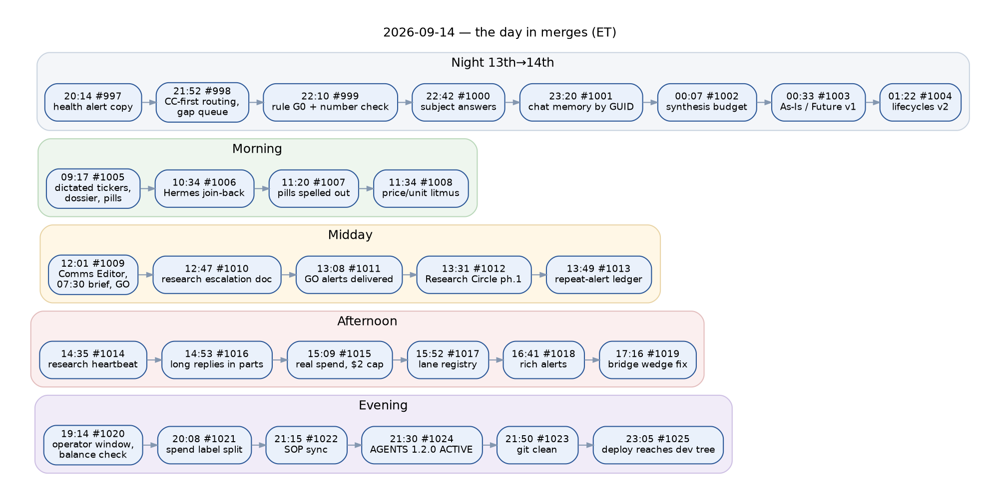
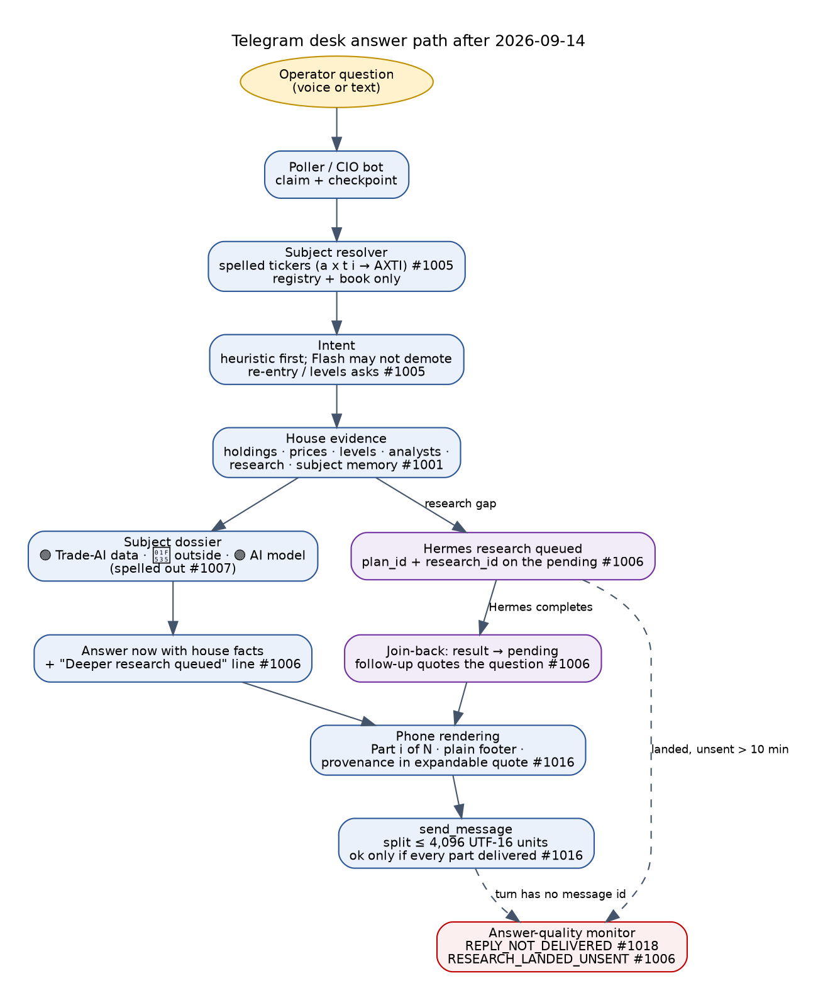
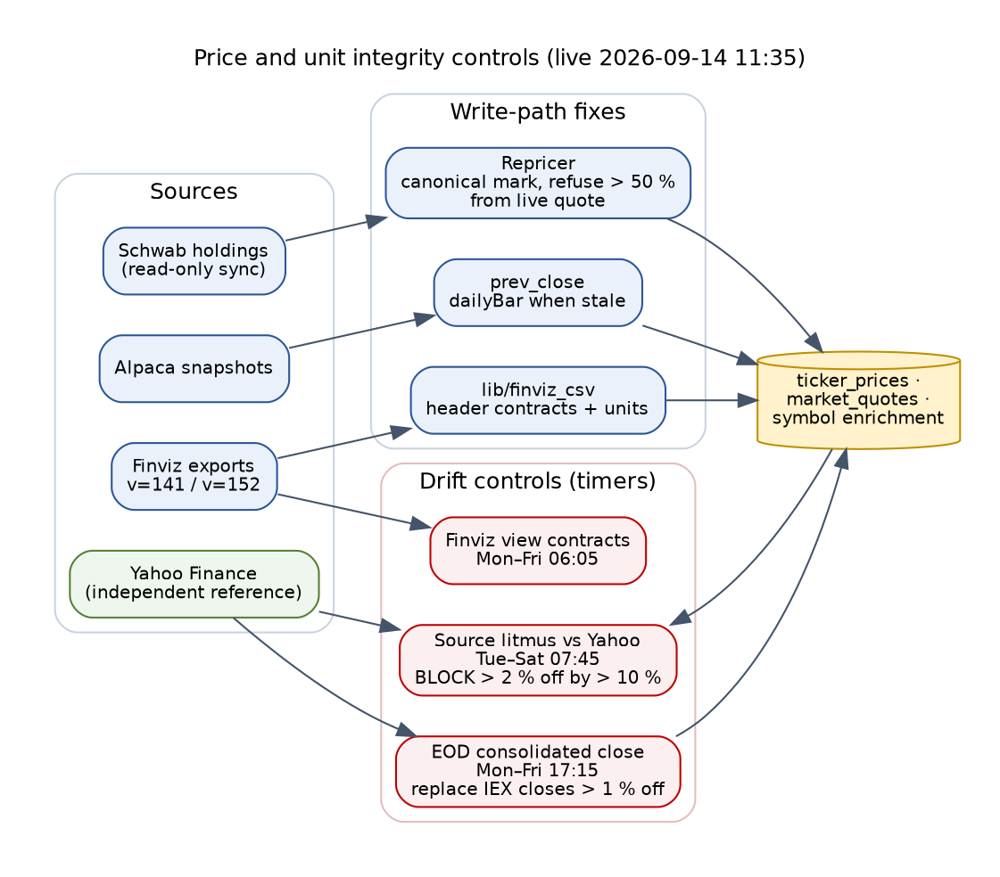
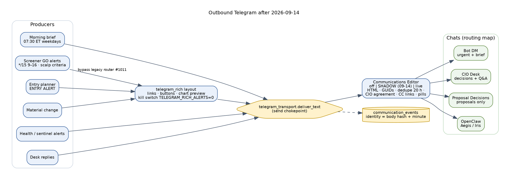
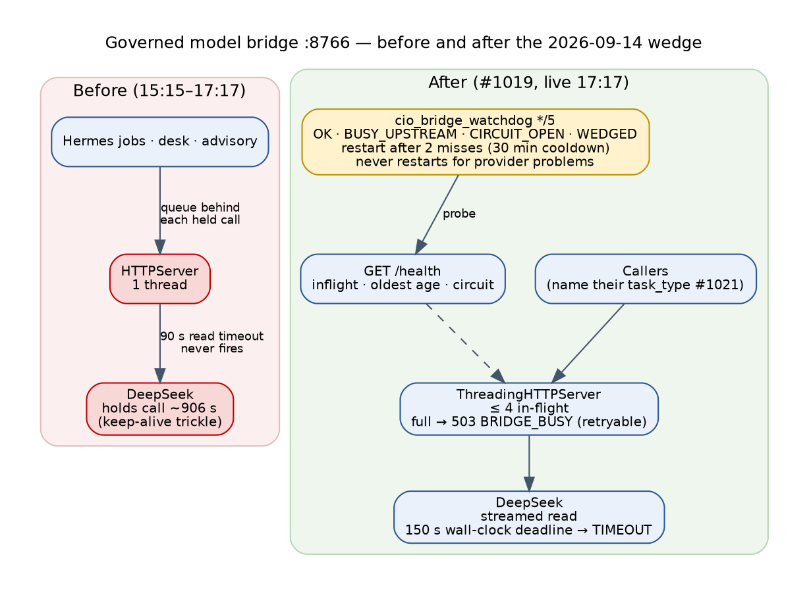
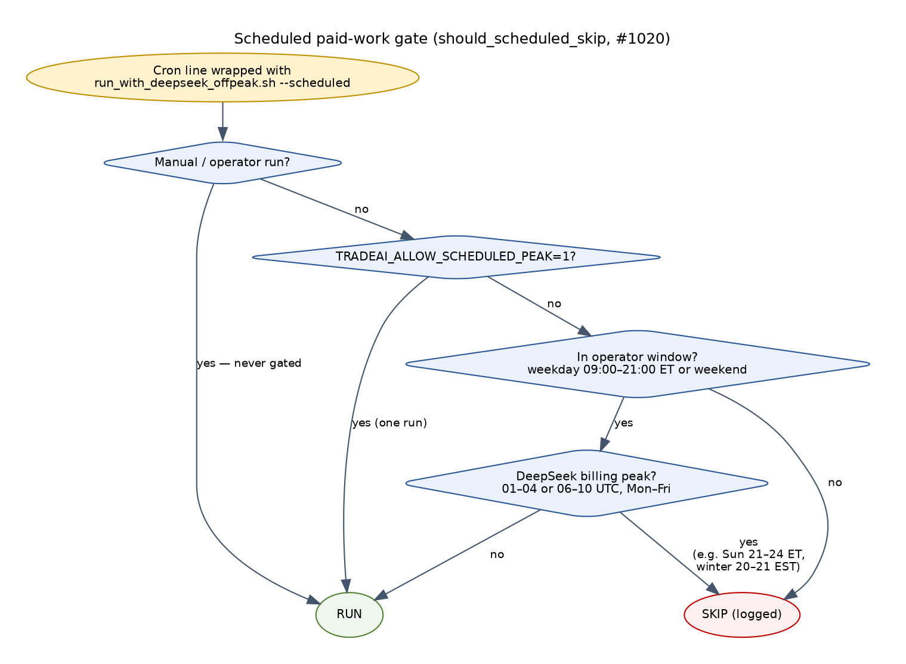
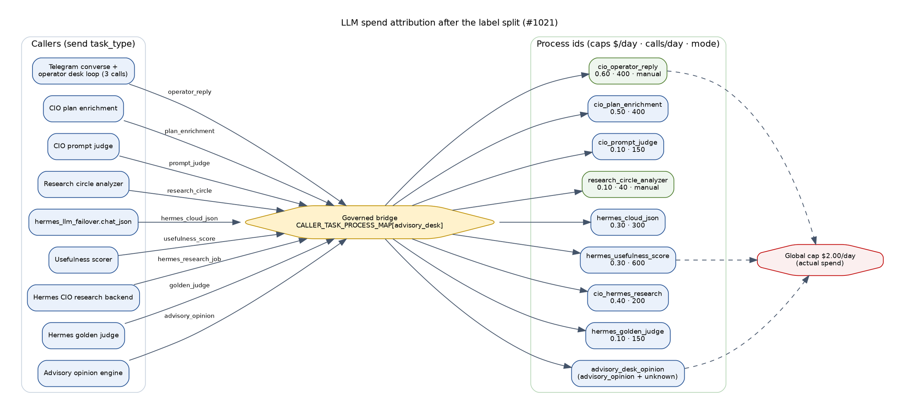
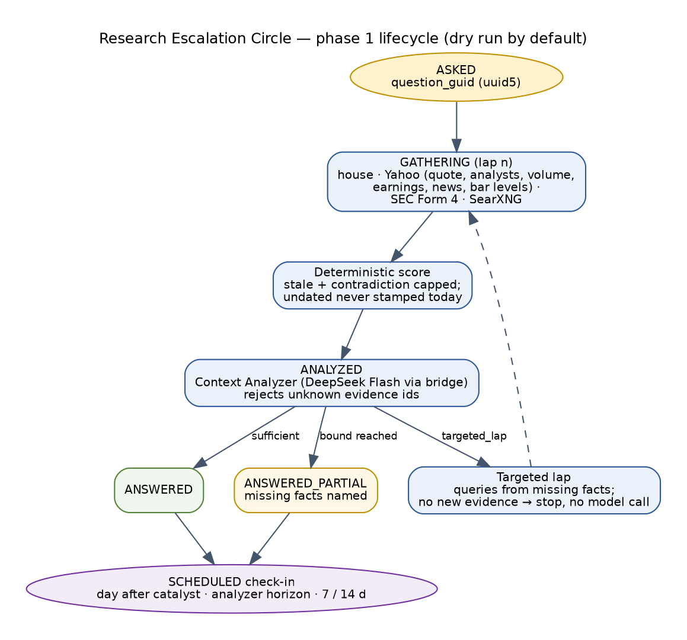
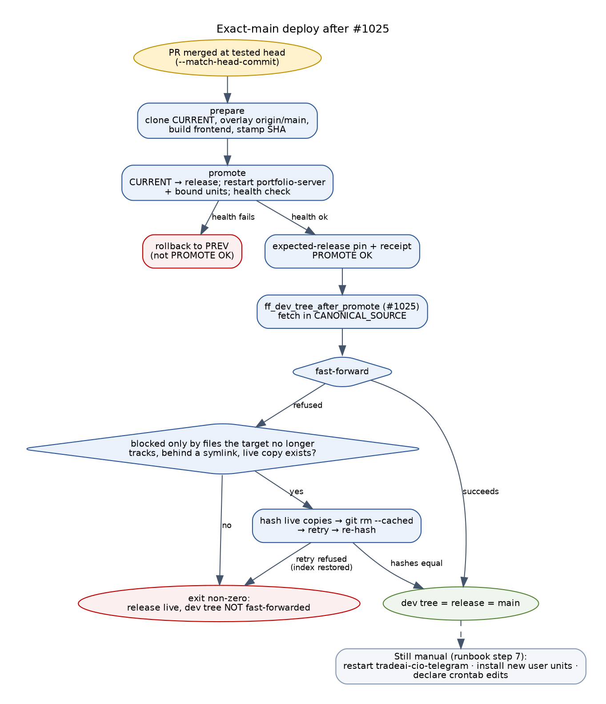

# Trade AI — Work Log: everything changed from 2026-09-13 20:00 to 2026-09-14 23:44

```
Status:        ACTIVE
Updated:       2026-09-14 23:44 EDT
Covers:        2026-09-13 20:00 EDT (PR #997 merge) → 2026-09-14 23:44 EDT
Live at:       341bce2c1 (PR #1025) — origin/main = release CURRENT = dev tree; dev tree git status empty
Author:        Claude Code session af450ed8 (operator John), from PR bodies, deploy receipts, crontab backups,
               memory notes and live read-only checks. Every time is America/New_York unless marked Z.
Authority:     READ_ONLY_ADVISORY. MBI_BEHAVIOR = 0. Broker execution subsystem untouched.
Companions:    TRADE_AI_AS_IS_2026-09-14.md · TRADE_AI_FUTURE_STATE_2026-09-14.md ·
               TRADE_AI_AS_IS_LIFECYCLES_2026-09-14.md · TRADE_AI_FUTURE_STATE_LIFECYCLES_2026-09-14.md ·
               RESEARCH_ESCALATION_2026-09-14.md · lifecycles/LIFECYCLE_FACTBASE_{A..F}_2026-09-14.md
```

This log is the record of one working day on the platform. It lists every merged change with its
merge time and live commit, the incident or operator request behind it, the evidence it shipped
with, the host changes made outside git, the operator decisions taken, and what is still open.
The As-Is and Future-State documents were updated from it; where they differ, this log records
what changed and they record the resulting state.

---

## 1. Summary

| Measure | Value |
|---|---|
| Pull requests merged and deployed | **29** (#997–#1025), all live |
| Releases promoted on 2026-09-14 | **22** (`c594d8600` 00:07 → `341bce2c1` 23:06) |
| Live commit at close | `341bce2c1` — main = release = dev tree; `git status` empty |
| Governance | `AGENTS.md` Policy-Version **1.2.0 ACTIVE**, Effective-Date 2026-09-14 (operator approval, PR #1024) |
| Global LLM spend cap | **$2.00/day of actual spend** (was $0.50 nominal, $7.00 forgotten override, $1.50 on the server) |
| Scheduled paid work | inside the operator window: weekdays 09:00–21:00 ET or weekends, never at DeepSeek billing peak |
| New timers / cron lanes | source litmus, Finviz view contracts, EOD consolidated close, screener GO alerts, bridge watchdog, DeepSeek balance snapshot, spend texts (daily/weekly/monthly), morning brief 07:30 |
| Lane registry | 107 declared lanes (73 ACTIVE), 0 undeclared, clean |
| Incidents found and fixed | dictated ticker; research not delivered; unlabelled pills; corrupt prices and units; duplicate briefs and lost GO alerts; alert ledger collisions; research queue 62 % failing; long replies refused; model bridge wedged; phantom spend and caps; shared spend label; dirty git; deploy that did not reach the dev tree; a date-dependent test; expired Google token |
| Open verification | label split on real traffic (09-15 10:03 ET check), 09:05 holdings run, 07:05 spend text, Communications Editor shadow → live review, research circle phases 2–4 |



---

## 2. Every change, in merge order

Merge times are when GitHub merged the PR; each was promoted within minutes (release directory
timestamps in Appendix A). "Evidence" is what the PR shipped with.

| # | Merged (ET) | Live commit | Change | Why (trigger) | Evidence shipped |
|---|---|---|---|---|---|
| #997 | 09-13 20:14 | `c00e23eda` | Data-source-health alert rewritten for the operator: what each source feeds, what is wrong, next run, action; engineer detail at the end | first live alert printed cron strings; operator asked "what does this mean to me" | acceptance 162 PASS; 44 decay tests |
| #998 | 09-13 21:52 | `8513d12e9` | One reply chokepoint with a Sources line; house facts first; subject resolution (misroutes 14 → 0 on 36 real questions); symbol-scoped re-entry; one writer for `data_gap_registry`; resolved only on proof; ETA-aware expiry; agent narrative input cap 4,000 → 8,000 | SCHG got the whole book; a seasonality answer claimed cash was empty | acceptance 162 PASS; 211 tests; dry run SCHG gap #74 |
| #999 | 09-13 22:10 | `73a977a3b` | Rule G0 "use only supplied facts" in every agent contract; number check after every answer; demote to RESEARCH_MORE at ≥ 3 unsupported numbers and ≥ 50 % | operator asked that agents use Command Center data only | calibration over 300 stored results; 164 PASS |
| #1000 | 09-13 22:42 | `99e1925ec` | Named-stock answers: price, 30-day move, levels, analysts with age, research, "what this means"; honest pending-close text; checked DeepSeek summary | SpaceX close said "within 2h" at 9.4 h; Visa got options-desk rows | V dry run; 339 tests |
| #1001 | 09-13 23:20 | `a8a62217e` | Chat remembers each company by subject GUID; `operator_conversation` registry domain; Moomoo sync lane declared | operator asked for memory recall per subject | V recall dry run; 201 tests |
| #1002 | 09-14 00:07 | `c594d8600` | CIO synthesis prompt budget (newest 2 results per agent, 40,000 chars); synthesis cron cap 16,000 → 32,000 | DXCM synthesis failed 26×; CRXP 86 results would fail | CRXP 57.8k → 4.2k tokens |
| #1003 | 09-14 00:33 | `9a593e85a` | Platform docs sync 09-12..14; whole-platform As-Is and Future-State v1 | operator asked for all docs current | 184 doc tests |
| #1004 | 09-14 01:22 | `59d02f788` | Lifecycle As-Is and Future-State v2 (26 lifecycles, 57 feedback edges) + six fact bases | v1 rejected as "a snapshot, not the complete picture" | six read-only measurement passes |
| #1005 | 09-14 09:17 | `e7404e9e5` | Dictated tickers (`a x t i`) resolve; Flash may not demote a re-entry ask; freeform facts carry price and levels; subject dossier with 🟢/🔵/🟣 pills; Origin line on every reply | 08:23 AXTI reply said DATA_UNAVAILABLE while the house held it all | real-question dry run; 345 tests |
| #1006 | 09-14 10:34 | `94b5f6f82` | Hermes research joined back to the operator's pending question by id; research-only asks answered now with house facts; failed runs close immediately; monitor `RESEARCH_LANDED_UNSENT` | HPE research finished 09:16; operator never received it | real-ledger dry run: fulfilled=1 |
| #1007 | 09-14 11:20 | `afb63dcc8` | Pills spelled out: `🟢 Trade-AI data` · `🔵 Looked up outside Trade-AI` · `🟣 AI model (DeepSeek)`; a Key line on every reply | "I don't know what the color bubbles represent" | 181 tests |
| #1008 | 09-14 11:34 | `a3e7f94b6` | Repricer uses canonical mark (never position value); Alpaca prev_close from `dailyBar`; Finviz CSV parsed by header with contracts and explicit units; unit-aware consumers; Alpha Vantage health and symbol selection; litmus and view-contract tools; retention FK guard; EOD consolidated closes; three timers | "Garbage in, garbage out. This is critical." XLI stored 7.49 vs 169 | repricer dry run 9 corrected; litmus BLOCK on market_quotes |
| #1009 | 09-14 12:01 | `32897e80a` | Communications Editor at the send chokepoint (off/shadow/live); one 07:30 ET brief; chat routing map; "CIO Run Complete" noise removed; scalp GO criteria and screener GO alerts | 50 duplicate briefs, 299 raw-Markdown messages, 0 GO alerts since 07-13 | ARMP A+ and ELMT qualify |
| #1010 | 09-14 12:47 | `f8cb65638` | Research escalation measured and documented; Research Escalation Circle design; AGENTS "What 2026-09-14 taught" | "when does Hermes / Brave / DeepSeek hand off?" | code, flags, receipts, 88 tests |
| #1011 | 09-14 13:08 | `091a68efb` | GO alerts bypass the legacy digest router; a failed send is not recorded as sent | ARMP/ELMT filed as telemetry and suppressed | delivery confirmed 13:15 |
| #1012 | 09-14 13:31 | `3c2383044` | Research Escalation Circle phase 1: question GUID, free channels, deterministic score, grounded Context Analyzer, targeted second lap, check-ins (dry run by default) | operator: "an escalation circle with some intelligence" | HPE 2 laps, ANSWERED_PARTIAL; ELMT sufficient |
| #1013 | 09-14 13:49 | `65183522c` | Repeated alerts get their own ledger identity (body hash + minute) | 638 events for 638 openings; 14,163 illegal settles | 39 comms tests |
| #1014 | 09-14 14:35 | `06b9695ff` | Research heartbeat: queue lane, projection lock, restore lost requests, replay transients, guard false positives masked, health score reads research, escalation retries fixed (rc=127) | 136/219 requests failed; 32 lost; 36,365 dead retries | 12 restored, 1 replayed live |
| #1016 | 09-14 14:53 | `97ffd8ab2` | Long desk answers sent as ordered parts; phone rendering; undelivered replies logged as such | AXTI 4,571-char answer refused silently | 2 parts, 1,695 + 2,672 units |
| #1015 | 09-14 15:09 | `f8881c10e` | Real spend by provider/model/process; scheduled vs ad hoc; peak vs off-peak; Spend panel; daily/weekly/monthly Telegram texts; calibrated reservations; one $2.00 cap | "$7 limit but we never go above 7 cents" | real $4.73/wk vs projection $214.61 |
| #1017 | 09-14 15:52 | `3cc0bfb73` | Four research_scheduler cron lanes declared | cap change made 4 lines undeclared | lane registry clean |
| #1018 | 09-14 16:41 | `71979c627` | Rich GO, entry and material-change alerts: links, buttons, chart preview; `REPLY_NOT_DELIVERED` monitor | "no rich HTML context in Telegram" | ARMP renders 797 units |
| #1019 | 09-14 17:16 | `2e8ca5fd1` | Model bridge: 150 s wall-clock upstream deadline, threaded server with 4 in-flight slots, `GET /health`, watchdog every 5 min | DeepSeek held calls ~906 s; single-threaded bridge blocked everyone | 13 tests; /health < 20 ms live |
| #1020 | 09-14 19:14 | `eae7bfd5f` | Scheduled paid work only in the operator window and never at DeepSeek peak; spend checked against DeepSeek balance hourly | operator window rule; verify DeepSeek's real prices | gate 8 cases; rebill $5.42 vs $5.45 |
| #1021 | 09-14 20:08 | `0162d0f19` | Shared `advisory_desk_opinion` label split into eight named callers with their own caps | 88 % of spend under one unattributable id | 8-process label tests |
| #1022 | 09-14 21:15 | `d5a073a15` | AGENTS.md and reference docs record today's SOPs, traps, pricing and operator window; bridge MemoryMax in the repo unit | "validate everything is documented" | policy tests, release proof |
| #1024 | 09-14 21:30 | `839e86e2e` | AGENTS.md Policy-Version 1.2.0 ACTIVE on the operator's approval, bound to PR #1022 head `ad5c533b2` | operator sent `APPROVE_AGENTS_POLICY_1_2_0` | 55 policy/SOP tests |
| #1023 | 09-14 21:50 | `66a4250d7` | Three data files served from persistent state untracked; `archive/weekly/` ignored | dev tree never reported clean | temp-index dry run: status empty |
| #1025 | 09-14 23:05 | `341bce2c1` | `promote` fast-forwards the dev tree (or fails loudly), handling only the symlinked-untracked case automatically | a deploy said success with the dev tree on the old commit | 7 tests; first live run succeeded |

Also on 09-14, outside a PR: `test_research_circle_20260914` lifecycle test dated its evidence from
the real clock (it broke `cio-hardening` on main at 00:00Z); the fix rode #1022.

---

## 3. Incidents and root causes

### 3.1 Desk answers (AXTI, HPE, pills, long replies)

| When | What the operator saw | Root cause | Fix |
|---|---|---|---|
| 08:23 | "What is a x t i price…" → price and levels DATA_UNAVAILABLE | voice dictation spelled the ticker; Flash reclassified the ask as freeform; freeform context had no price or levels | #1005 |
| 09:12 | HPE research ask → a queue ticket, no facts; research never arrived | pending waited for a promoted HRI row the Hermes worker never writes | #1006 (delivered 10:36) |
| 10:36 | "I don't know what the color bubbles represent" | pills defined in two places, unlabelled on follow-ups | #1007 |
| 13:47 | AXTI question → silence ("5 minutes no reply") | 4,571-character answer over Telegram's 4,096 UTF-16 limit; plain retry refused; log said "replied" | #1016 (parts), #1018 (monitor) |



### 3.2 Data integrity (#1008)

| Defect | Evidence | Effect | Fix |
|---|---|---|---|
| Repricer wrote a fractional position's **value** as its close | XLI 7.49 vs 169; NOC 123 vs 531; SCHG 8.05 vs 35 (9 of 25 holdings) | XLI sector RS −94.9 reached an operator answer | canonical mark, else value ÷ shares; refuse > 50 % from live quote |
| Alpaca `prev_close` from `prevDailyBar` | HPE 55.23 vs Friday 62.09 | false +12.4 % day | `dailyBar.c` when the bar predates today ET |
| Finviz read by column position | two hand "COL-FIX" edits | silent column shift | `lib/finviz_csv` DictReader + required-header contracts |
| Finviz units mislabelled 1,000× | market cap in millions stored as `market_cap_b` | $50B floor admitted $50M names | unit-aware consumers |
| Alpha Vantage health "unknown" since 05-09 | cron does not source `.env` | lane invisible | `.env` fallback; holdings-first selection |



### 3.3 Communications (#1009, #1011, #1013, #1018)

| Finding (5 Telegram exports) | Evidence | Fix |
|---|---|---|
| Duplicate morning briefs | 50 identical in 16 days, most at ~20:00 ET | one brief 07:30 ET weekdays; 20:00 and 08:05 senders retired (#1009) |
| Literal Markdown | 299 messages with raw asterisks | Communications Editor (HTML), rich layouts (#1009, #1018) |
| CIO Desk noise | 86 of 95 were "CIO Run Complete" | no check-in without an advisory action |
| Wrong chat | health/stop alerts in the Proposal Decisions group | routing map: DM · CIO Desk · proposals · OpenClaw |
| No GO alerts since 07-13 | GO rows every week in `trade_ai_scans` | scalp GO criteria + screener GO alerts (#1009); router bypass (#1011) |
| Repeated alerts collided in the ledger | 638 events for 638 openings; 14,163 illegal settles | body-hash + minute identity (#1013) |



### 3.4 Research heartbeat and the model bridge (#1014, #1019)

| Defect | Measured | Fix |
|---|---|---|
| CIO Hermes queue failing | 136 / 219 in 7 days (62 %); 13 / 18 in 24 h | lane `cio-hermes-queue`, health score reads it |
| Requests lost | 32 missing from a 30 MB unlocked projection | `projection_transaction` flock; `restore_lost_requests` |
| Transients never retried | 22 circuit/disconnect + 8 provider errors | classified retryable; `replay_retryable_failures` |
| Guard false positives | 63 refusals quoting third-party labels | labels masked; one guarded rewrite |
| Auto-fix dead | 36,365 retries exited 127 since 08-07 | `resolve_relative_venv` |
| Bridge wedged from 15:15 | DeepSeek held calls ~906 s; single-threaded server; `/health` absent | deadline 150 s, 4 threads, 503 BRIDGE_BUSY, `/health`, watchdog, MemoryMax 768M |



### 3.5 Spend truth, the operator window and the label split (#1015, #1017, #1020, #1021)

| Question the operator asked | Measured | Change |
|---|---|---|
| "$7 limit but we never go above 7 cents or 50 cents" | real $4.73 / week; cap ledger counted $5.50; worst-case projection $214.61; live cap a forgotten $7.00 override | caps count actual spend; one $2.00/day cap; calibrated reservations (#1015) |
| Which LLM, which process, peak or off-peak, daily/weekly/monthly | week of 09-07: $5.45, 38 % on peak; Advisory Desk 8,424 scheduled peak calls | Spend panel `/v3/consumption`; Telegram texts 07:05 / Mon 07:10 / 1st 07:15 (#1015) |
| Was last week backfill or status quo? | mostly a one-time usefulness backfill (09-06 → 09-09); status quo ≈ $0.49/day | — |
| Could peak work run off-peak? Verify DeepSeek's prices | peak 01–04 and 06–10 UTC Mon–Fri at double; flash off-peak $0.003 hit / $0.15 miss / $0.60 out per 1M; rebill $5.42 vs $5.45 | operator window gate; timers moved; hourly balance reconciliation (#1020) |
| Who spent the money? | 88 % under `advisory_desk_opinion`, shared by ≥ 6 callers | eight named callers with own caps (#1021) |





### 3.6 Research Escalation Circle, phase 1 (#1010, #1012)

Measured first (#1010): no quality-based escalation existed; for operator questions Brave was
off and Hermes was the only step that ran; Brave spilled to SearXNG only on quota or 429.



Next phases (not built): Brave when the analyzer names it; Hermes over house + web evidence; critic
and DeepSeek Pro; check-in sweep REVISITED → SETTLED; desk wiring behind a flag.

### 3.7 Git, deploy and the dev tree (#1023, #1025)

| When | What happened | Fix |
|---|---|---|
| 20:10 | a regenerate step meant for a worktree ran in the live dev tree and staged 119 files (`git add -A`); the commit hook refused | list saved; only those paths unstaged; working files untouched |
| 20:10 | `sync_cio_process_caps.py --help` ran a live upsert (no argument parsing) | values matched the registry; recorded as a trap |
| 21:50 | three tracked files behind `data/runtime` / `data/audit` symlinks showed as deleted | untracked (#1023) |
| 21:51 | the deploy's `git merge --ff-only && git log` swallowed a refused fast-forward and reported success | index-only fix by hand (hashes unchanged), then #1025 |
| 23:06 | first live run of promote's new step | "dev tree fast-forwarded to 341bce2c1" |



### 3.8 Other incidents

- **OpenClaw weekly "Gemma4:26B on Volken Intel B50" job** (09:03–09:25): timed out, misnamed the GPU, delivered garbled tool text, and did not use the local model (it ran on ChatGPT). Operator chose **Disable**; row kept.
- **Date-dependent test** (00:00Z → 21:1x): `test_a_lap_writes_the_lifecycle_only_when_applied` dated evidence 09-14 while `run_lap` reads the real clock; broke `cio-hardening` on main at UTC midnight. Fixed by dating that test's evidence from the real clock.
- **Google token for mcporter** failing since at least 09-01 ("gcloud auth print-access-token returned empty"). Operator re-authenticated at 23:4x; refresh succeeded.
- **Answer-quality alert at 23:22Z**: all three findings were turns asked before the day's fixes deployed (AXTI 13:47 before #1016; HPE 09:12 before #1006).

---

## 4. Operator decisions recorded

| Time | Decision (operator's words where given) | Implemented |
|---|---|---|
| 09-13 ~21:00 | Reconnect the desk to the gap queue | #998 |
| 09-14 ~09:05 | Architect gaps: quarantine corrupt prices (archive + tripwire); schedule the commitment sweep; gap resolver live for free vectors; Comms Editor shadow 1 trading day then live | partly — see open items |
| 09-14 ~09:12 | Disable the OpenClaw Gemma job | disabled, row kept |
| 09-14 ~10:40 | Data integrity: "1. approve 2. yes 3. yes 4. yes or finviz or schwab" — fractional Schwab price (consumer-side); retention may hard-delete with FK guard; schedule litmus and view contracts; consolidated EOD closes (Yahoo) | #1008 |
| 09-14 ~11:00 | Comms: routing map yes; one 07:30 ET weekday brief; GO alerts on Trade-AI scalp criteria incl. social; noise → digest | #1009 |
| 09-14 ~14:00 | Caps count actual spend; durable $2.00/day global cap; retire the $7 override | #1015 + host cap consolidation |
| 09-14 ~16:00 | "install the bot API and let's make this happen" (rich Telegram) | #1018 |
| 09-14 ~18:40 | Operator window: "9 a.m. to 9 p.m. Eastern … and on the weekends, and only a la carte stuff that is urgent, that's requested by the operator, is ran during peak hours"; then "yes" to the five proposals | #1020, #1021 |
| 09-14 ~21:20 | "fix everything now" (SOP on main, git clean) | #1022, #1023 |
| 09-14 ~21:25 | `APPROVE_AGENTS_POLICY_1_2_0` (activates every PROPOSED 1.2.0 row) | #1024 |
| 09-14 ~23:10 | "add the fix to the repo" (deploy fast-forward) | #1025 |
| 09-14 ~23:15 | Check the label split tomorrow morning | scheduled 09-15 10:03 ET |
| Pending | Thesis catalog v2: approve / revise / reject 28 theses and 5 re-curation cadences | awaiting operator |
| Pending (dismissed) | Strategy approval baseline and thesis-catalog wiring questions | on hold by operator |

---

## 5. Host and runtime changes outside git

| Time | Change | Backup / receipt |
|---|---|---|
| 09-13 22:46 | Moomoo read-only sync re-enabled | `crontab_backup_before_moomoo_reenable_20260913224613.txt` |
| 09-14 09:25 | OpenClaw cron job `e7b71848…` disabled | `openclaw cron get` → enabled False |
| 09-14 11:00–11:03 | Crontab: brief 08:00 → 07:30; 08:05 delivery and 20:00 aegis duplicate commented out | `crontab_backup_20260914_1100.txt` |
| 09-14 11:35 | Timers enabled: source litmus, Finviz view contracts, EOD consolidated close | systemd user units |
| 09-14 12:02 | Comms Editor mode file `~/.config/tradeai/comms_editor_mode` = shadow; GO alerts cron `*/15 9-16 * * 1-5` | `crontab_backup_pre_go_1202.txt` |
| 09-14 15:11 | Cap consolidation: one `~/.config/tradeai/llm_global_daily_usd_cap.env` = 2.00 via `99-llm-global-cap.conf`; $7.00 and $1.50 overrides archived with a tripwire README; six inline cron values; three spend-text cron lines | `crontab_backup_pre_spend_1511.txt` |
| 09-14 17:18 | Bridge watchdog cron `*/5`; bridge restarted onto #1019 | `crontab_backup_pre_bridge_watchdog_20260914T171856.txt` |
| 09-14 18:18 | Bridge drop-in `90-memory.conf` MemoryMax=768M | systemd drop-in |
| 09-14 19:16 | Operator-window schedules: holdings 08:00 → 09:05; scorer and DDQ wrapped `--scheduled`; flash market 9–19; balance snapshot `50 * * * *`; lessons-reflect 19:40; shadow-seed 19:45; cache-worker drop-in 09..19 ET | `crontab_backup_pre_offpeak_20260914T191645.txt` |
| 09-14 20:10 | Bridge restarted at 0 in-flight onto the label-split map; `llm_process_config` caps synced for 8 processes | live `/health` |
| 09-14 23:4x | Google credential re-authenticated (operator); mcporter token refresh succeeded | unit Result=success |
| Live now | crontab 511 active lines; lane registry 107 declared / 73 ACTIVE / 0 undeclared | `check_lane_registry.py` clean |

---

## 6. Governance and documentation

- **AGENTS.md 1.2.0 ACTIVE** (Effective-Date 2026-09-14). Activates the multi-agent SOP controls
  (session receipts, worktree identity, file leases, changed-file quality), the guarded push/deploy
  approval workflow, the `delivery_owner` rule, reply and data-gap rules, the MAJOR §7A/§17
  data-source ownership change, the $2.00 cap, and today's SOPs: replies split at 4,096 UTF-16 units;
  callers name their task type; bridge liveness (deadline, slots, /health, watchdog); diagnose at the
  bridge first; balance reconciliation; the operator scheduled-work window; six tooling traps.
- **Reference docs updated today:** `GOVERNED_MODEL_BRIDGE.md`, `CIO_TELEGRAM_PRODUCT_STANDARD.md`,
  `RESEARCH_PRIORITIZATION.md`, `HEALTH_AGENT.md`, `LLM_SPEND.md`, `RESEARCH_CIRCLE.md`,
  `RESEARCH_ESCALATION_2026-09-14.md`, `GAP_RESOLUTION.md`, `OPERATOR_REPLY_ROUTING.md`,
  `FEATURE_TO_LIVE_DEPLOY_RUNBOOK.md` (promote now fast-forwards the dev tree), `CHANGELOG.md`.
- **This documentation set** (As-Is, Future State, lifecycle pair, six fact bases, research escalation,
  this log) re-issued as Word documents with diagrams, published to Google Drive and in the repo.

---

## 7. Research and advisory work products (not code)

| Product | State | Where |
|---|---|---|
| Research & Spend Matrix | published | claude.ai artifact `aeaa0c42-8699-4832-bbf9-e3178cfc756f` |
| Thesis Catalog v2 — 28 theses in 10 families (calendar & politics, geopolitics & defense, macro & rates, AI infrastructure, secular growth, mispriced quality, income, financials, events, risk & hedges), 5 proposed re-curation cadences, a "considered and not proposed" list | **awaiting operator decisions**; v1 errors corrected (missed Iran/Hormuz, rate thesis reversed to hikes, no midterm cycle, BDCs, AI capex counter-thesis, SpaceX unlocks) | claude.ai artifact `2c65d016-be50-4014-8ef5-fa02b06b2e95` (decisions saved in its database) |
| Strategy wiring finding | 22 strategy YAMLs; persistent CIO/desk agents do not read them; no operator approval records; discovery lane idle | on hold by operator |

---

## 8. Open items and verification schedule

| Item | Check | When |
|---|---|---|
| Label split on real traffic | `llm_consumption_log` rows under the 8 new ids; operator replies manual | **09-15 10:03 ET** (scheduled) |
| Operator-window schedules | 09:05 holdings run; gated scorer/DDQ; balance snapshot history growth | 09-15 daytime |
| Spend text | 07:05 text shows outside-window and balance lines | 09-15 07:05 |
| Communications Editor | review one trading day of shadow receipts, then switch to live (already approved) | after 09-15 close |
| Rich GO / entry alerts | first market-hours alerts render with links and buttons | 09-15 market hours |
| Research circle | phases 2–4 (Brave on demand, Hermes over web evidence, critic + Pro, check-in sweep, desk wiring) | not started |
| Architect gaps still open | quarantine corrupt prices; commitment sweep cron; gap resolver live; finding ledger; unit install in deploy; restore drill | per plan |
| Deploy still manual | restart `tradeai-cio-telegram` after desk changes; install new user units | every deploy |
| Pre-existing failing tests outside CI | `test_cio_operator_desk_loop*` (3), `test_governed_agent_flash_market::test_scheduled_canary…`, `test_research_lane_health_alert::test_fix_hint_is_not_stale_import` and others noted in PRs | backlog |
| Thesis catalog and strategy approvals | operator decisions | operator |

---

## 9. Traps learned today

| Trap | Rule |
|---|---|
| Parallel shell calls share one working directory | give every command an explicit `cd` or `git -C` |
| `regenerate_generated_files.sh` runs `git add -A` | run it only inside a worktree; check staged names before committing |
| `sync_cio_process_caps.py` has no argument parsing | read `main()` first; treat any run as live |
| `Path.read_text`/`write_text` rewrite CRLF files | edit mixed-CRLF files byte-wise (bridge, caps sync, Telegram standard) |
| Registry JSON uses `\u` escapes | re-dump with `ensure_ascii=True`, indent 2 |
| `sys.modules` stubs leak across tests | load new modules by file path in tests |
| Worktrees lack `.venv` and live data | link the dev tree venv; some tests only pass in the dev tree |
| Docs index drifts after merging main | regenerate after every merge commit |
| Only 4 SOP evidence files are digest-bound | never sed the whole folder |
| `set -e` ignores failures inside `&&` lists | check the result explicitly; deploy now asserts dev tree = main |
| Tracked files behind a symlink look deleted to git | untrack them; `ff_dev_tree` handles the fast-forward |
| A test with a fixed date breaks at UTC midnight when the code reads the clock | date test evidence from the real clock or pass `now` |
| Telegram limits count UTF-16 units | split long bodies; a missing message id means not delivered |
| A held provider call can wedge a single-threaded server | wall-clock deadline, threads, /health, watchdog |
| Voice dictation spells tickers | resolvers must accept spaced and dotted letters |
| A bare "yes" to an either/or question is ambiguous | state the reading taken |
| Operator approval does not lift AGENTS §0 rails | find the consumer-side fix and say so |
| `gog drive upload --dry-run` uploads for real | search the folder first |

---

## Appendix A — Releases promoted on 2026-09-14

| Release directory (sha-label-timestamp) | PR |
|---|---|
| `c594d8600-main-exact-phase2-20260914-000703` | #1002 |
| `9a593e85a-main-exact-phase2-20260914-003355` | #1003 |
| `59d02f788-main-exact-phase2-20260914-012306` | #1004 |
| `e7404e9e5-main-exact-phase2-20260914-091759` | #1005 |
| `94b5f6f82-main-exact-phase2-20260914-103415` | #1006 |
| `afb63dcc8-main-exact-phase2-20260914-112033` | #1007 |
| `a3e7f94b6-main-exact-phase2-20260914-113442` | #1008 |
| `32897e80a-main-exact-phase2-20260914-120132` | #1009 |
| `091a68efb-main-exact-phase2-20260914-130816` | #1011 (includes #1010) |
| `65183522c-main-exact-phase2-20260914-135003` | #1013 (includes #1012) |
| `06b9695ff-main-exact-phase2-20260914-143551` | #1014 |
| `97ffd8ab2-main-exact-phase2-20260914-145326` | #1016 |
| `f8881c10e-main-exact-phase2-20260914-150934` | #1015 |
| `3cc0bfb73-main-exact-phase2-20260914-155243` | #1017 |
| `71979c627-main-exact-phase2-20260914-164205` | #1018 |
| `2e8ca5fd1-main-exact-phase2-20260914-171643` | #1019 |
| `eae7bfd5f-main-exact-phase2-20260914-191450` | #1020 |
| `0162d0f19-main-exact-phase2-20260914-200906` | #1021 |
| `d5a073a15-main-exact-phase2-20260914-211606` | #1022 |
| `839e86e2e-main-exact-phase2-20260914-213050` | #1024 |
| `66a4250d7-main-exact-phase2-20260914-215028` | #1023 |
| `341bce2c1-main-exact-phase2-20260914-230556` | #1025 |

## Appendix B — Sources

PR bodies #997–#1025 (GitHub); `~/.local/state/cio-phase2-exact-main/deploy_receipt.json`; release
directory names; crontab backups in the session scratchpad; `check_lane_registry.py`; `systemctl --user
list-timers`; bridge `/health`; memory notes of 2026-09-13/14; the session transcript.
