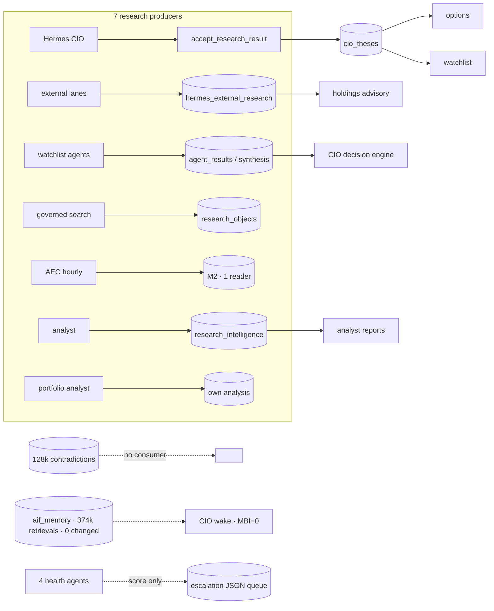
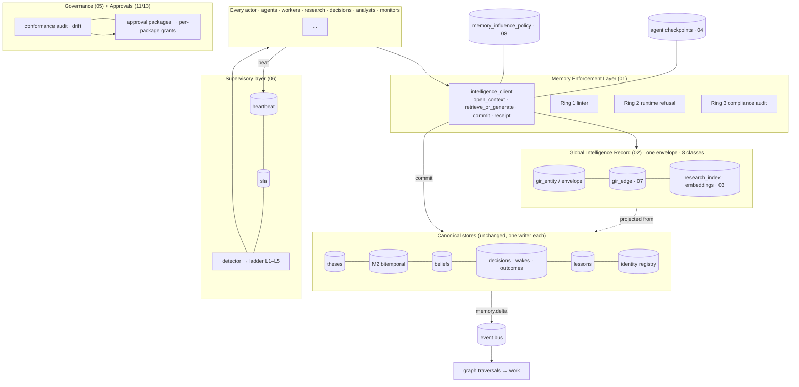

# 00 · Executive Package — Platform Cognitive Transformation to ≥ 4.7 / 5

```
Status:      PROPOSED (execution-ready package; no code, host, cron or install change is made by it)
as_of:       2026-09-27T18:00:00-04:00
Measured at: 8f2a178d5 (origin/main) / served 8f2a178d5-main-exact-phase2-20260927-171004 (CURRENT).
             Platform measurements cited from PLATFORM_INTELLIGENCE_DUE_DILIGENCE_2026-09-27.md are that
             report's (served eb09dcf10, dev 6bb71d258) and are tagged [DOC-CLAIM]; host facts read today
             are tagged [VERIFIED] with the command in §0.3.
Authority:   READ_ONLY_ADVISORY. MBI_BEHAVIOR = 0 is untouched by every document in this package.
             A blueprint is never a grant (AGENTS.md §22): every implementation item is behind the approval
             workflow in 11 and the consolidated Telegram gate in 13.
Requested:   operator 2026-09-27 — principal-architect challenge of the 09-27 due diligence
             (docs/briefs/WAVE_COGX_cognitive_maturity_4_7.md, verbatim).
Supersedes:  nothing. Extends PLATFORM_INTELLIGENCE_DUE_DILIGENCE_2026-09-27.md; its §12 waves 1–5 are
             re-planned by 09 once this package is approved.
```

## 0. How to read this package

### 0.1 Ask → answer map (the operator brief, §1–§11 and deliverables A–G)

| Brief | Ask | Answered in |
|---|---|---|
| §1 | Memory must become mandatory infrastructure: architecture, APIs, contracts, failure handling, compliance auditing | **01** |
| §2 | Global Intelligence Record: eight classes, eight envelope fields, one architecture | **02** |
| §3 | Research never done twice: semantic/deterministic/thesis/evidence/contradiction/citation/version lookup; duplicates → 0 | **03** |
| §4 | Persistent cognitive memory: working/episodic/semantic/procedural/long-term; thought continuity on restart | **04** |
| §5 | Silo governance: compliance scoring, conformance audits, automatic remediation, drift detection | **05** |
| §6 | Supervisory layer: heartbeat, ladder L1–L5, recovery workflows, autonomous remediation, no silent failures | **06** |
| §7 | Knowledge graph as operating system: every artifact graph-native | **07** |
| §8 | Memory influence > 80 % safely: shadow → advisory → weighted → enforced | **08** |
| §9 | Honest scores (current/true/projected/maximum), debts, Waves 1–5 | **09** |
| §10 | Top ten architectural changes | **00 §5** |
| §11 | Documentation (affected/new/obsolete/diffs/sequencing) | **10** (A) |
| §11 | Architecture transformation plan (current, target, changes, dependency map) | **00 §2** (B) |
| §11 | Approval package + six-stage workflow + criteria | **11** (C) |
| §11 | Installation and permission inventory | **12** (D) |
| §11 | Consolidated Telegram approval workflow | **13** (E) |
| §11 | Maturity roadmap to ≥ 4.7 | **09** (F) |
| §11 | Top 10 immediate actions | **00 §5** (G) |
| §11 | Implementation plan per wave (objectives, deliverables, dependencies, risks, effort, success criteria) | **09 §3**, summarised in **00 §3** |
| §11 | Executive summary (current/target maturity, gaps, risks, opportunities, outcomes) | **00 §1** |

Decisions the package rests on: ADR-006 … ADR-010 in `docs/architecture/adr/`.

### 0.2 Inputs, and one that was not found

Read: the 09-27 due diligence (`.md` and the emailed `.docx`); `HONEST_MATURITY_ASSESSMENT_2026-09-21-1905.md`
(4/10); `MATURITY_PLAN_4_TO_8.5_2026-09-21_ENHANCED.md`; the 09-07 research/agent maturity truth report
and its 20-domain CSV; the 08-24 memory architecture, bitemporal model and M2 migration design;
`AEC_PARALLEL_AGENTS_AND_MEMORY.md`, `agent-contracts.md`, `subject-memory.md`,
`CIO_FUTURE_STATE_FULL_MATURITY.md`, the v3.3 master architecture and its 09-27 status annex,
`AGENT_SERVICE_MAP_2026-09-25.md`, `ARCHITECTURE_INDEX.md`, `AGENTS.md` 1.3.0 (§4, §14, §15, §17, §20, §22).
Code was read at the chokepoints named in 01–08 (tagged `[CODE]`).

**Not found:** `TRADE_AI_CIO_AUTONOMY_MATURITY_DUE_DILIGENCE_2026-09-02.md` is absent from the
repository, every worktree, `~/trade-ai-audits` (the 09-02 campaign there is the Command Center
chief-architect run), Gmail and Google Drive `[VERIFIED: find / -xdev -iname '*AUTONOMY_MATURITY*';
Drive and Gmail searches, 2026-09-27]`. The operator chose to baseline the autonomy domains on the
09-07 truth report and the 09-21 assessment instead. If the 09-02 document surfaces, 09 §1 is the
section to reconcile.

### 0.3 Commands behind the `[VERIFIED]` tags in this package (read-only, 2026-09-27)

```
git -C ~/trade-ai-v12-rebuild/trade-ai-v12-rebuild rev-parse --short origin/main      → 8f2a178d5
readlink ~/trade-ai-releases/portfolio-server/CURRENT                                → 8f2a178d5-main-exact-phase2-20260927-171004
psql (read-only, :5432 trade_ai) SELECT extname, extversion FROM pg_extension         → btree_gist, pgcrypto, uuid-ossp, vector 0.8.6
python3 scripts/report_docs_inventory.py --check-index                                → drift on 1 pre-existing row (RELEASE_MANIFEST_LATEST.md)
.venv/bin/pip list (dev venv)                                                         → no redis/celery/kafka/neo4j/prometheus_client/opentelemetry/sqlalchemy; python-docx 1.2.0 present
cat ~/.cursor/approvals/grants.json (keys only)                                       → one entry per tier; active: cron, execution-engineering, git-push, release-write, service
```

## 1. Executive summary

**Where the platform is.** It has built far more intelligence than it uses `[DOC-CLAIM: 09-27 §1]`.
Thirty stores are written hourly; memory changed none of 22,392 wake decisions; research is produced
seven times; 128k contradictions are detected and none resolved; five queue styles and four health
agents coexist; self-repair measured M0 `[DOC-CLAIM: 09-07]`. The 09-27 report diagnoses three missing
joins — subject key, write path, read path — and plans five waves to add them.

**Why that roadmap stops short of 4.7.** It makes intelligence *available* and leaves every silo free
to ignore it. This package's honest assessment (09 §1) puts the platform at **1.8 / 5 today** (the
report's own scored rows average ≈ 2.2), **≈ 3.4 after the 09-27 waves**, and **≈ 4.75 only with four
additional pillars** proved at runtime:

1. **Memory enforcement, not memory availability** (01): one façade, three enforcement rings,
   fail-closed decisions.
2. **Research retrieval before any generation** (03): a seven-step ladder and a receipt without which
   the paid-call gate refuses.
3. **Supervisory orchestration with an SLA ladder** (06): heartbeat and SLA on every lane; L1–L5.
4. **Platform-wide governance** (05): twelve silos scored nightly on five standards; drift detected;
   non-conformance blocks promotion.

Underneath them: one **Global Intelligence Record** (02) with eight classes and one envelope; **persistent
cognitive memory** (04) that restores thought, not files; a **cognitive graph** (07) that produces work;
and a **graduated memory-influence path** (08) that reaches cognition and advice while the behaviour
rail stays at zero.

**Target.** ≥ 4.7 on every one of nine domains, measured by an independent lane, with the five §15
proofs observed on the served release on the same day — by the end of Wave 5.

### 1.1 Current and target maturity (house 1–5; detail and evidence in 09 §1)

| Domain | Claimed 09-27 | True | After 09-27 waves | Target (with pillars) |
|---|---|---|---|---|
| Memory | 3.5 / 1.5 | 1.5 | 3.5 | 4.8 |
| Cross-silo intelligence | 1.5 | 1.5 | 3.8 | 4.8 |
| Knowledge graph | 2.0 | 1.5 | 3.0 | 4.7 |
| Agents | 2.0 | 1.5 | 3.0 | 4.7 |
| Workers | 2.0 | 2.0 | 3.8 | 4.8 |
| Continuous research | 2.5 | 2.0 | 3.5 | 4.7 |
| Model routing | 2.5 | 2.5 | 4.0 | 4.7 |
| Decision intelligence | — | 2.0 | 3.2 | 4.7 |
| Operational reliability | — | 2.0 | 3.0 | 4.8 |

### 1.2 Critical gaps (what the 09-27 roadmap leaves open)

1. The Company Intelligence Record is optional to its callers.
2. A single write path stops divergence, not duplication: no retrieval precedes generation.
3. The worker contract has no supervisor; "escalate" appends to a JSON queue.
4. Decisions, agents, lessons, risks, operations and market state stay outside the record.
5. Memory influence is "an operator decision" with no graduated, measured path.
6. Agents resume by re-reading files; there is no cognitive state to restore.
7. Nothing measures whether a silo follows the standards, so regressions are silent.

### 1.3 Top risks

| Risk | Mitigation in the package |
|---|---|
| Decisions made on research memory already contradicts (128k candidates) `[DOC-CLAIM]` | contradiction lookup in the ladder (03 §3/§6); contradiction veto in influence modes (08 §6); adjudication queue W3 |
| Silent failures (exit-code gates, swallowed loops, `""` on refusal) `[DOC-CLAIM: 09-27 §1]` | SLA rows + output signals + `NO_OUTPUT` breaches (06 §8); chokepoint linting (01 Ring 1) |
| Plaintext DSNs sourced by cron `[DOC-CLAIM]` | S-1 before Wave 1 (11, 12 AC-3) |
| Fail-closed enforcement causing HOLD storms if the read model is slow | 2 s p95 SLA, circuit, L1 recovery, rollback criterion (11 §2) |
| Approval fatigue / grant collisions (`grants.json` one per tier) `[DOC-CLAIM: memory 09-27]` | one package per wave; per-package grants (13) |
| A number rising while proofs stay NOT OBSERVED | wave exit = proofs + number (09 §0) |

### 1.4 Top opportunities

1. Duplicate research generation measured and driven toward ≤ 1 % (03 §7) — the largest single cost
   and consistency win.
2. Every decision carries its provenance edges by construction (07 §3) — the M1/M2/M5 proofs become
   routine rather than heroic.
3. One approval message per wave replaces dozens of asks (13).
4. Lessons finally compound: one store, one queue, promoted procedures injected into every context (04 §5).
5. Four health agents become one ladder with receipts (06).

### 1.5 Expected outcomes (measured at Wave 5 exit; definitions in 01 §6, 03 §7, 08 §4, 06 §7)

| Measure | Now | Wave 5 |
|---|---|---|
| Wake/advice outputs with a memory receipt | ≈ 0 % (receipts exist only where hand-wired) | 100 % |
| Memory Influence Rate (advisory or stronger) | 0 % | ≥ 80 % (behaviour surfaces fixed at 0) |
| Duplicate generation rate | unmeasured | ≤ 1 % with named residual |
| Lanes with heartbeat + SLA row | minority | 100 % |
| Silos CONFORMANT | 0 / 12 (unmeasured) | 12 / 12 |
| Silent failures caught by a human first | the norm | 0 in 30 days |
| §15 proofs on served, same day | 1 / 5 (09-25) | 5 / 5, with commands |

## 2. Architecture plan

### 2.1 Current architecture (as measured 09-27)



Four key namespaces, five queue styles, three agent registries, no central model chooser, no SLA
ladder `[DOC-CLAIM: 09-27 §2–§9]`.

### 2.2 Target architecture



### 2.3 Required changes (the delta from 2.1 to 2.2)

| # | Change | Package | Kind |
|---|---|---|---|
| C1 | `intelligence_client` façade; Ring 1 linter + baseline; Ring 2 refusals at three chokepoints; Ring 3 audit | 01 | code (wraps existing) |
| C2 | `security_guid` everywhere; namespaced keys for non-company entities | 02 §3 | data re-key (09-27 W1) |
| C3 | Schema `intelligence` (entity, envelope, edge, research_index, embedding, supervisor.heartbeat/sla, approval_packages); projector | 02 §5, 06, 13 | infra (I-1) |
| C4 | Seven-step retrieval ladder + `RetrievalReceipt@v1` in front of seven producers; per-URL/day citation index | 03 | code |
| C5 | `CognitiveCheckpoint@v1`, restart protocol, `Procedure@v1` + one promotion queue | 04 | code + store |
| C6 | `PlatformConformance@v1` nightly; drift detectors; remediation classes; promotion gate (W5) | 05 | code + lane |
| C7 | Heartbeat on every lane; SLA rows; breach detector in the watchdog; ladder L1–L5; receipts | 06 | code + lane + sudoers review |
| C8 | Edge emission on every façade write; bus consumer runs traversals (fan-out from edges) | 07 | code |
| C9 | `memory_influence_policy.json`; counterfactuals in the shadow measure; promotion/demotion rules; kill switch | 08 | config + code |
| C10 | `ApprovalPackage@v1` ledger; consolidated Telegram message; per-package grants; `from_id` check | 13 | code + security |
| C11 | Retirements: duplicate detectors, two health agents, no-op timers, iris timer, shim decision | 12 SW-7 | operator |
| C12 | Documentation per 10 (this PR + per-wave PRs); AGENTS.md §13.8 amendment (proposed) | 10 | docs |

### 2.4 Dependency map

See 09 §4 for the wave-level graph. At component level: C2 → C1 → C3 → C4/C8 → C5/C9; C7 → C6 → gate;
C10 precedes every wave's execution; C12 rides every PR.

## 3. Implementation plan (summary; full per-wave tables in 09 §3)

| Wave | Objective | Key deliverables | Depends on | Main risk | Effort | Exit criteria (+ §15 proofs) |
|---|---|---|---|---|---|---|
| **1 Foundations** | measure everything, enforce nothing | façade (reads), Ring 1 baseline, subject key, GIR v1 + projector, ladder in shadow with receipts, heartbeat + SLA seeded, conformance v0, approval ledger + first Telegram package | W0 deployed; I-1; lane approvals | projector load; large baseline | ≈ 14 d | receipts ≥ 95 % research / 100 % wakes; DGR measured; heartbeat ≥ 90 % lanes; first package answered · **M5**, M4 |
| **2 Enforcement** | memory and retrieval become dependencies | Ring 2 refusals; commit + deltas on bus; six producer adapters; edge fan-out; L1–L3; filings feed; compliance report; citation index | W1; DSA rows; sudoers review | HOLD storms; downstream shapes | ≈ 20 d | DGR ≤ 10 %; read_before_act ≥ 0.99; MTTR L1 < 10 min; event→effect p95 ≤ 10 min · **M1, M2**, M5 |
| **3 Cognition** | continuity, lessons, adjudication, advisory influence | checkpoints + restart protocol; one lesson store + promotion; adjudication queue (Tier-2 judge); advisory rows; delta prompts | W2; advisory approvals | promotion queue ignored | ≈ 12 d | deterministic replay; ≥ 1 promoted lesson cited; contradictions falling; MIR ≥ 0.5 advisory; DGR ≤ 3 % · **M3**, M5 |
| **4 Unification** | one of everything | worker contract on all lanes; one agent registry; model chooser; graph-native decisions; L4–L5; semantic retrieval; weighted rows | W3 outcomes n ≥ 50; embedding model | chooser cost/quality mix | ≈ 18 d | 0 lanes without SLA; 1 registry; DGR ≤ 1 %; MIR ≥ 0.7; no double schedules · **M4**, M1–M3 |
| **5 Maturity** | enforced where earned; measured independently | enforced rows; conformance gate on promotion; L5 proposals applied; independent re-measurement; v3.4 architecture | W4; 60-day windows | number without proof | ≈ 10 d + windows | every domain ≥ 4.7 independently; MIR ≥ 0.8; 12/12 CONFORMANT; 0 silent failures / 30 d · **M1–M5 same day** |

## 4. Approval package (summary; itemised in 11, inventoried in 12, delivered via 13)

Operator (§17/§22): adopt the roadmap; six new lanes; new writers (DSA rows); retire no-op timers and
the iris timer; the shim decision; every influence-mode row; lesson promotions; registry consolidation;
AGENTS.md §13.8; conformance gate; desk restarts; exact-SHA deploys. Security: DSN rotation before
Wave 1; new Postgres roles + RLS; Telegram `from_id`; egress review; sudoers allowlist. Infrastructure:
schema `intelligence`; M2 production cutover; rotation/archive; unit installs; bus consumer capacity.
Software: one local embedding model; possibly one Python helper; **nothing else** (no graph DB, broker,
or monitoring stack). Budget: adjudication judge under the existing $2/day cap; ≈ 74 agent-days across
five waves; net LLM spend expected to fall and is measured monthly.

The first consolidated Telegram package (Wave 1) carries about fourteen items in one message (12 §4).

## 5. Top ten architectural changes I would make immediately (as CEO, CIO, Chief Architect and Head of AI at once)

1. **Make memory a dependency, today, in shadow.** Ship `intelligence_client` over reads, capture the
   chokepoint baseline, and write a consumption receipt on 100 % of wakes this week. Nothing changes
   behaviour; everything becomes measurable. (01)
2. **Refuse generation without retrieval.** Put the seven-step ladder in front of `gate_and_generate`,
   `enqueue_research_request`, the external lanes, the advisory opinion, the options lifecycle and the
   watchlist agents; log the duplicate-generation rate from day one; enforce in Wave 2. (03)
3. **One key, no exceptions.** `security_guid`/`issuer_guid` for companies; namespaced UUIDv5 keys for
   decisions, agents, lanes, lessons, risks, events; the façade refuses ticker strings. (02 §3)
4. **One record for all eight kinds of intelligence**, projected from the stores that exist, with one
   eight-field envelope and `UNKNOWN` counted rather than hidden. (02)
5. **Provenance by construction.** A decision cannot be written without `USED`, `CAUSED_BY` and
   `PRODUCED` edges from its context; the empty `evidence_refs` of 09-25 become impossible. (07)
6. **A heartbeat and an SLA row on every lane, and a ladder that acts.** L1 restarts, L2 alternates,
   L3 root-cause memory, L4 one page, L5 a topology proposal — each with a receipt. Retire two of the
   four health agents into it. (06)
7. **Score every silo nightly and let the score gate promotion.** Identity, memory, research, worker,
   monitoring; drift detectors over the registries; class-A remediation self-applied, B proposed, C
   operator-only. (05)
8. **Restore thought, not files.** A hash-chained checkpoint per agent per step; a restart protocol that
   reconciles what happened while it was down and resumes at `next_action`; lessons promoted into a
   single procedural store and injected into every context. (04)
9. **Graduate memory into cognition on a measured ladder** — shadow, advisory, weighted, enforced —
   per surface, with outcome-gated learning, contradiction and staleness vetoes, a diversity floor, a
   divergence budget, automatic demotion and a global kill switch. The behaviour rail stays at zero. (08)
10. **One approval message per wave.** An append-only package ledger in front of the guard, per-package
    grants that end tier collisions, `from_id` verified, 24 h windows with reminders, and a six-stage
    workflow whose every stage leaves an artifact. (11, 13)

Not on the list, deliberately: a new database, a new framework, a new bot, a rewrite. Every change above
wraps something that exists (v3.3 §5 "wrap-don't-rewrite").

## 6. Documentation plan (summary; full in 10)

This PR: fourteen package documents, five ADRs, the operator brief verbatim, header-level `Amended by`
/ `Extended by` lines on twelve existing architecture documents, seven new rows in
`ARCHITECTURE_INDEX.md`, a pointer in the v3.3 status annex, rows in the two hand-maintained indexes,
and the generated `docs/INDEX.md`. Per wave: the contracts, runbooks and body integrations listed in
10 §6, in the same PRs as the code. Wave 5: a v3.4 master architecture diffed against v3.3.

## 7. What this package does not do, stated at the top rather than in a footnote

- It changes no code, cron, unit, schema, secret, policy row or host state.
- It does not edit AGENTS.md; it proposes §13.8 text for the operator to see first (10 §5).
- It does not claim any maturity number as measured; every score in 09 is an assessment with its
  evidence tag, and Wave 5's independent lane produces the first measured set.
- It does not re-run the 09-27 measurements; where a number is cited it is that report's, tagged.
- The 2026-09-02 autonomy document it was asked to read was not found (§0.2).
- Operator-only items inherited from the 09-27 report remain operator-only: DSN rotation, the MBI
  cognition ladder, the no-op timers, the iris timer, `local_llm_compat`. The list should be shorter at
  every wave's closeout (AGENTS.md §14).
