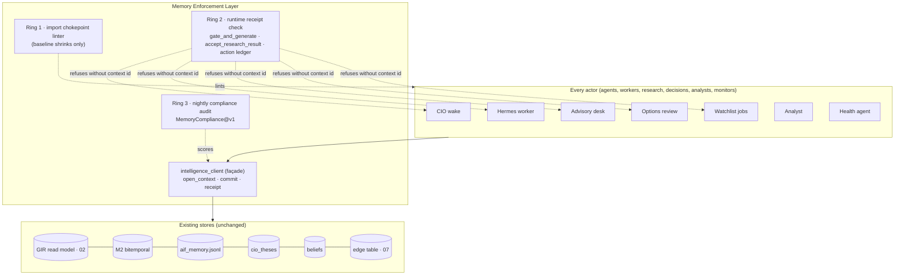

# 01 · Memory Enforcement Layer — memory as a platform dependency

```
Status:      PROPOSED
as_of:       2026-09-27T18:00:00-04:00
Measured at: 8f2a178d5 (origin/main) / served 8f2a178d5-main-exact-phase2-20260927-171004.
             Measurements cited from PLATFORM_INTELLIGENCE_DUE_DILIGENCE_2026-09-27.md are that
             report's (eb09dcf10 / 6bb71d258) and are tagged [DOC-CLAIM] here.
Authority:   READ_ONLY_ADVISORY. MBI_BEHAVIOR = 0 is untouched by every line below (AGENTS.md §0 rule 1).
             A blueprint is never a grant (AGENTS.md §22). Nothing here is built.
Package:     cognitive_transformation_20260927 — read 00_EXECUTIVE_PACKAGE.md first.
Answers:     operator brief §1 (memory must become mandatory infrastructure).
```

## 1. The principle

Today memory **exists**. Tomorrow memory is **required**. No agent, worker, research system, decision
engine, analyst or monitor may act without (a) opening a memory context for its subjects before it
acts and (b) committing what it learned after it acts. A process that cannot reach memory either
stops (decisions) or continues with a receipt that says it ran blind (monitors). There is no third
option, because the third option is what the platform has today: 0 of 22,392 wake decisions changed
by memory `[DOC-CLAIM: 09-27 §1]`, `memory_changed_decision = 0.0` across 374,079 AIF retrievals
`[DOC-CLAIM: 09-27 §2.1 row 11]`.

**Why the 09-27 design is not enough.** Its Company Intelligence Record (CIR) is a read API
(`get_company_intelligence(security_guid)`) `[DOC-CLAIM: 09-27 §11]`. A read API is available; nothing
makes a caller use it. Availability without obligation produced the present state: a `MemoryProvider`
contract and factory exist (`scripts/lib/agent_memory_provider.py`) and most readers skip the factory
`[CODE]`; M2 has one writer and one reader `[CODE: cio_memory_integration.py, options_memory_envelope.py]`.

## 2. Architecture



**One façade, three rings.**
- **The façade** `scripts/lib/intelligence_client.py` is the *only* import path for memory, research,
  belief and graph reads and writes. It wraps what exists: `agent_memory_provider.get_memory_provider`,
  `memory_m2_v2`, `cio_rehydrate` (InstrumentRecord), `research_thesis_delta.accept_research_result`,
  `cio_belief_writer`, `memory_consumption_receipt.record_consumption`, and the GIR read model (02).
  It adds nothing to storage. It adds obligation.
- **Ring 1, static.** A chokepoint linter in the pattern of `scripts/check_provider_chokepoint.py` and
  `scripts/check_telegram_chokepoint.py` `[CODE]`: any direct import of the nine memory silos listed in
  §2.2 outside the façade is a violation; the baseline JSON captures today's debt and may only shrink
  (the dark-contract precedent, `config/lane_registry.json` note `[CODE]`).
- **Ring 2, runtime.** Three existing chokepoints refuse work that carries no `context_id`:
  `llm_consumption.gate_and_generate` (every paid or governed LLM call), `research_thesis_delta.accept_research_result`
  (every research write), and `cio_action_ledger.create_cio_action` (every CIO action). Mode per actor
  class is in §4.
- **Ring 3, audit.** A nightly `MemoryCompliance@v1` report (§6) scores every lane on read-before-act,
  write-after-act, delta publication and freshness/confidence/contradiction updates, and feeds the
  conformance score in 05.

### 2.2 The nine silos the façade absorbs `[CODE]`

| Silo | Module | Today |
|---|---|---|
| Durable agent memory | `agent_durable_memory.py` → `aif_memory.jsonl` | de-facto shared store, admission via `agent_memory_admission.admit_candidate` |
| M2 bitemporal | `memory_m2_v2.py`, `cio_memory_integration.py` | 1 writer (AEC hourly), 1 reader (options review, flag-gated) |
| Instrument records + beliefs | `cio_rehydrate.py`, `cio_instrument_record.py`, `cio_belief_writer.py` | wake loads; belief writer 18:50 |
| AEC spines | `aec_memory_spines.py` | 4 spines, 3 agents |
| Comms subject memory | `comms/subject_memory.py` | SubjectThread@v1 |
| Advisory memory | `advisory/advisory_memory.py` | KB, shadow receipts |
| Health root-cause memory | `health_root_cause_memory.py` | health agent only |
| Operator semantic memory | `semantic_operator_memory.py`, `comms_memory.py` | operator preferences |
| Research governance store | `research_governance/durable_store.py` | research objects |

The façade does not merge these stores (AGENTS.md §0 rule 5: never auto-remediate divergent copies).
It gives them one door.

## 3. Contracts

### 3.1 `MemoryContext@v1` — what an actor must hold before it acts

```yaml
MemoryContext@v1:
  context_id: uuid            # minted by open_context; required by Ring 2
  actor: {lane_id, agent_id, release_sha, boot_id}
  purpose: RESEARCH | DECIDE | ADVISE | MONITOR | CURATE | ANSWER_OPERATOR
  subjects: [subject_guid]    # registry GUIDs only (02 §3); ticker strings are refused
  opened_at: iso8601
  as_of: iso8601              # bitemporal read point (M2 tx-time semantics)
  facts:                      # what memory says now
    - {fact_id, class, subject_guid, value_ref, confidence, freshness_state, contradiction_state, lineage_ref}
  beliefs: [InstrumentBelief@v1 refs]
  open_contradictions: [contradiction_id]
  prior_decisions: [decision_ref]          # same subject, same purpose, last N
  lessons: [lesson_ref]                    # promoted only (04 §procedural)
  operator_turns: [turn_ref]               # unanswered or recent operator statements on the subject
  retrieval_receipt: RetrievalReceipt@v1   # 03 — proves research lookup happened before generation
  degraded: bool                           # true when any source was unreachable
  degraded_reasons: [str]
```

### 3.2 `MemoryCommit@v1` — what an actor must write after it acts

```yaml
MemoryCommit@v1:
  context_id: uuid
  outcome: {kind: RESEARCHED|DECIDED|ADVISED|OBSERVED|NO_CHANGE, ref}
  deltas: [MemoryDelta@v1]       # new/changed facts, each with subject_guid, class, value, evidence_refs
  confidence_updates: [{fact_id, old, new, reason}]
  freshness_updates: [{fact_id, refreshed_at, next_due}]
  contradiction_updates: [{contradiction_id, state: OPEN|ADJUDICATED|DISMISSED, by, reason}]
  influence: {consulted: bool, changed_decision: bool, mode: SHADOW|ADVISORY|WEIGHTED|ENFORCED}  # 08
  receipt_id: uuid               # AgentConsumptionReceipt@v2 written by the façade, not the actor
```

`deltas` are **published**, not just stored: the façade emits `memory.delta` on the existing CIO event
bus (15 event types today `[DOC-CLAIM: 09-27 §4]`) so that fan-out (`thesis.changed` in the 09-27
Wave 2) is one instance of a general rule.

### 3.3 Façade API (Python; HTTP mirror under `/api/v2/intelligence/*` for non-Python callers)

```python
ctx = intelligence_client.open_context(actor, purpose, subjects, *, as_of=None, classes=None)
# raises MemoryUnavailable (DECIDE/ADVISE) or returns ctx.degraded=True (MONITOR/CURATE)
answer = intelligence_client.retrieve_or_generate(ctx, question, generator)   # 03
intelligence_client.commit(ctx, outcome, deltas=..., contradiction_updates=..., influence=...)
intelligence_client.receipt(ctx)  # idempotent; the only writer of consumption receipts
```

Every function is deterministic for a given `as_of` (bitemporal read), so a replay can reproduce the
context an agent had — the precondition for 04's thought continuity.

## 4. Enforcement points and failure modes

| Actor / process | Hook (existing function) `[CODE]` | Purpose | Mode when memory is unreachable |
|---|---|---|---|
| CIO wake | `persistent_agent_wake.WakeEngine.run` (memory loaded before `default_decide`) | DECIDE | **fail-closed**: disposition `HOLD_MEMORY_UNAVAILABLE`, wake re-queued, receipt written |
| CIO run worker | `cio_run_worker.CIORunWorker._load_persistent_cognition` | DECIDE | fail-closed |
| Hermes CIO worker | `hermes_worker.HermesWorker._process_one` | RESEARCH | fail-closed for paid backends; free backends proceed degraded (no retrieval = no dedupe = cost) |
| Hermes external lanes | `hermes_external_researcher.main` | RESEARCH | fail-closed (paid or rate-limited lanes) |
| Advisory desk | `advisory_opinion_engine.generate_row_opinion` | ADVISE | fail-closed (the $7.24/30d top paid process `[DOC-CLAIM: 09-27 §9]`) |
| Options CIO review | `options_cio_review.review` / `build_facts(memory=)` | ADVISE | fail-closed |
| Options thesis lifecycle | `options_thesis_lifecycle.request_research` | RESEARCH | fail-closed |
| Watchlist agent jobs | `process_watchlist_agent_jobs.process_jobs` | RESEARCH/ADVISE | fail-closed per job, job → `RETRY_PENDING` |
| Watch directives | `watch_intelligence.project_watch_intelligence_for_cio` | ADVISE | fail-closed |
| Analyst / research intel | `portfolio_ai_analyst`, `research_intelligence` entry | RESEARCH | fail-closed |
| Thesis acquisition | `run_symbol_thesis_acquisition._run_one_impl` | RESEARCH | fail-closed |
| Contradiction consumer | `research_contradiction_consumer.digest` | CURATE | degraded |
| Health agent, watchdog | `health_agent.main`, `autonomy_watchdog.engine.run_cycle` | MONITOR | **degraded**: runs, writes `degraded=true`, raises `memory_unreachable` as an L2 breach (06) |
| Desk bot | `cio_telegram_bot` reply path | ANSWER_OPERATOR | degraded with the sentence "memory unreachable; answering from live data only" — never silent |

**Fail-closed means HOLD, never an alternative source.** A decision made "from raw tables because
memory was down" is exactly the silo behaviour this layer exists to end. The operator rule from
2026-09-23 applies by analogy: a GO/BUY with no CIO row stays held and enqueues a review.

**Retry and circuit.** `open_context` retries the read model twice (backoff 250 ms / 1 s), then opens a
per-lane circuit for 5 minutes and records the breach; the supervisory layer (06) owns recovery. A
half-open probe reads one known fact.

**Partial availability.** If the GIR read model answers but one class is unreachable (say beliefs), the
context is `degraded` with the class named; DECIDE actors treat a missing `beliefs` or
`open_contradictions` class as fail-closed, a missing `lessons` class as degraded.

## 5. What "read before acting, write after acting" costs and where the budget comes from

- Reads are local Postgres/JSONL; the 09-27 measurement of the retrieval path that matters is the
  wake dispatcher, which after W0-2 runs 0.7 s steady state `[DOC-CLAIM: 09-27 §13]`. A context open is
  bounded to 2 s p95 (SLA row in 06); exceeding it is a breach, not a reason to skip.
- Writes are append-only; the façade batches deltas per commit.
- The cost that disappears is generation: retrieval-first (03) in front of `gate_and_generate` removes
  duplicate LLM calls, which is where the 30-day $18 and the ~2× free-lane load go `[DOC-CLAIM: 09-27 §9–10]`.

## 6. Compliance auditing — `MemoryCompliance@v1`

Nightly lane `memory-compliance-audit` (a new lane → operator approval, 11) reads receipts, the action
ledger, research deltas and the LLM consumption log, and writes
`data/governance/memory_compliance_latest.json` + a Command Center panel. Per lane and per actor class:

| Measure | Definition | Threshold (W2 exit) |
|---|---|---|
| read_before_act | actions with a `context_id` whose `opened_at` precedes the action | ≥ 0.99 for DECIDE/ADVISE |
| write_after_act | contexts with a commit within the lane's cadence | ≥ 0.95 |
| delta_published | commits whose deltas produced a bus event | ≥ 0.95 |
| freshness_updated | facts read whose `next_due` was set or confirmed | ≥ 0.90 |
| contradiction_state_touched | contexts with open contradictions that recorded a state | ≥ 0.90 |
| orphan_writes | writes to any of the nine silos without a context (Ring 1 + Ring 2 misses) | 0 new; baseline shrinks |
| blind_runs | degraded contexts by lane | reported; DECIDE lanes must be 0 |

A lane below threshold is a conformance failure (05) and blocks its own promotion. Numbers are measured,
never asserted: the report quotes its queries (AGENTS.md §14).

## 7. What does not change

- `MBI_BEHAVIOR = 0`: the unconditional raise at `scripts/lib/cio_instrument_record.py:390` is not
  edited, wrapped, or routed around. Memory reaches cognition and advice (08), never sizing, orders,
  stops, weights or a broker.
- No store is merged, moved, or deleted. The façade is additive; rollback is "revert the façade PR and
  the baselines", after which every silo behaves as today.
- Operator turns keep priority over memory (AGENTS.md §7 "Operator replies"): a context lists them; a
  commit cannot overwrite one.

## 8. Build sequence (detail in 09)

W1: façade over reads, Ring 1 baseline captured, receipts on 100 % of wakes (shadow). W2: Ring 2 refusals
on the seven DECIDE/ADVISE hooks (fail-closed), commit path, bus deltas, Ring 3 report. W3–W5: modes in 08
ride on the same receipts.
