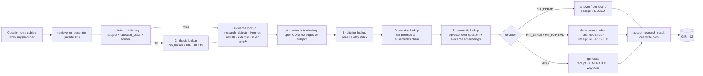

# 03 · Research Retrieval First — research is never done twice

```
Status:      PROPOSED
as_of:       2026-09-27T18:00:00-04:00
Measured at: 8f2a178d5 (origin/main) / served 8f2a178d5-main-exact-phase2-20260927-171004.
Authority:   READ_ONLY_ADVISORY. MBI_BEHAVIOR = 0. Nothing here is built.
Package:     cognitive_transformation_20260927 — read 00 first.
Answers:     operator brief §3 (Research Retrieval First Architecture; duplicate generation → 0).
```

## 1. The guarantee

Before any analyst, worker, LLM, agent, process or workflow generates research on a thesis, the platform
finds what it already knows about that thesis and either **answers from it**, **refreshes it with a
delta prompt**, or **proves a miss**. Generation without a `RetrievalReceipt@v1` is refused at the
paid-call gate.

**Where the 09-27 design stops short.** Research is produced seven times `[DOC-CLAIM: 09-27 §3]`. The
report's fix is a single *write* path (`accept_research_result`) `[DOC-CLAIM: §11]`. A single write
path stops the copies from diverging; it does not stop them from being generated. Today the only
pre-generation lookups are local to one producer each `[CODE]`: Hermes CIO fingerprint TTL reuse
(`hermes_research_queue.find_latest_completed_by_fingerprint`), `cio_residual_web.legality` (same-day
re-hop refusal), the advisory opinion cache keyed on a row hash, the options 24 h/6 h `reusable_request`,
thesis acquisition's `_prior_state`, and the 72 h producer-page reuse from W0-4. The external lanes
(`hermes_external_researcher.main`) have no lookup at all `[CODE]`. Each is a different key on a
different store — which is why 61 symbols sat in ≥ 4 stores in 7 days `[DOC-CLAIM: 09-27 §10 row 1]`.

## 2. Architecture



**Order matters.** Deterministic before semantic: the deterministic ladder is free and exact; the
semantic step is last because it is the only one that can produce a false hit. A semantic hit alone is
never `HIT_FRESH`; it is `HIT_PARTIAL` and produces a delta prompt.

## 3. The seven lookups

| # | Lookup | Key | Store `[CODE]` | Hit means |
|---|---|---|---|---|
| 1 | Deterministic | `subject_guid × question_class × horizon` (question classes from `cio_research_gate` / `due_diligence_questions` contracts) | new `intelligence.research_index` (projection) | a completed answer exists for this exact question |
| 2 | Thesis | `THESIS:` for the subject | `cio_theses` projection, coverage state | the living thesis already carries the field the question asks for (bull/bear/risk/catalyst) |
| 3 | Evidence | subject + evidence class + window | `research_objects` (72 h), Hermes results, `hermes_external_research`, `ticker_research_graph` | grounded evidence exists; answer may be composed without a model |
| 4 | Contradiction | subject | contradiction candidates / `CONTRA:` edges | the question is already known to be contested; generation must include both sides, or route to adjudication (§6) |
| 5 | Citation | normalised URL + day | new per-URL/day index (fixes AUUD 180 pages in 72 h `[DOC-CLAIM: 09-27 §10 row 9]`) | this source was already read; reuse its extraction |
| 6 | Version | `THESIS:`/`EVID:` supersedes chain | M2 `SUPERSEDES` edges, `research_thesis_deltas` | the current version is known; a refresh must reference it |
| 7 | Semantic | embedding of question + subject context | pgvector (`intelligence.embedding`), local `nomic-embed-text` via Ollama (08-24 retrieval strategy: local-first, 768-d `[DOC-CLAIM]`) | a near-duplicate question was answered under a different key or wording |

Only step 7 needs anything new on the host: the embedding model pull (12). pgvector is already
installed `[VERIFIED: 02 §5]`. Embeddings are computed locally; nothing leaves the box (AGENTS.md §2A).

## 4. `RetrievalReceipt@v1`

```yaml
RetrievalReceipt@v1:
  receipt_id: uuid
  context_id: uuid                    # MemoryContext (01)
  question: {text, question_class, horizon, subject_guid}
  ladder: [{step: 1..7, key, store, hit: bool, refs: [...], ms}]
  decision: HIT_FRESH | HIT_STALE | HIT_PARTIAL | MISS
  reused_refs: [research_id | thesis_version | evidence_id | url_extract_id]
  generated: bool
  generation_reason: null | STALE | PARTIAL | MISS | OPERATOR_FORCED
  cost_avoided_estimate: {lane, calls}   # from the LLM registry's per-lane cost
  written_by: lane_id, release_sha
```

Ring 2 (01) makes `gate_and_generate` refuse a research-class call whose context has no receipt, and
`accept_research_result` refuse a delta whose receipt is missing. A receipt with `decision=MISS` and an
empty ladder is a defect: the ladder must show every step was attempted.

## 5. Entry points and the adapter each one needs `[CODE]`

| Producer (09-27 §3's seven) | Current gate | Adapter |
|---|---|---|
| Hermes CIO research | fingerprint TTL in `enqueue_research_request` | fingerprint becomes ladder step 1; steps 2–7 added in `HermesWorker._process_one` before `BridgeHermesResearchBackend.run` |
| Hermes external lanes | none | `hermes_external_researcher.main`: `retrieve_or_generate` before lane selection (`rank_research_lanes` unchanged) |
| Watchlist agents (maria/steph/risk) | none | `process_watchlist_agent_jobs`: one shared evidence pack per proposal (09-27 §9 row "×3") built by retrieval; agents synthesise, not research |
| Analyst / research intelligence | none | `research_intelligence` and `portfolio_ai_analyst`: read GIR RESEARCH class; generate only on MISS |
| Advisory desk opinion | row-hash cache | cache becomes step 1; thesis/evidence/contradiction steps added before `generate_row_opinion` |
| Options thesis lifecycle | 24 h / 6 h `reusable_request` | keeps its window as step 1; pins the symbol thesis version (already does) as step 6 |
| AEC → M2 thesis fact | hourly re-derivation | becomes a projection of `THESIS:` (no generation) |

Plus the two research *requesters*: `cio_research_gate.decide` (free → residual → paid) reads the ladder
result as its first input, and `run_symbol_thesis_acquisition` orders its debt queue by MISS first.

## 6. Contradictions and citations as first-class outputs

- **A contradiction hit changes the prompt.** Generation on a contested subject must be a two-sided
  prompt with both evidence sets, or route to the adjudication queue: a paid judge (Tier-2 cap
  `TierPolicy.tier2_denial` already enforces $2/day `[CODE: tiered_validation.py]`) that records
  `ADJUDICATED` with reasons, never silently picks a side (`ESCALATE_NEVER_RESOLVE` stays for
  destructive cases `[CODE: run_dormant_lane_consumers]`). Adjudication is Wave 3 (09).
- **A citation is a node.** Every `source_url` becomes `EVID:` with a per-day extraction; a second
  producer asking about the same page gets the extraction, not the fetch. `web_research` meta is kept
  through normalisation (the minor drop noted 09-27 `[DOC-CLAIM]`).

## 7. The measure and its path to ~0

**Duplicate generation rate (DGR)** = generated answers whose ladder would have returned `HIT_FRESH`
(same `subject × question_class × horizon`, inside the class SLA) ÷ all generated answers, per lane and
per day. Computed from receipts, so it is exact once receipts exist.

| Phase | Mode | What runs | Exit threshold |
|---|---|---|---|
| W1 | **shadow** | ladder runs, receipt written, generation proceeds regardless; DGR measured for the first time | receipts on ≥ 95 % of research generations |
| W2 | **enforced** | `gate_and_generate` refuses research calls without a receipt; HIT_FRESH answers from record | DGR ≤ 10 % platform-wide; 0 producers without adapter |
| W3 | **refresh** | HIT_STALE → delta prompts; citation index live; adjudication live | DGR ≤ 3 %; refresh share reported |
| W4–W5 | **semantic** | step 7 live; cross-key duplicates caught | DGR ≤ 1 % with the residual explained per receipt |

"Approach zero" is a measured curve with a named residual (OPERATOR_FORCED, deliberate second opinions,
horizon changes), not a claim.

## 8. Failure handling

- Retrieval unreachable → 01 §4 (fail-closed for paid/rate-limited generation, degraded for free lanes
  with a receipt that says so).
- False hit (a reused answer later contradicted) → the contradiction lookup catches it on the next
  question; the receipt's `reused_refs` give the lineage to invalidate. False hits are counted in the
  compliance report as `reuse_regret`.
- Semantic index lag → step 7 reads only embeddings with `projected_at` newer than the record's
  `last_changed`; a lagging index yields MISS, never a stale hit.
