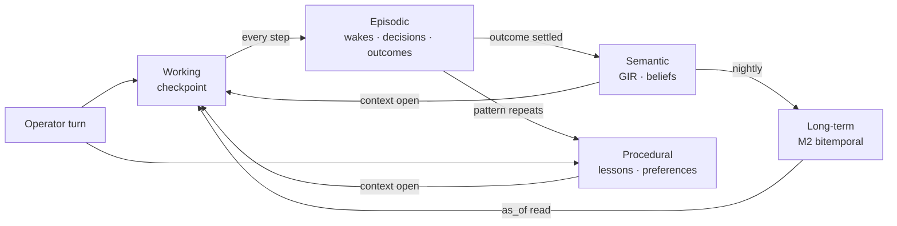

# 04 · Persistent Cognitive Memory — restoring thought, not files

```
Status:      PROPOSED
as_of:       2026-09-27T18:00:00-04:00
Measured at: 8f2a178d5 (origin/main) / served 8f2a178d5-main-exact-phase2-20260927-171004.
Authority:   READ_ONLY_ADVISORY. MBI_BEHAVIOR = 0. Nothing here is built.
Package:     cognitive_transformation_20260927 — read 00 first.
Answers:     operator brief §4 (true persistent cognitive memory; five layers; thought continuity).
```

## 1. What the platform restores today, and what it does not

When an agent stops, what it wrote to JSONL or Postgres is remembered and its working context is
forgotten; only the CIO wake and the Wave-3 runtime can resume, and only by idempotent IDs and leases
`[DOC-CLAIM: 09-27 §4]`. That is file restoration. The 09-07 truth report measured the wake loop as
"built and correct; not wired" and commitments as "a backfill, not a loop" `[DOC-CLAIM: 09-07 rows 13, 16]`;
by 09-25 beliefs were written on five served records but the selector re-picked the same subject
hourly and 54 wakes consumed none `[DOC-CLAIM: memory 09-26 audit]`. The parts of cognition exist as
stores; the *continuity* between them does not.

**Thought continuity** means: after a restart the agent knows what it was in the middle of, why, what
it had already ruled out, what it promised, whom it was waiting on, and what it would do next — and a
reviewer can replay that state from durable records.

## 2. Five layers, mapped onto what exists

| Layer | Holds | Existing store / contract `[CODE]` | New contract | Horizon |
|---|---|---|---|---|
| **Working** | the current task: subjects, open question, intent, ruled-out options, pending waits | wake envelope in `WakeEngine.run`; Wave-3 `MvlRuntime` lease state | `CognitiveCheckpoint@v1` (§3) | one task; checkpointed every step |
| **Episodic** | what happened: wakes, decisions, commitments, outcomes, operator turns, breaches | `wakes.jsonl`, `cio_wake_jobs.jsonl`, commitments/outcomes (`~/trade-ai-state/persistent_wake`), `cio_action_ledger`, `operator_conversation_turns` | `AgentEpisode@v1` = a GIR DECISION-class view; no new store | days → months; consolidated nightly |
| **Semantic** | what is believed: theses, facts, beliefs, entity envelopes | GIR (02): `cio_theses`, M2 facts, `instrument_belief_latest`, identity registry | — | until superseded |
| **Procedural** | how to act: promoted lessons, playbooks, operator preferences, lane policies | lesson candidates (6 stores, 0 promoted), `semantic_operator_memory`, `health_root_cause_memory`, AGENTS.md rules | `Procedure@v1` (§5) | until refuted |
| **Long-term** | consolidated, bitemporal, queryable-as-of | M2 (`memory_fact_version`, SUPERSEDES) | — | forever (with retention policy `retention.md`) |

The 08-24 seven-plane taxonomy `[DOC-CLAIM]` is a finer cut of the same layers (working/session,
episodic, semantic-operator, canonical belief, document/evidence, procedural/lesson, orchestration);
this document keeps its names and adds the *transitions* between planes, which are what was missing.

## 3. `CognitiveCheckpoint@v1` — the unit of continuity

```yaml
CognitiveCheckpoint@v1:
  checkpoint_id: uuid
  agent_id, lane_id, release_sha, boot_id
  task_ref: WAKE:<id> | RUN:<id> | JOB:<id>
  subjects: [guid]
  intent: {goal_ref, question, horizon}
  step: int                                # monotonic within the task
  context_id: uuid                         # MemoryContext (01) the step ran under
  considered: [{option, verdict: KEPT|RULED_OUT, reason, evidence_refs}]
  waiting_on: [{kind: RESEARCH|OPERATOR|OUTCOME|LANE, ref, since, deadline}]
  commitments_open: [COMMIT:<id>]
  next_action: {kind, ref, when}           # what the agent would do if it woke now
  provisional_view: AgentView@v1 ref        # the judgment so far
  hash_prev: sha256                        # chained, like cio_wake_jobs.jsonl
```

- Written by the façade (01) at every `commit`, so it costs the agent nothing extra.
- Stored in `P/cio/agent_checkpoints/<agent_id>.jsonl` (append-only, hash-chained, symlinked
  persistent-state so it survives a release flip — the 09-27 persistence matrix rule `[DOC-CLAIM: §2.2]`),
  projected into GIR as AGENT-class `CKPT:` entities.
- **A checkpoint is not authority.** It carries no sizing, order, stop or weight; a restored agent
  re-opens a context (01) and re-validates before acting (`DecisionIntegrity@v1` semantics, ADR-005).

## 4. The restart protocol (what "restoration of thought" is, step by step)

1. **Load** the last checkpoint for the agent (by `agent_id`, then by `task_ref` if the lease says a task
   was in flight — the Wave-3 `TriggerIntakeStore.lease` and `LeaseCoordinator` boot-id already say so `[CODE]`).
2. **Reconcile episodes since the checkpoint:** what happened while the agent was down (outcomes settled,
   operator turns received, breaches, `memory.delta` events on its subjects) — read from GIR
   `what_changed(subject, since=checkpoint.opened_at)`.
3. **Rehydrate open commitments** (`AGENT_COMMITMENT@v1`) and `waiting_on` items; settle any whose
   deadline passed (the commitment-outcome sweep at 18:20 already does the outcome side `[CODE]`).
4. **Re-open a context** (01) as of now. If the reconciliation shows a contradiction or a refuted
   belief on a subject in `considered`, the `KEPT` options are downgraded to `RECONSIDER`.
5. **Resume at `next_action`** — or, if it is no longer valid, at the first `RECONSIDER`. The resumed
   step writes a new checkpoint with `resumed_from` set.
6. **Emit a `ResumeReceipt@v1`** (episodic) stating what was restored, what changed, what was dropped.
   A restart with no receipt is a silent failure (06).

Restoration is deterministic given the checkpoint and the bitemporal `as_of`, so a reviewer can replay
it — the M5 proof (AGENTS.md §15: "a scheduled wake loads the record before acting, and a disposition
made days earlier is still honoured with nobody replaying it").

## 5. Learning transitions between layers

| Transition | Trigger | Mechanism | Guard |
|---|---|---|---|
| Episodic → Semantic | outcome settled | belief writer (`apply_belief`, the only writer, AGENTS.md §13.4) updates confidence on the subject's envelope | `n<5 → unqualified` stays |
| Episodic → Procedural | outcome pattern repeats (≥ N similar outcomes with the same `considered` shape) | `outcome_to_lesson` candidate → **one** promotion queue (09-27 §10 row 6) → `Procedure@v1` after operator promotion | promotion is operator-only until a lesson has ≥ N confirming outcomes and 0 refutations; then auto-promotion may be proposed as a mode change (08) |
| Procedural → Working | context open | promoted procedures for the subject/purpose are placed in `MemoryContext.lessons`; the agent must state in its view whether it applied each one | never silently applied; `applied_lessons[]` in the view |
| Semantic → Long-term | nightly consolidation ("sleep") | M2 versioning; superseded facts get `valid_to`; envelopes re-projected | bitemporal only; nothing deleted |
| Working → Episodic | every checkpoint | checkpoint append | hash chain |
| Operator turn → Procedural | operator states a preference | `semantic_operator_memory` → `Procedure@v1{kind: PREFERENCE}` | operator turns outrank memory (AGENTS.md §7) |

```yaml
Procedure@v1:
  procedure_id, kind: LESSON|PREFERENCE|PLAYBOOK|POLICY
  applies_to: {subjects|classes|purposes}
  statement: text
  evidence: {confirming_outcomes: [OUT:], refuting_outcomes: [OUT:], promoted_by, promoted_at}
  confidence: {score, basis}
  status: CANDIDATE|PROMOTED|REFUTED|RETIRED
```

## 6. What an agent remembers — the operator's list, item by item

| Remembers | Layer | Where it lives | Proof it is used |
|---|---|---|---|
| what it learned | semantic | GIR envelopes, beliefs | context lists facts; view cites them |
| what worked / what failed | episodic → procedural | outcomes; promoted procedures | `applied_lessons[]` in the view; DGR and calibration move |
| previous decisions | episodic | DECISION class; `prior_decisions` in the context | view states "last time on this subject we …" |
| previous research | semantic | RESEARCH class; retrieval receipt (03) | `HIT_*` receipts |
| operator preferences | procedural | `Procedure@v1{PREFERENCE}` | applied and named in the answer |
| outcomes | episodic | OUT: entities; commitment sweep | belief confidence updates |
| lessons | procedural | `Procedure@v1{LESSON}` | promotion queue non-empty, promoted > 0 |

## 7. Forgetting and decay

Decay applies to **salience**, not to records: the durable store's decay `[CODE: agent_durable_memory]`
ranks what enters a context; nothing is deleted (AGENTS.md §0 rule 6). `retention.md` governs archive
with tripwires. A checkpoint chain is rotated by `rotate_append_only_store.py` (head archived, tail kept
`[DOC-CLAIM: V3_3_IMPLEMENTATION_STATUS]`), which must then be scheduled — an operator lane approval (11).

## 8. Interaction summary


