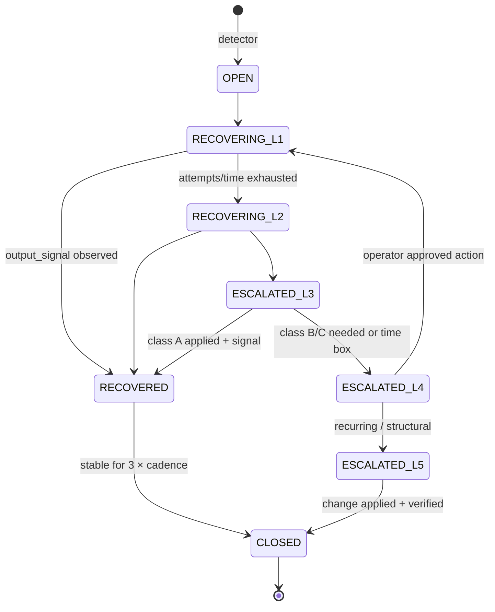

# 06 · Supervisory Intelligence Layer — SLA enforcement, health oversight, no silent failures

```
Status:      PROPOSED
as_of:       2026-09-27T18:00:00-04:00
Measured at: 8f2a178d5 (origin/main) / served 8f2a178d5-main-exact-phase2-20260927-171004.
Authority:   READ_ONLY_ADVISORY. MBI_BEHAVIOR = 0. Nothing here is built.
Package:     cognitive_transformation_20260927 — read 00 first.
Answers:     operator brief §6 (heartbeat architecture, escalation chain L1–L5, recovery workflows,
             autonomous remediation, observability, recoverability).
```

## 1. What "active coordination" is missing today `[CODE]`/`[DOC-CLAIM]`

- The health agent **scores** (`health_agent.py` collect_* → weights → thresholds, `health_agent_policy.json`)
  and has an `auto_remediate` / `never_auto_remediate` list, but "escalate" means `enqueue_escalations()`
  appending to `logs/claude_escalation_queue.json`, which `claude_escalation_handler.process_queue` works
  later. It cannot read the crontab under `NoNewPrivileges` and cannot start Postgres `[DOC-CLAIM: 09-26 audit; AGENTS 1.2.2]`.
- Four health agents overlap `[DOC-CLAIM: 09-27 §4]`; the autonomy watchdog has its own cycle and
  heartbeat receipt; three Hermes heartbeats and a Postgres `agent_heartbeat` table exist, but most
  lanes have **no heartbeat** (09-27 §5: heartbeat "No" for holdings, watchlist, re-entry; the wake
  dispatcher's timeout kill went unnoticed 436 times `[DOC-CLAIM: §1]`).
- Self-repair measured **M0** `[DOC-CLAIM: 09-07 row 19]`. The wake dispatcher hang, the exit-78
  acquisition, the swallowed `ValueError` loop and the `""`-on-refusal shim were all silent for days
  `[DOC-CLAIM: 09-27 §1]`.
- No SLA ladder exists; `report_alert_sla_status.py` reports alert delivery SLAs only.

## 2. Architecture

```mermaid
flowchart TB
  subgraph Lanes["Every lane (worker, queue, silo, agent, research, memory, model pipeline)"]
    L1[lane] -->|beat| HB[(supervisor.heartbeat)]
    L1 -->|output_signal| OS[(lane_registry output signals)]
  end
  SLA[(supervisor.sla<br/>one row per lane)]
  DET["breach detector<br/>(autonomy_watchdog.engine.run_cycle, */2)"]
  HB --> DET
  OS --> DET
  SLA --> DET
  DET -->|Breach@v1| LAD{ladder}
  LAD -->|L1| R1[automatic recovery<br/>restart · re-queue · reclaim lease]
  LAD -->|L2| R2[alternate resource<br/>other LLM lane · CURRENT vs dev launcher · secondary worker]
  LAD -->|L3| R3[health agent<br/>root-cause memory · remediation class A/B]
  LAD -->|L4| R4[operator<br/>approval package / P0 page]
  LAD -->|L5| R5[self-healing orchestration<br/>schedule/SLA/topology change proposal]
  R1 & R2 & R3 & R4 & R5 --> REC[(RecoveryReceipt@v1 → episodic memory · GIR OPERATIONAL)]
  DET --> CC[Command Center supervisor panel]
```

Built on: `autonomy_watchdog.engine.run_cycle` (the cycle), `agent_heartbeat.AgentHeartbeat` (the
table, generalised), `lane_registry` (the roster and output signals), `alert_transition.evaluate`
(edge-triggered alerts, not storms — the 09-21 plan's P1 lesson `[DOC-CLAIM]`), `health_agent`
(L3), `telegram_alert_router` (L4 paging), and the approval package (13) for L5.

## 3. Heartbeat architecture

**One table, one helper, one rule.** Every lane calls `supervisor.beat(lane_id, **fields)` (a thin
wrapper over `AgentHeartbeat` `[CODE]`, added to the worker contract 09-27 §5 and to every launcher in
`linux_launchers/` and `launchers/`):

```sql
supervisor.heartbeat (
  lane_id text, boot_id text, pid int, release_sha text, cwd text,
  last_beat timestamptz, last_success timestamptz, last_output_signal timestamptz,
  work_claimed int, work_done int, work_failed int, queue_depth int, oldest_queued timestamptz,
  memory_context_ok bool, degraded_reasons text[],       -- from 01
  primary key (lane_id, boot_id)
)
```

- **File fallback** `data/runtime/heartbeats/<lane>.json` (the 09-27 proposal) for lanes that run when
  Postgres is down — the Postgres ENOSPC incident made `/api/health ok` a lie `[DOC-CLAIM: AGENTS 1.2.2]`;
  the detector reads both and reports which one it used.
- **Cadence** = the lane's SLA `max_silence / 3`, minimum 30 s for resident services, per-run for cron.
- **A beat is not success.** `last_success` moves only when the lane's `output_signal` is observed
  (`lane_registry.observe_signal` `[CODE]`): exit 0 is not evidence (AGENTS.md §0 rule 8).
- **Monitoring the monitors.** The detector lane and the health agent beat too; the desk bot's
  liveness is checked by a synthetic `/ping` turn hourly (the desk ran 2d17h on stale code with
  `is-active: active` `[DOC-CLAIM: memory 09-22]`).

## 4. SLA table — `supervisor.sla`

One row per lane, seeded from the lane registry's cadence and reviewed by the owner:

| Column | Meaning | Example (wake dispatcher) |
|---|---|---|
| `max_silence` | longest gap between beats before `SILENT` | 10 min |
| `max_run` | longest single run before `HUNG` | 15 min (its existing timeout) |
| `max_queue_age` | oldest queued unit before `BACKLOG` | 30 min |
| `max_failure_rate` | failed/claimed over window before `FAILING` | 0.10 / 1 h |
| `expected_output_signal` | artifact that proves work | wake receipt row |
| `event_to_effect_p95` | end-to-end objective where one exists | 10 min (09-25 objective; measured p95 48 min `[DOC-CLAIM]`) |
| `memory_context_required` | 01 mode | fail-closed |
| `ladder_max` | highest level this lane may reach automatically | L3 |
| `alternate` | L2 resource | none / `CURRENT` launcher |
| `owner`, `silo_id` | for 05 | platform / CIO |

A lane with no SLA row is itself a breach (`UNGOVERNED`) and a conformance finding (05).

## 5. Breach detection and the escalation chain

```yaml
Breach@v1:
  breach_id, lane_id, silo_id, kind: SILENT|HUNG|BACKLOG|FAILING|NO_OUTPUT|MEMORY_UNREACHABLE|SLO_MISS|UNGOVERNED
  detected_at, evidence: {cmd, output_ref}, level: 1..5, state: OPEN|RECOVERING|RECOVERED|ESCALATED|CLOSED
  recovery: [RecoveryReceipt@v1]
```

**Ladder rules.** Each level has a time box and a maximum attempt count; exhausting either escalates.
Every transition writes a receipt. A breach that recurs ≥ 3 times in 24 h skips to L3 (symptom →
cause). No level ever touches a broker, credential, 2FA or live flag (A4/A5 are never in the ladder).

| Level | Action | Constraints `[CODE]` | Time box |
|---|---|---|---|
| **L1 · automatic recovery** | restart the unit (`systemctl --user restart`, or via the sudoers allowlist for system units); re-run the cron launcher once; reclaim an expired lease (`recover_expired_leases`, `reset_stuck_agent_jobs`, ensemble repair); dead-letter a poison unit after 3 recoveries (PR #1280 pattern) | only units/crons in `expected_services.json` and the lane registry; never `pkill -f` a pattern (memory 09-25); class A only (05 §6) | 2 attempts / 10 min |
| **L2 · alternate resource** | LLM: `llm_fallback.generate_with_fallback` / lane breaker (W0-3) to the next ranked lane; worker: start the alternate launcher (CURRENT-pinned vs dev tree, or the second worker slot); research: SearXNG when Brave is capped (`free_search`) | alternates are declared in the SLA row; never a second `getUpdates` consumer (HTTP 409) | 15 min |
| **L3 · health agent** | `health_root_cause_memory` lookup → remediation class A applied, class B proposed as PR + approval item; the four overlapping health agents converge on this one entry | class C never | 1 h |
| **L4 · operator** | consolidated approval-package item (13) for non-urgent; P0 page through the ops-exempt path of `telegram_alert_router` for capital-risk or data-loss classes; the page carries the `Breach@v1`, the receipts so far and the proposed action | one page per breach id (edge-triggered via `alert_transition`), reminders at +4 h/+12 h | until answered |
| **L5 · self-healing orchestration** | proposal to change the topology: re-schedule, disable a duplicate (cron + timer double runs 09-27 §5), raise/lower an SLA, move a lane to CURRENT, split a queue; delivered as a PR + approval item; applied only after approval; verified by the next cycle | operator-only for anything in AGENTS.md §17 | next wave |

## 6. Recovery workflows (state machine)



`RECOVERED` requires the output signal, not exit 0. `CLOSED` writes the episode (04) so the health
root-cause memory learns; the cause and fix are quoted with their commands.

## 7. Observability without a new stack

Nothing new is installed (no Prometheus, Grafana, OpenTelemetry — none present today `[VERIFIED: venv
package list, 2026-09-27]` and none needed). The Command Center gets a supervisor panel over the two
tables: lanes × state, breaches open by level, MTTR per lane, ladder outcomes, and the heartbeat age of
the detector itself. The daily digest carries the count of breaches by level and the oldest open one.
`pipeline_freshness_slo.py` and `report_alert_sla_status.py` become views over `supervisor.sla`.

## 8. "Every process must be observable. Every process must be recoverable. No silent failures."

Operationalised as three conformance checks (05 Monitoring standard):
1. **Observable** — the lane has an SLA row, beats, and an `output_signal` that the detector has seen
   at least once.
2. **Recoverable** — the lane declares an L1 action and an L2 alternate (or `none` with a reason), and
   its work is idempotent (worker contract).
3. **No silent failure** — no code path may exit 0 without an artifact; the launcher wrapper records
   `NO_OUTPUT` when the signal is absent after `max_run` (the 09-26 weekly/monthly reports failed for
   months while the launcher said "skipped (non-fatal)" `[DOC-CLAIM: 09-26 audit]`); "swallowed
   exception" and "returns empty on refusal" patterns are linted at the chokepoints (01 Ring 1 for
   memory; `local_llm` shim retire/revive is an operator item).
