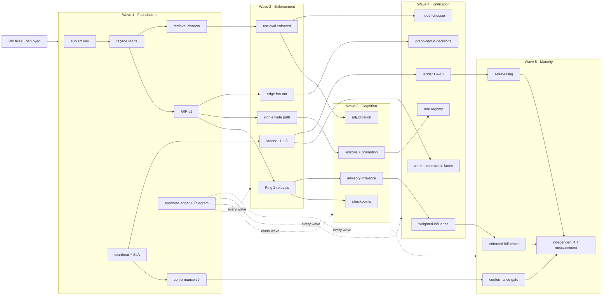

# 09 · Maturity Gap to ≥ 4.7 — honest scores, debts, and the Wave 1–5 roadmap

```
Status:      PROPOSED
as_of:       2026-09-27T18:00:00-04:00
Measured at: 8f2a178d5 (origin/main) / served 8f2a178d5-main-exact-phase2-20260927-171004.
             Scores below are ASSESSMENTS, tagged with the evidence they rest on. None is a measurement.
Authority:   READ_ONLY_ADVISORY. MBI_BEHAVIOR = 0. Nothing here is built.
Package:     cognitive_transformation_20260927 — read 00 first.
Answers:     operator brief §9 (per-domain Current / True / Projected / Maximum; blockers; debts; Waves 1–5).
```

## 0. On scales, and why this document uses one

Three scales are in play: the 09-27 report's house 1–5 `[DOC-CLAIM]`; the 09-21 documents' 0–10
(4/10 honest; 4.75 → 8.6 plan; v3.3 §2 ≈ 4.3) `[DOC-CLAIM]`; and AGENTS.md §15, which says maturity
"is not scored as a percentage here" and is proved by five runtime proofs M1–M5 observed on the served
release, with any numerically scoring document superseded by that section `[CODE: AGENTS.md §15]`.

This document keeps the operator's 1–5 target (4.7) as the **roadmap objective** and makes every wave
exit conditional on the §15 proofs. The number says how far; the proofs say whether. A wave whose
number rises while its proofs read `NOT OBSERVED` has not exited. The 2026-09-02 CIO autonomy report
named in the brief was not found on this host, in Gmail or on Drive (00 §0.2); the autonomy rows below
rest on the 09-07 truth report (20 domains, M0–M3 `[DOC-CLAIM]`) and the 09-25 tranche-3 verdict
("NOT AUTONOMOUS", 1/5 proofs on the served SHA `[DOC-CLAIM: memory 09-25]`).

## 1. Per-domain assessment

Columns: **Claimed** = 09-27 report; **True** = this assessment; **Projected** = after the 09-27 Waves
1–5 only; **Maximum** = with the five pillars (01–08) delivered and proved.

| Domain | Claimed | True | Projected | Maximum | Why True is lower | Blockers to Maximum | Missing architecture | Hidden assumptions |
|---|---|---|---|---|---|---|---|---|
| **Memory** | 3.5 storage / 1.5 use | **1.5** | 3.5 | **4.8** | storage without a mandatory reader is a log; M2 has 1 reader; 0 lessons promoted `[DOC-CLAIM: §2.1]` | M2 prod cutover (roles); façade adoption across 9 silos; operator mode approvals | 01, 04, 08 | "memory influence is an operator decision" leaves no path; "storage 3.5" counts bytes not use |
| **Cross-silo intelligence** | 1.5 | **1.5** | 3.8 | **4.8** | 7 producers; CIR optional | Ring 1/2 enforcement; six producer adapters; DGR curve | 01, 02, 03 | that a read API will be adopted without obligation |
| **Knowledge graph** | 2.0 | **1.5** | 3.0 | **4.7** | no store, traversal by health checks only `[DOC-CLAIM: §7]` | edge projector; bus consumer runs traversals; provenance edges non-empty | 07 | that edges as GUID arrays are "a graph" |
| **Agents** | 2.0 | **1.5** | 3.0 | **4.7** | 5/13 no-ops; 3 registries; no cognitive state; resume = re-read files | one registry; checkpoints; restart protocol; lesson promotion | 04 | that idempotent IDs equal continuity |
| **Workers** | 2.0 | **2.0** | 3.8 | **4.8** | contract designed, supervision absent; 81 % ensemble expiry `[DOC-CLAIM: §5]` | migrate 5 queue styles; heartbeat on every lane | 06 (+ 09-27 §5 contract) | that a contract self-enforces |
| **Continuous research** | 2.5 | **2.0** | 3.5 | **4.7** | retrieval-last; 3 chain breaks this week (fixed W0); no 8-K/10-Q/macro | ladder in front of 7 producers; filings feed; adjudication | 03 | "24/7" counted monitors, not knowledge reaching a thesis |
| **Model routing** | 2.5 | **2.5** | 4.0 | **4.7** | one chooser is already in the roadmap; two caps disagree; shim returns `""` | chooser in gate + bridge; retire/revive shim (operator) | (09-27 §9 target) + 03 gating | that cost, not duplication, is the routing problem |
| **Decision intelligence** | not scored | **2.0** | 3.2 | **4.7** | decisions outside the record; `evidence_refs` empty; MBI=0; 64k `routine` rows | DECISION class in GIR; USED edges; influence ladder; DecisionIntegrity everywhere | 02, 07, 08 | that a decision log is decision intelligence |
| **Operational reliability** | not scored | **2.0** | 3.0 | **4.8** | self-repair M0 `[DOC-CLAIM: 09-07]`; escalation = JSON queue; 4 health agents; cadence timers disabled for weeks unnoticed `[DOC-CLAIM: 09-26]` | SLA table on every lane; ladder L1–L5; monitors monitored | 06, 05 | that a health score is oversight |
| **Platform average** | ≈ 2.2 (scored rows) | **1.8** | **3.4** | **4.75** | | | | |

The Projected column is the point the brief predicts (3.8–4.1) minus the domains it does not cover;
the report's own waves leave decision intelligence and operational reliability where they are.

## 2. Debts (each row is a ledger entry the audit in 05 tracks until closed)

### 2.1 Technical debt
- 5 queue styles, 5 lock styles, 188 unlocked jobs; cron + timer double runs `[DOC-CLAIM: §5]`.
- 4 identity key namespaces; ticker graph and beliefs off the registry key `[DOC-CLAIM: §2.5]`.
- `api_v2.py` 66,735 lines / 970 routes, 207 uncalled `[DOC-CLAIM: 09-26]`; `llm_router` budget 1.50 vs cap 2.00; `local_llm` shim.
- 21 CI workflows, 39 % coverage `[DOC-CLAIM: 09-26]`; Ruff not on PR diffs `[DOC-CLAIM: memory 09-25]`.
- Per-release copies of `persistent_wake` / `hermes` data; crons running the dev tree (451/467).

### 2.2 Governance debt
- Guard grants advisory for Claude Code; merge unenforced (0 reviews; CODEOWNERS advisory) `[DOC-CLAIM: AGENTS §22]`.
- One grant per tier in `grants.json` (collision 09-27) `[DOC-CLAIM: memory]`.
- 517 undeclared lanes accepted as baseline; 3 agent registries; 1,882 docs `review_required`, ~77 missing headers `[VERIFIED: report_docs_inventory --check-index run by survey, 2026-09-27]`.
- Only `chat_id` gated on Telegram approvals (`from_id` recorded, not checked) `[CODE]`.
- Plaintext DSNs in `~/.config/tradeai/agent-operator.env` `[DOC-CLAIM: §1]`.

### 2.3 Memory debt
- MBI=0 with no ladder; 128k contradiction candidates, 0 resolved; 586 lesson candidates, 0 promoted; 6 lesson stores; M2 shadow-only; `memory_changed_decision=0.0`; `evidence_refs` empty on served records; the belief writer's first served write only on 09-24.

### 2.4 Operational debt
- Self-repair M0; escalation queue with 8 pending; four overlapping health agents; no SLA rows; heartbeats on a minority of lanes; weekly/monthly cadence reports failing silently for months; desk unit not rebound on deploy (fixed 09-27) `[DOC-CLAIM: 09-22/09-26]`; DeepSeek 402 outage with no alarm `[DOC-CLAIM: memory 09-19]`.

## 3. Roadmap — Waves 1–5

Conventions: effort in engineer-days of agent work under operator review (S ≤ 3, M 4–8, L 9–15, XL > 15);
every wave = its own PRs + one approval package (13) + a closeout (AGENTS.md §14); wave exit = success
criteria **and** the named §15 proofs observed on the served release with commands quoted; nothing in a
wave touches broker authority.

### Wave 1 · Foundations (measure everything, enforce nothing)

| | |
|---|---|
| **Objectives** | one subject key; one door (façade); GIR v1 read model; retrieval ladder in shadow; heartbeat on every lane; conformance v0 |
| **Deliverables** | `intelligence_client` (reads only) + Ring 1 linter with baseline; `security_guid` on ticker graph and beliefs (09-27 W1); `intelligence` schema + `gir_entity/envelope/edge` projector (batch); `retrieve_or_generate` in shadow on all 7 producers with `RetrievalReceipt@v1`; `supervisor.heartbeat` + `supervisor.sla` seeded from lane registry; `platform-conformance-audit` v0 (UNMEASURED counts); `cio-memory-shadow-measure` extended with counterfactuals per wake; `ApprovalPackage@v1` ledger + first consolidated Telegram package (13) |
| **Dependencies** | 09-27 W0 deployed (done 09-27); infra approval for the schema; lane approvals for audit + supervisor detector; M2 prod cutover is *not* required (GIR reads M2 shadow via DSN) |
| **Risks** | projector load on prod PG (mitigate: batch off-peak, incremental after); Ring 1 baseline large (accepted debt, shrink-only); a second `getUpdates` consumer (do not add) |
| **Effort** | L–XL (≈ 14 days) |
| **Success criteria** | receipts on ≥ 95 % of research generations and 100 % of wakes; DGR measured; heartbeat rows for ≥ 90 % of lanes; conformance report with every silo scored or UNMEASURED; first approval package answered via Telegram |
| **Proofs** | M5 (wake loads the record before acting — already partly observed) re-observed on served; M4 (one producer per number) for the new panels |

### Wave 2 · Enforcement (memory and retrieval become dependencies)

| | |
|---|---|
| **Objectives** | fail-closed memory at the seven DECIDE/ADVISE hooks; retrieval-first enforced; single write path; fan-out from edges; ladder L1–L3 live |
| **Deliverables** | Ring 2 refusals in `gate_and_generate`, `accept_research_result`, `create_cio_action`; `commit` path + `memory.delta` bus events; six producer adapters through `accept_research_result` (09-27 W2); edge-driven `thesis.changed` fan-out (07 §4); breach detector in the watchdog cycle, L1–L3 actions, `RecoveryReceipt@v1`; 8-K/10-Q/macro ingest (09-27 W2); `MemoryCompliance@v1` nightly; per-URL/day citation index |
| **Dependencies** | W1 receipts and SLA rows; operator approval per new writer (DSA rows) and per lane; sudoers allowlist review for L1 restarts |
| **Risks** | fail-closed HOLDs if the read model is slow (SLA 2 s p95; circuit; supervisor recovers); producer adapters change downstream shapes (stance vocabulary audit first, 09-27 W0-9) |
| **Effort** | XL (≈ 20 days) |
| **Success criteria** | DGR ≤ 10 %; read_before_act ≥ 0.99 on DECIDE lanes; 0 orphan writes new; MTTR L1 < 10 min on the wake dispatcher and Hermes worker; event→first-effect p95 ≤ 10 min (the 09-25 objective) |
| **Proofs** | M1 (a self-raised research request changed a named field — via ladder MISS); M2 (critique changed the next question); M5 |

### Wave 3 · Cognition (continuity, lessons, adjudication, advisory influence)

| | |
|---|---|
| **Objectives** | checkpoints and the restart protocol; one lesson store with promotion; contradiction adjudication; influence → advisory on research/watchlist/holdings/risk |
| **Deliverables** | `CognitiveCheckpoint@v1` + `ResumeReceipt@v1` on CIO wake, Hermes worker, Wave-3 runtime; `Procedure@v1` + promotion queue + Command Center card; adjudication queue with the Tier-2 judge; `memory_influence_policy.json` with advisory rows; delta prompts on HIT_STALE; lesson injection into contexts |
| **Dependencies** | W2 receipts; operator approval of each advisory row; judge spend under the existing cap |
| **Risks** | promotion queue ignored (like the 586 candidates) — mitigate: it is an approval-package item with expiry and a digest line; adjudication cost — capped |
| **Effort** | L (≈ 12 days) |
| **Success criteria** | a restart replays to the same `next_action` (deterministic); ≥ 1 promoted lesson applied and cited; contradictions open count falling week over week; MIR ≥ 0.5 on advisory surfaces; DGR ≤ 3 % |
| **Proofs** | M3 (operator turn changed the next wake, with/without shown); M5 (disposition honoured after restart) |

### Wave 4 · Unification (one of everything)

| | |
|---|---|
| **Objectives** | every lane on the worker contract; one agent registry; one model chooser; graph-native decisions; ladder L4–L5; influence → weighted on CIO/options advice |
| **Deliverables** | remaining queue migrations onto `LeaseCoordinator` + heartbeat + status vocabulary; registry consolidation and retirement of the 5 no-op timers (operator); chooser in `gate_and_generate` and the bridge with OAuth-first/off-peak (09-27 §9); `USED/PRODUCED/CAUSED_BY` edges on 100 % of decisions; L4 pages and L5 proposals; semantic retrieval (step 7, local embeddings); weighted rows |
| **Dependencies** | W3 outcomes (n ≥ 50 settled per surface); embedding model pull approval; registry decision (operator) |
| **Risks** | chooser changes cost/quality mix (measured per lane, rollback per lane); consolidation breaks IDs (`maria`/`maria_research`) — alias table, no rename in place |
| **Effort** | XL (≈ 18 days) |
| **Success criteria** | 0 lanes without heartbeat/SLA; 1 registry; DGR ≤ 1 %; MIR ≥ 0.7; paid spend per useful answer down (measured, not asserted); no double-scheduled jobs |
| **Proofs** | M4 across all surfaces; M1–M3 re-observed after the chooser change |

### Wave 5 · Maturity (enforced where earned; measured independently)

| | |
|---|---|
| **Objectives** | enforced influence where the divergence budget holds; conformance gate blocks promotion; self-healing orchestration; ≥ 4.7 re-measured by an independent lane |
| **Deliverables** | enforced rows per §5 of 08; `release_grant_preflight` reads conformance; L5 proposals applied via packages; the maturity re-measurement lane (producer ≠ reviewer ≠ scorer) publishing per-domain scores with commands; closeout with the operator-only list shorter than at the start (AGENTS.md §14 closeout rule) |
| **Dependencies** | W4; every operator approval recorded; 60-day windows |
| **Risks** | the number rises while a proof stays NOT OBSERVED — the exit rule forbids declaring; regression after enforcement — automatic demotion |
| **Effort** | M–L (≈ 10 days plus the measurement windows) |
| **Success criteria** | every domain ≥ 4.7 on the independent measurement; MIR ≥ 0.8; DGR ≤ 1 %; conformance CONFORMANT for 12/12 silos; 0 silent failures in 30 days (every NO_OUTPUT breach caught by the detector, none by a human) |
| **Proofs** | M1–M5 all OBSERVED on the served release, on the same day, with commands — and, per §15, if all five come back observed on the first attempt, assume something is wrong and find it before reporting |

## 4. Dependency map


