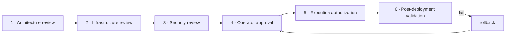

# 11 · Approval Package — what must be approved, by whom, through which stages

```
Status:      PROPOSED
as_of:       2026-09-27T18:00:00-04:00
Measured at: 8f2a178d5 (origin/main) / served 8f2a178d5-main-exact-phase2-20260927-171004.
Authority:   READ_ONLY_ADVISORY. Nothing proceeds on this document; it lists what a grant must say.
Package:     cognitive_transformation_20260927 — read 00 first.
Answers:     operator brief §11 (approval package; approval workflow stages 1–6; artifacts; criteria).
```

## 1. Approvals required, by category

Every item names the rule that makes it an approval (`AGENTS.md §17` = operator-only; `§22` = authority
amendment; `DSA` = `DataSourceAuthority@v2` approval row; `§10` = deploy protocol). Items are grouped
the way the Telegram package (13) will present them. "Wave" is when the item is first needed.

### 1.1 Operator approvals (§17, §22)

| # | Item | Rule | Wave | Reversible |
|---|---|---|---|---|
| O-1 | Approve this package as the active roadmap (supersedes 09-27 §12 waves 1–5) | §22 (blueprint ≠ grant) | now | yes (revert header diffs) |
| O-2 | New lanes: `platform-conformance-audit` (nightly), `memory-compliance-audit` (nightly), `supervisor-breach-detector` (inside the watchdog `*/2`, or its own timer), `gir-projector` (incremental), `approval-package-reminder` (hourly), `checkpoint-rotation` (weekly) | §17 "any new production cron or systemd entry" | W1–W3 | yes (disable lane) |
| O-3 | New writers of authoritative stores: façade `commit` (deltas, receipts), GIR projector (projection only), six producer adapters into `accept_research_result`, supervisor tables, approval ledger, checkpoint store, lesson promotion store | §17 + DSA rows | W1–W3 | yes (DSA row → REVOKED) |
| O-4 | Retire the 5 no-op Wave-3 timers and `tradeai-iris-taxonomy.timer` (kept disabled 09-27) | §17 (retiring a writer) | W4 | yes (re-enable) |
| O-5 | `local_llm_compat`: revive (registered 09-27 at $0.25/150 calls/day) or retire the shim | §17 spend | W2 | yes |
| O-6 | Memory influence policy rows: each surface × silo mode change (shadow → advisory → weighted → enforced) | AGENTS §13.4 / cognition flag | W3–W5 | yes (one row; global kill switch) |
| O-7 | Lesson promotions (each) | operator promotion queue | W3+ | yes (RETIRED status) |
| O-8 | Agent registry consolidation (which IDs win) | divergent truths (§0 rule 5) | W4 | alias table keeps both |
| O-9 | AGENTS.md §13.8 amendment (10 §5) | §20 (normal PR; operator asked to see it) | W2 | yes |
| O-10 | Conformance gate enforcement on promotion (warn → block) | §17 (branch/required-context-like) | W5 | yes (warn) |
| O-11 | Desk-bot restarts after desk-code deploys (each), per §10 | §10 | per deploy | — |
| O-12 | Each wave's exact-SHA deploy (A3) | §22 | per wave | rollback per release |

### 1.2 Security approvals

| # | Item | Why | Wave |
|---|---|---|---|
| S-1 | Rotate plaintext DSNs in `~/.config/tradeai/agent-operator.env` (09-27 finding); lab roles via Bitwarden SM (operator edits BWS first); prod `trade_ai_shadow_ro` via the rotation script | credentials in a file cron sources | before W1 |
| S-2 | New Postgres role(s) for the `intelligence` schema (read for silos, write for the projector/façade); `CREATE ROLE` needs the superuser | least privilege for the new schema | W1 |
| S-3 | RLS tenant policy on `intelligence.*` mirroring `memory_r10_m2` (`app.tenant_id`) | same isolation as M2 | W1 |
| S-4 | Telegram approval hardening: verify `from_id` (today only `chat_id` `[CODE: guard_remote_approval]`); per-package grants; audit chain | approvals are authority | W1 |
| S-5 | Egress review: embeddings computed locally (Ollama); no new external calls; `§2A` unchanged | data egress rule | W4 |
| S-6 | `sudoers` allowlist review for L1 restart actions (units the supervisor may restart) | least privilege for recovery | W2 |

### 1.3 Infrastructure approvals

| # | Item | Why | Wave |
|---|---|---|---|
| I-1 | Schema `intelligence` on prod Postgres 17 (`gir_entity`, `gir_envelope`, `gir_edge`, `research_index`, `embedding`, `supervisor.heartbeat`, `supervisor.sla`, `approval_packages`) — migration reviewed, reversible (`DROP SCHEMA` is the rollback, never run automatically) | new tables on the production database | W1 |
| I-2 | M2 production cutover (`memory_prod_cutover.apply`), currently shadow on :55432; needs S-2 roles | bitemporal history on prod | W2 (GIR reads shadow until then) |
| I-3 | Disk: contradiction store 118 MB, KB 245 MB, checkpoints (new) — rotation lanes (O-2) and archive with tripwire | growth | W1 |
| I-4 | New user units (`config/systemd/`) for the audit and detector lanes via `install_cio_operator_runtime.sh` | §10: a deploy does not install units | W1–W2 |
| I-5 | Bus consumer capacity: the traversal consumer (07 §4) adds work to the existing dispatcher path (0.7 s steady after W0-2) — SLA row and L1 action defined before enabling | dispatcher was the hang | W2 |

### 1.4 Software installation approvals

| # | Item | Why | Rollback |
|---|---|---|---|
| P-1 | Ollama model `nomic-embed-text` (local) for retrieval step 7 | semantic lookup, local-first (08-24 strategy) | `ollama rm` |
| P-2 | Python: `pgvector` client package if not already importable from `psycopg2` raw SQL (verify first; prefer raw SQL, no new dependency) | only if needed | pip uninstall |
| P-3 | **Nothing else.** No graph DB, no Redis/broker, no Prometheus/Grafana, no OpenTelemetry, no new web framework | the design is Postgres + JSONL + existing services | — |

### 1.5 Budget approvals

| # | Item | Estimate | Cap |
|---|---|---|---|
| B-1 | Contradiction adjudication judge (paid, Tier-2) | ≤ $0.50/day at current candidate rates | inside the existing $2.00/day provider cap; `TierPolicy.tier2_denial` enforces |
| B-2 | Embedding compute | local GPU/CPU; $0 | — |
| B-3 | Expected saving: duplicate generation removed (DGR from ~unknown → ≤ 1 %); the 09-27 routing table's −$9/mo on advisory and ensembles | measured monthly via `llm_consumption_log` | — |
| B-4 | Engineering effort W1–W5 ≈ 74 agent-days under operator review (09 §3) | — | per-wave go/no-go |

## 2. The six-stage approval workflow



| Stage | Who | Inputs | Artifact produced | Approve when | Reject when |
|---|---|---|---|---|---|
| 1 Architecture | independent reviewer lane (a different model/session than the author; producer ≠ reviewer) | the PR, the package docs it implements, contract diffs | `ArchitectureReview@v1` (findings, contract hash check, "wrap-don't-rewrite" check) | 0 blocking findings; contracts match `contract_manifest.json`; no new store/framework | new store, new framework, rewrites instead of wraps, a rule weakened |
| 2 Infrastructure | platform lane + operator for §17 | migration SQL, unit files, lane rows, disk/CPU estimate | `InfraReview@v1` (migration dry-run output quoted, rollback SQL, unit lint) | migration reversible; rollback tested on the lab DB; lanes declared | irreversible migration; unit not in `expected_services`; no rollback |
| 3 Security | operator (credentials) + reviewer lane | roles, RLS, egress, sudoers deltas, Telegram gating | `SecurityReview@v1` | least privilege; no plaintext secret; no new egress; `from_id` verified | any secret in a file/PR; egress of portfolio data; sudo outside allowlist |
| 4 Operator | operator, via one consolidated Telegram package (13) | stages 1–3 artifacts, the item list with reversibility | `ApprovalPackage@v1` state APPROVED (per item) | items approved individually or `all` | any DENIED item blocks dependent items only |
| 5 Execution authorization | guard grants minted per package (git-push, release-write, cron, service, db-write as needed), each naming the package id + PR + SHA | approved package | grants with `reason=pkg:<id> pr:<n> sha:<sha>`; `release_grant_binding` verifies | grant reason binds to this PR/SHA/campaign | reason does not name them (fails closed) |
| 6 Post-deployment validation | supervisor (06) + the wave's proof commands | served pin, heartbeat, output signals, §15 proofs | `PostDeployValidation@v1` with commands quoted; package → VALIDATED | output signals observed; proofs as claimed; no new breaches for 3 × cadence | signal absent; a proof NOT OBSERVED that was claimed; breach storm |

**Rollback criteria (any stage after 5):** a behaviour-field touch (P0); fail-closed HOLD rate > 5 %
of DECIDE wakes for 30 min; DGR or MIR moving the wrong way for 7 days; a promotion-gate false block;
any drift finding of class "registry vs host" introduced by the deploy. Rollback = previous release
pin + policy rows to previous mode + DSA rows REVOKED; never `DROP SCHEMA` automatically.

## 3. Approval artifacts and where they live

`data/governance/approvals/<package_id>/` (append-only, mirrored to Drive by the existing sync):
`package.json` (`ApprovalPackage@v1`), `architecture_review.md`, `infra_review.md`, `security_review.md`,
`telegram_transcript.jsonl` (message ids, button/command events, `from_id`), `grants.json` (per-package),
`post_deploy_validation.md`. The package id is cited in every PR body and closeout.

## 4. Nothing proceeds without identifying approvals first

A wave PR whose body does not list its approval items by id (O-/S-/I-/P-/B-) fails the architecture
review at stage 1. An execution that finds an unlisted approval need stops and adds the item (the
09-27 rule: "if the deferred list grows during a wave, that is a finding about how the wave was run").
