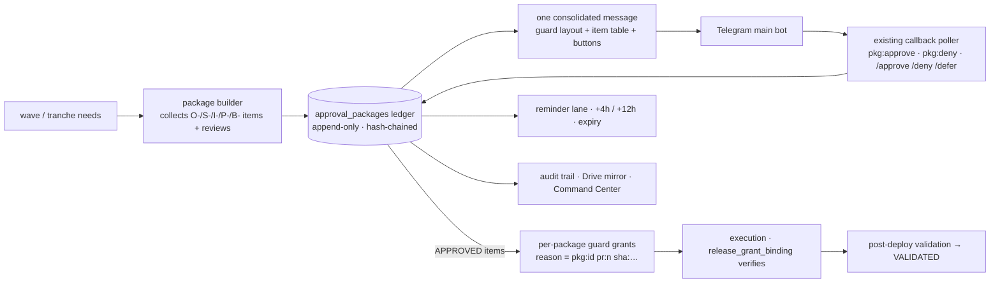

# 13 · Consolidated Telegram Approval Gate — one queue, one message, full audit

```
Status:      PROPOSED
as_of:       2026-09-27T18:00:00-04:00
Measured at: 8f2a178d5 (origin/main) / served 8f2a178d5-main-exact-phase2-20260927-171004.
Authority:   READ_ONLY_ADVISORY. Governs engineering/governance approvals only. Broker and per-order
             approvals (A4/A5) keep their own paths by rail (AGENTS.md §22); this gate never carries them.
Package:     cognitive_transformation_20260927 — read 00 first.
Answers:     operator brief §11 (Telegram approval gate: single queue, batching, history, audit trail,
             expiration, escalation; message format; states; workflows).
```

## 1. Today: many queues, one good mechanism `[CODE]`

Twelve-plus approval queues exist (`remote_requests.json` + `grants.json`, `trade_approvals`,
`evidence_bound_approvals`, `broker_live_approvals`, `options_approval_queue`, `paper_trade_proposals`,
`stop_confirmations`, `escalation_queue`, `action_queue`, `inbound_operator_questions`, six empty
tables `[VERIFIED: survey DB reads 2026-09-27]`). The guard's remote approval is the sound one:
`guard_request_approval.py` mints a PENDING request, sends "🔐 Approval requested" with inline
`gapprove:<id>` / `gdeny:<id>` buttons and a single-use code (SHA-256 only stored), the single
`getUpdates` poller `run_telegram_callback_poller._handle_guard_approval` settles it and shells to
`bin/guard` in its own release to mint the grant; TTL 4 h default / 12 h max; forbidden scopes
(sudo, destructive, file-delete, frozen-v2, guard-config) can never be granted remotely. Its two defects:
`grants.json` holds **one grant per tier** (a concurrent campaign's approval replaced mine on 09-27
`[DOC-CLAIM: memory]`), and only `chat_id` is verified (`from_id` recorded, not checked).

The operator gets dozens of separate asks because each script asks for itself. The fix is not a new
bot; it is one package object in front of the guard.

## 2. Architecture



## 3. `ApprovalPackage@v1`

```yaml
ApprovalPackage@v1:
  package_id: pkg_<yyyymmdd>_<slug>_<4hex>
  campaign: cognitive-transformation-20260927
  wave: 1..5 | hotfix
  created_at, created_by: {session, release_sha}
  expires_at: created_at + 24h            # answer window; see §6 for the guard's 12h ceiling
  summary: one paragraph (what this package enables; what it does not touch: MBI_BEHAVIOR, broker)
  reviews: {architecture: ref|MISSING, infrastructure: ref|MISSING, security: ref|MISSING}
  items:
    - {item_id: O-2a, category: OPERATOR|SECURITY|INFRA|SOFTWARE|BUDGET,
       title, why, rule: "AGENTS §17", reversible: true|false, rollback: text,
       depends_on: [item_id], scopes_needed: [cron|service|db-write|git-push|release-write|…],
       binds: {pr: n, sha: str, files: [...]},
       state: PENDING|APPROVED|DENIED|DEFERRED|EXPIRED|EXECUTED|VALIDATED|ROLLED_BACK,
       decided_by: {from_id, via: button|command, message_id, at}}
  state: DRAFT|SUBMITTED|PARTIAL|APPROVED|EXECUTING|VALIDATED|DENIED|EXPIRED
  telegram: {message_ids: [...], chat_id}
  hash_prev: sha256                        # ledger chain
```

Ledger: `P/governance/approval_packages.jsonl` (persistent-state, survives release flips), projected to
`intelligence.approval_packages` for the Command Center and mirrored to Drive with the governance
artifacts (11 §3).

## 4. Message format (one message; chunked ≤ 4,000 chars via `telegram_transport.split_for_telegram`, keyboard on the last chunk; sent with `bypass_router=True` like guard requests so it never lands in the digest)

```
🔐 Approval package pkg_20260927_cogx_w1_a3f2 — Wave 1 · Foundations
Reviews: architecture ✅ (ar_…), infra ✅ (ir_…), security ✅ (sr_…)
Binds: PR #13xx · sha 1a2b3c4d5 · campaign cognitive-transformation-20260927
Does NOT touch: MBI_BEHAVIOR, broker, live flags, 2FA, sudo/destructive scopes
Expires: 2026-09-28 18:00 ET (reminders +4h, +12h)

OPERATOR
 1. O-1  Adopt package as active roadmap                     reversible ✓
 2. O-2a Lane platform-conformance-audit (nightly 02:30)     reversible ✓  needs: cron
 3. O-2b Lane supervisor-breach-detector (in watchdog */2)   reversible ✓  needs: service
 4. O-3a Writer: intelligence_client commit (receipts)       reversible ✓  DSA row
SECURITY
 5. S-2  Roles intelligence_reader/_writer (superuser SQL attached)   reversible ✓
 6. S-4  Verify Telegram from_id (allowlist: <n> ids)         reversible ✓
INFRA
 7. I-1  Schema intelligence (migration 0xx, rollback 0xx-down, lab-tested ✓)  reversible ✓  needs: db-write
 8. I-4  Units for 2 lanes via install script               reversible ✓  needs: service
BUDGET
 9. B-4  Wave 1 effort ≈ 14 agent-days                        —

Reply: /approve pkg_…_a3f2 all  ·  /approve pkg_…_a3f2 1,2,3,7  ·  /deny pkg_…_a3f2 6 "reason"
       /defer pkg_…_a3f2 12h    ·  /show pkg_…_a3f2 7  (full item text)
[ ✅ Approve all ] [ ❌ Deny all ] [ 📋 Show items ]
```

Numbers in the message are the package's own (item counts, expiry); no measured system values are
embedded (briefs rule), only references to the review artifacts that hold them.

## 5. States and transitions

```mermaid
stateDiagram-v2
  [*] --> DRAFT: builder collects items + reviews
  DRAFT --> SUBMITTED: message sent (all three reviews present or MISSING stated)
  SUBMITTED --> PARTIAL: some items decided
  SUBMITTED --> APPROVED: all items APPROVED (or DENIED items have no dependents)
  PARTIAL --> APPROVED
  SUBMITTED --> DENIED: /deny all
  SUBMITTED --> EXPIRED: 24h, no decision
  PARTIAL --> EXPIRED: 24h on remaining items
  APPROVED --> EXECUTING: per-package grants minted; execution begins
  EXECUTING --> VALIDATED: post-deploy validation passes (stage 6)
  EXECUTING --> DENIED: rollback criteria hit → ROLLED_BACK items
  EXPIRED --> SUBMITTED: re-request with delta only (undecided items)
  VALIDATED --> [*]
```



Per-item states are independent; a DENIED item blocks only items that `depends_on` it, and the
execution proceeds with the approved subset (the message says which).

## 6. Workflows

**Submit.** The builder refuses a package with an item that lacks `why`, `rule`, `rollback` or a review
reference; `MISSING` reviews are shown, never hidden. One package per wave or tranche; a hotfix package
may carry ≤ 3 items.

**Decide.** Buttons (`pkg:approve:<id>:all`, `pkg:deny:<id>:all`, `pkg:show:<id>`) and commands are
handled by the existing poller (one `getUpdates` consumer; a second gets HTTP 409). Every decision
records `from_id` and is accepted only from the operator allowlist (S-4). `/approve … all` on a package
that contains an item needing a remotely-forbidden scope (sudo, destructive) approves everything else
and marks that item `NEEDS_LOCAL` — the operator performs it on the host, as today.

**Grant.** On APPROVED, the poller mints guard grants **per package**: one grant per needed scope with
`reason = "pkg:<id> pr:<n> sha:<sha> campaign:<c>"`, uses and window sized to the wave (never above the
guard's 12 h / 500 uses). The ledger keys grants by package, so two campaigns no longer overwrite each
other's tier entry; `bin/guard show` lists them by package. `release_grant_binding` continues to fail
closed on a reason that names no PR/SHA/campaign.

**Expiry and reminders.** Reminder lane hourly: at +4 h and +12 h a short reply-to message
("⏳ pkg_… 3 items undecided, expires in 12h"). At +12 h the underlying guard request (12 h ceiling) is
re-minted once, transparently. At 24 h undecided items → EXPIRED; a re-request carries **only** the
undecided items and the original package id as `supersedes`.

**Escalation.** A package whose items include an open L4 breach (06) is marked P0 and paged through the
router's ops-exempt path once; everything else waits for the operator. No package ever pages more than
once per 4 h.

**History and audit.** `/history` lists the last N packages with states; `/show pkg <n>` prints an item;
the Command Center governance panel shows packages, decisions, `from_id`, grant ids, execution and
validation receipts; the ledger's hash chain is verified by the conformance audit (05); the Drive
mirror holds the artifacts (11 §3).

## 7. What stays separate, on purpose

- **Trade and broker approvals** (`approval_service`, evidence-bound, live approvals, stops) stay
  per-order and per-channel as designed by the operator on 2026-06-15 (`REQUIRED_CHANNELS`); they are
  A4/A5 and never enter a package.
- **`/caps`** (spend caps) keeps its own command; a package may *reference* a cap change as a BUDGET item
  but the cap is set through `/caps`.
- **Lesson promotions** (04) ride packages as O-7 items so that the 586-candidates-0-promoted pattern
  cannot recur silently.
