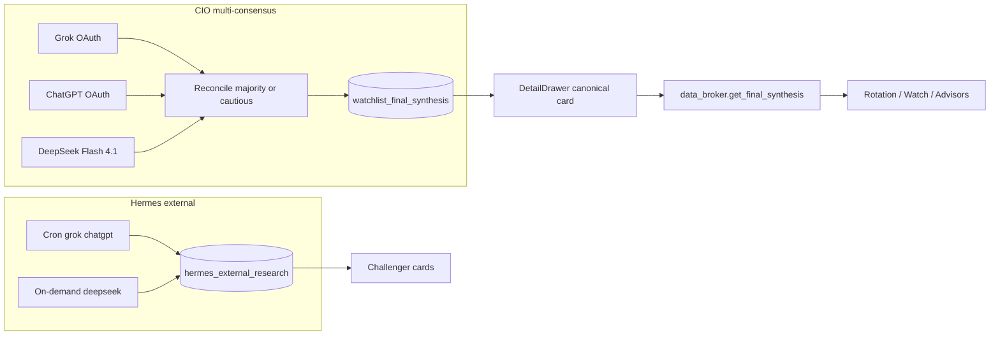
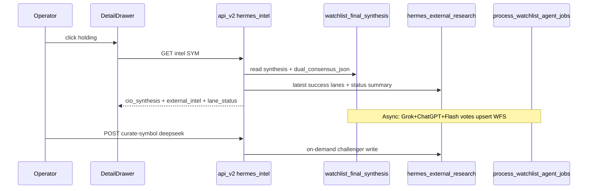

Status:      ACTIVE
as_of:       2026-09-09-1634 America/New_York
Topic:       Holding-drawer LLM curation — target state
MBI_BEHAVIOR: 0

# CIO / Command Center — FUTURE (holding LLM curation) — 2026-09-09-1634

**Version stamp (America/New_York):** `2026-09-09-1634`

```
LEGEND (status icons — use consistently across AS-IS / FUTURE / GAP)
  █  OBSERVED_LIVE     scheduled or live path; durable output verified on CURRENT epoch
  ◈  INTEGRATED        wired end-to-end on serving SHA (producer→store→consumer)
  ◇  DOCKED            code + schema on CURRENT; consumer or organic proof incomplete
  ▓  PARTIAL           runs, but incomplete / degraded / consumer unproven
  ░  UNWIRED           code exists and is correct; nothing calls it or consumes it
  ◌  HERMETIC_ONLY     tests/helpers PASS; must NOT be quoted as OBSERVED
  ▒  DOCUMENTATION_ONLY docs/helpers without producer+consumer+organic evidence bar
  ✗  ABSENT / DARK     never executed, no producer, or produces nothing in recorded history
  ⛔ BLOCKED           structural/policy blocker (grant scope, secret, stuck checkpoint, etc.)
```

## Target architecture

```
Click holding
   │
   ▼
DetailDrawer
   │
   ├─ █ CIO CANONICAL SYNTHESIS (system of record)
   │     watchlist_final_synthesis via data broker
   │     Voters: Grok + ChatGPT + DeepSeek Flash 4.1
   │     Chips: participating_lanes · Flash status · freshness
   │     Refusal → keep prior; never show as curated prose
   │
   ├─ ▓ External lane status (14d) — skip/reject/error visible
   │     [Run DeepSeek Flash challenger] on-demand only
   │
   └─ ▓ External LLM challengers (not SoR)
         freshness CURRENT/STALE; EXPIRED hidden
         Grok/ChatGPT from cron; Deepseek when demanded
```



## Workflows

### A — Organic CIO synthesis (target)
1. Specialists (Maria/Steph/Risk) complete → full_chain synthesis job.
2. `_synthesis_lanes` calls Grok, ChatGPT, Flash (budget/window aware).
3. Majority / cautious reconcile → upsert synthesis **only if narrative ok**.
4. Drawer + broker consumers read same row.

### B — Operator refresh Flash challenger
1. Drawer → “Run DeepSeek Flash challenger”.
2. `POST /hermes/curate-symbol` with `lane=deepseek`.
3. Success → new external card; skip → lane_status_summary shows reason.

### C — Freshness honesty
1. CURRENT ≤12h · STALE ≤7d · EXPIRED hidden from external panel.
2. CIO card shows `freshness_class` from `updated_at`.

## Maturity targets after merge+promote+organic soak

| Capability | Target |
|---|---|
| CIO Flash vote | █ OBSERVED on held/top names after soak |
| Refusal fail-closed | ◈ INTEGRATED |
| Drawer freshness | ◈ INTEGRATED |
| Hermes deepseek blanket cron | ✗ intentionally ABSENT (cost) |
| Unified desk memo = synthesis | ◇ still future (instrument record merge) |


## Iteration roadmap (levels)

### Level 1 — Honesty (this wave)
- Freshness classes on every external card
- Lane status summary for missing providers
- CIO card labeled system of record
- Flash voting + skip honesty

### Level 2 — Shared spine (near-term)
- Rotation / Watch / Advisory Desk headers consume `get_final_synthesis` only for recommendation chip
- Instrument-record `cc_narrative` either mirrors synthesis or carries explicit “desk memo ≠ CIO SoR” badge
- Purge/requeue historic `LLM error:` synthesis rows (append-only adjudication, no silent rewrite)

### Level 3 — Observed durability
- After promote: ≥N holdings show Flash `VOTED` within budget window across a soak day
- Restart/deploy does not orphan drawer freshness policy
- Negative control: forced Flash CAP still shows `SKIPPED_*` chip, never invents Flash=HOLD

### Level 4 — Judgment coupling (later program)
- Judgment AgentView cites CIO synthesis id + external challenger ids
- Commitments cannot be born from Hermes challenger text alone
- Scoring ignores fixture/synthetic LLM rows

## Target workflow — CIO multi-consensus

```
run_synthesis
  │
  ├─ Grok OAuth vote
  ├─ ChatGPT OAuth vote (cap-aware)
  └─ DeepSeek Flash 4.1 vote (budget/window/breaker-aware)
        │
        ▼
  reconcile:
    all agree → agree=True
    2+ majority → consensus=majority, agree=False, majority=True
    else → most cautious (_CONSERV), majority=False
        │
        ▼
  parse narrative
  if refusal/error → NO UPSERT (keep prior)
  else apply income/RSI gates → UPSERT dual_consensus_json
        │
        includes: participating_lanes, deepseek_status, deepseek_model=deepseek-v4-flash
```

## Target drawer information architecture

```
┌──────────────────────────────────────────────────────────┐
│ Action board (CIO view from record / synthesis)          │
├──────────────────────────────────────────────────────────┤
│ CIO CANONICAL SYNTHESIS                          [SoR]   │
│  chips: CURRENT · voted:Grok · voted:ChatGPT · Flash:VOTED│
│  narrative (full) + evidence                             │
├──────────────────────────────────────────────────────────┤
│ External lane status (14d)                               │
│  deepseek: skipped×3 · chatgpt: success×5                │
│  [Run DeepSeek Flash challenger]                         │
├──────────────────────────────────────────────────────────┤
│ External LLM challengers (NOT system of record)          │
│  cards with CURRENT/STALE badges                         │
└──────────────────────────────────────────────────────────┘
```

## Acceptance tests (future OBSERVED bar)

1. Hermetic: triple reconcile + freshness unit tests green on SHA.
2. Deployed: `_hermes_intel` returns `cio_synthesis.deepseek_status` field.
3. Organic: at least one held symbol with Flash VOTED in dual_consensus_json after soak.
4. Negative: Flash unavailable → status ≠ VOTED and no deepseek recommendation invented.
5. Refusal: forced refusal path leaves prior synthesis_narrative unchanged.


## Operator playbook after promote

1. Open Command Center → Portfolio → click a held name (e.g. SPCX).
2. Confirm **CIO canonical synthesis** section appears above challengers.
3. Confirm Flash chip shows VOTED / SKIPPED_* / UNAVAILABLE — never blank.
4. Confirm external cards show CURRENT/STALE badges.
5. Optionally click **Run DeepSeek Flash challenger**; re-open drawer after job finishes.
6. Confirm Home AI briefing footer no longer mentions Ollama-first.

## Mermaid — end-to-end target data flow



## Definition of done (FUTURE observed)

- Drawer hierarchy: CIO SoR → lane status → challengers
- Flash is a CIO voter with honest skip states
- Freshness policy enforced in API
- Docs/email package rich with legend + diagrams + workflows
- MBI=0 throughout
