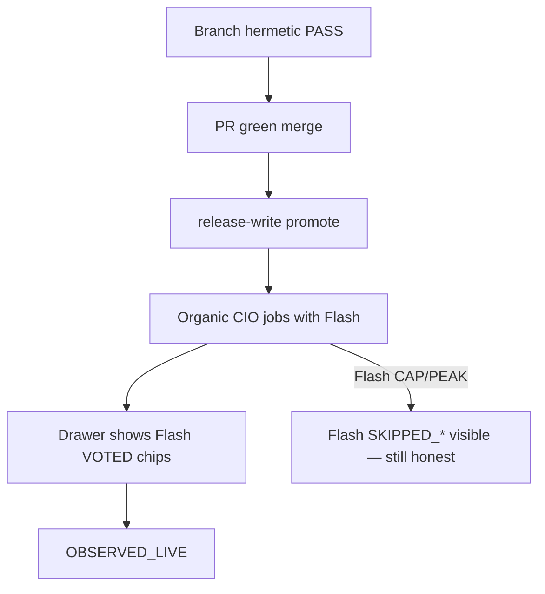
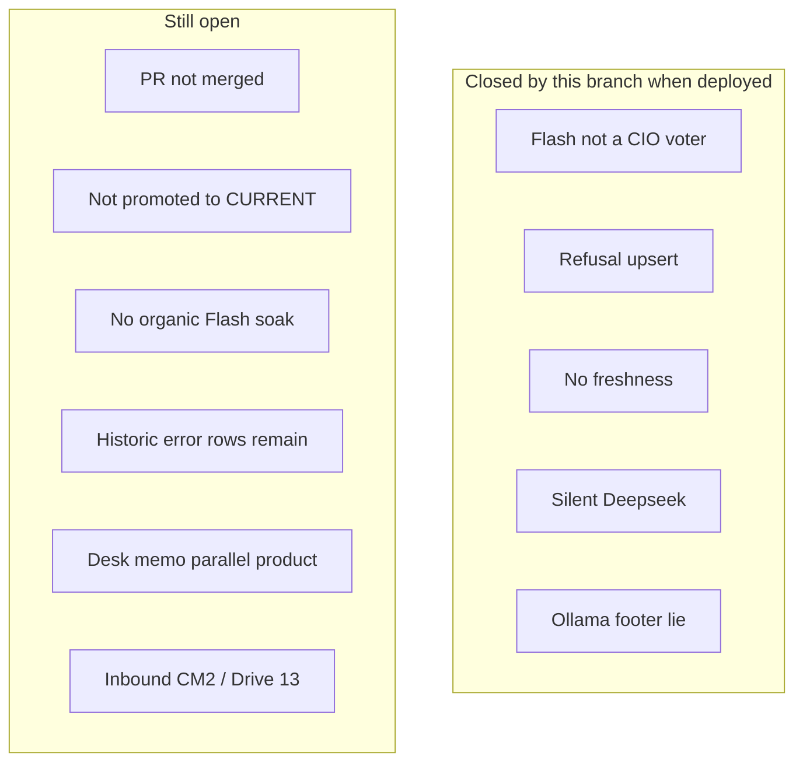

Status:      ACTIVE
as_of:       2026-09-09-1634 America/New_York
Topic:       Holding LLM curation — gaps vs future
MBI_BEHAVIOR: 0

# CIO / Command Center — GAP (holding LLM curation) — 2026-09-09-1634

**Version stamp (America/New_York):** `2026-09-09-1634`

```
LEGEND (status icons — use consistently across AS-IS / FUTURE / GAP)
  █  OBSERVED_LIVE     scheduled or live path; durable output verified on CURRENT epoch
  ◈  INTEGRATED        wired end-to-end on serving SHA (producer→store→consumer)
  ◇  DOCKED            code + schema on CURRENT; consumer or organic proof incomplete
  ▓  PARTIAL           runs, but incomplete / degraded / consumer unproven
  ░  UNWIRED           code exists and is correct; nothing calls it or consumes it
  ◌  HERMETIC_ONLY     tests/helpers PASS; must NOT be quoted as OBSERVED
  ▒  DOCUMENTATION_ONLY docs/helpers without producer+consumer+organic evidence bar
  ✗  ABSENT / DARK     never executed, no producer, or produces nothing in recorded history
  ⛔ BLOCKED           structural/policy blocker (grant scope, secret, stuck checkpoint, etc.)
```

## Gap matrix

| Gap | Was | Now on branch | Still open after merge |
|---|---|---|---|
| DeepSeek missing from CIO | ✗ voter | ◈ code: triple consensus | needs promote + organic Flash votes = █ |
| Stale/gibberish refusal on CIO card | ▓ | ◈ fail-closed no upsert | historic bad rows not rewritten |
| Month-old external theses | ▓ | ◈ freshness + hide EXPIRED | STALE still shown (by design) |
| Deepseek cron absence unexplained | ░ | ◈ lane_status_summary + button | peak/cap still operator economics |
| Ollama Home footer | ▓ | ◈ copy fixed | — |
| CIO Desk instrument memo ≠ synthesis | ▓ | ▓ labeled SoR for synthesis only | full desk merge still GAP |
| Advisory Desk shared spine | ░ | ◇ broker fields enriched | not all hubs rewired |
| Deploy / OBSERVED | ✗ | ◌ hermetic tests | ⛔ until PR merge + release-write promote |

## Workflow — remaining to OBSERVED



## Explicit non-goals (not gaps to “fix” by expanding cron)

- Do **not** add Deepseek to every 2h Hermes top-20 cron.
- Do **not** route CIO through DeepSeek Pro under this wave.
- Do **not** count Hermes challenger text as SETTLED maturity / trade authority.


## Gap workflows (edges still missing)



## Priority order to close remaining gaps

1. Merge `feat/holding-llm-curation-cio-flash` after CI green.
2. Promote with release-write; verify API field presence on CURRENT.
3. Run one manual CIO synthesis on a held name during Flash window; confirm VOTED chip.
4. Optionally `POST /hermes/curate-symbol` for SPCX Deepseek challenger refresh.
5. Separate campaign: inbound checkpoint repair + Drive Kersta (not this PR).

## Cost / policy constraints (permanent)

| Policy | Gap if violated |
|---|---|
| No Deepseek on 2h top-20 cron | Would blow Flash budget; **not** a maturity requirement |
| Flash = paid participant process | Must not smuggle into “free ensemble” bags |
| Challenger ≠ SoR | Counting Hermes text as CIO verdict reopens dual-SoR gap |
