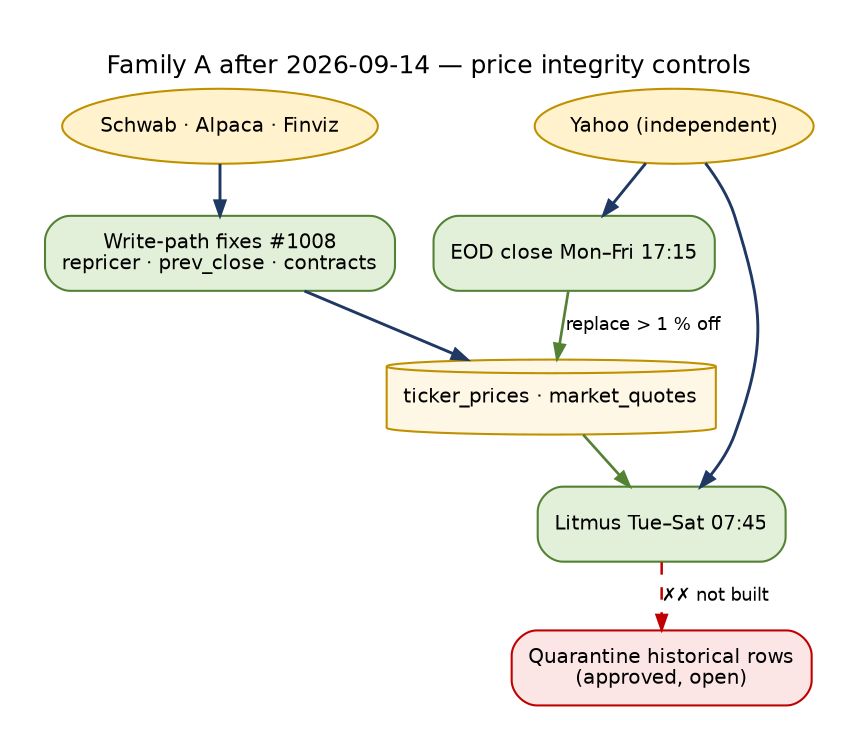

<!-- Lifecycle fact base A — Data and source lifecycles. Status: ACTIVE (measured, read-only, 2026-09-14 00:00–00:45 EDT). Synthesized in docs/architecture/TRADE_AI_AS_IS_LIFECYCLES_2026-09-14.md; targets in TRADE_AI_FUTURE_STATE_LIFECYCLES_2026-09-14.md. -->

# Trade AI — Data and Source Lifecycles (measured)


> **Update 2026-09-14 23:44 EDT — what changed after this measurement (live `341bce2c1`).** The numbers below are the
> 2026-09-14 00:00–00:45 measurement and are not re-measured. These findings were acted on the same day:
>
> - **Repricer (lifecycle 1, break "corrupt closes"):** PR #1008 — `close_price_for_holding` uses the canonical
>   mark, else value ÷ shares, and refuses a close more than 50 % from the live quote. Root cause found: for a
>   sub-one-share Schwab position the stored `price` was the position **value** (XLI 7.49 vs 169, NOC 123 vs 531,
>   SCHG 8.05 vs 35). The historical 09-04/09-11 rows are **not yet quarantined** (operator-approved).
> - **Alpaca `prev_close`:** taken from `dailyBar` when `prevDailyBar` is two sessions back (HPE showed a false +12.4 %).
> - **Finviz:** exports parsed by header (`lib/finviz_csv`, required-header contracts per view, drift raises) with
>   explicit units — Market Cap and Float in millions, Average Volume in thousands (they were stored 1,000× off).
> - **Drift controls (timers):** source litmus vs Yahoo Tue–Sat 07:45 (BLOCK when > 2 % of closes are off by > 10 %);
>   Finviz view contracts Mon–Fri 06:05; EOD consolidated close Mon–Fri 17:15 (replaces IEX-derived closes > 1 % off).
> - **Alpha Vantage (lifecycle 2):** health "unknown since 05-09" was cron without `.env`; `data_source_report`
>   now falls back to `.env`; symbol selection holdings first (was one symbol per week).
> - **Identity (lifecycle 3):** unchanged; the desk resolver now binds dictated tickers (#1005).
> - **Material change (lifecycle 4):** notices send a rich layout with Command Center / Finviz / Yahoo links (#1018).




```
Family:      DATA AND SOURCE LIFECYCLES (agent 1 of 6)
Measured:    2026-09-14 00:00–00:45 EDT, host ms01, read-only
Code:        dev tree origin/main c594d8600 (cron runs here); release CURRENT = c594d8600-main-exact-phase2-20260914-000703
DB:          psql with default_transaction_read_only=on
Labels:      OBSERVED = measured now (SQL / file / systemctl / log) · INFERRED = from code or config · BLOCKED = could not measure read-only
Clock note:  Sunday night. Weekday-only producers are expected to be quiet since Fri 09-11; stale-by-weekend is called out, not counted as a break.
```

Legend for the flow diagrams: `──▶` reads/flows · `◀──` writes · `╌╌▶` feedback · `✗✗▶` severed (declared but never exercised or zero callers).

---

## 0. The most important breaks (ranked)

| # | Lifecycle | Break | Evidence (OBSERVED unless marked) |
|---|---|---|---|
| 1 | Data point / gap | **The gap-resolution loop has never run in production.** The projection hook has zero callers. The receipts file does not exist anywhere. `GAP_RESOLVER_LIVE` is set nowhere, so even a run would be a dry run. | `grep enqueue_gap(` → 0 callers outside the hook. `find / -name gap_resolution_receipts.jsonl` → none. The monitor receipt says `receipts: 0, queued_gaps: 0`. The flag is absent from crontab, the systemd env and the tmpfs env. |
| 2 | Data point / gap | **Three gap stores exist and none closes.** (a) `research_gaps.jsonl`: 97 rows, 92 ids, **0 ever resolved**. 84 are `OPEN_NO_ATTEMPT` at 504.6 h, 17× past the 30-minute audit cadence. 12 are `LLM_ELIGIBLE_NOT_AUTHORIZED`. (b) `data_gap_registry`: 73 rows, all `resolved` in May. Zero rows since 2026-05-24, including after the PR #998 reconnect. The hourly resolver has logged "Found 0 open gaps" for weeks. (c) `gap_resolution_outcomes`: 0 rows, ever. | SQL; `runtime/gap_resolution_last_run.json` 04:07Z; `logs/data_gap_resolver*.log` |
| 3 | Data point / plausibility | **Corrupt prices sit in the store of record, and nothing quarantines them.** On 2026-09-11 `portfolio_repricer` wrote NOC 120.25 (prior 518.78), RTX 97.89 (198.11), SCHG 8.07 (34.85), XLI 7.62 (170.52) and BND 55.07 (71.26) into `ticker_prices`. The same defect hit BND/SCHG/NOC/RTX/JEPI/LDOS on 09-04. The material-change detector refuses these every 30 minutes as `uncorroborated` (6 symbols) but writes nothing back. No plausibility contract covers `ticker_prices` or `market_quotes`. The quarantine scripts have no schedule; the last quarantine was 2026-08-27. | SQL on `ticker_prices`, `material_changes` ids 7-12, `logs/material_change_detect.log`, `ticker_prices_quarantine` max 08-27, crontab |
| 4 | Plausibility | **The plausibility monitor's timer has never fired.** The only run was manual (09-13 11:10): 7 of 11 checked BLOCK columns violated. Contracts cover 1 of the 26 authority domains' stores (`symbol_profiles.ytd_return_pct`, itself violated). | `systemctl show tradeai-data-plausibility.timer` → `LastTriggerUSec=` empty, next 06:21 today; `config/data_plausibility_contracts.json` |
| 5 | Source | **Retirement stops at the registry.** (a) The retired providers' keys `FINNHUB_API_KEY`, `FMP_API_KEY`, `NEWSAPI_KEY`, `POLYGON_API_KEY` are still rendered into `/run/user/1000/tradeai/env`. (b) `ARCHIVE_MANIFEST.json` has no secret disposition. (c) Retired providers still appear in `config/agent_discovery_config.json` provider_priority and `config/agents_data_sources.yaml`; the gate scans `scripts/` only. (d) The finnhub health row still reads `error`, failure_count 9554, last failure 09-13 16:03. | env manifest key names, config grep, `data_source_health` |
| 6 | Source health | **The health ledger cannot see sources it was never seeded with.** `report_source()` is UPDATE-only. `alpaca`, `schwab`, `yfinance`, `searxng`, `moomoo`, `stocktwits` and `reddit` have no row, so a failure there is invisible. `fred`, `alpha_vantage` and `yahoo_finance` liveness hooks merged 09-13 16:34, after that day's runs; first proof is due 09-14 06:10/06:15/08:00. `cron_freshness_watcher` still fires every 5 minutes against a deleted file. | `scripts/lib/data_source_report.py:39-70`, `git log -S report_source`, crontab line 864, log tail |
| 7 | Identity | **The unresolved half of the identity spine never converges.** The registry holds 10,409 entities: UNRESOLVED_WITH_REASON 5,373 · CONFIRMED 5,014 · CANDIDATE 22. All 5,002 supersedes happened in one sweep on 2026-08-27 and none since. The 30-minute sweep re-reads about 1,160-1,390 unresolved symbols per table on every run and stamps about 0. `document_mentions` leaves 1,432-2,208 multi-mention docs `undecided` per run with `written=0`; no `model` or `operator` role decider has ever written (0 rows). 27 inbound Telegram updates have sat in `communication_inbound_quarantine` (`inbound_persist_failed`) unresolved since 09-08. | `identity_registry.json`, `logs/identity_sweep.log`, `logs/document_mentions.log`, SQL |
| 8 | Material change | **Detection to notice works (p50 15 min). The two ends leak.** Detection lag is p50 3-13 h, and p90 69 h for price excursions (daily closes). Two rows (PSQL, EIX) aged past `MAX_AGE_HOURS=72` without notice and sit in an unlabelled non-terminal state. Stage 3 (due-diligence questions) produced 0 questions on its latest run ("no dossier"). The wake selection feed is written into the release directory, and `FEED_META.json` still points at the previous release. | SQL, `logs/due_diligence_questions.log`, `FEED_META.json` |

---

## 1. Lifecycle 1 — the market/reference data point

### 1a. Purpose, actors, stores

**Purpose.** Every value a hub, desk, agent or Telegram reply shows should come from one declared store. It should have been written by one module, and it should carry `as_of`, age and stale/gap state. When it is stale or missing, a budgeted chain of vectors should go and find it.

**Actors (INFERRED from registry and crontab; OBSERVED where they ran).**

| Stage | Actor | Trigger |
|---|---|---|
| Collect | ~30 cron producers (e.g. `external_market_data_ingest.py --quotes` `*/15 9-16 * * 1-5`, `pro_analyst_fetch.py` `10 6 * * *`, `news_ingestion.py` `30 0 * * *` / `30 12 * * 1-5`, `fred_data_ingest.py` `15 6 * * *`, `sector_rs_daily.py` `20 17 * * 1-5`, `market_regime_*` `30/35 6`, `5 16` weekdays) | cron in dev tree |
| Liveness | `scripts/lib/data_source_report.py::report_source` (called by producers), `finviz_health_check.py` `25 6-18/3 * * 1-5` | same process as the producer |
| Write | `scripts/lib/writers/{market_quotes,ticker_prices,news_articles,symbol_profiles,watch_directives,hermes_research,data_gap_registry}_writer.py`; the other domains' declared writer scripts | producer call |
| Validate | `scripts/data_plausibility_monitor.py --alert` (`tradeai-data-plausibility.timer` 06:20); `quarantine_price_spikes.py`, `quarantine_fabricated_analyst_ratings.py` (manual only) | timer / operator |
| Project | `scripts/lib/data_broker/*` (37 modules) via `envelope.py` → `BrokerReadEnvelope@v1` | page load / API call |
| Decay | `scripts/lib/data_source_health_view.py::effective_status`; `scripts/check_data_source_health.py --alert` (`tradeai-data-source-health.timer` `*:27`) | hourly timer |
| Gap detect | `envelope()` → `gap.kind`; `gap_hook.enqueue_gap`; `cio_intelligence_fabric` → `research_gaps.jsonl`; `cio_operator_desk_loop._register_gaps` → `data_gap_registry`; `scripts/check_gap_resolution.py --alert` (`*:07,37`) | projection / 15-min material scan / desk message / timer |
| Gap resolve | `scripts/lib/gap_resolver.py::resolve` (desk only); `scripts/data_gap_resolver.py` (cron `0 10-16 * * 1-5`, `0 18 * * 1-5 --pre-overnight`, `0 8 * * 0 --weekly-audit`) | desk message / cron |
| Consume | Command Center hubs (177 direct store reads remain), CIO Telegram desk, agents | reads |

**Stores.** 20 DB tables and 6 files across 26 domains (§1i). Persistent state lives at `/home/johnclaw/trade-ai-releases/persistent-state/data`; `data/cio` and `data/runtime` are symlinked from both trees (OBSERVED `readlink`).

### 1b. State machines

**B1. Provider health row (`data_source_health.status`).**

| State | Where the value lives | Enter by | Module |
|---|---|---|---|
| `unknown` | column default `'unknown'` (DDL) | row seeded, never reported | seed (2026-05-09) |
| `healthy` | `data_source_report.py:52` `SET status='healthy'` | `report_source(ok=True)`, throttled 60 s per process | producer |
| `error` (+`degraded=true`, `failure_count+1`) | `data_source_report.py:61` | `report_source(ok=False)` | producer |
| **effective** `healthy / error / unknown` | `data_source_health_view.py:78-80,282-313` | read-side decay. `healthy` only if `last_success_at` is within the window, measured on a weekday clock when every caller is weekday-only. The window is the smallest `stale_after_hours` of domains whose primary is this provider; `stale_after_hours_closed` applies when the market is closed; default 24 h. | view / hourly audit |

Transitions: unknown→healthy/error on the first report; healthy⇄error on each report; effective healthy→unknown when the window lapses (`decayed=true`). There is no terminal state. A retired provider's row is never retired.

Distinct values now (OBSERVED, 18 rows): `healthy` 10, `error` 4 (finnhub, polygon, research_discovery, youtube_api), `unknown` 4 (alpha_vantage, fmp, fred, newsapi). Effective (last audit 03:27Z): checked 18, off 4 = `unknown:alpha_vantage`, `unknown:fred`, `unknown:yahoo_finance` (decayed; last success 08-24), `error:youtube_api`.

**B2. Store row → envelope (`BrokerReadEnvelope@v1`, `envelope.py:169-246`).**

| Field | Values |
|---|---|
| `stale` | `false` / `true` (age > `stale_after_hours`, or `_closed` when the market is closed) |
| `gap.kind` | absent · `no_producer` (dead_feed or `dead_after_hours` exceeded) · `no_coverage` (no as_of) |
| `gap.declared_behaviour` | the registry `no_coverage` value, e.g. `say_so`, `declared_gap_no_producer`, `carry_last_regime_with_date_never_neutral`, `UNKNOWN_blocks_options_gate`, `refuse_up_front` |

OBSERVED live (`GET /api/v2/agents/summary`, 200 in 38 ms):
- `agent_opinion`: `stale:false, age_hours 28.44`.
- `agent_debate_log`: `stale:true, age_hours 3161.65, gap.kind:no_producer, declared_behaviour:declared_gap_no_producer`.
- Drift: the envelope names writer `scripts/watchlist_agent_worker.py`, but the registry declares `scripts/process_watchlist_agent_jobs.py`. INFERRED: the long-running server loaded an older registry or catalog.

**B3. Plausibility contract result (`data_plausibility_monitor.py:211,241,404`).** `OK` · `VIOLATION` (severity `BLOCK`|`WARN`) · `COLUMN_ABSENT` · `CHECK_FAILED`. Exit 1 when any BLOCK. There is no transition to quarantine: the monitor "never writes to the tables it checks".

**B4. Price quarantine (`quarantine_price_spikes.py`).** `CANDIDATE` (jump > JUMP and next close reverts) → `CONTRADICTED` (independent pipeline disagrees) → archived to `ticker_prices_quarantine` and deleted from `ticker_prices`. Terminal: quarantined. Values now: `quarantined_by=scrub_ticker_price_outliers`, `quality_reason` `window_median_deviation` 90 and `non_finite` 2, all 2026-08-27 12:49. `analyst_consensus_history_quarantine_20260913` holds 130,155 rows (a one-shot).

**B5. Gap — projection queue (`gap_hook.py`, `data/cio/gap_queue.jsonl`).** `enqueued` → (receipt exists) `attempted` → the monitor clears it; `enqueued` for more than 2 h with no receipt → `OPEN_NO_ATTEMPT`. **The file does not exist. Zero callers.** Status: severed.

**B6. Gap — resolver attempt (`gap_resolver.py:88-96`, receipts `GapResolutionReceipt@v1`).** Per-vector outcome: `answered` (terminal for the chain) · `partial` (continue) · `queued` (ETA; continue with cheaper vectors, break if `operator_ask`) · `no_answer` · `budget_denied` · `retired_skipped` · `error`. Resolution outcome: `answered` | `partial` | `queued` | `no_coverage`. Vector order `VECTORS` (`:78-85`): refresh_producer → backup_provider → governed_search → hermes_research → llm_curation → operator_ask, re-sorted free→metered→paid. Paid requires `GAP_RESOLVER_PAID_AUTHORIZED=1`; side effects require `GAP_RESOLVER_LIVE=1`. Trigger: desk only (`cio_operator_desk_loop.py:2994-3028`, `CIO_GAP_RESOLVER` default `1`). **Receipts: 0 ever (file absent).**

**B7. Gap — research gap (`scripts/lib/research_gap.py:13-20`, `data/cio/research_gaps.jsonl`).** `OPEN` · `FREE_FIRST_PENDING` · `RESOLVED_FREE` · `LLM_ELIGIBLE_NOT_AUTHORIZED` · `RESOLVED_LLM` · `NO_LONGER_RELEVANT`. The writer is `cio_intelligence_fabric.py:1084-1123`, reached from `cio_material_scan.py` (systemd, 15 min, LIVE):
- It creates `OPEN`.
- The free-first run resolves → `RESOLVED_FREE` — **but not when the evidence used was SEARXNG** (`:1117` guard `ff.get("used") != "SEARXNG"`).
- `LLM_ELIGIBLE` → `LLM_ELIGIBLE_NOT_AUTHORIZED`, which needs a paid grant.

The job state machine `evidence_refresh_job.py:7-27` is: PLANNED→FREE_FIRST_RUNNING→FREE_EVIDENCE_COMPLETE→{COMPLETED | LLM_ELIGIBLE→{LLM_ELIGIBLE_NOT_AUTHORIZED | PAID_AUTHORIZED}→COMPLETED}, with FAILED reachable from anywhere. Terminal states: COMPLETED, FAILED.

Distinct values now (OBSERVED): `OPEN` 85 (reason `all_stale` 83, `unresolved_after_free` 2), `LLM_ELIGIBLE_NOT_AUTHORIZED` 12 (reason `holdings_delta`). **`RESOLVED_*` 0, `NO_LONGER_RELEVANT` 0.**

**B8. Gap — DB registry (`data_gap_registry.status`, writer `data_gap_registry_writer.py`).** `open` (`register_gaps` :138, dedupe on open|enriching) → `enriching` (`mark_enriching` :207 / `mark_dispatched` :213 with a job_id) → `resolved` (`mark_resolved` :234, only after `verify_dispatched` sees `job_status='completed'` with a result row since 2026-09-13) · `enriching` → `open` (`reopen` :259, dead job) · `open` → `abandoned` (`abandon_stale`, weekly audit, >7 days). Terminal: `resolved`, `abandoned`. Callers: `cio_operator_desk_loop._register_gaps` (`CIO_OPERATOR_GAP_REGISTRY` default 1) and `run_deep_overnight_llm_queue.py` (retired lane).

Distinct values now (OBSERVED): `resolved` 73 (`explicit` 58, `missing_catalyst` 10, `missing_div_yield` 4, `stale_news` 1). All `detected_by=gemma3_overnight`, all `resolved_by=gap_resolver_v1`, all `resolution_data` NULL. No `open`, `enriching` or `abandoned` rows. That pre-2026-09-13 "resolved" is the memory-documented defect: marked resolved when the job was only queued.

### 1c. End-to-end flow

```
 PROVIDER (alpaca · yahoo/yfinance · finviz · fred · alpha_vantage · schwab · sec · brave/searxng)
    │  cron (dev tree)                                           retired: finnhub polygon fmp newsapi
    ▼                                                             │  keys still rendered ✗ (§2)
 COLLECTOR script ─────────── report_source(ok|err) ─────────────▶ data_source_health  (UPDATE-only; 18 rows;
    │                                                                 alpaca/schwab/yfinance/searxng: NO ROW ✗)
    │                                                                    │
    ▼                                                                    ▼ hourly :27
 WRITER lib/writers/*  (1 writer per store — gate OBSERVED findings=0)  data_source_health_view (decay, weekday clock,
    │    no value validation at write ✗                                  closed-market window) ──▶ check_data_source_health
    ▼                                                                    --alert ──▶ Telegram on change (P0 sentinel)
 STORE OF RECORD (market_quotes, ticker_prices, news_articles, symbol_profiles, … 26 domains)
    │                     ▲
    │                     │ DELETE+archive (manual; last 08-27)     ◀── quarantine_price_spikes.py  ✗✗ unscheduled
    │                     │
    ├── daily 06:20 ──▶ data_plausibility_monitor (12 contracts; covers 1/26 domain stores)
    │                     timer NEVER fired ✗   7 BLOCK findings ──▶ alert state only  ✗✗▶ (no quarantine link)
    │
    ├── material_change_detector corroboration ── "uncorroborated: NOC/RTX/SCHG/XLI/BND/SCHD" every 30 min
    │                                              ✗✗▶ never fed back to quarantine (evidence dropped)
    ▼
 BROKER PROJECTION lib/data_broker/* ──▶ envelope {as_of, age_hours, stale, gap.kind, declared_behaviour}
    │                    │
    │                    └── gap_hook.enqueue_gap ✗✗▶ data/cio/gap_queue.jsonl   (0 callers; file absent)
    ▼
 CONSUMERS: CC hubs (177 direct reads bypass the envelope) · CIO Telegram desk · agents · material scan
    │
    ├── desk: blocking evidence gap ──▶ gap_resolver.resolve()  ✗✗ receipts file absent (never ran)
    │                                  └─▶ _register_gaps ──▶ data_gap_registry ✗✗ 0 rows since 05-24
    │
    └── cio_material_scan (15 min) ──▶ cio_intelligence_fabric ◀── research_gaps.jsonl (OPEN 85 / LLM_NOT_AUTH 12)
                                          free-first resolve ✗ (0 RESOLVED ever; SEARXNG hit not accepted)
                                                   │
 check_gap_resolution --alert (:07,:37) ──reads──▶ research_gaps + gap_queue + receipts
         └──▶ OPEN_NO_ATTEMPT 84 ──▶ alert on change only (fingerprint 17:37) ╌╌▶ operator (no action loop)

 data_gap_resolver.py cron 10-16 weekdays ──▶ "Found 0 open gaps"   (loop idles on an empty store)
 REFRESH ╌╌▶ back to COLLECTOR: only via cron cadence; no vector has ever re-run a producer on a gap.
```

### 1d. Iterations

| Loop | Cadence | Feeds earlier stage? | Closes today? |
|---|---|---|---|
| Collector → store | per domain (15 min to weekly) | – | YES for 20 of 26 domains (§1i) |
| Health report → decay audit → alert | per run → hourly `*:27` | Should prompt a producer fix | PARTIAL. The audit runs (OBSERVED 23:27, next 00:27). The alert is change-only; the fingerprint has been unchanged since 21:27. finnhub has been failing for 49 days without being retired from the ledger. |
| Plausibility → quarantine → store | daily 06:20 | Should remove bad rows | **NO.** Timer never fired. No link to quarantine. Quarantine has been manual since 08-27. |
| Corroboration (material detector) → quarantine | 30 min | Should quarantine CONTRADICTED rows | **NO.** The detector drops the finding every run (OBSERVED: same 6 symbols across all log tail runs). |
| Envelope stale → gap_hook → resolver → producer refresh | page load | Should re-run the producer | **NO.** Zero callers. |
| Desk gap → resolver chain → answer / operator_ask | per operator message | Should refresh the store | **NO EVIDENCE.** 0 receipts. `GAP_RESOLVER_LIVE` unset. |
| Material scan → research gap → free-first → RESOLVED_FREE | 15 min | Should close gaps | **NO.** 0 resolved out of 97. 84 open for 21 days. |
| data_gap_registry → data_gap_resolver → job → verify → resolved | hourly weekdays | Should close gaps | **IDLE.** 0 rows written since 05-24. |
| Weekly audit → abandon stale | Sun 08:00 | Clean-up | Runs (09-13 08:00), nothing to abandon |

### 1e. Questions

| Stage | Question | Raised by | Answered by | Closed by | Dropped where |
|---|---|---|---|---|---|
| Collect | "Did this source succeed?" | producer | `report_source` | next report | **Dropped** for sources without a seeded row (UPDATE hits 0 rows silently). Dropped when the DB env is missing (exception swallowed, `data_source_report.py:65-70`). |
| Health | "Is this source fresh?" | hourly audit | `effective_status` | the source reporting again | Retired providers keep being asked (finnhub). A missing script keeps being "retried" by `cron_freshness_watcher` every 5 min (script deleted; log grows with `can't open file`). |
| Write | "Is there exactly one writer?" | CI gate | `check_data_source_authority.py` | baseline | Not asked at runtime. |
| Write | "Is this value plausible?" | nobody at write time | – | – | **Dropped at write.** Asked only by the daily monitor, which has never fired, for 12 columns. |
| Validate | "Is this jump a split or corruption?" | `quarantine_price_spikes.py` (two-sided + independent pipeline) | operator run | quarantine row | **Dropped.** Not scheduled. The detector's independent-source disagreement answers this question every 30 min and discards the answer. |
| Project | "How old is this, and is it stale?" | envelope | registry window | render with age | Dropped for 177 hub direct reads. |
| Project | "Is there a producer at all?" | envelope `gap.kind` | registry `dead_feed` | operator registering a producer | Rendered, never enqueued. |
| Gap | "Can a cheaper vector answer this?" | resolver | vector chain | receipt | Never asked (0 receipts). |
| Gap | "Do you have a source I should use?" (`operator_ask`) | resolver | operator | pending | Never asked. |
| Research gap | "Is material evidence missing or stale for X?" | fabric | free-first | RESOLVED_FREE | Asked and **never closed**. 12 blocked on a paid grant that has no request path. |

### 1f. Live measurements

**Counts by state now (OBSERVED).** See B1, B4, B7, B8 above.

**Transitions and throughput, last 8 days (rows per day by created/updated/fetched date; OBSERVED SQL).**

| Store | 09-06 Sat | 07 | 08 | 09 | 10 | 11 Fri | 12 Sat | 13 Sun | 14 (to 00:25) |
|---|---|---|---|---|---|---|---|---|---|
| market_quotes | 0 | 1,210,256 | 1,142,291 | 1,305,187 | 1,199,476 | 1,139,698 | 0 | 360 | **13,707** |
| ticker_prices | 0 | 6,634 | 5,628 | 4,908 | 5,547 | 8,616 | 0 | 876 | 0 |
| news_articles | 1,666 | 1,987 | 1,397 | 1,082 | 1,146 | 1,746 | 1,648 | 6,275 | 21 |
| yahoo_analyst_targets_history | 219 | 234 | 227 | 15 | 235 | 211 | 0 | 199 | 0 |
| hermes_research_intelligence | 113 | 147 | 172 | 225 | 239 | 233 | 64 | 81 | 5 |
| watch_directives (updated) | 69 | 4 | 0 | 25 | 0 | 2 | 26 | 443 | 73 |
| symbol_profiles (updated) | 11 | 11 | 3 | 2 | 1 | 2 | 0 | 0 | **954** |
| sector_rs_daily | 0 | 11 | 11 | 11 | 11 | 11 | 0 | 0 | 0 |
| market_regime_snapshots | 0 | 2 | 2 | 1 | 2 | 2 | 0 | 0 | 0 |
| options_iv_history | 0 | 0 | 26 | 0 | 26 | 25 | 0 | 0 | 0 |
| fred_economic_series | 0 | 0 | 4 | 4 | 5 | 5 | 0 | 7 | 0 |
| fundamental_data | 0 | 13 | 0 | 0 | 0 | 0 | 0 | 0 | 0 |
| watchlist_agent_results | 0 | 0 | 2 | 1 | 0 | 0 | 28 | 0 | 0 |
| ticker_dividend_data (updated) | 0 | 0 | 0 | 0 | 0 | 30 | 0 | 0 | 0 |
| watch_candidate_events | 0 | 0 | 0 | 0 | 0 | 0 | 0 | 0 | 0 |

Anomalies to verify (INFERRED): 13,707 market_quotes and 954 symbol_profiles updates between 00:00 and 00:25 on a Monday, outside every declared cadence, suggest an undeclared writer or an off-schedule refresher. options_iv (4 h stale window, cadence "unscheduled") had 0 rows on 09-09.

**Cycle times.**
- data_gap_registry (historic, May): detected→resolved p50 **9.97 h**, p90 **32.3 h**, n=73.
- research_gaps: no terminal rows, so cycle time is unmeasurable. The oldest open gap was created 2026-08-24 03:29Z (504.6 h).
- Resolver: no receipts, so unmeasurable.
- Quarantine: one batch on 08-27.

**Stuck beyond 2× cadence.**
- research_gaps: 84 OPEN (audit every 30 min, age 504 h) plus 12 LLM_ELIGIBLE_NOT_AUTHORIZED (created 08-25 to 09-11).
- data_source_health `unknown`/`error` rows with scheduled callers: 4.
- dead feeds: `watch_candidate_events` last 2026-07-16; `agent_debate_log` 2026-05-05; `ai_reports` 2026-08-02.
- Corrupt `ticker_prices` rows from 09-11 (4 rows with >50% jumps plus BND −23%), 3 days unquarantined.

**Failure and exit rates.**
- Health: 4/18 off (22%).
- Plausibility: 7/11 BLOCK violated (64%).
- Detector corroboration refusals: 6/187 evaluated per run (3%), identical every run.
- Gap closure rate: 0/97 research gaps; 0 registry rows in 113 days.

### 1g. Failure paths (where it breaks today)

1. **Store-of-record corruption through the one writer.** The Phase 9 writer consolidation made "one writer" true, but the writer does not check values. `portfolio_repricer` wrote 4 impossible closes on 09-11 and 6 on 09-04. The 09-04 rows were caught only by the detector (`material_changes` notify_outcome `UNCORROBORATED_CORRUPT_SOURCE` ×6). No quarantine followed either time. Every consumer of `ticker_prices` (technicals, RSI, re-entry levels, material detector baselines) reads them. INFERRED impact: the ADM baseline for those symbols is inflated for 90 days.
2. **The health ledger lies by omission.** UPDATE-only reporting plus unseeded keys means `alpaca` (the primary for quote_price and technicals) has no health row at all.
3. **Liveness proofs pending.** The fred/yahoo_finance/alpha_vantage hooks landed in `bd27aea44` at 2026-09-13 16:34, after that day's 06:10/06:15 runs. `unknown` there is "not yet run", not "broken". Exit proof comes with the 09-14 06:15 and 08:00 runs.
4. **Gap machinery shipped but never armed.** The resolver needs a desk message that hits a blocking evidence gap and `GAP_RESOLVER_LIVE=1` for side effects. The projection hook has no caller. The documented "drain lane" is not built (`docs/GAP_RESOLUTION.md` "today nothing drains the queue").
5. **Research gaps can't close on free evidence from SearXNG** (`cio_intelligence_fabric.py:1117`), and the `all_stale` reason is re-raised by the same scan that cannot fix it.
6. **The plausibility timer is installed and enabled but has never triggered.** It is armed for 06:21 today; watch whether it fires.
7. **Dead monitors still scheduled:** `cron_freshness_watcher.py` (file absent) runs every 5 minutes.

### 1h. Maturity per stage

| Stage | Level | Why |
|---|---|---|
| Collect | L2 | Declared cadence per domain, one writer, runs on cron; weekday-closed windows |
| Liveness report | L1 | Exists with provenance; UPDATE-only; blind to unseeded providers; hooks unproven |
| Decay view | L3 | Pure, registry-derived windows, weekday clock, closed-market window, alerts on change |
| Single writer | L2 | Gate green (writers 1/1 except fred 2, agent_debate 2, ai_reports 4); no value validation |
| Plausibility | L1 | 12 contracts, monitor exists; never scheduled-run; 1/26 domain coverage; no action |
| Quarantine | L0 | Scripts and tables exist; manual; no trigger |
| Projection/envelope | L3 | `as_of/age/stale/gap/declared_behaviour` live on the API; 177 direct reads still bypass it |
| Gap detection | L2 | Envelope and fabric detect; monitor finds 84; hook unused |
| Gap resolution | L0 | Code, tests and registry chains exist; 0 receipts; not armed |
| Refresh back to store | L0 | Only cron cadence; no gap-driven refresh has ever happened |

### 1i. The 26 domains, stage by stage

Legend: ✓ working · ~ weekend-stale or partial · ✗ broken or absent · – not applicable. Store freshness is from `asis_platform_factbase.md` §4 (SQL ~23:52 09-13) plus today's throughput table. The health column is the domain's primary-provider health row.

| # | Domain | class | Collector (cron) | Health row (primary) | Writer 1/ceiling | Store fresh | Plausibility contract | Projection / envelope | on_gap chain | Gap loop live | Break |
|---|---|---|---|---|---|---|---|---|---|---|---|
| 1 | quote_price | ingested | ✓ `*/15 9-16` wkdy | ✗ alpaca: no row | ✓ 1/1 | ✓ (closed 72h) | ✗ none (`day_change_pct` 13,105% outliers undeclared) | ✓ market_quote | refresh→backup→ask | ✗ | 13.7k off-schedule writes 00:00 Mon |
| 2 | symbol_identity | ingested | ✓ 06:45 wkdy, Sun 19:00 | ✗ yfinance: no row | ✓ 1/1 | ✓ 59h / 168 | ✗ `ytd_return_pct` BLOCK violated (266 NaN) | ✓ symbol_profile | 5 vectors | ✗ | NaN in store |
| 3 | analyst_opinion | ingested | ✓ 06:10 | ~ yahoo_finance decayed (hook unproven) | ✓ 1/1 | ✓ 09-13 | ✗ none on `yahoo_analyst_targets_history` (contract is on retired store) | ✓ analyst_detail | 5 vectors | ✗ | health row stale 21 d |
| 4 | catalyst_news | ingested | ✓ 00:30 · 12:30 · tail-rotate wknd | ~ news_catalyst healthy 09-11 | ✓ 1/1 | ✓ 6,275 rows 09-13 | ✗ | ✓ catalyst_record | 5 vectors | ✗ | 45 hub direct reads |
| 5 | technicals | derived | ✓ hourly / price_db_sync 07:20 | ✗ alpaca: no row | ✓ 1/1 | ✓ | ✗ none on `ticker_prices` | ✓ indicator_snapshot | refresh→backup→ask | ✗ | **corrupt 09-11 repricer rows live** |
| 6 | sector_momentum | derived | ✓ 17:20 wkdy | – internal | ✓ 1/1 | ~ 09-11 | ✗ | ✓ sector_momentum | 3 vectors | ✗ | – |
| 7 | industry_momentum | ingested | ✓ 12:30 · 16:18 | finviz healthy 09-11 | – | ✓ (Sun 23:50 write, undeclared) | ✗ | ✓ sector_momentum | refresh→ask | ✗ | off-schedule writer |
| 8 | market_regime | derived | ✓ 06:30/06:35 · 16:05 | ~ yahoo decayed | ✓ 1/1 | ~ 09-11 | ✗ | ✓ market_regime | 3 vectors | ✗ | – |
| 9 | earnings_date | ingested | ✓ 06:35 | ✗ yfinance: no row | shares store | ✓ 09-11 | ✗ | ✓ symbol_profile | 4 vectors | ✗ | – |
| 10 | holdings_accounts | ingested | ✓ broker sync + */15 repricer | ✗ schwab: no row | – | ✓ 09-13 08:00 | ✗ | ✓ portfolio_snapshot (AccountState@v1) | 3 vectors | ✗ | repricer is also the corrupt-price source (INFERRED same process) |
| 11 | options_iv | live_external | ✗ "unscheduled" | ✗ schwab: no row | ✓ 1/1 | ✗ 09-11 15:45 vs 4h | ✗ | ✓ option_chain | refresh→ask | ✗ | stale by declaration |
| 12 | research_thesis | native | ✓ 8 lanes | – internal | ✓ 1/1 | ✓ 81/day | ✗ | ✓ research_card | 6 vectors | ✗ | **84 OPEN research gaps, 0 closed** |
| 13 | watch_directives | native | ✓ 3 scheduled | – | ✓ 1/1 | ✓ | ✗ | ✓ watch_intelligence | refresh→ask | ✗ | – |
| 14 | watch_discovery | dead_feed | ✗ none | – | ✗ null | ✗ 2026-07-16 | ✗ | ✓ gap no_producer | ask only | ✗ | no producer 60 d |
| 15 | web_search | live_external | on demand | ✓ brave_search healthy 23:45 | ✓ | ✓ | – | – null | search→ask | ✗ | per-caller cap denials (factbase) |
| 16 | private_company | manual | operator | – | ✓ | 2026-07-06, 1 row | – | – | empty (refuse up front) | – | – |
| 17 | dividends | ingested | ✓ 07:05 wkdy | ✗ yfinance: no row | ✓ 1/1 | ✓ 09-11 | ✗ | – null | refresh→ask | ✗ | – |
| 18 | macro | ingested | ✓ 06:15 daily | ~ fred `unknown` (hook merged 16:34 09-13; proof 09-14 06:15) | ✗ UNCONSOLIDATED 2/2 | ✓ 7 rows 09-13 | ✗ | – null | refresh→ask | ✗ | writer null |
| 19 | fundamentals | ingested | ✓ Mon 08:00 | ~ alpha_vantage `unknown` (proof 09-14 08:00) | ✓ 1/1 | ✓ 09-07 / 192h | ✗ | – null | refresh→ask | ✗ | – |
| 20 | agent_opinion | native | on watch events | – | ✓ 1/1 | ✓ 28h / 48 (envelope OBSERVED) | ✗ | ✓ agent_opinion | refresh→ask | ✗ | envelope writer name drift |
| 21 | agent_debate | dead_feed | ✗ | – | ✗ null 2/2 | ✗ 2026-05-05 | ✗ | ✓ gap no_producer (OBSERVED) | refresh→ask | ✗ | dead 132 d |
| 22 | ai_reports | dead_feed | ✗ | – | ✗ null 4/4 | ✗ 2026-08-02 | ✗ | ✓ desk_feeds | refresh→ask | ✗ | dead 43 d |
| 23 | redeploy_analytics | dead_feed | on demand (api_v2 cache) | – | api_v2 | ✗ ~52 d | ✗ | ✓ desk_feeds | refresh→ask | ✗ | – |
| 24 | inverse_stoplights | derived | ✓ 10:15 · 17:55 | – | ✓ | not measured | ✗ | – null (envelope in handler) | refresh→ask | ✗ | – |
| 25 | data_gaps | native | desk + resolver cron | – | ✓ 1/1 | ✗ newest 2026-05-24 | – | – | ask | ✗ | **reconnect wrote 0 rows** |
| 26 | operator_conversation | native | event (every Telegram turn) | – | ✓ 1/1 | ✓ 91 turns 09-13 | – | – | ask | – | 69 turns null identity (§3) |

Coverage summary:
- Health rows exist for the primary provider of 7/26 domains.
- A plausibility contract exists for 1/26.
- An envelope projection exists for 20/26.
- An on_gap chain exists for 25/26.
- A gap loop has closed for **0/26**.

### 1j. Target lifecycle and exit conditions

| Change | Observed exit condition |
|---|---|
| `report_source` upserts (INSERT … ON CONFLICT) and seeds a row per registry provider; the gate fails when a registry provider has no ledger row | `select count(*) from data_source_health` ≥ active providers; alpaca/schwab/yfinance rows `healthy` on a weekday |
| Liveness hooks proven | `fred.last_success_at` ≥ 2026-09-14 06:15, `yahoo_finance` ≥ 06:10, `alpha_vantage` ≥ 08:00 |
| Plausibility at write: writers call the contract for their store; add contracts for `ticker_prices.close_price` (two-sided + independent source) and `market_quotes.price` | `data_plausibility_last_run.json` produced by the timer (`LastTriggerUSec` non-empty) with `off` falling; 0 new rows in `ticker_prices` with >50% non-split jumps |
| Detector corroboration refusals feed `quarantine_price_spikes.py --apply` (scheduled daily after price sync) | `ticker_prices_quarantine.max(quarantined_at)` within 24 h of a refusal; detector `uncorroborated` list empty on the next run |
| Fix `portfolio_repricer` price source for ETFs/NOC/RTX | no `UNCORROBORATED` for BND/SCHG/NOC/RTX/XLI/SCHD over 10 trading days |
| Arm the resolver: a drain lane over `research_gaps` + `gap_queue` with `GAP_RESOLVER_LIVE=1` (free vectors only), and projections call `enqueue_gap` when stale | `gap_resolution_receipts.jsonl` exists with ≥1 `answered`; monitor `OPEN_NO_ATTEMPT` → 0; research_gaps `RESOLVED_FREE` > 0 |
| Accept SearXNG-derived evidence for `RESOLVED_FREE`, or record why not | the first RESOLVED_FREE row with `used=SEARXNG` or an explicit denial receipt |
| Paid-grant request path for `LLM_ELIGIBLE_NOT_AUTHORIZED` (operator_ask with an ETA) | 12 rows each carry an operator decision (PAID_AUTHORIZED or NO_LONGER_RELEVANT) |
| Retire dead schedulers (`cron_freshness_watcher`) and dead health rows | the crontab line is removed; the log stops growing |
| Hub direct reads → projections | `DIRECT_READ` baseline 177 → 0 |

---

## 2. Lifecycle 2 — a data source (provider)

### 2a. Purpose, actors, stores

**Purpose.** A provider may be called only after the operator grants it, and it must stop being called, and stop being keyed, when it is retired.

**Actors.**
- Agent: proposes a registry row in a PR.
- Operator: grants or retires in the PR/session.
- `scripts/render_source_of_truth.py`: renders AGENTS §7A and `docs/SOURCE_OF_TRUTH.md`.
- `scripts/check_data_source_authority.py`: CI/acceptance gate.
- `scripts/lib/retired_providers.py`: runtime refusal.
- `scripts/check_data_source_health.py`: runtime health.
- `tradeai-sm-render.service`: Bitwarden SM → tmpfs env.

**Stores.** `config/data_source_authority.json` (providers{}, domains[]), `config/data_source_authority_baseline.json`, `archive/ARCHIVE_MANIFEST.json`, `data_source_health`, `/run/user/1000/tradeai/env` (+ manifest), Bitwarden SM project.

### 2b. State machine (`providers[].status`)

| State | Value | Enter by | Evidence / count now |
|---|---|---|---|
| proposed | (not a value; a PR diff) | agent PR | 0 open PRs touching the registry (OBSERVED `gh pr list`: none about data sources) |
| active | `active` | operator `approval{approved_by, approved_on, reference, scope}` | 15: alpaca, schwab, yfinance, yahoo, finviz, sec_edgar, fred, alpha_vantage, searxng, ollama, stocktwits, reddit, google_news, + deepseek `active_metered`, brave `active_paid` |
| configured_unused | `configured_unused` | operator | tavily (no client, no key) |
| degraded / service_down | `service_down` (registry) · `error`/`unknown` (health ledger) | registry edit · `report_source` / decay | moomoo `service_down` in the registry vs live OpenD `ok:true` (factbase: contradicted) |
| manual | `no_api_manual` | operator | fidelity |
| retired | `retired` + `approval{retired_by, retired_on, reference}` | operator | finnhub, polygon, fmp, newsapi (all 2026-09-13) |
| archived code | `archive/ARCHIVE_MANIFEST.json` items | retirement PR | present; **no key/secret field** (OBSERVED grep: 0 hits for secret/key/rotate/revoke) |
| archived keys | – | **no state exists** | keys still rendered (OBSERVED names in env manifest) |

Gate checks (`check_data_source_authority.py:15-30`): `RETIRED_CALL_SITE`, `UNDECLARED_PROVIDER`, `UNAPPROVED_SOURCE`, `WRITER_MISSING`, `WRITER_UNDECLARED`, `PROJECTION_MISSING`, `WRITER_COUNT_ROSE`, `DIRECT_READ_ROSE`. Run now (OBSERVED): `domains=26 providers=22 retired=finnhub,fmp,newsapi,polygon · grants providers=22/22 domains=26/26 · findings=0`.

Registry history (OBSERVED `git log`): 12 commits, all 2026-09-13, starting at `87906632a` (declare + retire 4) and ending at `eda2de0ce` (operator_conversation).

### 2c. Flow

```
 agent proposes row (PR) ──▶ operator grant (approval{} in row) ──▶ render_source_of_truth.py ──▶ AGENTS §7A / SOURCE_OF_TRUTH.md
        │                                                                  (never hand-edited)
        ▼
 check_data_source_authority.py (CI) ── scans scripts/ only ── UNAPPROVED / UNDECLARED / RETIRED_CALL_SITE
        │ findings=0                      ✗✗▶ config/*.json|yaml not scanned (fmp/finnhub/polygon still in
        ▼                                     agent_discovery_config.json provider_priority, agents_data_sources.yaml)
 ACTIVE ──▶ call sites (cron producers) ──report_source──▶ data_source_health ──decay──▶ hourly audit ──alert╌╌▶ operator
        │                                                    │
        │ failure / decay                                    └─ moomoo: registry service_down vs live ok  (drift ✗)
        ▼
 DEGRADED (error/unknown) ── no automatic transition to registry status ✗✗▶ registry never updated from ledger
        │ operator decision
        ▼
 RETIRED (registry) ──▶ retired_providers.is_retired() refuses in chains (gap_resolver, news/quote waterfalls)
        │           ──▶ archive/ARCHIVE_MANIFEST.json (code archived)
        │           ✗✗▶ data_source_health row NOT retired (finnhub error, 9,554 failures, last 09-13 16:03)
        │           ✗✗▶ Bitwarden SM keys NOT removed → FINNHUB/FMP/NEWSAPI/POLYGON rendered into tmpfs env
        ▼
 ARCHIVED KEYS — state does not exist
```

### 2d. Iterations

- The CI gate runs on every PR/acceptance and closes the "undeclared call site" loop at build time. OBSERVED green.
- Runtime health → registry status has no feedback loop. Status is edited by hand, so moomoo drift persists.
- Retirement → secret removal has no loop.

### 2e. Questions

| Question | Raised by | Answered | Closed | Dropped |
|---|---|---|---|---|
| "Is this host/SDK declared?" | gate | registry `match[]` | PR | Config files are not scanned |
| "Did the operator grant it?" | gate | `approval{}` | PR | – |
| "Is this provider retired?" | chains at runtime | `retired_providers` | receipt `retired_skipped` | Ledger and secrets are never asked |
| "Is this provider actually up?" | health audit | ledger + decay | report | Unseeded providers are never asked; registry `status` is never reconciled |
| "Should this key still exist?" | nobody | – | – | **Dropped** |

### 2f. Live measurements

- Providers by status (OBSERVED registry): active 13 + active_metered 1 + active_paid 1 · configured_unused 1 · service_down 1 · no_api_manual 1 · retired 4. Total 22.
- Retirement cycle, 09-13: proposal → grant → code archived all in the same day. Ledger row: not retired (1 day+). Keys: not removed (1 day+).
- Retired call sites in `scripts/`: 0 (gate). In `config/`: ≥3 references (OBSERVED grep: `agent_discovery_config.json:43`, `agents_data_sources.yaml:9,39`).
- Health rows for retired providers: 4 (finnhub error, polygon error, fmp unknown, newsapi unknown). Two of them still count toward the audit's checked total.

### 2g. Failure paths

1. Secrets of retired providers remain live in SM and tmpfs. Given the repo-public posture and the memory "keys in git history; ROTATE KEYS", this is the highest-consequence gap (INFERRED risk).
2. Registry status and runtime status disagree (moomoo). Nothing reconciles them.
3. The gate's scan scope excludes config files that name providers.
4. The finnhub row still fails after retirement. The 09-13 16:03 failure came after the retirement commit. The writer was not identified in the logs (BLOCKED: no log line with that timestamp names finnhub). INFERRED: a call site that ran before the release promote.

### 2h. Maturity

| Stage | Level |
|---|---|
| Proposal + grant | L3 (enforced in CI, recorded per row) |
| Registry row / rendering | L3 |
| Gate | L3 (build-time only) |
| Active health | L1-L2 (§1h) |
| Degraded → registry | L0 |
| Retirement (code) | L2 |
| Retirement (ledger, config, secrets) | L0 |

### 2i. Target and exit

| Change | Exit condition |
|---|---|
| Retirement checklist enforced by the gate: ledger row deleted or marked `retired`; SM secret removed; manifest `keys_removed[]` | env manifest has no `FINNHUB_API_KEY/FMP_API_KEY/NEWSAPI_KEY/POLYGON_API_KEY`; `data_source_health` has no retired key in `error`/`unknown` |
| Gate scans `config/` | `RETIRED_CALL_SITE` fires on `agent_discovery_config.json` until fixed, then 0 |
| Registry status reconciled from ledger/receipts (proposal PR auto-drafted when they disagree for >24 h) | moomoo registry status equals live probe |

---

## 3. Lifecycle 3 — identity (mention → subject_guid)

### 3a. Purpose, actors, stores

**Purpose.** Every document, question and change that mentions a company resolves to one durable `subject_guid`, so "everything we know about X" joins across the corpus. Upgrades keep history traversable.

**Actors.**
- `scripts/lib/inbound_identity_tagger.py`: Telegram inbound/outbound turns; regex + registry lookup, no model.
- `scripts/backfill_subject_identity.py --all --apply`: cron `*/30`, 5 corpus tables.
- `scripts/backfill_document_mentions.py --all --limit 4000 --apply`: cron `25 *`, runs from CURRENT.
- `scripts/prune_document_mentions.py --apply`: `40 4`.
- `scripts/mint_identity_registry.py --apply`: `50 5 * * 1-5`, from CURRENT.
- `scripts/sweep_schwab_instruments.py` / `lib/schwab_instrument_evidence.py`: CUSIP evidence (one-shot 08-27 per memory).
- `lib/identity_resolution_advisor.py`: proposes CANDIDATE; opt-in.
- `lib/cio_narrative_subjects.py`: `narrative_subjects`.

**Stores.**
- `persistent-state/data/runtime/identity_registry.json` (`IdentityRegistry@v1`, 9.5 MB, updated_at 2026-09-11T09:50Z).
- Identity columns `subject_guid`, `issuer_guid`, `identity_status`, `identity_tagged_at` on `catalyst_events`, `hermes_external_research`, `research_insights`, `news_articles`, `hermes_research_intelligence`.
- `document_mentions`, `operator_conversation_turns`, `inbound_operator_questions`, `narrative_subjects`, `communication_inbound_quarantine`.

### 3b. State machine

**Entity (registry) — `identity_registry.py:61-63, 217-285`.** Rank `CONFIRMED`=3 > `CANDIDATE`=2 > `UNRESOLVED_WITH_REASON`=1 > unknown 0.
- `register()` only upgrades.
- A rank increase with a new guid sets `prior.superseded_by=new`, `prior.superseded_at`, `prior.active=False`, `new.supersedes=[old]`.
- `resolve_guid()` follows `superseded_by` forward, with a hop limit as the cycle guard.
- CONFIRMED requires a CUSIP/ISIN/FIGI; a name alone gives CANDIDATE; neither gives UNRESOLVED_WITH_REASON.
- Terminal: CONFIRMED (active). A superseded entity is terminal-inactive.

**Row stamping (corpus tables) — `backfill_subject_identity.py:178-240` and `classify_remainder :142-176`.** Values: NULL (unknown) → `CONFIRMED` | `CANDIDATE` | `UNRESOLVED_WITH_REASON` | `UNRESOLVABLE` (topic/non-security remainder). The UPDATE applies only `WHERE subject_guid IS NULL AND identity_status <> 'CONFIRMED'`. A registry-unreadable error stops the run (`REGISTRY_UNREADABLE`) instead of stamping.

**Mention (`document_mentions`).** CHECK `role ∈ {subject, mentioned, unresolved}`; `role_source ∈ {deterministic, model, operator}`; `identity_status` is copied. Multi-mention docs whose role cannot be decided deterministically stay `undecided` (not written). The pruner deletes orphans when the source row is gone.

**Narrative link (`narrative_subjects.confidence`).** CHECK `CONFIRMED | CANDIDATE | UNKNOWN_LEGACY` (NOT VALID).

**Reply-inferred identity (`inbound_identity_tagger.resolve_via_reply :345-399`).** Always `CANDIDATE`, even when the parent is CONFIRMED.

### 3c. Flow

```
 Telegram message ──▶ inbound_identity_tagger.tag_inbound (cashtag/bare regex, stopwords, topics)
      │                    │ registry lookup (ticker aliases ONLY; no company-name index ✗ "VISA" unresolved)
      │                    ▼
      │            operator_conversation_turns ◀── persist_turn   (211 rows; 70 identity_status NULL)
      │            inbound_operator_questions  ◀── persist        (5 rows, last 09-06 → superseded path)
      │            persist failure ──▶ communication_inbound_quarantine (27 unresolved since 09-08) ✗✗▶ no replay
      │
 corpus writers (news, catalysts, research) ──▶ rows with symbol, subject_guid NULL
      │
      ├─ */30 backfill_subject_identity ──▶ lookup_identity_envelope(symbol) ──reads──▶ identity_registry.json
      │        resolved → UPDATE subject_guid/issuer_guid/identity_status=CONFIRMED|CANDIDATE
      │        unresolved → skipped, RE-READ next run ╌╌▶ (≈1.2-1.4k symbols per table, every 30 min, stamps ≈0)
      │        remainder → UNRESOLVED_WITH_REASON / UNRESOLVABLE
      │
      ├─ :25 backfill_document_mentions ──▶ document_mentions (role subject/mentioned/unresolved)
      │        multi-mention → "undecided" (1.4-2.2k per table/run, written 0) ✗✗▶ model/operator decider: 0 rows ever
      └─ 04:40 prune_document_mentions ──▶ delete orphans (last run deleted 5,465; news_articles has no retention link)

 05:50 wkdy mint_identity_registry ──▶ identity_registry.json (holdings + watch + decision surface + e-confirm CUSIPs)
      │  CANDIDATE → CONFIRMED only with CUSIP ── sweep_schwab_instruments (08-27 one-shot) ── supersede chain
      └─ supersedes: 5,002, ALL 2026-08-27 17:50–19:36Z ✗✗▶ no recurring identifier source since
 subject_guid ──▶ material_changes.subject_guid · research_objects · wake selection · desk per-subject recall
```

### 3d. Iterations

| Loop | Cadence | Closes? |
|---|---|---|
| Row sweep | 30 min (301 runs logged) | CONFIRMED rows close. UNRESOLVED symbols are re-evaluated forever with no new evidence (OBSERVED: latest run resolved 0-3, unresolved 1,164/185/34/1,276/1,392). |
| Registry mint | weekdays 05:50 | Adds entities (+27, +8 on the last two runs). Status mix frozen (CONFIRMED 5,014 since 08-27). |
| CANDIDATE → CONFIRMED via CUSIP | none scheduled | **NO.** 22 CANDIDATE, unchanged. |
| Mention role decision | hourly | **NO** for multi-mention docs. |
| Inbound quarantine → replay | none | **NO.** 27 stuck. |

### 3e. Questions

| Stage | Question | Raised by | Answered | Closed | Dropped |
|---|---|---|---|---|---|
| Inbound | "Which ticker is this?" | tagger | registry alias | turn row | Company names ("Visa") → `unresolved_mentions` array, no follow-up job |
| Inbound | "Which company was the operator replying about?" | reply resolver | parent turn | CANDIDATE | Never promoted |
| Corpus | "Which company is this row about?" | sweep | registry | CONFIRMED stamp | UNRESOLVED re-asked every 30 min, never escalated |
| Mentions | "Is X the subject or just mentioned?" | mention backfill | deterministic rule | role row | Multi-mention undecided; no model/operator answer |
| Registry | "Is this listing the same issuer (CUSIP)?" | mint | e-confirm/Schwab instruments | CONFIRMED + supersede | No recurring Schwab instrument sweep |
| Registry | "Is the supersede chain intact?" | `resolve_guid` hop limit | – | – | No audit output measured (INFERRED only) |

### 3f. Live measurements (OBSERVED)

Registry: 10,409 entities. UNRESOLVED_WITH_REASON 5,373 (51.6%) · CONFIRMED 5,014 (48.2%) · CANDIDATE 22. Active 5,407; superseded 5,002 (all on 08-27). Basis `cusip` 5,014 / none 5,395. `by_symbol` 5,407. `events` 0.

Corpus identity status:

| Table | CONFIRMED | UNRESOLVABLE | UNRESOLVED_WITH_REASON | CANDIDATE | NULL | tagged in last 7 d |
|---|---|---|---|---|---|---|
| catalyst_events | 110,342 | 19,722 | 3,170 | 0 | 0 | 3,134 |
| hermes_external_research | 46,696 | 2,075 | 871 | 0 | 506 (09-06→09-14) | 1,246 |
| research_insights | 25,254 | 21,059 | 1,583 | 0 | 0 | 4,237 |
| news_articles | 95,643 | 23,858 | 3,436 | 0 | 21 (00:01-00:03 today, normal lag) | 16,302 |
| hermes_research_intelligence | 17,397 | 16,801 | 312 | 6 (09-06) | 0 | 1,237 |

Confirmed share by table: catalyst 83%, hermes_ext 94%, research_insights 53%, news 78%, HRI 51%.

`document_mentions`: 214k+ rows.
- catalyst subject CONFIRMED 9,713 / UNRESOLVED 284
- hermes_ext subject CONFIRMED 47,370 / UNRESOLVED 955
- news subject CONFIRMED 21,842 / UNRESOLVED 866
- research_insights subject CONFIRMED 10,356 / UNRESOLVED 1,291
- sec_form4 CONFIRMED 3,632 / UNRESOLVED 13
- `role_source` model 0, operator 0

Throughput per day: 131k (09-06 backfill), then 2-5k weekdays, 18.7k on 09-13.

`operator_conversation_turns` 211: operator CONFIRMED 119 / NULL 69; agent CONFIRMED 18 / UNRESOLVED 3 / CANDIDATE 1 / NULL 1.

`narrative_subjects`: CONFIRMED SECURITY 814, THEME 192, SECTOR 14, STRATEGY 6; CANDIDATE SECURITY 160. Last 09-13 22:22.

Cycle time mention→CONFIRMED: BLOCKED (no per-row created→tagged pair across tables without heavy scans). Sweep cadence bounds it at ≤30 min for resolvable symbols (INFERRED).

Oldest open items:
- The 6 HRI CANDIDATE rows from 09-06.
- communication_inbound_quarantine since 09-08 (27 rows).
- 5,373 UNRESOLVED entities; the oldest `first_seen` was not measured.

### 3g. Failure paths

1. There is no company-name index, so natural-language questions stay unresolved (by design, recorded, never worked).
2. The UNRESOLVED re-scan burns cycles without progress; nothing escalates a symbol to the advisor or the operator.
3. The CUSIP upgrade path is not recurring, so CANDIDATE and the UNRESOLVED backlog are frozen.
4. Multi-mention role is undecided with no decider, so subject/mention precision is lost for about 35-55% of new docs per run.
5. The inbound persist failure quarantine has no replay; 27 operator messages were lost to identity and memory.
6. 69 operator turns carry NULL identity_status, meaning the tag was not computed. Expected "no ticker" would be `UNRESOLVED_WITH_REASON` or empty with the reason recorded (INFERRED).

### 3h. Maturity

| Stage | Level |
|---|---|
| Tagging (inbound, corpus) | L3 (deterministic, honest four outcomes, fail-stop on registry outage) |
| Registry resolution | L2 |
| Supersede chain | L2 (structure present; no recurring upgrades, no audit) |
| Mention roles | L1 |
| Escalation of unresolved | L0 |
| Inbound quarantine | L1 |

### 3i. Target and exit

| Change | Exit condition |
|---|---|
| Recurring CUSIP/instrument sweep for UNRESOLVED/CANDIDATE held and watch names | CONFIRMED count rises after 08-27; `superseded_at` max > 2026-08-27 |
| Sweep records `last_attempted_at` and backs off; escalates top-N unresolved to the advisor/operator_ask | unresolved symbols per run fall; advisor CANDIDATE rows appear with a reason |
| Name index from symbol_profiles/instrument_facts (deterministic) | a "Visa" inbound turn stamps CANDIDATE issuer, not NULL |
| Mention role decider (model, labelled `role_source=model`) for multi-mention docs | `document_mentions` role_source=model > 0; `undecided` per run falls |
| Replay job for `communication_inbound_quarantine` | `resolved=true` for the 27 rows |

---

## 4. Lifecycle 4 — material change

### 4a. Purpose, actors, stores

**Purpose.** Notice when a tracked name stops behaving like itself, tell the operator once, turn it into questions and research, and wake the CIO on it.

**Actors.**
- `scripts/material_change_detector.py --apply`: stage 1, cron `*/30`, no model.
- `scripts/notify_material_change.py --apply`: stage 2, cron `7-59/15`, gateway CANARY ops class.
- `scripts/due_diligence_questions.py --apply --route`: stages 3-5, `*/20`, sets `questioned_at`.
- `/home/johnclaw/trade-ai-campaigns/m2-canary-20260907/ops/wake_selection_feed.py`: `55 *`, writes the selection feed into CURRENT.
- `run_governed_research_producer.py`: `45 *`.
- `run_persistent_wake.py --agent-id cio`: `0 *`.

**Stores.**
- `material_changes` table.
- `narrative_subjects`.
- `/home/johnclaw/trade-ai-state/material_change_detector_health.json`.
- `CURRENT/data/persistent_wake/selection_feed/{material_changes.jsonl, receipts.jsonl, FEED_META.json}`.
- `/home/johnclaw/trade-ai-state/persistent_wake/{research_targets,research_objects}.jsonl`.
- `due_diligence_questions`, `subject_state_narratives`.

### 4b. State machine

| State | Column / value | Enter by | Module |
|---|---|---|---|
| candidate | in-memory: `fired` | move/ADM ≥ K=3.0 (MIN_OBS 20, 90 d baseline); catalyst materiality ≥2.0; news day ≥3× own average; sector ≥3 names at 1.5× | detector |
| not evaluable | counter `not_evaluable` | < MIN_OBS history | detector (reported) |
| uncorroborated | counter `uncorroborated` + `uncorroborated_detail` | independent source disagrees (ratio 2.0, floor 1%) or is absent (`material_change_detector.py:296-299, 507-533`) | detector; **not persisted** |
| detected | row inserted, `notified_at NULL` | `persist()` INSERT (`:803-834`), `change_guid` UUIDv5 unique; disposition `ALL_ALREADY_PRESENT` when duplicate | detector |
| pending notice | `notified_at IS NULL AND observed_at > now()-72h` (`notify_material_change.py:131-139`) | – | notifier |
| suppressed-held | stays pending (router would suppress → "left pending") (`:489-497`) | route_check | notifier |
| notified | `notified_at=now()`, `notify_outcome='SENT'` | send accepted (legacy or gateway) (`:518`) | notifier |
| refused corrupt | `notify_outcome='UNCORROBORATED_CORRUPT_SOURCE'` | early build path, 09-06 only | notifier (historic) |
| **aged out** | `notified_at NULL` and `observed_at` older than 72 h — **no label** | clock | none |
| questioned | `questioned_at=now()` (`due_diligence_questions.py:708`) | stage 3 run considered it | DDQ |
| fed to wake | row in `selection_feed/material_changes.jsonl` (48 h window) | `wake_selection_feed.py` | campaign ops script |

Terminal: `questioned` (the consumer beyond it is the wake). `aged out` is a de facto terminal state that nothing reports.

Distinct values now (OBSERVED): `notify_outcome` SENT 248 · UNCORROBORATED_CORRUPT_SOURCE 6 · NULL 2. `kind` news_burst 142 · catalyst_new 43 · price_excursion 43 · sector_move 28. questioned 223/256.

### 4c. Flow

```
 ticker_prices (daily closes) ─┐        news_articles / catalyst_events ─┐
 watchlist_items.change_pct ──┐│        (identity-stamped, §3)           │
                              ▼▼                                          ▼
         material_change_detector (*/30, universe 198: watchlist+preferred+reentry+held+operator)
            │ ADM baseline 90 d · K=3 · corroborate vs independent pipeline
            │── uncorroborated (BND NOC RTX SCHD SCHG XLI, every run) ✗✗▶ dropped (no quarantine, §1)
            │── not_evaluable 4 ──▶ health json only
            ▼
         material_changes ◀── INSERT (change_guid unique; subject_guid stamped 244/256)
            │                ──▶ narrative_subjects
            ▼  7-59/15
         notify_material_change ── pending(72h) ── route_check ── deliver (gateway CANARY ops)
            │ SENT → notified_at            │ aged >72h ✗✗▶ silent (PSQL, EIX)
            ▼  */20
         due_diligence_questions ── questioned_at ── dossier? ── "no dossier" → questions 0 ✗
            │                                        └─▶ route to chatgpt/grok lanes
            ▼  :55
         wake_selection_feed.py (campaign dir) ──▶ CURRENT/data/persistent_wake/selection_feed/material_changes.jsonl (15 rows/48h)
            │   FEED_META paths → previous release a8a62217e ✗ (release-scoped state)
            ├── :45 jq → research_targets.jsonl ──▶ governed_research_producer (produced 15/h, same targets)
            └── :00 run_persistent_wake --agent-id cio ── selection_source seen in log: "unconsumed_research"
                     ╌╌▶ wake lifecycle_state=SETTLED (consumer; see wake family)
```

### 4d. Iterations

| Loop | Cadence | Closes? |
|---|---|---|
| Detect | 30 min | YES. Health json 04:00Z `ALL_ALREADY_PRESENT`; universe grows (185→198 across the log tail) |
| Notify | 15 min | YES for fresh rows: p50 15 min. NO for rows detected >72 h after observation |
| Question | 20 min | PARTIAL: 223/256 questioned, but the latest run yields 0 questions ("no dossier" for CTXR, TLS, HTOO, MREO, IPDN) |
| Feed → research → wake | hourly | Feed written; wake selects `unconsumed_research` in the observed runs. Whether material changes drive a wake was not confirmed here (belongs to the wake family) |
| Detector findings → data quality (§1) | – | NO |

### 4e. Questions

| Stage | Question | Raised by | Answered | Closed | Dropped |
|---|---|---|---|---|---|
| 1 | "Is this name moving unlike itself?" | detector | ADM ratio | row | – |
| 1 | "Is the move real (corroborated)?" | detector | independent pipeline | persist or refuse | Refusal evidence discarded; no data-quality ticket |
| 1 | "Can we even evaluate it?" | detector | MIN_OBS | counted | Not surfaced beyond the json |
| 2 | "Will the router deliver it?" | notifier | route_check | left pending | Aged-out rows vanish |
| 2 | "Did the operator see it?" | notifier docstring | – | SENT ≠ seen | No read receipt |
| 3 | "What should we find out?" | DDQ | curated lanes | due_diligence_questions | "No dossier" → no question; no request to build the dossier |
| 4 | "Which subject should the CIO think about?" | wake | selection feed | wake SETTLED | – |

### 4f. Live measurements (OBSERVED)

- Rows: 256. Created per day: 16, 35, 49, 53, 25, 63, 10, 5 (09-06 to 09-13). Newest created 2026-09-13 02:30. **0 new rows since** (weekend; detector runs produce `ALL_ALREADY_PRESENT`).
- Notify latency (created→notified), p50/p90: catalyst_new 15.0 / 656 min · news_burst 15.0 / 15.0 · price_excursion 15.0 / 31.3 · sector_move 15.0 / 45.0.
- Detection lag (observed→created), p50/p90: catalyst_new 6.5 h / 15.3 h · news_burst 3.0 h / 11.8 h · price_excursion 13.0 h / 69.3 h · sector_move 12.5 h / 25.0 h.
- Stuck: PSQL (observed 09-04, created 09-07 10:00) and EIX (observed 08-31, created 09-07 13:30; questioned but never notified). Both far past 2× cadence and outside the 72 h window.
- `subject_guid` coverage: 244/256 (95%).
- Failure/exit: 6/256 refused as corrupt (2.3%), 2/256 aged out (0.8%), 33/256 never questioned (12.9%). Latest DDQ run: 0 questions from 5 changes.

### 4g. Failure paths

1. Corrupt source prices are detected, refused and forgotten (§1g-1).
2. The 72 h window combined with late detection loses changes silently.
3. Stage 3 stops at "no dossier"; a missing dossier is not turned into a research gap or a hermes job.
4. The selection feed lives in the release directory (`CURRENT/data/persistent_wake`, not a symlink to persistent-state). FEED_META still names the prior release, so each promote risks a split feed. Same class as the 09-13 served-copy split (INFERRED).
5. Research producer idempotency: `produced 15` every hour from the same 5 targets (INFERRED duplicate research objects; file 1.27 MB).

### 4h. Maturity

| Stage | Level |
|---|---|
| Detect (stage 1) | L3 (normalised, corroborated, reports what it cannot see) |
| Corroboration feedback | L0 |
| Notify (stage 2) | L4 for fresh changes (one notice per guid, accepted≠seen honesty); L1 for aged rows |
| Question (stage 3) | L2 |
| Feed/wake consumer | L2 (runs hourly; release-scoped path) |

### 4i. Target and exit

| Change | Exit condition |
|---|---|
| Persist uncorroborated refusals as `data_quality` events → quarantine lane (§1j) | a quarantine row within 24 h of the first refusal; refusal list clears |
| Label aged-out rows (`notify_outcome='AGED_OUT'`) and alert on count | 0 rows with `notified_at IS NULL` older than 72 h |
| DDQ "no dossier" → enqueue a research gap / hermes job for the subject | a `research_gaps` or `hermes_research_intelligence` row for CTXR/TLS/HTOO/MREO/IPDN within 1 h |
| Move `persistent_wake/selection_feed` under persistent-state and add it to `served_from.linked_dirs` | `readlink -f CURRENT/data/persistent_wake` → persistent-state; FEED_META paths equal CURRENT |
| Dedupe governed research objects by (target, evidence watermark) | `produced` = 0 when targets are unchanged |

---

## 5. Measurement notes

- Reused, not re-measured: provider registry table, domain freshness at 23:52 09-13, moomoo drift, Brave ledger, env key names (from `asis_platform_factbase.md` §3-4).
- BLOCKED:
  - The writer of finnhub's 09-13 16:03 failure (no matching log line).
  - The oldest `first_seen` among UNRESOLVED entities (not computed).
  - Mention→CONFIRMED cycle time.
  - Whether a material change ever selected a wake (outside this family; the log tail showed only `unconsumed_research`).
- Nothing was written to the DB, config, crontab or systemd. The only local writes were `lc/q.sh` and `lc/agents_summary.json` (a GET response) in the scratchpad, and this file.
