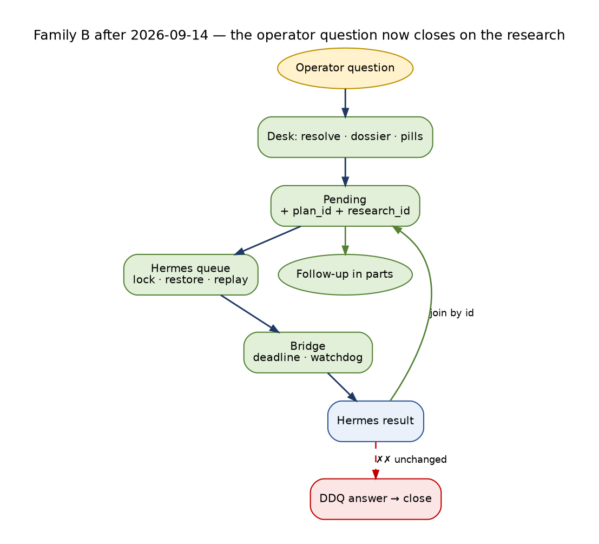

<!-- Lifecycle fact base B — Question and research lifecycles. Status: ACTIVE (measured, read-only, 2026-09-14 00:00–00:45 EDT). Synthesized in docs/architecture/TRADE_AI_AS_IS_LIFECYCLES_2026-09-14.md; targets in TRADE_AI_FUTURE_STATE_LIFECYCLES_2026-09-14.md. -->

> **Identity note, 2026-09-15 (rev 3).** This document is the measured record of 2026-09-14. Everything that shipped after it — PRs #1026–#1036 and the chief-architect remediation — is recorded in `docs/architecture/TRADE_AI_WORKLOG_2026-09-15.md`, which also states the live commit at the end of 2026-09-15. Read any "live at" line below as historical.

# Trade AI — QUESTION & RESEARCH LIFECYCLES (measured, end to end)

**Status:** ACTIVE — fact base, Question and research lifecycles (family B of 6); measured read-only 2026-09-14 00:00–00:45 EDT
**Updated:** 2026-09-14 23:44 EDT — update block below records what shipped after the measurement (live `341bce2c1`)


> **Update 2026-09-14 23:44 EDT — what changed after this measurement (live `341bce2c1`).** Numbers below are the 00:00–00:45
> measurement. Changes shipped on 2026-09-14:
>
> - **Operator question (§1):** dictated tickers resolve and Flash may not demote a re-entry ask (#1005); subject
>   dossier with spelled-out pills `🟢 Trade-AI data · 🔵 Looked up outside Trade-AI · 🟣 AI model (DeepSeek)` (#1005, #1007);
>   **the pending ↔ Hermes join now exists** — `research_id` stamped on the gap request, fulfil reads the Hermes result
>   by id, follow-up quotes the question (#1006; HPE research 09:16 → delivered 10:36); research-only asks answered
>   immediately with house facts; answers over 4,096 UTF-16 units sent as parts (#1016); `REPLY_NOT_DELIVERED` and
>   `RESEARCH_LANDED_UNSENT` findings (#1006, #1018).
> - **Hermes research (§3):** research heartbeat (#1014) — 136/219 failing and 32 lost requests measured on 09-14;
>   projection lock, restore from ledger (12 restored live), replay of retryable failures, guard false positives
>   masked, health score reads the lane, escalation retries no longer exit 127; model bridge deadline, threads,
>   `/health`, watchdog after a 906-second provider hold wedged it (#1019).
> - **System questions (§2):** Research Escalation Circle phase 1 (#1012, dry run): question GUID, laps, grounded
>   analyzer, check-ins. DDQ and research-object lifecycles unchanged.
> - **Topic research (§4):** unchanged.




```
Family:        Question and research lifecycles (agent 1 of 6, lifecycle series)
as_of:         2026-09-14 00:20 → 00:40 America/New_York (04:20Z–04:40Z)
Served:        CURRENT → c594d8600-main-exact-phase2-20260914-000703 (promoted 00:07 EDT)
Dev tree:      origin/main c594d8600 (hub tree — cron producers run here)
Running bot:   tradeai-cio-telegram PID 2613707, started 23:21:46 EDT from CURRENT path
               → it has a8a62217e code in memory, NOT c594d8600 (INFERRED: python loaded at start; no restart after 00:07 promote)
Method:        read-only psql (default_transaction_read_only=on), jsonl readers, journalctl, crontab -l,
               systemctl --user cat. No writes, no LLM/paid calls, no Telegram, no get_cio_snapshot.
Labels:        OBSERVED = read directly this run · INFERRED = reasoning over observed rows/code · BLOCKED = not measurable read-only / no traffic
Legend (flows): ══▶ spine · ──▶ read · ◀── write · ╌╌▶ feedback · ✗✗▶ severed (exists in spec/code, carries nothing)
Maturity:      L0 exists · L1 provenance+liveness · L2 grounded · L3 judgment validated · L4 loop closed · L5 unattended self-repair+self-report
Stores:        persistent state = /home/johnclaw/trade-ai-releases/persistent-state/data (CURRENT/data/cio and dev data/cio both resolve here — OBSERVED readlink)
               wake state = /home/johnclaw/trade-ai-state/persistent_wake
```

## 0 · The breaks, ranked (read this first)

| # | break | lifecycle | evidence (OBSERVED unless marked) |
|---|---|---|---|
| B1 | **26 Hermes research jobs can never run.** They are `queued` in the request ledger but **missing from the projection** the worker claims from. The oldest dates from 2026-08-31 (14 days ago), 21 are older than 24h, and all are priority `high`. | Hermes | `hermes_research_requests.jsonl` latest-status queued=26; `hermes_research_projection.json` by_research_id has 0 of those 26 (MISSING 26). `claim_next` reads only the projection (`cio_hermes_research.py:637-660`). The projection is updated by an unlocked load→modify→save of a 30 MB JSON (`:141-162`, `:284-327`), and `_load_projection` returns an empty projection on a parse error. Lost update = INFERRED cause. The worker runs every 15 min, finishes in ~0.4 s, and claims nothing |
| B2 | **The pending reply is not joined to its research, and the research lost its subject.** For SpaceX, `_enqueue_hermes_research(symbols=[])` created plan `plan_700fcdb8d259` with `symbols=["BOOK"]` (`cio_operator_desk_loop.py:2724`). Hermes researched **BOOK**, not SpaceX: `INSUFFICIENT_DATA`, stance WATCH, conf 0.2, 13 min after the ask. The pending row carries no `plan_id` (the join key sits only in `cio_operator_gap_requests.jsonl`). `try_fulfill_pending_replies` only re-runs `gather_tradeai_evidence(intent)` with `symbols=[]`, which can never be complete, and it expired the pending at 9.38 h saying "within 2h" | Operator Q | ledger rows quoted in §1f |
| B3 | **79% of 7-day Hermes CIO jobs fail.** 176 created: 137 failed, 27 completed, 12 queued. Failure classes: `execution language` refusal 58, COST_CAP 48, disconnect 11, CIRCUIT_OPEN 11, provider 7. **0 of 27 completions changed a thesis** (INSUFFICIENT_DATA 11 / CONFIRMS 9 / NO_NEW_INFO 7), and `notified=False` on 553/553 loop completions | Hermes | request/result ledgers |
| B4 | **System research targets are chosen alphabetically and include English words.** The cron builds targets with `sort -u`, then the producer takes `--limit 5`, so the first five alphabetical symbols win every hour. 10 of 13 subjects researched in 7d start with "A". `ABOVE` (144 objects) and `AGAIN` (120) are `UNRESOLVED_WITH_REASON` non-securities, i.e. **264/675 research objects (39%) and their Brave calls went to tagger false positives**. `PFSI`, `PYPL`, `WMT` sit at the end of today's 11-target file and never reach the cut | System Q | crontab line 1012; `research_objects.jsonl`; identity_registry |
| B5 | **Research objects are produced but mostly never consumed, and never advance state.** 675 objects, all `lifecycle_state=IDENTIFIED`. 143 (21%) consumed exactly once; 532 never. Produced→consumed p50 4.25 h, p90 46 h. "changed_question" is a label: `next_research_question` text is persisted nowhere (0 occurrences in wakes/agent_views/views) | System Q | wake store |
| B6 | **Questions never close.** `due_diligence_questions`: 872 rows, `answer_ids` set on **0**, `supersedes_guid` on **0**. Statuses reached: only ASKED/ROUTED. 317 ASKED from 09-06..09-09 are still unrouted (oldest 7.0 days). 502 answers exist in `hermes_external_research` (avg usefulness 0.59), but nothing writes them back. `research_gaps.jsonl`: 97 rows, 0 resolved, 88 older than 7 days, oldest 505 h. The gap resolver has **0 receipts ever** (`gap_resolution_receipts.jsonl` absent). `data_gap_registry` newest row 2026-05-24 | System Q / gaps | DB + files |
| B7 | **TOPIC slugs are routed to a security-only worker by construction.** `topic_curator.py:500-505` writes `agent_event_queue.symbol = "TOPIC:<id>"`. `agent_event_router.create_agent_jobs` (`agent_event_router.py:94-135`) copies it into `watchlist_agent_jobs` for each agent with no symbol validation. `process_watchlist_agent_jobs.py:2750` then rejects it ("research-directive / topic slug — not a security"). 193 TOPIC_INTELLIGENCE events in 7d, all marked `done`; 0 TOPIC jobs completed since 2026-06-22 | Topic | DB + code |
| B8 | **Replies are neither ledgered nor fully persisted.** 8d: 39 non-slash operator messages, **8 with an agent reply turn (20.5%)**. `cio_events operator.message`: 6 in 7d. `communication_events` OUTBOUND 7d has **no desk/converse/pending producer**. Sources line on **1 of 8** agent replies all-time | Operator Q | DB |
| B9 | **Promoted Hermes research never expires, and staged research is never reviewed.** `research_expires_at` is NULL on 359/359 staged and 2,074/2,074 promoted rows. Staged: ticker_thesis_challenge 246 (oldest 09-06), momentum 50, youtube 40, protection 23. `trigger_source`, `lane_used` and `budget_decision` are NULL on 1,166/1,166 rows created in 7d | Hermes (HRI) | DB |
| B10 | **Hermes topic research is subject-less.** `topic_monitor_bridge` promoted 118 rows in 7d, 118/118 with `symbol NULL`. `topic_curation_feedback` newest is 2026-09-02 (12 days stale). The curator log has 295 tracebacks (latest: `SSL connection has been closed unexpectedly`). `user_research_topics` last researched 2026-08-03. One `ri_research_queue` row has been `running` since 2026-08-01 | Topic | DB + logs |

---

## 1 · OPERATOR QUESTION LIFECYCLE (Telegram desk)

### 1a · Purpose, actors, stores

- **Purpose:** answer an operator's free-text or command question from house data first. When facts are missing, go and find them through declared vectors, then either reply, defer with a pending row, or say "no coverage". Close every pending row, and remember the exchange per subject.
- **Actors:**
  - Operator (2 allowlisted chats).
  - `tradeai-cio-telegram.service` → `scripts/cio_telegram_bot.py --loop`: long-poll `getUpdates` with 25 s timeout; fulfil pass every 3 polls (`:118-133`).
  - `scripts/lib/cio_telegram_converse.py`: `process_telegram_message` (`:1448`), `_best_effort_capture_turn` (`:1384`).
  - `scripts/lib/cio_converse_core.py`: `process_operator_message` (`:289`).
  - `scripts/lib/cio_operator_desk_loop.py`: `handle_operator_desk_question` (`:3114`).
  - `operator_subject_resolver.py`, `gap_resolver.py`, `reply_provenance.py`.
  - Hermes CIO queue (`cio_hermes_research.py`).
  - `check_operator_answer_quality.py` (`tradeai-operator-answer-quality`, ~30 min).
  - Phase-8 poller path: `run_telegram_callback_poller.py` (cron `*/2` keepalive) owns the **other** bot token and handles `/caps` (`:279`, `:791`) and `/approve|/deny` (`:285`).
- **Stores:**

| store | path | role |
|---|---|---|
| `operator_conversation_turns` | DB | both halves, identity-tagged |
| `inbound_operator_questions` | DB | legacy, dead since 09-06 |
| `data/cio/cio_events.jsonl` | persistent-state | `operator.message` desk receipts |
| `data/cio/cio_operator_pending_replies.jsonl` | persistent-state | pending ledger |
| `data/cio/cio_operator_gap_requests.jsonl` | persistent-state | gap/Hermes join key |
| `data_gap_registry` | DB | via `writers/data_gap_registry_writer.py` |
| `data/cio/gap_resolution_receipts.jsonl` | persistent-state | resolver receipts — does not exist |
| `hermes_research_requests/results.jsonl` + projection | persistent-state | Hermes queue |
| `cio_plans.jsonl` | persistent-state | plan events |
| `aif_memory.jsonl` | persistent-state | memory |
| `data/runtime/operator_answer_quality_last_run.json` | persistent-state | answer-quality receipt |

### 1b · State machine

**Desk result `kind`** (in-memory result, emitted to `cio_events` `payload.desk_kind`):

| kind | set at | trigger | terminal? |
|---|---|---|---|
| `slash` / `ack` | converse_core `:393`, `:415` | text starts `/cio` or `cio ` | yes |
| `attention` | desk `:3122-3137`; converse_core `:445` | deterministic regex (why haven't you told me / what should I pay attention to) | yes |
| `reentry_facts` | converse_core `:464-470` | `looks_like_reentry_purchase_query` | yes |
| `decision_thread` | converse_core `:508-523` | reply to a `dec_` message | yes |
| `unanswerable` | desk `:3143-3166` (up front) and `:3196-3208` (after blocking gaps) | `intent.answerable is False` (`is_answerable` `:3456`: market need with no resolved symbol) | yes (no pending) |
| `answered` | desk `:3232-3238` (resolver answered), `:3395-3410`, `:3413-3419` | evidence complete or freeform | yes |
| `no_coverage` | desk `:3252-3259` | every gap vector denied/exhausted | yes (no pending) |
| `deferred` | desk `:3283-3320` | blocking gaps remain after resolver queued / resolver disabled | **opens pending** |
| `answered` + `freeform_soft_queue` pending | desk `:3340-3380` | freeform with research soft-gaps on named symbols (`CIO_OPERATOR_FREEFORM_QUEUE=1`) | **opens pending** |

**Pending ledger `status`** (`cio_operator_pending_replies.jsonl`; append-only, latest row per `pending_id` wins, `try_fulfill_pending_replies` `:3597-3679`):

```
 (none) ──desk deferred / freeform_soft_queue──▶ open            (:3289, :3360)
 open ──evidence.complete on re-check──────────▶ fulfilled       (:3655-3667)  terminal
 open ──!answerable OR age ≥ limit─────────────▶ expired         (:3625-3649)  terminal
        limit = 2.0 h (PENDING_EXPIRY_HOURS :3421) or eta_seconds/3600 + grace 1 h (:3424)
 open ──send error──────────────────────────────▶ open (failed++, retried next pass)
 trigger: bot loop, every 3rd poll (~75 s when idle); only the 8 newest open rows (limit=8)
```

**Intent** (`analyze_operator_intent` `:328`):
- `source` is `heuristic` (regex, always first) or refined by DeepSeek Flash (`model deepseek-flash`, intent only, "numbers never come from this step").
- `intent` ∈ {attention, meta_system, reentry, cash, portfolio, risk, research, analyst_view, freeform, unclear}.
- `needs` ⊆ `_DESK_NEEDS | _RUNTIME_NEEDS`.
- Stamped with `answerable` / `unanswerable_reason` (`_stamp_answerable` `:304`).

**Gap resolver** (`gap_resolver.py`):
- Per-attempt `OUTCOMES` (`:88`): answered, queued, budget_denied, error, plus retired_skipped / no_coverage.
- Resolution outcome: answered | partial | queued | no_coverage (`:202`).
- Vector chain `DEFAULT_ON_GAP` (`:102-107`), with per-day caps and the ETA the desk quotes:

| vector | max/day | ETA quoted |
|---|---|---|
| refresh_producer | 6 | 120 s |
| backup_provider | 12 | 30 s |
| governed_search | 10 | 20 s |
| hermes_research | 4 | 1800 s |
| llm_curation | 6 | 60 s |
| operator_ask | 1 | 7200 s |

- Side-effecting vectors are dry-run unless `live_armed`.

**Other state:**
- **`data_gap_registry.status`**: `resolved` 73/73 (no `open` row exists).
- **Hermes request** (for desk-forced research): queued → running → completed | failed | superseded; see §3.
- **Turn** (`operator_conversation_turns`):
  - `role` ∈ {operator, agent} (CHECK, `inbound_identity_tagger.py:304`).
  - `identity_status` ∈ {CONFIRMED, UNRESOLVED_WITH_REASON, CANDIDATE, NULL}.
  - `matched_via` ∈ {ticker, company_name, ticker_alias, reply_context, NULL}.

### 1c · End-to-end flow

```
 OPERATOR (Telegram, 2 allowlisted chats)
      ║ free text / /cio / reply
      ▼
 ┌────────────────────────────────┐   getUpdates (25 s)                 ──▶ offset file
 │ 1 POLL  cio_telegram_bot --loop│   3 getUpdates errors since 09-06 (DNS ×2, timeout ×1)
 │ █ L1   PID 2613707 (a8a62217e) │   7 service restarts 09-13 (manual, after promotes)
 └───────────────┬────────────────┘
                 ║
 ┌───────────────▼────────────────┐ ◀── operator_conversation_turns (role=operator)  188 rows / 39 msgs
 │ 2 TAG + PERSIST (operator half)│      109 CONFIRMED/ticker · 10 company_name · 69 NULL
 │ ▓ L1 L2  tag_inbound → persist │ ──▶ identity_registry (10,409) · resolve_via_reply (reply context)
 │ best-effort, never blocks      │ ✗✗▶ inbound_operator_questions (5 rows, newest 09-06: dead)
 └───────────────┬────────────────┘ ✗✗▶ communication_events INBOUND: free text is NOT ledgered
                 ║                       (7d telegram_inbound 141 = callback_query / telegram_command only)
 ┌───────────────▼────────────────┐
 │ 3 ROUTE  converse_core         │──▶ slash /cio · ack · attention · reentry_facts · decision_thread
 │ █ L1                           │     (each terminal; /caps /approve live in the OTHER poller)
 └───────────────┬────────────────┘
                 ║ everything else
 ┌───────────────▼────────────────┐ ──▶ operator_subject_resolver (registry-first, book names)
 │ 4 INTENT + SUBJECT             │ ──▶ DeepSeek Flash (intent refine only)
 │ ▓ L2   heuristic → flash       │     subjects bound: 7d 8/32 distinct msgs (25%); 09-13 5/13 (38%)
 │ answerable stamped             │     SpaceX 09-13: symbols=[] (pre-#998 resolver) → research intent
 └───────────────┬────────────────┘
                 ║ answerable=False ──────────────────────────────▶ "I can't answer that…"  (terminal)
 ┌───────────────▼────────────────┐ ──▶ config/operator_evidence_contract.json (160 lines)
 │ 5 EVIDENCE gather_tradeai_…    │ ──▶ holdings / cio snapshot / reentry desk / ticker_prices /
 │ ▓ L2   house facts first       │     hermes_research_intelligence subject research / analysts
 └───────┬───────────────┬────────┘
   complete│               │ blocking gaps
         ║               ▼
         ║   ┌──────────────────────────────┐ ◀── data_gap_registry (writer)   0 rows in 7d ✗
         ║   │ 6 GAP REGISTER + RESOLVE (P7)│ ◀── cio_operator_gap_requests.jsonl  1 row all-time
         ║   │ ▓ L1  on_gap vector chain    │ ◀── gap_resolution_receipts.jsonl  ✗ FILE ABSENT (0 receipts)
         ║   └───┬──────────┬──────────┬────┘
         ║    answered   queued      denied ──▶ "no coverage" (terminal, no pending)
         ║       │          │
         ║       │          ▼
         ║       │   ┌──────────────────────────┐ ◀── cio_plans.jsonl  PLAN_CREATED S0_OPERATOR_CONVERSE
         ║       │   │ 7 HERMES ENQUEUE (forced)│      symbols = symbols[:4] or ["BOOK"]  ← subject LOST
         ║       │   │ ▓ L1                     │ ◀── hermes_research_requests.jsonl (see §3)
         ║       │   └───────────┬──────────────┘
         ║       │               ▼
         ║       │   ┌──────────────────────────┐ ◀── cio_operator_pending_replies.jsonl  status=open
         ║       │   │ 8 DEFER "I'll reply here"│      (pending row has NO plan_id / research_id)
         ║       │   └───────────┬──────────────┘
         ║       ▼               │
 ┌───────▼────────────────────┐  │  ──▶ subject_memory (SUBJECT_MEMORY_SQL :2401, per GUID, this chat)
 │ 9 CURATE _curate_from_…    │  │  ──▶ deepseek-flash (freeform / subject wording, validated)
 │ ▓ L2 subject brief · cards │  │
 └───────┬────────────────────┘  │
 ┌───────▼────────────────────┐  │  ──▶ reply_provenance.finalize_operator_reply (Sources / Went outside)
 │10 PROVENANCE + SEND        │  │      Sources line: 1 of 8 agent replies all-time; AQ 24h 1/5
 │ ▓ L1 send_cio_message      │  │ ✗✗▶ communication_events OUTBOUND: no desk producer in 7d
 └───────┬────────────────────┘  │ ◀── cio_events.jsonl operator.message (6 in 7d)
 ┌───────▼────────────────────┐  │ ◀── operator_conversation_turns role=agent  23 rows / 8 msgs
 │11 AGENT TURN PERSIST       │  │      reply_to set 23/23; p50 6.2 s, p90 14.6 s after question
 │ ▓ L1  (tagger on reply text│  │      tagger false subjects on agent text: P, S CONFIRMED; WENT/POP/ABOVE
 └───────┬────────────────────┘  │
         ║                       ▼
         ║        ┌─────────────────────────────────────┐   trigger: bot loop every 3rd poll
         ║        │12 FULFIL try_fulfill_pending_replies│── re-runs gather_tradeai_evidence(intent) ONLY
         ║        │ ✗ L0 for research-blocked pendings  │ ✗✗▶ hermes_research_results.jsonl (never read)
         ║        └───────┬───────────────────┬─────────┘ ✗✗▶ cio_operator_gap_requests.plan_id (never read)
         ║           fulfilled 0         expired 1 (SpaceX, 9.38 h, "within 2h")
         ║                                   │  ✗✗▶ communication_events (close not ledgered)
         ▼                                   ▼
 ┌──────────────────────────────────────────────────┐
 │13 LATER QUESTION: subject_memory recall (#1001)  │  0 agent turns since promote → BLOCKED (no traffic)
 └──────────────────────────────────────────────────┘
 ┌──────────────────────────────────────────────────┐ ──▶ cio_events · pending ledger · turns
 │14 ANSWER-QUALITY AUDIT check_operator_answer_q…  │ ◀── operator_answer_quality_last_run.json 04:22Z
 │ █ L1 report / ✗ repair                           │     7 findings: NO_SOURCES_LINE 4, FALSE_EMPTY_CLAIM 1,
 └──────────────────────────────────────────────────┘     BOOK_DUMP 1, MODEL_UNLABELLED 1 (all pre-#998 turns)
         ╎ findings never feed back into desk behaviour (no repair edge) ╎
```

### 1d · Iterations and loops

| loop | cadence | closes today? | evidence |
|---|---|---|---|
| poll | continuous, 25 s long-poll | █ yes | journal: 11,452 `processed=0 errors=0` lines since 09-06; 3 poll errors |
| pending re-check | every 3 polls (~75 s idle), newest 8 open rows | ✗ **no** for research gaps: the re-check reads house evidence only, never the Hermes result or plan | SpaceX: Hermes completed 16:45:39Z, pending still `open` until 01:55:43Z |
| pending expiry | same pass; 2 h or ETA+1 h | ▓ fires, but late and with a false reason | SpaceX expired at 9.38 h; reason text "within 2h". INFERRED from the `:3417-3420` comment: the pre-fix code used a bare `continue`, so expiry only started after the 09-13 promote |
| gap → registry → resolver cron | resolver cron `0 10-16 * * 1-5` | ✗ | registry newest 05-24; resolver receipts 0; gap-resolution monitor: 84 OPEN_NO_ATTEMPT |
| subject memory recall | on each later question naming a GUID | BLOCKED | 0 agent turns after #1001 promote |
| answer-quality audit | timer ~30 min | report only | findings unchanged run to run; unit exits 1 whenever findings exist |
| operator turn → persistent wake (M3) | hourly wake | ✗ | wakes carry `prior_operator_turn_ids=['115']` on 40/234, `[]` on 194; no turn after 09-11 ever reached a wake |

### 1e · Questions raised and where they go

| stage | question | raised by | answered by | closed by | dropped where |
|---|---|---|---|---|---|
| 4 | "what does the operator want, about which instrument?" | desk | heuristic + flash + resolver | intent object | 31 of 39 operator msgs (8d) have no persisted agent reply turn. The reply may have been sent but not captured, or converse was off on 09-10 (10 msgs, 0 replies) — INFERRED, cannot separate read-only |
| 4 | "can this ever be answered?" | desk (`is_answerable`) | deterministic | `unanswerable` reply | — |
| 5 | "are the required facts in house?" | desk (evidence contract) | `gather_tradeai_evidence` | answered | FALSE_EMPTY_CLAIM: facts existed (cash in holdings.json) but the reply said unavailable |
| 6 | "which vector can fetch the missing fact?" | desk → gap_resolver | vector chain | answered/queued/denied | **0 receipts ever**. Either the resolver never ran on a live desk gap, or it ran with receipts in another path (BLOCKED: no traffic since #998) |
| 7 | "what is the outlook for <subject>?" | desk → Hermes (operator_forced) | Hermes worker, bridge flash | `HERMES_LOOP_COMPLETED` | **the subject is replaced by BOOK at enqueue**, so the research answers a different question |
| 12 | "has the data landed yet?" | fulfil loop | re-gather house evidence | fulfilled/expired | **Hermes result never consulted.** SpaceX closed "could not answer" 9 h after research completed |
| 13 | "what did we discuss about this subject before?" | desk | SUBJECT_MEMORY_SQL | memory block | poisoned by agent-text tagger false positives (INFERRED risk) |
| 14 | "was the answer sourced and honest?" | AQ audit | deterministic checks | report | never closes: no remediation consumer |

### 1f · Live measurements

**Throughput and outcomes**

| metric | value | label |
|---|---|---|
| turns all-time | 211 (operator 188 rows / 39 msgs; agent 23 rows / 8 msgs); newest 09-13 21:59:50 EDT | OBSERVED |
| operator msgs by day (distinct) | 09-06 7 · 09-07 3 · 09-08 3 · 09-10 10 · 09-11 12 · 09-13 13 | OBSERVED |
| non-slash operator msgs 8d with agent reply turn | **8 / 39 (20.5%)** (09-06 2/7, 09-11 1/9, 09-13 5/10) | OBSERVED |
| questions bound to a subject | 7d 8/32 distinct msgs (**25%**); 09-13 5/13 (38%); operator rows CONFIRMED 119/188 (63%, row-inflated: one row per extracted symbol) | OBSERVED |
| question → reply latency (reply_to join) | n=8, **p50 6.2 s, p90 14.6 s** | OBSERVED |
| desk receipts `cio_events operator.message` | 21 all-time; 7d 6. 09-13: answered 4 (tradeai_deterministic 3, freeform_flash 1), deferred 1 (deferred_gap); 01:59Z Visa answered with provenance | OBSERVED |
| replies with Sources line | agent turns **1/8 (12.5%)**; AQ 24h: 1/5 turns with provenance | OBSERVED |
| pending ledger | 2 rows = 1 pending all-time. open 1 → expired 1; fulfilled **0** | OBSERVED |
| pending age at close | 9.38 h (limit 2 h) | OBSERVED |
| gap requests ledger | 1 row (`hermes_operator_forced`, plan_700fcdb8d259, symbols []) | OBSERVED |
| data_gap_registry | 73 rows, `resolved` 73, newest detected 2026-05-24; 0 in 7d | OBSERVED |
| resolver receipts | file absent → **0 attempts ever** | OBSERVED |
| AQ findings (04:22Z) | 7: NO_SOURCES_LINE 4, FALSE_EMPTY_CLAIM 1, BOOK_DUMP_FOR_NAMED_SYMBOL 1, MODEL_UNLABELLED 1, PENDING_NEVER_CLOSED 0, WENT_OUTSIDE_UNSTATED 0 | OBSERVED |
| outbound ledgering of desk replies | 0 desk/converse/pending rows in `communication_events` OUTBOUND 7d (producers seen: telegram_alert.send_telegram 674, send_watchpool_maturity_alerts 40, notify_material_change 17, agent:cio 16…) | OBSERVED |

**Items stuck beyond 2× cadence:** none open now. The one pending ran 9.38 h against a 2 h limit (4.7×), and the fulfil loop is ~75 s. The oldest open item is none; the ledger is empty of open rows. (OBSERVED)

**SpaceX, end to end** (UTC, OBSERVED from 4 ledgers):

```
16:32:33.086  cio_plans PLAN_CREATED plan_700fcdb8d259 S0_OPERATOR_CONVERSE (actor recorded: cio_situation_detector)
16:32:33.199  hermes request res_2bf4b0362b4e status=queued symbol=BOOK operator_forced=True
16:32:36      pending opr_5bc20393b457 status=open intent=research model=deepseek-flash symbols=[] gap hermes_research:research
16:32:36      gap_requests row {kind: hermes_operator_forced, plan_id: plan_700fcdb8d259, symbols: []}
16:45:26.199  CLAIMED by hermes-cio-worker-1 (timer/path)           ← 12.9 min queue wait
16:45:39.718  COMPLETED; result rr_96310a4df50d classification=INSUFFICIENT_DATA stance=WATCH conf=0.2 model=deepseek-flash
16:45:43      aif_memory mem_0be7b4ad… status CANDIDATE symbols ['BOOK']; plan PLAN_UPDATED (evidence merge)
16:46:20.233  HERMES_LOOP_COMPLETED critique=PARTIAL memory_accepted=True; WORKER_JOB latency_ms=13124
 … 9 h 9 min: pending re-checked ~every 75 s against house evidence with symbols=[] → never complete …
01:55:43      pending expired age 9.38 h reason "the required Trade-AI data did not arrive within 2h"
              no OUTBOUND communication_event for the close
```

### 1g · Failure paths

1. **Subject lost at Hermes enqueue:** `symbols[:4] or ["BOOK"]` (`:2724`), with default questions from `default_questions_for_plan` (`cio_hermes_research.py:163`) keyed on `BOOK`.
2. **Pending↔research join missing:**
   - The pending row has no `plan_id` / `research_id` (`:3285-3300`).
   - Fulfil reads only house evidence (`:3614`).
   - The join key sits in `cio_operator_gap_requests.jsonl`, which nothing reads.
3. **Silent re-check forever before the 09-13 fix.** It now expires, but the close reason is templated: the "within 2h" text comes from old code. The new `_closing_message` states real hours.
4. **Reply capture is best-effort and silent** (`_best_effort_capture_turn` swallows exceptions to stderr). Only 8 agent turns exist for 39 operator messages.
5. **Replies bypass the communication ledger/gateway**, so M4 consistency cannot be proven.
6. **Tagger runs on agent reply text**, producing false CONFIRMED subjects `P`, `S` that feed GUID memory recall.
7. **Long-running bot keeps stale code across promotes.** The PID started 23:21 while CURRENT moved to c594d8600 at 00:07 (INFERRED stale).
8. **The AQ audit reports but never repairs.** The systemd unit exits FAILURE whenever findings exist.
9. **Two Telegram consumers on different tokens.** `/caps` and `/approve` are handled by `run_telegram_callback_poller.py`, not the CIO bot. A `/cio` command typed in the wrong chat goes nowhere desk-visible (INFERRED).

### 1h · Maturity per stage

| stage | L | why |
|---|---|---|
| 1 poll | L1 | runs, logs, restarts under systemd; no self-repair of stale code |
| 2 tag/persist | L1–L2 | GUID tagging; best-effort, agent-text false positives |
| 3 route | L1 | deterministic |
| 4 intent/subject | L2 | registry-first; 25% bound in 7d |
| 5 evidence | L2 | house facts contract; FALSE_EMPTY_CLAIM seen |
| 6 gap resolve | L1 (code) / L0 (runtime) | 0 receipts |
| 7 Hermes enqueue | L1 | subject lost |
| 8 defer/pending | L1 | ledgered |
| 9 curate | L2–L3 | flash validated wording (`_validate_freeform_reply`, subject flash problems) |
| 10 provenance+send | L1 | 1/8 sourced; not ledgered |
| 11 agent turn | L1 | 20.5% coverage |
| 12 fulfil | **L0** for research pendings | loop never closes |
| 13 memory recall | L0 (BLOCKED) | no traffic |
| 14 AQ audit | L5-report only | no repair |

### 1i · Target lifecycle and exit conditions

**Target:**

```
ask ══▶ tag ══▶ intent+subject ══▶ evidence ══▶ answered
                                         └▶ gaps ══▶ resolver (receipt per attempt)
                                                     ├▶ fast answer ══▶ reply
                                                     └▶ queued (plan_id + research_id + subject_guid stamped ON the pending row)
                                                          ══▶ on HERMES_LOOP_COMPLETED(plan_id) ══▶ curate from result ══▶ follow-up
                                                          ══▶ or ETA+grace ══▶ honest close (age, cause, what's missing)
every send ══▶ communication_events OUTBOUND (gateway) ══▶ agent turn ══▶ subject memory ══▶ next wake
```

| exit condition | status |
|---|---|
| (i) every non-slash operator message has exactly one reply turn with Sources | **not met: 20.5% / 12.5%** |
| (ii) every pending closes as fulfilled or expired within limit+1 poll | **met 1/1 but late** |
| (iii) research-blocked pendings are fulfilled from the Hermes result when it lands | **not met: 0/1** |
| (iv) resolver receipts exist for every blocking gap | **not met: 0** |
| (v) desk replies ledgered | **not met: 0** |
| (vi) a new operator turn changes a next wake (M3) | **not met** |

---

## 2 · SYSTEM-RAISED QUESTION LIFECYCLE

Three producers of questions the system asks itself:
- (2A) persistent wake research → `changed_question`.
- (2B) due-diligence questions.
- (2C) CIO situation detector → plans → Hermes default questions.

### 2a · Purpose, actors, stores

**2A wake research**
- *Actors:*
  - Cron `:45` hourly (crontab line 1012): `jq` over `CURRENT/data/persistent_wake/selection_feed/material_changes.jsonl` → `sort -u` → `research_targets.jsonl` → `run_governed_research_producer.py --limit 5 --execute` (hub tree venv, `cd CURRENT`).
  - Brave via the governed router.
  - Cron `:00` hourly `run_persistent_wake.py --agent-id cio`, which runs `research_consumption.consume_dossier`.
- *Stores:* `research_targets.jsonl`, `research_objects.jsonl`, `research_producer_health.json`, `state/wakes.jsonl`, `state/receipts.jsonl`, `state/agent_views.jsonl`, `runtime/search_budget.json`.

**2B due diligence**
- *Actors:*
  - Cron `*/20` `due_diligence_questions.py --apply --route` (`LLM_GLOBAL_DAILY_USD_CAP=7.00`).
  - Curation lanes: flash first, then OAuth grok/chatgpt.
  - Routing to `hermes_external_researcher.py --lane <ranked>`.
- *Stores:* `material_changes` → `due_diligence_questions` (+ narratives) → `hermes_external_research`.

**2C situations**
- *Actors:*
  - `cio_situation_detector` (via `tradeai-cio-reactive` `cio_reactive_cycle.py --once`, and `cio_event_detector` crons).
  - `cio_plans` store.
  - `hermes_research_loop.emit_research_for_plan` (`should_enqueue_for_plan` gate `:290`).
- *Stores:* `cio_plans.jsonl` (event-sourced), `cio_events.jsonl` (`situation.raised`, `plan.enriched`, `thesis.changed`), Hermes request ledger.

### 2b · State machines

**2A research object** (`research_objects.jsonl.lifecycle_state`):
- Only value is `IDENTIFIED` (675/675). No transition exists in data.

**2A wake** (`wakes.jsonl`):
- `lifecycle_state`: SETTLED 230, MEMORY_MALFORMED 3, STALE 1.
- `selection.source`: unconsumed_research 200, material_change 34.
- `decision_summary.effect_kind`: changed_question 216, changed_commitment 14, None 4.
- `wake_reason`: scheduled_persistent_review 234.

**2A receipt** (`receipts.jsonl`):
- `lifecycle_state` SETTLED 182.
- `effect_kind`: changed_question 177, none 3, changed_commitment 1, changed_view 1.
- `policy_decision` consume.
- `source_kind`: research_object 143, material_change 33, memory_fact 3, operator_turn 2, comm_event 1.

**2A question field:**
- `AgentViewState.next_research_question` is set in `research_consumption._apply_relevant_effect` (`research_consumption.py:~140-160`) to `"What changed after: <title>"`.
- That happens **only when** the title/provenance blob contains EARNINGS|GUIDANCE|DOWNGRADE|UPGRADE|FDA|MERGER|INVESTIGATION.
- The persisted wake/view rows contain **0** `next_research_question` values (agent_views 193 rows, views 11 rows), so the question text is not durable (OBSERVED absence).

**2B `due_diligence_questions.status`:**
- DDL default `'ASKED'` (`due_diligence_questions.py:131`).
- → `ROUTED` + `routed_at` (`:606-608`) on a successful lane subprocess.
- On failure it stays ASKED (`:625-628`).
- A comment (`:89-91`) names EXPIRED / SUPERSEDED / RETIRED, but **no code writes them**. `answer_ids` and `supersedes_guid` are never written (0/872).

| status | lane (model col) | n | created | last routed |
|---|---|---|---|---|
| ASKED | deepseek-v4-flash | 317 | 09-06 23:21 → 09-09 11:40 | — |
| ROUTED | deepseek-flash | 300 | 09-10 → 09-13 02:40 | 09-13 11:00 |
| ROUTED | deepseek-v4-flash | 214 | 09-06 → 09-09 | **09-14 00:20** |
| ROUTED | chatgpt-oauth | 39 | 09-09 → 09-11 | 09-11 23:20 |
| ROUTED | grok | 2 | 09-06 | 09-06 |

Terminal state: none (ROUTED is a sink).

**2C plan** (`cio_plans.jsonl`, event types PLAN_CREATED 1,965 / PLAN_UPDATED 8,077 / PLAN_STATUS_CHANGED 1,997):
- Status transitions observed: →cancelled 1,642, →proposed 352, →accepted 3.
- Last status per plan: cancelled 1,308, proposed 337, draft 320.
- Plans are created `shadow=True` (469/470 in 7d).
- `revisit_at` is set but no revisit consumer was found (`tradeai-cio-defer-revisit` is dead since 08-19 per the platform factbase).

### 2c · Flow

```
 material_changes (DB, 240 in 7d) ──▶ selection_feed/material_changes.jsonl (CURRENT, re-created per promote)
        ║                                             │
        ║  :45 cron  jq | sort -u  ═══════════════════▶ research_targets.jsonl (11 targets now:
        ║                                               ABOVE, ALLE, APPF, EXPE, GRMN, … PFSI, PYPL, WMT)
        ║                                             │ --limit 5  → first 5 ALPHABETICAL  ✗ starvation
 ┌──────▼──────────────────────────────┐              ▼
 │2A-1 GOVERNED RESEARCH PRODUCER      │ ──▶ brave (governed router, caller cap 25/day)
 │ █ L1   produced=15 last run 03:45Z  │      daily 25/22/25/15 (09-11..14); denied 22 (09-11), 68 (09-13)
 │ llm=null, deterministic             │      CALLER_DAILY_CAP is NOT a spill reason → spilled_to null ✗✗▶ SearXNG
 └──────┬──────────────────────────────┘ ◀── research_objects.jsonl 675 (all IDENTIFIED)
        ║                                     39% on ABOVE/AGAIN (UNRESOLVED non-securities)
 ┌──────▼──────────────────────────────┐ ──▶ research_objects (unconsumed first)
 │2A-2 WAKE (hourly :00) consume       │ ◀── receipts.jsonl effect_kind=changed_question
 │ █ L1 L5 volume · ▓ substance        │ ◀── wakes.jsonl decision_summary.effect_kind
 │ keyword gate → "What changed after" │ ✗✗▶ next_research_question persisted: 0
 └──────┬──────────────────────────────┘
        ╎ next wake reads selection_feed again, NOT the changed question ╎ ✗ (no question→target edge)

 material_changes ══▶┌──────────────────────────────┐ ──▶ dossier (document_mentions / research corpus)
                     │2B-1 DDQ CURATE */20          │ ──▶ deepseek-flash → grok/chatgpt OAuth
                     │ ▓ L2  questions w/ citations │ ◀── due_diligence_questions status=ASKED
                     └──────────────┬───────────────┘     last question created 09-13 02:40 ("no dossier" since)
                     ┌──────────────▼───────────────┐ ──▶ rank_research_lanes (30d success, usefulness)
                     │2B-2 ROUTE (2 per run, NEWEST │ ◀── hermes_external_research (lane chatgpt 492)
                     │ first) hermes_external_…     │ ◀── status=ROUTED, routed_at
                     └──────────────┬───────────────┘     subject_guid copied onto answer row
                     ┌──────────────▼───────────────┐
                     │2B-3 ANSWER → QUESTION        │ ✗✗▶ answer_ids 0/872 · supersedes 0 · no EXPIRED/ANSWERED state
                     │ ✗ L0                         │ ╌╌▶ usefulness_score scored 492 (avg 0.59) → re-ranks LANES only
                     └──────────────────────────────┘

 holdings / reentry desk / cash ══▶┌──────────────────────────────┐ ◀── cio_plans PLAN_CREATED 470/7d (shadow)
                                   │2C-1 SITUATION DETECTOR       │ ◀── cio_events situation.raised 464 · plan.enriched 464
                                   │ █ L1 ▓ L2  S3 reentry_NEAR   │
                                   └──────────────┬───────────────┘
                                   ┌──────────────▼───────────────┐ ──▶ default_questions_for_plan (templated by S-type)
                                   │2C-2 should_enqueue → Hermes  │ ◀── hermes request (161 of 470 plans in 7d)
                                   └──────────────┬───────────────┘     → §3 (79% fail)
                                   ┌──────────────▼───────────────┐
                                   │2C-3 PLAN STATUS              │ ◀── cancelled 1,308 · proposed 337 · draft 320 · accepted 3
                                   │ ▓ revisit_at set, no revisit │ ✗✗▶ tradeai-cio-defer-revisit (dead since 08-19)
                                   └──────────────────────────────┘
```

### 2d · Iterations

| loop | cadence | closes? | evidence |
|---|---|---|---|
| target build → produce | hourly :45, 5 targets | ▓ runs; fixed alphabetical head | 13 subjects in 7d, 10 start with A; ABOVE 144, ADBE 123, AES 123, AGAIN 120 |
| produce → wake consume | hourly :00 | ▓ each object consumed at most once | 143/675 consumed; max reuse 1; p50 4.25 h, p90 46.25 h |
| consume → changed question → next target | — | ✗ | the question is not persisted and the target file is rebuilt only from material_changes |
| DDQ curate → route | */20 | ▓ routing drains 2/run | last 400 runs: routed (2,0) 269, failed (0,2) 130; questions>0 in 79/400 |
| DDQ answer → question close | — | ✗ | answer_ids 0 |
| DDQ answer → lane rank | per run | █ yes (lane-level only) | `rank_research_lanes` reads 30d success + avg usefulness |
| situation → plan → Hermes → plan evidence | reactive cycle | ▓ | 161/470 plans enqueue research; see §3 fail rate; accepted 3 all-time |

### 2e · Questions and their fate

| question | raised by | n (7d unless noted) | answered | closed | dropped |
|---|---|---|---|---|---|
| "What changed after <headline>?" | wake consumption | 177 changed_question receipts | no answer path | never | **text not persisted**; "changed" repeats on identical inputs (factbase: 3 objects re-selected 17/10/9×) |
| Research need on material subject | producer | 5 targets/h | Brave result → research object | never (IDENTIFIED forever) | 532 never consumed; 264 on non-securities |
| Due-diligence question with `why_now` / `what_would_settle_it` | DDQ | 872 all-time | 502 answered in `hermes_external_research` (p50 2.7 h, p90 97 h after question) | **0** | 317 ASKED unrouted since 09-06..09-09; `what_would_settle_it` never evaluated |
| "Is <sym> weight drift price- or flow-driven?" etc. (S6/S1/S5 templates) | situation → Hermes | 161 plan requests | 27 completed / 137 failed / 12 queued (whole CIO queue) | plan updated | 26 queued forever (B1) |
| "What research would change the advisory on <sym>?" (S3/S7/S0 default) | situation → Hermes | S3 105 requests | as above | — | S0 falls back to BOOK |

### 2f · Live measurements

| metric | value |
|---|---|
| research_objects | 675; by day 09-10 105 · 09-11 264 · 09-12 150 · 09-13 156 |
| producer health | 03:45Z `outcome=produced produced=15 failed=0 budget_denied=0` (source_sha a8a62217e) |
| distinct RO subjects 7d | 13 |
| RO on UNRESOLVED non-securities | ABOVE 144 + AGAIN 120 = **264 (39%)**; sample titles "Stock Catalyst Calendar — …", "Catalysts - Yahoo Finance" |
| RO consumed | 143 (21%); produced→first consume p50 4.25 h, p90 46.25 h |
| wakes | 234 (all 7d window since 09-10); subjects 26 all-time |
| Brave daily used (limit 120, caller cap 25) | 09-11 25 · 09-12 22 · 09-13 25 · 09-14 15; monthly 178/1500; denials 09-11 22, 09-13 68 |
| DDQ created by day | 09-06 30 · 09-07 125 · 09-08 176 · 09-09 204 · 09-10 96 · 09-11 187 · 09-12 35 · 09-13 19 |
| DDQ routed by day | 09-06 4 · 09-07 82 · 09-08 8 · 09-09 7 · 09-10 124 · 09-11 130 · 09-12 52 · 09-13 144 · 09-14 4 |
| DDQ oldest open | ASKED 2026-09-06 23:21 EDT (7.0 days). INFERRED drain ETA at 2 per 20 min ≈ 53 h |
| DDQ question→answer | n=504, p50 2.7 h, p90 97 h |
| DDQ answer usefulness | 0.0–0.3: 40 · 0.4–0.5: 97 · 0.6–0.7: 203 · 0.8–1.0: 153 · null 10 |
| plans created 7d | 470 (S3 410 [reentry_NEAR 370, READY 40], S6 29, S5 15, S7 14, S0 1, S1 1); 48 distinct S3 symbol sets |
| plans with Hermes request | 161/470 (34%) |

### 2g · Failure paths

1. **Alphabetical target starvation** from `sort -u` plus `--limit 5`. Non-A subjects (PFSI, PYPL, WMT) never researched.
2. **Tagger false-positive subjects in `material_changes`** (ABOVE, AGAIN) pass through the selection feed into the research budget. The producer requires only a `subject_guid`, not CONFIRMED identity (`_resolve_targets`).
3. **Caller cap denial doesn't spill.** `CALLER_DAILY_CAP` is listed as `not_a_spill_reason`, so SearXNG sits idle while the producer is denied 68×/day.
4. **"changed_question" is a keyword-gated label.** No question text persists and no edge feeds a question back into target selection.
5. **DDQ route is LIFO with limit 2.** Older questions starve while new ones arrive, and there is no expiry. They drain only once creation stops ("no dossier" since 09-13 02:40).
6. **DDQ answers are never joined back** (answer_ids 0). `what_would_settle_it` is never tested. The subprocess join relies on exact `h.question = q.question` text match (502/555 joined).
7. **Plans are shadow and 67% end cancelled.** `revisit_at` has no live consumer.

### 2h · Maturity

| stage | L | note |
|---|---|---|
| 2A-1 target build | L1 | provenance-stamped; wrong ordering, false subjects |
| 2A-2 produce | L1 (L5 health file) | llm null; budget receipts |
| 2A-3 consume | L1 | receipts SETTLED; effect not substantive |
| 2A-4 question → next target | L0 | |
| 2B-1 DDQ curate | L2–L3 | cited, grounded against dossier (`ground()`), multi-lane |
| 2B-2 route | L1 | |
| 2B-3 answer→close | L0 | |
| 2B lane ranking | L4 (narrow) | usefulness feeds lane order |
| 2C detect | L1–L2 | |
| 2C Hermes enqueue | L1 | |
| 2C plan revisit | L0 | |

### 2i · Target and exit conditions

**Target:**

```
material change ══▶ confirmed subject ══▶ question (persisted: text, why_now, settle_condition, subject_guid)
   ══▶ research routed by priority/age (not alphabet)
   ══▶ answer joined to question_guid
   ══▶ settle test ══▶ ANSWERED | SUPERSEDED | EXPIRED
   ══▶ changed next_research_question persisted
   ══▶ next target
```

| exit condition | status |
|---|---|
| (i) ≥90% of research spend on CONFIRMED securities | **61% (INFERRED from 39% on ABOVE/AGAIN)** |
| (ii) no target starved >24 h | **not met** |
| (iii) every question reaches a terminal state within TTL | **0/872** |
| (iv) `next_research_question` diff visible between consecutive wakes (M1) | **not observed** |

---

## 3 · HERMES RESEARCH LIFECYCLE

There are two Hermes lifecycles that do not share state (INFERRED from stores and writers).

**3A · CIO Hermes queue** (JSONL, plan-driven):
- `cio_hermes_research.py` + `hermes_research_queue.py` + `hermes_worker.py` + `hermes_research_loop.on_hermes_completed`.
- Worker `tradeai-hermes-cio-worker`: `.timer` `OnCalendar=*:0/15` + `.path` `PathChanged=CURRENT/data/cio/hermes_research_requests.jsonl`; `ExecStart hermes_cio_worker.py --drain --max 2 --backend live`.
- Calls go through the governed bridge `cio-governed-bridge.service` (:8766).

**3B · Hermes research fleet → `hermes_research_intelligence` (HRI):**
- Many producers: Grok stop_curation, options_research_bridge, topic_monitor_bridge, ticker_research_agent, deep_research_local, catalyst_momentum_engine, youtube_discovery, StopHealthMonitor, protection_advisor, librarian.
- `hermes_coordinator.py` (cron `*/15`) runs `auto_promote` (staged→promoted, cap 10/tick, learned per-type confidence gate, audited in `hermes_promotion_audit`).
- Librarian retention timers archive/purge.
- `hermes_external_research` is the external-lane answer store used by DDQ and the challenge queue.

### 3a · Stores

| store | path | notes |
|---|---|---|
| request ledger | `data/cio/hermes_research_requests.jsonl` | 21 MB, 6,808 events |
| results ledger | `data/cio/hermes_research_results.jsonl` | 556 rows |
| projection | `data/cio/hermes_research_projection.json` | 30 MB, 1,209 rids |
| memory | `aif_memory.jsonl` (+ admissions 932) | |
| plans | `cio_plans.jsonl` | |
| HRI | DB `hermes_research_intelligence` | 34,516 |
| audit | DB `hermes_promotion_audit` | |
| memory events | DB `hermes_memory_events` | 11,501 |
| external lanes | DB `hermes_external_research` | 50,148 |
| search budget | `runtime/search_budget.json` | |
| research cards | DB `watchlist_research_cards` | 3,138 |

### 3b · State machines

**3A request** (`hermes_research_queue.py:26-27`):
- `IN_FLIGHT = {queued, running, started}`, `TERMINAL = {completed, failed, cancelled, superseded}`.
- Enqueue decision reasons: created | duplicate_in_flight | priority_bumped | reused_fresh_result | blocked_non_retryable (`:57-58`).

```
 (plan emit / operator_forced) ──enqueue_research_request──▶ queued  (REQUESTED + ENQUEUE events; projection by_research_id)
   ├─ fingerprint in flight ──▶ (no new row) duplicate_in_flight | priority_bumped
   ├─ fresh completed same fp ──▶ reused_fresh_result (status completed, no call)
   ├─ prior failures exec_language / cost_cap ──▶ blocked_non_retryable
 queued ──claim_next (projection only, priority→created_ts)──▶ running   (CLAIMED; worker_id)
 queued ──questions missing──▶ failed "questions_required"
 running ──reap_stale_running──▶ (REAPED 4 events all-time)
 running ──bridge ok + validate_result──▶ completed (COMPLETED; results row; LOOP_COMPLETED: critique, memory, reassessment, notify)
 running ──HTTP 429 COST_CAP / 503 CIRCUIT / 500 / disconnect / execution-language refusal / truncated──▶ failed
 queued|running ──replace_open──▶ superseded (0 observed)
```

Observed values:
- Event counts: ENQUEUE 1,384 · REQUESTED 1,235 · WORKER_JOB 1,209 · CLAIMED 1,205 · FAILED 654 · COMPLETED 556 · LOOP_COMPLETED 553 · PATCHED 8 · REAPED 4.
- Latest status per research_id: failed 653, completed 556, queued 26.

**3A loop completion:**
- `critique_verdict` ∈ {VALID 452, PARTIAL 89, None 12}.
- memory: `accepted=True reason=candidate` 477, `no_memory_safe_summary` 63.
- `notified=False` 553/553.
- `material_changed` False 533 / None 20.
- `reassessment_ok` True 530.

**3A result `classification`:** CONFIRMS 168, INSUFFICIENT_DATA 34, STRENGTHENS 16, NO_NEW_INFO 14, None 324.

**aif_memory from Hermes:**
- `producer=hermes_case_summary` 416 rows, `source_kind=HERMES_VALID_COMPLETE`, `status CANDIDATE`, `expires_at` = created + 30 d.

**3B HRI `status`:**

| status | n | created range | note |
|---|---|---|---|
| archived | 29,603 | → 09-09 | `research_expires_at` past on 3,507 |
| rejected | 2,480 | 06-02 → 07-09 | dead state |
| promoted | 2,074 | since 08-30 | `research_expires_at` **NULL 2,074/2,074** |
| staged | 359 | since 09-06 | `research_expires_at` NULL 359/359 |

- Transitions:
  - insert→staged (ticker_research_agent, catalyst_momentum_engine, youtube, protection).
  - insert→promoted directly (Grok, options bridge, topic bridge, deep_research_local, StopHealth).
  - staged→promoted (`hermes_coordinator.auto_promote`, `writers/hermes_research_writer.set_status`).
  - promoted/staged→archived (librarian retention).
- `reviewed_by` NULL on all 7d updates.
- `promoted_to_table` set on only 15 rows (`llm_intelligence_cache`).

**`hermes_external_research.status`:**
- All-time: sent 34,796 · error 14,747 (newest 09-09) · auth_pending 427 · unavailable 136 · skipped 41 · credits_required 1.
- 7d: sent chatgpt 960 / grok 444 / deepseek 81; error deepseek 119; skipped 41; unavailable 41.

### 3c · Flow

```
 cio_situation_detector ──PLAN_CREATED──┐        operator desk (forced) ──S0 plan, symbols→BOOK──┐
                                         ▼                                                        ▼
 ┌──────────────────────────────────────────────────────────────────────────────────────────────────┐
 │ 1 PLAN  cio_plans.jsonl   ▓ L1   470 plans/7d, shadow · 161 enqueue research                      │
 └───────────────────────────────────────┬──────────────────────────────────────────────────────────┘
                                         ║ emit_research_for_plan (should_enqueue gate, default_questions_for_plan)
 ┌───────────────────────────────────────▼──────────────────────────────────────────────────────────┐
 │ 2 JOB  enqueue_research_request  ▓ L1   fingerprint dedup · fail-policy gate                      │
 │   ◀── requests.jsonl REQUESTED+ENQUEUE     ◀── projection.json by_research_id (UNLOCKED rewrite) │
 │   7d: 176 created (150 created, 26 duplicate_in_flight)       ✗✗ 26 queued MISSING from projection│
 └───────────────────────────────────────┬──────────────────────────────────────────────────────────┘
                                         ║ timer */15 + path unit · --drain --max 2
 ┌───────────────────────────────────────▼──────────────────────────────────────────────────────────┐
 │ 3 CLAIM  claim_next (projection only)   ▓ L1    queue wait p90 13 min (7d)                         │
 └───────────────────────────────────────┬──────────────────────────────────────────────────────────┘
 ┌───────────────────────────────────────▼──────────────────────────────────────────────────────────┐
 │ 4 SEARCH/SYNTH  BridgeHermesResearchBackend → governed bridge :8766 → deepseek-flash              │
 │   ▓ L2   latency_ms p50 15.2 s, p90 34.7 s          ──▶ search_budget.json (brave)  ✗✗▶ SearXNG spill│
 │   7d fail 137/176: exec-language 58 · COST_CAP 48 · disconnect 11 · CIRCUIT 11 · provider 7         │
 └───────────────────────────────────────┬──────────────────────────────────────────────────────────┘
 ┌───────────────────────────────────────▼──────────────────────────────────────────────────────────┐
 │ 5 CRITIQUE  ▓ L3(partial)  VALID 452 · PARTIAL 89 (all-time); 7d VALID 16 · PARTIAL 11             │
 └───────────────────────────────────────┬──────────────────────────────────────────────────────────┘
 ┌───────────────────────────────────────▼──────────────────────────────────────────────────────────┐
 │ 6 MEMORY ACCEPT research_memory_bridge.admit_from_research   ▓ L1                                  │
 │   ◀── aif_memory.jsonl status CANDIDATE (hermes_case_summary 416) · expires +30 d                  │
 └───────────────────────────────────────┬──────────────────────────────────────────────────────────┘
 ┌───────────────────────────────────────▼──────────────────────────────────────────────────────────┐
 │ 7 PLAN MERGE + NOTIFY  on_hermes_completed   ◀── PLAN_UPDATED                                       │
 │   material_changed False 533 · notified False 553/553  ✗✗▶ operator · ✗✗▶ pending reply (§1)      │
 └───────────────────────────────────────┬──────────────────────────────────────────────────────────┘
                                         ║ (no write into hermes_research_intelligence observed)
 ═══════════════════════════════ separate lifecycle 3B ═══════════════════════════════════════════════
 Hermes fleet producers ══▶ HRI insert  (7d 1,166: promoted ~840 direct, staged ~324)
      │   trigger_source/lane_used/budget_decision NULL 1,166/1,166   ✗ provenance
      ▼
 ┌──────────────────────────────┐ ──▶ hermes_promotion_thresholds (learned per-type)
 │ STAGED  359 (oldest 09-06)   │ ◀── hermes_promotion_audit 68–177/day to 09-11; 23 · 38 · 5 on 09-12..14
 │ coordinator */15 cap 10/tick │
 └──────────────┬───────────────┘
 ┌──────────────▼───────────────┐ ──▶ consumers: desk subject_research (SUBJECT_RESEARCH_SQL :2055), rag_indexer,
 │ PROMOTED 2,074               │     api_v2 hubs, watchlist_research_cards (3,138, newest 09-12 20:00 ✗ stalled)
 │ research_expires_at NULL all │ ✗✗▶ expiry → re-research (no expiry set, no trigger)
 └──────────────┬───────────────┘
 ┌──────────────▼───────────────┐
 │ ARCHIVED 29,603 (librarian)  │ ◀── archive churn 302–729/day (09-06..12), 77 (09-13), 24 (09-14)
 └──────────────────────────────┘
```

### 3d · Iterations

| loop | cadence | closes? | evidence |
|---|---|---|---|
| worker drain | */15 + on ledger change | ▓ drains new jobs, **never the 26 orphans** | journal runs ~0.4 s; oldest queued 08-31 |
| stale running reaper | per claim | █ | REAPED 4 |
| fail-policy replay block | per enqueue | █ (prevents re-spend) | EXEC_LANG / COST_CAP gate in `replay_decision` |
| fingerprint reuse | per enqueue | █ | 26 duplicate_in_flight in 7d |
| research → memory → next wake | hourly wake | ▓ memory rows admitted as CANDIDATE; wake memory load is single-subject | factbase: memory>0 on 36/108 wakes, all one subject |
| research → operator notify | on completion | ✗ | notified 0/553 |
| HRI staged → promoted | */15 | ▓ slowing | audit 177 (09-10) → 5 (09-14) |
| HRI expiry → re-research | — | ✗ | expires_at NULL on live rows |
| result usefulness → lane rank | DDQ path | █ narrow | §2 |

### 3e · Questions

| question | origin | fate |
|---|---|---|
| templated S-type questions ("What catalysts land for NOC in 10 sessions?") | plan | 15% answered in 7d; 26 orphaned; answers are "INSUFFICIENT_DATA/CONFIRMS/NO_NEW_INFO" 27/27 → no thesis change |
| operator outlook (SpaceX) | desk | **re-keyed to BOOK**; answered INSUFFICIENT_DATA at +13 min; never joined to pending (dropped) |
| "is this output safe?" (execution-language scan) | worker | 58 refusals in 7d. The outputs contained advisory language ("Under the…", "The standing…"), **so the job fails rather than being redacted** |
| ticker_thesis_challenge (246 staged) | fleet | waiting on promote gate, p50 age 58 h |
| DDQ questions → external lanes | §2 | answered, not closed |

### 3f · Live measurements

| metric | value |
|---|---|
| CIO queue 7d created / completed / failed / queued | 176 / 27 (15.3%) / 137 (77.8%) / 12 |
| by day (created → completed/failed) | 09-07 2/20 · 09-08 3/29 · 09-09 2/26 · 09-10 3/23 · 09-11 6/18 · 09-12 5/9 (+4 q) · 09-13 6/13 (+5 q) |
| plan (request) → completed | 7d n=27: p50 ≈ 0 min (synchronous emits), **p90 13.1 min**; bridge latency p50 15.2 s / p90 34.7 s |
| stuck beyond 2× cadence (30 min) | **26 queued** (21 > 24 h; oldest `res_9f01cdb13f60` NOC S6, 2026-08-31T00:03Z) |
| situation mix of 7d requests | S3 105, S6 40, S5 16, S7 14, S0 1 |
| results 7d | 27; symbols BOOK 11, DFSC 7, AUUD 4, GXAI 2, PEW 2, RKLB 1 |
| HRI 7d created | 1,166 (promoted 840, staged 326 by agent table); promoted per day 65/132/146/164/177/154/**23/38/5** |
| HRI staged backlog | 359: ticker_thesis_challenge 246 (p50 58 h), momentum_catalyst 50 (116 h), youtube_discovery 40 (106 h), protection_advisory 23 (62 h) |
| HRI rows with a subject_guid | 17,715/34,516 (51%); symbol NULL 16,710 |
| research cards | 3,138; newest 2026-09-12 20:00:56 EDT (29 h stale) |
| Brave | 178/1500 monthly; caller cap binding (denials 22, 68); spill never used |
| external lanes 7d | chatgpt sent 960, grok 444; deepseek error 119 (to 09-09) |

### 3g · Failure paths

1. **Projection lost-update** (B1): 26 orphans, never retried. The worker has no ledger→projection reconcile.
2. **Execution-language refusal is the #1 failure** (58). It is a correct refusal, but it fails the whole job and gets a permanent replay block (`blocked_non_retryable`), so the question dies.
3. **COST_CAP (48) and CIRCUIT_OPEN (11)** from the governed bridge: the budget binds before value.
4. **Subject substitution to BOOK** for subject-less plans (11/27 results in 7d are BOOK).
5. **Completion never notifies** (0/553) and never joins operator pendings.
6. **HRI provenance fields are empty** on all new rows, so budget and lane cannot be audited per row.
7. **No expiry on live rows**, so "expiry → re-research" cannot fire. Archive churn is policy-driven, not expiry-driven.
8. **Promotion throughput collapsed 09-12..09-14** (23/38/5 vs 150+/day). INFERRED: coordinator guard (`llm_priority_guard.sh`) or confidence gate. Cause not isolated read-only.

### 3h · Maturity

| stage | L | note |
|---|---|---|
| plan | L1 | |
| job/enqueue | L1 | dedup + fail policy solid |
| claim | L1 | orphan defect |
| search/synthesis | L2 | grounded questions, 79% fail |
| critique | L3 partial | VALID/PARTIAL; never INVALID observed |
| memory accept | L1 | CANDIDATE only |
| notify/join | L0 | |
| HRI staged→promoted | L1–L2 | learned gate, audited, reversible |
| expiry/re-research | L0 | |
| archive | L1 | |

### 3i · Target and exit conditions

**Target:**

```
plan(question, subject_guid) ══▶ job (ledger = source of truth; projection rebuilt/locked)
   ══▶ claim ══▶ search (Brave → SearXNG spill incl. caller cap)
   ══▶ synthesis (redact, not reject)
   ══▶ critique (can say INVALID)
   ══▶ memory (CANDIDATE → ACCEPTED on corroboration)
   ══▶ HRI promoted with expires_at
   ══▶ consumers (desk pending join by plan_id, wake, cards)
   ══▶ expiry ══▶ re-research
```

| exit condition | status |
|---|---|
| (i) 0 queued jobs older than 2× worker cadence | **26** |
| (ii) 7d completion rate ≥70% | **15%** |
| (iii) every operator-forced completion joined to its pending within one fulfil pass | **0/1** |
| (iv) `research_expires_at` set on 100% of promoted | **0%** |
| (v) ≥1 completion changed a thesis or next question (M1) | **0/27 in 7d** |

---

## 4 · TOPIC / THEMATIC RESEARCH LIFECYCLE

### 4a · Purpose, actors, stores

- **Purpose:** keep non-security themes (retirement, IRMAA, Roth, AI network layer, defense sector) researched and curated into RAG, and notify agents.
- **Actors:**

| actor | schedule | notes |
|---|---|---|
| `topic_ingestion.py` | crontab lines 776-777: 20:45 weekdays + 02:45 daily, non-trading-hours gate | youtube_api, google_news_rss, yahoo_search, brave_news (caller cap 5), duckduckgo |
| `topic_curator.py` | 09:30, 13:30 and 18:30 (`--ensemble`) | FREE OAuth lanes grok→chatgpt→local via `grok_oauth_proxy.py` :8645; long-running `grok` tmux sessions since 09-12 |
| `agent_event_router.py` | `*/30` | |
| `process_watchlist_agent_jobs.py` | market-15m | |
| `hermes_topic_monitor_bridge.py` | 07:30 | |
| `hermes_research_agenda.py` | 07:45, 18:15 | |
| `research_insight_extractor.py` | 06:50 / 12:50 / 18:50 | |
| `iterate_research_topics.py` | 08:00 weekdays | |
| `research_intelligence_queue.py` | 16:45 weekdays, 02:40 drain | |

- **Stores:** `topic_monitor` (420), `news_articles.rag_status`, `blocked_content`, `topic_curation_feedback` (771), `agent_event_queue`, `watchlist_agent_jobs`, `hermes_research_intelligence` (research_type topic_research), `research_insights` (47,896), `user_research_topics` (61), `ri_research_queue` (419).

### 4b · State machines

- **`topic_monitor`:** `enabled` t/f, `owner` ∈ {shared 374, hermes 25 enabled + 21 disabled}, `auto_created`, `last_searched`.
- **`news_articles.rag_status`** (curator): pending → approved | low_quality | blocked. The ensemble rescue moves low_quality → approved. Log snapshot: 30,856 topic articles, 23,611 approved (76.5%), 938 low, 3,323 blocked, 2,984 pending.
- **`agent_event_queue.status`:** pending → done (router). `TOPIC_INTELLIGENCE` 193/193 `done` in 7d, regardless of job outcome.
- **`watchlist_agent_jobs.status`** for `TOPIC:*`: queued → failed (symbol-gate) | deferred | superseded | expired | completed.

| TOPIC job status | n all-time | window |
|---|---|---|
| completed | 2,434 | iris May–Jul |
| completed (event_router) | 61 | ≤ 06-22 |
| expired | 2,082 + 116 | |
| failed | 1,846 + 474 + 96 | |
| deferred / superseded | ~73 / ~53 | |

- **HRI `topic_research`:** inserted `promoted` (118 in 7d, symbol NULL 118).
- **`ri_research_queue.status`:** done 323, failed 95, **running 1 since 2026-08-01**.
- **`user_research_topics.status`:** active 61 (last_researched max 2026-08-03).

### 4c · Flow

```
 topic_monitor (420)  ──▶ search_queries / llm_generated_queries
        ║
 ┌──────▼─────────────────────────┐ ──▶ google_news_rss · yahoo · brave_news (cap 5/day) · ddg · youtube
 │ T1 INGEST topic_ingestion      │ ◀── news_articles (rag_status pending) · youtube_transcripts
 │ █ L1  last 09-13 02:45: 14 topics, 366 articles │ ◀── topic_monitor.last_searched (newest 09-13 03:10)
 └──────┬─────────────────────────┘
        ║ triggers curator in background
 ┌──────▼─────────────────────────┐ ──▶ grok OAuth :8645 → chatgpt :8646 → local (free lanes)
 │ T2 CURATE topic_curator        │ ◀── news_articles.rag_status approved/blocked · blocked_content
 │ ▓ L2  ~200 rated/run, 76% appr │ ◀── topic_curation_feedback  ✗ newest 2026-09-02 (12 d stale)
 │ 295 tracebacks in log (SSL)    │ ◀── agent_event_queue TOPIC_INTELLIGENCE symbol="TOPIC:<id>"  (193/7d)
 └──────┬─────────────────────────┘
        ║
 ┌──────▼─────────────────────────┐   create_agent_jobs: `if not symbol` is the ONLY check
 │ T3 ROUTE agent_event_router */30│ ◀── watchlist_agent_jobs(symbol="TOPIC:…", request_type=research,
 │ █ runs · marks event done      │      submitted_from=event_router) × agents_to_notify (alex/aegis/maria/steph)
 └──────┬─────────────────────────┘
        ║
 ┌──────▼─────────────────────────┐   symbol_validation: "research-directive / topic slug — not a security"
 │ T4 SECURITY WORKER             │ ✗✗▶ failed (09-13: 8) · expired · superseded · deferred
 │ ✗ L0 for topics                │     0 TOPIC job completed since 2026-06-22
 └────────────────────────────────┘

 topic_monitor owner∈{hermes,shared} ══▶┌────────────────────────────────┐
                                        │ T5 hermes_topic_monitor_bridge │ ◀── HRI topic_research (promoted 118/7d)
                                        │ █ L1  07:30  "reconciled 17"   │     symbol NULL 118/118 → subject-keyed
                                        └──────────────┬─────────────────┘     consumers never see them ✗
                                                       ▼
                                          rag_indexer (promoted) ──▶ RAG only

 news/catalyst ══▶ research_insight_extractor (3×/day) ◀── research_insights ~300 news + ~300 catalyst/day, 0 topic slugs
 user_research_topics (61) ══▶ iterate_research_topics (08:00 wkdy)  ✗ last_researched 2026-08-03
 ri_research_queue ══▶ research_intelligence_queue --drain   ✗ 1 row `running` since 08-01; last request 09-01
```

### 4d · Iterations

| loop | cadence | closes? | evidence |
|---|---|---|---|
| ingest → curate | 2×/day + background | █ runs, flaky | log: runs with 174–195 approved/200; SSL tracebacks |
| curate → feedback (query refinement) | per run | ✗ since 09-02 | `topic_curation_feedback` newest 09-02 |
| curate → agents (TOPIC events) | per run → */30 router | ✗ | 193 events → jobs → symbol-gate reject |
| topic → Hermes → HRI | daily 07:30 | ▓ | 118 promoted rows, subject-less; bridge "0 enqueued of 0 eligible" on latest runs |
| user topics iterate | weekdays 08:00 | ✗ | last_researched 08-03 |
| RI queue drain | 16:45 / 02:40 | ✗ | 1 zombie running; no requests since 09-01 |

### 4e · Questions

| question | raised by | fate |
|---|---|---|
| "what's new on topic X?" | ingestion (queries) | articles saved, curated |
| "is this article relevant/quality?" | curator LLM (free lanes) | approved/blocked; feedback table stale |
| "agents, analyse topic X" | curator → router | **dropped at symbol gate** (security worker only) |
| "Hermes, research topic X" | bridge | answered into HRI, but not joinable to subjects/holdings |
| operator thematic ask ("how does the market do in September") | desk freeform | answered by freeform flash plus `search_topic_research` (`desk :642`). The factbase shows a FALSE_EMPTY_CLAIM case |

### 4f · Live measurements

| metric | value |
|---|---|
| topics enabled / disabled | 399 / 21 (13 disabled stale >7d) |
| last_searched by day (enabled) | 09-07 92 · 09-08 62 · 09-09 72 · 09-10 65 · 09-11 78 · 09-12 8 · 09-13 21 |
| TOPIC_INTELLIGENCE events by day | 09-08 54 · 09-09 24 · 09-10 34 · 09-11 48 · 09-12 23 · 09-13 10 (all `done`) |
| TOPIC agent jobs 14d | 09-08 deferred 12 / expired 16 / superseded 32 · 09-12 expired 4 · 09-13 failed 8 |
| distinct TOPIC slugs 14d | 15+ (disability_retirement 10, emerging_sentiment 9, roth_conversion 6, macro_rates_regime 6, …, ai_network_layer 4) |
| TOPIC job completion since 06-22 | **0** |
| HRI topic_research 7d | 118 promoted, 0 with symbol |
| topic_curation_feedback | newest 2026-09-02 17:00 |
| research_insights/day | ~600 (100+100 on 09-12); newest 09-13 18:50 |

### 4g · Why TOPIC slugs reach the security-only worker (code path, OBSERVED)

1. `topic_curator.py:500-505`:
   ```
   INSERT INTO agent_event_queue (event_type, symbol, agents_to_notify, …)
   VALUES ('TOPIC_INTELLIGENCE', f"TOPIC:{t['topic_id']}", agents, …)
   ```
   The topic is encoded in the `symbol` column because the queue has no subject-kind column. Columns: id, event_type, symbol, trigger_data, agents_to_notify, priority, status, created_at, processed_at.
2. `agent_event_router.py:94-135 create_agent_jobs`: the only guard is `if not symbol` (`:102`). For each agent it inserts `watchlist_agent_jobs(symbol=symbol, request_type='research', submitted_from='event_router')`. It has no event_type→worker routing table and no symbol validation, and it marks the event `done`.
3. `process_watchlist_agent_jobs.py:2750`: the `[symbol-gate]` via `hermes_discovery/symbol_validation.py:143/183/212` rejects `research-directive / topic slug — not a security`, and the job goes `failed`.
4. No topic-capable consumer is registered for `TOPIC_INTELLIGENCE`. The topic route to Hermes (T5) is a separate daily bridge that reads `topic_monitor` directly, not the event.
   → Every curated topic produces 1 event × N agents of guaranteed-rejected jobs. INFERRED: this adds to the symbol-gate reject counts (60 on 09-12, 30 on 09-13 per factbase) and to queue churn.

### 4h · Failure paths

1. TOPIC slug → security worker (above).
2. The curator dies mid-run on DB SSL drops (295 tracebacks). Feedback and query refinement stopped 09-02.
3. Hermes topic research is subject-less (`symbol NULL`), so subject/holding joins and desk subject briefs cannot use it. It reaches only RAG and the freeform `search_topic_research`.
4. `user_research_topics` and `ri_research_queue` are abandoned (last activity 08-03 / 09-01), with a zombie `running` row.
5. Brave `topic_ingestion` caller cap is 5/day. Spill is not triggered by caller cap (same as §2).

### 4i · Maturity and target

| stage | L |
|---|---|
| T1 ingest | L1 |
| T2 curate | L2 (LLM judgment on free lanes, consensus rescue) |
| T3 route | L1 (wrong target) |
| T4 topic analysis by agents | **L0** |
| T5 Hermes topic research | L1 |
| feedback loop | L0 since 09-02 |
| user topics / RI queue | L0 |

**Target:**

```
topic event (subject_kind=TOPIC, topic_id) ══▶ router table event_type→worker
   ══▶ topic research worker (Hermes topic lane) ══▶ HRI (topic_id + linked subject_guids from mentions)
   ══▶ consumers: desk thematic answers, wake selection for linked holdings
   ══▶ curation feedback ══▶ query refinement
```

| exit condition | status |
|---|---|
| (i) 0 `TOPIC:` rows in `watchlist_agent_jobs` per day | **8 on 09-13** |
| (ii) `topic_curation_feedback` written daily | **12 days stale** |
| (iii) ≥50% of topic HRI rows carry linked subject GUIDs | **0%** |
| (iv) curator run completes without traceback | **not met** |

---

## 5 · Cross-lifecycle join map (where lifecycles should meet, and do not)

```
 OPERATOR Q ── pending_id ──✗── plan_id ──▶ HERMES job ── result_id ──✗── pending follow-up
     │                                          │
     └─ subject_guid ──▶ turns ──✗──▶ wake (only turn 115 ever)            └─ memory CANDIDATE ──▶ wake memory (1 subject)
 SYSTEM Q (wake) ── changed_question ──✗── persisted question ──✗── next research target
 DDQ ── question_guid ──▶ HER answer (text match) ──✗── answer_ids / settle / close
 SITUATION ── plan ──▶ HERMES ── 26 orphans ✗ ── 79% fail ── notified 0
 TOPIC ── "TOPIC:" in symbol ──▶ security worker ✗ ; Hermes topic rows symbol NULL ✗ subject joins
 GAPS: research_gaps.jsonl 97 OPEN (0 resolved) · data_gap_registry 0 new since 05-24 · resolver receipts 0
```

## 6 · Measurement commands (representative, all read-only)

```
psql (PGOPTIONS default_transaction_read_only=on): operator_conversation_turns (role/day/identity/reply_to latency),
  hermes_research_intelligence (status/day/agent/expiry/staged age), due_diligence_questions (status/lane/routed/answer join),
  data_gap_registry, ri_research_queue, hermes_external_research, hermes_memory_events, user_research_topics,
  topic_monitor, research_insights, topic_curation_feedback, agent_event_queue (TOPIC_INTELLIGENCE), watchlist_agent_jobs
  (symbol ILIKE 'TOPIC:%'), communication_events (producer/direction 7d), material_changes (ABOVE/AGAIN), hermes_promotion_audit
python3 jsonl readers: cio_operator_pending_replies, cio_operator_gap_requests, hermes_research_requests/results (latest status
  per research_id, event counts, failure classes, SPCX plan trace), hermes_research_projection (queued rids MISSING),
  cio_plans (event types, status transitions, situation mix), cio_events (operator.message), aif_memory(+admissions),
  research_gaps, gap_resolution_last_run, operator_answer_quality_last_run, search_budget, brave_router_health,
  persistent_wake research_objects/targets/health, state/wakes, receipts, agent_views, views
crontab -l (lines 1012, 112, 19-21, 334, 449-450, 776-777) · systemctl --user cat tradeai-hermes-cio-worker.{timer,path,service}
journalctl --user -u tradeai-cio-telegram / tradeai-hermes-cio-worker · ps (bot PID start vs CURRENT promote)
code: cio_telegram_bot.py:69-133 · cio_telegram_converse.py:1384-1520 · cio_converse_core.py:289-611 ·
  cio_operator_desk_loop.py:304-591, 1968-2054, 2401-2482, 2705-2760, 2976-3065, 3114-3679 · gap_resolver.py:67-107 ·
  hermes_research_queue.py · cio_hermes_research.py:141-334, 637-734 · hermes_research_loop.py:290-600 ·
  research_consumption.py:100-175 · due_diligence_questions.py:83-141, 569-640 · governed_research_producer.py ·
  topic_curator.py:490-520 · agent_event_router.py:94-135 · process_watchlist_agent_jobs.py:2750 · symbol_validation.py:143-212
```
