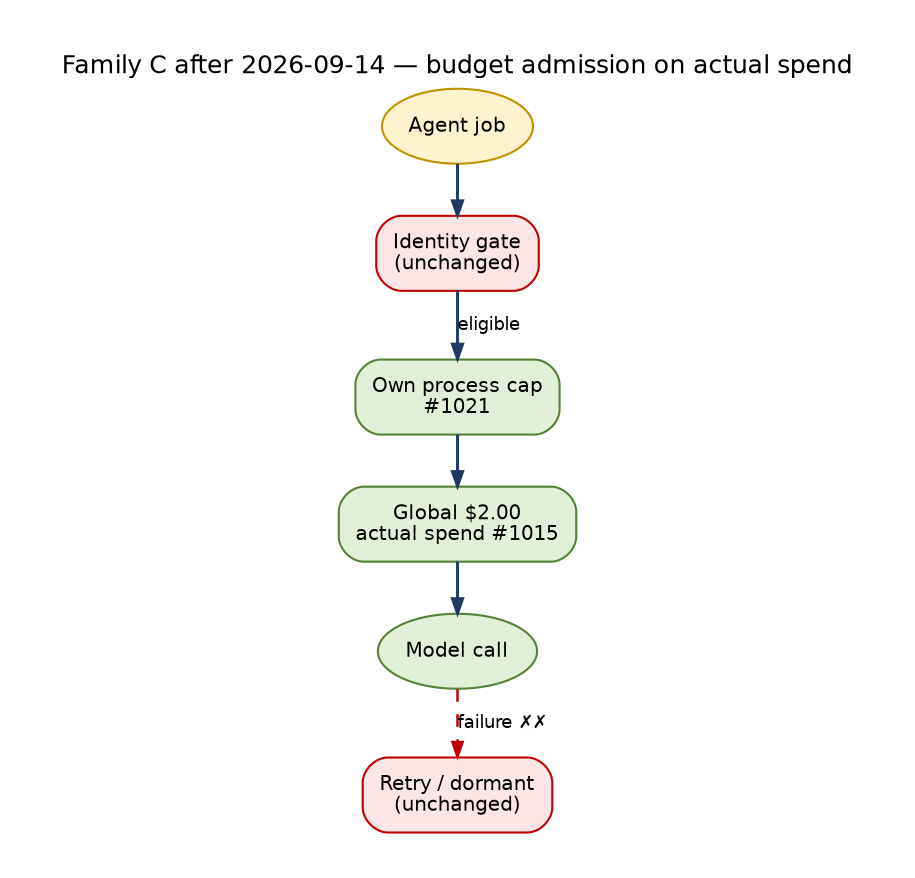

<!-- Lifecycle fact base C — Watchlist, proposal and learning lifecycles. Status: ACTIVE (measured, read-only, 2026-09-14 00:00–00:45 EDT). Synthesized in docs/architecture/TRADE_AI_AS_IS_LIFECYCLES_2026-09-14.md; targets in TRADE_AI_FUTURE_STATE_LIFECYCLES_2026-09-14.md. -->

> **Identity note, 2026-09-16 (rev 4).** This document is the measured record of 2026-09-14. Everything that shipped after it is recorded in the daily work logs: `docs/architecture/TRADE_AI_WORKLOG_2026-09-15.md` (PRs #1026–#1036 and the chief-architect remediation) and `docs/architecture/TRADE_AI_WORKLOG_2026-09-16.md` (PRs #1039–#1045; free search now answers a `CALLER_DAILY_CAP` refusal; live `a91d7b3ba`, validated 12:45:01Z). Each states the live commit at the end of its day. Read any "live at" line below as historical.

Measurement: complete (watchlist, advisory and learning lifecycles, up to the approval boundary)
as_of: 2026-09-14 00:20–00:40 EDT (Monday; the prior 56 h were a weekend, so weekday-only producers last ran Fri 09-11)
Measured on: host ms01, dev tree /home/johnclaw/trade-ai-v12-rebuild/trade-ai-v12-rebuild @ c594d8600 (merge PR #1002 feat/synthesis-prompt-budget, 00:07 EDT today). Cron runs from this tree.
Method: read-only psql (`default_transaction_read_only=on`, statement_timeout 60 s), crontab, `systemctl --user list-timers`, `journalctl --user`, log awk, jsonl readers. No writes, no LLM calls, no restarts, no execution code read.
Labels: OBSERVED = measured now. INFERRED = reasoned from code and data, not proven at runtime. BLOCKED = could not be measured read-only.

# WATCHLIST · ADVISORY · LEARNING — every lifecycle, measured


> **Update 2026-09-14 23:44 EDT — what changed after this measurement (live `341bce2c1`).** Numbers below are the 00:00–00:45
> measurement; this family was **not re-measured**. Changes that affect it:
>
> - **Budget (§4):** the global cap counted reservations, not spend — real spend for the week to 09-14 was $4.73 vs a
>   $214.61 worst-case projection. Caps now count **actual** spend at $2.00/day with calibrated reservations (#1015);
>   the shared `advisory_desk_opinion` id is split into eight named callers (#1021); scheduled paid work runs only in
>   the operator window (#1020). This removes the phantom-money `COST_CAP_EXCEEDED: global cap` refusal class.
> - **Unit-aware consumers:** the strategy classifier, dividend policy, social awareness, social scalp scanner and
>   watch quality projection v1 now read Finviz market cap and volume in the right units (#1008).
> - **Scalp GO alerts:** Trade-AI scalp criteria (price 1–25, float ≤ 20M, RVOL ≥ 5, |gap| ≥ 5 %, volume ≥ 1M, score ≥ 40,
>   verified catalyst) now gate social and screener GO alerts, which reach the operator (#1009, #1011).
> - **Advisory timers:** lessons-reflect 21:40 → 19:40, shadow-seed 21:45 → 19:45 (#1020).
> - Gate exclusion, retry, WMT-style integrity re-stamps and proposal review closure are unchanged.




## LEGEND

```
█ LIVE      ran on schedule recently, output observed
▓ PARTIAL   runs, but its effect is much narrower than its name
░ UNWIRED   code exists, nothing calls it (or its output is never read)
✗ DARK      no producer, no consumer, or no output in the measured window
◇ BLOCKED   cannot be measured or exercised without an operator
⊘ BOUNDARY  outside this family (execution; AGENTS.md §0/§1 — operator-controlled, 2FA-gated)

L0 exists, has not reached L1 · L1 provenance + liveness · L2 grounded in real prior state
L3 judgment validated · L4 loop closed (outcome changes a later question) · L5 unattended self-repair + self-report

══▶ spine   ──▶ read   ◀── write   ╌╌▶ feedback   ✗✗▶ severed (exists in spec, carries nothing today)
```

---

## 0. The seven breaks that matter most (read this first)

| # | Break | Evidence (OBSERVED unless marked) | Effect |
|---|---|---|---|
| B1 | **An identity-gate rejection is permanent.** The auto-queue selects `status='active' AND symbol NOT IN (SELECT DISTINCT symbol FROM watchlist_agent_jobs)` (`process_watchlist_agent_jobs.py:3113-3121`). When a job is rejected by the symbol gate, it still counts as a job, so that symbol is never queued again, even after `symbol_profiles` later gains the row. | 7 d failed-job notes: 167 `Auto-queued … [invalid_symbol: not found in symbol_profiles]`. 2,553 of 5,199 active/researched symbols (49%) have no `symbol_profiles` row. | About half the watch universe can never get an agent opinion. No retry path exists. |
| B2 | **A silent synthesis loop re-stamps a stale verdict as "actionable" every 15 min.** WMT maturity = `specialist_review_complete / pending` with **0** rows left in `watchlist_agent_results` (pruned). `_check_pending_synthesis` (3072) → `run_synthesis` returns `{"ok":False,"error":"no_completed_agent_results"}` at 2131-2134, prints nothing and changes no state. `persist_safety` then runs anyway (`synthesis_safety.py:421-452`) against the **2026-06-23** synthesis (AVOID, grok+chatgpt disagree). It sets `decision_safety=safe`, maturity `actionable=true`, `decision_quality_status='actionable'`, and `updated_at=now()`. | 92 `WMT: Pending synthesis detected` lines in the offpeak log; WFS and maturity `updated_at` are both 2026-09-13 20:45:02.948642 (same txn). | An 83-day-old verdict looks fresh and actionable. This is an integrity defect, not only a stall. |
| B3 | **The agent-job lane completes 2.9% of what it is handed.** | Created 09-07..09-13: 1,057 jobs → completed 31, failed 560, superseded 324, deferred 109, expired 33. `watchlist_agent_results` newest 2026-09-12 20:00:56; 0 since. | The maturity ladder does not advance: 1,387 symbols are pending synthesis, 768 of them pending for more than 14 days. |
| B4 | **COST_CAP_EXCEEDED is a *global* cap, and watch processes are not the ones spending it.** Offpeak log all-time: `COST_CAP_EXCEEDED: global cap` 503, `daily request cap` 147. There are 0 per-process or per-run cap hits. | `llm_consumption_log` 7 d: watchlist_maria_flash_narrative 68 calls **$0.0226**, watchlist_cio_synthesis_cron 9 calls **$0.0127**. | The watch lane is starved by other consumers of the global cap (INFERRED). Raising the per-process caps (8000 input, 32000 synthesis) cannot fix it. |
| B5 | **Proposal agent reviews never close.** A `proposal_agent_reviews` row is synced only when its watchlist job *completes* (`process_watchlist_agent_jobs.py:2986-2996`). Failed, deferred and superseded jobs leave the review `pending` forever. | 6,336 reviews pending for more than 2 days, oldest 2026-05-07. 7 d: 854 pending vs 4 reviewed. Review jobs 30 d: failed 886, deferred 539, superseded 191, completed 400. | The approval gate runs without the specialist review it was designed around. Median time to approval is 5 min (automated). |
| B6 | **The incubator → proposal lane is dead.** | Last 40 promoter runs: `Promoted: 0`. `proposal_promotions` has 0 rows ever. Block reasons: `no_authoritative_trade_plan`, `invalid_strategy_id: 'swing_trade'/'recovery_watch' not in YAML`, `quote_extremely_stale: 2714h`. | Screener/incubator discovery never becomes a proposal. Proposals come only from the watchlist bridge (1,947 in 30 d) and pullback_macd (1,137). |
| B7 | **The learning loop does not close at the watch/advisory level.** KB lessons: 1,610 ratified, **0 by a human** (1,510 `iris_auto_safe`). All 1,520 application rows have `hit = null`, and the last one is 2026-08-27. Multi-tier trade reviewer: `empty_response` 58×, and the monthly run failed on Anthropic "credit balance too low". `paper_trade_multi_reviews` newest 08-30. `trade_lesson_memory` is re-stamped (178 of 188 rows every 6 h) and is not read by the watch agent prompt path. | See §3. | Lessons are generated and auto-ratified but never scored against outcomes, and never reach the specialist agents except through a thin RAG channel (57 trade_review embeddings, newest 08-16). |

---

## 1. SYMBOL / WATCHLIST ITEM LIFECYCLE

### 1a. Purpose, actors, stores

- **Purpose:** turn "a ticker someone or something noticed" into a researched, synthesized, gated view (HOLD/ADD/TRIM/AVOID), a watch directive, a re-entry plan and a strategy card. Either it graduates to a proposal (§2) or it is retired.
- **Actors:**
  - intake writers: `intel_auto_discovery.py`, `agent_discovery`, `finviz_screener_runner.py`, `pullback_macd_screener.py`, `watchlist_proposal_bridge`/paper proposals, `hermes_directive_discovery.py`, `directive_promotion.py`, `small_cap_rotation`, `social_scalp_scanner.py`, operator (api_v2), holdings sync `sync_watchlist_items_to_db.py`
  - identity gate: `scripts/lib/hermes_discovery/symbol_validation.py`
  - enrichment: `watchlist_enrichment_sweep.py`, `symbol_enrichment.py`, `materialize_watchlist_strategy_cards.py`, `hermes_watchlist_scorer.py`, `hermes_scope_governor.py`
  - job enqueuers: auto-queue (in the worker), `queue_proposal_agent_reviews.py`, `enqueue_holdings_agent_opinions.py` (timer), `holdings_change_trigger.py`, `agent_event_router.py`, `system_health_agent.py`, `aegis_overnight.py`, `overnight_batch.py`, `data_gap_resolver.py`
  - worker: `process_watchlist_agent_jobs.py` via `run_watchlist_agent_jobs_offpeak.sh`
  - synthesis: `run_synthesis` in the same file, then `synthesis_safety.py`
  - directives: `watch_directives_service.py`, `lib/writers/watch_directives_writer.py`, `lib/watch_directive_gate.py`, `watch_directive_hygiene.py`
  - re-entry: `refresh_reentry_resistance.py` + desk builder
  - decision tickets: `tradeai-watch-decision-scheduler`
  - removal: `watchlist_hygiene.py`, `incubator_rolloff_engine.py`
- **Stores:** `watchlist_items`, `symbol_profiles`, `watchlist_strategy_cards`, `watchlist_escalation_policies`, `watchlist_agent_jobs`, `watchlist_agent_results`, `watchlist_events`, `watchlist_analysis_maturity`, `watchlist_final_synthesis`, `watchlist_synthesis_safety_history`, `watchlist_research_cards`, `decision_inputs`, `watch_directives`, `watch_directive_hits`, `watch_decision_refresh_jobs`, `watchlist_entry_plans`, `persistent-state/data/runtime/reentry_decision_desk_latest.json`.

### 1b. State machines (exact values)

**`watchlist_items.status`** (no CHECK constraint; default `'active'`). Distinct values now: `removed` 7,620 · `researched` 5,970 · `active` 142. There are 13,732 rows over 11,783 symbols; the unique key is `(symbol, source, bucket)`, so one symbol can hold several rows.

| From → To | Trigger | Module:line |
|---|---|---|
| ∅ → active | writer insert (discovery, screener, operator, bridge, holdings) | many writers; default |
| active → queued | operator "Refresh" on card | `api_v2.py:9327` |
| queued → active | agent job LLM failure | `process_watchlist_agent_jobs.py:2824` |
| queued/active → researched | any agent job completes | `process_watchlist_agent_jobs.py:2999` |
| active → removed | weekly hygiene: low-confidence AI discovery, all-agents SELL/AVOID, no analysis for 30+ days, unsafe synthesis | `watchlist_hygiene.py:180` (`WHERE status='active'` only) |
| removed → active | promoted by a directive | `directive_promotion.py:211` |
| researched → (nothing) | **no exit**: hygiene removes only `status='active'` | INFERRED from `:180` |

`queued` is never observed at rest (0 rows). **Terminal:** `removed`. `researched` is a de facto sink: 5,970 rows accumulate and are never pruned (INFERRED).

`scope_tier` (Hermes hot/warm/cold, `hermes_scope_governor.py`, `7,37 * * * *`): S0 655 · S1 1,112 · S2 1 · S3 5,060 · null 6,904.

**Identity gate** `gate_watchlist_symbol()` (`symbol_validation.py:195-220`), checks in order:
1. empty → reject
2. topic/research slug (`_` or `D\d+_`, `K_`, `SU_INDUSTRY_`, `AI_`) → reject "research-directive / topic slug — not a security"
3. shape `^[A-Z][A-Z0-9.\-]{0,9}$` → reject
4. portfolio-held → accept
5. `symbol_profiles` row present and not denylisted/1-char → accept
6. otherwise reject ("not found in symbol_profiles (or DB unavailable)")

The gate is fail-closed. It also rejects on a DB error, and the message does not say which case happened.

**`watchlist_agent_jobs.status`** (no CHECK; default `'queued'`). All-time distribution:

| status | count | oldest created | newest created |
|---|---|---|---|
| completed | 45,475 | 2026-04-26 | 2026-09-12 18:15 |
| failed | 20,200 | 2026-04-29 | 2026-09-13 20:15 |
| expired | 7,239 | 2026-04-27 | 2026-09-12 19:30 |
| cancelled | 2,085 | 2026-05-27 | 2026-07-23 (legacy; no writer since) |
| deferred | 1,886 | 2026-08-14 | 2026-09-11 06:31 |
| superseded | 1,224 | 2026-08-18 | 2026-09-11 09:30 |
| queued / pending / processing | **0** | | |

| From → To | Trigger | Module:line |
|---|---|---|
| ∅ → queued | `governed_enqueue` (INSERT) or a raw INSERT fallback | `lib/agent_job_enqueue_governance.py:165`; fallback `process_watchlist_agent_jobs.py:3152` |
| ∅ → (not inserted) `DEFERRED_BACKPRESSURE` | T3/T4 tail when the queue is under pressure | `agent_job_enqueue_governance.py:115-128,182` |
| ∅ → pending | aegis_overnight health_requeue / stale_refresh | `aegis_overnight.py` |
| pending → queued | adopted at worker start | `:2654` |
| queued → deferred `[STALE backlog — not paid]` | age > 36 h (tail) or > 168 h (T0/T1) | `agent_job_enqueue_governance.py:335-344` |
| queued → superseded `[SUPERSEDED duplicate]` | same semantic key already queued | `:349-360` |
| queued/pending → expired `[off-hours tail deprioritized]` | off-hours, age > 2 h, outside priority scope | `process_watchlist_agent_jobs.py:2667` |
| queued → failed `[invalid_symbol: …]` | symbol gate | `:2748-2762` |
| queued → processing | claim | `:2768` |
| processing → queued | reaper, started more than 20 min ago | `:2645-2649` |
| processing → failed | risk data-gap enrichment failed (maria/steph) | `:2797` |
| processing → failed | LLM empty or `LLM error…` (COST_CAP / INPUT_LIMIT / CIRCUIT_OPEN land here) | `:2823` |
| processing → completed | parsed + G0 number grounding + result insert | `:2838-2984` |
| (synthesis) → queued `synthesis_retry` | all synthesis lanes failed | `:2310-2332` |

**Terminal:** completed, failed, expired, deferred, superseded, cancelled. **No retry for failed or deferred jobs.** Nothing re-queues from `deferred` (grep found no `deferred → queued` writer).

**`watchlist_analysis_maturity`** (CHECK-constrained):
- `analysis_stage` ∈ {raw_data_only, strategy_card_ready, routed, specialist_review_partial, specialist_review_complete, full_chain_complete, final_synthesis_complete, needs_iteration, failed}
- `final_synthesis_status` ∈ {pending, queued, processing, completed, failed, tail_dormant}
- per-agent `*_status` ∈ {not_required, required, queued, processing, completed, failed}

Stage recompute runs in `_update_maturity` (`:1683-1763`): `final_synthesis_status=completed` → final_synthesis_complete; `full_chain completed` → full_chain_complete; required ⊆ completed → specialist_review_complete; any completed → partial; `strategy_card_ready` → strategy_card_ready; otherwise raw_data_only; any failed and none completed → `failed`. `_apply_escalation_policy` (`:1765-1806`) runs on **every job claim** and resets `analysis_stage='routed'` through ON CONFLICT before the recompute. Required agents come from `watchlist_escalation_policies`, keyed by the strategy card type (default `{steph, risk}`).

**`watchlist_final_synthesis`**:
- `decision_safety` ∈ {safe, unsafe, blocked, pending}
- `decision_quality_status` ∈ {actionable, partial_review, conflicting_agents, missing_required_agent, data_quality_warning, data_quality_blocked, tiny_position_low_priority, stale_analysis, needs_human_review, pending}. **All 1,145 rows are `pending`**: the real verdict is written to the maturity table, not here.

**`watch_directives.status`** CHECK ∈ {active, paused, archived, needs_review, expired}. The writer vocabulary adds **`proposed`** (`watch_directives_writer.py:64`), and `watch_directive_gate.py` inserts `proposed` when the trend cap is reached. This produced **89 CHECK violations** in `logs/claude_challenger.log` (weekly Sun 17:05, 2026-07-26 → 08-23).

| From → To | Trigger | Module |
|---|---|---|
| ∅ → active | writer (operator, Hermes discovery, challenger, planner) | `watch_directives_writer.py` |
| ∅ → proposed ✗ | trend cap reached | `watch_directive_gate.py:40,69` → CHECK rejects |
| active → paused | trend, no hits and cold for 14 days or more | `watch_directives_service.py:114` |
| active → expired | TTL elapsed | `watch_directives_writer.py:111`, `watch_directive_hygiene.py:32` |
| active → archived | weekly hygiene tiers 1-2 (reversible); tier 3 needs operator `watch_directive_dedup.py --apply --tier 3` | `watch_directive_hygiene.py` |

**`watch_decision_refresh_jobs.state`**: SKIPPED_CURRENT 40,904 · COMPLETE 14,197 · SKIPPED_LOCKED 6,176 · FAILED 2,391 · QUEUED 80 (newest 09-13 14:00; timer next 09:35).

**Re-entry decision desk** (`reentry_decision_desk_latest.json`): deterministic, `llm_in_path=false`, computed 2026-09-14T04:24Z. It has 106 symbols, 27 actionable. Criteria: `40 ≤ RSI < 70`, near 3%, stale 96 h, wash 30 d. Resistance input generated 09-11 20:40Z. Rows carry entry_low/high, stop, target, rr and resistance, but no verdict/state field, so there is no per-row lifecycle state to measure.

### 1c. End-to-end flow

```
      LATERAL INPUTS (read)                         SPINE                                  LATERAL OUTPUTS (written)
 ════════════════════════════════      ════════════════════════════════════      ══════════════════════════════════════

 discovery / screener / hermes  ─┐    ┌──────────────────────────────────┐
   74 new rows in 7 d            │    │ 0 · INTAKE                        │
   ai_discovered = 85% all-time  ├───▶│ █ LIVE   L1                        │◀── watchlist_items 13,732 █
 operator add (api_v2)          ─┤    │ status='active' by default         │      active 142 · researched 5,970
 holdings sync 06:45            ─┤    │ Q: "worth watching?" (writer only) │      removed 7,620
 pullback_macd / bridge         ─┘    └────────────────┬─────────────────┘      updated_at re-touched en masse
                                                        ║                        (856 rows at 00:00, 432 at 10:50) ▓
                                                        ║                        → updated_at is NOT liveness
 hermes_scope_governor 7,37 * ──────────────────────────╫──▶ scope_tier S0 655 / S1 1,112 / S3 5,060 █
 hermes_watchlist_scorer */15 ──────────────────────────╫──▶ hermes_composite_score/rank █
                                                        ║
 watchlist_enrichment_sweep     ─┐    ┌───────────────▼──────────────────┐
   */30 9-15 wkdy + 16:15        ├───▶│ 1 · ENRICH + STRATEGY CARD        │◀── watchlist_strategy_cards 5,788 █
   "enriched 180/180 active" 09-11│   │ █ LIVE   L1 (weekday)              │      newest 09-11 17:56 (Fri)
 materialize_strategy_cards */30 ─┘    │ price/rsi/rvol/float, card type    │      core 2,430 · spec 1,743 · income 1,112
                                        └────────────────┬─────────────────┘
                                                        ║
                                        ┌───────────────▼──────────────────┐
 watchlist_agent_auto_queue ────────────│ 2 · ENQUEUE (7 producers)         │◀── watchlist_agent_jobs (queued)
   active ∧ NOT IN any job  LIMIT 5     │ ▓ PARTIAL  L1                      │      7 d created 1,057:
   no symbol_profiles check  ✗✗▶ B1     │ governed_enqueue: dedupe/backpress │        social_scalp 358 → 287 superseded, 0 done
 queue_proposal_agent_reviews ──────────│ Q: "which agent, which priority?"  │        proposal_queue 299 → 271 failed
 holdings enqueue timer 08:30/13:30 ────│                                    │        auto_queue 213 → 182 failed
 event_router */30 (TOPIC: slugs) ──────│                                    │        holdings 82 → 82 failed
 health remediation / tax / aegis ──────│                                    │        event_router 80 → 36 sup / 20 exp
                                        └────────────────┬─────────────────┘
                                                        ║   worker: cron */15 10-20 ET, every day, --limit 8,
                                                        ║   flock, 20 m timeout, host containment flag ARMED since
                                                        ║   08-20 ("governed-flash-reenable"), overridden per-process
                                                        ║   by run_watchlist_agent_jobs_offpeak.sh:64-69
                                        ┌───────────────▼──────────────────┐
 symbol_profiles 2,980 ▓ ───────────────│ 3 · IDENTITY GATE                 │◀── jobs → failed [invalid_symbol]
   writes/day 09-08..09-11: 3,2,1,2     │ ▓ PARTIAL  L1  (fail-closed)       │◀── watchlist_events invalid_symbol
   954 writes 09-14 00:15 (unattributed)│ Q: "is this a real security?"      │      7 d: 184 (09-12: 86)
   weekly build Sun 19:00 CRASHED       │ answered by table lookup only       │      49% of active/researched symbols
   ("SSL connection closed")            │ no path to create the missing row   │      unprofiled (2,553 / 5,199)
                                        └────────────────┬─────────────────┘      rejection is permanent (B1) ✗
                                                        ║
 risk_agent result <2 h ────────────────┬───────────────▼──────────────────┐
 _check_symbol_data_quality ────────────│ 4 · SPECIALIST AGENT CALL         │◀── watchlist_agent_results 917 (08-14→09-12)
 RAG content_embeddings (5 items) ──────│ ▓ PARTIAL  L1 L2                   │      30 d: maria 402 · risk 223 · steph 157
 calibration_block (agent_calibration)──│ maria one-pass / steph / risk / tax│           tax 51 (≤09-04) · full_chain 29 (≤08-30)
 outcome feedback (intel_query) ────────│ governed_flash_call: CONTAINMENT → │      newest 09-12 20:00:56 · 0 in last 28 h
 global LLM cap (reservation) ✗✗▶ B4 ───│ CIRCUIT → INPUT_LIMIT → run cap →  │      prompt_hash/snapshot/model 867/867 █
 llm_process_registry (8000 in) ────────│ global COST cap → provider          │      rag_sources 858/867
                                        │ Q: "what does this agent conclude, │      number_grounding key 0/867 ◇ unexercised
                                        │    with what confidence?"          │      models: gemma3:4b 452 · ds-v4-flash 379
                                        └────────────────┬─────────────────┘
                                                        ║
                                        ┌───────────────▼──────────────────┐
 watchlist_escalation_policies ─────────│ 5 · MATURITY LADDER               │◀── watchlist_analysis_maturity 2,446
   required = {steph,risk} default      │ ▓ PARTIAL  L1                      │      final_synthesis_complete  1,055
                                        │ Q: "have all required agents       │      specialist_review_partial   575 (552 >14 d)
                                        │    spoken?"                         │      failed                      459 (no retry)
                                        │ no re-queue for missing agents ✗   │      routed                      353 (all >30 d)
                                        └────────────────┬─────────────────┘      specialist_review_complete    1 (WMT, B2)
                                                        ║
 _select_synthesis_rows: 2/agent,       ┌───────────────▼──────────────────┐
   40,000 chars ────────────────────────│ 6 · CIO SYNTHESIS (LEGACY_CIO_REVIEW)│◀── watchlist_final_synthesis 1,145
 portfolio context / strategy weights ──│ ▓ PARTIAL  L1 (L3 not validated)   │      updates/day 09-10..09-13: 7, 2, 5, 1
 lanes grok · chatgpt · deepseek-flash ─│ conservative verdict wins on split │      decision_quality_status = pending 1,145/1,145
 registry cron cap 32000 (dev tree,     │ Q: "HOLD / ADD / TRIM / AVOID?"    │◀── decision_inputs (lineage) █
   PR #1002 today; served ◇)            │ no-results path returns silently ✗ │◀── watchlist_research_cards 3,138
                                        └────────────────┬─────────────────┘
                                                        ║
                                        ┌───────────────▼──────────────────┐
                                        │ 7 · SAFETY GATE                   │◀── maturity.actionable / decision_quality_status
                                        │ ▓ PARTIAL  L1                      │      actionable 457 · unsafe 594 · pending 1,395
                                        │ Q: "is the verdict safe to act on?"│◀── watchlist_synthesis_safety_history
                                        │ runs even when synthesis did not ✗ │      WMT re-stamped "actionable" 92× (B2)
                                        └───────┬──────────────┬──────────┬──┘
                                                ║              ║          ║
                     ┌──────────────────────────▼───┐  ┌───────▼───────┐  ┌▼────────────────────────────────┐
 hermes/challenger ──│ 8a · WATCH DIRECTIVES         │  │ 8b · RE-ENTRY │  │ 8c · PROPOSAL BRIDGE → §2        │
 planner/operator    │ ▓ PARTIAL  L1                 │  │ DECISION DESK │  │ watchlist_proposal_bridge        │
                     │ service */30 9-16 wkdy        │  │ █ LIVE L1 L2  │  │ */30 10-15, max-new 5            │
                     │ last run 09-11: SSL closed +  │  │ deterministic │  │ 1,947 proposals / 30 d           │
                     │ LockNotAvailable tracebacks   │  │ 106 syms, 27  │  └──────────────────────────────────┘
                     │ Q: "is the theme still live?" │  │ actionable    │
                     └──────────────┬────────────────┘  │ Q: "is it at  │
    watch_directives 1,042 ◀────────┘                   │ a re-entry    │
      active 542 (trend 424, ticker 103, sector 15)     │ level?"       │
      expired 213 · archived 281 · paused 6             └───────────────┘
      403 active not serviced >72 h · 22 never serviced
      writer 'proposed' ✗ CHECK (89 violations, ≤08-23)
      watch_directive_hits 281,307
                                                        ║
                                        ┌───────────────▼──────────────────┐
 watchlist_hygiene Sun 09:30 ───────────│ 9 · REMOVAL / ARCHIVE             │◀── watchlist_items → removed
   last: "489 removed, 8 flagged"       │ █ LIVE  L1 (weekly)                │      09-13: 360 rows → removed
 incubator_rolloff 10:00 wkdy ──────────│ Q: "still relevant?"               │      researched never removed ✗
 watch_directive_hygiene Sun 10:30 ─────│ tier-3 merges wait for operator ◇  │      55 directives TTL→expired (Sun)
                                        └──────────────────────────────────┘

 FEEDBACK EDGES
   hygiene "all agents AVOID" ╌╌▶ removal                                   █ (weekly)
   synthesis_retry job ╌╌▶ re-queue synthesis when every lane fails          ▓ (no retry when results are missing)
   gate reject ✗✗▶ profile creation (no path: nothing builds a profile on demand)
   failed/deferred job ✗✗▶ re-queue (none)
   thesis outcome (watchlist_items.realized_outcome: win 102 / loss 25 / scratch 7) ✗✗▶ agent prompt (no reader in worker)
```

### 1d. Iterations and loops

| Loop | Cadence | Closes? | Evidence |
|---|---|---|---|
| Worker drain | */15 10:00–20:59 ET, `--limit 8` | Runs; each run mostly exits "No queued jobs" | offpeak log 09-14T00:45Z `No queued jobs` |
| Orphan reaper `processing>20m → queued` | every run | yes | 0 processing now |
| Queue governance (supersede / stale-defer) | every run | yes, but it sheds work instead of doing it | 7 d: superseded 324, deferred 109 |
| Auto-queue new symbols | every run, 5 symbols | **no**: a rejected symbol is excluded forever (B1) | `:3113-3121` |
| Pending-synthesis sweep | every run | **no**: WMT spins 92× with no state change (B2) | offpeak log |
| synthesis_retry when all lanes fail | on failure | partially: 0 "all LLM lanes failed" since 08-30 | log awk `lanesF` 0 since 08-30 |
| Enrichment sweep | */30 weekday | yes (L1) | 180/180 |
| Directive servicing | */30 9-16 weekday | **broken**: DB errors mid-run | SSL closed / LockNotAvailable |
| Directive TTL expiry + hygiene | weekly Sun | yes | 55 expired |
| Hygiene removal | weekly Sun | yes, for `active` only | 489 removed |
| Decision refresh tickets | timer 09:35 / 14:00 | yes (L1) | 14,197 COMPLETE, 2,391 FAILED |
| symbol_profiles rebuild | Sun 19:00 + 06:45 wkdy top-300 | **broke** 09-13 19:16 | traceback `SSL connection has been closed` |

### 1e. Questions raised per stage

| Stage | Question | Who answers | How closed | Where dropped |
|---|---|---|---|---|
| 0 Intake | "Is this worth watching?" | the writer's own heuristic | row inserted | there is no second opinion at intake; 85% is AI discovery |
| 3 Gate | "Is this a real security?" | `symbol_profiles` lookup | accept / reject | **reject is final**; nobody asks "then build the profile" |
| 4 Agent | "What does Maria / Steph / Risk / Tax conclude?" | DeepSeek Flash, gemma3:4b, grok | result row | 560 failed / 7 d; failed jobs are not retried |
| 4 Data gate | "Is the data good enough to spend a call?" | risk RESEARCH_MORE + quality score < 60 | enrich or skip | a skip marks the job failed, no retry |
| 5 Maturity | "Have all required agents spoken?" | array compare | stage advance | nothing re-queues the missing agents (1,387 pending) |
| 6 Synthesis | "What should we do?" | 3 lanes, conservative wins | WFS upsert | a missing-results path returns silently (B2) |
| 7 Safety | "Is it safe to act on?" | `synthesis_safety` rules | actionable flag | runs on stale synthesis |
| 8a Directive | "Is the theme still live? Do new tickers belong?" | `watch_directives_service` | hits + promotion | crashes on DB errors; 403 not serviced >72 h |
| 8b Re-entry | "Is it at a re-entry level now?" | deterministic desk | 27 actionable | no persisted per-row decision state to track |
| 8c Bridge | "Is this ready to propose?" | `watchlist_proposal_bridge` | proposal insert → §2 | 84% of proposals expire |
| 9 Removal | "Is it still relevant?" | weekly hygiene | removed | `researched` rows are never asked |

### 1f. Live measurements

**Counts by state:** see §1b tables.

**7-day throughput (created 09-07..09-13 ET):**

| status | n | share |
|---|---|---|
| completed | 31 | 2.9% |
| failed | 560 | 53.0% |
| superseded | 324 | 30.7% |
| deferred | 109 | 10.3% |
| expired | 33 | 3.1% |
| **total** | **1,057** | |

- Failed by origin: proposal_agent_queue 271 · watchlist_agent_auto_queue 182 · advisory_desk_holdings_enqueue 82 · health_agent_remediation 11 · event_router 8 · tax_sweep 5 · holdings_change_trigger 1.
- Failed by class: identity gate 184 (`watchlist_events invalid_symbol`, 09-07..09-13 ET). The rest are LLM-path failures; the offpeak log for UTC 09-07..09-13 shows COST_CAP 197, INPUT_LIMIT 105, CIRCUIT_OPEN 17.
- By agent (7 d): maria 14 done / 154 failed / 289 superseded / 71 deferred; risk_agent 9 / 197; steph 7 / 153; tax_agent 0 / 42; maria_research 1 / 11; aegis 0 done (2 failed, 10 expired, 10 superseded); alex 0 done (18 superseded, 10 expired, 8 deferred).

**Offpeak worker log by UTC day** (awk with date carry-forward):

```
utc_day      COST  INPUT  CIRC  GATE   ok  fail  pending-synth  lanes-failed
2026-08-29    289      8    10    31   29   292       59            15
2026-09-04      0      7     0     2   60     7        0             0
2026-09-05      0      2     0    32  110     2        0             0
2026-09-06      0      0     0    12    0     0        0             0
2026-09-07     22     11     0    15    0    33        0             0
2026-09-08     37     15     5    21    0    57        4             0
2026-09-09     45     11    12    25    0    68        9             0
2026-09-10     40     16     0    16    0    56       11             0
2026-09-11     31     32     0     0    0    63       10             0
2026-09-12     22     16     0    60   22    38       15             0
2026-09-13      0      4     0    30    6     4       44             0
2026-09-14      0      0     0     3    0     0        4             0
```

- COST_CAP variants, all-time: `global cap` 503, `daily request cap` 147. Per-run and per-process variants: 0.
- The last worker ✓ was on 09-12 UTC. The 8000 input cap has had 0 INPUT_LIMIT hits since 09-14 00:00Z, but also 0 model calls, so it is unproven ◇.

**Cycle times:**
- Job created → completed (14 d, n=310): median **6.5 h**, p90 **25.2 h**.
- Job created → failed (n=670): median 2.3 h, p90 10.6 h.
- Job created → expired (n=35): median 10.0 h.
- Symbol add → first agent result (cohort: symbols first seen in the last 60 d, n=1,469): **104 have any result (7.1%)**; median **253 h (10.5 d)**, p90 **790 h (33 d)**.
- Symbol add → synthesis (same cohort): 209 have a synthesis row; median 106 h, p90 812 h. Caveat: results are retained only since 08-14 (917 rows total), so older first-results are pruned and this cohort under-counts. 958 of the 1,055 `completed` synthesis rows no longer have any backing result row.

**Stuck beyond 2× cadence:**
- Maturity `routed` 353 rows, all older than 30 d.
- `specialist_review_partial` 552 older than 14 d, 416 older than 30 d.
- `failed` 459 rows, 444 older than 14 d, oldest 08-08.
- WMT spin: every 15 min since 09-13 00Z at least.
- `watch_directives` active and not serviced >72 h: 403. The weekday cadence is 30 min, and the weekend gap alone is about 56 h, so these are genuinely stale.
- `symbol_profiles` weekly rebuild failed 09-13.
- `watchlist_agent_results`: none for 28 h. The worker ran 52 times in that window with nothing to process: the queue is empty and new jobs are gated or shed.

**Oldest open item:** maturity row created 2026-06-21 00:00, still `routed/pending`.

### 1g. Failure paths and where it breaks today

1. **Gate → permanent exclusion (B1).** Auto-queue picks an unprofiled symbol, the gate fails it, and the symbol is never selected again. 167 of the failures in 7 d took this path.
2. **Topic slugs routed to a security worker.** `event_router` enqueues `TOPIC:*` for alex / aegis / steph / maria. In 14 d: 28 superseded, 20 expired, 7 deferred, 4 failed. They are never valid in the security worker.
3. **Global cost cap starvation (B4).** The job fails with `LLM error… COST_CAP_EXCEEDED: global cap`. The job is marked failed and maturity `*_status=failed`, with no retry.
4. **Input limit.** The prompt is refused before the call. 185 all-time, 105 in 7 d. The cap was raised to 8000 at 21:20 EDT 09-13 but has not been exercised yet.
5. **Circuit breaker** (8 errors → 15 min open). 17 in 7 d.
6. **Data-gap skip.** Risk said RESEARCH_MORE < 0.40, the quality score is < 60 and enrichment failed, so the job is failed without a call.
7. **Holdings enqueue.** 82 of 82 failed in 7 d, notes `holdings coverage for advisory desk (risk_agent/tax_agent)`. They fail on the LLM path (INFERRED from absent gate notes).
8. **Synthesis with no results (B2).** Silent return, then the safety gate re-stamps a stale verdict.
9. **Directive service DB errors.** `SSL connection has been closed unexpectedly` and `LockNotAvailable: canceling statement due to lock timeout` on `watch_directives` stop the run mid-loop. Staging hits are not drained.
10. **Directive `proposed` status** violates the CHECK, so the gate's intended soft-cap outcome cannot persist.
11. **symbol_profiles rebuild** crashes on SSL drop, leaving the gate's source of truth stale. The 954 rows written at 00:15 today have an unidentified writer (◇ BLOCKED: not in `symbol_profiles.log`, not in crontab at that minute).
12. **`updated_at` is not liveness.** Hermes scorer/governor re-touches `watchlist_items.updated_at` hundreds of rows at a time, and `persist_safety` re-touches WFS/maturity. Any freshness monitor on these columns is fooled.

### 1h. Maturity per stage

| Stage | Level | Why |
|---|---|---|
| 0 Intake | L1 | runs, stamps origin/source; no grounding of the "why" |
| 1 Enrich + card | L1 | weekday LIVE; no plausibility validation (Finviz column-shift history) |
| 2 Enqueue | L1 | governed dedupe/backpressure works; but it sheds, and admits gated symbols |
| 3 Identity gate | L1 | deterministic and fail-closed; no self-repair (B1); ambiguous error text |
| 4 Specialist agents | L1 → L2 on paper | full provenance (hash, snapshot, model, RAG). G0 number grounding never exercised (0/867). Accuracy is not validated: calibration reads 95-100%, which is implausible |
| 5 Maturity ladder | L1 | tracks state; no iteration driver |
| 6 CIO synthesis | L1 | lineage via `decision_inputs`; verdict never scored (WFS `decision_quality_status` 100% pending) |
| 7 Safety gate | L1, integrity **L0** | rule-based; runs on stale input (B2) |
| 8a Directives | L1 | service crashes; the `proposed` path is L0 |
| 8b Re-entry desk | L2 | deterministic, fresh price (0.09 h), criteria explicit; no outcome loop |
| 9 Removal | L1 | weekly; blind to `researched` |

### 1i. Target lifecycle and observed exit conditions

Observed exits:
- `removed` via weekly hygiene (active only)
- a job ends in completed, failed, expired, deferred, superseded or cancelled
- maturity reaches `final_synthesis_complete` or sits forever
- a directive becomes expired, archived or paused

Target (for the future-state author):

```
intake ══▶ identity gate ══▶ [unprofiled → build profile job → re-gate, bounded retries] ══▶ enrich/card
  ══▶ enqueue required agents only (per policy), with a per-lane budget reservation, not the global pool
  ══▶ agent call (retry class-aware: COST/CIRCUIT → defer and re-queue at next window; INPUT → trim context; GATE → profile job)
  ══▶ maturity: missing agents re-queued until required ⊆ completed or a max-attempt ceiling → `tail_dormant`
  ══▶ synthesis only if results ≥ required and newer than the prior synthesis; otherwise mark `stale_analysis`
  ══▶ safety gate only on a synthesis written in this run
  ══▶ directive / re-entry / proposal
  ══▶ outcome scored at 30/60/90 d ╌╌▶ calibration and lessons in the next agent prompt
  ══▶ removal applies to researched as well as active, keyed on last real verdict age
```

Exit conditions to enforce: every job has one of {completed, dormant-after-N, operator-closed}. A symbol is never permanently excluded because of a transient gate failure.

---

## 2. PROPOSAL LIFECYCLE (up to the approval boundary)

### 2a. Purpose, actors, stores

- **Purpose:** convert a researched setup into a sized, plan-bearing, reviewed proposal that an approval gate can accept, reject or expire.
- **Actors:**
  - producers: `watchlist_proposal_bridge.py` (*/30 10-15), `pullback_macd_screener.py`, `auto_proposal_generator.py` (*/30 9-16; `SKIPPED_NOT_GO` when the scan says WAIT), `incubator_proposal_promoter.py` (hourly 7-17), `catalyst_momentum_engine.py --generate-proposals`
  - enrichment/readiness: `proposal_enrichment_loop.py` (*/10 4-19, which also calls `queue_proposal_agent_reviews`), `enrich_proposal_technicals.py`, `proposal_execution_readiness.py`, `watchlist_entry_planner.py --scope proposals` 17:45
  - review: `queue_proposal_agent_reviews.py` → watchlist agent jobs → `broker_promote_oversight.sync_proposal_reviews_from_watchlist`
  - lifecycle/expiry: `proposal_lifecycle.py` (*/30 9-16), `cleanup_stale_proposals.py --apply` (10:00), `run_scheduled_stale_proposal_sweeper.sh` (08:15 dry, 08:25 apply, 16:10 report), `run_automated_trade_proposal_revalidation.py` (*/30 9-15)
  - approval gate: `atm_auto_approver.py` (*/15 4-19 wkdy; writes REJECTED at `:643,:729`) and the operator (api_v2 / Telegram)
- **Stores:** `paper_trade_proposals` (trigger `trg_proposal_status_events` → `proposal_status_events`; trigger `trg_max_pending_per_symbol`), `proposal_agent_reviews` (unique `(proposal_id, agent_name)`), `proposal_execution_readiness`, `proposal_lifecycle_events`, `incubator_universe`, `incubator_events`, `proposal_promotions`.

### 2b. State machine

**`paper_trade_proposals.status`** has no CHECK constraint (the only CHECK is `atm_action ∈ {force_approve, force_reject, force_skip}`) and defaults to `'PENDING'`. All-time distinct values:

| status | n | by lifecycle_status |
|---|---|---|
| EXPIRED | 7,240 | EXPIRED 3,695 · ACTIVE 2,693 · ENTRY_ZONE_VALID 673 · ENTRY_MISSED 178 · EXPIRED_MAX_WINDOW 1 |
| REJECTED | 1,946 | ENTRY_ZONE_VALID 985 · ACTIVE 804 · EXPIRED 82 · ENTRY_MISSED 75 |
| RISK_BLOCKED | 262 | ENTRY_ZONE_VALID 177 · ACTIVE 85 |
| APPROVED | 62 | ENTRY_ZONE_VALID 59 · ACTIVE 3 |
| APPROVED_FOR_PAPER_TEST | 11 | ACTIVE 7 · ENTRY_ZONE_VALID 4 |
| PENDING | 3 | ENTRY_MISSED 2 · ACTIVE 1 |
| CANCELLED | 1 | ACTIVE 1 |

- `lifecycle_status` (default `ACTIVE`) ∈ {ACTIVE, ENTRY_ZONE_VALID, ENTRY_MISSED, EXPIRED, EXPIRED_MAX_WINDOW}. It is orthogonal to `status` and they disagree: 2,693 EXPIRED proposals still read `ACTIVE`.
- Other sub-state columns: `agent_review_status` ∈ {null, QUEUED, REVIEWED, REJECTED}; `llm_review_status` (default NOT_REQUESTED) ∈ {NOT_REQUESTED, COMPLETE}; `execution_status` default `not_submitted`.
- **`proposal_agent_reviews.status`** ∈ {pending (default), reviewed}. Agent names are case-duplicated (`maria`/`Maria`, `aegis`/`Aegis`, `Risk`/`risk_agent`).

**Observed transitions, last 30 d (`proposal_status_events`):**

| From → To | n | Writer |
|---|---|---|
| ∅ → PENDING | 3,251 | producers |
| PENDING → EXPIRED | 2,732 | `proposal_lifecycle`, `cleanup_stale_proposals`, stale sweeper, `run_quote_age_stale_proposal_review.py:71` |
| PENDING → REJECTED | 402 | `atm_auto_approver.py:643/729`, operator |
| PENDING → APPROVED_FOR_PAPER_TEST | 298 | set together with `paper_trade_id` at `paper_trade_logger.py:1667` ⊘ (paper-submit side; not read) |
| APPROVED_FOR_PAPER_TEST → PENDING | 266 | `cleanup_stale_proposals.py:108-121` "Requeued: execution revalidation" (sets `material_change_pending_approval`, clears `approved_at`) |
| PENDING → RISK_BLOCKED | 82 | risk gate |
| APPROVED_FOR_PAPER_TEST → APPROVED | 15 | `cleanup_stale_proposals` "paper trade completed" |
| APPROVED_FOR_PAPER_TEST → REJECTED | 5 | cleanup |
| APPROVED_FOR_PAPER_TEST → EXPIRED | 2 | cleanup: requeue cap `MAX_PAPER_REQUEUE` or INELIGIBLE |
| REJECTED → APPROVED_FOR_PAPER_TEST | 1 | (operator override, INFERRED) |

**Terminal:** EXPIRED, REJECTED, RISK_BLOCKED, CANCELLED. **Boundary states:** APPROVED_FOR_PAPER_TEST and APPROVED. Anything past them is ⊘.

### 2c. Flow

```
      LATERAL INPUTS                                  SPINE                                    LATERAL OUTPUTS
 ═════════════════════════          ════════════════════════════════════          ═══════════════════════════════════

 incubator_universe 6,809 ──┐      ┌─────────────────────────────────────┐
   252 upd/7 d               ├─────▶│ P0 · INCUBATOR PROMOTER             │──────▶ proposal_promotions 0 ✗
 incubator_events 129,596 ──┘      │ ✗ DARK output  L0                    │         last 40 runs "Promoted: 0"
 strategy YAML configs ✗✗▶ ────────│ Q: "does this candidate have an      │         blocks: no_authoritative_trade_plan,
   'swing_trade','recovery_watch'   │    authoritative plan, fresh quote,  │         invalid_strategy_id, quote 2714h stale
   not in YAML                      │    valid strategy?"                  │
                                    └─────────────────────────────────────┘
 watchlist synthesis / maturity ──┐ ┌─────────────────────────────────────┐
 pullback_macd_candidates ────────┼▶│ P1 · PROPOSAL CREATE                 │──────▶ paper_trade_proposals 9,525
 scan decision (GO/WAIT) ─────────┘ │ █ LIVE  L1 (weekday)                  │         30 d: 3,251 created
                                    │ bridge 1,947 · pullback_macd 1,137   │         source null 167
                                    │ Q: "is this ready to propose?"       │         signal_decision/critic_verdict
                                    └──────────────────┬──────────────────┘           null on 1,600/1,600 (14 d) ✗
                                                       ║
 quotes (Schwab) ─────────────────┐ ┌──────────────────▼──────────────────┐
 technicals / entry planner ──────┼▶│ P2 · ENRICH + READINESS              │──────▶ proposal_execution_readiness 17,205
                                  │ │ █ LIVE  L1                            │         1,117 / 7 d, newest 09-11 20:08
                                  │ │ Q: "is entry zone valid? spread ok?" │         spread_pct flagged OFF by plausibility ▓
                                  │ └──────────────────┬──────────────────┘──────▶ lifecycle_status ENTRY_ZONE_VALID / MISSED
                                                       ║
 watchlist_agent_jobs (proposal_review) ┌──────────────▼──────────────────┐
   30 d: completed 400 · failed 886 ────│ P3 · AGENT REVIEW (maria/steph/risk)│──────▶ proposal_agent_reviews 10,812
   deferred 539 · superseded 191        │ ▓ PARTIAL  L1                      │         pending 6,336 >2 d (oldest 05-07)
 sync only on job COMPLETE ✗✗▶ B5 ──────│ Q: "do the specialists agree?"     │         7 d: 854 pending / 4 reviewed
                                        └──────────────────┬───────────────┘
                                                           ║   (approval proceeds without the review)
 risk limits / VIX regime ─────────┐    ┌──────────────────▼──────────────────┐
 atm_action (force_*) ─────────────┼───▶│ P4 · APPROVAL GATE                   │──────▶ status → APPROVED_FOR_PAPER_TEST 298/30 d
 operator (api_v2 / Telegram) ─────┘    │ █ LIVE  L1                            │         → REJECTED 402 · RISK_BLOCKED 82
                                        │ median create→approve 5 min          │         → EXPIRED 2,732 (84% of created)
                                        │ Q: "approve, reject, or let expire?" │
                                        └──────────────────┬──────────────────┘
                                                           ║
 ┌──────────────────────────────────────────────────────────▼───────────────────────────────────────────────────┐
 │ ⊘ BOUNDARY — paper submit, broker orders, fills, stops.                                                     │
 │ AGENTS.md §0/§1: execution is operator-controlled and 2FA-gated. Not investigated by this agent.            │
 │ Only the return edges are visible here:                                                                     │
 │   APPROVED_FOR_PAPER_TEST → PENDING (revalidation requeue) 266 / 30 d  ╌╌▶ back to P4                       │
 │   APPROVED_FOR_PAPER_TEST → APPROVED "paper trade completed" 15 / 30 d  ╌╌▶ §3 review / journal             │
 └───────────────────────────────────────────────────────────────────────────────────────────────────────────────┘
```

### 2d. Iterations

| Loop | Cadence | Closes? |
|---|---|---|
| Enrichment loop | */10 4-19 wkdy | runs (453 pipeline runs; its declared output table does not exist, per the platform factbase) |
| Readiness re-check | continuous weekday | yes (L1) |
| Revalidation requeue AFPT → PENDING → AFPT | 10:00 daily cleanup, capped | **thrash**: CANF #9120 has flipped **26** times; 266 requeues in 30 d vs 15 completions |
| Stale sweeper | 08:15 / 08:25 / 16:10 | yes; the dominant exit (84% expire) |
| Review re-queue | via enrichment loop | **no**: a failed review job never updates the review row |
| Promoter | hourly | runs, produces 0 |

### 2e. Questions

| Stage | Question | Answered by | Dropped where |
|---|---|---|---|
| P0 | "Does this candidate have a plan, a fresh quote, a known strategy?" | pre-promotion gate | every candidate blocked. Strategy YAML drift (`swing_trade`, `recovery_watch`) is a config question nobody owns |
| P1 | "Is this ready to propose?" | bridge / screener heuristics | `signal_decision` and `critic_verdict` are null on 100% of 14-d proposals, so the critic question is not asked |
| P2 | "Is the entry still valid? Spread ok?" | readiness + lifecycle | `lifecycle_status` diverges from `status` (2,693 EXPIRED/ACTIVE) |
| P3 | "Do Maria / Steph / Risk agree?" | watchlist agents | 6,336 unanswered; failed jobs never close the question |
| P4 | "Approve?" | ATM auto-approver (5 min median), operator | approval happens without P3 |
| P4 return | "Has anything material changed since approval?" | cleanup revalidation | loops (26 flips) instead of escalating |

### 2f. Measurements

- Created 30 d: 3,251. Exits: EXPIRED 2,734 (**84.1%**), REJECTED 406 (12.5%), RISK_BLOCKED 82 (2.5%), APPROVED 15 + AFPT 11 = 26 (**0.8%**), PENDING 3.
- Creation per weekday ≈ 125–200. None on 09-12 and 09-13 (weekend).
- Create → approve: median 0.086 h (5.2 min) for APPROVED and AFPT. Create → reject: median 0.14 h. Create → expire: median 0.24 h (measured to `approved_at`; the expiry clock itself is BLOCKED because there is no `expired_at` on most rows).
- **Stuck at the boundary:** 11 × APPROVED_FOR_PAPER_TEST, all `execution_status='not_submitted'`, approved 09-03 → 09-11 (oldest 11 days). The health agent reports "3 stuck", which undercounts. `updated_at` on all 11 is 09-14 00:15 because the enrichment touch masks staleness.
- Review backlog: `proposal_agent_reviews` pending 6,336 older than 2 d; by agent pending: steph 2,221, risk_agent 2,032, maria 1,976, scalp_critic 107.
- `proposal_lifecycle_events` 14 d: LIFECYCLE_MONITORED 53, ENTRY_MISSED 11.

### 2g. Failure paths

1. Promoter blocked 100%: plan, strategy-config drift, stale quotes (B6).
2. Review jobs fail at 886/1,826 over 30 d, and the reviews never close (B5).
3. The approval gate runs without specialist review. Median 5 min is shorter than one worker cycle (15 min), so a review cannot structurally precede approval.
4. Revalidation thrash: AFPT ↔ PENDING up to 26 times; health counts 3 where 11 exist.
5. Critic / signal fields are unpopulated (null 1,600/1,600 in 14 d).
6. `status` and `lifecycle_status` disagree, with two sources of truth for "alive".

### 2h. Maturity

| Stage | Level |
|---|---|
| P0 Promoter | L0 (output) |
| P1 Create | L1 |
| P2 Enrich/readiness | L1 (plausibility OFF on spread_pct) |
| P3 Agent review | L1 on paper, L0 in effect |
| P4 Approval gate | L1 (deterministic rules; not validated against outcomes, ⊘ past boundary) |

### 2i. Target and exits

- **Observed exits:** EXPIRED (dominant), REJECTED, RISK_BLOCKED, and the boundary (AFPT/APPROVED).
- **Target:** a proposal cannot reach P4 until P3 has a closed review per required agent (reviewed, or explicitly `review_unavailable` with a reason). Revalidation has a hard cap that escalates to the operator instead of flipping. Promoter strategy IDs are validated against YAML at intake. Exactly one liveness column.

---

## 3. REVIEW AND LEARNING LIFECYCLE (advisory side)

### 3a. Purpose, actors, stores

- **Purpose:** score what happened after a verdict or trade, distil lessons, calibrate agents, and feed that back into the next question.
- **Actors and stores:**

| Actor | Schedule | Output store | Newest / 7-day volume (OBSERVED) |
|---|---|---|---|
| `journal_review_builder.py` | 18:30 wkdy | `journal_trade_reviews` 231 | 09-11 18:30, 5 in 7 d |
| `multi_tier_trade_reviewer.py` overnight / weekly / monthly | 22:30 wkdy / Sun 10:00 / 1st 11:00 | `paper_trade_multi_reviews` 128 | **08-30**, 0 in 7 d; `empty_response` 46 overnight + 12 weekly; monthly: Anthropic 400 "credit balance too low" (09-01) |
| `trade_close_llm_analyzer.py` structured / backtest | 20:00 wkdy / Sun 23:00 | `trade_llm_reviews` 2,184 | 09-10, 36 in 7 d |
| thesis reviews | — | `trade_thesis_reviews` 970 / `trade_thesis_outcomes` 94 | 09-11 (117 in 7 d) / **08-10** (0) |
| `wire_advisory_lessons.py` | every 6 h | `trade_lesson_memory` 188 → `strategy_lesson_rollup` 767 | "wired 178 external lesson(s)" each run; 178 of 188 re-stamped in 7 d |
| `lib/advisory/kb_lessons.py` via `advisory_lessons.py reflect` (+ ratify-safe, auto-retire) | timer 21:40 daily (45 s, OK) | `runtime/advisory_kb_lessons.jsonl` 1,686; `…_candidates.jsonl` 17; `…_applications.jsonl` 1,520 | ratified_at newest 09-14 01:40Z; applications newest **08-27** |
| `advisory_outcome_scorer.py` | timer 18:30 daily (≈12 min, OK) | advisory memory outcomes (30/60/90 d) | ran 09-13 |
| `agent_outcome_scorer.py --apply` | Sun 11:00 | `agent_recommendation_outcomes` 7,006 (258 in 7 d), `agent_calibration` 298 (20), `agent_intelligence_rules`, `source_performance` | 09-13 11:00. **Declared** output `agent_outcome_scores` (`pipeline_stage_owner_map.py:439`) **does not exist** |
| `agent_outcome_linker.py` | 11:00 wkdy | `agent_recommendation_outcome_links` 89,237 | 09-11, 7,500 in 7 d |
| `agent_calibration_engine.py` | Sun 12:00 | `agent_calibration_events` 33,106, `agent_calibration_windows` | "2000 events" every run (hard limit, INFERRED truncation); `agent_calibration_run_log` 0 rows |
| `record_decision_outcome.py` | 07:50 wkdy | `decision_outcomes` 1,391 | 09-10, 11 in 7 d |
| CIO nightly reflection | timer 21:50 | reflection proposals | cases 2,278, scored 1,808, proposals 1, promotions 0 |
| `grok_stop_review.py` | 10:05, 15:05 wkdy | HRI `stop_curation` 6,750 | 09-11 15:27, 352 in 7 d (promoted 708 / archived 6,042) |
| `stop_health_check.py` | */10 9-16 wkdy | HRI `stop_health` 768 | 09-11 13:40, 25 in 7 d |
| `holding_protection_advisor.py` | 17:05 wkdy + grok Mon 17:20 | HRI `protection_advisory` 1,872 | 09-11 11:06, 18 in 7 d; last grok sweep "advised 0, failed 10" (`grok:COST_CAP_EXCEEDED`, `chatgpt:POLICY_NOT_ALLOWED`); 7-d consumption 37 calls, 16 fails (502 Bad Gateway :8645) |
| `holdings_gain_guardian.py --apply` | 17:40 wkdy | stdout table (score/ext50/rsi/giveback, all `[NORMAL]`); no DB table; `runtime/gain_guardian_charts/` newest 08-26 | store ◇ BLOCKED (not located) |
| outcome tables with no producer | — | `exit_advisory_outcomes` 0, `round_trip_outcomes` 0, `strategy_cards` 0, `proposal_promotions` 0 | ✗ |

`hermes_research_intelligence.status` CHECK ∈ {staged, reviewed, promoted, rejected, archived}. For the 3 stop/protection types: archived 8,564 · promoted 803 · staged 23 · reviewed 0 · rejected 0. Nothing passes through `reviewed`.

### 3b. State machines

- **KB lesson** (`kb_lessons.py`): `candidate` → `ratified` (by `iris_auto_safe` or `iris_bootstrap`, or `ratify <id> --by`) → `retired` (auto-retire on hit_rate, or manual).
  - Observed: candidate 17 · ratified 1,610 · retired 76. Sources: reflection_ips 1,351, reflection_thrash 224, reflection_feedback 111.
  - Ratified by: `iris_auto_safe` 1,510, `iris_bootstrap` 176, **human 0**.
- **Application** row: {ts, lesson_id, symbol, hit, cited}. `hit` is **null on 1,520/1,520**, and hit_rate median is 0.0.
- **`agent_recommendation_outcomes`**: an unscored pair becomes a scored outcome. Log 09-13: 258 unscored found, total scored 7,006.
- **HRI stop/protection**: staged → promoted | archived (`reviewed` and `rejected` are never used).
- **`trade_lesson_memory`**: no status. Rows are re-written every 6 h.

### 3c. Flow

```
      LATERAL INPUTS                                   SPINE                                   LATERAL OUTPUTS
 ═══════════════════════════          ═══════════════════════════════════          ════════════════════════════════════

 ⊘ closed paper/real trades ──────┐  ┌──────────────────────────────────────┐
   (boundary; only rows visible)  ├─▶│ R1 · TRADE REVIEW / JOURNAL           │──▶ journal_trade_reviews 231 (5 / 7 d) █
 journal entries / fills (⊘) ─────┘  │ ▓ PARTIAL  L1                          │──▶ trade_llm_reviews 2,184 (36 / 7 d) █
                                     │ journal_review_builder █               │──▶ paper_trade_multi_reviews ≤08-30 ✗
                                     │ multi_tier_trade_reviewer ✗ (empty /   │──▶ trade_thesis_outcomes ≤08-10 ✗
                                     │   Anthropic credit exhausted)          │
                                     │ Q: "was the thesis right? why?"        │
                                     └────────────────────┬─────────────────┘
                                                          ║
 watchlist verdicts / synthesis ──┐  ┌────────────────────▼─────────────────┐
 agent_recommendation_registry ───┼─▶│ R2 · OUTCOME SCORING                  │──▶ agent_recommendation_outcomes 7,006 █
 prices (ticker_prices) ──────────┘  │ █ LIVE  L1 (weekly)                   │──▶ agent_recommendation_outcome_links 89,237 █
                                     │ agent_outcome_scorer · linker ·        │──▶ decision_outcomes 1,391 ▓ (11 / 7 d)
                                     │ advisory_outcome_scorer (30/60/90 d)   │──▶ watchlist_items.realized_outcome
                                     │ Q: "did the recommendation work?"     │      win 102 · loss 25 · scratch 7
                                     └────────────────────┬─────────────────┘      declared agent_outcome_scores ✗ (missing)
                                                          ║
                                     ┌────────────────────▼─────────────────┐
                                     │ R3 · CALIBRATION                      │──▶ agent_calibration 298 █
                                     │ ▓ PARTIAL  L1                          │      steph 95-96% (820✓/36✗) "STABLE"
                                     │ agent_calibration_engine: 2000 events  │      tax 100% (≤8 samples)
                                     │ per run (cap), run_log 0 rows          │      → implausibly high, not validated (L3 ✗)
                                     │ Q: "how reliable is each agent?"      │──▶ agent_intelligence_rules
                                     └────────────────────┬─────────────────┘
                                                          ║
 advisory feedback / IPS / thrash ┐  ┌────────────────────▼─────────────────┐
 wire_advisory_lessons (6 h) ─────┼─▶│ R4 · LESSONS                          │──▶ advisory_kb_lessons.jsonl 1,686
                                  │  │ ▓ PARTIAL  L1                          │      ratified 1,610 (0 human)
                                  │  │ reflect 21:40 █ → ratify-safe (auto)   │      retired 76 · candidates 17
                                  │  │ → auto-retire on hit_rate (hits null)  │──▶ trade_lesson_memory 188 (re-stamped)
                                  │  │ Q: "what should we do differently?"   │──▶ strategy_lesson_rollup 767
                                  │  └────────────────────┬─────────────────┘──▶ lesson_candidates (CIO) 414 PROVISIONAL
                                                          ║
                                     ┌────────────────────▼─────────────────┐
                                     │ R5 · RETURN TO PROMPTS                │
                                     │ ▓ PARTIAL / ░                          │
   advisory desk prompt ◀────────────│ kb retrieve_lessons_for_row            │  applications ≤08-27, hit null ✗✗▶
     (advisory_memory.py:409-417)    │   (advisory desk only)                 │
   watchlist agent prompt ◀──────────│ calibration_block (agent_calibration)  │  █ read every call (L1)
     (process_watchlist_agent_jobs   │ RAG: content_embeddings                │  trade_review 57 (≤08-16), trade_outcome 35,
      :1093-1152)                    │ intel_query.get_outcome_feedback       │  decision_outcome 1,402, agent_result 34,314
   trade_lesson_memory ✗✗▶ ──────────│   (no reader in watch/proposal agents) │  readers: api_v2, reports, rollup, atp2 only
                                     └──────────────────────────────────────┘

 ADVISORY PROTECTION SIDE (parallel)
 holdings / stops (⊘ broker truth) ──▶ grok_stop_review █ ──▶ HRI stop_curation 6,750 (promoted 708)
                                   ──▶ stop_health_check █ ──▶ HRI stop_health 768
                                   ──▶ holding_protection_advisor ▓ ──▶ HRI protection_advisory 1,872 (last grok: 0/10)
                                   ──▶ holdings_gain_guardian ▓ (stdout; no store) ──▶ ◇
      protection_advisory_outcomes 121 · exit_advisory_outcomes 0 ✗ ╌╌▶ (no scorer for guardian/exit advice)
```

### 3d. Iterations

| Loop | Cadence | Closes? | Evidence |
|---|---|---|---|
| Nightly lesson reflection | daily 21:40 | produces lessons; the scoring half is open | 9 ratified in 7 d; applications stopped 08-27; hits null |
| Auto-ratify | nightly | **self-approving**: 1,510 auto, 0 human | jsonl `ratified_by` |
| Auto-retire | nightly | retires on hit_rate computed from null hits (INFERRED) | 76 retired |
| wire_advisory_lessons | 6 h | churn, not accumulation | "wired 178" every run |
| Outcome scorer → calibration → prompt | weekly → every agent call | **the only closed edge** (L1 → L4 on paper) | agent_calibration read at `:1145-1152`; accuracy not validated |
| Trade review → lesson | nightly / weekly / monthly | **broken since 08-30** | empty_response, Anthropic credit |
| Thesis outcome | — | dark since 08-10 | `trade_thesis_outcomes` |
| CIO reflection → promotion | nightly | never promotes (by design READ_ONLY) | promotions 0 |
| Stop curation → operator | 2× wkdy | promotes 10% (708/6,750); no outcome scoring | archived 90% |

### 3e. Questions

| Stage | Question | Answerer | Closed how | Dropped |
|---|---|---|---|---|
| R1 | "Was the thesis right, and why?" | journal builder, multi-tier LLM reviewer | review row | multi-tier dark (empty / credit); thesis outcomes dark since 08-10 |
| R2 | "Did the recommendation work at 30/60/90 d?" | deterministic scorers | outcome row | synthesis verdicts never scored (WFS `decision_quality_status` pending 100%) |
| R3 | "How reliable is each agent?" | calibration engine | accuracy % | 95-100% accuracy has no external validation; 2000-event truncation |
| R4 | "What should we do differently?" | reflection + Iris auto-ratify | ratified | never asks "did the lesson help?" (hit null) |
| R5 | "Does the next agent know?" | RAG / calibration block | prompt text | trade_lesson_memory and KB lessons never reach watchlist agents |
| Protection | "Is this stop right? Should we trim?" | grok, local, guardian | HRI promoted / stdout | no outcome scoring for exit/guardian advice (`exit_advisory_outcomes` 0) |

### 3f. Measurements

All counts are in the §3a table.
- 7-day learning throughput: journal reviews 5 · LLM trade reviews 36 · multi-tier 0 · thesis reviews 117 · thesis outcomes 0 · recommendation outcomes 258 · calibration rows 20 · KB ratified 9 · KB applications 0 · stop curation 352 · protection advisories 18.
- Oldest open (stuck beyond 2× cadence): multi-tier reviews (cadence daily; none since 08-30 = 15 d); KB applications (since 08-27 = 18 d); thesis outcomes (since 08-10 = 35 d); `agent_calibration_run_log` never written.

### 3g. Failure paths

1. The LLM provider for the monthly reviewer has run out of credit (`Your credit balance is too low`), and the overnight/weekly runs return `empty_response`.
2. Self-ratification with no hit recording: the lesson store grows while its quality is unmeasured.
3. Declaration drift: `agent_outcome_scores` is declared but was never created, so the integrity sweep counts a live producer as broken, and the real tables are undeclared.
4. Calibration truncation at 2000 events per run, and the run log is empty (no provenance of calibration runs).
5. The protection advisor grok lane is blocked by COST_CAP and a 502 on the Grok OAuth port; the ChatGPT lane is refused (`POLICY_NOT_ALLOWED`).
6. Gain guardian writes no durable store (◇ BLOCKED locating one), so its advice cannot be scored.

### 3h. Maturity

| Stage | Level |
|---|---|
| R1 journal builder | L1 |
| R1 multi-tier reviewer | L0 (since 08-30) |
| R2 outcome scoring | L1 (L2 for deterministic 30/60/90 d) |
| R3 calibration | L1, feeds prompts, but L3 not validated |
| R4 lessons | L1 generation, L0 evaluation |
| R5 return to prompts | calibration L1 (read each call); KB lessons → advisory desk L1 until 08-27, now L0; trade_lesson_memory → agents L0 |
| Stop curation / stop health | L1 |
| Protection advisor | L1 local, L0 grok lane |
| Gain guardian | L1 (computes), L0 (no store / no scoring) |

### 3i. Target and exits

- **Observed exits:** lessons end `ratified` (auto) or `retired` (auto); HRI rows end `archived` or `promoted`; outcomes end as scored rows with no downstream status.
- **Target:** outcome at 30/60/90 d → lesson candidate that carries its outcome ids → ratification requires a measured hit rate over at least N applications (or a human) → retrieval into the *specific* agent prompt that made the original call → next outcome compared with and without the lesson. Auto-retire only on non-null evidence. Every advisory producer (guardian, exit, protection) writes a durable row that a scorer reads.

---

## 4. BUDGET AND COST WITHIN THESE LIFECYCLES

### 4a. Process registry (dev tree `config/llm_process_registry.json` @ c594d8600, OBSERVED)

| process | max_in | max_out | $/day cap | fallback |
|---|---|---|---|---|
| watchlist_maria_flash_narrative | 8000 | 800 | 2.00 | no |
| watchlist_risk_flash_narrative | 8000 | 800 | 1.00 | no |
| watchlist_steph_flash_narrative | 8000 | 1600 | 1.00 | no |
| watchlist_agent_debate_flash | **4000** | 1000 | 1.50 | no |
| watchlist_agent_flash_extract | 2000 | 400 | 0.75 | no |
| watchlist_cio_synthesis_cron | **32000** (raised from 16000 by PR #1002, merged 00:07 today; served value ◇ BLOCKED) | 4000 | 0.50 | yes |
| watchlist_maria_priority | — | — | 5.00 | — |
| watchlist_cio_synthesis, watchlist_entry_planner, multi_tier_trade_reviewer, journal_ask, holding_protection_advisor(_batch), stop_drift_alert | unset | | | |
| guardian_risk_critique | 32000 | 8192 | 0.20 | no |

- Whether the runtime reads the file or the DB table `llm_process_config` is ◇ BLOCKED. Its columns differ from the file; the platform factbase reports 61 DB rows vs 59 in the file.
- Worker-level guards (`lib/agent_flash_governance.py:65-70`): `MAX_CALLS_PER_PROCESS` 40, `MAX_CALLS_PER_RUN_TOTAL` 40, `MAX_PROJECTED_USD_PER_RUN` 0.50, circuit 8 errors / 900 s.
- The wrapper sets `LLM_GLOBAL_DAILY_USD_CAP=2.00` only when the resolver reports `origin=soak` (`run_watchlist_agent_jobs_offpeak.sh:88-95`). The wrapper also skips DeepSeek peak windows.

### 4b. Failure classes per job (order of checks in `governed_flash_call`)

```
containment guard ──▶ CIRCUIT_OPEN ──▶ PROCESS_NOT_REGISTERED ──▶ INPUT_LIMIT_EXCEEDED (est chars/4 > max_in)
   ──▶ per-run caps (COST_CAP_EXCEEDED: aggregate/per-process/projected USD)  [0 hits observed]
   ──▶ provider reservation: COST_CAP_EXCEEDED: global cap (503) | daily request cap (147)
   ──▶ call ──▶ NETWORK_ERROR / empty / refusal
```

All of these return `success=False`. The worker turns them into `status='failed'` with no retry, and the class is recorded only in the log text, not in a job column.

### 4c. Spend actually reaching watch processes (7 d, `llm_consumption_log`, OBSERVED)

| process | calls | est. USD | fails | newest |
|---|---|---|---|---|
| watchlist_maria_flash_narrative | 68 | 0.0226 | 1 (NETWORK_ERROR) | 09-12 20:00 |
| aegis_synthesis | 60 | 0.0000 | 0 | 09-13 20:04 |
| watchlist_entry_planner | 43 | 0.0000 | 0 | 09-11 13:07 |
| holding_protection_advisor | 37 | 0.0000 | 16 (502 :8645) | 09-11 11:05 |
| advisory_desk_synthesis | 21 | 0.0099 | 0 | 09-11 17:18 |
| watchlist_cio_synthesis_cron | 9 | 0.0127 | 0 | 09-12 20:01 |
| watchlist_maria_priority | 3 | 0 | 0 | 09-09 |
| watchlist_steph_flash_narrative | **1** | 0 | 0 | 09-10 |
| watchlist_cio_synthesis | 1 | 0 | 0 | 09-10 |

Watch-lane spend for the week is about **$0.035** against a Watch category cap sum of **$11.75/day**. Risk and Steph almost never reach the provider. The cap that stops them is the global one (B4). INFERRED: other processes exhaust the global pool first. The consumer ranking belongs to the platform family and was not measured here.

---

## 5. MATURITY ROLL-UP

| Lifecycle | Stage | Now | Blocking break |
|---|---|---|---|
| Watchlist | intake | L1 | — |
| | identity gate | L1 | B1 permanent exclusion; profile rebuild crashed |
| | agent jobs | L1 (2.9% completion) | B4 global cap; gate; topic slugs |
| | maturity | L1 | no iteration driver |
| | synthesis | L1, integrity L0 | B2 silent loop re-stamps actionable |
| | directives | L1 | service DB errors; `proposed` CHECK |
| | re-entry desk | L2 | no outcome loop |
| | removal | L1 | `researched` never removed |
| Proposal | promoter | L0 | B6 |
| | create / enrich | L1 | critic fields null |
| | agent review | L0 effective | B5 |
| | approval gate | L1 | approves before review; AFPT thrash |
| Learning | trade review | L0–L1 | provider credit / empty responses |
| | outcome scoring | L1–L2 | declared table missing |
| | calibration | L1 (feeds prompts) | unvalidated 95-100% accuracy |
| | lessons | L1 generation / L0 evaluation | B7 auto-ratify, null hits |
| | return to prompts | L1 calibration only | lessons never reach specialist agents |

No stage in this family reaches L4 (loop closed with evidence) or L5.

---

## 6. METHOD / REPRODUCE

```
q.sh = psql with PGOPTIONS='-c default_transaction_read_only=on -c statement_timeout=60000'
select status,count(*) … from watchlist_items / watchlist_agent_jobs / paper_trade_proposals / proposal_agent_reviews / watch_directives
select analysis_stage, final_synthesis_status, count(*) from watchlist_analysis_maturity group by 1,2
select old_status,new_status,count(*) from proposal_status_events where changed_at > now()-'30 days' group by 1,2
cohort add→result→synthesis: CTE over watchlist_items.first_seen_at × min(watchlist_agent_results.created_at) × watchlist_final_synthesis.created_at
select process_id,count(*),sum(estimated_cost_usd) from llm_consumption_log where created_at>now()-'7 days' …
awk over logs/watchlist_agent_jobs_offpeak.log (UTC date carry-forward; COST/INPUT/CIRCUIT/GATE/✓/✗/pending-synth)
grep -o 'COST_CAP_EXCEEDED[^"'"'"'}]{0,90}' logs/watchlist_agent_jobs_offpeak.log | sort | uniq -c
python json readers: persistent-state/data/runtime/{advisory_kb_lessons,advisory_kb_lesson_applications,advisory_kb_lesson_candidates}.jsonl, reentry_decision_desk_latest.json
code: process_watchlist_agent_jobs.py:1683-1806,2080-2560,2637-3164; symbol_validation.py:195-220; synthesis_safety.py:415-470;
      agent_job_enqueue_governance.py:115-360; agent_flash_governance.py:65-70,245-380; cleanup_stale_proposals.py:85-125;
      watch_directives_writer.py:64; watch_directive_gate.py:40-69; watchlist_hygiene.py:180; api_v2.py:9327
journalctl --user -u tradeai-{advisory-outcome-scorer,advisory-lessons-reflect,cio-nightly-reflection,watch-decision-scheduler,holdings-agent-enqueue}.service
```

BLOCKED items:
- the served registry value for the synthesis cap (32000 in dev tree)
- whether runtime reads the file or `llm_process_config`
- the writer of 954 `symbol_profiles` rows at 00:15 today
- the gain guardian's durable output store
- which non-watch processes exhaust the global LLM cap
- per-proposal expiry timestamps
- G0 number grounding and the 8000 input cap (both unexercised until the 10:00 ET worker window)
