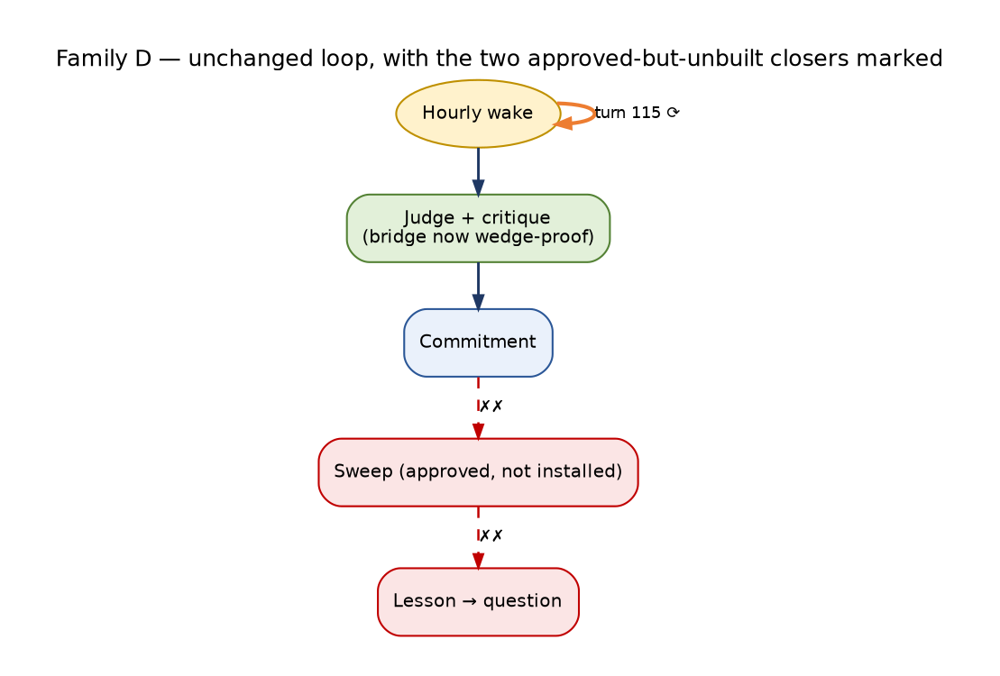

<!-- Lifecycle fact base D — CIO cognition iteration lifecycles. Status: ACTIVE (measured, read-only, 2026-09-14 00:00–00:45 EDT). Synthesized in docs/architecture/TRADE_AI_AS_IS_LIFECYCLES_2026-09-14.md; targets in TRADE_AI_FUTURE_STATE_LIFECYCLES_2026-09-14.md. -->

# CIO Cognition — Iteration Lifecycles (how one cycle feeds the next)

**Status:** ACTIVE — fact base, CIO cognition iteration lifecycles (family D of 6); measured read-only 2026-09-14 00:00–00:45 EDT
**Updated:** 2026-09-14 23:44 EDT — update block below records what shipped after the measurement (live `341bce2c1`)


> **Update 2026-09-14 23:44 EDT — what changed after this measurement (live `341bce2c1`).** This family was **not
> re-measured** and none of its lifecycle defects (operator-turn replay, single-subject memory, boilerplate
> falsifiers, unscheduled sweep, epoch resets) was changed on 2026-09-14. Related changes:
>
> - Every model call behind judgment and critique now passes through a bridge that cannot be wedged by a held
>   provider call (deadline, threads, `/health`, watchdog, #1019).
> - The commitment sweep cron was **approved by the operator** (2026-09-14 ~09:05) but is not yet installed.
> - 22 releases were promoted on 09-14, so epoch contiguity (D5) could not accumulate during the day.
> - "CIO Run Complete" check-ins without an advisory action are no longer sent (#1009).




```
Status:        FACT BASE — lifecycle family 1 of 6 (CIO cognition iteration)
as_of:         2026-09-14 00:20 → 00:40 EDT (04:20Z–04:40Z)
Served:        CURRENT → c594d8600-main-exact-phase2-20260914-000703 (promoted 00:07 EDT).
               Newest wake row is still epoch a8a62217e (slot 04:00Z). The first c594d8600 slot is 05:00Z, after this reading.
Method:        read-only jsonl readers, psql (default_transaction_read_only=on), journalctl, systemctl cat, crontab -l, source reads.
               No writes, restarts, LLM or paid calls, --apply, or get_cio_snapshot.
Stores:        wake state  /home/johnclaw/trade-ai-state/persistent_wake/state/   (NOT CURRENT/data/persistent_wake/state — stale 09-10)
               research    /home/johnclaw/trade-ai-state/persistent_wake/research_objects.jsonl
               cio ledgers /home/johnclaw/trade-ai-releases/persistent-state/data/cio/   (CURRENT/data/cio symlinks here — OBSERVED)
Extends:       asis_cio_pipeline_factbase.md (step table) — this file adds state machines, transitions and iteration dynamics
Labels:        OBSERVED (read this run) · INFERRED (reasoning over observed rows) · BLOCKED (not measurable read-only / no traffic)
Diagram key:   ══▶ spine   ──▶ read   ◀── write   ╌╌▶ feedback that fires   ✗✗▶ severed (edge exists in spec/code, carries nothing)
               ⟳ self-loop (an edge that feeds the same stage back without new information)
```

## Headline — where the iteration breaks (evidence-ranked)

1. **The wake loop is a replay loop for its #1 subject, not a learning loop.** (OBSERVED)
   - ADBE (0bc81168) wakes are driven by operator turn 115 (09-11 18:24Z, "ADBE — what did Q3 actually show on user growth?"). It has been replayed **40 consecutive times** (09-11 20:00Z → 09-14 04:00Z).
   - The operator-turn branch of `default_decide` (persistent_agent_wake.py:1337) receipts the *turn*, never the selecting research object. Research object 008dab9a was selected 18× and has **0 receipts** with its source_id. The selector's consumption check (`research_is_consumed`, wake_subject_selector.py:84) therefore never sees it consumed, so the same subject returns every hour.
   - The deterministic UUIDv5 receipt ids collapse the loop's traces: the `operator_turn:115` receipt is referenced by 40 wakes, and `memory_fact:mem_490759` (effect none) by 54.
   - Over the last 8 ADBE slots the only field changes were claim text alternating between 2 strings and one L3 refusal.
2. **The commitment → outcome edge has no scheduled producer.** (OBSERVED)
   - `scripts/sweep_commitment_outcomes.py` (#975) exists. It has **no crontab line and no systemd unit**, and `commitment_outcomes.jsonl` does not exist in the wake state root.
   - 420 commitments: OPEN 230 / FROZEN 190, **0 settled**. Every lifecycle sequence has length 1 (no row ever transitioned).
   - First governed due_at is 2026-09-17T16:00Z, so nothing is due yet. When it is, nothing will look. The sweep would also score all 190 as `INSUFFICIENT_EVIDENCE/claim_not_falsifiable`, because 190/190 falsifiers are the boilerplate string, **including the 5 governed commitments minted from L3-judged wakes**. The judgment-path fix in `run_persistent_wake.py:237` did not take effect on any stored row.
3. **The checkpoint lifecycle is structurally non-terminating.** (OBSERVED)
   - 3,107 of 3,362 checkpoint ids sit in SCHEDULED, and **3,102 of them have `due_at = null`** (horizon `event-relative`), so no resolver can ever select them.
   - Resolver `--apply` shows `due 0` every hour. 6 `OUTCOME_PENDING_DATA` rows are classified "obtainable" but held because `--apply-pending-data` is env-gated. All 6 are "SCHD −47.05% 08-26→09-11", which looks like a price-corruption/split artifact (INFERRED).
   - 3,189/3,351 outcome observations carry `realized_state = {"linked": true}`: a link marker, not a realized outcome. The factbase figure "null 3,351/3,351" is **corrected** here: the field is not null, it is non-informative.
4. **L3 judgment is one subject, 3 distinct judgments, replayed.** (OBSERVED)
   - 19 judged wakes. The cache holds 7 entries (all ADBE). views.jsonl has 11 rows but only **3 distinct judgment_ids / 4 summaries / 4 falsifiers**. 16 wakes point at 11 view ids (reuse 3,2,2,2).
   - All stances INSUFFICIENT / ABSTAIN; critic 11/11 `accept`. The judgment reasons from a single 3-week-old memory fact ("Evidence refresh required…", 08-23).
   - `l3_refused:offpeak_deferred` fires only in UTC 01–13 (21:00–09:59 ET), so L3 can only run 11 of 24 hours.
5. **The CIO wake-job lifecycle expires 3.6× more than it completes.** (OBSERVED) 7d streams: EXPIRED 1,446 / COMPLETED 396. Expiry reason `BACKLOG_EXPIRED:trigger=EVENT_BUS` 1,506 (window). 213 non-terminal streams, oldest DISPATCHED/IN_FLIGHT since **09-06 04:39Z**, i.e. 8 days stuck, far beyond 2× cadence.
6. **Correction to the factbase: Sentinel/Darwin are NOT stalled.** (OBSERVED) Producer `tradeai-advisory-shadow-session.timer` = `OnCalendar=Mon..Fri 09:15`. Last run Fri 09-11, next Mon 09-14 09:15 ET. Both stores show 3 rows/weekday since 08-14 with weekend gaps. The "stall since 09-11 13:16Z" is the weekend. The real finding is **constancy**: the same 3 agents (guardian, ledger, steph) are reviewed daily, Darwin `overall 1.0`, and agent-runtime@darwin/@sentinel/@iris dispatch `total 0` every 5 min.
7. **Reflection has plateaued.** (OBSERVED)
   - cases_seen 2,268 → 2,275 → 2,278 over the last 3 nights; scored +2, +1.
   - `proposals 1` every night: the same proposal ("case_c56912… has disposition but no outcome window", decision `dec_activation_button_probe`, a probe artifact).
   - auto_promotions 0. 1,808/1,808 scored joined-cases have outcome_status `EXPIRED` (reason `horizon_elapsed_no_market_outcome`), and darwin score 60 on 1,806. Reflection is scoring expirations.
8. **Epoch churn makes contiguous acceptance mostly unreachable.**
   - Release dirs: 17 on 09-13, 9 on 09-12 (OBSERVED). Wake store: 33 SHAs over 78 slots.
   - Longest same-SHA runs: 8 slots (efffaca13, e3250e9ec). Since 09-13 14Z only one run reaches 3 (07c903b0a).
   - 17 slots are missing, and every one coincides with a power-cut boot gap (OBSERVED boots: 09-11 22:52Z→23:58Z, 09-12 03:36Z→11:43Z, 13:55Z→21:02Z). Missed slots are recorded as `missed_skipped` and never backfilled.

---

## Lifecycle 1 — Hourly persistent wake cycle (WakeRecord@v2)

### (a) Purpose, actors, stores

- **Purpose:** each hour, pick ≤3 subjects with unconsumed research or recent material change, load memory, prior operator turns and comms, then decide, commit, receipt, optionally judge + critique + view, optionally mint a governed commitment. Advisory only (MBI_BEHAVIOR=0).
- **Actors (OBSERVED crontab):**

| cron | actor |
|---|---|
| `:45` | `run_governed_research_producer.py --limit 5 --execute` (targets = material_changes from selection feed) |
| `:55` | campaign `ops/wake_selection_feed.py --hours 48`: DB export → `CURRENT/data/persistent_wake/selection_feed/{material_changes,receipts,research_objects}.jsonl` |
| `:00` | `CURRENT/scripts/run_persistent_wake.py --agent-id cio` (default limit 3; env `PERSISTENT_WAKE_ENABLED=1 PERSISTENT_WAKE_SCHEDULE_ENABLED=1`, phase8-safe-canary.env) |

  In-process modules: `wake_subject_selector.select_subjects` → `WakeEngine.run` (persistent_agent_wake.py:542) → `MemoryLoader` → `default_decide` (:1322) → `_maybe_judge` (:1074; l3_judgment_pipeline + independent_critic + l3_agent_view_synthesis) → `_maybe_cortex_shadow_after_wake` (run_persistent_wake.py:206; cortex_shadow_pipeline → agent_views.jsonl + GovernedCommitment@v1).
- **Stores:** wakes.jsonl 234 · commitments.jsonl 420 · receipts.jsonl 182 · views.jsonl 11 · agent_views.jsonl 193 · l3_judgment_cache.jsonl 7 · research_objects.jsonl 675 · research_producer_health.json · aif_memory.jsonl · DB operator_conversation_turns / communication_agent_consumption_receipts.

### (b) State machine

**Wake lifecycle** (`lifecycle_state`; TERMINAL_WAKE = persistent_agent_wake.py:51)

```
                 mint_wake_id = uuid5(agent+reason+slot+subject)  (:13)
                 existing terminal row for same id ⇒ return, no new rows (:583)
 [none] ──claim──▶ CLAIMED (:622) ──load memory──▶ LOADED (:658)
                                     │
               memory malformed ─────┼──▶ MEMORY_MALFORMED  (terminal; policy refuse_malformed_memory)   observed 3 (09-10 19Z)
               memory unavailable ───┼──▶ MEMORY_UNAVAILABLE (terminal)                                    observed 0
               stale & refuse ───────┼──▶ STALE (terminal; refuse_stale_memory)                            observed 1 (09-10 23Z)
                                     ▼
                         decide (default_decide :1322)
            act=False ───────────────┼──▶ SETTLED with effect none / reason no_relevant_memory (:773-823)    observed 0 in store*
            act=True  ──commitment OPEN + receipts──▶ ACTED (:1021) ──▶ SETTLED (:1025/1030)                observed 230
 restart recovery (:1454): CLAIMED/LOADED ⇒ ABANDONED ; ACTED+commitments ⇒ SETTLED                         observed ABANDONED 0
```

\* `persistent_wake.log` holds 34 `outcome: refused / no_relevant_memory` lines from 09-08, but those wakes are not in the current store. The store starts 09-10 06Z, after the move to the shared state root (INFERRED from `_default_state_root` docstring, run_persistent_wake.py:129).

**Distinct values in wakes.jsonl (OBSERVED, n=234):**

| field | values |
|---|---|
| lifecycle_state | SETTLED 230 · MEMORY_MALFORMED 3 · STALE 1 |
| decision_summary.reason | organic_from_selection 176 · organic_from_operator_turn 40 · organic_from_memory 14 · null 4 |
| effect_kind | changed_question 216 · changed_commitment 14 · null 4 |
| selection.source | unconsumed_research 200 · material_change 34 |
| policy_decisions | feature_flag_on 234 · l3_skipped_ungrounded 104 · stale_memory_retained_with_decay 54 · l3_refused:offpeak_deferred 28 · l3_judged 19 · l3_view_persisted 16 · stale_memory_degraded_to_empty 6 · l3_refused:budget_cap 4 · refuse_malformed_memory 3 · refuse_stale_memory 1 · l3_refused:schema_invalid 1 |
| prior_operator_turn_ids | [] 194 · ['115'] 40 |
| memory_fact_ids | [] 179 · ['mem_490759…'] 55 |
| views_created | non-empty 16 |
| commitments_created | 1 on 230 · 0 on 4 |
| parent_kind | null 234 (no wake ever cites a prior wake) |

**Decision branch precedence** (default_decide :1322–1404): operator turn present → OPERATOR_QUESTION / changed_question (source=operator_turn) ▸ else memory facts → MEMORY_SALIENCE / changed_commitment ▸ else selection → SELECTION_OBSERVATION / changed_question ▸ else act=False.

- Note: a composing decider (`composing_decide_or_none`, run_persistent_wake.py:97) replaced the claim text on newer epochs. Claims now read "123 new sources on ADBE, led by…" rather than `selection:…warrants review`, but the `commitment_kind` is unchanged (OBSERVED commitments claims).

**L3 gate sub-machine** (`_maybe_judge` :1074; policy tokens OBSERVED)

```
 flag off ──▶ (no token)
 snap.facts == [] ──▶ l3_skipped_ungrounded                               104
 no research-object selection ──▶ l3_skipped_no_material_question         0
 pipeline → refusal ──▶ l3_refused:{offpeak_deferred 28 | budget_cap 4 | schema_invalid 1}
 live provider disallowed ──▶ l3_live_provider_blocked                    0
 ok ──▶ l3_judged 19 ──(critic accept + synthesis)──▶ l3_view_persisted 16
 exception ──▶ l3_error_degraded                                          0
```

- Question text is a **template** (:1098): "Does the prior position on this subject still hold given unconsumed_research <id>?". Only the id varies.

**Governed commitment** (cortex shadow, GovernedCommitment@v1): minted FROZEN at birth (`frozen_at == created_at`), `due_at = +7d`, confidence 0.6, source_identity `cortex_shadow_pipeline`, trigger `agent_view_v1`. Terminal vocabulary exists (`CONFIRMED/REFUTED/EXPIRED/INSUFFICIENT_EVIDENCE`, commitment_outcome_sweep.py:71) but is unreached.

**Receipts** (AgentConsumptionReceipt@v2): lifecycle SETTLED 182/182.

| field | values |
|---|---|
| effect_kind | changed_question 177 · none 3 · changed_commitment 1 · changed_view 1 |
| source_kind | research_object 143 · material_change 33 · memory_fact 3 · operator_turn 2 · comm_event 1 |

- 347 wake→receipt references resolve to 182 ids (uuid5 dedup). Max reuse 54 (`memory_fact mem_490759`, effect none), then 40+40 (`operator_turn 115`, none / changed_question).

**Research object:** `lifecycle_state` IDENTIFIED 675/675. No object ever transitions; consumption lives only in receipts.

### (c) End-to-end flow with laterals and feedback

```
 :45 research producer ◀── research_targets.jsonl (11 symbols incl. false subject "ABOVE") ◀── selection_feed/material_changes
        │ writes ResearchObject@v1 (IDENTIFIED)   675 rows, 5–7 subjects/day, 15 produced last run
        ▼
 :55 wake_selection_feed ── DB export ──▶ CURRENT/.../selection_feed/{material_changes 15, receipts 101, research_objects_proxy 0}
        │                                  (re-created per promote; receipts = DB comms receipts, NOT the wake's own)
        ▼
 :00 run_persistent_wake ─── select_subjects(limit 3) ──▶ reads research_objects + feed receipts + _emitted_receipts(state)  (:156)
        ║     priority a: RO without non-none receipt   priority b: MaterialChange ≤24h, reeval 24h
        ║                                                                 ⟳ ADBE RO 008dab9a never receipted → reselected 18×
        ▼
   CLAIMED ══▶ LOADED ─── MemoryLoader.load ──▶ aif_memory.jsonl (970 rows)
        ║        filtered_wrong_subject 892 · unmatched 52 · ambiguous 26 · halflife_exp:336h · returned 1 (ADBE only) / 0 others
        ║     ─── prior_operator_turns(subject) ──▶ DB operator_conversation_turns  (only ADBE has an operator row: turn 115)
        ║     ─── prior_comm_events(subject) ──▶ comms (non-empty on 7 wakes; comm 01a09cb3)
        ▼
   DECIDE (default_decide) ──▶ turn? ─ yes ─▶ OPERATOR_QUESTION ◀── commitments.jsonl OPEN (CommitmentRecord@v2)
        ║                        └─ no ─▶ facts? ─▶ MEMORY_SALIENCE | selection ─▶ SELECTION_OBSERVATION
        ║                                                         ◀── receipts.jsonl (uuid5; replay re-uses same id)
        ▼
   _maybe_judge ── facts==[] ─▶ l3_skipped_ungrounded (all non-ADBE subjects)
        ║        ── offpeak 01–13Z ─▶ l3_refused:offpeak_deferred
        ║        ── cache (l3_judgment_cache 7 keys) ─▶ deepseek-flash author ─▶ grok-3-mini critic (accept 11/11)
        ║                                                   ◀── views.jsonl AgentView@v1 class A (11 rows, 3 judgment_ids)
        ║        critic 'revise' → revised_next_research_question (independent_critic.py:252)   ✗✗▶ never fired (0 revise)
        ▼
   SETTLED ─── cortex shadow ─▶ agent_views.jsonl AgentView@v1 class T RECOMMEND (193)   ◀── GovernedCommitment@v1 FROZEN (190)
        ║                                                       falsifier "observation contradicts claim within horizon" 190/190
        ▼
   outbound hand-off (_outbound, SFR-G-002) ── None by default ──▶ ✗✗▶ no wake-originated notify (0 comm rows cite a wake; see factbase 12b)
        ▼
   REVIEW_READY (next slot)
        ╎ carries forward: commitments (not read by next wake) ✗✗▶
        ╎                  receipts (read by selector) ╌╌▶ selection  [fires for research_object path; NOT for operator-turn path ⟳]
        ╎                  memory (read) — but NOTHING the wake produces is written to aif_memory ✗✗▶
        ╎                  operator turns (read) ╌╌▶ decision [fires, but the same turn 115 forever ⟳]
        ╎                  views / judgment cache ╌╌▶ L3 [cache hit returns identical judgment ⟳]
        ▼
   sweep_commitment_outcomes  ✗✗▶ unscheduled (no cron / no unit; commitment_outcomes.jsonl absent)
```

### (d) Iterations — slot-to-slot, day-to-day (OBSERVED)

**Throughput per day (wakes):** 09-10 54 · 09-11 69 · 09-12 24 (power cuts) · 09-13 72 · 09-14 15 (to 04Z). Always exactly 3 wakes/slot (78 slots). Latency slot→produced: median 1.8 s, max 3.6 s.

**Subject concentration:** 13 subjects all-time; top 5 = 200/234 (ADBE 65, AES 53, ADBT 43, "ABOVE" 24, ALLE 15).

- "ABOVE" (b0e5fb1e) is the identity tagger's false subject: the word "above" in reply text. It receives research targets and wakes (INFERRED: false positive per factbase step 1).
- 5 of 13 research subjects were never woken.

**Top-3 subject iteration traces:**

| subject | wakes | distinct selecting RO ids | reselection | distinct claims | memory returned | L3 | views | what changed between consecutive wakes (last 8) | feedback edge fired? |
|---|---|---|---|---|---|---|---|---|---|
| ADBE 0bc81168 | 65 | 13 | 27/18/9/2/1… | 50 | 1 on 54 (same fact mem_490759, age ~495h) | judged 19, offpeak 28, budget 4 | 11 (3 distinct judgments) | 21Z→22Z: nothing · 23Z: claim text · 00Z: claim reverts · 01Z: GC present + L3 offpeak · 02Z/03Z/04Z: **nothing** | operator-turn ╌╌▶ decision fires every slot, but it is **the same turn (115)** ⟳. Selector-receipt feedback **does not fire** (RO 008dab9a has 0 receipts). Critique feedback never (11/11 accept) |
| AES a2ee84b5 | 53 | 53 | 1 each | 48 | 0 on 41, null 12 | skipped_ungrounded 39 | 0 | every slot: new RO id + claim alternates between two templates ("123 new sources on AES…" / "Argus boosted rating…") | selector-receipt feedback **fires** (each RO consumed once, never reselected). No memory, no L3, no decision diversity: reason = organic_from_selection 53/53 |
| ADBT 8228ea3f | 43 | 43 | 1 each | 34 | 0 on 32 | skipped_ungrounded 30 | 0 | new RO id each slot; claim rotates among 4 phrasings of "evidence consists only of ADBT quote pages" | selector feedback fires; stance unchanged; the desk records 43× that it has no evidence |

**What carries from slot N to N+1 (OBSERVED):**

| carried state | read by N+1? | effect observed |
|---|---|---|
| receipts (effect≠none, source_kind research_object) | yes (selector, `_emitted_receipts`) | suppresses reselection. **Works for 143 ROs; bypassed by the operator-turn branch** |
| prior_operator_turn_ids | yes (comms port) | 40/40 ADBE wakes carry `['115']`; **no second operator turn for any wake subject exists** (DB: ADBE 2 rows = turn 115 + 1 agent row; WMT 11 rows but WMT woken only 2×). In 7d, 181 operator rows cover 4 subjects, mostly SCHD 108 |
| memory facts | yes | one fact, one subject. **No wake output is admitted to aif_memory** (INFERRED: no writer path in WakeEngine; memory digest unchanged 08-23) |
| commitments | **no** (`parent_kind` null 234/234; no reader of prior commitments in decide) | ✗ |
| L3 cache | yes | cache_hit 12 of 19 judged; same evidence_revision → identical judgment |
| views / critic verdict | no reader in decide/selector | ✗ |
| missed slots | recorded `missed_skipped` (215 log lines) | never backfilled |

**Day-to-day:** the judgment stance for ADBE was INSUFFICIENT on 09-11, 09-12, 09-13 and 09-14, confidence 0.55–0.72. Fresh author calls: 5 on 09-11, 1 on 09-12, 1 on 09-13, 0 on 09-14. **Nothing measured changed for any subject across 4 days except which research object id and which of 2–4 claim phrasings was used.**

### (e) Questions

- **Wake question** is a template (persistent_agent_wake.py:1098); only the RO id varies.
- **next_research_question** does not exist on WakeRecord, CommitmentRecord or AgentView rows. The critic can revise it (independent_critic.py:252) and M2 requires that to change the question. Revise count: **0**.
- **Operator questions reaching wakes:** exactly 1 (turn 115, ADBE, 09-11). Turn 115 has not been answered in the wake store: every judgment is INSUFFICIENT and cites only mem_490759, not Q3 data. It is re-asked 40×.
  - 41 operator messages in 7d, and 0 new ones reached any wake: the subjects asked about (SCHD, WMT, V) are not selected by the research/material selector.
- **Parallel question store:** the CIO instrument-record path (`cio_instrument_records.jsonl`, 193 rows, 53 subjects) holds next_research_question on 24 rows, 17 distinct strings.
  - Only **1 subject (HELD:SCHD) ever changed its question.** 3 versions 08-30 ("defer changed?" → "catalyst changed?" → "Prior research was refused… what INDEPENDENT evidence…"), then re-stamped identically 09-02, 09-05, 09-08, 09-12.
  - `wake_turn_effects.jsonl`: `turn_changed_decision=true` only on 09-07 (147) and 09-08 (215); **false on every row since 09-09** (412 rows).

### (f) Live measurements

| measure | value | label |
|---|---|---|
| wakes all-time / SETTLED | 234 / 230 | OBSERVED |
| slots covered / missing (09-10 06Z→09-14 04Z) | 78 / 17 (all in power-cut boot gaps) | OBSERVED |
| 7-day throughput | 234 wakes (store starts 09-10) | OBSERVED |
| wakes with memory>0 | 55 (all ADBE) | OBSERVED |
| L3 judged / views persisted / distinct judgments | 19 / 16 (→11 ids) / 3 | OBSERVED |
| research objects produced / consumed / never selected | 675 / 143 / 529 | OBSERVED |
| unconsumed RO age median / max | 40.7h / 77.7h | OBSERVED |
| commitments OPEN / FROZEN / settled | 230 / 190 / 0 | OBSERVED |
| governed commitments past due now | 0 (first due 09-17 16:00Z) | OBSERVED |
| stuck wakes beyond 2× cadence | 0 (no non-terminal wake) | OBSERVED |
| oldest open commitment | OPEN since 09-10 06:00Z (CommitmentRecord@v2 has no due_at; never closes) | OBSERVED |

### (g) Failure paths — where it breaks today

1. **Operator-turn branch starves consumption** (:1337). The RO is not receipted, so the subject is reselected and the turn replayed ⟳. Fix locus: receipt the selecting RO on every branch.
2. **Memory grounding is single-subject.** filtered_wrong_subject 892 per load. 104 wakes skipped L3 as ungrounded. No wake writes memory, so grounding cannot grow from the loop itself.
3. **L3 offpeak deferral** blocks 01–13Z. The cache returns identical judgments when the evidence_revision is unchanged. The critic has never disagreed.
4. **The governed falsifier is always boilerplate**, even on judged wakes (5/5). A sweep would score all as not falsifiable.
5. **The sweep is unscheduled.** OPEN CommitmentRecord@v2 has no due_at and no closer.
6. **Research targets include tagger false positives** ("ABOVE"). Research on non-securities consumes Brave budget and wake slots.
7. **Power cuts** drop slots, and there is no backfill. A promote every ~1.4h (09-13) resets the epoch.
8. **The selection feed lives in the release dir** (re-created per promote at :55). A promote between :55 and :00 leaves the feed path pointing at the prior release (INFERRED risk; FEED_META paths rotate, OBSERVED).
9. **Nothing reads `parent_id` / prior commitments.** There is no notion of "my last position on this subject".

### (h) Maturity per stage

| stage | L | basis |
|---|---|---|
| selection | L1 L5 | runs unattended, SHA-stamped; diversity 13 subjects; replay defect |
| wake open/close | L1 L5 | 230/234 SETTLED, latency < 4 s |
| memory load | L2 (1 subject) | 55 grounded wakes, 1 fact |
| research consumption | L1 L2 | 143 consumed; receipts suppress reselection (except operator path) |
| L3 judgment | L3 partial | 3 distinct judgments, 1 subject, cache replays |
| critique | L3 partial | 11 verdicts, 0 disagreement |
| synthesis (views) | L1 (T) / L3 partial (A) | 193 T RECOMMEND template; 11 A ABSTAIN |
| commitment | L1 | 0 falsifiable, 0 settled |
| next-slot carry | L1 | carries receipts and turn; not commitments, views or memory writes |

### (i) Target lifecycle and exit conditions

- **Target:** RO receipted on every branch → a fresh subject each slot unless a new change or turn arrives → memory admitted from settled judgments → L3 on grounded subjects at any hour (budget, not clock) → critic able to `revise` next_research_question → governed commitment with the author's falsifier → sweep settles at due → lesson → memory → next question.
- **Exit counters to watch:**

| proof | exit condition |
|---|---|
| M1 | an RO-driven wake changes a named field; show a diff of `next_research_question` or claim for the same subject across 2 slots, caused by a new RO |
| M2 | ≥1 critic verdict `revise` with `field_changes[field=next_research_question]` |
| M3 | a turn id ≠ 115 appears in `prior_operator_turn_ids`, with a decision diff |
| M5 | a commitment settled ≥7d later by a scheduled sweep with nobody replaying it |
| campaign clause | `scheduled_wakes>=3` (m2_canary_soak_collector.py:682) is already met; the binding constraints are same-epoch inbound/gateway/L3 (see Lifecycle 5) |

---

## Lifecycle 2 — Commitment → checkpoint → outcome → lesson

### (a) Purpose, actors, stores

- **Purpose:** compare what was decided with what happened; emit lessons whose provenance says whether they came from outcomes; feed lessons back into later questions.
- **Two disjoint commitment families (OBSERVED):**
  - **A. Wake commitments** (commitments.jsonl: CommitmentRecord@v2 OPEN, GovernedCommitment@v1 FROZEN). Settler: `scripts/sweep_commitment_outcomes.py` → `scripts/lib/commitment_outcome_sweep.py` → `commitment_outcomes.jsonl` + `lesson_candidates.jsonl` (in the wake state root). **Unscheduled.**
  - **B. CIO decision checkpoints** (`outcome_checkpoints.jsonl`, OutcomeCheckpoint@v1, registered by `cio_run_worker` / `material_scan`). Settlers:
    - cron `20 * * * *` `resolve_due_checkpoints.py --apply` (outcome_resolution.py)
    - timer `tradeai-due-checkpoints` daily 17:10 ET → `process_due_checkpoints.py --source-available --persist` (writes `outcome_observations.jsonl`)
    - cron `40 6 * * *` `build_lesson_candidates.py --apply` (outcome_to_lesson.py → `lesson_candidates.jsonl`)
    - `cio_lesson_bind.py` (LessonBind@v1 → REVIEW_READY, only for `plan_binding=bound`)
    - `tradeai-advisory-lessons-reflect` 21:40 (`advisory_lessons.py reflect / ratify-safe / auto-retire`; a separate advisory KB lane)

### (b) State machines

**Checkpoint** (`status`; append-only versions; OBSERVED 3,769 rows / 3,362 ids)

```
 SCHEDULED ──due_at passed & both prices in ticker_prices──▶ RESOLVED                  (11 ids)
     │      ──due_at passed & a price missing──▶ OUTCOME_PENDING_DATA ──prices appear──▶ RESOLVED   (152 ids)
     │                                              └──(--apply-pending-data, env-gated) expire never-resolvable
     │      ──no price-resolvable subject──▶ NOT_PRICE_RESOLVABLE (terminal)           (86 ids)
     └── due_at = null ──▶ (no transition possible)                                    (3,102 ids)  ✗
 latest-per-id: SCHEDULED 3,107 · RESOLVED 163 · NOT_PRICE_RESOLVABLE 86 · OUTCOME_PENDING_DATA 6
 transition sequences: (S) 3,107 · (S→PD→R) 152 · (S→NPR) 86 · (S→R) 11 · (S→PD) 6
```

| field | values |
|---|---|
| entity_type | UNRESOLVED 3,538 rows · null 226 · PORTFOLIO_CASH 5 |
| plan_binding | unbound 2,806 · null 963 · **bound 0** → cio_lesson_bind can mint nothing |
| horizon | event-relative 3,101 · 1_session 562 · 5_sessions 101 · 20_sessions 2 · quarterly 2 · thesis-review 1 |

**Outcome observation** (OutcomeObservation@v1, 3,351): `realized_state` is `{linked:true}` on 3,189 and a price-change dict on 162. Observations are written ~200/day by the due processor, but they are **re-observations of the same resolved decisions** (INFERRED: steady 196–203/day while RESOLVED stays 163).

**Governed commitment outcome** (commitment_outcome_sweep.py): FROZEN → {CONFIRMED | REFUTED | EXPIRED} (SETTLED tuple :71) or INSUFFICIENT_EVIDENCE (`claim_not_falsifiable` :45); CONFIRMED/REFUTED → lesson PROPOSED (:283). **0 rows ever.**

**Lesson candidate** (LessonCandidate@v2, 414): status PROVISIONAL 414/414.
- Designed transitions PROVISIONAL → SUPPORTED (≥ MIN_LESSON_SAMPLES=5 independent) / CONTRADICTED. None have happened.
- `lesson_provenance`: null 337 · RESEARCH_DERIVED 74 · OUTCOME_DERIVED 3. `supporting_outcome_ids` non-empty 2; `promotion_stage` none promoted.
- The 3 OUTCOME_DERIVED lessons are all SCHD TRIM, with independent_samples 1/2/3 and moves +0.314% / −22.873% / −30.497%. The −22/−30% values are consistent with the suspect SCHD −47% price series (INFERRED: corrupted or split input, per memory note price-corruption-scrub).

### (c) Flow

```
 cio_run_worker / material_scan ◀── OutcomeCheckpoint@v1 SCHEDULED (95 on 09-14, 446 on 09-13; due_at null on 3,102)
          │
   :20 hourly resolve_due_checkpoints --apply ──▶ reads due SCHEDULED ──▶ "due 0" (every run)
          │                                     ──▶ PENDING triage: 6 obtainable, applied False (env gate)  ✗✗▶
   17:10 due-checkpoints ─▶ process_due_store ◀── outcome_observations (+~200/day, {linked:true})
          │
   06:40 build_lesson_candidates --apply ──▶ reads observations/resolved ◀── lesson_candidates (PROVISIONAL)
          │                                   3 OUTCOME_DERIVED (SCHD), 74 RESEARCH_DERIVED (CASE_SUMMARY_CONTEXT)
          ▼
   cio_lesson_bind (bound only) ✗✗▶ bound = 0
   lesson ratify ✗✗▶ no ratifier: agent_runtime definitions deny "lesson.ratify" to every agent (definitions.py:89,118,149)
   lesson → memory/question ╌╌▶ cio_rehydrate.py:189 note_source="lesson" on wake_turn_effects (HELD:SCHD) — used as a
                                note when no turn exists; turn_changed_decision false since 09-09
   wake commitments (family A) ── sweep_commitment_outcomes ✗✗▶ unscheduled
```

### (d) Iterations

- **Checkpoint creation is bursty:** 09-07 159, 09-08 170, 09-09 6, 09-10 2, 09-11 7, 09-12 2, 09-13 446, 09-14 95. Resolutions by resolved_at: 08-27 6, **08-31 152 (one batch)**, 09-09 2, 09-10 1, 09-13 2. In 7 days: **5 resolved vs 886 created**.
- **Lesson feed-back into later questions:** only HELD:SCHD shows a lesson note in a question path, and the question has been identical since 08-30. **No lesson changed a later question in 14 days** (OBSERVED instrument-record versions).

### (e) Questions

- Lessons carry `statement` ("TRIM on SCHD did not hold…"). None is phrased or stored as a question.
- The only lesson-to-question consumer is `cio_rehydrate` note_source. BLOCKED: no read-only counter shows a lesson altering `next_research_question`.

### (f) Measurements

| measure | value |
|---|---|
| median commitment→checkpoint→settlement | **not computable: 0 wake commitments settled.** For checkpoints: resolved median ≈ created 08-28 → resolved 08-31 (~3 days, batch) |
| checkpoints stuck | due_at-null SCHEDULED 3,102, oldest created 2026-08 (INFERRED from created-by-day tail); PENDING 6 since 08-26 (> 18 days, far beyond 2× hourly cadence) |
| resolve rate 7d | 5 / 886 = 0.56% |
| lessons ratified | 0 / 414 |

### (g) Failure paths

1. `due_at=null` event-relative checkpoints have no terminal path.
2. The `--apply-pending-data` gate holds 6 obtainable rows, which also carry a suspect price.
3. The sweep for wake commitments is unscheduled, and the falsifier is non-falsifiable.
4. `plan_binding=bound` is 0, so LessonBind mints nothing.
5. No agent may ratify lessons, and no operator ratify surface was found read-only (BLOCKED).
6. Observations duplicate without new outcome content.

### (h) Maturity

checkpoint register L1 · resolve L1 (5/week) · observation L1 (non-informative) · lesson generation L1 · lesson ratification L0 · lesson → question L0 · wake-commitment settlement **L0**.

### (i) Target / exit

- Checkpoints get concrete due_at, or an event trigger that closes them.
- The sweep is scheduled hourly after :00.
- The first GovernedCommitmentOutcome@v1 row with CONFIRMED/REFUTED on a judged-wake falsifier is written.
- One OUTCOME_DERIVED lesson reaches SUPPORTED with ≥5 independent samples on clean prices.
- The lesson text appears in a later wake's question (M1/L4 counter: `commitment_outcomes.jsonl` rows > 0, `lesson_provenance=OUTCOME_DERIVED` with `supporting_outcome_ids ≥ 5`).

---

## Lifecycle 3 — Reflection and MVL agents (Sentinel, Darwin, Iris, runtime)

### (a) Actors / stores (OBSERVED unit files)

| actor | schedule / command | stores |
|---|---|---|
| `tradeai-cio-nightly-reflection` | 21:50 ET → `cio_nightly_reflection.py` | `cio_reflection_candidates.jsonl` (33 nightly rows) |
| `tradeai-advisory-shadow-session` | **Mon..Fri 09:15** → `advisory_shadow_session.py --once` | `sentinel_reviews.jsonl` (140), `darwin_scorecards.jsonl` (223); log `logs/advisory_shadow_session.log` |
| `tradeai-agent-runtime@{sentinel,darwin,iris,…}` | every ~5 min (reflection 21:30) → `agent_runtime.agents.run_once --agent %i --once --max-batch 8` | SHADOW, prepare-only |
| Iris | `iris_taxonomy_agent.py` (timer 07:00 + cron 07:00/07:30 + Sun 10:00 from dev tree) + `iris_proposal_curator.py --apply` 07:20 | taxonomy proposals |
| `tradeai-advisory-lessons-reflect` | 21:40 ET | advisory KB lessons |

### (b) State machines

**Nightly reflection run:** each night appends one summary row `{cases_seen, scored, proposals[], auto_promotions, joined_cases[]}`.
- joined_case.status: SCORED | (unscored).
- outcome.outcome_status: EXPIRED 1,808 · null 470. darwin.score: 60 on 1,806 · 55 on 1 · 70 on 1.
- proposal.state: CANDIDATE (kind `unresolved_contradiction`). No transition to ACCEPTED/PROMOTED exists in data (auto_promotions 0 always; `mutates_production false`).

**Sentinel review:** status PASS 131 · FAIL 4 · null 5 (5 early rows use `verdict` PASS). Terminal per row, no re-review.

**Darwin scorecard:** payload.overall in [0,1]; the recent rows are 1.0 for guardian/ledger/steph. No promote/demote state.

**Agent-runtime dispatch** (contract agent-runtime-bounded-dispatcher-v1): outcomes COMPLETED / FAILED / REFUSED_STALE / REFUSED_DUPLICATE / REFUSED_DISABLED / REFUSED_CAPACITY / REFUSED_WRONG_AGENT / CIRCUIT_OPEN / CANCELLED. Observed `total 0` on every sentinel/darwin/iris run sampled (09-11 14:12 → 09-14 00:26). Agent state SHADOW enabled=True.

**Iris curator:** proposals pending → {APPLIED reclassify, EXPIRED stale >14d, left for human review}. 09-13: 0 eligible / 0 applied, 181 expired, **3,406 retire_channel + 454 add_channel left for human review, pending 5,047**.

**Ratify/reject:** `lesson.ratify`, `kb.ratify`, `hypothesis.promote` and `config.promote` are **denied tools** for runtime agents (definitions.py:58,89,118,149). The only observed human paths are 1 `reject` and 1 `ack` disposition via `signed_action_link` in reflection joined cases (constant since 09-07).

### (c) Flow

```
 cio_production_cases.jsonl ──▶ 21:50 nightly reflection ──▶ join outcome (closed_loop_p0_observer: EXPIRED) + darwin v1 score
        │                                                   ◀── cio_reflection_candidates (proposal CANDIDATE ×1, same one nightly)
        │   proposal ✗✗▶ promotion (auto_promotions 0; no ratifier)
 Mon–Fri 09:15 shadow session ──▶ specialists guardian/ledger/steph ──▶ ◀── sentinel_reviews (3/day) ◀── darwin_scorecards (3/day)
        │   Darwin score ✗✗▶ any routing/weight (no reader found in wake/CIO decision path; INFERRED)
 */5 agent-runtime@{sentinel,darwin,iris} ──▶ trigger queue (producer every ~2 min) ──▶ dispatch total 0  ✗✗▶
 07:20 iris curator ──▶ 5,047 pending, 3,860 "left for human review" ✗✗▶ (no human queue consumption observed)
```

### (d) Iterations

**Reflection nightly deltas (cases_seen / scored):**

| night (Z) | cases_seen | scored |
|---|---|---|
| 09-07 | 1,808 | 1,250 |
| 09-08 | 1,822 | 1,368 |
| 09-09 | 1,927 | 1,471 |
| 09-10 | 2,020 | 1,580 |
| 09-11 | 2,151 | 1,697 |
| 09-12 | 2,268 | 1,805 |
| 09-13 | 2,275 | 1,807 |
| 09-14 | 2,278 | 1,808 |

- Growth collapsed after 09-12 (+7, +3). This coincides with the CIO run BLOCKED burst 09-12 23Z–09-13 01Z and the weekend (INFERRED).
- The proposal set is identical for ≥6 nights.
- **Sentinel/Darwin:** 3 rows every weekday since 08-14. The same three agents, each with PASS and overall 1.0 on the latest rows. The 09-10 run exited `status=1/FAILURE` but still wrote rows.
- **"Stalled since 09-11 13:16Z":** **corrected**. Next scheduled Mon 09-14 09:15 ET (OBSERVED `list-timers`).

### (e) Questions

Reflection raises one "question" (`unresolved_contradiction`: disposition without outcome window) about a probe decision. It has been unanswered for ≥6 nights. Sentinel/Darwin raise none.

### (f) Measurements

| counter | value |
|---|---|
| reflection proposals | 1 |
| promotions | 0 |
| scored/seen | 79% |
| scored with a real market outcome | 0 (all EXPIRED) |
| Sentinel 30d FAIL rate | 4/140 (2.9%); FP rate BLOCKED (no labels) |
| Darwin distinct agents | 3 (plus 88 unlabeled 08-09 rows) |
| runtime dispatch last 3 days | 0 |
| Iris pending | 5,047 |

### (g) Failure paths

1. Reflection scores horizon expiries because outcomes never resolve (Lifecycle 2 breaks upstream).
2. No ratifier exists by design, and no human queue is being drained.
3. The runtime is prepare-only with 0 dispatch, so Sentinel/Darwin "circulation" is a fixed shadow-session script, not the runtime.
4. The 09-10 shadow session reported FAILURE yet wrote rows (status and data disagree).
5. `tradeai-iris-taxonomy` failed 09-12 07:43 on boot (exit 1). It succeeded 09-13 10:01.

### (h) Maturity

nightly reflection L1 L5 (runs) / L0 (effect) · Sentinel L1 · Darwin L1 · agent-runtime dispatch L0 · Iris curator L1 (applies expiries only) · ratify L0 (⊘ by design for agents).

### (i) Target / exit (MVL counters per 09-11 doc)

- Sentinel reviews across more than the 3 fixed agents, including Watch artifacts, with a measured FP rate.
- Darwin scorecards read by a routing or threshold consumer (shadow).
- Runtime dispatch total > 0, COMPLETED.
- Reflection proposals ≥ 1 new per week, each with an operator ratify/reject receipt.
- Regression fixtures count: BLOCKED (no counter located).

---

## Lifecycle 4 — CIO run lifecycle (reactive cycle / decision engine / wake jobs / defer / situations)

### (a) Actors / stores (OBSERVED)

| actor | schedule | stores |
|---|---|---|
| `tradeai-cio-reactive` | every ~2 min → `cio_reactive_cycle.py --once` (CIO_REACTIVE_WAKES=1, AGENT_DECISION_PAYLOAD=1) | — |
| `cio_wake_dispatch_entrypoint.py` | cron `*/5` (flock + 15m timeout) | `cio_wake_jobs.jsonl` (event-sourced streams), `cio_wake_dispatches.jsonl`, `cio_runs.jsonl` (hash-chained run events), `wake_record_consult.json`, `wake_research_persist.json`, `wake_turn_effects.jsonl` |
| `cio_situation_detector` | → `cio_events.jsonl` | `situation.raised` |
| `tradeai-cio-defer-revisit` | hourly :09 → `cio_defer_revisit.py --live` | `cio_defer_lineage.jsonl` via `_defer_path` |
| health boundary | `config/cio_health_snapshot_feed.json` (`enforce: true` since 09-13, max_age 120 min) → `cio_health_boundary.py` READY/DEGRADED/BLOCKED/UNKNOWN | — |

- DB `cio_decisions` (31,173 rows): the cron `cio_decision_engine.py --run` has been **disabled since 08-08** (crontab:165), yet ~3,720 rows/day keep arriving. Writer not identified read-only (BLOCKED; `api_v2.py:55875` lists it as a 24h job).

### (b) State machines

**CIO run** (cio_runs.jsonl `payload.from_status→to_status`; OBSERVED all-time 11,558 events)

```
 CIO_RUN_CREATED ─▶ QUEUED ─▶ HEALTH_CHECK ─(54)─▶ BLOCKED
                              │ 2,261
                              ▼
                        EVIDENCE_BUILD ─▶ CIO_SYNTHESIS ─(1,718)─▶ COMPLETED
                                                 └──(525)──▶ BLOCKED   (EVIDENCE_GAP:stale_required:portfolio 525;
                                                                        missing_required:health_data_quality,watch_intelligence… 52;
                                                                        missing defense_stops_protection 2)
 MODEL_CALL_RECORDED 46 (lateral)
 terminal per run: COMPLETED 1,718 · BLOCKED 579 · non-terminal 88 (CREATED 69, EVIDENCE_BUILD 9, CIO_SYNTHESIS 9, HEALTH_CHECK 1)
 oldest non-terminal: CREATED 2026-08-10 20:38Z
```

- Note: the gap "EVIDENCE_GAP" is emitted at the CIO_SYNTHESIS→BLOCKED edge, not at EVIDENCE_BUILD (OBSERVED transition pairs).

**Wake job stream** (cio_wake_jobs.jsonl `event_type`; tail window 08-30→09-14, 3,602 streams)

```
 ENQUEUED ─▶ CLAIMED ─▶ DISPATCHED ─▶ IN_FLIGHT ─▶ COMPLETED (1,576)
    │                                  (stuck: DISPATCHED 68 · IN_FLIGHT 19, oldest 09-06 04:39Z)
    ├─▶ EXPIRED (1,807)  BACKLOG_EXPIRED:trigger=EVENT_BUS 1,506 · GOAL_DUE 295 · SCHEDULE_DUE 5 · OPERATOR_MESSAGE 1
    ├─▶ CANCELLED (6)
    └─ still ENQUEUED 126
 policy: MAX_BACKLOG_AGE_HOURS 24; EFFECTIVE_WINDOWS SCHEDULE_DUE 4h, HEALTH_* 2h, ACTION_FOLLOWUP 8h,
         HANDOFF 12h, HERMES_CHALLENGE 6h (cio_wake_backlog_policy.py:46-56); decisions DISPATCH/EXPIRE/CANCEL_AS_SUPERSEDED/ALREADY_SATISFIED
```

**Health boundary:** ADVISORY_STATE = {READY, DEGRADED, BLOCKED, UNKNOWN} (cio_health_boundary.py:20). BLOCKED outranks UNKNOWN, which outranks DEGRADED (:307). Enforce flip 09-13 changed 0 outcomes at flip time (config `_enforce_why`). `CIO_RUN_HEALTH_CHECKED` payloads carry only from/to/run_id, not the advisory state (OBSERVED; per-run health state not recoverable from the run ledger).

**Defer lineage:** status reopened 84 · deferred 1 · quarantined 1 (SYNTHETIC_E2E); action HOLD_CASH 86/86. **Newest write 2026-08-18.** defer-revisit runs hourly with `due 0, processed []` (OBSERVED 00:09 ET). No new defers are being recorded, so revisit has nothing to do (INFERRED).

**Situation:** `situation.raised` only (no cleared/resolved type observed). All `shadow:true`. `semantic_event_key` is empty on all 2,019 tail events, and `acknowledged` is null on 5,309/5,309.

| situation type | tail count |
|---|---|
| S3_REENTRY_CANDIDATE | 1,487 |
| S1_POSITION_LIFECYCLE | 244 |
| S6_CONCENTRATION_OR_DISPOSITION | 118 |
| S5_CASH_DEPLOYMENT | 67 |
| S2_STOP_GAP | 54 |
| S7_WATCH_PROMOTION | 49 |

### (c) Flow

```
 thesis_mint_from_research (1,063) ┐
 cio_plan_enrichment (2,251)       ├──▶ cio_events.jsonl ──▶ cio_reactive_cycle / dispatcher */5
 cio_situation_detector (2,019)    │         (no ack; no semantic key)
 cio_telegram operator.message (21)┘
          ▼
   CIO_WAKE_ENQUEUED (per agent: alex / steph / morgan / goal) ── backlog policy ──▶ EXPIRED 80% (7d) ✗✗▶
          ▼ 20%
   wake_record_consult ──▶ instrument record next_eligible_at ╌╌▶ skip/cadence_not_due (5/5 changed this run: EXIT:GCTS/AMC/SLNH defer 45h)
          ▼
   CIO run: HEALTH_CHECK ◀── config/cio_health_snapshot_feed.json (enforce) ◀── health_agent_status.json
          ▼
   EVIDENCE_BUILD ◀── domain freshness (portfolio stale ⇒ BLOCKED 525)
          ▼
   CIO_SYNTHESIS ─▶ COMPLETED ◀── OutcomeCheckpoint@v1 SCHEDULED (due_at null, subject UNRESOLVED:freshness:BOOK)  → Lifecycle 2
          ▼                   ◀── cio_decisions (DB, status 'proposed' 7d: RESEARCH_MORE 18,930 · ADD_ON_PULLBACK 4,304 · HUMAN_REVIEW 2,521 …)
   wake_research_persist ── last hits 09-05; current dispatched 0, persisted 0 ✗✗▶
   wake_turn_effects ── turn_changed_decision false since 09-09 ✗✗▶
   defer_revisit ◀── cio_defer_lineage (stale 08-18) ── due 0
```

### (d) Iterations (OBSERVED)

**Runs by day (created / completed / blocked):**

| day | created | completed | blocked |
|---|---|---|---|
| 09-04 | 199 | 181 | 18 |
| 09-05 | 183 | 78 | 105 |
| 09-06 | 156 | 79 | 74 |
| 09-07 | 159 | 57 | 63 |
| 09-08 | 62 | 17 | 0 (then **no runs 09-09 → 09-11**) |
| 09-12 | 38 | 0 | **38** |
| 09-13 | 207 | 174 | 33 |
| 09-14 | 40 | 40 | 0 |

- The blocked burst was 09-12 23Z (38) → 09-13 00Z (30) → 01Z (3), all `stale_required:portfolio`. It cleared at 09-13 01Z (INFERRED: portfolio refresh after reboot).
- Run duration (7d, n=477): median 23.8 s, p90 49.8 s.
- **cio_decisions:** exactly ~3,720/day for 8 days, 366 distinct rationales per 3,698 rows/day, and status never leaves `proposed`. That is a constant generator, not an iteration (INFERRED).
- **Iteration effect:** the wake_record_consult "decisions_changed_by_record 5/5" is a real carry-forward (a disposition deferring research 45h is honoured without replay; this is M5-shaped). But it is a *skip* effect. The research-persist path has not persisted since 09-05, so no new knowledge is carried.

### (e) Questions

next_research_question lives on `cio_instrument_records` (24/193 non-null, 17 distinct, 1 subject ever changed; see Lifecycle 1e). Operator messages enter as `operator.message` events (21 in tail). Wake jobs with trigger OPERATOR_MESSAGE: 1 expired.

### (f) Measurements

| measure | value |
|---|---|
| 7d wake jobs | EXPIRED 1,446 · COMPLETED 396 · ENQUEUED 126 · DISPATCHED 64 · IN_FLIGHT 17 · CANCELLED 5 (completion 21%) |
| stuck beyond 2× cadence | 213 non-terminal streams; 87 DISPATCHED/IN_FLIGHT, oldest 8 days; 88 non-terminal runs, oldest 34 days |
| runs completed 7d | 474 of ≥592 created (plus the 09-09..09-11 outage with 0 runs) |
| defers due | 0; lineage newest 08-18 |
| situations 7d | 477 events over 54 distinct (type, symbols): 8.8 re-raises per situation, never acknowledged |

### (g) Failure paths

1. The EVENT_BUS backlog expires 80% of wake jobs.
2. The dispatcher never reaps DISPATCHED/IN_FLIGHT streams (8 days).
3. Portfolio staleness blocks synthesis, a single-domain dependency (525 blocks).
4. The situation detector re-raises without dedup key or ack.
5. The health state is not recorded on the run ledger, so "why DEGRADED" is unrecoverable per run.
6. The defer lifecycle is dormant (no producer of new defers observed).
7. The decision engine is "disabled" in cron while DB rows keep arriving (control-name-exceeds-code risk; writer BLOCKED).
8. Runs register checkpoints that can never resolve (Lifecycle 2).

### (h) Maturity

reactive intake L1 L5 · wake-job dispatch L1 (21% completion) · health boundary L1 (enforced, not ledgered) · evidence gate L1 L2 · synthesis L1 · decisions L1 (constant) · defer revisit L1 (idle) · situation detector L1 (no dedup/ack) · record-consult carry-forward **L2** (honours disposition).

### (i) Target / exit

- Expiry < 20%.
- 0 streams non-terminal > 2h.
- Health advisory_state written on `CIO_RUN_HEALTH_CHECKED`.
- Situation `semantic_event_key` populated and re-raise ≤1/day per key.
- `wake_research_persist.persisted > 0` weekly.
- `turn_changed_decision=true` on a turn newer than 09-08 (M3).

---

## Lifecycle 5 — Epoch lifecycle (SHA promote → wakes → contiguous cycles → acceptance → next promote)

### (a) Actors / stores

- Deploy rail `prepare → promote` creates `portfolio-server/<sha>-main-exact-phase2-<ts>`, and CURRENT rotates.
- Each wake stamps `source_sha` and (since 71f4e7a71) `provenance.epoch_id` / `release`.
- The acceptance collector is `m2-canary-20260907/ops/m2_canary_soak_collector.py` (clause `scheduled_wakes>=3` :682; READY requires scheduled_wakes≥3 + selector_disposition + no integrity failure :824, optional gateway_canary_delivery / research_consumption :837).
- Operator criteria are in f117261d (09-11): ≥3 contiguous organic cycles on the same epoch + new inbound cognitive effect + gateway SETTLED on the same SHA + durable L3 view.

### (b) State machine (INFERRED from observed stamps and clauses)

```
 PREPARED ─promote─▶ SERVED(epoch e) ─first :00 slot─▶ ACCUMULATING(n slots)
     ├─ n≥3 contiguous & all clauses ─▶ ACCEPTED (never observed)
     ├─ next promote before clauses ─▶ SUPERSEDED (observed for 32 of 33 epochs; the 33rd is served c594d8600 with 0 wakes)
     └─ power cut (missed_skipped) ─▶ contiguity broken (observed 09-11 23Z, 09-12 04–11Z, 14–21Z)
```

### (c) Flow

```
 PR merge ─▶ prepare (deploy_prepare_*.txt) ─▶ promote (CURRENT) ─▶ :55 selection feed re-created in new release dir
    ─▶ :00 wakes stamp source_sha/epoch_id ─▶ collector counts contiguous slots per SHA
    ─▶ clauses: scheduled≥3 ✓(sometimes) · inbound new effect ✗ (turn 115 replay) · gateway SETTLED same SHA ✗ · L3 view ◇ (offpeak)
    ╌╌▶ next PR ─▶ promote (median gap on 09-13 ≈ 1.4h) ✗✗▶ resets n
```

### (d) Iterations (OBSERVED wake store runs of identical SHA)

| run (start→end) | SHA | slots |
|---|---|---|
| 09-10 06→21Z | unknown (pre-stamp) | 16 |
| 09-10 22Z / 23Z | eaec6f3a1 / f17c0e759 | 1 / 1 |
| 09-11 00→02 | 410d125c6 | 3 |
| 09-11 03→05 | aa43a8c9e | 3 |
| 09-11 06→13 | efffaca13 | **8** |
| 09-11 14 / 15→17 / 18→19 / 20 / 21 / 22 | b972512fe / 14063a767 / de0843b2d / 4aaac3a19 / f4572f566 / 67bb9ce57 | 1 / 3 / 2 / 1 / 1 / 1 |
| (09-11 23Z missing — boot gap) | | |
| 09-12 00→02 / 03 | eb648174a / 71f4e7a71 | 3 / 1 |
| (09-12 04–11Z missing — boot gap) | | |
| 09-12 12→13 | a609d5fea | 2 |
| (09-12 14–21Z missing — boot gap) | | |
| 09-12 22→23 | a609d5fea | 2 (same SHA, not contiguous) |
| 09-13 00..05 | d6a10953e, ffc96b45e, b7646bb18, 1c321b774, 82bf228ec, 7f40877a0 | 1 each |
| 09-13 06→13 | e3250e9ec | **8** |
| 09-13 14→15 / 16 / 17→19 / 20 / 21 / 22→23 | 811fc63ce / 11ae5c51d / 07c903b0a / 45b3f3dad / 36c351c23 / 6644600c7 | 2 / 1 / 3 / 1 / 1 / 2 |
| 09-14 00 / 01 / 02 / 03 / 04 | 4c3f6785e / c00e23eda / 8513d12e9 / 99e1925ec / a8a62217e | 1 each |
| served now | c594d8600 | 0 (first slot 05:00Z) |

- **Release dirs dated 09-13: 17; 09-12: 9.** Of 33 stamped epochs, 7 reached ≥3 contiguous slots, and only 2 reached ≥8 (both overnight/early-morning ET windows with no merges).
- **What changed across epochs for the same subject:** ADBE claim text changed with the composing-decider rollout, and L3 went from "not judged" (pre-de0843) to "judged". No epoch produced a new inbound effect, and no epoch had L3 view + gateway SETTLED on the same SHA (factbase campaign table: 4/6 clauses max).

### (e) Questions

The epoch lifecycle raises none. The acceptance question "does epoch e pass?" is recomputed by humans or agents after the fact; no scheduled collector receipt was found in the wake state (BLOCKED for a live counter).

### (f) Measurements

| measure | value |
|---|---|
| epochs | 33 over 78 slots: mean 2.4 slots/epoch; 26 of 33 epochs < 3 slots |
| promotes 09-13 | 17 |
| missed slots | 17, all attributable to 3 power-cut gaps (boots OBSERVED) |
| contiguous ≥3 since last acceptance attempt | e3250e9ec (8), 07c903b0a (3) |

### (g) Failure paths

1. Promote cadence faster than 3 slots.
2. Power cuts drop slots, with no backfill.
3. The selection feed path is tied to the release dir.
4. Clauses that need traffic (inbound, gateway) have no organic producer aligned to the epoch window.
5. L3 is blocked 01–13Z, so an overnight quiet window (the only place 8-slot epochs occur) cannot satisfy the L3 clause.

### (h) Maturity

promote/stamp L1 L5 · contiguity L1 · acceptance evaluation L0 (not scheduled) · epoch freeze discipline L0.

### (i) Target / exit

A declared promote freeze of ≥3 slots **inside 14–00Z** (L3 allowed) on a weekday with ≥1 new operator turn on a wake subject and ≥1 gateway SETTLED. The collector writes a receipt `clauses 6/6` for that SHA (M2 campaign ACCEPTED).

---

## Cross-lifecycle feedback-edge ledger (does anything iterate?)

| edge | from → to | fired in last 72h? | evidence |
|---|---|---|---|
| receipt → selection | wake → next selector | **yes** (research_object path) / **no** (operator path) | 143 ROs consumed once; ADBE RO 008dab9a 18 selections, 0 receipts |
| operator turn → decision | DB turns → default_decide | yes, but always turn 115 ⟳ | 40/40 |
| memory → L3 | aif_memory → judge | yes, 1 fact, 1 subject | 55 grounded wakes |
| wake/view → memory | wake → aif_memory | **no** ✗ | memory fact dated 08-23 is the only one used |
| critic → question | independent_critic → next_research_question | **no** ✗ | 0 revise |
| commitment → outcome | sweep | **no** ✗ (unscheduled) | commitment_outcomes.jsonl absent |
| checkpoint → outcome | resolve_due_checkpoints | 2 resolved 09-13 | 5 in 7d |
| outcome → lesson | build_lesson_candidates | marginal | 3 OUTCOME_DERIVED (SCHD, suspect prices) |
| lesson → question | cio_rehydrate note | **no effect** | turn_changed_decision false since 09-09 |
| reflection → promotion | nightly | **no** ✗ | promotions 0, same proposal ×6 nights |
| Darwin → routing | scorecards → consumer | **no consumer found** ✗ | INFERRED |
| record → wake skip | instrument record → dispatcher | **yes** | wake_record_consult 5/5 changed (defer honoured) |
| research persist → record | dispatcher → instrument record | **no** since 09-05 | persisted 0 |
| epoch → acceptance | collector | not scheduled | BLOCKED |

**Net (INFERRED):** exactly two feedback edges carry changing information: RO receipts suppressing reselection, and the instrument-record defer honoured by the dispatcher. Every other loop is severed (✗) or a self-replay (⟳). Across 4 days, the same subject received the same judgment, the same question and the same boilerplate falsifier.

## Commands (representative)

```
python3 readers: state/{wakes,commitments,receipts,views,agent_views,l3_judgment_cache}.jsonl; research_objects.jsonl
python3 readers: persistent-state/data/cio/{outcome_checkpoints,outcome_observations,lesson_candidates,cio_reflection_candidates,
  sentinel_reviews,darwin_scorecards,cio_runs,cio_events,cio_wake_jobs,cio_wake_dispatches,cio_defer_lineage,cio_instrument_records,
  wake_turn_effects,aif_memory}.jsonl; wake_record_consult.json; wake_research_persist.json; memory_shadow_measure_latest.json
psql (read-only): cio_decisions by day/action/status; operator_conversation_turns id=115 and per wake subject
journalctl --user -u tradeai-{cio-nightly-reflection,agent-runtime@{sentinel,darwin,iris,reflection},cio-reactive,cio-defer-revisit,
  due-checkpoints,advisory-shadow-session,advisory-lessons-reflect,iris-taxonomy}; journalctl --list-boots
systemctl --user cat/list-timers; crontab -l | grep; sed/grep over persistent_agent_wake.py, run_persistent_wake.py,
  wake_subject_selector.py, commitment_outcome_sweep.py, sweep_commitment_outcomes.py, cio_wake_backlog_policy.py,
  cio_health_boundary.py, cio_defer_revisit.py, agent_runtime/agents/definitions.py, m2_canary_soak_collector.py
tail logs: persistent_wake.log, wake_selection_feed.log, resolve_due_checkpoints.log, build_lesson_candidates.log,
  advisory_shadow_session.log, iris_proposal_curator.log
```
