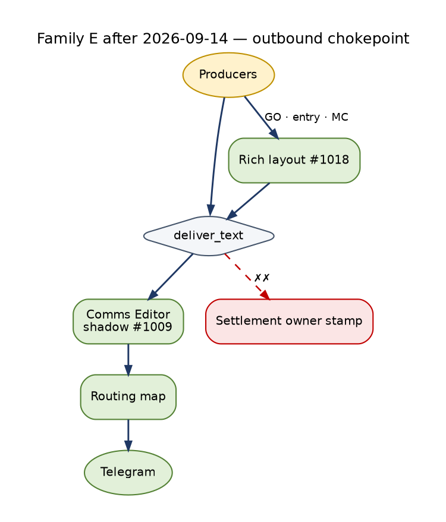

<!-- Lifecycle fact base E — Communication lifecycles. Status: ACTIVE (measured, read-only, 2026-09-14 00:00–00:45 EDT). Synthesized in docs/architecture/TRADE_AI_AS_IS_LIFECYCLES_2026-09-14.md; targets in TRADE_AI_FUTURE_STATE_LIFECYCLES_2026-09-14.md. -->

# Trade AI — COMMUNICATION LIFECYCLES (measured, end-to-end)


> **Update 2026-09-14 23:44 EDT — what changed after this measurement (live `341bce2c1`).** Numbers below are the 00:00–00:45
> measurement. Changes shipped on 2026-09-14 after the operator reviewed five Telegram exports:
>
> - **Outbound (§1):** Communications Editor at `telegram_transport.deliver_text` (shadow since 12:02; live after one
>   trading day, approved) — HTML, message and subject GUIDs, 20-hour duplicate fingerprint, CIO agreement, Tailscale
>   Command Center links, pills (#1009); one 07:30 ET weekday brief (50 duplicate briefs in 16 days measured); chat
>   routing map (DM · CIO Desk · Proposal Decisions · OpenClaw); "CIO Run Complete" noise removed; scalp GO alerts on
>   Trade-AI criteria (0 since 07-13 measured) delivered with a router bypass (#1011); repeated alerts get a body-hash
>   ledger identity (638 events for 638 openings and 14,163 illegal settles measured) (#1013); rich layouts with links,
>   buttons and chart previews (#1018); long desk answers in parts (#1016).
> - **Inbound (§2):** unchanged in the ledger; desk answers changed (see family B).
> - **Platform alerts (§3):** data-source-health alert rewritten for the operator (#997); new answer-quality rules.
> - **Email / Drive (§4):** Google credential re-authenticated by the operator 23:4x; token refresh green.
> - Settlement owner stamp, RESERVED expirer and gateway share are unchanged.




Host ms01 · measured 2026-09-14 00:05–00:35 EDT · dev tree origin/main c594d8600 · CURRENT → `c594d8600-main-exact-phase2-20260914-000703`
Method: read-only SQL on prod DB, JSONL readers over persistent-state and the wake store, `journalctl --user`, crontab, `/proc/<pid>/environ` (flag names and list counts only).
No Telegram API calls, no sends, no LLM calls. Labels: **OBSERVED** (measured now), **INFERRED** (reasoned from code or data), **BLOCKED** (could not measure).
Windows: "7d" = `created_at > now() - 7 days` at about 00:30 EDT 09-14. The comms ledger starts 2026-09-05, so "all-time" means 9 days.

Maturity scale used here: **L0** absent/severed · **L1** exists and runs, unmeasured or wrong · **L2** measured and mostly correct · **L3** closed loop (outcome feeds back) · **L4** self-correcting/learning · **L5** proven over time (≥3 contiguous cycles on one SHA, with evidence).

---

## 0. Headline breaks (read this first)

| # | Break | Evidence | Label |
|---|---|---|---|
| B1 | **"RESERVED backlog 232" is mostly not an outbound backlog.** 156 of the 232 are INBOUND `telegram_inbound` events. `publish_communication` auto-reserves a delivery stub for every event, inbound included, and nothing ever settles an inbound stub. Only 76 are outbound: 40 `send_watchpool_maturity_alerts` (09-07→09-11), 16 synthetic 09-05 smoke/test rows, and 20 one-off direct `publish_communication` producers that never call settle. No outbound RESERVED row is newer than 09-12 08:40. | `communication_deliveries` ⨝ `communication_events` | OBSERVED |
| B2 | **The delivery-owner stamp regressed on 09-10.** For `telegram_alert.send_telegram` rows, `delivery_owner='legacy'` is set on 505 rows from 09-05 to 09-09 and on 2 rows on 09-10, then is NULL on 237 rows from 09-10 onward. The 193 SUPPRESSED rows therefore read `provider_settlement_state=UNSETTLED` forever, though SUPPRESSED is terminal. This coincides with commits 6b612ffea and 28902a51f (09-10, "durable event settlement — authoritative row"). The legacy settle passes the owner only inside `provider_coordinates`, not through the `delivery_owner=` kwarg. `_persist_event_settlement_pg` (delivery.py ~L386-L404) skips the UPDATE when the state is None and no owner kwarg is given. | SQL by date; delivery.py; telegram_alert.py L318-L326 | OBSERVED numbers / INFERRED cause |
| B3 | **"cio-delivery delivered 0 since 08-29" is a false staleness signal. The real break is ledger split.** Since 09-07 the journal shows 1,803 runs with `delivered_count=0`, 11 runs with 1, and 2 runs with 2: 15 real deliveries. The newest were 09-13 17:16 and 23:30. `operator_notification_outbox.jsonl` has 175 ENQUEUED / 174 CLAIMED / 174 CONFIRMED (with `external_message_id`), including 7 on 09-13 and 1 on 09-14. The lane watches `cio_delivery_receipts.jsonl` (1 row, 08-29, `SUPPRESSED s1_observational_default_suppressed`), which this worker no longer writes. **None of these CIO deliveries reach `communication_events`:** the newest `agent:cio` row is 09-10 10:55. | journal; outbox jsonl; SQL | OBSERVED |
| B4 | **Desk replies and pending closes bypass the communication ledger.** They are persisted only as `operator_conversation_turns role=agent` (23 rows). There are 0 OUTBOUND `communication_events` for them, and no delivery row or provider_message_id link to the ledger. | SQL; cio_telegram_converse.py L1429 `persist_turn` | OBSERVED |
| B5 | **The operator→cognition loop is open.** Across 234 wakes, `prior_operator_turn_ids` is non-empty on 40, and all 40 are turn **115** (09-11 14:24, ADBE). Of 94 consumption receipts, 0 carry `wake_id`. `wake_turn_effects.jsonl` (2,085 rows) uses synthetic turns (`intent=defer`/None, subjects HELD:SCHD/DF/**TEST**) with no operator turn id. No operator message after 09-11 has reached a wake. | wakes.jsonl; SQL; jsonl | OBSERVED |
| B6 | **Operator message counts are inflated by fixture-shaped rows.** Chat `9ea9c185` holds 150 `role=operator` rows for only 3 message_ids (1, 2, 42), with avg text 15–23 chars, re-inserted on 09-07, 09-08, 09-11 and 09-13 (last at 20:44:51, during an acceptance-run window). That chat never appears in `communication_events` INBOUND. Genuine operator messages: 36 all-time, about 29 in 7d (not 41). | SQL | OBSERVED shape / INFERRED test leakage |
| B7 | **The gateway is in canary for a single producer.** `COMMS_GATEWAY_MODE=CANARY` is set only on the portfolio-server drop-in and on the `notify_material_change` cron line (`CANARY_CLASSES=ops`). Every other cron producer resolves to OFF and sends legacy. 7d: gateway 19 of 758 outbound (2.5%). All 16 organic gateway sends are material-change; the newest is 09-13 02:37. | systemd drop-in 32-comms-gateway-mode.conf; crontab L986; SQL | OBSERVED |
| B8 | **Platform-monitor alerts have no acknowledge, escalate or re-alert stage.** `alert_events`: 7,847 rows, `lifecycle_state=active` 7,845, acknowledged 2, **resolved 0**, `telegram_message_id` 0. The monitor state files record "sent" when `send_telegram` returns *accepted*. In OFF mode, accepted=True is returned even when the legacy router suppresses the message (telegram_alert.py L197-L201, L527), so a router-suppressed first alert can be frozen as "unchanged" forever. | SQL; check_*.py; telegram_alert.py | OBSERVED / INFERRED risk |
| B9 | **Inbound identity is incomplete.** All 156 inbound `provider_coordinates.bot_id` values are the empty string (md5 d41d8cd9…), so the ledger cannot tell which of the two bots received a message. `provider_message_id` is NULL on all 158 inbound rows. `reply_to_event_id` and `causation_id` are 0 on all 1,013 events, so no reply is linked to the message it answers. | SQL | OBSERVED |
| B10 | **The CIO bot runs stale code.** `cio_telegram_bot.py --loop` (pid 2613707) has cwd `a8a62217e-…-232041`, the previous release, while CURRENT was promoted to c594d8600 at 00:07. The callback poller was restarted onto c594d8600 at 00:08; the bot was not. | /proc cwd | OBSERVED |
| B11 | **Every CIO send hits a Telegram 400 on the first attempt** (parse_mode fallback, then resent as plain text). This doubles provider calls and changes rendering. | cio-delivery and cio-telegram journal 09-13 | OBSERVED |
| B12 | **Two ledgers of truth for outbound.** `telegram_outbox` (6,663 rows; 7d 339: 62 `telegram ok=t`, 277 `reports_archive ok=f`) is the legacy archive that the P1 digest reads. `communication_events` is the gateway ledger. Neither links to the other. `communication_outbox` holds 1,011 rows, all `status=recorded`, `attempt_count=0`: it is a record, not a queue. | SQL | OBSERVED |

---

## 1. OUTBOUND MESSAGE LIFECYCLE

### 1a. Purpose, actors, stores

- **Purpose:** get a producer's finding to the operator exactly once, on the right channel, with a Command Center link. Prove it arrived (provider_message_id), and let the digest roll up what was held back.
- **Producers (OBSERVED, 7d, `communication_events.producer`)**

  | Producer | Events |
  |---|---|
  | `telegram_alert.send_telegram` (≈ every legacy caller, including data-source-health / gap / answer-quality / expected-services / plausibility sentinels, SIEM, health agent, Hermes, trade_ai_live, P1 digest) | 674 |
  | `send_watchpool_maturity_alerts` | 40 |
  | `notify_material_change` | 17 |
  | `agent:cio` | 16 |
  | 11 single-row producers (freshness, news, eod, schwab token/sync, atm approver, audits, premarket, no-leads) | 1 each |

  Not in the ledger:
  - CIO product deliveries (`cio_delivery_worker`, 8 in 7d)
  - desk replies and pending closes (`cio_telegram_converse`)
  - ops agent (`ops_agent_daemon --apply --telegram` → `inspect_all.py --telegram`)
  - OpenClaw gateway :18789
  - 15 flagged direct-API producers (buttons / custom chats / DOCX; see memory note)
- **Policy/config**
  - `config/operator_alert_policy.yaml`: levels P0_INTERRUPT / P1_DIGEST / P2_DASHBOARD_ONLY / P3_LOG_ONLY; dedupe windows; `telegram_normalization.runtime_mode: "OFF"`
  - `scripts/telegram_alert_router.py` (`classify_alert`, `should_send_telegram`, `is_deduplicated`, `apply_rate_limit`)
  - `operator_alert_policy_v2.py` route modes IMMEDIATE / DIGEST / COMMAND_CENTER (router L184-L188)
  - CIO: `scripts/lib/cio_notification_policy.py`, `cio_notification_signal.py`
- **Send code**
  - `scripts/telegram_alert.py` (`send_telegram` L437, `publish_operator_message` L181, `_legacy_send` L148, `_best_effort_comms_publish` L250, `_send_via_comms_gateway` L371)
  - `scripts/lib/comms/client.py` (`publish_communication` L253)
  - `scripts/lib/comms/delivery.py` (state machine)
  - `scripts/lib/comms/channel_adapters.py` (`send_via_gateway`, canary class allowlist)
  - `scripts/lib/comms/mode.py` (`COMMS_GATEWAY_MODE`, default OFF)
- **Stores**
  - DB: `communication_events` (1,013), `communication_deliveries` (1,012), `communication_outbox` (1,011, all `recorded`), `communication_subjects` (1,022), `communication_thread_membership` (1,889), `telegram_outbox` (6,663), `alert_events` (7,847), `alert_dispatch_log` (174, last 09-11), `notification_log` (181, last 09-11)
  - Normalization tables still empty: `alert_occurrences`, `alert_notification_events`, `alert_notification_deliveries`, `alert_digest_queue`, `alert_incidents` = **0 rows** (runtime OFF)
  - Files: `persistent-state/data/cio/operator_notification_outbox.jsonl` (524 events), `cio_notification_state.jsonl` (138), `cio_notification_metrics.jsonl` (3,824), `cio_delivery_receipts.jsonl` (1, 08-29), `state/p1_digest_watermark.json`, `data/runtime/advisory_notif_broker/{ingest 75,014 lines / 34.6 MB, decisions 274,609 lines / 54 MB}`

### 1b. State machines (exact values)

**ChannelDelivery@v1.status** (`scripts/lib/comms/delivery.py` L19-L70)

```
DELIVERY_STATUSES = RESERVED SENDING SENT DELIVERED ACKNOWLEDGED FAILED BOUNCED SUPPRESSED EXPIRED CANCELLED UNKNOWN LEGACY_DELIVERED
terminal          = SENT DELIVERED ACKNOWLEDGED FAILED BOUNCED SUPPRESSED EXPIRED CANCELLED LEGACY_DELIVERED
RESERVED     → SENDING | SENT | FAILED | SUPPRESSED | EXPIRED | CANCELLED | UNKNOWN | LEGACY_DELIVERED
SENDING      → SENT | FAILED | CANCELLED | UNKNOWN
SENT         → DELIVERED | ACKNOWLEDGED | BOUNCED | FAILED | UNKNOWN
DELIVERED    → ACKNOWLEDGED | UNKNOWN
FAILED       → RESERVED | SENDING | UNKNOWN          (retry may re-open)
others       → UNKNOWN ; UNKNOWN → ∅
```

Values present in DB (OBSERVED, all-time / 7d):

| status | all | 7d | first | last |
|---|---|---|---|---|
| SUPPRESSED | 564 | 557 | 09-05 | 09-13 21:00 |
| RESERVED | 232 | 193 | 09-05 | 09-13 21:59 (inbound) |
| LEGACY_DELIVERED | 176 | 117 | 09-05 | 09-13 22:22 |
| SENT | 32 | 24 | 09-05 | 09-13 02:37 |
| FAILED | 8 | 8 | 09-08 | 09-10 00:40 |

Never observed: SENDING, DELIVERED, ACKNOWLEDGED, BOUNCED, EXPIRED, CANCELLED, UNKNOWN. **Nothing expires RESERVED.**

By channel: telegram 1,002 · slack 4 (RESERVED) · email 4 (3 RESERVED, 1 SENT) · whatsapp_meta 1 SENT · whatsapp_twilio 1 SENT. Every non-telegram row is a 09-05 00:16 `ops.test` smoke.

**CommunicationEvent@v2.provider_settlement_state** (`scripts/lib/comms/event.py` L98, L145; delivery.py L398-L406)

`UNSETTLED` (default) → `SETTLED` (SENT/DELIVERED/ACKNOWLEDGED **and** provider_message_id) | `FAILED` (FAILED/BOUNCED) | `UNKNOWN_LEGACY` (LEGACY_DELIVERED). SUPPRESSED maps to **no state** (stays UNSETTLED unless an owner kwarg forces an update).

Outbound, OBSERVED, all-time (7d):

| settlement | owner | gw mode @dispatch | gw mode @write | n (7d) |
|---|---|---|---|---|
| UNKNOWN_LEGACY | legacy | null | OFF | 563 (482) |
| UNSETTLED | **null** | null | OFF | 199 (199) |
| UNKNOWN_LEGACY | null | null | OFF | 43 (43) |
| SETTLED | gateway | CANARY | CANARY | 19 (19) |
| UNKNOWN_LEGACY | legacy | null | CANARY | 19 (12) |
| UNKNOWN_LEGACY | legacy | null | ACTIVE | 8 (0) |
| UNKNOWN_LEGACY | legacy | null | SHADOW | 1 (0) |
| UNSETTLED | null | null | CANARY | 1 (1) |
| (blank) | null | null | OFF/CANARY | 2 |

**Delivery status × settlement (join, all-time):**

| delivery status | settlement | owner | n |
|---|---|---|---|
| SUPPRESSED | UNKNOWN_LEGACY | legacy | 371 |
| SUPPRESSED | UNSETTLED | null | **193** |
| RESERVED | UNKNOWN_LEGACY | legacy | 184 (inbound stubs; the event row was stamped legacy before 09-10) |
| LEGACY_DELIVERED | UNKNOWN_LEGACY | legacy | 132 |
| RESERVED | UNSETTLED | null | 44 |
| LEGACY_DELIVERED | UNKNOWN_LEGACY | null | 43 |
| SENT | SETTLED | gateway | 19 |
| SENT | UNKNOWN_LEGACY | legacy | 13 |
| FAILED | UNKNOWN_LEGACY | legacy | 7 |
| RESERVED / LEGACY_DELIVERED / FAILED | blank | null | 4 / 1 / 1 |

Contradictions:
- The label "SUPPRESSED + UNKNOWN_LEGACY" (371) is internally inconsistent: the router suppressed the message, yet settlement says legacy-delivered-unknown.
- The 13 rows labelled "SENT + legacy" are 09-05 smokes.

**Legacy router level** (`telegram_alert_router.classify_alert` L164): `P0_INTERRUPT | P1_DIGEST | P2_DASHBOARD_ONLY | P3_LOG_ONLY`. It is fed by the v2 route_mode `IMMEDIATE → P0`, `DIGEST → P1`, `COMMAND_CENTER → P2`. Default fallthrough is `P1_DIGEST` (L321).

**Normalization runtime** (`alert_runtime_mode`): `OFF | SHADOW | ACTIVE`. Config is `"OFF"` (OBSERVED). `publish_operator_message` returns `route_mode` `LEGACY | LEGACY_SHADOWED`, reason `legacy_delivery | legacy_router_suppressed_or_unconfigured`.

**Gateway mode** (`comms/mode.py`): `OFF | SHADOW | CANARY | ACTIVE`, env `COMMS_GATEWAY_MODE`, default OFF.
- CANARY is set only in (a) the portfolio-server systemd drop-in and (b) the `notify_material_change` cron line with `COMMS_GATEWAY_CANARY_CLASSES=ops`. The drop-in `.bak-pre-canary-20260905` held ACTIVE.
- The callback poller and CIO bot environments carry no `COMMS_GATEWAY_MODE` (OBSERVED /proc), so they resolve to OFF.

**CIO notification outbox** (`scripts/lib/cio_notification_outbox.py` L83-L113)
- Event types map to status: `NOTIFICATION_ENQUEUED→PENDING`, `DELIVERY_CLAIMED→CLAIMED`, `DELIVERY_CONFIRMED→DELIVERED`, `DELIVERY_RELEASED→PENDING`, `NOTIFICATION_DEAD_LETTERED→DEAD_LETTERED`, plus EXPIRED and CANCELLED.
- Transitions: PENDING→{CLAIMED, EXPIRED, CANCELLED, DEAD_LETTERED}; CLAIMED→{DELIVERING, PENDING, EXPIRED, CANCELLED, DEAD_LETTERED, DELIVERED}; DELIVERING→{DELIVERED, RETRY_SCHEDULED, DEAD_LETTERED, PENDING}; RETRY_SCHEDULED→{PENDING, EXPIRED, CANCELLED, DEAD_LETTERED}.
- Terminal: DELIVERED, EXPIRED, CANCELLED, DEAD_LETTERED. `MAX_RETRY_ATTEMPTS=3`.
- OBSERVED events: ENQUEUED 175 (actors: `cio_product_reassessment` 87, `cio_run_worker` 87, `checkpoint_b` 1), CLAIMED 174, CONFIRMED 174, GENESIS 1. No RELEASED, DEAD_LETTERED or EXPIRED. That leaves 1 PENDING or unconfirmed (INFERRED).

**CIO notification decision** (`cio_notification_state.jsonl`, 138 rows)
- `notification_class`: SUPPRESSED 133 / DIGEST 5
- `suppressed_reason`: `not_production_advisory_eligible` 121 / `unchanged_replay` 12
- `act_now` false on 138; `operator_disposition` empty on 138; `reopen` false on 138

**Material change outcome** (`material_changes.notify_outcome`): `SENT` 248 (7d 238) · `UNCORROBORATED_CORRUPT_SOURCE` 6 (09-06) · NULL 2 (09-07, never notified). SENT counts change rows; 16 gateway messages carried about 245 change rows (batched per notice).

### 1c. End-to-end flow

```
 PRODUCERS (cron 36 notif lines · systemd timers · daemons)
 ┌───────────────────────────────────────────────────────────────────────────────────────────────┐
 │ sentinels: check_data_source_health / check_gap_resolution / check_operator_answer_quality /  │
 │   check_expected_services / data_plausibility  (systemd timers, --alert)                        │
 │ SIEM siem_critical_notify */15 · health agent · hermes · trade_ai_live · stop/scalp alerts    │
 │ send_watchpool_maturity_alerts · proposal alerter (*/2 mkt) · eod/closed-trade digests        │
 │ notify_material_change (7-59/15, CANARY) · CIO run worker / product reassessment               │
 │ p1_digest_sender (0 */4) · morning brief 08:00 · aegis brief 08:05 · alert_digest 08/16       │
 │ ops_agent_daemon --telegram · advisory_notification_broker (hourly, Tier D SHADOW)             │
 └──────┬───────────────────────────────┬───────────────────────────┬──────────────────────┬─────┘
        │ send_telegram(msg, class)     │ publish_communication()   │ NotificationOutbox    │ direct
        ▼                               │ (20 producers, no settle) │ .enqueue (CIO)        │ api.telegram.org
 ┌─────────────────────────────┐        │                           │                      │ (15 flagged:
 │ telegram_alert.send_telegram│        │                           │                      │  buttons, custom
 │  wrap_send_hook ─────────────────────────────────────────────────────────▶ advisory_notif_broker/ingest.jsonl
 │  (Tier D SHADOW, 75,014 lines; decisions 274,609; egress NOT executed)                    │  chats, DOCX, ops
 │  _comms_gateway_owns(class)? │        │                           │                      │  agent, OpenClaw)
 │   mode∈{CANARY,ACTIVE} AND   │        │                           │                      │
 │   class ∈ CANARY_CLASSES     │        │                           │                      │
 └──────┬───────────────┬───────┘        │                           │                      │
   NO (≈97.5%)      YES (material-change only)                        │                      │
        ▼               ▼                ▼                           ▼                      │
 ┌──────────────────┐ ┌──────────────────────────────┐   ┌────────────────────────────────┐   │
 │publish_operator_ │ │_send_via_comms_gateway       │   │ cio_delivery_worker --once live │   │
 │message (OFF)     │ │ publish_communication ──────────▶ communication_events (UNSETTLED)   │
 │ _legacy_send:    │ │   auto-reserve ──────────────────▶ communication_deliveries RESERVED  │
 │  classify_alert  │ │ send_via_gateway(deliver)    │   │ timer */5, 1,803 runs=0 deliv.  │   │
 │  should_send? ───┼─┤  → Telegram → message_id     │   │ claims PENDING → Telegram       │   │
 │  dedupe (mem +   │ │ settle SENT + pmid ──────────────▶ deliveries SENT; events SETTLED  │   │
 │  durable key)    │ │   delivery_owner=gateway     │   │   (median 1.03 s)               │   │
 │  rate limit/h    │ │   gateway_mode_at_dispatch=  │   │ 400 parse_mode → resend plain   │   │
 └──┬─────────┬─────┘ │   CANARY                     │   │ CONFIRMED ◀── outbox.jsonl      │   │
    │suppress │send   └──────────────────────────────┘   │ ✗✗▶ communication_events (none) │   │
    ▼         ▼                                          │ ✗✗▶ cio_delivery_receipts.jsonl │   │
 telegram_outbox   Telegram Bot API (TELEGRAM_BOT_TOKEN, │     (lane reads this → "0 since │   │
 channel=          TELEGRAM_CHAT_ID ×2)                  │      08-29" false-silent)       │   │
 reports_archive        │                                └────────────────────────────────┘   │
 ok=f (277/7d)          ▼                                                                      │
    │           telegram_outbox channel=telegram ok=t (62/7d)                                  │
    │                   │                                                                      │
    │                   ▼ _best_effort_comms_publish(delivered=bool)                           │
    │           publish_communication → communication_events + RESERVED stub                   │
    │           settle_delivery(LEGACY_DELIVERED | SUPPRESSED | UNKNOWN,                       │
    │                           provider_coordinates={delivery_owner:legacy})                  │
    │             ✗✗▶ events.delivery_owner NOT stamped since 09-10 (237 rows null)            │
    │             ✗✗▶ SUPPRESSED leaves provider_settlement_state=UNSETTLED (193)              │
    │           provider_message_id: never captured on legacy path                             │
    │                                                                                          │
    ╰╌╌╌╌▶ p1_digest_sender (0 */4) reads telegram_outbox reports_archive > watermark            │
            → send_telegram(digest, bypass_router=True) → legacy → one LEGACY_DELIVERED row      │
            watermark last_id 6758, 09-14 00:00 delivered 2 (runs roll 2–13 msgs)               │
                                                                                               │
 COMMAND CENTER LINK: command_center_url column set on 16/758 (2.1%, all agent:cio, ≤09-10);   │
   body contains "/v3/" on 60/758 (7.9%). Legacy path never sets the column.                  │
 OPERATOR PHONE ◀────────────────────────────────────────────────────────────────────────────────┘
```

### 1d. Iterations and loops

| Loop | Mechanism | Window | Closes? | Evidence |
|---|---|---|---|---|
| Router dedupe | `build_dedupe_key` → `_dedupe_cache` (in-process) + `_durable_recently_sent` | health 240 m, portfolio intel 360 m, stop 390 m, GO 120 m, options 60 m, default 60 m | per-process only, plus durable key | router L361-L386 (OBSERVED) |
| Hourly rate limit | `_hourly_counts[go_<hour>]` | `max_trade_ai_live_alerts_per_hour: 10` | in-memory per process; a cron process restarts every run, so the counter resets (INFERRED ineffective for cron producers) | router L472-L486 |
| Health telegram gate | `max_health_telegram_per_day 2`, `min_delta 5`, `max_score 80` | daily | yes | yaml |
| Suppression → digest | reports_archive → P1 digest every 4 h | 4 h | **yes** (the only working roll-up) | p1_digest.log (OBSERVED) |
| CIO unchanged suppression | `suppressed_unchanged` | per scanner wake | yes, but 7d: 2,837 suppressed of 2,865 candidates, **0 immediate, 0 command-center-only**, 28 digest | cio_notification_metrics (OBSERVED) |
| CIO outbox retry | `MAX_RETRY_ATTEMPTS=3` → DEAD_LETTERED | — | never exercised (0 RELEASED / DEAD_LETTERED) | outbox jsonl |
| Delivery retry | FAILED → RESERVED allowed | — | **never exercised**: 8 FAILED (agent:cio 09-08..09-10) never re-opened | SQL |
| RESERVED expiry | EXPIRED status exists | — | **no expirer**; 232 RESERVED, oldest 216 h | SQL |
| Parse-mode retry | first send 400 → plain resend | per send | yes, but doubles calls | journal |

### 1e. Questions a message asks

| Message kind | Question | Answer path | Closure | Where dropped |
|---|---|---|---|---|
| Sentinel (data-source-health, gap, answer quality) | implicit "act?"; body says "tell me if still listed" | free-text reply to the CIO or main bot | ✅ follow-up when the fingerprint clears | no acknowledgement primitive; a reply is not joined to the alert (`reply_to_event_id` 0/1,013) |
| Material change notice | "look?"; the operator may reply | reply → turn; `capture_agent_turns` stores the notice as a role=agent turn keyed by message_id, so replies can resolve the subject | no close state | `questioned_at` on 222 of 248 SENT rows is set by the producer, not by an operator answer (INFERRED) |
| Proposal alert (buttons) | approve / reject / rebuild | callback_query → `telegram_callback_handler` → `trade_approvals` | status consumed / superseded / expired | legacy direct API; not ledgered; `trade_approvals` last 08-28, 19 `pending` since 07-21 never expired |
| Guard approval | `/approve <CODE>` / `/deny <CODE>` | poller `_handle_guard_approval` → `guard_remote_approval.verify_and_consume` | PENDING→APPROVED / DENIED_NO_ALLOWLIST / DENIED_WRONG_CHAT / EXPIRED / DENIED_FORBIDDEN_SCOPE / SUPERSEDED | `~/.cursor/approvals/remote_requests.json` **not present** → 0 requests ever minted on this host (OBSERVED absence) |
| LLM cap change | `/caps`, `/cap <id> <req> [$]` | poller, allowlisted chat | immediate write | before 09-13 every `/cap` raised NameError (poller L963 comment) |
| CIO product (digest/advisory) | "consider X" | reply → desk | none (`operator_disposition` empty 138/138) | disposition never recorded |
| Desk pending reply | "researching, will reply" | `try_fulfill_pending_replies` in the CIO bot loop | open → fulfilled / expired | 2 rows: 1 open (09-13 16:32Z), 1 expired at **9.38 h** stamped "did not arrive within 2h"; the research had landed 14 min after the question (factbase) |

### 1f. Live measurements (OBSERVED)

- **Volume:** OUTBOUND 855 all-time / 758 7d / 26 24h. Per day: 09-05 60 · 09-06 38 · **09-07 208** · 09-08 160 · 09-09 124 · 09-10 96 · 09-11 133 · 09-12 11 (host down until 17:02, power cut) · 09-13 26.
- **Suppression rate (7d, outbound deliveries):** 557/758 = **73.5%**. All of it comes from the legacy router on `send_telegram`.
- **Delivered (7d):**
  - LEGACY_DELIVERED 117 (unverified, no pmid)
  - SENT 24, of which gateway SETTLED 19 (material change 16 + agent:cio 3) and 5 older smoke/legacy
  - FAILED 8
- **Ownership share (7d outbound):** gateway 19 (2.5%) · legacy 482+12 (65.2%) · owner-null 245 (32.3%).
- **Send → settled:** gateway median **1.03 s** (material change) / **1.66 s** (agent:cio); SENT reserved→sent median 0.92 s; max 77,401 s (21.5 h, one row).
- **RESERVED stuck:** 232 total. Age buckets: <1 h 0 · 1–24 h 10 · 1–7 d 183 · >7 d 39.
  - inbound 156: median age 129 h, oldest 194 h
  - outbound 76: watchpool 40 (median 155 h), 09-05 smoke 16 (216 h), 20 singletons (40–204 h)
- **Command Center URL:** column 16/758 (2.1%); URL in body 60/758 (7.9%).
- **CIO outbox deliveries:** 8 in 7d (09-13: 7, 09-14: 1); 0 from 09-09 to 09-12. Journal since 09-07: 15 deliveries in 13 of 1,816 runs.
- **Legacy archive `telegram_outbox` 7d:** 339 rows. Suppressed-to-archive 277 (siem_p1 135, hermes 65, trade_ai_live 36, health_agent 34, …). Sent 62 (hermes 22, trade_critique 15, trade_ai_live 10, siem_p1 5, premarket 4, health 3, eod 3).
- **Reconciliation gap:** `telegram_outbox` sent 62 vs ledger LEGACY_DELIVERED 117 in 7d. The two ledgers disagree by about 2×, because not all legacy callers archive (INFERRED).
- **Tier D broker:** runs hourly; SHADOW; files grow unbounded (88 MB combined).

### 1g. Failure paths / where it breaks

1. **B2 owner-stamp regression** (09-10 onward): ledger reads 32% owner-null and 193 phantom UNSETTLED.
2. **B1 inbound stubs counted as backlog.** Also, 20 direct `publish_communication` producers reserve but never settle.
3. **B3 CIO deliveries invisible to the ledger.** Lane `cio-delivery` is false-SILENT because it keys on a file the worker stopped writing.
4. **B4 desk replies unledgered.**
5. **No provider_message_id on the legacy path**, so LEGACY_DELIVERED cannot be verified. `send_telegram` returns *accepted*, not delivered.
6. **Watchpool maturity alerts** (40) reserved and never settled; the producer is flagged (custom chat) and uses direct publish.
7. **Normalization runtime OFF:** occurrence, incident and digest tables are empty; Stage 10 UI is unbuilt.
8. **15 flagged direct-API producers** (buttons, custom destination, DOCX, message-id) bypass everything.
9. **8 agent:cio FAILED** (`telegram_send_failed` ×7, `transport_exception:TypeError` ×1) never retried.
10. **Two Telegram tokens / consumers:** `getUpdates 409 Conflict` by day: 09-09 66 · 09-10 8 · 09-11 6 · 09-13 2 (second consumer on the same token).

### 1h. Maturity per stage

| Stage | L | Reason |
|---|---|---|
| Producing event | L2 | many producers run; sentinel bodies are well formed |
| Classification/policy | L1 | policy YAML + router work; v2 route modes exist but runtime OFF; CIO policy suppresses 99% |
| Dedup/rate limit | L1 | in-process caches reset per cron run; durable key exists |
| Reservation | L1 | reserves every event incl. inbound; no expirer |
| Send (legacy) | L2 | delivers; no pmid |
| Send (gateway) | L1→L2 | works with pmid in 1 s, but one producer, class `ops` only, quiet since 09-13 02:37 |
| Provider acceptance | L1 | pmid on 27 of 32 SENT; 0 on legacy |
| Settlement | L1 (regressed) | owner-null since 09-10; SUPPRESSED→UNSETTLED |
| Command Center link | L1 | 2.1% |
| Digest roll-up | L2 | P1 digest works on the archive; CIO digest 28/7d |
| Monitoring of the lifecycle | L1 | lane reads the wrong file (false SILENT) |

### 1i. Target lifecycle and exit conditions

Target:
1. One path: `publish_communication` → policy decision persisted → RESERVED → gateway send → SENT with pmid → SETTLED.
2. Inbound events carry no delivery stub.
3. SUPPRESSED/DIGESTED is terminal with a reason and a `digest_event_id`.
4. An expirer moves RESERVED older than N minutes to EXPIRED.
5. Every CIO product, desk reply and pending close is an OUTBOUND event.
6. The CC URL is always stamped.

Observed exit conditions today:
- SETTLED (19)
- LEGACY_DELIVERED (unverified)
- SUPPRESSED (with UNSETTLED contradiction)
- FAILED (never retried)
- RESERVED (never exits)

---

## 2. INBOUND OPERATOR REPLY LIFECYCLE

### 2a. Purpose, actors, stores

- **Purpose:** capture every operator message or tap durably and exactly once, tag its subject, give it to the CIO agent (receipt), answer it, and let it change the next wake.
- **Actors (OBSERVED processes)**
  - **Main bot** `TELEGRAM_BOT_TOKEN`: `run_telegram_callback_poller.py --daemon`, pid 2685392, cwd c594d8600 (CURRENT), started 09-14 00:08. Env: `ATOMIC_INBOUND_ENABLED=1`, `CIO_REPLY_ENABLED=1`, `CIO_TELEGRAM_CONVERSE=1`. Kept alive by the watchdog `*/5 telegram_poller_watchdog_current.sh` (recycles if cwd≠CURRENT). Handles `message` + `callback_query`, `/caps`, `/cap`, `/approve`, `/deny`, callbacks → `telegram_callback_handler`.
  - **CIO bot** `TELEGRAM_CIO_BOT_TOKEN`: `tradeai-cio-telegram.service` → `cio_telegram_bot.py --loop`, pid 2613707, **cwd a8a62217e (previous release)**, allowlist `TELEGRAM_CIO_CHAT_IDS` (3 ids). One id is reported unreachable (HTTP 400) in the 09-12..14 work summary (not re-measured: BLOCKED by the no-Telegram-API rule). Runs `try_fulfill_pending_replies`.
  - `TELEGRAM_CHAT_ID` holds 2 ids (two operator accounts); `TRADEAI_PROPOSAL_ALERT_CHAT_ID` holds 1.
  - `telegram_command_handler.py --poll` cron is **disabled** since 08-26 because of the 409 conflict (crontab L120-L121).
- **Code**
  - `scripts/lib/atomic_inbound.py` (`process_update_atomically`: claim → normalize → tag → persist turn → receipt → commit checkpoint LAST)
  - `scripts/lib/comms/inbound.py` (`claim_update`, `commit_checkpoint`, `quarantine_callback`)
  - `scripts/lib/inbound_identity_tagger.py` (`persist_turn`)
  - `scripts/lib/inbound_consumption.py` (legacy `feed_telegram_update`, flag OFF)
  - `scripts/lib/cio_telegram_converse.py` (desk; persist_turn L1429/L1496)
  - `scripts/lib/cio_operator_desk_loop.py`
  - `scripts/lib/wake_comms_history.py`
- **Stores**
  - `communication_events` INBOUND (158)
  - `communication_inbound_checkpoint` (1 row; committed_update_id updated 09-13 21:59:45)
  - `communication_inbound_quarantine` (27)
  - `communication_agent_consumption_receipts` (94)
  - `operator_conversation_turns` (211)
  - `inbound_operator_questions` (5, dead since 09-06)
  - `data/cio/cio_operator_pending_replies.jsonl` (2)
  - wake store `trade-ai-state/persistent_wake/state/wakes.jsonl` (234)
  - `data/cio/wake_turn_effects.jsonl` (2,085)
  - legacy file offset `data/portfolios/state/.telegram_callback_offset`

### 2b. State machines

**AtomicInbound@v1 outcome** (`atomic_inbound.py` L60): `processed | already_processed | refused | error`. Checkpoint plausibility limit is 1,000,000 update_ids.
- Steps: `claim_update` → `normalize_inbound_update` (publish-only) → `tag_inbound` → `persist turn role=operator` → `emit AgentConsumptionReceipt@v2` → `commit_checkpoint`.
- A non-ok step short-circuits **before** the checkpoint. On a persist failure, a callback is quarantined (`reason=inbound_persist_failed`).
- Poller log, last 200k lines: `processed` 109, `already_processed` 0, `refused` 0, quarantine 0 lines. `getUpdates failed` 409/Conflict and connection resets make up most of the 101 error lines.

**Quarantine:** `resolved` bool plus `resolution_note`. 27 rows, all `inbound_persist_failed`, all on 09-08 (latest 18:32). Resolution not measured (column exists).

**Consumption receipt**
- `purpose`: `operator_turn_intake` 89 · `advisory_draft` / `decision_context` / `sizing_context` / `future_agent_pilot` / `intake` 1 each
- `policy_decision`: blank 52 · `read_only_advisory` 37 (all 09-08) · `TOMBSTONED_ORPHAN_EVENT_NOT_FOUND` 4 · `TOMBSTONED_NON_ORGANIC_TEST_ARTIFACT` 1
- `result` blank on all rows; `wake_id` NULL on **94/94**

**Operator turn:** `role` operator/agent · `authority` READ_ONLY_ADVISORY · `identity_status` CONFIRMED 138 / UNRESOLVED_WITH_REASON 3 / CANDIDATE 1 / NULL 70 · `matched_via` ticker 124+ / company_name 12 / ticker_alias / reply_context / material_change.

**Pending reply:** `status` `open | expired` (plus fulfilled per code); `expiry_reason` free text.

**Wake intake:** `prior_operator_turn_ids[]`, `prior_comm_event_ids[]` on each wake.

### 2c. End-to-end flow

```
 OPERATOR (2 accounts; chats hashed 2964a2c4, 173cbb66; c8c60599 3 msgs 09-08)
     │ message / button tap
     ▼
 Telegram ──────────────┬───────────────────────────────────────────┐
  main bot token        │                                           │ CIO bot token
     ▼                  │  second consumer same token → 409 ✗✗▶     ▼
 run_telegram_callback_poller --daemon (CURRENT)          cio_telegram_bot --loop (STALE a8a62217e)
  getUpdates offset=checkpoint+1                           allowlist TELEGRAM_CIO_CHAT_IDS (1/3 unreachable)
     │ ATOMIC_INBOUND_ENABLED=1                              │ converse (CIO_TELEGRAM_CONVERSE=1)
     ▼                                                       ▼
 process_update_atomically                                cio_telegram_converse
  claim_update ──────▶ communication_inbound_checkpoint     persist_turn(role=operator) ◀── operator_conversation_turns
  normalize ─────────▶ communication_events INBOUND          intent → evidence → reply
       └ auto-reserve ▶ communication_deliveries RESERVED ✗✗ (never settled: 156 stubs)
       └ bot_id = "" ✗✗ · provider_message_id NULL ✗✗ · reply_to_event_id NULL ✗✗
  tag_inbound (identity spine, no model)                     pending? ─▶ cio_operator_pending_replies.jsonl
  persist_turn(role=operator) ─▶ operator_conversation_turns     │        try_fulfill_pending_replies
  emit receipt ──────▶ communication_agent_consumption_receipts  │        (join to Hermes completion ✗✗;
       └ wake_id NULL ✗✗ (0/94)                                  │         expired at 9.38 h "2h")
  commit_checkpoint (LAST)                                       ▼
     │ persist fail ─▶ communication_inbound_quarantine (27, 09-08)  reply → Telegram (400 → plain resend)
     │                                                           │ persist_turn(role=agent) ─▶ turns (23)
     │ /caps /cap ─▶ llm cap write (allowlisted)                 ✗✗▶ communication_events OUTBOUND (none)
     │ /approve /deny CODE ─▶ guard_remote_approval (no requests file on host)
     │ callback_query ─▶ telegram_callback_handler ─▶ trade_approvals (last 08-28)
     ▼
 HOURLY WAKE (cron 0 * * * * run_persistent_wake --agent-id cio)
  wake_comms_history reads prior turns/events ──▶ prior_operator_turn_ids
     = [115] on 40/234 wakes (09-11 ADBE turn; replayed 09-11..09-14) · 0 newer turns ✗✗
     prior_comm_event_ids non-empty on 7 wakes, 1 distinct event
  cio-wake-turn-effects (tradeai-cio-reactive.timer) ─▶ wake_turn_effects.jsonl
     synthetic turn {intent: defer|None, plan_id}; subjects HELD:SCHD 528 / HELD:DF 163 / HELD:TEST 162 (7d)
     turn_changed_decision True 362 / 853 (7d) — counterfactual only; MEMORY_BEHAVIOR_INFLUENCE=0
     ╌╌▶ decision change on a real operator turn: NOT OBSERVED
```

### 2d. Iterations and loops

- **Replay/idempotency:** the durable checkpoint gates replays (`already_processed` 0 observed, so no replays were seen).
- **Pending-reply loop:** poll each bot loop (`limit=8`). Expiry is wall-clock based and not joined to the research plan (the SpaceX case expired 9.38 h after research had landed at 14 min).
- **Memory replay loop:** turn 115 re-loaded into scheduled wakes for about 3 days (40 wakes). This is persistence without new intake: **the loop replays, it does not ingest.**
- **Poller supervision:** watchdog every 5 min plus launcher; stale-cwd recycling. The CIO bot has no equivalent after a promote (B10).
- **Loop closure:** NO. Of about 29 genuine operator messages in 7d, 0 appear in `prior_operator_turn_ids`; receipts carry no wake_id.

### 2e. Questions and answers

- Operator question → desk answer (same chat) or pending ("will reply").
  - Answers return as Telegram messages, persisted only as agent turns.
  - Closure: `pending` → fulfilled/expired; there is no closure record for ordinary replies.
  - Dropped when research lands after the answer (not joined), when the reply is not ledgered, or when the chat id is unreachable (1 of 3 CIO allowlist ids).
- Approval questions: see §1e. `/approve` codes: 0 requests minted. Callbacks → `trade_approvals` last activity 08-28, 19 pending rows from 07-21 never expired.
- **GRANT ids over Telegram:** no `GRANT-` id producer located in `scripts/` (BLOCKED / not found). The grant concept is implemented as guard codes plus `/caps`.

### 2f. Live measurements (OBSERVED)

- INBOUND events: 158 all-time / 141 7d / 10 24h.
  - event types: `telegram_command` 78 (+2 `telegram_command_handler`), `callback_query` 78
  - per day: 09-05 3 · 09-06 14 · 09-07 13 · **09-08 84** · 09-09 2 · 09-10 23 · 09-11 9 · 09-12 0 · 09-13 10
- By chat:
  - 2964a2c4: 61 commands + 26 callbacks
  - 173cbb66: 14 commands + 52 callbacks (last 09-11 16:47)
  - c8c60599: 3
  - empty: 2 (09-05 test)
  - bot_id empty on all
- Turns (211):
  - operator 188 rows / 39 message_ids; 7d 181 / 32
  - agent 23 / 8; 7d 21 / 6
  - **Fixture-shaped chat 9ea9c185:** 150 rows / 3 ids (1, 2, 42)
  - Genuine operator messages: 36 all-time, about 29 in 7d
- Intake receipts 7d: 89 against 141 inbound events (63%). Receipts with wake: **0**.
- Checkpoint advanced to 09-13 21:59:45. Quarantine: 27 (all 09-08).
- Inbound → wake effect: **1 distinct operator turn ever (115), carried in 40 wakes**, and 0 decision changes attributable to it (memory_changed_decision 0.0 per the factbase).
- Pending replies: 1 open, 1 expired.
- 409 Conflicts by day: 09-04 2 · 09-05 25 · 09-07 3 · 09-08 3 · **09-09 66** · 09-10 8 · 09-11 6 · 09-13 2.

### 2g. Failure paths

1. Stale CIO bot process after promote (B10). The poller is recycled, the bot is not.
2. Double consumer on the main token (409s): lost or delayed updates (INFERRED).
3. Inbound identity gaps (B9): replies cannot be joined to the outbound alert they answer.
4. Receipts without `wake_id`; wake reads only turn 115 (B5).
5. Test-fixture rows in production turns (B6) inflate "operator engagement."
6. `inbound_operator_questions` dead since 09-06; `inbound_consumption.feed_telegram_update` legacy path still importable.
7. Quarantine rows (27) with no visible resolver cadence.
8. One unreachable allowlisted chat (per the work summary).

### 2h. Maturity per stage

| Stage | L |
|---|---|
| Poll/receive (main bot) | L2 (watchdog, CURRENT cwd, checkpoint) |
| Poll/receive (CIO bot) | L1 (stale code, one bad chat id) |
| Atomic intake / checkpoint | L2 |
| Event identity (bot/pmid/reply linkage) | L1 |
| Turn persistence | L1 (fixture contamination) |
| Consumption receipt | L1 (no wake link) |
| Desk answer | L2 (answers flow; quality findings 7) |
| Reply ledgering | **L0** |
| Pending fulfilment | L1 |
| Wake intake of new turns | **L0** (only replay of 115) |
| Cognitive effect | **L0** (MEMORY_BEHAVIOR_INFLUENCE=0; counterfactual only) |
| Approvals via Telegram | L1 (code paths exist; 0 guard requests; trade_approvals idle since 08-28) |

### 2i. Target and exit conditions

Target: update → event (bot_id, pmid, reply_to_event_id) → turn → receipt carrying `wake_id` of the next wake → wake's `prior_operator_turn_ids` contains the turn → a with/without decision diff recorded for **that** turn → the reply is ledgered OUTBOUND with a causation_id pointing at the inbound event → pending closure joined to plan completion.

Observed exits today:
- checkpoint committed (terminal for intake)
- agent turn written (terminal for the reply)
- pending expired
- nothing reaches the wake, except turn 115 by replay

---

## 3. PLATFORM-MONITOR ALERT LIFECYCLE

### 3a. Purpose, actors, stores

- **Detectors (systemd timers, dev-tree cwd, `--alert`)**

  | Detector | Last run | State file (`~/.local/state/tradeai/`) |
  |---|---|---|
  | `check_data_source_health.py` (hourly) | 23:27 | `data_source_health_last_alert.json` (140 B, written 09-13 21:27) |
  | `check_gap_resolution.py` (~30 min) | 00:07 | `gap_resolution_last_alert.json` (5,737 B, 17:37) |
  | `check_operator_answer_quality.py` (~30 min) | 00:22 | `operator_answer_quality_last_alert.json` (389 B, 22:22) |
  | `check_expected_services.py` | — | `expected_services_last_alert.json` (23:12) |
  | data plausibility | — | `data_plausibility_last_alert.json` (11:10) |

- Also: SIEM `siem_critical_notify.py */15` (alert_events + telegram), health agent / ops agent (`inspect_all.py --apply-remediations --telegram`), `system_freshness_monitor`, `pipeline_freshness_slo --telegram`, `nightly_integrity_sweep --telegram`.
- Stores: the state files above, `alert_events` (7,847), `telegram_outbox`, `communication_events`, and per-run receipts (`_write_run_receipt`).

### 3b. State machine

```
DETECT (run) ─▶ FINDINGS set F (e.g. source_key→status; gap fingerprints; finding kinds)
   │
   ├─ F == previous_fingerprint ─▶ SUPPRESSED_UNCHANGED  (stdout "alert: suppressed — unchanged since the last run.")
   │                               no ledger row, no re-alert, no age escalation
   ├─ F ≠ previous ─▶ BODY: sentinel tag + newly listed + "Recovered:" + "Next run… Action…"
   │                 ─▶ send_telegram(body, message_class="operator_alert")  → legacy (§1)
   │                    ├─ accepted=True  ─▶ write state {fingerprint: F}  ─▶ ALERTED
   │                    │   (accepted ≠ delivered: OFF mode returns accepted even if router suppressed)
   │                    └─ exception      ─▶ state NOT written ─▶ retried next run (implicit re-alert)
   └─ F == ∅ and previous ≠ ∅ ─▶ "✅ … Recovered: …" ─▶ CLEARED (state {})
```

- Sentinel tags: `[PLATFORM_AVAILABILITY]` (data sources), `SENTINEL` constant in gap resolution, `[DATA_INTEGRITY]` (answer quality / plausibility), `[OPERATIONAL]`.
- `alert_events.lifecycle_state`: `active` 7,845 · `acknowledged` 2; `resolved_at` 0; `acknowledged_by`/`resolved_by` effectively unused.
- `alert_dispatch_log.tier/action_taken`: INFO/ALERT/URGENT `sent_telegram` 171 (last 09-11 07:30) · `telegram_send_failed` 1 · DIGEST `queued_morning_digest` 1 · DASHBOARD_ONLY 1 (both 05-14).

### 3c. Flow

```
 timer ─▶ check_*.py ──reads──▶ ledgers/registries (data_source_authority.json, receipts, turns, holdings)
            │ findings
            ▼
   fingerprint == ~/.local/state/tradeai/<x>_last_alert.json ?
            │yes                                  │no
            ▼                                     ▼
   "suppressed — unchanged" (journal only)   send_telegram(operator_alert) ─▶ §1 legacy router
            ✗✗▶ no escalation / no ack                 │ accepted ─▶ write fingerprint
                                                       ▼
                                  communication_events (owner null since 09-10) + Telegram
                                                       │
                                           operator reads; may reply ✗✗▶ not joined to alert
                                                       │
                              next change ╌╌▶ new body with "Recovered:" / ✅ when empty
 alert_events (SIEM/hermes/research/atm scrapers): 3,357 in 7d, telegram_sent_at 0, resolved 0
```

### 3d. Iterations

- Dedup is **set-equality of the fingerprint**. A finding that persists for days is announced once. There is no reminder, no age-based escalation, and no severity ramp.
- Current state (OBSERVED journal):
  - data_source_health: checked=18, off=4, idle=5, suppressed-unchanged
  - gap_resolution: findings=84, suppressed-unchanged
  - answer_quality: findings=7 (NO_SOURCES_LINE 4, FALSE_EMPTY_CLAIM 1, BOOK_DUMP_FOR_NAMED_SYMBOL 1, MODEL_UNLABELLED 1), suppressed-unchanged
- Sentinel-tagged outbound 7d: PLATFORM_AVAILABILITY 4 (all LEGACY_DELIVERED, last 09-13 21:27) · DATA_INTEGRITY 2 (last 22:22) · OPERATIONAL 2 (09-12 08:00).
- The health agent has a daily cap (2/day, delta ≥5, score ≤80).
- The router suppresses repeats for 240 min, and `suppress_health_repeat_minutes` applies.

### 3e. Questions

- Body asks: "if it is still listed afterwards, tell me" (data sources) / "Action: …".
- There is no acknowledge button or command. A reply goes to the desk as a free turn and does not touch the fingerprint or `alert_events`.
- Closure happens only by the detector (✅), never by the operator.

### 3f. Measurements

| Measure | Value |
|---|---|
| Alerts sent 7d from these sentinels | 8 tagged ledger rows |
| Suppression of repeats | ~100% by design |
| Acknowledged | 0 in 7d (2 all-time in alert_events) |
| Resolved | 0 |
| Escalations | 0 (no mechanism) |
| Mean time to ✅ | not derivable (state files keep only the last fingerprint, no history) — BLOCKED |

### 3g. Failure paths

1. accepted≠delivered can freeze a suppressed alert as "sent" (B8, INFERRED).
2. Persistent findings are announced once and then silent (84 gap findings, 7 answer-quality findings with no reminders).
3. `alert_events` is a write-only pile (3,357/7d, 0 resolved, 0 with telegram ids).
4. Lane staleness false positives (cio-delivery) come from monitors keyed on the wrong artifact.
5. The gap resolver marks "resolved" when it only queued a Maria job (memory note 09-13).
6. Monitors run from the dev tree while the producers they check run from CURRENT (tree split).

### 3h. Maturity

| Stage | L |
|---|---|
| Detect | L2 |
| Finding/fingerprint | L2 |
| Alert body | L2 (actionable, plain-language) |
| Dedup | L2 |
| Escalation | L0 |
| Acknowledgement | L0 |
| Resolution (✅) | L2 (detector-driven) |
| Re-alert/reminder | L0 |
| Alert history | L1 |

### 3i. Target and exits

Target: finding → incident row (`alert_incidents`, currently 0) with first_seen / last_seen / ack / resolve → reminder at age thresholds → ack via reply or button joined by `reply_to_event_id` → ✅ closes the incident and records MTTR.

Exits today: ALERTED, SUPPRESSED_UNCHANGED, CLEARED(✅).

---

## 4. EMAIL / DRIVE PUBLICATION LIFECYCLE (summary)

| Flow | Trigger | Path | States / measurements (OBSERVED) | Breaks | L |
|---|---|---|---|---|---|
| Docs → Drive | cron `5 * * * *` via `safe_flock` → `CURRENT/scripts/sync-docs-to-drive.sh` (gog CLI, `gog auth alias set default`, PATH-fixed) | per file: unchanged / SYNCED (**delete+create**) / failed; run: `sync done: U uploaded, S unchanged, F failed` | 7d: 162 runs, 1 run with a failure (09-07 20:06, 1 failed); latest 04:06Z 25 uploaded / 2,513 unchanged / 0 failed / 2,538 candidates | delete+create gives a new Drive file id on each change, so shared links break (INFERRED); lane `drive-sync DEGRADED_STALE_SOURCE` (factbase); older `sync-docs-to-drive.py` cron PAUSED | L2 |
| Claude memory → Drive | cron 03:10 `sync-memory-to-drive.sh` | delete-before-upload | log present | — | L2 |
| Encrypted .env/data → Drive | cadence 02:30 `secrets_backup_env` | gpg → Drive | ok per cadence (factbase) | — | L2 |
| Gmail daily digest | morning orchestrator 07:15 → `email_notifier.py` (gog gmail) | `notification_log channel=gmail type=daily_digest status=sent` | 1/weekday 09-02..09-11; **none on 09-12** (host down until 17:02 after power cut, INFERRED from boot time); `notification_log` entirely silent since 09-11 07:46 | not in communication_events (1 email ledger row, a 09-05 smoke); no delivery receipt beyond `sent` | L1 |
| Google token | `mcporter-token-refresh.timer` | gcloud | **failed** 09-13 23:56 (gcloud auth empty) | operator re-auth needed; Drive/Calendar tooling at risk | L1 |

---

## 5. Cross-lifecycle maturity roll-up

| Lifecycle | Weakest stage | Overall |
|---|---|---|
| Outbound | settlement (regressed), CC link 2.1% | **L1** |
| Inbound → cognition | reply ledgering L0, wake intake L0 | **L1 (intake L2, effect L0)** |
| Platform-monitor alert | ack/escalation L0 | **L1–L2** |
| Email/Drive | Google auth failing | **L1–L2** |

## 6. Ordered fix list implied by measurements

1. Pass `delivery_owner="legacy"` as a kwarg in `_best_effort_comms_publish`. Map SUPPRESSED → a terminal settlement state. Backfill the 237 rows.
2. Do not reserve deliveries for INBOUND events. Settle or EXPIRE the 76 outbound RESERVED rows. Add an expirer.
3. Publish CIO outbox deliveries, desk replies and pending closes as OUTBOUND `communication_events` with pmid and causation. Repoint the `cio-delivery` lane to `operator_notification_outbox.jsonl` DELIVERY_CONFIRMED.
4. Stamp `bot_id`, `provider_message_id`, `reply_to_event_id` on inbound. Put `wake_id` on receipts when the next wake consumes them.
5. Restart the CIO bot on promote (deploy step). Remove the unreachable chat id (operator approval). Find the second consumer behind the 409s.
6. Quarantine or purge fixture rows (chat 9ea9c185, subject HELD:TEST). Block tests from writing production tables.
7. Add incident rows, reminder cadence and an acknowledge action to sentinels. Write state only on *delivered*, not *accepted*.
8. Widen gateway CANARY classes beyond `ops` and set `COMMS_GATEWAY_MODE` on the cron environment, so owner share can move off 2.5%.

## 7. Reproduction (read-only)

- SQL: `communication_events`, `communication_deliveries` (status × settlement join; RESERVED by producer/age; per-day), `communication_agent_consumption_receipts`, `operator_conversation_turns` (by chat hash / message_id), `communication_inbound_checkpoint`, `communication_inbound_quarantine`, `telegram_outbox`, `alert_events`, `alert_dispatch_log`, `notification_log`, `communication_outbox`, `material_changes`, `trade_approvals`
- Files:
  - `/home/johnclaw/trade-ai-releases/persistent-state/data/cio/{operator_notification_outbox,cio_notification_state,cio_notification_metrics,cio_delivery_receipts,cio_operator_pending_replies,wake_turn_effects}.jsonl`
  - `/home/johnclaw/trade-ai-state/persistent_wake/state/wakes.jsonl`
  - `~/.local/state/tradeai/*_last_alert.json`
  - `persistent-state/data/runtime/advisory_notif_broker/`
  - `~/logs/drive-sync.log`
  - `CURRENT/logs/telegram_callback_poller.log`
- Journals: `tradeai-cio-delivery`, `tradeai-data-source-health`, `tradeai-gap-resolution`, `tradeai-operator-answer-quality`, `tradeai-cio-telegram`, `mcporter-token-refresh`
- Code: `scripts/telegram_alert.py`, `scripts/telegram_alert_router.py`, `scripts/lib/comms/{client,delivery,event,mode,channel_adapters,inbound}.py`, `scripts/lib/atomic_inbound.py`, `scripts/run_telegram_callback_poller.py`, `scripts/cio_delivery_worker.py`, `scripts/lib/cio_notification_outbox.py`, `scripts/notify_material_change.py`, `scripts/check_{data_source_health,gap_resolution,operator_answer_quality}.py`, `scripts/lib/guard_remote_approval.py`, `config/operator_alert_policy.yaml`
