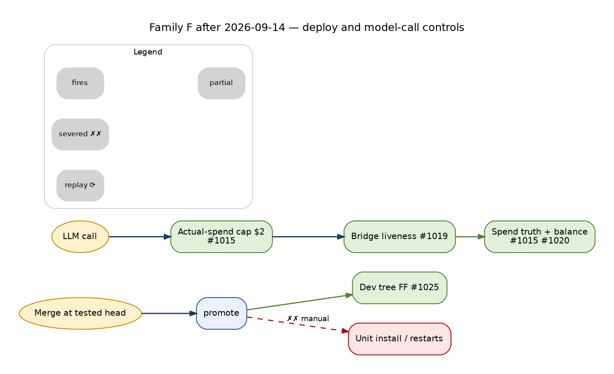

<!-- Lifecycle fact base F — Engineering, runtime and operations lifecycles. Status: ACTIVE (measured, read-only, 2026-09-14 00:00–00:45 EDT). Synthesized in docs/architecture/TRADE_AI_AS_IS_LIFECYCLES_2026-09-14.md; targets in TRADE_AI_FUTURE_STATE_LIFECYCLES_2026-09-14.md. -->

Measurement: complete (family: ENGINEERING, RUNTIME AND OPERATIONS)
as_of: 2026-09-14 00:15-00:35 ET (04:15-04:35Z)
Served SHA at measurement: c594d86004bc (release c594d8600-main-exact-phase2-20260914-000703, promoted 00:07:54 ET)
Dev tree HEAD: c594d8600 = origin/main (rev-list HEAD..origin/main = 0)
Method: read-only. DB sessions `default_transaction_read_only=on`. Checks run only in report / dry-run mode.
Nothing restarted, written, sent or pushed. No LLM calls. The deploy, acceptance and push paths were read, never run.
Labels: OBSERVED (I ran it; the output is quoted) · INFERRED (from code, config or docs) · BLOCKED (not determinable read-only).
Files re-readable in scratchpad: `eng_prs.json`, `eng_runs_all.json`, `eng_lane_report_now.json`, `eng_reg_ids.txt`, `eng_db_ids.txt`.

# ENGINEERING, RUNTIME AND OPERATIONS LIFECYCLES: every stage, measured


> **Update 2026-09-14 23:44 EDT — what changed after this measurement (live `341bce2c1`).** Numbers below are the 00:00–00:45
> measurement. Changes shipped on 2026-09-14:
>
> - **Change lifecycle (§1):** 22 releases promoted on 09-14; `promote` now fast-forwards the dev tree or exits
>   non-zero (#1025) after a deploy wrapper swallowed a refused fast-forward at 21:51; three files served from
>   persistent state untracked and `archive/weekly/` ignored — dev tree `git status` empty (#1023); AGENTS.md
>   Policy-Version 1.2.0 ACTIVE (#1024). Unit install and service restarts still manual.
> - **LLM call (§2):** real spend by provider/model/process with daily/weekly/monthly texts; caps count actual spend;
>   $2.00/day global cap in one host file (#1015); DeepSeek prices verified and balance reconciled hourly; scheduled
>   paid work confined to the operator window (#1020); eight named callers (#1021); bridge deadline, 4 in-flight
>   slots, `/health`, watchdog and MemoryMax 768M (#1019, host).
> - **Lanes and services (§3):** 107 declared lanes, 73 ACTIVE, 0 undeclared; crontab 511 non-comment lines; new
>   timers for litmus, view contracts, EOD closes; watchdog, balance snapshot, spend texts, GO alerts, brief 07:30.
> - **Findings (§4):** bounded repair for the Hermes queue (#1014) and the bridge (#1019); escalation retries no
>   longer exit 127 (36,365 since 08-07).
> - **Secrets, backup, host (§5):** Google credential re-authenticated; DC supply, UPS, rotation, retired keys and
>   restore drills unchanged.




## LEGEND

```
█ LIVE      observed working, unattended
▓ PARTIAL   runs, but narrower than its name, or needs a human each time
░ UNWIRED   code exists; nothing schedules or calls it
✗ DARK      no producer / no consumer / never executed
◇ MANUAL    a human (operator or agent session) is the mechanism

  ══▶  spine          ──▶  lateral read       ◀──  lateral write
  ╌╌▶  feedback edge   ✗✗▶  severed edge (exists in design, carries nothing)

Maturity per stage:
L0 exists only · L1 runs + provenance · L2 grounded in prior state · L3 judged/validated
L4 loop closed (outcome changes a later cycle) · L5 unattended + self-reports its own decay
```

---

# 1 · CHANGE LIFECYCLE (request → code → gates → PR → CI → merge → deploy → runtime → memory)

## 1a · Purpose, actors, stores

| | |
|---|---|
| Purpose | Move an operator request into the code and services that actually execute on ms01, with evidence at each hop. |
| Actors | Operator (John): request, grants, push overrides, deploy approval. Claude/Cursor agent sessions: author, run gates, push, merge, prepare, promote, fast-forward. GitHub Actions. systemd/cron (consume the result). |
| Stores | git worktrees (454 registered, OBSERVED `git worktree list`) · per-worktree `<git-dir>/tradeai-push-budget.json` · `~/.cursor/approvals/grants.json` (guard ledger) · GitHub PRs/runs · `~/trade-ai-releases/portfolio-server/<sha>-main-exact-phase2-<ts>/` · `CURRENT` symlink · drop-in `portfolio-server.service.d/20-exact-sha-release.conf` · `~/.local/state/cio-phase2-exact-main/{state.env,deploy_receipt.json}` · dev-tree reflog · `~/.claude/projects/-home-johnclaw/memory/*.md` · `docs/` |

## 1b · State machine

There is **no single change record**. State is spread across eight stores, and no ID joins them. The PR number is the nearest thing, but `deploy_receipt.json` has `"source_pr": null` (OBSERVED).

| # | State (exact value / evidence) | Where it lives | Transition trigger | Performed by | Exit / terminal |
|---|---|---|---|---|---|
| S0 | REQUESTED | chat transcript only | operator message | operator | none durable |
| S1 | WORKTREE_OPEN | `git worktree add` → `.git/worktrees/<name>` | agent session | agent | never pruned: 454 registered, `prunable` 0 (OBSERVED) |
| S2 | CODE+TESTS | branch commits | agent | agent | none |
| S3 | REGISTERED | test listed in `scripts/run_cio_hardening_ci.py` (1695 lines, 378 `tests/test_` references), or in `UNLISTED_BASELINE` in `scripts/check_test_coverage.py` | agent edit | agent | gate `check_test_coverage.py --fail-on-new` |
| S4 | LOCAL_GATES (`targeted_green`, `regression_green`, `release_equivalent_green`, `authority_green`) | stdout of `scripts/ai_local_acceptance.sh:220-229`, block `LOCAL_ACCEPTANCE:` | agent runs script | script | exit 1 with `CIO GATES FAILED: <list>` (`:199`) or `ready_to_request_sync: true`. **Not persisted**; only scratchpad logs. |
| S5 | PUSH decision `AUTHORIZED` / `OVERRIDE` / `UNAUTHORIZED` / `BUDGET_EXCEEDED` | `scripts/lib/tradeai_push_budget.py:78-99`; state `{tranche_id, authorized_push_count, last_push_at, last_branch}` | `git push` → `.githooks/pre-push` | hook | block (exit 1) or allow, then `record_authorized_push()` |
| S6 | PR_OPEN | GitHub `state=OPEN` | `gh pr create` | agent | MERGED / CLOSED |
| S7 | CI `conclusion` ∈ {success, failure, ''(in progress)} | GitHub runs | push / pull_request | Actions | only `cio-hardening` is required (strict, 0 reviews, `enforce_admins: False`) |
| S8 | MERGED | GitHub `mergedAt` | agent `gh pr merge` | agent | none |
| S9 | PREPARED | release dir `<sha9>-main-exact-phase2-<YYYYmmdd-HHMMSS>` + `state.env NEW_RELEASE=` | `cio_phase2_exact_main_deploy.sh prepare` | agent | none |
| S10 | PROMOTED `{"ok":true,"mode":"promote","health":"ok","rolled_back":false,"extra":"promote_ok"}` | `deploy_receipt.json` (**single file, overwritten each promote**) | `… promote` → daemon-reload, restart `portfolio-server`, `restart_root_frozen_units` (default only `tradeai-health-agent.service`, `:597`) | script | on health failure: rollback to PREV, receipt `rollback_health_failed` (`:537-548`, `:626-630`) |
| S11 | DEV_TREE_FF | dev-tree reflog `merge origin/main: Fast-forward` | **manual** `git merge --ff-only` | agent | none; the deploy never does it |
| S12 | UNITS_INSTALLED | `~/.config/systemd/user/*` vs `config/systemd/user/*` | **manual** copy + `systemctl --user enable` | agent/operator | none; the deploy never does it |
| S13 | SERVICES_RESTARTED | `ActiveEnterTimestamp` | **manual** `systemctl --user restart` (Telegram bot, bridge, proxies) | agent | none |
| S14 | VERIFIED | session narrative; `expected_services_last_run.json`, `served_copy_split_last_run.json`, health endpoint | hourly timers + agent | monitors | none |
| S15 | RECORDED | memory notes, docs PR (e.g. #1003 OPEN) | agent | agent | none |

Terminal states in practice: **MERGED+PROMOTED** (39 of 42), **OPEN-stale** (#963, open since 09-11 02:09Z), **CLOSED** (#974).

## 1c · End-to-end flow

```
 LATERAL READS                                  SPINE                                        LATERAL WRITES
 ══════════════                    ══════════════════════════════════════                  ═══════════════

 operator chat ─────────────────▶ ┌──────────────────────────────────────┐
 memory MEMORY.md ──────────────▶ │ S0 REQUEST            ◇ MANUAL  L0   │  ✗✗▶ no request/change id
 AGENTS §17 (operator-only) ────▶ └──────────────────┬───────────────────┘
                                                     ║
                                  ┌──────────────────▼───────────────────┐ ◀── .git/worktrees/<n>  (454 total,
                                  │ S1 WORKTREE           ◇ MANUAL  L1   │       0 pruned, 271 directly under ~)
                                  └──────────────────┬───────────────────┘
                                                     ║
 run_cio_hardening_ci.py list ──▶ ┌──────────────────▼───────────────────┐ ◀── tests/test_*.py (1318 files)
 check_test_coverage baseline ──▶ │ S2-S3 CODE+TESTS+REGISTER  ▓    L2   │
                                  └──────────────────┬───────────────────┘
                                                     ║
 origin/main...HEAD diff ───────▶ ┌──────────────────▼───────────────────┐
 case-pattern classifier ───────▶ │ S4 ai_local_acceptance.sh   █   L3   │ ◀── scratchpad accept*.log (51 runs)
   (policy_only / cio / frontend) │  hook self-test → policy tests →     │     12 = CIO GATES FAILED
                                  │  release-equivalent → lane registry →│
                                  │  cio_hardening · adversarial ·       │ ╌╌▶ failure → edit → re-run
                                  │  dark_contracts · line_endings ·     │     (loop closes locally,
                                  │  data_source_authority · SoT --check │      not recorded anywhere)
                                  └──────────────────┬───────────────────┘
                                                     ║
 guard grants.json ({} today) ──▶ ┌──────────────────▼───────────────────┐ ◀── <git-dir>/tradeai-push-budget.json
 TRADEAI_REMOTE_PUSH_* env ─────▶ │ S5 PRE-PUSH HOOK           █    L3   │     (overwritten when branch changes)
                                  │  auth → budget(2) → secrets scan     │  ✗✗▶ override approval: no durable log found
                                  │  TRADEAI_SKIP_SECRETS_SCAN=1 bypass  │
                                  └──────────────────┬───────────────────┘
                                                     ║
                                  ┌──────────────────▼───────────────────┐ ◀── GitHub runs (471 since 09-12 01:15Z)
                                  │ S6-S7 PR + CI (18 workflows, 11 ran) │
                                  │  required: cio-hardening only  █ L3  │ ╌╌▶ red → push again (budget)
                                  └──────────────────┬───────────────────┘
                                                     ║
                                  ┌──────────────────▼───────────────────┐
                                  │ S8 MERGE                   ◇    L1   │  median 14.4 min after open
                                  └──────────────────┬───────────────────┘
                                                     ║
 CURRENT (runtime, dist) ───────▶ ┌──────────────────▼───────────────────┐ ◀── release dir (+~1.2-10 G each)
 origin/main overlay ───────────▶ │ S9 PREPARE                 ◇ █  L1   │ ◀── state.env NEW_RELEASE
                                  └──────────────────┬───────────────────┘
                                                     ║
 /api/v2/health ────────────────▶ ┌──────────────────▼───────────────────┐ ◀── CURRENT symlink, drop-in, receipt
                                  │ S10 PROMOTE                ◇ █  L3   │ ◀── EXPECTED_RELEASE pin
                                  │  restart portfolio-server + health   │ ╌╌▶ health fail → rollback PREV
                                  │  agent ONLY                          │
                                  └──────────────────┬───────────────────┘
                                                     ║
                                  ┌──────────────────▼───────────────────┐
                                  │ S11 DEV TREE FF            ◇ ▓  L1   │  ✗✗▶ not in deploy script
                                  │  (344+ cron, 45 units run from here) │      lag p90 867 min, max 39.7 h
                                  └──────────────────┬───────────────────┘
                                                     ║
                                  ┌──────────────────▼───────────────────┐
                                  │ S12 UNIT INSTALL           ◇ ✗  L0   │  ✗✗▶ 7 repo units never installed,
                                  │                                      │      20 installed units differ from repo
                                  └──────────────────┬───────────────────┘
                                                     ║
                                  ┌──────────────────▼───────────────────┐
                                  │ S13 OTHER SERVICE RESTARTS ◇ ▓  L0   │  ✗✗▶ bridge/proxies/ops agent on
                                  │                                      │      09-12 17:02 code; bot 1 release behind
                                  └──────────────────┬───────────────────┘
                                                     ║
 expected_services / split ─────▶ ┌──────────────────▼───────────────────┐
 research_lane_health ──────────▶ │ S14 VERIFY                 █ ▓  L4   │ ╌╌▶ finding → new request (S0)
                                  └──────────────────┬───────────────────┘
                                                     ║
                                  ┌──────────────────▼───────────────────┐ ◀── memory/*.md, docs/*, CHANGELOG
                                  │ S15 RECORD                 ◇    L1   │  ✗✗▶ docs PR #1003 still OPEN
                                  └──────────────────────────────────────┘
```

## 1d · Iterations

| Loop | Cadence (measured) | Closes? |
|---|---|---|
| Local acceptance fail → fix → re-run | 51 acceptance logs 09-12 19:38 → 09-14 00:18 (≈ 1 per 34 min of campaign time); 12 failed | Yes locally. Not recorded outside the scratchpad. |
| CI red → re-push | 12 `cio-production-hardening-ci` failures out of 77 runs | Yes, but each re-push spends push budget |
| Push budget → override | 2 branches reached 3 pushes in the window (`fix/finviz-column-map-by-name`, `fix/p26-tests-in-ci-20260913`); historical max 16 pushes on `feat/holding-llm-curation-cio-flash` (09-10) | Override approval is not durably logged (see 1e) |
| Merge → prepare → promote | 28 exact-main releases in 3.2 days; 17 on 09-13 alone | Yes (receipt), but only the last receipt survives |
| Promote → dev-tree FF | Manual, same session | Closes only when the session remembers. It failed for 15 merges (09-11 17:51 → 09-13 01:20). |
| Verify → new finding → new PR | e.g. #1000 → #1001 → #1002 within 1.5 h | Yes |

## 1e · Questions and decision points

| Decision | Who answers | How recorded | Where it is lost |
|---|---|---|---|
| Is this change in scope / operator-only (§17)? | operator | chat only | No durable decision record. AGENTS §17 is a list, not a ledger. |
| Authorize push | operator: env `TRADEAI_REMOTE_PUSH_AUTHORIZED=1` or `bin/guard grant git-push` | `~/.cursor/approvals/grants.json` | **OBSERVED `{}`**: no grant entries. Env-var authorization leaves no record except the budget counter. |
| Third push (override) | operator | `TRADEAI_REMOTE_PUSH_OVERRIDE=1`; the budget file records `authorized_push_count` | The budget file is keyed `tranche_id = branch` inside one git-dir, and `load_state()` resets it on branch change (`tradeai_push_budget.py:55-56`). History is overwritten. The 09-13 10:56 override exists only in the session transcript. |
| Skip secrets scan | anyone with shell | `TRADEAI_SKIP_SECRETS_SCAN=1` (`.githooks/pre-push:97`) | not logged |
| Merge with 0 reviews | agent | GitHub | `required_approving_review_count: 0` |
| Approve production deploy | operator ("approved the production deploy at 09:33") | chat | `deploy_receipt.json.source_pr = null`, no approver field |
| Install a new unit/cron entry (operator-only §9.3/§17) | operator | crontab comment / `expected_services.json` diff | Not tied to the PR that declared it (answer-quality timer: declared in #998, installed by hand 22:19) |
| Roll back or fix forward | agent (AGENTS §10 "Incident and rollback") | `docs/ops/` incident write-up | No rollback observed in window; no incident docs checked |

## 1f · Live measurements

**PRs** (OBSERVED `gh pr list --search created:>=2026-09-11`, file `eng_prs.json`)

| Metric | Value |
|---|---|
| PRs created 09-11 → 09-14 00:19 ET | 42 (#962-#1003) |
| Merged / open / closed | 39 / 2 (#963 docs, open since 09-11 02:09Z; #1003 docs sync) / 1 (#974) |
| Since 09-12 00:00Z (#975-#1003) | 29 created, 28 merged |
| Open → merge, minutes | **median 14.4 · p90 44.3 · min 4.7 · max 61.1** |
| Lines added (all 42) | 61,476. Largest: #998 +10,531 (49 files), #994 +10,103 (72 files), #996 +9,525 (112 files) |

**CI** (OBSERVED `gh run list --created >=2026-09-12`, 471 runs; by UTC day: 09-12 74 · 09-13 302 · 09-14 95)

| Workflow | Runs | Median min | p90 | Max | Failures |
|---|---|---|---|---|---|
| cio-production-hardening-ci (**required**) | 77 | **7.1** | **12.4** | 13.3 | **12 (15.6%)**, 1 in progress |
| aif-financial-senses-integration-ci | 89 | 2.0 | 2.1 | 2.6 | 0 |
| agent-governance | 70 | 0.8 | 0.9 | 1.5 | 0 |
| provider-cost-ci | 70 | 0.7 | 0.8 | 1.4 | 0 |
| release-readiness | 70 | 1.5 | 1.6 | 1.7 | 0 |
| options-lifecycle-ci | 31 | 1.2 | 1.3 | 1.6 | 2 (`feat/sot-integration`) |
| financial-senses-ci | 30 | 0.3 | 0.4 | 0.4 | 0 |
| research-governance | 28 | 0.7 | 0.8 | 2.2 | 0 |
| cc-header-truth-ci / watch-quality / agent-intelligence-foundation | 2 / 2 / 2 | – | – | – | 1 / 0 / 0 |
| 7 other workflows | 0 runs in window | | | | |

Cause of cio-hardening failures (OBSERVED `gh run view --log-failed`, where logs were retrievable):
- `#991 analyst-view`: `test_operator_turn_integrity_20260913.py` "the real subject must still resolve" (`assert 'WMT' in set()`)
- `#989 finviz`: `ModuleNotFoundError: No module named 'psycopg2'` (CI environment gap)
- `#983 data-broker-state-override`: `test_whole_site_truth.py` "/v3/control-plane/workflows claimed LIVE with an empty root"
- `#982 p26`: `DualImportIdentityError: loaded under both lib.X and scripts.lib.X`
- `#996 sot-p9` ×2, `#993 one-source-of-truth` ×2, `#975 l3-record-integrity` ×3: log grep returned nothing (**BLOCKED**, logs not parsed)

**Local acceptance** (OBSERVED, 51 logs in scratchpad, 09-12 19:38 → 09-14 00:18)

| Outcome | Count | Causes (first failing assertion) |
|---|---|---|
| Full pass | 35 | – |
| Policy/docs-only path ("CI-equivalent release proof: PASS 17/17") | 4 | heavy suites skipped by design |
| `CIO GATES FAILED` | **12 (23.5%)** | new test not registered (`test_ci_test_coverage_gate.py:33`) + dark_contracts · `docs/INDEX.md drift` ×2 · alarm with no firing test ×2 · router CRITICAL routing test · `test_overview_observation_contract` · Brave caps registry assertion · SOP `MATRIX/RUFF_EVIDENCE/WORKFLOW_PROOF/LOCAL_EQUIVALENT_DIGEST_MISMATCH` · G4 archive manifest non-empty |

Every failure class is a **bookkeeping gate** (registration, index, digest, manifest), not a functional regression, except the router, observation-contract and Brave-caps assertions (INFERRED from the assertion text).

**Pushes** (OBSERVED)
- GitHub push events by branch since 09-12, counting distinct minutes: 27 branches. 19 had 1 push, 5 had 2, 2 had 3, and `main` had 28 (merges).
- Push-budget state files: 40 found under `.git/worktrees/*`. Historical counts above budget: `feat/holding-llm-curation-cio-flash` 16, `wt/disk-hygiene-enforcer-20260910` 6, `campaign/m2-canary-gi-runtime` 5, `wt/maturity-gap-closure-20260909` 5.

**Deploys** (OBSERVED)

| Metric | Value |
|---|---|
| Exact-main releases prepared, per day | 09-11: 1 · 09-12: 9 · 09-13: **17** · 09-14: 1 (00:07) |
| Double prepare for one SHA | `c00e23eda` prepared 20:14 and 21:09 |
| `portfolio-server` starts since 09-12 17:00 | 27; `tradeai-health-agent` 27 |
| Deploy receipts retained | **1** (`deploy_receipt.json`, overwritten). History must be reconstructed from directory names and reflog. |
| Current receipt | `ok true, mode promote, health ok, rolled_back false, deployed_sha c594d860…, source_pr null, at 2026-09-14T04:07:54Z` |
| Release directories | 56 (28 `*-main-exact-*`, 28 legacy names from Aug), **108 G**; root fs 84% used, 74 G free |
| Retention | `tradeai-disk-hygiene-enforcer` daily 04:15, `--apply`, glob `*-main-exact-*`, keep_n 10. Its last run deleted releases (`bytes_reclaimed_est 8,737,431,097`). **The 28 legacy directories never match the glob and are never pruned** (INFERRED from glob vs names; largest 6-10 G each). |

**Dev-tree drift** (OBSERVED: reflog joined to 38 first-parent main commits since 09-11)
- Lag from merge to dev tree containing the commit: **median 2.3 min · p90 866.7 min · max 2,382.7 min (39.7 h)**.
- Drift incident 09-11 17:51 → 09-13 09:34: **15 merges** (Oscillator #972-973, #975-#987) were promoted to the release but not in the tree that runs 411 cron lines and 45 units. Their lag ran 494-2,383 min.
- Since 09-13 09:34, every merge was fast-forwarded within 0.8-5.8 min, by hand, in the same session.
- Earlier incident per memory: 09-06, 18 commits behind.

**Unit install drift** (OBSERVED `cmp config/systemd/user/* ~/.config/systemd/user/*`, 89 repo entries)
- SAME 62 · **DIFF 20** (incl. `cio-governed-bridge.service`, `tradeai-cio-reactive.service`, `tradeai-cio-desk-memo-regen.{service,timer}`, 12 drop-in dirs) · **NOT_INSTALLED 7**: `tradeai-cio-event-brief.{service,timer}`, `tradeai-cio-whatsapp.service`, `tradeai-memory-consolidator-shadow.service`, `tradeai-memory-shadow-project.service`, `tradeai-portfolio-report-ms.{service,timer}`.
- `tradeai-portfolio-weekly-cadence.timer` and `…-monthly-cadence.timer` unit-file state is **disabled** (OBSERVED `list-unit-files`).

**Stale code in running services after the 00:07 promote** (OBSERVED `ActiveEnterTimestamp`)

| Unit | Started | Code generation |
|---|---|---|
| portfolio-server | 09-14 00:07:48 | current (pinned c594d8600) |
| tradeai-health-agent | 09-14 00:07:51 | current (CURRENT) |
| tradeai-cio-telegram | 09-13 23:21:47 | **a8a62217e, one release behind** (no restart at 00:07) |
| cio-governed-bridge, grok-oauth-proxy, chatgpt-oauth-proxy, tradeai-ops-agent, heartbeat-receiver, tradeai-active-trader-motion, openclaw-gateway | 09-12 17:02:27 (boot) | **predates all 28 promotes** |

The monitor agrees: `research_lane_health` fires `process-freshness: process_predates_pin` and `current-pin: tree_diff:1, unpinned_extra:1` (OBSERVED).

## 1g · Failure paths and where it breaks today

1. **Deploy ≠ runtime.** The promote restarts 2 of about 24 running services, installs no units and does not advance the dev tree. Three manual steps (S11-S13) carry the change into what actually runs. Each has failed in this window: the 15-merge dev-tree gap, 7 never-installed units plus the hand-installed answer-quality timer, and the bot one release behind now.
2. **No change identity.** A request cannot be traced to its PR, CI run, release, promote and runtime restart without a human join. `source_pr: null`; only one receipt is retained.
3. **Decisions not durable.** Push authorizations and overrides, deploy approvals, and unit-install approvals live in chat. The guard ledger is `{}`, and the budget file resets per branch.
4. **Gate cost is bookkeeping.** 12 of 51 local runs failed, mostly on registration, index or digest drift. CI failed 15.6%, some from environment gaps (`psycopg2` missing in CI).
5. **Secrets-scan bypass flag** exists in the hook (`TRADEAI_SKIP_SECRETS_SCAN`). Repo is PUBLIC; 0 required reviews; admins not enforced.
6. **Worktree sprawl.** 454 registered worktrees, none pruned. Disk is 84%.
7. **Release retention blind spot.** 28 legacy release directories fall outside the prune glob.

## 1h · Maturity per stage

| Stage | L | Why |
|---|---|---|
| S0 request | L0 | no durable record |
| S1 worktree | L1 | created reliably; never retired |
| S2-S3 code/tests/registration | L2 | coverage gate bounds new tests; the 95% unlisted baseline remains (script docstring) |
| S4 local acceptance | L3 | diff-scoped, reports all CIO gates; result not persisted |
| S5 pre-push | L3 | enforced; decisions not auditable |
| S6-S7 PR/CI | L3 | required check strict; 1 required of 18 |
| S8 merge | L1 | |
| S9-S10 prepare/promote | L3 | health-gated with auto rollback; single receipt |
| S11 dev-tree FF | L1 | manual; p90 lag 14 h |
| S12 unit install | L0 | not automated, not detected except by `expected_services` for declared units |
| S13 other restarts | L0 | stale code detected by RLH, not acted on |
| S14 verify | L4 | hourly monitors feed new PRs |
| S15 record | L1 | memory + docs PR, lagging |

## 1i · Target lifecycle and observed exit conditions

Target: one `change_id` carried from request → PR → CI → release → promote receipt (append-only, with `source_pr` and approver) → dev tree = release SHA (enforced, or the dev tree eliminated as an execution root) → units diffed and installed by the deploy → every unit whose `WorkingDirectory` or code root changed restarted → post-promote verification receipt → docs merged.

| Exit condition | Observed today |
|---|---|
| main = release = dev tree | **MET** at 00:30 (c594d8600 ×3) |
| All running units on the current release | **NOT MET** (8 units older) |
| Repo units = installed units | **NOT MET** (20 differ, 7 missing) |
| Deploy history durable | **NOT MET** (1 receipt) |
| Decisions (push override, deploy approval) auditable | **NOT MET** |
| Docs merged | **NOT MET** (#1003 open) |

---

# 2 · LLM CALL LIFECYCLE

## 2a · Purpose, actors, stores

| | |
|---|---|
| Purpose | Every model call is declared, admitted under caps, reserved, routed to a lane, validated, logged, and reconciled against provider spend. |
| Actors | ~84 cron lanes and units that call models (AGENTS §12). `scripts/lib/llm_consumption.py` (admission, reservation, log). `cio-governed-bridge.service` :8766 (DeepSeek, caps). Grok :8645, ChatGPT :8646, Ollama :11434. `provider-cost-reconcile` timer. Operator via `/caps` `/cap` on Telegram (`run_telegram_callback_poller.py:279,757-830` → `scripts/lib/llm_cap_admin.py:set_caps`). |
| Stores | `config/llm_process_registry.json` (v4, 59 processes, list) · `llm_process_config` (61 rows) · `llm_cost_reservations` · `llm_consumption_log` · `data/runtime/provider_cost/latest_reconciliation.json` · env `LLM_GLOBAL_DAILY_USD_CAP` · `config/llm_lane_floors.json` (empty) |

## 2b · State machine

**Reservation** (`llm_cost_reservations.status`, `llm_consumption.py:116, 486-517, 856, 905-917`)

```
          check_cost_cap (process $ cap, global $ cap, daily_soft_cap requests,
          max_input_tokens) ── refuse ──▶ RuntimeError "COST_CAP_EXCEEDED: process cap|global cap|daily request cap"
                │                                   "INPUT_LIMIT_EXCEEDED: prompt ~N tokens exceeds …"  (:1098)
                │ admit                             (no reservation row, no consumption row; caller log only)
                ▼
          'reserved' ──call ok/err──▶ 'settled'  (actual_usd = cost)
                │
                └──── call not made / aborted ──▶ 'released'
```

Distinct values all-time (OBSERVED): `settled` 37,971 (08-03 → now), `released` 158. `reserved` older than 1 h: **0**.

**Call outcome** (`llm_consumption_log`): `success` ∈ {t, f}; `error_message` classes (7 d, OBSERVED): Grok read timeout 16 · `502 Bad Gateway` (proxy) 16 · `MISMATCHED_RETURNED_MODEL: policy=FAST model=deepseek-v4-flash returned=deepseek-flash` 12 · `AUTH_MISSING` 1 · `NETWORK_ERROR ChunkedEncodingError` 1 · `TIMEOUT` 1.
Process mode `llm_process_config.mode` ∈ {manual, automated} (`default_mode: manual`); `ManualRequired` exception (`:25`).
Registry failure behaviour: `VISIBLE_FAILURE_NO_SILENT_FALLBACK`.

## 2c · End-to-end flow

```
 LATERAL READS                                    SPINE                                   LATERAL WRITES
 llm_process_registry.json ─┐
   (59, v4)                  │   ┌────────────────────────────────────┐
 _seed_registry() on        ├──▶│ 0 REGISTRY → llm_process_config    │ ◀── UPSERT 41 rows (updated_at 00:30 today)
   ensure_schema             │   │   █ L1                             │     COALESCE(registry cap, db cap):
                             │   └───────────────┬────────────────────┘     registry value wins when set
                                                 ║
 caller (cron/unit) ──────────────▶ ┌────────────▼───────────────────────┐
 LLM_GLOBAL_DAILY_USD_CAP env ────▶ │ 1 ADMISSION  check_cost_cap        │  ✗✗▶ refusals NOT in any table
   (unset on ~78/84 lanes, §12)     │   ▓ L3                             │      (log text only: offpeak log
 llm_process_config caps ─────────▶ │  max_input · soft cap · $ process  │       cap 22-45/day, input 2-29/day)
 today's reserved+settled ────────▶ │  · $ global                        │
                                    └────────────┬───────────────────────┘
                                                 ║
                                    ┌────────────▼───────────────────────┐ ◀── llm_cost_reservations 'reserved'
                                    │ 2 RESERVATION  projected_usd       │     projected 7-day $302 vs actual $5.45
                                    │   █ L2                             │
                                    └────────────┬───────────────────────┘
                                                 ║
 lane_policy (either/grok_only/…)─▶ ┌────────────▼───────────────────────┐
 oauth_lane_status.json ──────────▶ │ 3 LANE SELECT                      │  grok :8645 · chatgpt :8646 (free)
 bridge :8766 (DeepSeek, canary) ─▶ │   █ L2                             │  fast/deepseek-flash/pro via bridge
                                    └────────────┬───────────────────────┘  ollama :11434 (not in ledger 7d)
                                                 ║
                                    ┌────────────▼───────────────────────┐
                                    │ 4 CALL                     █ L1    │  timeouts: grok 16, 502 16
                                    └────────────┬───────────────────────┘
                                                 ║
 agent_number_grounding.py ───────▶ ┌────────────▼───────────────────────┐
 returned_model check ────────────▶ │ 5 VALIDATE (parse, model id,       │  MISMATCHED_RETURNED_MODEL 12
                                    │   G0 number grounding)  ▓ L3       │  G0 not yet exercised in prod
                                    └────────────┬───────────────────────┘
                                                 ║
                                    ┌────────────▼───────────────────────┐ ◀── llm_consumption_log (+ tokens,
                                    │ 6 CONSUMPTION LOG + settle █ L1    │     cost, policy, returned_model)
                                    └────────────┬───────────────────────┘ ◀── reservation 'settled'
                                                 ║
 provider console export ─────────▶ ┌────────────▼───────────────────────┐ ◀── latest_reconciliation.json
                                    │ 7 RECONCILE (daily 06:40)  ▓ L3    │     console $60.94 vs attributed $0.87
                                    └────────────┬───────────────────────┘     residual unattributable $49.77
                                                 ║
 research_lane_health collector ──▶ ┌────────────▼───────────────────────┐
                                    │ 8 LANE HEALTH MONITOR      ▓ L2    │  ✗✗▶ says grok/deepseek
                                    └────────────┬───────────────────────┘      zero_non_error while the ledger
                                                 ║                              shows hundreds ok
 operator Telegram /cap ──────────▶ ┌────────────▼───────────────────────┐ ◀── UPDATE llm_process_config
 MAX_* ceilings (code) ───────────▶ │ 9 CAP CHANGE  set_caps  ◇ ▓ L2     │ ◀── write config/llm_process_registry.json
                                    └────────────────────────────────────┘      in the running tree
                                          ╌╌▶ back to 0 (registry reseed)       ✗✗▶ no audit row; file change
                                                                                    not committed → lost/dirty
```

## 2d · Iterations

| Loop | Cadence | Closes? |
|---|---|---|
| Registry → DB reseed | on every `ensure_schema()` (process start); 41 rows refreshed 00:30 today | Yes, one-way (registry wins) |
| Cap exceeded → job fails → next cron slot retries | every 15 min for agent jobs (10-20 ET) | **No.** It retries into the same cap. COST_CAP 22-45 per day 09-07..09-12 in `watchlist_agent_jobs_offpeak.log`. |
| Input limit → cap raise (PR #998 4k→8k, #1002 16k→32k) | human, per incident | Yes, via PR. INPUT_LIMIT fell to 2 on 09-13. |
| Daily reconcile → gap explained | daily 06:40 | **No.** Residual $49.77 "UNATTRIBUTABLE_WITH_CURRENT_PROVIDER_DATA". |
| Reservation projected → actual | per call | Settles, but projection is 10-90× actual, so global-cap admission over-refuses (INFERRED). |

## 2e · Questions and decision points

| Decision | Who | Recorded | Lost where |
|---|---|---|---|
| Register a new process | agent proposes, registry PR | `registered_by/registered_at` per row | DB has 2 processes not in the registry (`steph_allocation_planning`, `watch_news_intelligence_flash`), so something wrote around it |
| Raise a paid cap | operator (AGENTS §12: "Raising a paid process cap is an operator decision") | PR note, or `/cap` → DB + registry file | `/cap` writes the registry JSON in whatever tree the poller runs from. It is not committed: a dev-tree write makes the tree dirty; a release-tree write is replaced at the next promote. No audit table exists (search for `%cap%audit%`, `%llm%audit%` returned none). Reseed on process start re-applies the registry value. |
| Global cap value | operator ratified $0.50 on 09-01 | AGENTS §12 | Enforcement partial: 5 of 8 days (09-06..09-13) exceeded $0.50 (below) |
| Fallback allowed | registry `fallback_allowed` | registry | – |

## 2f · Live measurements (OBSERVED, read-only SQL, ET days)

| Day | Calls | OK | Fail | Spend $ | Tokens in / out | Reservations projected $ → actual $ | Released |
|---|---|---|---|---|---|---|---|
| 09-06 | 10,315 | 10,307 | 8 | 1.2451 | 3.99M / 0.68M | 106.41 → 1.26 | 0 |
| 09-07 | 6,569 | 6,569 | 0 | 1.2657 | 2.60M / 0.38M | 130.36 → **16.29** | 8 |
| 09-08 | 7,935 | 7,933 | 2 | 1.2734 | 2.57M / 0.49M | 133.55 → **7.67** | 6 |
| 09-09 | 5,040 | 5,031 | 9 | 1.0675 | 2.83M / 0.48M | 70.31 → **4.08** | 3 |
| 09-10 | 493 | 488 | 5 | 0.3475 | 0.67M / 0.35M | 5.91 → 2.06 | 2 |
| 09-11 | 1,077 | 1,057 | 20 | 0.7402 | 1.92M / 0.73M | 6.56 → 1.42 | 1 |
| 09-12 | 1,351 | 1,348 | 3 | 0.3429 | 0.78M / 0.40M | 2.66 → 0.34 | 0 |
| 09-13 | 1,358 | 1,350 | 8 | 0.4085 | 1.26M / 0.44M | 4.77 → 0.41 | 0 |
| 09-14 (to 00:30) | 12 | 12 | 0 | 0.0020 | | 0.07 → 0.002 | 0 |

- **7-day spend (09-07..09-13): $5.45**. The global $0.50/day cap was exceeded on **4 of 7** days (09-07 $1.27, 09-08 $1.27, 09-09 $1.07, 09-11 $0.74), and on 09-06 ($1.25) just before the window.
- **Reservation actual ≠ ledger** 09-07..09-11: reservations settled at $16.29 / $7.67 / $4.08 / $2.06 / $1.42 while the ledger says $1.27 / $1.27 / $1.07 / $0.35 / $0.74. They converged from 09-12. Two cost truths existed for five days.
- **By lane, 09-13:** grok 744 (8 fail, $0) · fast 469 ($0.3825) · deepseek-flash 77 ($0.026) · chatgpt 68.
- The ledger shows a shift: `fast` volume fell from 9,768 (09-06) to 469 (09-13) calls; grok rose from 498 to 744 at peak 932 (09-12).
- **Top processes, 7 d:** `advisory_desk_opinion/fast` 20,749 calls, **$4.77 (87.6% of spend)** · `hermes_external_research/deepseek-flash` 444, $0.558, 12 fail · `aegis_steph_review/grok` 862 · `topic_ingestion/grok` 381 · `topic_curator/grok` 280 (12 fail) · `holding_protection_advisor/grok` 37 (**16 fail, 43%**) · `unregistered/fast` 20 calls $0.024.
- **Trigger mode, 7 d:** automated 23,434 · manual 23.
- **Refusals** are not in any table. Log evidence: `watchlist_agent_jobs_offpeak.log` COST_CAP_EXCEEDED 22/37/45/45/26/22/0 and INPUT_LIMIT_EXCEEDED 11/15/11/19/29/18/2 for 09-07..09-13. Cumulative COST_CAP strings in other logs modified since 09-06: `aegis-overnight-systemd.log` 6,120, `aegis_synthesis.log` 5,405, `entry_planner.log` 1,804, `oauth_lane_keepalive.log` 446, `governed_agent_flash_market.log` 414, `topic_curator.log` 240 (cumulative, not per day).
- **Config:** DB 61 rows, 21 with $ caps summing to **$15.48** (global cap $0.50). Registry 59.
- **Reconcile** (`latest_reconciliation.json`, 09-13 06:40): CONSOLE_TOTAL $60.94 · LEDGER_ATTRIBUTED $0.87 · HOST_ATTRIBUTED $11.17 · by class CLAUDE_CODE $10.30 · TRADE_AI_TEST $4.85 · TRADE_AI_PRODUCTION $0.24 · by service `cio_governed_bridge` $5.09 · residual unattributable **$49.77**. Period is not in the top-level keys (**BLOCKED**).

## 2g · Failure paths

1. **Refusal is invisible to the ledger.** COST_CAP and INPUT_LIMIT raise before a reservation or log row, so "spend under cap" and "jobs refused" cannot be read from one store. The agent-job failures went unnoticed from 09-06 (memory).
2. **The global cap is policy, not control.** Spend exceeded $0.50 on 4 of 7 days (5 of 8 including 09-06). Per-process caps sum to 31× the global cap.
3. **Projection distortion.** Projected 10-90× actual on some days, so a global-cap check on projections refuses early. On other days (09-07..09-11) settled `actual_usd` overstated ledger cost by up to 13×.
4. **The cap-change decision can be lost:** an uncommitted registry write, no audit, reseed-from-registry.
5. **Registry bypass:** 2 DB-only processes; `unregistered` process id carries paid calls.
6. **Monitor contradiction:** RLH says grok/deepseek `zero_non_error_24h`; the ledger shows 744 grok and 546 deepseek calls OK.
7. **Reconciliation gap:** $49.77 unattributable of $60.94 on the console. The ledger is not the spend truth.
8. **Model identity drift:** 12 `MISMATCHED_RETURNED_MODEL` failures on `hermes_external_research`, treated as failure but still paid (INFERRED).

## 2h · Maturity

| Stage | L |
|---|---|
| 0 registry→DB | L2 (drift exists) |
| 1 admission | L3 (enforces; refusals unrecorded) |
| 2 reservation | L2 |
| 3 lane select | L2 |
| 4 call | L1 |
| 5 validation | L3 (model id + G0, unproven live) |
| 6 log | L1 |
| 7 reconcile | L3 run daily, loop open |
| 8 lane-health monitor | L2, contradicts ledger |
| 9 cap change | L2, operator surface exists, no audit |

## 2i · Target and exit conditions

Target: every admission decision (admit or refuse, with class) is one row; reservation actual equals ledger cost; the global cap is enforced in the shared transport; cap changes append to an audit ledger and land as a commit; reconcile residual under 10%.

| Exit | Today |
|---|---|
| refusal rows = log refusals | NOT MET (0 rows) |
| spend ≤ $0.50 every day | NOT MET (4/7) |
| reservation actual = ledger | MET since 09-12 |
| registry ids = DB ids | NOT MET (2 extra) |
| reconcile residual small | NOT MET ($49.77) |

---

# 3 · SCHEDULED LANE AND SERVICE LIFECYCLES

## 3a · Purpose, actors, stores

| | |
|---|---|
| Purpose | Every scheduled job is declared before install, proves it ran by a durable output, and is paused or retired with a reason. Every expected unit is on. |
| Actors | Operator (install is operator-only, AGENTS §9.3/§17). Agents propose. `check_lane_registry.py` (CI, acceptance, monitor). `research-lane-health` timer (30 min). `check_expected_services.py` (hourly :12). cron (451 active lines) and systemd user (81 timers). |
| Stores | `config/lane_registry.json` (`LaneRegistry@v1`, 90 lanes, 531 `undeclared_baseline`) · crontab · `~/.config/systemd/user` (201 unit files) · `config/systemd/user` (89) · `config/expected_services.json` (63 units + 2 flags) · `data/runtime/research_lane_health.json` · `expected_services_last_run.json` |

## 3b · State machines

**Declared lane state** (`scripts/lib/lane_registry.py:79-86`): `ACTIVE` · `PAUSED` · `NEVER_SCHEDULED` · `RETIRED`. Validation: non-ACTIVE requires `state_reason` and `state_since` (`:146-150`); PAUSED requires `review_by` (`:160`); ACTIVE requires `expected_cadence_hours` (`:172`).

**Evaluated verdict** (`:90-98`): `LIVE` · `SLOW` · `SILENT` · `EXPECTED_SILENT` · `ORPHANED` · `UNVERIFIABLE` (+ `UNDECLARED`). `FINDING_VERDICTS = (SILENT, UNDECLARED, ORPHANED)`.

```
 proposal ──operator──▶ registry row (state ACTIVE, output_signal) ──install──▶ cron/systemd
      │                                                                              │
      │                     evaluate every 30 min (collect_lane_registry_report)     │
      │         ┌──────────────────────────────────────────────────────────────────┐ │
      │         │ state∈{PAUSED,RETIRED,NEVER_SCHEDULED} ─────────▶ EXPECTED_SILENT │ │
      │         │ match string absent from crontab/timers ────────▶ ORPHANED        │◀┘
      │         │ output_signal kind none / unreachable ──────────▶ UNVERIFIABLE    │
      │         │ age ≤ cadence ─▶ LIVE ; ≤ k·cadence ─▶ SLOW ; else ─▶ SILENT      │
      │         │ outside active_days (weekday in UTC, :424-434) ─▶ not judged      │
      │         └──────────────────────────────────────────────────────────────────┘
      │                                   │ SILENT/ORPHANED
      │                                   ▼
      └──── PR edits registry ◀── operator/agent triage ◀── RLH lane-registry firing
             (state→PAUSED/RETIRED with reason; or fix match string; or fix producer)
             baseline entry removed = inherited debt shrinks (never grows: gate --fail-on-new)
```

**Service lifecycle** (no state column; derived): `declared` (expected_services.json) → `installed` (unit file present) → `enabled` → `active` → `failed` → `detected` (`systemctl --failed` catches only FAILED; the expected-services check catches absent or disabled units) → `restarted` (manual, or `Restart=on-failure`).

## 3c · Flow

```
 LATERAL READS                         SPINE                                           LATERAL WRITES
 operator approval (chat) ──▶ ┌──────────────────────────────┐
                              │ 1 PROPOSE / APPROVE  ◇ L0    │ ✗✗▶ approval not linked to row
                              └──────────────┬───────────────┘
                                             ║
                              ┌──────────────▼───────────────┐ ◀── config/lane_registry.json (22 commits since 08-30)
                              │ 2 DECLARE row + output_signal│     output_signal kinds: file_mtime 71 ·
                              │   █ L2 (gate in CI)          │     none 9 · db_max 6 · json_key 4
                              └──────────────┬───────────────┘
                                             ║
                              ┌──────────────▼───────────────┐ ◀── crontab (451 active), ~/.config/systemd/user
                              │ 3 INSTALL  ◇ ✗ L0            │ ✗✗▶ deploy never installs; 7 repo units absent;
                              └──────────────┬───────────────┘     weekly/monthly cadence timers "disabled"
                                             ║
 crontab + list-timers ─────▶ ┌──────────────▼───────────────┐
 output files / db_max ─────▶ │ 4 EVALUATE (30 min) █ L4     │ ◀── research_lane_health.json (11 lanes firing)
                              │  LIVE 39 · EXP_SILENT 32 ·   │
                              │  SILENT 8 · SLOW 3 ·         │
                              │  ORPHANED 2 · UNVERIFIABLE 6 │
                              └──────────────┬───────────────┘
                                             ║
                              ┌──────────────▼───────────────┐
                              │ 5 DRIFT (match strings)  ▓ L2│ ✗✗▶ 2 ORPHANED are renamed scripts
                              └──────────────┬───────────────┘
                                             ║
                              ┌──────────────▼───────────────┐ ◀── registry state/state_reason/review_by
                              │ 6 PAUSE / RETIRE  ◇ L2       │ ◀── crontab `# RETIRED …` tags (12)
                              └──────────────┬───────────────┘
                                             ║
                              ┌──────────────▼───────────────┐
                              │ 7 BASELINE SHRINK  ◇ L1      │ 531 entries; no measured shrink this window
                              └──────────────────────────────┘

 SERVICE:
 expected_services.json ────▶ ┌──────────────────────────────┐ ◀── expected_services_last_run.json (65/65 on)
   (63 units + 2 flags)       │ S-DETECT hourly :12   █ L4   │     → [PLATFORM_AVAILABILITY] IMMEDIATE alert
                              └──────────────┬───────────────┘
                                             ║
 host inotify (65,536) ─────▶ ┌──────────────▼───────────────┐
                              │ S-RUN / FAIL          ▓ L2   │ ✗✗▶ 20,723 "Failed to add inotify watch"
                              └──────────────┬───────────────┘     journal lines since 09-07
                                             ║
                              ┌──────────────▼───────────────┐
                              │ S-RESTART  ◇ / on-failure L1 │
                              └──────────────────────────────┘
```

## 3d · Iterations

| Loop | Cadence | Closes? |
|---|---|---|
| Evaluate lanes | 30 min (RLH) | Detects; triage is manual |
| SILENT → investigate → registry PR | ad hoc | Partial. `cio-defer-revisit` SILENT 625 h and `cio-delivery` SILENT 369 h have been in findings since at least 09-10 with no closure. |
| ORPHANED (match drift) → fix match | ad hoc | **Open.** `indicator-cache-refresh`, `rotation-autopilot` |
| PAUSED `review_by` → review | per row | 0 overdue today (OBSERVED) |
| expected services → alert → restart | hourly | Closed on 09-13 (bot revived); covers 63 of the 201 unit files |
| Registry edits | 22 commits in 15 days | – |

## 3e · Questions and decision points

- **Install a scheduler entry:** operator-only. Recorded as a crontab comment and backup (`crontab_backup_before_moomoo_reenable_*.txt`). The approval is not linked to the lane row.
- **Retire/pause:** reason required by the validator. "Never invent a reason; an honest UNKNOWN is itself a finding": `unknown_reason_lanes` = 3.
- **Deliberately retire a unit:** remove it from `expected_services.json` in the same change (`_how_to_change`). 4 commits to that file ever.
- **Lost:** approval for weekly/monthly portfolio cadence timers being disabled. They are `disabled` with no registry state change (still ACTIVE, verdict SILENT/SLOW) and no expected-services entry.

## 3f · Live measurements (OBSERVED, re-evaluated 04:28:47Z read-only, `eng_lane_report_now.json`)

| Metric | Value |
|---|---|
| Declared | 90: ACTIVE 58 · PAUSED 13 · NEVER_SCHEDULED 12 · RETIRED 7 |
| Verdicts | LIVE 39 · EXPECTED_SILENT 32 · **SILENT 8 · SLOW 3 · ORPHANED 2 · UNVERIFIABLE 6** |
| SILENT | cio-delivery (since 08-29, 369 h) · cio-defer-revisit (since 08-19, 625 h) · portfolio-weekly-cadence (339 h) · holdings-agent-enqueue · portfolio-repricer · material-change-notifier-stage2 · due-diligence-questions · moomoo-live-read-sync |
| SLOW | portfolio-daily-cadence · portfolio-monthly-cadence (1,048 h) · p1-digest-delivery (new since 03:52Z) |
| ORPHANED (match drift) | rotation-autopilot · indicator-cache-refresh |
| UNVERIFIABLE (no output_signal) | document-mentions-prune · db-retention · hermes-top20-external-intel · hermes-usefulness-backfill · hermes-librarian-retention · disk-hygiene-enforcer |
| Weekend/UTC artifact share of SILENT | 3-4 of 8 (holdings-agent-enqueue, portfolio-repricer, moomoo, possibly notifier); UTC weekday at `lane_registry.py:434` |
| Undeclared beyond baseline / baseline | 0 / **531** |
| Paused `review_by` overdue | 0 |
| crontab active lines / RETIRED tags | 451 / 12 |
| Expected services | checked 65, off 0 (00:13 receipt). Declares 63 of 201 installed unit files. Not declared: portfolio-server, cio-governed-bridge, grok/chatgpt proxies, openclaw-gateway, heartbeat-receiver, power-watch, weekly/monthly cadence timers. |
| Timers never triggered | `tradeai-data-plausibility.timer` `LastTriggerUSec=` empty; next 06:21 |
| Host inotify exhaustion (user journal "Failed to add … inotify watch", per day) | 09-07 3,629 · 09-08 759 · 09-09 **9,050** · 09-10 154 · 09-11 1,736 · 09-12 3,052 · 09-13 2,343. Top since boot: agent-runtime-producer 1,238 · cio-reactive 1,186 · cio-delivery 484 · autonomy-watchdog 484. `fs.inotify.max_user_watches=65536` unchanged. |
| Running user services | 24 |

## 3g · Failure paths

1. **Install is not a lifecycle stage anyone runs.** Units declared in git but not installed (7), installed but differing (20), timers silently disabled (2). The lane evaluator reports the symptom (SILENT) weeks later.
2. **Verdict truth issues:** UTC weekday evaluation, match-string drift, 6 ACTIVE lanes with no output signal, and 531 baseline entries that are never evaluated.
3. **"Runs but produces nothing"** is invisible to the scheduler: `cio-delivery` runs every 5 min, `delivered_count=0`, for 16 days.
4. **inotify exhaustion** is a standing host fault: 20,723 failures in 7 days, and it killed `tradeai-hermes-cio-worker.path` on 09-12 (memory). No detector or owner.
5. **Expected services covers 31% of unit files.** The LLM bridge and proxies are undeclared.

## 3h · Maturity

Propose L0 · Declare L2 · Install L0 · Evaluate L4 · Drift L2 · Pause/retire L2 · Baseline shrink L1 · Service detect L4 · Service run L2 · Restart L1.

## 3i · Target and exit conditions

Target: registry row → install from git by the deploy → first natural-schedule output observed → verdict LIVE, recorded as the install receipt; the evaluator uses the declared timezone; every unit file is either expected or retired.

| Exit | Today |
|---|---|
| SILENT+ORPHANED = 0 real | NOT MET (≥4 real) |
| UNVERIFIABLE = 0 | NOT MET (6) |
| baseline shrinking | NOT MEASURED as shrinking (531) |
| expected ⊇ running critical units | NOT MET |
| inotify failures = 0 | NOT MET |

---

# 4 · FINDING / INCIDENT LIFECYCLE

## 4a · Purpose, actors, stores

| | |
|---|---|
| Purpose | A defect detected by any instrument becomes an owned finding, is alerted or suppressed on purpose, is fixed, verified on the natural schedule, and closed. |
| Detectors (11+) | integrity sweep `run_integrity_checks.py` (report-only) · health agent daemon (~5 min) + remediation · health inspector layer 1 `--apply` · ops agent `--apply --telegram` · research lane health (30 min) · data source health (hourly) · operator answer quality (30 min) · gap resolution (30 min, dry-run) · data plausibility (daily, never fired) · expected services (hourly) · served copy split (hourly) · hermes validation · escalation queue producers |
| Stores | **None shared.** `integrity` (stdout JSON only) · `persistent-state/data/portfolios/state/health_agent_status.json` · `persistent-state/logs/health_agent_remediation.jsonl` (20,745 lines) · `health_agent_remediation_state.json` · `runtime/health_inspector_remediations.json` · `runtime/*_last_run.json` × 6 · `alert_incidents` (0 rows) · `alert_events` · `alert_digest_queue` · `alert_dispatch_log` · `escalation_queue` · `hermes_validation_findings` · `pipeline_runs` · `health_manual_remediation_audit` · `data_gap_registry` |

## 4b · State machines by store (exact values, OBSERVED)

| Store | State column | Distinct values and counts | Terminal |
|---|---|---|---|
| `alert_incidents` | `status` | **table empty (0 rows)** despite a full lifecycle schema (acknowledged_at, resolved_at, suppressed_count…) | – |
| `alert_events` | `lifecycle_state` | `active` 7,845 (08-30 → now) · `acknowledged` 2 · **resolved 0** | none reached |
| `escalation_queue` | `status` | `pending` 13 (oldest 08-28) · `expired` 21 | expired (by clock, not by fix) |
| `hermes_validation_findings` | `status` | `resolved` 28,636 · `dismissed` 2,657 · **`open` 191** (urgent 14, oldest 06-02) | resolved/dismissed |
| `pipeline_runs` | `status` | 7 d: `success` 3,333 · `failed` 224 · `running` 2 | – |
| `data_gap_registry` | `status` | `resolved` 73 (newest 05-24); 0 open | resolved |
| health agent finding | `severity` | critical 11 · warning 11 · info 11; `action_type` monitor 11 · auto_retry 7 · review 6 · operator 4 · code_fix 3 · refresh 2 | none (recomputed each cycle) |
| health remediation | `ok` + `note` | `ok:true/false`, `CONTAINED`, `INEFFECTIVE — EFFECT_NOT_OBSERVED; not re-running`, `remediation ineffective 3x within 60m — not re-running; needs operator/code review` | circuit open (no closure) |
| gap resolution | finding class | `OPEN_NO_ATTEMPT` · `VECTOR_FAILING` · `RETIRED_RAN` | none (dry-run) |
| integrity sweep | `severity` P0/P1/P2, `check` | per run only | none |

## 4c · Flow

```
 DETECTORS (read)                          SPINE                                      WRITES / OUTCOMES
 ════════════════                ═══════════════════════════════════             ═══════════════════

 integrity sweep (manual) ──┐
 health agent 5 min ────────┤    ┌─────────────────────────────────────┐
 inspector L1 --apply ──────┤    │ 1 DETECT                    █ L1-L4 │ ◀── 11 separate receipts/tables,
 ops agent --apply ─────────┤    │  each detector its own vocabulary   │     no shared finding id
 research lane health ──────┼───▶│  (P0/P1, critical/warning,          │
 data source health ────────┤    │   SILENT/ORPHANED, OPEN_NO_ATTEMPT, │
 answer quality ────────────┤    │   off/blocking, split)              │
 gap resolution (dry) ──────┤    └──────────────────┬──────────────────┘
 plausibility (never fired)─┤                       ║
 expected svcs / split ─────┘                       ║
                                  ┌─────────────────▼───────────────────┐ ◀── alert_events +7,845 active
 telegram_alert_router ─────────▶ │ 2 ALERT / SUPPRESS          ▓ L3    │ ◀── alert_dispatch_log sent_telegram 14 (7d)
 sentinel types (PR #990) ──────▶ │  IMMEDIATE for [PLATFORM_AVAIL-     │ ◀── P1_DIGEST suppression (4-hourly)
 hourly dedup ──────────────────▶ │  ABILITY]/[DATA_INTEGRITY];         │ ✗✗▶ alert_incidents: 0 rows
                                  │  others → P1 digest                 │
                                  └──────────────────┬──────────────────┘
                                                     ║
                                  ┌──────────────────▼───────────────────┐ ◀── health_agent_remediation.jsonl
 allowlisted commands ──────────▶ │ 3 AUTO-REMEDIATE          ▓ L3       │     7d: 8,979 attempts, 56 ok (0.6%)
 ineffective-streak circuit ────▶ │  health agent · inspector · ops agent│ ◀── inspector 3/3 ok (warm_caches …)
                                  └──────────────────┬──────────────────┘ ╌╌▶ circuit "not re-running; needs
                                                     ║                         operator/code review" → nobody
                                  ┌──────────────────▼───────────────────┐
 agent session / operator ──────▶ │ 4 TRIAGE                   ◇ L1      │ ✗✗▶ escalation_queue pending 13
                                  │                                      │     (oldest 08-28), no reviewer
                                  └──────────────────┬──────────────────┘ ✗✗▶ health_manual_remediation_audit
                                                     ║                          last row 08-31
                                  ┌──────────────────▼───────────────────┐
                                  │ 5 FIX PR                   ◇ █ L3    │  (Lifecycle 1; 28 PRs in window)
                                  └──────────────────┬──────────────────┘
                                                     ║
                                  ┌──────────────────▼───────────────────┐
                                  │ 6 VERIFY (natural schedule) ▓ L3     │  e.g. expected services 65/65,
                                  └──────────────────┬──────────────────┘   split 7/7, AQ 7 findings age out
                                                     ║
                                  ┌──────────────────▼───────────────────┐
                                  │ 7 CLOSE                     ✗ L0     │ ✗✗▶ no store records closure;
                                  └──────────────────────────────────────┘     alert_events 0 resolved,
                                                                                findings vanish when the
                                                                                detector stops seeing them
```

## 4d · Iterations

| Loop | Cadence | Closes? |
|---|---|---|
| Health agent detect → remediate → rescore | ~5 min; `rescored_after_remediation: false` at 04:28Z | **No.** 0.6% success; the same 4 types loop thousands of times. |
| Ineffective 3× → circuit | per type | Stops the retry but hands off to nobody |
| Inspector L1 apply | per run; 3 ran, 3 succeeded (04:26Z) | Yes, for curated low-risk producers |
| Ops agent | 649 cycles since 09-12 17:00, every one `band: critical` | Never exits critical; no action lines in journal |
| Finding → PR → monitor clean | human campaign | Yes for campaign items (21 issues resolved 09-12/13) |
| Escalation → expire | clock | Expires unreviewed (21) |

## 4e · Questions and decision points

| Question | Who must answer | Recorded | Lost |
|---|---|---|---|
| Is this critical to page now? | router policy by type (PR #990) | code | wording-based severity ignored; 7,845 events stay `active` |
| Auto-fix allowed? | allowlist / `autonomy_level: approved` | inspector catalog | – |
| Circuit open: fix code or accept? | operator / code | nowhere | `stops_stale` (streak 3), `portfolio_repricer_stale` (3), `social_data_stale` (**9**) wait with no owner |
| Retired provider still scored critical (finnhub HTTP 401) | operator | health policy | health agent scores it critical after retirement on 09-13 |
| Containment flag `AGENT_JOBS_P0_CONTAINED` (since 08-20) | operator | flag file | health agent re-runs the job and gets `CONTAINED` every cycle |
| Arm gap resolver live | operator | pending (work summary §6.1) | 84 gaps age with no attempt |
| Open position without stop | operator (execution) | health finding | not investigated (out of scope by rule) |

## 4f · Live measurements

**Open findings by detector and age** (OBSERVED)

| Detector | As of | Open | Oldest / age | Trend |
|---|---|---|---|---|
| Health agent | 04:28Z | **11 critical**, 11 warning, 11 info; score **70** (76 at 23:53) | agent_jobs 30.2 h; yahoo_finance 504.1 h; research_discovery 126.5 h | pipeline_freshness 100 → 60 in 35 min |
| Integrity sweep | 03:54Z | 30: P0 1 · P1 25 (declared_output_missing 22, producer_unscheduled 2, cron_commented_out 1) · P2 4 | `trade_profit_capture_analysis` 99 d stale | no history store |
| Research lane health | 04:29Z | 11 lanes firing | cio-defer-revisit 625 h | – |
| Lane registry | 04:28Z | SILENT 8 · ORPHANED 2 · SLOW 3 · UNVERIFIABLE 6 | 1,048 h (monthly cadence) | – |
| Data source health | 03:27Z | 4 of 18 off | yahoo_finance 30,212 min | – |
| Gap resolution | 04:07Z | **84 OPEN_NO_ATTEMPT**, 97 research gaps, receipts 0 | 504.6 h | dry-run |
| Plausibility | 09-13 15:10Z | 7 of 11 blocking | – | timer never fired |
| Answer quality | 04:22Z | 7 findings, provenance 1/5 turns | – | ages out |
| Expected services / split | 04:13Z / 04:07Z | 0 / 0 | – | – |
| `escalation_queue` | now | 13 pending (signal/sev3 10 since 08-28; hermes_watchdog/sev2 3 since 09-08) | 17 d | – |
| `hermes_validation_findings` | now | 191 open: unsupported_thesis 124 · stale_quote_blocking_protection_review 38 · large_gain_no_take_profit 6 (urgent) · large_gain_loose_stop 4 (urgent) · profit_giveback_too_high 4 (urgent) | 2026-05-31 | – |
| `alert_events` active | now | 7,845 (data_staleness 4,031 · strategic_alert 1,486 · system_health 673 · hermes_score_move 606 · hermes_rank_surge 581) | 08-30 | 0 resolved ever |
| `pipeline_runs` 7 d | now | failed 224 / 3,559 (6.3%): trade_ai_orchestrator 83 · finviz_screener_runner 72 · rag_indexer 44 · news_ingestion 25 | – | – |

**Auto-remediation outcomes** (OBSERVED `health_agent_remediation.jsonl`, 09-07..09-13)

| Day | Attempts | ok | Success |
|---|---|---|---|
| 09-07 | 1,205 | 11 | 0.9% |
| 09-08 | 1,249 | 11 | 0.9% |
| 09-09 | 1,082 | 6 | 0.6% |
| 09-10 | 1,052 | 12 | 1.1% |
| 09-11 | 1,190 | 8 | 0.7% |
| 09-12 | 773 | 7 | 0.9% |
| 09-13 | **2,428** | **1** | 0.04% |
| **7 d** | **8,979** | **56** | **0.62%** |

Top failing types over the file: approved_paper_test_stuck 3,334 · hermes_scope_governor_stale 2,322 · pipeline_failures 2,063 (+15 `INEFFECTIVE`) · data_source_stale 1,227 (+6 circuit) · momentum_scalp_finviz_scan_stale 113. Real successes: news_symbol_mismatch 17, proposal_trade_plan_blocked 9, pipeline_failures 10, synthesis_processing_stuck 5.
Remediation state `last_success` older than 14 days for: cio_decisions_stale (08-27), indicator_snapshots_stale (08-27), social_data_stale (08-19, streak 9), agent_jobs_stale (08-20), agent_jobs_stuck (08-20), agent_jobs_processing_stuck (08-22), trade_closed_stale (08-21), scalp_catalyst_verification_dead (08-19), portfolio_repricer_stale (08-27, streak 3), sec_form4_context_stale (08-28). `stops_stale` last_success **null**.
Manual remediation audit: 49 rows, last 2026-08-31.

**Postgres connection hygiene** (OBSERVED)
- Settings: `idle_in_transaction_session_timeout=2min`, `statement_timeout=3min`, `max_connections=100`. At read: 10 sessions (1 active, 4 idle, max idle 10 min).
- Idle-in-transaction kills from `/var/log/postgresql/postgresql-17-main.log{,.1}`: 09-07 **167** · 09-08 **178** · 09-09 75 · 09-10 78 · 09-11 68 · 09-12 2 (host mostly off) · 09-13 **148** · 09-14 2 (to 00:30).
- Detector: health agent `db_idle_txn_kills`, warning at ≥10 in 3 h (`scripts/health_agent.py:2924-2960`). The kill log does not name the offender (application_name absent in the lines); only PIDs (INFERRED from the grep).

## 4g · Failure paths

1. **No finding identity or closure state across detectors.** 11 vocabularies and no join. The designed incident table `alert_incidents` has 0 rows; `alert_events` has never resolved one of 7,845.
2. **Auto-remediation loops without effect:** 8,979 attempts, 56 successes, 2,428 attempts on 09-13 alone. The circuit breaker hands off to no queue.
3. **Escalations expire instead of being reviewed** (21 expired, 13 pending up to 17 days).
4. **Detectors that exist but do not run:** plausibility timer never fired; gap resolver dry-run; integrity sweep manual.
5. **Retired-provider noise:** finnhub still scored critical after retirement.
6. **Idle-in-transaction kills** of ~70-180/day on weekdays are only a warning, with no offender attribution.

## 4h · Maturity

Detect L4 (many unattended) · Alert/suppress L3 · Auto-remediate L2 (runs, 0.6% effective, does not learn) · Triage L1 · Fix PR L3 · Verify L3 · Close L0.

## 4i · Target and exit conditions

Target: one finding ledger (id, detector, subject, severity, first_seen, last_seen, owner, state `open→acknowledged→fixing→verifying→closed|accepted`) fed by all detectors. Circuit-open remediation becomes an owned finding. Closure requires a natural-schedule clean observation.

| Exit | Today |
|---|---|
| every detector writes the shared ledger | NOT MET |
| open critical with owner | NOT MET |
| remediation success > 50% or disabled | NOT MET (0.62%) |
| escalations reviewed before expiry | NOT MET |
| incidents table populated | NOT MET (0) |

---

# 5 · SECRETS, BACKUP AND HOST LIFECYCLES

## 5a · Purpose, actors, stores

| | |
|---|---|
| Secrets | Bitwarden SM (project `trade-ai-prod`) → `tradeai-sm-render.timer/service` (`scripts/secrets/render_env.py --now`) → tmpfs `/run/user/1000/tradeai/env` + `env.manifest.json` → consumers via `EnvironmentFile` or cron `TRADEAI_ENV`. Rotation code: `scripts/secrets/rotate.py`, `rotation_daemon.py` ("Daily rotation nag/daemon (05:30 ET cron)"), `rotation_probes.py`. Dev `.env` also holds credentials. |
| Backup | `tradeai-portfolio-backup-cadence.timer` 02:30 (steps: portfolio_backup, secrets_backup_env, memory_backup, ops_state_backup; weekly-gated secrets_backup_data, db_offsite_backup, apps_backup) · `tradeai-backup-enforcer.timer` hourly ("hard-cap local pg dumps (max 1)") · cron `backup_verify.py` monthly 1st 06:00 · Drive docs sync hourly :05 · memory sync 03:10 · disk hygiene 04:15 · `db-retention.timer` weekly Sun 03:00 |
| Host | `journalctl --list-boots` · `power-watch.service` 1 Hz CSV with `# BOOT_MARKER` / `# CLEAN_EXIT` · EXT4 orphan cleanup at boot · Postgres log |

## 5b · State machines

**Secret render** (`data/runtime/sm_render_state.json`): `{last_ok_at, last_error, last_error_at, n_keys, n_sm_keys, disk_mirrored_keys}`. Unit states `Started` → `Finished` | `Failed with result 'exit-code'`.

```
 SM (126 keys) ──render──▶ tmpfs env (117 shell keys; 9 non-shell skipped) ──▶ consumers
       ▲                         │ fail → last_error_at; units ordered After=/Wants= render (PR #985)
       │                         ▼
 rotate ░ (rotate.py / rotation_daemon.py: not in crontab or any unit; no state file)
       │
 retire ✗ (retired providers' keys still rendered: FINNHUB_API_KEY, FMP_API_KEY, NEWSAPI_KEY, POLYGON_API_KEY)
```

**Backup step status** (`portfolio_maintenance_backup_last_run.json`): `ok` · `GATED_SKIP_FRESH` · `EXCLUDED_NOT_RUN`; `overall_status` `ok`.
**Backup verify** (log): `[+]` OK · `[!]` WARN · `[X]` FAIL.
**Host boot:** `BOOT_MARKER` preceded by `CLEAN_EXIT` = clean; otherwise a hard cut (README).

## 5c · Flow

```
 SECRETS
 Bitwarden SM ─────────▶ ┌──────────────────────────────┐ ◀── /run/user/1000/tradeai/env (117 keys, 00:07:48)
                         │ 1 RENDER (4 h + on restart)  │ ◀── sm_render_state.json last_error_at 09-12 21:02Z
                         │   █ L4                       │ ✗✗▶ journal: 3 exit-1 failures across boots;
                         └──────────────┬───────────────┘     67 inotify-watch failures on this unit
                                        ║
                         ┌──────────────▼───────────────┐
                         │ 2 CONSUME (units + cron)  █  │  also dev .env (tree-relative secrets: 309 files)
                         └──────────────┬───────────────┘
                                        ║
                         ┌──────────────▼───────────────┐
                         │ 3 ROTATE              ░ L0   │ ✗✗▶ daemon never scheduled; memory "ROTATE KEYS"
                         └──────────────┬───────────────┘     (keys in git history, repo PUBLIC) still open
                                        ║                     only Schwab OAuth rotates (rotation_count 4,661)
                         ┌──────────────▼───────────────┐
                         │ 4 RETIRE              ✗ L0   │ ✗✗▶ 4 retired-provider keys rendered
                         └──────────────────────────────┘

 BACKUP
 postgres 24 GB ───────▶ ┌──────────────────────────────┐ ◀── ~/db_backups/trade_ai_20260913_023000.sql.gz 3.3 GB
 state/memory/ops ─────▶ │ 1 DAILY BACKUP 02:30   █ L4  │     (same NVMe disk; portfolio_backup 1,184 s)
                         └──────────────┬───────────────┘
                                        ║
                         ┌──────────────▼───────────────┐ ◀── stamps last_db_offsite / apps / secrets_data
                         │ 2 WEEKLY GATED off-site ▓ L3 │     all 09-12 07:43-07:46 (weekly gate ≥6 d)
                         └──────────────┬───────────────┘
                                        ║
                         ┌──────────────▼───────────────┐ ◀── backup-enforcer hourly keeps max 1 local dump
                         │ 3 RETENTION            █ L3  │ ◀── disk hygiene: releases keep 10, piles 45-60 d
                         └──────────────┬───────────────┘
                                        ║
                         ┌──────────────▼───────────────┐
                         │ 4 VERIFY monthly       ▓ L2  │ ✗✗▶ 09-01: 7 OK / 2 WARN / 1 FAIL "No .sql backup
                         └──────────────┬───────────────┘     files found"; report suppressed into P1 digest
                                        ║
                         ┌──────────────▼───────────────┐
                         │ 5 RESTORE DRILL        ✗ L0  │ ✗✗▶ report_backup_readiness.py:86
                         └──────────────────────────────┘     scores["restore_drill"] = 0 "Not yet implemented"
                          persistent-state off-box: operator-unfunded (AGENTS §17/§18)

 HOST
 DC supply ────────────▶ ┌──────────────────────────────┐ ◀── power_watch-YYYY-MM-DD.csv (fsync 1 Hz, 11 MB/day)
                         │ 1 POWER EVENT          ◇ L1  │ ✗✗▶ no UPS; no alert on BOOT_MARKER without CLEAN_EXIT
                         └──────────────┬───────────────┘
                                        ║
                         ┌──────────────▼───────────────┐ ◀── units with Persistent=true catch-up
                         │ 2 BOOT + RECOVERY      ▓ L2  │ ✗✗▶ boot race fix (#985) unproven until next boot
                         └──────────────┬───────────────┘
                                        ║
                         ┌──────────────▼───────────────┐
                         │ 3 RESOURCE LIMITS      ✗ L1  │ inotify 65,536 exhausted daily; disk 84%;
                         └──────────────────────────────┘ fancontrol.service failed
```

## 5d · Iterations

| Loop | Cadence | Closes? |
|---|---|---|
| Render | 4 h, plus on demand (last 00:07:48, alongside the promote) | Yes |
| Rotation | intended daily 05:30 | **Never runs** (not scheduled, no state) |
| Daily backup | 02:30 | Yes (receipt ok) |
| Off-site weekly | stamp-gated | Ran 09-12; next ≥09-18 (INFERRED) |
| Verify | monthly | Failure suppressed into a digest; no follow-up |
| Restore drill | none | – |
| Power event → report | manual `power_watch_report.py` | Manual |

## 5e · Questions and decision points

- **Rotate which keys, when?** Operator (credentials are §17 operator-only). No record. Memory still says "ROTATE KEYS".
- **Retire keys of retired providers?** Operator. Not done.
- **Fund off-box backup of persistent-state?** Operator (§17). Unanswered.
- **Replace DC brick / buy UPS?** Operator. Open since 09-11.
- **Raise inotify limit?** Needs sudo (operator). Not raised.

## 5f · Live measurements (OBSERVED)

| Metric | Value |
|---|---|
| SM keys / rendered shell keys / skipped | 126 / 117 / 9; rendered 2026-09-14T04:07:48Z; `last_error_at` 2026-09-12T21:02:27Z |
| Render unit journal since 09-07 | failures `exit-code` ×3 (one per boot group); inotify-watch failures 67 lines on this unit |
| Retired keys still rendered | 4 (names above) |
| DeepSeek key name in env | none containing `DEEPSEEK` (BLOCKED: source unknown) |
| Rotation daemon | not in crontab; not in `~/.config/systemd/user`; `rotation_daemon_state.json` absent |
| Daily backup (09-13 run, 06:49Z) | overall ok; portfolio_backup 19.7 min; weekly gated steps skipped fresh |
| Local DB dump | 1 file, 3.3 GB, 09-13 02:49, same physical disk |
| Weekly off-site stamps | db_offsite, apps 09-12 07:46; secrets_data 09-12 07:43 |
| backup_verify | 08-01: 9 OK / 0 WARN / 1 FAIL · 09-01: 7 OK / 2 WARN / 1 FAIL ("No .sql backup files found") |
| Restore drills | **0** (code scores it 0, "Not yet implemented"; no drill log found) |
| ops-backups | 2.1 G, single 2026-07-30 directory |
| Boots since 06-24 | 8. Hard cuts (README + boot list): 08-21 12:08 · 09-10 13:22 · 09-11 18:52 · 09-11 23:36. 09-12 09:55: operator `sudo shutdown`, power-watch `# CLEAN_EXIT 2026-09-12T09:55:40`. The factbase recorded an EXT4 orphan cleanup at the next boot: **conflict** between "clean shutdown" (logger) and "unclean filesystem" (kernel). |
| Uptime at 00:25 | 1 d 7:22 |
| Disk | 468 G, 371 G used, 84%; releases 108 G; worktrees 454 |
| inotify | `max_user_watches=65536`, `max_user_instances=128`; 20,723 failures in 7 d |

## 5g · Failure paths

1. **Secret rotation lifecycle does not exist at runtime.** The code is present but unscheduled. Retired keys stay rendered. The repo is public and memory says keys are in git history.
2. **Backup is proven written, never proven restorable.** 0 drills. The monthly verify FAIL is suppressed into a digest. The daily dump sits on the disk it protects. persistent-state has no off-box copy (§18, unfunded).
3. **Host power is the top single point of failure.** No UPS; 4 hard cuts with a collapsing interval. Boot-order fix unproven. No automated hard-cut alert.
4. **Resource exhaustion (inotify) is recurring** and hits the secret render itself (the first link in every consumer's chain).

## 5h · Maturity

Render L4 · Consume L3 · Rotate L0 · Retire L0 · Daily backup L4 · Off-site L3 · Retention L3 · Verify L2 · Restore drill L0 · Power detect L1 · Boot recovery L2 · Resource limits L1.

## 5i · Target and exit conditions

| Exit | Today |
|---|---|
| rotation daemon scheduled with state + receipts | NOT MET |
| retired keys removed from SM render | NOT MET (4) |
| quarterly restore drill receipt | NOT MET (0) |
| persistent-state off-box | NOT MET (unfunded) |
| verify FAIL routes IMMEDIATE | NOT MET |
| hard-cut auto-detected and alerted | NOT MET |
| inotify failures 0 | NOT MET |
| next boot shows secret consumers start after render | UNPROVEN |

---

# 6 · Cross-lifecycle breaks (ranked)

| # | Break | Lifecycle | Evidence |
|---|---|---|---|
| 1 | **Deploy does not reach runtime:** no unit install, no dev-tree advance, restarts only 2 units. 15 merges ran stale for up to 39.7 h. 8 services run pre-promote code now. 7 repo units are not installed; 20 differ. | 1, 3 | reflog lag p90 867 min; `ActiveEnterTimestamp`; `cmp` |
| 2 | **Remediation loops without effect or owner:** 8,979 attempts / 56 ok in 7 d; circuits open to nobody; 13 escalations pending up to 17 d; `alert_incidents` empty; 7,845 alert events never resolved. | 4 | jsonl, SQL |
| 3 | **LLM refusal and cap decisions are not recorded:** refusals are not in any table; `/cap` has no audit and writes an uncommitted registry file; reseed makes the registry win; global cap exceeded 4 of 7 days; reconcile residual $49.77. | 2 | SQL, code |
| 4 | **No restore drill, no rotation, no off-box state copy;** retired keys still rendered; monthly verify FAIL suppressed. | 5 | code, logs |
| 5 | **Host faults recur without a detector or owner:** inotify 20,723 failures/7 d; ~70-180 idle-txn kills per weekday; DC supply; disk 84% with 454 worktrees and 28 unprunable legacy releases. | 5, 3 | journal, pg log, df |
| 6 | **Decisions live in chat:** push overrides (guard ledger `{}`, budget resets per branch), deploy approvals (`source_pr: null`), unit installs, cap raises. | 1, 2, 3 | files |
| 7 | **Lane truth gaps:** UTC weekday, match drift (2), no output signal (6), 531-entry baseline, disabled cadence timers unseen by expected-services. | 3 | lane report |
| 8 | **Gate friction is mostly bookkeeping:** 23.5% local acceptance failures and 15.6% required-CI failures, dominated by registration/index/digest drift and CI environment gaps. | 1 | logs, gh |

Not done (by rule or BLOCKED): deploy/acceptance/push not run; `get_cio_snapshot` not called; execution subsystem not examined; CI logs for 7 failed runs not parseable; reconcile period not in top-level keys; DeepSeek key source unknown; which tree the Telegram poller writes the registry to on `/cap` not confirmed (INFERRED from `llm_cap_admin.py:49` `parents[2]/config`); the deploy guard `require_head_is_origin_main` vs the dirty dev tree (3 `D` + 1 `??`) not reconciled (the script's ROOT may not be the dev tree).
