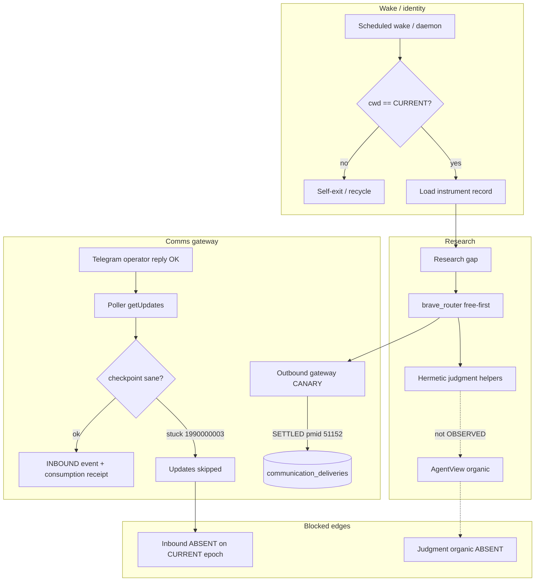

Status:      ACTIVE
as_of:       2026-09-09-1401 America/New_York (2026-09-09 14:01:48 UTC-04:00)
utc:         2026-09-09T18:01:48Z
Measured at: maturity-gap-closure-20260909 campaign evidence (PR #932 promote + D-live + inbound strict check)
Canonical campaign path: docs/CIO_AS_IS_2026-09-09-1401.md
Authority:   dated reading — not a behaviour spec; hermetic ≠ OBSERVED
Campaign:    /home/johnclaw/trade-ai-campaigns/maturity-gap-closure-20260909/
MBI_BEHAVIOR: 0
Supersedes:  thin package CIO_*_2026-09-09-1352.md and body-only emails
See also:    paired AS-IS / FUTURE / GAP / HONEST_MATURITY at stamp 2026-09-09-1401
             gold structural templates: CIO_ASIS_VS_SPEC_2026-09-09.md,
             CIO_FUTURE_STATE_FULL_MATURITY.md, CIO_ASIS_VS_FUTURE_GAP_2026-09-09.md

# CIO Agent — AS-IS (as-built) — 2026-09-09-1401

**Version stamp (America/New_York):** `2026-09-09-1401` (`2026-09-09 14:01:48 UTC-04:00`)  
**UTC:** `2026-09-09T18:01:48Z`


```
LEGEND (status icons — use consistently across AS-IS / FUTURE / GAP)
  █  OBSERVED_LIVE     scheduled or live path; durable output verified on CURRENT epoch
  ◈  INTEGRATED        wired end-to-end on serving SHA (producer→store→consumer)
  ◇  DOCKED            code + schema on CURRENT; consumer or organic proof incomplete
  ▓  PARTIAL           runs, but incomplete / degraded / consumer unproven
  ░  UNWIRED           code exists and is correct; nothing calls it or consumes it
  ◌  HERMETIC_ONLY     tests/helpers PASS; must NOT be quoted as OBSERVED
  ▒  DOCUMENTATION_ONLY docs/helpers without producer+consumer+organic evidence bar
  ✗  ABSENT / DARK     never executed, no producer, or produces nothing in recorded history
  ⛔ BLOCKED           structural/policy blocker (grant scope, secret, stuck checkpoint, etc.)
  M5_CANDIDATE         scheduled + unattended proven; durability OBSERVED clause still open
```


## Pin / SHA context (authoritative)

| Field | Value |
|---|---|
| Served CURRENT release | `e651b2d77-main-exact-phase2-20260909-131901` |
| Served BUILD_SHA / pin | `e651b2d771a9cf5136ca6c4b56923672cfb91f95` |
| `origin/main` (PR #932 merged) | `e651b2d771a9cf5136ca6c4b56923672cfb91f95` |
| Poller | **On CURRENT** (`poller_on_current=true`; pid observed on release cwd) |
| Research router | Canonical `brave_router.py` **◈ INTEGRATED**; obsolete `brave_research_router.py` **✗ ABSENT** |
| D-live outbound | **█ OBSERVED_LIVE** gateway SETTLED `pmid=51152` / `dlv_01a08749-8a95-7060-8ad9-967e939801e3` (classification `maturity_gap_d_live`, not controlled_canary) |
| D-live inbound | **⛔ BLOCKED / ✗ ABSENT on CURRENT epoch** — no INBOUND events + no consumption receipts after outbound; DB checkpoint stuck at `committed_update_id=1990000003` (updated 2026-09-08 18:33 ET) so `getUpdates` offset skips real Telegram update_ids |
| Drive Kersta 13/13 | **⛔ BLOCKED / ✗ ABSENT** — `drive` not a grantable guard scope; sync path needs never-grantable credential material |
| Grants at measure | `git-push` active; `telegram` active (`18be15fa78ad418e`); `release-write` exhausted after promote; `drive` request `9116e651b672ddf4` ungrantable |
| PR | https://github.com/PatsKiller/tardeai/pull/932 |
| Evidence archive | `evidence/maturity_gap_post_deploy_20260909T172146Z.tar.gz` sha256 `a8bf6bc44ed8fcce61b917d03d44d5b0f5be2ac2628b7f57adbb14d9105cece4` |

---

## Architecture diagram — CURRENT as-built (maturity-gap era)

```
                        REAL TRADE AI EVENT
                                  │
          ┌───────────────────────┼────────────────────────┐
          │                       │                        │
    █ Security/Ticker      █ Sector/Industry        ▓ Catalyst
          └───────────────────────┼────────────────────────┘
                                  │
                                  ▼
                       ✗ OPERATOR TURN STORE
              (S0 / operator_turns still dark — inherits prior reading)
                                  │
                                  ▼
                    █ CANONICAL ENTITY / IDENTITY
                                  │
                                  ▼
                         █ MATERIALITY   S1–S7
                                  │
                                  ▼
                         ▓ GRAPH IMPACT
                                  │
                                  ▼
┌─────────────────────────────────────────────────────────────────────┐
│              ▓ INSTRUMENT RECORD @v1   (persistent unit)            │
│   █ subject_key · thesis · cc_narrative                             │
│   █ research[] / artifact_ids                                       │
│   ✗ operator_turns[]                                                │
│   ▓ lessons[]                 mostly RESEARCH_DERIVED               │
│   ◇ commitments[] / priors / scored_lessons[]   DOCKED schemas;     │
│                                               organic instances ✗   │
│   M5_CANDIDATE load-by-subject (durability OBSERVED still open)     │
└─────────────────────────────────────────────────────────────────────┘
                                  │
                                  ▼
                        █ RESEARCH GAP (gap vs record)
                                  │
                                  ▼
                ┌──── FREE-FIRST RESEARCH ─────┐
    █ Persistent cognition          ▓ Hermes / RAG / FRED
      lessons · thesis              ▒ librarian index still thin
    ◈ brave_router.py (canonical)   ✗ obsolete research router ABSENT
                └──────────────┬───────────────┘
                               ▼
              ◌ JUDGMENT helpers (AgentView@v1 + critic)  HERMETIC_ONLY
                 (lanes G/H) — no organic OBSERVED producer on CURRENT
                               │
                               ▼
              ◌ COMMITMENTS / OUTCOMES validators         HERMETIC_ONLY
                               │
                               ▼
              ◌ SCORING / calibration store               HERMETIC_ONLY
                               │
                               ▼
                   █ CIOOperatorProduct@v1 (deterministic surfaces)
                               │
                               ▼
┌────────────────── COMMS / GATEWAY (Lane D) ─────────────────────────┐
│  ◈ Delivery ledger + gateway CANARY path on CURRENT                 │
│  █ OUTBOUND SETTLED  pmid=51152  owner=gateway  (OBSERVED_LIVE)    │
│  ⛔ INBOUND consumption  blocked by stuck checkpoint / no receipts  │
│  ◈ Poller identity self-exit + recycle onto CURRENT (DEPLOYED)      │
│  ◌ D-dry hermetic PASS (not organic)                                │
└─────────────────────────────────────────────────────────────────────┘
                               │
                               ▼
              ◌ SELF-REPAIR proposal + identity recycle   PARTIAL
                 (controlled recycle OBSERVED; full detect→PR→verify ✗)
                               │
                               ▼
  █ MBI_BEHAVIOR = 0   enforced this wave (no financial mutation)

┌─────────────────────────────────────────────────────────────────────┐
│  Process identity                                                   │
│    █ API / portfolio-server on CURRENT pin                          │
│    █ Poller cwd == CURRENT (re-verified)                            │
│    ◈ Dynamic _db_conn barrier (aa0cbb705) DEPLOYED via PR #932      │
│    ◈ Provenance quarantine registry DOCKED (synthetic wamid)        │
└─────────────────────────────────────────────────────────────────────┘
```

---

## Mermaid — live workflow (wake → research → comms → inbound)



---

## Domain census (maturity-gap honesty)

| # | Domain | Icon | Level | Note |
|---|---|---|---|---|
| 1 | Process identity (API+poller on CURRENT) | █ | OBSERVED_LIVE | Promote `e651b2d77-main-exact-phase2-20260909-131901`; poller match re-verified |
| 2 | Test DB barrier | ◈ | INTEGRATED | PR #932 / serving SHA |
| 3 | Cred resolve / provenance quarantine | ◇ | DOCKED | Implemented+tested; organic exclusion partial |
| 4 | Research canonical router | ◈ | INTEGRATED | Obsolete router ✗ |
| 5 | D-dry hermetic comms | ◌ | HERMETIC_ONLY | Not organic |
| 6 | D-live outbound SETTLED | █ | OBSERVED_LIVE | pmid `51152` |
| 7 | D-live inbound consumption | ⛔/✗ | BLOCKED/ABSENT | Checkpoint stuck; 0 receipts after outbound |
| 8 | Retention / curation | ▒ | DOCUMENTATION_ONLY | Evidence bar incomplete |
| 9 | Judgment AgentView+critic | ◌ | HERMETIC_ONLY | Lanes G hermetic |
| 10 | Commitments / outcomes | ◌ | HERMETIC_ONLY | Lane H hermetic |
| 11 | Scoring / calibration | ◌ | HERMETIC_ONLY | Lane I gated/hermetic |
| 12 | Self-repair E2E | ▓ | PARTIAL | Identity recycle done; full loop absent |
| 13 | Timed AS-IS/FUTURE/GAP docs | █ | OBSERVED_LIVE | This rich package |
| 14 | Drive Kersta 13/13 | ⛔/✗ | BLOCKED/ABSENT | Ungrantable `drive` + secret path |
| 15 | MBI_BEHAVIOR | █ | OBSERVED_LIVE | Remains 0 |

---

## Lane A–K disposition (this wave)

| Lane | Disposition | Icon |
|---|---|---|
| Wave 0 | Sealed charter/truth/claims | █ |
| A — barrier / isolation | Merged + deployed | ◈ |
| B — identity self-exit | Deployed + poller on CURRENT | █ |
| C — cred / provenance | Docked + tests | ◇ |
| D-dry | Hermetic PASS | ◌ |
| D-live outbound | OBSERVED SETTLED | █ |
| D-live inbound | Falsified on CURRENT epoch | ⛔ |
| E — promote/recycle | CURRENT `e651b2d77-main-exact-phase2-20260909-131901` | █ |
| F — retention helpers | Docs/helpers | ▒ |
| G — judgment hermetic | Hermetic only | ◌ |
| H — commitments hermetic | Hermetic only | ◌ |
| I — scoring hermetic | Hermetic only | ◌ |
| J — self-repair proposal | Partial (recycle effect) | ▓ |
| K — docs local | Rich package (this stamp) | █ |
| K — Drive 13/13 | Blocked | ⛔ |

---

## Workflow — what is proven vs hermetic

```
PROVEN ON CURRENT EPOCH
  promote → health/CIO accept → poller recycle → cwd match
  → gateway outbound SETTLED (pmid 51152)

HERMETIC / DOCKED (do not inflate)
  AgentView / commitments / scoring helpers
  D-dry suite
  provenance quarantine registry

MISSING EDGE (falsified)
  Telegram text "OK" → feed_telegram_update → INBOUND event
       → AgentConsumptionReceipt on CURRENT
  Cause: communication_inbound_checkpoint.committed_update_id = 1990000003
         (last update 2026-09-08 18:33 ET) → getUpdates offset skips real ids
```

## One-sentence AS-IS

**Serving identity is healthy and outbound D-live is OBSERVED; the inbound half of the comms loop is falsified on this epoch by a stuck checkpoint, cortex lanes remain hermetic-only, and Drive 13/13 is structurally blocked.**
