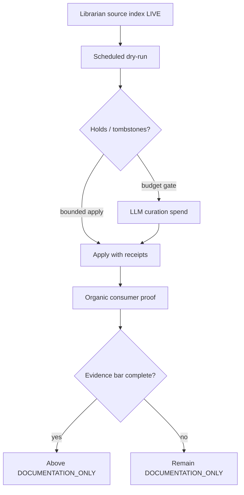

Status:      ACTIVE
as_of:       2026-09-09-1401 America/New_York (2026-09-09 14:01:48 UTC-04:00)
utc:         2026-09-09T18:01:48Z
Measured at: maturity-gap-closure-20260909 campaign evidence (PR #932 promote + D-live + inbound strict check)
Canonical campaign path: docs/CIO_FUTURE_2026-09-09-1401.md
Authority:   dated reading — not a behaviour spec; hermetic ≠ OBSERVED
Campaign:    /home/johnclaw/trade-ai-campaigns/maturity-gap-closure-20260909/
MBI_BEHAVIOR: 0
Supersedes:  thin package CIO_*_2026-09-09-1352.md and body-only emails
See also:    paired AS-IS / FUTURE / GAP / HONEST_MATURITY at stamp 2026-09-09-1401
             gold structural templates: CIO_ASIS_VS_SPEC_2026-09-09.md,
             CIO_FUTURE_STATE_FULL_MATURITY.md, CIO_ASIS_VS_FUTURE_GAP_2026-09-09.md

# CIO Agent — FUTURE (full maturity target) — 2026-09-09-1401

**Version stamp (America/New_York):** `2026-09-09-1401` (`2026-09-09 14:01:48 UTC-04:00`)  
**UTC:** `2026-09-09T18:01:48Z`


```
LEGEND (status icons — use consistently across AS-IS / FUTURE / GAP)
  █  OBSERVED_LIVE     scheduled or live path; durable output verified on CURRENT epoch
  ◈  INTEGRATED        wired end-to-end on serving SHA (producer→store→consumer)
  ◇  DOCKED            code + schema on CURRENT; consumer or organic proof incomplete
  ▓  PARTIAL           runs, but incomplete / degraded / consumer unproven
  ░  UNWIRED           code exists and is correct; nothing calls it or consumes it
  ◌  HERMETIC_ONLY     tests/helpers PASS; must NOT be quoted as OBSERVED
  ▒  DOCUMENTATION_ONLY docs/helpers without producer+consumer+organic evidence bar
  ✗  ABSENT / DARK     never executed, no producer, or produces nothing in recorded history
  ⛔ BLOCKED           structural/policy blocker (grant scope, secret, stuck checkpoint, etc.)
  M5_CANDIDATE         scheduled + unattended proven; durability OBSERVED clause still open
```


## The four additions (unchanged bar)

```
THE FOUR ADDITIONS

  ①  JUDGMENT        AgentView@v1 — gated, costed, critique-graded, organic on serving SHA
  ②  COMMITMENT      AGENT_COMMITMENT@v1 — falsifier + horizon + bound checkpoint
  ③  SCORING         outcomes settle claims → move priors; REFUTED never hidden
  ④  SELF-REPAIR     detect → propose → PR → approve → deploy → verify-by-effect

Everything below marked ◆ is the maturity delta vs today's nervous system.
Hermetic PASS never satisfies these bars. controlled_canary ≠ organic SETTLED.
```

---

## Target architecture diagram (per maturity level)

```
                        REAL TRADE AI EVENT
                                  │
          ┌───────────────────────┼────────────────────────┐
      Security/Ticker        Sector/Industry            Catalyst
          └───────────────────────┼────────────────────────┘
                                  │
                                  ▼
                         OPERATOR  (also an event)
              question · ack · defer · reject · /cio · OK replies
                                  │
                    ◆ AGENT ASKS TOO
                      two-way; blocks on material conflict
                                  │
                                  ▼
                       S0_OPERATOR_CONVERSE  (turn store LIVE)
                                  │
                                  ▼
                      CANONICAL ENTITY / IDENTITY
                                  │
                                  ▼
                           MATERIALITY  ·  GRAPH IMPACT
                                  │
                                  ▼
┌─────────────────────────────────────────────────────────────────────┐
│                  INSTRUMENT RECORD @v1                              │
│   thesis · cc_narrative · research[] · operator_turns[]             │
│   ◆ commitments[] · priors · scored_lessons[]                       │
│   ★ EVERY WAKE LOADS THIS RECORD FIRST — OBSERVED unattended        │
└─────────────────────────────────────────────────────────────────────┘
                                  │
                                  ▼
                          RESEARCH GAP (vs record AND priors)
                                  │
                                  ▼
                ┌──── FREE-FIRST RESEARCH ─────┐
       Persistent cognition            Hermes / RAG / FRED
       ◆ librarian grading LIVE        healthy engine pool
       ◈ brave_router only             organic receipts
                └──────────────┬───────────────┘
                               ▼
┌─────────────────────────────────────────────────────────────────────┐
│  ◆ ①  JUDGMENT LAYER                                                │
│    AgentView@v1 · critique · daily cap BEFORE call · real cost      │
│    organic producer on serving SHA — not hermetic-only              │
└─────────────────────────────────────────────────────────────────────┘
                               ▼
┌─────────────────────────────────────────────────────────────────────┐
│  ◆ ②  COMMITMENT                                                    │
│    AGENT_COMMITMENT@v1 + falsifier + horizon + checkpoint bind      │
│    MBI_BEHAVIOR stays 0 — belief never becomes an order             │
└─────────────────────────────────────────────────────────────────────┘
                               ▼
                       NOTIFICATION POLICY (all classes fire when due)
                               │
┌────────────────── COMMS LOOP (must be organic) ─────────────────────┐
│  ◆ OUTBOUND gateway SETTLED on CURRENT (already true for canary)    │
│  ◆ INBOUND: poller on CURRENT · sane checkpoint · consumption       │
│     receipt correlated to operator reply (e.g. OK ↔ pmid)           │
│  ◆ Quarantine synthetic provider ids; never ban the channel         │
└─────────────────────────────────────────────────────────────────────┘
                               ▼
┌─────────────────────────────────────────────────────────────────────┐
│  ◆ ③  SCORING                                                       │
│    CONFIRMED · REFUTED · EXPIRED → priors move; calibration open    │
└─────────────────────────────────────────────────────────────────────┘
                               ▼
┌─────────────────────────────────────────────────────────────────────┐
│  ◆ ④  SELF-REPAIR (continuous beside main loop)                     │
│    detect dark/unscheduled/split → PR for reversible fixes          │
│    verify by effect (CLEARED/INEFFECTIVE/WORSENED) not exit code    │
│    escalate money surfaces / irreversible work                      │
└─────────────────────────────────────────────────────────────────────┘
                               ▼
  ◆ Docs/Drive: timed AS-IS/FUTURE/GAP always rich; Kersta 13/13 hash-verified
  █ MBI_BEHAVIOR = 0
```

---

## Mermaid — FUTURE judgment → commitment → scoring → self-repair

```mermaid
flowchart LR
  subgraph L1 [① Judgment]
    E[Evidence + record + priors] --> V[AgentView@v1]
    V --> C{Critique pass?}
    C -->|yes| VIEW[Persisted view]
    C -->|no| DROP[Refuse / ask operator]
  end
  subgraph L2 [② Commitment]
    VIEW --> CM[AGENT_COMMITMENT + falsifier]
    CM --> CK[Bound OutcomeCheckpoint]
  end
  subgraph L3 [③ Scoring]
    CK --> OUT[Organic outcome]
    OUT --> SC[CONFIRMED / REFUTED / EXPIRED]
    SC --> PR[Priors move]
  end
  subgraph L4 [④ Self-repair]
    DET[Detect dark/split/unscheduled] --> PROP[Propose PR]
    PROP --> DEP[Approve → deploy]
    DEP --> VER[Verify by effect]
  end
  PR --> DET
```

---

## Mermaid — FUTURE retention / curation loop



---

## Build-order status vs maturity-gap AS-IS

| step | FUTURE target | AS-IS at `2026-09-09-1401` | Remaining |
|---|---|---|---|
| 1 | Every wake loads record (OBSERVED) | M5_CANDIDATE / inherits | Durability OBSERVED |
| 2 | Outcomes resolve + bind commitments | PARTIAL spine | Bind + score |
| 3 | Judgment organic | ◌ HERMETIC_ONLY | Producer + spend policy |
| 4 | Commitments instances | ◌ / ✗ | Write site + organic |
| 5 | Scoring moves priors | ◌ / ✗ | Prior store + scorer |
| 6 | Self-repair loop | ▓ partial recycle | Full detect-PR-verify |
| C | Comms inbound organic | ⛔ checkpoint stuck | Repair checkpoint + prove OK receipt |
| K | Drive 13/13 | ⛔ | Policy-legal auth path |

## Acceptance language (never dilute)

1. Daily brief says something new and names why.
2. A commitment settles visibly whether right or wrong.
3. Agent asks an unexpected question on conflict.
4. Calibration line exists for stated confidences.
5. Overnight break → fix or honest can't-fix report.
6. Inbound operator reply leaves a consumption receipt on CURRENT.
7. Drive Kersta hash parity 13/13 without inventing scopes.

None of these can be satisfied by hermetic tests or thin bullet docs alone.
