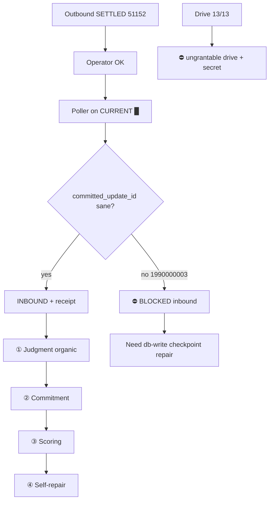

Status:      ACTIVE
as_of:       2026-09-09-1401 America/New_York (2026-09-09 14:01:48 UTC-04:00)
utc:         2026-09-09T18:01:48Z
Measured at: maturity-gap-closure-20260909 campaign evidence (PR #932 promote + D-live + inbound strict check)
Canonical campaign path: docs/CIO_GAP_2026-09-09-1401.md
Authority:   dated reading — not a behaviour spec; hermetic ≠ OBSERVED
Campaign:    /home/johnclaw/trade-ai-campaigns/maturity-gap-closure-20260909/
MBI_BEHAVIOR: 0
Supersedes:  thin package CIO_*_2026-09-09-1352.md and body-only emails
See also:    paired AS-IS / FUTURE / GAP / HONEST_MATURITY at stamp 2026-09-09-1401
             gold structural templates: CIO_ASIS_VS_SPEC_2026-09-09.md,
             CIO_FUTURE_STATE_FULL_MATURITY.md, CIO_ASIS_VS_FUTURE_GAP_2026-09-09.md

# CIO Agent — GAP (AS-IS vs FUTURE) — 2026-09-09-1401

**Version stamp (America/New_York):** `2026-09-09-1401` (`2026-09-09 14:01:48 UTC-04:00`)  
**UTC:** `2026-09-09T18:01:48Z`


```
LEGEND (status icons — use consistently across AS-IS / FUTURE / GAP)
  █  OBSERVED_LIVE     scheduled or live path; durable output verified on CURRENT epoch
  ◈  INTEGRATED        wired end-to-end on serving SHA (producer→store→consumer)
  ◇  DOCKED            code + schema on CURRENT; consumer or organic proof incomplete
  ▓  PARTIAL           runs, but incomplete / degraded / consumer unproven
  ░  UNWIRED           code exists and is correct; nothing calls it or consumes it
  ◌  HERMETIC_ONLY     tests/helpers PASS; must NOT be quoted as OBSERVED
  ▒  DOCUMENTATION_ONLY docs/helpers without producer+consumer+organic evidence bar
  ✗  ABSENT / DARK     never executed, no producer, or produces nothing in recorded history
  ⛔ BLOCKED           structural/policy blocker (grant scope, secret, stuck checkpoint, etc.)
  M5_CANDIDATE         scheduled + unattended proven; durability OBSERVED clause still open
```


Paired AS-IS: `CIO_AS_IS_2026-09-09-1401.md`  
Paired FUTURE: `CIO_FUTURE_2026-09-09-1401.md`

---

## Gap matrix (same legend)

| Domain | AS-IS icon | FUTURE icon | Gap / blocker |
|---|---|---|---|
| Process identity | █ | █ | Closed for this promote — must hold on every future promote |
| Test DB barrier | ◈ | ◈ | Closed (PR #932) |
| Cred / provenance | ◇ | ◈ | Expand call sites; organic exclusion proof |
| Research router | ◈ | ◈ + organic receipts | Organic receipt bar open |
| Comms outbound | █ pmid 51152 | █ organic SETTLED | Closed for this canary; keep honesty |
| Comms inbound | ⛔/✗ | █ consumption on CURRENT | **Open** — stuck checkpoint `1990000003`; needs db-write repair + re-prove OK |
| Retention/curation | ▒ | █ PROVEN loop | Full evidence bar |
| Judgment | ◌ | █ organic AgentView | Producer + cost policy |
| Commitments | ◌/✗ | █ instances | Write site + organic |
| Scoring | ◌/✗ | █ priors move | Prior store + scorer |
| Self-repair | ▓ | █ loop | Detect-PR-verify continuous |
| Docs trio (rich) | █ this stamp | █ always | Closed for this email wave |
| Drive 13/13 | ⛔/✗ | █ hash parity | **Open** — `drive` not grantable; secret path never-grantable (`9116e651b672ddf4`) |

---

## Workflow diagram — missing edges highlighted

```
AS-IS path (what works)
  wake/identity █ ──► research router ◈ ──► outbound gateway █ SETTLED
                                              │
                                              ▼
                                         pmid 51152
                                              │
FUTURE requires                              │
                                              ▼
                                         operator OK
                                              │
                                              ▼
                                    poller getUpdates
                                              │
                                    ┌─────────┴─────────┐
                                    │                   │
                              sane checkpoint      stuck 1990000003
                                    │                   │
                                    ▼                   ▼
                         INBOUND+receipt █        ⛔ SKIP / ABSENT  ← YOU ARE HERE
                                    │
                                    ▼
                         judgment/commit/score ◆
```



---

## Four additions — gap at a glance

| # | FUTURE | AS-IS now | Gap |
|---|---|---|---|
| ① Judgment | organic AgentView | ◌ hermetic helpers | **Full** (code docked, organic absent) |
| ② Commitment | instances + falsifier | hermetic validators | **Full** |
| ③ Scoring | priors move | hermetic store | **Full** |
| ④ Self-repair | continuous loop | partial recycle brick | **Large** (one brick, not the loop) |

---

## Lane A–K gap disposition

| Lane | Closed? | Residual gap |
|---|---|---|
| 0 / A / B / E | Yes for this wave | Hold identity on every promote |
| C | Partial | Organic provenance proof |
| D-dry | Yes as hermetic | Must not count as OBSERVED |
| D-live out | Yes | — |
| D-live in | **No** | Checkpoint repair + OK receipt |
| F | No | Evidence bar |
| G/H/I | No | Organic producers |
| J | Partial | Full E2E |
| K docs | Yes (rich package) | Keep richness rule |
| K Drive | **No** | Native path: not `drive` scope — need operator-legal alternative (e.g. human-run sync or grantable scope that does not read never-grantable secrets from agent) |

---

## Native requests still needed (exact)

1. **Inbound repair:** `db-write` (or operator-run SQL) to reset `communication_inbound_checkpoint.committed_update_id` to a sane Telegram update_id, then re-verify poller consumes OK → INBOUND + receipt on CURRENT. Telegram grant `18be15fa78ad418e` already covers send/consume once checkpoint is sane.
2. **Drive 13/13:** request `9116e651b672ddf4` minted as `scope=drive` but **`drive` is not in grantable ALL_TIERS**. Sync scripts also read never-grantable credential material. Native need: operator-executed sync **or** a grantable scope that does not invent `drive` and does not require agent `secret` reads.

---

## One paragraph

Maturity-gap closure **closed identity + outbound D-live** on `e651b2d771a9cf5136ca6c4b56923672cfb91f95` and shipped hermetic cortex helpers, but the **inbound edge is falsified** (stuck checkpoint), **Drive 13/13 is structurally blocked**, and ①–④ remain **hermetic or absent**. Distance to FUTURE is dominated by inbound repair, organic cortex producers, retention evidence bar, and a policy-legal Drive path — not by missing ASCII docs.
