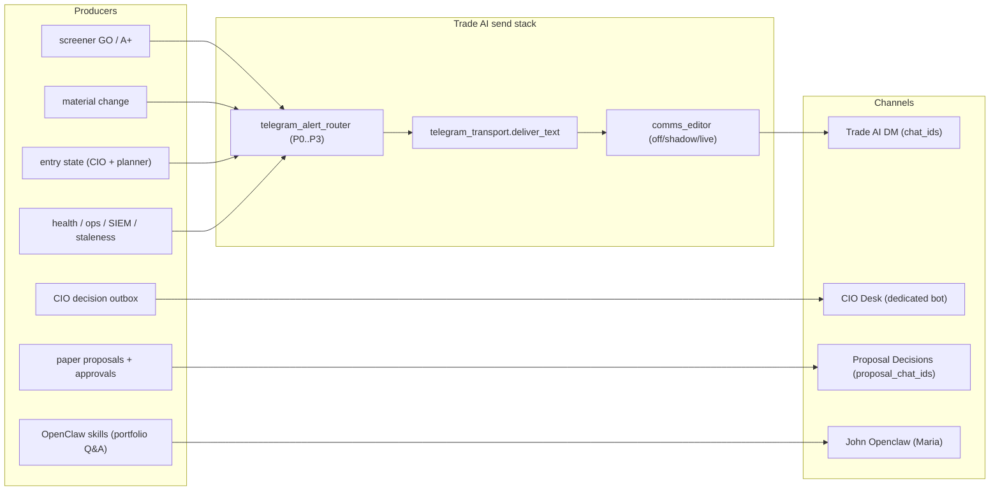

Status:      ACTIVE
as_of:       2026-09-16 17:59 EDT (2026-09-16T21:59:31Z) — Revision 7
Measured at: served pin `61d67f635` (release `61d67f635-main-exact-phase2-20260916-173155`); origin/main `03b8ce9e7`; four-channel ChatExport corpus `[VERIFIED]`
Canonical repo path: docs/architecture/maturity_gap_closure_20260916/CIO_AS_IS_2026-09-16-1759.md
Authority:   dated reading of LIVE / DOCKED / PARTIAL / HERMETIC / DOCUMENTATION_ONLY for the Telegram four-channel curation subject — not a behaviour spec
Supersedes:  Revision 6 (Word/PDF lifecycle package `word_package_rev6_2026-09-16_1719ET`); the CIO maturity doc series `CIO_ASIS_VS_SPEC_2026-09-09.md` for the Telegram-adjacent nodes
See also:    docs/architecture/maturity_gap_closure_20260916/CIO_FUTURE_2026-09-16-1759.md
             docs/architecture/maturity_gap_closure_20260916/CIO_GAP_2026-09-16-1759.md
             docs/architecture/maturity_gap_closure_20260916/HONEST_MATURITY_ASSESSMENT_2026-09-16-1759.md
             docs/ops/telegram_channel_diligence_20260916/ (00–07)
             AGENTS.md §9.1 §12 §13.4

# CIO Agent — Telegram four-channel curation: AS-IS (Revision 7, 2026-09-16)

**Subject.** The operator asked for Telegram four-channel curation to a **10/10 maturity target**.
This is the honest current-state reading of the four outbound Telegram surfaces and the seven
diligence dimensions, as of the served pin. It is **not** a fresh census of the whole CIO maturity
spine — it is scoped to the Telegram channel work, re-measured against the live corpus.

```
LEGEND (status icons — used consistently across AS-IS / FUTURE / GAP / ASSESSMENT)
  █  OBSERVED_LIVE     scheduled or live path; durable output verified on the served epoch
  ◈  INTEGRATED        wired end-to-end on the serving SHA (producer → store → consumer)
  ◇  DOCKED            code merged on origin/main; not yet on the served pin / organic proof incomplete
  ▓  PARTIAL           runs, but incomplete / degraded / consumer unproven
  ░  UNWIRED           code exists and is correct; nothing calls it or consumes it
  ◌  HERMETIC_ONLY     tests/helpers PASS; must NOT be quoted as OBSERVED
  ▒  DOCUMENTATION_ONLY docs/helpers without producer + consumer + organic evidence
  ✗  ABSENT / DARK     never executed, no producer, or produces nothing in recorded history
  ⛔  BLOCKED           structural/policy blocker (grant scope, secret, operator action, etc.)
```

---

## Pin / SHA context (authoritative)

| Field | Value |
|---|---|
| Served `SOURCE_COMMIT` | `61d67f635a665ed83eec7bc5d0ac887cba507321` `[VERIFIED]` (cat SOURCE_COMMIT) |
| Served `BUILD_SHA` / `GIT_SHA` | `61d67f635a665ed83eec7bc5d0ac887cba507321` `[VERIFIED]` |
| Served release dir | `61d67f635-main-exact-phase2-20260916-173155` (PRs #1052 + #1053) `[VERIFIED]` |
| `CURRENT` symlink | → `61d67f635-main-exact-phase2-20260916-173155` `[VERIFIED]` (`readlink -f`) |
| `origin/main` | `03b8ce9e7fd8a7681409f5a79c9c4a9da781ddfb` (PR #1049 merge, 17:51 ET) `[VERIFIED]` |
| Deploy receipt | `/home/johnclaw/.local/state/cio-phase2-exact-main/deploy_receipt.json` → `deployed_sha` = `61d67f635…`, `ok: true` `[VERIFIED]` |

**The one fact that orders this whole reading:** `origin/main` is **ahead** of the served pin by
PR #1049 — the entire Telegram four-channel diligence package (`docs/ops/telegram_channel_diligence_20260916/00–07`)
**and** the B-phase code (STOP HEALTH batch + held labels) are merged to main but **not** promoted.
The B-phase code does **not** exist in the served release tree.

```
[VERIFIED] served scripts/lib/telegram_rich.py:  grep HELD/holdings_universe → no matches
[VERIFIED] served scripts/stop_health_check.py:   per-symbol _send_telegram in the loop (no batch)
[CODE]     origin/main scripts/lib/telegram_rich.py:214 held_pill(); go_alert/entry_alert carry held
[CODE]     origin/main scripts/stop_health_check.py:213  batch list → single batched card
```

---

## The four channels (measured corpus — `[VERIFIED]`)

Source: `~/Downloads/Telegram Desktop/ChatExport_2026-09-16*` → `messages*.html`, parsed
`docs/ops/telegram_channel_diligence_20260916/04`.

| Channel | Bot / code identity | Texts | Distinct | Duplicate copies | Rate |
|---|---|---|---|---:|---:|
| Trade AI DM | `tradeai_bigjohn718_bot` → `tg_chat_ids.chat_ids()` | 1456 | 1125 | 331 | **22.7%** (→ 2.4% post-fix) |
| CIO Desk | dedicated CIO bot | 194 | 194 | 0 | **0%** |
| TradeAI Proposal Decisions | `proposal_chat_ids()` (same `tradeai_bigjohn718_bot`) | 181 | 50 | **131** | **72%** |
| John OpenClaw | `bigjohn_openclaw_bot` → Maria | 24 | 24 | 0 | **0%** |

DM windowed dup: pre-fix (25 Aug–13 Sep) **31.8%** → post-fix (13–16 Sep) **2.4%** `[VERIFIED]`.
Proposal Decisions: **131 of 181** texts are copies of 8 texts — 87× `holdings write BLOCKED`,
43× the same AES `STOP WARNING` `[VERIFIED]`. That export ends 11 Sep (**pre** the 09-14 routing
split), so a post-09-14 re-export is still required to prove the fix on that channel.

---

## Routing architecture (served epoch)



```
                    ┌──────────────────────────────────────────────────────────────┐
                    │   FOUR CHANNELS — SERVED-EPOCH ROUTING (Revision 7)           │
                    └──────────────────────────────────────────────────────────────┘

 █ Trade AI DM  (chat_ids)          █ CIO Desk  (dedicated CIO bot)    █ Proposal Decisions
   █ GO/A+ IMMEDIATE                  █ CIO decision cards              █ paper proposals + approve
   █ material change IMMEDIATE        █ act-now dispositions             █ (proposal_chat_ids)
   █ ENTRY IMMEDIATE (was P2)         █ CIO Q&A                         ✗ NO health/holdings (fixed 09-14)
   ▓ health/stop/watch/brief mix      ✗ NO "Run Complete" (fixed 09-14)   (pre-fix 72% dup — unproven post)
                                                                        █ John OpenClaw (Maria)
   Router: classify_alert → P0/P1/P2/P3                                 █ portfolio Q&A + skills only
   █ P0_INTERRUPT · P1_DIGEST · ▓ P2/P3 CC/dashboard (not phone)        ✗ no Trade-AI alert fan-out
```

**What is already true on the served epoch `[CODE]` + `[VERIFIED]`:**
- Routing split: `chat_ids()` = DM only, `proposal_chat_ids()` = proposals only — guarded by
  `tests/test_tg_chat_routing_20260914.py` `[CODE]`.
- Four delivery classes: `IMMEDIATE · DIGEST · COMMAND_CENTER_ONLY · SUPPRESSED`
  `[CODE]` `scripts/lib/cio_notification_signal.py:56-58`.
- ENTRY alert routes IMMEDIATE (was P2) `[CODE]` `scripts/operator_alert_policy_v2.py`.
- GO cards deep-link to Trading Hub `/v3/trading?tab=Scalp` `[CODE]` `scripts/lib/telegram_rich.py`.
- Comms Editor is `live` on the host `[VERIFIED]` (`~/.config/tradeai/comms_editor_mode` = `live`).
- CIO "Run Complete" suppression: last occurrence **14 Sep**; 0% since `[VERIFIED]`.

---

## The seven diligence dimensions — AS-IS score and status

`docs/ops/telegram_channel_diligence_20260916/07` defines the scorecard. Current → 10.

| # | Dimension | Now | AS-IS status | To reach 10 (acceptance) |
|---|---|---:|---|---|
| D1 | Right channel, right message | **4** | ▓ Proposal Decisions wrong pre-fix (72% dup); CIO Desk + OpenClaw right; DM catch-all | periodic 4-channel re-export shows zero misroutes; code-gate CIO-origin + proposals-only |
| D2 | Dedupe / no-repeat | **7** | █ DM 2.4% post-fix; Proposal Decisions unproven post-fix | 0 duplicates; idempotency key `(producer, type, subject, observation_version)` |
| D3 | Signal-to-noise | **6** | ▓ orphaned STOP HEALTH per-symbol; watch-cross + reaper noise | every IMMEDIATE actionable; non-actionable → digest/CC |
| D4 | Actionability | **5** | ▓ no held/not-held triage label on served pin | action + falsifier + evidence on every phone message |
| D5 | Content completeness (have→present) | **3** | ✗ standing book never surfaced on phone | daily portfolio brief; earnings/dividend "this week" |
| D6 | Governance (written contract) | **1** | ▒ `02` APPROVED by operator; no code enforcement | contract test-enforced (fails on non-conforming producer) |
| D7 | Delivery observability | **6** | ▓ server receipts present; per-device state absent | per-device sync state + a monitor that fires on undelivered |

**Overall now: ~4–5 / 10. Target: 10 / 10.**

---

## B-phase code — merged to main, NOT served (the honest middle state)

| Step | Behaviour | Where it is | Status |
|---|---|---|---|
| B1 | Dedupe morning-command brief (one/day) | resolved 09-14 | █ OBSERVED_LIVE (session context; pre-dates this package) |
| B2 | Collapse orphaned STOP HEALTH per-symbol → **one** batched card | `scripts/stop_health_check.py` `[CODE]` (origin/main) | ◇ DOCKED — merged `03b8ce9e7`; **not on served pin**; hermetic `tests/test_stop_health_batch_20260916.py` (93 lines) |
| B3 | HELD / NOT-HELD pill on GO/ENTRY | `scripts/lib/telegram_rich.py` `held_pill()` + `screener_go_alerts.py` + `watchlist_entry_planner.py` via `lib.holdings_universe` `[CODE]` | ◇ DOCKED — merged `03b8ce9e7`; **not on served pin**; hermetic `tests/test_held_label_20260916.py` (56 lines) |

`[CODE]` the held read fails soft: `held_equity_tickers()` wrapped in `try/except` so a failed
holdings read never costs the alert; `None` = "not determined, never guessed".

**B-phase is `HERMETIC_ONLY` in effect until promote**: tests are registered in
`scripts/run_cio_hardening_ci.py` (+4) and pass in CI, but the served `telegram_rich.py` and
`stop_health_check.py` predate the change. A hermetic PASS is **not** an OBSERVED send.

---

## The single accountable owner — a goal, registered but unproven

`[VERIFIED]` `data/cio/cio_goals.jsonl` carries a `GOAL_CREATED` event:

| Field | Value |
|---|---|
| `goal_id` | `goal_798ce2450f61` |
| `owner_agent` | `guardian` (single accountable owner; `cio` was the intended owner but is not a `VALID_OWNERS` entry — a roster gap) |
| `status` | `open` · `priority` HIGH · `wake_count` **0** |
| `created` | `2026-09-16T20:43:53.672594+00:00` |
| `success_criteria` | all seven dimensions at 10, re-measured, audit receipt committed |
| falsifier | a periodic 4-channel export showing any misroute / duplicate / non-actionable IMMEDIATE / missing standing-book content |

**Status: ◇ DOCKED.** The goal is registered and survives the session and the machine; the goal
loop's `GOAL_STATUS_CHANGED` counter is **0** over 37 days / 34,718 wakes — so no progress has
been measured against it yet. Registration is not curation.

---

## What the spec says and the system does not do (Telegram scope)

| Spec node | Reality (Revision 7, served `61d67f635`) |
|---|---|
| One channel per message family; CIO Desk = CIO-origin only | Appro**ved** contract (`02`); **no code gate** enforces it — enforcement is by review only |
| Proposal Decisions = proposals + approvals only | Fixed 09-14 in code; **72% dup pre-fix**, post-fix unproven (re-export pending) |
| IMMEDIATE is scarce; only capital-at-risk/operator action | Entry now IMMEDIATE; orphaned STOP HEALTH still fires per-symbol on the served pin |
| DIGEST is a window, not a queue | Enforced at router layer; volume budget (30/day) **not built** |
| Every phone message carries action + falsifier + evidence | Held/not-held label only on **main**, not served; no falsifier/action line standardization |
| The standing book is on the phone daily, matching CC | **Absent** — no scheduled portfolio brief; holdings/earnings/dividends never pushed |
| A monitor fires the moment a send is not delivered | Server receipts exist; **per-device sync state absent** |

---

## The one-sentence version

**The four channels are now correctly split in code and the corpus proves two of them are clean —
but the split is newer than the served release, the channel that was demonstrably broken
(Proposal Decisions, 72% duplicate) is the one not yet re-exported post-fix, and every forward
step (B-phase batch + held label, the guardian-owned goal, the portfolio brief) sits on `origin/main`
or in a plan, not on the phone.**

## The count that matters

**`0` of 7 dimensions are at 10; the guardian goal has `wake_count = 0`; and the B-phase code that
would close D2–D4 is not in the served release (`61d67f635`) — it is one merge ahead on
`origin/main` (`03b8ce9e7`).** The only empirically clean channels are CIO Desk and John OpenClaw
(0% dup each); the Trade AI DM is clean only after 13 Sep.

## What not to quote without re-measure

- Proposal Decisions post-fix dup rate — export ends 11 Sep; re-export required.
- Device membership table — unfilled by design (operator action).
- `GOAL_STATUS_CHANGED` — re-read before quoting; it was 0 at stamp.
- B-phase "live" — it is merged, not promoted; re-grep the served tree before calling it OBSERVED.
