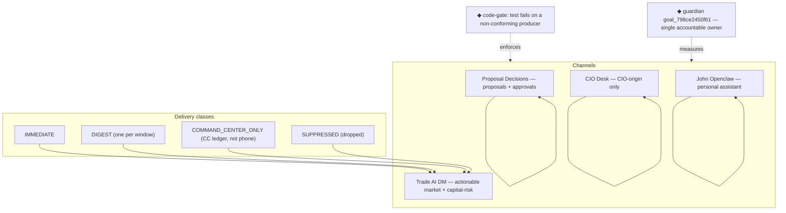

Status:      ACTIVE
as_of:       2026-09-16 17:59 EDT (2026-09-16T21:59:31Z) — Revision 7
Measured at: not measured — target spec, not runtime (Telegram four-channel curation to 10/10)
Canonical repo path: docs/architecture/maturity_gap_closure_20260916/CIO_FUTURE_2026-09-16-1759.md
Authority:   full-maturity target for the Telegram four-channel curation subject; bar = 10/10 on all seven dimensions
Supersedes:  Revision 6 (Word/PDF lifecycle package); the Telegram-adjacent sections of CIO_FUTURE_STATE_FULL_MATURITY_2026-09-09.md
See also:    docs/architecture/maturity_gap_closure_20260916/CIO_AS_IS_2026-09-16-1759.md
             docs/architecture/maturity_gap_closure_20260916/CIO_GAP_2026-09-16-1759.md
             docs/architecture/maturity_gap_closure_20260916/HONEST_MATURITY_ASSESSMENT_2026-09-16-1759.md
             docs/ops/telegram_channel_diligence_20260916/02_ROUTING_GOVERNANCE_PROPOSAL.md (APPROVED)
             docs/ops/telegram_channel_diligence_20260916/07_EXECUTION_PLAN.md
             AGENTS.md §9.1 §13.4

# CIO Agent — Telegram four-channel curation: FULL-MATURITY TARGET (Revision 7, 2026-09-16)

What "10/10 Telegram curation" means concretely. **The bar is 10/10 on all seven dimensions**,
each with a measurable acceptance test — not a feeling. Everything below marked ◆ is new; everything
else exists today in some form on `origin/main` or the served pin.

```
LEGEND
  █ OBSERVED_LIVE   (as measured on the served epoch — see AS-IS)
  ◈ INTEGRATED · ◇ DOCKED · ▓ PARTIAL · ░ UNWIRED · ◌ HERMETIC_ONLY · ▒ DOCUMENTATION_ONLY · ✗ ABSENT · ⛔ BLOCKED
  ◆  new (target state — not yet built)
  ★  proven-unattended (the organic proof the goal loop must produce)
```

---

## The target architecture — four channels, one contract



```
                    REAL TRADE AI EVENT (scanner / material / entry / stop / decision / proposal)
                                          │
        ┌───────────────┬───────────────┼────────────────┬───────────────────┐
        ▼               ▼               ▼                ▼                   ▼
   GO / A+         material change   ENTRY state     CIO decision        paper proposal
   (scalper)       (held-aware)      (planner)       (outbox)            (proposals)
        │               │               │                │                   │
        └───────┬───────┴───────┬───────┘                ▼                   ▼
                ▼               ▼                  █ CIO Desk          █ Proposal Decisions
        ◆ deterministic router: classify_alert → P0..P3                 (proposals only)
                │               │
     ┌──────────┴───────┐       └──────────┐
     ▼                  ▼                  ▼
 █ Trade AI DM     ▓ DIGEST            ✗ CC only
 (IMMEDIATE,      (one/window)        (scanner WAIT/AVOID,
  held-labelled)                       paper lifecycle noise)
                │
                ▼
     ◆ comms_editor (live) → delivery receipt + per-device sync state
                │
                ▼
     ★ FOUR-CHANNEL RE-EXPORT AUDIT  →  10/10 receipt, committed
```

---

## The seven dimensions — target definition (each "10" is measurable)

| # | Dimension | 10 = (measurable acceptance) | Built how |
|---|---|---|---|
| D1 | Right channel, right message | a periodic 4-channel re-export shows **zero** misroutes | code-gate CIO-origin + proposals-only; periodic audit job |
| D2 | Dedupe / no-repeat | **0** duplicate copies; every send idempotent by `(producer, type, subject, observation_version)` | B2 batch; idempotency-key audit |
| D3 | Signal-to-noise | every IMMEDIATE actionable; **all** non-actionable → digest/CC | orphaned STOP HEALTH → one digest; watch-cross + reaper → digest; volume budget |
| D4 | Actionability | every phone message carries action + falsifier + evidence; no telemetry on phone | held/not-held labels; action language on every card |
| D5 | Content completeness | standing book on phone daily, matching CC (holdings, exposures, cash, initiatives, earnings, dividends) | daily portfolio brief; earnings/dividend "this week" line; cash-posture line |
| D6 | Governance | contract approved **and** mechanically enforced by a test | code-gate CIO-origin + proposals-only; pinned by test |
| D7 | Delivery observability | per-device sync state + per-send receipt visible; a monitor fires the moment a send is not delivered | device inventory; per-device state in `/v3/communications`; delivery monitor |

**Success criterion (the goal):** all seven at 10, re-measured, with the audit receipt committed.

---

## The build order (dependency-ordered)

```
   A. verify      re-export Proposal Decisions post-09-14 → prove 72% → ~0
                  device-membership table → every device shows all 4 surfaces
                  approve 02 (DONE — operator "approve 2", 2026-09-16)
   B. quick fixes B1 morning-brief dedupe (DONE 09-14) · B2 STOP HEALTH batch (merged, not served)
                  B3 held label (merged, not served)
   C. surface     C1 daily portfolio brief · C2 earnings/dividend "this week" · C3 entry plans IMMEDIATE
   D. harden      D1 code-gate CIO-origin · D2 volume budget (30/day) · D3 per-device delivery check
```

---

## The single accountable owner — what "owned" means

- **Owner:** `guardian` (goal `goal_798ce2450f61`, `[VERIFIED]` GOAL_CREATED).
- **Thesis:** every message reaches the right channel, deduped, actionable, and complete against
  the standing book — measured 10/10 by the four-channel re-export audit.
- **Falsifier:** a periodic 4-channel export showing any misroute, duplicate, non-actionable
  IMMEDIATE, or missing standing-book content.
- **Acceptance:** all seven dimensions at 10, re-measured, audit receipt committed.

The deterministic router and editor **stay** — they are the mechanical floor. The goal task is what
holds one agent responsible for *continuously curating to perfection*, closing the gap between "the
rules exist" and "the channels are actually right." A deterministic rule cannot notice that Proposal
Decisions was 72% noise for weeks; an owner with a falsifier and a periodic re-measure can.

---

## The ◆ additions (net-new, in build order)

| ◆ | capability | today |
|---|---|---|
| ◆ code-gate | test fails on a non-CIO producer targeting CIO chat / a non-proposal producer targeting the group | ▒ DOCUMENTATION_ONLY (contract approved; no test) |
| ◆ volume budget | 30/day cap; over → digest; Ops exempt | ✗ ABSENT |
| ◆ per-device delivery | device → chat membership + send receipt visible in `/v3/communications` | ✗ ABSENT (table unfilled) |
| ◆ portfolio brief | daily holdings/exposures/cash/initiatives to DM | ✗ ABSENT |
| ◆ earnings/dividend line | "this week: earnings / dividends" for held names | ✗ ABSENT |
| ★ four-channel audit job | periodic re-export → zero-misroute receipt | ✗ ABSENT (manual export only) |

---

## How you would know it works, without asking anyone

1. A periodic four-channel export shows Proposal Decisions = proposals only, DM = approved
   categories only, CIO Desk = CIO-origin only — **zero** misroutes.
2. The phone carries the standing book daily (holdings, exposures, cash, this-week earnings/dividends)
   that matches Command Center.
3. An undelivered send fires a monitor the moment it happens, naming the device.
4. The goal loop's `GOAL_STATUS_CHANGED` counter is non-zero and tracks against
   `goal_798ce2450f61`.
5. A held/not-held label is on every GO/ENTRY card, and a failed holdings read renders "not
   determined" rather than guessing.

None of the five can be faked by a template or a hand-run.

## Non-goals / hard rails (unchanged)

- `MBI_BEHAVIOR = 0` — curation is labelling, batching, routing and surfacing; it never sizes,
  orders, stops, or writes to a broker.
- No model decides routing — deterministic `classify_alert` / `route_event` only.
- IMMEDIATE is scarce; `material_change` stays out of `CRITICAL_IMMEDIATE_TYPES`.
- OpenClaw never receives the Trade AI alert fan-out; if Trade AI needs OpenClaw, route a pointer,
  not the raw stream.

## Open dependencies (prerequisites, not the maturity body)

- Promote `03b8ce9e7` (B-phase) to the served pin — otherwise D2/D4 stay DOCKED.
- Post-09-14 re-export of Proposal Decisions (operator minutes).
- Device-membership inventory (operator minutes).
- The `cio` `VALID_OWNERS` roster gap in `scripts/lib/cio_goals.py` (guardian stands in).
