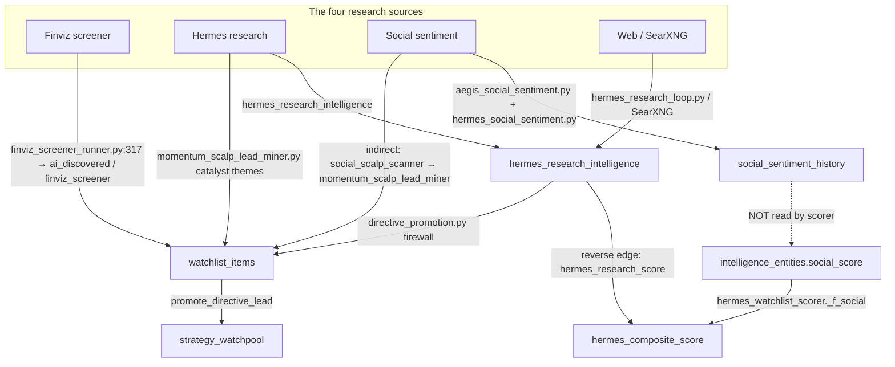

# Watchlist Lifecycle Audit — 2026-08-19

**Status:** Audit + documentation only (no code changes)
**Scope:** the watchlist's data model, its research sources vs. the day-scalp pipeline, its curation loop, and its idea-generation layer.
**Method:** static trace (three parallel codebase explorations) + read-only live DB snapshot at ~10:30 ET 2026-08-19.
**Sibling docs:** [DAY_SCALP_SOURCE_INVENTORY_2026-08-19](../diligence/current/DAY_SCALP_SOURCE_INVENTORY_2026-08-19.md), [TWO_WAY_WATCHLIST_CURATION](../cio/TWO_WAY_WATCHLIST_CURATION.md)

---

## 1. Executive summary

The watchlist **does use the same four research sources as the day-scalp pipeline (Finviz, Hermes, Social, Web) — but with asymmetric wiring.** Only **Finviz** writes watchlist membership *directly*. Social, Hermes, and Web reach the watchlist as *scoring/enrichment inputs* and through two *indirect* discovery paths (the two-way firewall and the lead miner) — not as first-class membership writers.

The **curation loop is real and two-way** (`scripts/lib/two_way_curation.py`): five desk sources curate *into* the watchlist, and realized outcomes fold *back* onto the same rows. This part is structurally mature and running.

**However, the live data shows the watchlist's *research* inputs are substantially degraded relative to the day-scalp pipeline**, and the "curate in new ideas" edge is **producing near-zero actual watchlist additions**. The headline live findings:

| # | Live finding | Severity |
|---|---|---|
| 1 | **Social is dead for the watchlist.** `intelligence_entities.social_score` is `NULL` for all 8,440 rows; the scorer's `_f_social` reads exactly that → factor drops for every name. `social_sentiment_history` is stale since **Aug 9** (only `reddit+brave`, 498 rows). | Critical |
| 2 | **Desk "curate in" is inert.** All five desk sources stage+drain (CIO 4,285; defense 127; advisory 80; rotation 21; reentry 169 in 7d) but have **0 promotions all-time** in `watch_directive_hits`. | Critical |
| 3 | **Hermes discovery inbox is stuck.** 644 `DISCOVERED` + 307 `CLUSTERED` sitting since **Jul 5**, only 79 `READY_FOR_REVIEW`, 1 approved. | High |
| 4 | **`candidate_discovery_events` is empty.** The 6-source discovery aggregator (finviz/social_scalp/news_catalyst/incubator/yahoo_movers/polygon) produces zero events — orphaned. | High |
| 5 | **No liveness monitoring** for the watchlist research sources (`brave_search`, `incubator`, `news_catalyst`, `polygon`, `newsapi`, `alpha_vantage`, `fmp`, `fred` all `unknown` in `data_source_health`). | High |
| 6 | **Opaque provenance dominance.** `ai_discovered`/`agent_discovery` = 10,025 of ~5,980 active rows (~75%); the governed Finviz/Hermes/desk sources are a minority. | Medium |

---

## 2. Data model

The canonical watchlist is **`watchlist_items`**, keyed `UNIQUE(symbol, source, COALESCE(bucket,''))`. Around it sit an upstream **incubator** pool, a promotion destination (**strategy_watchpool**), and ~10 `watchlist_*` analysis tables.

| Table | Purpose | DDL |
|---|---|---|
| `watchlist_items` | canonical curated membership | `linux_port_v2/linux/migrations/005_watchlist_workbench.sql:9` |
| `incubator_universe` | weekly-rolling candidate pool | `sql/migrations/20260506_2300_session19_weekly_incubator.sql:4` |
| `watch_directives` / `watch_directive_hits` | desk standing instructions + promotion ledger | `migrations/2026-06-08_watch_directives.sql:18,37` |
| `*_directive_hits_staging` (cio/advisory/defense/rotation/reentry) | two-way firewall staging | `migrations/2026-08-13_two_way_curation.sql:18,31,44` + `..._sources.sql:11,24` |
| `curation_loop_audit` | append-only provenance audit | `migrations/2026-08-13_two_way_curation.sql:77` |
| `hermes_discovery_candidates` / `_clusters` / `_audit` / `_feedback` | Hermes discovery inbox | `migrations/2026_07_05_hermes_discovery_inbox.sql:4,51,66,79` |
| `hermes_research_intelligence` | Hermes/SearXNG research staging | `sql/migrations/20260530_hermes_phase1_staging_tables.sql:31` |
| `watchlist_strategy_cards` | materialized strategy view (no DDL) | `scripts/materialize_watchlist_strategy_cards.py:307` |
| `strategy_watchpool` | promotion destination (no DDL in repo) | `scripts/strategy_watchpool.py`, `scripts/directive_promotion.py:244` |

**Key columns on `watchlist_items`** (from the migration chain): `source`, `status` (`active|queued|researching|researched|review|removed|promoted`), `origin_system`, `origin_detail`, `source_tier` (`core|trusted|…`), `in_directive_watch`, `provenance_reason`, `hermes_composite_score`/`hermes_rank`, reverse-edge columns `realized_outcome`/`thesis_win`/`options_edge_score`/`hermes_research_score`, and runtime `scope_tier` (`S0–S3`, owned by `scripts/lib/hermes_scope_governor/engine.py`, no DDL).

---

## 3. Source wiring — watchlist vs. day-scalp

### 3.1 Direct vs. indirect wiring

| Source | Watchlist membership (new names) | Watchlist scoring | Day-scalp role |
|---|---|---|---|
| **Finviz** | **Direct** — `finviz_screener_runner.py:317` (writes `ai_discovered`; also `finviz_screener` via `origin_system='finviz_screener_runner'`) | `technical_momentum` + `setup_quality` factors | screener → `trade_ai_scans` |
| **Social** | Indirect only (`social_scalp_scanner.py` → `momentum_scalp_lead_miner.py`) | **`hermes_watchlist_scorer._f_social`** reads `intelligence_entities.social_score/social_sentiment` | `social_sentiment_history` |
| **Hermes** | Indirect only (`directive_promotion.py` firewall) | reverse edge `hermes_research_score` (~5.5%) | `hermes_research_intelligence` |
| **Web / SearXNG** | Indirect only (same firewall) | via Hermes research edge | `hermes_research_intelligence` |

### 3.2 The dual social store (a wiring mismatch)

Two tables hold social sentiment, and the scorer reads the *wrong* one from the producers' perspective:

- **Producers write `social_sentiment_history`** — `aegis_social_sentiment.py:268`, `hermes_social_sentiment.py:187`.
- **Scorer reads `intelligence_entities.social_score`** — `hermes_watchlist_scorer.py:132-143` (`_f_social`), which returns `(None, None)` when `social_score is None and not social_sentiment`.

`intelligence_entities.social_score` is populated by `symbol_enrichment.py:677` (from `social_sentiment.get_social_sentiment_bulk`) and `seed_intelligence_entities.py:180`. Live, **0 of 8,440 rows have a `social_score`** — so the social factor is dropped for every watchlist name regardless of what lands in `social_sentiment_history`.

---

## 4. Live liveness snapshot (read-only, 2026-08-19 ~10:30 ET)

These are the authoritative "is it actually running" numbers.

- **`watchlist_items`** — 13,353 total; ~5,980 active. Top sources by active: `ai_discovered` 4,526, `topic_research` 601, `paper_proposal` 378, `pullback_macd` 93, `hermes` 77, `small_cap_rotation` 63, `finviz_screener` 60, `ai_watchlist` 55, `defense_desk` 26, `portfolio` 24, `trade_ai_go` 20, `prev_traded` 20, `static_universe` 16, `personal_watchlist` 13, `trade_ai` 5, `operator` 2, `discovery` 1.
- **`social_sentiment_history`** — `source_family='reddit+brave'` only, 498 rows, `last_obs` = **2026-08-09** (10 days stale). No `stocktwits`, no `hermes`.
- **`intelligence_entities`** — 8,440 rows, `max(social_score)=NULL`, **0 rows with `social_score`**.
- **`watch_directive_hits` all-time by `surfaced_by`** — hermes 131,154 (1,765 promoted); trade_ai 108,404 (147); operator 4,930 (121); reentry 169 (**0**); advisory 73 (**0**); defense 67 (**0**); cio 12 (**0**).
- **`curation_loop_audit` (7d)** — hermes_research `folded` 22,646; cio `staged`+`drained` 4,285 each; options `folded` 1,910; outcome `folded` 775; reentry 169; defense 127; advisory 80; rotation 21.
- **`hermes_discovery_candidates`** — DISCOVERED 644 (oldest **Jul 5**), CLUSTERED 307, READY_FOR_REVIEW 79, NEEDS_VALIDATION 11, APPROVED_RESEARCH_ONLY 1.
- **`hermes_research_intelligence`** — staged 1,003 (fresh, 10:29 today), promoted 9,562, rejected 2,480, archived 12,738.
- **`candidate_discovery_events`** — **0 rows** (empty).
- **`incubator_universe`** — 1,971 `ACTIVE/ROLLED_ON`, 3,308 `ROLLED_OFF`.
- **`data_source_health`** — `finviz` healthy (9:25 today); `sec_edgar` healthy; `youtube_api` healthy; `yahoo_finance` healthy (last success Aug 11); `finnhub` **error** (401, documented); the rest (`alpha_vantage`, `brave_search`, `fmp`, `fred`, `incubator`, `newsapi`, `news_catalyst`, `polygon`) are `unknown` — no reporter.

---

## 5. Curation loop (two-way)

`scripts/lib/two_way_curation.py` defines "two-way" as a closed, self-reinforcing loop:

- **FORWARD (curate in):** CIO situations (`S4_SECTOR_ROTATION`, `S5_CASH_DEPLOYMENT`, `S8_DEFENSIVE_REGIME`), Advisory verdicts (`ADD/TRIM/EXIT/RE_ENTER`), Defense cards (`get_into/income/short_side`), rotation ladders, and re-entry signals emit into **per-source staging tables**, then `watch_directives_service.py` drains them through `directive_promotion.promote_directive_lead()` under the app role.
- **REVERSE (learn back):** realized trade/paper outcomes write `realized_outcome` + `thesis_win`; options paper outcomes fold `options_edge_score`; Hermes research folds `hermes_research_score` — all back onto the same `watchlist_items` row.

Two parallel state machines govern promotion/demotion:

1. **`scope_tier`** S0–S3 (`config/hermes_scope_governor.yaml`, engine `scripts/lib/hermes_scope_governor/engine.py`): S0 pinned, S1 earned trigger, S2 warm pool, S3 archived; TTL + cap + outcome-driven.
2. **Lifecycle** `new→monitoring→watch→promoted|demoted→archived|blacklisted` (`config/hermes_watchlist_lifecycle.yaml`).

The **scorer** (`scripts/hermes_watchlist_scorer.py`) computes a 0–100 composite from 10 factors (analyst-heavy ~44%, social ~12%, news ~12%, sector ~12%, risk-reward ~10%, + reverse ~15.7%), drops missing factors, and renormalizes. Hygiene: `scripts/watchlist_hygiene.py` (weekly prune) and `scripts/incubator_rolloff_engine.py` (daily roll-off).

---

## 6. Idea generation layer

New-market-idea generation is substantial and mostly scheduled:

| Path | What it produces | Cadence |
|---|---|---|
| `scripts/claude_challenger_curator.py` | 100-name LLM thematic cohort, A/B-tested vs. Finviz | weekly (Sun 17:00) |
| `scripts/hermes_industry_novelty_discovery.py` | `GAP_CANDIDATE` rows (sectors in news but missing from coverage) | daily (04:25) |
| `scripts/lib/cio_sector_opportunity.py` | sector-momentum opportunity synthesis ("best candidates") | event-driven |
| `scripts/topic_curator.py` | LLM entity extraction from news → `topic_research` watchlist rows | 2×/day |
| `scripts/intel_auto_discovery.py` | ticker extraction from news/youtube/social → `ai_discovered` | 2×/day |
| `scripts/candidate_discovery_orchestrator.py` + `scripts/discovery_sources/*` | 6-source discovery-event feed | **orphaned (empty)** |
| `scripts/agent_watchlist_engine.py` | `agent_discovery_log` + proposal reviews | on-demand |

---

## 7. Findings (numbered)

1. **Social is a dead input to watchlist ranking.** `intelligence_entities.social_score` is empty (0/8,440); `_f_social` therefore returns `None` for every name. The social producers write a *different* table (`social_sentiment_history`) that the scorer never reads.
2. **`social_sentiment_history` is stale since Aug 9** and only carries `reddit+brave` — the Reddit 403 outage (Aug 17) plus the not-yet-applied StockTwits/Hermes fixes. This is the *same root cause* the day-scalp audit identified.
3. **Desk "curate in" stages+drains but never promotes.** `curation_loop_audit` shows healthy staging/drain volume for all five desks, but `watch_directive_hits` shows **0 promotions** for cio/advisory/defense/rotation/reentry all-time. The forward two-way edge is running without landing watchlist additions.
4. **Hermes discovery inbox has a 6-week backlog.** 644 `DISCOVERED` + 307 `CLUSTERED` frozen since Jul 5; only 1 ever reached `APPROVED_RESEARCH_ONLY`. The review/promotion stage is not consuming the inbox.
5. **`candidate_discovery_events` is empty** — the aggregator lane is orphaned (its only Finviz reporter, `candidate_discovery_orchestrator`, was noted orphaned in `crontab_backup.txt:759`).
6. **Watchlist research sources have no liveness monitoring.** Most `data_source_health` rows are `unknown`; only finviz/sec_edgar/youtube_api/yahoo_finance have active reporters. No source-aware auto-remediation exists for the discovery/social/web lanes (unlike the day-scalp sources hardened on this branch).
7. **Provenance is opaque and concentrated.** `ai_discovered`/`agent_discovery` = 10,025 rows (~75% of active watchlist); the governed Finviz (60 active), Hermes (77), and desk sources are a small minority. `agent_discovery` origin is not clearly attributable to any single script.
8. **Finviz contributes far fewer watchlist rows than expected.** Despite being the only *direct* membership writer, `finviz_screener`/`finviz_screener_runner` accounts for only 60 active rows vs. 4,526 `ai_discovered`.

---

## 8. Gaps vs. the final goal

> Goal: the watchlist uses the **same sources for research** as the day-scalp pipeline, is **curated into new market ideas** for research, and surfaces **what should be added** to the watchlist.

**Gap A — Social is not a working research source for the watchlist (Critical).**
The watchlist is supposed to use social sentiment, but the scorer reads an empty column and the producers write an unread table. Fix requires (a) applying the already-built StockTwits/Hermes social fixes with `--apply` + cron, and (b) reconciling `social_sentiment_history` → `intelligence_entities.social_score` (or pointing `_f_social` at the populated store).

**Gap B — The "curate in" edge produces zero watchlist additions (Critical).**
The two-way forward loop drains but never promotes. The desk sources do not actually add new names to the watchlist today. Needs a root-cause trace of why `promote_directive_lead` returns terminal non-promote statuses (scalp firewall? tier gate? `MONITORED_NO_QUALIFY` dominance) for desk-sourced leads.

**Gap C — Idea-generation is Finviz/screener-centric, not "same sources" (High).**
Challenger/novelty/topic discovery mostly orbit the screener + news. There is no first-class lane that turns **Hermes forum/web research** and **social momentum** into *new watchlist candidates* the way the day-scalp `social_scalp_scanner`/`momentum_scalp_lead_miner` do.

**Gap D — Discovery funnel is stalled end-to-end (High).**
`candidate_discovery_events` empty + 6-week Hermes inbox backlog = the "what should be added" surface is not being fed reliably.

**Gap E — No self-healing for watchlist research sources (High).**
Unlike the day-scalp pipeline (now with `report_source` + source-aware `data_source_stale` remediation), the watchlist's social/web/incubator/polygon/brave lanes have no liveness markers and no auto-retry.

**Gap F — Provenance opacity (Medium).**
75% of the active watchlist is an opaque `agent_discovery` blob; the operator cannot tell which research source actually curated a name. Undermines the "sources → watchlist" traceability the goal implies.

---

## 9. Recommended follow-ups (out of scope this pass — require separate approval)

1. Apply + cron the social fixes (StockTwits in `aegis_social_sentiment.py`, `hermes_social_sentiment.py --apply`), then reconcile `social_sentiment_history` → `intelligence_entities.social_score`.
2. Trace the desk-forward zero-promotion root cause and, if the scalp firewall/`MONITORED_NO_QUALIFY` is the blocker, surface it as an explicit, reviewable signal rather than a silent drain.
3. Drain/advance the stuck `hermes_discovery_candidates` backlog and re-wire the `candidate_discovery_orchestrator`/`discovery_sources` lane.
4. Add `report_source` markers + source-aware auto-remediation for the watchlist discovery/social/web sources (mirror the day-scalp hardening).
5. Attribute the `agent_discovery` blob to its actual writers and add provenance.

---

## 10. Non-interference note

This pass made no code or data changes — it is a read-only audit and this document only. Any fix from Section 9 will be planned, unit-tested, and dry-tested before a separate publish, consistent with the day-scalp workflow.
