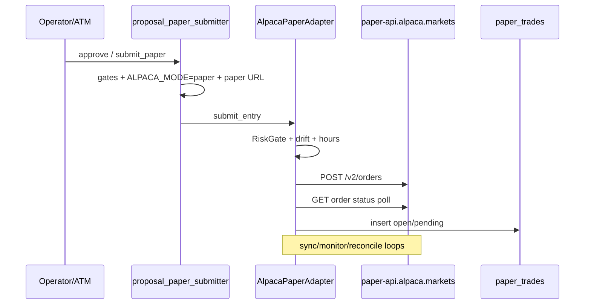

# Alpaca / Paper Trading — Due Diligence Audit (2026-07-21)

**Author:** Grok Code session · **Scope:** entire Trade AI v12 repo (+ Drive docs mirror via `docs/`)  
**Goal:** Inventory Alpaca/paper usage; document as-is processes; freeze taxonomy for future
**Paca personal** and **Paca IRA** without hard-coded paper≡Alpaca confusion.  
**Security:** No secrets in this document. Keys found only in local `.env` / bak files must not be
copied to git or Drive.

---

## 1. Executive summary

| Finding | Severity | Note |
|---------|----------|------|
| Alpaca is used **only as paper training** for automated equity/options | Info | Live capital is Schwab/Fidelity Path B |
| Paper-only enforcement is **layered and mostly fail-closed** | Strength | Mode flags, URL host checks, options LIVE-env refuse |
| **Naming debt:** `alpaca_paper` vs `tradeai_automated` vs `ALPACA_PAPER` | Medium | Same env, three labels |
| **~800 files** mention “alpaca” (docs heavy); core runtime is a small set | Info | 405 docs / 238 scripts / 80 tests (excl. venv/archive) |
| No live Alpaca client exists; adapter **blocks** live host | Strength | Required before Paca personal/IRA |
| Options paper lane is stricter than equity paper (host + LIMIT + qty=1 + confirm) | Strength | Good template for multi-env |
| Env/key names are paper-global (`ALPACA_API_KEY`) | **High risk** for live expansion | Must split credentials before personal/IRA |
| Multiple `.env.bak*` files contain historical key material | **High hygiene** | Rotate if exposed; exclude from backups/Drive |
| Existing 2026-06-11 discovery still accurate for equity path | — | This audit **extends** options + taxonomy |

**Bottom line:** Keep paper as Path A. Do **not** re-point paper modules to live. Introduce
env IDs `paper` | `paca_personal` | `paca_ira` and per-env credentials/adapters when ready.

**Deliverables from this audit:**

| Doc | Role |
|-----|------|
| `docs/brokers/trading-environments.md` | Canonical taxonomy + config proposal |
| `docs/brokers/paper-trading.md` | As-is operator procedures |
| `docs/brokers/paca-accounts.md` | Future personal/IRA gaps + phased plan |
| This file | Inventory, risks, refactor backlog |

---

## 2. Discovery method

```bash
# File inventory (representative; run from repo root)
rg -l -i 'alpaca' --glob '!.git' --glob '!.venv' --glob '!node_modules' \
  --glob '!**/dist/**' --glob '!**/_archive/**' --glob '!backups/**' --glob '!logs/**'

# Env / mode
rg -n 'ALPACA_|APCA_|paper-api\.alpaca|ENABLE_ALPACA' scripts/ config/ .env.example

# Submit sites
rg -n '/v2/orders|submit_entry' scripts/alpaca_paper_adapter.py \
  scripts/lib/options_pipeline/alpaca_paper.py
```

Drive: curated docs under `docs/brokers/*` are mirrored by `scripts/sync-docs-to-drive.sh` to
`Trade_AI_Docs_v2`. Runtime dumps excluded. This audit ships into that mirror.

**Not searched:** private Gmail/Notion outside repo; operator should re-run Drive filename search for
“Alpaca” in non-mirrored folders if any exist.

---

## 3. Inventory (grouped)

### 3.1 Core runtime (order I/O)

| Path | Role | Usage type |
|------|------|------------|
| `scripts/alpaca_paper_adapter.py` | Equity paper client; **only** general equity POST `/v2/orders` | Auth, orders, positions, account, sync |
| `scripts/proposal_paper_submitter.py` | Path A gates + `submit_entry` | Order placement gates |
| `scripts/broker_confirm_alpaca.py` | Fill confirm / poll | Order status |
| `scripts/alpaca_paper_reconciler.py` | Broker vs local paper book | Reconciliation |
| `scripts/alpaca_stop_manager.py` | Paper stops | Protection |
| `scripts/alpaca_throttle.py` | Rate limiting state | Throttle |
| `scripts/lib/options_pipeline/alpaca_paper.py` | Options paper LIMIT lane | Orders (strict) |
| `scripts/alpaca_paper_options_executor.py` | Operator CLI for options lane | Ops |
| `scripts/brokers/translators/alpaca.py` | OrderIntent → Alpaca payload (pure) | Translation |
| `scripts/paper_trade_monitor.py` | 5-min monitor | Positions / trail |
| `scripts/paper_trade_logger.py` | Approve / promote | Lifecycle |
| `scripts/open_trade_manager.py` | Open trade ops (mode assert paper) | Ops |
| `scripts/paper_trade_closer.py` | Explicit close | Ops |
| `scripts/validation_submitter.py` | Sandbox account `alpaca_paper` | Validation |
| `scripts/momentum_scalp_fast_atm_runner.py` | Fast path locked to paper account | Strategy |
| `scripts/ohlc_charts.py` / data paths | Data API (may use APCA keys) | Market data |

### 3.2 Broker abstraction & safety

| Path | Role |
|------|------|
| `scripts/broker_adapter.py` | Protocol + `adapter_for(account_label)` |
| `scripts/broker_config.py` | Account → broker name / default paper account |
| `scripts/brokers/interfaces.py` | ADR-B1 protocols |
| `scripts/brokers/execution_guard.py` | Mode gating |
| `scripts/live_trading_gate.py` | Includes `ALPACA_MODE` gate |
| `scripts/unified_stop_supervisor.py` | Asserts `ALPACA_MODE=paper` |
| `docs/brokers/broker-abstraction-adr.md` | Design: PAPER_TRAINING distinct |
| `docs/brokers/execution-safety-guards.md` | Mode matrix |
| `docs/brokers/current-state-alpaca-integration.md` | 2026-06-11 discovery |

### 3.3 Config

| Path | Alpaca-related content |
|------|------------------------|
| `config/atm_config.yaml` | Account `tradeai_automated` (canonical ATM) |
| `config/account_capabilities.json` | `alpaca_paper` capabilities |
| `config/defense_execution_caps.json` | `alpaca_paper` allowlist label |
| `config/options_strategy_registry.yaml` | `alpaca_paper_enabled` per strategy |
| `config/options_paper_monitor.yaml` | `alpaca:` section |
| `config/options_universe.yaml` | Stage-1 options universe |
| `config/strategies/momentum_scalp.yaml` | `fast_path_account: alpaca_paper` |
| `config/claude_escalation_allowlist.yaml` | `ALPACA_MODE: paper`, `alpaca_execute` |
| `.env.example` | Comments for default paper account / dual-lane routing |

### 3.4 API / UI

| Path | Role |
|------|------|
| `scripts/api_v2.py` | Paper submit/dry-run endpoints; journal alpaca blocks |
| `apps/broker-admin/broker_admin.py` | “Alpaca (paper — LIVE)” secret form → `AlpacaPaperAdapter` |
| `apps/command-center-v3` | Proposals Path A; options education “alpaca paper only” |
| `docs/PROPOSAL_EXECUTION_PATHS.md` | Path A = Alpaca paper |

### 3.5 SQL / migrations

| Path | Role |
|------|------|
| `migrations/2026_07_06_options_queue_alpaca_states.sql` | Options Alpaca lifecycle states |
| `migrations/2026_05_22_atm_v1.sql` | ATM |
| `migrations/2026_06_27_tradeai_automated_account.sql` | Automated account key |
| Various `sql/migrations/*paper*` | Proposal lifecycle / paper execution |

### 3.6 Tests (representative)

`tests/test_alpaca_paper_options_executor.py`, `test_options_card_semantics.py`,
`test_momentum_scalp_*paper*`, `test_broker_scaffold.py`, stop/recon tests importing adapter.

### 3.7 Docs (pre-existing)

`docs/brokers/alpaca-vs-schwab-capability-matrix.md`, `migration-plan-alpaca-to-schwab.md`,
`ARCHITECTURE.md` paper path description, hundreds of historical phase closeouts mentioning paper.

### 3.8 Hard-coded values (critical)

| Location | Value / behavior |
|----------|------------------|
| `alpaca_paper_adapter.PAPER_BASE_URL` | `https://paper-api.alpaca.markets` (constructor forces trading base here) |
| `alpaca_paper_adapter` init | Raises if `ALPACA_BASE_URL` is live host without paper |
| `lib/options_pipeline/alpaca_paper.PAPER_HOST` | Exact hostname `paper-api.alpaca.markets` required |
| `proposal_paper_submitter` | Blocks if URL lacks `paper-api` or `ALPACA_MODE != paper` |
| Many scripts | `assert os.environ.get("ALPACA_MODE") == "paper"` |
| DB account strings | `ALPACA_PAPER`, `alpaca_paper`, `tradeai_automated` |

### 3.9 Assumptions detected

1. **Single paper book** — one Alpaca paper key pair for the household training account.
2. **Alpaca ≈ paper** in UI copy, adapter class names, and escalation allowlists.
3. **No multi-account Alpaca routing** — no personal vs IRA vs paper selection.
4. **Live money ≠ Alpaca** — Path B is Schwab/Fidelity; mental model may need update when Paca lands.
5. **Six-month paper validation** narrative still referenced in gates/warnings.

---

## 4. As-is process summary

See full operator procedures in **`docs/brokers/paper-trading.md`**.



**Options:** operator mark READY → `--confirm` submit → reconcile; never scanner auto-submit.

---

## 5. Gap analysis — Paca personal & Paca IRA

Full roadmap: **`docs/brokers/paca-accounts.md`**.

| Gap | Risk if ignored |
|-----|-----------------|
| Shared `ALPACA_API_KEY` name | Live keys drop into paper client |
| Paper adapter class name used for “Alpaca” | Developers extend paper module for live |
| No IRA capability matrix | Margin/short strategies fire in retirement account |
| Journal is `paper_trades` | Live fills pollute paper analytics |
| Holdings merge | Double-count or miss Paca positions vs Schwab |
| UI “Approve paper” | Operators confuse with live Alpaca approve |

**Alpaca product note (2025–2026):** API-enabled IRA accounts exist for eligible users; funding/contributions largely portal-side. Live trading host is `api.alpaca.markets`. **Re-verify** options/crypto/margin on the actual account before coding.

---

## 6. Recommended taxonomy (summary)

| Env ID | account_key (proposed) | Capital |
|--------|------------------------|---------|
| `paper` | `tradeai_automated` (+ legacy `alpaca_paper`) | Simulated |
| `paca_personal` | `paca_personal` | Real taxable |
| `paca_ira` | `paca_ira_roth` / `paca_ira_traditional` | Real IRA |

Details, YAML sketch, glossary: **`docs/brokers/trading-environments.md`**.

---

## 7. Prioritized refactoring backlog

### P0 — Before any live Alpaca key exists

1. **Split credential env names** (paper vs personal vs ira) with aliases for paper.
2. **Document-only freeze** of taxonomy (done in this doc set).
3. **Secret hygiene:** ensure `.env.bak*` not synced to Drive/git; rotate paper keys if bak files were shared.
4. **Alias map** in `broker_config`: `alpaca_paper` ≡ `tradeai_automated` ≡ env `paper`.

### P1 — Code structure (no capital)

5. Introduce `BrokerEnvironment` enum + `config/broker_environments.yaml` loader.
6. Factory: `get_trading_client(env_id)` — paper returns existing adapter; personal/ira return stubs that raise `NotImplemented` or dry-run only.
7. Logging fields: `broker=alpaca env=paper account=...` on every order audit row.
8. UI: never show bare “Alpaca” for submit — always “Alpaca Paper”.

### P2 — Live scaffold

9. `AlpacaLiveAdapter` + ExecutionGuard mode `PACA_PERSONAL_LIVE` (disabled).
10. Reuse Path B patterns (approval_service, caps, kill file) — **do not** open `proposal_paper_submitter` to live.
11. Capabilities JSON for personal/IRA after portal verification.

### P3 — Canary & IRA

12. $ notional canary on personal only.
13. IRA allowlist strategies (long-only / covered as product allows).
14. Multi-broker holdings truth model.

### Sample factory sketch (illustrative — not landed)

```python
# scripts/brokers/env_registry.py  (PROPOSED)
from enum import Enum

class BrokerEnv(str, Enum):
    PAPER = "paper"
    PACA_PERSONAL = "paca_personal"
    PACA_IRA = "paca_ira"

def trading_base_url(env: BrokerEnv) -> str:
    if env is BrokerEnv.PAPER:
        return "https://paper-api.alpaca.markets"
    if env in (BrokerEnv.PACA_PERSONAL, BrokerEnv.PACA_IRA):
        return "https://api.alpaca.markets"
    raise ValueError(env)

def client_for(env: BrokerEnv):
    if env is BrokerEnv.PAPER:
        from alpaca_paper_adapter import AlpacaPaperAdapter
        return AlpacaPaperAdapter()
    raise RuntimeError(f"{env} not implemented — refuse live until adapter + guard land")
```

### Sample tests to add

```python
def test_paper_adapter_rejects_live_url(monkeypatch):
    monkeypatch.setenv("ALPACA_BASE_URL", "https://api.alpaca.markets")
    with pytest.raises(RuntimeError, match="BLOCKED"):
        AlpacaPaperAdapter()

def test_options_paper_rejects_live_env(monkeypatch):
    monkeypatch.setenv("ALPACA_LIVE_KEY", "x")  # any LIVE-named var
    # assert PaperEndpointError / refuse per alpaca_paper invariants
```

(Options module already enforces host + LIVE-named vars — keep those tests green forever.)

---

## 8. Security & compliance notes

- **Never** commit API keys; broker-admin DB storage preferred for new brokers.
- Paper and live keys must be **different** and rotated independently.
- Drive docs are **one-way mirror** from MS-01; do not put secrets in markdown.
- Live Paca trading will need the same class of controls as Schwab (approval, caps, kill, audit) even if Alpaca itself has no 2FA on API — Trade AI supplies the human gate.

---

## 9. Ambiguities / follow-ups for operator

1. Confirm intended first live Alpaca product: **personal only**, or **IRA first**?
2. Confirm whether paper keys in historical `.env.bak*` were ever shared → rotate.
3. Confirm Alpaca IRA options/crypto policy on the actual account when opened.
4. Decide timeline for retiring account_key `alpaca_paper` in favor of `tradeai_automated`.
5. Any non-repo Drive folders with “Alpaca” SOPs outside `Trade_AI_Docs_v2`?

---

## 10. Cross-links

| Doc | Purpose |
|-----|---------|
| `docs/brokers/trading-environments.md` | Taxonomy |
| `docs/brokers/paper-trading.md` | As-is procedures |
| `docs/brokers/paca-accounts.md` | Future personal/IRA |
| `docs/brokers/current-state-alpaca-integration.md` | 2026-06-11 equity deep trace |
| `docs/brokers/broker-abstraction-adr.md` | Interfaces |
| `docs/PROPOSAL_EXECUTION_PATHS.md` | Path A vs B |
| `docs/ARCHITECTURE.md` | System-level paper path |

---

*End of audit. Implementation of P1+ requires explicit operator authorization (live capital adjacent).*
