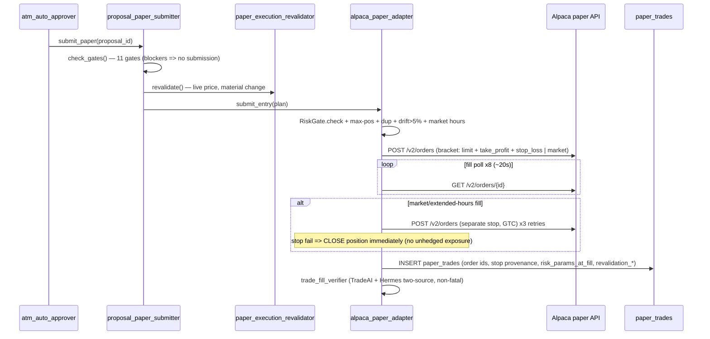

# Current-State: Alpaca Integration (Phase 1 Discovery)

**Status:** COMPLETE (2026-06-11) · **Method:** full code-trace (file:line cited) · **Scope:** paper trading
only — there is no live Alpaca path anywhere; live endpoint is BLOCKED at adapter init.

> **2026-07-21 refresh:** Full inventory, options paper lane, taxonomy for future **Paca personal / Paca IRA**,
> and operator procedures live in:
> - `docs/brokers/ALPACA_DUE_DILIGENCE_AUDIT_2026-07-21.md` (audit)
> - `docs/brokers/trading-environments.md` (canonical env IDs)
> - `docs/brokers/paper-trading.md` / `docs/brokers/paca-accounts.md`
> This Phase-1 discovery remains valid for the equity paper order lifecycle.

## Verified facts
- Paper-only enforcement is layered and fail-closed: `ENABLE_ALPACA_PAPER`, `ALPACA_MODE=paper` (init +
  runtime), live-endpoint detection (`alpaca_paper_adapter.py:47-49` raises on `api.alpaca.markets`),
  `LIVE_TRADING_ENABLED=false`, `live_trading_gate.evaluate()`.
- The ONLY real order-submission site is `alpaca_paper_adapter.py:524` (`POST /v2/orders`). The legacy
  `submit_order()` stub elsewhere raises NotImplementedError.
- A partial broker abstraction ALREADY EXISTS: `broker_adapter.py` (Protocol + `adapter_for()` factory +
  `FillConfirmation` dataclass) and `broker_config.py` (account→broker resolution from DB/ATM config). The
  Phase-4 scaffold extends these rather than inventing parallel ones.
- A dry-run precedent exists: `proposal_paper_submitter.dry_run_bracket()` (Session 23D) — constructs +
  validates the bracket payload without submitting. The new ExecutionGuard generalizes this pattern.

## Component inventory
| File | Role |
|---|---|
| `alpaca_paper_adapter.py` | submission (`submit_entry`), position sync, close detection, account |
| `broker_confirm_alpaca.py` | order status polling + `confirm_fill` retries |
| `proposal_paper_submitter.py` | 11 submission gates, bracket construction, `dry_run_bracket` |
| `paper_trade_monitor.py` | 5-min monitor: trailing stops (BE @1R, trail @2R), target close, phantom detection (15-min grace) |
| `broker_adapter.py` / `broker_config.py` | existing partial abstraction (Protocol, factory, account→broker map) |
| `trade_fill_verifier.py` | two-source fill verification (TradeAI + Hermes; COUNTED rule) |
| `risk_gate.py` / `live_trading_gate.py` | fail-closed risk + system gating |
| `paper_execution_revalidator.py` | execution-time price/material-change revalidation |
| `api_v2.py` | submit/dry-run endpoints + `alpaca` block in automated-trade-journal |
| `ohlc_charts.py` | data API (SIP) — market-data dependency, separate from trading API |

## Order lifecycle (verified sequence)

Ongoing: `sync_positions()` (5-min cron; ORDER-ANCHORED PROMOTION — pending rows promote only when a filled
buy order matches qty; never unanchored), `detect_closed_positions()` (close + outcome + post-close
analytics), monitor trailing/phantom logic, and (since 2026-06-11) the paper_trades dedup trigger.

## Exact REST surface used (trading + data)
POST `/v2/orders` (bracket|market|stop) · GET `/v2/orders/{id}` · GET `/v2/orders?status=...&symbols=` ·
DELETE `/v2/orders/{id}` · GET `/v2/positions` · DELETE `/v2/positions/{symbol}` (emergency) · GET
`/v2/account` · data: `/v2/stocks/{sym}/quotes|bars`. Headers `APCA-API-KEY-ID/SECRET-KEY`.
Bracket payload: `{symbol, qty, side, type, time_in_force:day, limit_price, order_class:bracket,
take_profit:{limit_price}, stop_loss:{stop_price}, client_order_id, [extended_hours]}`.

## Config inventory
`ALPACA_API_KEY/SECRET_KEY/BASE_URL/MODE/DATA_FEED`, `ENABLE_ALPACA_PAPER`, `LIVE_TRADING_ENABLED`
(+ legacy `APCA_*` fallbacks in ohlc_charts/trade_execution_analyzer).

## Risk-control inventory (fail-closed unless noted)
System: ALPACA_MODE + live-endpoint block + LIVE_TRADING_ENABLED + live_trading_gate (6-month validation).
Proposal: 11 gates (status, risk_gate, plan completeness, dup symbol/order, quality, intel≥50, technicals,
stop sanity). Adapter: RiskGate (halts, strategy-killed, account eligibility, daily $600/weekly $1200 loss,
max positions), stop-breached block, drift>5%, market hours, stop-fail=>close. Post: two-source fill
verification, phantom grace, dedup trigger.

## Coupling / missing abstractions (drives Phase-3 design)
1. Order-type decision + price sourcing are Alpaca-specific inside the adapter (no strategy seam).
2. "Bracket vs separate-stop" is an Alpaca structural leak — Schwab expresses the same intent as
   TRIGGER→child-OCO; business logic must target a canonical exit-policy, not order_class.
3. ORDER-ANCHORED PROMOTION + phantom grace are Alpaca fill-semantics; need per-broker `find_matching_order`.
4. Account labels hardcode broker names ('ALPACA_PAPER') in risk paths.
5. Fill tolerances (qty 0.01 / price 1%) are Alpaca-calibrated constants.

## Assumptions
- Streaming: none used for trading (all polling + cron) — confirmed; Alpaca websockets unused.
- Fractional shares: not used (integer qty strings throughout).

## Risks / follow-ups
- 8×~20s fill-poll window can leave market orders unresolved (handled via cancel; limit pending = no DB row
  until sync) — canonical model must represent `SUBMITTED_PENDING` distinctly.
- Stop-placement failure policy (immediate close) is a behavior the canonical exit policy must preserve.
