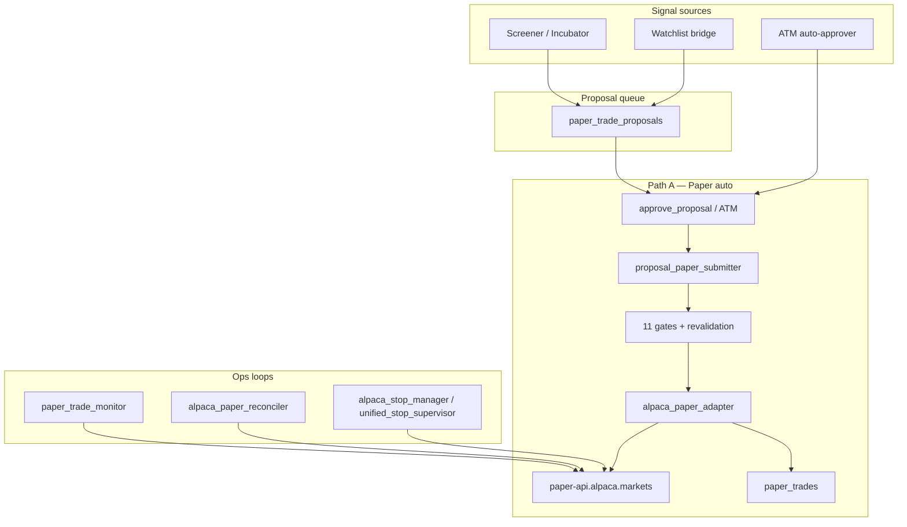

# Paper Trading (Alpaca) — As-Is Operator Procedures

Status:      ACTIVE
as_of:       2026-07-21T12:07:44-04:00
Measured at: efcc51365 / not measured

**Environment ID:** `paper` · **Vendor:** Alpaca Markets paper API  
**Taxonomy:** `docs/brokers/trading-environments.md`  
**Audit:** `docs/brokers/ALPACA_DUE_DILIGENCE_AUDIT_2026-07-21.md`  
**Last verified against code:** 2026-07-21

## 1. Purpose

Paper trading is **Path A**: validate strategy, sizing, stops, ATM, and pipeline gates with
**simulated capital** on Alpaca’s paper endpoint. It is the prequel to any future live Alpaca
(“Paca”) personal or IRA account — and is permanently separate from Schwab/Fidelity live paths.

## 2. Prerequisites

| Requirement | Detail |
|-------------|--------|
| Alpaca paper account | Created at Alpaca dashboard (paper keys, not live) |
| Env flags | `ENABLE_ALPACA_PAPER=true`, `ALPACA_MODE=paper` |
| Keys | `ALPACA_API_KEY` / `ALPACA_SECRET_KEY` (paper only) |
| Base URL | Resolves to `https://paper-api.alpaca.markets` (adapter hard-defaults; live host **raises**) |
| System | `LIVE_TRADING_ENABLED` not enabling live; `LLM_DISABLE_LIVE_EXECUTION` typically true |
| Account key | ATM: `tradeai_automated`; many strategies still say `alpaca_paper` (alias) |

**Secrets:** never commit keys; do not paste into docs/Drive. Rotate if keys appeared in `.env.bak*`.

## 3. Architecture (as-is)



**Options paper (separate lane):** `scripts/lib/options_pipeline/alpaca_paper.py` +
`alpaca_paper_options_executor.py` — LIMIT, 1-contract, paper host-locked, **no auto-submit**
without operator `--confirm`.

## 4. End-to-end equity workflow

### 4.1 Proposal creation

1. Incubator / screener / watchlist bridge inserts `paper_trade_proposals` (`PENDING`).
2. Optional enrichment, Check Execution, AI review (Proposals UI).
3. Routing still `unassigned` or paper account until approve.

### 4.2 Approve (no 2FA)

| Channel | Action |
|---------|--------|
| UI | Trading → Proposals → **Approve** |
| Telegram | `/ptapprove {id}` · reject `/ptreject {id} reason` |
| ATM | Auto-approve when ATM enabled + strategy allow + caps |

### 4.3 Submit gates (`proposal_paper_submitter`)

Fail-closed examples (non-exhaustive):

- Proposal status / already `EXECUTED`
- `LIVE_TRADING_ENABLED` / `ALPACA_MODE != paper`
- Base URL without `paper-api`
- Duplicate open `paper_trades` for symbol
- Risk / plan / quality / technical gates
- Dry-run: `dry_run_bracket()` builds payload without POST

### 4.4 Adapter submit (`AlpacaPaperAdapter.submit_entry`)

1. RiskGate, max positions, drift vs live quote (>5% block), market hours.
2. `POST /v2/orders` — typically **bracket** (limit + take_profit + stop_loss) or market.
3. Poll fill; on market/extended fills may place **separate GTC stop**; stop fail → close position.
4. Insert `paper_trades` (`account` often `ALPACA_PAPER`).
5. Optional two-source fill verification.

### 4.5 Ongoing management

| Job | Role |
|-----|------|
| `paper_trade_monitor` | Trailing (BE @1R, trail @2R), target, phantom grace |
| `sync_positions` / adapter sync | Order-anchored promotion of pending rows |
| `detect_closed_positions` | Close + outcome |
| `alpaca_paper_reconciler` | Alpaca vs local matching |
| `alpaca_stop_manager` / stop supervisor | Protective stop integrity on paper |

### 4.6 Close / journal

- Paper closes land in paper journal / open-trades UI — **not** live holdings.json Schwab book.
- Manual close path: `paper_trade_closer.py` (requires explicit flag + `ALPACA_MODE=paper`).

## 5. Options paper workflow (operator)

```bash
# Status of Alpaca options lane
.venv/bin/python scripts/alpaca_paper_options_executor.py --status

# Operator marks queue row ready
.venv/bin/python scripts/alpaca_paper_options_executor.py --mark-ready <PROPOSAL_ID>

# Submit only with explicit confirm (LIMIT, qty=1)
.venv/bin/python scripts/alpaca_paper_options_executor.py --submit <PROPOSAL_ID> --confirm

# Reconcile fills/closes (read-only side effects on queue state)
.venv/bin/python scripts/alpaca_paper_options_executor.py --reconcile
```

Registry: `config/options_strategy_registry.yaml` → `alpaca_paper_enabled` (+ `multi_leg_proven` for spreads).

## 6. REST surface used (paper)

| Method | Path | Use |
|--------|------|-----|
| POST | `/v2/orders` | Entry bracket / market / stop / options limit |
| GET | `/v2/orders/{id}` | Fill poll |
| GET | `/v2/orders?status=...` | Open/filled scans |
| DELETE | `/v2/orders/{id}` | Cancel |
| GET | `/v2/positions` | Sync |
| DELETE | `/v2/positions/{symbol}` | Emergency flatten |
| GET | `/v2/account` | Equity / status |
| GET | data `data.alpaca.markets` quotes/bars | Pricing / charts |

Headers: `APCA-API-KEY-ID`, `APCA-API-SECRET-KEY`.

## 7. Simulation differences (operator expectations)

| Topic | Reality on Alpaca paper |
|-------|-------------------------|
| Liquidity | Simulated fills; may differ from live |
| Partial fills | Poll window ~20s; unresolved limits stay pending until sync |
| Extended hours | Supported with limit-only + size multipliers in ATM config |
| Reset | Use Alpaca dashboard / new paper account — Trade AI does not “reset” broker book |
| Fractional | Integer qty strings in adapter (no fractional path) |
| Streaming | Not used for trading (polling + cron) |

## 8. Health checks

```bash
# Adapter connectivity (enabled + keys)
.venv/bin/python -c "from alpaca_paper_adapter import AlpacaPaperAdapter; print(AlpacaPaperAdapter().get_status())"

# Broker connector validation (if in suite)
.venv/bin/python scripts/validate_broker_connectors.py  # includes alpaca_paper_adapter entry
```

Expect: `mode=paper`, `base_url` containing `paper-api`, `enabled=true` when ops-on.

## 9. What paper is **not**

- Not Schwab / Fidelity capital.
- Not live Alpaca personal or IRA (`paca_personal` / `paca_ira` — see `paca-accounts.md`).
- Not exempt from risk gates — paper still has loss/position caps.
- Not a place to store live API keys.

## 10. Related code map

| Module | Path |
|--------|------|
| Adapter | `scripts/alpaca_paper_adapter.py` |
| Submitter | `scripts/proposal_paper_submitter.py` |
| Confirm | `scripts/broker_confirm_alpaca.py` |
| Monitor | `scripts/paper_trade_monitor.py` |
| Reconciler | `scripts/alpaca_paper_reconciler.py` |
| Options | `scripts/lib/options_pipeline/alpaca_paper.py` |
| ATM config | `config/atm_config.yaml` |
| Capabilities | `config/account_capabilities.json` → `alpaca_paper` |
| Paths overview | `docs/PROPOSAL_EXECUTION_PATHS.md` |
