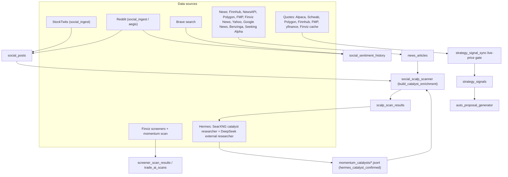

# Day-Scalp Source Inventory — 2026-08-19

Status:      HISTORICAL
as_of:       2026-08-19T12:02:14-04:00
Measured at: efcc51365 / not measured

**Purpose:** Authoritative inventory of every data source feeding the Trade AI day-scalp lead
pipeline, with current health status and fallback notes. Maintained so a future break can be
traced to a specific lane and re-routed without re-deriving the graph.

**Scope:** momentum-scalp / social-scalp lead generation only (screener → catalyst verification →
GO promotion → `strategy_signals` → proposals). Long-term/swing and advisory lanes are out of scope.

**As-of:** 2026-08-19 08:40 ET. Health measured from `data_source_health`, `/api/v2/data-source-health`,
`/api/v2/health`, and producer logs.

> **Update 2026-08-19:** the broken lanes identified below have been repaired. See
> `docs/incidents/DAY_SCALP_PIPELINE_FIXES_2026-08-19.md` for what changed. Key deltas:
> Reddit 403 → StockTwits (live) in `aegis_social_sentiment.py`; Hermes is now a
> `social_sentiment_history` producer via `hermes_social_sentiment.py`; `yahoo_finance`
> false-stale marker now reports "covered by Alpaca"; `data_source_stale` auto-retry is
> source-aware; finnhub 401 remains operator key-rotation.

---

## Pipeline graph

---

## A. Screener / universe source (Finviz)

| Source | Producer | Table / store | Status | Evidence |
|---|---|---|---|---|
| Finviz momentum screeners | `finviz_screener_runner` | `screener_scan_results` | LIVE | 2,122 rows @ 08:00 |
| Finviz momentum scalp scan | `run_finviz_momentum_scalp_scan` | `trade_ai_scans` | LIVE | 1,496 rows, GO=10 / WAIT=20 @ 08:25 |

Note: the `finviz_scan` stage is frequently `skipped_finviz_refresh` (cached) while `signal_sync`
still runs — this is expected cache reuse, not a failure.

---

## B. Social sentiment sources

`sentiment` for scalps flows through **two tables**: `social_posts` (raw posts) and
`social_sentiment_history` (aggregated, the one the health check and desk read).

| Source | Producer | Table | Status | Evidence |
|---|---|---|---|---|
| StockTwits | `social_ingest.py` | `social_posts` | LIVE | "Inserted: 10, dupes 130" @ 06:00 |
| Reddit (raw) | `social_ingest.py` | `social_posts` | **BROKEN (403)** | public JSON API returns 403 on all subs |
| Reddit + Brave (aggregated) | `aegis_social_sentiment.py` | `social_sentiment_history` | **BROKEN** | "Persisted: 0" since Aug 17; Reddit 403, Brave 0 |
| StockTwits (enrich) | `symbol_enrichment.py pull_stocktwits` | `social_posts` | LIVE | stocktwits_live rows |
| **Hermes** | — | `social_sentiment_history` | **NOT A PRODUCER (gap)** | Hermes only writes `hermes_catalyst_confirmed` |

**Critical:** `social_sentiment_history` has exactly **one writer** — `aegis_social_sentiment.py` —
and that writer is dead (Reddit 403 + Brave 0). Hermes is expected to be a second producer but is
not currently wired. This is why `social_data_stale 228h` fires.

---

## C. News / catalyst sources (`news_articles` → `catalyst_enrichment`)

Round-robin dispatcher: `catalyst_news_sources.py` `_SOURCES` (priority order), plus
`catalyst_enrichment.py` for the enrichment lane.

| Priority | Source | Key | Status | Evidence |
|---|---|---|---|---|
| 1 | Finnhub | `FINNHUB_API_KEY` | **BROKEN (401)** | `data_source_auth_failed`; 0 rows since Jul 27 |
| 2 | NewsAPI | `NEWSAPI_KEY` | key present | liveness not separately reported |
| 3 | Polygon | `POLYGON_API_KEY` | key present | liveness not separately reported |
| 4 | FMP | `FMP_API_KEY` | key present | liveness not separately reported |
| 5 | Finviz News | `FINVIZ_API_TOKEN` | LIVE | 11 rows |
| 6 | Yahoo Finance (RSS) | none | LIVE | 326 rows @ 0.8h |

Additional `news_articles` feed sources (via `news_ingestion.py`):
Google News RSS (1163 rows), Benzinga RSS (13), Seeking Alpha (124), Yahoo RSS (326).

---

## D. Hermes research sources (catalyst confirmation)

| Lane | Producer | Engine | Store | Status | Notes |
|---|---|---|---|---|---|
| Momentum catalyst | `hermes_momentum_catalyst_researcher.py` | SearXNG `categories=news`, engines `google news,bing news,duckduckgo` | `data/hermes/momentum_catalysts/*.jsonl` | LIVE (low conf) | conf 0.2–0.4, 1–2 sources |
| External research | `hermes_external_researcher.py` | governed DeepSeek (no live web) | `hermes_external_research` | LIVE | LLM lane, not a web crawler |
| Theme web probe | `think_tank_signal_miner.py mine_web_searx` | SearXNG `categories=general` | theme mining | LIVE | **blocks reddit/twitter/x/youtube** via `SITE_BLOCKLIST` |

**Forum-search finding:** Hermes does SearXNG web search, but the scalp catalyst lane is **news-only**
(`categories=news`) and the general web probe **explicitly blocklists** `reddit.com`, `twitter.com`,
`x.com`, `youtube.com`. There is currently **no forum/StockTwits search** in the Hermes scalp path.
The `CATALYST_TYPES["social"]` keyword set (reddit/wallstreetbets/trending/viral) is only a classifier
on returned news titles, not an actual forum crawl. If Hermes is intended to be a social-sentiment
source, that producer must be added.

---

## E. Quote / price sources (`market_quotes` / `get_best_quote`)

`PROVIDER_CHAIN` in `market_quote_provider.py`, priority order:

| Priority | Provider | Status | Notes |
|---|---|---|---|
| 1 | Alpaca (IEX) | LIVE | primary, free feed |
| 2 | Schwab | LIVE | real-time, execution-eligible |
| 3 | Polygon | key present | |
| 4 | Finnhub | **BROKEN (401)** | free tier 15-min delayed |
| 5 | FMP | key present | |
| 6 | yfinance | **STALE marker (183h)** | fallback only, never runs when Alpaca covers |
| 7 | Finviz cache | LIVE | display-only |

**yahoo_finance 183h finding:** `report_source("yahoo_finance", ...)` only fires inside
`ingest_yfinance_quotes()` (`external_market_data_ingest.py:115-120`), which is a last-resort
fallback. Because Alpaca prices the whole universe, yfinance never runs, its `data_source_health`
marker is never refreshed, and it reports stale — even though `market_quotes` are actually fresh
via Alpaca. This is a **monitoring false-positive**, not a real outage.

---

## F. Macro / other research (context, not scalp gates)

| Source | Status | Evidence |
|---|---|---|
| FRED macro | LIVE | 277 rows @ 2.5h |
| SEC Form-4 insider | LIVE | 33 rows @ 0.2h |
| YouTube transcripts (topic) | LIVE | 107 rows @ 18.7h |
| Earnings dates (profile) | LIVE | 719 rows @ 2.0h |
| Symbol profiles | LIVE | 54 rows @ 2.0h |
| Catalyst events | LIVE | 2891 rows @ 0.4h |

---

## G. Web search / topic sources

| Source | Status | Evidence |
|---|---|---|
| DuckDuckGo (topic) | LIVE | 2320 rows @ 5.7h |
| Yahoo search (topic) | LIVE | 2495 rows @ 4.5h |
| Brave (topic) | **DISABLED (402)** | needs $5 credit, `daily_limit: 5` |

---

## Fallback map (re-route if a lane breaks)

| Lane breaks | Fallback |
|---|---|
| Finnhub news 401 | NewsAPI / Polygon / FMP / Finviz News / Yahoo RSS (already in round-robin) |
| Reddit social 403 | StockTwits (live) + add Hermes/SearXNG forum search (planned) |
| yfinance quotes | Alpaca primary already covers; only the stale marker is misleading |
| SearXNG down | Hermes catalyst returns `no_clear_catalyst`; proposals still flow if a verified catalyst exists elsewhere |
| Alpaca quotes down | Schwab → Polygon → FMP → yfinance → Finviz cache (already chained) |
