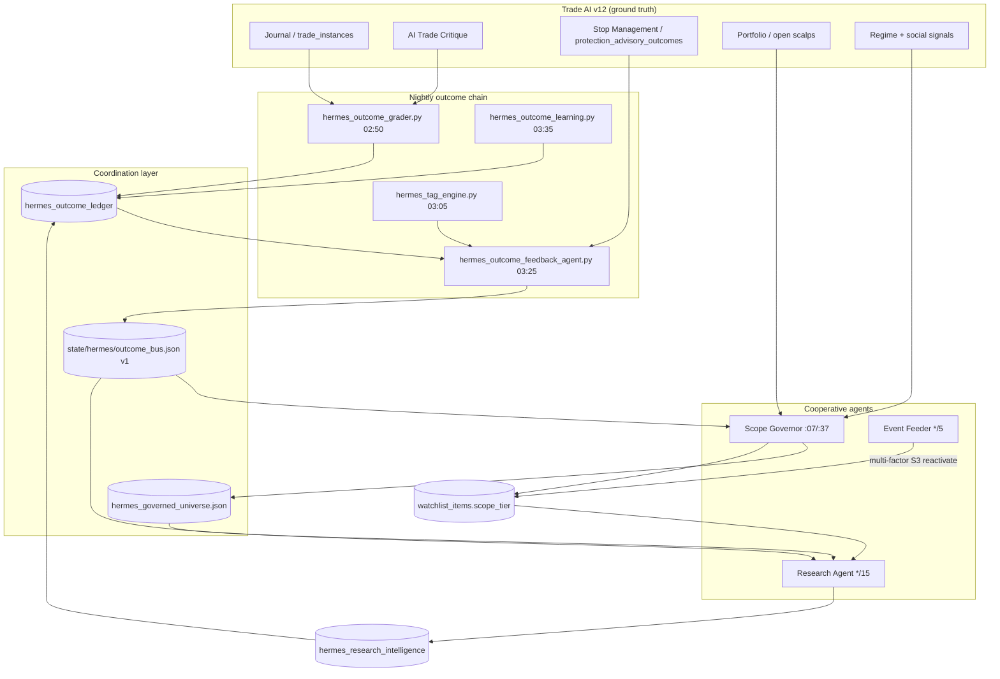

# Hermes Multi-Agent Coordination Architecture
**v2.1 · Production-ready · 2026-07-03 · Trade AI v12**

---

## Executive Summary

Hermes now operates as a **three-agent cooperative stack** coordinated by a thin, versioned `outcome_bus.json` — not a MARL system, not a message broker. The Scope Governor owns **what** to monitor; the Research Agent produces intelligence **inside** that scope; the **Outcome & Feedback Agent** (shipped) rolls up journal R, ledger grades, tag lift, and stop quality into **first-class signals** both agents act on nightly.

**Design law (structural):** *outcome yield outranks throughput yield.* Research rows/day and LLM calls are **efficiency guardrails** tracked in `resource_efficiency` — they never justify widening scope when hit rate is flat.

| Agent | Status | Role |
|-------|--------|------|
| **Scope Governor** | Shipped v2 + bus integration | Hot/Warm/Cold tiers; reads `feedback_to_governor` |
| **Research Agent** | Shipped + bus integration | Scores/tags/researches governed scope; reads `by_tag` multipliers |
| **Outcome & Feedback** | **Shipped** | Nightly `outcome_bus.json` from grader + tag efficacy + stops |
| **Coordination layer** | **Shipped** | `state/hermes/outcome_bus.json` v1 + cadence rules |

**Closed loop:** trades → ledger (grader) → bus (feedback) → governor + research → new research → ledger.

---

## Architecture Diagram



### Cadence (existing crons + outcome chain)

| Job | Schedule | Writes | Reads |
|-----|----------|--------|-------|
| Event feeder | `*/5` | `hermes_score_event_queue`, audited S3 reactivation | `outcome_bus` (reactivation allowlist) |
| Scope Governor | `:07/:37` | `scope_tier`, `hermes_governed_universe.json` | `outcome_bus.feedback_to_governor` |
| Research scheduler | `*/15` tier-mode | external/LLM research | `outcome_bus.by_tag`, governed universe |
| Outcome grader | `02:50` nightly | `hermes_outcome_ledger` grades | price cache, trades |
| Tag engine | `03:05` nightly | `hermes_tag_efficacy`, quality_score | ledger |
| **Outcome & Feedback** | **`03:25` nightly** | **`outcome_bus.json`** | grader + fresh tag_efficacy |
| Outcome learning | `03:35` nightly | weights, sources, lanes | ledger + bus |

---

## 1. Scope Governor Agent

**Responsibility:** Single owner of **what** Hermes monitors and **how often**.

| | |
|--|--|
| **Inputs** | Holdings, scalps, proposals; catalyst/events; social/RVOL; regime; **`outcome_bus`** (`by_symbol`, `feedback_to_governor`) |
| **Outputs** | `scope_tier` (S0–S3); `scope_governor_audit`; `hermes_governed_universe.json` |
| **In repo** | `scripts/hermes_scope_governor.py`, `scripts/lib/hermes_scope_governor/*` |

### Decision logic (rules-first, outcome-aware)

| Tier | Entry | Exit |
|------|-------|------|
| **S0 Hot (pinned)** | Holdings, open positions, proposals, operator directives, open scalps | Never TTL-demoted |
| **S1 Hot (active)** | Composite ≥70, fresh catalyst/directive, active watchlist; **outcome `promote_eligible`** (edge ≥65, n≥3, hit≥50%) | TTL 14d; **bus `pause`**; miss rate ≥75% |
| **S2 Warm** | Incubator, watchpool, directive top-N spill | TTL 30d; **bus `demote_pressure`** |
| **S3 Cold** | Default archive | **Multi-factor event reactivation only** (see §5) |

### Bus integration (shipped)

`lib/hermes_scope_governor/outcome_bus.py`:

1. **`apply_bus_to_edge_scores`** — nightly reinforcement: `demote_pressure` −20 edge, `promote_eligible` +8, `pause` caps edge at 15.
2. **`bus_tier_override`** — explicit tier force: `pause` → S3; `demote_pressure` → one-tier step (never S0).

Graft gates (`min_graded_samples: 3`) apply to both SQL signals and bus feedback.

---

## 2. Research Agent

**Responsibility:** Intelligence **only** inside governed scope. Does **not** choose scope.

| | |
|--|--|
| **Inputs** | `hermes_governed_universe.json`; `scope_tier`; **`outcome_bus.by_tag`**; `feedback_to_research` |
| **Outputs** | Scores, ranks, tags, `hermes_research_intelligence` |
| **In repo** | `hermes_watchlist_scorer.py`, `research_scheduler.py`, `hermes_tag_engine.py` |

### Depth by tier

| Tier | Research depth | LLM |
|------|----------------|-----|
| Hot (S0+S1) | Full scoring + priority slots | Tier-gated, budget-capped |
| Warm (S2) | Metadata + light refresh | Minimal |
| Cold (S3) | None on clock | Event lane only |

### Tag feedback loop (shipped)

`research_scheduler.priority()` multiplies base score by **`quality_multiplier`** from `outcome_bus.by_tag`:

| Condition | Multiplier | Effect |
|-----------|------------|--------|
| `tag_lift ≥ 0.02`, n≥15 | 1.15 | Deeper research for proven tags |
| `tag_lift ≤ 0`, flagged, n≥15 | 0.6 (floor 0.3) | Deprioritize weak tags |
| Symbol `dominant_tag` negative lift | via `by_symbol` | Governor demote pressure + research penalty |

**Rule:** poor tag performance triggers **both** governor demotion pressure (when dominant tag) **and** research downrank — tagging is falsifiable.

---

## 3. Outcome & Feedback Agent (Specification)

**Module:** `scripts/hermes_outcome_feedback_agent.py`  
**Config:** `config/hermes_outcome_feedback.yaml`  
**Output:** `state/hermes/outcome_bus.json` (+ `state/hermes/outcome_bus_history/`)

### Run order & dependencies

```
02:50  hermes_outcome_grader.py     # seed + grade ledger
03:05  hermes_tag_engine.py         # fresh tag_efficacy (before bus)
03:25  hermes_outcome_feedback_agent.py  # THIS AGENT — builds bus
03:35  hermes_outcome_learning.py   # weights/sources/lanes
```

**Upstream inputs:**

| Source | Fields used |
|--------|-------------|
| `hermes_outcome_ledger` | Global + per-symbol hits/misses/R/actioned |
| `hermes_tag_efficacy` | `tag_lift`, `tag_efficacy`, `trade_n`, `flagged` |
| `protection_advisory_outcomes` | Stop alignment / confirmed advisory rate |
| `hermes_research_intelligence` | Throughput counters (7d) |
| `hermes_score_history` | Score write volume (efficiency) |
| `hermes_external_research` | LLM call volume + error rate |
| `hermes_governed_universe.json` | Live universe + estimated computations/day |

**Downstream consumers:**

| Consumer | Reads |
|----------|-------|
| Scope Governor | `feedback_to_governor`, `by_symbol.outcome_gate` |
| Research scheduler | `by_tag.quality_multiplier`, `feedback_to_research` |
| Event feeder | `feedback_to_governor` (`promote_eligible` = reactivation factor) |
| CC API | `GET /api/v2/hermes/outcome-bus` |
| Maturity dashboard | `global`, `resource_efficiency` trends |

### Agent logic (rules-only v1)

1. Roll up **global** metrics (90d lookback).
2. Build **`by_symbol`** with `outcome_gate` (reuses `lib/hermes_scope_governor/scoring.outcome_gate`).
3. Build **`by_tag`** from `hermes_tag_efficacy` + compute `quality_multiplier`.
4. Slice **`stop_quality`** from `protection_advisory_outcomes` (90d, min n=5).
5. Compute **`resource_efficiency`** vs pre-governor baseline (157K writes/day, 4171 universe).
6. Emit **`feedback_to_governor`** and **`feedback_to_research`** arrays.
7. Atomic write + history snapshot + heartbeat (`data/runtime/hermes_outcome_feedback_heartbeat.json`).

### `outcome_bus.json` schema v1

```json
{
  "version": "outcome-bus-v1",
  "run_id": "ofb_9eda43bec5",
  "generated_at": "2026-07-02T03:00:00+00:00",
  "philosophy": "outcome_yield_outranks_throughput",
  "source_runs": {
    "lookback_days": 90,
    "upstream": "hermes_outcome_grader.py",
    "downstream": ["hermes_scope_governor.py", "research_scheduler.py", "hermes_outcome_learning.py"]
  },
  "global": {
    "graded_claims_90d": 1240,
    "hits_90d": 508,
    "misses_90d": 420,
    "neutral_90d": 312,
    "hit_rate_90d": 0.41,
    "avg_realized_r_trades_90d": 0.18,
    "research_actioned_rate_90d": 0.22,
    "throughput_research_rows_7d": 312,
    "throughput_score_writes_7d": 4500,
    "throughput_external_calls_7d": 890
  },
  "by_symbol": {
    "SCHD": {
      "graded_n": 5,
      "hits": 3,
      "misses": 1,
      "neutral": 1,
      "hit_rate": 0.75,
      "avg_realized_r": 0.35,
      "outcome_gate": "promote_eligible",
      "dominant_tag": "dividend_growth_compounder",
      "tag_lift": 0.02,
      "tag_flagged": false,
      "research_actioned_rate": 0.4
    }
  },
  "by_tag": {
    "momentum_scalp": {
      "n": 872,
      "hits": 380,
      "hit_rate": 0.436,
      "base_rate": 0.394,
      "tag_lift": 0.042,
      "tag_efficacy": 0.436,
      "trade_n": 120,
      "avg_realized_r": 0.31,
      "flagged": false,
      "quality_multiplier": 1.15
    },
    "general_research": {
      "n": 500,
      "tag_lift": -0.292,
      "tag_efficacy": 0.102,
      "trade_n": 45,
      "flagged": true,
      "quality_multiplier": 0.6
    }
  },
  "stop_quality": {
    "sample_n": 45,
    "advisory_coverage_pct": 0.85,
    "aligned_pct": 0.72,
    "confirmed_pct": 0.65,
    "notes": "protection_advisory_outcomes final_closed"
  },
  "resource_efficiency": {
    "measurement_window_days": 7,
    "live_universe": 800,
    "baseline_live_universe_pre_governor": 4171,
    "score_history_writes_7d": 4500,
    "score_writes_per_day_7d_avg": 643,
    "research_rows_7d": 312,
    "external_llm_calls_7d": 890,
    "external_error_rate_7d": 0.02,
    "estimated_score_computations_per_day": 8100,
    "outcome_hits_per_1k_research_rows_7d": 1.63,
    "write_reduction_vs_baseline_pct": 0.996
  },
  "s3_reactivation_policy": {
    "version": "v1",
    "requires_multi_factor": true,
    "min_factors": 2,
    "primary_event_types": ["catalyst", "proposal", "directive_hit"],
    "low_trust_event_types": ["news", "finviz"],
    "rvol_threshold": 3.0,
    "gap_pct_threshold": 8.0,
    "composite_min": 70,
    "outcome_allowlist_actions": ["promote_eligible"]
  },
  "feedback_to_governor": [
    {
      "symbol": "XYZ",
      "action": "pause",
      "reason": "miss_rate>=75%,n=5",
      "priority": 1,
      "evidence": {"graded_n": 5, "outcome_gate": "pause_eligible"}
    },
    {
      "symbol": "ABC",
      "action": "demote_pressure",
      "reason": "dominant_tag=general_research negative_lift=-0.292",
      "priority": 2,
      "evidence": {"tag_lift": -0.292, "dominant_tag": "general_research"}
    },
    {
      "symbol": "GOOD",
      "action": "promote_eligible",
      "reason": "hit_rate>=50%,n=4",
      "priority": 3,
      "evidence": {"graded_n": 4, "outcome_gate": "promote_eligible"}
    }
  ],
  "feedback_to_research": [
    {
      "tag": "general_research",
      "action": "downrank",
      "quality_multiplier": 0.6,
      "reason": "negative_lift=-0.292,n=500",
      "trade_n": 45
    },
    {
      "tag": "momentum_scalp",
      "action": "boost",
      "quality_multiplier": 1.15,
      "reason": "positive_lift=0.042,n=872",
      "trade_n": 120
    }
  ]
}
```

### Feedback action reference

| Action | Threshold | Governor effect | Research effect |
|--------|-----------|-----------------|-----------------|
| `promote_eligible` | n≥3, hit≥50%, avg R≥0.25 | +8 edge, S1 eligible | — |
| `demote_pressure` | n≥3, miss≥60% OR negative tag lift | −20 edge, one-tier demote | tag multiplier ≤0.6 |
| `pause` | n≥4, miss≥75% | Force S3 (non-S0) | — |
| tag `downrank` | lift≤0, n≥15 | demote if dominant tag | priority ×0.6 |
| tag `boost` | lift≥0.02, n≥15 | — | priority ×1.15 |

### Coordination rules (enforced in code)

```
IF feedback_to_governor.action == pause AND graded_n >= 3
  THEN governor forces S3 (unless S0)

IF feedback_to_governor.action == demote_pressure
  THEN edge_score -= 20; may demote one tier

IF by_tag.tag_lift < 0 AND trade_n >= 15 AND flagged
  THEN research priority *= quality_multiplier (floor 0.3)

IF global.throughput_research_rows_7d up >20% AND hit_rate_90d flat 30d
  THEN alert only — do NOT widen scope

IF stop_quality.aligned_pct < 0.6
  THEN boost S0 research depth (future: feedback_to_research S0-only flag)

IF S3 reactivation requested
  THEN require >= 2 factors (primary event + RVOL/gap/composite/outcome_allowlist)
  bare news/finviz NEVER sufficient alone
```

---

## 4. Cold Tier (S3) Reactivation — Conservative Rules

**Problem:** Event lane must not become a backdoor that re-inflates scope to 4K.

**Solution (shipped in `hermes_score_event_feeder.py`):**

| Factor type | Examples | Weight |
|-------------|----------|--------|
| Primary event | `catalyst`, `proposal`, `directive_hit` (first-ever) | 1 factor |
| Market confirmation | RVOL ≥3 or gap ≥8% today | 1 factor |
| Hermes quality | composite ≥70 | 1 factor |
| Outcome allowlist | `outcome_bus` `promote_eligible` for symbol | 1 factor |
| Low-trust only | `news`, `finviz` alone | **0 — blocked** |

**Minimum:** 2 independent factors. Skipped reactivations audit as `skip_reactivate` in `scope_governor_audit`.

---

## 5. Resource Efficiency Tracking

Throughput metrics exist to **prove waste reduction**, not to claim success.

| Metric | Source | Purpose |
|--------|--------|---------|
| `score_history_writes_7d` | `hermes_score_history` | vs 157K/day pre-governor baseline |
| `research_rows_7d` | `hermes_research_intelligence` | guardrail — not a north star |
| `external_llm_calls_7d` | `hermes_external_research` | budget burn watch |
| `external_error_rate_7d` | same | circuit-breaker health |
| `live_universe` | `watchlist_items` S0+S1+S2 | must stay ≤800 |
| `estimated_score_computations_per_day` | governed universe feed | ~8K target vs ~197K |
| `outcome_hits_per_1k_research_rows_7d` | bus-computed | **outcome yield efficiency** |

**Before/after governed tiers:** compare `write_reduction_vs_baseline_pct` and `live_universe` against `baseline_live_universe_pre_governor: 4171`. Success = narrower scope **and** stable or rising `hit_rate_90d`.

**Lightweight instrumentation (shipped):**

- `outcome_bus.resource_efficiency` — nightly rollup
- `hermes_governed_universe.estimated_score_computations_per_day`
- `hermes_outcome_feedback_heartbeat.json`
- Maturity gate `_gates_efficiency` (score rows/day ≤5000, history ≤300MB)

---

## 6. Maturity Board Mapping

Aligned with `docs/design/HERMES_MATURITY_5_DESIGN.md` §5.3 six dimensions:

| Maturity dimension | Architecture metric | Gate (Maturity-5) | "Good" at level 4 | "Good" at level 5 |
|--------------------|---------------------|-------------------|---------------------|-------------------|
| **Scope discipline** | `live_universe`, cap compliance | ≤800, governor active | Universe stable 600–800, trigger coverage ≥80% | 30d persistence, zero creep >800 |
| **Research quality** | `proposals_with_prior_research`, error rate | ≥60%, errors <2% | S0 research <7d fresh ≥95% | 30d persistence |
| **Tagging** | `by_tag.tag_lift`, fallback share | ≥1 sig positive lift n≥50 | `general_research` <15%, quality stddev ≥0.03 | 30d persistence |
| **Efficiency** | `resource_efficiency.*` | writes ≤5K/day, no paid LLM | 97% write reduction vs baseline | 30d persistence |
| **Closed loop** | bus freshness, governor outcome changes | calibration pairs ≥20 | `feedback_to_governor` non-empty, audit shows outcome demotions | hit rate ↑ or stable while scope ↓ 30d |
| **Autonomy** | config proposals, watchdogs | escalation queue responsive | proposals filed with evidence | 30d clean watchdog history |

**North star (all levels):** Fewer symbols researched, more trades with positive R where Hermes had prior context.

---

## 7. API & Artifacts

| Artifact | Writer | Readers |
|----------|--------|---------|
| `hermes_outcome_ledger` | Outcome grader | Feedback agent, learning |
| `state/hermes/outcome_bus.json` | **Outcome & Feedback** | Governor, Research, Event feeder, API |
| `hermes_governed_universe.json` | Scope Governor | Scorer, scheduler, UI |
| `scope_governor_audit` | Governor, event feeder | Health, maturity gates |

**API endpoints:**

- `GET /api/v2/hermes/scope-governor` — universe + audit
- `GET /api/v2/hermes/outcome-bus` — full bus (+ `?symbol=XYZ` detail)

---

## Implementation Roadmap

### Phase 1 — Formalize bus ✅ SHIPPED

- [x] Scope Governor v2 + health monitors + safe_flock cron
- [x] `hermes_outcome_feedback_agent.py` → `outcome_bus.json`
- [x] `GET /api/v2/hermes/outcome-bus`
- [x] Governor reads `feedback_to_governor`
- [x] Nightly cron chain: grader 02:50 → tag 03:05 → feedback 03:25 → learning 03:35

### Phase 2 — Wire research + stops + visibility

- [x] `research_scheduler.py` reads bus tag multipliers
- [x] Stop slice in bus (`trail_activation_rate`, `r_left_on_table_avg`)
- [x] S3 multi-factor reactivation in event feeder
- [x] CC v3 Hermes Hub → **Closed Loop** tab (`HermesClosedLoopPanel.tsx`)
- [ ] `resource_efficiency_score` scalar (deferred — needs request logger)

### Phase 3 — Visible loop

- [ ] Maturity dashboard: outcome yield trend vs throughput (7d overlay)
- [ ] Alert if throughput ↑20% while `hit_rate_90d` flat 30d
- [ ] Optional v2: LLM critique theme summary in bus (advisory only)

**Do not build:** MARL, agent chat, dynamic spawning, per-symbol LLM governors.

---

## Success Metrics

| Metric | Target | Red flag |
|--------|--------|----------|
| `hit_rate_promotions` | Stable or ↑ with narrower scope | ↓ while scope widens |
| `hit_rate_trades` | ↑ | flat while research rows ↑ |
| `governor_feedback_count` | Low noise (<15/run) | 50+ tag-only demotions |
| Symbols in bus | 40–80 (price-graded) | Creep toward 200+ |
| `write_reduction_vs_baseline_pct` | ↑ over time | Flat while live universe widens |
| Live universe size | 600–800 | creep toward 4k |
| Hermes context at trade entry | ↑ | stays 0/N |

---

## Validation Checklist

**Working when:**

- [x] `hermes_governed_universe.json` updates every `:07/:37`
- [x] `outcome_bus.json` updates nightly; API returns matching data
- [ ] Governor audit shows `bus_pause` / `bus_demote_pressure` tier changes
- [x] S3 rescored only via event feeder; `skip_reactivate` audits for weak events
- [ ] 30d: throughput flat/↓ while `hit_rate_90d` ≥ baseline
- [x] Research scheduler applies tag multipliers (verify via priority logs)
- [x] Unit tests: `tests/test_hermes_outcome_feedback.py` (10 tests)

**Failing (activity not intelligence) when:**

- Research rows/day ↑50%+ with flat hit rate
- Live universe >800 without cap shed
- S3 reactivations from bare news with no RVOL/composite/outcome factor
- Validation tracker 0/N Hermes context after 30d

### How to test the closed loop

```bash
# 1. Dry-run feedback agent
.venv/bin/python scripts/hermes_outcome_feedback_agent.py

# 2. Write bus
.venv/bin/python scripts/hermes_outcome_feedback_agent.py --apply

# 3. Verify file + API
cat state/hermes/outcome_bus.json | jq '.global, .feedback_to_governor[:3]'
curl -s 'http://127.0.0.1:7777/api/v2/hermes/outcome-bus' | jq '.governor_feedback_count'

# 4. Governor consumes bus (dry-run inspect)
.venv/bin/python scripts/hermes_scope_governor.py --inspect

# 5. Unit tests
.venv/bin/python -m unittest discover -s tests -p 'test_hermes_outcome_feedback.py'
```

---

## References

- `docs/hermes/OUTCOME_BUS_IMPLEMENTATION.md`
- `docs/hermes/HERMES_SCOPE_GOVERNOR.md`
- `docs/design/HERMES_MATURITY_5_DESIGN.md`
- `docs/HERMES_INTELLIGENCE_ENGINE.md`
- `scripts/hermes_outcome_feedback_agent.py`
- `config/hermes_outcome_feedback.yaml`
- `scripts/lib/hermes_outcome_bus/bus.py`

— Trade AI v12 · Advisory only · Paper mode