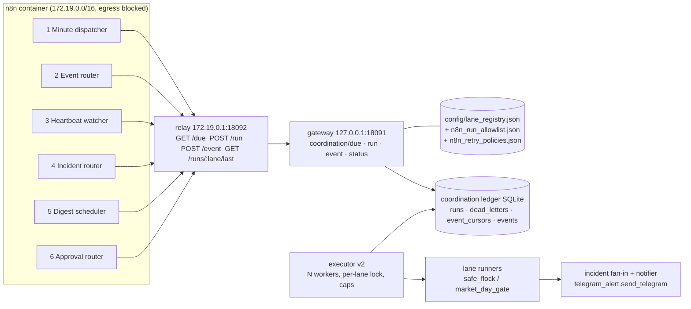
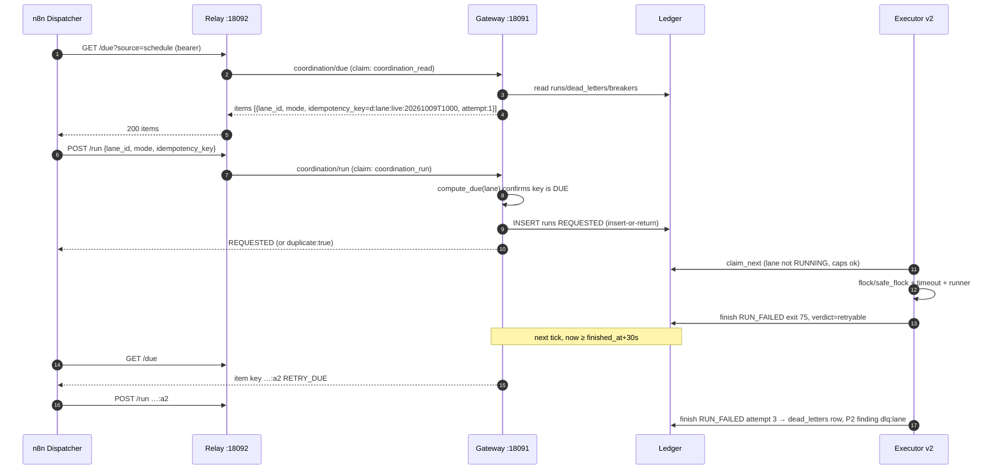
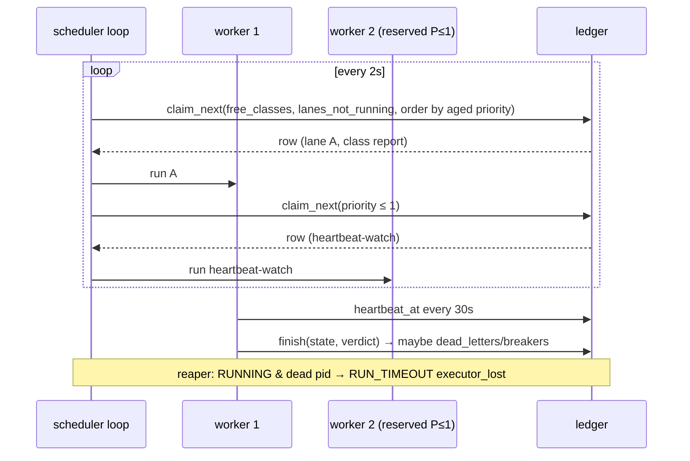
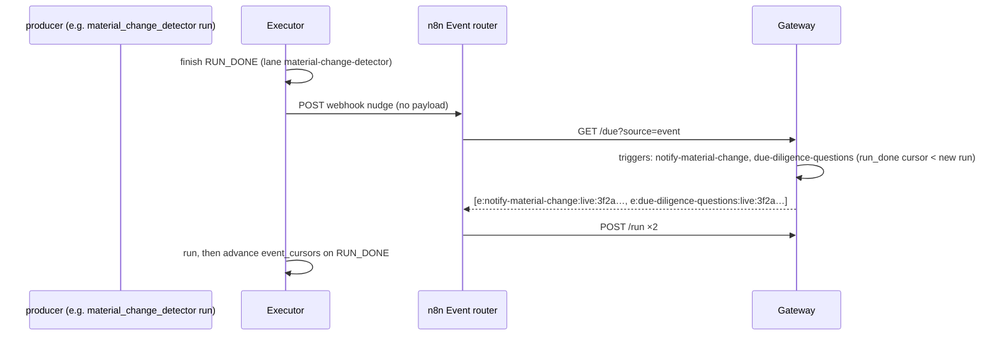
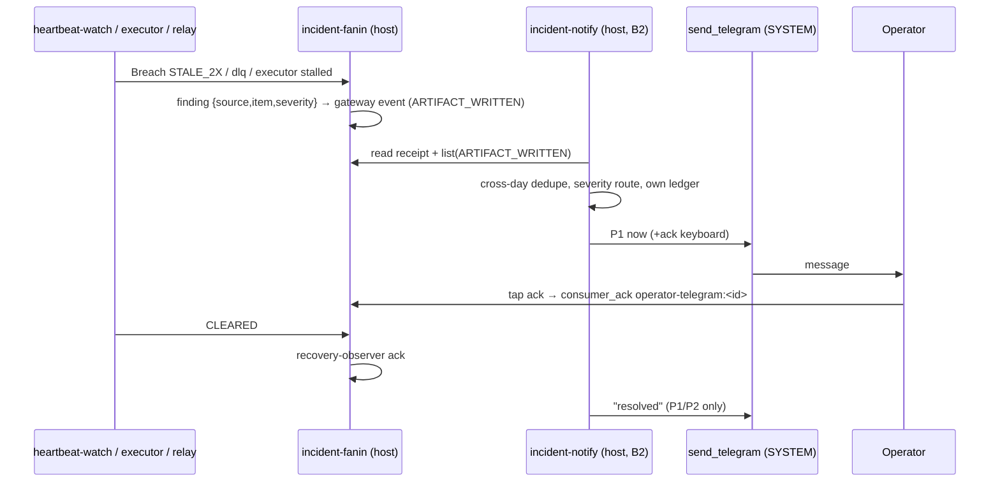

# N8N Maturity — 02: six-workflow architecture (registry-driven dispatch)

Status: DESIGN (spec only; no code, config, crontab, unit or workflow is changed by this document)
**Owner:** Agent A (architecture); build owner B3 (dispatcher, executor, workflows), B2 (notifier), C2 (retry/DLQ tests)
**Date:** 2026-10-09
**Authority:** program plan "N8N Maturity Acceleration" (Agent A). *Amended 2026-10-10:* AGENTS.md **4.4.0** §23 governs (the "3.1.0" this design proposed became 4.1.0 §23.11–§23.14, then 4.3.0 §23.18 and 4.4.0); where this design and AGENTS.md differ, AGENTS.md wins.
**Built state and procedure (2026-10-10):** [`N8N_CONFIGURATION.md`](N8N_CONFIGURATION.md) (what is configured), [`N8N_ONBOARDING_STANDARD.md`](N8N_ONBOARDING_STANDARD.md) (how to add a lane or workflow), [`N8N_MONITORING_AND_REMEDIATION_STANDARD.md`](N8N_MONITORING_AND_REMEDIATION_STANDARD.md). This file stays the design record.
Inputs: due-diligence audits A–F (2026-10-09), rationalization F §6–§9, full migration plan E §1–§7, and six read-only code studies of `origin/main` at 306f583f0 (one per workflow area).

Schemas: [`schemas/due-response.schema.json`](schemas/due-response.schema.json),
[`schemas/retry-policy.schema.json`](schemas/retry-policy.schema.json),
[`schemas/registry-dispatch-block.schema.json`](schemas/registry-dispatch-block.schema.json).

Path convention: `$CODE_ROOT` is the pinned CURRENT release and `$STATE_ROOT` is the persistent state root. No absolute home paths appear in this design.

---

## 0. Decision in one paragraph

n8n stops holding one workflow per lane. It runs exactly **six generic workflows**:
1. a minute dispatcher
2. an event router
3. a heartbeat watcher
4. an incident router
5. a digest scheduler
6. an approval router

None of them contains a lane id, a cron expression or a command. The **lane registry is the schedule**. A new read operation on the gateway, `coordination/due`, computes which (lane, mode, slot) is due now from the registry's cron expressions and the ledger's runs. The dispatcher posts `/run` for each item, echoing the `lane_id`, the `mode` and a server-minted `idempotency_key`. The gateway checks that key against its own due computation, so n8n cannot invent a slot. The host executor runs work concurrently: N workers, at most one run per lane, global and per-class caps, priorities, a retry policy per lane and a dead-letter table.

Moving a lane becomes a reviewed registry plus allowlist PR, followed by the existing promote. It needs no n8n import and no per-lane grant. Waves move whole lane sets through the same ladder: dry-run wave fire → live with cron still present → `_cutover.py --wave` → a proven rollback.



## 1. Where the pieces are today (2026-10-09, `origin/main` 306f583f0)

| Piece | File:function | What it does today | Gap this design closes |
|---|---|---|---|
| Relay | `scripts/n8n_run_relay.py` `Relay.run` (:272), `Relay.last_run` (:340) | Bearer auth. Body is `{lane_id, mode, idempotency_key?, workflow_id?, execution_id?}`. Checks the allowlist, plus `TRADEAI_N8N_RELAY_LIVE_LANES` for live mode. Signs a `coordination_run` claim and forwards it. `request_queue_size=64`. | `run_id` is per execution (`n8n-wf-<wf>-<exec>`), so there is no per-slot dedupe. No `/due` or `/event`. `last_run` ignores mode. |
| Gateway | `scripts/lib/n8n_coordination_gateway.py` `handle_request` (:243), `_run` (:309), `_list` (:420), `ALLOWED_ROUTES` (:36), `FORBIDDEN_ROUTE_TOKENS` (:64) | Routes are `coordination/event\|status\|run`. Operations are status, accept_event, the transitions, list, model_job and run. It never spawns. The allowlist is loaded once in `serve()`. | Needs a `due` operation and the slot-key check in `_run`. `list` reads receipts, not runs. |
| Executor | `scripts/n8n_run_executor.py` `drain()` (:301), `execute()` (:190), `build_argv()` (:151) | Strictly serial: claim_next → execute → finish → receipt. Typed states RUN_DONE / FAILED / TIMEOUT / SKIPPED_LOCK / REFUSED. | No concurrency, retry or DLQ. Never reaps stale RUNNING rows. A 16,200 s restore drill would block everything. |
| Ledger | `scripts/lib/n8n_coordination_ledger.py` `LedgerRunStore.request` (:520), `claim_next` (:547), `list` (:596) | SQLite in WAL mode. A `runs` row per run_id, insert-or-return-existing. | Additive columns and tables, listed in §3.3. |
| Allowlist | `config/n8n_run_allowlist.json` (18 lanes) | Holds argv, lock, timeout, dry/live args and output_signal. No cadence. | Cadence and dispatch facts go in the registry, not here. |
| Generator | `scripts/n8n_workflow_templates.py` `build_workflow` (:1087), `LANES` (:108, 74 rows) | Builds two workflows per lane (shadow and live) with the cron baked in. The relay URL placeholder caused the N2 EAI_AGAIN failure. | Retired. It is replaced by 6 static workflow files (§10). |
| Cron math | `scripts/lib/cron_schedule.py` `next_run` (:64), `next_run_any` (:87) | Vixie 5-field cron, wall-clock stepping. | No time zone and no DST rules. No `prev_run` or `fires_between`. |
| Incident fan-in | `scripts/n8n_incident_fanin.py` `collect` (:83), `idem_key` (:347), `build_event` (:359) | Produces P1–P3 findings into gateway events (lane `incident-fanin`). Recovery is a `consumer_ack` by `recovery-observer`. | Nothing reads its output. Keys change each UTC day, so a persistent incident comes back daily. |
| Approval board | `scripts/n8n_pilot_dispatch.py` `dispatch_board_events` (:183); `scripts/lib/approval_board_projection.py` `build_board` (:178), `expiring` (:147) | Packages warn at T-30 m and grants at T-10 m. Writes ARTIFACT_WRITTEN events. Sends nothing. | Pending guard *requests* are not on the board. No escalation ladder. |
| Heartbeat | `scripts/supervisor_breach_detector.py` `_expected_since` (:66), `detect` (:101); `scripts/lib/lane_registry.py` `observe_signal` (:271), `evaluate_lane` (:736); `scripts/lib/supervisor_heartbeat.py` `beat` (:54); `scripts/n8n_lab_watchdog.py` `check` (:84); `scripts/heartbeat_receiver.py` | The detector runs every 2 min at 3× cadence (cron-aware). `evaluate_lane` marks SLOW at 2× and SILENT beyond. The lab watchdog probes n8n `/healthz` every 5 min. | Two thresholds are in use, and the plan needs 2×. About 66 of the 99 stay-behind lines have no registry row. Breach rows never close. |
| Cutover | `scripts/pipelines/cutover/_cutover.py` `cmd_cutover_lane` (:369), `cmd_rollback_lane` (:465) | Per lane: comments the exact line, flips the registry row to `kind:n8n`, writes CutoverReceipt@v1. Rollback restores the exact line. | Needs a `--wave` batch mode (§9). |

## 2. Registry contract (the schedule of record)

Every movable lane gets one new block, `dispatch`, and every row gets an optional `watch` block. The full schema is in [`schemas/registry-dispatch-block.schema.json`](schemas/registry-dispatch-block.schema.json).

```json
"dispatch": {
  "mode": "off | dry_run | live",
  "cron": ["30 7 * * 1-5"],
  "tz": "America/New_York",
  "wave": "W3",
  "class": "report",
  "priority": 5,
  "retry_policy": "transient-2",
  "catchup_min": 60,
  "after": [{"lane_id": "close-capture", "same_day": true, "deadline_min": 90}],
  "triggers": [{"source": "run_done", "lane_id": "material-change-detector"}],
  "sweep_cron": ["0 * * * *"],
  "min_interval_s": 120
},
"watch": {"factor": 2.0, "severity": "P2", "max_run_s": 600}
```

Rules:
- **`dispatch.cron` is the single normalized cadence.** CI (`check_lane_registry`) asserts the following.
  - For a row still on `kind: cron`, `dispatch.cron` equals the 5-field schedule of the live line that `scheduler.match` selects.
  - For a row on `kind: n8n`, it equals `scheduler.cadence`.
  - `scheduler.expression` stays what it is today, a scheduler fact and not a cadence.
- `mode: off` (the default) means the dispatcher never emits the lane, so a registry row alone is inert.
- A lane is runnable only if **all three** hold: it has a registry row with `dispatch.mode ≠ off`, it has an allowlist entry, and the allowlist `never` test passes. Registry and allowlist arrive in the same PR. This replaces the relay env `TRADEAI_N8N_RELAY_LIVE_LANES`, which becomes derived (`dispatch.mode == live`) and is kept only as an emergency deny-list.
- `class` ∈ {`monitor`, `report`, `hygiene`, `pipeline`, `heavy`, `llm`, `ingest`, `send`, `learn`}.
  - `heavy` is implied when `timeout_s ≥ 1800`.
  - `llm`, `ingest`, `send` and `learn` are refused by CI until AGENTS rules R1/R2 (E §3) are ratified. *Amended 2026-10-10:* R1 is ratified (AGENTS.md 4.3.0 §23.18): `ingest`, `llm` and `learn` are admitted by `lane_dispatch.r1_class_admission`; `send` (R2) stays refused.
- *Amended 2026-10-10 (AGENTS.md 4.4.0):* while its cron line is live, a lane at `shadow` or `canary` stays a **cron row** (`scheduler.kind: cron`, `scheduler.stage`, `dispatch.mode` `dry_run` / `live`); only cutover uses the dispatcher row (`kind: n8n`, `expression: "dispatcher"`). See the onboarding standard §3.
- `watch` applies to **every** row, including cron/systemd stay-behinds. Its defaults are factor 2.0, severity from class (§8 table), and `max_run_s` from the allowlist `timeout_s` or 600.

## 3. Component 1 — gateway read route `coordination/due`

### 3.1 Request

The relay serves `GET /due?source=<schedule|event|digest>` with bearer auth. The relay signs a claim (caller `n8n-relay`, scope `coordination_read`) and POSTs it to the gateway:

```json
{"route": "coordination/due", "operation": "due", "claim": {...}, "signature": "...",
 "source": "schedule", "now": "2026-10-09T14:00:03Z", "limit": 40}
```

- `now` is advisory. The gateway uses its own clock and refuses `now` values more than 90 s from it (`due_clock_skew`), so a replayed or forged clock cannot make an old slot due.
- `limit` defaults to 40 and is capped at 100. Overflow stays due on the next tick, inside `catchup_min`.
- These bounds (tz, default and maximum `limit`, at most 8 lanes in `lane_filter`, at most 200 `held` entries) plus the retry-view lookback and the soft-edge default deadline live in `config/n8n_due.json` (`N8nDueConfig@v1`). The gateway and the relay import them from `scripts/lib/n8n_due.py`, so the relay's `limit` and lane caps cannot drift from the gateway's. The config may lower a bound but never raise it past the response schema. The 90 s skew is fixed by this section (`DUE_MAX_SKEW_S`, failure row F12).
- A refusal (`due_clock_skew`, `bad_source`, `bad_lane_filter`, `*_unreadable`) is the gateway's ordinary typed refusal `{state: REFUSED, reason}`. It does not carry the `DueResponse@v1` label, because that schema is closed and describes only a computed answer (`ok: true`).
- `due` is **read-only**. It writes nothing to the ledger. It may append one line to the relay log, which the relay writes, not the gateway. That line is the dispatcher's liveness signal (§4).
- Adding the route takes three changes: `ALLOWED_ROUTES += "coordination/due"`, an `operation == "due"` branch after the read-scope check, and a pure function `compute_due(registry, allowlist, policies, run_store, now, source)` in a new `scripts/lib/n8n_due.py` that the gateway imports. Neither `due` nor `coordination/due` contains a `FORBIDDEN_ROUTE_TOKENS` token. That was checked against :64.

### 3.2 Computation (pure, testable with a frozen clock)

For each registry row with `dispatch.mode ≠ off` whose lane is in the allowlist:

1. **Slots.** `fires_between(expr, now - catchup_min, now, tz)` for each `dispatch.cron`.
   - This is a new helper in `scripts/lib/cron_schedule.py`. It steps in local wall time with `zoneinfo`.
   - On a spring-forward gap, a nonexistent local minute fires once at the first valid instant after the gap.
   - On a fall-back fold, a repeated local minute fires once, on fold 0.
   - The slot identity is the **local wall-clock minute**, so the fold cannot mint two keys.
   - Sub-hourly lanes (cadence < 60 min) keep only the newest missed slot. They never replay a backlog.
2. **Slot key.** `d:<lane_id>:<mode>:<YYYYMMDDTHHMM local>`. Attempt *n* > 1 appends `:a<n>`.
   - The longest lane id today is 38 characters, so the key fits the existing `^[A-Za-z0-9._:-]{16,128}$`.
   - Event and digest keys use `e:` and `g:` (§6, §9).
3. **State per slot**, read from `runs` with `run_id LIKE '<key>%'`:

| State | Condition | Emitted? |
|---|---|---|
| `DUE` | no row for the key | yes, attempt 1 |
| `IN_FLIGHT` | latest attempt is REQUESTED or RUNNING | no |
| `DONE` | latest attempt is RUN_DONE, or RUN_SKIPPED_LOCK (the lock proves another run of this lane covered the slot; counted in `lock_skips`) | no |
| `RETRY_DUE` | latest attempt failed with a retryable verdict (§3.4), `attempt < max_attempts`, and `now ≥ finished_at + backoff[attempt-1]` (the chain stays in view after the slot leaves the window, see below) | yes, attempt n+1 |
| `RETRY_WAIT` | as above, backoff not yet elapsed | no (reported with `retry_at`) |
| `DEAD_LETTER` | a `dead_letters` row exists for the slot key | no |
| `WAITING_AFTER` | an `after` predecessor has no qualifying RUN_DONE on the same ET day (`same_day`, default) or in the 24 h before the slot. A **live** lane needs a live predecessor run; a **dry_run** lane accepts a dry_run or a live predecessor run. A soft edge stops waiting at its deadline (`deadline_min`, else `soft_after_default_deadline_min` from config, so a soft edge never waits forever). A hard edge keeps waiting. Deadlines count from the slot, or from the lane's first fire of the local day for a sub-hourly lane. Takes precedence over `BREAKER_OPEN`. | no (reported with `wait_deadline`; past the deadline → incident `after_deadline_missed`) |
| `BREAKER_OPEN` | `breaker_threshold` consecutive slots for the lane ended DEAD_LETTER, and no release since | no (P2 incident) |
| `MISSED` | only the **latest** fire at or before the window start, when it has no row, no dead letter and is not otherwise in view (one lookup per cron expression; older gaps are not re-reported). Also an out-of-window retry chain that was never requested before `retry_at + catchup_min` (reported with its `retry_at`). Sub-hourly lanes never report `MISSED`. | no (reported; the heartbeat watcher decides on staleness) |

   **Slots outside the window stay in view while they have unfinished business** (daily-or-slower lanes; the lookback is `max(catchup_min, retry_view_lookback_min, deadline_min + catchup_min per after edge)`):
   - an `IN_FLIGHT` attempt;
   - a retry chain until `retry_at + catchup_min`, after which it is held `MISSED` with its `retry_at` and is never silently dropped;
   - an after-gated attempt-1 slot that is still waiting, until its latest deadline plus `catchup_min`. A hard edge is therefore visible past its deadline, and the watcher raises `after_deadline_missed`.
   - an after-gated attempt-1 slot released by its gate (predecessor done, or soft deadline reached), until the release time plus `catchup_min` (reason `catchup`). This is the design §2 example: catchup 60 with deadline 90 releases at slot+90 and stays due until slot+150.
   - `DONE` and `DEAD_LETTER` slots drop out.

   **`after` defects that keep the lane evaluated** are reported in `errors[]`:
   - `after_not_dispatched`: the predecessor is off, on cron or ineligible, so it writes no ledger row and the edge can only time out.
   - `after_mode_unsatisfiable`: a live lane comes after a predecessor dispatched in dry_run.

   **Cutover note.** On the first `due` call for a newly dispatched lane, its latest pre-window fire has no ledger row because cron ran it. The lane reports one `MISSED` per lane until the next fire. That is expected noise; the heartbeat watcher should not page on `MISSED` from the first day of a wave.
4. **Mode filter.** Predecessor and last-run checks filter on `mode`. This fixes the defect where a dry_run row could satisfy a gate (relay `last_run` today).
5. **Ordering.** Ascending `(priority, slot)`, truncated to `limit`.

The response is [`schemas/due-response.schema.json`](schemas/due-response.schema.json). Each item carries only `lane_id`, `mode`, `idempotency_key`, `attempt`, `slot_local`, `reason` and `priority`. The command, lock, argv, timeout and output_signal **never leave the host** (§23.3).

*Amended 2026-10-10 (RC11, #1667):* `compute_due` must be cheap under concurrency. The served gateway runs at
`CPUQuota=20%` behind a relay `urlopen(timeout=5)`, and it is GIL-serialised under `ThreadingHTTPServer`. When the
event router, incident router and digest scheduler joined the dispatcher at 17:14 ET, the calls that landed in the
same minute were refused `relay_gateway_unreachable`. 99% of the CPU went to `lane_dispatch.forbidden_text_hits` /
`_compound_hit`, which rebuilt ~160 word-form sets for ~560 command texts on every call. The matcher is now built once
and keyed on its inputs, with a per-text memo; one call takes 510 → 10 ms and four concurrent calls 1.61 s → 38 ms,
with byte-identical verdicts. `tests/test_gateway_due_latency_20261010.py` holds a CPU-budget gate. Any change to
`compute_due` or the eligibility predicate keeps that gate green, and the relay-contract check (one call at a time)
is not evidence of concurrency.

### 3.3 `_run` additions and ledger changes (additive)

- **`_run` validates server-minted keys.**
  - If `idempotency_key` starts with `d:`, `e:` or `g:`, the gateway re-runs `compute_due` for that one lane and checks that the key is currently `DUE` or `RETRY_DUE` with the same mode.
  - Otherwise it refuses with `run_slot_not_due`.
  - Keys without these prefixes keep today's behaviour, so the 4 existing per-lane workflows keep working during the transition.
- **`runs` gains columns:** `slot_key`, `attempt`, `parent_run_id`, `class`, `priority`, `worker_id`, `pid`, `heartbeat_at`, `verdict`. All are nullable, so old rows stay valid.
- **New tables:**
  - `dead_letters(slot_key PK, lane_id, mode, slot_local, attempts, last_run_id, last_state, last_reason, verdict, dead_at, released_at, released_by, release_note)`
  - `event_cursors(lane_id, source, cursor, updated_at, PK(lane_id, source))`
  - `breakers(lane_id PK, opened_at, consecutive, released_at, released_by)`
- **Writers.** The **executor** writes `dead_letters` and `breakers`, because it holds the verdict. The gateway's `_run` writes `runs`, as today. `due` writes nothing.
- **Release.** `scripts/n8n_dlq.py release --slot-key … | --lane … --note …` is a host CLI for the operator or an agent. It writes `released_at` and is recorded in DeadLetterRelease@v1.
  - A release re-arms the slot as `RETRY_DUE` (reason `dlq_release`) with `attempt = attempts + 1` (at most 9). That happens only when `dead_letter_rearmable` accepts the row: classes `send`/`learn`, single-attempt policies and legacy rows with an unknown class or max_attempts never re-arm. It also happens inside the catch-up window only.
  - Outside the window, or for a row that is not re-armable, a release only clears the breaker.
  - A re-dead slot clears its release. The re-armed attempt is then minted once: after its row exists, the ordinary retry rules apply.
- **`_run` key checks.** The prefix test is case-insensitive, so `D:`/`E:`/`G:` cannot pass as a legacy key. Only the exact lower-case, well-formed form is accepted, and its lane and mode must equal the request's. A replay of an accepted key returns the existing row only when that row's lane and mode match; otherwise it is `run_slot_not_due` / `KEY_MISMATCH`.

### 3.4 Retry policy

Policies live in `config/n8n_retry_policies.json` (`N8nRetryPolicies@v1`, schema [`schemas/retry-policy.schema.json`](schemas/retry-policy.schema.json)). Each lane names one with `dispatch.retry_policy`.

| Policy | max_attempts | backoff_s | retryable | never retry | used by |
|---|---|---|---|---|---|
| `none` | 1 | — | — | all | `send`, `learn` classes (a retry could double-send or double-write) |
| `transient-2` (default) | 3 | [30, 120] | RUN_TIMEOUT; exit 75 (EX_TEMPFAIL), 69, 111; spawn ENOMEM/EAGAIN | RUN_REFUSED, exit 2, any `cost_cap` reason | `report`, `monitor`, `hygiene`, `pipeline` |
| `transient-1-slow` | 2 | [600] | RUN_TIMEOUT, exit 75 | as above | `heavy` |
| `llm-transient` | 2 | [300] | RUN_TIMEOUT, exit 75; reason matches `dns\|5\d\d\|connection` | `COST_CAP`, `PEAK_SKIP`, 4xx | `llm` (only after R1) |

- **Verdicts.** The executor computes `verdict ∈ {ok, retryable, terminal, skipped}` from `(state, exit_code, reason)` against the policy, and writes it on the run row. `RUN_SKIPPED_LOCK` is `skipped`, which satisfies the slot (§3.2).
- **When a run goes to the DLQ.** `terminal`, or `retryable` with `attempt == max_attempts`, writes `dead_letters` and raises a P2 finding `dlq:<lane>` (P1 if the lane's `watch.severity` is P1).
- **Breaker.** `breaker_threshold` (default 3) consecutive dead slots open the breaker. It closes automatically on the next RUN_DONE of a manual or released run, or through `n8n_dlq.py release --lane`.
- **Never in n8n.** Retries are always a new `/run` with a new attempt key, minted by `due`. n8n's own `retryOnFail` applies only to the HTTP call (relay unreachable). That retry is safe because the key dedupes (`LedgerRunStore.request` is insert-or-return-existing).

### 3.5 Sequence: due → run → retry → DLQ



## 4. Component 2 — minute dispatcher workflow (`tradeai-dispatcher`)

One workflow serves all scheduled lanes. Its nodes:

1. **Schedule Trigger.** Every minute (`* * * * *`, timezone America/New_York). `settings.executionTimeout = 50` s. `saveDataErrorExecution = all`. `errorWorkflow = tradeai-incident-router`.
2. **Set "relay".** `TRADEAI_N8N_RUN_URL = http://172.19.0.1:18092`, using the bridge IP and never a hostname (EAI_AGAIN lesson, E §4.5). This is the only constant in the workflow.
3. **HTTP GET `/due?source=schedule&limit=40`.** Uses header-auth credential `tradeai-run-relay`, a 10 s timeout and `retryOnFail` (2 tries, 3 s apart).
4. **Code "validate due".** Asserts `schema == "DueResponse@v1"`, `source == "schedule"` and `items.length ≤ limit`. Drops any item field other than `lane_id`, `mode` and `idempotency_key`, so the outgoing body cannot carry anything else.
5. **Split In Batches (size 5)** → **HTTP POST `/run`** with body `{lane_id, mode, idempotency_key, workflow_id: $workflow.id, execution_id: $execution.id}`, `retryOnFail` 2 × 2 s and `neverError` → **Wait 1 s** between batches. At 40 items that is at most 8 batches, about 12 s.
6. **Code "assert".** Each response must be `state == "REQUESTED"` or `duplicate == true`. Results are collected into `{posted, duplicate, refused[], unreachable[]}`.
7. **IF any refused or unreachable → Stop And Error.** The message carries the lane ids and reasons only. The error workflow turns it into a `n8n-workflow-error` event (§8).

**Why batched per item rather than one bulk POST.** `coordination/run` stays the only trigger path and keeps its one-lane contract (§23.3). The relay already queues 64 requests.

**Tick budget.** Today's cron peak is about 30 lines at `:00` on weekdays. At 40 per tick the dispatcher clears that in one tick. Anything beyond rolls to the next minute, and `catchup_min` keeps it valid.

**Dispatcher liveness.** The relay appends one `due` line per call to `relay_log.jsonl` (existing writer). `n8n_incident_fanin._relay_findings` gains a `dispatcher:silent` P1 when no `due` call is seen for 5 minutes during n8n's expected uptime. That check is host-side, so a dead n8n is still seen.

## 5. Component 3 — executor concurrency (executor v2)

`scripts/n8n_run_executor.py` keeps one process and one systemd unit (`tradeai-n8n-run-executor.service`, own cgroup). `drain()` becomes a **scheduler loop plus N worker threads**. Each worker runs one subprocess at a time. The subprocess is the existing `build_argv` result (flock/safe_flock → `timeout -k 30` → optional `market_day_gate.sh` → runner), unchanged.

| Control | Rule | Where enforced |
|---|---|---|
| Workers | `N = TRADEAI_N8N_EXECUTOR_WORKERS`, default 1 (the v1 serial drain; v2 is opt-in with `N >= 2`, an invalid value is 1 with a logged warning), maximum 8. Intervals and limits: `config/n8n_executor.json`. *Live since 2026-10-10 13:07 ET: N = 3 via the installed drop-in `tradeai-n8n-run-executor.service.d/10-executor-v2.conf` (service grant eebd4ca0a6b31bd2); the repo unit still sets none.* | executor |
| Per-lane lock | `claim_next` claims only lanes with no RUNNING row (`NOT EXISTS (SELECT 1 FROM runs r2 WHERE r2.lane_id = runs.lane_id AND r2.state='RUNNING')`) inside `BEGIN IMMEDIATE`. The lane's own flock/safe_flock stays as the cross-scheduler guard against cron. | ledger + lane lock |
| Global cap | `min(N, class_caps.global)` RUNNING rows in the ledger | executor |
| Class caps | `heavy` 1, `llm` 1, `ingest` 1, `send` 1, `pipeline` 2, `learn` 1; `monitor`/`report`/`hygiene` share the global cap. Read from `config/n8n_retry_policies.json#class_caps`. | `claim_next(exclude_classes=full)` |
| Priority | `ORDER BY (priority - min(floor(wait_s/300), 3)), requested_at`. Priority 0 = incident/heartbeat/approval, 9 = backfill. The aging term stops starvation. | ledger |
| Reserved slot | one worker is reserved for priority ≤ 1, so a heavy lane never blocks the incident/heartbeat lanes | executor |
| Stale-RUNNING reaper | At start and every 60 s: a RUNNING row whose `heartbeat_at` is older than 90 s and whose pid is not alive, or whose `started_at + timeout_s + 120 s < now`, finishes as `RUN_TIMEOUT / executor_lost` with verdict `retryable`. Workers touch `heartbeat_at` every 30 s. | executor |
| DLQ | §3.4; written in `finish()` | executor |
| Receipts | `RunReceipt@v2`: the v1 fields plus `slot_key`, `attempt`, `parent_run_id`, `class`, `priority`, `worker_id`, `queue_wait_s`, `verdict`, `retry_policy`. `ExecutorStatus@v1` goes to `n8n_run_executor_last.json` every loop: workers busy, queue depth by class, oldest REQUESTED age, reaped count, DLQ count 24 h. | executor |
| Memory | Unit `MemoryMax` stays. Each child can also run with `systemd-run --user --scope -p MemoryMax=<class limit>` behind a flag (off by default; it needs a unit-install grant). | unit |



## 6. Component 4 — event router workflow (`tradeai-event-router`)

**Principle.** A producer records that something happened, and the gateway decides which lane runs. n8n never sees event payloads.

**Event sources** that `compute_due(source="event")` reads server-side, all without a database credential in n8n (§23.5):

| Source kind | Read from | Exists today? |
|---|---|---|
| `run_done` | `runs` rows of the named upstream lane, `mode=live`, `state=RUN_DONE` | yes (for dispatcher-run upstreams) |
| `receipt` | sha256 or mtime of a named `$STATE_ROOT` receipt file versus the cursor | yes (files exist) |
| `cio_bus` | `data/cio/cio_events.jsonl` by type, cursor = line offset (`scripts/lib/cio_event_bus.py`) | yes |
| `ledger_event` | the gateway `events` table filtered by lane (`accept_event` already exists) | yes, but empty today |
| `outbox` | `domain_event_outbox` rows, copied into the gateway `events` table by a host lane `domain-event-bridge` (Postgres → `accept_event`), so the gateway stays SQLite-only | no: the table is a schema stub in `scripts/lib/cio_event_outbox.py`. Producers must add a same-transaction insert. |

**Mechanics.**
- For each lane with `dispatch.triggers`, pending events are those with a cursor greater than `event_cursors[lane, source]`. All pending events coalesce into **one** run, keyed `e:<lane>:<mode>:<max cursor hash12>`.
- `min_interval_s` debounces bursts.
- The executor advances `event_cursors` when that run finishes `RUN_DONE`. A failed run leaves the cursor, so the next tick re-emits under the retry policy.
- `sweep_cron` (usually hourly) stays as the safety net and runs through the minute dispatcher, so a lost event costs at most one sweep interval.

**Workflow.**
- Two triggers.
  - A **Webhook** (`POST /webhook/tradeai-nudge`, header auth, body ignored). The host's `domain-event-bridge` and the executor call it after writing an event or a RUN_DONE, which gives sub-second latency.
  - A **Schedule** every minute, so a missed nudge waits at most 60 s.
- Both go to GET `/due?source=event` → same validate / batch / POST `/run` / assert chain as §4.

The webhook only wakes the router. A forged nudge can at most make n8n ask `/due` early.



### 6.1 The 23 pollers and 4 prewarms (F §6): which have a real producer event

**Summary:**
- 8 can be event-driven with **existing** producers (`run_done` / receipt / CIO bus), once the upstream lane is on the dispatcher.
- 10 have a real producer that needs a one-line emit (outbox insert) first.
- 3 are partial: event plus a slower clock.
- 4 stay scheduled: broker class, or the logic depends on elapsed time.
- 2 are eliminations.

| # | Lane (cron line) | Today | Producer event | Class | Target |
|---|---|---|---|---|---|
| 1 | notify_material_change (L934) | 7-59/15 | `run_done` of material_change_detector (sole writer of `material_changes`) | EXISTING | trigger; drop clock |
| 2 | due_diligence_questions (L954) | */20 | `run_done` of material_change_detector | EXISTING | trigger; hourly sweep |
| 3 | proposal_llm_review_worker (L681) | */30 6-19 | `run_done` of proposal_enrichment_loop (sole writer of `proposal_llm_review_queue`) | EXISTING (W4, llm) | trigger after R1 |
| 4 | hermes_score_alerts (L450) | 15,45 | `run_done` of hermes_watchlist_scorer (sole writer of `hermes_score_history`) | EXISTING (W4, send) | trigger or fold into digest (F) |
| 5 | warm_caches (L516) | */8 24×7 | `run_done` of the P01 quote/price pipeline | EXISTING | trigger; drop 24×7 |
| 6 | finviz-strip prewarm curl (L574) | */8 6-17 | `run_done` of the P02 Finviz pull | EXISTING | trigger |
| 7 | trade-ai + scanner prewarm curls (L753) | */5 24×7 | `run_done` of the scan lane (writes `trade_ai_scans`) | EXISTING | trigger |
| 8 | cio_wake_dispatch_entrypoint (L850) | */5 24×7 | `receipt`: append to `cio_wake_jobs.jsonl` (`CIOWakeJobStore`) | EXISTING, but B-cio stays host-scheduled (E §3) | watch only; host may self-trigger |
| 9 | agent_event_router (L316) | */30 | INSERT `agent_event_queue` (event_detector, topic_curator, iris_taxonomy_agent, agent_watchlist_engine) | NEEDS EMIT | outbox → trigger |
| 10 | auto_enrichment_runner (L234) | */10 4-19 | new `paper_trade_proposals` row (10 inserting scripts) | NEEDS EMIT | outbox; merge with #11 |
| 11 | proposal_enrichment_loop (L269) | */10 4-19 | same proposal insert | NEEDS EMIT | outbox + hourly re-price sweep |
| 12 | send_telegram_proposal_alert (L227) | */2 9-16 (240/day) | readiness write in `proposal_execution_readiness` | NEEDS EMIT (W4, send) | outbox; biggest run saving |
| 13 | run_ensemble_worker (L547) | */3 24×7 | INSERT `inference_ensemble_jobs` | NEEDS EMIT | outbox → trigger |
| 14 | hermes_score_event_feeder (L655) | */5 24×7 | new rows in 5 source tables | NEEDS EMIT | becomes an outbox consumer |
| 15 | screener_go_alerts (L961) | */15 9-16 | GO rows in `trade_ai_scans` (148/310 runs had none) | NEEDS EMIT (or `run_done` of scan lanes) | trigger |
| 16 | directive_keyword_enhancer (L519) | 25,55 | `watch_directives_writer` (single writer, has `WriteReceipt.directive_id`) | NEEDS EMIT | emit from writer |
| 17 | watchlist_enrichment_sweep (L447) | */30 9-16 | INSERT `watchlist_items` | NEEDS EMIT | trigger + daily sweep |
| 18 | backfill_subject_identity (L926) | */30 | corpus inserts (news/research writers) | NEEDS EMIT (weak) | fix at the writer; hourly meanwhile |
| 19 | watch_alerts_eval (L746) | */20 9-16 | `watch_directive_hits` rows (event); price conditions need quotes | PARTIAL | hits trigger + */60 clock |
| 20 | hermes_subject_enhance_dispatch (L1033) | 0,20,25,30,40 | proposal and closed-trade subjects have producers; position/sector/report are clock-based | PARTIAL | split |
| 21 | material_change_detector (L933) | */30 | could key on quote batch writes; compares against its own baseline | PARTIAL | keep clock (it is the producer for #1, #2) |
| 22 | proposal_lifecycle (L271) | */30 9-16 | none (expiry by elapsed time and drift) | NO PRODUCER | stay scheduled (*/60 candidate) |
| 23 | paper_execution_sweep (L130) | */5 9-16 | primary path is already event-based; this is the safety net | NO PRODUCER (C, broker) | stays on cron, watched |
| 24 | run_broker_queue_autocal (L567) | */5 9-16 | needs a Schwab quote refresh | NO PRODUCER (C, broker) | stays on cron, watched |
| 25 | options_lifecycle_run (L768) | */20 9-16 | broker reconcile and quotes | NO PRODUCER (C, broker) | stays on cron, watched |
| 26 | ask_alerts (L486) | */30 8-18 | — (213/213 runs fired nothing) | ELIMINATE (R0) | retire |
| 27 | eligible prewarm inline (L573) | */15 6-17 | none identified; log stale | ELIMINATE (R0) | retire |

**Finding.** No Postgres LISTEN/NOTIFY exists in the repo, and the gateway `events` and `effects` tables are empty. The **n8n Postgres Trigger node is not an option**: §23.3 blocks container egress, and §23.5 allows no database credential. Producer events therefore always enter through the host: `domain-event-bridge` → `accept_event`, or `run_done` in the ledger.

## 7. Component 5 — heartbeat watcher workflow (`tradeai-heartbeat-watcher`)

**What it watches.** Every registry row, on any scheduler kind: cron, systemd, n8n, event or none. That includes the 99 stay-behind lines and 15 timers (E §1: 55 broker/positions/stops/orders/paper, 15 infra/daemon/secret, 24 CIO loops, 2 sub-5-minute, 2 DOF, 1 @reboot).

**Host lane `heartbeat-watch`** (allowlisted, class `monitor`, priority 0, `dry_run` and `live`). It runs `supervisor_breach_detector.py` with a new `--factor-from-registry` mode instead of a fourth freshness checker. It consolidates the 3× detector, `evaluate_lane` (2×) and the six health-tick freshness steps (F §3) into one function:

- **`deadline`.**
  - For cron rows: `last_expected_fire(dispatch.cron or scheduler cron, tz, active_days) + watch.max_run_s + (factor − 1) × period`.
  - For other rows: `factor × expected_cadence_hours`.
  - `factor` defaults to **2.0**.
- **Signal.** `observe_signal(output_signal)`, plus, for `kind:n8n` rows or rows with `dispatch`, the newest live RUN_DONE in the ledger. Whichever is newer counts.
- **Verdicts.**
  - `FRESH`
  - `LATE` (past 1×; no incident)
  - `STALE` (past the deadline) → Breach@v1 `kind=STALE_2X`
  - `UNVERIFIABLE` (`output_signal.kind = none`) → weekly P3 `governance:no_signal`
  - `ORPHANED` (scheduler missing) → P2
  - `EXPECTED_SILENT` (outside `active_days`)
- **Closing.** A STALE lane that becomes FRESH gets a `CLEARED` Breach row. The fan-in uses it to close the incident the same day. This fixes the 48 h window in which breach rows could never close.

**Workflow.** Schedule `*/5` → `GET /due?source=schedule&lane=heartbeat-watch`. That is a single-lane filter on the same route, so the key is still server-minted. → POST `/run` → Wait 60 s → `GET /runs/heartbeat-watch/last?mode=live` (the new mode filter) → assert that RUN_DONE is under 10 min old, otherwise Stop And Error.

It is a separate workflow from the dispatcher on purpose. A broken dispatcher, due computation or class cap must not blind monitoring. The watch lane runs in the reserved priority-0 worker.

**Watching the watchers.**
- The host-side `tradeai-n8n-lab-watchdog.timer` (n8n `/healthz`) and the host-side `dispatcher:silent` check stay on systemd. They are the floor if n8n itself dies.
- `heartbeat_receiver`'s missing respawn line is fixed in W0.
- Off-host liveness is out of scope. It is a recorded risk (single host, no UPS).

**Prerequisite.** B1's reconciliation must give rows (cadence + output_signal, at minimum a log mtime) to the about 66 stay-behind lines that have none. Until then the watcher reports them as `UNGOVERNED`, which is honest, not silent.

## 8. Component 6 — incident router workflow (`tradeai-incident-router`)

**Workflow.**
- Two entry points.
  - **Schedule `*/1`** → `/due?source=schedule&lane=n8n-incident-fanin,incident-notifier`. Fan-in runs every 5 min, notify every 1 min, and notify has `after: n8n-incident-fanin` (soft). *Amended 2026-10-10 (W0 relay fix): the filter names registry rows. `incident-fanin` is the fan-in's gateway event lane, not a registry row, and B2 shipped the notifier as row `incident-notifier`; the gateway refuses a filter naming a non-row (`bad_lane_filter`), which failed every incident-router tick at W0.*
  - **Error Trigger**, the `errorWorkflow` of all six workflows → POST relay `/event` (new) → gateway `accept_event` on lane `n8n-workflow-error` with `{workflow_id, execution_id, node, message[:160]}`. The relay refuses any other lane on `/event`. The fan-in reads those events as P2 (P1 if `workflow_id` is the dispatcher or the watcher).
- n8n sends nothing (§23.3).
- *Built 2026-10-10 (W0 relay fix, `scripts/n8n_run_relay.py` `Relay.event`):* `POST /event` accepts exactly
  `{lane_id, workflow_id, execution_id, node, message}`, refuses any lane but `n8n-workflow-error`
  (`relay_event_lane_refused`), cleans and bounds `node` (64) and `message` (160), and forwards one read-scope
  `accept_event`. The gateway event schema is closed, so `workflow_id`, `execution_id`, `node` and `message` travel
  in `subject_key`; the idempotency key is `wferr-<workflow_id>-<execution_id>` and a retry replays the same event.
  The gateway accepts it only when `n8n-workflow-error` is in `TRADEAI_N8N_GATEWAY_EXTRA_LANES` (operator unit
  change); until then it answers `unknown_lane`. `scripts/check_n8n_relay_contract.py` checks every workflow HTTP
  node against the relay's routes and the registry before an import.

**Host lane `incident-notify`.** This is B2's notifier, class `send`, retry policy `none`, priority 0. It reads `n8n_incident_fanin_last.json` plus the gateway `list(lane=incident-fanin, state=ARTIFACT_WRITTEN)`. It keeps **its own ledger**, `data/runtime/incident_notifications.jsonl`. It never `consumer_ack`s its own sends, because that would read as "acknowledged".

| Severity | Examples | Routing | Re-notify / escalate |
|---|---|---|---|
| P1 | executor stalled, relay down, dispatcher silent, `STALE_2X` on broker/stop/daemon lanes, `served_copy_split`, `expected_services` | immediate, with the ack keyboard (`ack:<idem>`, existing callback handler) | every 30 min until ack or recovery, maximum 4; then one "P1 UNACKED" rollup per hour |
| P2 | RUN_FAILED to DLQ, breaker open, `STALE_2X` on pipelines/reports, ORPHANED, relay auth failures | immediate once per **cross-day key** `source\|item` within 24 h | none; repeats fold into the next digest window |
| P3 | UNGOVERNED, governance no-signal, gap resolution | the next digest window (§9) ops section | — |
| P4 | informational recoveries of P3 | ledger only | — |

- **Recovery** of a notified P1/P2 sends one "resolved" line in the same thread.
- **Flood guard.** More than 10 new P1/P2 in one tick sends one rollup message instead.
- **Quiet hours.** None for P1. P2 found between 22:00 and 07:00 ET is held until 07:00 unless the lane's `watch.severity` is P1. No quiet-hours logic exists anywhere today; this is new and small.
- **Transport.** `telegram_alert.send_telegram(..., bypass_router=True, message_class="operator_alert")` on the SYSTEM family. B2 adds the notifier module to `SYSTEM_FAMILY_CALLERS` (`scripts/telegram_transport.py:149`) in the same PR, with the interdict-scope test updated, so ops alerts answer to `SYSTEM_TELEGRAM_INTERDICT` and not the CIO switch. The ack keyboard forces `_legacy_send`. That path is accepted for P1 only, and the notifier owns dedupe.



## 9. Component 7 — digest scheduler workflow (`tradeai-digest-scheduler`)

*Amended 2026-10-10 (operator notification model, approved ~18:40 ET):* n8n orchestrates notifications — this
workflow, the incident router and the approval router fire the host lanes that route, batch digests, escalate and
handle button callbacks — and the host communications gateway (`send_telegram`, the delivery ledger and the approved
adapters) is the only sender. The P1 path does not depend on n8n: the incident notifier (L1052) and the SIEM bridge
stay on host cron. Sender jobs migrate to notification intents handed to the gateway. Nothing in §23.3 or §23.11
changes (AGENTS.md 4.6.0 §24.1, PROPOSED).

**Anchor.** The `advice-digest` lane (`scripts/send_advice_digest.py`, slots 10/15/17 ET in `config/advice_digest.yaml`) is already a watermark-pull digest. It reads `communication_events`, held CIO notes and P1 archives, and five digest lines were folded into it on 10-08. The scheduler builds on it instead of replacing it.

**Windows.** A new DigestWindows@v1 config holds windows and members. It is not in the repo yet (planned path: config/digest_windows.json, lands with the digest-scheduler PR):
- weekday 10:00, 15:00 and 17:00 (from `advice_digest.yaml`)
- Saturday 09:00 and Sunday 18:00 (new weekend slots for oversight, rotation and strategy text)
- the morning brief at 07:30 stays standalone (F: KEEP)

**`compute_due(source="digest")`.**
- At **T−15 min** it emits the window's *preparer* lanes. These are deterministic section writers that write files and `communication_events` but send nothing: analyst daily, desk suggestions, options lifecycle digest, ipo lockup, alert_missing_conditions, ops_daily, llm_spend `--period auto`, and the weekend oversight, rotation and strategy text.
- At **T** it emits the window's single *sender*, `advice-digest --slot <window>`, class `send`, policy `none`, with `after:` every preparer.
- If preparers are still missing at `T + 10 min`, the sender is emitted anyway with `--partial`, and the digest prints a "sections missing: …" banner. A late digest is better than none, and a sender never retries.
- Keys are `g:<lane>:<mode>:<window local>`.

**Workflow.** Schedule `*/5` → `/due?source=digest` → the same POST chain.

**Rules.**
- No LLM work runs inline in a window. A preparer that needs an LLM is wrapped by `run_with_deepseek_offpeak.sh --scheduled` (`PEAK_SKIP`, exit 0) or defers through `llm_deferral`. Deferred output lands in the next window through the watermark.
- `market_day_gate.sh` stays on weekday windows.

**Folding table.** These standalone lines become preparers (cron L-numbers from E §9):

| Fold into | Lanes |
|---|---|
| 10:00 | 569, 863, 769, 488, 202, 158, 963/964/965 |
| 17:00 | 752, 841 |
| weekend | 763, 500 text, 277 |

These stay standalone and are linked from a digest:
- 153 (weekly docx)
- 571/572 (analyst reports)
- 131/138 (`multi_tier_trade_reviewer`, LLM)
- `system_rollup_snapshot` (side-effect)

232 (eod_open_trade_alert) is an R0 elimination.

## 10. Component 8 — approval router workflow (`tradeai-approval-router`)

**Workflow.** Schedule `*/5` → `/due?lane=approval-escalate` → POST `/run`.

**Host lane `approval-escalate`.** Class `send`, policy `none`, priority 0. It extends `approval_board_projection.build_board` with:
1. **A third loader, `load_requests`.** It reads PENDING guard requests from the remote-approval store (`GuardRemoteApproval@v1`, `remote_requests.json`) **read-only**. This closes the 2026-09-06 gap where a pending request expired unseen.
2. **A tiered ladder in `event_plan`.** The key gains the tier: `apx-<kind>-<id>-<tier>`.

| Item | Tier: action |
|---|---|
| Package (24 h window, existing 4 h and 12 h reminders kept) | **T−30 m**: P2 nudge. **Expired undecided**: P2. |
| Guard request (answer deadline 4–12 h) | **T−60 m**: re-ping with the original approve/deny keyboard. **T−10 m**: P1 re-ping. **Expired**: P2 "request lapsed". |
| Grant (≤ 12 h) | **T−60 m**: P3 into the digest. **T−10 m**: P2 if `uses == initial uses` ("granted, unused, expiring"; the 10-07 incident). **Expired unused**: P2. |

**Sending.** Sends go through `send_telegram(bypass_router=True)`, the existing approval path. A request message suppressed as P1_DIGEST was the original reason for bypassing. One prompt per item per tier.

**What it retires.**
- `approval_reminder_reconcile.py` (L998; 64/64 NO_ACTION, an R0 elimination)
- the hourly `approval_package_reminder.py` (L996, `5 * * * *`, folded into this lane)
- `n8n_pilot_dispatch.dispatch_board_events` (kept as a projection receipt only)

**Rail conflict to resolve in 3.1.0 (§13).** The allowlist `never` list includes "guard". This lane only **reads** guard state, through `guard_ledger.py list` and the request store, and writes no grant, request or guard config. It still needs an explicit 3.1.0 carve-out ("read-only guard projection for escalation") and a `FORBIDDEN_ROUTE_TOKENS`-compatible argv. **Fallback** if the carve-out is refused: `approval-escalate` stays on a host systemd timer, and the n8n approval router workflow only runs its heartbeat check through the watcher. The other five workflows are unaffected.

## 11. The six workflow files

These are generated **once** by `python3 scripts/n8n_workflow_templates.py build-generic` (#1596, `build_generic()`) and committed under `docs/implementation/n8n-maturity/workflows/` (the script's default `--out`; `--check` verifies the committed files). They carry no lane constants. Static test `test_no_lane_constants_beyond_the_system_filters` (`tests/test_n8n_maturity_generic_workflows_20261009.py`, §15) enforces that.

| # | id (name) | Triggers | Relay calls | errorWorkflow |
|---|---|---|---|---|
| 1 | `tradeai-dispatcher` | schedule `* * * * *` | GET /due?source=schedule, POST /run | 4 |
| 2 | `tradeai-event-router` | webhook nudge + schedule `* * * * *` | GET /due?source=event, POST /run | 4 |
| 3 | `tradeai-heartbeat-watcher` | schedule `*/5` | GET /due?lane=heartbeat-watch, POST /run, GET /runs/heartbeat-watch/last?mode=live | 4 |
| 4 | `tradeai-incident-router` | schedule `* * * * *` + Error Trigger | GET /due?lane=n8n-incident-fanin,incident-notifier, POST /run, POST /event | itself is excluded; host `dispatcher:silent` covers it |
| 5 | `tradeai-digest-scheduler` | schedule `*/5` | GET /due?source=digest, POST /run | 4 |
| 6 | `tradeai-approval-router` | schedule `*/5` | GET /due?lane=approval-escalate, POST /run | 4 |

- The 37 existing workflows are deactivated, never deleted. The 4 live per-lane workflows (`n8n-pilot-dispatch`, `n8n-incident-fanin`, `n8n-research-intake-consumer`, `crontab-snapshot-for-health-agent`) move onto the dispatcher in wave W1.
- The 122 pending generated files are archived as superseded.
- `lane=` filters on `/due` are a list of lane ids that must exist in the registry. They narrow the computation and cannot add a lane.

## 12. Component 9 — wave plan and the one ladder

### 12.1 Waves (from E §5 / waves.json, re-cut for the dispatcher)

| Wave | Lanes | Cron lines | Timers | Prerequisites |
|---|---|---:|---:|---|
| **W0 Foundation** | 0 moved: `due` route, relay `/due` `/event`, executor v2, retry policies, DLQ, ledger columns, 6 workflows imported and activated with **every row `dispatch.mode: off`** (a proven no-op: dispatcher ticks, `/due` returns `[]`) | 0 | 0 | AGENTS 3.1.0; one config-write grant for the 6 activations; one release. *Amended 2026-10-10:* the grant tier is **`cron`** naming the six ids (AGENTS.md 4.1.0 §23.2, §23.11; `check_n8n_activation_grants.py` accepts `cron` only). W0 ran 15:53 ET and was rolled back 15:58 ET (RC8); re-run 17:14 ET with four ids, partial rollback 17:20 ET to the dispatcher alone (RC11, §3.2 amendment); after the RC11 fix (#1667, served 18:40 ET) the event router, incident router and digest scheduler were re-published one at a time (18:40, 18:44, 18:47 ET). Heartbeat watcher and approval router wait for their registry rows. |
| **W1 Watch + self** | `heartbeat-watch`, `incident-fanin`, `incident-notify`, `approval-escalate` (or fallback), plus the 18 allowlist lanes, including the 4 live per-lane workflows re-pointed to the dispatcher and the 6 proposed ops lanes | 6 | 2 | B1 rows for all 438 lines (baseline → 0); B2 notifier |
| **W2 Pipelines** | 8 pipeline stage lanes with `after` edges (close-capture → broker-truth → planning; learn → tune; close → night; premarket). 86 member lines retire as stages go `--apply`. | 8 (+86 retire) | 7 | stage parity, 1 dry + 1 live receipt each (B2) |
| **W3 A lanes + events** | 70 A standalone lanes; event triggers rows 1, 2, 5, 6, 7; digest preparers that are A class; 6 prewarms → 3 triggers, 2 eliminated | 70 (+6) | 21 | per-script contract: `--dry-run`, receipt, lock (4 ready, 62 M-effort, 10 need a send split) |
| **W4 B lanes** | B-llm 72, B-ingest 53, B-learn 21, B-send 23 (senders via the chokepoint with dedupe key); event rows 3, 4, 9–20 after the outbox emits | 169 | ~15 | R1 + R2 ratified; `retry_safe` via policy; cost-cap receipts |
| **W5 Steady state** | 99 stay-behind lines (C 75 + B-cio 24) and 15 timers: **watch only** under `heartbeat-watch`; optional `restart_safe` list (R3) | 99 stay | 15 | registry rows with signals |

### 12.2 The ladder (identical for every wave)

```mermaid
stateDiagram-v2
  [*] --> Registered: registry+allowlist PR (dispatch.mode=off, wave=Wn), merged + promoted
  Registered --> DryFire: registry PR flips wave to mode=dry_run (cron line still live)
  DryFire --> LiveWithCron: every lane ≥1 RUN_DONE dry_run receipt (weekly/monthly: manual natural-equivalent fire)
  LiveWithCron --> CutOver: every lane ≥1 live RUN_DONE while cron present (lock proves no double run); 0 RUN_FAILED vs cron baseline
  CutOver --> Proven: _cutover.py --wave Wn --apply (one cron grant); 2 cadences clean
  CutOver --> RolledBack: any lane STALE_2X / DLQ / breaker in first 2 cadences
  RolledBack --> LiveWithCron: fix PR
  Proven --> [*]: one deliberate rollback+re-cutover per wave recorded
```



1. **Registered.**
   - One registry plus allowlist PR per wave. B1's generator emits it from `E_classified.json`.
   - The `dispatch` block is added with `mode: off`. CI runs `check_lane_registry`, the allowlist never-test and the `dispatch.cron` versus live-line equality check.
   - Promote reloads the gateway (§3.1).
2. **Dry fire.**
   - A one-line registry PR flips `dispatch.mode: dry_run` for `wave == Wn`.
   - The dispatcher fires each lane at its natural slot. Weekly and monthly lanes take `scripts/n8n_wave.py fire --wave Wn --mode dry_run`. That host CLI POSTs `/run` through the relay with `m:` keys and is recorded as a manual natural-equivalent fire.
   - The gate is `scripts/n8n_wave.py status --wave Wn`: every lane has a RUN_DONE dry_run with an unchanged `output_signal` (dry-run writes nothing).
3. **Live with cron present.**
   - A registry PR sets `mode: live`.
   - The lane's flock/safe_flock makes one scheduler lose with `RUN_SKIPPED_LOCK`, which is expected and counted.
   - The gate: ≥ 1 live RUN_DONE per lane, and the wave's RUN_FAILED count ≤ the cron baseline over the same window, from `cron_health.json`. The wave stops on any regression.
4. **Cutover.**
   - `_cutover.py cutover --wave Wn --apply` is a new batch mode over the existing per-lane code.
   - Preflight runs for *all* lanes first and is all-or-nothing. It takes one crontab backup, comments each exact line `# RETIRED <date> n8n-cutover <lane_id>`, and flips each row to `{kind: n8n, expression: "dispatcher", stage: "cutover", match, cadence}` (`tradeai-dispatcher` is the workflow id, not the row expression; `_cutover.py` refuses it as `--workflow-id`).
   - It writes one CutoverReceipt@v1 per lane and one WaveCutoverReceipt@v1. Systemd lanes emit `disable --now` operator commands, as today.
   - It runs under **one cron grant per wave** that names "PR #N sha <sha>" and the lane list.
5. **Rollback.**
   - `_cutover.py rollback --lane <id> --apply` uncomments that exact line, restores `scheduler_before` and sets `dispatch.mode: off` **in the same atomic registry write**, so there is never a double schedule. `CRON_PRESENT_WHILE_SCHEDULER_N8N` stays a CI failure.
   - `--wave` rolls back every lane of the wave, still per line.
   - Every wave performs one **deliberate** rollback and re-cutover of one lane and records both receipts.
   - Automatic trigger: in the first 2 cadences after cutover, `STALE_2X` or DLQ on a cut lane pages P1 with the exact rollback command. The cutover grant's 12 h window covers running it. No unattended crontab write happens without a grant.

## 13. Component 10 — AGENTS.md 3.1.0: what it must say

*Superseded 2026-10-10:* ratified as AGENTS.md 4.1.0 §23.11–§23.14 (2026-10-09), extended by 4.3.0 §23.18 and 4.4.0. The grant for the six is `cron`, not `config-write` (item 1 below). Read AGENTS.md §23, not this list.

These are proposed replacement sentences for §23.2 and §23.3. The §0 rails are unchanged.

1. **Generic workflows.** "Trade AI lanes are scheduled by exactly six generic n8n workflows: dispatcher, event router, heartbeat watcher, incident router, digest scheduler and approval router. No workflow may contain a lane id, cron expression, command, path or credential other than the relay credential. **One `config-write` grant** naming the PR and sha of the generic workflow files covers their import and activation. Any later change to those files needs a new grant."
2. **Registry PR = enablement.** "A lane is enabled, moved between `off`, `dry_run` and `live`, or disabled by a reviewed PR to `config/lane_registry.json` (`dispatch` block) together with `config/n8n_run_allowlist.json`, followed by the normal promote. No n8n import and no per-lane grant are needed. The registry is the schedule; `coordination/due` is the only source of what n8n may run."
3. **Trigger path.** Amend §23.3 to: "n8n may cause host work only through `coordination/run`. Read-only coordination endpoints are `coordination/due`, `coordination/status`, `/runs/<lane>/last`, and `/event` limited to lane `n8n-workflow-error`. A run request names `lane_id`, `mode` and an `idempotency_key` minted by `coordination/due`. The gateway refuses a key that its own due computation does not produce."
4. **Wave ladder.** It replaces "shadow → canary → cutover per lane" with "per wave: dry-run wave fire, live with cron present, `_cutover.py --wave` under one `cron` grant per wave, one recorded rollback per wave". The receipt rules (§0 rail 7/8) are unchanged.
5. **Retry and DLQ.** "Retries happen only through `coordination/due` per the lane's retry policy. Senders and learning writers never retry. LLM lanes never retry on COST_CAP or PEAK_SKIP. Dead letters are released by a recorded host command, never by n8n."
6. **Watch-all.** "Every registry row, whatever its scheduler, is watched by the heartbeat watcher at 2× cadence. Stay-behind lanes (broker, orders, stops, secrets, daemons, CIO loops) are never run by n8n."
7. **Read-only guard projection.** An explicit carve-out: `approval-escalate` may read guard grant and request state to escalate expiry. It may not mint, settle, revoke or consume. Otherwise §10's fallback applies.
8. **Unchanged.** One registry PR at a time (serialized train), 12 h grant cap, operator promote, comment-never-delete, no sends from n8n.

## 14. Failure modes

| # | Failure | Detection | Effect / mitigation |
|---|---|---|---|
| F1 | n8n container down | lab watchdog (systemd, host) P2→P1 after 10 min; `dispatcher:silent` | Slots inside `catchup_min` replay on recovery; sub-hourly lanes run only their newest slot; heartbeat-watch stays host-backed by the detector timer until W1 cutover; P1 rollback of a wave if over 1 h |
| F2 | Relay down / EAI_AGAIN | n8n HTTP `retryOnFail`, then the error workflow → `/event` fails too → `dispatcher:silent` and `relay:down` P1 (host) | Nothing runs; catch-up after recovery; relay is addressed by IP |
| F3 | Gateway down | relay 5xx; fan-in `relay:down` | Same as F2 |
| F4 | Executor down / crashed mid-run | `executor:stalled` P1 (existing); reaper on restart | RUNNING → RUN_TIMEOUT `executor_lost` → retry per policy |
| F5 | Double schedule (cron + dispatcher) | lock skip counter; `CRON_PRESENT_WHILE_SCHEDULER_N8N` | No double run (lock); CI blocks after cutover; rollback writes `mode: off` atomically |
| F6 | Double fire of the same slot | slot key insert-or-return | `duplicate: true`, no second run |
| F7 | n8n forges a lane, mode or slot | `_run` re-computes due for `d:/e:/g:` keys; allowlist; registry mode | Refused `run_slot_not_due` / `run_lane_not_allowlisted` |
| F8 | Retry storm / LLM double spend | policy `none` / `llm-transient`; class caps llm=1 | Bounded attempts; COST_CAP terminal |
| F9 | Poison lane fails every slot | DLQ + breaker after 3 | Lane paused, P2; other lanes unaffected |
| F10 | Heavy lane blocks the queue | class cap heavy=1; reserved P≤1 worker | Monitors and incidents always have a worker |
| F11 | DST transition | `fires_between` gap/fold rules; local-minute key | One fire per local minute; tests at both transitions |
| F12 | Clock skew / replay | `now` ±90 s check; claim nonce; claim exp 120 s | Refused |
| F13 | Registry error (bad cron) | CI `check_lane_registry`; `due` skips the row and reports it in `errors[]` | P2 `registry:bad_dispatch`; other lanes unaffected |
| F14 | Event lost (nudge dropped) | schedule tick every minute; `sweep_cron` | ≤ 60 s delay; ≤ 1 sweep interval at worst |
| F15 | Event storm | coalescing per lane; `min_interval_s` | One run per lane per interval |
| F16 | Notifier silent | B2 receipt; `incident-notify` is itself a watched lane | P1 visible on the next working path; the existing 08:15 SYSTEM heartbeat |
| F17 | Digest preparer late | `--partial` at T+10 | Digest sent with a banner; never retried |
| F18 | Approval router blocked by the "guard" rail | 3.1.0 carve-out decision | Fallback: systemd timer |
| F19 | Ledger SQLite contention with N workers | WAL; short `BEGIN IMMEDIATE`; worker cap ≤ 8 | Measured in W0 load test (§15) |
| F20 | Host power loss (no UPS) | — | Out of scope; catch-up on boot; recorded risk |

## 15. Test strategy

| Layer | Tests (new files under `tests/`) | Notes |
|---|---|---|
| Schema | `test_due_response_schema.py`: fixtures validate against `due-response.schema.json`. `test_retry_policies_schema.py`. `test_registry_dispatch_block.py`: every `dispatch` block validates, `dispatch.cron` equals the live line for `kind: cron` rows, and `class ∈ {llm, ingest, send, learn}` is refused until R1/R2 are recorded. | Pure |
| Due computation | `test_n8n_due.py` with a frozen clock and an in-memory ledger. Cases: DUE, IN_FLIGHT, DONE, lock skip, RETRY_WAIT→RETRY_DUE, DLQ, breaker, WAITING_AFTER with mode filter, MISSED, catch-up for sub-hourly versus daily lanes, limit truncation and priority order, DST spring and fall at 01:30/02:30 ET, `active_days`. | Pure function; no sockets |
| Gateway | `test_gateway_due_route.py`: route allowed, read scope, forbidden-token check, `now` skew refusal; `_run` refuses forged `d:` keys and accepts a due one; legacy keys unchanged. | Uses existing gateway test harness |
| Executor | `test_executor_v2_concurrency.py` with a temp ledger and fake runner scripts (sleep/exit codes). Checks per-lane exclusivity, global and class caps, reserved worker, priority aging, reaper (kill -9 a child), verdict mapping table, DLQ and breaker writes, RunReceipt@v2 fields. | C2 owns; never touches the live token store or Telegram (`PYTEST_CURRENT_TEST` blocks sends) |
| Event | `test_n8n_due_events.py`: `run_done`, receipt and cio_bus cursors; coalescing; cursor advances only on RUN_DONE. | Pure |
| Workflows | `test_generic_workflows_have_no_lane_constants.py`: exactly 6 files; `/run` bodies use only `lane_id`, `mode`, `idempotency_key`, `workflow_id`, `execution_id`; relay URL is the bridge IP; `errorWorkflow` set; no send/email/Postgres/Execute Command nodes. Extend `check_n8n_workflow_drift.py` to the generic set. | Static |
| Cutover | `test_cutover_wave.py`: all-or-nothing preflight; one backup; per-line tags; rollback sets `mode: off` atomically; refuses when any lane fails preflight. | Temp crontab via the existing `CUTOVER_*` overrides |
| Notifier / approval | B2: severity routing table, cross-day dedupe, P1 re-notify cap, flood rollup, quiet hours; approval ladder keys per tier; read-only guard loader (no write calls are patched in). | Stubbed transport |
| Lab integration (W0) | All rows `mode: off`; the dispatcher runs 60 ticks; `/due` returns `[]`; 0 runs; relay log shows 60 `due` lines. Then one test lane `n8n-noop-probe` (allowlisted `true` command) set to `dry_run` for 30 min: 30 runs, 0 duplicates. | Proof for the activation grant |
| Chaos (W0, lab) | Stop the executor for 3 min → reaper plus catch-up; stop the relay → error workflow plus host P1; 20 lanes due in one minute → all posted in one tick under 50 s; SQLite contention with 8 workers. | Receipts attached to the W0 PR |
| Wave rehearsal | Each wave: `n8n_wave.py status` gates; one deliberate rollback. | Evidence in the master doc |

**Acceptance.** Canonical acceptance runs once per PR (the host is loaded). The maturity scorer (C1) reads the ledger for dimension 3 (scheduler coverage = lanes with `dispatch.mode == live` and `kind: n8n` divided by movable lanes) and dimension 4 (lanes with a signal and `watch`).

## 16. Build order (B3 / B2 / C2)

1. `cron_schedule.fires_between` + `n8n_due.compute_due` + schemas tests. This is pure, so it can be done first.
2. Gateway `due` op + `_run` key check + relay `/due` `/event` + ledger columns/tables.
3. Executor v2 (workers, caps, reaper, verdicts, DLQ, breaker) + `n8n_dlq.py`.
4. `build_generic` → 6 workflow files + static tests.
5. Host lanes: `heartbeat-watch` mode, B2 `incident-notify`, `approval-escalate`, digest windows config.
6. `_cutover.py --wave`, `n8n_wave.py fire|status`.
7. W0 lab proof → activation grant → W1.

## 17. Open decisions for the operator

1. 3.1.0 carve-out for the read-only guard projection (§10), or the systemd fallback. *Decided 2026-10-09 16:40 ET: carve-out (AGENTS.md 4.1.0 §23.14).*
2. Executor default workers (3 proposed) given host load. *Decided 2026-10-10: 3 workers live since 13:07 ET (installed drop-in).*
3. P2 quiet hours 22:00–07:00 ET (proposed) — none exist today. *Built: `scripts/incident_notifier.py` holds P2 22:00–07:00 ET (operator decision 2026-10-09); P1 is never held.*
4. Weekend digest windows Sat 09:00 / Sun 18:00 (proposed).
5. Whether automatic rollback (no human) is ever wanted; this design pages instead, because a crontab write needs a grant.
