Status:      ACTIVE
as_of:       2026-10-09T23:00:06-04:00
Measured at: main c4782f219 / live b7dbe6e60-main-exact-phase2-20261009-210323

# Dependency map — Trade AI scheduled work (cron · systemd · health-tick · n8n)

Generated 2026-10-09 from `inventory_base.csv` (560 live rows; crontab sha `41f31e02…`, identical to V2's crontab) by `analysis/gov_stage{1,2,3}.py`. Read-only: no crontab, systemd, n8n, registry or DB writes; no jobs were run.

**Machine-readable companions:** `dependencies.csv` (one row per job × upstream/downstream edge, 5530 rows), `critical_paths.csv` (per-node fire time, p90 runtime and slack).

## How the edges were derived (and their limits)

- **Providers** come from a static scan of the job's own files: the primary script, every `scripts/…` path in the command, scripts a shell wrapper calls, and imported modules whose file name names the provider (for example `schwab_transport`, `local_llm_config`). Only code-like patterns count: imports, API hosts and env names. A comment does not count. LLM calls routed through a generic model chooser show up as the chooser, so per-vendor LLM counts are a **lower bound**.
- **Tables** come from upper-case SQL (`FROM/JOIN` = read; `INSERT INTO/UPDATE/DELETE FROM` = write) in the job's own files and their first-hop imports. Shared plumbing imported by more than 25 jobs is excluded. Names must be a `CREATE TABLE` seen in the repo, or contain `_` or `.`.
- **Workflow chains (inferred):** A writes T, B only reads T, and B fires 0–180 min after A's estimated finish on the same weekday, on at least half of A's fires. Hub tables (more than 8 writers or more than 15 readers) are skipped. Result: 141 edges. These are **candidates, not proof**. A cutover gate still needs a receipt edge (N2 semantics).
- **Explicit edges:** the 4 N2 gated edges (doc 17 §9; NO_GO, not cut over), the stage order in the pipeline manifests (`config/pipelines/*.json`), and `must_finish_before` / `depends_on_own_lines`.

## Upstream systems

| provider | live jobs | effective fires/week | fires by batch window |
|---|---|---|---|
| Schwab | 64 | 11420 | overnight 1090, premarket 1150, RTH 5440, after-close 1111, evening 985, weekend 1644 |
| Yahoo | 61 | 1263 | overnight 65, premarket 245, RTH 585, after-close 221, evening 120, weekend 27 |
| Ollama/local-GPU | 60 | 7347 | overnight 1145, premarket 851, RTH 1685, after-close 600, evening 1145, weekend 1921 |
| Finviz | 58 | 15068 | overnight 2075, premarket 1772, RTH 4496, after-close 1235, evening 2090, weekend 3400 |
| DeepSeek | 39 | 2623 | overnight 425, premarket 191, RTH 560, after-close 256, evening 442, weekend 749 |
| Alpaca | 22 | 3021 | overnight 80, premarket 401, RTH 2155, after-close 355, evening 30 |
| SEC-EDGAR | 19 | 952 | overnight 105, premarket 131, RTH 230, after-close 95, evening 150, weekend 241 |
| Anthropic | 18 | 5093 | overnight 905, premarket 555, RTH 975, after-close 375, evening 831, weekend 1452 |
| Brave | 18 | 131 | overnight 15, premarket 30, RTH 20, after-close 10, evening 25, weekend 31 |
| Moomoo | 12 | 4081 | overnight 360, premarket 880, RTH 1590, after-close 340, evening 335, weekend 576 |
| SearXNG | 8 | 252 | overnight 40, premarket 60, RTH 55, after-close 20, evening 25, weekend 52 |
| OpenAI/ChatGPT | 6 | 5054 | overnight 900, premarket 530, RTH 975, after-close 375, evening 831, weekend 1443 |
| Finnhub | 6 | 863 | overnight 155, premarket 95, RTH 165, after-close 65, evening 135, weekend 248 |
| SnapTrade | 6 | 1413 | overnight 120, premarket 110, RTH 525, after-close 205, evening 260, weekend 193 |
| Reddit | 5 | 45 | premarket 15, RTH 30 |
| AlphaVantage | 4 | 5206 | overnight 900, premarket 541, RTH 1105, after-close 395, evening 825, weekend 1440 |
| Grok/xAI | 2 | 8 | premarket 5, evening 1, weekend 2 |
| Gemini | 1 | 5040 | overnight 900, premarket 525, RTH 975, after-close 375, evening 825, weekend 1440 |

Fire counts include probe, health and watchdog jobs that reference a provider's client or config. For example, a 2-minute supervisor that imports a provider module counts 5,040 fires a week. **Use the job column for coupling. Do not read the fire column as API-call volume.**


Postgres: 452 jobs touch the DB; 361 distinct tables written, 315 read. The most-written tables (job count): `watchlist_items` 41, `paper_trade_proposals` 35, `content_embeddings` 25, `watchlist_agent_jobs` 18, `youtube_transcripts` 16, `alert_events` 15, `data_source_health` 13, `agent_event_queue` 12, `intelligence_whiteboard` 11, `portfolio_intelligence_events` 11, `audit_log` 11, `curation_loop_audit` 11.

## Downstream systems

| surface | jobs | notes |
|---|---|---|
| Telegram (send_telegram / telegram_alert / publish_communication) | 179 | operator surface; most are gated by comms_editor / alert dedupe, so a static mention is not a send |
| Command Center / API (tables read by scripts/portfolio_server.py + direct imports) | 83 | 33 tables referenced by the server |
| DB tables (write) | 324 | 361 tables |
| Registry output signals (files/receipts) | 547 | lane_registry `output_signal`; 62 rows share 26 signal paths (V2 C2) |
| Logs | 560 | 18 live cron lines have no redirect (V2 M7) |

## Pipeline stage order and N2 gated edges

| manifest:stage | stage cron | window | live standalone members | must finish before | depends on own lines |
|---|---|---|---|---|---|
| premarket:premarket | 45 5 * * * | 05:45-07:25 | 40 | 07:30 send_morning_brief (market_day_gate line L175, NOT a step) |  |
| after_close:close-capture | 5 16 * * 1-5 | 16:05-16:30 | 13 | 16:33 sync_basis_from_broker (own line) |  |
| after_close:broker-truth | 25 17 * * 1-5 | 17:25-17:35 | 2 |  | sync_basis_from_broker 16:33 (L498), schwab_position_sync last 16:52 (L531), positions_syn |
| after_close:planning | 35 17 * * 1-5 | 17:35-18:40 | 14 |  |  |
| hermes_overnight:night | 20 2 * * * | 02:20-06:15 | 5 |  |  |
| hermes_overnight:close | 13 23 * * * | 23:13-23:59 | 2 |  |  |
| hermes_learning:learn | 50 10 * * * | 10:50-11:50 | 6 |  |  |
| hermes_learning:tune | 0 17 * * * | 17:00-17:15 | 1 |  |  |

N2 gated edges (stage k fires only after stage k−1 `RUN_DONE` on the same ET day; crosses midnight for close→night): `after-close close-capture → broker-truth → planning`, `hermes-learning learn → tune`, `hermes-overnight close (23:13) → night (02:20 +1d)`. All 8 stage lines run `--dry-run` today. The members still run standalone, so **today the real ordering is minute-offset only**. Nothing enforces that close-capture finished before broker-truth reads its outputs.

## Batch windows

| window (weekday ET unless weekend) | effective fires/week | distinct jobs | Schwab / Finviz / local-GPU / DeepSeek fires |
|---|---|---|---|
| overnight | 17425 | 143 | 1090 / 2075 / 1145 / 425 |
| premarket | 13416 | 283 | 1150 / 1772 / 851 / 191 |
| RTH | 29216 | 252 | 5440 / 4496 / 1685 / 560 |
| after-close | 9350 | 238 | 1111 / 1235 / 600 / 256 |
| evening | 16293 | 170 | 985 / 2090 / 1145 / 442 |
| weekend | 27649 | 260 | 1644 / 3400 / 1921 / 749 |

Windows: overnight 00:00–06:00, premarket 06:00–09:30, RTH 09:30–16:00, after-close 16:00–18:30, evening 18:30–24:00 (Mon–Fri); weekend = Sat+Sun all day.

### Batch-window timeline (anchor jobs)

```mermaid
gantt
    title Weekday critical batch windows (ET) — anchor jobs, est. p90 runtimes
    dateFormat HH:mm
    axisFormat %H:%M
    section Overnight
    Hermes night stage 02.20 (dry-run; members standalone) :a1, 02:20, 30m
    continuous runner 04.00                                :a2, 04:00, 5m
    section Premarket
    indicator-cache-refresh 05.45                          :b0, 05:45, 7m
    premarket pipeline window 05.45-07.25 (manifest)       :b1, 05:45, 100m
    broker-stop-reconcile 06.12                            :b2, 06:12, 2m
    market regime 06.30-06.35                              :b3, 06:30, 6m
    holdings-llm-refresh 07.15                             :b4, 07:15, 8m
    morning brief 07.30 (deadline)                         :milestone, b5, 07:30, 0m
    quote refresh 07.45                                    :b6, 07:45, 2m
    section Open
    stops + schwab/positions sync from 09.00-09.09         :c1, 09:00, 10m
    RTH open 09.30 / scalp-live                            :milestone, c2, 09:30, 0m
    section After-close
    close-capture 16.05 (13 members)                       :d1, 16:05, 25m
    sync-basis-from-broker 16.33                           :d2, 16:33, 3m
    schwab-position-sync last 16.52                        :d3, 16:52, 2m
    EOD consolidated close 17.15                           :d4, 17:15, 3m
    broker-truth 17.25                                     :d5, 17:25, 10m
    planning 17.35-18.40                                   :d6, 17:35, 65m
    reports/digests 17.45-18.35                            :d7, 17:45, 50m
    section Evening
    aegis-overnight 20.00                                  :e1, 20:00, 19m
    RI overnight 20.30                                     :e2, 20:30, 16m
    Hermes close stage 23.13                               :e3, 23:13, 30m
```



## Critical execution paths

Each node's fire time comes from the expanded schedule. Its runtime is the p90 from the journal, tick history or log timestamps (or an assumed 1 min). Full list: `critical_paths.csv`.

Slack per node = start of the next stage − (fire + p90). The last stage of each path is the consumer, so it has no slack value.

| path | path deadline | nodes | nodes finishing after the next stage starts | tightest node (slack min) | unknown runtime |
|---|---|---|---|---|---|
| CP1 premarket data → morning brief | 07:30 send_morning_brief (L167) | 43 | 1 | cio-draft-plan-hygiene [L908] (06:52, p90 75.6 min, log timestamps) (-37.6) | 6 |
| CP2 pre-open → 09:30 market open | 09:30 RTH open (trade-ai-scalp-live first fire 09:30) | 16 | 0 | finviz-momentum-scalp-early-lane [L636] (09:25, p90 0.0 min, log timestamps) (5.0) | 4 |
| CP3 after-close capture → broker truth → planning → reports | 18:35 last after-close report (schwab-econfirm-reconcile) | 34 | 1 | run-inference-cycle-postclose [L530] (16:30, p90 3.9 min, log timestamps) (-0.9) | 7 |
| CP4 overnight research → Hermes close → night drain → premarket (Fri night → Sat; weekday members PEAK_SKIP) | 05:45 premarket stage (+1d) | 9 | 0 | run-research-intelligence-overnight [L725] (20:30, p90 15.8 min, log timestamps) (147.2) | 5 |

```mermaid
flowchart LR
  subgraph PRE["CP1/CP2 premarket → open (weekdays)"]
    C4["04:00 tradeai-continuous"] --> PM["05:45 premarket stage (dry-run)<br/>40 steps run standalone 05:30–07:25"]
    ICR["05:45 indicator-cache-refresh"] --> PM
    BSR["06:12 broker-stop-reconcile (Schwab, stays on cron)"] --> OPEN
    MR["06:30 regime collector → 06:35 classifier"] --> PM
    PM --> MB(["07:30 morning brief (Telegram)"])
    HLR["07:15 holdings-llm-refresh (local GPU)"] --> MB
    QR["07:45 quote refresh (lock shared with */5 pending refresh)"] --> OPEN
    OI["07:00 / 09:15 opening-intelligence"] --> OPEN
    SPS["09:00 unified-stop-supervisor · 09:07 schwab-position-sync · 09:09 positions-sync"] --> OPEN(["09:30 RTH: trade-ai-scalp-live (§23.14)"])
  end
  subgraph AC["CP3 after-close (weekdays)"]
    CC["16:05 close-capture stage<br/>13 members standalone (regime collector+classifier …)"] -->|N2 gate (not live)| BT
    SB["16:33 sync-basis-from-broker → 16:35 audit-position-basis"] --> BT
    SPS2["16:52 last schwab-position-sync / 16:54 positions-sync"] --> BT
    EOD["17:15 eod-consolidated-close (timer)"] --> BT
    PSD["17:20 positions-shadow-diff · 17:25 positions-proof-daily"] --> BT
    BT["17:25 broker-truth stage"] -->|N2 gate (not live)| PL["17:35 planning stage (14 steps, to 18:40)"]
    PL --> RP(["17:45 desk memo · 17:55 alert digest/stoplights · 18:00 ops digest · 18:15 txn classifier · 18:30 advisory scorer · 18:35 e-confirm"])
  end
  subgraph ON["CP4 overnight Hermes"]
    AO["20:00 aegis-overnight"] --> HC
    RI["20:30 RI overnight (L725 only; L726/L727 PEAK_SKIP weekdays)"] --> HC
    HC["23:13 hermes close stage"] -->|N2 gate, crosses midnight| HN["02:20 hermes night stage"]
    HN --> PM2["05:45 premarket"]
    HN -.-> HL["10:50 learn"] -->|N2 gate| HT["17:00 tune"]
  end
```

### Path detail

**CP1 premarket data → morning brief** — deadline 07:30 send_morning_brief (L167)

| # | stage | job | fire | p90 min | source | finish | slack |
|---|---|---|---|---|---|---|---|
| 1 | continuous runner / OCO repair | tradeai-continuous [system:tradeai-continuous.timer] | 04:00 | 1.0 | assumed 1 min | 04:01 | 89.0 |
| 1 | continuous runner / OCO repair | alpaca-stop-manager-oco-repair [L680] | 04:00 | 0.0 | log mtime - last fire | 04:00 | 90.0 |
| 2 | premarket pipeline members (manifest 05:45 stage | catalyst-calibration [L408] | 05:30 | 0.1 | log mtime - last fire | 05:30 | 119.9 |
| 2 | premarket pipeline members (manifest 05:45 stage | catalyst-calibration-monitor [L435] | 05:40 | 0.0 | log mtime - last fire | 05:40 | 110.0 |
| 2 | premarket pipeline members (manifest 05:45 stage | register-analyst-sources [L589] | 05:40 | 0.0 | log mtime - last fire | 05:40 | 110.0 |
| 2 | premarket pipeline members (manifest 05:45 stage | overnight-batch-outcomes [L597] | 05:40 | 0.0 | log mtime - last fire | 05:40 | 110.0 |
| 2 | premarket pipeline members (manifest 05:45 stage | source-outcome-attribution [L431] | 05:45 | 0.0 | log mtime - last fire | 05:45 | 105.0 |
| 2 | premarket pipeline members (manifest 05:45 stage | indicator-cache-refresh [L255] | 05:45 | 6.7 | log timestamps | 05:52 | 98.4 |
| 2 | premarket pipeline members (manifest 05:45 stage | run-sec-form4-momentum-context [L640] | 05:45 | 0.0 | log timestamps | 05:45 | 105.0 |
| 2 | premarket pipeline members (manifest 05:45 stage | mint-identity-registry [L877] | 05:50 | 0.0 | log mtime - last fire | 05:50 | 100.0 |
| 2 | premarket pipeline members (manifest 05:45 stage | social-ingest-all [L243] | 06:00 | 1.0 | assumed 1 min | 06:01 | 89.0 |
| 2 | premarket pipeline members (manifest 05:45 stage | strategy-backtester [L352] | 06:00 | 0.1 | log mtime - last fire | 06:00 | 89.9 |
| 2 | premarket pipeline members (manifest 05:45 stage | backtest-history-snapshot [L363] | 06:10 | 0.0 | log timestamps | 06:10 | 80.0 |
| 2 | premarket pipeline members (manifest 05:45 stage | fred-data-ingest [L248] | 06:15 | 0.1 | log mtime - last fire | 06:15 | 74.9 |
| 2 | premarket pipeline members (manifest 05:45 stage | candidate-discovery-orchestrator [L861] | 06:15 | 0.1 | log mtime - last fire | 06:15 | 74.9 |
| 2 | premarket pipeline members (manifest 05:45 stage | backtest-results-aggregator [L605] | 06:20 | 0.0 | log timestamps | 06:20 | 70.0 |
| 2 | premarket pipeline members (manifest 05:45 stage | watch-directives-monitor [L444] | 06:20 | 0.0 | log mtime - last fire | 06:20 | 70.0 |
| 2 | premarket pipeline members (manifest 05:45 stage | market-regime-collector [L199] | 06:30 | 1.0 | assumed 1 min | 06:31 | 59.0 |
| 2 | premarket pipeline members (manifest 05:45 stage | classify-candidates [L204] | 06:35 | 0.0 | log mtime - last fire | 06:35 | 55.0 |
| 2 | premarket pipeline members (manifest 05:45 stage | market-regime-classifier [L205] | 06:35 | 1.0 | assumed 1 min | 06:36 | 54.0 |
| 2 | premarket pipeline members (manifest 05:45 stage | earnings-enrich [L551] | 06:35 | 12.1 | log mtime - last fire | 06:47 | 42.9 |
| 2 | premarket pipeline members (manifest 05:45 stage | research-intelligence-materialize [L741] | 06:35 | 0.1 | log mtime - last fire | 06:35 | 54.9 |
| 2 | premarket pipeline members (manifest 05:45 stage | fund-technicals-enrich [L552] | 06:38 | 0.1 | log mtime - last fire | 06:38 | 51.9 |
| 2 | premarket pipeline members (manifest 05:45 stage | refresh-symbol-cards [L502] | 06:40 | 3.9 | log mtime - last fire | 06:44 | 46.1 |
| 2 | premarket pipeline members (manifest 05:45 stage | build-lesson-candidates [L876] | 06:40 | 0.0 | log mtime - last fire | 06:40 | 50.0 |
| 2 | premarket pipeline members (manifest 05:45 stage | distributions-enrich [L553] | 06:42 | 0.1 | log mtime - last fire | 06:42 | 47.9 |
| 2 | premarket pipeline members (manifest 05:45 stage | sync-watchlist-items-to-db [L210] | 06:45 | 0.0 | log mtime - last fire | 06:45 | 45.0 |
| 2 | premarket pipeline members (manifest 05:45 stage | build-symbol-profiles-watchlist [L508] | 06:45 | 0.1 | log mtime - last fire | 06:45 | 44.9 |
| 2 | premarket pipeline members (manifest 05:45 stage | volatility-tier-refresh [L719] | 06:45 | 0.0 | log mtime - last fire | 06:45 | 45.0 |
| 2 | premarket pipeline members (manifest 05:45 stage | watch-valuation-backfill [L800] | 06:47 | 6.3 | log mtime - last fire | 06:53 | 36.7 |
| 2 | premarket pipeline members (manifest 05:45 stage | cio-draft-plan-hygiene [L908] | 06:52 | 75.6 | log timestamps | 08:08 | -37.6 |
| 2 | premarket pipeline members (manifest 05:45 stage | materialize-income-engine [L220] | 06:55 | 0.0 | log mtime - last fire | 06:55 | 35.0 |
| 2 | premarket pipeline members (manifest 05:45 stage | agent-watchlist-engine [L264] | 07:00 | 0.0 | log mtime - last fire | 07:00 | 30.0 |
| 2 | premarket pipeline members (manifest 05:45 stage | llm-retry-monitor [L440] | 07:00 | 0.0 | log mtime - last fire | 07:00 | 30.0 |
| 2 | premarket pipeline members (manifest 05:45 stage | iris-taxonomy-agent-gaps [L778] | 07:00 | 1.0 | assumed 1 min | 07:01 | 29.0 |
| 2 | premarket pipeline members (manifest 05:45 stage | opening-intelligence [L790] | 07:00 | 1.0 | assumed 1 min | 07:01 | 29.0 |
| 2 | premarket pipeline members (manifest 05:45 stage | research-watchlist-discovery [L858] | 07:00 | 0.0 | log mtime - last fire | 07:00 | 30.0 |
| 2 | premarket pipeline members (manifest 05:45 stage | sync-dividend-data [L216] | 07:05 | 0.2 | log mtime - last fire | 07:05 | 24.8 |
| 2 | premarket pipeline members (manifest 05:45 stage | recommendation-intelligence-engine [L503] | 07:10 | 0.1 | log mtime - last fire | 07:10 | 19.9 |
| 2 | premarket pipeline members (manifest 05:45 stage | price-db-sync [L183] | 07:20 | 0.6 | log mtime - last fire | 07:21 | 9.4 |

… 3 more nodes in `critical_paths.csv`.

**CP2 pre-open → 09:30 market open** — deadline 09:30 RTH open (trade-ai-scalp-live first fire 09:30)

| # | stage | job | fire | p90 min | source | finish | slack |
|---|---|---|---|---|---|---|---|
| 1 | broker truth before open (parallel feeder) | alpaca-stop-manager-oco-repair [L680] | 06:00 | 0.0 | log mtime - last fire | 06:00 | 210.0 |
| 1 | broker truth before open (parallel feeder) | broker-stop-reconcile [L781] | 06:12 | 0.1 | log mtime - last fire | 06:12 | 197.9 |
| 2 | market context (parallel feeder) | indicator-cache-refresh [L255] | 05:45 | 6.7 | log timestamps | 05:52 | 218.4 |
| 2 | market context (parallel feeder) | market-regime-collector [L199] | 06:30 | 1.0 | assumed 1 min | 06:31 | 179.0 |
| 2 | market context (parallel feeder) | market-regime-classifier [L205] | 06:35 | 1.0 | assumed 1 min | 06:36 | 174.0 |
| 2 | market context (parallel feeder) | opening-intelligence [L790] | 07:00 | 1.0 | assumed 1 min | 07:01 | 149.0 |
| 2 | market context (parallel feeder) | holdings-llm-refresh [L383] | 07:15 | 7.2 | log timestamps | 07:22 | 127.8 |
| 2 | market context (parallel feeder) | opening-intelligence-render [L791] | 09:15 | 1.0 | assumed 1 min | 09:16 | 14.0 |
| 3 | scanners/quotes (parallel feeder; last pre-open  | run-scheduled-quote-refresh-incubator [L92] | 07:45 | 0.0 | log timestamps | 07:45 | 105.0 |
| 3 | scanners/quotes (parallel feeder; last pre-open  | social-scalp-scanner [L246] | 09:00 | 1.8 | log timestamps | 09:02 | 28.2 |
| 3 | scanners/quotes (parallel feeder; last pre-open  | premarket-watcher [L262] | 09:15 | 1.8 | log timestamps | 09:17 | 13.2 |
| 3 | scanners/quotes (parallel feeder; last pre-open  | finviz-momentum-scalp-early-lane [L636] | 09:25 | 0.0 | log timestamps | 09:25 | 5.0 |
| 4 | open: stops + positions + live scalp | unified-stop-supervisor [L237] | 09:00 | 0.1 | log timestamps | 09:00 |  |
| 4 | open: stops + positions + live scalp | trade-ai-scalp-live [L1050] | 09:00 | 4.6 | log mtime - last fire | 09:05 |  |
| 4 | open: stops + positions + live scalp | schwab-position-sync [L499] | 09:07 | 0.2 | log mtime - last fire | 09:07 |  |
| 4 | open: stops + positions + live scalp | positions-sync [L1019] | 09:09 | 0.1 | log timestamps | 09:09 |  |

**CP3 after-close capture → broker truth → planning → reports** — deadline 18:35 last after-close report (schwab-econfirm-reconcile)

| # | stage | job | fire | p90 min | source | finish | slack |
|---|---|---|---|---|---|---|---|
| 1 | close-capture (16:05 stage members, standalone) | market-regime-collector [L213] | 16:05 | 1.0 | assumed 1 min | 16:06 | 27.0 |
| 1 | close-capture (16:05 stage members, standalone) | run-scheduled-atp2-research-cycle-eod [L214] | 16:05 | 0.0 | log timestamps | 16:05 | 28.0 |
| 1 | close-capture (16:05 stage members, standalone) | eod-open-trade-alert [L232] | 16:05 | 0.0 | log mtime - last fire | 16:05 | 28.0 |
| 1 | close-capture (16:05 stage members, standalone) | active-trader-session-review-close [L1011] | 16:10 | 1.0 | assumed 1 min | 16:11 | 22.0 |
| 1 | close-capture (16:05 stage members, standalone) | portfolio-repricer [L446] | 16:10 | 0.5 | log mtime - last fire | 16:10 | 22.5 |
| 1 | close-capture (16:05 stage members, standalone) | run-scheduled-stale-proposal-sweeper-report [L170] | 16:10 | 0.0 | log timestamps | 16:10 | 23.0 |
| 1 | close-capture (16:05 stage members, standalone) | industry-momentum-groups [L758] | 16:18 | 1.0 | assumed 1 min | 16:19 | 14.0 |
| 1 | close-capture (16:05 stage members, standalone) | llm-intelligence-enrichment [L185] | 16:20 | 1.7 | log timestamps | 16:22 | 11.3 |
| 1 | close-capture (16:05 stage members, standalone) | strategy-tilt [L517] | 16:25 | 0.0 | log mtime - last fire | 16:25 | 8.0 |
| 1 | close-capture (16:05 stage members, standalone) | technicals-gap-backfill [L470] | 16:30 | 0.1 | log mtime - last fire | 16:30 | 2.9 |
| 1 | close-capture (16:05 stage members, standalone) | paper-execution-quality-analyzer [L329] | 16:30 | 0.1 | log timestamps | 16:30 | 2.9 |
| 1 | close-capture (16:05 stage members, standalone) | run-inference-cycle-postclose [L530] | 16:30 | 3.9 | log timestamps | 16:34 | -0.9 |
| 2 | broker basis + intraday sync tail (own lines; st | sync-basis-from-broker [L466] | 16:33 | 0.1 | log mtime - last fire | 16:33 | 51.9 |
| 2 | broker basis + intraday sync tail (own lines; st | audit-position-basis [L467] | 16:35 | 0.1 | log mtime - last fire | 16:35 | 49.9 |
| 2 | broker basis + intraday sync tail (own lines; st | schwab-position-sync [L499] | 16:37 | 0.2 | log mtime - last fire | 16:37 | 47.8 |
| 2 | broker basis + intraday sync tail (own lines; st | positions-sync [L1019] | 16:39 | 0.1 | log timestamps | 16:39 | 45.9 |
| 3 | EOD consolidated close + positions proof | eod-consolidated-close-sync [tradeai-eod-consolidated-c | 17:15 | 1.1 | journal(wall clock, 7d | 17:16 | 28.9 |
| 3 | EOD consolidated close + positions proof | positions-shadow-diff [L1020] | 17:20 | 0.0 | log timestamps | 17:20 | 25.0 |
| 3 | EOD consolidated close + positions proof | positions-proof-daily [L1022] | 17:25 | 0.0 | log timestamps | 17:25 | 20.0 |
| 5 | planning stage (17:35) members | run-afterhours-candidate-preparation [L196] | 17:30 | 0.0 | log timestamps | 17:30 | 70.0 |
| 5 | planning stage (17:35) members | watchlist-entry-planner-limit [L473] | 17:35 | 1.0 | assumed 1 min | 17:36 | 64.0 |
| 5 | planning stage (17:35) members | watchlist-entry-planner-scope [L474] | 17:45 | 1.0 | assumed 1 min | 17:46 | 54.0 |
| 5 | planning stage (17:35) members | defense-recommendations [L760] | 17:50 | 1.0 | assumed 1 min | 17:51 | 49.0 |
| 5 | planning stage (17:35) members | defense-inverse-stoplights [L772] | 17:55 | 0.1 | log mtime - last fire | 17:55 | 44.9 |
| 5 | planning stage (17:35) members | data-gap-resolver-pre [L147] | 18:00 | 0.2 | log timestamps | 18:00 | 39.8 |
| 5 | planning stage (17:35) members | compute-source-weights [L463] | 18:10 | 0.0 | log mtime - last fire | 18:10 | 30.0 |
| 5 | planning stage (17:35) members | trade-backtest-engine [L365] | 18:30 | 2.3 | log timestamps | 18:32 | 7.7 |
| 6 | reports / digests | cio-desk-memo-regen [tradeai-cio-desk-memo-regen.timer] | 17:45 | 0.9 | journal(wall clock, 7d | 17:46 |  |
| 6 | reports / digests | alert-daily-digest [L752] | 17:55 | 0.1 | log mtime - last fire | 17:55 |  |
| 6 | reports / digests | defense-inverse-stoplights [L772] | 17:55 | 0.1 | log mtime - last fire | 17:55 |  |
| 6 | reports / digests | ops-daily-digest [L841] | 18:00 | 0.1 | log mtime - last fire | 18:00 |  |
| 6 | reports / digests | schwab-transaction-ingest-classifier [L455] | 18:15 | 1.0 | assumed 1 min | 18:16 |  |
| 6 | reports / digests | advisory-outcome-scorer [tradeai-advisory-outcome-score | 18:30 | 23.9 | journal(wall clock, 7d | 18:54 |  |
| 6 | reports / digests | schwab-econfirm-reconcile [L771] | 18:35 | 0.1 | log mtime - last fire | 18:35 |  |

**CP4 overnight research → Hermes close → night drain → premarket (Fri night → Sat; weekday members PEAK_SKIP)** — deadline 05:45 premarket stage (+1d)

| # | stage | job | fire | p90 min | source | finish | slack |
|---|---|---|---|---|---|---|---|
| 1 | evening synthesis | aegis-overnight [aegis-overnight.timer] | 20:00 | 19.0 | journal(wall clock, 7d | 20:19 | 174.0 |
| 1 | evening synthesis | run-research-intelligence-overnight [L725] | 20:30 | 15.8 | log timestamps | 20:46 | 147.2 |
| 2 | hermes-overnight close (23:13) members | commit-hermes-daily [L518] | 23:13 | 1.0 | assumed 1 min | 23:14 | 186.0 |
| 2 | hermes-overnight close (23:13) members | hermes-source-curation [L376] | 23:30 | 1.0 | assumed 1 min | 23:31 | 169.0 |
| 3 | hermes-overnight night (02:20 +1d) members | hermes-backlog-drain [L748] | 02:20 (+1d) | 1.0 | assumed 1 min | 02:21 (+1d) |  |
| 3 | hermes-overnight night (02:20 +1d) members | hermes-discovery-yield-builder [L824] | 03:45 (+1d) | 0.0 | log timestamps | 03:45 (+1d) |  |
| 3 | hermes-overnight night (02:20 +1d) members | hermes-tag-lift-discovery [L684] | 03:50 (+1d) | 1.0 | assumed 1 min | 03:51 (+1d) |  |
| 3 | hermes-overnight night (02:20 +1d) members | hermes-industry-novelty-discovery [L686] | 04:25 (+1d) | 1.0 | assumed 1 min | 04:26 (+1d) |  |
| 3 | hermes-overnight night (02:20 +1d) members | siem-to-hermes-backlog [L835] | 06:15 (+1d) | 0.0 | log mtime - last fire | 06:15 (+1d) |  |

## Inferred workflow chains (sample, shortest lag first)

| consumer | producer → table (lag) |
|---|---|
| hermes-think-tank[L575] | finviz-sector-research[L524] writes finviz_group_performance (min lag 3.5 min) |
| market-regime-classifier[L205] | market-regime-collector[L199] writes market_regime_indicators (min lag 4.0 min) |
| hermes-cross-source-synthesizer[L823] | hermes-research-agenda-at-15-18[L822] writes hermes_research_agenda_audit (min lag 4.0 min) |
| agent-watchlist-engine[L264] | materialize-income-engine[L220] writes income_asset_profiles (min lag 4.9 min) |
| proposal-backtest-engine[L606] | journal-tilt-morning-hook[L626] writes trade_closed (min lag 4.9 min) |
| defense-recommendations[L760] | holdings-gain-guardian[L739] writes holding_exit_metrics (min lag 9.7 min) |
| portfolio-ai-analyst[L180] | sync-dividend-data[L216] writes ticker_dividend_data (min lag 9.8 min) |
| symbol-enrichment[L250] | iris-proposal-curator[L391] writes youtube_channels (min lag 9.9 min) |
| backtest-history-snapshot[L363] | strategy-backtester[L352] writes strategy_backtest_runs (min lag 9.9 min) |
| backtest-history-snapshot[L363] | strategy-backtester[L352] writes strategy_backtest_trades (min lag 9.9 min) |
| signal-fusion-full[L409] | research-insight-extractor[L418] writes research_insights (min lag 9.9 min) |
| hermes-config-governor[L671] | hermes-outcome-learning[L452] writes hermes_weight_calibration (min lag 9.9 min) |
| job-coverage-monitor[L389] | aegis-overnight[aegis-overnight.timer] writes aegis_portfolio_briefs (min lag 11.3 min) |
| feedback-loop-processor[L197] | aegis-overnight[aegis-overnight.timer] writes john_decision_queue (min lag 11.3 min) |
| sync-social-to-intelligence[L859] | hermes-social-sentiment[L860] writes social_sentiment_history (min lag 12.9 min) |
| trade-backtest-engine[L365] | schwab-transaction-ingest-classifier[L455] writes trade_closed (min lag 14.0 min) |
| source-attribution-monitor[L433] | source-outcome-attribution[L431] writes source_performance (min lag 14.9 min) |
| source-attribution-monitor[498d749165a93ff9] | source-outcome-attribution[L431] writes source_performance (min lag 14.9 min) |
| audit-enrichment-coverage[L472] | technicals-gap-backfill[L470] writes ticker_snapshot_daily (min lag 14.9 min) |
| hermes-tag-engine[L668] | hermes-outcome-grader[L658] writes hermes_outcome_ledger (min lag 14.9 min) |
| hermes-outcome-feedback-agent[L662] | hermes-tag-engine[L668] writes hermes_tag_efficacy (min lag 15.8 min) |
| job-coverage-monitor[L389] | aegis-synthesis[L306] writes aegis_portfolio_briefs (min lag 17.8 min) |
| feedback-loop-processor[L197] | aegis-synthesis[L306] writes john_decision_queue (min lag 17.8 min) |
| tradeai-watch-decision-scheduler[tradeai-watch-decision | shadow-batch-generator-at-15-9[L792] writes decision_packets (min lag 19.0 min) |
| social-scalp-scanner[L246] | overnight-batch-outcomes[L597] writes user_research_topics (min lag 19.9 min) |
| telegram-smart-alerts[L158] | overnight-batch-outcomes[L597] writes agent_intelligence_rules (min lag 19.9 min) |
| materialize-income-engine[L220] | overnight-batch-tax[L342] writes watchlist_strategy_cards (min lag 19.9 min) |
| telegram-smart-alerts[L158] | overnight-batch-outcomes[L597] writes watchlist_strategy_cards (min lag 19.9 min) |
| backtest-results-aggregator[L605] | strategy-backtester[L352] writes strategy_backtest_runs (min lag 19.9 min) |
| backtest-results-aggregator[L605] | strategy-backtester[L352] writes strategy_backtest_trades (min lag 19.9 min) |

## Findings that matter for dependency gating

1. **Every after-close and Hermes ordering is a minute offset.** The four N2 edges are designed, but they are NO_GO and the stage lines run `--dry-run`. The real producers run standalone. If one is slow (for example a close-capture member past 16:30), nothing stops broker-truth (17:25) or planning (17:35) from reading stale inputs.
2. **The premarket → morning-brief deadline rests on 40 standalone lines.** The manifest's 05:45 stage is dry-run. The brief at 07:30 reads `/api/v2/morning-brief`, which depends on the API's tables, not on any receipt. There is no freshness gate.
3. **The Hermes overnight path does not run on weekdays.** Of the hermes-overnight members, 5 of 7 (close: L518 at 23:13 and L376 at 23:30; night: L748 at 02:20, L684 at 03:50 and L686 at 04:25) go through `run_with_deepseek_offpeak.sh --official`. Every Sun–Thu night falls inside the UTC weekday peak, so they run only Fri and Sat nights (2 of 7 fires). L726 and L727 (RI overnight 02:15 and 05:15), L157 (atp2 04:00) and L789 (opening-intel 03:30) skip every weekday fire. On weekdays, CP4 is just aegis-overnight at 20:00 and L725 RI overnight at 20:30. The N2 edge close→night therefore gates a path that is weekend-only.
4. **Broker-read lines (Schwab sync, basis, stop reconcile) are on the critical paths and stay on cron** (§23.14). n8n can only watch them through their receipts. It must not trigger them.
