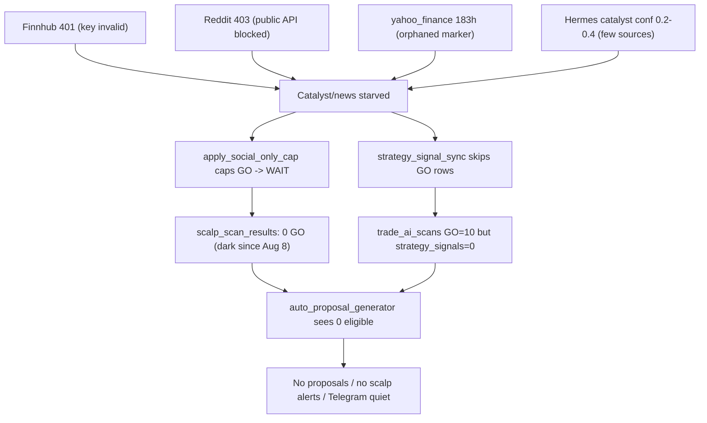

# Day-Scalp Pipeline Outage — Root Cause & Remediation Plan (2026-08-19)

**Status:** Implemented + unit-tested + dry-tested. See fixes/actions log:
`docs/incidents/DAY_SCALP_PIPELINE_FIXES_2026-08-19.md`.
**Owner:** John (operator) + agent.
**Related inventory:** `docs/diligence/current/DAY_SCALP_SOURCE_INVENTORY_2026-08-19.md`.

---

## 1. Summary

Since ~Aug 17 the day-scalp lead pipeline went quiet: no new `strategy_signals`, no
`auto_proposal_generator` output, Telegram scalp alerts dark, and health findings firing for
`social_data_stale` (228h), `finnhub` 401, `yahoo_finance` 183h, and `scalp_catalyst_verification_dead`.

These are **not independent failures** — they are one cascade down the lead chain:
**sources → catalyst verification → GO promotion → `strategy_signals` → proposals**.

---

## 2. Root cause per lane

### 2.1 Finviz handoff — `strategy_signal_sync` CRITICAL, `inserted: 0`
- GO rows **do** exist in `trade_ai_scans` (scanner reports `go=10`), so scanning is healthy.
- `scripts/strategy_signal_sync.py` finds them but skips 5–10/cycle with `invalid_plans: 0`,
  `signals_before: 0`, `signals_after: 0`. Duplicates are ruled out (0 existing signals), so the
  skip is almost certainly the **live-price drift gate** at
  `scripts/strategy_signal_sync.py:358-375`: `get_best_quote()` (Alpaca real-time) drifts >3% from the
  Finviz screener `price` on gap names, rejecting every gapper.
- **Confirm before fixing:** run `strategy_signal_sync.py --dry-run --today` and capture the exact
  `reason` string (price_drift vs route-enforcement vs duplicate).

### 2.2 Social sentiment — dead, and Hermes is not a producer
- `social_sentiment_history` has exactly one writer — `scripts/aegis_social_sentiment.py` — which uses
  Reddit public JSON (now `403` on every sub) + Brave (`0 discovered`). It persists `0` records.
- **Hermes does not write `social_sentiment_history` at all.** It only contributes
  `hermes_catalyst_confirmed` via `hermes_momentum_catalyst_researcher.py`. The expectation that social
  sentiment "should also come from Hermes" is correct — that producer does not exist yet.
- `social_ingest.py` (StockTwits → `social_posts`) still works, but that is a **different table** the
  health check does not read.

### 2.3 Web lane — `yahoo_finance` 183h stale
- **Monitoring false-positive + dead fallback.** `report_source("yahoo_finance", ...)` only fires inside
  `ingest_yfinance_quotes()` (`scripts/external_market_data_ingest.py:115-120`), a last-resort fallback.
  Alpaca prices the whole universe, so yfinance never runs, its marker is never refreshed, and it
  reports stale. `market_quotes` are actually fresh via Alpaca.
- `finnhub` 401 is a genuine key rotation (separate, operator action).

### 2.4 `daily_incubator_refresh.py` — commit crash
- Refreshes 2,060 incubator entries then dies at `conn.commit()` with
  `psycopg2.InterfaceError: connection already closed`, after a catalyst-refresh loop closes the
  connection (`SSL connection has been closed unexpectedly` → `cursor already closed`).

### 2.5 Auto-fix stuck (masking, not absent)
- `scripts/remediate_scalp_go_dark.py` is running (204 cycles) but classified the problem as
  `low_max_score_regime` and hit the `fail_count >= 4` unconditional hold, so it stopped trying even
  though the real cause is feed starvation.

---

## 3. Remediation plan

### Phase 0 — Confirm the Finviz handoff skip reason (read-only)
- Run `strategy_signal_sync.py --dry-run --today`; capture exact `reason` strings.
- Confirmed reason determines Phase 2 scope.

### Phase 1 — Fix the sources (foundation)
- **Finnhub:** rotate `FINNHUB_API_KEY` (operator runbook). Fix the wrong auto-retry mapping so
  remediation actually targets the Finnhub producer.
- **yahoo_finance false-stale:** make `report_source("yahoo_finance", ...)` report
  "healthy/covered-by-alpaca" when Alpaca prices the full universe, instead of leaving the marker
  orphaned (or mark yahoo_finance non-required).
- **Reddit 403:** replace the unauthenticated Reddit JSON path in `aegis_social_sentiment.py` with a
  working source (StockTwits already works + Brave), and stop relying solely on Reddit.

### Phase 2 — Restore catalyst verification and GO handoff
- **Add a Hermes producer for `social_sentiment_history`** (explicit ask). New write path (or extend
  `hermes_momentum_catalyst_researcher` / `aegis_social_sentiment`) so Hermes contributes sentiment
  records alongside the social feed. Optionally add a SearXNG forum/social search lane to Hermes (it
  currently searches news-only; see inventory §D).
- **Fix the signal_sync drift gate:** gap-aware tolerance, or compare against the same snapshot source
  for premarket gap names, so legitimate GO setups are not rejected for a premarket gap.
- **Re-examine `apply_social_only_cap`** so a degraded (not absent) catalyst feed does not silently cap
  everything to WAIT — surface "unverified" as an explicit state rather than silently suppressing.

### Phase 3 — Fix the incubator crash
- Fix connection lifecycle in `daily_incubator_refresh.py`: reopen the DB connection after the
  catalyst-refresh loop (or stop reusing a closed cursor) so the daily rollup commits cleanly.

### Phase 4 — Self-healing / auto-fix
- Unstick `remediate_scalp_go_dark.py`: detect feed starvation (news/social/finnhub stale) and escalate
  to the source-fix ladder instead of holding on `low_max_score_regime`.
- Wire `social_data_stale` and `data_source_stale` to auto-remediation commands (re-run producers);
  keep `data_source_auth_failed` as operator action (401/403 cannot self-heal).
- Repair orphaned `data_source_health` rows so liveness markers reflect reality.

### Phase 5 — Verify, document, ship
- Dry-test each fix before full apply; confirm GO rows flow to `strategy_signals` → proposals.
- Update docs/CHANGELOG, sync docs to Google Drive, commit, push.
